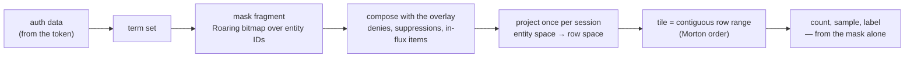

# The Tessera design corpus

A permission-masked point service: an interactive, pannable and zoomable map over a large document
corpus, where **what a viewer may see determines not just which items they retrieve, but every
count, density, cluster and summary they are shown**.

*A tessera is a single tile of a mosaic, and — in Rome — a token presented to be recognised and
admitted. Both readings apply: the unit of storage is a tile, the unit of access is a token, and
every viewer assembles a different mosaic from the same tiles without any of them seeing the whole
picture.*

## The problem, and the claim

Every surveyed system with per-document security permits aggregates over records the viewer cannot
read — documented as a limitation by one vendor, shipped as a feature by another, and demonstrable
through query plans in a third. The field draws its line at *retrieval* and lets everything derived
leak past it.

Tessera moves the line. A viewer's visible set is materialised once per session as a Roaring
bitmap, and every spatial query, count, density, sample and label decision is computed from that
set alone. Geometry is stored in Morton order, so a quadtree tile is a contiguous range of row IDs
— which makes an exact masked count bitmap arithmetic rather than a scan.

**It answers how many, where, whether, and which examples — over exactly what a given viewer may
see.** It is a counting engine, not a general aggregation engine, and an index rather than a
database.

The two ID spaces are the load-bearing idea. Permissions live in **entity space**; geometry lives
in **row space**; they are related only by an explicit permutation. Nothing derives an aggregate by
any other route, which is what makes the guarantee structural rather than a matter of discipline.

## Reading order

**Start with [`architecture.md`](architecture.md) §2.6**, which walks one request end to end and
points at the section governing each step. Then §4, the thirteen invariants — they are the
specification, and most of the rest exists to uphold them.

Then, depending on what you are after:

- **What may leak, and what is accepted.** `architecture.md` Appendix C. It is exhaustive by
  construction: a disclosure not in that table is a bug, not an omission. That exhaustiveness
  depends on the query surface staying small, which is why it does.
- **How it is built.** [`system-architecture.md`](system-architecture.md) — processes, planes,
  crate decomposition, the operational lifecycle, configuration and packaging.
- **What the bytes are.** [`contracts.md`](contracts.md) — bundle format, service API, plugin ABI,
  wire format. A contract exists here only where a second reader exists.
- **How concurrency and deletion work.** [`concurrency-lifecycle.md`](concurrency-lifecycle.md) —
  generations, retention, the removal rules (Rule S / Rule F), the write-ahead log — and
  [`write-path.md`](write-path.md) for the write path end to end.
- **What a per-item field is, and where it lives.** [`records-and-search.md`](records-and-search.md)
  — the five families, the `type`/`render`/`index`/`multi` declaration, and the rule that every
  declared field has exactly one home: the hot column, its family's entity-space structure, or the
  record blob. [`per-point-attributes.md`](per-point-attributes.md) owns the category, its
  vocabulary and its disclosure controls, and [`value-suggestion.md`](value-suggestion.md) is the
  typeahead over one: what a viewer typing into a category filter may be offered, how a prefix
  becomes a range of a mapped index, and why the time that walk takes is a registered disclosure.
  ⊘ None of that surface is built.
- **How a build is declared.** [`configuration.md`](configuration.md) — one file declaring the
  corpus, its views, its vocabularies, its attributes and its layers, compiled into the manifest.
  Its §1 enumerates the whole surface, which is a **closed** set: a key it does not name does not
  exist. Its §3 is the three-file split: the declaration, the deployment's own `tessera.toml` (found
  by walking up, read by `build` and `serve` alike), and the identity key in the environment — so
  `tessera build` and `tessera serve` are the whole invocation and every flag is an override. ⊘ Two
  gaps, both refused rather than ignored: a `fields` map is validated and cannot yet *move* a field,
  the input readers resolving the canonical names; and a point's labels must come from a `source`,
  the list-valued access column and the reserved term a `default` resolves to being unwritten.
- **How filtering works.** [`filter-index.md`](filter-index.md) for the attribute artefact the
  operands read, and [`filter-surface.md`](filter-surface.md) for what a query does with it. Both are
  provisional, and **every shipped family is built** end to end — value column and masked scan for
  categories, strings and numerics, boolean composition (decision 0062), the viewport operand, the
  per-flush extent with its coalesce and the fold's attribute pass, and a conformance differential
  that covers I12's mask half. **Text joined them** — a token index, `match`, and a fold that merges
  its layers. Lists are not. A **drawn** region — a box or a lasso — is a filter leaf like any
  other, and [`selection-operand.md`](selection-operand.md) is how: the shape decomposed against the
  Morton cells so the interior is bitmap arithmetic and only the boundary takes a per-point test.
  Provisional, nothing built, three rulings open.
- **What an artifact's shape is.** [`artifact-shapes.md`](artifact-shapes.md) — the `hull` a viewer
  is served: which geometric family it belongs to, how its α is derived rather than dialled, why a
  membership that is several separated clouds is served as several rings, and who chooses.
  Normative; all six rulings are settled and built.
- **How any of it is checked.** [`conformance.md`](conformance.md) for the invariants and the leak
  register; [`correctness-suite.md`](correctness-suite.md) for whether the data itself is right —
  every stage from build to the fold, every column family in each of its three homes, a read
  battery after every stage, and the sizes, endurance runs and server profiles each is exercised
  at. Provisional, and almost none of it is built.
- **How fast it is, and how that is known.** [`measurement.md`](measurement.md) owns the benchmark
  suite's axes, denominators and reporting conventions;
  [`performance-suite.md`](performance-suite.md) applies them to the per-item surface — what the
  record blob, the row-space route and the keyword family must measure, and what fails when a
  budget is crossed.
- **How a client talks to it.** [`client-interaction.md`](client-interaction.md) and its children.
  A client written against the wire alone starts at [`client-obligations.md`](client-obligations.md)
  — the rules the server cannot enforce — with the API described in [`../openapi/`](../openapi/).

Supporting evidence — the prior-art survey behind "no existing technology can replace this build",
and the scaling analysis with its runnable models — is in [`../evidence/`](../evidence/).
Measurements are in [`../../probes/`](../../probes/). Settled decisions are in
[`../decisions/`](../decisions/).

## The documents

**Precedence.** `architecture.md` is the specification and wins every conflict.
`system-architecture.md` and the mechanism documents implement it and defer to it. Where
`contracts.md` and `system-architecture.md` differ, the eleven recorded deviations in contracts
§0.3 govern. A provisional document loses to a normative one. `§n` unprefixed means the
architecture design.

| Document | Standing | What it owns |
|---|---|---|
| [`architecture.md`](architecture.md) | Normative | The specification: data model, the thirteen invariants, the leak register |
| [`system-architecture.md`](system-architecture.md) | Normative | The built system: processes, planes, crates, lifecycle, config, packaging |
| [`contracts.md`](contracts.md) | Normative | Byte level: bundle format, service API, plugin ABI, wire |
| [`concurrency-lifecycle.md`](concurrency-lifecycle.md) | Normative | Generations, retention, the two removal rules, the WAL, merge versus snapshot |
| [`conformance.md`](conformance.md) | Normative | The suite: the definitions-oracle, canaries, the byte-scanner, interleavings |
| [`client-interaction.md`](client-interaction.md) | Provisional | What a client is: holdings, version coordinates, display obligations, protocol |
| [`client-architecture.md`](client-architecture.md) | Provisional | The client/vis boundary rule, the driver as an explicit state machine, the replica's API and frame composition on the tile grid. Driver built; §6's migration half done, finished by `client-components.md` |
| [`client-components.md`](client-components.md) | Provisional r5 | The client stack organised by four customers: the wire as C3's product, the headless store as C2's, the `<tessera-explorer>` composite and its pieces as C1's, the demo and the `tesseradb` widget as C4's — six packages, two count types, a token-and-parts-and-slots styling contract, token-as-message custody. **Built through §9's six steps** (see ../client-delivery.md); r5 records what the building changed. The rulings of §11 are decisions 0095–0102 |
| [`client-obligations.md`](client-obligations.md) | Provisional | The twelve rules a client keeps because the server cannot — display states, both figures or neither, staleness on the content key, masked counts are never sizes, absence carries no reason, the artifact channel, `k` on zoom, `u64` ids, the six proxied headers, the 401/403 split, depth as the client's choice with its formula stated — each with what goes wrong on the screen if it is broken |
| [`python-sdk.md`](python-sdk.md) | **Provisional — under review** | The `tesseradb` package: a database is a directory; `declare_*` takes no data, `insert(target, table, **columns)` names every column it reads, `commit()` sends and forgets, the first commit a build and every later one ingest (decision 0091 as an API); the local instance as a child process; `map()`, `viewer(terms)` and `connect()` over the widget; hosted read only. Built through every stage; rulings in §11 |
| [`caching.md`](caching.md) | Provisional | Where data rests and what that costs — caching as feasibility, not optimisation |
| [`delta-serving.md`](delta-serving.md) | Provisional | What a client may declare it holds, and what that lets the server omit, skip or elide |
| [`artifact-fetch-protocol.md`](artifact-fetch-protocol.md) | **Proposal** | How a client asks for artifacts: the scope and filter axes, the row/column rule that declined the cache claim, the opt-in projection, the fetch model as client policy, and what the client, the server and an API user each owe — shape ruled 2026-08-28, **§5.2, §5.3 and §8's encodings are not built** |
| [`views.md`](views.md) | Normative | Views and view groups, r6: named coordinate systems over one entity space, groups whose views are created at a running service, views shared between groups, and attribute/layer scope. Signature grouping stays in the deferred sketch. Reviewed and promoted 2026-08-30; §11 lists the fold-in owed, and the allocation key (§7) is the one open proposal. Operator-facing walkthrough: [`../guides/views.md`](../guides/views.md) |
| [`view-switching.md`](view-switching.md) | Provisional r2 | How the client holds and switches between views: one store with a replica, presenter and channel per view under one byte budget, a switch as a pointer change with no request from a non-current view, the same camera within a group and a refit between frames, two drop-downs (`<tessera-view-picker>`, `<tessera-key-picker>`), animation as a client-side id join plus one proposed `positions` verb awaiting a ruling, no prefetching (owner direction 2026-09-01). Ready to build; V1–V2 in progress, V3 ⊘ |
| [`tile-addressed-integration.md`](tile-addressed-integration.md) | Provisional | Serving MapLibre, OpenLayers and QGIS by tile addressing |
| [`ingest.md`](ingest.md) | **Normative — 2026-09-07** | Live ingest for every kind of data under decisions 0134 and 0135: one model (a batch of records, applied monotonically, visible at the next flush tick), JSON by default with Arrow by content type, every cap a published pagination unit in records and bytes, no multi-part upload for any kind, the values kind and the four routes the build-only kinds lack, a level's row forms published at the tick, the throughput model per kind, the register consequence, the migration and the order of work. Promoted at r3 after three-lens review and one re-review; decision 0136 records the rulings; §8 is the order of work, nothing built yet |
| [`write-path.md`](write-path.md) | Normative | The write path end to end: ingest, the commit window, the WAL, flush, the deny lifecycle, merge, and where compaction will sit. Absorbed `flush-and-merge.md` (deleted 2026-08-04) and the write-path halves of the lifecycle and system-architecture designs; its §13 is the map of what moved |
| [`compaction.md`](compaction.md) | Normative | The fold: what retires at it, what it carries forward, the prefix rewrite and the `CURRENT` flip, reclamation, and the schedule that dispatches it. Answers write-path §8's obligation list, and is **built** — the deferred staging list (§6.2) and §6.1's two page-cache hints are what is not |
| [`sharding.md`](sharding.md) | Provisional | Epoch shards in one process: the entity space and the row space split per shard, so `RowId` stays `u32` past the allocator's ceiling. A point shard passes through open, sealed and dropped, and a freed slot anywhere is reused before one opens; an artifact shard is a layer incarnation, dropped whole at replacement. **Nothing in it is built**; seventeen rulings, eleven the owner's and six from the independent review of 2026-09-05, and a staged delivery, S1 through S7 |
| [`filter-index.md`](filter-index.md) | Provisional | The attribute artefact behind §8.2: a flat entity-indexed value column scanned under the candidate mask, with per-value Roaring postings derived over it for categories, and its build, ingest and fold lifecycle. **Built for every shipped family**, read path and write side alike, text included; lists are not, and are marked at each claim |
| [`filter-surface.md`](filter-surface.md) | Provisional | What a query does with that artefact: operand evaluation under the composed candidate, boolean composition, the entity→row step, and the counts a filter may produce. **Built** through `/v1/viewport`'s `filters` and `/v1/meta`'s operand list. §4's shared projection cache is superseded and retained only as a record |
| [`filter-result-cache.md`](filter-result-cache.md) | Provisional | An LRU over **top-level filter clause** results, keyed on the canonicalised clause, the asking principal's term set and the generation — the win being that a filter's result is viewport-independent, so a pan re-asks a question whose answer cannot have changed. The deny state is **subtracted per request rather than keyed**, which is what makes a forgotten step fail closed; an ingest does not invalidate, which rests on §5 of `filter-index.md`. **Nothing is built against it yet.** Not the superseded shared cache of `filter-surface.md` §4, and says where it differs |
| [`projections.md`](projections.md) | Normative | **What a view's numbers mean.** A view declares a projection from a closed set — `web_mercator`, `equirectangular` and its aliases, or `none` — states its extent in longitude and latitude, and the build and the write path both transform at the boundary through that one function. The frame is the projection's domain or a 2^k-aligned sub-square, snapped outward, normalised to the unit square with **y south** so a Web Mercator cell is an XYZ tile. Clipping is counted apart from clamping, having a separate cause; `/v1/meta` publishes the tile scheme a frame addresses, which is what decides whether a basemap can be drawn. **Built and promoted 2026-08-30**, both geographic corpora rebuilt on it |
| [`polygon-membership.md`](polygon-membership.md) | Normative | Shape membership — box, circle, ellipse and polygon, one semantics: the rows whose stored position is inside the shape, exactly, resolved at the flush before the generation publishes and never on a request. What a spatial layer declares, what is held and persisted, one drawn geometry per artifact of a declared kind, the region leaf's second spelling. **Built 2026-08-29** in four stages, and `wgs84` shapes with `projections.md`'s transform behind them — Overture's 625,754 division polygons are declared in longitude and latitude |
| [`selection-operand.md`](selection-operand.md) | Normative | The drawn region as a filter leaf: a box, circle, ellipse or polygon — or a published shape named by its id — decomposed against the Morton cells, so cells wholly inside the shape are whole row ranges and only the cells the boundary crosses take a per-point test under the mask; cost linear in the perimeter. Exact for the shape against the stored geometry, with a cover fallback past `max_region_cells` said in `x-tessera-region`. **Built 2026-08-29** (the shape work's stage 4); `POST /v1/region` and the runtime-artifact path stay unbuilt |
| [`records-and-search.md`](records-and-search.md) | Provisional | The general per-item data model: five type families (number, datetime, category, keyword, text), the `type`/`render`/`index`/`multi` declaration that replaced the placement set, the three-home storage rule with the record blob, the keyword and text index mechanisms, the icu4x analyser, staged masked scoring and phrase, and multi-valued fields. **Its first three epics are built** — the declaration, the record blob, the render-column route (§2, §3, §6.2), the keyword family in place of `utf8` (§4.3), and the text family end to end: the icu4x analyser, the token index through all three producers, and `match` (§4.4, decision 0070). Exact phrase, multi-value and scoring are not, in that order (§13). r7, reviewed, all rulings made (decisions 0067–0070) |
| [`build-column-extents.md`](build-column-extents.md) | Provisional | How the base build stores a string column no pass reads at an entity: decoded once in source order, written as record-blob extents under `.build-tmp/`, k-way merged into `attrs/record/` and tokenised from the extents, so no pass permutes those values through a mapping larger than memory. Taken by a `text` column and, since 2026-09-10, by any `keyword` or `utf8` the record blob alone reads — the route follows a column's readers, not its declared type. The blob's format and addressing are unchanged and the output is byte-identical to the arena build's |
| [`value-suggestion.md`](value-suggestion.md) | Normative (r2) | Typeahead over a category vocabulary: the new `suggest` verb, the declared prefix rule over keys, titles and word starts, and the per-request posting walk whose timing is accepted as C31. ⊘ Nothing built
| [`annotations.md`](annotations.md) | Normative | The annotation **model**: what an artifact, an edge and a layer are, and what governs whether one is served — one containment test plus one existence criterion, replacing three gates in two sections. Supersedes `derived-artifact-gating.md` (deleted 2026-08-15). Promoted 2026-08-16 with five ⊘ items open and allocated to stages |
| [`annotation-representation.md`](annotation-representation.md) | Normative | What the model is made of: membership in entity space on disk and row space at request time, addressing, the visibility predicate, the fold's artifact pass, and serving. Carries the measurement campaign and its three harness bugs as negative results. Built through the delivery record's stages; [`artifact-system.md`](artifact-system.md) describes what stands |
| [`dag-hierarchies.md`](dag-hierarchies.md) | Normative (r4) | The `dag` hierarchy kind — a child naming several parents, on the artifact row alone — and the rule that a withheld artifact is not in the viewer's tree; decisions 0117 and 0125. Built server-side 2026-09-01; rung 3 (MedCPT) declares it |
| [`annotation-write-cycle.md`](annotation-write-cycle.md) | Normative | How artifacts, levels and layers behave under write: their own operations, and what a point-side event obliges artifact-side. Normative for the annotation write cycle where the two documents above disagree with it; defers to `write-path.md` for the point side. Built through the delivery record's stages |
| [`artifact-shapes.md`](artifact-shapes.md) | Normative | Which geometric family a derived `hull` is, how its α is fixed, why several rings are carried, and who chooses. Measures the built shape against the alternatives on the real layer and finds that its limit is the **vertex budget**, not the construction, and that multi-modality is rare and mask-stable. **Built**; all six rulings are settled — the dig, several rings, no holes, α derived from the members, the layer author declaring, and a vertex budget that is a wire guard rather than a fidelity control |
| [`artifact-system.md`](artifact-system.md) | Descriptive | **Start here for artifacts**: what is actually built and how it works — the model, storage, serving routes, the client's view, and the couplings to build/ingest and the map lifecycle. Decides nothing; the normative documents above win |
| [`measurement.md`](measurement.md) | Provisional | What the suite measures and why: the axes, the denominators, the reporting conventions, and which figures may be published |
| [`performance-suite.md`](performance-suite.md) | Provisional | The per-item surface's performance suite: `records-and-search.md` §6.4's budget table as the index, the read and write arms that discharge it, layer count as an axis, and the gates. **Nothing in it is built**, and its audit finds two of §6.4's eleven rows carrying an engine-level figure, none carrying one at 10⁹ |
| [`correctness-suite.md`](correctness-suite.md) | Provisional | Whether the data is *right*, as distinct from whether the guarantees hold: the eight-stage sequence from build to the fold, the read battery that runs after every stage, the three-home reduction that makes the type axis finite, the endurance backstop (thousands of writes, 100+ folds) and the memory-constrained profile — over the generative corpus, total verification, stage invariance and the structural verifier that decide correctness. **Nothing in it is built** beyond the identity half of `tessera verify`; the seam it addresses is deep checks at 10⁴ against shallow ones at 10⁸ |
| [`core-access-expressions.md`](core-access-expressions.md) | Provisional — draft | Moving monotone AND/OR label semantics from the plugins into the core: the expression DAG, root-disjunct posting keys, the satisfaction pass, and the I5 rewording it would buy. **Nothing in it is built** and its §8 rulings are not yet sought |
| [`deferred-index-ordinal-split.md`](deferred-index-ordinal-split.md) | Deferred sketch | Splitting permanent identity from a renumberable index ordinal — **not approved**; its overlay question is open |
| [`deferred-signature-major-layout.md`](deferred-signature-major-layout.md) | Deferred sketch | Sorting rows by (signature, morton) — **not approved**; three inputs it needs do not exist |
| [`inventory.md`](inventory.md) | Generated | Every invariant and leak-register row, so a change to either is a one-line diff |

**Deferred sketch** means recorded so the option is not lost and its open problems are not
rediscovered — explicitly not a design, and not to be built from.

**Provisional** means code is already written against the document but it is not yet normative.
Each says in its first lines what remains before it becomes so. Read the `Status:` line before
trusting any document — location does not tell you standing.

## Specified, not implemented

The corpus specifies a target. The implementation is behind it in places, and **claims about
machinery that does not exist are marked ⊘ at the point they are made** — never only in a preamble.
[`inventory.md`](inventory.md) counts them per document.

Three of those gaps matter more than the rest, because a reader could otherwise take a security
property as delivered:

- **One of the two deny-retirement rules is unbuilt.** A suppression retires only when lifted, as
  specified (Rule S). Deletions and predicate changes retire only at the **compaction fold that
  executes them** (Rule F, write-path §5.4) — and there is no compaction, so they never retire.
  Safe today only because nothing retires at all, which is fail-closed but is not the mechanism.
  *(The deletion **stamp ledger** and its retirement floor earlier revisions specified are deleted
  from the spec, not deferred — owner-ruled 2026-08-03.)*
- **The conformance suite covers five of thirteen invariants as designed.** Two more are covered
  in substance but in Rust rather than the suite; six have no coverage, four of them for want of an
  implementation to test. None of the eight scripted interleavings exist. CI runs the suite and the
  rest of the gate per pull request; conformance §6's nightly and release tiers do not exist, and
  durability ordering is still not established end to end (#71).
- **I13b and I13c are unimplemented.** A partition not consulted must fail closed (I13b), and one
  unreachable through outage is an error rather than an empty contribution (I13c). There is one
  partition, no required-set gate and no test for either. They are lettered apart from I13a — which
  *is* enforced — precisely so that confirming one cannot be read as covering the others.

## What is settled

The core data model: entity space for permissions, row space for geometry, related by an explicit
permutation. Morton ranking, so tiles are contiguous ranges. Roaring masks built once per
authorisation and reused. Priority-based level of detail that nests across zoom and composes across
partitions. Containment-gated label serving. The two-mask split, so filters narrow points without
dissolving the map. Compartmented partitions with required-set gating. Rust throughout — serving
core and build pipeline, one binary.

## What was measured

Measurements are over a synthetic 10⁹ corpus; the verdict was go. The full records are in
[`../../probes/`](../../probes/), and any figure quoted from them should be re-run before it is
relied on.

The headline is the cost model everything else is designed against: **bitmap operations cost
O(containers touched), not O(cardinality)** — so contiguity in entity space is the highest-leverage
property in the index, which is why entity IDs are assigned in term-signature order and why that
assignment is permanent.

Three results are worth knowing because they are negative:

- **Masks do not cluster under Morton order** (run ratio 1.7–5.1). There is no hidden spatial
  upside; direct evaluation is the only selection route, and the precomputed alternative was
  declined.
- **A viewport costs 135–164 ms at 10⁹**, not the single-digit milliseconds first claimed, and
  selection is 83–89% of it. Cost tracks the number of *visible rows*, not the number of points
  returned.
- **Permission signatures collapse gradually, not cliff-wise** — the top 500 groups cover 82% on
  category-like policy and none of it on author-like — so signature-aligned layout stays a
  per-deployment decision rather than a general win.

Three of these depend on how a deployment's labels are actually distributed. Any deployment with
real labels should re-measure before relying on them.

## Two things not to lose

**The conformance suite is the deliverable.** The performance architecture is attractive and
separable, and a partial implementation that keeps the Morton and Roaring machinery while quietly
dropping I2, I7 or I13b passes every functional test while leaking through cluster existence and
density.

**The narrow query surface is a safety property, not a stage to grow out of.** Appendix C can be
exhaustive because the retrieval surface is about five shapes. A general expression endpoint cannot
be enumerated that way, and the prior-art survey is a catalogue of systems whose generality is
precisely where they leak. New capability enters through the filter contract in §8.2 — order-independent
set producers composed by intersection — so that expressiveness never reaches the authorisation layer.
