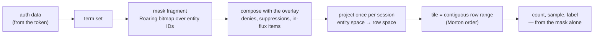

# The Tessera design corpus

A permission-masked point service: an interactive, pannable and zoomable map over a large document
corpus, where **what a viewer may see determines not just which items they retrieve, but every
count, density, cluster and summary they are shown**.

*A tessera is a single tile of a mosaic, and — in Rome — a token presented to be recognised and
admitted. Both readings apply: the unit of storage is a tile, the unit of access is a token, and
every viewer assembles a different mosaic from the same tiles without any of them seeing the whole
picture.*

## The problem, and the claim

Every surveyed system with per-document security permits aggregates over records the viewer cannot
read — documented as a limitation by one vendor, shipped as a feature by another, and demonstrable
through query plans in a third. The field draws its line at *retrieval* and lets everything derived
leak past it.

Tessera moves the line. A viewer's visible set is materialised once per session as a Roaring
bitmap, and every spatial query, count, density, sample and label decision is computed from that
set alone. Geometry is stored in Morton order, so a quadtree tile is a contiguous range of row IDs
— which makes an exact masked count bitmap arithmetic rather than a scan.

**It answers how many, where, whether, and which examples — over exactly what a given viewer may
see.** It is a counting engine, not a general aggregation engine, and an index rather than a
database.

The two ID spaces are the load-bearing idea. Permissions live in **entity space**; geometry lives
in **row space**; they are related only by an explicit permutation. Nothing derives an aggregate by
any other route, which is what makes the guarantee structural rather than a matter of discipline.

## Reading order

**Start with [`architecture.md`](architecture.md) §2.6**, which walks one request end to end and
points at the section governing each step. Then §4, the thirteen invariants — they are the
specification, and most of the rest exists to uphold them.

Then, depending on what you are after:

- **What may leak, and what is accepted.** `architecture.md` Appendix C. It is exhaustive by
  construction: a disclosure not in that table is a bug, not an omission. That exhaustiveness
  depends on the query surface staying small, which is why it does.
- **How it is built.** [`system-architecture.md`](system-architecture.md) — processes, planes,
  crate decomposition, the operational lifecycle, configuration and packaging.
- **What the bytes are.** [`contracts.md`](contracts.md) — bundle format, service API, plugin ABI,
  wire format. A contract exists here only where a second reader exists.
- **How concurrency and deletion work.** [`concurrency-lifecycle.md`](concurrency-lifecycle.md) —
  generations, retention, the removal rules (Rule S / Rule F), the write-ahead log — and
  [`write-path.md`](write-path.md) for the write path end to end.
- **What a per-item field is, and where it lives.** [`records-and-search.md`](records-and-search.md)
  — the five families, the `type`/`render`/`index`/`multi` declaration, and the rule that every
  declared field has exactly one home: the hot column, its family's entity-space structure, or the
  record blob. [`per-point-attributes.md`](per-point-attributes.md) owns the category, its
  vocabulary and its disclosure controls.
- **How filtering works.** [`filter-index.md`](filter-index.md) for the attribute artefact the
  operands read, and [`filter-surface.md`](filter-surface.md) for what a query does with it. Both are
  provisional, and **every shipped family is built** end to end — value column and masked scan for
  categories, strings and numerics, boolean composition (decision 0062), the viewport operand, the
  per-flush extent with its coalesce and the fold's attribute pass, and a conformance differential
  that covers I12's mask half. **Text joined them** — a token index, `match`, and a fold that merges
  its layers. Lists are not.
- **How any of it is checked.** [`conformance.md`](conformance.md).
- **How fast it is, and how that is known.** [`measurement.md`](measurement.md) owns the benchmark
  suite's axes, denominators and reporting conventions;
  [`performance-suite.md`](performance-suite.md) applies them to the per-item surface — what the
  record blob, the row-space route and the keyword family must measure, and what fails when a
  budget is crossed.
- **How a client talks to it.** [`client-interaction.md`](client-interaction.md) and its children.

Supporting evidence — the prior-art survey behind "no existing technology can replace this build",
and the scaling analysis with its runnable models — is in [`../evidence/`](../evidence/).
Measurements are in [`../../probes/`](../../probes/). Settled decisions are in
[`../decisions/`](../decisions/).

## The documents

**Precedence.** `architecture.md` is the specification and wins every conflict.
`system-architecture.md` and the mechanism documents implement it and defer to it. Where
`contracts.md` and `system-architecture.md` differ, the eleven recorded deviations in contracts
§0.3 govern. A provisional document loses to a normative one. `§n` unprefixed means the
architecture design.

| Document | Standing | What it owns |
|---|---|---|
| [`architecture.md`](architecture.md) | Normative | The specification: data model, the thirteen invariants, the leak register |
| [`system-architecture.md`](system-architecture.md) | Normative | The built system: processes, planes, crates, lifecycle, config, packaging |
| [`contracts.md`](contracts.md) | Normative | Byte level: bundle format, service API, plugin ABI, wire |
| [`concurrency-lifecycle.md`](concurrency-lifecycle.md) | Normative | Generations, retention, the two removal rules, the WAL, merge versus snapshot |
| [`conformance.md`](conformance.md) | Normative | The suite: the definitions-oracle, canaries, the byte-scanner, interleavings |
| [`client-interaction.md`](client-interaction.md) | Provisional | What a client is: holdings, version coordinates, display obligations, protocol |
| [`caching.md`](caching.md) | Provisional | Where data rests and what that costs — caching as feasibility, not optimisation |
| [`delta-serving.md`](delta-serving.md) | Provisional | What a client may declare it holds, and what that lets the server omit, skip or elide |
| [`derived-artifact-gating.md`](derived-artifact-gating.md) | Provisional | Non-point artifacts: clusters, labels, hulls, cells — one class, three gates |
| [`slices-and-multi-table.md`](slices-and-multi-table.md) | Provisional | Named orthogonal coordinate systems, and physical table shards |
| [`tile-addressed-integration.md`](tile-addressed-integration.md) | Provisional | Serving MapLibre, OpenLayers and QGIS by tile addressing |
| [`write-path.md`](write-path.md) | Normative | The write path end to end: ingest, the commit window, the WAL, flush, the deny lifecycle, merge, and where compaction will sit. Absorbed `flush-and-merge.md` (deleted 2026-08-04) and the write-path halves of the lifecycle and system-architecture designs; its §13 is the map of what moved |
| [`compaction.md`](compaction.md) | Normative | The fold: what retires at it, what it carries forward, the prefix rewrite and the `CURRENT` flip, reclamation, and the schedule that dispatches it. Answers write-path §8's obligation list, and is **built** — the deferred staging list (§6.2) and §6.1's two page-cache hints are what is not |
| [`filter-index.md`](filter-index.md) | Provisional | The attribute artefact behind §8.2: a flat entity-indexed value column scanned under the candidate mask, with per-value Roaring postings derived over it for categories, and its build, ingest and fold lifecycle. **Built for every shipped family**, read path and write side alike, text included; lists are not, and are marked at each claim |
| [`filter-surface.md`](filter-surface.md) | Provisional | What a query does with that artefact: operand evaluation under the composed candidate, boolean composition, the entity→row step, and the counts a filter may produce. **Built** through `/v1/viewport`'s `filters` and `/v1/meta`'s operand list. §4's shared projection cache is superseded and retained only as a record |
| [`records-and-search.md`](records-and-search.md) | Provisional | The general per-item data model: five type families (number, datetime, category, keyword, text), the `type`/`render`/`index`/`multi` declaration that replaced the placement set, the three-home storage rule with the record blob, the keyword and text index mechanisms, the icu4x analyser, staged masked scoring and phrase, and multi-valued fields. **Its first three epics are built** — the declaration, the record blob, the render-column route (§2, §3, §6.2), the keyword family in place of `utf8` (§4.3), and the text family end to end: the icu4x analyser, the token index through all three producers, and `match` (§4.4, decision 0070). Exact phrase, multi-value and scoring are not, in that order (§13). r7, reviewed, all rulings made (decisions 0067–0070) |
| [`measurement.md`](measurement.md) | Provisional | What the suite measures and why: the axes, the denominators, the reporting conventions, and which figures may be published |
| [`performance-suite.md`](performance-suite.md) | Provisional | The per-item surface's performance suite: `records-and-search.md` §6.4's budget table as the index, the read and write arms that discharge it, layer count as an axis, and the gates. **Nothing in it is built**, and its audit finds two of §6.4's eleven rows carrying an engine-level figure, none carrying one at 10⁹ |
| [`deferred-index-ordinal-split.md`](deferred-index-ordinal-split.md) | Deferred sketch | Splitting permanent identity from a renumberable index ordinal — **not approved**; its overlay question is open |
| [`deferred-signature-major-layout.md`](deferred-signature-major-layout.md) | Deferred sketch | Sorting rows by (signature, morton) — **not approved**; three inputs it needs do not exist |
| [`inventory.md`](inventory.md)(inventory.md) | Generated | Every invariant and leak-register row, so a change to either is a one-line diff |

**Deferred sketch** means recorded so the option is not lost and its open problems are not
rediscovered — explicitly not a design, and not to be built from.

**Provisional** means code is already written against the document but it is not yet normative.
Each says in its first lines what remains before it becomes so. Read the `Status:` line before
trusting any document — location does not tell you standing.

Revision numbers are deliberately not listed here. They live in each document's `Status:` line and
are collected in the generated [`inventory.md`](inventory.md); a second hand-maintained copy would
go stale, and did.

Every document carries its review trail in an Appendix R. Read it before re-opening a decision;
most obvious objections have been raised and answered there, and the trail records which of them
were wrong.

## Specified, not implemented

The corpus specifies a target. The implementation is behind it in places, and **claims about
machinery that does not exist are marked ⊘ at the point they are made** — never only in a preamble.
[`inventory.md`](inventory.md) counts them per document.

Three of those gaps matter more than the rest, because a reader could otherwise take a security
property as delivered:

- **One of the two deny-retirement rules is unbuilt.** A suppression retires only when lifted, as
  specified (Rule S). Deletions and predicate changes retire only at the **compaction fold that
  executes them** (Rule F, write-path §5.4) — and there is no compaction, so they never retire.
  Safe today only because nothing retires at all, which is fail-closed but is not the mechanism.
  *(The deletion **stamp ledger** and its retirement floor earlier revisions specified are deleted
  from the spec, not deferred — owner-ruled 2026-08-03.)*
- **The conformance suite covers five of thirteen invariants as designed.** Two more are covered
  in substance but in Rust rather than the suite; six have no coverage, four of them for want of an
  implementation to test. None of the eight scripted interleavings exist. CI runs the suite and the
  rest of the gate per pull request; conformance §6's nightly and release tiers do not exist, and
  durability ordering is still not established end to end (#71).
- **I13b and I13c are unimplemented.** A partition not consulted must fail closed (I13b), and one
  unreachable through outage is an error rather than an empty contribution (I13c). There is one
  partition, no required-set gate and no test for either. They are lettered apart from I13a — which
  *is* enforced — precisely so that confirming one cannot be read as covering the others.

## What is settled

The core data model: entity space for permissions, row space for geometry, related by an explicit
permutation. Morton ranking, so tiles are contiguous ranges. Roaring masks built once per
authorisation and reused. Priority-based level of detail that nests across zoom and composes across
partitions. Containment-gated label serving. The two-mask split, so filters narrow points without
dissolving the map. Compartmented partitions with required-set gating. Rust throughout — serving
core and build pipeline, one binary.

## What was measured

Measurements are over a synthetic 10⁹ corpus; the verdict was go. The full records are in
[`../../probes/`](../../probes/), and any figure quoted from them should be re-run before it is
relied on.

The headline is the cost model everything else is designed against: **bitmap operations cost
O(containers touched), not O(cardinality)** — so contiguity in entity space is the highest-leverage
property in the index, which is why entity IDs are assigned in term-signature order and why that
assignment is permanent.

Three results are worth knowing because they are negative:

- **Masks do not cluster under Morton order** (run ratio 1.7–5.1). There is no hidden spatial
  upside; direct evaluation is the only selection route, and the precomputed alternative was
  declined.
- **A viewport costs 135–164 ms at 10⁹**, not the single-digit milliseconds first claimed, and
  selection is 83–89% of it. Cost tracks the number of *visible rows*, not the number of points
  returned.
- **Permission signatures collapse gradually, not cliff-wise** — the top 500 groups cover 82% on
  category-like policy and none of it on author-like — so signature-aligned layout stays a
  per-deployment decision rather than a general win.

Three of these depend on how a deployment's labels are actually distributed. Any deployment with
real labels should re-measure before relying on them.

## Two things not to lose

**The conformance suite is the deliverable.** The performance architecture is attractive and
separable, and a partial implementation that keeps the Morton and Roaring machinery while quietly
dropping I2, I7 or I13b passes every functional test while leaking through cluster existence and
density.

**The narrow query surface is a safety property, not a stage to grow out of.** Appendix C can be
exhaustive because the retrieval surface is about five shapes. A general expression endpoint cannot
be enumerated that way, and the prior-art survey is a catalogue of systems whose generality is
precisely where they leak. New capability enters through the filter contract in §8.2 — order-independent
set producers composed by intersection — so that expressiveness never reaches the authorisation layer.
