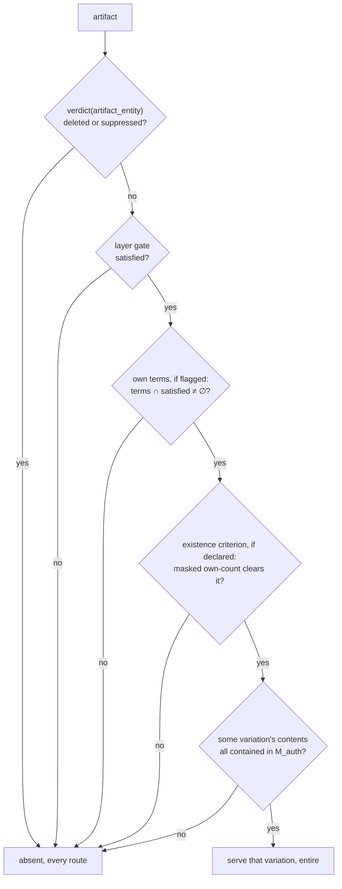

# Annotations — the representation

**Date:** 2026-08-15 · **Promoted:** 2026-08-16
**Status:** **Normative for the annotation representation** — what the model is made of: storage, addressing, the visibility predicate's evaluation, the fold's artifact pass, and serving. Reviewed under three lenses (Stage 0, 2026-08-15; the record is [`2026-08-15-artifact-design-review.md`](../evidence/memos/2026-08-15-artifact-design-review.md)) and ruled by decisions [0074](../decisions/0074-row-less-entities-are-allocated-downward.md)–[0083](../decisions/0083-the-frontier-is-a-request-time-budget.md). Companion to [`annotations.md`](annotations.md), which owns the *model*. The measurement campaign is run and reviewed ([`probes/2026-08-15-artifact-representation/`](../../probes/2026-08-15-artifact-representation/)); its three harness bugs are corrected in place and listed as negative results (§11.3). [`annotation-write-cycle.md`](annotation-write-cycle.md) supersedes the point-event halves of §5 and §5.0.3, and this document is corrected toward it. `architecture.md` remains the specification and wins every conflict.
**⊘ Four things are open inside a normative document**, marked at their sites and each due at the stage that needs it rather than held against promotion: search's containment gate (§8 — Stage 8), the filter axis (§6.3 — Stage 8), membership packaging (§2.4 — Stage 2, the one layout question the rulings did not settle), and the edit pass ([decision 0077](../decisions/0077-supplied-content-lives-in-the-record-blob.md) defers it — Stage 7). §11.3's unmeasured items are allocated to stages the same way; the fold's artifact pass is the largest of them and is Stage 4's first measurement, not its last.
**Why it is separate:** the model survived review under three lenses; the section that made it concrete did not. Three reviewers (2026-08-15) returned findings that clustered almost entirely on `annotations.md` §7 and §7.1 — a reuse claim asserting that artifacts are items and therefore inherit every entity-keyed structure. That section is withdrawn and replaced by this document. Keeping the model and the representation apart is what stops the next such finding invalidating both.
**Reads against:** design §4 (I1, I2, I5, I7, I9, I12), §5.1, §6.3, §7.1–§7.9, §10.4, Appendix A, Appendix C; [`filter-index.md`](filter-index.md) §2 (the measured constants this design turns on); [`write-path.md`](write-path.md) §5; [`slices-and-multi-table.md`](slices-and-multi-table.md) §3; [`compaction.md`](compaction.md); decisions [0028](../decisions/0028-postings-requirement-and-the-pair-relation.md), [0039](../decisions/0039-multi-valued-categoricals-are-slow-path-only.md), [0062](../decisions/0062-filters-compose-as-a-boolean-tree-inside-the-candidate.md), [0064](../decisions/0064-an-absent-number-is-a-presence-bitmap-beside-the-column.md).
**Citation convention:** unprefixed §n is the architecture design; `model §n` is `annotations.md`; this document's own sections are **spec §n**.

> **⊘ None of this is built.** No artifacts, no layers, no membership structure. Figures are marked
> *measured*, *modelled* or *assumed*; the campaign of §11 has now measured the ones that decide the
> design, and what remains unmeasured is named at each site.

---

## 1. The question this answers

The model says an artifact is an identity, a membership, a gate and content, grouped into layers
(model §2). It does not say what any of that is in memory, and the review found that the obvious
answer — put artifacts in entity space and inherit the point machinery — re-opens the deny lane, the
existence criterion and an I2 channel through routes nobody analysed.

Eight questions decide the representation. They are answered in order, and §2 decides the rest.

## 2. Storage: row space, and a cost crossover

> **Measured 2026-08-15, and corrected after review round two**
> ([`probes/2026-08-15-artifact-representation/`](../../probes/2026-08-15-artifact-representation/)).
> Real HDBSCAN over the real 2.42M arXiv UMAP corpus for the distributions, synthetic membership at
> 10⁷–10⁹ for the scales. **Three harness bugs were found in review, all reproduced, and one reversed
> a conclusion this section previously stated as measured.** Earlier revisions also reasoned about
> entity-space contiguity and reached the opposite storage conclusion; that reasoning is retained in
> §2.7 because it is what a reader arrives with.

**Artifact membership is one Roaring bitmap per artifact, in row space** — one implementation, ruled
(§2.0.0). The storage result is the campaign's solid finding and it holds two ways:
**28–118× smaller than entity space** on real membership through the real permutation (§2.1), and
**5.04× smaller than a dense assignment column** at 10⁹ with 10⁷ artifacts.

| Representation | Real corpus, 3 levels | 10⁹ rows, 10⁷ artifacts |
|---|---:|---:|
| **Row-space bitmaps** | **0.185 MB** | **794 MB** |
| Dense column | 9.69 MB | 4 000 MB |
| Partial-presence column | 7.54 MB | — |
| Entity-space bitmaps | 8.35 MB | — |

**Every figure in this table is serialised bytes.** Resident cost is a separate measured quantity —
~80–94 B per Roaring container, so **6.16× these numbers on contiguous membership and 7.79× on the
synthetic arm** (§11.3, and the [probe](../../probes/2026-08-16-membership-residency/README.md)).
The 794 MB above is therefore ~4.9–6.2 GB in memory, before the per-slice and per-level multipliers.

**Size per member, not per artifact.** An earlier revision read three scale points as *"~80 bytes per
artifact, flat"* and built the formula `(rows × width)/(80 × artifacts)` on it. All three held
`rows/artifacts = 100`; off that ray the rule collapses — 631 B/artifact at 10⁸/10⁵, 4 775 at 10⁹/10⁵ —
and the formula underestimated a coarse level's storage by about 60×. The scale-free quantity is
**bytes per member**: *measured* 0.61–1.03 on the pessimistic synthetic arm, 0.006–0.073 on **real**
membership, against a 2 B/member array-container ceiling. **Size from ~1 B/member and treat it as
conservative.**

### 2.0.0 The count cost crosses over, and one implementation is chosen anyway

**Row-space bitmaps are the only implementation** *(owner ruling, 2026-08-15)*. The measurement below
says the column wins in one regime; the ruling is that the regime is not one this system serves.

**First, the correction, because an earlier revision claimed there was no contest.** It asserted the
bitmap route was *"faster at every viewport size"* and *"120×, structural rather than a constant a
better column implementation recovers"*, and deleted the column on that basis. **The measurement
behind it was an artifact of the generator's layout** — artifacts laid down in Zipf-rank order along
the row axis, so every narrow viewport fell inside one giant and held a handful of artifacts. Against
this campaign's own **real** Tier A assignment, a window holds **1.1–1.7× (window fraction × artifact
count)**. Corrected:

| | fine level, 10⁷ artifacts | coarse level, 10⁵ artifacts |
|---|---|---|
| 100% viewport | **column** wins 3.2× | **bitmaps** win 4.4× |
| 10% viewport | **column** wins 3.9× | **bitmaps** win 3.1× |
| 1% viewport | **column** wins 1.9× | **bitmaps** win 3.2× |

**The two costs track different quantities** — per-artifact tracks *artifacts in range*, the column
tracks *visible rows* — and at 1% of 10⁹ under a 25% grant the crossover sits at roughly **19 000
artifacts in range** (*modelled* from the measured per-artifact and per-row constants).

**The ruling holds because the column's regime is past the point of rendering anything.** Nineteen
thousand artifacts in one viewport is already more than a client can draw; the fine-level case where
the column wins puts **~10⁵** in a 1% window. A request in that regime is one of two things: a client
asking for a level the zoom-to-level map should have steered away from (§6.3), or a request that will
be refused on its artifact ceiling regardless of which structure would have answered it faster.
**Optimising the route for a regime whose output is unservable buys nothing**, and it costs a second
representation, a second write path and a second set of invariants to keep aligned.

**What is accepted, named rather than hidden:** a caller who does serve a fine level over a wide
viewport pays **2–4× more** than a column would. That is a real cost in a real configuration, and the
column stays documented in §2.7 so the alternative is recoverable rather than rediscovered.

**Two caveats on the comparison itself, both pushing the same way**: the column arm is optimistic (it
indexes by row, where a real entity-indexed column needs a `row-entity` lookup first), and the
per-artifact arm is optimistic too (candidacy is computed outside the timed region, over a structure
this campaign never built or priced). The margin is narrow enough that neither is negligible, which is
a further reason not to build both and try to choose between them per level.

**What is unaffected:** §2.1's row-versus-entity result, measured on real membership and the finding
the rest of this document rests on; and §8's session-resolution cost, which is the whole-plane row and
is layout-independent.

### 2.0 Three sources of membership, and what event changes each

**Membership is not always a stored set, and the distinction is a *lifecycle* one before it is a
storage one** (owner, 2026-08-15). Earlier revisions of this document assumed all membership was
declared and frozen, which is true of a clustering and false of everything geometric.

| Source | Changes when | Stored as | Masked count |
|---|---|---|---|
| **Enumerated** — the caller declares the members | the layer is **refreshed** (⊘ by replacement today, by edit once that pass lands — [decision 0081](../decisions/0081-a-replacement-mints-identities-an-edit-keeps-them.md)) | a row-space bitmap, ~1 B/member (§2) | one `and_cardinality` |
| **Spatial predicate** — *"the points inside this shape"* | **a point is written** | the **geometry only**; row ranges derived | `range_cardinality` over its ranges |
| **Attribute predicate** — *"the points carrying this value"* | **a point is written** | nothing new — the existing value column and postings | the existing filter machinery |

**A density cell is the spatial row at its cheapest, not a fourth source** *(owner, 2026-08-15)*. A
Morton cell is a shape, its members are the points inside it, and it changes when a point is
written — the spatial row exactly. What is special is only how cheaply the shape resolves: an
aligned cell is one contiguous range rather than a decomposition, and the shape is implied by the
cell's own identity so nothing is stored. That is a property of *this* shape, not a different kind
of membership.

**A spatial predicate needs no membership storage at all.** A tile is a contiguous row range, so a
bounding box is a small set of row ranges and a polygon decomposes into Morton cells the same way —
which is §10's density-level shortcut arriving for a second kind of artifact. The count is
`range_cardinality`, the cheapest operation in the system, and it touches no point data.

**And it never goes stale.** This is the asymmetry that matters and it corrects a claim made
elsewhere in this document: a newly ingested point inside a boundary is a member **immediately**,
where a newly ingested point near a cluster is in no cluster until the layer is refreshed
(§2.2.1). Boundaries stay current; clusterings do not. A deployment mixing both should expect them to
age differently and should not be surprised by it.

**The perimeter cost of §2.6 is intrinsic to the shape and merely moves.** An enumerated corridor pays
it in bytes — 0.061 B/member, 1.9× the compact case. The same corridor as a predicate pays nothing in
bytes and pays instead in *ranges per query*, which is the same perimeter-driven number — ~10³ ranges
for a 40 000-member corridor, so **~0.3–1.2 ms per artifact per request** (*modelled* on the measured
`range_cardinality` unit). ⊘ **A predicate level therefore needs a per-request bound**, which this
document does not specify: a nationwide boundary level evaluated per query is seconds. Neither
representation escapes the geometry; they differ in whether the cost is paid at rest or at read.

**Nothing above changes the model.** The own-terms flag, the existence criterion, the containment
test and the count rule are indifferent to where membership came from (model §3–§5) — ⊘ except
that a proportional criterion has no denominator for predicate membership, an open owner rule
(model §5). What changes is §5's lifecycle, where
"ingest does not touch artifact membership" holds only for the enumerated row.

### 2.1 Why row space, measured

The same membership, the same library, the same corpus; only the id space differs:

| level | members | row space | entity space | ratio |
|---|---:|---:|---:|---:|
| L0 (8 clusters) | 1 934 209 | 0.011 MB | 1.279 MB | **118.5×** |
| L1 (111 clusters) | 1 857 630 | 0.042 MB | 3.267 MB | **77.9×** |
| L2 (884 clusters) | 1 824 800 | 0.132 MB | 3.801 MB | **28.7×** |

Row space is Morton rank, so a spatially coherent cluster is a few contiguous runs. Entity space is
term-signature order, uncorrelated with position, so the same set scatters across every container.
**The coarser the level the larger the win**, a coarse cluster being a longer run.

**Both operands are already row-space at request time**, the session's mask having been projected
once, so a masked count is `and_cardinality(rows(A), mask_rows)` — the operation the viewport already
performs.

**And candidacy stops being a build-time question, which closes a leak rather than an inefficiency.**
A tile is a contiguous row range, so *"does this artifact have visible members in this viewport"* is
`rows(A) ∩ tile_range ∩ mask_rows ≠ ∅`: masked, exact, cheap. The withdrawn draft pruned by a
build-time box over full membership and served wherever that box intersected, disclosing the unmasked
extent by panning. **The box is deleted, not repaired** — no representation here can express the
fault, which is a better outcome than a rule forbidding it.

**Disk holds the entity form, memory holds the row form.** Entity space is the canonical,
slice-invariant record; row space is per slice, derived, and rebuilt on the generation key exactly as
projected mask fragments already are. An ingest appends an extent rather than renumbering
([`permutation.rs`](../../crates/tessera-store/src/permutation.rs)), so an append invalidates
nothing — and the resident membership form is bounded at base rows, a member whose row is still in a
flush extent contributing nothing until the fold folds it, fail-closed
([`annotation-write-cycle.md`](annotation-write-cycle.md) §4.1). **The rebuild happens inside the fold rather than behind it** (§5.0.3) — a
fold renumbers row space globally, and `compaction.md` §6.2 rules stale-serve unsound for exactly this
class of artefact. ⊘ **The fold's artifact pass is unmeasured.**

### 2.2 The signature-sort tiebreak, measured and free

Entity ids are allocated `(signature, source_id)`, and §11.1 measures that minor key as worth nothing
— run lengths 1.00–1.26 against a 1.000 random baseline. Re-deriving the allocation as
`(signature, morton)` over the real corpus, with the real signatures and the real term structure:

| | `(signature, source_id)` | `(signature, morton)` | |
|---|---:|---:|---|
| artifact membership | 8.893 MB | **2.181 MB** | **4.08×** |
| term postings | 0.557 MB | 0.557 MB | **1.00× — unchanged** |

**The posting win is untouched byte for byte**, as the argument predicted: a term's postings are the
union of the signature groups carrying it, and each group stays a contiguous run whatever orders its
interior. §11.1's prohibition on Morton-ordered entity ids does not reach this — that forbids Morton
**rank** as the assignment scheme on permanence grounds, and the Morton **code** is fixed for an
item's life, so a comparison key renumbers nothing and leaves **I9** intact.

**What it is worth is bounded by §2.1.** 4.08× applies to the entity-space form, which row space
already beats by 28–118×. This is a disk-form and projection-input optimisation, not a request-path
one. It is free, and it is **permanent** — unretrofittable under I9, so it is decided before the
first build that writes artifacts or not at all. **Ruled and taken**
([decision 0073](../decisions/0073-entity-ties-are-ordered-by-morton-code.md)).

**There is only one entity ordering, so this is not an artifact-local decision.** Taking it for
artifact membership takes it for everything in entity space at once, and what else moves separates by
what a set correlates with: term postings and every mask built from them correlate with the
*signature* and are unchanged (measured 1.00×); artifact membership correlates with *position* and
gains 4.08×; and **nothing in row space moves at all** — the set of rows a principal can see is the
set of points they can see, which does not depend on how entities are numbered.

**The one core structure that also gains is the permutation, and there the result is arithmetic
rather than measurement.** Within a signature group, ordering entities by Morton code makes
`entity → row` monotone increasing *by construction*, so the run length is the signature group size
whatever the spatial correlation: **54 794 signatures over 2 422 486 entities puts the mean monotone
run at ~44, against ~1 today.** §5.1 names exactly this as the open question — the array is flat and
uncompressed *"precisely because entity order and row order are unrelated, making the values
maximum-entropy"*, and it points at
[`deferred-signature-major-layout.md`](deferred-signature-major-layout.md) as what *"would make it
near-monotone within groups and worth compressing"*. **That sketch is not approved and changes row
space; the tiebreak reaches the same precondition from the entity side and leaves row space
untouched.** ⊘ **What the compression is worth, and what piecewise-sorted input does to
`Permutation::project`, are unmeasured** — the campaign's fixtures were deleted before that arm ran
and the source parquets are not on this machine to rebuild them.

### 2.2.1 Across ingest

**The sort key is the Morton *code*, not the rank, and that is what makes ingest ordinary.** A code is
a function of an item's coordinates and the published quantisation bounds, computable the moment a row
arrives and fixed for its life. Nothing about it depends on what is already in the corpus, so a batch
can be ordered on arrival with no lookup, no global state and no renumbering — which is exactly the
distinction §11.1's prohibition turns on, and the reason it does not reach this.

**The scope, the decay and the lever are the signature sort's, unchanged.** Ordering is per commit
window; nothing repairs it afterwards, since a fold leaves the entity axis fixed; and fragmentation is
monotone in batch count. §11.1's threshold transfers verbatim — below a window of roughly 6×10⁴ there
is nothing to collect, because a batch narrower than a Roaring container has no container-level
structure to gain. **So the tiebreak adds no new operational constraint**: it is collected by the same
group-commit allocation, in the same proportion, and a deployment that forfeits the signature win by
trickling forfeits this one identically.

**The hot path does not inherit the decay, which bounds the concern.** Entity-space fragmentation
degrades the *disk* form and the projection's input. The resident form is row-space and is rebuilt at
every fold against freshly renumbered row IDs, so it is repaired on a cadence the entity axis never
gets. That is the same asymmetry §2.1 rests on, arriving in a second place.

**Ingest does not fragment *enumerated* artifact membership, because it does not touch it.** A
declared member set is frozen at declaration — I8's shape, stated in
[`annotation-write-cycle.md`](annotation-write-cycle.md) §3.1 — so a newly ingested point joins no cluster until
the layer is refreshed. Between refreshes it is uncovered — visible as a point, in no cluster —
which is the same shape as §7.6's labels going stale rather than unsafe, and which §7.7's extractive
tier already exists to cover. **For that class, what ingest adds is noise, not fragmentation.**

**Predicate membership is the opposite, and §2.0 is the section that says so.** A point written inside
a boundary is a member on the next request, with nothing rebuilt and nothing stale, because the
membership was never materialised. The tiebreak is irrelevant to it in both directions: there is no
entity-space set to compact, and no fragmentation to accumulate.

**One question this raises that the campaign did not, and it needs a ruling.** A point may belong to
several slices with independent coordinates, so *"the Morton code"* is not well defined for a
multi-slice corpus: an entity has one per slice, and an entity ID is allocated once. The tiebreak
therefore optimises **one** slice's spatial order, and a corpus with several slices collects it only
in whichever slice the ordering was taken from — the others are back to arbitrary. Options are a
declared primary slice, or the first slice an entity joins, and neither is obviously right. ⊘
**Undecided**; recorded in §12 beside the tiebreak itself, because taking the tiebreak without
answering it picks a slice by accident.

### 2.3 The ordinal space, and what survives of it

Ordinals remain **level-local over a contiguous entity run**, so the two addressing schemes convert
by arithmetic and a label pointing at cluster 18 of level 2 stores `(layer, level, ordinal)` with no
lookup table in either direction:

```
entity  = level.entity_base + ordinal        ordinal = entity − level.entity_base
```

**The address is unchanged by a layer having no levels** — a treed layer's level component is always
0 and one reserved entity run serves it (§6.2). The component stays in the address rather than
becoming conditional, so one form addresses every layer.

That is the answer to how artifacts address each other, and it is unaffected by the representation
result. **The width and 0-as-missing arguments do not survive it** — both were properties of the
assignment column, which is gone. They are recorded in §2.5 rather than deleted, because the column
is the obvious design and will be proposed again.

### 2.4 Where the metadata lives

```
artifacts/<layer>/
  registry.json                     # gate, structure, default cut depth, derived vocabulary,
                                    #   slices, declared levels, zoom→level map where levels exist
  levels/<k>/meta.json              # artifact count, entity_base, zoom range,
                                    #   membership source, containment verification result
  levels/<k>/members/<ordinal>.roaring   # enumerated membership, entity space (§2, §2.1)
  levels/<k>/geometry.arrow         # predicate membership: the shape only (§2.0)
  levels/<k>/artifacts.arrow        # per ordinal: content and variation references,
                                    #   optional caller stable key (§5.2)
  edges.arrow                       # (layer, level, ordinal) → (layer, level, ordinal)
```

✔ **An attachment travels in the attached artifact's own record, not in a file of its own** (built
2026-08-16). The edge is read on exactly the path that reads the artifact — the predicate tests
every attached artifact on its target's disposition and gate (§4) — so a separate file would be a
second read, and another manifest entry per publication, for a field the record is already being
decoded for. The address stored is the target's `(layer, level, ordinal)` with its **entity** beside
it, which is what makes the extra term one `verdict` lookup. `edges.arrow` as a general
many-edges-per-artifact structure is a shape for the tree work, not a layout: a level's lineage is
what Stage 5 puts there.

⊘ **One membership file per artifact does not survive the bundle's digest model, so the
`members/<ordinal>.roaring` line above is a shape, not a layout** (review 2026-08-15, verified
against the code). Every bundle file is a manifest entry, digested at write and parsed at open; at
10⁷ artifacts that is 10⁷ entries. The membership bytes are affordable — 794 MB *measured* (§2) —
and the packaging is not. ✔ **Ruled 2026-08-16 (owner): a packed extent per level per publication,
read normally into memory.** One file, addressed by dense ordinal, behind one manifest entry —
`tessera-store`'s `membership` module owns the addressing and holds each membership as an opaque
blob, so the bitmap library stays on one side of the boundary. Publication is append-only, so an
extent covers a contiguous ordinal range and disturbs no earlier one; a reader unions a level's
extents. The two alternatives were the record blob, whose compressed blocks would foreclose ever
using a membership in place, and a mapped form read where it lies — declined **for now** rather than
on the merits: it is the same file read differently, and the measured ~6× it saves is worth having
only at a cluster count three orders of magnitude beyond anything running
([the residency probe](../../probes/2026-08-16-membership-residency/README.md), §11.3).

**Supplied content itself is not here: it lives in the record blob — the store points use —
addressed at the artifact's own entity**
([decision 0077](../decisions/0077-supplied-content-lives-in-the-record-blob.md)). Two riders
travel with that. The blob addresses by rank in its **own** has-row bitmap — the bitmap of entities
that carry a record, which has nothing to do with row space — so an artifact having no row is
simply irrelevant to it; this is the one piece of the withdrawn reuse claim that survived review,
and the reason artifacts carry entity IDs at all. And living in the blob is a **storage fact with
no authorisation consequence**: *"entity-addressed, no `M_auth` involvement"* is true of the store
and must not be read as licence to serve what it returns — containment is evaluated by the serving
route against the composed mask, every request, cached nowhere; the blob's job is to hold bytes and
hand them back. The trap an implementer will meet here: an edit written as an **additional record
layer** serves the **pre-edit text, silently**, because the stack takes the first matching layer
and rests on layers being disjoint. ⊘ **How supplied content is edited is deferred to its own
design pass** *(owner, 2026-08-15)*; until it lands, republishing the layer is the only way to
change it, and the emergency withdrawal that exists is suppress, then republish (model §2.3).

**An artifact's unmasked own-count is deliberately not stored.** It is the obvious field to add and it
is C8: a corpus-wide count over items a principal may not see, one careless line from being served
beside a masked one. The proportional existence criterion
([decision 0075](../decisions/0075-the-masked-count-is-an-existence-criterion.md)) *reads* the
declared cardinality as a predicate input — the build computes it, the test consumes it, and no
field and no wire shape carries it, which is the guard that replaces "do not store it". **No
build-time box is stored either**, and that is a change from the withdrawn
draft rather than an omission: §2.1's row-space membership answers candidacy as a masked question, so
the one unmasked aggregate the design previously kept has nothing left to do. **The file set holds no
corpus-wide quantity at all**, which is a stronger position than justifying one.

### 2.6 The geographic stress test

The design was developed against an embedding map, where artifacts are HDBSCAN blobs. A geographic
deployment is the corpus's own named stretch (client-interaction §12), and it is adverse in three
specific ways.

**Shape sensitivity is real but modest — and an earlier revision reported it 12× too large.** That
revision published corridors and archipelagos at **56×** a compact blob, and the figure was
**a bug in the probe's own subsampler**: it held member count constant by decimating with a stride,
and a stride of two or more never keeps adjacent rows, so *runs == members* was forced for any
oversized shape. A compact disc put through the same path reported the identical degenerate
signature. Re-run at native density
([`probes/2026-08-15-artifact-representation/`](../../probes/2026-08-15-artifact-representation/)):

| shape | runs | B/member | vs compact |
|---|---:|---:|---:|
| disc, square | 318–361 | 0.033–0.037 | 1.0× |
| coastline (fractal boundary) | 456 | 0.045 | **1.4×** |
| corridor — river, road, coastal strip | 1 188 | 0.061 | **1.9×** |
| archipelago, 60 parts | 3 668 | 0.151 | **4.6×** |

**So geometry costs less than the design claimed, and the 2 B/member array-container ceiling is
arithmetic these shapes do not approach.** The honest worst case is not an elongated region but a
**scattered** one — a sparse subset of an area — which is real and was not measured.

**Public, enumerable nesting makes differencing arithmetic, and per-artifact absence does not close
it.** The retired `derived-artifact-gating.md` named this first: administrative geographies are the
textbook differencing vector *because* an attacker need not discover the structure first. A ward
below its existence criterion is absent, whole, and its district is served whole with its own exact
count (model §8.2) — but serving a district's count alongside all but one of its wards makes the
missing one a subtraction. The census answer is **complementary suppression**: withhold additional
cells — here, additional artifacts — so the residual cannot be recovered. **That is not in this
design**, it is materially more expensive than a per-cell criterion, and it is the one place the
geographic case needs machinery the semantic case does not. ⊘ **Unresolved**, and it belongs to
C1's outstanding review.

**Non-Morton grids lose the free-membership shortcut.** §10 notes that a Morton-cell density level
needs no stored membership, the cell being a prefix of the row id. H3, S2 and geohash cells are *not*
Morton prefixes, so a hex-grid level is an ordinary level with stored membership. A cost, not a
problem — but the shortcut is Morton-specific and should not be assumed for any grid.

**And geo makes two already-named gaps concrete rather than hypothetical.** Routes and corridors are
**ordered** subsets, which model §11 records as unhandled. Meanwhile a **geographic ACL** — *"analysts
may see data in their own region"* — makes the term signature correlate with position, which is the
condition under which §2.2's tiebreak pays most: signature groups become spatially coherent, and the
permutation approaches globally monotone rather than monotone in runs of ~44.

### 2.7 The reasoning this replaced, retained

Three arguments were load-bearing before the campaign and are now superseded. They are kept because
each is what a reader reasons to unaided, and the third was wrong in a way worth naming.

**The assignment column.** A partitioning level is a column, not a set of sets, and a column read
under the candidate needs no contiguity to be cheap. True, and it loses anyway: 5× larger at 10⁹ and
slower at every viewport, because its cost tracks visible rows where the alternative tracks artifacts
in range. Two corollaries died with it — reserving ordinal 0 for *no artifact* to escape the presence
bitmap and its rank, and narrowing the column to `u8`/`u16` by artifact count. Both were correct
about the column.

**The postings analogy.** Membership was taken to be the postings problem wanting the postings answer,
with the cure unavailable because §5.1's ordering is already spent. The premise was right and the
conclusion was a non-sequitur: entity-space contiguity was never the only contiguity available.

**The error under all three was reasoning in one id space.** Every sizing argument here was about
entity space, where a cluster genuinely does scatter — and the hot path was never going to be there.
The measured 28–118× is what that mistake cost, and it was not visible from inside the argument.

## 3. Reach is a build-time union, and it is not free

> **Corrected 2026-08-15 (review round two).** An earlier revision titled this *"reach costs nothing,
> because the scan already computes it"* and derived that from one pass over an assignment column —
> **a structure §2 deletes.** Two reviewers found the contradiction independently. The conclusion did
> not survive the representation it was built on, and this section states what reach actually costs.

*Reach* — a node's own members unioned with its descendants' — is admitted as a roll-up metric (owner,
2026-08-15) on the terms already settled: **never served**, the count and geometry beside an artifact
remain those of its **own declared membership**, and the pruning policy it feeds stays the caller's
declaration rather than something derived from containment (model §6.1).

**Under row-space bitmaps it is a materialised union per node, built at build time**, and it costs a
second membership structure of the same order — the subtree unions of a level sum to more than the
level itself, since a member appears in every ancestor's reach. ⊘ **Unmeasured**; the campaign sized
own-membership and never sized reach, so the ~80 B/artifact rule does **not** transfer to it.

**Pruning on reach stays lossless**, which is what the owner ruling turns on and which the
representation does not affect: `own(d) ⊆ reach(d) ⊆ reach(n)` for every descendant *d* of *n*, so a
failed reach bounds every descendant's own-count and nothing that would have passed is discarded.

**Two limits that the earlier framing hid:**

***Reach is undefined for predicate membership*** (§2.0). A boundary has no stored bitmap to union,
and unioning derived row ranges at build would freeze a membership whose whole property is that it
stays current. A level whose membership is a predicate therefore supports no reach and no
reach-pruning — its artifacts are tested individually, which is what §2's per-artifact route does
anyway.

***A materialised reach goes stale where own-membership does not.*** It is a build artifact over
enumerated membership, so it is refreshed at the same events (§5) and is exactly as current as the
clustering it summarises — which is fine, and worth saying only because the predicate row of §2.0
makes "stays current" a live property elsewhere in the same document.

**So reach is affordable but not free**, and whether to materialise it is a sizing question the
campaign did not answer. It belongs in §11.3's list of what was not settled.

## 4. Visibility: one predicate, evaluated on every route

The review's central finding was that visibility was defined twice — as a gate in the model, and as
`M_auth` membership in the withdrawn reuse level — and that every reuse route used the second. The
two are not the same, and one of the gaps is a fail-open.

**An artifact without own terms — a clustering's — appears in no posting and is never in `M_auth`**
(§6.3 builds the mask by unioning term postings and nothing else). Any route testing artifact
visibility by intersection with `M_auth` therefore answers *invisible* for every clustering artifact
and every viewer.

**And `M_auth` is where suppression acts.** A gate evaluated against the principal's satisfied term
set is the *pre-overlay* predicate; the artifact's own deleted/suppressed disposition is consulted
nowhere. Suppressing a cluster would leave it serving — members untouched, criterion still clearing —
which violates the standing rule that a suppression applies to every request the moment it is
accepted, and is the fail-open class the corpus has caught twice.

**One predicate, and the overlay comes first:**



*The overlay test is first and unconditional. `verdict` is the existing per-entity composition
(`deleted > suppressed > buffered`, write-path §5.3), single-sourced, so an artifact reaches it by
the same route a point does. The remaining branches are the conjuncts of the model's one existence
test (model §3, §5; decisions
[0075](../decisions/0075-the-masked-count-is-an-existence-criterion.md),
[0076](../decisions/0076-an-artifact-is-served-whole-or-not-at-all.md),
[0079](../decisions/0079-the-gate-is-one-flag-not-three-modes.md)): the own-terms flag and the
criterion are independent declarations, composed by conjunction and never disjunction, and a
failure anywhere is the same absence.*

**Every artifact-population route evaluates this predicate and no other** — the viewport, drill-down,
filters, search, edge traversal, metadata. Where a route cannot afford it, the route does not exist;
that is what §7 turns on.

**The predicate carries one term beyond the artifact's own, and omitting it is fail-open**
*(review, 2026-08-15)*. An artifact that exists only as an attachment to another — a toponymy label
on a cluster — is **also** tested on the `verdict` of what it attaches to. Without that term the
predicate is per-artifact by construction, so suppressing a cluster stops the *cluster* serving while
its labels go on serving on every route that does not traverse the edge: search, a held identifier, a
filter. Those labels name and describe the thing that was just hidden. The conjunctive rule the model
states for edge *traversal* does not reach them, because those routes never traverse the edge — they
reach the label directly. The term is one extra `verdict` lookup on the attachment target, on an
identifier the label already stores, and it is the same lookup the predicate's first branch already
performs. **The same argument covers the target's gate**, not only its deny state: a label must not
outlive the reachability of what it labels.

**Artifacts still get entity IDs**, because the deny lane, `tessera_id` and the overlay all address
by entity. What they do not get is membership in `M_auth`, or the assumption that a bitmap
intersection answers a visibility question. The reserved range is a **list** of 2¹⁶-aligned blocks,
not one block, and a run that fills is extended by appending the next block **downward** — the
artifact region grows from `u32::MAX` towards the points
([decision 0074](../decisions/0074-row-less-entities-are-allocated-downward.md)), so an appended
block can never interleave with a point segment: interleaving is unrepresentable under two regions,
not merely avoided. Each wholesale replacement consumes ~10⁷ IDs and any fixed block exhausts.

⊘ **Decision 0072 is settled and not built, and nothing in this document may assume it is in force**
([decision 0072](../decisions/0072-entity-ids-are-slots-and-are-reused-after-a-fold.md), marked per
[decision 0013](../decisions/0013-mark-specified-vs-implemented.md); review 2026-08-15, verified
against the code). The decision relaxes I9 — a slot returns to the allocator at the fold that
reconciles every durable structure naming it — but the allocator as built is monotone with no free
list, and `tessera_id` carries no generation field. Until it is built, exhaustion is permanent, and
the burn rate is a property of **replacement**, not of the model
([decision 0081](../decisions/0081-a-replacement-mints-identities-an-edit-keeps-them.md)): a
10⁷-artifact layer wholesale-replaced daily consumes the identifier space in about fourteen months,
after which **every write refuses, points included** — ⊘ replacement is the only refresh that
exists until the edit pass lands; an edit keeps identities and spends nothing. The refusal is
fail-closed and loud; what must not happen meanwhile is sizing or scheduling anything on the
assumption that IDs come back. The block list stands in either state: a layer publish needs a
contiguous run it can take at once.

**Where those runs come from is ruled**
*(owner, 2026-08-15, [decision 0074](../decisions/0074-row-less-entities-are-allocated-downward.md))*:
artifacts keep entity IDs, and **row-less entities are allocated downward from `u32::MAX`** while
points continue upward from 0; exhaustion is the two marks meeting. The hazard this dissolves: three
point-side structures are dense over entity *ranges* derived from **segment extents** — a flush or
merge extent's row table, a merge's per-entity slots, the fold's pre-flight budget — and an
artifact run sitting *between* two point segments that later merge would be a permanent hole every
straddling merge pays for in resident memory and every fold in its budget. An artifact appears in
no segment, so an ID above every point enters none of those spans and costs nothing, and two
regions make the interleaving unrepresentable rather than merely unlikely. The pattern is already
this repository's, in the ingest buffer's downward term-extension IDs. A downward allocator still
returns a contiguous run, so §2.3's ordinal arithmetic is untouched; what the decision adds is a
second durable mark, and the recovery obligation that goes with it — the restart seed derives from
ingest rows and overlay entries alone today, so an artifact allocation raises nothing, and a
rotation could otherwise re-issue its ID to a point.

## 5. Write, update, delete

**Two operations refresh a layer, and the difference between them is identity**
([decision 0081](../decisions/0081-a-replacement-mints-identities-an-edit-keeps-them.md)). An
**edit** updates existing artifacts — membership, content, gate — and everything survives:
identity, bookmarks, edges into them, and suppressions, because a suppression addresses an entity
and that entity is still there. A **replacement** creates a successor layer and drops the
predecessor, and **nothing carries across — correctly**: new identities are new objects, and
whether the new layer's "same" cluster is the same object is not something the service can know.
⊘ **Edit is deferred to its own design pass; replacement is the only operation that exists today**,
so until the edit pass lands a re-clustering does lose suppressions, edges and bookmarks, and
callers should be told so plainly rather than discovering it.

**Replacement is a layer lifecycle event, not 10⁷ deletions.** Pushing a replaced clustering
through the deny lane would deliver 20× the `overlay_soft_limit` (500,000, write-path §7) as a single
event, into a lane sized for trickle denies, retiring at a fold with no artifact pass. Instead, the
slice lifecycle applies unchanged ([`slices-and-multi-table.md`](slices-and-multi-table.md) §3 — ⊘
itself provisional and unbuilt, so this cites a shape, not machinery):
create is a WAL'd registry entry, drop is a WAL'd tombstone, the artifacts become garbage collected
at the next fold, and **the name stays tombstoned against reuse** — a recreated `clusters/2026-08`
with different membership would silently repoint every bookmark that named it.

| Event | Route | Retirement |
|---|---|---|
| New clustering | layer create; build writes its levels | — |
| Replace a clustering | create the successor, drop the predecessor | fold reclaims |
| Refresh a clustering in place | ⊘ **edit — deferred to its own design pass**; until then, replacement is the only route | — |
| Suppress one artifact | deny lane, by entity | Rule S — on unsuppress |
| Delete one artifact | deny lane, by entity | Rule F — at the fold that executes it |
| Analyst creates a selection | control verb (§5.1) | as above |
| A **point** is deleted | nothing for derived content; **supplied content is withheld at the deny's ack**, emergent from containment ([`annotation-write-cycle.md`](annotation-write-cycle.md) §3.2) | its membership bit goes at the fold; the fold reports, and executes the layer's strict/permissive declaration on the generating set |
| A **point** is ingested | nothing for enumerated membership; **predicate membership gains it immediately** (§2.0) | — |

The delete row is only half free. A deleted point drops out of every mask, so every masked count
falls immediately and correctly with no artifact-side work, and the **stale** structure — its
assignment slot, its membership bit — is cleaned at the fold's attribute pass, which already blanks
deleted entities per column ([`filter-index.md`](filter-index.md) §6.2). Supplied content gated on a
generating set is the write cycle's subject: withheld at the ack, emergent from containment, the
fold's role confined to executing the declaration and reporting
([`annotation-write-cycle.md`](annotation-write-cycle.md) §2–§4).

### 5.0 The unit of write is one artifact

**The unit of write is one artifact, and an earlier revision claimed otherwise on a premise the
campaign had already deleted.** That revision said a level must be published atomically because
ordinal 0 means *no artifact*, so a partial level would assert that the missing artifacts' points are
unclustered. **Ordinal 0 was the dense column's convention**, and the column is gone (§2): with
bitmaps a point is simply in no published artifact, publishing more artifacts is monotone, and
nothing is asserted that later becomes false.

**Bulk publication is operational, not semantic.** A 10⁷-artifact level is a build-plane job for the
same reason `tessera build --attach-slice` is — volume that must not ride the trickle path — and a
level published in pieces is coherent at every step, merely incomplete. It matters because the
atomic reading would have forced a rebuild for a one-artifact correction. ✔ Built 2026-08-16: the
build takes a declaration file and two Parquet files, resolves members through its own assignment,
and runs the registry, the allocator and the publication the control plane runs — so the two routes
place the same ordinals on the same entities and refuse the same declarations.

### 5.0.1 Edit is a first-class operation here, and it is not for points

**Points have no edit because nothing edits them.** They arrive from a pipeline, machine-produced and
immutable in practice, and
[decision 0047](../decisions/0047-edit-is-delete-plus-reingest.md) makes an edit a
delete-plus-re-ingest at no cost to anybody.

**Artifacts include objects whose entire lifecycle is editing**, and the asymmetry is what decides
this. An analyst adds a document to a selection, corrects a label's text, redraws a ward boundary,
shares a private set with their team. Delete-and-recreate mints a new identity, and a new identity
breaks every bookmark, every caller-side join and every share — which is what stable identity was
adopted *for* (§5.2, C17). **So edit is a first-class operation of the model
([decision 0081](../decisions/0081-a-replacement-mints-identities-an-edit-keeps-them.md)), and 0047
does not transfer wholesale.** ⊘ **Its design is deferred to a pass of its own** *(owner,
2026-08-15)*; nothing before Stage 7 waits on it, and what follows is the shape that pass inherits,
not a route that exists.

**What 0047's argument actually protects is authorisation**, so the contract decomposes by what is
being edited rather than refusing the operation:

| Edited | Route | Why |
|---|---|---|
| **Content** — name, description, supplied geometry | in place, identity preserved | no authorisation implication. Corpus-derived supplied content carries a generating set, so text and generating set move **together**: editing one without the other would leave a declaration describing something that no longer exists |
| **Membership** | in place, identity preserved, **version bumped** | not authorisation. The bump is what keeps it honest — see below |
| **Gate — widening** | in place, version bumped | a viewer gaining access is not a fail-open |
| **Gate — narrowing** | **suppress, then re-grant** | this is 0047's case exactly: an in-place narrowing is a revocation that bypasses the deny lanes. Suppression is immediate under Rule S and is checked before anything else on every route (§4) |

⊘ **The content row names an operation no structure currently performs** (review 2026-08-15).
Supplied content lives in the record blob
([decision 0077](../decisions/0077-supplied-content-lives-in-the-record-blob.md)), whose layers are
disjoint and never updated in place (§2.4), so "in place" has no route yet — and an edit written as
a new blob layer serves the pre-edit text silently. Supplying the route is the edit pass's first
job.

**The version bump is the whole mechanism, and it costs one thing already measured.** A session's
resolved visibility set (§8) is cached, so an edit after resolution would otherwise leave that session
on a stale answer — harmless when the change widens, **fail-open when it narrows**, since a shrunken
membership may now fall below the criterion. Keying the resolved set on `(layer, version)` and bumping
on every edit makes the session re-resolve lazily at its next touch: *measured* 883 ms at 10⁷
artifacts, once, against a mask build the session already pays (§8). **The same key that already
handles generation flips handles edits**, which is why this needs no second mechanism.

**Identity survives all of it**, which is the point. A selection edited a hundred times is the same
artifact throughout, and the bookmark taken on day one still resolves.

### 5.0.2 What survives a refresh: everything under edit, nothing under replacement

**Two operations, distinguished by identity, and the deny semantics follow the identity**
([decision 0081](../decisions/0081-a-replacement-mints-identities-an-edit-keeps-them.md)). An
**edit** keeps the entity, so a suppression — which addresses an entity — survives it natively:
model §2.3's emergency path holds because the thing suppressed is still there. A **replacement**
ends the entity, and the suppression ends with it. That is correct rather than a gap: whether the
successor layer's "same" cluster is the same object is not something the service can know — the
clustering may have split, merged or reshaped it — and a service that guessed would be inventing an
identity the caller never asserted. Losing per-artifact state is the *meaning* of replacing an
analysis, not an accident of it.

An earlier revision of this section made the opposite call: a publish-time refusal — a layer
holding live suppressions could not be published over unless every suppressed artifact's stable key
was absent from the successor or arrived already suppressed — which made the stable key mandatory
for any layer that had ever taken a suppression. **The refusal is withdrawn.** It existed to make a
suppression survive an event that ends the object it addresses; with edit as the ordinary refresh,
the case it protected against is a caller deliberately replacing an analysis. Automatic replay onto
the successor stays declined for the same reason it always was: a missing key, a renamed artifact
or a reshaped clustering each silently un-hides something an owner hid.

**What replaces the refusal is a report.** An operator who suppressed something and then replaced
the layer under it is *told* that a suppression no longer addresses anything — the same operability
signal as the fold's degraded-content report, on the same control-plane credential. ⊘ Neither
report is built. The stable key returns to being optional (§5.2): a caller-side mapping across
generations, offered because only the caller knows two objects are the same.

⊘ **Until the edit pass lands, replacement is the only refresh that exists**, so today a
re-clustering does lose its suppressions — the same leaking label re-emerging from the same
pipeline arrives under a fresh entity and serves. The operator's tool for that interim is the layer
gate and layer suppression, plus the report above once built; callers should be told the interim
cost plainly rather than discovering it.

### 5.0.3 The fold rebuilds artifact row forms, and it must do so inline

**Row space renumbers globally at a fold, so every resident membership form is invalid at the flip.**
An earlier revision said the forms are *"rebuilt on the generation key exactly as projected mask
fragments already are, background work under [decisions 0043/0044]"*. **That reasoning does not
transfer, and `compaction.md` §6.2 already says why**: for row-space artefacts a fold makes
stale-serve *unsound* rather than merely stale — old row ids against a new mask produce meaningless
counts, and Rule F independently forbids composing the retired generation. A mask escapes with a
per-session cache miss at a *measured* 1 277 ms; a 10⁷-artifact level cannot, because it is a
**shared, deployment-wide artefact rather than a per-session value**. The choice as previously written
was a first-toucher stall of tens of seconds per level, or blank annotation levels for minutes after
every nightly fold.

**So the fold gains an artifact pass, and it projects each artifact's membership through the new
permutation.** Old rows never enter it: the durable membership form is entity space (§2.4) and the
row form is derived from it, so what the pass performs is `ArtifactRows::build` against the
`permutation.bin` pass 1 has just written — the same construction the open path runs, on the same
mapped file, member-wise as §3.1's rule requires.

An earlier revision posed this as a choice between that and **riding pass 1** — appending to every
builder as `(entity, new_row)` goes past, which needs the **inverted** relation resident for the
whole pass (entity to the artifacts holding it, a multimap because artifacts within a level overlap)
plus every builder in the level open at once. It also posed the per-artifact arm as a translation
through a scatter-built `old_row → new_row` table, which is work that does not arise once membership
is entity-canonical. **[The measurement](../../probes/2026-08-16-fold-artifact-pass/README.md)
settles both**, at 10⁹ rows and 10⁷ artifacts:

- Riding pass 1 costs **+9.2 GB of anonymous memory** — roughly doubling `plan_fold`'s ~9–10 GB peak
  (`compaction.md` §3) — where projecting adds only the output row forms, ~3.5 GB, which both
  constructions must hold. Its mapped reads are page cache the fold already budgets for.
- Riding pass 1 is **inherently sequential**: one stream, one consumer. Projecting is 10⁷ independent
  reads of a read-only mapping, so it threads — **32.8 s on eight threads against the ride arm's
  101.3 s**, and 198.8 s single-threaded.
- Cost is **linear in rows** across 10⁶–10⁹, so `plan_fold` can budget the pass from the corpus size
  and the artifact population. It must: a pass it does not budget for is one it cannot refuse.

The 13–25 s per 10⁷-artifact level this section once quoted is bitmap construction alone; the
projection's reads are the larger term, and the pass costs minutes single-threaded at the design
point. ⊘ **Measured, not built.**

**Rule F's artifact arm is what makes retirement sound, and the fold's other passes cannot supply
it.** They drop rows and postings; a deleted artifact has neither, so the derivation would place it
in `executed` *vacuously* at the first fold and retire the overlay entry that is the only thing
hiding it. The arm therefore runs in the same publication: the artifact's record leaves its level,
and the ordinal it held **becomes a hole rather than closing up** — an ordinal is identity, so
packing around the gap would hand every later artifact in the level the identity of its neighbour.
The packed extent carries a hole as an empty blob, which the offsets already express.

**Edges naming a deleted artifact are answered by the predicate, not by rewriting them**, and the
distinction matters because the obvious reading is fail-open. Dropping the edge from a label that
pointed at the deleted artifact would leave the label *unattached* — and an unattached artifact
serves on its own conjuncts, so the deletion of a cluster would publish every label written about
it. What holds instead is an existence term beside the disposition one: an attachment must still
**resolve**, and a hole resolves to nothing. The withholding then survives the retirement of the
entry that first caused it, with no state to remember and no edge to rewrite.

⊘ **Content is not reclaimed.** A retired artifact's supplied content stays in the record-blob
extents the fold carries forward, unreferenced: nothing addresses it once the slot is a hole, so
this is hygiene rather than a disclosure, and it is what a later content-rewriting pass would
collect. A **dropped level or layer** reclaims the same way, which is what §5's lifecycle table
already assumes without saying who does it.

**And the arm needs a membership clause the moment decision 0072 is built** (review 2026-08-15; the
hazard exists only under slot reuse, which is ⊘ unbuilt — §4). A deleted *point*'s bit stays in
every enumerated membership's entity-space disk form, harmless while I9 keeps the ID burned. Under
[decision 0072](../decisions/0072-entity-ids-are-slots-and-are-reused-after-a-fold.md), the fold
that frees a slot must first drop it from every enumerated membership naming it — the decision's own
reconciliation rule names artifact membership as a durable structure, and the write cycle defines
the reconciliation for generating sets only. Without the clause, a later ingest allocated the slot
**silently joins an analyst's stored selection**, invisible to its owner: the undeclared-member
hazard the member-wise translation rule exists to keep out
([`annotation-write-cycle.md`](annotation-write-cycle.md) §3.1), arriving through the allocator.

**What a point delete does to supplied content is the write cycle's, and this document no longer
carries its own account** ([`annotation-write-cycle.md`](annotation-write-cycle.md) §2–§4, ruled
2026-08-15, superseding three paragraphs that stood here). Derived content is free: counts,
centroids and hulls are recomputed per request from `membership ∩ M_auth` and from nothing else, so
a deleted point leaves them correct from the moment the delete is accepted, and nothing stores an
unmasked count that could go stale — storing one would be C8. For supplied content, `G` is an
immutable **entity**-space set with no row form at all, so the fold has nothing to remap: withdrawal
is emergent from containment at the deny's ack, a deleted member never returns, and the fold's role
is to execute the layer's strict/permissive declaration and produce the caller's report — one
`and_cardinality(G, D₀)` per `G`-bearing artifact, no inverted index. The earlier draft here stored
`G` in row space and had the fold re-base it, so the withheld label returned at the fold, served on
a set that no longer named what the text was derived from — the fail-open the write cycle was
commissioned to close. ⊘ **A live entity → artifact lookup remains absent**: between folds, *which
artifacts were degraded* is answerable only from the last fold's report.

**The coupling worth stating either way:** enumerated membership's resident bits live only in base
row space, which renumbers only at the fold — a stated rule now, not an assumption: the row form
covers members holding base rows, and a member whose row is still in a flush extent contributes
nothing until the fold folds it ([`annotation-write-cycle.md`](annotation-write-cycle.md) §4.1).
That rule is what makes this pass the *only* rebuild: a flush appends rows the form does not hold
and a merge renumbers rows it does not hold, so neither disturbs it and neither needs an arm.
**Predicate membership does not share that**, because it is re-derived per request against current
row space.

### 5.0.4 Edges constrain the order of writes

An edge names `(layer, level, ordinal)` (§2.3), so **a target must exist before an edge into it**, and
that is a real ordering constraint the point path has no analogue for.

**Replacing a target layer dangles every edge into it — and only replacement does**
([decision 0081](../decisions/0081-a-replacement-mints-identities-an-edit-keeps-them.md)): a
replacement mints new entity runs and new ordinals (§5.2), so a label layer pointing at last
month's clustering points at nothing, while an edited clustering keeps its identities and its edges
keep pointing at them. ⊘ Edit is deferred, so today every refresh is a replacement and pays this.

**So a layer declares the layers it edges into, and a replacement that would dangle a dependent is
refused rather than completed.** The caller republishes the dependents in the same operation or drops
them first — the refusal is the caller declaring an intent whose dependents they must republish,
not a tax on every refresh. The alternative — cascading silently — would leave labels attached to
clusters they were not generated from, which is worse than an outage and is exactly the class
**I8** exists to prevent.

### 5.1 Runtime-created artifacts

A selection assembled mid-session cannot ride `/control/ingest`, whose row carries a
`{slice → (x, y)}` coordinate map and an entity's terms. An artifact has no coordinates, and carries
a membership reference, a layer binding and a gate. It needs its own control verb, which the write
cycle now defines — `(layer, membership, gate, content, stable key?)`, a WAL record, eligibility at
ack ([`annotation-write-cycle.md`](annotation-write-cycle.md) §5) — with the contract shape still
contracts work.

⊘ **Between its WAL record and the next build, a runtime artifact has nowhere durable to live**
(review 2026-08-15, verified against the code). The WAL rotates, and rotation requires its records
drained into durable structure. For a point the drain is the flush, which acquires geometry and a
row; an artifact never acquires a row, so no existing drain covers it, and parking it in the ingest
buffer pins WAL rotation permanently. Where the record drains to — the registry plane, a level's own
files, a new structure — is unanswered, and the create verb cannot be implemented until it is.

### 5.2 Identity across a refresh: kept by an edit, ended by a replacement

An artifact's identity is its entity ID, minted at build. **An edit keeps it — a selection edited a
hundred times is the same artifact throughout — and a replacement mints new ones**
([decision 0081](../decisions/0081-a-replacement-mints-identities-an-edit-keeps-them.md)): a
bookmark taken against a replaced clustering resolves to nothing, and a caller's own annotations
joined to its artifacts die with it. With edit as the ordinary refresh and replacement the rare
event — changing the analysis, not refreshing it — the retirement of per-session node handles
(model §7, C17) rests on identity that the dominant path preserves. ⊘ Edit is deferred; until its
pass lands every refresh is a replacement and bookmarks are honestly documented as expiring.

**The stable key is optional, and stays so.** A caller may supply one per artifact, carried in
`artifacts.arrow` and resolved through a per-layer index — *"the immunology cluster"*, identified
across generations by the caller because only the caller knows the two are the same. It is a
caller-side mapping across replacements, nothing more; no refusal and no deny-lane machinery hangs
off it (§5.0.2).

## 6. Serving

A viewport response carries, per visible layer, the artifacts whose rows intersect the tile's ranges
and which pass their own existence test. **What bounds that set depends on the layer's structure**
(§6.2): a treed layer is cut to the request's artifact budget
([decision 0083](../decisions/0083-the-frontier-is-a-request-time-budget.md)), and a levelled layer
serves the level asked for. Either way the bound is a function of the **declaration and the request**
— never the principal, and never a statistic — which is §8.2's standing rule about routes, and what
keeps service time from becoming a function of how much a principal can see.

**Visibility resolution is a session one-off, not a per-request charge.** §8 measures resolving an
entire layer's visibility at **883 ms** for 10⁷ artifacts: paid once, cached, invalidated on the
generation key. A viewport thereafter is a row-range intersection against the resolved set, which is
cheap. Quoting that 883 ms per request — as an earlier revision did, concluding a fine level was
unservable — is the arithmetic to avoid, and it is worth naming because both readings were in this
document at once.

**The client caches, so a level is replica sync rather than request cost.** What reaches a client is
not membership but identity, geometry, count and label — of order a hundred bytes an artifact — and
client-interaction already models a client as a versioned partial replica that fetches once and
reconciles against a version coordinate. Sizing a level as though every viewport re-fetched it is the
wrong model.

**The zoom-to-level map is therefore advisory and not a cost bound** — a min/max zoom a sensible
client follows and a UI exposes, as every tile schema does. It does not exist at all for a treed
layer, which has no levels to map (§6.2).

### 6.1 Artifacts cannot be sampled, and that is the real constraint

**A point sample is representative; an artifact subset is not.** §7.2's priority prefix gives an
unbiased sample of the visible points, which is what licenses drawing 50 marks for 4,120 items and
reporting both numbers. **There is no artifact equivalent.** Dropping half the boundaries in a dense
flat level does not give half a map, it gives a wrong one, and no ordering over artifacts makes the
retained half stand for the discarded half.

This is a sharper constraint than the density argument an earlier revision gave, and it points
elsewhere. Faced with too many artifacts, the options are **serve them all**, **reduce by the layer's
own structure**, or **refuse** — never sample.

### 6.2 A tree and a level set are different structures

**Lineage lives in a layer's edges; levels are declared resolutions. Neither carries the other**
([decision 0082](../decisions/0082-a-hierarchy-lives-in-edges-levels-are-resolutions.md)), and the
two are independent declarations rather than alternatives — a layer may have edges, levels, both or
neither.

***A tree, and no levels — the clustering case.*** Each artifact has parents and children and a
coarser view is an **ancestor**; the structure is entirely in the edges. Every artifact sits at
level 0, which becomes an address component carrying no information, and one reserved entity run
serves the layer. `reach` (§3) is well defined here. **A condensed tree is unbalanced** — HDBSCAN
splits a branch where the density says to, so one region splits at depth two and another at depth
nine — so cutting it at `min_cluster_size` values gives levels whose members sit at many depths, and
*descend one level* is not *descend one edge*. An earlier revision said levels need not align with
tree depth and then used them as the ladder a frontier descends, which is sound only if they do; the
structures are separated instead of requiring balanced trees, which no clustering algorithm produces.

***Levels, and no lineage — the stacked case.*** Each level is an independent analysis at its own
coarseness, with no parent/child relation and possibly different information: three HDBSCAN runs at
three `min_cluster_size` settings, which is exactly what §11's Tier A produced, where a point that
was noise in the coarse run may join a cluster in the fine one. A coarser view is **another level**,
not an ancestor, and switching to it does not coarsen a claim, it **replaces one analysis with a
different one**. `reach` is undefined across levels because there are no edges to close over.

***Both, and they agree — the tiered case, of which administrative boundaries are the motivating
example.*** A ward is a ward everywhere on the map, so the
resolution is semantic and balanced: the layer declares levels *and* carries containment edges, and a
coarser feature is both an ancestor and a level up. This is what levels were for, and the only case in
which reading one as the other is safe.

**Its edges run between levels, and they are information rather than roll-up**
([decision 0087](../decisions/0087-cross-level-edges-are-information-not-rollup.md)). A layer's edges
are all within a level or all between them — declared, never inferred, and a layer may not mix them —
and which shape it has decides what they are *for*. **The value is `tiered` rather than
`administrative`**: the other kinds name structures, and a subject taxonomy or a biological
classification is this same shape without being administrative at all. Within a level they are the ladder a cut climbs:
substituting a parent cluster for its children is an honest coarsening, because a cluster is an
abstract blob. Between levels they are not, because substituting a state for its counties draws one
shape across a region whose neighbours are still counties. So the cut never climbs them, **an
artifact budget is inert** on such a layer exactly as it is on a flat one, and the resolution control
is the client choosing a level. What the edges deliver instead is structure — which states are in a
country — carried to the client as a parent identifier on the artifacts frame (contracts §3.2), so it
can nest what it draws or filter to one subtree while still drawing the wider map.

**An edge need not step to the immediately next level.** A city directly under a country because that
country has no states is a fact about the data rather than a gap in a ladder; what is refused is an
edge running *against* the levels, from a finer to a coarser one, which is the guarantee that makes a
level a scale.

| | A tree | Stacked levels | Tiered |
|---|---|---|---|
| Declared | `kind = "nested"` | `kind = "stacked"` | `kind = "tiered"` |
| The lineage is in | edges, **within** a level | absent — the levels are independent | edges, **between** the levels |
| Levels declared | none; every artifact at level 0 | one per analysis | one per scale |
| A coarser view is | an ancestor | a different analysis | either, interchangeably |
| The edges are for | **roll-up** — the cut climbs them | — | **information** — what contains what |
| `artifact_budget` | trades depth for count | inert | inert |
| The zoom→level map | does not apply | advisory, the client's choice | its purpose |
| `reach` | well defined | undefined across levels | well defined |

**A layer declares its structure**, and it is never inferred from whether edges happen to exist.

**One admission this leaves.** §3's `reach` and §6's frontier are written for the treed case and say
so nowhere, and **§11's Tier A is the stacked case** — three independent runs whose nesting was never
verified. Nothing in the *sizing* results depends on it, since they are properties of Morton
contiguity rather than of edges, but no measurement here supports a claim about rollup.

### 6.3 Three selection regimes, chosen by what the artifact is

**Which level to show at which zoom has three different right answers, and the axis is §4.1's.**

***Corpus-independent artifacts with a canonical scale — the geographic case.*** An administrative
hierarchy arrives with its scales attached: a ward is a neighbourhood, a district is a town, and a
cartographer has known which to draw at which scale for a century. **Declare the zoom range per level,
draw the whole level, mask the counts.** There is no descent and no frontier, because the existence of
a boundary discloses nothing (§8.2) — the disclosure is entirely in the number beside it.

***Corpus-derived hierarchies with no canonical scale — the clustering case.*** An embedding
projection has no units, so no resolution corresponds to a zoom and there is nothing to declare.
Every candidate is tested independently against the existence criterion on its own membership
([decision 0080](../decisions/0080-the-frontier-is-a-per-artifact-test.md)). For a treed layer a
viewport then intersects a root **and** every passing descendant of it, so something must bound the
response, and **that bound is a request parameter in the shape of the mark budget a viewport already
carries** ([decision 0083](../decisions/0083-the-frontier-is-a-request-time-budget.md)); the layer
declares only its default, which is what `prune_children` is. Since artifacts cannot be sampled
(§6.1), a budget is met by **serving ancestors instead of their descendants** — the *reduce by the
layer's own structure* route, and the reason rollup still has a job now that per-artifact testing has
taken its disclosure one away. For a stacked layer the choice of level is the client's and no cut
arises.

**The depth of that cut is free, and the resemblance to §8.4 is the trap.** §8.4 fixed maximum depth
against `M_auth` and never `M_sel` because *there* the depth was itself the disclosure control, and a
filter that deepened it would have differenced a suppressed node into view — the operational form of
**I12**. Here the control is the criterion, evaluated per artifact against `M_auth`, so a shallower
cut serves strictly less and a deeper one serves only artifacts that already passed their own test.
**A budget is not a control**, and the two must not be conflated for occupying the same place in a
request. ⊘ **A budget resolving to different depths in different branches is the honest general case
and is unspecified**: one depth for the whole tree is what a first implementation does, and it is
visibly wrong on an unbalanced tree, which is every real clustering. ⊘ **The cut is unmeasured** — a
walk over the edges of the passing set within the viewport, bounded by that set rather than by the
tree, with an unknown constant.

⊘ **The filter axis is unresolved, and decision 0080 removed the last mechanism that gave it a
partial answer.** An earlier revision here ran a display threshold against `M_sel` — the filtered
mask, `M_auth ∧ filters` — inside the walk; the walk is gone. Under a filter, nothing now says
which number sits beside an artifact — the masked count, or the filtered one — or what prunes a
cluster the filter has emptied. Until the owner states it, the per-artifact test runs against
`M_auth` alone and filters do not touch artifact existence.

***Client-chosen.*** **Which layers render is the client's decision, and which level within one.**
Every competent map tool lets a user toggle annotation layers, and nothing here should obstruct
that — a layer is what appears in that toggle list (model §2.2). The rule this looks like it
touches — *"a client selects requests and never filters responses"* — exists for **sampling**, where a
client trimming marks would decide what is visible and break mark-count-as-density. Levels are not
samples of one population and §6.1 says they cannot be; toggling one off is **not asking for it**,
which is request selection.

**The boundary that does hold:**

| The client's | The server's |
|---|---|
| which layers and levels to request, and which to render | which **artifacts within** a level are served — the existence criterion is a disclosure control and does not move with a request |
| screen size, pixel budget, label density | the counts, never recomputed or trimmed client-side |

The client must never **synthesise** a level the server did not serve — clustering the points it holds
and drawing hulls is the sample-as-set error in geometry, which model §9 names.

**An artifact may also carry its own rank or zoom range**, which is the maps-industry pattern
client-interaction §9 calls *"the one primitive the design is materially short of"*. Under §4.1 it is
content like any other: an **authored** rank is corpus-independent and served freely; a rank
**computed from full membership** is corpus-derived and gates by containment, which is §8.6's cell.

**A level is served partially, never withheld because part of it is suppressed.** Holding a viewer at
the last level they can see *entirely* announces the suppression it is meant to conceal, and
differences under panning; model §6.1 carries the analysis. This is a rule about serving, so it is
restated here rather than only in the model.

**A layer declares its hierarchy kind and its selection regime**, and neither is inferred. The
regimes are not exclusive — a geographic layer declares scales *and* is toggleable — and what a
regime fixes is who decides **within** a level, which is never the client.

## 7. Filters

**An artifact's membership as a filter is a real capability and a real hazard, and the two split by
whether the layer declares an existence criterion.**

The hazard, which the withdrawn draft declared free: per-tile counts under a membership filter are
exact at any zoom, so at maximum depth they give per-point cluster assignment — the quantity the
existence criterion exists to bound, at a granularity of one. Boolean composition
([decision 0062](../decisions/0062-filters-compose-as-a-boolean-tree-inside-the-candidate.md)) then
supplies differences between layers directly, which is the differencing attack C1's outstanding
review is concerned with, handed over as a feature.

| Layer declares | Membership as a filter | Why |
|---|---|---|
| **No criterion** — selections, boundaries | admitted, unrestricted | the layer declared that existence discloses nothing; the viewer defined or is cleared for the set, and filtering by it discloses nothing the gate withheld |
| **A criterion** — clusterings | admitted **only** for a visible artifact, and per-tile counts inherit the criterion | the criterion is the disclosure control; a route around it is a route around C1's mitigation |

Naming a non-visible artifact as a filter must be refused **work-indistinguishably** from naming one
that never existed — the same problem as §8, and they should be solved together rather than
separately.

## 8. Search, and inspection

**Search over the artifact population as first specified here is a fail-open, and the route is
withdrawn until it gates on containment** (review 2026-08-15; the record's §6, ruling 5). The draft
specified a token index over artifact text with no containment test on the route at all. A viewer
correctly refused a label's text can match a word in it, and repeating the probe is a word-presence
oracle over content derived from documents they cannot read. The corpus already requires the
adjacent surface — the filterable label vocabulary — to be containment-filtered under C11; this
route reached the same data without citing it. What survives of the draft: the population is named
by the request rather than by the filter, so a boolean tree still evaluates inside one candidate
set.

**The gating mechanism is open, and one shape is under consideration rather than specified**
(owner, 2026-08-15). Transform a generating set into the conjunction of the distinct
term-signatures it spans, so that containment becomes a function of the satisfied term set alone —
resolvable once per session instead of per candidate — with the overlay composed separately,
because terms cannot see suppressions. Whether that conjunction is sound, and what it costs, is
ruling 5's subject, together with the question under it: what the artifact population's
authoritative candidate set *is*, given that it is never `M_auth`. Until ruled, there is no
artifact search route.

One caveat to register rather than discover, whichever mechanism lands. C25 accepts that a `match`'s service time tracks a
token's corpus-wide carrier count, bounded by the argument that the loud case is a term carried by a
large fraction of the corpus, whose existence is not a secret. **The artifact population is two
orders smaller**, so a given carrier count is a proportionally larger fraction of it and the signal
is louder relative to the population it describes. The row needs re-reading against this population
rather than assumed to transfer.

**Inspection by identifier does not close the way it does for points**, and this is the finding the
model document already escalates (model §11) — restated here because the representation makes it
sharper, not softer.

For a point, deciding visibility is one constant-time entity-space containment, so an unknown
identifier and an invisible one do identical work and return the identical `404`. For a derived-gated
artifact, deciding visibility requires its masked own-count — one `and_cardinality` against that
artifact's row-space bitmap, cheap per artifact but a function of its size, which is the channel.

**Three routes, and the third is new:**

1. **Register the channel** and serve it from membership bitmaps for inspectable layers only.
2. **Resolve a layer's visibility set lazily at first touch** — one `and_cardinality` per artifact,
   *measured* at 883 ms for 10⁷ (§11), the same order of work as the mask build a session already
   performs. The withdrawn draft dismissed this in a clause as *"hopeless for 10⁷ artifacts"*, and
   **that dismissal was wrong**. If it measures affordable, C4's structural closure is restored and
   no row is needed.
3. **Maintain the per-artifact own-count** as a stored scalar in `artifacts.arrow`, updated at the
   fold — but the count that matters is *masked*, and a stored unmasked count is C8. This route is
   named only to record that it does not work.

**Measured, and (2) wins: the escalation dissolves.** Resolving every artifact's criterion for a
session costs **883 ms** at 10⁷ artifacts and 245 ms at 10⁵, against the corpus's *measured* 588 ms
realistic-worst-case mask build — **~1.5× one authorise-time step a session already pays**, once per
layer, cacheable for the session and invalidated on the same generation key as everything else. With
the visibility set resolved, the per-identifier test is a set-membership lookup: identical in work for
a gate-failed artifact and one that never existed, which is exactly the structural closure C4's
annotation gives points.

**So no leak-register row is needed, and the draft's dismissal of this route as *"hopeless for 10⁷
artifacts"* was wrong** — by the distance between 883 ms and never having measured it. Route (1) is
withdrawn and route (3) remains recorded as not working. The reviewed write cycle qualifies route
(2): the resolved set is candidacy, never the authority — the live masked count decides, and
`verdict` on the artifact's entity is checked live first
([`annotation-write-cycle.md`](annotation-write-cycle.md) §4.4). For drill-down specifically that
reopens a residue — a held identifier can see a stale *pass* until the set refreshes — carried with
its options in that document's §11.

## 9. Metadata

`/v1/meta` carries the layer registry, **gate-filtered per principal** — the slice registry's
mechanism, resolved per session and keyed on the layer version, a gate edit bumping the key and a
live suppression check on the layer's own entity running ahead of the cached resolution
([`annotation-write-cycle.md`](annotation-write-cycle.md) §6, which supersedes the
resolve-once-at-authorise rule this section previously stated). A gate-failed name and a
never-registered name stay indistinguishable in outcome and in work.

Per layer: identity, structure (whether it carries edges, and its declared levels if any), the
zoom-to-level map where levels exist, the default cut depth, the declared derived vocabulary, which
slices it appears in, and what kinds of supplied content its artifacts carry.

**Never the artifact cardinality.** A count of artifacts in a layer is a corpus-wide count over
objects the principal may not individually see, which is C8's row.

**Publishing the supplied-content kinds is safe, and the reason is
[decision 0076](../decisions/0076-an-artifact-is-served-whole-or-not-at-all.md).** The hazard was a
viewer who knows a layer declares a shape receiving an artifact without one — learning that its
generating set reaches outside their mask. That state no longer exists: an artifact failing
containment on any of the resolved variation's contents is absent, whole, so no served artifact
ever lacks a content its layer declares. **C3 holds as written** — there is no shell to be
distinguishable from absence, and no mechanism is owed.

## 10. Levels as a general shape

**The layer/level abstraction fits more than clusterings** (owner observation, 2026-08-15), and the
fit is exact rather than analogical. Model §2.1 fixes the two words: a **layer** is what shares a
gate and a lifecycle, a **level** is a resolution within one. So the recasts below produce *layers*,
each with one or more levels — and an earlier revision of this section said "level" throughout where
it meant "layer".

| Existing thing, as a layer | Its artifacts | Its structure | Membership |
|---|---|---|---|
| A clustering | clusters | a tree in its edges, no levels (§6.2) | stored (§2) |
| The density underlay (§7.3) | Morton cells | levels *and* lineage — one level per depth, covering and strictly nesting, so the two agree | **computed**: the cell is a prefix of the row's own Morton code, so nothing is stored |
| A category column | values | one level, no lineage | the value column, already built |
| The term index | terms | one level, no lineage | postings — non-partitioning |

**The density row is the one that pays.** A point's cell at depth *d* is a prefix of its row ID, so the
membership is free — the cell is derivable, never stored; and the masked count of a cell is `range_cardinality` over a contiguous
range — §7.1's existing operation, not a scan. The old taxonomy already carried aggregation cells in
this class — *"a Morton range — none: the range **is** the subset"* — as an observation with no
mechanism behind it. This is the mechanism.

What the recast buys is **one serving path**: a client receives artifacts with masked counts, whether
those are clusters (a tree, cut to a budget), density cells (computed, one level per depth) or
boundaries (bitmaps), and one level-of-detail story replaces the two the corpus tells separately for
tiles and for annotation structure.

**The hazard, and it is why the unification needs stating carefully: these levels share a shape, and
each carries its own disclosure rule.** Density cells serve exact masked counts at any depth with no
criterion, accepted under **C18** because §7.1 already discloses those counts exactly. Clusterings
declare one. Recasting one as the other invites declaring a criterion on density — which breaks the
underlay for nothing — or omitting the clustering's, which is C1's mitigation deleted.

***No criterion* is a declaration, not the absence of one**
([decision 0075](../decisions/0075-the-masked-count-is-an-existence-criterion.md)), and the
distinction is the whole guard: a rule that must be recorded per layer cannot be arrived at by
default, whereas an absence can. A level arriving with no declared gate is refused at parse rather
than inheriting the underlay's permissiveness because it happens to be shaped like one.

**The matrix decides existence, and it does not decide the criterion — which is a per-layer
declaration, never a derivation.** Existence it handles: a Morton cell is **corpus-independent**
— the grid is a function of the quantisation bounds `/v1/meta` publishes, and a cell exists whether
or not any point falls in it — so a density level is the model's fourth cell, no own terms and no
criterion (model §5), whose artifacts disclose nothing by existing, where a cluster's existence is
corpus-derived and criterion-gated. But density cells and administrative boundaries occupy the
**same** cell of the matrix with opposite declarations: the underlay serves exact masked counts at
any depth with no criterion (C18), while a boundary layer may declare one, under which a boundary
below it is absent whole (model §8.2). The two declarations interact: a public polygon decomposes
into Morton cells, so the count of a boundary absent under its criterion is recoverable by summing
the underlay beneath it — C1's differencing review inherits the pair.

**Scope, stated because this is where a design of this kind runs away.** The unification is recorded;
rebuilding the density underlay or the category layer on it is **not proposed**. Those are built,
measured machinery, and changing them needs its own argument. What the observation earns now is that
the abstraction in §2 was designed against four instances rather than one — and that the next thing to
arrive has somewhere to go.

## 11. The measurement campaign

Six measurements decide this design. Each names what it unlocks and what result would refute the
section that depends on it. The campaign and its results are
[`probes/2026-08-15-artifact-representation/`](../../probes/2026-08-15-artifact-representation/).

| | Question | Decides | Refuted if |
|---|---|---|---|
| **M1** | Does cluster membership run-encode in **row** space? | §2.1 — the entire hot-path argument | row-space membership is not materially smaller than entity-space |
| **M2** | Dense column vs partial presence vs entity bitmaps vs row bitmaps — size and count cost | §2's per-level representation choice | one shape dominates everywhere, making the choice dead configuration |
| **M3** | `(signature, source_id)` vs `(signature, morton)` ordering | §2.2 — a **permanent** allocation decision under I9 | posting size or union cost regresses, or membership does not improve |
| **M4** | Masked count: per-artifact bitmap ops vs one column scan, across artifact counts | §6's serving route | neither route holds, sending the design back to a candidacy bound |
| **M5** | Scan constants at `u8`/`u16` against the measured `u32` | §2.3's width claim, currently *assumed*; also `filter-index.md`'s own outstanding gate | narrow types are not at least as fast, making the width argument backwards |
| **M6** | Cost of resolving a layer's visibility set at first touch | §8 — whether artifact drill-down needs a leak-register row at all | it costs more than a mask build, leaving the channel to be registered |

### 11.1 The test data, and why it is built in two tiers

**Real HDBSCAN at 10⁹ is not happening**, so the campaign puts *expensive, real* structure at small
scale and *cheap, synthetic* structure at large scale, with an explicit bridge between them. The
alternative — synthetic clusters at every scale — would measure the generator rather than the system.

**Tier A — real, at 2.4M.** The existing corpus is real: 2,422,486 arXiv papers, BGE embeddings, PCA
to 64 components, cuML UMAP, quantised to the 2¹⁶ grid and Morton-ranked (`probes/dataset.md`). Its
built bundle carries the geometry as a sorted `morton.u32` per row, which decodes back to the real
projected coordinates, alongside the real `row-entity` mapping and the real category and author term
structure. **HDBSCAN is run over those real coordinates**, and its output supplies the parameters
nothing synthetic can invent:

- the cluster **size distribution** (heavily skewed in practice, not uniform),
- the **noise fraction** — points in no cluster, which model §1 requires and which drives the dense
  column's dead-slot cost,
- **spatial compactness**: how many Morton runs a real cluster's membership actually spans, which is
  the quantity M1 turns on,
- the **hierarchy's** nesting behaviour across levels, which model §6 declines to assume.

**Tier B — synthetic, to 10⁸/10⁹, in memory.** Following
[`probes/2026-08-14-project-decomposition/`](../../probes/2026-08-14-project-decomposition/), which
reached 10⁹ with no bundle on disk by generating a scattered bijection rather than materialising one.
The generator draws cluster membership to **match Tier A's measured distributions** rather than to
convenient ones, and the entity↔row relation is built to the real allocation rule so that M3 measures
the ordering rather than an artefact.

**What transfers, and what does not.** Size ratios and container mixes transfer, because they are
properties of the distributions Tier A measures and Tier B reproduces. Absolute cluster *semantics* do
not: a synthetic cluster is a spatial blob, and a real one is a blob that also means something. That
distinction does not bear on any quantity here — every measurement is over membership geometry — and
it is recorded so no later reader takes the synthetic tier for a corpus.

**Disk is the binding constraint, not memory.** 16 GB free against 47 GB of RAM, so the campaign is
in-memory by necessity as well as by design, and reports resident sizes alongside serialised ones.

### 11.2 What gets fleshed out from the results

- **M1 + M2 → §2 collapses to one default with a named exception**, or stays a three-way build-time
  choice. The file layout in §2.4 is provisional until this lands.
- **M3 → a decision record**, and if taken, a change to the build's signature-sort comparator. It
  cannot be retrofitted under **I9**, so it is decided before the first build that writes artifacts.
- **M4 → §6's zoom-to-level map** is settled by ruling rather than by measurement: it is advisory
  metadata, it bounds no work, and a treed layer has none
  ([decision 0082](../decisions/0082-a-hierarchy-lives-in-edges-levels-are-resolutions.md), §6, §6.2).
- **M5 → §2.3's width rule** becomes measured or is withdrawn.
- **M6 → §8's escalation resolves**, either dissolving the register row or confirming it.

## 11.3 What the campaign did not settle, and what review round two added

**Three harness bugs, all reproduced, listed because they are the campaign's own negative results:**

| Bug | What it produced | Corrected |
|---|---|---|
| Generator laid artifacts in Zipf-rank order along the row axis | *"faster at every viewport, 120× and structural"* — the argument for deleting the column | §2.0.0: a **crossover**, and the column wins at fine levels |
| Sizing read off three points all holding `rows/artifacts = 100` | *"~80 B/artifact, flat"* and a formula 60× wrong on coarse levels | §2: size per **member**, ~1 B, conservative |
| M8 held member count constant by stride-decimation | 56× shape sensitivity | §2.6: **1.4–4.6×** |

**Written since round two, and now needing measurement rather than design:** the fold's artifact pass
(§5.0.3), named as a gap by reviewers and no longer one, carrying ⊘ marks where it rests on
unmeasured cost. (The publish-time suppression refusal written in the same round is withdrawn —
[decision 0081](../decisions/0081-a-replacement-mints-identities-an-edit-keeps-them.md), §5.0.2 —
and needs nothing.)

**Still unsettled:**

- ✔ **The fold's artifact pass is measured, and it projects per artifact**
  ([probe](../../probes/2026-08-16-fold-artifact-pass/README.md), 2026-08-16). The comparison this
  entry called for was re-posed first, because half of it dissolved: there is no `old_row → new_row`
  table and no second scatter, membership being entity-canonical, so the arm is
  `Permutation::project` through the permutation pass 1 writes anyway. Against riding pass 1 it costs
  **+3.5 GB rather than +9.2 GB**, keeps those bytes in page cache rather than anonymous memory, and
  **threads where riding cannot** — 32.8 s on eight threads against 101.3 s, at 10⁹ rows and 10⁷
  artifacts, linear in rows across three decades. What remains unmeasured is the pass under a
  concurrent serving load.
- ✔ **Residency is measured: ~80–94 B per Roaring container, flat over 10⁴–10⁷ artifacts**
  ([probe](../../probes/2026-08-16-membership-residency/README.md), 2026-08-16). Per *container* —
  not per artifact and not per member — so a run container holding 25 members costs what an array
  container holding one costs, and resident cost tracks how scattered a membership is in row space.
  Against serialised bytes that is **6.16× on contiguous membership and 7.79× on the pessimistic
  synthetic arm**, both flat. **794 MB therefore costs ~4.9–6.2 GB resident**, and the measured
  point closest to the design's — 10⁷ artifacts of four runs each — is 3.6 GB against 582 MB
  serialised. The pessimistic arm at 10⁷ does not fit in 47 GB at all and is OOM-killed.
  The multipliers stand unmeasured on top of that figure: by slice, by level, and by two during a
  replace. `slices-and-multi-table.md` §3 exists to price per-slice multipliers and does not carry
  this one. **The row-space choice earns its keep twice over**: §2 justifies it on storage, and the
  same contiguity pays again in RAM at a constant the storage argument did not predict.
  The working model is `resident ≈ 90 B × artifacts × runs per artifact`, linear over 1–100 runs
  and 57× end to end, so **runs per artifact is the only term anyone can move**. ⊘ **Which makes the
  entity form the expensive resident copy, and it is not directly measured**: §2.1's 11.8× between
  the id spaces implies ~12× the runs and so ~12× the memory of the row form the engine derives
  beside it. That inference decides whether a mapped durable form is worth building, and it should
  be measured on the real corpus before it is.
- **Reach's size** (§3), which the deleted assignment-column framing had made look free.
- **Predicate evaluation needs a per-request bound** (§2.0).
- **Projecting a whole level** rather than a mask.
- **A real 10⁹ clustering**, which cannot be produced here. Tier A and Tier B agree on the *direction*
  and not on the constant — real membership is 14–170× cheaper per member than the synthetic arm,
  because where noise sits drives run count and the generator places it adversarially. **The earlier
  claim that the two tiers "agree on the per-artifact figure" was a coincidence of the chosen ratios**,
  not evidence the bridge holds.
- **M5**, the narrow-width scan constants, which the column's survival (§2.0.0) makes live again for
  `filter-index.md`'s own purposes.

## 12. Rulings

**The review's five, and where they landed:**

1. ✔ **Where artifact entity IDs come from** —
   [decision 0074](../decisions/0074-row-less-entities-are-allocated-downward.md): row-less entities
   allocate downward from `u32::MAX`, points continue upward, interleaving unrepresentable (§4).
2. ✔ **The masked count is an existence criterion, independent of the gate** —
   [decision 0075](../decisions/0075-the-masked-count-is-an-existence-criterion.md), with the gate
   itself recast as one flag beside it
   ([decision 0079](../decisions/0079-the-gate-is-one-flag-not-three-modes.md)) (§4, §7; model §5).
3. ✔ **An artifact is served whole or not at all** —
   [decision 0076](../decisions/0076-an-artifact-is-served-whole-or-not-at-all.md): existence
   follows containment because a failed containment removes the artifact; C3 holds (§9).
4. ✔ **Supplied content lives in the record blob** —
   [decision 0077](../decisions/0077-supplied-content-lives-in-the-record-blob.md) (§2.4); ⊘ the
   edit route is deferred to its own design pass.
5. ⊘ **Search gates on containment** (§8) — **still open, the one ruling that is.** The route is
   withdrawn until ruled; the term-signature shape is recorded there as under consideration, not
   specified. Includes what the artifact population's authoritative candidate set is, given it is
   never `M_auth`.

Alongside those: variations are a general artifact property with a caller-supplied ranking
([decision 0078](../decisions/0078-the-service-takes-no-opinion-on-which-variation.md)), the
frontier is a per-artifact test
([decision 0080](../decisions/0080-the-frontier-is-a-per-artifact-test.md)), and replacement is
distinguished from edit by identity
([decision 0081](../decisions/0081-a-replacement-mints-identities-an-edit-keeps-them.md), which
withdrew §5.0.2's publish-time refusal). Two later rulings restructure §6: a layer's lineage is its
**edges** and its levels are declared resolutions, which are independent structures
([decision 0082](../decisions/0082-a-hierarchy-lives-in-edges-levels-are-resolutions.md), §6.2), and
what bounds a treed layer's response is a **request-time artifact budget** rather than a declared
depth ([decision 0083](../decisions/0083-the-frontier-is-a-request-time-budget.md), §6.3).

**Still open beneath them:** the fold's Rule F membership clause (§5.0.3, live once decision 0072
is built), ⊘ the filter axis (§6.3), ⊘ a packaging for membership (§2.4), ⊘ the proportional
criterion's denominator for predicate membership (model §5), and:

- **Membership as a filter** (§7). Admitted under the criterion for criterion-bearing layers, or
  declined? Unchanged by the campaign — it is a disclosure question, not a cost one.
  *Recommendation: admit with the criterion inherited.*

**This document's own residue:**

- ✔ **The signature-sort tiebreak** (§2.2) — **ruled, taken** *(owner, 2026-08-15,
  [decision 0073](../decisions/0073-entity-ties-are-ordered-by-morton-code.md))*. Allocation becomes
  `(signature, morton_code, source_id)`, the last component for totality. **Measured: 4.08× on the
  disk form, and postings byte-identical at 1.00×**, with §2.1 bounding what it is worth — the hot
  path is row space, so this is disk and projection input. Two things the decision carries that this
  section did not: the build's signature sort holds a 12-byte record under an enforced batch
  residency model, so the code is a fourth field and the record layout is a real choice; and §2.2.1's
  multi-slice question is **deferred rather than answered**, which is safe only while one slice
  exists.
- ✔ **What a point deletion does to the content generated from it** — **ruled**, via the write
  cycle ([`annotation-write-cycle.md`](annotation-write-cycle.md) §9, owner 2026-08-15): `G` is
  entity-space truth with no row form, withdrawal is emergent from containment at the deny's ack,
  and strict/permissive is the caller's declaration with strict the default. The freeze-`|G|` rule
  this section once requested a ruling on is withdrawn as unsound there. §5.0.3 is corrected toward
  it.

**Resolved by measurement, and recorded so they are not re-opened:**

- ~~The representation choice~~ — one shape, row-space bitmaps (§2). No build-time selection.
- ~~Artifact drill-down's register row~~ — dissolved; lazy layer resolution costs ~1.5× a mask build
  and restores the structural closure (§8).

## 13. Provenance

Written 2026-08-15, replacing `annotations.md` §7 and §7.1, which are withdrawn. Those sections
asserted that artifacts are items and therefore inherit every entity-keyed structure; three
independent reviews (security, implementability, data modelling) returned findings that clustered on
them, including a deny-lane bypass verified in `crates/tessera-engine/src/compose.rs`, an I2 channel
through candidacy, and a filter capability declared free that defeats `min_visible_members`.

The storage decision in §2 is the implementability review's, and it inverts the model document's own
instinct: the postings analogy holds for size and fails for the cure, because §5.1's ordering is
already spent. The assignment-column route was not considered while drafting the model, and it
changes the answers to five of the eight questions.

Reach is admitted as a roll-up metric by owner ruling (2026-08-15), on the terms of model §6.1 — never
served, pruning policy declared rather than derived. §3 records that under §2 it costs no storage,
which was not true of the form originally proposed and rejected.

§2.3 and §2.4 answer three owner observations on the same day. That the ordinal space is ours, so 0
can mean *no artifact* — which turns out to remove the presence bitmap and the rank cost together, and
puts a clustering level in the measured addressing table's free row. That the width need not be `u32`
— which matters most at coarse zoom, where the narrowest level is the one being read. And that
artifacts must be addressable *between* artifacts, which level-local ordinals over a contiguous entity
run answer by arithmetic rather than by a lookup table. §10 is the fourth: that the level abstraction
generalises beyond clusterings, recorded with the boundary against recasting built machinery on it.

**The measurement campaign (§11) ran on 2026-08-15** and changed three sections' shape. It confirmed
§2.1's row-space argument at 28–118× on real membership, and then went further than the argument had:
the assignment column loses on cost as well as size, so §2's build-time representation choice was
deleted rather than parameterised. It measured the tiebreak free (4.08×, postings unchanged). And it
dissolved §8's leak-register escalation, which the draft had dismissed as hopeless in a clause — the
clause was wrong, and the campaign exists partly because §11's own discipline said to measure before
building.

**§2.1 is the fifth owner observation and it corrected the frame rather than a number** (owner, 2026-08-15): membership
belongs in row space at request time, where a cluster's spatial coherence finally buys something,
leaving entity space as the disk form. The section arrived after the surrounding argument was written
and the surrounding argument is weaker for it — §2's opening reasons about entity-space contiguity as
though it governed the hot path, which §2.1 says it does not. It is left standing because the disk
sizing it establishes is still needed, and because the reasoning it corrects is the reasoning a reader
will bring.

That observation also deleted the build-time bounding box, and with it the last corpus-wide quantity
in the file set — the I2 channel a reviewer found in the withdrawn draft turns out to have been an
artefact of storing membership in the wrong space.

The retained superseded reasoning is in §2.7. It is kept at length because every wrong turn in this
document had one cause — reasoning about entity space while designing a row-space hot path — and that
error was invisible from inside the argument that made it.

## Appendix R

**r5 — 2026-08-16.** §2.4 records where an attachment lives — in the attached artifact's own
record, the edge being read on exactly the path that reads the artifact — and §5.0's bulk-publication
note becomes a statement of what exists: the build plane takes declarations, memberships, content and
edges, running the control plane's own registry and publication. Nothing about the model moved.

**r4 — 2026-08-16. Promoted to normative.** §6.2 is rewritten onto
[decision 0082](../decisions/0082-a-hierarchy-lives-in-edges-levels-are-resolutions.md): a tree and a
level set are different structures and independently declared, so a treed layer declares no levels
and sits entirely at level 0 on one reserved entity run, while levels remain for balanced semantic
resolutions and for stacked independent analyses. §6.3 gains
[decision 0083](../decisions/0083-the-frontier-is-a-request-time-budget.md)'s request-time budget and
the reason a budget is not a disclosure control. §6's opener no longer claims the zoom-to-level map
bounds the work — it contradicted this document's own §8 measurement two paragraphs later, and the
map is advisory, absent entirely for a treed layer; M4 (§11.2) is thereby settled by ruling rather
than by measurement. §10's table separates lineage from levels for each recast. The architecture
amendments this design owed are performed (r43).

**r3 — 2026-08-15.** The owner rulings (decisions 0074–0081) applied. The entity-ID region is
settled downward (§4), the visibility predicate carries the flag, the criterion and variation
containment as one conjunction (§4), supplied content's home is the record blob with the edit route
⊘ deferred (§2.4), §5.0.2's publish-time suppression refusal is replaced by 0081's
edit/replacement split with the stable key optional again, and §5 distinguishes the two refresh
operations, replacement being the only one built. §12 now records four of the five rulings landed;
search's gate remains the open one.

**r2 — 2026-08-15.** Stage 0 adversarial review, three lenses
([record](../evidence/memos/2026-08-15-artifact-design-review.md)), run after the campaign and the
write cycle. What it attacked and what changed: the search route is withdrawn as a fail-open until
it gates on containment (§8, ruling 5); the entity-ID source is recorded as the structural blocker
it is (§4, ruling 1); decision 0072 is marked specified-not-implemented where this document had
cited it as in force (§4), and Rule F's arm gains the membership clause reuse will need (§5.0.3);
the substitutive-threshold sites are marked as one side of the model's contradiction (§4, §7); the
levels matrix no longer claims to derive the count rule (§10). Claims the code cannot support are
marked at their sites: membership packaging and supplied content's home (§2.4, ruling 4), the
in-place edit (§5.0.1), the runtime artifact's durable home (§5.1), and the fold pass's assumed
old-row stream (§5.0.3). §5's point-event rows and §5.0.3's re-base account are replaced by the
reviewed write cycle's.

**r1 — 2026-08-15.** Drafted to replace the model's withdrawn §7/§7.1. The measurement campaign ran
the same day; its review found three harness bugs, corrected in place and kept as negative results
(§11.3).
