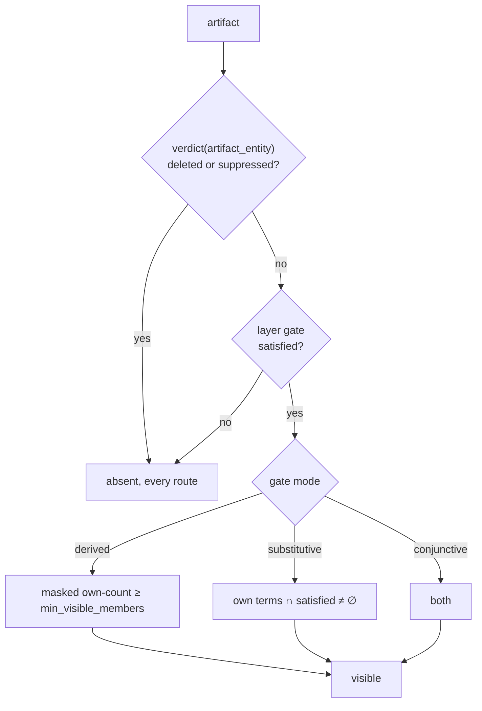

# Annotations — the representation

**Date:** 2026-08-15
**Status:** Provisional — **draft, not reviewed**. Companion to [`annotations.md`](annotations.md), which owns the *model*; this owns what the model is made of. **To become normative:** an independent review of the post-campaign shape, and the rulings in §12. **The measurement campaign is run and has been through review** ([`probes/2026-08-15-artifact-representation/`](../../probes/2026-08-15-artifact-representation/), 2026-08-15). **Review round two found three harness bugs**, all reproduced: one reversed §2's cost conclusion (§2.0.0 — the column wins in one regime, and the owner has ruled that regime out of scope rather than building for it), one refuted the per-artifact sizing rule (size per *member*), and one manufactured §2.6's geographic figures. Round two's remaining findings are **not yet dispositioned** and several are escalations: a suppression does not survive regeneration (§5.0.2), and the threshold is bound to gate mode in a way a membership filter reads around. The fold now has an artifact pass (§5.0.3), and writing it surfaced a fail-open the earlier draft called free: **deleting a point silently restores supplied content generated from it**, at the fold that executes the delete. That defect is a symptom — **the write cycle was specified for artifacts and never for the point-side events artifacts depend on** — so it is being designed rather than patched, in [`annotation-write-cycle.md`](annotation-write-cycle.md), which supersedes parts of §5.
**Why it is separate:** the model survived review under three lenses; the section that made it concrete did not. Three reviewers (2026-08-15) returned findings that clustered almost entirely on `annotations.md` §7 and §7.1 — a reuse claim asserting that artifacts are items and therefore inherit every entity-keyed structure. That section is withdrawn and replaced by this document. Keeping the model and the representation apart is what stops the next such finding invalidating both.
**Reads against:** design §4 (I1, I2, I5, I7, I9, I12), §5.1, §6.3, §7.1–§7.9, §10.4, Appendix A, Appendix C; [`filter-index.md`](filter-index.md) §2 (the measured constants this design turns on); [`write-path.md`](write-path.md) §5; [`slices-and-multi-table.md`](slices-and-multi-table.md) §3; [`compaction.md`](compaction.md); decisions [0028](../decisions/0028-postings-requirement-and-the-pair-relation.md), [0039](../decisions/0039-multi-valued-categoricals-are-slow-path-only.md), [0062](../decisions/0062-filters-compose-as-a-boolean-tree-inside-the-candidate.md), [0064](../decisions/0064-an-absent-number-is-a-presence-bitmap-beside-the-column.md).
**Citation convention:** unprefixed §n is the architecture design; `model §n` is `annotations.md`; this document's own sections are **spec §n**.

> **⊘ None of this is built.** No artifacts, no layers, no membership structure. Figures are marked
> *measured*, *modelled* or *assumed*; the campaign of §11 has now measured the ones that decide the
> design, and what remains unmeasured is named at each site.

---

## 1. The question this answers

The model says an artifact is an identity, a membership, a gate and content, grouped into layers
(model §2). It does not say what any of that is in memory, and the review found that the obvious
answer — put artifacts in entity space and inherit the point machinery — re-opens the deny lane, the
disclosure threshold and an I2 channel through routes nobody analysed.

Eight questions decide the representation. They are answered in order, and §2 decides the rest.

## 2. Storage: row space, and a cost crossover

> **Measured 2026-08-15, and corrected after review round two**
> ([`probes/2026-08-15-artifact-representation/`](../../probes/2026-08-15-artifact-representation/)).
> Real HDBSCAN over the real 2.42M arXiv UMAP corpus for the distributions, synthetic membership at
> 10⁷–10⁹ for the scales. **Three harness bugs were found in review, all reproduced, and one reversed
> a conclusion this section previously stated as measured.** Earlier revisions also reasoned about
> entity-space contiguity and reached the opposite storage conclusion; that reasoning is retained in
> §2.7 because it is what a reader arrives with.

**Artifact membership is one Roaring bitmap per artifact, in row space** — one implementation, ruled
(§2.0.0). The storage result is the campaign's solid finding and it holds two ways:
**28–118× smaller than entity space** on real membership through the real permutation (§2.1), and
**5.04× smaller than a dense assignment column** at 10⁹ with 10⁷ artifacts.

| Representation | Real corpus, 3 levels | 10⁹ rows, 10⁷ artifacts |
|---|---:|---:|
| **Row-space bitmaps** | **0.185 MB** | **794 MB** |
| Dense column | 9.69 MB | 4 000 MB |
| Partial-presence column | 7.54 MB | — |
| Entity-space bitmaps | 8.35 MB | — |

**Size per member, not per artifact.** An earlier revision read three scale points as *"~80 bytes per
artifact, flat"* and built the formula `(rows × width)/(80 × artifacts)` on it. All three held
`rows/artifacts = 100`; off that ray the rule collapses — 631 B/artifact at 10⁸/10⁵, 4 775 at 10⁹/10⁵ —
and the formula underestimated a coarse level's storage by about 60×. The scale-free quantity is
**bytes per member**: *measured* 0.61–1.03 on the pessimistic synthetic arm, 0.006–0.073 on **real**
membership, against a 2 B/member array-container ceiling. **Size from ~1 B/member and treat it as
conservative.**

### 2.0.0 The count cost crosses over, and one implementation is chosen anyway

**Row-space bitmaps are the only implementation** *(owner ruling, 2026-08-15)*. The measurement below
says the column wins in one regime; the ruling is that the regime is not one this system serves.

**First, the correction, because an earlier revision claimed there was no contest.** It asserted the
bitmap route was *"faster at every viewport size"* and *"120×, structural rather than a constant a
better column implementation recovers"*, and deleted the column on that basis. **The measurement
behind it was an artifact of the generator's layout** — artifacts laid down in Zipf-rank order along
the row axis, so every narrow viewport fell inside one giant and held a handful of artifacts. Against
this campaign's own **real** Tier A assignment, a window holds **1.1–1.7× (window fraction × artifact
count)**. Corrected:

| | fine level, 10⁷ artifacts | coarse level, 10⁵ artifacts |
|---|---|---|
| 100% viewport | **column** wins 3.2× | **bitmaps** win 4.4× |
| 10% viewport | **column** wins 3.9× | **bitmaps** win 3.1× |
| 1% viewport | **column** wins 1.9× | **bitmaps** win 3.2× |

**The two costs track different quantities** — per-artifact tracks *artifacts in range*, the column
tracks *visible rows* — and at 1% of 10⁹ under a 25% grant the crossover sits at roughly **19 000
artifacts in range** (*modelled* from the measured per-artifact and per-row constants).

**The ruling holds because the column's regime is past the point of rendering anything.** Nineteen
thousand artifacts in one viewport is already more than a client can draw; the fine-level case where
the column wins puts **~10⁵** in a 1% window. A request in that regime is one of two things: a client
asking for a level the zoom-to-level map should have steered away from (§6.3), or a request that will
be refused on its artifact ceiling regardless of which structure would have answered it faster.
**Optimising the route for a regime whose output is unservable buys nothing**, and it costs a second
representation, a second write path and a second set of invariants to keep aligned.

**What is accepted, named rather than hidden:** a caller who does serve a fine level over a wide
viewport pays **2–4× more** than a column would. That is a real cost in a real configuration, and the
column stays documented in §2.7 so the alternative is recoverable rather than rediscovered.

**Two caveats on the comparison itself, both pushing the same way**: the column arm is optimistic (it
indexes by row, where a real entity-indexed column needs a `row-entity` lookup first), and the
per-artifact arm is optimistic too (candidacy is computed outside the timed region, over a structure
this campaign never built or priced). The margin is narrow enough that neither is negligible, which is
a further reason not to build both and try to choose between them per level.

**What is unaffected:** §2.1's row-versus-entity result, measured on real membership and the finding
the rest of this document rests on; and §8's session-resolution cost, which is the whole-plane row and
is layout-independent.

### 2.0 Three sources of membership, and what event changes each

**Membership is not always a stored set, and the distinction is a *lifecycle* one before it is a
storage one** (owner, 2026-08-15). Earlier revisions of this document assumed all membership was
declared and frozen, which is true of a clustering and false of everything geometric.

| Source | Changes when | Stored as | Masked count |
|---|---|---|---|
| **Enumerated** — the caller declares the members | the layer is **regenerated** | a row-space bitmap, ~1 B/member (§2) | one `and_cardinality` |
| **Spatial predicate** — *"the points inside this shape"* | **a point is written** | the **geometry only**; row ranges derived | `range_cardinality` over its ranges |
| **Attribute predicate** — *"the points carrying this value"* | **a point is written** | nothing new — the existing value column and postings | the existing filter machinery |

**A spatial predicate needs no membership storage at all.** A tile is a contiguous row range, so a
bounding box is a small set of row ranges and a polygon decomposes into Morton cells the same way —
which is §10's density-level shortcut arriving for a second kind of artifact. The count is
`range_cardinality`, the cheapest operation in the system, and it touches no point data.

**And it never goes stale.** This is the asymmetry that matters and it corrects a claim made
elsewhere in this document: a newly ingested point inside a boundary is a member **immediately**,
where a newly ingested point near a cluster is in no cluster until the layer is regenerated
(§2.2.1). Boundaries stay current; clusterings do not. A deployment mixing both should expect them to
age differently and should not be surprised by it.

**The perimeter cost of §2.6 is intrinsic to the shape and merely moves.** An enumerated corridor pays
it in bytes — 0.061 B/member, 1.9× the compact case. The same corridor as a predicate pays nothing in
bytes and pays instead in *ranges per query*, which is the same perimeter-driven number — ~10³ ranges
for a 40 000-member corridor, so **~0.3–1.2 ms per artifact per request** (*modelled* on the measured
`range_cardinality` unit). ⊘ **A predicate level therefore needs a per-request bound**, which this
document does not specify: a nationwide boundary level evaluated per query is seconds. Neither
representation escapes the geometry; they differ in whether the cost is paid at rest or at read.

**Nothing above changes the model.** The gate modes, the containment test and the count rule are
indifferent to where membership came from (model §3–§5). What changes is §5's lifecycle, where
"ingest does not touch artifact membership" holds only for the enumerated row.

### 2.1 Why row space, measured

The same membership, the same library, the same corpus; only the id space differs:

| level | members | row space | entity space | ratio |
|---|---:|---:|---:|---:|
| L0 (8 clusters) | 1 934 209 | 0.011 MB | 1.279 MB | **118.5×** |
| L1 (111 clusters) | 1 857 630 | 0.042 MB | 3.267 MB | **77.9×** |
| L2 (884 clusters) | 1 824 800 | 0.132 MB | 3.801 MB | **28.7×** |

Row space is Morton rank, so a spatially coherent cluster is a few contiguous runs. Entity space is
term-signature order, uncorrelated with position, so the same set scatters across every container.
**The coarser the level the larger the win**, a coarse cluster being a longer run.

**Both operands are already row-space at request time**, the session's mask having been projected
once, so a masked count is `and_cardinality(rows(A), mask_rows)` — the operation the viewport already
performs.

**And candidacy stops being a build-time question, which closes a leak rather than an inefficiency.**
A tile is a contiguous row range, so *"does this artifact have visible members in this viewport"* is
`rows(A) ∩ tile_range ∩ mask_rows ≠ ∅`: masked, exact, cheap. The withdrawn draft pruned by a
build-time box over full membership and served wherever that box intersected, disclosing the unmasked
extent by panning. **The box is deleted, not repaired** — no representation here can express the
fault, which is a better outcome than a rule forbidding it.

**Disk holds the entity form, memory holds the row form.** Entity space is the canonical,
slice-invariant record; row space is per slice, derived, and rebuilt on the generation key exactly as
projected mask fragments already are. An ingest appends an extent rather than renumbering
([`permutation.rs`](../../crates/tessera-store/src/permutation.rs)), so an append extends the
resident form instead of invalidating it. **The rebuild happens inside the fold rather than behind it** (§5.0.3) — a
fold renumbers row space globally, and `compaction.md` §6.2 rules stale-serve unsound for exactly this
class of artefact. ⊘ **The fold's artifact pass is unmeasured.**

### 2.2 The signature-sort tiebreak, measured and free

Entity ids are allocated `(signature, source_id)`, and §11.1 measures that minor key as worth nothing
— run lengths 1.00–1.26 against a 1.000 random baseline. Re-deriving the allocation as
`(signature, morton)` over the real corpus, with the real signatures and the real term structure:

| | `(signature, source_id)` | `(signature, morton)` | |
|---|---:|---:|---|
| artifact membership | 8.893 MB | **2.181 MB** | **4.08×** |
| term postings | 0.557 MB | 0.557 MB | **1.00× — unchanged** |

**The posting win is untouched byte for byte**, as the argument predicted: a term's postings are the
union of the signature groups carrying it, and each group stays a contiguous run whatever orders its
interior. §11.1's prohibition on Morton-ordered entity ids does not reach this — that forbids Morton
**rank** as the assignment scheme on permanence grounds, and the Morton **code** is fixed for an
item's life, so a comparison key renumbers nothing and leaves **I9** intact.

**What it is worth is bounded by §2.1.** 4.08× applies to the entity-space form, which row space
already beats by 28–118×. This is a disk-form and projection-input optimisation, not a request-path
one. It is free, and it is **permanent** — unretrofittable under I9, so it is decided before the
first build that writes artifacts or not at all. **Ruled and taken**
([decision 0073](../decisions/0073-entity-ties-are-ordered-by-morton-code.md)).

**There is only one entity ordering, so this is not an artifact-local decision.** Taking it for
artifact membership takes it for everything in entity space at once, and what else moves separates by
what a set correlates with: term postings and every mask built from them correlate with the
*signature* and are unchanged (measured 1.00×); artifact membership correlates with *position* and
gains 4.08×; and **nothing in row space moves at all** — the set of rows a principal can see is the
set of points they can see, which does not depend on how entities are numbered.

**The one core structure that also gains is the permutation, and there the result is arithmetic
rather than measurement.** Within a signature group, ordering entities by Morton code makes
`entity → row` monotone increasing *by construction*, so the run length is the signature group size
whatever the spatial correlation: **54 794 signatures over 2 422 486 entities puts the mean monotone
run at ~44, against ~1 today.** §5.1 names exactly this as the open question — the array is flat and
uncompressed *"precisely because entity order and row order are unrelated, making the values
maximum-entropy"*, and it points at
[`deferred-signature-major-layout.md`](deferred-signature-major-layout.md) as what *"would make it
near-monotone within groups and worth compressing"*. **That sketch is not approved and changes row
space; the tiebreak reaches the same precondition from the entity side and leaves row space
untouched.** ⊘ **What the compression is worth, and what piecewise-sorted input does to
`Permutation::project`, are unmeasured** — the campaign's fixtures were deleted before that arm ran
and the source parquets are not on this machine to rebuild them.

### 2.2.1 Across ingest

**The sort key is the Morton *code*, not the rank, and that is what makes ingest ordinary.** A code is
a function of an item's coordinates and the published quantisation bounds, computable the moment a row
arrives and fixed for its life. Nothing about it depends on what is already in the corpus, so a batch
can be ordered on arrival with no lookup, no global state and no renumbering — which is exactly the
distinction §11.1's prohibition turns on, and the reason it does not reach this.

**The scope, the decay and the lever are the signature sort's, unchanged.** Ordering is per commit
window; nothing repairs it afterwards, since a fold leaves the entity axis fixed; and fragmentation is
monotone in batch count. §11.1's threshold transfers verbatim — below a window of roughly 6×10⁴ there
is nothing to collect, because a batch narrower than a Roaring container has no container-level
structure to gain. **So the tiebreak adds no new operational constraint**: it is collected by the same
group-commit allocation, in the same proportion, and a deployment that forfeits the signature win by
trickling forfeits this one identically.

**The hot path does not inherit the decay, which bounds the concern.** Entity-space fragmentation
degrades the *disk* form and the projection's input. The resident form is row-space and is rebuilt at
every fold against freshly renumbered row IDs, so it is repaired on a cadence the entity axis never
gets. That is the same asymmetry §2.1 rests on, arriving in a second place.

**Ingest does not fragment *enumerated* artifact membership, because it does not touch it.** A
declared member set is frozen at build (model §5), so a newly ingested point joins no cluster until
the layer is regenerated. Between regenerations it is uncovered — visible as a point, in no cluster —
which is the same shape as §7.6's labels going stale rather than unsafe, and which §7.7's extractive
tier already exists to cover. **For that class, what ingest adds is noise, not fragmentation.**

**Predicate membership is the opposite, and §2.0 is the section that says so.** A point written inside
a boundary is a member on the next request, with nothing rebuilt and nothing stale, because the
membership was never materialised. The tiebreak is irrelevant to it in both directions: there is no
entity-space set to compact, and no fragmentation to accumulate.

**One question this raises that the campaign did not, and it needs a ruling.** A point may belong to
several slices with independent coordinates, so *"the Morton code"* is not well defined for a
multi-slice corpus: an entity has one per slice, and an entity ID is allocated once. The tiebreak
therefore optimises **one** slice's spatial order, and a corpus with several slices collects it only
in whichever slice the ordering was taken from — the others are back to arbitrary. Options are a
declared primary slice, or the first slice an entity joins, and neither is obviously right. ⊘
**Undecided**; recorded in §12 beside the tiebreak itself, because taking the tiebreak without
answering it picks a slice by accident.

### 2.3 The ordinal space, and what survives of it

Ordinals remain **level-local over a contiguous entity run**, so the two addressing schemes convert
by arithmetic and a label pointing at cluster 18 of level 2 stores `(layer, level, ordinal)` with no
lookup table in either direction:

```
entity  = level.entity_base + ordinal        ordinal = entity − level.entity_base
```

That is the answer to how artifacts address each other, and it is unaffected by the representation
result. **The width and 0-as-missing arguments do not survive it** — both were properties of the
assignment column, which is gone. They are recorded in §2.5 rather than deleted, because the column
is the obvious design and will be proposed again.

### 2.4 Where the metadata lives

```
artifacts/<layer>/
  registry.json                     # gate, structure, descent policy, derived vocabulary,
                                    #   slices, zoom→level map, hierarchy kind
  levels/<k>/meta.json              # artifact count, entity_base, zoom range,
                                    #   membership source, containment verification result
  levels/<k>/members/<ordinal>.roaring   # enumerated membership, entity space (§2, §2.1)
  levels/<k>/geometry.arrow         # predicate membership: the shape only (§2.0)
  levels/<k>/artifacts.arrow        # per ordinal: content and version references,
                                    #   optional caller stable key (§5.2)
  edges.arrow                       # (layer, level, ordinal) → (layer, level, ordinal)
```

**Supplied content itself is not here.** Label text, descriptions and authored names live in the
record blob at the artifact's entity, which is entity-addressed and has no `M_auth` involvement — the
one piece of the withdrawn reuse claim that survives review intact, and the reason artifacts carry
entity IDs at all.

**An artifact's unmasked own-count is deliberately not stored.** It is the obvious field to add and it
is C8: a corpus-wide count over items a principal may not see, one careless line from being served
beside a masked one. **No build-time box is stored either**, and that is a change from the withdrawn
draft rather than an omission: §2.1's row-space membership answers candidacy as a masked question, so
the one unmasked aggregate the design previously kept has nothing left to do. **The file set holds no
corpus-wide quantity at all**, which is a stronger position than justifying one.

### 2.6 The geographic stress test

The design was developed against an embedding map, where artifacts are HDBSCAN blobs. A geographic
deployment is the corpus's own named stretch (client-interaction §12), and it is adverse in three
specific ways.

**Shape sensitivity is real but modest — and an earlier revision reported it 12× too large.** That
revision published corridors and archipelagos at **56×** a compact blob, and the figure was
**a bug in the probe's own subsampler**: it held member count constant by decimating with a stride,
and a stride of two or more never keeps adjacent rows, so *runs == members* was forced for any
oversized shape. A compact disc put through the same path reported the identical degenerate
signature. Re-run at native density
([`probes/2026-08-15-artifact-representation/`](../../probes/2026-08-15-artifact-representation/)):

| shape | runs | B/member | vs compact |
|---|---:|---:|---:|
| disc, square | 318–361 | 0.033–0.037 | 1.0× |
| coastline (fractal boundary) | 456 | 0.045 | **1.4×** |
| corridor — river, road, coastal strip | 1 188 | 0.061 | **1.9×** |
| archipelago, 60 parts | 3 668 | 0.151 | **4.6×** |

**So geometry costs less than the design claimed, and the 2 B/member array-container ceiling is
arithmetic these shapes do not approach.** The honest worst case is not an elongated region but a
**scattered** one — a sparse subset of an area — which is real and was not measured.

**Public, enumerable nesting makes differencing arithmetic, and §8.2's rollup does not close it.**
`derived-artifact-gating.md` §6 already names this: administrative geographies are the textbook
differencing vector *because* an attacker need not discover the structure first. §8.2 says a
suppressed count rolls up to the coarser area — but serving a district's count alongside all but one
of its wards makes the missing one a subtraction. The census answer is **complementary suppression**:
withhold additional cells so the residual cannot be recovered. **That is not in this design**, it is
materially more expensive than a per-cell threshold, and it is the one place the geographic case needs
machinery the semantic case does not. ⊘ **Unresolved**, and it belongs to C1's outstanding review.

**Non-Morton grids lose the free-membership shortcut.** §10 notes that a Morton-cell density level
needs no stored membership, the cell being a prefix of the row id. H3, S2 and geohash cells are *not*
Morton prefixes, so a hex-grid level is an ordinary level with stored membership. A cost, not a
problem — but the shortcut is Morton-specific and should not be assumed for any grid.

**And geo makes two already-named gaps concrete rather than hypothetical.** Routes and corridors are
**ordered** subsets, which model §11 records as unhandled. Meanwhile a **geographic ACL** — *"analysts
may see data in their own region"* — makes the term signature correlate with position, which is the
condition under which §2.2's tiebreak pays most: signature groups become spatially coherent, and the
permutation approaches globally monotone rather than monotone in runs of ~44.

### 2.7 The reasoning this replaced, retained

Three arguments were load-bearing before the campaign and are now superseded. They are kept because
each is what a reader reasons to unaided, and the third was wrong in a way worth naming.

**The assignment column.** A partitioning level is a column, not a set of sets, and a column read
under the candidate needs no contiguity to be cheap. True, and it loses anyway: 5× larger at 10⁹ and
slower at every viewport, because its cost tracks visible rows where the alternative tracks artifacts
in range. Two corollaries died with it — reserving ordinal 0 for *no artifact* to escape the presence
bitmap and its rank, and narrowing the column to `u8`/`u16` by artifact count. Both were correct
about the column.

**The postings analogy.** Membership was taken to be the postings problem wanting the postings answer,
with the cure unavailable because §5.1's ordering is already spent. The premise was right and the
conclusion was a non-sequitur: entity-space contiguity was never the only contiguity available.

**The error under all three was reasoning in one id space.** Every sizing argument here was about
entity space, where a cluster genuinely does scatter — and the hot path was never going to be there.
The measured 28–118× is what that mistake cost, and it was not visible from inside the argument.

## 3. Reach is a build-time union, and it is not free

> **Corrected 2026-08-15 (review round two).** An earlier revision titled this *"reach costs nothing,
> because the scan already computes it"* and derived that from one pass over an assignment column —
> **a structure §2 deletes.** Two reviewers found the contradiction independently. The conclusion did
> not survive the representation it was built on, and this section states what reach actually costs.

*Reach* — a node's own members unioned with its descendants' — is admitted as a roll-up metric (owner,
2026-08-15) on the terms already settled: **never served**, the count and geometry beside an artifact
remain those of its **own declared membership**, and the pruning policy it feeds stays the caller's
declaration rather than something derived from containment (model §6.1).

**Under row-space bitmaps it is a materialised union per node, built at build time**, and it costs a
second membership structure of the same order — the subtree unions of a level sum to more than the
level itself, since a member appears in every ancestor's reach. ⊘ **Unmeasured**; the campaign sized
own-membership and never sized reach, so the ~80 B/artifact rule does **not** transfer to it.

**Pruning on reach stays lossless**, which is what the owner ruling turns on and which the
representation does not affect: `own(d) ⊆ reach(d) ⊆ reach(n)` for every descendant *d* of *n*, so a
failed reach bounds every descendant's own-count and nothing that would have passed is discarded.

**Two limits that the earlier framing hid:**

***Reach is undefined for predicate membership*** (§2.0). A boundary has no stored bitmap to union,
and unioning derived row ranges at build would freeze a membership whose whole property is that it
stays current. A level whose membership is a predicate therefore supports no reach and no
reach-pruning — its artifacts are tested individually, which is what §2's per-artifact route does
anyway.

***A materialised reach goes stale where own-membership does not.*** It is a build artifact over
enumerated membership, so it is refreshed at the same events (§5) and is exactly as current as the
clustering it summarises — which is fine, and worth saying only because the predicate row of §2.0
makes "stays current" a live property elsewhere in the same document.

**So reach is affordable but not free**, and whether to materialise it is a sizing question the
campaign did not answer. It belongs in §11.3's list of what was not settled.

## 4. Visibility: one predicate, evaluated on every route

The review's central finding was that visibility was defined twice — as a gate in the model, and as
`M_auth` membership in the withdrawn reuse level — and that every reuse route used the second. The
two are not the same, and one of the gaps is a fail-open.

**A derived-gated artifact carries no terms**, so it appears in no posting and is never in `M_auth`
(§6.3 builds the mask by unioning term postings and nothing else). Any route testing artifact
visibility by intersection with `M_auth` therefore answers *invisible* for every clustering artifact
and every viewer.

**And `M_auth` is where suppression acts.** A gate evaluated against the principal's satisfied term
set is the *pre-overlay* predicate; the artifact's own deleted/suppressed disposition is consulted
nowhere. Suppressing a cluster would leave it serving — members untouched, threshold still clearing —
which violates the standing rule that a suppression applies to every request the moment it is
accepted, and is the fail-open class the corpus has caught twice.

**One predicate, and the overlay comes first:**



*The overlay test is first and unconditional. `verdict` is the existing per-entity composition
(`deleted > suppressed > buffered`, write-path §5.3), single-sourced, so an artifact reaches it by
the same route a point does.*

**Every artifact-population route evaluates this predicate and no other** — the viewport, drill-down,
filters, search, edge traversal, metadata. Where a route cannot afford it, the route does not exist;
that is what §7 turns on.

**The predicate carries one term beyond the artifact's own, and omitting it is fail-open**
*(review, 2026-08-15)*. An artifact that exists only as an attachment to another — a toponymy label
on a cluster — is **also** tested on the `verdict` of what it attaches to. Without that term the
predicate is per-artifact by construction, so suppressing a cluster stops the *cluster* serving while
its labels go on serving on every route that does not traverse the edge: search, a held identifier, a
filter. Those labels name and describe the thing that was just hidden. The conjunctive rule the model
states for edge *traversal* does not reach them, because those routes never traverse the edge — they
reach the label directly. The term is one extra `verdict` lookup on the attachment target, on an
identifier the label already stores, and it is the same lookup the predicate's first branch already
performs. **The same argument covers the target's gate**, not only its deny state: a label must not
outlive the reachability of what it labels.

**Artifacts still get entity IDs**, because the deny lane, `tessera_id` and the overlay all address
by entity. What they do not get is membership in `M_auth`, or the assumption that a bitmap
intersection answers a visibility question. The reserved range is a **list** of 2¹⁶-aligned blocks,
not one block: each regeneration consumes ~10⁷ IDs and any fixed block exhausts. *(This section was
written under I9's never-reuse rule. [Decision 0072](../decisions/0072-entity-ids-are-slots-and-are-reused-after-a-fold.md)
relaxes it — slots return to the allocator at a fold — so the exhaustion is no longer permanent, but
the block list stands: a regeneration still needs a contiguous run it can take at once.)*

## 5. Write, update, delete

**Regeneration is a layer lifecycle event, not 10⁷ deletions.** Pushing a replaced clustering
through the deny lane would deliver 20× the `overlay_soft_limit` (500,000, write-path §7) as a single
event, into a lane sized for trickle denies, retiring at a fold with no artifact pass. Instead, the
slice lifecycle applies unchanged ([`slices-and-multi-table.md`](slices-and-multi-table.md) §3):
create is a WAL'd registry entry, drop is a WAL'd tombstone, the artifacts become garbage collected
at the next fold, and **the name stays tombstoned against reuse** — a recreated `clusters/2026-08`
with different membership would silently repoint every bookmark that named it.

| Event | Route | Retirement |
|---|---|---|
| New clustering | layer create; build writes its levels | — |
| Replace a clustering | create the successor, drop the predecessor | fold reclaims |
| Suppress one artifact | deny lane, by entity | Rule S — on unsuppress |
| Delete one artifact | deny lane, by entity | Rule F — at the fold that executes it |
| Analyst creates a selection | control verb (§5.1) | as above |
| A **point** is deleted | nothing for derived content; **supplied content degrades** (§5.0.3) | its bit goes at the fold; predicate membership needs nothing |
| A **point** is ingested | nothing for enumerated membership; **predicate membership gains it immediately** (§2.0) | — |

That last row is only half free. A deleted point drops out of every mask, so every masked count falls
immediately and correctly with no artifact-side work, and the **stale** structure — its assignment
slot, its membership bit — is cleaned at the fold's attribute pass, which already blanks deleted
entities per column ([`filter-index.md`](filter-index.md) §6.2). Supplied content gated on a
generating set does not survive the same way: §5.0.3 has the re-base and the rule that closes it.

### 5.0 The unit of write is one artifact

**The unit of write is one artifact, and an earlier revision claimed otherwise on a premise the
campaign had already deleted.** That revision said a level must be published atomically because
ordinal 0 means *no artifact*, so a partial level would assert that the missing artifacts' points are
unclustered. **Ordinal 0 was the dense column's convention**, and the column is gone (§2): with
bitmaps a point is simply in no published artifact, publishing more artifacts is monotone, and
nothing is asserted that later becomes false.

**Bulk publication is operational, not semantic.** A 10⁷-artifact level is a build-plane job for the
same reason `tessera build --attach-slice` is — volume that must not ride the trickle path — and a
level published in pieces is coherent at every step, merely incomplete. That is the ordinary
`⊘ specified-not-implemented` distinction between *cannot* and *should not*, and it matters because
the atomic reading would have forced a rebuild for a one-artifact correction.

### 5.0.1 Edit is a first-class operation here, and it is not for points

**Points have no edit because nothing edits them.** They arrive from a pipeline, machine-produced and
immutable in practice, and
[decision 0047](../decisions/0047-edit-is-delete-plus-reingest.md) makes an edit a
delete-plus-re-ingest at no cost to anybody.

**Artifacts include objects whose entire lifecycle is editing**, and the asymmetry is what decides
this. An analyst adds a document to a selection, corrects a label's text, redraws a ward boundary,
shares a private set with their team. Delete-and-recreate mints a new identity, and a new identity
breaks every bookmark, every caller-side join and every share — which is what stable identity was
adopted *for* (§5.2, C17). **So edit is a first-class operation, and 0047 does not transfer wholesale.**

**What 0047's argument actually protects is authorisation**, so the contract decomposes by what is
being edited rather than refusing the operation:

| Edited | Route | Why |
|---|---|---|
| **Content** — name, description, supplied geometry | in place, identity preserved | no authorisation implication. Corpus-derived supplied content carries a generating set, so text and generating set move **together**: editing one without the other would leave a declaration describing something that no longer exists |
| **Membership** | in place, identity preserved, **version bumped** | not authorisation. The bump is what keeps it honest — see below |
| **Gate — widening** | in place, version bumped | a viewer gaining access is not a fail-open |
| **Gate — narrowing** | **suppress, then re-grant** | this is 0047's case exactly: an in-place narrowing is a revocation that bypasses the deny lanes. Suppression is immediate under Rule S and is checked before anything else on every route (§4) |

**The version bump is the whole mechanism, and it costs one thing already measured.** A session's
resolved visibility set (§8) is cached, so an edit after resolution would otherwise leave that session
on a stale answer — harmless when the change widens, **fail-open when it narrows**, since a shrunken
membership may now fall below the threshold. Keying the resolved set on `(layer, version)` and bumping
on every edit makes the session re-resolve lazily at its next touch: *measured* 883 ms at 10⁷
artifacts, once, against a mask build the session already pays (§8). **The same key that already
handles generation flips handles edits**, which is why this needs no second mechanism.

**Identity survives all of it**, which is the point. A selection edited a hundred times is the same
artifact throughout, and the bookmark taken on day one still resolves.

### 5.0.2 A suppression does not survive regeneration, and the design compels the operation that loses it

**This is a fail-open in substance, and the point path already ruled the other way**
*(review round two, verified)*. Model §2.3's emergency path — suppress, edit, unsuppress — holds only
while the entity survives. **Regeneration mints new entities** (§5.2), a suppression addresses the old
one under Rule S, and nothing carries it forward: the same leaking label re-emerges from the same
pipeline under a fresh entity and serves.

**§5.0.4 makes it compulsory rather than merely possible.** A regeneration that would dangle a
dependent is refused, so the caller **must** republish a label layer whenever its clustering
regenerates. An owner who suppressed a leaking label finds it back the day the next clustering lands,
with no unsuppress ever issued. Rule S is honoured to the letter — the dead entity stays suppressed —
and defeated in substance.

**Points do not have this hole, deliberately.**
[Decision 0047](../decisions/0047-edit-is-delete-plus-reingest.md) rules that *"a **suppressed**
holder still collides. Suppression is temporary hiding, not deletion… Deleted ⇒ forgotten; suppressed
⇒ still the holder"* — a suppressed `external_id` **blocks** re-ingest. Artifacts get strictly weaker
deny semantics because regeneration has no holder to collide with: every generation is a fresh
identity by construction, and §5.2's stable key is connected to nothing in the deny lane.

**The rule, and it is a publish-time refusal rather than a fold-time repair.** A regeneration is a
build-plane publish; the fold only reclaims what the drop released (§5.0.3). So the check belongs
where the successor is published, when both generations are known:

> **A layer holding live suppressions cannot be published over.** The successor is refused unless,
> for every suppressed artifact, its stable key is either **absent** from the successor or **arrives
> already suppressed**.

**Which makes the stable key mandatory for any layer that has ever taken a suppression** — §5.2 offers
it as optional, and this is the case that removes the option. A caller who has never suppressed
anything is unaffected; one who has must carry keys forward or clear the suppressions first, which is
a deliberate act by someone entitled to make it.

**Replaying suppressions onto the successor automatically is the tempting alternative and is
declined.** It fails open in exactly the cases that matter — a missing key, a renamed artifact, a
caller who reshaped the clustering so the "same" cluster is no longer the same set — and each failure
silently un-hides something an owner hid. A refusal makes the operator do the reconciliation the
service cannot do for them, which is the fail-closed direction and the same posture as the
dangling-edge refusal (§5.0.4).

**This makes artifact deny semantics match the point path's** rather than being quietly weaker.
[Decision 0047](../decisions/0047-edit-is-delete-plus-reingest.md) makes a suppressed `external_id`
**collide** so a re-ingest cannot resurrect a hidden point; the rule above is that collision, expressed
against the only durable identity an artifact has across generations. ⊘ **This is still an owner
ruling**, because it changes what a deny guarantees and because it makes a previously optional field
mandatory under a condition — but it is written as the recommended shape rather than as an open
question, since leaving it open leaves a fail-open in the document.

### 5.0.3 The fold rebuilds artifact row forms, and it must do so inline

**Row space renumbers globally at a fold, so every resident membership form is invalid at the flip.**
An earlier revision said the forms are *"rebuilt on the generation key exactly as projected mask
fragments already are, background work under [decisions 0043/0044]"*. **That reasoning does not
transfer, and `compaction.md` §6.2 already says why**: for row-space artefacts a fold makes
stale-serve *unsound* rather than merely stale — old row ids against a new mask produce meaningless
counts, and Rule F independently forbids composing the retired generation. A mask escapes with a
per-session cache miss at a *measured* 1 277 ms; a 10⁷-artifact level cannot, because it is a
**shared, deployment-wide artefact rather than a per-session value**. The choice as previously written
was a first-toucher stall of tens of seconds per level, or blank annotation levels for minutes after
every nightly fold.

**So the fold gains an artifact pass, and what it costs turns on which of two constructions it uses.**
Both need the same fact — each member's new row — and the fold already knows it. They differ only in
where the relation is kept while the pass runs.

*Riding pass 1.* Pass 1 streams `(entity, new_row)` in new-row order to scatter `permutation.bin`, so
an artifact arm can append to every builder as the rows go past, and each level's bitmaps emerge
already sorted. The cost is that it must hold the **inverted** relation resident for the whole pass —
entity to the artifacts holding it — which is of order 4 GB at 10⁹ and is *not* one ordinal per level:
artifacts within a level may overlap (§2.0), so it is a multimap. It also holds every builder in a
level open at once, ~1 GB where a level covers the corpus.

*Per artifact.* Translate one artifact's bitmap through `old_row → new_row`, write it, close it. That
table needs no scatter: the fold already streams old rows with their entity, and `perm[entity]` is
complete once pass 1 ends, so it is written **sequentially** in old-row order as a mapped file. It is
read back with locality, because a cluster's members are Morton-contiguous in old row space — a
translation walks a neighbourhood of pages, not the file. Resident cost is the largest artifact's
member list, of order megabytes, plus output buffers.

**The second is the one to cost, and it is far cheaper than the figure first written here.** Its 4 GB
is *reclaimable page cache against a mapped file*, not an anonymous resident allocation, and
`plan_fold`'s estimate is built from the anonymous terms — so the fold's ~9–10 GB un-reclaimable peak
(`compaction.md` §3) may not move at all. What it does add is a second 4 GB mapping beside
`permutation.bin`'s on a box whose serving load already holds most of RAM, so `plan_fold` must still
learn about artifacts: a pass it does not budget for is one it cannot refuse. But the open question is
whether the peak moves, not the assumption that it grows by half. Bitmap construction is the probe's
13–25 s per 10⁷-artifact level either way. ⊘ **Unmeasured, and the two constructions are what the
measurement compares**; §11.3 carries it.

**Rule F needs an artifact arm too, and currently has nothing to execute.** The fold's passes drop
rows and postings; a deleted artifact has neither. Retirement must additionally drop its membership
file, its `artifacts.arrow` slot and every edge naming it — a new category the retirement derivation
does not cover. A **dropped level or layer** reclaims the same way, which is what §5's lifecycle table
already assumes without saying who does it.

**A deleted point is free for derived content and is not free for supplied content.** Counts,
centroids and hulls are recomputed per request from `membership ∩ M_auth` and from nothing else
([`annotations.md`](annotations.md) §4.2), so a deleted point leaves them correct with no
artifact-side work at all: it is outside every mask from the moment the delete is accepted, and out of
the bitmap once the fold drops its row. Nothing stores an unmasked count that could go stale — storing
one would be C8.

**Supplied content is the half that does not hold, and the failure is a re-base at the fold.** A
label, summary or authored hull carries a generating set and is served on containment,
`and_cardinality(G, M_auth) == |G|` (§4). While the delete sits in the deny lane, the member is
outside every mask, containment fails for every viewer, and the label is correctly withheld. **Then
the fold executes the delete, `G` is remapped without that member, `|G|` shrinks to match, and the
label is served again** — to everyone, on a generating set that no longer names what the text was
derived from. A toponymy label written from five hundred documents can quote one that has since been
deleted. Deletion, the stronger act, ends up weaker than suppression, and it flips at a scheduled
nightly window.

**Freezing `|G|` at declaration does not close it, and the reason generalises.** The proposal was to
store the declared cardinality beside the generating set, so that losing a member makes containment
unsatisfiable for every viewer until the caller regenerates. **A cardinality is not an identity**
*(owner ruling, 2026-08-15)*: row space is Morton order, so a point ingested into the same
neighbourhood is assigned a row *inside* the cluster's row range at the next fold, and the count is
restored by a member that was never declared. The general form of the defect is that **`G` is carried
in a space whose identifiers are not stable across the event it must survive** — row IDs renumber at
every fold, where entity IDs never do (I9). Any check that proves "this is still the declared set" by
counting is unsound for the same reason.

**The repair is that `G` was in the wrong space, and it is designed in
[`annotation-write-cycle.md`](annotation-write-cycle.md)** — which supersedes this paragraph and the
lifecycle table's point-event rows (that document's §10 lists the disposition). A generating set is an
immutable set of **entity** IDs with no row form at all, which is what §7.6 always specified; giving it
a row form here is what let the fold shrink it. Entity IDs never renumber and are never reused (I9),
so the fold has nothing to rewrite, a deleted member never returns, and containment fails permanently
without a stored flag or a frozen count. **Until that document is ruled on, the behaviour is as
described above and it is fail-open** — the withheld label returns at the fold, and the register
records that shrink as **not adopted** (C7). Suppression is unaffected either way: Rule S never
touches postings, so the member stays in `G` and containment keeps failing.

**Which artifacts were degraded is a by-product, not an index.** The instrument this appears to call
for is an inverted entity → artifact index, and the fold does not need one: its artifact pass already
visits every `(artifact, member)` pair, so intersecting the delete set as it goes yields exactly the
artifacts that lost a member, at no extra traversal, as a report for the caller to act on. ⊘ **A live
entity → artifact lookup is genuinely absent**, and is what to build if that answer is ever wanted
between folds rather than at one.

**The coupling worth stating either way:** enumerated membership is frozen at build, so its bits live
only in base row space, which renumbers only at the fold, and merge and flush cadence never touch it.
**Predicate membership does not share that**, because it is re-derived per request against current row
space.

### 5.0.4 Edges constrain the order of writes

An edge names `(layer, level, ordinal)` (§2.3), so **a target must exist before an edge into it**, and
that is a real ordering constraint the point path has no analogue for.

**Regenerating a target layer dangles every edge into it**, because a regenerated layer mints new
entity runs and new ordinals (§5.2). A label layer pointing at last month's clustering points at
nothing.

**So a layer declares the layers it edges into, and a regeneration that would dangle a dependent is
refused rather than completed.** The caller republishes the dependents in the same operation or drops
them first. The alternative — cascading silently — would leave labels attached to clusters they were
not generated from, which is worse than an outage and is exactly the class **I8** exists to prevent.

### 5.1 Runtime-created artifacts

A selection assembled mid-session cannot ride `/control/ingest`, whose row carries a
`{slice → (x, y)}` coordinate map and an entity's terms. An artifact has no coordinates, and carries
a membership reference, a layer binding and a gate. It needs its own control verb, taking
`(layer, membership, gate, supplied content)` and returning an identifier. **⊘ Unspecified here**;
it is a contracts item, and it is the write path model §11 parks as an open question.

### 5.2 Identity across regeneration, which does not survive by default

An artifact's identity is its entity ID, minted at build, never reused. **A regenerated layer mints
new ones**, so a bookmark taken against last month's clustering resolves to nothing, and a caller's
own annotations joined to an artifact die with it.

This is a real limit and it **weakens an argument made elsewhere**: model §7 retires per-session node
handles partly because a viewer bookmarks and a caller joins, and C17's accepted trade is cited in
support. If the dominant layer type is replaced monthly, that stability is worth much less than the
argument assumes.

**The available fix is a caller-supplied stable key per artifact**, carried in `artifacts.arrow` and
resolved through a per-layer index — *"the immunology cluster"*, identified across generations by
the caller because only the caller knows the two are the same. Without one, artifact identity is
generation-scoped and bookmarks are honestly documented as expiring. **Recommended: offer the key,
make it optional, and state the default plainly.** Ruling in §12.

## 6. Serving

A viewport response carries, per visible layer, the artifacts at the levels the layer's
**zoom-to-level map** admits at that depth. That map is what bounds the work, and it is not a
concession — it is what every mapping pipeline does, and it is the caller stating which level is
meaningful at which scale.

**It is a function of the declaration alone** — never the request, the principal, or a statistic —
which is §8.2's standing rule about routes, and is what keeps service time from becoming a function
of how much a principal can see.

**Cost is a session one-off, not a per-request charge, and an earlier revision of this section
contradicted this document's own measurement.** §8 measures resolving an entire layer's visibility at
**883 ms** for 10⁷ artifacts and concludes it is affordable — once per session, cacheable, invalidated
on the generation key. §6 then quoted the same 883 ms as a per-request cost and concluded a fine level
was unservable. **Both cannot be true.** The resolution is the first: visibility is resolved once, and
a viewport thereafter is a row-range intersection against the resolved set, which is cheap. There is
no per-request 883 ms and never was.

**And the client caches, so this is replica sync rather than request cost.** What reaches a client is
not membership but identity, geometry, count and label — of order a hundred bytes an artifact — and
client-interaction already models a client as a versioned partial replica that fetches once and
reconciles against a version coordinate. A level is exactly that: fetched, cached, invalidated when
the coordinate moves. Sizing it as though every viewport re-fetched it is the wrong model.

**So the zoom-to-level map is not a cost bound, and nothing here requires one.** It survives only as
advisory metadata — a min/max zoom a sensible client follows and a UI exposes, as every tile schema
does.

### 6.1 Artifacts cannot be sampled, and that is the real constraint

**A point sample is representative; an artifact subset is not.** §7.2's priority prefix gives an
unbiased sample of the visible points, which is what licenses drawing 50 marks for 4,120 items and
reporting both numbers. **There is no artifact equivalent.** Dropping half the boundaries in a dense
flat level does not give half a map, it gives a wrong one, and no ordering over artifacts makes the
retained half stand for the discarded half.

This is a sharper constraint than the density argument an earlier revision gave, and it points
elsewhere. Faced with too many artifacts, the options are **serve them all**, **reduce by the layer's
own structure**, or **refuse** — never sample.

### 6.2 Two kinds of layered hierarchy, and a spectrum between

**Reduction means different things in the two, and the design has been written for one of them.**

***Nested.*** Each artifact has parents and children; a coarser view is an **ancestor**. Reducing
preserves the claim — *"these points are in this cluster, described more coarsely"* — which is §7.5's
rollup-rather-than-suppression, and it is why a viewer is never left with nothing. `reach` (§3) is
well defined here. **Levels need not align with tree depth**: a semantic level and a structural depth
are different things, and nothing should assume an artifact's level equals its distance from a root.

***Stacked flat.*** Each level is an independent analysis at its own coarseness, with no guaranteed
parent/child relation and possibly slightly different information — three HDBSCAN runs at three
`min_cluster_size` settings, which is exactly what §11's Tier A produced. A coarser view is **another
level**, not an ancestor, and switching to it does not coarsen a claim, it **replaces one analysis
with a different one**. `reach` is undefined across levels because there are no edges to close over.

***And a spectrum.*** Toponymy's layered clusterer sits between: some parent/child links, no
guarantee they cover. Where links exist, rollup; where they do not, the only reduction is a level
switch.

| | Nested | Stacked flat |
|---|---|---|
| A coarser view is | an ancestor | a different level |
| Reduction means | the same claim, coarser | a different analysis |
| `reach`, and the frontier | well defined | undefined across levels |
| If a level is too dense | ancestors are always available | there may be nothing coarser |
| A client toggling picks | a depth | an analysis |

**A layer declares which it is**, and the declaration is what decides whether `reach`, the frontier
and rollup mean anything for it — not a property to be inferred from whether edges happen to exist.

**Two admissions this forces.** §3's `reach` and §6's frontier are written for the nested case and
say so nowhere; and **§11's Tier A is the stacked case** — three independent HDBSCAN runs whose
nesting was never verified — so the campaign measured stacked-level membership while the surrounding
prose assumed nested. Nothing in the *sizing* results depends on it (they are properties of Morton
contiguity, not of edges), but no measurement here supports a claim about rollup.

### 6.3 Three selection regimes, chosen by what the artifact is

**Which level to show at which zoom has three different right answers, and the axis is §4.1's.**

***Corpus-independent artifacts with a canonical scale — the geographic case.*** An administrative
hierarchy arrives with its scales attached: a ward is a neighbourhood, a district is a town, and a
cartographer has known which to draw at which scale for a century. **Declare the zoom range per level,
draw the whole level, mask the counts.** There is no descent and no frontier, because the existence of
a boundary discloses nothing (§8.2) — the disclosure is entirely in the number beside it.

***Corpus-derived hierarchies with no canonical scale — the clustering case.*** An embedding
projection has no units, so a level corresponds to no zoom and there is nothing to declare. If the
layer is **nested**, the frontier selects: the disclosure threshold against `M_auth` fixes maximum
depth and the display threshold against `M_sel` decides how far within it. If it is **stacked**, there
is no frontier to run and the choice of level is the client's.

***Client-chosen.*** **Which layers render is the client's decision, and which level within one.**
Every competent map tool lets a user toggle annotation layers, and nothing here should obstruct
that — a layer is what appears in that toggle list (model §2.2). The rule this looks like it
touches — *"a client selects requests and never filters responses"* — exists for **sampling**, where a
client trimming marks would decide what is visible and break mark-count-as-density. Levels are not
samples of one population and §6.1 says they cannot be; toggling one off is **not asking for it**,
which is request selection.

**The boundary that does hold:**

| The client's | The server's |
|---|---|
| which layers and levels to request, and which to render | which **artifacts within** a level are served — the threshold is a disclosure control and does not move with a request |
| screen size, pixel budget, label density | the counts, never recomputed or trimmed client-side |

The client must never **synthesise** a level the server did not serve — clustering the points it holds
and drawing hulls is the sample-as-set error in geometry, which model §9 names.

**An artifact may also carry its own rank or zoom range**, which is the maps-industry pattern
client-interaction §9 calls *"the one primitive the design is materially short of"*. Under §4.1 it is
content like any other: an **authored** rank is corpus-independent and served freely; a rank
**computed from full membership** is corpus-derived and gates by containment, which is §8.6's cell.

**A level is served partially, never withheld because part of it is suppressed.** Holding a viewer at
the last level they can see *entirely* announces the suppression it is meant to conceal, and
differences under panning; model §6.1 carries the analysis. This is a rule about serving, so it is
restated here rather than only in the model.

**A layer declares its hierarchy kind and its selection regime**, and neither is inferred. The
regimes are not exclusive — a geographic layer declares scales *and* is toggleable — and what a
regime fixes is who decides **within** a level, which is never the client.

## 7. Filters

**An artifact's membership as a filter is a real capability and a real hazard, and the two split by
gate mode.**

The hazard, which the withdrawn draft declared free: per-tile counts under a membership filter are
exact at any zoom, so at maximum depth they give per-point cluster assignment — the quantity
`min_visible_members` exists to bound, at a granularity of one. Boolean composition
([decision 0062](../decisions/0062-filters-compose-as-a-boolean-tree-inside-the-candidate.md)) then
supplies differences between layers directly, which is the differencing attack C1's outstanding
review is concerned with, handed over as a feature.

| Layer gate | Membership as a filter | Why |
|---|---|---|
| **Substitutive** — selections, boundaries | admitted, unrestricted | no threshold governs these; the viewer defined or is cleared for the set, and filtering by it discloses nothing the gate withheld |
| **Derived** — clusterings | admitted **only** for a Q1-visible artifact, and per-tile counts inherit `min_visible_members` | the threshold is the disclosure control; a route around it is a route around C1's mitigation |
| **Conjunctive** | as derived | the threshold still governs |

Naming a non-visible artifact as a filter must be refused **work-indistinguishably** from naming one
that never existed — the same problem as §8, and they should be solved together rather than
separately.

## 8. Search, and inspection

**Search over the artifact population is the point of putting label text somewhere searchable**, and
it works: a token index over artifact entities, the population named by the request rather than by
the filter, so a boolean tree still evaluates inside one candidate set.

One caveat to register rather than discover. C25 accepts that a `match`'s service time tracks a
token's corpus-wide carrier count, bounded by the argument that the loud case is a term carried by a
large fraction of the corpus, whose existence is not a secret. **The artifact population is two
orders smaller**, so a given carrier count is a proportionally larger fraction of it and the signal
is louder relative to the population it describes. The row needs re-reading against this population
rather than assumed to transfer.

**Inspection by identifier does not close the way it does for points**, and this is the finding the
model document already escalates (model §11) — restated here because the representation makes it
sharper, not softer.

For a point, deciding visibility is one constant-time entity-space containment, so an unknown
identifier and an invisible one do identical work and return the identical `404`. For a derived-gated
artifact, deciding visibility requires its masked own-count — one `and_cardinality` against that
artifact's row-space bitmap, cheap per artifact but a function of its size, which is the channel.

**Three routes, and the third is new:**

1. **Register the channel** and serve it from membership bitmaps for inspectable layers only.
2. **Resolve a layer's visibility set lazily at first touch** — one `and_cardinality` per artifact,
   *measured* at 883 ms for 10⁷ (§11), the same order of work as the mask build a session already
   performs. The withdrawn draft dismissed this in a clause as *"hopeless for 10⁷ artifacts"*, and
   **that dismissal was wrong**. If it measures affordable, C4's structural closure is restored and
   no row is needed.
3. **Maintain the per-artifact own-count** as a stored scalar in `artifacts.arrow`, updated at the
   fold — but the count that matters is *masked*, and a stored unmasked count is C8. This route is
   named only to record that it does not work.

**Measured, and (2) wins: the escalation dissolves.** Resolving every artifact's threshold for a
session costs **883 ms** at 10⁷ artifacts and 245 ms at 10⁵, against the corpus's *measured* 588 ms
realistic-worst-case mask build — **~1.5× one authorise-time step a session already pays**, once per
layer, cacheable for the session and invalidated on the same generation key as everything else. With
the visibility set resolved, the per-identifier test is a set-membership lookup: identical in work for
a gate-failed artifact and one that never existed, which is exactly the structural closure C4's
annotation gives points.

**So no leak-register row is needed, and the draft's dismissal of this route as *"hopeless for 10⁷
artifacts"* was wrong** — by the distance between 883 ms and never having measured it. Route (1) is
withdrawn and route (3) remains recorded as not working.

## 9. Metadata

`/v1/meta` carries the layer registry, **gate-filtered per principal** — the slice registry's
mechanism, resolved once at authorise, so a gate-failed name and a never-registered name are
indistinguishable in outcome and in work.

Per layer: identity, structure (flat or hierarchical, level count), the zoom-to-level map, the
declared derived vocabulary, which slices it appears in, and what kinds of supplied content its
artifacts carry.

**Never the artifact cardinality.** A count of artifacts in a layer is a corpus-wide count over
objects the principal may not individually see, which is C8's row.

**One consequence of publishing the supplied-content kinds**, and it reverses a closed register row.
A viewer who knows a layer declares a shape, and receives an artifact without one, learns that its
generating set contains items outside their mask. C3 currently records — as **Closed** — that a
principal never learns of content they cannot see, the refusal itself carrying no information. Under
the model's *omit the content, keep the artifact* rule that is no longer true. Either withheld
content is made indistinguishable from undeclared content, or **C3 reopens and needs its row**. Named
in §12; the model document does not currently list C3 among what it changes.

## 10. Levels as a general shape

**The layer/level abstraction fits more than clusterings** (owner observation, 2026-08-15), and the
fit is exact rather than analogical. Model §2.1 fixes the two words: a **layer** is what shares a
gate and a lifecycle, a **level** is a resolution within one. So the recasts below produce *layers*,
each with one or more levels — and an earlier revision of this section said "level" throughout where
it meant "layer".

| Existing thing, as a layer | Its artifacts | Its levels | Membership |
|---|---|---|---|
| A clustering | clusters | the levels it was cut at | stored (§2) |
| The density underlay (§7.3) | Morton cells | one per depth — covering, strictly nesting | **computed**: the cell is a prefix of the row's own Morton code, so nothing is stored |
| A category column | values | one | the value column, already built |
| The term index | terms | one | postings — non-partitioning |

**The density row is the one that pays.** A point's cell at depth *d* is a prefix of its row ID, so the
membership is free — the cell is derivable, never stored; and the masked count of a cell is `range_cardinality` over a contiguous
range — §7.1's existing operation, not a scan. The old taxonomy already carried aggregation cells in
this class — *"a Morton range — none: the range **is** the subset"* — as an observation with no
mechanism behind it. This is the mechanism.

What the recast buys is **one serving path**: a client receives levels of artifacts with masked counts,
whether those artifacts are clusters (stored column), density cells (computed) or boundaries (bitmaps),
and the zoom-to-level map generalises a level-of-detail story the corpus currently tells twice — once
for tiles and once for the frontier.

**The hazard, and it is why the unification needs stating carefully: these levels share a shape, and
each carries its own disclosure rule.** Density cells serve exact masked counts at any depth with no
threshold, accepted under **C18** because §7.1 already discloses those counts exactly. Clusters carry
`min_visible_members`. Recasting one as the other invites applying the threshold to density — which
breaks the underlay for nothing — or applying the underlay's rule to clusters, which is C1's
mitigation deleted.

***Serve always* is a disclosure rule, not the absence of one**, and the distinction is the whole
guard: a rule that must be derived and recorded per layer cannot be arrived at by default, whereas an
absence can. A level arriving with no declared gate is refused at parse rather than inheriting the
underlay's permissiveness because it happens to be shaped like one.

**The resolution falls out of the model's own matrix rather than needing a new rule.** A Morton cell is
**corpus-independent**: the grid is a function of the quantisation bounds that `/v1/meta` publishes,
and a cell exists whether or not any point falls in it. So a density level is a `public` substitutive
layer whose artifacts disclose nothing by existing and whose counts are masked — precisely what the
underlay does today, reached through the general rules instead of a special case. A cluster's existence
*is* corpus-derived, so it is threshold-gated. Same shape, different cell of the matrix, different
rule, and the rule is never a property of being a level.

**Scope, stated because this is where a design of this kind runs away.** The unification is recorded;
rebuilding the density underlay or the category layer on it is **not proposed**. Those are built,
measured machinery, and changing them needs its own argument. What the observation earns now is that
the abstraction in §2 was designed against four instances rather than one — and that the next thing to
arrive has somewhere to go.

## 11. The measurement campaign

Six measurements decide this design. Each names what it unlocks and what result would refute the
section that depends on it. The campaign and its results are
[`probes/2026-08-15-artifact-representation/`](../../probes/2026-08-15-artifact-representation/).

| | Question | Decides | Refuted if |
|---|---|---|---|
| **M1** | Does cluster membership run-encode in **row** space? | §2.1 — the entire hot-path argument | row-space membership is not materially smaller than entity-space |
| **M2** | Dense column vs partial presence vs entity bitmaps vs row bitmaps — size and count cost | §2's per-level representation choice | one shape dominates everywhere, making the choice dead configuration |
| **M3** | `(signature, source_id)` vs `(signature, morton)` ordering | §2.2 — a **permanent** allocation decision under I9 | posting size or union cost regresses, or membership does not improve |
| **M4** | Masked count: per-artifact bitmap ops vs one column scan, across artifact counts | §6's serving route | neither route holds, sending the design back to a candidacy bound |
| **M5** | Scan constants at `u8`/`u16` against the measured `u32` | §2.3's width claim, currently *assumed*; also `filter-index.md`'s own outstanding gate | narrow types are not at least as fast, making the width argument backwards |
| **M6** | Cost of resolving a layer's visibility set at first touch | §8 — whether artifact drill-down needs a leak-register row at all | it costs more than a mask build, leaving the channel to be registered |

### 11.1 The test data, and why it is built in two tiers

**Real HDBSCAN at 10⁹ is not happening**, so the campaign puts *expensive, real* structure at small
scale and *cheap, synthetic* structure at large scale, with an explicit bridge between them. The
alternative — synthetic clusters at every scale — would measure the generator rather than the system.

**Tier A — real, at 2.4M.** The existing corpus is real: 2,422,486 arXiv papers, BGE embeddings, PCA
to 64 components, cuML UMAP, quantised to the 2¹⁶ grid and Morton-ranked (`probes/dataset.md`). Its
built bundle carries the geometry as a sorted `morton.u32` per row, which decodes back to the real
projected coordinates, alongside the real `row-entity` mapping and the real category and author term
structure. **HDBSCAN is run over those real coordinates**, and its output supplies the parameters
nothing synthetic can invent:

- the cluster **size distribution** (heavily skewed in practice, not uniform),
- the **noise fraction** — points in no cluster, which model §1 requires and which drives the dense
  column's dead-slot cost,
- **spatial compactness**: how many Morton runs a real cluster's membership actually spans, which is
  the quantity M1 turns on,
- the **hierarchy's** nesting behaviour across levels, which model §6 declines to assume.

**Tier B — synthetic, to 10⁸/10⁹, in memory.** Following
[`probes/2026-08-14-project-decomposition/`](../../probes/2026-08-14-project-decomposition/), which
reached 10⁹ with no bundle on disk by generating a scattered bijection rather than materialising one.
The generator draws cluster membership to **match Tier A's measured distributions** rather than to
convenient ones, and the entity↔row relation is built to the real allocation rule so that M3 measures
the ordering rather than an artefact.

**What transfers, and what does not.** Size ratios and container mixes transfer, because they are
properties of the distributions Tier A measures and Tier B reproduces. Absolute cluster *semantics* do
not: a synthetic cluster is a spatial blob, and a real one is a blob that also means something. That
distinction does not bear on any quantity here — every measurement is over membership geometry — and
it is recorded so no later reader takes the synthetic tier for a corpus.

**Disk is the binding constraint, not memory.** 16 GB free against 47 GB of RAM, so the campaign is
in-memory by necessity as well as by design, and reports resident sizes alongside serialised ones.

### 11.2 What gets fleshed out from the results

- **M1 + M2 → §2 collapses to one default with a named exception**, or stays a three-way build-time
  choice. The file layout in §2.4 is provisional until this lands.
- **M3 → a decision record**, and if taken, a change to the build's signature-sort comparator. It
  cannot be retrofitted under **I9**, so it is decided before the first build that writes artifacts.
- **M4 → §6's zoom-to-level map** becomes either a required declaration or an optimisation, and the
  serving section gets its cost table.
- **M5 → §2.3's width rule** becomes measured or is withdrawn.
- **M6 → §8's escalation resolves**, either dissolving the register row or confirming it.

## 11.3 What the campaign did not settle, and what review round two added

**Three harness bugs, all reproduced, listed because they are the campaign's own negative results:**

| Bug | What it produced | Corrected |
|---|---|---|
| Generator laid artifacts in Zipf-rank order along the row axis | *"faster at every viewport, 120× and structural"* — the argument for deleting the column | §2.0.0: a **crossover**, and the column wins at fine levels |
| Sizing read off three points all holding `rows/artifacts = 100` | *"~80 B/artifact, flat"* and a formula 60× wrong on coarse levels | §2: size per **member**, ~1 B, conservative |
| M8 held member count constant by stride-decimation | 56× shape sensitivity | §2.6: **1.4–4.6×** |

**Written since round two, and now needing measurement rather than design:** the fold's artifact pass
(§5.0.3) and the suppression-across-regeneration refusal (§5.0.2). Both were named as gaps by
reviewers; neither is a gap now, and both carry ⊘ marks where they rest on unmeasured cost.

**Still unsettled:**

- **The fold's artifact pass is written (§5.0.3) and unmeasured**, and the measurement is a comparison
  rather than a figure: ride pass 1 with the inverted multimap resident, against per-artifact
  translation through a sequentially written mapped `old_row → new_row`. What decides it is whether the
  second's page-cache pressure leaves `plan_fold`'s anonymous peak where it is, and how much locality a
  Morton-contiguous cluster actually gets on the translation read. It is the largest unpriced item
  left.
- **Residency is unmeasured and unpriced in the slice budget.** 794 MB is *serialised* bytes; 10⁷
  separately allocated bitmaps carry per-object overhead the campaign never measured, and the figure
  multiplies by slices, by levels, and by two during a replace.
  `slices-and-multi-table.md` §3 exists to price per-slice multipliers and does not carry this one.
- **Reach's size** (§3), which the deleted assignment-column framing had made look free.
- **Predicate evaluation needs a per-request bound** (§2.0).
- **Projecting a whole level** rather than a mask.
- **A real 10⁹ clustering**, which cannot be produced here. Tier A and Tier B agree on the *direction*
  and not on the constant — real membership is 14–170× cheaper per member than the synthetic arm,
  because where noise sits drives run count and the generator places it adversarially. **The earlier
  claim that the two tiers "agree on the per-artifact figure" was a coincidence of the chosen ratios**,
  not evidence the bridge holds.
- **M5**, the narrow-width scan constants, which the column's survival (§2.0.0) makes live again for
  `filter-index.md`'s own purposes.

## 12. Rulings needed

The campaign removed two of the four. What remains:

- ✔ **The signature-sort tiebreak** (§2.2) — **ruled, taken** *(owner, 2026-08-15,
  [decision 0073](../decisions/0073-entity-ties-are-ordered-by-morton-code.md))*. Allocation becomes
  `(signature, morton_code, source_id)`, the last component for totality. **Measured: 4.08× on the
  disk form, and postings byte-identical at 1.00×**, with §2.1 bounding what it is worth — the hot
  path is row space, so this is disk and projection input. Two things the decision carries that this
  section did not: the build's signature sort holds a 12-byte record under an enforced batch
  residency model, so the code is a fourth field and the record layout is a real choice; and §2.2.1's
  multi-slice question is **deferred rather than answered**, which is safe only while one slice
  exists.
- **The suppression-across-regeneration refusal** (§5.0.2), which makes the stable key mandatory for
  any layer that has taken a suppression. Recommended and written; needs the ruling because it changes
  what a deny guarantees. *Cost if wrong:* a caller must clear suppressions before regenerating.
- ⊘ **What a point deletion does to the content generated from it** (§5.0.3). Today the fold re-bases
  the containment test onto the survivors and the withheld label comes back — fail-open on exactly the
  material the delete was meant to remove. Freezing `|G|` was proposed and **declined**: a cardinality
  is not an identity. The replacement is being designed as the write cycle rather than as a patch
  ([`annotation-write-cycle.md`](annotation-write-cycle.md)), and the ruling waits on it.
- **Membership as a filter** (§7). Admitted under the threshold for derived layers, or declined?
  Unchanged by the campaign — it is a disclosure question, not a cost one. *Recommendation: admit
  with the threshold inherited.*
- **C3** (§9), **closed for labels by model §2.3.** The service gates each label and chooses between
  none of them, so an unsatisfied label is simply not served and there is no shell — C3 holds as
  written, with no register change and no mechanism behind it. What remains is the
  general case: an artifact whose supplied content is withheld but whose derived count and geometry
  still say something true (§8.6). Reopen C3 for that, or make withheld and undeclared content
  indistinguishable at the cost of §8.6's degrade-to-derived behaviour.

**Resolved by measurement, and recorded so they are not re-opened:**

- ~~The representation choice~~ — one shape, row-space bitmaps (§2). No build-time selection.
- ~~Artifact drill-down's register row~~ — dissolved; lazy layer resolution costs ~1.5× a mask build
  and restores the structural closure (§8).

## 13. Provenance

Written 2026-08-15, replacing `annotations.md` §7 and §7.1, which are withdrawn. Those sections
asserted that artifacts are items and therefore inherit every entity-keyed structure; three
independent reviews (security, implementability, data modelling) returned findings that clustered on
them, including a deny-lane bypass verified in `crates/tessera-engine/src/compose.rs`, an I2 channel
through candidacy, and a filter capability declared free that defeats `min_visible_members`.

The storage decision in §2 is the implementability review's, and it inverts the model document's own
instinct: the postings analogy holds for size and fails for the cure, because §5.1's ordering is
already spent. The assignment-column route was not considered while drafting the model, and it
changes the answers to five of the eight questions.

Reach is admitted as a roll-up metric by owner ruling (2026-08-15), on the terms of model §6.1 — never
served, pruning policy declared rather than derived. §3 records that under §2 it costs no storage,
which was not true of the form originally proposed and rejected.

§2.3 and §2.4 answer three owner observations on the same day. That the ordinal space is ours, so 0
can mean *no artifact* — which turns out to remove the presence bitmap and the rank cost together, and
puts a clustering level in the measured addressing table's free row. That the width need not be `u32`
— which matters most at coarse zoom, where the narrowest level is the one being read. And that
artifacts must be addressable *between* artifacts, which level-local ordinals over a contiguous entity
run answer by arithmetic rather than by a lookup table. §10 is the fourth: that the level abstraction
generalises beyond clusterings, recorded with the boundary against recasting built machinery on it.

**The measurement campaign (§11) ran on 2026-08-15** and changed three sections' shape. It confirmed
§2.1's row-space argument at 28–118× on real membership, and then went further than the argument had:
the assignment column loses on cost as well as size, so §2's build-time representation choice was
deleted rather than parameterised. It measured the tiebreak free (4.08×, postings unchanged). And it
dissolved §8's leak-register escalation, which the draft had dismissed as hopeless in a clause — the
clause was wrong, and the campaign exists partly because §11's own discipline said to measure before
building.

**§2.1 is the fifth owner observation and it corrected the frame rather than a number** (owner, 2026-08-15): membership
belongs in row space at request time, where a cluster's spatial coherence finally buys something,
leaving entity space as the disk form. The section arrived after the surrounding argument was written
and the surrounding argument is weaker for it — §2's opening reasons about entity-space contiguity as
though it governed the hot path, which §2.1 says it does not. It is left standing because the disk
sizing it establishes is still needed, and because the reasoning it corrects is the reasoning a reader
will bring.

That observation also deleted the build-time bounding box, and with it the last corpus-wide quantity
in the file set — the I2 channel a reviewer found in the withdrawn draft turns out to have been an
artefact of storing membership in the wrong space.

The retained superseded reasoning is in §2.7. It is kept at length because every wrong turn in this
document had one cause — reasoning about entity space while designing a row-space hot path — and that
error was invisible from inside the argument that made it.
