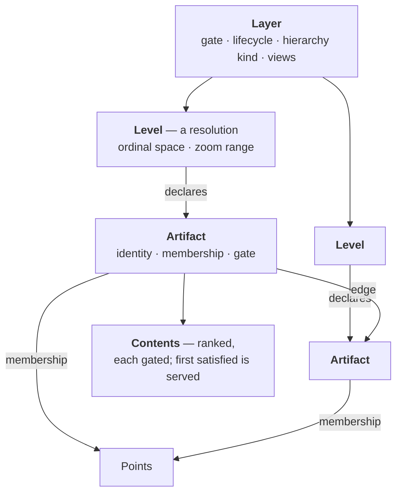
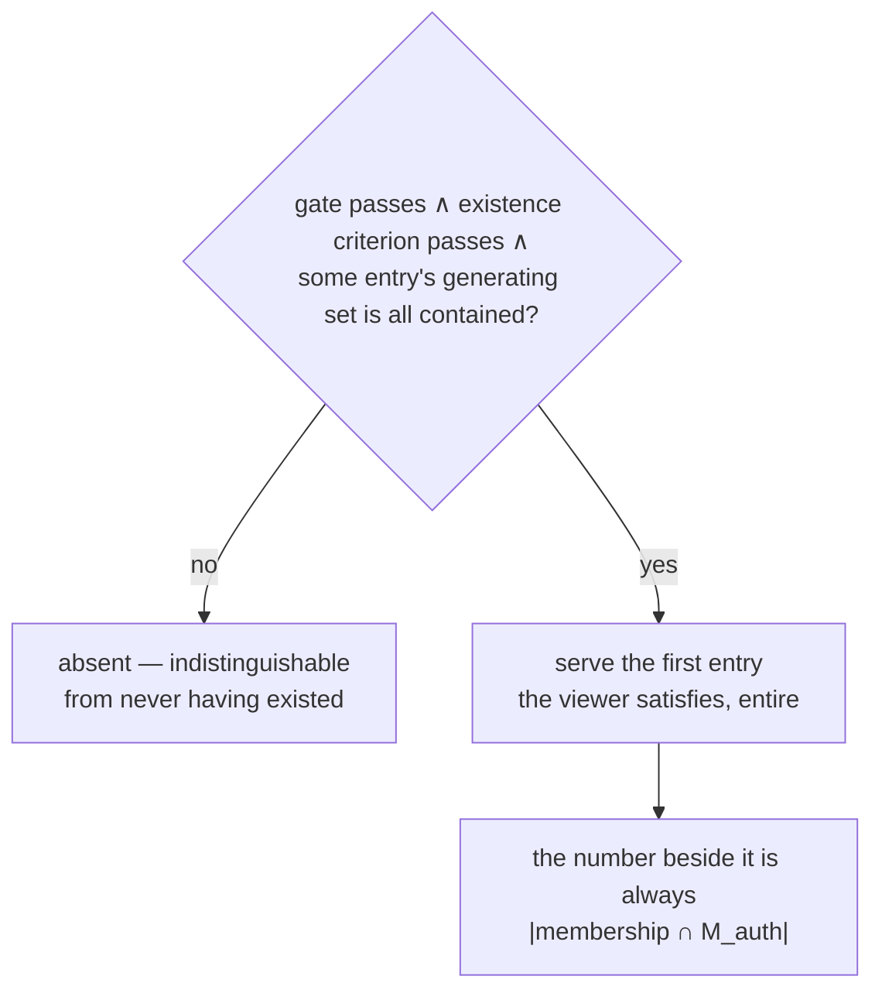
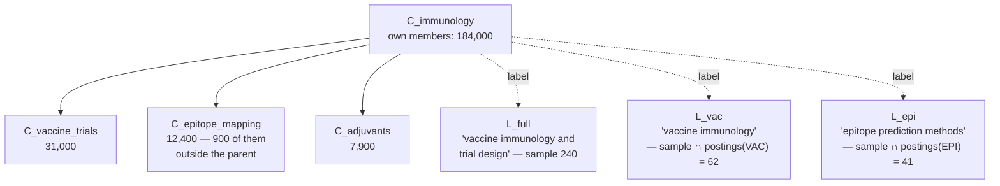

# Annotations — artifacts, edges and layers

**Date:** 2026-08-15 · **Promoted:** 2026-08-16
**Status:** **Normative for the annotation model** — what an artifact, an edge and a layer *are*, and what governs whether one is served. Reviewed under three lenses (Stage 0, 2026-08-15; the record is [`2026-08-15-artifact-design-review.md`](../evidence/memos/2026-08-15-artifact-design-review.md)) and ruled by decisions [0074](../decisions/0074-row-less-entities-are-allocated-downward.md)–[0083](../decisions/0083-the-frontier-is-a-request-time-budget.md). The two amendments owed to the normative architecture are **performed** — §7.5's descent and §7.7's ladder, architecture r43, which also carries the register rows this design owes. `architecture.md` remains the specification and wins every conflict; [`annotation-write-cycle.md`](annotation-write-cycle.md) owns the write cycle, and where this document disagrees with it, that one wins.
**⊘ Five things are open inside a normative document, each due at the stage that needs it** — this is deliberate, and they are marked ⊘ at their sites rather than held against promotion: search's containment gate (the review's ruling 5 — Stage 8), the filter axis (§11 — Stage 8), membership packaging ([`annotation-representation.md`](annotation-representation.md) §2.4 — Stage 2), the proportional criterion's denominator for predicate membership (§5 — Stage 6), and the edit pass ([decision 0077](../decisions/0077-supplied-content-lives-in-the-record-blob.md) defers it — Stage 7). None of them blocks the spine, and each is named where an implementer meets it. The measurements [`annotation-representation.md`](annotation-representation.md) §11.3 lists are owed on the same terms — allocated to stages, not to promotion.
**Supersedes** the retired `derived-artifact-gating.md`, whose taxonomy this collapses — three gates become one containment test plus one existence criterion (§4, §5); that document is deleted (2026-08-15). What existed nowhere else is carried here: the point-scale cardinality argument for edges and the structural form of an edge gate (§5), and the induced-subgraph sampling problem, parked by name (§11).
**Reads against:** design §5.1, §7.5–§7.8, §8.4, §12.3, Appendix C (C1, C2, C3, C7, C11, C12, C17, C23); contracts §2.2, §2.6, §3.2; [`views-and-multi-table.md`](views-and-multi-table.md) §3; decisions [0005](../decisions/0005-tessera-id-keyed-bijection.md), [0006](../decisions/0006-per-session-handles-retired.md), [0028](../decisions/0028-postings-requirement-and-the-pair-relation.md).
**Citation convention:** unprefixed §n is the architecture design; this document's own sections are cited as **spec §n**.

> **⊘ Almost none of this is built.** There are no artifacts, no layers and no membership structure.
> What exists is the entity allocation the design turns on
> ([decision 0073](../decisions/0073-entity-ties-are-ordered-by-morton-code.md)'s Morton tiebreak, in
> both build paths). Every other claim below describes a mechanism, never a property the system has
> today. **Status lives in [`artifact-delivery.md`](../artifact-delivery.md)**, by owner direction —
> not in issues [#13] and [#41], which describe the capability from outside and are not the record.

---

## 1. What this is for

The service serves things that are not points — clusters, labels, boundaries, regions, tags — and
the corpus has three rules for them in two sections, with a fourth artifact type left to find
precedent among contradictory answers. The retired `derived-artifact-gating.md`
identified the unification: each is *a named subset of the point set plus an attachment*. It
unified the **gate** and stopped there.

Four requirements have arrived since that are not answerable from the gate alone (owner,
2026-08-14/15):

- A point need not belong to any cluster, and several clusterings may coexist over the same points.
- An artifact may carry its own security label — **instead of** or **in addition to** its members'.
- There may be 10<sup>7</sup> artifacts, not the 10<sup>5</sup> that document assumes.
- Artifact identity must work across views.

And one shape the model must express: **hierarchies that do not cover in either direction.** A
cluster's children need not exhaust its points, and a child may hold points its parent does not.

The model that answers all five is smaller than the one it replaces. It is three object kinds and
three questions.

## 2. The model



*Configuration lives on the layer, resolution on the level, membership on the artifact; structure is
edges. An artifact may carry ranked contents at different gatings (§2.3). Nothing is configured per
artifact, and an artifact is addressed `(layer, level, ordinal)` — internally only: on the wire an
artifact is its `tessera_id` and nothing else, the ordinal never leaving the server (ruled;
[`annotation-write-cycle.md`](annotation-write-cycle.md) §5).*

**An artifact** is an identity, a membership set over points, zero or more edges to other artifacts,
and content. Content is either **supplied** — authored, corpus-independent or declared — or
**derived**, recomputed per viewer from masked members. Its content may be a ranked list of
**contents** at different gatings — the same artifact, one identity, the first entry a viewer
satisfies being the one served (§2.3).

**A layer** is the unit of declaration, configuration and reachability: one clustering, one label
set, one boundary collection. At 10<sup>7</sup> artifacts, per-artifact configuration would
outweigh the artifacts; more importantly, the properties that need declaring — what kind of thing
this is, how deep to descend, who may know it exists — are properties of the analysis rather than
of any member of it.

**A level** is a resolution within a layer, and every layer has at least one. §2.1 separates the
two, which earlier revisions did not.

**An edge** relates two artifacts. Parenthood is an edge; a label attaching to a cluster is an
edge. Edges are declared, never derived: the engine asserts no relation the caller did not state.

**A layer's parent edges are all within one level or all between levels, and which decides what they
are for** ([decision 0087](../decisions/0087-cross-level-edges-are-information-not-rollup.md)).
Within a level they are roll-up — the ladder a request's artifact budget climbs when it cannot draw
everything. Between levels they are information — what contains what, so a client can nest what it
draws or filter to one subtree — and a budget is inert, the resolution being the level the client
asks for. A layer declares which shape it has and may not mix them. An **attachment** is neither: it
is a visibility term, and an artifact carrying one is withheld when its target is (§2.2).

### 2.1 Layer against level

**A layer is what shares a gate and a lifecycle. A level is a resolution within one.** The two words
were used interchangeably in earlier revisions and are not interchangeable; the address settles it,
since an artifact is named `(layer, level, ordinal)` and all three components are load-bearing.

**What follows from the split**, rather than a rule for deriving it — §2.2 makes the grouping the
caller's choice. Artifacts in one layer share a gate, a lifecycle and a name; artifacts in different
layers share nothing.

| Belongs to the **layer** | Belongs to a **level** |
|---|---|
| identity and name — what a registry lists | its artifact set |
| the **gate**: whether a viewer may know this analysis exists | its ordinal space and reserved entity run |
| lifecycle: create, drop, replace, tombstoned name | its representation and membership source |
| hierarchy kind — flat, nested, stacked or tiered | its advisory zoom range |
| the **own-terms flag** and **existence criterion** its artifacts use (§5) | its containment-verification result |
| which views it appears in | |
| relations to other layers | |

**A flat layer has exactly one level**, and nothing about it is special-cased: a hand-built selection
set, a review queue and a boundary collection with a single administrative level are all one-level
layers.

**Stacked levels sit in one layer where the caller publishes them together**, even with no edges
between them — three HDBSCAN runs released as one clustering are authorised and refreshed as one.
Independence of *structure* is not independence of *lifecycle*, and it is lifecycle a layer boundary
tracks.

**The existence criterion is a layer property**, and a per-level override may only **raise** it,
never lower it. The criterion is a disclosure control, so a per-level knob that could relax it in
one place is the fail-open direction; monotone-upward is the same shape as **I12**'s rule that a
filter may move the frontier up and never down.

**What a client toggles is usually a layer** — *show clusters, hide boundaries* — and it may
additionally pick a level within one. Both are request selection (§6.1); neither reaches inside a
level, where artifact selection is the server's.

**A label layer is a layer, not a level of the clustering it names.** It has its own gate, its own
lifecycle and its own artifacts, and its edges name a target `(layer, level, ordinal)` — so it is
republished when the naming step re-runs without the clustering moving. Its artifacts are gated individually,
and may carry ranked **contents** resolved first-available (§2.3).

### 2.2 The vocabulary is the map industry's

**These are the standard words, used the standard way** (owner ruling, 2026-08-15). A layer is a named
collection of features you toggle — MVT's layer, QGIS's layer, what the layers panel lists — and this
corpus already speaks that way, `client-interaction.md` §8.3 having the XYZ adapter *"emitting a
points layer, a cells layer … and later a labels layer"*. A **level** is a resolution within one:
administrative level, zoom band, level of detail.

| Here | Map tooling |
|---|---|
| **layer** | MVT / QGIS / MapLibre **layer** — one-to-one on the wire |
| **level** | admin level (`admin_0/1/2`), zoom band, level of detail |
| **artifact** | **feature** |
| a level's advisory zoom range | a tile schema's `minzoom` / `maxzoom` |

An earlier revision called the layer a *family* and the level a *layer*, which collided with the
corpus in its own tile-serving section and would have forced a translation on every style sheet
written against this service.

**Whether a hierarchy is one layer with three levels or three layers is the caller's modelling
choice**, not something this design derives *(owner, 2026-08-15; an earlier revision presented §2.1's
test as a rule, which overreached)*. Administrative boundaries are the case: a tile schema
conventionally publishes countries, states and counties as three layers, and grouping them as three
levels of one is equally defensible.

**What the choice decides is what they share**, which is the useful form of the guidance:

| Model them as | They share | Which means |
|---|---|---|
| one layer, three levels | one gate, one lifecycle, one name | authorised together, refreshed together, dropped together; a client picks a level within the toggle |
| three layers | nothing | independently gated, independently refreshed, three entries in the toggle list |

Neither is more correct. **Restricting counties but not countries requires three layers**, because a
gate is a layer property; publishing a mapping agency's release as one revisable unit argues for one.
The caller decides and the engine honours it.

**A label is an artifact, not an attachment.** It carries its own membership — the sample it was
generated from — its own gate, and an edge to the cluster it names. §2.3 records why: a label's
visibility does not follow from its cluster's, a synthesis can be more sensitive than its sources,
and a label that leaks must be suppressible *now*, which addresses an entity.

**Several labels for one cluster are either ranked contents of one artifact or separate artifacts,
and the caller decides which.** Ranked contents are one label described at several clearances,
resolved first-available; separate
labels are different statements, all served to whoever satisfies them. §2.3 implements only the
first, because only the first is a question about access.

### 2.3 Ranked contents: one artifact, one identity, several gatings

**An artifact's content is a ranked list, and each entry has its own gate. The list is
ranked by the caller, and a viewer is served the first they satisfy — entire — or nothing at all**
(decisions [0078](../decisions/0078-the-service-takes-no-opinion-on-which-variation.md),
[0076](../decisions/0076-an-artifact-is-served-whole-or-not-at-all.md)). That is the whole
mechanism, and nothing else about choosing what to show belongs in the service: the ordering is
supplied, never derived, because only the caller knows why one entry precedes another.

**They are the same artifact.** One identity, one membership, one entity — an entry sets *which
content this viewer sees*, not which object they are looking at. An earlier revision made each
candidate its own artifact with its own entity; that was wrong, and the identity question the owner
asked twice is what it was wrong about.

**Which means ranked contents need nothing new.** §4 already gates content by containment on its
generating set. An entry is a `(content, gate, rank)` triple on an artifact that already exists, and
resolution is that same test run down the list. No per-entry entities, no per-entry ordinals, no
per-entry identifiers, and nothing added to the deny lane.

**Why this belongs in the service when the label ladder did not.** A ladder asks *which of these
different things is best* — quality, preference, product judgement, the caller's throughout. Ranked
contents ask *how is this same thing described to someone with this clearance*, which is a permission-masked
service's entire subject. The first is presentation and was three revisions of machinery this document
should never have grown. The second is access control and is one rule.

| | Ranked contents of one artifact | Separate artifacts |
|---|---|---|
| What they are | one thing, described at different clearances | different things |
| Identity | **one** | one each |
| Served | the **first** the viewer satisfies | **every** one the viewer satisfies |
| Chosen by | the declared rank | nobody — the caller decides what to do with them |

**The caller decides which they have**, and that is the *"driven by the user"* half. Toponymy's
candidates modelled as ranked contents of one label get first-available; modelled as separate labels they all
arrive and the caller's interface picks. Neither is more correct; the service implements only the
first, because only the first is a question about access.

**Emergency withdrawal uses what exists, which was the objection to a shared identity and does not
survive.** If one entry turns out to disclose, suppress the **artifact** — immediate under Rule S,
fail-closed, and the intermediate state is the safe one — then edit the bad entry out and
unsuppress. **⊘ The edit step is deferred to a design pass of its own** *(owner, 2026-08-15;
[decision 0077](../decisions/0077-supplied-content-lives-in-the-record-blob.md))*, so the path as
written does not exist yet and the withdrawal that does is **suppress,
then republish the layer without the offending content**. That is slower and it is not weaker: the
suppression acts at the ack, fail-closed, and the republish makes it permanent.

**Editing is not the obstacle it was drafted as, and the reason is worth keeping.** Supplied content
lives in the record blob at the artifact's own entity
([decision 0077](../decisions/0077-supplied-content-lives-in-the-record-blob.md)). Bundle files are
immutable and digest-verified, so nothing is mutated under a live reader — but every writer here
already publishes rather than mutates, a record lives in a single 256 KiB block and never straddles
two, and a publication is a write-then-rename. An edit is therefore a republish of the extent the
content sits in, which is small when that extent is the artifact population's own. What must **not**
be done is writing the edit as an additional record layer: the stack takes the first matching layer
and rests on layers being disjoint, so a second layer for the same entity serves the **pre-edit text,
silently** — the trap this paragraph originally mistook for a prohibition.

**A viewer who satisfies no entry receives nothing for that artifact**
([decision 0076](../decisions/0076-an-artifact-is-served-whole-or-not-at-all.md)): no shell, no
announcement, and **C3** holds as written. Derived content — a hull, a centroid, a count — is
recomputed from `membership ∩ M_auth` whatever entry resolved, because it was never one of the
ranked contents (§4).

**One membership, several samples.** An artifact declares one membership, and the number beside it
is that membership's masked count, unmodified, whatever entry resolved
([decision 0075](../decisions/0075-the-masked-count-is-an-existence-criterion.md)). An entry's
sample lives in its generating set, where it governs that entry's containment — the count never
describes the sample and never claimed to. A caller for whom the membership *is* the sample (§2.2's
labels) declares one that stands for the artifact as a whole, knowing each entry still gates on
its own set.

**This reduces §7.7 from a mechanism to guidance**
([decision 0078](../decisions/0078-the-service-takes-no-opinion-on-which-variation.md); ⊘ the
amendment to §7.7 is owed at promotion). Its five tiers remain what §7.8 uses them for — advice on
which generating sets to produce. A caller wanting the ladder's behaviour expresses it as ranked
contents; the service neither knows nor needs to know that is what they are doing.

**The check that would have saved three revisions:** *does this decide something about **access**, or
about **presentation**?* Access is Tessera's. Presentation is the caller's. A design that finds itself
ranking things by **quality** has crossed the line; ranking them by **clearance** has not.

## 3. One existence test, and one number

**An artifact is served to a principal entire, or it is absent — indistinguishable from one that
never existed** ([decision 0076](../decisions/0076-an-artifact-is-served-whole-or-not-at-all.md)).
There are no levels of restriction within a single artifact: no state in which a viewer may know a
label exists but not read it, and no artifact present with some of its content missing. Ranked
contents (§2.3) are the shape that rule takes, not an exception to it — a viewer is served exactly one,
entire, or nothing.



*Resolving one artifact for one viewer: one conjunction, evaluated once. Containment failures fall
through the ranking; a viewer who satisfies none sees no artifact.*

**Existence** is one conjunction: the layer gate, the artifact's own terms if it carries them (§5),
the existence criterion if one is declared (§5), and containment of every corpus-derived content the
resolved entry carries (§4). Derived content is contained by construction; corpus-independent
content has an empty generating set and constrains nothing. This restores the corpus's own position:
§7.6's normative rule is that a principal never learns of the existence of a label they cannot see,
and it now holds for the general object — **C3** holds as written, because nothing is ever withheld
from a served artifact, so there is no shell to be distinguishable from absence.

**The number beside a served artifact** is always the masked count of the artifact's **own declared
membership**, unmodified. Never a build-time count, never a count over anything the caller did not
declare, never anything derived from a set the viewer cannot see — and never a withheld or coarsened
one, because a partial artifact is forbidden
([decision 0075](../decisions/0075-the-masked-count-is-an-existence-criterion.md)). This is **I2**
at the artifact.

The test composes with the artifact's own suppression by consulting the overlay first, on every
route — specified in [`annotation-representation.md`](annotation-representation.md) §4 and carried
by [`annotation-write-cycle.md`](annotation-write-cycle.md) §5.

## 4. Content: one containment test

The existing taxonomy has three gates for three kinds of attachment — containment for labels,
nothing for per-viewer hulls, nothing for corpus-independent boundary shapes. They are one test
with different inputs:

| Content | Generating set | Consequence |
|---|---|---|
| Caller-supplied label, summary, description | declared (§7.8: the prompt sample) | the real test — `and_cardinality(G, M_auth) == \|G\|` |
| Recomputed per viewer — hull, centroid, count, extractive terms | inside the mask by construction | passes automatically |
| Corpus-independent — an authored name, a gazetteer polygon | **empty** | vacuous, always served |

The middle row is §7.7's own argument for the extractive tier — *"its generating set is by
definition inside the mask, so it always satisfies I3"* — read as the general rule rather than as a
property of one tier. The bottom row is the fourth row of the old gating table, which stops being a
separate rule.

**Containment is not a coverage fraction.** A viewer seeing 60% of the corpus fails a 240-document
generating set almost surely; a viewer seeing 0.4% of it satisfies a single-term generating set
completely. What decides is *which* terms, never *how many* items — which is why terms are what
make the test tractable (**I5**: everyone satisfying *T* sees every item under *T*), and why
§7.8's per-term generating sets are the mitigation for label creep rather than a refinement of it.
§8's worked example shows both viewers failing the same label and both satisfying its per-term
variant.

**Derived content is always masked, whatever the gate says.** This is the rule that keeps an
own-terms gate honest (§5) and it is stated separately because it is the fail-open: an artifact whose
own terms authorise it is authorised to *exist*, not to describe its members. Serving a build-time
hull or a build-time count for such an artifact discloses the members the gate did not cover.

### 4.1 Two axes, not a type enumeration

*"A cluster has a centroid and a count"* is not a fact about clusters. It is a fact about having a
membership set and coordinates in a view, and every artifact with those has the same derived
vocabulary available to it. **The derived properties follow from what an artifact has, never from
what kind of thing it is called** — which is what stops the model needing a type enum, and stops the
fourth artifact type being a code change.

What separates a cluster, a boundary and a point-plus-radius blob is two questions, and the
important one is not the obvious one:

| | Corpus-independent | Corpus-derived |
|---|---|---|
| **Supplied** — authored at build, frozen | gazetteer polygon, authored extent, a name → empty generating set, always served | a k-means centroid, a supplied hull, a label → **containment** |
| **Derived** — recomputed per request | *(empty: anything the engine computes, it computes from members)* | count, centroid, box, hull → safe by construction |

**The top-right cell is the one to design against.** A centre and radius fitted by the caller over
full membership *looks* like the geometry the engine would derive and is nothing of the kind: it
describes members the viewer may not see, so it carries a generating set and gates like a label. A
supplied hull is the same trap in a shape nobody thinks to check. The distinction that governs is
where the geometry came from and who computed it — never whether the object is called a cluster or a
polygon.

**Both may be present, and must not be conflated.** A boundary can carry a supplied shape that
follows the gate and a derived centroid that follows the mask. Serving both is correct; letting the
supplied shape imply anything about the derived number is the display error, and it belongs in the
client's obligations rather than the server's.

### 4.2 Declaring derived content

A layer declares which derived properties its artifacts expose, from a closed vocabulary the engine
implements — **`centroid`, `box` and `hull` as built** (Stage 3), each computed from the visible
rows and served in the grid units the point path already uses, so a client needs no quantisation
extent to draw one. **`hull` is a concave (alpha) shape over the visible members, not their convex
wrap, and it carries one ring per separated group of them rather than one ring per artifact** — see
below. A name outside the vocabulary is **refused at registration** rather than
accepted and quietly omitted: an artifact served without content its layer declared cannot be told
apart, by a client, from one whose content was withheld — and nothing is withheld from a served
artifact. ⊘ **`extractive_terms` is specified and not implemented**, and is therefore refused with
the rest; a layer that wants it waits for the term route rather than registering and receiving
silence. **Count is intrinsic** — every artifact has a masked count, and the existence criterion
requires it computed regardless. Everything else is opt-in, because a hull over masked members costs O(visible
members) per artifact per request where a count is one bitmap operation, and a client drawing only
centroids should not pay hull cost for every artifact on screen.

**The hull follows the members rather than wrapping them.** A cluster found by density is an
irregular region — crescent, branching, often both — and its convex wrap swallows the empty space
between the arms, overlaps every sibling, and draws single straight edges across the whole viewport.
The shape served is instead a concave one over the same visible members: start at the convex wrap,
which contains every member, and repeatedly replace the longest edge `(a, b)` above α with
`(a, c)` and `(c, b)`, where `c` is the visible member closest to the line through `a` and `b` among
those on the interior side of it that project inside the segment. Being the *closest* is what makes
the carved triangle empty of members, so the shape contains every visible member at every step; the
whole construction is exact integer arithmetic, so it is a function of the member positions and of
nothing else.

**And it is several rings where the members are several clouds.** A membership can be two separated
regions, and one ring around both claims the ground between them — a claim digging cannot undo,
because it works inward from a boundary and a gap with a ring on both sides is reachable from
neither. So the visible members are grouped first, at the same α, and a ring is dug per group; each
ring holds every member of its own group. The geometry, the grouping rule and what it gives up are
[`artifact-shapes.md`](artifact-shapes.md)'s, which is normative for them.

Two parameters, and **neither is a caller's to set**. **α is derived from the shape's own edges** —
three times the median edge of that principal's convex wrap — so two principals' shapes differ only
because their memberships do, and a request cannot dial one; a densely sampled convex cloud keeps
its wrap unchanged, and a point set in convex position keeps it exactly, whatever α is. And digging
spends a **bounded vertex budget**, longest edge first and **per artifact rather than per ring**, so
a shape carries at most 64 vertices beyond what its groups' wraps carried and several groups do not
multiply the wire. The budget rather than an absolute cap is forced: every vertex is a visible
member's position and every member is inside a ring, so the wraps' own vertex count is a floor —
going below it means either leaving a member outside every ring or inventing a vertex no member
occupies.

**No leak-register row follows, and the argument is short.** The inputs are the same
`membership ∩ M_auth`, the derivation is the same per-request one, every vertex is a visible member's
position either way, and the result is a *subset* of the convex hull — it says less about where the
members a principal cannot see are sitting, not more. Several rings say less again: they are the
same members drawn without the ground between them. Nothing here lets a viewer end up knowing
something about data they were not served, which is the register's inclusion test
(design Appendix C's head note). Measured on the 2.4M-document corpus in
[`2026-08-26-concave-hulls.md`](../evidence/memos/2026-08-26-concave-hulls.md): shapes 14% tighter in
area on average, 1.4× the convex path's time over a whole 197-artifact layer, and the hull columns
four times the bytes they were.

**The declaration is therefore a cost control, not a security control**, and carries the same status
as the pruning policy (spec §6.1): it may be changed without review, because every value it can take
is safe. What makes that true, and what lets the vocabulary grow without re-reading the leak
register each time, is one closure rule:

> A derived property is a function of `membership ∩ M_auth` and of nothing else.

*Median publication year of visible members* satisfies it and needs no register row. *Total
membership* does not, and is a disclosure. This is **I2** restated at the artifact, and it is what
keeps the artifact surface a counting surface rather than a general aggregation endpoint (§15).

Illustratively, and **not** a contract — the wire and manifest shapes are contracts work:

```
layer "clusters/2026-08"           layer "boundaries/uk-2026"
  own_terms  none                     own_terms  public
  criterion  absolute 50              criterion  none
  structure  hierarchical, 3 levels   structure  hierarchical, LSOA→MSOA→LAD
  pruning    on, level 1→2            pruning    off
  views     [embedding-2026-08]      views     [geographic]
  derived    [centroid, hull]         derived    [centroid]
  supplied   []                       supplied   [shape: corpus-independent]
```

**`public` is a distinguished value, and an empty term list is refused at parse.** All three reviewers
caught an earlier revision writing `terms = []` here to mean *everyone* — two paragraphs after §5
recounts that empty-required-set-admits-everyone was the view-gate error caught in review. Under
§5's intersection semantics an empty list denies everyone, so the sketch was only readable as
empty-means-admit-all: the caught error, reintroduced in the illustration. The model had no way to
say *public*, which is why the reach for `[]` was inevitable.

**The criterion has no default, and its absence is declared rather than implied**
([decision 0075](../decisions/0075-the-masked-count-is-an-existence-criterion.md)). A layer that
wants no criterion says `none` in the field that means it; a declaration with the field missing is
refused at parse. Under the old three-mode enumeration one schema word — *substitutive* — switched
the criterion off as a side effect; making absence its own statement is what closes that path
([decision 0079](../decisions/0079-the-gate-is-one-flag-not-three-modes.md)).

**Two fields carry a security consequence, not one** *(review finding)*. Whether a supplied item is
corpus-independent — declaring a fitted centroid corpus-independent would serve it to every
principal. And **the own-terms flag**: whether an artifact's own terms are the right ones is a
caller assertion the service cannot verify. Both are of **C12**'s class and belong in the register
beside it. A gate *change* on a populated layer restates by direction: narrowing — adding or raising
a criterion, setting the own-terms flag — is safe in place; widening — removing or lowering a
criterion, clearing the flag — un-hides previously absent artifacts and goes through
suppress–edit–unsuppress at the layer, an owner-visible event rather than configuration
([`annotation-write-cycle.md`](annotation-write-cycle.md) §6). That direction rule is the line
separating these two fields from the derived vocabulary above, where every value is safe.

## 5. Existence: one flag, one criterion

A layer declares two independent controls for its artifacts, and both are conjuncts of §3's one
test ([decision 0079](../decisions/0079-the-gate-is-one-flag-not-three-modes.md)):

- **The own-terms flag** — *does an artifact carry its own access terms?* If it does, a viewer must
  satisfy them before the artifact exists for them. The flag generalises **C23**'s authored gate —
  accepted as caller's control, existing precisely so that a thing nobody has populated yet can
  still be named — and its composition rule is *terms first, always*: a healthy masked count must
  never surface an artifact whose terms the viewer does not hold.
- **The existence criterion** — serve iff the masked count clears a declared bar
  ([decision 0075](../decisions/0075-the-masked-count-is-an-existence-criterion.md)). It takes one
  of two forms: **absolute** — masked count ≥ *N* visible members — or **proportional** — masked
  count ≥ *p* of the artifact's **declared** membership. The proportional form is the one that
  scales: a fixed bar of fifty protects a cluster of a hundred and does nothing for a cluster of
  ten thousand, where fifty visible members is half a percent. The criterion is a disclosure
  control, so it has no default and its absence is declared, not implied (§4.2). It never touches a
  number: the count beside a served artifact is the masked count, unmodified (§3). What it protects
  is the existence of a **corpus-derived grouping** — without it, a principal holding a sliver of
  the corpus reconstructs its topic structure from hundreds of clusters each asserting *the
  clustering found members here*.

⊘ **The proportional form also breaks rollup's monotonicity** (§6): a ratio does not shrink from
parent to child, so a passing child can sit beneath a failing parent in a properly nested tree
([decision 0082](../decisions/0082-a-hierarchy-lives-in-edges-levels-are-resolutions.md)). A layer
declaring it must expect gaps in its lineage.

The proportional form reads the declared, unmasked membership size as a **predicate input** — it
has no field in the representation and no wire shape carries it, because a corpus-wide count over
items a principal may not see is C8 ([`annotation-representation.md`](annotation-representation.md)
§2.4). ⊘ **It has no denominator for predicate membership, and this is an open owner rule**: *"the
points inside this shape"* declares no member set and its size changes at every write. Either
proportional criteria are refused on predicate layers, or a denominator is defined and priced;
until ruled, a predicate layer can only declare an absolute criterion or none.

The old three-mode enumeration was this two-by-two in three names, and this is the owning site for
the translation:

| The old mode name | In the two controls |
|---|---|
| **derived** | no own terms; criterion declared |
| **substitutive** | own terms; no criterion |
| **conjunctive** | own terms; criterion declared |
| *(it had no name for this)* | no own terms, no criterion — a density level ([`annotation-representation.md`](annotation-representation.md) §10) |

The fourth cell is a real configuration — an artifact whose existence discloses nothing and whose
count is masked — and the recast reaches it without a special case. What the enumeration cost was
that one schema word disabled a disclosure control: a corpus-derived clustering mis-declared
*substitutive* served the existence and count of every cluster down to one member. Under the flag
the criterion's absence is its own statement, unreachable by accident from an unrelated choice.

Composition is **conjunction, never disjunction**, in the same shape as `M_sel = M_auth ∧ filters`.
Satisfaction of an artifact's own gate label is the item-visibility predicate verbatim (§6.1) —
intersection with the principal's satisfied set, not a conservative label join, which yields an
empty required set for a disjunctive gate and admits everyone. That error has been made once
already, in the view gate, and was caught in review.

**A layer has a gate too, and it governs reachability.** Whether a viewer may know this clustering
exists at all, independent of any member. Resolved once per session and keyed on the layer version —
a gate edit bumps the key, and a live suppression check on the layer's own entity runs ahead of the
cached resolution ([`annotation-write-cycle.md`](annotation-write-cycle.md) §6, which supersedes the
resolve-once-at-authorise rule an earlier revision stated here: that rule held every open session on
a pre-edit gate for the session's remaining life). The request-time check is a set-membership lookup
identical in work for a gate-failed name and a never-registered one; a request naming an unreachable
layer is indistinguishable in outcome and in work from naming one that never existed. This is the
view gate's mechanism ([`views-and-multi-table.md`](views-and-multi-table.md) §3) applied to a
second object, cited rather than re-derived — **⊘ and the mechanism cited is itself provisional and
unbuilt**: the view registry design is not normative and has no code behind it, so this imports a
shape, not machinery. It narrows and never widens.

**Edges are filtered like everything else.** A viewer learns a child or a label exists only if they
may see it, and **no degree, child count or label count is ever served** — a parent reporting three
children while delivering one is a count of what the viewer cannot see, arriving through a field
nobody thinks to check.

**An edge into an artifact you cannot see is not traversable.** A label is a statement about a
cluster, so serving it announces the cluster; a label's visibility is therefore conjunctive with
its cluster's. Terms first, applied to an edge rather than to a gate.

**Edge populations at point scale keep the rule and break the mechanism** (carried from the retired
`derived-artifact-gating.md`, which recorded it first). A sparse graph over 10⁹ points carries
10⁹–10¹⁰ edges, so a per-item visibility test is impossible however correct it is; edges at that
scale need the *points'* machinery — an ordering, contiguous ranges, bitmap arithmetic. The
structural form of their gate: with edges sorted by `(source, target)`, the visible set is the
adjacency runs of visible sources intersected with visible targets — O(visible edges), bounded by
the mask rather than by the corpus. Getting the gate right does not mean the population is handled:
a correct rule at an impossible cardinality is not a design. ⊘ Point-scale edges are unscoped;
nothing here builds them, and their sampling problem is parked by name in §11.

## 6. The frontier is a per-artifact test

§7.5 descends from the root, evaluating masked counts and stopping below threshold, so that
insufficient visibility becomes rollup rather than suppression. **That descent is dropped**
([decision 0080](../decisions/0080-the-frontier-is-a-per-artifact-test.md); ⊘ the amendment to §7.5
is owed at promotion), and artifacts are tested independently instead.

**A tree and a level set are different structures, and neither carries the other**
([decision 0082](../decisions/0082-a-hierarchy-lives-in-edges-levels-are-resolutions.md)). A nested
layer's hierarchy is its **edges** and it declares no levels: a condensed tree is unbalanced, so one
region splits at depth two and another at depth nine, and a level number would say nothing about
position in the lineage. Levels are for resolutions that are semantic and balanced — an
administrative hierarchy, where a ward is a ward everywhere — and for **stacked** layers, whose
levels are independent analyses with no lineage at all.

**Rollup then needs no walk, and its condition is the criterion's form.** A child's members are a
subset of its parent's, so under an **absolute** criterion its masked count is never larger: a child
that fails while its parent passes leaves the parent served, tested on its own. That is rollup,
falling out of per-artifact testing. ⊘ **A proportional criterion breaks it** — a ratio does not
shrink downward, so a parent at 5% of 10 000 declared members can fail a 10% rule while its child at
50% of 200 passes it, with the child a strict subset throughout. A layer declaring
`require_member_visibility = { fraction = … }` must expect gaps in its lineage. No disclosure follows either way, since each artifact passed its own
test; what follows is a rendering consequence the caller chooses.

**What remains is frontier *selection*, which is a display concern.** Where a parent and a child both
pass, something must choose or the map draws both and counts the same points twice at two sizes.
That is a computation over the edges — for each passing artifact, does a descendant also pass — and
it is what §6.2's pruning policy names. It carries no disclosure argument in either direction:
serving the frontier serves strictly less than serving every passer, and serving every passer reveals
nothing beyond what each artifact's own presence already does.

**And it is where the response gets its bound, which levels had been supplying quietly**
([decision 0083](../decisions/0083-the-frontier-is-a-request-time-budget.md)). A viewport intersects
a root and every passing descendant of it, so the depth of the cut is a **request parameter** in the
shape of the mark budget a viewport already carries, and the layer declares only the default.
Artifacts cannot be sampled (`annotation-representation.md` §6.1), so a budget is met by **serving
ancestors instead of descendants** — reduction by the layer's own structure, which is what rollup is
*for* now that it is no longer needed as a disclosure behaviour.

**Depth is free where §8.4's depth was not**, and the two must not be confused for sitting in the
same place in a request. §8.4 fixed maximum depth against `M_auth` and never `M_sel` because there
the depth *was* the control; here the control is the criterion, evaluated per artifact against
`M_auth`, and every artifact a deeper cut reveals has already passed it. ⊘ **A budget resolving to
different depths in different branches is the honest general case and is unspecified** — one depth
for the whole tree is what a first implementation does, and it is visibly wrong on an unbalanced
tree, which is every real clustering.

**The descent is what should bend, not the data.** An earlier draft of this document defined a
node's *reach* as its own members unioned with its descendants', restoring monotonicity by
construction. That is recorded here as a **rejected** approach, because it is the obvious repair and
will be proposed again: it makes the engine assert a membership the caller never declared, so the
count and hull describe an invented set while the label describes the declared one — two
inconsistent statements about the same object, one of them ours. It also forecloses exactly the
non-covering analyses this model exists to carry.

**What replaces it is a per-artifact test.** Gather the candidates intersecting the viewport, and
test each independently against the existence criterion on its **own declared membership**. Serve
those that pass. The hierarchy then does display work — where a child and its parent both pass,
prefer the child at depth — and rollup emerges from independent decisions rather than being a
property of the tree. Where "descent" survives in this corpus it means that display pruning over
per-artifact outcomes, never a walk.

Three consequences, one of them a loss.

**It needs nothing from the data.** No containment, no covering, no nesting between levels. Every
artifact means what its creator said it means.

**The disclosure control gets easier to defend, not harder.** The existence criterion is small-cell
suppression, and the survey found no analogue anywhere for the tree-walk form — which is why C1's
outstanding review has no prior art whose failure modes it can borrow. A per-artifact test is a
suppression decision on one cell, evaluated independently, which is the census case the literature
is actually about. Several layers over the same points still give an attacker more overlapping
releases to difference, so that review gets **harder** on that axis; but it can now be conducted in
a field's own vocabulary.

**The rollup promise weakens, and should be stated weakened.** *"Nobody gets a blank region; they
get a vaguer ancestor"* was underwritten by covering. Without it, if nothing coarse enough passes
in a region, the viewer gets their points and no artifact. That is the caller's to fix by supplying
a covering top level, and it belongs in the labeller guidance (§7.8) as a stated consequence —
manufacturing an ancestor on their behalf is the rejected approach above.

### 6.1 Serving a *whole level or none* is a disclosure, and a louder one than the suppression it protects

**A rollup rule of the form "descend until a level contains a cluster you cannot see, then serve the
last level you can see entirely" leaks, and it leaks worse than serving that level partially.** Raised
by the owner, 2026-08-15; recorded because it is the intuitive formulation of rollup and it is unsafe.

**The inference.** A viewer held at level *k* knows they were held. If their own visible points at
level *k* obviously split — a tight sub-blob comfortably above the threshold on its own — then they
can reason that their sub-blob would have passed at *k+1*, so the level was withheld on account of
some **other** cluster at *k+1*, which must therefore exist and be below the criterion for them. That
is precisely the fact the existence criterion exists to hide: **the rule announces the suppression
instead of concealing it.**

**And it differences.** The signal is a single bit per level per viewport, so a viewer can pan the
offending region in and out of view and watch the level appear and vanish, localising the invisible
cluster to whatever precision their panning allows. That is the pan/zoom differencing route §7.5's
annotation records as never having been posed, arriving through the frontier's own shape rather than
through the counts.

**The per-artifact test (§6) does not have this property**, and this is the strongest argument for it
that this document had not made. Each artifact is tested alone and an absent one is indistinguishable
from one that never existed, so a viewer sees a **partial** level with no signal attached to what is
missing. The rule to state explicitly, because the unsafe variant is what a reader reaches for:

> **A level is served partially. It is never withheld because part of it is suppressed.**

**Unclustered points make the residual partly deniable, which is a second reason to permit them.**
HDBSCAN leaves 20–25% of points in no cluster (*measured*,
[`probes/2026-08-15-artifact-representation/`](../../probes/2026-08-15-artifact-representation/)), so
*"my points here belong to no cluster shown"* has an innocent reading. **The deniability is
statistical, not structural** — a tight blob of 500 of a viewer's own points with nothing covering
them is not plausibly all noise — and it should not be cited as a mitigation, only as the reason the
inference is weaker than the whole-level rule's.

**What survives is C1's accepted residual and no more:** a viewer can always reason *"my data is dense
here and nothing covers it, so something is suppressed"*. That is inherent to serving any
threshold-gated structure and the register accepts it at low severity. What the whole-level rule adds
is **amplification** — turning a local, deniable, per-artifact inference into a global, undeniable,
per-level one — and that is a regression rather than a restatement.

**Stacked hierarchies make it worse still.** Where levels are independent analyses rather than
coarsenings (`annotation-representation.md` §6.2), being held at level *k* is not being given a
vaguer answer — it is being denied a different one, so the withholding is both more informative and
less compensated.

### 6.2 Pruning is a policy, not a soundness property

Display pruning — omitting the sub-structure of a parent that failed its own test — can only ever
show **less**: it never surfaces an artifact below the criterion, and disabling it only reveals
artifacts that each passed their own test. Both settings are fail-closed, which is what makes this
configuration rather than a control.

**Containment and pruning are independent, and must not be derived from one another.** Containment
determines whether pruning is *lossless*. It does not determine whether pruning is *wanted*: "do
not show me sub-structure of something I can barely see" is a legitimate intent over a non-covering
hierarchy, and "show me every level at once" is legitimate over a covering one. The caller declares
the policy per layer, with per-level override.

**The build verifies containment and reports, rather than deciding.** One intersection per edge,
offline, naming the violating edges rather than the level. A caller running lossy pruning then
knows they are choosing it — the failure mode otherwise is that clusters a viewer is fully
authorised for silently do not appear, and the map still looks plausible.

**The viewport candidacy test applies either way**, so pruning-off tests what is on screen rather
than the whole hierarchy. The difference between the settings is a factor on a number that is
already small, not the difference between bounded and unbounded.

**Candidacy is a masked test, and no build-time box exists.** *Does this artifact have visible
members in this viewport* is `rows(A) ∩ tile_range ∩ mask_rows ≠ ∅` — exact, masked, and the
operation the viewport already performs ([`annotation-representation.md`](annotation-representation.md)
§2.1). An earlier revision pruned by a per-artifact bounding box computed at build over **full**
membership. That box is deleted, not qualified: serving wherever a full-membership box intersects
discloses the unmasked extent of a cluster by panning, the I2 channel found in the withdrawn §7, and
the representation removed the structure so the fault cannot be expressed. Nothing here needs boxes
to nest, because nothing here has boxes.

## 7. Artifacts are items — **withdrawn**

> **This section and its §7.1 are withdrawn** (2026-08-15), and replaced by
> [`annotation-representation.md`](annotation-representation.md). They asserted that artifacts are
> items in entity space and therefore inherit every entity-keyed structure — the term index, the
> value columns, the postings, the record blob — and that *"children I may see"* is one intersection
> against `M_auth`.
>
> **Three independent reviews returned findings that clustered almost entirely here.** The reuse
> claim is wrong in a way that matters: an artifact under the derived gate carries no terms, appears
> in no posting and is therefore never in `M_auth` (§6.3), so every route that tested visibility by
> intersection answered *invisible* for every clustering artifact and every viewer. Worse, `M_auth`
> is where suppression acts — so a gate evaluated against the satisfied term set never consults the
> overlay, and a suppressed cluster would have kept serving. That is a **fail-open**, verified
> against `crates/tessera-engine/src/compose.rs`.
>
> Two further findings belonged to the same section: candidacy by the build-time box served the
> **unmasked** extent of a cluster, observable by panning (an **I2** channel this document wrongly
> claimed C2 covered); and *"only points in this cluster is a set producer… with no new register
> row"* was wrong in both halves — per-tile counts under a membership filter give per-point cluster
> assignment, which is what `min_visible_members` exists to bound.
>
> The replacement answers eight questions the model does not: how artifacts are stored, how
> visibility is evaluated, how they are written and retired, served, filtered, searched, described
> and inspected. **The model in §1–§6 survived all three reviews** and is unchanged.

## 8. Worked examples

### 8.1 HDBSCAN and Toponymy — the baseline

A 40M-document corpus. Two layers:

| | `clusters/2026-08` | `topics/2026-08` |
|---|---|---|
| What | a Toponymy levelled clustering, 3 levels | its labels |
| Members | 12 / ~400 / ~9,000 artifacts | ~3 per cluster |
| Kind | structure-revealing | content-bearing |
| Own terms / criterion | none / absolute 50 | none / none |
| Edges | parent/child within the layer | into `clusters/2026-08` |
| Pruning | on, level 1 → 2 | n/a |
| Derived | count, centroid, hull | count |
| Supplied | none | the label text, generating set declared |

*The topics layer declares no criterion, so a label's existence rides entirely on containment: a
viewer for whom no entry's generating set is contained sees no label
([decision 0076](../decisions/0076-an-artifact-is-served-whole-or-not-at-all.md)) — which is what
the normative label rule (§7.6) already does. No fourth gate mode is needed; the containment
conjunct is part of §3's one existence test.*

One level-1 cluster and its neighbourhood:



*Non-covering in both directions: the three children hold 51,300 of the parent's 184,000 points, so
132,700 stop at the parent; and 900 of `C_epitope_mapping`'s points were unclustered at level 1, so
they sit in a child but not in its parent.*

Two viewers. **A** holds a broad term set and sees roughly 60% of the corpus. **B** holds one term,
`programme:VAC`, and sees 0.4% of it.

| | A | B |
|---|---|---|
| `C_immunology` — masked count | 110,000 → served | 610 → served |
| `C_vaccine_trials` | 18,600 → served | 380 → served |
| `C_epitope_mapping` | 7,400 → served | 22 → **absent** |
| `C_adjuvants` | 4,700 → served | 41 → **absent** |
| Hull | recomputed over 110,000 | recomputed over 610 |
| `L_full` (sample 240, 11 terms) | **fails** | **fails** |
| `L_vac` (62 docs, one term) | served | served |
| `L_epi` (41 docs, one term) | served | fails |

Four things this shows.

**The number beside a cluster is never its size.** A sees 110,000 against a declared 184,000, B
sees 610. Neither ever meets the 184,000, and the hull each receives is over their own visible
members — different shapes, both correct.

**Suppression is indistinguishable from absence.** B receives one child of three. Nothing in the
response distinguishes "no such sub-cluster" from "below the criterion", because unsatisfied candidates
are omitted rather than refused (§7.6).

**Containment is about which terms, not how much.** A sees 180 times more of the corpus than B and
they fail the same label, for the same reason: the full prompt sample spans terms neither holds.
Both satisfy the single-term variant. This is why label creep is the predicted failure mode and why
per-term generating sets are its mitigation, and it is the result most likely to surprise someone
reading the coverage figures.

**Pruning has a price, here made concrete.** The build verification reports that
`C_epitope_mapping` is not contained in its parent. Consider a third viewer **C** holding only the
term covering those 900 stray documents: `|C_immunology ∩ M_auth| = 0`, so the parent fails, display
pruning omits its sub-structure, and C sees nothing — though `C_epitope_mapping` has 900 visible
members and passes its own test comfortably. With pruning off for that level, C sees it. Neither
behaviour is a disclosure; the caller chooses, knowing which edges are lossy.

### 8.2 Administrative boundaries — supplied shape, masked number

`boundaries/uk-2026`: 35,000 artifacts over LSOA → MSOA → LAD, a hierarchy that *is* covering. Own
terms `public`, because a boundary exists whether or not the corpus does. Content: the polygon and
the name, both corpus-independent, so an empty generating set and unconditional service. The number
is a masked count and may be zero.

The trap this example exists for: **drawing only the boundaries that contain visible points is
small-cell suppression with a threshold of one.** Displaying a boundary would then assert *at least
one visible item here* and omitting it would assert *none* — precisely the threshold the census
literature identifies as too low, arrived at by a client-side decision that looks like no decision
at all. The choice belongs in the declared criterion, not in the client: declare none, and every
boundary is served with its exact masked count, zero included; declare one, and a boundary below it
is **absent, whole** — shape, name and number together.

**Nothing here suppresses or coarsens a number.** A ward and its district are two artifacts, on two
levels of one layer, joined by an edge — not one artifact whose number is drawn two ways. A ward
that fails the criterion is absent; its district holds more of the viewer's visible members, clears
the criterion on its **own** count, and is served whole with its own exact number. The viewer
receives a coarser object — which is what rollup always was, §6's per-artifact outcome arriving in
the geographic case. There is no state in which a shape is served and its number withheld: an
artifact with a withheld number is a partial artifact and forbidden
([decision 0076](../decisions/0076-an-artifact-is-served-whole-or-not-at-all.md), which withdrew
the "count-not-shape" split the retired `derived-artifact-gating.md` had flagged for review).

### 8.3 Per-analyst selections — the scattered set, and why a category is not enough

`selections/analyst`: one artifact per set an analyst has assembled by hand. No hierarchy, no
descent, no supplied geometry, and no computed content — the masked count, which every artifact
has, alone.

**A category value cannot carry this**, for three reasons that are each sufficient. It is a name and
a code with nowhere to record who defined the set, when, or why — and the provenance is most of the
point. A value per analyst per set churns a **published, gated** surface (**C11**) with objects that
have no business in the corpus's own vocabulary, and the codes themselves already carry an accepted
disclosure about vocabulary size (**C22**) that thousands of ephemeral sets would fill with noise.
And a category value's visibility is either membership-derived or an authored gate, where a private
selection wants neither. Artifacts scale to 10<sup>7</sup> by design; a vocabulary does not.

**The two controls are what settle it, and this is their best case in this document.** A bookmark
set of three items must not be suppressed by an existence criterion: the criterion is a disclosure
control over *corpus* structure, and a hand-assembled selection's structure is the analyst's own.
So the layer sets the own-terms flag — the analyst's term, or a team's — and declares **no
criterion**, in the field that means it (§4.2). Under the old enumeration that outcome arrived as a
side effect of the word *substitutive*; under the flag it is its own deliberate statement
([decision 0079](../decisions/0079-the-gate-is-one-flag-not-three-modes.md)).

Its count is still masked, which gives the behaviour that matters: a set of ten shared with a
colleague who cannot see three of its members shows **seven**. Not an edge case — the system working,
on the object most likely to be shared across a clearance boundary.

**The model degrades to this shape, and the degradation is the finding.** Everything in §6 assumes
spatial coherence — boxes prune, descent narrows, a hull means something — and a scattered set has
none of it. A layer with no hierarchy, no descent policy and no derived geometry is still a layer,
and costs nothing for the machinery it declines. What such a layer still wants and cannot have is
*does this set have visible members in this viewport, and how many*: a per-tile count per named set,
which is the structure sketched at §7.9 and never built.

**The test for category against artifact**, stated once: reach for a category when the value belongs
to the corpus's own vocabulary and many items carry it; reach for an artifact when the set needs an
identity, a gate of its own, or content. A single corpus-wide review queue is a category. A thousand
attributed selections are artifacts.

### 8.4 A restricted analytic — the layer gate

`clusters/incident-2026-08`, gate label `ir:analyst`, artifacts carrying own terms **and** a
declared criterion — the old conjunctive cell (§5).

A viewer without the term does not see the layer in `/v1/meta`, and naming it explicitly is
indistinguishable — in outcome and in work — from naming a layer that has never existed. Their
view of the points is unchanged: the same documents, no clustering over them. An analyst sees the
clustering, and each cluster still gates on its members, so the analyst term reveals the analysis
without widening what they may see of the corpus. A gate narrows and never widens.

### 8.5 A programme everyone can see, whose documents they cannot

`programmes/portfolio`: one artifact per research programme, own terms satisfied by any
authenticated principal and no criterion — staff must know a programme exists — over documents most
of them cannot read.

| Content | Kind | Served to a viewer with no visible members |
|---|---|---|
| Programme name, authored description | supplied, empty generating set | yes |
| Authored extent on the map | supplied, corpus-independent | yes |
| Document count | derived | yes, and it is **0** |
| Hull | derived from masked members | nothing — there are no members to hull |

This is the sharpest illustration of §4's last rule. The gate authorised the programme's
**existence**, and it would be a straightforward **I2** breach to answer the count from build-time
membership or to draw a hull over members the viewer cannot see. A zero count next to a named
programme is the correct answer, and the caller supplies an authored extent precisely because the
derived one is unavailable.

### 8.6 A point-and-radius clustering — supplied geometry that looks derived

`clusters/kmeans-2026-08`: 4,000 flat clusters, each supplied by the caller as a centre and a radius
fitted over full membership. No hierarchy. Superficially the simplest layer here, and it is the one
most likely to be got wrong.

The centre and radius sit in spec §4.1's top-right cell. They are **supplied** — frozen at build,
authored by the caller — and they are **corpus-derived**, because they were fitted over every member
including the ones a given viewer cannot see. So they carry a generating set and gate by containment,
exactly as a label does. Declaring them corpus-independent, which the schema permits and the service
cannot check, would serve every principal a shape describing documents they may not read.

| Content | Cell | Consequence |
|---|---|---|
| Supplied centre and radius | supplied, corpus-derived | containment against the fitted membership |
| Derived centroid | derived | over visible members only |
| Derived count | derived | the masked count, unmodified |

Which yields the behaviour worth noticing: **a viewer who fails containment on the fitted circle
sees no cluster at all** ([decision 0076](../decisions/0076-an-artifact-is-served-whole-or-not-at-all.md)).
The circle is corpus-derived, so failing its containment fails the artifact — there is no state in
which the existence, count and a recomputed centroid are served while the authored circle is
withheld. A caller who wants those viewers to see something declares it: a last-ranked **entry**
carrying no corpus-derived supplied content (§2.3), whose containment is vacuous and which serves
entire — existence, masked count, derived centroid — to everyone the gate admits.

The general lesson the layer exists to record: **the axis is where the geometry came from, never
whether the object is called a cluster, a polygon or a circle.** A supplied hull over an HDBSCAN
cluster is this same case wearing a shape that looks like the engine's own output.

### 8.7 Terms as artifacts — a case the model was not designed for

**Not scoped and not proposed** (owner observation, 2026-08-15). Recorded because it exercises the
model against something nobody had in mind while designing it, and because what it exercises is the
rule §4 turns on.

A term — the unit of authorisation — can itself be an artifact. Its membership is `postings(T)`,
which already exists in entity space, so the layer is a view rather than a structure and costs no
storage. Its supplied content is what a security administrator currently has nowhere to put: what
this classification means, who owns it, when it was last reviewed.

**The gate has exactly one safe default, and it is the term itself.** Under **I5** a term is
permission-homogeneous — everyone satisfying *T* sees every item indexed under *T* — so for a
principal who satisfies it, `postings(T) ⊆ M_auth` and the artifact's masked count *equals* the whole
posting count. A corpus-wide number, served only to someone entitled to every item counted in it,
which is not a disclosure. Give the artifact any other gate and that same number becomes a
corpus-wide count over items the viewer cannot see, which is **C8** — *high if exposed*.

**The case that motivates a different gate resolves without an exception**, which is the point of
recording this. An auditor holding `audit:terms` but not *T* should see the term's description and
provenance, and a count of what they can actually see. §4's split gives exactly that: the supplied
content follows the gate, the derived count follows the mask and reports whatever their own
authorisation admits. No new rule, and no special case for the object the rules are made of.

Two cautions if it is ever built. A term-artifact must not become a route to **enumerate the term
index** — §6.2's machinery sits inside the trust boundary, and making terms first-class objects on
the wire needs **C11**'s treatment applied to a second population. And gate evaluation must resolve
against the **already-computed** satisfied term set, never recursively: the objects being gated are
what gates are made of, and one level is all that is coherent.

## 9. What it costs

**Membership storage is the dominant artifact, and it is measured.** A level's membership sets sum
to roughly the corpus; L levels cost L times that, before labels. The campaign sized it at
~1 B/member in row space — 794 MB at 10⁹ rows with 10⁷ artifacts
([`annotation-representation.md`](annotation-representation.md) §2). Residency and packaging remain
open there (§2.4, §11.3).

**Per-artifact testing costs one `and_cardinality` per candidate on screen**, where the old descent
paid one per node visited and pruned subtrees. Under the measured cost model — bitmap operations
cost O(containers touched), not O(cardinality) — that is bounded by the masked viewport candidacy
test (spec §6.2) rather than by the hierarchy, but the constant is unmeasured.

**Build verification is one intersection per edge**, offline. At 10<sup>7</sup> edges that is
affordable and is not on any request path.

## 10. What this changes elsewhere

| Where | What changes |
|---|---|
| `derived-artifact-gating.md` | **Retired at promotion.** Its taxonomy collapses into §4's one test plus §5's flag and criterion; what existed nowhere else — the point-scale edge argument, the edge gate's structural form, the induced-subgraph sampling problem — is carried at §5 and §11. Its advice that cluster identifiers are ephemeral per rebuild dies with it: identity survives an edit ([decision 0081](../decisions/0081-a-replacement-mints-identities-an-edit-keeps-them.md)) |
| §7.5 | The frontier is a per-artifact test, not a tree walk (spec §6). Ruled ([decision 0080](../decisions/0080-the-frontier-is-a-per-artifact-test.md)); ⊘ **the amendment is owed at promotion** |
| §7.6, §7.7 | A label is an artifact. The ladder reduces to caller guidance (§2.3): the service resolves an artifact's ranked *contents* by clearance and chooses between separate artifacts never. Ruled ([decision 0078](../decisions/0078-the-service-takes-no-opinion-on-which-variation.md)); ⊘ **the §7.7 amendment is owed at promotion** |
| §7.8 | Add: rollup terminates only if the caller supplies a covering level; a contrastive labeller's generating set includes the contrast material |
| [Decision 0006](../decisions/0006-per-session-handles-retired.md) | Its node-handle carve-out is withdrawn |
| `records-and-search.md`, `filter-index.md` | The artifact population is its own population, named by the request ([`annotation-representation.md`](annotation-representation.md) §7–§8); search over it has **no containment gate as specified** — the route is withdrawn until the review's ruling 5 lands, the one ruling still open |
| Appendix C | C1 gains layers as a differencing surface; the own-terms flag needs a row of C23's shape; artifact identifiers fall under C17; a corpus-independence declaration on supplied content needs a row of C12's shape (spec §4.2). Drill-down's proposed row dissolved by measurement ([`annotation-representation.md`](annotation-representation.md) §8), with a staleness residue carried in [`annotation-write-cycle.md`](annotation-write-cycle.md) §11 |

## 11. Open questions

- **Artifact drill-down** — measured, and the escalation dissolved: resolving a layer's visibility
  set lazily at first touch costs 883 ms at 10⁷ artifacts (*measured*;
  [`annotation-representation.md`](annotation-representation.md) §8), restoring C4's structural
  closure with no register row. The reviewed write cycle qualifies the route — the resolved set is
  candidacy, the live count decides — and the residue, a held identifier serving a stale pass, is
  carried in [`annotation-write-cycle.md`](annotation-write-cycle.md) §11.
- ⊘ **The filter axis is unresolved, and [decision 0080](../decisions/0080-the-frontier-is-a-per-artifact-test.md)
  removed the last mechanism that gave it a partial answer.** The two-threshold frontier — the
  criterion against `M_auth` fixing depth, a display threshold against `M_sel` deciding how far
  within it — went with the walk. Under a filter, nothing now says which number sits beside an
  artifact — §3's masked count, or the filtered one — or what prunes a cluster the filter has
  emptied. Until stated, the per-artifact test runs against `M_auth` alone and filters do not touch
  artifact existence.
- **Membership sizing** — measured, no longer open (~1 B/member, 794 MB at 10⁹ rows with 10⁷
  artifacts; [`annotation-representation.md`](annotation-representation.md) §2). Residency remains
  unpriced there (§11.3).
- ⊘ **Membership packaging** — one file per artifact does not survive the bundle's digest model at
  10⁷ manifest entries; a packed form behind a bounded number of entries is owed
  ([`annotation-representation.md`](annotation-representation.md) §2.4). Supplied content's home is
  ruled — the record blob ([decision 0077](../decisions/0077-supplied-content-lives-in-the-record-blob.md)).
- **The induced-subgraph sampling problem**, parked by name (carried from the retired
  `derived-artifact-gating.md`): an edge is drawable only if both endpoints are in the **served**
  set, not merely the visible one, so a future graph domain must either restrict edges to
  served × served — degree-biased — or let edges pull their endpoints into the served set,
  perturbing the point sample. Unsolved; masked-degree aggregates remain the near-term graph story.
- **C1's review**, now with several layers over the same points as an additional differencing
  surface, and with §6's per-artifact test as the thing being reviewed.
- **Ordered subsets** — trajectories, paths, citation chains. A path drawn over partially visible
  members interpolates across the invisible ones, which asserts a connection that does not exist
  and announces the omission. Unhandled, and not addressed here.
- **User-generated annotations** are a write path, now largely designed: runtime creation is a
  control verb with deny-grade durability ([`annotation-write-cycle.md`](annotation-write-cycle.md)
  §5), its contract shape still contracts work. Where such an artifact durably lives between its ack
  and the next build is unanswered
  ([`annotation-representation.md`](annotation-representation.md) §5.1).
- **Second-order layers**, whose members' membership is artifacts rather than points. The model
  admits them; nothing has been checked.
- **Whether a layer's display-pruning policy is per layer or per level** where an artifact has
  parents in more than one level, in which case the property belongs to the edge set.

## 12. Provenance

Drafted 2026-08-15 from a design conversation with the owner (2026-08-14/15), which established the
four requirements of §1 and rejected two intermediate proposals: *reach* (§6), on the grounds that
it makes the engine assert a membership the caller never declared; and deriving pruning policy from
containment (spec §6.1), on the grounds that coverage and pruning are independent intents. Both are
recorded rather than dropped, because both are the obvious repair and will be proposed again.

The layer concept is the owner's, and it is what makes the configuration question answerable at
10<sup>7</sup> artifacts. The observation that a label is an artifact rather than an attachment
follows from the Toponymy relation the owner described — several labels per cluster, each about a
subset of its points — which does not fit the attachment shape.

§8.3 was drafted the other way round — arguing that a scattered set is usually a category and rarely
worth an artifact — and was **corrected by the owner**: the reason to define an artifact over a
category is precisely the information attached to it, and per-analyst selections are the case, since
minting a vocabulary value per analyst is the wrong shape. The rewrite is the better argument for the
own-terms gate than anything else in the document. §8.7 is the owner's observation on the
same exchange.

Spec §4.1 and §4.2 answer an owner question about how derived properties are declared, and whether
having a centroid is intrinsic to being a cluster. It is not: the answer that survives is that the
derived vocabulary follows from what an artifact *has*, and that the axis separating a cluster from a
polygon from a point-and-radius blob is where its geometry came from. §7.1 and §8.6 are that question
followed through — the first finding that C4's structural closure does not survive the artifact
population, which is the sharpest finding in the document and did not come from drafting it.

## Appendix R

**r8 — 2026-08-28. A hull is several rings.** §4.2 records that `hull` carries one ring per
separated group of the visible members rather than one ring per artifact, and that the vertex budget
is the artifact's and not the ring's, so several groups do not multiply the wire. The geometry, the
grouping rule and what it gives up move to [`artifact-shapes.md`](artifact-shapes.md), promoted to
normative the same day, which this section now defers to; the disclosure argument is unchanged and
gains one clause — several rings say less than one, being the same members drawn without the ground
between them. No rule moves and no gate changes.

**r7 — 2026-08-26. The served hull is a concave shape.** §4.2 records what `hull` now means — an
alpha shape over the visible members in place of their convex wrap — with the construction, the two
parameters that are derived rather than declared (α from the wrap's own median edge; a bounded vertex
budget), and the argument that no leak-register row follows: same inputs, same per-request
derivation, every vertex a visible member's position either way, and a strictly *tighter* shape says
less about the members a principal cannot see. No rule moves and no gate changes — the vocabulary,
the closure rule and the cost control are as they were. Measured in
[`2026-08-26-concave-hulls.md`](../evidence/memos/2026-08-26-concave-hulls.md).

**r6 — 2026-08-19. Two config spellings, corrected.** §6 named the proportional criterion
`min_fraction` and §8.3 declared computed content as `derived = [count]`; neither parses. The
criterion is `require_member_visibility = { fraction = … }` and computed content is
`content = { computed = [...] }`, with the masked count intrinsic and never declared
([decision 0088](../decisions/0088-visibility-is-two-axes-and-the-membership-test-is-one.md),
[`configuration.md`](configuration.md) §1). §7's blockquote keeps `min_visible_members`, being a
quoted review finding from before the rename, and the *withdrawn* section's record. No rule moves.

**r5 — 2026-08-19. Vocabulary only.** What §2.3 called a *variation* is an entry in the artifact's
ranked **`contents`**, and its position in that list is its **rank** — the names
[`configuration.md`](configuration.md) §1 and [`annotation-write-cycle.md`](annotation-write-cycle.md)
§6.1 already carry. No rule of §2.3, §3 or §4 moved: one artifact, one identity, each entry gated on
its own generating set, the first the viewer satisfies served entire or nothing. The old word said
nothing about what the thing was and left the caller's ranking unnamed.

**r4 — 2026-08-16. Promoted to normative.** The two rulings taken after r3 are folded in: a layer's
lineage is its **edges** and its levels are declared resolutions, independent structures neither of
which carries the other ([decision 0082](../decisions/0082-a-hierarchy-lives-in-edges-levels-are-resolutions.md),
§6), and what bounds a treed layer's response is a **request-time artifact budget** rather than a
declared depth ([decision 0083](../decisions/0083-the-frontier-is-a-request-time-budget.md), §6). The
amendments this document owed the normative architecture are **performed** — §7.5's descent and
§7.7's ladder, with §8.4's second threshold withdrawn alongside them and the register gaining C27,
C28 and annotations to C1 and C17 (architecture r43). What promotion did **not** do is close the five
⊘ items in the status line: they are allocated to the stages that need them, which is the whole
argument for promoting now — an implementer building the spine is not blocked by search's gate.

**r3 — 2026-08-15.** The owner rulings (decisions 0074–0081) applied. Existence became one test
(§3), the gate modes one flag beside an independent criterion (§5), the ladder ranked variations
(§2.3), the frontier a per-artifact test settled rather than proposed (§6), and §8.2's rollup was
rewritten as the finer artifact absent and the coarser one served whole — nothing anywhere
suppresses or coarsens a number. §8.6's degrade-to-derived is deleted. What remains open is in the
status header.

**r2 — 2026-08-15.** Stage 0 adversarial review, three lenses
([record](../evidence/memos/2026-08-15-artifact-design-review.md)). The core — three object kinds,
three questions, one containment test plus one threshold — survived all three. What did not survive
is the claim to have *derived* the dependent rules: the threshold's owner (§5), label existence (§3,
§2.3, §8.1) and the filter axis (§11) are each stated as the open contradictions they are and
pointed at their owner rulings rather than resolved. §6.2's build-time bounding box — a panning
channel the representation had already closed — is deleted; candidacy is the masked row-range test.
The emergency-withdrawal path is marked as depending on where supplied content lives (ruling 4), and
multi-version membership is recorded as undefined. Cross-references corrected toward the reviewed
[`annotation-write-cycle.md`](annotation-write-cycle.md), which wins where they disagreed.

**r1 — 2026-08-15.** Drafted; §7/§7.1 withdrawn after three reviews found the reuse claim fail-open
(see §7's notice).

[#13]: https://github.com/jennis0/tessera-index/issues/13
[#41]: https://github.com/jennis0/tessera-index/issues/41
