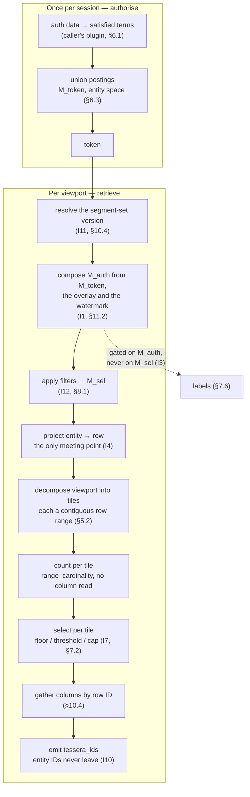

# Tessera — Architecture Design

**Status:** Draft for review — revision 54
**Scope:** A service providing per-viewer access-controlled storage, indexing, filtering and level-of-detail retrieval for a large set of 2D-projected points with attached cluster structure and labels. Appendix E gives a reference authorisation plugin; Appendix F sketches a prospective valid-time extension; Appendix H states the general framing and its boundary; revision history is in Appendix G.

**Specified versus implemented.** This document specifies a target, and parts of that target are not built. Every such claim carries a **⊘ Specified, not implemented** marker at the point it is made, saying what exists instead and what a reader must not assume meanwhile; the full set is tabulated in the generated `docs/design/inventory.md`. A marker's absence is a claim that the machinery exists.

*A tessera is a single tile of a mosaic, and — in Rome — a token presented to be recognised and admitted. Both readings are load-bearing: the unit of storage is a tile, the unit of access is a token, and every viewer assembles a different mosaic from the same tiles without any of them seeing the whole picture.*

---

## 1. Purpose

This document describes a service that stores a large set of points — each with two projected coordinates, an access predicate, a cluster assignment and optional attributes — and serves interactive, pannable and zoomable views of them under per-user access control, with text, label and similarity filtering, and with cluster labels gated so that a user only ever sees a label derived entirely from data they are permitted to see.

It exists primarily to record the *invariants* (§4). Most of the failure modes found during design are not novel problems; they are cases of one invariant being quietly violated by an otherwise reasonable-looking optimisation. §15 lists those near-misses, Appendix C records the residual leaks consciously accepted, and Appendix D records what is prior art.

## 2. Service contract and scope

### 2.1 What this service is not

**The model pipeline is out of scope.** Dimensionality reduction, clustering and label generation happen outside the service; it receives their outputs and indexes them. It does not run UMAP, does not run HDBSCAN, and does not call an LLM. Because the service never receives a modelling hyperparameter, a disclosure threshold cannot be accidentally coupled to one.

**The authorisation schema is also out of scope**, in a more interesting way. The service knows only about opaque **terms**; how an item's label becomes a set of terms, and how a principal's credentials become a set of satisfied terms, are two pluggable functions (§6.1). The five-dimension model this design was originally built around is one implementation of them, recorded in Appendix E.

Both boundaries mean the caller owns guarantees the service depends on and cannot verify (§2.4).

### 2.2 The two-stage split

Retrieval is deliberately split so that expensive, rarely-repeated work is separate from cheap, frequently-repeated work:

- **Authorise** — accepts the caller's authoritative auth data, resolves it to satisfied terms, performs mask construction (§6.3), returns an opaque token. Paid once per distinct auth input.
- **Retrieve** — accepts a token plus a query (viewport, zoom, filters) and returns the rendered payload. Called many times per second while a user pans, and correspondingly cheap relative to authorise — though *how* cheap is a measured quantity that scales with the viewer's own visible set, not a constant (§10.4).

These are capabilities, not an interface specification; the real surface will be larger, particularly around filtering. What matters architecturally is the split and the three properties it forces.

*Authorisation is computed once, from an explicit input.* The service never infers, looks up or refreshes credentials (**I6**).

*Every retrieval is cheap*, because it operates against a precomputed mask rather than re-deriving authorisation.

*No filter form can affect authorisation.* Filters live entirely in the second stage; authorisation was fixed in the first. So the retrieval surface can grow arbitrarily around filtering without any new filter form introducing an access-control bug. This is **I12** at the interface level, and §8.2 gives the corresponding discipline: a filter form that cannot be expressed as an order-independent set producer should be reshaped, not special-cased.

### 2.3 Token semantics

A token is a **capability**: it confers exactly the access computed from the auth data presented, and nothing more.

*Staleness is the caller's to bound* (**I6**). A token does not track later credential changes. The caller decides how long a token lives by deciding when to re-authorise, which places the refresh policy where the authoritative information already is. The service enforces a configured maximum lifetime and a revocation call as backstops, not as the policy.

*A token is not view-scoped.* One token authorises across every temporal view, because masks are built in entity space and entity IDs are stable across views (§5.1). Only the permutation into row space is per-view.

*A token carries its reachable partition set*, computed once at authorisation (§12). The query path therefore needs no global partition map, and a token never contacts a store it cannot satisfy.

> **⊘ Specified, not implemented.** There is one partition, fixed at build, and no reachability computation. A token reaches it unconditionally; nothing computes or carries a partition set, and no gate refuses one. The compartmented-isolation property of §12 is therefore *specified* and not available: a deployment today gets masking, not physical separation.

*Tokens are bearer capabilities.* Unguessable, bound to the issuing session, excluded from logs and URLs, revocable.

*A key rotation ends the session.* Point identifiers are interpreted under the live key and are not guaranteed stable across sessions (§10.6 states the rule and what it replaces), so a rotation must invalidate every live token along with every identifier. The token is therefore a signed reference to a server-side visible set carrying the **idset** it was issued under — the identifier set the live key defines — and one issued under a superseded idset is refused exactly as an expired one is. Retrieving a visible set by reference reads as a lookup, and **I6** as written says the service never infers, looks up or refreshes credentials. The intent survives — the set was computed from auth data presented at authorisation, and retrieving it refreshes nothing — but the wording does not, and **that amendment is pending its own review**: decision 0025, which also records the constraints the token design must honour, among them that the reference be unguessable, since a guessable one counts how many principals have authorised.

> **⊘ Specified, not implemented.** The token described here is ruled and not yet written; see §10.6's marker for what a token is today and what a rotation therefore does not do.

*Masks are content-addressed, tokens are not.* The canonical key is a hash of the **satisfied term set** together with the authorisation plugin's version **and the identity of the postings the mask was built from** (r19: the bundle's manifest digest; under fan-out, partition and postings stamp, as the system architecture's cache key already records). The third component is not optional: term IDs are bundle-relative ordinals, so a cache that survives a rebuild would otherwise serve a mask naming a *different* entity set under the same key — a disclosure, not a staleness bug. These three are all a mask depends on, so two different auth inputs resolving to the same terms against the same postings share one mask. A hash of the raw auth data is retained as a fast path in front of it: on a byte-identical repeat it also skips re-running the auth function. The distinction matters once auth data carries volatile bytes — a signed assertion differs per issuance even for identical authority (§6.1), and keying on auth data alone would rebuild a mask per login.

*Eviction must be transparent.* A mask evicted under memory pressure is rebuilt on the next request rather than failing at an arbitrary moment. Two things provide that, and **neither is a retained copy of the authorisation data**: a live session holds its frozen fragment directly, and evicted fragments survive in a digest-verified on-disk cache that outlasts a restart. Keeping credentials beside a mask would extend the lifetime of authorisation material past the request that presented it, and put it in a structure whose eviction policy is tuned for throughput — a cost this buys nothing, since transparency is already available without it.

### 2.4 Input contract

The caller supplies, and the service cannot verify:

**Two consistent authorisation functions** (§6.1) — the single largest unverifiable dependency in the design, stated as **I5**.

**Coordinates from a stable projection.** Stable across temporal views and rebuilds. If it is refitted rather than transformed, the layout scrambles and every stored spatial artifact silently describes the wrong geometry.

**A cluster hierarchy with stable node identity.** The service stores a tree of nodes with membership and serves a per-user frontier over it; it does not reconcile identity across the caller's rebuilds.

**Labels with declared generating sets.** Every label arrives with the exact set of items it was derived from — the input form of **I3** and **I8**. A label supplied with an optimistic generating set is a disclosure the service will faithfully serve (C12).

**Per-item vocabulary vectors** for the extractive label tier.

### 2.5 Capabilities the caller needs

Beyond authorise and retrieve: ingest of a batch; drill-down from an opaque point identity *(r21; "point handle" — §10.6)*; token revocation; cursored iteration over a node's members; retrieval of a node's term distribution; submission of labels with their generating sets; and **notification of labels invalidated by deletion or predicate tightening**, so the caller knows what to regenerate (§7.6).

The term distribution is the load-bearing one: it lets the caller's labeller decide which generating sets are worth producing without reimplementing the authorisation model. Node iteration returns unmasked membership by design, so it requires a build-scope credential and must never be reachable from a user token.

### 2.6 The path end to end

A map of the request, placed here so the rest of the document has a spine. **This section is not normative** — every step is governed by the section it points at, and where this summary and that section disagree, that section is right. It exists because the path is otherwise distributed across §6, §7 and §10, and nobody should have to reassemble it.

**Once per session — authorise.**

1. Hash the presented auth data; look up *(auth-data hash, auth-plugin version)* in the mask cache. On a hit, return a token (§2.3).
2. On a miss, `terms_of_auth(auth_data)` yields term descriptors; the service interns them to term IDs (§6.1).
3. Compute the reachable partition set. A partition is reachable only if the token satisfies **every** term in its required set — the intersection of compartment markers across all disjuncts. Unreachable partitions are never contacted (§12.2, **I13b**). *(⊘ Specified, not implemented — one partition, always reachable; §12.)*
4. Per reachable partition, union the postings of the satisfied terms into `M_token`, a Roaring bitmap in **entity space** (**I4**). Postings are built from the exploded `(entity_id, term_id)` relation (§6.3).
5. Write frozen-format, cache it on disk under a digest so eviction rebuilds rather than fails (§2.3 — no authorisation data is kept beside it), and return an opaque token.

**Per viewport — retrieve.**

1. **Pin once.** Resolve the segment-set version and use it for the tile ranges, columns and permutation alike (§10.4, **I11**); the mask fragment carries its own watermark, which is what step 2's composition uses (§11.2).
2. **Compose the effective mask.** `M_auth = (M_token \ L) ∪ direct_eval(L)`, where `L` is the overlay unioned with every entity at or above the watermark (§11.2, **I1**). Loaded through `frozen_view` over the mmap — no deserialisation, no allocation.
3. **Apply filters** to obtain `M_sel = M_auth ∧ filters`. Filters are order-independent set producers, composed by intersection, and never touch authorisation (§8.1, **I12**).
4. **Project into row space.** Iterate the mask in order, gather `entity_to_row[e]` into a flat buffer, radix sort, bulk-construct; cache per *(token, view, segment-set version)*. This is the only point at which the two ID spaces meet (§10.4). **Steps 2–4 define `M_auth`; they are not an evaluation order.** The engine evaluates them inverted — it projects the *fragment*, once per session, and applies composition as row-space diffs against that — because projecting the *composed* mask costs seconds per request at 10⁹. §10.4 states that strategy normatively, together with the two clamps it requires.
5. **Decompose the viewport** into a few hundred quadtree tiles at the target depth. Each is a contiguous `[lo, hi)` row range by the Morton prefix property (§5.2).
6. **Count per tile.** `intersect_with_range` culls empty tiles; `range_cardinality` then gives the exact masked count with **no data file touched** — cost in containers, not rows (§10.4).
7. **Select per tile.** Evaluate §7.2's floor–threshold–cap definition **directly from the mask**, at every coverage: take the visible row IDs in the tile's range straight from the bitmap and keep the lowest by identity. Priority is a keyed per-point constant — the high 16 bits of the item's `tessera_id` — and mask-independent, which is what makes the selection nest across zoom and compose across partitions (§7.2, **I7**).
8. **Collect** the selected row IDs into one `u32` array. Processing tiles in Morton order leaves it already sorted, so the gather is forward-sequential-with-gaps and cooperates with readahead.
9. **Gather** through tight loops over the mmap'd Arrow columns, writing directly into the output Arrow arrays (§10.4).
10. **Translate out.** Row IDs to `tessera_id`s — read directly from the gathered row, since the identity is stored where it is shown from. Entity IDs never cross the boundary (§10.6, **I10**).
11. **Serve labels separately**, gated on `M_auth` and never on `M_sel`, so filtering narrows the points without dissolving the map. Evaluated per request, with nothing cached above the check (§7.6, **I3**).



*The request path. Everything below the composition step reads geometry only through a masked row-ID set; the label path branches off `M_auth` and never sees the filtered mask.*

**Two structural properties carry the design.** Step 4 is the sole meeting point of the two ID spaces, which is what makes **I4** enforceable as a type rule rather than a convention. And nothing between steps 2 and 10 reads a column except through a masked row-ID set, which is **I2** in structural form (§10.4).

A third property was claimed here and is **refuted by measurement**: that cost scales with screen area rather than corpus size. Counting (step 6) does behave that way — it is bitmap arithmetic over contiguous ranges and touches no data file. Selection (step 7) does not, because evaluating the definition directly walks the tile's visible rows. At 10⁹ the measured request cost tracks the summed visible count across the viewport's tiles at roughly 4–4.5 ns per visible row, and is uncorrelated with how many points come back. §10.4 gives the figures and what follows from them.

## 3. Problem statement and constraints

The design target is 10<sup>9</sup> points. There is no production corpus: the largest corpora the system has been built and measured against are the synthetic Phase 0 fixtures at 10⁷–10⁹ items, and every figure quoted in this document comes from those. Under the reference authorisation plugin (Appendix E) a principal's auth data resolves to roughly 10<sup>4</sup> categories and is effectively unique per principal; term counts are recorded in §16 as unmeasured.

The access control requirement is hard: data the presented credentials do not satisfy must never be transmitted, in any form, including in aggregate. This rules out serving unfiltered tiles for client-side filtering. Residual channels accepted rather than closed are recorded in Appendix C.

Some terms mark data that must be held separately at rest and in memory, not merely masked — the requirement §12 exists to serve.

Term sizes are heavily skewed, approximately exponential, with the largest plausibly covering 25–50% of all points. New points arrive continuously, with a target visibility latency of seconds to minutes. Item predicate changes are rare. *(r23, owner decision 2026-07-30)* **That seconds-to-minutes budget covers the write path in full, deny dispositions included** — suppressions and deletions may take effect on the same scale as ingest, because a human decides them and human reaction time dominates any window the system adds. This is a **bounded, configured** delay and is not the fail-open the deny rules exist to prevent: those (an overlay lost on restart, SA §6.2; a deny retired other than by its own unsuppress or by the compaction fold that executes it — write-path §5.4's Rule S and Rule F) all concern a deny that is *lost or reversed*, which is unbounded exposure of a different kind. One rule keeps the distinction sharp and costs nothing: **a deny's acknowledgement stays coupled to its application** — hold the 200 until the entry is fsync'd and swapped, never acknowledge a deny that is not yet in force. The caller then still observes its own accepted change on its next request, and no window is ever open between "accepted" and "applied". The write path's latitude is therefore in *when work is batched*, never in whether an acknowledged security operation has taken effect. Data is held in an object store. Several temporal views exist and must be independently browsable.

## 4. Invariants

Load-bearing guarantees: cheap to state, expensive to recover once violated. Rationale lives in the referenced sections.

**I1 — One effective mask, composed before use.** Define the *live set* `L` as the union of the in-flux overlay and every entity at or above the ingest watermark (§11.2). Effective visibility is

```
M_auth = (token_mask \ L) ∪ direct_eval(L)
```

composed at fetch time, before any consumer sees it — because most consumers (counts, density pyramids, cluster frontiers, hulls, label containment) read the mask directly and cannot be filtered afterwards. A serialisation chokepoint is retained for point payloads as a second line.

**I2 — Derived quantities are functions of visible data only.** Any aggregate shown — centroid, hull, count, density, label — must be computable from the items inside `M_auth` alone. A quantity derived from the full dataset and merely *gated* on a threshold is a disclosure, not a filtered view. Exceptions are enumerated in Appendix C; an exception not in that table is a bug. Enforced by construction rather than by discipline: the mask is the only entry point to the geometry arrays (§10.4), so there is no path along which an aggregate over unmasked rows can be built.

**I3 — Labels are served iff their generating set is a subset of `M_auth`.** Never of the filtered selection mask (§8.1). Evaluated per request, with nothing caching a label decision above the check (§7.6).

**I4 — Permissions live in entity space; geometry lives in row space.** The term index, cluster memberships and generating sets are expressed over entity IDs; spatial ordering is per-view and expressed over row IDs; the two are related only by an explicit permutation (§5.1).

**I5 — The two authorisation functions must agree on what a term means.** If the data function indexes item *i* under term *T*, then every principal for whom the auth function yields *T* must be authorised for *i*. Everything downstream — masks, label containment, partitioning — rests on this and none of it can check it. The service reduces the surface by owning term interning, so agreement is byte-equality of canonical descriptors, but the semantic obligation is the caller's (§6.1).

**I6 — Authorisation comes only from the token.** The service never infers, looks up or refreshes credentials; a token's mask reflects exactly the auth data presented and nothing later. Staleness is bounded by token lifetime, which the caller controls (§2.3).

**I7 — Sampling happens after masking, never before.** The sample of an authorised set is not the authorised portion of a global sample. Any level-of-detail step must be *defined* over the visible set; precomputed unmasked structures may be used only as a fast path with an exact fallback (§7.2).

**I8 — A label's generating set is immutable once supplied.** Items arriving later are not part of it and must not be added. A label whose node has since grown is *stale*, not unsafe. Members leaving is an availability problem, addressed in §7.6.

**I9 — Entity IDs are append-only and never reused.** Masks and generating sets are sets of entity IDs held in caches with non-zero lifetime; reissuing a deleted item's ID grants the new item every access the old one had.

**I10 — Entity IDs never cross the trust boundary.** Entity IDs are dense and, within each append-only batch and only within one, assigned in **term-signature order** (§11.1). So the gap between two visible entity IDs would be a count of unauthorised items allocated in the same window, and their proximity would be a statement about shared permission signatures. Neither quantity is available to a client, for a structural reason and a mechanical one, and the two are not equally strong.

*The structural half.* **No request-path artifact stores an entity ID, so the gather cannot produce one.** `columns.arrow` carries the wire identity at each row; the entity ID exists only in entity-space structures and as the *index* of the permutation array. This is the load-bearing half: it holds regardless of how good any permutation is, and it is what makes §11.1's signature-sorted assignment safe by construction rather than by a discipline at the serialisation boundary (C6).

*The mechanical half, and its exact strength.* Clients receive a `tessera_id`: an 8-round balanced Feistel permutation of `(shard_id, entity_id)` under a 128-bit per-deployment key, whose round function is `splitmix64` (contracts §2.6; construction and known-answer vectors in `docs/evidence/memos/2026-07-30-tessera-id-construction.md`, which is normative for it). `splitmix64` is a **non-cryptographic mixer**, so the threat model must be stated exactly rather than left to the word "keyed":

- It is a **blinding permutation**. What it defends is that a **viewer-plane** client — holding `tessera_id`s and no bundle — has no practical route to derive entity IDs, to order them, or to count the gaps between them. That is the property C6 turns on, and it is order-free and collision-free by construction.
- It is **not a cryptographic guarantee**. Eight rounds of a non-cryptographic mixer should not be assumed to resist an adversary holding known `(entity_id, tessera_id)` pairs. The viewer-plane setting is ciphertext-only against a near-degenerate plaintext prior — `shard_id` is always 0 and entity IDs are dense from zero under **I9** — so the adversary's task is distinguishing a permutation of a known small domain, which is easier than "no known pairs" suggests. If a viewer ever obtains pairs, the construction moves inside the attacked set and this half of I10 no longer holds.
- It is **not a defence against a bundle-holder**, who obtains the key by construction: it is in MANIFEST. That is intended and costs nothing, because a bundle-holder already has the postings, the masks and the geometry. The control plane is likewise outside the defended set — `/control/ingest` returns the identities it just allocated over a dense monotone allocator, which is chosen-plaintext by construction.

The key must therefore never leave the server on any plane: no API response, no log line, no metric label. And no per-mark column may be derived from the entity ID by an *unkeyed* function; that rule is what licenses publishing `priority`, which is a prefix of the keyed identity the same payload already carries in full.

**I11 — Row-space artifacts are versioned together, and a request resolves geometry once.** Any cached structure expressed in row IDs carries the *(segment-set version, watermark)* stamp it was built against, and a request resolves the segment-set version **once, at its start**, and uses it for tile ranges, columns, permutation and mask alike. A row-space mask applied across a compaction boundary selects arbitrary rows — not stale-restrictive but simply wrong (§10.4). The watermark component records what the artifact was built from; the watermark governing I1's composition is always the mask fragment's own (§11.2) — geometry identity never fixes authorisation state.

*The cross-request half is gone (`geometry-pinning.md`, 2026-08-03).* An earlier form of this invariant also let a **later** request be answered against an **earlier** generation, which required the server to retain superseded geometry. Nothing a client holds needs that — a tile is a Morton prefix resolvable against any generation's own sorted codes, and an item is a `tessera_id` invertible independently of geometry — so the retention is deleted and the round trip is a **staleness stamp**: advisory, never a selector, never a refusal. The within-request rule above is the whole of what remains, and it is discharged by one pointer load.

*And the segment-set version is the only safe discriminator.* A merge is row-count preserving in that no **later** extent's `row_base` moves, but inside the merged span it produces globally sorted output, so a row id there names a different entity afterwards. **No row-space artefact may key on the prefix.**

**I12 — Filters narrow rendering; they never touch authorisation.** A filter may reduce which authorised items are drawn. It may never enlarge the authorised set, relax a label's containment test, or permit the cluster frontier to descend below the depth `M_auth` alone would allow. Operationally: **a filter may move the frontier up, never down** (§8.4).

**I13 — An answer that was not computed is a refusal, never a vacuous success.** This number names **two distinct properties** with different scopes, different implementations and different evidence. They are stated separately because a reviewer who confirms one must not conclude the other is covered.

**I13a — a request that fails or is cancelled yields no partial answer.** Where work is shared between concurrent requests (single-flight caching of a session's row projection, and the cancellation of an abandoned request), a panic, a cancellation or a poisoned shared slot must never be observable by another request as a completed result, and **no failure is ever cached**. A caller sharing a build that dies is therefore either handed a typed refusal — which is what a cancellation, an exhausted wait budget and a fallible build still produce — or finds the plain miss a fresh arrival would find, and builds for itself ([decision 0058](../decisions/0058-a-single-flight-racer-waits-rather-than-being-refused.md)). The failure the first clause forbids is a waiter observing a half-built shared artifact as though it were complete; the failure the second forbids is a dead build refusing a later caller for whom it would have succeeded. This is the property the implementation annotates and tests.

> **Annotated for the streamed viewport response** *(2026-08-11, with `streamed-serving.md`; ratified by owner ruling the same day — [decision 0061](../decisions/0061-i13a-forbids-undetectable-partials-not-streaming.md))*. A streamed `/v1/viewport` cut mid-body — disconnect, shed, or a mid-stream fault — leaves the **requesting client itself** holding a prefix of its own response. This does not weaken the invariant, read precisely: what I13a forbids is a partial answer *observable as a complete one*, and a truncated stream is client-detectable by construction (the trailer frame never arrived — contracts §3.2's truncation rule) while every delivered frame is exact against one generation snapshot and drawable under `delta-serving.md` §7's prefix licence. No *other* request can observe anything partial, no failure is cached, and nothing here changes the shared-work clauses. A change that made a truncated stream indistinguishable from a complete response would violate this invariant as written.

**I13b — a partition not consulted fails closed.** Where a query or a containment test spans partitions (§12), a partition the token cannot reach counts as contributing *nothing satisfied* — never as vacuously satisfied. The natural implementation, which checks only the partitions it queried, serves labels it should withhold.

**I13c — a partition unreachable through *outage* is an error, never an empty contribution.** I13b governs a partition the token cannot reach; this governs one the *system* cannot reach. The two look identical at the merge point and must not be treated identically: an unreachable-by-authorisation partition contributes nothing satisfied and the answer is complete, while an unreachable-by-failure partition makes the answer unknown, and returning it as though the partition had contributed nothing is a vacuous success of exactly the kind this invariant forbids.

> **⊘ Specified, not implemented (I13b and I13c).** There is one partition, no required-set gate, no reachability computation and no cross-partition containment, so nothing exercises either rule and no test covers them. They are *safe today* only because a single partition makes both the unreachable cases unreachable — not because the rules are enforced. A reader must not read I13a's coverage as evidence for either, and the first deployment to define a second partition acquires two unimplemented invariants at once.

## 5. Core data model

### 5.1 Entity IDs and the permutation

Every item has a permanent **entity ID**, stable across temporal views and rebuilds, never reused (**I9**), and never exposed (**I10**). All permission data is expressed in this space. IDs are allocated in append-only batches; the order *within* a batch is a free choice and §11.1 spends it deliberately.

Each temporal view separately assigns **row IDs** by Morton rank (§5.2). A view stores a `u32` permutation mapping entity ID to row ID, bounded by maximum live entity ID rather than item count, with a sentinel for absent entities. With deletions and append-only IDs the gap between maximum live entity ID and item count grows, which is the exhaustion concern in §16. **The array is paged** *(r52; `views.md` §8's owner ruling of 2026-08-30, contracts §2.6 for the bytes)*: a directory over pages of 2¹⁶ consecutive entity IDs, an absent page meaning every entity in it has no row, so a view stores the pages it occupies rather than the whole of entity space. That is the representation for **every** view, a dense one being the degenerate case with every page present; it matters because views multiply — a group of forty over one entity space was forty full-width arrays, each mostly sentinel.

**Row→entity is stored as well, and only because one path needs it per row.** It is derivable without a file — it is the inverse of the keyed bijection at the row, a pure function of the `tessera_id` that `columns.arrow` already carries (contracts §2.6, §0.3 deviations 2 and 6) — and for a single item that is what happens, `/v1/items` inverting one identifier and touching nothing else. A **filtered viewport** asks the same question of every row it is about to draw, where the bijection's four rounds cost *measured* ~17.5 ns each and dominate everything around them. `row-entity.u32` answers it in a mapped read instead: a `u32` per row, dense because every row has an entity, 4 bytes per row per *view* and shared across every filter column, since it is a property of the view's geometry rather than of any attribute. [Decision 0065](../decisions/0065-the-inverse-permutation-is-stored-for-the-filtered-viewport.md) records the reversal; `filter-surface.md` §4 carries the measurement and the rule that decides when the file is read at all.

**I10's structural half is about what the *gather* can reach, not about what exists on disk.** `columns.arrow` is the only artifact the point gather reads, it carries `tessera_id` and no entity ID, and so a served point cannot carry one. `permutation.bin` and `row-entity.u32` are index structures over one and the same bijection, consulted by masking and filtering and never by serialisation — and a bundle-holder learns nothing from the second that the first did not already give them, both directions of a permutation being one fact.

**The entity→row direction is the irreducible one** *(recorded because the question recurs in exactly this form: now that the wire identity is order-free, is the indirection still needed?)*. It is not, and never was, a disclosure mechanism — what the keyed identity retired was the per-session handle table, not this array. Three reasons keep it, none of them a leak argument:

- **Permanence against churn.** Entity IDs are permanent and never reused (**I9**); a row ID is a Morton *rank*, and one new item interleaving into the ranking shifts a large fraction of it (§11.1). No single integer holds both properties.
- **The entity ordering is already spent.** §11.1 assigns entity IDs in term-signature order within each batch — measured at 8.9–36.7× on posting storage and up to 130× on union cost (r18). An ordering spent on posting contiguity cannot also be spatial rank.
- **One index, many row spaces.** Views rank independently, and so do partitions (§12.3), while the term index exists once per partition in entity space. Collapsing the two spaces duplicates the index per view — which is what the next paragraph says this factoring prevents.

Nor is this direction derivable the way the inverse is: entity→row is a function of the item's *geometry*, and no key encodes a rank. What remains genuinely open is the **compression** of a page's slots, not the array's existence — the values inside a page are uncompressed precisely because entity order and row order are unrelated, making them maximum-entropy; a signature-major row layout would make them near-monotone within groups and worth compressing (the deferred sketch is [signature-major layout](deferred-signature-major-layout.md)). The paging above is orthogonal to that: it removes the entity space a view does not occupy, not the entropy of the slots it does.

This factoring is what stops the term index being duplicated per view. Within a partition there is exactly one index, in entity space, shared across all views; a mask fragment is built once there and permuted into a view's row space on demand.

### 5.2 Morton ranking

Coordinates are quantised onto a 2<sup>16</sup> × 2<sup>16</sup> grid and the bits of the two integer coordinates interleaved to produce a Morton (Z-order) code. Items are sorted by this code and row IDs assigned as the *rank* in that order. The storage order is **`(morton, tessera_id)` ascending, with no further tiebreak** *(r21; the entity ID is not a sort key at any position)*: within a leaf tile the ordering is by the item's identity rather than by deeper Morton bits, and since `priority` is the leading 16 bits of that identity, ordering by `(morton, priority, tessera_id)` is *identically* ordering by `(morton, tessera_id)` — an implementation may compare the prefix first as an optimisation (§7.2, contracts §2.6).

Morton is chosen over Hilbert deliberately. Hilbert has better locality, but Morton has the prefix property: each successive pair of bits identifies a quadrant, so every quadtree tile at every zoom level occupies exactly one contiguous range of codes and therefore of row IDs. That single property underpins tile queries, density counts, LOD sampling and sharding. A precomputed **tile table** maps tile prefixes to rank ranges.

> **⊘ Specified, not implemented.** No tile table is built or stored. A tile's `[lo, hi)` range is derived per request by binary search over the sorted `morton.u32` column — two searches per tile, no artifact, nothing for compaction to rewrite. The prefix property is what makes that possible and is unaffected; what does not exist is the precomputed lookup. Any sizing, compaction-cost or paging argument that counts a tile table is counting a file that is not there.

Note that a tile's *identity* is geometric — a Morton prefix — while its rank range is per-partition and per-view. That is what lets partitions agree on tiles while ranking independently (§12.3).

At 10<sup>9</sup> items the grid gives 0.23 points per cell, so collisions are not a constraint. Past roughly 4 × 10<sup>9</sup> the grid must widen with 64-bit codes.

### 5.3 Hot columns

Per view, fixed-width columns of **`tessera_id`**, the position **`residual`**, and per-item scalars (Appendix A). No coordinate is stored: a position is the row's Morton cell code in `morton.u32` concatenated with its sub-cell residual here, 32 bits per axis, and the pair is what the wire carries as a single `code` (contracts §3.2). Three column families, not five: there is no entity-ID column — that is **I10**'s structural half, since a column the gather can read is a column the gather can emit — no cluster-node column, which had no reader and would have cost a billion identical sentinels in a per-viewport file (contracts §0.3 deviations 6 and 7), and no `priority` column (decision 0046, 2026-08-04: it was a prefix of `tessera_id`, written and unread at query time — cut while the format is unpublished, re-added additively if §7.2's revisit trigger ever fires). Neither text nor high-dimensional vectors appear here; both live outside the hot path (§8.3). Sparse per-item vocabulary vectors for extractive labelling are stored separately in CSR form.

## 6. Access control

### 6.1 The authorisation plugin boundary

The core knows only this: an item carries a set of opaque **term** IDs; a token carries a set of satisfied term IDs; an item is visible iff those sets intersect. Everything about how terms are derived sits behind two functions supplied by the caller:

- **`terms_of_label(item_label) -> {term descriptor}`** — run once per item at ingest, where an item's label arrives as one opaque byte string and only the plugin can decompose it. Must be fast.
- **`terms_of_labels([term], …) -> {term descriptor}`** — the same derivation where the caller's terms are *already* separated, as a build's source column has them. **Exactly one descriptor per element, in order**: the build derives a term's descriptor from the term alone, so this is the property that makes the dictionary pass sound, and the build refuses to run against a plugin that does not honour it. It exists because the alternative — joining an item's terms into one string for the plugin to split apart — makes the separator byte inside a caller's term into two grants.
- **`terms_of_auth(auth_data) -> {term descriptor}`** — run once per authorisation. May be expensive.

This is a smaller core than it looks. The term index, mask construction's union, label containment, level of detail, filters, partitioning and storage never knew where terms came from; only the derivation did.

**The contract.** Beyond **I5**'s consistency requirement, four obligations:

*Canonical descriptors.* Both functions emit opaque byte strings; the service interns them to IDs in a shared, append-only namespace. Agreement between the two functions is then byte-equality of descriptors, which reduces an otherwise wholly semantic obligation to something partly mechanical, and keeps the namespace owned in one place. Under compartmented fan-out (§12) "one place" acquires a process address: the router holds the namespace, which is sound because descriptors are policy-side identifiers carrying no corpus data — the isolation property of §12.3 covers entity IDs and bitmaps, which never leave their partition.

*Determinism.* Same input, same descriptors — otherwise content-addressing masks by auth-data hash is unsound.

*Declared cardinality bounds.* Distinct terms, terms per item, and satisfied terms per token. The service cannot size the index or the union without them. They are sizing declarations, not enforcement triggers: exceeding one warns and never excludes (§6.2, r16).

*Cost asymmetry.* Worth repeating because plugin authors get it wrong: the data function runs per item at ingest, the auth function runs per authorisation.

**Versioning has two blast radii.** An auth-function change invalidates masks, so its version joins the mask cache key. A data-function change alters item→terms, so it requires a **full reindex** and its version belongs in segment metadata. The changes look alike and cost differently by orders of magnitude.

**I5 is unverified.** It rests on the caller's semantic obligation, and nothing independently checks it. That is the whole of the position: not a mitigation that is specified and unbuilt, but no mitigation at all.

**Nor can it be checked today, even in principle.** The only authorisation plugin that exists is a **passthrough** — an item's terms are the descriptors the caller supplied verbatim, and `terms_of_auth` is the same string comparison over the same bytes — so the two functions cannot disagree. **I5** is trivially true of it, and no differential run against it can fail. There is nothing to verify until a plugin exists whose two functions can genuinely diverge.

**This matters more than a missing test**, and it is why the absence is stated here rather than deferred to the conformance design. §2.4 names the two-function consistency obligation as the single largest unverifiable dependency in the design, and **I5** says why: masks, label containment and partitioning all rest on the agreement holding, and none of them can check it. A deployment that ships a real plugin is running that dependency with nothing watching it, and no part of this document should be read as saying otherwise.

**How it eventually gets checked is open, and this document does not choose.** Two routes are live and neither is preferred here. One is an external, specification-conformant implementation of the same access-expression grammar, run as a differential against the plugin — its independence from anything written here is the argument for it. The other is a second implementation written alongside the conformance suite, which is the pattern `reference/oracle/` already uses successfully for the definitions, and whose argument is that it exists in one language, in one repository, under one review. **Both need a non-trivial plugin first**, so the choice is better made on the evidence available at that point than fixed now. Whichever is taken, the test form is a property-based one: sample (principal, item) pairs and compare plugin-derived visibility against the independent implementation. Appendix E sketches the reference plugin such a differential would run against.

**Verifiable auth data.** Nothing requires auth data to be bare claims. A plugin may accept a signed, principal-bound assertion — a JWS, a SAML assertion, an attribute certificate — and verify it against trust anchors embedded in the plugin itself before deriving terms from the verified attributes. Signature verification is pure computation, so it is compatible with the determinism obligation and needs no capability; embedded anchors make rotation a plugin-version change, which correctly invalidates every cached mask. Two limits are inherent rather than accidental. Expiry cannot be checked inside a deterministic plugin, which has no clock; the plugin instead surfaces the credential's `not_after` and the *host* enforces it and clamps token lifetime — the plugin stays a pure function. And there is no online revocation — **I6** and the capability-free execution environment forbid credential lookups by construction — so revocation is bounded by assertion lifetime, which pushes deployments toward short-lived assertions. The practical effect is on what an `authorise` caller's credential is worth: under bare claims, whoever can call authorise can claim anything; under verified assertions, authority derives from possessing a principal's credential, and the caller's own credential merely permits submission.

**Prior art.** This boundary is where a policy engine belongs. Appendix D records that partial evaluation compiles a policy into a residual filter in disjunctive normal form, which is precisely the auth function's job — so driving authorisation from a policy engine later is a matter of writing one plugin, not a redesign.

### 6.2 The term index and bounds

The **term index** maps each term to a Roaring bitmap of entity IDs. Roaring's per-block encoding makes the skewed size distribution harmless: head terms become run containers, the long tail small sorted arrays. Store terms below a few hundred members as plain sorted `int32` arrays.

Plugins may hold whatever auxiliary structures they need to evaluate their side efficiently; the reference implementation's are described in Appendix E.

**Bounds warn; they never exclude.** Earlier revisions enforced the declared per-item term cap by excluding over-cap items from the index — invisible to every principal. That is dropped (r16, measured): a predicate is a monotone disjunction, so more terms means *broader* intended visibility, and exclusion answered "visible to many" with "visible to none" — a resource guard producing an authorisation-shaped outcome. No invariant depends on terms-per-item, and measurement found no change in the *shape* of authorise-path cost at ~130 terms per item; the true cost is pair-relation storage, which is linear and a sizing concern. So: the declared bounds remain what §6.1 always needed them for — sizing — and a runaway guard at 10⁵–10⁶ terms per item **warns** as a data-quality signal while still indexing. Performance may degrade with data shape; availability must not.

### 6.3 Mask construction

Performed once per distinct auth input, at authorisation. The auth function yields satisfied term descriptors; the service resolves them to IDs and unions the corresponding postings, per partition the token can reach (§12.3). This is the expensive step; costs are in Appendix A.

**The postings are built from an exploded `(entity_id, term_id)` pair relation. How that relation is joined is not specified** — a semi-join is one way and not the way; the implemented build streams it, spilling banded pair files to disk, scattering through per-term cursors and encoding Roaring bitmaps in parallel. What is required is the schema, plus one property of the build, and both are stated here because both are easy to lose.

**The array-containment formulation is refused, and this is a requirement rather than an optimisation.** The natural alternative — hold terms as a list column per item and test containment against the presented set — is roughly three orders of magnitude slower in every implementation measured, because containment operators rebuild a probe structure per row and never hoist the loop-invariant grant set out of the row loop. That is a property of the *schema*, independent of which engine performs the join, which is why the pair relation is the requirement and the join mechanism is not. It is called out because the slow formulation is the one anybody writes first (§15, Appendix D). The pair relation costs a second copy of the term assignments, which is small: two integers per (item, term) at roughly ten terms per item.

**The build must be memory-bounded.** The obvious construction — materialise the whole `term → entity list` relation in memory before writing a byte — was built first and **OOM-killed at 10⁹ items on a 47 GiB machine** before producing any output; it survives only as a byte-identity oracle for the streaming build (system architecture §6.1). Memory-boundedness is what makes 10⁹ reachable at all, and it binds any replacement for the pipeline as firmly as the schema does.

**`terms/pairs.parquet` is optional for a serving deployment and required for a conformance run.** The engine derives a viewer's authorised set from compressed postings; `reference/oracle/mask.py` derives the same set from the flat pair relation by direct scan, and agreement between the two is the **I1** mask differential (conformance design §3). Without the file in the bundle the independent second implementation has nothing to work from and that differential cannot run — so a deployment that omits it as an optional build input gets a serviceable bundle that its own conformance suite cannot check.

**Composition** into `M_auth` follows **I1**.

### 6.4 Change handling

**Credential changes require re-authorisation.** There is no incremental path: the caller presents new auth data, the service hashes it, and rebuilds if the hash differs. Delta application was considered and rejected (§15) — removals cannot be applied by AND-NOT because an item may be covered by another satisfied term, and exact removal needs a forward index whose only purpose is to save a rebuild on a rare event.

**Item changes** — new items, predicate changes, deletions and administrative suppression — do not invalidate masks at all. They are handled by the overlay (§11.2). A predicate change that moves an item between partitions is the one expensive case (§12.5).

## 7. Spatial queries, level of detail, and labels

Throughout, "the mask" means `M_auth` unless stated. §8 introduces the filtered selection mask and specifies which governs each operation. §12.3 specifies how each of these composes across partitions.

### 7.1 Viewport queries

A viewport resolves to a small set of tiles, each a contiguous row-ID range within a segment. The query is an intersection of the mask with those ranges. `range_cardinality` gives the *exact* count of visible items in any tile at any zoom without touching point data, so a full per-user density pyramid is a few thousand range-count calls and exact rather than estimated. With multiple live segments a tile resolves to one range per segment and counts sum.

### 7.2 Per-user sampling

Global LOD sampling is incorrect under masking (**I7**): a principal authorised for a small or clustered view would see a nearly empty screen while thousands of authorised items sat invisible beneath a sample that selected around them.

**The definition** *(r22 — floor ∪ threshold ∪ cap; previously "the *k* lowest-priority items in the tile", a fixed-size bottom-*k* sketch)*. Every item carries a fixed pseudo-random **priority**, derived as the **high 16 bits of the item's `tessera_id`** (contracts §2.6), which is a keyed permutation of `(shard_id, entity_id)` *(r21; previously "derived by hashing its entity ID" — an unkeyed `splitmix64`)*. For a tile *T* at depth *d*, with `vis(T)` its visible set ordered ascending by `tessera_id`:

```
cap      = min(k, K_max)
C_θ(T)   = |{ i ∈ vis(T) : tessera_id(i) < P_d }|
m(T)     = min(cap, max(min(k_min, cap), C_θ(T)))
served(T) = the min(m(T), |vis(T)|) smallest members of vis(T) by tessera_id
```

Three clauses. A **floor** of *k*<sub>min</sub>, which is what keeps the sparsest principals' maps from going blank: it is the **I7** guarantee, and it may not be removed as an optimisation. It is also not a value a deployment may switch off by accident — `k_min = 0` is **refused at startup**, not clamped, because a typo must not silently disable an invariant. A **threshold** at `P_d`, which is where the density signal comes from: a tile with *n* visible items draws ≈ `θ_d·n` marks, and tiles at one depth cover equal screen area, so **mark count is density** rather than something recovered presentationally. And a **cap**, which bounds work, wire and overplot. Every rank and every count is taken over `vis(T)`; *k*<sub>min</sub>, *K*<sub>max</sub> and θ's anchor are either viewer-independent constants or mask-only quantities, so nothing references unmasked data and **I7** holds by construction, as it did before.

**Why a fixed-size sketch could not carry density.** All tiles at a depth cover equal screen area, so under the pre-r22 rule *any* tile holding at least *k* visible items drew exactly *k* marks: a tile with twelve visible and one with four million rendered identically (§7.3's complaint, which that section could not answer). A bottom-*k* sketch is fixed-size by construction, so its size cannot carry information. A **threshold (Bernoulli) sketch** — every visible item below θ — has a size proportional to the visible count and nests for free, because a threshold is a constant rather than a rank. Modulating *k* by count instead is **unsound**, not merely imprecise: nesting needs *k*(child) ≥ *k*(parent), a child holds roughly a quarter of its parent's count, so *k* ∝ count inverts the requirement and representatives popped on zoom-in — the same failure the bit-reversal note below records, by a different route.

**θ, and the approximation it rests on.** θ is anchored from the viewer's own **composed** visible total `V_total` over the view and progresses per depth. `V_total` is `|M_auth ∩ rows(view)|` — **composed, and counted in row space** *(r24)*. Both qualifiers are load-bearing and neither is optional: *composed* is the I2 requirement two paragraphs below, and *in row space* is §11.2's rule that an entity with no row contributes to no count whatever `L` says. The case that makes the second one bite is not exotic — under §11.1's group-commit allocation a batch is acknowledged, and therefore in `M_auth`, before flush gives it rows, so the gap between the two readings is the *normal* steady state of an ingesting deployment rather than a transient. Counting `|M_auth|` instead would move θ, and with it the mark count in every tile of every viewer's map, on the acceptance of items **nobody can yet draw**.


`P_0 = ⌊m_target · 2⁶⁴ / V_total⌋`, `P_{d+1} = 4·P_d`, saturating (at θ ≥ 1 the threshold admits everything), and `P_0` **saturated** when `V_total = 0`.

**The floor and the zero case are normative, not implementation detail** *(r24)*. Both were unstated, and both are observable: the differential demands exact equality, so an implementation that rounded or took a ceiling would disagree with one that floors on roughly half of all anchors. The engine and the reference oracle both floor and both saturate at zero — **by coincidence of implementation, not because this section said so**, which is exactly the state a second implementer written from the spec alone would not reproduce. Floor is the right choice on its own merits and not merely the incumbent one: a smaller `P_0` is a stricter threshold, so rounding down errs toward **fewer** marks, never more, and the floor clause is what guarantees non-emptiness regardless. The zero case is unobservable in its effects — a viewer with nothing visible draws nothing whatever θ says — but an implementation that caches θ per session has to compute *something*, and two implementations that pick differently diverge the moment either one's cached value is compared.

The ×4 is what makes the per-tile expectation depth-stable — a child holds ~*n*/4 items, so `4θ_d · n/4 = θ_d · n` — and it makes θ monotone in depth, which is what the nesting proof needs. θ is **viewport-invariant**: it depends on the session's mask, the generation and the view, never on `bbox` or `zoom`, so it does not move on a pan, which is the churn this whole scheme exists to avoid. **The view term is not a qualification of that invariance and does not weaken it** *(r24)*: `V_total` is counted over one view's rows, so a session addressing two views has one θ per view — but a view is named by the request (`x-tessera-view`, contracts §3.1) and is neither `bbox` nor `zoom`, so no pan and no zoom can change it. What the argument needs is that θ hold still under the interactions a client performs continuously; it does. It does move on an overlay swap; that is accepted, since swaps are rare against pans and the served set is a prefix, so a small θ move perturbs only the marks nearest the cut.

*Annotated 2026-08-01 (no revision here — no parameter, definition or contract changes; raised from the client-interaction design, whose §6 depends on it).* **The acceptance in the sentence above was priced against a change frequency the owner has since contradicted, and the arithmetic wants restating before the parameters are confirmed.** Owner-stated expectation (2026-08-01): the dominant change is **ingest, not denial** — continuous streams of 10²–10⁶ items/hour, or batch ingests of 10²–10⁷ a few times a day. Denies are the rare case. Three consequences. First, the frequency is coarser than the raw rates suggest and this section already says why: §7.2 r24's own rule that an entity with no row contributes to no count means arrivals are invisible until **flush**, so `V_total` — and therefore θ — advances at flush boundaries rather than per item. Second, the *magnitude* is what changes. A single deny moves `P_d` by a relative 1/`V_total`, which at 10⁶ visible displaces on the order of two marks across an entire viewport — genuinely "the marks nearest the cut". A flush adding fraction *f* of the corpus is a different quantity: because `served(T)` is a `tessera_id`-order prefix and new arrivals carry uniformly distributed identities, roughly fraction *f* of each tile's served set is displaced — new items landing below the cut pushing the highest-id members out. At *f* = 1% that is unremarkable; at *f* = 10% (a 10⁷ batch against a 10⁸ corpus, squarely inside the stated range) a tenth of the map changes under a viewer who is reading it. Third, and stated precisely so it is not over-read: **nesting across zoom is untouched** — its proof is over a fixed corpus state and nothing here weakens it. What moves is stability across *time*, which this section never claimed and which the sentence above disposes of in a clause. The question is therefore one of **parameters and flush cadence, not correctness**: flushing on a cadence coarse enough to read as a discrete update event yields a calmer map than dribbling, and it is a control the deployment already has. Owner ruling of the same date bounds the urgency — **minutes of latency are acceptable for items appearing *and* for items disappearing, provided a refresh path exists** — so this is a legibility question, not a freshness one. It is recorded here rather than acted on because *k*<sub>min</sub>, *K*<sub>max</sub> and `m_target` are already provisional pending the perceptual measurement §7.2 calls for, and churn-under-flush belongs in that same measurement rather than in a separate decision.

*Annotated 2026-08-01, second annotation of the date (no revision here — no parameter, definition or contract changes; raised from running the MVP viewer against the 10⁸ and 10⁹ fixtures, owner observation).* **The three clauses are sound and nothing below asks to change them. What the measurement exposes is that none of the three knobs expresses the quantity an operator actually wants to set — *marks on the screen* — and that the gap is not θ's to close.**

*What was measured.* MVP viewer, `theta_target_marks = 16`, `k_max_marks = 500`, and `max_k = 5000` — **five times the shipping default of 1,000**, raised for the sweep so that the cap clause could be probed above the overplot ceiling, and not a figure any deployment runs. Principal granted every term of the 2.4 × 10⁶ fixture. Marks drawn across the whole viewport: **17 at depth 0, 50 at depth 1, 242 at depth 2, 456 at depth 3** — a 25× swing across four zoom levels. Per *tile* the figure is 12–57 throughout, so **§7.2 is doing exactly what it says**: `m(T)` is depth-stable, the ×4 holds, nesting holds. The swing is entirely the tile count: a viewport at depth 0 contains one tile, and one tile is the whole budget available to it.

*The consequence for `k`, which reads as a defect in the field.* Across every depth and both fixtures, varying `k` over 5 → 20 → 100 → 500 → 2000 changed `served` by **nothing at all**: θ admits fewer than `min(k, K_max)` everywhere sampled, so the cap clause never binds and the only live clauses are threshold and floor. That is correct behaviour and this section already implies it, but the operator-visible effect is a control that appears inert. Two things follow. First, a client surfacing `k` must say **which clause is deciding** or it is showing a broken slider; the MVP viewer now computes that from the served counts and reports it. Second — and this is the substantive point — `k`'s natural reading is "how many marks do I want", and it is not that: it is a ceiling on a quantity θ almost always sets. An operator who wants more marks must move `theta_target_marks`, whose relationship to marks-on-screen runs through `V_total` and the tile count and is not obvious from its name.

*Why the fix is not here.* The tempting move — make `m_target` depend on how many tiles are on screen — is **refused, and the refusal is this section's own argument**. θ is viewport-invariant precisely so it does not move on a pan; tiles-on-screen is a property of the viewport; coupling them reintroduces exactly the churn the whole scheme exists to avoid, and would break the depth-monotonicity the nesting proof needs. Constant marks-on-screen is therefore **not obtainable from a per-tile sampler at all**, at any parameterisation, and it should not be pursued as one.

*Where it does belong, and one constraint that bites there.* The client, by choosing the **depth it requests independently of the viewport's zoom** — client-interaction §10's global point budget, which that document names, attributes to Potree and CesiumJS, and records as unwritten. Because priority prefixes nest, requesting depth *d* at a shallow zoom is a superset of the natural tile and pops nothing. The arithmetic falls out cleanly and is worth stating, because it is the first thing that makes the budget *settable*: a viewport covering fraction *f* of the view holds ≈ `f · 4^d` tiles at depth *d*, each drawing ≈ `m_target`, so `marks ≈ m_target · f · 4^d` and the depth that hits a budget *B* is `d = log₄(B / (m_target · f))`. Substituting back, **the tile count a request must carry is `B / m_target` — independent of zoom, independent of *f***. At *B* = 5 × 10⁴ and `m_target = 16` that is a flat 3,125 tiles at every zoom level.

That number is then checked against **`serve.max_tiles_per_request`**, whose default is **262,144** — ample, and comfortably above any budget the drawn-mark workstream has proposed. The constraint is therefore *not* binding at any proposed budget. What matters: the guard is an availability bound expressed in tiles while the budget is expressed in marks, the two are related by `m_target` alone, and **an operator who lowers the guard silently caps the achievable budget at `m_target · max_tiles_per_request`**. That relationship should be stated wherever either knob is documented. Not settled here, because `m_target` remains provisional pending the perceptual measurement this section already calls for.

**The anchor must be the composed total, not the frozen fragment's** — this is an I2 requirement and not a nicety. The cached row projection is `M_auth` *before* the overlay diff, so after any accepted delete or suppression it strictly contains `M_auth`. Anchoring θ there would let a viewer aggregate mark counts across a few hundred tiles, solve for the anchor, difference it against its own summed per-tile `visible` (which §7.1 discloses exactly), and recover **a running estimate of how many of its own items have been denied** — a count of items outside `M_auth`, which Appendix C admits nowhere.

The `4^d` progression assumes the viewer's items spread over ~4^d occupied tiles. Real corpora cluster, so the true occupied-cell count `O_d` is smaller and the actual marks per tile is `m_target · 4^d / O_d` — inflated geometrically in depth for a point set of box-counting dimension below 2. Worked: 10⁶ visible, `m_target` 16, `K_max` 500, depth 6. Even spread gives 4,096 occupied tiles of ~244 items → 16 marks each, as designed. Clustered into 100 occupied tiles → 10,000 items each → 655 marks by the threshold clause → **pinned at the cap of 500**, so a tile with 10,000 visible and one with 250,000 again render identically. **The cap-flat region is exactly the set of tiles with `C_θ ≥ cap`**, which after θ saturates is the set with `V_tile > cap`; its lower edge is depth 0, where the inflation is exactly 1 whatever the clustering, and its upper edge is **not** the saturation depth but the depth at which the largest occupied cell falls below `cap`. The owner accepted this (2026-07-30) over both a measured per-session anchor and a client-supplied θ; §9's floor-flat and cap-flat regions were already accepted, and §7.3's underlay backstops them.

Note what θ does *not* set. Proportionality holds while `min(k_min, cap) ≤ θ·n ≤ cap`, a density ratio of `cap/k_min` — **independent of θ**. θ positions that window on the density axis; the floor and the cap set its width. And the width is `min(k, K_max)/k_min`, **not** `K_max/k_min` — so a request naming a *k* below *K*<sub>max</sub> silently narrows it. At the shipping parameters (*k*<sub>min</sub> = 2, *K*<sub>max</sub> = 500) the full window is **250**, about 2.4 decades of density; a client asking for *k* = 30 would get a window of 15, about 1.2 decades, without anything telling it so. Contracts §3.2 therefore defaults *k* to the deployment's own *K*<sub>max</sub>, so the full window is realised without the client having to know to ask.

**Nesting, and the one premise it needs from the client.** An item drawn in a parent tile is still drawn in whichever child contains it. Ranks fall under a subset (`vis(T') ⊆ vis(T)`), θ is monotone in depth, each clause is a `tessera_id`-order prefix of `vis` so their union is a prefix, and both surviving clauses are monotone: if `rank_T(i) ≤ k_min` then `rank_{T'}(i) ≤ k_min`; and if `p_i < θ_d` and `rank_T(i) ≤ cap` then `p_i < θ_d ≤ θ_{d+1}` and `rank_{T'}(i) ≤ cap`. **All of that holds for a fixed `cap`.** Because `cap = min(k, K_max)` and *K*<sub>max</sub> is a server constant, `cap` varies across two requests only through the client's own *k* — so **a client that reduces *k* while zooming in forfeits nesting** and will see marks pop out. *k* must be non-decreasing on descent. This is a client obligation, recorded in contracts §3; the engine sees one request at a time and cannot enforce it.

**Parameters are provisional.** *k*<sub>min</sub> = 2, *K*<sub>max</sub> = 500 and `m_target` = 16 are chosen against a perceptual argument nobody has tested — the binding constraint is overplot legibility, which cannot be settled by reasoning. *K*<sub>max</sub> is an **overplot** ceiling and is deliberately not the same knob as the machine ceiling the drawn-mark budget's probes calibrate; conflating them would mean raising the machine ceiling on transport evidence silently dissolved the cap clause and the per-tile work bound with it.

**Fewer marks than the pre-r22 rule is the intent, not a regression** *(owner, 2026-07-30)*. Below the saturation depth a tile serves a fraction of its visible items, so sparse principals draw fewer marks than the flat-*k* rule gave them. That is the point: "constant *k* hides the actual density of cells under a map with a large number of points, and Bernoulli sampling regains some of that visual density." What is *not* intended is emptiness, which the floor clause prevents — for `cap ≥ 1`, `m ≥ min(k_min, cap) ≥ 1`.

**Why priority is derived from the keyed identity and not from the entity ID.** `priority` is a `u16`, so it holds 65,536 distinct values, and for a tile with **V** visible items the *k*-th lowest priority sits at ≈ `k·2¹⁶/V` — a resolvable value only while **V ≤ 2¹⁶·*k***, which at *k*=30 is **V ≈ 2×10⁶**. Above that threshold every candidate carries the same priority and **the tiebreak becomes the sampler** — and the tiebreak was the entity ID, which §11.1 assigns in **term-signature order**, permanently under **I9**. So above V ≈ 2×10⁶ the sample was ordered by permission signature: a principal whose visible set spans two groups, one allocated lower entity IDs, saw mostly that group at coarse zoom however much larger the other was. That is precisely the failure this section rejects for global LOD sampling, moved *inside* the visible set, and it correlated with permissions **because the entity allocator was made permission-aware**. It kept the letter of **I7** and broke its purpose, at the default overview, for head principals. A keyed bijection over 2⁶⁴ is uniform and uncorrelated with signature, so the tiebreak stops being a disclosure; and because the `u16` is a *prefix* of it, prefix width becomes a performance parameter rather than a correctness one.

An earlier design selected by rank position using a bit-reversal sequence. That does not nest across a change of population — a parent's pick at rank fraction ¼ lands at local rank 0 of its second child, which does not select its own rank 0 until far beyond any plausible *k* — so essentially every representative popped on zoom-in. The note is kept because the mistake is plausible enough to be re-derived. Priority also composes across partitions where rank position would not (§12.3).

**There is one selection route: direct evaluation from the mask.** Take the visible row IDs in the tile's range straight from the bitmap — `range_uint32_array`, free — read their identities, keep the lowest. Cost is bounded by the tile's visible row count regardless of coverage, and it *falls* as coverage falls, because there are fewer visible items to consider.

The comparator reads the **full `tessera_id`**, and no prefix-scan path exists. Because `priority` is a *prefix* of the identity, "lowest by priority, then by `tessera_id`" is identically "lowest by `tessera_id`" — there is no composite comparator to get subtly wrong, and the sample is correct at any prefix width. Comparing the 16-bit prefix first is permitted as an optimisation and is deliberately not taken, because the obviously-correct construction is preferred to the fast one. **That choice has a price and it is recorded rather than hidden:** the per-viewport *scanned* column is `tessera_id` at 8 B/row where a stored prefix column would have been 2 B/row — a 4× rise in page traffic, 2 GB → 8 GB at 10⁹ (Appendix A). The `priority` column was consequently written and unread at query time, and is **cut** (decision 0046, 2026-08-04): 2 GB at 10⁹ carried for an unexercised optimisation, removable for free while the format is unpublished where removing it later is a break, and re-addable additively if the optimisation ever measures its worth. The trigger for revisiting is unchanged: `w ≈ log₂(V_max/k)`, about 24 bits for a 10⁹ shard at head coverage; fall-through volume is ≈ V/2^w.

**Within that one route, the decode mechanism is chosen per tile from three tiers.** This is described here, rather than left in the engine, because Appendix C's **C19** *accepts* the timing variance the choice produces, and an assurer cannot evaluate that argument against a mechanism the specification does not state. The gate reads two quantities — the tile's visible count and its range length — and never the data:

| Tier | When | What it does |
|---|---|---|
| whole range | `visible == range length` | the visible set *is* the range, so one contiguous slice of identities is read and no bitmap decode happens at all |
| runs | density at or above a threshold (measured at 95%) | the visible rows are decoded as contiguous runs; run decode's cost is per *run*, so it collapses as runs lengthen and drowns as they shorten |
| values | everything else | batched value decode, whose cost is flat in run length — which is why it takes the scattered case the run tier drowns in |

**C19's argument is checkable against that table:** both gating quantities are ones the viewer already holds exactly. §7.1 discloses a tile's masked visible count, and the tile grid is public, so the range length follows from the request. The tier-choice timing variance therefore reveals nothing beyond the response body.

**This is a documented implementation detail and may change; it is not a contract.** Describing a mechanism so that a disclosure argument can be audited is not the same as promising it, and the distinction has to be explicit or the next person to improve the decode believes they are breaking published behaviour. Every tier reads the same rows in the same ascending order and returns the identical served set, so the tiering is invisible in the answer. What an implementer inherits is not the three tiers but C19's obligation: whatever gates the choice must remain a function of quantities the viewer already has.

**The alternative — a precomputed candidate list per tile node — was proposed, and declined.** The argument is kept in full because the route looks obviously better on paper and will be proposed again, and because deleting the direct path "to simplify" is a specific mistake that has been made before, in production.

*What it would be.* Precompute, per tile node, the top **c·*k*** items by identity, unmasked, as row IDs; at query time filter by the mask and take the first *k*. Four reasons it fails.

1. **The published analogue fails in exactly this way.** The one shipped system that samples after filtering with cross-zoom stability over-retains N× per tile into fixed-width clusters and serves the first survivor from each. There is no route back once a cluster exhausts, so tiles go **empty** below a pass rate of roughly 1/N. A list of width *c·k* has the identical shape: it yields about *c·k·coverage* survivors, so it produces *k* of them only above coverage 1/*c*. At *c* = 4 that is 25% coverage, which — 10⁴ grants against 10⁵–10⁶ categories — describes almost no realistic principal. Widening helps linearly and costs linearly: 1% needs *c* = 100, comparable in size to the hot columns.
2. **Realistic masks live on the wrong side of the crossover, measured.** Over the synthetic 10⁹ corpus (probes, results §5), the most realistic principal shape available sits at a run ratio of 1.03–1.15 against a flat-hash control of exactly 1.00 — masks are essentially scattered under Morton order, so there is no spatial clustering for a per-node list to exploit. At working coverages 12–99% of occupied depth-6 tiles fall below the crossover below, and for tail-only principals essentially all do. The honest other end: at head-25% coverage only 1.8% of tiles fall below it. That regime — the dense core of a head principal — is what a list would serve, and it is not a general route.
3. **Below the crossover the direct route is also the faster one, and the arithmetic is the reason.** Descent multiplies work rather than dividing it: merging four children's lists yields four times the candidates, so reaching *k* survivors from *d* levels down visits the geometric sum of 4<sup>d</sup> nodes — **work proportional to 1/coverage, not to log(1/coverage)**. Depth is logarithmic; the node count is not, and conflating the two badly understates the sparse case. Concretely, at *c* = 4 and *k* = 30 over 10<sup>4</sup>-row tiles: about 21 nodes at 5% coverage against roughly 10 pages for direct evaluation, 85 nodes at 1%, and **5,461 nodes at 0.01% against a single page**. The crossover sits at a few percent coverage, and measurement puts realistic masks below it.
**None of these four is that the route breaches I7.** Both routes compute the same definition, so
I7 holds either way — what changes is which is cheaper, and the measurements decided it. Keeping
that distinction matters: I7 licenses a precomputed unmasked structure *as a fast path with an
exact fallback*, and a future optimisation that keeps the fallback is a performance question, not
an invariant question. What reason 4 objects to is a route that removes the fallback.

4. **Deleting the direct path is the failure mode, not a tidy-up.** It reintroduces the empty-tile cliff silently — no error, no metric, just blank map regions — and it does so for the **sparsest** principals: the users with the least coverage, the least context to recognise a wrong map, and the least standing to report one. That is the **I7** guarantee inverted.

So direct evaluation is the main route **by measurement**, not a fallback, and the floor clause (*k*<sub>min</sub>) is what keeps the sparsest principals' maps from going blank. Neither may be removed as an optimisation. Authorisation does not usefully correlate with position, so there is no hidden upside to wait for.

Where a tile spans multiple segments, **sum `C_θ` across the segments and serve the global bottom-*m* of the union**; each segment need only offer its own bottom-`cap` for that merge to be exact. Allocating *k* across segments in proportion to visible count is **wrong** for a prefix definition — a proportional allocation is not the bottom-*m* of the union. θ's anchor must be the whole-view total across segments for the same reason it must be session-global across partitions (§12.3): a per-segment anchor would make "below the cut" mean different things in different segments, and the merge would stop computing the definition.

> **⊘ Specified, not implemented.** A view with more than one segment is **refused** with a typed error rather than served by the merge above. That is fail-closed and correct, but it means the merge is untested and a deployment cannot rely on it.

### 7.3 Density

Exact per-tile visible counts are free from §7.1, so use them. **Two mechanisms, not three** *(r22)*:

**Selection carries it directly.** §7.2's threshold clause makes a tile's mark count ≈ `θ_d·n` in the viewer's own visible count *n*, so mark count *is* density over the window `[min(k_min, cap), cap]`. This replaces the pre-r22 clause "modulate mark alpha and *k* by count", whose *k*-by-count lever was **unsound** and is struck rather than qualified: nesting requires *k*(child) ≥ *k*(parent), and a child holds roughly a quarter of its parent's count, so *k* ∝ count inverts the requirement and marks pop out on zoom-in. Modulating by count *per unit screen area* is better — on descent a child has a quarter the area and roughly a quarter the count — but still breaks nesting wherever a child is genuinely sparser than its parent. A threshold is a constant rather than a rank, which is exactly why it nests for free.

**An underlay carries the decades beyond any mark scheme.** A continuous shaded field beneath the marks, built from exact masked counts at depth *d+s* (64–256 sub-cells per screen tile at *s* = 3 or 4), each one a range cardinality over a contiguous Morton range. Map count to colour through an **explicit log transfer function** — this is why additive mark alpha saturates and this does not: alpha accumulation is an implicit *linear* transfer, and the quantity spans 6.6 decades. Build cost zero; query cost is the same row span the whole-viewport count already walks, plus one boundary rank per sub-cell.

The counts are per-user and exact, so **no disclosure beyond §7.1** — and the reason is sharper than that: a depth-*(d+s)* sub-cell count is exactly what a `zoom = d+s` request already returns, so the underlay saves round-trips and reveals no quantity a viewer could not obtain in one further call. Omitting empty sub-cells conveys `count == 0`, itself a masked count, exactly as the existing empty-tile skip does. Recorded in Appendix C.

**Two bounds are load-bearing, not tuning.** The sub-cell count per response must be capped — the tile set for a viewport is itself unbounded and the underlay multiplies it by 4^s, so at *s* = 4 over ~300 tiles that is ~77k range cardinalities. The cap is required whatever the latency budget turns out to be, and the budget it was first written against — 10 ms p99 per viewport — is not the one the system has: measured p99 at 10⁹ is 158–191 ms on the selection path alone (§10.4). The underlay's counting work is cheap against that (~0.1–0.3 ms for ~300 whole-viewport counts), so the binding reason for the cap is response size and unbounded work per request, not a millisecond target. And a request for more than the deployment allows, or for a depth beyond the §5.2 grid's 16, must be **refused rather than clamped**: a Morton prefix carries no depth of its own, so a silently reduced *s* hands back cells the client cannot interpret.

**The deep-zoom fade-out rule is undesigned.** Where tiles hold few rows the sub-cell counts quantise against bitmap container granularity and the underlay degenerates; it must fade in favour of the marks themselves. The server serves exact counts either way — this is a presentation gap, recorded rather than closed.

### 7.4 Drill-down

The set behind a rendered representative is its tile's range intersected with the mask — already computed to place it. Hovering yields the exact count; a detail panel is further selections over the same range. No adjacency structure is stored, because Morton ordering makes containment implicit in the row IDs.

Where a tile is small enough to materialise, compute breakdowns exactly; above that, sample and say so. Do not precompute per-tile summaries: a tile's dominant term globally may be one this principal cannot satisfy, violating **I2**.

### 7.5 Cluster visibility

**A supplied hierarchy is a tree in its edges, and every node is tested on its own** *(r43; this replaces the root-down descent this section specified — decisions [0080](../decisions/0080-the-frontier-is-a-per-artifact-test.md), [0082](../decisions/0082-a-hierarchy-lives-in-edges-levels-are-resolutions.md), [0083](../decisions/0083-the-frontier-is-a-request-time-budget.md); the mechanism is [`annotation-representation.md`](annotation-representation.md) §6.2–§6.3)*. Store a membership bitmap per node, evaluate `and_cardinality` against the mask per node, and serve the node iff its masked count clears the declared **existence criterion**. The descent, and the frontier defined as its stopping point, are withdrawn: a real hierarchy does not cover — HDBSCAN's children are subsets of their parents but do not exhaust them, 20–25% of points falling out as noise at each split on the corpus measured — so a walk that stops at a node abandons members that node's children never held, and a condensed tree is unbalanced, so a level number says nothing about position in the lineage.

**Rollup survives the descent's removal, under one condition.** A child's members are a subset of its parent's, so under an **absolute** criterion its masked count is never larger: a child that fails while its parent passes leaves the parent served, tested independently. That is rollup-rather-than-suppression, obtained with no walk, and nobody gets a blank region. ⊘ A **proportional** criterion — masked count ≥ *p* of declared membership — does not preserve it: a ratio does not shrink downward, so a parent at 5% of 10 000 declared members fails a 10% rule while its child at 50% of 200 passes it, the child a strict subset throughout. A layer declaring the proportional form must expect gaps in its lineage. No disclosure follows either way, since each node passed its own test against `M_auth`; what is lost is only the guarantee that something coarser is always there.

**What bounds a response is a request-time budget, not a depth.** A viewport intersects a root and every passing descendant of it, so the depth of the cut is a request parameter in the shape of the drawn-mark budget §7.2 already carries, and the layer declares only its default. Nodes cannot be sampled — dropping half of them gives a wrong map rather than half a map — so a budget is met by serving ancestors instead of their descendants. **A budget is not a disclosure control**, and it must not be read as one for occupying the same place in a request: §8.4's maximum depth *was* the control, which is why it is fixed against `M_auth` and never `M_sel`. Here the control is the criterion, evaluated per node against `M_auth`; a shallower cut serves strictly less, and a deeper one serves only nodes that already passed.

**No bounding box is stored, and its absence is a decision.** Membership bitmaps are entity-space, and the pruning question is answered in row space instead: a node's members occupy row-ID ranges per segment, and intersecting those with the viewport's ranges is a masked test. A build-time box computed over **full** membership and used to decide where a node is served would disclose the unmasked extent by panning — a viewer sees the box's edge in a region holding nothing they may see.

The governing threshold — `min_visible_members` in this section's original vocabulary, the **existence criterion** in the annotations design, which owns it now ([decision 0075](../decisions/0075-the-masked-count-is-an-existence-criterion.md)) — is a **disclosure control**. Every *displayed* item is authorised either way, so it exists to bound the residual structural leak in C1: that a node's existence and shape derive from global density including items the principal cannot see. It never modifies a number; it decides whether the node is served at all. Name it separately from anything the caller's clustering uses, and review it as a security control. §8.4 specifies its interaction with filtering. *(r45: the criterion is declared **per layer**, in an absolute and a proportional form, and has no deployment-wide form at all — the `min_visible_members` config key is deleted rather than wired ([decision 0085](../decisions/0085-the-existence-criterion-has-no-deployment-wide-form.md)), because a deployment default would make an undeclared criterion mean *inherit* where [decision 0084](../decisions/0084-an-undeclared-criterion-declares-no-test.md) rules it means *no test*, and a layer could not then decline the floor. `[disclosure]` remains required, holding `token_max_lifetime` alone. Built and enforced at Stage 2 — this section's threshold is a live control, no longer ⊘.)*

*Annotated 2026-08-01 (no revision here — no parameter, definition or contract changes; raised from the client-interaction design, whose §9.1 generalises this section and §7.6 into one gating rule).* **This threshold is small-cell suppression, and C1's outstanding review should be conducted in that field's vocabulary rather than from first principles.** Statistical disclosure control — the census-table literature — has spent five decades on exactly this rule, and its central known weakness is the **differencing attack**: two overlapping releases whose difference isolates a cell below the threshold. Two halves, one already covered. **Covered:** §8.4 fixes maximum depth against `M_auth` and never against `M_sel`, which blocks the filter-differencing route and is the operational form of **I12** — a filter may move the frontier up, never down, so no sequence of filters differences a suppressed node into view. **The second half — differencing across pan, zoom and view — is dissolved rather than answered** *(r43)*, and by the mechanism change above rather than by review: under per-node testing a node's verdict is a function of its own membership and `M_auth`, with no viewport input at all, so two overlapping viewports agree on every node in the overlap and their difference yields only which nodes intersect which viewport — geometry the viewer already holds from the nodes they were served. The request-time budget does not reopen it: every cut returns a subset of the same passing set, and a caller can obtain that whole set by asking for a deep one. **This is analysis of the new mechanism, not the review C1 still owes**, which is now a review of a per-node rule rather than of a walk. Appendix C lists C1's owner and review date as outstanding before launch; that review is the place for it, and the finding here is that it has a literature and a named attack to be checked against rather than being a fresh judgement. A survey of the adjacent fields (2026-08-01) also found **no analogue anywhere for rollup-rather-than-suppression** — every clustering and mapping system surveyed either recomputes per query or regenerates per viewer — which is a claim of absence, recorded as such, and which raises rather than lowers the burden on this review, since there is no prior art whose failure modes we inherit and can borrow.

**One case makes the analogy literal rather than structural, and the review should treat it as first-class.** A node here is a named subset of the point set — each point is a member of some cluster set, and the node's geometry is derived from that membership rather than inherent (C2). Any *supplied* subset has the same shape: a caller-supplied boundary — city, ward, postcode — is a membership bitmap plus a corpus-independent geometry, and "how many of the caller's items fall in this boundary" is one `and_cardinality` against the mask, needing no query-time spatial join. **Counts bucketed by administrative area are exactly what small-cell suppression was invented for**, and overlapping administrative geographies — a postcode inside a ward inside a district — are the textbook differencing vector, considerably more tractable to an attacker than differencing a semantic hierarchy nobody outside the deployment can enumerate. If a deployment ever buckets by supplied boundaries, the existence criterion governs those counts for the same reason it governs node counts. *(r43: with one caveat the annotations design carries — an administrative geography is public and enumerable, so a ward made **absent** by a criterion is a louder signal than any number withholding it would be, and such a layer is expected to declare no criterion at all rather than to inherit one.)* Recorded because the geographic stretch (`docs/archive/visualisation.md`, superseded; `docs/design/client-interaction.md` §12, current) makes this a plausible deployment rather than a hypothetical, and because a reviewer meeting the semantic-clustering case first may not notice that the boundary case is the one the literature is actually about.

Node *geometry* — centroid, hull, count — is recomputed per user from masked membership.

### 7.6 Label gating

Labels are supplied by the caller with their generating sets (§2.4). The service gates them: a label is served iff its generating set is a subset of `M_auth` — one bitmap operation, `and_cardinality(G, M_auth) == |G|`, evaluated per request (**I3**), and decomposed across partitions per **I13b** — which, with one partition and no reachability gate, is a rule with nothing yet to enforce it (§4, §12).

This rule is not an invention; it is the compartment-lattice instance of the derivation axiom from multilevel database security (Appendix D). What appears unpublished is applying it to *shared, precomputed, generated* summaries served to differently-cleared viewers.

Terms make it tractable, because a term is **permission-homogeneous** under **I5**: everyone satisfying *T* sees every item indexed under *T*. So a generating set of the form *G* = node ∩ postings(*T*) is satisfied by exactly those principals who satisfy *T* — no coverage fraction, no threshold to defend. Note the dependency: if the two plugin functions disagreed about *T*, every such generating set would become unsound at the same instant and the containment test would still return true.

The assumption this section rests on is that a typical node draws on a modest number of terms; it is unmeasured (§16).

**Availability under deletion and tightening.** Generating sets are immutable (**I8**), so ingest can never make a label unsafe — only stale. The reverse is an availability problem: a deleted item drops out of every mask, so any generating set containing it fails containment *for every principal*. Where the caller supplies a nested chain of generating sets, the smallest element is contained in every larger one, so a single deletion can dark-ship a node's entire chain. The service notifies the caller of affected labels (§2.5) and falls through the ladder meanwhile. Shrinking a generating set to exclude deleted items is **not** automatically safe — the label was generated from content including the removed item — and requires explicit sign-off and an Appendix C entry. *(r42: given, and narrowly. A shrink is available only where the caller has declared their annotation layer **permissive**; it is never a service behaviour and never a default. An undeclared layer is **strict** and behaves exactly as this paragraph describes — the deletion dark-ships the content and the caller regenerates. C7 carries the disposition, [`annotation-write-cycle.md`](annotation-write-cycle.md) §2.1 the mode and the reasoning for each.)*

### 7.7 The fallback ladder

**The ladder is guidance to the caller, not a mechanism in the service** *(r43 — [decision 0078](../decisions/0078-the-service-takes-no-opinion-on-which-variation.md), with [0076](../decisions/0076-an-artifact-is-served-whole-or-not-at-all.md) fixing what happens when none of it is satisfied)*. What the service holds is a caller-supplied **ranking** of `(content, gate, rank)` entries on one artifact, and it serves the first whose generating set is contained in `M_auth` — one identity, one membership, one masked count, whatever entry resolves. It takes no view on which content is *better*: only the caller knows why one precedes another, and a service that chose would be ranking content by how much of the corpus a viewer can see. This is also why ranked contents are a property of **any** artifact and not of labels alone.

**A viewer satisfying no entry receives no artifact, not a shell** — there are no levels of restriction within a single artifact. The tiers below are therefore a construction a caller may adopt, and the ordering is theirs to declare:

| Rank | Generating set | Source |
|---|---|---|
| Full node label | entire node membership at generation time | supplied |
| Cumulative-union labels | progressively larger unions | supplied |
| Single-term labels | node ∩ postings(*T*) | supplied |
| No label | — | — |

**Extractive terms are not a tier, and filing them as the last rung was the error** *(r43)*. c-TF-IDF over `mask ∩ node` is a function of `membership ∩ M_auth` and of nothing else, so it satisfies **I3** by construction and has no gate to rank: a layer declares it in its derived vocabulary and each viewer computes their own. **Background document frequencies must come from a fixed public reference corpus, not from the live corpus** (C5) — live frequencies are an aggregate over mostly unauthorised data and determine which terms are shown, violating **I2** silently. It remains the only content covering newly ingested items before the caller regenerates.

Because only satisfied candidates are ever evaluated, **a principal never learns of the existence of a label they cannot see**. The decision to withhold is a function of data on their own side of the boundary, so the refusal itself carries no information — a property most suppression schemes lack (Appendix D).

### 7.8 Guidance for the caller's labeller

Three decisions belong to the caller's pipeline, but the service's design constrains them.

*Which generating sets to produce.* The service exposes each node's term distribution (§2.5). The natural construction is a nested chain of cumulative unions ordered by term mass, supplemented by the individual single-term sets so that a principal satisfying some terms but not the largest still gets something. The chain is only a heuristic for *ordering candidates*; correctness comes from the exact containment test evaluated per candidate.

*Which set to declare.* If prompts are built from *sampled* members rather than whole nodes, "every item it was generated from" can mean the sample or the full membership. These differ materially — the sample-based set is far easier to satisfy and therefore far more available, but protects less. **Settled (r17, owner decision): the prompt sample.** It is honest to provenance — only sampled documents influenced the label text, so the sample *is* the generating set under I3's definition — and it is the available choice. The decision is recorded in the bundle manifest's provenance; full-membership declaration remains available per deployment as a strict mode.

*Label creep is the named, predicted failure mode.* Conservative joining over many sources drives the effective reader set toward empty: if nodes are formed on semantic similarity alone, most labels become unservable to almost everyone. Per-term generating sets mitigate this by construction. If measurement shows labels still widely unservable, the escalation is **ACL-aligned clustering** — partition by term-equivalence class first, cluster semantically within.

### 7.9 Conditional: per-term tile histograms

If the single-term fraction (§16) is high, precompute a sparse (term × tile) count matrix for coarse zoom levels. A visible count for a tile is then the sum over satisfied terms — a sparse matrix-vector product — with **no mask materialisation at all**. Counts sum rather than union exactly when items carry a single term; hold the single-term majority in the matrix and correct the remainder through the mask.

At 10<sup>7</sup> this is a modest optimisation. At 10<sup>9</sup> it substantially dissolves the worst path in the system, where a zoomed-out overview otherwise forces every shard to materialise a mask fragment (§13.3). The same structure can hold per-(term, tile) representative samples; every item so served is under a satisfied term, so I7 holds.

## 8. Composable filters and the two-mask model

### 8.1 Two masks

- **`M_auth`** — what the token permits (**I1**). Governs label containment, maximum frontier depth, node geometry, and the security boundary.
- **`M_sel = M_auth ∧ expr`** — what the query asked for, where `expr` is any boolean combination of leaf predicates *(r39, decision 0062; was a conjunction of operands)*. Governs which points render and matched counts. **Every node evaluates inside the candidate**, so `M_sel ⊆ M_auth` holds by the shape of the expression rather than by a check, whatever combinators it uses.

**The failure this prevents.** With a single composed mask, containment would be tested against `M_auth ∧ text ∧ vector`. A generating set contains items that do not match the text query, so containment fails for essentially every label the instant anyone types, and every label vanishes. A frontier descending on filtered counts would likewise dissolve as the filter narrows, destroying the frame of reference exactly when it is most needed. **I3** and **I12** prevent both.

There is no leak in preserving labels under filtering: the principal could already see them before filtering, and per **I12** a filter cannot widen authorisation.

**A free affordance falls out.** `range_cardinality` over both masks on the same range gives matched-and-visible against total-visible, exactly, for two bitmap operations — supporting highlight-in-context rather than removing everything else and leaving the user staring at twelve points on a blank canvas.

### 8.2 The filter contract

**Every filter returns a set of entity IDs as a bitmap.** Composition is any boolean combination of leaf predicates, evaluated inside the candidate *(r39, decision 0062)* — `all_of`, `any_of` and `none_of`. Every node returns a subset of the candidate because every leaf does, so **I12** holds structurally rather than by check. This is also the extension discipline for the retrieval surface: new filter forms add operands rather than changing the shape of the call (§2.2). Five rules.

**Negation requires a value, and names one column** *(r41, [decision 0066](../decisions/0066-none-of-requires-a-value-and-names-one-column.md))*. `none_of` means *carries a value in this column, and none of these matches it* — not `candidate ∖ matched`. The presence requirement is what keeps a negation **positive**, which every "this failure degrades safely" argument in `filter-index.md` depends on: an entity whose value is unreachable matches nothing, so losing values under-reports and under-reporting narrows. It also closes C11's existence oracle without a second mechanism — an entity in the candidate carrying a value *is* the witness that makes that value visible, so a negation can only reach values the principal was offered. One column, because a negation must require presence in the column it negates and two columns give two answers to which; `all_of` of single-column negations is the same set and says which.

**Threshold, never top-k.** A filter whose result depends on what else is in the query cannot be composed independently. A top-*k* nearest-neighbour query evaluated alone is computed over the whole corpus, so intersecting afterwards *is* post-filtering — the principal's nearest neighbours would vary observably with items they cannot see. Express ranked filters as thresholds and apply top-*k* **after** intersection.

**Optional candidate push-down.** Filters accept an optional candidate bitmap. Those that can exploit it do; those that cannot ignore it. This makes vector brute-force viable and removes the post-filter leak in the same move.

**The mask goes in first, not last.** It is usually the most selective operand, and every un-intersected intermediate contains unauthorised IDs.

**Pre-intersection cardinality is structurally unreachable.** A raw match count is a corpus-wide count over unauthorised records; do not let the pipeline expose a cardinality on an un-intersected intermediate at all.

**A region is a row-space operand over the whole view** *(r-next, 2026-08-29; [`selection-operand.md`](selection-operand.md), [`polygon-membership.md`](polygon-membership.md) §8)*. Two operand kinds were admitted before it: an entity-space leaf, evaluated under the candidate and crossed into row space once, and a row-space render-column leaf bounded by the request's own domain ([decision 0068](../decisions/0068-a-row-space-operand-bounded-by-the-requests-domain-is-admitted.md)). A `region` leaf — a box, circle, ellipse or polygon sent as geometry, or a published shape named by its `tessera_id` — is a third: a set of rows over the **whole view**, exact for the shape against every point's stored position, composed under 0068's crossing rule like the second kind and unlike it in covering every tile rather than the request's. It is the one leaf that carries **no authorisation** — its row set is a function of `(view, segments_version, canonical shape)` and of nothing about the principal, which is why it may be cached once per generation and shared across principals (owner ruling, 2026-08-29; corpus *activity* in C15's family, no register row) — and its exact-or-cover verdict is a function of the shape and the grid alone, never of the rows, so it is safe to say on the wire. Every rule above applies unchanged: the mask goes in before its boundary rows are tested, its pre-intersection cardinality is never computed, and there is one construction for every shape rather than a route chooser. Built 2026-08-29 (the shape work's stage 4).

**Keep it a pipeline, not a planner.** Intersection is the only top-level operator; fix the order at design time by cost class. Statistics-driven reordering would make execution time a function of how much the principal can see.

### 8.3 Where each filter lives

**Label filtering — core, effectively free.** Resolve labels to nodes, union membership bitmaps, intersect. The label vocabulary *offered* must itself be containment-filtered, or the existence of a filterable label reveals a label the principal is not cleared to see (C11).

**Per-item attributes — a scanned entity-space column, or a bitmap where values repeat.** A `filter` attribute is stored in entity space and evaluated with the mask as the scan's candidate, so its work is a function of the candidate and the column and never of the value being sought — which is what makes a value the principal cannot see indistinguishable in *work*, not merely in outcome, from one that does not exist. A per-value bitmap is derived on top only where the values carry an identity of their own and repeat heavily (categories), where it closes broad coverage at a measured 107×. §10.5 r38 states the placement rule; `filter-index.md` owns the choice.

**Text — a column type, not a filter family** *(r39, decision 0062)*. An earlier revision made text a single corpus-wide embedded index reached by its own operand. It is instead an attribute with a declared type, which gives a document as many text fields as it declares rather than the one body a global operand could address: `keyword` matches stored bytes (`eq`, `in`, `prefix`, `contains`), `text` matches analysed tokens (`match` and its m-of-n form; ⊘ no exact phrase yet, and no negation — a text column stores no per-item value for `none_of` to subtract from). *(`utf8` was the byte-matching family's earlier name and is retired: a schema naming it is refused, `keyword` having replaced it — decision 0068.)* **Filter, do not rank** survives the change and is the load-bearing half: relevance scores and rank shifts computed from corpus-global statistics are a demonstrated channel for inferring the content of unreadable documents (Appendix D). The global-cache argument does not survive it — under masked evaluation every operand result is principal-specific, so there was never a shared cache to key.

**Vectors — a sidecar in a different format.** Cold, large (Appendix A), read in a completely different pattern from the hot columns. This is where chunked object-store-native storage earns its place.

The query matters more than the storage. Filtered approximate nearest neighbour is the genuinely unsolved problem in this space, but the other filters usually solve it first: if label and text filtering plus the mask reduce the candidate set below roughly 10<sup>5</sup>–10<sup>6</sup>, **brute-force scan the masked candidates** — a few milliseconds with SIMD, and exact.

Execution order: label → text → intersect with `M_auth` → brute-force vectors over survivors.

**One UX trap for the caller.** The 2D coordinates are a projection; similarity in the source space is not similarity in the plane.

### 8.4 The frontier under filtering

**A filter never touches containment, and never relaxes the existence criterion** (**I3**, **I12**). Both tests run against `M_auth` alone, whatever a filter selects, and that is the half of this section which survives §7.5's rework unchanged — it was always the disclosure half.

⊘ **What a filter does to artifact *display* is open** *(r43)*. The mechanism this section specified was a second, much smaller threshold evaluated against `M_sel` **inside** the descent, deciding how far within the maximum depth to go: to full depth where matches concentrate, stopping early over empty regions. The descent is gone (§7.5), and that threshold with it. Until the owner rules, the per-node test runs against `M_auth` alone and a filter changes no artifact's existence — fail-closed, and visibly incomplete: nothing currently says what number sits beside an artifact under a filter, or what prunes a cluster a filter has emptied.

**What the removed mechanism was defending against is worth keeping in view when it is replaced.** `M_sel ⊆ M_auth`, so filtered counts are never higher, and evaluating a *fixed* bar against `M_sel` stops earlier everywhere — filtering would make the display uniformly **coarser**, not finer around the hits, which is the opposite of what a filtering user wants. Any replacement has to get that direction right without letting the filter deepen anything, since a filter that deepened the cut would difference a below-criterion node into view.

**Stability.** Whatever replaces it recomputes on every filter change, so labels appear, refine and disappear as someone types. Debounce, and add hysteresis so a node does not drop out because a match count wobbled by one.

### 8.5 Rendering and caching under filtering

**Two layers.** A *context* layer sampled from `M_auth` under §7.2's definition; and a *match* layer from `M_sel`, which under a selective filter is small enough to send **in full**, with no sampling and no descent. Sampling of `M_sel` is needed only when the filter is broad, and then coverage is good again — so the pathological case of a sparse mask requiring *k*-per-tile sampling does not arise.

**Cache tiers.**

| Cached object | Key | Invalidated by |
|---|---|---|
| Token mask fragment (pre-composition), entity space | (auth-data hash, auth-plugin version, partition) | nothing — content-addressed |
| The same fragment on disk, engine-local directory | (bundle manifest digest, auth-plugin hash, satisfied term set) — §2.3's canonical key | nothing — content-addressed |
| Row-space permutation of a mask fragment | + (view, segment-set version) | compaction |
| Servable-label set (containment decisions) | (auth-data hash, auth-plugin version, overlay version) | overlay change |
| Filter results | **not cached, and not shareable** — an operand is evaluated *under the candidate*, so a result is `M_sel` and principal-specific (filter-index §2.2, filter-surface §4) | — |
| `M_sel` and the frontier | (token, filter query, overlay version) | every keystroke |

Two things this table has to get right. The cached mask is the **pre-composition** fragment, because `M_auth` is composed at fetch time from the live set (**I1**) and cannot be cached as such. And containment decisions depend on `M_auth`, which the overlay changes under a live token — so a deletion must invalidate them, which is what the overlay version is for.

**The persistent fragment is an authorisation result on disk, and its integrity is defended rather than assumed.** It lives in an engine-local cache directory and **never in the bundle**, so that a repeated grant set is reused across process restarts instead of re-unioning postings. A fragment that parsed but held the wrong bits would be a silent disclosure rather than a crash — a viewer served someone else's visible set, with nothing failing — so the cache does not rest on the directory being engine-private. Entries are content-addressed with a stored digest, verified on **every** reopen and **before** the unsafe frozen view is constructed; writes are fsynced before the rename that makes them visible; and the directory and its files are created owner-only. This is not a leak-register matter: its adversary holds the filesystem, not a token (Appendix C's preamble states the scope).

Because containment binds to `M_auth` rather than `M_sel`, the servable-label set is computed once per token and reused across every keystroke.

## 9. Temporal views

Views are partitioned, not interleaved. Encoding time as a third dimension in the Morton code is wrong here: views are discrete, users view one at a time, and if the projection were ever recomputed the x/y bits would mean different things at different t.

Each view stores its own permutation array and derives its own tile ranges. The term index, node memberships and generating sets are shared across views in entity space (**I4**). Projection stability and node identity across views are the caller's obligations under §2.4.

**Settled (r17, owner decision): current credentials govern every view.** A principal's present authorisation answers historical views too — losing a grant hides that data in every view at the next authorisation. The premise of §5.1 (one entity-space mask shared across every view) and §2.3's not-view-scoped tokens stand. Historical-grants viewing, if a compliance requirement ever demands it, is a versioned-mask redesign and is knowingly not provided.

## 10. Storage and serving

### 10.1 Why not a query engine

By the time the store is touched, every selection decision has been made in bitmap space. What arrives is an explicit sorted list of row IDs and a request for a gather: no query to plan, no predicate to push down, no join to optimise. The survey in Appendix D found no existing engine that both retains a caller-supplied selection across queries and exposes a range-restricted cardinality over it.

### 10.2 Object store as artifact repository

Artifacts live in the bucket under **immutable versioned prefixes**; serving nodes sync the views they need to instance-local NVMe at boot and mmap from there, so cold start is seconds. Compress at rest; decompress once at load.

Immutable prefixes make rebuilds atomic: write a new version, flip a pointer, roll back by flipping it back. This is also what makes a repartitioning (§12.5) expensive but not risky.

**The prefix name is not the segment-set version, and I11 says so.** An earlier form of this paragraph equated them. Flush and merge both publish *within* a prefix — a merge permuting row space inside the merged span — so the prefix cannot discriminate the geometry a row-space artefact was built against. I11's own third paragraph is the rule: **no row-space artefact may key on the prefix**; `segments_version` is the only safe discriminator. A prefix flip is compaction's boundary, and it is a *stronger* signal than a version bump, not a substitute for one.

### 10.3 On-disk layout

The organising property is that **the row ID is the array index**. Nothing is stored to locate row *i*; it lives at byte offset *i* × width.

One file per column per segment: raw little-endian, fixed-width, uncompressed, in **`(morton, tessera_id)`** order — the intra-leaf tiebreak is the item's identity, of which `priority` is the leading 16 bits (§7.2, contracts §2.6). Alongside them a sorted `morton.u32` column, 32 bits because §5.2 fixes the grid at 2¹⁶ × 2¹⁶ (contracts §2.5), which is also what tile ranges are derived from. Use the Arrow IPC file format with uncompressed buffers: self-describing, and the buffers remain page-aligned raw arrays that can be mmap'd and sliced zero-copy.

**Route by access ratio, not data type** *(r21)*. The rule the sentence above is an instance of: data read once per **rendered mark** belongs in a fixed-width hot column; data read once per **query** belongs in **entity space behind the filter contract (§8.2)** — which is a flat value column scanned under the candidate mask, or a Roaring bitmap per value where the values already carry an identity of their own and repeat heavily, i.e. categories *(r38)*; data read once per **interaction** belongs in a cold sidecar keyed by the wire identity and opened on first use. A viewport draws ~10⁵ marks and a user clicks a handful, so the three cadences are four orders of magnitude apart and the placement decision follows from the ratio rather than from the type of the data. The caller's external ID is the first instance decided this way: it is per-interaction, so it is a sidecar (contracts §2.4), not a column. **The per-interaction row and §8.3's vector sidecar name one slot, not two**: per-point metadata, the full record, provenance, text and vectors are all per-interaction, and the intention is that a single adopted store eventually serves them rather than each growing its own format. The external-ID sidecar is that slot's first and deliberately transitional occupant. **Appendix D does not bar such an adoption:** it rejects adopting a search engine, vector database or relationship-based authorisation service **for the access-control layer**, where a wrong or stale answer is a disclosure. A cold store read only after the mask has already decided visibility never participates in masking; it inherits instead the ordinary conditions — fail-closed with typed errors, integrity verified before an answer leaves it, and off the request path. **Expanding the hot columnar store remains an available trade** — more per-point data on the render path, paid for in resident memory at 0.93 GiB per byte per row per 10⁹ items — and a proposal to take it should state that number against Appendix A's budget rather than treat the store as closed.

### 10.4 The query path

**Mask loading.** Write mask fragments in **CRoaring's frozen format** and take a `frozen_view` over the mmap'd bytes — zero deserialisation, zero allocation. Deserialising a bitmap per query costs in proportion to mask cardinality rather than viewport size, which is the wrong asymptotic shape for panning.

The primitives the design depends on, named so nobody reimplements them: `roaring_bitmap_range_cardinality` for tile counts; `roaring_bitmap_and_cardinality` for masked counts without materialising an intersection; `roaring_bitmap_rank` plus `roaring_bitmap_select` for positioned access; `roaring_bitmap_range_uint32_array` to write directly into a gather buffer; `roaring_bitmap_intersect_with_range` to cull empty ranges before counting.

**The permutation.** Masks are built in entity space (**I4**) but tile ranges are in row space. The naive construction — iterate, look up, insert — is slow because inserts arrive out of order. Iterate in order, then **partition rather than sort**: the ordering Roaring actually needs is *within* a container, never across the whole array, so bucketing rows by a range of row space and setting bits in a bucket-sized array gives it for free. The bit array a bucket fills **is** the container payload, so the bulk construction is handing those words to the bitmap rather than re-expanding them to integers and inserting each one.

Two sizes decide the cost and are not free parameters: the bucket must be narrow enough that its bit array stays in L2 and wide enough that the write cursors of all buckets stay in L1. Bucketing on the *container key* instead — the obvious choice, since it is the unit Roaring stores — puts 15,259 cursors in flight at 10⁹ and **degrades with scale**, measured 3.22× at 10⁸ against 2.06× at 10⁹ (`probes/2026-08-14-project-decomposition/`).

**What is projected, and when.** §2.6 defines `M_auth` by composing in entity space and projecting the result; that is a *definition*, and any implementation whose answers agree with it conforms. **The evaluation order is normative and it is the inverse:** project the **frozen fragment** — not the composed mask — into row space, cache that projection per *(token, view, segment-set version)*, and apply composition to it as row-space diffs.

The reason is cost, and it is not marginal. The projection touches every set bit of the fragment and reads the whole permutation, which is **1 277 ms at 10⁹ rows** over a 25% grant, single-threaded (`probes/2026-08-14-project-decomposition/`). The composed mask changes on every deny, every suppression and every newly buffered item, so projecting *that* would repay well over a second on every request. The fragment does not change for a session's lifetime, so projecting *it* makes the cost once-per-session.

**The figure moved and the conclusion did not.** Earlier revisions cited 10.7 s end to end and 4 550 ms for the primitive; the one-pass construction above is 6.5× faster than what those described, and a per-request second is no more affordable than a per-request ten. Where a *ratio* against this cost is what carries an argument — the refresh ladder's rungs, the shed-versus-build choice — the shrinking gap is a live question rather than a reworded one, and `compaction.md` §6.2 names the one place it changes an answer.

**Two clamps are a requirement of this order, not an optimisation.** Write `base` for the cached projection, `minus` for the rows of entities the composition removes and `plus` for the rows it adds. **`minus` must be intersected with `base` before removal, and `plus` subtracted from `base` before addition.** In entity space the composition can only ever remove an entity the mask already holds, so the question does not arise; in row space nothing stops subtracting a row `base` never held, and the result is a spurious −1 in **every count over that tile** — with the symmetric double-count in the other direction for an entity the fragment already contained. A count that does not describe `M_auth` is disclosure-adjacent rather than a cosmetic bug (**I2**: an aggregate must be computable from inside `M_auth` alone, and a wrong one is not), which is why the clamps are stated here as a requirement on any implementation taking this order, rather than left to the one that does.

**Version resolution.** A request resolves its *(segment-set version, watermark)* once and uses it for the tile ranges, columns, permutation and mask alike (**I11**). Compaction publishes a new prefix and flips a pointer; in-flight requests complete against the old prefix, which stays mapped by refcount for exactly as long as one of them holds it.

*No session pinning.* Earlier revisions imported the session-pinning pattern from mature search engines, where its canonical purpose is **pagination** — pages 2..n must come from the searcher that produced page 1. This API has no pagination: a viewport request returns every covered tile's counts and the selected marks in one self-contained response. The pattern was retained anyway, at a drain list of superseded bundles and their mapped files, and is deleted; `geometry-pinning.md` carries the argument and the replacement.

**Per-viewport path.** A viewport resolves to a few hundred tiles. For each, two binary searches over `morton.u32` give the `[lo, hi)` row range and `range_cardinality` gives the exact authorised count — no column file touched. Representatives then come from §7.2's direct evaluation over that range.

Collect selected row IDs across tiles into one `u32` array. Processing tiles in Morton order yields it already sorted, which matters: a sorted gather is forward-sequential-with-gaps and cooperates with kernel readahead. The mmap touch is then tight loops writing directly into the output buffers, which *are* the Arrow arrays.

**The per-tile loop runs in parallel, and the response is byte-identical whatever the thread count — as a documented implementation detail, not as a guarantee.** The property holds today and holds by construction rather than by luck: the parallel loop collects into `Vec<Result<..>>` rather than `Result<Vec<..>>`, which keeps it on rayon's *indexed* collect path, so the output vector's order is the input tiles' order; a serial, in-order fold then concatenates, and the small-viewport serial branch produces the identical shape. Tests assert it at several thread counts. **Downstream must not rely on it.** A future optimisation may remove it — a non-deterministic reduce, work-stealing that reorders output, a vectorised path producing a different but equally correct ordering — and a client that depends on byte-stable responses is depending on something this service does not promise. What *is* promised is the definition: `served` is a pure function of (mask, corpus state, *k*, viewport), and two byte-different encodings of the same served set are both correct. Promising the encoding as well would tax every future optimisation permanently, for a property no caller has asked for.

**Paging.** A tile of 10,000 rows spans ten 4 KB pages in one float32 column, so selecting thirty representatives touches at most ten pages. Column-major wins decisively for dense range reads — ten pages per column against forty-nine for the full row — and Arrow is columnar, so a row-major store would require a transpose on every response.

**Structural ordering.** The mask is the sole entry point to the geometry arrays: no counting, aggregating, hulling or density path may read a column except through a masked row-ID set, and none may be composed underneath the mask. This is **I2** expressed as a code-structure rule rather than as a behavioural obligation, and it is the difference between an invariant that survives refactoring and one that erodes. The precedent is instructive — the one surveyed system that never leaks aggregates over unauthorised records gets that property purely from stacking every aggregating operator *above* its visibility filter, while the systems that do leak have a separate aggregation path that fell out of sync with the filtering one (Appendix D).

**Warmup.** Pre-faulting at boot makes the mmap effectively resident for the process lifetime, which is the real argument for mmap over an explicit cache: no eviction policy to write or tune.

**Measured latency, and the cost model it implies.** Warm, single segment, 10⁹ items, ~300-tile viewport (`docs/evidence/memos/2026-07-30-viewport-hot-path-and-bundle-size-review.md` §1.3 and §1.3b). The **deployment operating point is *k* = 500**: the cap is `min(k, K_max)` and contracts §3.2 defaults *k* to the deployment's *K*<sub>max</sub>, which is 500. Every figure here is marked pre- or post-**B9**, the three-tier adaptive decode landed 2026-07-31 whose per-tile mechanism C19 records.

| | p50 | p99 | |
|---|---|---|---|
| *k* = 50 | 135.1 ms | 158.0 ms | pre-B9 |
| *k* = 1000 | 163.6 ms | 191.3 ms | pre-B9 |
| ***k* = 500 — the operating point** | **123.3 ms** | not published | post-B9 |

The first two bracket the operating point and are the measurement B9 was built against. At the operating point itself B9 moves p50 from **163.6 ms to 123.3 ms, −25%**, and the win holds at every density measured — floor −9.5%, ceiling −66% across the label-set × grant-width campaign, no regression anywhere.

Of the pre-B9 request, selection is **83.2–88.8%**; gather is 5–6%, counting 3–6%, composition ≈0%. B9 reduces exactly the selection stage, so the post-B9 split is more gather-weighted than those shares and has not been separately published. **Latency is hundreds of milliseconds at 10⁹, not single-digit milliseconds** — B9's 25% does not change the order of magnitude — and an earlier claim of the latter in this section was written against a cost model the implemented route does not have.

The measured model is that **request cost is the visible-row scan**. Across 800 random viewports, service time correlates with Σvisible — the summed visible count across the viewport's tiles — at 0.83 in the fixed-viewport framing and 0.999 / 0.994 in the work-correlation run, at a stable **4.0–4.5 ns per visible row**; it is uncorrelated with points returned and with response bytes (−0.08 / −0.11). Two consequences follow and both matter more than the absolute figures, which are one box's:

- **Cost does not scale with screen area alone.** It scales with how much the viewer can see inside the screen area. A viewer granted 41.6% of a 10⁹ corpus draws a mean Σvisible of ~25M rows over a 300-tile viewport, with a measured maximum near 145M. That is the quantity to design against.
- **Returning more points is nearly free; seeing more is not.** Raising *k* twentyfold moves p50 by ~20%. This is what makes the drawn-mark budget a transport and residency question rather than an engine-latency one (§10.5, §13.2).

Roaring's `select` walks containers from the start of the bitmap rather than being constant-time, so per-tile selections must be batched from a computed base rank.

### 10.5 Node model

A warm stateful tier is **mandatory**. Masking cannot be pushed to a CDN, unmasked tiles cannot be served for client-side filtering, and tiles cannot be sharded by term when principals satisfy thousands of them.

Serving nodes hold the term index, the auth plugin's auxiliary structures and the text index resident for their partition. Token-to-mask state is held with LRU plus maximum-lifetime eviction. Eviction is transparent, and **no authorisation data is retained beside a mask to make it so** (§2.3) — a live session holds its frozen fragment directly, and evicted fragments survive in a digest-verified on-disk cache.

**Resident for the partition, not read per viewport** *(r20)*. The sentence above sizes what a node holds; it is not a claim about per-request cost, and it has been read as one. Mask build is **per session**, and it reads only the ~10<sup>4</sup> postings the principal actually satisfies — not the index. Ordering the structures by access *cadence* rather than by size gives a much smaller per-viewport working set than the residency figure implies: the `tessera_id` column is scanned per viewport (§7.2's comparator reads it in full, so it and not `priority` is the scanned structure), `morton` is touched sparsely (~30 pages per tile), the gather columns are per viewport but page-sparse at small *k*, and the term index and `permutation.bin` are per *session*. **At a large mark budget the gather columns join the per-viewport set** — the gather stops being a sparse point read and becomes a scan — which is what makes the drawn-mark budget a residency question and not only a latency one.

### 10.6 Wire format and the trust boundary

Responses are Arrow IPC; typed arrays go straight into GPU buffers with no parsing. Points carry an opaque `tessera_id` rather than an entity ID (**I10**), which the server inverts on drill-down — inversion is a pure function, so there is no lookup table between the two and nothing to keep consistent. The identity is deliberately **not** per-session: a point's identity is not a session-scoped thing, and a stable identifier is what lets a client bookmark, share or reconcile a point across sessions. The point identity and the authorisation token are different objects. **A stable identity is linkable across sessions and across principals by construction — see Appendix C's C17, which records what that costs and why it is the intended trade.** The identity is a *transport* identifier: it survives rebuilds, but not a repartitioning (§12.5), which advances the **idset** at the §10.2 prefix flip. A consumer that persists an identity persists the caller's `external_id`, not this one.

**A key rotation is a session invalidation event.** Rotating the per-deployment key changes every identifier in the corpus, so `tessera_id` values are **not guaranteed stable across sessions**. On any given request an identifier is *assumed current* — interpreted under the live key — and there is no rotation counter for a caller to supply or to vary. The identifier set the live key defines, the **idset**, is published on `/v1/meta`, so an external system holding cached identifiers can poll it and invalidate its own; that is a deliberate poll, not a request parameter. **A rotation must end live sessions**, and that is an obligation on the mechanism rather than a consequence of it: a session surviving a rotation holds identifiers that now name different items, which is the failure relocated rather than fixed.

The alternative — accept a stale identifier alongside the counter it was issued under and refuse the mismatch — was rejected on two counts. It answers a request that omits the counter with a valid identifier for the *wrong item*, silently; and a caller free to vary the counter learns how the mapping moved across a rotation, which is a fact about the corpus rather than about anything they hold (Appendix C's C20). Dissolving the parameter removes both. The ruling and the constraints binding the token design are decision 0025.

> **⊘ Specified, not implemented.** A session token today is an opaque random bearer string in a process-local table, expiring at the configured maximum lifetime. Nothing binds it to an idset, so nothing ends live sessions when a key rotates: until the token design lands, the obligation above is operational — a rotation has to be accompanied by revoking or restarting every live session, and a reader must not assume the service enforces it.

Retrieval returns at most one label per frontier node with the tier it came from, and nothing for nodes where no candidate is satisfied.

**Failure semantics: three classes of refusal.** The service refuses an authorised, well-formed request for three distinct reasons, and a caller can only respond correctly if it can tell them apart. This section names the classes and the obligation each puts on the client; the status codes are contracts §3.1's, which owns the API surface.

| Class | What it is | What the client should do |
|---|---|---|
| **Failure** | Mask construction, composition or containment evaluation failed; a store or I/O error; a request cancelled mid-flight | **Fail closed** — an error, never a partially filtered result set. Most systems in this space fail open; the correct model here is the opposite (Appendix D) |
| **Backpressure** | A row projection or a mask fragment this request needs is already being built by a concurrent request, or the compute-admission gate is saturated | **Retry unchanged.** The work will exist shortly and the answer is not different for having waited |
| **Shape** | The request asks for more than the deployment permits — more tiles than the configured ceiling, or an underlay offset or sub-cell count above its bound | **Do not retry unchanged.** The bound is a deployment constant; ask for less |

**A refusal must be a function of the request and of the deployment's configuration, and never of the viewer's data.** This is the point of the section. Which refusal a viewer receives, and how quickly, is observable, so the taxonomy sits inside **C4**'s timing channel (Appendix C's residual: what the service does, and for how long, is visible even when what it returns is masked). A refusal keyed on the mask would put a fact about the corpus into that channel with none of C4's bounding.

The concrete form the rule forecloses is a plausible and helpful-looking one: a *"too many results, narrow your query"* refusal. Every threshold it could trip on is a count over `M_auth`, and returning it publishes that count — over items the viewer cannot see — as a status code. Refusing on the number of **tiles requested** is the admissible version of the same courtesy, and it is what the service does.

That rule holds in the implementation: the tile-count refusal counts the tiles the caller's own `(zoom, bbox)` demands against a configured ceiling, each of the three underlay refusals compares a caller-supplied number against a configured bound, and the two build-in-progress refusals depend only on this session's own cache state. None of them reads `M_auth`.

## 11. Ingest and change

Target visibility latency is seconds to minutes. Ingest is not coupled to any credential cadence, because under §2.2 there isn't one.

### 11.1 What ingest may and may not touch

Entity space is append-only (**I9**), so ingest appends entity IDs and appends postings to the term index. It never reorders, never rewrites, and never invalidates anything expressed in entity space — masks, node memberships and generating sets all remain valid, merely incomplete. New term descriptors are interned per §6.1.

Row space is where the churn lives. New items interleave arbitrarily into the existing Morton ranking, so a correct in-place insert would renumber a large fraction of the view. That is why the permutation exists (**I4**).

**Spend the entity-ID ordering on posting compression.** Because entity and row space are related only by a permutation, the two orderings can be optimised independently. Row space is fixed by geometry; entity space is free *within* each append-only batch. Assign entity IDs within a batch sorted by term signature, so term postings form long runs inside each batch's ID range and head terms encode as run containers. It costs nothing, does not weaken **I9**, and is safe only because of **I10**.

*(r21)* Contracts r6 makes this stronger in substance while changing its mechanism. With `columns.arrow` carrying a `tessera_id` instead of the entity ID, no artifact the gather reads stores an entity ID — it cannot produce one — so the ordering freedom this section spends on posting compression is protected by construction and not only by a discipline at the serialisation chokepoint. (§5.1: the index structures either side of the gather, `permutation.bin` and `row-entity.u32`, hold the mapping in both directions and are never serialised.) What the viewer sees instead is a keyed permutation of `(shard, entity)`, which is order-free: signature order does not survive it, and gaps in it count nothing. The residual channel is a caller's own external IDs where the caller chooses to carry structure in them, which is C6 as revised.

Entity IDs must **not** be assigned in Morton order, which is the tempting alternative because it would make new segments permutation-free.

*(r22 — the prohibition is unchanged; its argument is restated because the one it was written on no longer carries it alone.)* As written, this rested solely on **C6**: Morton-ordered permission-space IDs would give the ID gap between two visible points spatial meaning, turning it into an estimate of how much unauthorised data lies between them. That reading remains true, but r21 put a keyed, order-free identity on the wire and moved C6 to *Accepted — caller's control*, so it is no longer load-bearing. Two grounds that were always the stronger ones, and are not disclosure arguments at all, carry it instead:

- **Morton rank is not permanent.** It is a rank in a total order that every append disturbs, so an entity ID assigned from it would have to be renumbered — which **I9** forbids outright, at the first append.
- **The ordering is already spent, on the thing that pays.** The measured posting compression comes *entirely* from term-signature grouping within the batch (*Measured (r18)*, below). Assigning entity IDs by geometry forfeits all of it to remove an indirection the churn argument above requires in any case — every view ranks independently (§5.1), so the permutation survives for all but the first.

A future reader must not reinstate the Morton-order alternative on the grounds that C6 has been relaxed; C6 was never the reason it fails.

This is index compactness, not the avoidance of a cliff: a fully scattered mask falls back to fixed-size bitmap containers whose footprint is already the figure in Appendix A.

**Measured:** created-order assignment yields run lengths of 1.00–1.26 against a 1.000 random baseline — nothing — while signature-sorted assignment buys 8.9–36.7× on posting storage and up to 130× on union cost at equal coverage (probes, results §2, §4.2, §4.4). The compression comes entirely from this ordering. Because **I9** makes assignment permanent it could not be retrofitted, so it had to be in the allocator from the first build; it is, together with the group-commit window that sets its scope.

**The scope of that sort is one batch, and nothing repairs it afterwards** *(r23; stated because this section asserted the win without recording how much of it a deployment actually collects, and Phase 2's flush is about to be designed on top of it)*. The freedom this section spends is free *within* a batch and only there. Three rules close the routes back: ingest "never reorders, never rewrites" (above); §11.3 and the system architecture's compaction rule leave the term index in entity space untouched, so a compaction folds posting *content* while the entity axis stays fixed; and §5.1 makes entity IDs stable across rebuilds, so not even a full `tessera build` re-sorts them *while preserving identity* — a rebuild that reassigns them is possible and is exactly the escape hatch the implementation plan's §14 records, at the price of a caller-visible identity break of the kind §12.5 already precedents. Within the identity guarantee, the term index is a concatenation of per-batch-sorted runs over a globally unsorted entity axis, and the fragmentation is monotone in the number of batches.

**This is an unbanked gain, not a regression — and the distinction governs how to read every latency figure in the corpus.** The probe corpus assigns `entity_id` in created order (probes, dataset §2), and §4.4 simulated signature-sorted assignment by re-permuting and then measured **serialised size only**. No union has ever been *timed* under signature-sorted assignment. Every absolute authorise figure the corpus publishes — including the 588 ms realistic worst case that §13.3 and Appendix A both lean on — is therefore already a created-order measurement, i.e. already the un-banked state. Nothing degrades from those numbers; what is at stake is how much of the promised improvement a deployment ever collects. **A reader must not multiply a published union timing by a decay factor: that double-counts.** The storage figures are different and directly usable, because §4.4 measured both orderings — 8.9–36.7× is a real before-and-after (and 1.0× for the `surnames` config, which is the reminder that all of this is policy-dependent).

The shape of what is collectable follows from the container model. For a term of density *p* assigned at sort scope *B*, containers span roughly `max(N/B, p·N/2¹⁶)` against a global-sort floor of `p·N/2¹⁶` — so the benefit available to that term goes as **`max(1, 2¹⁶/(p·B))`**. Three consequences, and the second and third are why a single corpus-wide multiplier is the wrong instrument:

- **At request-sized scope there is nothing to collect at all.** `p·B < 2¹⁶` for every `p ≤ 1` once `B ≲ 6·10⁴`, so at a batch of ~10² items *every* term is fully scattered regardless of density — the "nothing" measured for created-order and rejected above. This is the finding that matters operationally: a bulk load chunked into small requests forfeits the entire win, permanently.
- **The benefit is term-dependent, and most terms have none to give.** The measured distribution is 3 / 348 / 31.9M postings at median / p99 / max with 34.4% singletons (probes, results §4.3). A term with *k* postings touches at most *k* containers under any ordering, so singletons and near-singletons are already optimal; head terms at *p* ≳ 25% span every container regardless. The collectable band is in the middle.
- **The ~130× union figure is a ceiling on what contiguity is worth, not a measurement of this mechanism.** It compares two label *configurations* at equal coverage and equal mask size (probes, results §4.2), and their grant widths differ (2,301 vs 389 terms) as well as their contiguity, so part of the ratio is width. It bounds the prize; it does not size this particular lever.

Two bounds keep this a latency-and-footprint concern rather than an alarm. **The render path is not on it**: the exposure is authorise latency, fragment-cache residency and bundle bytes, never per-frame cost — though the honest qualification is that a larger fragment evicts sooner, so "once per session" is paid more often, and a session's first viewport does wait on it. And **the storage side cannot cliff**: Appendix A budgets the term index at ~20 GB for ~10 postings/item at 10⁹, which is ~2 B/posting — array-container territory, i.e. the scattered representation already. That is a *storage* argument and does not transfer to latency; the latency ceiling is the fully-scattered union, which the same measurements put at 2,885 ms for a 25%-coverage head principal at 10⁹. Scale matters less than the earlier drafting of this section suggested: at 10⁷ with 10⁴ grants the measured union is already 237–301 ms (probes, results §7), so "small corpora are immune" is not available as a comfort.

**The sort scope is set by when the batch is acknowledged, not by when its rows arrive** *(r23; an earlier drafting of this paragraph said allocation time was immovable, which was wrong — it read contracts §3.4's "the ID must exist before the ack" as "the ID must exist on arrival", and §3's seconds-to-minutes write budget had already ruled that out)*. §3.4 requires `/control/ingest` to ack with a per-row `tessera_id`, and `tessera_id` is a bijection of the entity ID, so allocation must *precede* the acknowledgement. It need not precede the *window*: with §3's budget the request can be held open while arrivals accumulate, and the whole window then signature-sorted, allocated, fsync'd once and acknowledged together.

That is **group-commit allocation**, and it is the fix — the mechanism is already sanctioned (the lifecycle design permits group commit on the WAL) and it makes the effective sort scope the commit window rather than the request. Nothing crosses the boundary that did not before: the caller receives the same per-row `tessera_id` in the same 200, only later. It costs exactly the latency §3 already grants and nothing else — in particular no ID slack, because it issues precisely what it allocates. The lifecycle design carries the mechanism; what survives here is the general point that **the ordering is bought by batching, so a deployment collects this win in proportion to how large its commit windows are**.

Beyond what batching can reach — the win is still bounded by window size, and a corpus assembled over many windows still fragments across them — the implementation plan's §14 records the only construction that would recover it in full, splitting the permanent identity from a renumberable index ordinal. That one is a sketch with an unclosed safety argument, not a plan, and it recedes further now that group commit is available.

### 11.2 The buffer, the watermark and the overlay

Arrivals land in an **in-memory buffer**. A flush policy turns the buffer into an immutable on-disk segment, so segment count is governed by the flush interval rather than the arrival rate. *(As built: **age alone** — `flush_max_age_secs`. The size trigger is deleted, decision 0045: "flush-ready" had no consumer, the tick never skipping a non-empty buffer. Buffer occupancy is a backpressure bound that sheds ingest with 429, not a flush trigger.)*

**The mask carries an entity high-water mark.** A mask fragment built at watermark *W* is authoritative below *W*. Entities at or above *W* are new and not yet folded in. Flushing advances *W* by OR-ing in the flushed segment's contribution for the token's already-known satisfied terms — a small, monotone patch rather than a rebuild.

> **⊘ The incremental patch is not built, and is not being built** (decision 0044's D4, resolved by measurement). It was gated on the full rebuild being seconds-scale at 10⁹; probe P2 measured it at **~200 ms and flat in tier count** (`probes/2026-08-04-refresh-ladder/`), refuting the model. The patch would trade that for a ~41 ms bitmap clone, on work that has to leave the request thread either way — and the mechanism that moved it, a background refresh at each publication producing the fragment and its row projection as one value (write-path §4.6), is the same one the projection needed. **The correctness claim above is untouched**: what runs is the rebuild the patch was to be equal to.

**The overlay holds items in flux below *W*:** those whose predicate changed, those deleted, and those administratively suppressed. Each entry carries a **disposition** — *evaluate*, meaning test its current term set against the token's, or *deny*, meaning invisible regardless. The disposition is what lets one mechanism cover both a predicate change and an administrative suppression. Entries carry their own term sets inline.

> **As built, the disposition is not a field: it is two independent stores** — `deleted` and `suppressed` — one written by each op and cleared by nothing but its own opposite (write-path §5.3). **This is a safety property, not a representation preference, and the paragraph above must not be read as licensing the collapse.** A single last-write-wins disposition makes `delete → suppress → unsuppress` re-expose a deleted item; it was caught fail-open in review twice, which is why containers of distinct types replaced fields in one struct. What the paragraph above still states correctly is the *conceptual* unification — one overlay covers both kinds of fact — and the precedence `deleted > suppressed > buffered` is single-sourced in one function. *(Decision 0047 withdrew the `predicate` op — edit is delete plus re-ingest — and decision 0048 deleted its machinery, there being no deployment whose WAL could replay one; so "those whose predicate changed" is specified and unbuilt, and the third store, `evaluate`, is gone. **The *evaluate* disposition above is the specification's and is not amended by that**: a future predicate mechanism would be designed, not resurrected, and deleting the third store is not a licence to collapse the two that remain.)*

Together these define the **live set** `L` = overlay ∪ {entities ≥ *W*}, and **I1**'s composition follows.

**Direct evaluation needs no index**: an item's term set is a handful of IDs, so visibility is a set intersection against the token's satisfied terms — microseconds for tens of thousands of items.

**But membership of `L` is not, by itself, visibility — for the map verbs, geometry is** *(r23; a correction, and the sentence it corrects is one this document has always implied rather than stated)*. `L` answers *may this principal see it*, in entity space. The **map** verbs then ask a question in **row** space: a viewport counts rows in a tile range, density counts rows per cell, selection picks rows. An entity with no row in any segment contributes to none of them, whatever `L` says about it — the composition resolves its verdict and then has nowhere to put it (**I4**: the two spaces meet only at the permutation, and a buffered item has no entry in one). The buffer's items acquire geometry at **flush**, and not before.

The verbs answered wholly in entity space are the exception and must be checked separately rather than assumed to follow: §7.5's cluster visibility and §7.6's label gate evaluate `and_cardinality` against membership and generating sets, both entity-space (they are unaffected here — §11.1's rule that entity-space structures stay "valid, merely incomplete" covers them), and **drill-down resolves one bit in entity space before it looks up any row** (contracts §2.6). That last one is the case to get right: a buffered item passes the entity-space test and *then* finds no row. It must return the same *unknown* outcome as an identifier naming nothing — which is also what Appendix C's C4 annotation requires, since its timing closure rests on the arms being indistinguishable. A third arm that does strictly more work before returning the same answer narrows the closure to a claim about *identical outcomes* rather than *identical work*, and is noted here as the one place this staging touches the leak register.

The consequence is worth stating plainly, because it is easy to read this section as making flush an optimisation. **Flush is the visibility mechanism, not a compaction convenience.** The claim that correctness never depends on patching a fragment (system architecture §6.4) is a claim about *flushed* entities: once an item is in a segment at or above the fragment's watermark, `L` covers it exactly and no fragment needs touching. It says nothing about items still in the buffer. An implementation with the buffer but without the flush has built durability and authorisation state, not ingest visibility: an accepted item's acknowledgement is a **durability receipt, not a visibility promise**, and the `tessera_id` it returns resolves to nothing until a flush or a rebuild gives the item a row. That is a defensible staging, but it must be stated, because the alternative reading is that ingested data is already queryable.

`L` is bounded by change rate times the interval before masks are naturally rebuilt. A request resolves its segment-set version once and uses it throughout (**I11**); the watermark governing I1's composition is the one belonging to the mask fragment actually used, and never carries across requests — geometry identity does not fix authorisation state, and a suppression applies the moment it is accepted (see the concurrency and lifecycle design).

### 11.3 Segments, merging and compaction

A tile resolves to one contiguous range per live segment, so cost is linear in segment count and it must be bounded.

The operation that bounds it is a **merge**, and the line between a merge and a compaction is what makes this section invariant-bearing rather than a tuning note: a merge rewrites row space within one segment set and folds nothing; a compaction folds, and what it folds is authorisation state. Two ideas from the LSM literature carry the bound. A **floor size**, below which segments count as equally small, so a tail of tiny segments does not dominate decisions. And a **maximum merged size**, so no merge becomes an unbounded rewrite — which is also the only handle on a merge's memory, through a measured multiplier on its inputs' bytes (write-path §7). Tiering is the trigger; reclamation is not a merge reason at all.

Two properties of the row-space layout, stated because that literature offers each as an option and here neither is.

**Sorting is unconditional.** The Morton order *is* the tile index — a tile range is a binary search over a segment's codes — so a segment that is not internally sorted is unreadable, not merely unoptimised. Re-ranking is therefore not a decorator that may be skipped when memory is short, and there is no document count below which it is omitted.

**A merge never drops a row.** Dropping a tombstoned row changes what a viewer may see, which makes it authorisation state and so the fold's; a deletes-percentage trigger would be the instrument for doing that work in the wrong layer. Merge is row-count preserving and byte-exact through the Morton code.

*(As built, at write-path §7: `tier_width` 4, a 16 MiB floor, a 256 MiB cap. The reference points this policy was drawn from — ten segments per tier, a 5 GB maximum merged segment, a 2 MB floor — size a different deployment and are not this one's.)*

A compaction rewrites the permutation and the columns, publishes them under a new segment-set version, and lets in-flight requests drain (**I11**). **It also rewrites the term index and invalidates every mask fragment**, and both are what make it a compaction rather than a large merge *(r34, correcting r33 and earlier: this sentence read "at single-node scale it does **not** invalidate the term index, masks or generating sets", which was true only of a rows-only compaction that no longer exists — and which r33's own deletion clause below already contradicted)*. The fold subtracts the tombstone bitmap from every term, so a retired entity's postings go with its row; and the new prefix rotates the bundle identity every cached fragment is keyed by, so no pre-fold fragment survives it. **Both halves, or neither** — a fold that dropped the row and left the postings would let the overlay entry retire while the entity was still in the term index, which is retirement re-exposing the item it retired. Generating sets are untouched. See `compaction.md` §4 for the publication seam this requires, and decision 0050.

Deletions are tombstones: add the entity to the overlay with *deny* disposition, notify the caller of affected labels (§2.5), and at the next compaction drop its row and fold its postings out of the term index. Never recycle the ID (**I9**).

**That order is load-bearing in both directions** *(r33; this sentence used to remove the postings first, which is fail-open in one direction and unbuildable in the other)*. The overlay entry is what makes the item invisible, from the moment the deny is acknowledged, and deny state is never a postings subtraction: base postings are frozen and delta tiers append-only, so subtracting one *is* the fold (contracts §2.4 and write-path §5.3 both carry this as load-bearing; it is equally why neither a merge nor a tier coalescence may touch a deleted entity's postings). And the fold's removal is not bookkeeping — it is what lets the overlay entry retire at all, since only a post-fold fragment stops containing the entity.

> **⊘ There is no fold** (write-path §8), so nothing retires: under deletion the overlay grows monotonically and the rows stay. Fail-closed — the deny holds for as long as the entry does, which is for ever — but the retirement half of the rule above is unbuilt.

## 12. Compartmented partitions

Some terms mark data that must be held separately at rest and in memory, not merely masked. A **partition** is a set of items sharing a required term set, stored in its own files and served by its own process. It is a second sharding axis — §13.3 shards by row range for scale, this shards by term for isolation — and the two compose.

> **⊘ Specified, not implemented — this entire section.** The bundle format carries a partition list and every bundle has exactly **one** entry in it, fixed at build. Nothing discovers a partition, computes a required set, gates a token against one, fans a query out, or merges a containment test across partitions; there is no per-partition process. What a deployment has today is masking within a single store — every item co-resident, separated by bitmap arithmetic and not by storage. **The isolation property this section describes is therefore not available**, and a requirement for data separation at rest cannot be met by deploying this system as built. **I13b** is the invariant with no implementation behind it (§4). The rest of this section states the design that would satisfy the requirement, and is written in the present tense for the design, not for the system.

### 12.1 What the requirement actually is

One distinction decides whether this design is valid at all, and the two readings are hard to tell apart in a policy document.

If the requirement is that **data** be separated — compartment A's items not co-resident with compartment B's — the design below is correct. If the requirement is that **audiences** be separated — A-cleared and B-cleared principals must never touch the same hardware — then data visible to both cannot exist anywhere, and items spanning compartments must be rejected rather than placed.

**Settled (r17, owner decision): the requirement is data separation.** The rest of this section is operative, not conditional.

### 12.2 Required sets and the gate

**A partition's required set is the intersection of compartment markers across every disjunct of an item's predicate** — every route to the item, not merely one. If an item's terms are {a, R} and {b, R}, then R is genuinely required: no route in avoids it. If its terms are {a, R} and {b}, then R is not required, because the second term admits a principal without it.

**The gate: a token may query a partition only if it satisfies every term in the required set.** This is exactly sound rather than merely conservative — a token satisfying any of an item's terms necessarily satisfies everything in the intersection, so the gate never excludes an authorised token, and it excludes only tokens that could not have satisfied any term. It is a cheap necessary condition, checked on every request, which converts the isolation property from something hoped-for into something enforced.

**The mixed case falls out rather than needing a rule.** An item with one uncompartmented disjunct has an empty intersection and lands in the default partition automatically. If any of its disjuncts carried a compartment marker, that marker is provably doing nothing — the item is reachable without it — so **warn loudly**. It is almost certainly a labelling error, but it is not a security violation, so it must not block ingest.

Under the reference plugin (Appendix E) compartments map naturally onto the conjunctive dimension, whose semantics already are "must hold every one of these".

### 12.3 What partitions, and how queries compose

Everything keyed on entity partitions with the items: the term index, columns, permutation, node membership, generating sets, text index and vectors. **Each partition has its own Morton ranking and its own row-ID space**, which preserves the row-ID-is-the-array-index property that a sparse global ranking would destroy. Node metadata — bounding boxes, term distributions — is held per partition too.

**The mask never exists whole.** Each partition builds its own fragment from its own term index, so no process outside a compartment holds a bitmap containing its entity IDs. That is the isolation property, and it is why authorisation fans out.

**Counts sum.** Tile identity is geometric (§5.2), so partitions agree on which tile is which while mapping it to their own rank ranges.

**Priority sampling composes exactly.** Because priority is a global per-item property, the *k* lowest-priority visible items in a tile equal the *k* lowest of the union of each partition's *k* lowest. Every partition runs §7.2 locally and the coordinator takes the global top *k*. The rank-position scheme rejected in §7.2 would not have composed, since rank positions are relative to a population.

**"Global per-item" is a real premise and is easy to lose.** It holds because the shard identifier is part of the identity bijection's input, so no two items anywhere share an identity. An unkeyed hash of a shard-local entity ID would *not* be global: item 12,345 would carry an identical priority in every shard, and an order of `(priority, shard_id, entity_id)` would make shard 0 win every tie. Any future change to how priority is derived must re-establish this before the composition argument survives it.

**θ's anchor must be session-global across partitions.** With a global θ the composition is exact in all three regimes: where `C_total > cap` each partition's own bottom-`cap` contains the global bottom-`cap`; where `k_min ≤ C_total ≤ cap` the union of the per-partition threshold sets *is* the global threshold set; and where `C_total < k_min` the floor is satisfied from the union. So each partition runs §7.2 locally, contributes its own bottom-`cap` and its own `C_θ`, and the coordinator sums the counts and takes the global bottom-*m*. **A per-partition anchor would break this** — `P_d` would differ between partitions, "below the cut" would stop being one predicate over the union, and the merge would no longer compute the definition. The same requirement holds across segments within a view (§7.2's closing paragraph).

**Containment decomposes.** Since generating sets and masks both partition by entity, `G ⊆ M` iff `G_p ⊆ M_p` for every *p* — subject to **I13b**: a partition the token cannot reach counts as failing, never as vacuously satisfied. A label whose generating set has a non-empty slice in an unreachable compartment must be withheld, and the natural implementation gets this wrong.

### 12.4 Discovery, identity and cost

**Partitions are discovered, not declared.** When an item arrives with a previously-unseen required set, its partition is created. Existing partitions are untouched.

**Identity is a canonical hash of the sorted required set**, which makes creation idempotent and lets two ingest workers racing on the first item of a new combination converge rather than conflict.

**Alarm on creation.** A new combination means either a data error or a policy change, and someone should look either way. Silent creation is how the problem is discovered at 3am.

**Cap the count.** A token fans out to up to 2<sup>n</sup> − 1 partitions where *n* is the number of compartments it holds — exponential in a parameter someone may increase casually. With few, coarse compartments it is nothing; it does not stay nothing. Each partition also carries fixed infrastructure overhead, and fan-out p99 is the slowest partition.

**A combined partition owes the union of its constituents' isolation requirements.** If A mandates particular key management and B mandates a jurisdiction, the A+B store owes both. That is a real per-combination cost and a further argument for keeping compartments coarse.

**Isolation strength is a ladder**, and which rung is being bought should be written down, because "stored separately" is read differently by different reviewers. Separate process and address space with separate mmap'd files is the cheapest meaningful rung; adding a separate memory cgroup and no shared page cache closes core dumps and swap; a separate host with its own keys and operator access closes the rest.

### 12.5 Changing the partitioning

Two categories that look alike and cost differently by orders of magnitude.

**Data changes.** An item's predicate changes such that its required set changes, so it must move stores. The overlay covers visibility during the move — *deny* in the source, evaluate once landed in the destination. Rare per §3, but this is the one case where a rare event has an expensive tail, so design the move as a first-class operation rather than discovering it.

**Policy changes.** Marking a previously-open term as compartmented, un-compartmenting one, changing a required set, splitting or merging compartments. Every one requires re-evaluating placement for every affected item, including a global scan to find items that should now move *in*. That is a reindex, and there is no incremental path worth building.

So **the compartment map is a schema-level decision, not a runtime knob** — worth stating plainly so nobody builds an admin UI implying otherwise. The mitigation is already in the design: §10.2's immutable versioned prefixes mean a repartitioning is built under a new prefix and cut over by flipping a pointer. Expensive, but not risky, and reversible.

## 13. Scaling to 10<sup>9</sup> items

### 13.1 What breaks, in order

The materialised mask breaks first: at 125 MB dense, a thousand live auth inputs is 125 GB, and the posting union over billions of postings takes seconds rather than milliseconds. Single-node residency breaks second. Index build time breaks third.

### 13.2 What does not break

The tile scheme is invariant; tiles simply go deeper. And label generation cost is the caller's, so it does not appear here at all.

**The render path is not invariant, and that is measured rather than suspected.** The claim it replaces — "a viewport shows a few thousand points at 10<sup>9</sup> exactly as at 10<sup>7</sup>" — held only under the assumption that a viewport draws a few thousand marks, and the drawn-mark budget is instead the largest a given client can render, plausibly 10<sup>7</sup> on a capable GPU. Measurement at 10⁹ settles the shape (§10.4, and `docs/evidence/memos/2026-07-30-viewport-hot-path-and-bundle-size-review.md`):

- **What does not break with the corpus is the *payload*.** Cost is uncorrelated with points returned; raising *k* twentyfold moves p50 by about 20%. So the render path is invariant in the sense that mattered to the client.
- **What does break is the *server* path underneath it.** Request cost tracks Σvisible at 4.0–4.5 ns per visible row, so a viewer with a wide grant over a large corpus pays hundreds of milliseconds for a viewport regardless of how few marks come back. The corpus size enters through the mask, not through the screen.
- **What large *k* does change is residency and transport**, not engine latency: at a large mark budget the gather columns join the per-viewport working set (§10.5) and the wire payload grows linearly (Appendix A).

### 13.3 Sharding, and an unresolved trade

Row IDs are a spatial ordering, so contiguous ranges are contiguous regions of the plane and the shard key exists already. Columns partition trivially.

**Masks do not partition as cleanly.** Shards are row ranges; the term index is entity-space (**I4**); in the compacted base the entity-to-row mapping is an arbitrary permutation. So a shard's entities are scattered across the entity ID space, and Roaring's 2<sup>16</sup> block structure does not align with row-range shards. A shard cannot build "the fragment covering its own rows" from a broadcast satisfied-term list unless it holds row-space postings for its range. Two ways out:

- **Row-space sharded term index.** Fragments build locally from a broadcast list. Cost: compaction must permute and re-scatter the index, contradicting §11.3's asymmetry at this scale.
- **Entity-space construction plus exchange.** Shard mask construction by entity range, then shuffle fragments to row-range serving shards. Keeps the factoring, at the price of a distributed exchange per token per view.

The first is simpler operationally and was the assumed default. **Phase 0 measurement leans against it** (r16): posting compression and union speed both come from signature-sorted *entity* order — 8.9–36.7× on storage, up to 130× on union at equal coverage, figures measured on a single bulk build and therefore subject to §11.1's per-batch decay — and row space is Morton order, where realistic masks measured essentially scattered (run ratio 1.03–1.15; probes, results §4–5). Re-scattering the term index into row space per shard would forfeit exactly those measured wins, on every shard, at every build. The lean is therefore toward entity-space construction plus exchange; still decide with at-scale measurement when 10¹⁰ is real, and §7.9's histogram path materially reduces how often fragments are needed at all.

Given a resolution, the rest holds: a zoomed-in viewport touches one or two shards; a zoomed-out overview fans out but each shard builds 1/S in parallel. Resist over-sharding: with fan-out the p99 is the slowest shard.

Note that this fan-out multiplies with §12's: a token reaching *p* partitions across *S* shards fans out to *pS* in the worst case.

### 13.4 Staging

Below roughly 10<sup>8</sup> items this is premature: a hundred million items fits on one large instance, and buying RAM is far cheaper than distributing a system. The design rule to hold now is **not to introduce anything that assumes a single global mask or a single-process index** — that costs nothing today and is what makes the sharding step available later.

Note that nobody has publicly demonstrated 10<sup>9</sup> *identifiable, filterable, labelled* points; systems reaching 10<sup>9</sup> aggregate to bins or render a static unmasked catalogue (Appendix D). Prove 10<sup>8</sup> first.

## 14. Build pipeline

The service consumes model outputs (§2.4) and builds serving artifacts. Bulk analytical work over Parquet; a columnar analytic engine suits it, to the left of the pipeline, never in the request path.

Full build: resolve each item's label to terms via the data plugin and intern the descriptors; derive each item's required set and assign its partition; then, per partition — **derive each item's `tessera_id` from the deployment key and its `(shard_id, entity_id)`, before the sort** *(r21; the build sequence inverts. Under `priority = high16(tessera_id)` a function of the identity **is** the sort key, so the identity must exist before the tiler runs — it is no longer a column value written at the row afterwards)*; quantise supplied coordinates and compute Morton codes; **sort by `(morton, tessera_id)`** and assign row ranks per view, permuting the companion entity-ID vector identically — it is still needed, for the permutation and the external-ID sidecars, but as a companion and not as a sort key; emit permutation arrays (no `priority` column is written — decision 0046; the quantity is the identity's own high 16 bits wherever the definition needs it); build the term index in entity space and the plugin's auxiliary structures; build the text index; store the supplied hierarchy with per-node membership bitmaps, bounding boxes and per-segment row ranges; compute per-node term distributions and, if §7.9 applies, the term × tile count matrix; store supplied labels with their generating sets; store per-item vocabulary vectors; write to a new immutable prefix and flip the pointer.

Ingest runs a strict subset: resolve and intern terms, derive the required set and route to a partition, quantise coordinates, **derive identities, then order the batch by `(morton, tessera_id)` and project priorities from it** *(r21; same inversion)*, emit a segment, append to the term and text indexes.

Parquet remains the archival and interchange format. All serving artifacts are derived and deterministically rebuildable.

## 15. Rejected approaches

Rationale lives at the referenced section; the entry exists so the decision is visibly made rather than overlooked.

- *Static tiles from a CDN with client-side filtering* — violates **I1**; ruled out by §3's requirement.
- *A precomputed global LOD sample intersected with the mask* — violates **I7** (§7.2).
- *Precomputed per-node candidate lists as a selection route* — a fixed-width unmasked structure yields *k* survivors only above coverage 1/*c*, and realistic masks measure below that; the failure mode is blank tiles for the sparsest principals, which is **I7** inverted (§7.2).
- *Rank-position sampling with a bit-reversal sequence* — does not nest across zoom, and does not compose across partitions (§7.2, §12.3).
- *Global cluster geometry or labels gated on a coverage threshold* — violates **I2** (§7.5).
- *Composing filters into a single mask used for everything* — violates **I3** and **I12**; every label vanishes on the first keystroke (§8.1).
- *Independently-evaluated top-k filters intersected afterwards* — post-filtering by another name (§8.2).
- *Ranked text search using corpus-global term statistics* — a demonstrated inference channel (§8.3).
- *Indexing items under anything finer than the terms the auth function yields* — violates **I5**; permission-homogeneity is a property of the two functions agreeing, not of terms (§6.1, Appendix E).
- *Sending raw entity IDs to the client* — violates **I10** (§11.1, C6).
- *Assigning entity IDs in Morton order within a batch* — violates **I10** more sharply, by adding location to the leak (§11.1).
- *Adding newly ingested items to a generating set* — violates **I8** (§7.6).
- *Recycling entity IDs after deletion* — violates **I9**.
- *Gating a partition on satisfying any of its terms rather than all of its required set* — over-broad; the required set is the intersection across disjuncts and the gate is a necessary condition (§12.2).
- *Treating an unconsulted partition as vacuously satisfying containment* — violates **I13b** (§12.3).
- *Rejecting items whose terms span compartments* — unnecessary under data-separation semantics; give the combination its own partition (§12.1, §12.2).
- *Delta application of credential changes* — exact removal needs a forward index to save a rebuild on a rare event (§6.4).
- *Polling an external system to refresh credentials* — superseded by the two-stage split (§2.2).
- *A separate quarantine bitmap alongside the overlay* — the overlay's *deny* disposition already covers it (§11.2).
- *Bloom filters or sketches on the authorisation path* — false positives are disqualifying.
- *Interleaving time into the Morton code* — wrong for discrete views (§9).
- *Adopting a search engine, vector database, analytic database or relationship-based authorization service for the access-control layer* — the blocker is correctness before performance (Appendix D).
- *Database row-level security, even as a secondary safety net* — discloses excluded-row counts and invisible-cluster density through query plans, and abandons the spatial index (Appendix D).
- *Array-containment predicates over a per-item term list for the mask build* — ~10<sup>3</sup>× slower than a join over an exploded pair relation, and the formulation everyone reaches for first (§6.3).
- *Inventing a label syntax* — the access-expression grammar exists, is hardened, and its restrictions are what make DNF normalisation terminate (Appendix E).

## 16. Open questions

**Term cardinality under the reference plugin.** How many distinct terms exist, how many per item, and what fraction of items carry more than one? These size the index, the ingest cap and §7.9's histogram additivity. Under the reference plugin they depend on DNF expansion, which published measurement puts as infeasible beyond nesting depth 2 for comparable workloads — so **measuring the expansion factor on real predicates comes first**; it is where the design fails if it fails (Appendix E).

**How spatially clustered is a typical mask?** **Measured** on the Phase 0 corpus (probes, results §5): essentially scattered — run ratio 1.03–1.15 for the most realistic principal shapes, and 1.7–5.1 for topic-correlated families that the measurement itself flags as flattered upper bounds, against a flat-hash control returning exactly 1.00. Direct evaluation is the selection route, with measured duty cycles. The residual question — whether *real access labels* behave differently from these proxies — is **closed by owner decision**: no real access-labelled corpus is available to this project, so synthetic evidence is accepted as final, and the question converts to deployment guidance — any deployment with real labels re-runs the Phase 0 measurements before trusting the policy-dependent conclusions.

**Data separation or audience separation?** (§12.1.) **Resolved (r17):** data separation.

**How many compartments, and how many combinations occur?** Sets the fan-out bound and the per-partition overhead budget (§12.4).

**Token lifetime.** **Resolved:** the caller's re-authorisation cadence remains the governing policy, and the service's maximum lifetime is a backstop rather than the policy (§2.3). **There is no default.** `token_max_lifetime` is a **required** configuration key; its absence is a startup error, not a fallback to an hour or to anything else. That is deliberate — a staleness bound that a deployment never chose is a security parameter nobody owns. One hour is the value the reference configuration uses and the one the cost argument was made against: at measured mask-build costs the extra authorise load at that cadence is negligible.

**Which generating set the caller declares** — **Resolved (r17):** the prompt sample (§7.8), recorded in manifest provenance.

**Retroactive revocation across views (§9).** **Resolved (r17):** no — current credentials govern all views; the shared-mask premise stands.

**Sharded index placement (§13.3).**

**Overflow item visibility (§6.2).** **Resolved (r16):** moot — exclusion is dropped; items are always indexed and over-bound term sets warn.

**Entity ID exhaustion.** Consumed IDs exceed live items without bound. At 10<sup>9</sup>, 2<sup>32</sup> headroom is thin, and columns, permutations and standard Roaring are all 32-bit. Shard-local u32 with a (partition, shard, offset) global ID is the likely answer.

*(r23)* **Deliberate ID slack was briefly a claimant on this budget and is no longer one — the entry survives as a standing rule rather than a live cost.** An arena scheme drafted for §11.1's per-batch limit would have bought a larger signature-sort scope by leaving never-issued holes in the ID space; it was superseded by group-commit allocation, which buys the same scope by batching the acknowledgement and so issues precisely what it allocates. The rule the episode leaves behind: **holes consume this budget exactly as issued IDs do**, and they additionally widen the permutation's `bound`, the external-ID locator and every streamed segment's own permutation — all sized on the high-water or on an entity range, never on live items. Any future proposal that spends ID space to buy contiguity must be costed here first and capped explicitly; the discarded scheme's own working figure was 1.3–1.5×, and it is recorded so that a later revival starts from a number rather than from optimism. The *index*-ordinal sketch in the implementation plan's §14 would relieve this entry from the other direction — an index space renumbered at compaction stays dense, so postings, memberships and the permutation stop paying the consumed-versus-live gap — but its safety argument does not yet close.

**Entity IDs are globally unique across §12 partitions; the identity's prefix is the §13.3 shard** *(r21)*. The `tessera_id` construction (contracts §2.6) encodes `(shard_id: u32, entity_id: u32)`. Three facts settle which discriminator that is, and they are recorded here because the question keeps being asked: the entity-ID high-water is a **single** bundle-level value with a **single** allocator, so two items in different partitions cannot share an ID; §12.4 fixes partition identity as *a canonical hash of the sorted required set*, because partitions are discovered rather than declared, and a content hash is not a dense small integer; and §12 partitions exist in the bundle format today while §13.3's row-range shards do not. A partition component in the identity input would therefore encode a constant, and could not be a `u32` in any case. `shard_id` is a **reserved field**, valued 0 for as long as §13.4 rules sharding premature.

What remains open is narrower, and is a *consequence* of the exhaustion entry above rather than of this construction: if a future multi-shard deployment allocates entity IDs **per shard**, the reserved prefix becomes load-bearing and the 32/32 split is exactly right; if it keeps allocating globally, the prefix stays 0 and the four bytes buy only the option. The encoding is the same either way, so nothing is blocked.

**Segment count tolerance.** How many live segments before per-tile range fan-out is noticeable?

**Vector serving.** Are source embeddings served at view time, and what is the expected selectivity of a typical filtered view (§8.3)?

**View count.** How many temporal views must be simultaneously browsable?

## Appendix A — Sizing

Figures are quoted here and referenced, not restated, elsewhere. Per partition; a deployment's total is the sum across partitions.

At 10<sup>7</sup> items:

| Structure | Size |
|---|---|
| Dense mask fragment | 1.25 MB |
| Term index, ~10 postings/item | 200–400 MB |
| Term index, ~1 posting/item | 20–40 MB |
| Hot columns (12 B/row) | 120 MB |
| Position (cell + residual, 2 × uint32) | 80 MB |
| Permutation `entity_to_row` | 40 MB |
| Retained auth data (per mask) | ~40 KB |
| Wire payload, 50 k points *(arithmetic at an assumed k, not a measured payload)* | 0.6 MB |
| Source embeddings (768-d float32), if served | 31 GB |

At 10<sup>9</sup> items:

| Structure | Unsharded | Per shard at S = 64 |
|---|---|---|
| Dense mask | 125 MB | 2.0 MB |
| Term index, ~10 postings/item | ~20 GB | ~310 MB |
| Term index, ~1 posting/item | ~2 GB | ~31 MB |
| Hot columns | 14 GB | 219 MB |
| Position (cell + residual) | 8 GB | 125 MB |
| Permutation `entity_to_row` | 4 GB | 62.5 MB |
| Filter value column, per declared column | 1 GB per byte of width | 16 MB per byte |
| Filter presence bitmap, per column with partial presence | ≤ ~125 MB | ~2 MB |
| Category postings, per filterable category column | 8 B – 125 MB | proportional |
| Source embeddings, if served | ~3 TB | separate store |

**The filter rows are per *declared column*, and that is the whole of their arithmetic** *(r38)*. A
filter column is stored in entity space at its declared width, so a `u8` category costs 1 GB at 10⁹ and
a `u32` numeric 4 GB — and a schema declaring sixteen of them costs sixteen times whatever it declared,
which is the number a plan step must report rather than let a deployment discover. The presence bitmap
appears only where a column does not cover every entity; it is *measured* at ~36 KB for view-blocked
presence and 1.25 B per present entity when genuinely scattered, so the row above is its ceiling rather
than its expectation. Category postings are *measured* at 8 B–54 KB where the value correlates with the
label set and 2–125 MB where it does not — the same 0.31–1.01× deployment spread the membership probe
found, and the reason both ends are quoted. `probes/2026-08-08-filter-layout/` is the source.

Neither table carries a row for a tile table or for candidate lists. Neither structure exists: tile ranges are derived by binary search over `morton.u32` (§5.2) and there is one selection route, which is direct evaluation (§7.2).

**Four columns, not five** *(r21)*. Contracts §2.6 r6 removes `node_id` (no reader before Phase 3 — the build wrote a billion identical sentinels into a per-viewport file) and replaces `entity_id` with the width-neutral `tessera_id`: 22 B/row → 18 B/row. The external-ID runs, which earlier revisions did not count because they were assumed cold, were in fact mapped and linearly scanned at open; r6 makes them a per-run lazily-opened sidecar and they leave the residency table, at the cost of one extent joining it after the first drill-down.

**The hot-column row counts `columns.arrow` alone, and a position is only half in it.** A point's position is the 32-bit cell code in `morton.u32` plus a 32-bit residual in `columns.arrow` (§5.3), so `columns.arrow` holds `tessera_id` and `residual` — 12 B/row, decision 0046 having cut `priority` — while the position still costs 8 B/row across the two files, which is why the *Position* row does not halve alongside the *Hot columns* row. `morton.u32` appears in neither table though it is mapped and searched on every request: 4 GB at 10⁹, untabulated here and not fixed by the change that made it worth naming.

**One direction only** *(r20; mechanism updated at r21)*. Earlier revisions listed "permutation arrays, both directions". Contracts §2.6 stores only `entity_to_row: u32 × bound`; the row→entity direction is **derived by inverting the `tessera_id` column** of `columns.arrow` *(r21; at r20 that column held the entity ID directly)* — either way it is not a second stored array. Counting it twice inflated the residency figure by 4 GB at 10<sup>9</sup>.

**The wire figure is an assumption, not a measurement.** 0.6 MB at 50 k points is 12 B/point arithmetic against an assumed mark budget, not an observed Arrow IPC payload, and it remains one. The measurement that has since reported is at the operating point rather than at that budget: at 10⁹ with *k* ≥ 500 a viewport returns a mean of 4,381 points in a mean response of **79 KB** — ~18 B/point, which no longer matches the hot-column width now that a position is a single `code` beside `tessera_id` (16 B/point on the wire, 12 B/row in `columns.arrow` since decision 0046) — which is the evidence behind §13.2's finding that the payload is what does *not* break with the corpus. Scaling this row to a calibrated mark budget still wants measuring at that budget, together with transfer and client decode time.

**The per-viewport scanned column widens 4×** *(r22)*. §7.2's implemented comparator reads the full `tessera_id` (8 B/row) rather than the `priority` prefix (2 B/row), so the column a viewport scans under direct evaluation goes from **2 GB to 8 GB at 10⁹**. The `priority` column is written and unread at query time. This is the price of not building the prefix-scan-then-fall-through path — deliberate, since the obviously-correct construction is preferred to the fast one, and reversible under §7.2's own `w ≈ log₂(V_max/k)` trigger. Any residency table that lists `priority` as the per-viewport scanned structure should read `tessera_id` instead.

**The §7.3 underlay is a per-request cost with a required cap.** Sub-cell counts add ~`tiles × 4^s` range cardinalities per request, at 16 B per emitted cell on the wire. At *s* = 4 over ~300 tiles that is ~77k cardinalities and ~1.2 MB — larger than the points payload, and tens of milliseconds of counting against probes' 0.1–0.3 ms for ~300 whole-viewport counts. Hence the underlay is opt-in per request and the total cell count is capped; both bounds are stated in §7.3 rather than left to deployment.

**The viewport budget this appendix was written against is superseded by measurement.** Earlier drafts sized the request path against low single-digit milliseconds per viewport. Measured at 10⁹ that is 135–164 ms p50 and 158–191 ms p99, of which selection is 83–89% (§10.4). The residency figures above are unaffected — they size structures, not time — but any argument that spends a millisecond budget must be rebuilt on the measured model: cost is ~4–4.5 ns per **visible row** summed across the viewport's tiles, and is uncorrelated with points returned.

Mask construction costs tens of milliseconds at 10<sup>7</sup> and hundreds of milliseconds to seconds at 10<sup>9</sup> before sharding parallelises it — 262 ms measured for a 10⁴-term grant over the 10⁹ fixture.

## Appendix B — Glossary

Definitions only; the arguments are in the referenced sections.

**Roaring bitmap.** A set of integers over a bounded universe, split into blocks of 2<sup>16</sup>, each block independently encoded as a sorted 16-bit array, a literal bit array or run-length pairs. `rank` and `select` are *not* constant-time — both cost O(blocks before the position) — which is why §10.4 batches selections from a computed base rank. Scatter costs run containers, not correctness: a fully scattered mask falls back to fixed-size bitmap containers, and `range_cardinality` cost depends on the range's span rather than the mask's density.

**Space-filling curve.** A numbering of 2D grid cells such that cells with nearby numbers tend to be nearby in the plane, so a box query becomes a handful of contiguous ranges rather than a strip. See §5.2.

**Morton / Z-order code.** Bit-interleaving of integer coordinates; x = 6 = `110` and y = 3 = `011` gives `01 11 10` = 30. Each bit pair selects a quadrant, so the first 2*k* bits identify the quadtree cell at level *k*.

**Priority sampling.** Assigning each item a fixed pseudo-random value and taking the *k* lowest within a region. Nested across containment and composable across partitions. See §7.2, §12.3.

**Term.** An opaque identifier that is simultaneously a property of items and of principals: an item carries a set of them, a token carries a set of them, and visibility is intersection. Permission-homogeneous by **I5**.

**Monotone boolean formula.** Built from AND and OR without negation, so making any input true can only make the output true. Rewritable as a disjunction of conjunctions, possibly with exponential expansion. See Appendix E.

**Boolean expression indexing.** Indexing a collection of boolean predicates and, given one assignment, finding every predicate it satisfies. Its *conjunction* is this document's term.

**LSM segments.** New data forms its own small sorted segment; reads merge across segments; a background process compacts. See §11.3.

**Capability.** An opaque handle conferring a specific precomputed authority, rather than identifying a principal whose authority is looked up per request. See §2.3.

**Partition.** A set of items sharing a required term set, stored and served separately for isolation rather than for scale. See §12.

## Appendix C — Accepted residual disclosure channels

> **⊘ This register is due a refinement, and the shape of it is agreed** (owner direction,
> 2026-08-26; not yet acted on, which is what this note says). Twenty-nine rows now hold three
> different kinds of thing, and the mixture is why the ones that matter do not stand out.
> **Content disclosure** — a raw match count over unauthorised records (C8), corpus-global
> statistics under ranking (C9), a caller's optimistic generating set the service then serves
> faithfully (C12), a vocabulary offering values the viewer cannot see (C11), existence-probing a
> stable identifier (C17), membership inferable from density (C1) — is what the register is for.
> **Activity and cost signals** — service time against a tile's row span, latency against
> compartment fan-out, filter and decompression time, a stamp's rate of change (C4, C14, C15, C19,
> C21, C24, C25, C26) — are eight rows saying one thing about the whole engine: it does work
> proportional to data, and the timing of that work is observable. They want one section with one
> posture, not a row per code path and a ninth with the next query feature. **Records that a check
> found nothing** — C2 says so in as many words — are notes that a check happened, and belong
> beside the mechanism they checked, as [decision 0024](../decisions/0024-leak-register-scope-is-viewer-inference.md)
> put the fragment cache's integrity argument in §8.5 rather than here.
>
> Two consequences to fix with it. **`Accepted` carries two opposite meanings** — a real risk
> carried deliberately (C12, High) and a row whose own mitigation says it *reveals nothing about
> data* (C14) — so a status cannot be read without the prose. And **the register ratchets**: every
> wire addition asks whether it needs a row, the answer that looks safe is always yes, and there is
> no rule for what does not warrant one. The membership column of decision 0099 is the specimen —
> a datum the server deliberately serves, drafted as a residual disclosure because something had
> been added to the wire.
>
> **The inclusion test to apply meanwhile**, which is the refinement's centre: *a row exists only
> where a viewer, reading responses they are entitled to, can end up knowing something about data
> they were not served.* Data the service **serves** never qualifies, however sensitive — it is a
> disclosure decision taken at the point of service, and its argument belongs with the mechanism
> that serves it. Data a client can already **derive** never qualifies, as the paragraph below
> already says. What survives that test is the register's subject.
>
> The scope rule and the exhaustiveness claim are not in question: a small enumerable surface is
> what makes *anything not listed is a bug* mean something.

I2 requires displayed quantities to derive from visible data only. These are the known exceptions. Anything not listed is a bug, not a trade-off.

**The register's scope is what a viewer can infer.** Every row is a channel reachable by someone holding a token and reading responses: cluster membership inferred from density, corpus activity inferred from a generation stamp's rate of change, correlation joined across sessions. Data at rest is out of scope. An authorisation result persisted to disk — §8.5's fragment cache — is threatened by an attacker with filesystem access, which is a different reader, a different mitigation and a different audience, and its integrity argument therefore lives with the mechanism, in §8.5. That narrower scope is what makes exhaustiveness possible: a register that also enumerated everywhere data lives would be a list of storage locations, and nobody could say when such a list was complete.

**A quantity a client can already compute from data the service publishes is not a disclosure, and does not need a row.** The per-tile `served` count is the standing example — every point carries its coordinates, `/v1/meta` publishes the quantisation bounds, and the containing tile follows from the Morton code and the zoom, so the field removes a recomputation rather than adding a capability. Derivability is what closes such a case, and it is not a general licence: a field genuinely underivable from published data is a new disclosure and needs a row, whatever its convenience argument.

| # | Channel | What leaks | Severity | Mitigation | Status |
|---|---|---|---|---|---|
| C1 | Node membership derives from global density | That the principal's visible items in a region group together — a fact about structure including unseen items | Low | The **existence criterion** against `M_auth` bounds how finely this is exposed, evaluated per node ([decision 0075](../decisions/0075-the-masked-count-is-an-existence-criterion.md), §7.5); filtering cannot deepen it (**I12**). **What it bounds is existence and shape, and never the number** *(r43)*: §7.1 and §7.3 already serve exact masked counts over any region a viewer can name, so a spatially compact node's masked count is recoverable by summing the underlay across its extent whatever criterion the node declares. That is C18's disclosure reached by another route rather than a new one, and it fixes what a criterion is for — deciding whether a grouping is **announced**, not protecting a count. **Several layers over one corpus multiply the surface** *(r43)*: where two layers cover the same points under different declarations, what is recoverable about both is governed by the more permissive one, so a criterion on one layer is worth only as much as the declarations beside it | Accepted |
| C2 | Node bounding box and hull shape | Recomputed per user from masked members only — no leak by construction; listed to record that it was checked | None | — | Closed |
| C3 | Label existence | A principal learns only of labels they satisfy | None | Response omits all unsatisfied candidates (§10.6) | Closed |
| C4 | Response timing | Viewport service time varies with the row *span* a tile covers, which includes items the viewer cannot see. Selection walks the tile's `[lo, hi)` range, so cost is a function of both the viewer's own visible count — already disclosed exactly by §7.1 — and the range length, which is corpus density including unauthorised rows | Low | Unmitigated; quantify before treating as acceptable. Measured cost correlates 0.999 (*k* = 50) / 0.994 (*k* = 1000) with the viewer's **own** Σvisible at ~4–4.5 ns/visible row. That the disclosing component is therefore the residual after that correlation, and not the bulk of the signal, is **analysis of those figures, not a measurement of the residual** — the residual is unquantified and the row stays open on that account. **Streaming refines this channel's granularity** *(2026-08-11, `streamed-serving.md`)*: the first-flush header (`x-tessera-server-us`) and frame-arrival pacing publish the count-select/gather-serialise split unconditionally, where it was previously visible only behind the stage-timing double gate. Same quantities, finer sampling of the same channel, to the same audience (a session-token holder); recorded so the row's eventual quantification measures the surface as it now is; the granularity change was owner-accepted 2026-08-11 within this row's open status. **The view gate closes rather than widens this row** *(r53, `views.md` §6, §11)*: a principal's visible-view set is resolved once at authorise, over every view of every group whatever the outcome, so the request-time check is one set-membership lookup made whether or not the requested name resolved to a view — a gate-failed view therefore costs the same work as a name nobody declared, and the two are indistinguishable in timing as well as in outcome. Nothing on the request path asks the plugin about a gate or walks a roster. **The roster leaves nothing to count** *(r54; [decision 0113](../decisions/0113-ordinals-are-removed-and-the-key-is-the-only-address.md), `views.md` §9)*: a view is addressed by its key and carries no position, so a gate-filtered roster is a shorter list and a principal cannot tell how many views were withheld. The ordinal gap decision 0110 accepted was carried here as C27 for one day and is deleted with the ordinal itself — a channel that no longer exists earns no row | Open |
| C5 | Extractive-tier background frequencies | Corpus-wide term distributions, if drawn from the live corpus | Low | Fixed public reference corpus (§7.7) | Closed |
| C6 | External ID gaps on the wire *(r21; was "Entity ID gaps on the wire")* | Where the caller's external IDs carry structure (sequential keys, ingest-ordered surrogates), the gap between two visible IDs is a count of unauthorised items | Medium | `tessera_id` is a keyed permutation of entity space and carries no order, so it discloses nothing; a caller who supplies structured external IDs and exports them is choosing that disclosure. Entity IDs still never cross the boundary (**I10**) | Accepted — caller's control |
| C7 | Generating-set shrinking under deletion *(r42; was "Not adopted")* | A label reflecting content the principal may never have been entitled to | Medium | **Adopted as a caller's declaration and never as a service behaviour** *(owner sign-off 2026-08-15 — the explicit sign-off the last sentence of §7.6 requires; mechanism in [`annotation-write-cycle.md`](annotation-write-cycle.md) §2.1)*. Containment is all-or-nothing, so a generating set that loses a member fails for every principal for ever — that much is the test, not a policy. An annotation layer may declare **permissive**, in which case the fold removes the member from the set and the content it generated goes on serving; the default, **strict**, drops the content and the set together at the fold. **Where the removal empties the set, permissive withdraws the content too** *(r51, owner ruling 2026-08-30; [decision 0107](../decisions/0107-a-generating-set-with-no-survivors-is-not-served.md))*: this row's channel is bounded by *a principal satisfying the survivors*, and an empty set is contained in every mask, so a content retained on one would serve to every principal reaching the artifact and the bound would be gone. With no survivors the outcome is strict's, and the row's bound holds by construction. The artifact itself is untouched in both cases: its membership, masked count and derived content are unaffected, and only supplied corpus-derived content is at stake. The channel is unchanged in kind — under permissive, a principal satisfying the survivors may read content generated from the deleted item — and what changes is that a caller chose it for an object whose membership is statistical, where one document leaving changes nothing the content asserted. Two properties bound it: **strict is the default**, so an undeclared layer never shrinks; and the service shrinks nothing on its own initiative, in either mode. Where the exact membership *is* the object — a curated set, a case file — strict is the correct declaration and the caller regenerates, which is the disposition this row previously carried for every case. **The removal is performed by the fold, so a second channel opens with it under permissive only** *(r42, found in review)*: content withheld while the member was denied **appears** at the fold, to principals who never satisfied the old generating set — telling them an item **they were never entitled to see** has been deleted — That is outside C17's bound, which covers only items the principal already sees, so it is named here rather than sheltered there. It is one bit per artifact, it requires the principal to have been watching that artifact across a fold, and repeated over time it bounds how many hidden members a set had. Bounded by the same declaration: a strict layer never shrinks, so it never signals | Accepted — caller's declaration, strict by default |
| C8 | Pre-intersection filter cardinality | A raw match count is a corpus-wide count over unauthorised records | High if exposed | Not exposed on un-intersected intermediates (§8.2). **Category counts are this row, not a new one** *(r35)*: a legend with counts is `and_cardinality` against `M_auth`, computed per request and **never precomputed** — a stored per-value total would be a corpus-wide count over unauthorised records, which is exactly what this row forbids. Nothing computes one today; per-viewport breakdowns are deferred to the filter contract (§8.2) and arrive under this constraint | Closed by construction |
| C9 | Text relevance scores and ranks | Corpus-global statistics allow inference of unreadable content | High if ranking added | Boolean filtering only (§8.3) | Closed by scope |
| C10 | Vector similarity results and thresholds | Post-filtered neighbours vary observably with invisible items | High if post-filtered | Threshold filters with candidate push-down (§8.2) | Closed by construction |
| C11 | Label filter vocabulary | Offering a filterable label reveals a label the principal cannot see | Medium | Vocabulary containment-filtered against `M_auth` (§8.3). **A category vocabulary is the same channel** *(r35)*: a value is visible iff at least one of its members is — exact, derived per request from inside `M_auth`, and never a maintained set, since a maintained one is non-monotone under deletion and would keep listing a value whose last visible member was suppressed. `/v1/categories` publishes one *(r36)*: a `public` vocabulary is an authored assertion that its value names disclose nothing and is served as written, and a `derived` one is **filtered by the predicate above**, evaluated per request against the composed candidate — the member sets are the category's derived postings, which the build emits for every `derived` column whatever its `used_for` says, unioned with the value-column extents a flush writes so a value carried only since the build is still offered. The gate runs before the two request forms diverge, and the page is cut *after* it, so a page's length is never a count of what the principal cannot see. Where those member sets cannot be read at all the column is still refused — `500`, naming the column — rather than served empty: an empty value set is what a principal who may see none of these values is told, so returning it for an underivable predicate would make the two indistinguishable. The remaining channel is what it was — a code attached to a point the mask already admitted, which is membership-derivation holding structurally. **`/v1/meta`'s view fields are the second and third per-principal fields on this document, under the same precedent** *(r53, `views.md` §6, §11)*: `views` and `groups` are filtered against the session's visible-view set — a gate-failed group taking its whole roster — as are each served layer's `views` list and `filter_operands`' scoped entries. The argument is this row's: the document is per-principal and never a shared cache, and a view a principal may not reach is absent by the same route a name nobody registered is. A **group-scoped attribute** whose group fails the gate is omitted whole rather than narrowed, so a leaf naming it takes the ordinary unknown-column refusal and neither the group nor its key space is confirmed (`views.md` §5) | Closed |
| C12 | Caller-declared generating sets | A label supplied with an optimistic generating set is a disclosure the service will faithfully serve | High | Contract requirement (§2.4); provenance is unverifiable by the service | Accepted — caller's control |
| C13 | Cross-partition node metadata | A node whose members lie wholly inside a compartment reveals, by existing and having a bounding box, that something is there | Medium | Node metadata held per partition (§12.3); C1 crossing a physical boundary | Closed |
| C14 | Partition fan-out width | Query latency correlates with how many compartments a token reaches | Low | Unmitigated; the principal already knows their own clearances, so this reveals nothing about data | Accepted |
| C15 | Generation stamp rate of change | Corpus-wide ingest and compaction activity, visible in how often a viewer's geometry stamp changes — activity, not content, and including activity on data the viewer cannot see. Since 2026-08-03 the staleness signal reports the same fact directly, in its **broadcast** form: it says the corpus moved, not that anything this viewer can see moved | Low | **No mitigation, and the row now says so.** An earlier revision claimed "pin values are per-session scrambled so no cross-session correlation"; that was **false in code** — the stamp is a plaintext `(prefix, segments_version)`, identical for every principal, and always was. It is accepted rather than mitigated, under the owner ruling (2026-08-02) that **knowing data has been ingested is not a security leak**. C14-like in character | Accepted |
| C16 | Router-held label presence registry | That some label draws on a given compartment — held by the routing process, which already routes queries into that compartment | Low | Registry restricted to label IDs and required-set hashes: no text, no entity IDs, no cardinalities. Required for the I13b merge (a router ignorant of an unreachable view serves labels it must withhold) | Accepted |
| C17 *(r21)* | Stable wire identity across sessions and principals | Existence-over-time probing on a held `tessera_id` (visible → 404 is a timestamped delete/suppress/grant-change signal); and cross-principal correlation, since two principals see the same identifier for the same item and can join views out of band | Medium | **This is the intended trade of the r21 mechanism change**, not a residual: a stable identifier is what lets a client bookmark, share and reconcile a point across sessions, and per-session handles bought their unlinkability by making all three impossible. Both channels are bounded to items the probing principal **already sees** — `tessera_id` is order-free, so neither yields entity space, a count of what is hidden, or anything about an item never visible to that principal (**I2** unaffected). The **idset** bounds it further in time. **Supplied content vanishing from an artifact is this row and not a new one** *(r42)*: it signals that a member was denied, and it is bounded to principals who satisfied the generating set — who could therefore already see every member — so it discloses nothing about an item never visible to them | Accepted — the point of the r21 mechanism change |

**C4, annotated: the `/v1/items` half is closed structurally.** `/v1/items/{tessera_id}` returns an identical `404` for "no such ID" and "exists but not visible" — same status, code and detail, with no branch-dependent logging or metrics. The **timing** channel on that endpoint is closed structurally rather than narrowed: inversion of a `tessera_id` is a pure function taking no I/O, and the visibility test that follows it is an **entity-space** question — `fragment.contains(entity)`, adjusted by the overlay's `deleted > suppressed > evaluate_terms` precedence and the ingest buffer, exactly as **I1**'s composition over §11.2's overlay resolves it per entity. That is O(1), touches no row-space projection, and performs **identical work for an identifier that names nothing and one that names an invisible item**: both take the same three constant-time lookups and return the same `404`. The endpoint therefore has no per-ID cost to correlate against.

The alternative formulation — project the fragment into row space, then test the row — would have paid a **1 277 ms** row-projection build (measured, 10⁹ fixture) for a known-but-invisible identifier and nothing at all for an unknown one: a per-click existence oracle four orders of magnitude wide. That is why the test is answered in entity space and not merely why it is faster there. C4 itself remains `Open` for the viewport path.

| C18 *(r22)* | Mark count and sub-cell counts track the masked visible count | §7.2's threshold clause makes a tile's mark count ≈ `θ_d·n` in the viewer's own visible count, and §7.3's underlay reports exact masked counts at a finer grain than the tile | Low | **No-op, and the argument is that both quantities are already disclosed exactly.** §7.1 returns the exact masked count of any tile at any zoom, so mark count is a coarser view of a number the same response already carries in full, and a depth-*(d+s)* sub-cell count is *precisely* what a `zoom = d+s` request already returns — the underlay saves a round-trip rather than revealing anything. Omitting empty sub-cells conveys `count == 0`, itself a masked count, exactly as the existing empty-tile skip does. Differencing across zooms or pans yields only differences of masked counts. θ's anchor is the **composed** visible total, so no pre-overlay quantity is exposed (§7.2) | Accepted — no new channel |
| C19 *(r22; widened 2026-07-31, owner-approved)* | Per-tile selection work varies with the viewer's own visible count | §7.2's evaluation skips the counting pass for a tile the definition provably serves whole (`V ≤ min(k_min, cap)`, or θ saturated with `V ≤ cap`), so per-tile work varies with the viewer's own `V` and θ. **A private implementation detail, not a selectable route** — both branches return the identical served set, so nothing about the *answer* varies. **Widening (2026-07-31, landed with the three-tier adaptive decode):** the decode mechanism is additionally chosen per tile from three tiers gated on `(visible, range.len())` — both quantities the viewer already holds exactly (§7.1 discloses per-tile `visible`; the tile grid is public) — so the tier-choice timing variance reveals nothing beyond the response body. The residual is the decode-source choice (an empty overlay diff walks the cached projection directly), whose timing reflects whether any accepted change touches the session's own mask — within this entry's C4/C14 shape, since §7.1's counts already disclose those changes' effects exactly | Low | A widening of **C4**'s shape rather than a new channel: work correlates with the principal's *own* coverage, which is C14's accepted reasoning — the principal already knows its own clearances. **The figures once quoted here for what the skip is worth — ~30% of selection cost, 75 µs per viewport at `cap = 30`, 2.7 ms at `cap = 1000` — are unsourced**: they appear in no probe record or memo, and the micro-benchmark they were attributed to (`crates/tessera-engine/examples/route_saving.rs`) has no committed run behind them. They are retained as the shape of the claim and must not be cited as measurement until re-run. The accepted-residual argument does not rest on them: it rests on the branch returning an identical served set either way | Accepted — C4/C14 shape |
| C20 | Probing how identifiers moved across a key rotation | A caller able to name a superseded **idset** — the identifier set a rotation replaces — could present the same identifier under two of them and compare the answers, learning how the keyed mapping moved. That is a fact about the corpus's identifier space rather than about any item the caller holds, and it would relink a caller's pre- and post-rotation views of the same items, dissolving the temporal bound C17 leans on | Medium | **No such parameter exists.** An identifier is interpreted under the live key or the session is invalid (§10.6): there is no rotation counter to supply, so none to vary, and a session cannot outlive the rotation that would give it two idsets to compare. The live idset is published on `/v1/meta` as a single value, which supports invalidation and answers no comparison | Closed |
| C21 | Mask-staleness hint (write-path §4.6) | That **some** descriptor was interned since this session authorised — corpus write activity, not content, and including activity on data the viewer cannot see. It is also a **clock**: a viewer holding one unresolved descriptor observes the flip at its first request after a promoting flush, giving a repeating monitor that colluding sessions can correlate, and decision 0024 treats timing and cross-session correlation as distinct row kinds | Low | **The coarse form is the mitigation.** The signal is one bit derived from `unresolved_count > 0 && dict_len > dict_len_at_authorise`: it says a term appeared, never which, and a session with nothing unresolved never sees it at all. The available refinement — comparing digests of the unresolved descriptors against the promoted ones — is **declined**, because it would confirm that *their specific descriptor* now exists. What is disclosed is that the dictionary grew, which is the same class of fact as **C15** and falls under the same owner ruling (2026-08-02) that knowing data has been ingested is not a security leak. **⊘ Nothing carries this on the wire**: §3.3 specifies the internal condition, and the wire representation is client-facing work | Accepted — C15 shape |

| C22 *(r35)* | A category code discloses vocabulary size | A code is a dense-or-sparse ordinal reaching any viewer who can see one point carrying it. Where an author pins codes densely — `low = 1, medium = 2, high = 3`, the shape a person actually writes — the largest visible code is a lower bound on how many values exist, including values the viewer may not be cleared to know of; several visible codes admit the classic estimator over serial numbering | Low | **Accepted, not mitigated** (owner ruling, 2026-08-07): *an ordinal leaking set size is not a threat this system defends against.* Recorded rather than closed, because the design's own §3.4 argues the other way and a reader meeting that argument will otherwise try to close it. The system still **scatters when it mints** — codes drawn at random from the unused space, per-point-attributes §3.4 — so the disclosure exists only for author-pinned vocabularies, where the author chose the numbering. What is *not* accepted, and is C11's row, is a value's existence reaching a principal who can see no member of it | Accepted — owner ruling |
| C23 *(r35)* | An authored gate label on a vocabulary value | Per-point-attributes §3.8 lets a **declared** value carry an explicit gate label that **replaces** membership-derivation for it, rather than conjoining with it. A caller may therefore make a value's *name* visible to a principal who can see none of its members — the reverse of C11's rule, by deliberate assertion | Medium | **The point of the mechanism, not a residual**: it is what makes the empty-value case coherent — *"visible to finance regardless of whether finance can yet see a member"* — which membership-derivation alone can only answer by hiding a value nobody has populated yet. It is an explicit assertion of the same class as C12's caller-declared generating sets: the service serves what the author declared and cannot verify the intent. Satisfaction is **intersection** with the principal's satisfied term set, never a conservative label join — a join yields an empty required set for a disjunctive gate (*finance or legal*) and would admit every principal. **⊘ Not built**: a `gate` column in a vocabulary file is refused at parse, so no bundle carries one. The row exists so it cannot ship unregistered | Accepted — caller's control (⊘ not built) |
| C24 | Filter execution time on a `public` category column | Under `visibility = "public"` an `eq`/`in` operand is answered by intersecting the value's derived, **corpus-wide** posting with the candidate (decision 0063), where a scan takes the candidate as its input — so service time is a function of the *value named* and of its total member set, pre-mask and including members the principal cannot see. A caller can therefore distinguish *this value exists and has members somewhere* from *this value does not exist*. Measured: `probes/2026-08-08-filter-layout/` arm 9 puts a hidden, scattered 10⁷-member value at **2.1 ms** against **0.000 ms** for a value with no members, at 10⁹; the same pair over the shipped readers at 10⁸ (medians of three) is **1.26 ms** against **0.000 ms** for a correlated value covering a quarter of the corpus that the candidate is disjoint from | Low | **Bounded to `public` by the declaration, which is the whole control.** A `public` value set is served as authored to every principal alike by `/v1/categories`, so what the timing distinguishes is a fact the client was already handed — nothing is learned that was withheld. Under `visibility = "derived"` the postings never answer a filter: that column is answered by the masked scan, whose work is a function of `(candidate, column)` and never of the value, which is per-point-attributes §3.8's indistinguishable-**in-work** requirement obtained structurally rather than by padding. **The route is a function of the declaration alone** — never the request, the principal, or any statistic, which §8.2 forbids because a statistics-driven route makes execution time a function of how much the principal can see — so it is fixed at schema time and identical for every viewer. No *cardinality* is exposed by this: C8 still forbids that, and only the timing correlates | Accepted — condition of decision 0063 |

| C25 | Filter execution time on a `text` column's `match` | `match` is answered by reading each query token's derived, **corpus-wide** posting and intersecting it with the candidate, where a scan takes the candidate as its input — so service time is a function of the *tokens named* and of each one's total carrier count, pre-mask and including carriers the principal cannot see. A caller can therefore distinguish *this token occurs somewhere in the corpus* from *it occurs nowhere*, and coarsely how widely. The same applies to a keyword column's per-term postings when they are built. **Measured** at 264,919 and 476,423 terms (`probes/2026-08-14-hidden-vs-absent/`): a token in the dictionary whose carriers are all outside the candidate costs **+22 to +230 ns** over one that is absent when it has a single carrier, rising to **+10.9 µs** at 158k carriers — 1.05× to 24× the absent arm. **The driver is the term's posting, not the corpus's vocabulary**, which decision 0067's own framing did not anticipate: the absent arm is flat at 466–508 ns across a 1.8× vocabulary growth, since a failed dictionary search grows logarithmically, while the hidden arm tracks the postings it reads. ⊘ Not measured **over a network**, where the practical question lies, and not at 10⁹ | Low | **The quantity is existence plus coarse carrier count of a token the caller already possesses** — never membership, never which items, and nothing about any principal's `M_auth`. **The two families' possession bounds differ and must be read separately.** For a keyword the caller must already hold a *whole identifier* — a DOI, an arXiv id — so the oracle answers only about strings they could name; for **text any common word qualifies**, so the text arm is in principle a corpus-wide term-frequency oracle over the whole vocabulary, and the row must not be read as tightly as the keyword one (review X2's disposition, records §8). The route is a function of the **declaration** — a column is `text` and `index = true` or it is not — fixed at schema time and identical for every principal, never the request, the principal or a statistic (§8.2). Every posting is intersected with the candidate **as it is read**, per token rather than once at the end, so nothing derived from a corpus-wide set is returned unmasked (**I2**). Comparable systems carry this channel ambient and unregistered — every posting-list engine's query time tracks term frequency — and here it is bounded and conscious. **An unresolved token still reads its place in an m-of-n count** rather than short-circuiting, so the *shape* of the work does not additionally distinguish absence. **The channel's loudness runs opposite to its value**, measured rather than argued: a rare word — the one whose existence is revealing — separates by 22–230 ns, deep inside any network's jitter, while a word loud enough to read remotely at ~11 µs is one carried by a sixth of the corpus, whose presence is not a secret. **The loud comparison is hidden-against-*visible*, not hidden-against-absent** — 11.5 µs against 43.4 at the head, the conjunction narrowing to nothing early — and what that distinguishes is how much of a term's carriers *this* principal can see, which is a quantity about their own visible set and one the answer's own cardinality already gives them | Accepted — condition of decision 0067 |
| C26 | Drill-down decompression time over the record blob | A drill-down decompresses the **block** the requested item's row sits in, not the row — blocks being zstd frames sealed at a byte target over a positional run of entities (`records-and-search.md` §3). So the time a single lawful drill-down takes reflects the *content of that run*, invisible neighbours included: a block whose other entities carry long prose decompresses more slowly than one whose entities carry little. A caller who may see one item in a run therefore observes a coarse aggregate over the run, and the run is a positional artefact of entity id order rather than of anything the principal chose. ⊘ Not measured; the block target and the measured 1.5–1.7 GB/s decompress rate bound it at well under a millisecond per block, which is modelled rather than observed for this channel | Low | **Single-interaction and coarse — the C4 shape.** The quantity is one number per drill-down over a run whose membership the caller cannot enumerate, cannot choose and cannot re-address: entity ids are never exposed (**I10**), so a caller cannot ask for a particular run, and the blocking is a function of the *build's* ordering rather than of any request. Nothing about which items are in the run, how many there are, or what any of them says is recoverable from it — the arithmetic runs the wrong way, one scalar standing for tens of entities of unknown length. The item's own bytes are gated normally: an entity the mask excludes returns the same `404` as one that does not exist, and no field of a neighbour is decoded into a response. Registered rather than argued away because the register is exhaustive only if new surfaces are named (records §8, review X1) | Accepted — named at the record blob's design |

| C27 *(r43; renamed r44)* | An artifact layer's member-label declaration — `artifact_visibility = { field, … }` | A layer declaring a `field` for its artifacts' own access labels gates them on that label rather than on the visibility of their members, so a caller may make a grouping's existence, shape and name reach a principal who can see none of the points it groups — membership-derivation reversed, by deliberate assertion | Medium | **The point of the mechanism, C23's shape applied to a second object.** It is what makes a corpus-independent artifact coherent — a ward exists whether or not this viewer can see a document inside it — where membership-derivation alone can answer only by hiding a boundary nobody has yet populated. The count beside it stays masked, always, and the declaration never touches it ([decision 0079](../decisions/0079-the-gate-is-one-flag-not-three-modes.md), renamed by [0088](../decisions/0088-visibility-is-two-axes-and-the-membership-test-is-one.md)): the label axis and the membership axis are independent controls that conjoin, and a layer declares both — neither has a default. **The hazard it exists to close is a schema word disabling a disclosure control**: the three gate modes it replaced made *substitutive* switch the criterion off, so a corpus-derived clustering mis-declared served the existence and count of every cluster down to a single member. Under the two axes it cannot be reached by accident from an unrelated choice — `require_member_visibility` lives on its own key and is required, and `"none"` is a written word rather than an omission. Satisfaction is **intersection** with the principal's satisfied term set, never a conservative label join, which yields an empty required set for a disjunctive gate and would admit everyone. ⊘ **Not built** | Accepted — caller's control (⊘ not built) |
| C28 *(r43; renamed r44)* | A caller's membership requirement on supplied content — `require_member_visibility` | Supplied content declared `require_member_visibility = "inherited"` — a boundary's polygon, an authored programme name — is served with no containment test, because it asserts nothing about the corpus. Content that is in fact generated from documents and mis-declared that way reaches every principal who reaches the artifact, generating set or not: precisely the disclosure §7.6 exists to prevent, arriving through a schema field rather than through a missing test | High if mis-declared | **C12's shape — provenance is unverifiable by the service**, and the declaration is the contract. What bounds it is that the declaration is **explicit and required**: supplied content arrives with the key or is refused at publish, so nothing falls through a default and there is no silent case. The complementary refusals run both ways — content requiring its members without a generating set is refused, and content requiring none *declaring* one is refused too, since a set that is never tested is a claim the service would carry without meaning. The register watches this assertion and the C27 one together: they are the two declarations that decide whether a disclosure control runs at all. Under [0088](../decisions/0088-visibility-is-two-axes-and-the-membership-test-is-one.md) the same key carries a layer's masked-count threshold, the two having been one test at two settings; what the register watches is unchanged — that it is stated. ⊘ **Not built** | Accepted — caller's control (⊘ not built) |
| C29 *(r44)* | An artifact's parent identifier on the wire | The artifacts frame carries a served artifact's **parent**, which is the structure a client needs to nest what it draws or to filter to one subtree while still drawing the rest of the map. It is a relation between two artifacts, so it says that one grouping contains another — a fact about the *shape of the analysis*, which for a clustering is corpus-derived rather than authored | Low | **Named only where the parent is in the same response**, which is the whole control and is structural rather than a check that could be forgotten: the field is resolved against the response's own membership after it is settled, so there is no path by which an unserved artifact's identifier reaches it. A parent that exists and was withheld — below its own criterion for this viewer, suppressed, or dropped by the layer's frontier — is **null, identically to a root**, so the two are one value on the wire and the register's usual rule holds: an artifact withheld is indistinguishable from one that never existed. What a viewer learns is therefore a relation between two artifacts they were already served, each of which passed its own criterion against their own mask — no membership, no ordinal (C8), no unmasked quantity, and nothing about an artifact they cannot see. The drill-down route carries `null` unconditionally, its response being one artifact with nothing to name. **The residual is that lineage is corpus-derived where the clustering is**: a viewer served two clusters learns the algorithm split one from the other, which they could not otherwise infer — accepted because both artifacts were already disclosed to them in full, and the relation adds no member and no count | Accepted — bounded to the response's own membership |

**C17, annotated: an artifact's identifier probes the same channel and stays inside the same bound** *(r43)*. A held `tessera_id` naming an artifact turns `404` when the artifact is suppressed or deleted, exactly as for a point — and additionally when its masked count falls below its layer's existence criterion. That third route reads as new and is not: the criterion tests the **masked** count, so it can only cross the bar when the probing principal's own visible membership changes, which is a fact on their own side of the boundary. What it never signals is a member leaving that they could not see.

**C17, annotated again: an undeclared criterion moves the bound from what a principal sees to the layer's gate** *(r44; owner-ruled 2026-08-16, [decision 0084](../decisions/0084-an-undeclared-criterion-declares-no-test.md))*. The annotation above says the artifact routes stay inside C17's bound of *items the principal already sees*. That holds wherever a layer declares an existence criterion, and **not** where it declares none: an artifact whose masked count is zero passes an absent criterion, so a principal holding its identifier is told it exists while seeing no member of it. The viewport never shows such an artifact — candidacy is *any visible member inside the requested tiles* — so the channel is the identifier route alone, and a principal reaches it only for an identifier someone handed them. **The bound is therefore the layer's gate**: a principal who does not reach the layer learns nothing, by the same single set probe a never-registered name gets. Three properties bound it inside that, and each is structural rather than a mitigation: an identifier is a keyed permutation and so is neither guessable nor enumerable; what is disclosed is existence and a zero, never a membership, an unmasked size, an ordinal or another artifact; and **any** declared criterion closes it, `min_visible = 1` being the weakest form the schema can express. Accepted as the declaration's meaning — the service adds no floor the operator did not write, because a floor applied on the service's own initiative would make two identically-declared layers behave differently for a reason no reader of the declaration could recover.

**C4, annotated: an artifact request's service time varies with where artifacts the viewer cannot see
sit in row space** *(2026-08-21, owner-approved)*. The artifact path's candidate generator walks a
hierarchical row-range index and takes whole subtrees the viewport covers, descending only where it
cuts one (`artifact-serving-at-scale.md` §4). The **answer** is masked throughout — every artifact
served cleared a test against `M_auth`, and the geometry decides only which question to ask, which is
why this is an annotation on the timing row rather than an **I2** exception. What varies is the
**cost**: how many nodes the walk descends, and how many artifacts it hands back for the per-artifact
probe, are functions of the density of *unmasked* artifacts near the viewport's boundary. That is the
same quantity C4 already registers for the point path — corpus density including rows the viewer
cannot see — reaching the same channel through a second surface, so it is named here rather than left
to be inferred from the row above. Low, and unmitigated for the same reason C4 is: the disclosing
component is a residual after the correlation with the viewer's own visible count, and it is
unquantified.

**C15, annotated: a layout flip at a fold is observable in the timing channel** *(2026-08-21,
owner-approved)*. A level's serving layout is chosen automatically and re-evaluated at every
compaction fold ([decision 0094](../decisions/0094-the-serving-layout-is-chosen-at-build-and-re-evaluated-at-the-fold.md)).
Nothing on the wire names it — no request field selects one, no response reports one, and both forms
return the same set and the same counts — but the two have different cost profiles across zoom, so a
viewer panning the same layer across a fold may observe that it flipped. That is about **one bit per
(layer, level) per fold**, and what it says is that the corpus's *shape* moved past a threshold:
activity, not content, and less than the generation stamp this row already accepts. **Bounded by the
layer gate** — a principal who does not reach the layer observes nothing, by the same identical set
probe a never-registered name gets. Accepted on this row's basis, under the same owner ruling
(2026-08-02) that knowing data has been ingested is not a security leak. ⊘ **Not built**: there is one
layout today and nothing flips.

**C15, annotated again: a group's view is smaller than a plain view, and its size shows in timing** *(2026-08-31, `views.md` §9)*. A request against one view of a group does less work than one against the whole corpus's view, so response times coarsely rank views by population — corpus shape, not content, identical for every principal, and the same family as every work-tracks-data row here.

**C17, annotated: the identifier is the same in every coordinate system** *(2026-08-31, `views.md` §9)*. `tessera_id` is not a function of the view, so a principal can join an item to itself across views — deliberately: the entity is the join key across coordinate systems, and per-view identifiers would break bookmarks at every view switch. Bounded exactly as the row's channels are: to items the principal already sees in each view, through their own mask.

**A row deliberately not added, recorded so it is not read as an oversight.** A variant was considered in which the served set is *truncated* to whatever a fixed-width precomputed list happens to yield, rather than evaluated from the mask. No such list exists (§7.2 declines the route), and this variant must not arrive with one: the drawn count would then depend on *unmasked* tile density, which is both a mild I7 regression — a partial-coverage viewer on a dense tile is under-served relative to the definition, the same failure mode as sample-then-filter in attenuated form — and a genuine new channel needing its own entry. If it is ever revisited, it is not a no-op.

Owner and review date for C1, C4, C6, C12, C14, C15, C16, C17, C18, C19, C27 and C28 to be assigned before launch.

## Appendix D — Prior art and provenance

An external survey covering search engines, large-scale scatterplot systems, databases, and authorization and disclosure-control literature reached three conclusions.

**No existing technology can replace this build.** Every mature system rebuilds the principal's selection on every query, because that is the only model a stateless query engine offers; and every large-scale scatterplot fixes its sample before any user exists. More decisively, systems that do have per-document security document that they permit aggregate counts over unauthorised records. Relationship-based authorization services measure their reverse-index operation in hundreds of milliseconds at a few hundred thousand relationships, and the most sophisticated implementation solves the problem by becoming a change-data-capture feed into a materialised store the consumer builds — which is this architecture.

**What is genuinely novel is narrow.** Two things: the *composition* of exact bitmap-derived per-tile counts with post-mask sampling and cross-zoom nesting; and the application of containment gating to *shared, precomputed, generated* summaries served to differently-cleared viewers. The second is the stronger claim.

**Most of the pieces have established names**, and using them saves explanation:

| This document | Established name |
|---|---|
| Label served iff generating set ⊆ visible set | Conservative label join / derivation axiom; high-water mark; conservative taint propagation |
| Compartments as conjunctive prerequisites over category sets | Compartmented / lattice-based mandatory access control; dominance |
| Per-item boolean predicate over tokens, no NOT | Security label; specifically an **access expression** (Accumulo `ColumnVisibility` / `accumulo-access`) |
| The data plugin's normalisation to terms | Boolean expression indexing |
| The auth plugin's job | Partial evaluation producing residual policy in DNF |
| Refusing rather than silently filtering | Non-Truman model |
| Filtering results to caller ACLs | Security trimming (pre- vs post-trimming) |
| Morton sort as clustered index plus range skip structure | Index sorting with a doc-values skip index |
| Priority | Per-point zoom-independent retention scalar |
| Precomputed accessible-set materialisation | Leopard-style index |
| Token conferring precomputed authority | Capability |

Three findings changed the design rather than merely naming it. Published measurement of DNF expansion elevated §16's first item. The information-flow literature's **label creep** is the named, predicted failure mode of §7.8. And the demonstration that post-filtering leaks unreadable-document content through relevance scores and rank shifts is why §8.3 filters rather than ranks — a 2005 result that no contemporary retrieval-augmented-generation work appears to cite.

**Two later findings did the same.** The survey's one system whose default read path satisfies §3's requirement achieves it structurally: every user-configured iterator, including any aggregating one, is stacked above the visibility filter and cannot observe a cell it excludes — which is why it has no equivalent of the filter-versus-aggregation divergence that leaks in search engines. That ordering discipline is now §10.4's structural rule and the second sentence of **I2**. Separately, measurement across three engines found array-containment predicates roughly three orders of magnitude slower than a semi-join over an exploded pair relation, which fixed §6.3's schema.

**A negative result worth recording**, because it will be proposed as a cheap safety net: database row-level security is not one. A fully patched instance of the most-studied implementation discloses the exact count of policy-excluded rows through its query-plan output, and discloses the density of a cluster the principal cannot see at three orders of magnitude above background — because planner statistics are computed over all rows while the comparison operators in a viewport query are marked leak-free, so the mechanism that gates this for other operators does not apply. It also abandons the spatial index, costing three orders of magnitude in latency. It is worse than not being there.

One property worth claiming explicitly: because the decision to withhold a label is a function only of the generating set and the token's own mask, the refusal itself carries no information about invisible data. Most suppression schemes lack this, and it makes the differencing literature inapplicable by construction.

Full reviews, with sources, are held alongside this document.

## Appendix E — Reference authorisation plugin

One implementation of §6.1's two functions, and the model this design was originally built around. Recorded because it is the intended first deployment and because its cost characteristics drive §16, but nothing in the core depends on it.

**The model.** Categories are drawn from five dimensions: one conjunctive dimension carrying 0–5 categories per item, three small disjunctive dimensions, and one disjunctive dimension with a vocabulary of 10<sup>5</sup>–10<sup>6</sup> categories of which any item names only a few. A **unit** is a conjunction of five clauses, one per dimension, under each dimension's declared combination semantics. An item's predicate is an arbitrary monotone nesting of AND and OR over units; normalising to disjunctive normal form yields the **terms** the core indexes — each a single unit or an interned conjunction of units.

**Label syntax is adopted, not invented.** Item predicates are written as **access expressions** in the `accumulo-access` grammar: tokens combined with `&` and `|`, parentheses for grouping, **no negation**, and no mixing of `&` and `|` at one level without parentheses. Both restrictions are load-bearing rather than stylistic — absent negation the predicate is monotone, so DNF normalisation terminates and the term index is sound; and forbidding unparenthesised mixed operators removes the precedence ambiguity that would otherwise let two implementations disagree about what a label means, which is **I5** violated at the syntax layer before either function runs. The grammar is a ten-line ABNF and is worth reimplementing natively rather than taking a JVM dependency; the upstream implementation is one candidate for the differential §6.1 leaves open, not a chosen one. Adopting it verbatim also makes existing corpora written in this syntax ingestible unchanged.

> **⊘ Specified, not implemented — this whole appendix.** No plugin implementing this model exists: no access-expression parser, no DNF normalisation, no clause index, no k-of-N counting, and no differential oracle. The only plugin built is a **passthrough** whose terms are the descriptors the caller supplies verbatim, and a request to load an access-expression plugin is refused at startup. Everything below describes the intended first deployment, not a shipped one — including the risk in its closing paragraph, which is therefore unmeasured as well as unmitigated (§6.1).

**Combination semantics are declared per dimension, as data:**

| Dimension | Vocabulary | Categories per item | Semantics |
|---|---|---|---|
| Conjunctive | to be confirmed | 0–5 | **AND-within**: principal must hold *every* listed category |
| Small (×3) | small | few | OR-within: principal must hold *any* listed category |
| Large | 10<sup>5</sup>–10<sup>6</sup> | few | OR-within |

All five combine with AND *across* dimensions. Applying a default OR-within to the conjunctive dimension yields a predicate **more permissive than policy intends** — a silent disclosure. Assert at build that every dimension carries explicit declared semantics and that no code path supplies a default.

Compartments (§12) map naturally onto the conjunctive dimension, whose semantics already are "must hold every one of these".

**Consistency (I5) reduces to one rule in this implementation:** an item is indexed under its DNF terms and nothing finer. A disjunct that is a conjunction of units must be interned as a term in its own right, and the item must **not** appear in the postings of its constituent units — otherwise an item requiring U₁ ∧ U₂ becomes visible to a principal holding U₁ alone, every generating set built on it silently becomes unsound, and the containment test still returns true.

**Auth-side structures.** The auth function keeps a **clause index** mapping each (dimension, category) pair to a bitmap of the units whose clause in that dimension references it — over unit IDs, so kilobytes rather than megabytes — and **referenced-category sets** recording which categories appear in at least one unit clause.

Evaluation proceeds in two stages. *First*, intersect the presented categories with the referenced-category set per dimension: the large dimension has a vast vocabulary but each unit names only a few of its categories, so most of a 10<sup>4</sup>-category input references nothing. This single intersection turns the stage from ten thousand bitmap operations into a few hundred. *Then*, per disjunctive dimension, union the clause-index bitmaps for the survivors; per conjunctive dimension, use **k-of-N counting** — a `u8` counter per unit, incremented per held category, satisfied where the counter equals the clause cardinality, with units having an empty conjunctive clause precomputed as vacuously satisfied. Intersect across the five dimensions to get satisfied units, then resolve satisfied terms: single-unit terms directly, conjunctive terms by subset test in unit space, indexed under their rarest member unit.

**Canonicalisation.** A unit is canonicalised by sorting each clause's categories and hashing the five sorted lists; a term by sorting its member unit IDs and hashing. These hashes are the descriptors the core interns.

**The risk this implementation carries.** DNF normalisation can expand exponentially, and this is measured rather than theoretical: published work on boolean expression indexing found it infeasible beyond nesting depth 2 (Appendix D). Clause widths do *not* contribute, since units are atomic in the term-level DNF; the risk is entirely how deeply the caller nests units. The mitigation is plugin-side: mint synthetic terms for deep subexpressions, which keeps terms per item linear in expression size at any nesting depth (probes, results §1) — a conservation law trading item-side breadth for auth-side breadth, and measurement says to prefer the auth side, which is cheap. The core's runaway warn (§6.2) is the tripwire, not a gate.

## Appendix F — Prospective extension: valid-time filtering

Not part of the committed design. Recorded because the change turns out to be small and the reasoning is easy to get wrong.

**The model.** Each item carries a quad of instants — earliest possible start, latest possible start, earliest possible end, latest possible end — describing an event whose true interval is known only to lie within those bounds. An event known to have happened during 2016 is `[2016-01-01T00:00, 2016-12-31T23:59, 2016-01-01T00:00, 2016-12-31T23:59]`.

**Vocabulary.** Adopting this requires renaming what §9 calls temporal views, because the two are orthogonal — a user may view the current snapshot and filter to events in 2016. These are the standard bitemporal axes: §9's views are **transaction time**, the quad is **valid time**. Fix the terms before the extension lands.

**Two semantics, and the default.** Against a query interval [qs, qe]: *possibly overlaps* means some placement consistent with the quad overlaps the query — **this is the default**, since a user filtering to a period wants everything that might fall in it. *Definitely overlaps* means every consistent placement does.

**Canonicalise at ingest, and the reason why.** Both semantics reduce to two comparisons, but the obvious reduction is wrong because it ignores that a start cannot follow its own end. Consider `[0, 1, 0, 0]`: the only consistent placement is (0, 0), so a query at instant 0 *definitely* overlaps — yet a naive test on `LPS ≤ qe` rejects it. The bounds as supplied are not all reachable. Tighten them once:

```
LPS' = min(LPS, LPE)        # the latest start that admits a consistent end
EPE' = max(EPE, EPS)        # the earliest end that admits a consistent start
```

With that, the query-time predicates are exactly the naive ones:

```
possibly  overlaps  ⟺  EPS  ≤ qe  ∧  LPE ≥ qs      # overlap on the outer hull
definitely overlaps ⟺  LPS' ≤ qe  ∧  EPE' ≥ qs
```

Both were checked exhaustively against explicit quantification over all well-formed quads and queries on a small domain; zero mismatches. Without the canonicalisation the definite form fails on a large fraction of degenerate quads.

**Index the outer hull only.** Since definite ⊆ possible, build one index over `[EPS, LPE]` and evaluate the stricter form, when asked for, as a comparison pass over the survivors — by then already intersected with `M_auth` and therefore few. Same shape as the vector filter's brute-force-over-candidates (§8.3).

**The index is a segment tree of bitmaps**: an interval is stored at O(log n) canonical nodes, a query decomposes into O(log n) nodes, and the result is the union of their bitmaps. Structurally identical to the cluster hierarchy, and it plugs in as one more operand under the §8.2 contract.

**Storage goes in its own column group.** Four `u32` instants is 16 bytes per row: 160 MB at 10<sup>7</sup>, but **16 GB at 10<sup>9</sup>, two-thirds the size of the entire hot column set**. Load it for the refinement pass and for display only.

**Do not fold time into the Morton code.** The spatial layout is the *mandatory* query axis and the temporal filter is *optional*, so a 3D interleave would degrade the query everyone makes to accelerate one only some make — and 2D tiles would stop being contiguous row ranges.

**What does not change.** Labels remain visible under temporal filtering, because time lands in `M_sel` rather than `M_auth`. No new leak class: C8 already forbids exposing pre-intersection cardinality for any filter. No invariant changes, and no change to masks, terms, labels, level of detail, storage layout or the retrieval surface — the §8.2 extension discipline working as intended.

**One consequence of the default to watch.** Under *possible*, an item with very wide uncertainty matches almost every query and becomes noise. Consider styling marks by uncertainty width, or offering the definite form as a secondary control.

## Appendix G — Revision history

- **r54** — **the ordinal gap's row is deleted, the ordinal having been removed** (2026-08-31,
  **owner ruling**, [decision 0113](../decisions/0113-ordinals-are-removed-and-the-key-is-the-only-address.md),
  superseding [0110](../decisions/0110-the-ordinal-gap-is-accepted.md)). A view of a group is
  addressed `<group>:<key>` and by nothing else: `/v1/meta` serves no `ordinal`, the roster and the
  drop record hold none, and a group's views are served in creation order. **C27 (roster ordinal
  gaps) is removed from Appendix C**, added the previous day and reachable only while a position
  was served — with none served, a gate-filtered roster is a shorter list and nothing else, so
  there is no channel for the register to carry. Its removal also settles a numbering collision:
  the row shared C27 with the artifact layer's member-label declaration. C4's view-gate annotation
  is amended to say what closes the channel rather than what accepts it. Key tombstones are
  untouched — a dropped key is refused for ever. `views.md` r16 and `contracts.md` r58 carry the
  same change.
- **r53** — **two annotations for the view gate** (2026-08-31; the amendment `views.md` §11
  schedules, that document having been promoted to Normative on disposition of its two-lens
  review). No row is added or removed and no invariant moves. **C11 gains an annotation**:
  `/v1/meta`'s `views` and `groups` join the label vocabulary as per-principal fields, filtered
  against a session's visible-view set together with each served layer's `views` list and
  `filter_operands`' scoped entries — the vocabulary's own argument, applied to a roster, with a
  gate-failed group taking its whole roster and a gate-failed attribute omitted whole rather than
  narrowed. **C4 gains an annotation** recording a closure rather than a channel: the visible-view
  set is resolved once at authorise over every view whatever the outcome, so the request-time check
  is one set-membership lookup made on both outcomes and a gate-failed view is indistinguishable
  from a never-declared one in work as well as in answer — C4's own closure for `/v1/items`,
  reaching a second surface. The same annotation records what the gate does **not** hide: ordinal
  gaps, accepted at decision 0110, for which `views.md` §11 asks a row of its own that is not
  written here.

- **r52** — **the permutation is paged** (2026-08-31; the owner's ruling of 2026-08-30 recorded at
  `views.md` §12, encoding at contracts §2.6 r53). §5.1's array becomes a directory over pages of
  2¹⁶ entity IDs, an absent page meaning all-sentinel, for every view — a dense one is the
  degenerate all-pages-present case. No invariant moves and no interface does: I4's entity→row
  crossing is the same call, and the representation was already behind it. What changes is what a
  **sparse** view costs, which is the multiplier a group of views introduced and which §8 of
  `views.md` had recorded as unpaid.

- **r51** — **C7's bound is stated where the fold could remove it** (2026-08-30, **owner ruling**,
  which is what licenses this edit to Appendix C; [decision
  0107](../decisions/0107-a-generating-set-with-no-survivors-is-not-served.md)). No row is added or
  removed and no invariant moves. C7 is written on *a principal satisfying the survivors*; a
  permissive fold that deleted a content's last source left an **empty** generating set, which is
  contained in every mask, so the content served to every principal who could see any member of the
  artifact — the row's channel with its bound removed. The fold now withdraws such content, which is
  the outcome strict already produces, and the row says so. Found by a test-quality audit; the
  publication gate had refused the same state on the way in since it was written.

- **r50** — **the register is due a refinement, and the note says so** (2026-08-26, **owner
  direction on the day**, which is what licenses this edit to Appendix C). No row is added, removed
  or changed and no invariant moves: Appendix C gains a ⊘ note at its head recording that its
  twenty-nine rows hold three different kinds of thing — content disclosure, activity and cost
  signals, and records of checks that found nothing — that `Accepted` carries two opposite
  meanings, and that with no inclusion test the register ratchets. The note carries the test to
  apply meanwhile: a row exists only where a viewer, reading responses they are entitled to, can
  end up knowing something about data they were **not** served; served data and derivable data
  never qualify. Raised while ruling on the client work's membership column (decision 0099), whose
  proposed row is the specimen the note names.

- **r49** — **two annotations for the artifact serving path** (2026-08-21, **owner-approved on the
  day**, which is what licenses an edit to Appendix C here). The artifact scale campaign's adversarial
  review ([the record](../evidence/memos/2026-08-21-artifact-serving-scale-review.md)) found two
  channels the campaign's own documents had described as absent. **C4 gains an annotation**: the
  artifact path's candidate generator walks a row-range index, so service time varies with the density
  of artifacts the viewer cannot see near the viewport's boundary — the answer stays masked, the cost
  does not, and it is the same quantity C4 registers for the point path reaching it through a second
  surface. **C15 gains an annotation**: a serving-layout flip at a fold is detectable in timing, about
  one bit per (layer, level) per fold about corpus shape, bounded by the layer gate and accepted on
  C15's basis. Both Low, both ⊘ not built. Three sentences in the campaign's documents claiming the
  layout choice carried *no disclosure content* are narrowed to what is true — **nothing on the wire
  names a layout** — with these citations beside them. No invariant changes and no row is added: both
  are annotations on existing rows, in the same form C4's `/v1/items` closure and C17's artifact
  annotations already take.

- **r48** — **the ranked-content vocabulary is settled** (2026-08-19). §7.7's *variations* are
  entries of an artifact's ranked `contents`, each identified by its **rank**; the caller's own name
  for an artifact is its `key`. Names only — the ladder is still guidance, the service still resolves
  a caller-supplied ranking by containment and chooses nothing itself, and a viewer satisfying no
  entry still receives no artifact rather than a shell.

- **r47** — **the data side of the plugin boundary takes a term list** (2026-08-18). §6.1 gains
  `terms_of_labels` beside `terms_of_label`: the same derivation for a caller whose terms are
  already separated, obliged to return exactly one descriptor per element, in order. The build had
  been joining an item's terms into one comma-separated label for the plugin to split apart, which
  was harmless while a term was an integer and a widening once a term is the caller's own string —
  a term containing the separator became two grants. Nothing about the core changes: an item still
  carries a set of opaque term IDs, and `terms_of_label` remains the only route for an item whose
  label arrives as one byte string on the wire. `builtin:passthrough` implements the list form as
  the identity and its plugin hash moves with the change (contracts §4.3 r32).

- **r46** — **C27 and C28 are renamed onto the two visibility axes** (2026-08-18,
  [decision 0088](../decisions/0088-visibility-is-two-axes-and-the-membership-test-is-one.md)).
  Neither entry's hazard, bound or disposition changes; what changes is the key each names.
  `artifacts_carry_own` becomes `artifact_visibility = { field, default }`, where the presence of
  `field` is the declaration the register watches, and `corpus_derived` becomes
  `require_member_visibility`, which now also carries the masked-count threshold that was
  `visible_when` — the two having been one test at two settings, per 0088. The register watches the
  same thing it always did: that the declaration is explicit and has no default. Both remain
  ⊘ not built. The surface these names come from is
  [`../evidence/memos/2026-08-18-configuration-surface.md`](../evidence/memos/2026-08-18-configuration-surface.md),
  binding through `per-point-attributes.md` §4 and `annotation-write-cycle.md` §6.1.

- **r45** — **§7.5's threshold has no deployment-wide form, and its config key is deleted**
  (2026-08-16, [decision 0085](../decisions/0085-the-existence-criterion-has-no-deployment-wide-form.md)).
  The reconciliation r43 deferred to Stage 2, settled the only way r44's ruling leaves open: a
  deployment default would make an undeclared criterion mean *inherit this floor* where decision
  0084 rules it means *no test*, and no layer could then decline it. `min_visible_members` is
  removed from `Config`, from `AppState` and from every fixture; `[disclosure]` stays required and
  holds `token_max_lifetime` alone. The startup obligation it carried — state your disclosure
  parameters, do not inherit them — is discharged where the parameter now lives, at layer
  registration, which has no default either. §7.5's threshold stops being ⊘ and becomes a control
  that runs.
- **r44** — **C17 annotated a second time** (2026-08-16, owner ruling,
  [decision 0084](../decisions/0084-an-undeclared-criterion-declares-no-test.md)). Stage 2's two
  artifact routes disagree in one configuration — a layer declaring no existence criterion, and a
  principal whose masked count is zero — and the disagreement is ruled correct: the declaration
  governs, and the service adds no floor the operator did not write. What that costs is that C17's
  bound is no longer *items the principal already sees* but **the layer's gate**, which r43's
  annotation had claimed held for every artifact route. Recorded at C17 rather than as a new row:
  it is the same channel — existence probing on a held identifier — with a wider bound, not a
  second one. No invariant changes: the masked count is still computed from inside `M_auth` alone
  and is still exact.
- **r43** — **The annotations design becomes normative, and this document owes it two amendments**
  (2026-08-16, decisions 0074–0083; the designs are
  [`annotations.md`](annotations.md), [`annotation-representation.md`](annotation-representation.md)
  and [`annotation-write-cycle.md`](annotation-write-cycle.md)). **§7.5's descent is withdrawn.** A
  supplied hierarchy is a tree in its **edges** and every node is tested on its own membership
  against `M_auth`; a real hierarchy does not cover, so a walk that stops at a node abandons members
  its children never held. Rollup survives as a consequence of subset membership under an
  **absolute** criterion and ⊘ does not hold under a proportional one, which is recorded at the
  claim. What bounds a response becomes a **request-time artifact budget** rather than a depth — and
  a budget is not a disclosure control, which §8.4's maximum depth was. The per-node bounding box is
  deleted: a box over full membership discloses the unmasked extent by panning. **§7.7's ladder
  becomes guidance**, the service resolving a caller-supplied ranking of contents by containment
  and choosing nothing itself; a viewer satisfying none receives no artifact rather than a shell, and
  extractive terms leave the ladder for the derived vocabulary they always belonged to.
  **§8.4 loses its second threshold** — the display bar evaluated against `M_sel` inside the descent
  — and what a filter does to artifact display becomes ⊘ open, with the disclosure half (containment
  and the criterion against `M_auth` alone) unchanged. **The threshold this document calls
  `min_visible_members` is the annotations design's existence criterion**, now declared per layer and
  in two forms; the deployment-wide config key of that name is reconciled with the per-layer
  declaration at Stage 2 rather than here (r45: deleted — decision 0085). **Appendix C:** **C1**'s mitigation is characterised correctly — a criterion bounds a
  grouping's existence and shape and never its count, which §7.1 and §7.3 already serve exactly, and
  several layers over one corpus are governed by the most permissive declaration among them; **C27**
  (an artifact layer's own-terms flag) and **C28** (a caller's corpus-independence declaration on
  supplied content) are added, C23- and C12-shaped respectively and both ⊘ unbuilt; **C17** gains an
  annotation for artifact identifiers. **C1's own outstanding review is not discharged** — what
  changed is that the pan/zoom differencing question it named is dissolved by per-node testing, since
  a node's verdict takes no viewport input, leaving a per-node rule to review rather than a walk.

- **r42** — **Generating-set shrinking under deletion becomes a caller's declaration** (2026-08-15,
  owner ruling; mechanism in [`annotation-write-cycle.md`](annotation-write-cycle.md) §2.1). **C7**
  moves from *Not adopted* to *Accepted — caller's declaration, strict by default*: an annotation
  layer declares whether deleting a member withdraws the artifact (**strict**) or merely drops it
  from the set (**permissive**), and an undeclared layer is strict. §7.6's closing requirement of
  explicit sign-off and a register entry is discharged here, narrowly — the service still shrinks
  nothing on its own initiative, in either mode, and the previous disposition survives as what an
  undeclared layer gets. The ruling's substance is that whether an object survives losing a member is
  a fact about what the caller built, not a policy the service is entitled to choose: a clustering is
  statistical and survives, a case file is its exact membership and does not. **C17** gains an
  annotation rather than a sibling row — supplied content vanishing is the same delete signal on
  items the principal already sees.

- **r41** — **`none_of` is built, and the fence decision 0062 raised comes down on a stronger
  footing than it went up** (2026-08-11, decision 0066). §8.2 gains negation's rule: it requires the
  item to *carry a value* in the column, which makes it a positive operand and therefore leaves
  `filter-index.md` §5's failure arithmetic — and every "degrades safely under I12" argument resting
  on it — untouched. 0062 anticipated a separate mitigation for C11's existence oracle ("evaluated
  within the visible vocabulary, one extra intersection"); the presence requirement *is* that
  intersection, reached from the other side, because evaluation inside the candidate makes a
  carrying entity the witness for its own value's visibility. A negation names exactly one column,
  refused otherwise, which costs no expressiveness — `all_of` of single-column negations is the same
  set — and narrows the query surface the leak register enumerates.

- **r40** — **the inverse permutation is stored** (2026-08-11, decision 0065). §5.1 said row→entity
  "is not stored at all" and is derivable from the row's `tessera_id`. It is derivable, and for a
  single item that is still what happens; for a filtered viewport the keyed bijection's ~17.5 ns per
  row is the whole cost of the crossing, so `row-entity.u32` materialises it at 4 bytes per row per
  slice (`filter-surface.md` §4, `probes/2026-08-11-viewport-crossing/`). **I10 is unchanged in
  substance and its wording is corrected in three places**: the structural half was always about what
  the *gather* can reach, and `permutation.bin` already held the same bijection in the other
  direction, so a bundle-holder gains nothing — "no request-path artifact stores an entity ID"
  becomes "no artifact the gather reads stores an entity ID", which is what §5.1, §11.1 and system
  architecture §5.3/§9 were each relying on. Contracts §0.2, §0.3 deviation 6 and §2.6 carry the
  file.

- **r39** — **filters compose as a boolean tree, and text becomes a column type** (2026-08-09,
  decision 0062). §8.2's "composition by intersection only" was written for operands evaluated
  *unmasked*; under masked evaluation every node of an expression returns a subset of the candidate,
  so union and negation cannot widen what a principal may see and **I12** holds structurally. The
  wire form is `all_of` / `any_of`, bounded in depth; `none_of` is specified and unbuilt, carrying
  one rule that must ship with it — over a `derived` category it is evaluated *within the visible
  vocabulary*, since set complement over the column would prove the existence of values `visibility`
  hides (C11). Separately §8.3's `text` operand is deleted: a text field is an attribute with a
  declared type, so a document may have as many as it declares. Elasticsearch's `bool` spelling is
  **not** adopted — its `should` is a scoring clause, not a disjunction, and §8.3 already rules
  filter-do-not-rank.

- **r38** — **§10.5's per-query placement admits a scanned column, not only a bitmap** (2026-08-08).
  r21 routed per-query data to "an entity-space bitmap behind the filter contract", which reads as
  prescribing an inverted posting per distinct value. Measurement does not support that as the general
  shape (`probes/2026-08-08-filter-layout/`): a masked scan over a flat entity-indexed column costs
  **~2.9 ns per candidate entity** contiguous and **~22 ns** scattered, stable across 10⁶–10⁹, which is
  inside budget for any principal seeing ≲1.7×10⁷ entities — and its work is a function of the candidate
  and the column, never of the value, so a hidden value and a nonexistent one are indistinguishable **in
  work** rather than merely in outcome. A per-value bitmap is retained where it earns its place:
  **categories**, whose values already carry a vocabulary code and repeat heavily, where it closes the
  broad-coverage corner at a measured **107×**. Nothing about the filter contract itself moves — the
  operand still returns a bitmap, still takes the mask first, and still composes only by intersection.
  The placement rule is what widens, from one structure to a choice between two with the criterion
  stated. `filter-index.md` owns that choice.
- **r37** — **I13a's wording is corrected, not its property** (2026-08-09). It required a
  failure to *"propagate as a typed refusal to every waiter"*, written when a waiter was a losing
  arrival handed a refusal and nothing else. [Decision
  0058](../decisions/0058-a-single-flight-racer-waits-rather-than-being-refused.md) gives a racer a
  real wait, and a waiter whose build panics is now woken to an absent key and builds for itself —
  no refusal reaches it, and none should: that is the plain miss a fresh arrival finds. The
  invariant did not move. What the old sentence risked was the opposite reading — an implementer
  taking it literally and adding an error path back, reinstating the refusal 0058 removed. The
  restatement names both halves the property always had: nothing half-built is observable as
  complete, **and** no failure is cached. The typed refusal survives everywhere a refusal is still
  what happens — a cancellation, an exhausted wait budget, and `tessera-authz`'s fallible build,
  whose `Result` is carried through the slot state machine rather than cached.

- **r36** — **C11 acquires the channel it was written for** (2026-08-07). `/v1/categories`
  publishes a category vocabulary, so the row's *"upheld by there being no channel"* is no longer
  what holds it. What holds it now is a refusal: a `public` vocabulary is an authored assertion and
  is served as written, and a `derived` one is refused outright, because deriving its visibility
  needs a per-`(column, code)` membership set that ⊘ no build emits. **Refused rather than served
  empty** — an empty value set is a real answer, the one a principal who may see none of these
  values is given, so returning it for an unbuilt predicate would make an underived answer
  indistinguishable from a derived one. Nothing else in the register moves: C8's no-counts rule is
  what keeps the new endpoint countless, and C22 and C23 are unchanged.

- **r35** — **the leak register gains the per-item attribute channels** (2026-08-07), the
  `render` placement having been built. **C22** records that a category code discloses vocabulary
  size and that this is **accepted, not mitigated** (owner ruling): an ordinal leaking set size is
  not a threat this system defends against. It is recorded rather than closed precisely because
  per-point-attributes §3.4 argues the other way — a reader meeting that argument alone would try
  to close a channel the owner has accepted, and the mitigation §2.3 asks for (a plan-step warning
  on dense codes under `visibility = "derived"`) is deliberately not implemented for the same
  reason. **C23** records the §3.8 gate label, which lets an author make a value's name more
  visible than any of its members; it is ⊘ not built, and the row exists so it cannot ship
  unregistered.
  **C8 and C11 are annotated rather than duplicated.** A category count is C8's shape — an
  `and_cardinality` against `M_auth`, never precomputed — and a category vocabulary is C11's:
  visible iff a member is, derived per request, never maintained, because a maintained set is
  non-monotone under deletion and would keep listing a value whose last visible member was
  suppressed. C11's mitigation is currently upheld by the absence of a channel: nothing publishes
  a vocabulary, and the only route by which a viewer learns a value exists is a code attached to a
  point the mask already admitted. No invariant changes and no mechanism is added.
- **r34** — **§11.3's compaction sentence is corrected: a fold *does* invalidate the term index
  and every mask fragment** (2026-08-06, owner ruling; decision 0050). The sentence denying it
  described a rows-only compaction that no longer exists, and r33's own deletion clause — *"at
  the next compaction drop its row **and fold its postings out of the term index**"* — already
  contradicted it two paragraphs later. The contradiction was found by `compaction.md`'s r3
  adversarial round, which could not resolve it because this document outranks that one. Nothing
  about the mechanism changes; what changes is that the specification now says what the mechanism
  has to do, and why doing only half of it is fail-open. The cost of the correction is the
  publication seam `compaction.md` §4 enumerates — four gaps, of which rotating `bundle_identity`
  in-process is the largest — and that cost is now the specification's, not a mechanism
  document's to absorb quietly.
- **r33** — **§11.3's two owner rulings, taken** (2026-08-05; r32 raised both and settled
  neither). **The section does not shrink to a pointer.** Three things in it are the
  specification's and cannot live only in a document that defers to it: the requirement that
  segment count be bounded (cited by measurement §2 and the slices design), the merge/compaction
  line, and the tombstone rule. What shrank is the borrowed policy sketch. The **re-rank
  decorator** and the **deletes-percentage trigger** are deleted rather than quarantined behind a
  marker — both were reference points from a widely-deployed LSM policy that do not survive
  contact with this row space, and keeping refuted text beside a note refuting it is the
  archaeology the house style forbids. Each is now stated positively as the rule it violates:
  *sorting is unconditional*, because the Morton order **is** the tile index and an unsorted
  segment is unreadable rather than unoptimised; and *a merge never drops a row*, because
  dropping a tombstoned one changes what a viewer may see and is therefore the fold's. The
  numbers move to write-path §7, which owns the mechanism, and the Lucene figures are kept in one
  parenthesis marked as another deployment's. **And the deletion clause is restated as a
  compaction obligation, not retired** — retiring it would have lost a real obligation, since the
  fold's removal of a deleted entity's postings is precisely what lets the overlay entry retire
  under Rule F. *"Remove the entity from the term index"* was never wrong about the end state,
  only about when: it read as an immediate postings subtraction at deny time, which contracts
  §2.4 and write-path §5.3 both contradict as load-bearing. The order is now stated as
  load-bearing in both directions, and write-path §8's fold list gains the obligation it was
  carrying only by implication. **No invariant statement changes and Appendix C is unchanged.**

- **r32** — **the write path's promotion, read back against this document** (2026-08-04, after
  `write-path.md` became normative for the write path and both halves of merge published). Three
  corrections, all factual: §3's fail-open example named the **stamp ledger**, deleted from the
  spec on 2026-08-03 and replaced by Rule S / Rule F; §10.2 asserted *"the prefix name is the
  segment-set version in I11"*, which **I11's own third paragraph contradicts** — a merge permutes
  row space inside one prefix, so no row-space artefact may key on it, and equating the two
  sanctioned exactly the stale-projection hazard the invariant forbids; §11.2's flush policy said
  "size or age", and the size trigger is deleted (decision 0045).
  **Four claims marked rather than rewritten, because each is the specification's intent and
  changing it is not this pass's to do**: §11.2's incremental fragment patch (⊘ — probe P2
  measured the rebuild at ~200 ms and flat in tier count, refuting the model decision 0044's D4
  rested on); §11.2's overlay *disposition field* (built as three independent stores, and the
  collapse this sentence would license was caught fail-open in review twice); §11.3's re-rank
  decorator and deletes-percentage trigger (neither is buildable as stated — the Morton sort *is*
  the tile index, and reclaiming a tombstoned row is the fold); and §11.3's *"remove the entity
  from the term index"* on deletion, which contracts §2.4 and write-path §5.3 both contradict as
  load-bearing. **Two of those carry an explicit request for an owner ruling** and are listed in
  the promotion's report. No invariant statement changed; I11 gained no text, it was cited against
  a paragraph that disagreed with it.

- **r31** — **Decision [0046](../decisions/0046-the-priority-column-is-cut.md): the `priority` column is cut from `columns.arrow`** (owner ruling, 2026-08-04, from the write-path consolidation's audit). §5.3, §7.2's recorded-price paragraph, §14's build sequence and Appendix A's hot-column sizing (14 → 12 B/row) are updated. Nothing about the *quantity* changes — priority remains the high 16 bits of `tessera_id`, §7.2's definition and the composition argument of §12.3 are untouched, and the wire rule (a keyed prefix is publishable; an unkeyed derivative of the entity ID is not) stands verbatim. The column had been written and unread at query time since the r22-era comparator ruling; the new fact that decided it is the asymmetry — removal is free while format 1 is unpublished, re-adding is additive, and keeping it was 2 GB at 10⁹ against an optimisation whose revisit trigger (recorded at §7.2, unchanged) has never fired.

- **r30** — **Four owner rulings, decisions 0027, 0028, 0030 and 0031.** No invariant text changes and no leak-register row is added, removed or rescoped.

  **I5 is unverified, and §6.1 says so** (decision [0027](../decisions/0027-i5-is-unverified.md), register S8). The section claimed a mitigation — that for the label half an oracle *already existed* rather than needing to be written, in the form of an external implementation of the access-expression grammar run as a differential. It does not exist, and the claim is removed rather than restated as unbuilt machinery, because a marker says "specified, not implemented" and the accurate statement is that there is **no mitigation at all**. Nor is I5 checkable today even in principle: the only plugin is a passthrough for which both functions are the same string comparison, so I5 is trivially true and no differential could disagree. The statement of the *problem* survives in full — everything downstream rests on I5 and none of it can check it. **How it eventually gets checked is left open**: an external implementation and a second implementation written alongside the suite are both live, both need a plugin whose two functions can genuinely diverge, and neither is chosen here. Appendix E's sketch is unchanged beyond dropping its claim that the upstream implementation is the elected oracle.

  **What the postings build actually requires** (decision [0028](../decisions/0028-postings-requirement-and-the-pair-relation.md), register S9). §6.3 said postings are built from a pre-exploded pair relation *joined as a semi-join*, "a requirement rather than an optimisation". No semi-join exists; the paragraph's specified-not-implemented marker is removed because the machinery is built and the description was wrong, which is not what a marker is for. What is required is restated as two things: **the array-containment formulation is refused** — the measured part, roughly three orders of magnitude slower in every implementation, because containment operators rebuild a probe structure per row and never hoist the loop-invariant grant set out of the row loop — and **the build must be memory-bounded**, the in-memory linear build having been OOM-killed at 10⁹ on a 47 GiB machine and surviving only as a byte-identity oracle. The build works from a pair schema; **how that schema is joined is not specified**. Separately, `terms/pairs.parquet` is recorded as **optional for serving and required for conformance** — it is the other side of the I1 mask differential — here, in contracts §2.4 and in the conformance design §3.

  **Response determinism is documented, not promised** (decision [0030](../decisions/0030-determinism-is-not-a-guarantee.md), register A7). §10.4 records that the same request produces byte-identical responses at any `compute_threads`, by construction — the parallel tile loop's collect shape keeps it on rayon's indexed path, so output order is input order — and records equally that a future optimisation may remove it and that a client depending on byte-stable responses depends on something the service does not offer. What is promised is the definition: `served` is a pure function of (mask, corpus state, *k*, viewport). The conformance design carries the companion note that its canary comparison may lean on determinism *because the suite pins its own configuration*, which is far weaker than a guarantee across configurations.

  **The three decode tiers are described where selection is specified** (decision [0031](../decisions/0031-decode-tiers-are-specified-not-promised.md), register A8). C19 accepts a timing disclosure arising from a per-tile decode choice, arguing that both gating quantities are ones the viewer already holds exactly; the tiers existed only in the engine, so the argument could not be checked. §7.2 now states them — whole range, contiguous runs above a measured density, batched value decode otherwise — **marked the same way as the determinism property: a documented implementation detail that may change, not a contract.** Describing a mechanism so a disclosure argument can be audited is not promising it, and the distinction is made explicit so the next person to improve the decode does not believe they are breaking published behaviour. C19's row is unchanged.

- **r29** — **One vocabulary decision and two owner rulings.** Decision [0026](../decisions/0026-idset-stamp-version.md) gives three words to three concepts that all used to be called "epoch": **idset** (the identifier set a key rotation replaces — §10.6, C17, §12.5), **stamp** (the monotonic build markers governing deny retirement — §11.3, the mask-cache key's postings component in §2.3), and **version** (a table's generation, in the slices design). `retirement_floor` keeps its name; it is the floor over stamps. The rename reaches the manifest schema, the `/v1/meta` field and a `409` detail string, which is free because nothing is published.

  **The composition order is defined in entity space and evaluated in row space** (register S3). §2.6 keeps its definition — a specification says what `M_auth` *is*, and a second implementation is free to compute it any way that agrees — and §10.4 gains the normative evaluation strategy: the **fragment** is projected, cached per session because the projection costs 10.7 s at 10⁹, and composition is applied as row-space diffs against it. **The `∩ base` / `∖ base` clamps become a requirement**, with their reason: in entity space a composition can only remove an entity the mask holds, but in row space it can subtract a row the base never held, which is a spurious −1 in every count over that tile. A wrong count is not cosmetic (I2), so this is a requirement rather than an optimisation — it previously existed only as a source comment.

  **The refusal taxonomy** (register S5). §10.6's "fail closed" admitted errors only for mask, composition or containment failure; the service also refuses authorised, well-formed requests for load and for shape. Three named classes with distinct client obligations — **Failure** (fail closed, no partial result), **Backpressure** (retry unchanged), **Shape** (do not retry unchanged) — and the safety rule they exist for: **a refusal is a function of the request and the deployment's configuration, never of the viewer's data**, because which refusal a viewer gets and how fast is observable and therefore sits inside C4's timing channel. The counter-example named and foreclosed is a "too many results, narrow your query" refusal, which would key on the mask and publish a count over invisible items. Status codes stay in contracts §3.1, which gains the same three-way framing without any code changing meaning. No invariant text changes and no leak-register row is added, removed or rescoped.

- **r28** — **Three owner rulings, decisions 0023, 0024 and 0025.** Appendix C's preamble gains two statements that answer classes of question rather than instances: the register's **scope** is what a viewer can infer, so data at rest — the persisted authorisation fragment, whose adversary holds the filesystem rather than a token — is out of scope and is argued where its mechanism is specified (0024); and a **quantity derivable from published data is not a disclosure and needs no row**, with derivability named as the limit, so that a genuinely underivable field still needs one (0023). No row for the per-tile `served` count, and no existing row altered. §8.5's cache table gains the **persistent fragment cache** with its canonical key, and §8.5 carries its integrity argument: content-addressed with a stored digest verified on every reopen and before the unsafe frozen view is built, fsync before the rename, owner-only directory — because a parseable-but-wrong fragment would be a silent disclosure rather than a crash. **A key rotation becomes a session invalidation event** (0025): §10.6 states that `tessera_id` values are not guaranteed stable across sessions, that an identifier is assumed current with no rotation counter to supply, that the live **idset** is published on `/v1/meta` for consumers to poll, and that a rotation must end live sessions. This replaces the handling that resolved a counter-less stale identifier under the live key — a silent wrong answer — and closes the probe that varying the counter would have opened, recorded as **C20** (Medium, Closed: no such parameter exists). §2.3 records that the token carries the idset it was issued under, and that **I6's wording needs amending** where a visible set is retrieved by reference — pending its own review, not made here. The token mechanism itself is ruled and unwritten, marked ⊘ in both sections.

- **r27** — **Four owner rulings arising from the same review.** The r25 lettering of I13 was not the clean split it was presented as, and this revision says so. **I13b is a verbatim renumbering of the old I13; I13a is an addition.** Single-flight, cancellation and poisoned shared slots appear nowhere in §4 before r25, and the justification offered — that the code's thirty-five I13 annotations concern that half — had the authority backwards: those annotations were mislabelled, and lettering them promoted a code convention into the specification. I13a is accepted on its merits, as a real property the implementation relies on, and recorded here as new rather than clarified. **I13c is added**, recovering a third property that two documents were citing as I13 and that neither letter covered: a partition unreachable through *outage* is an error, never an empty contribution. Every unlettered `I13` in the code, the suite and the corpus now has to be lettered, since a bare number defeats the split at the first grep.

  **No authorisation data is retained beside a mask** (§2.3, §2.6 step 5). The document had said it was; the implementation never did it, and the implementation is right — retaining credentials past the request that presented them, in a structure whose eviction policy is tuned for throughput, buys nothing, because a live fragment reference and a digest-verified on-disk cache already make eviction transparent. Recorded because this is drift in the *unusual* direction, and an unrecorded improvement is as likely to be "corrected" back as an unrecorded defect is to survive.

  **The route was declined on cost, not on I7** (§7.2). r25 deleted the sentence saying both routes compute the same definition, and §15 listed candidate lists as "I7 inverted" — between them converting a performance ruling into an apparent invariant prohibition, while I7's own text still licensed a fast path with an exact fallback. The distinction is restored: what reason 4 objects to is removing the fallback, not precomputing. I7's text is unchanged.

- **r26** — **Eight corrections from an independent loss-detection review of r25**, which read the document against the code, the memos and the scripts for claims that had been overtaken. No invariant text changes, no leak-register row is added or removed, and no mechanism changes.

  **Two claims were stronger than what enforces them.** §6.1's specified-not-implemented marker said flatly that no differential oracle exists; one does — `reference/oracle/`, the independent Python definitions oracle that found r24's θ-anchor ambiguity — and the marker now scopes its absence to the **I5 plugin-consistency** oracle against `accumulo-access`, which is the obligation that is genuinely unmet. And r25's own entry below claimed the candidate-list route's absence is CI-enforced; there is no CI. It is enforced by `scripts/check-layers.sh` from an opt-in pre-commit hook, skipped in any worktree without a `.claude/track` marker — a local convention, and the entry says so.

  **Three figures were stale.** §10.4's latencies predated **B9**, the three-tier adaptive decode landed 2026-07-31: the table now names *k* = 500 as the deployment operating point (which the bracketing *k* = 50 / 1000 pair never quoted), marks every figure pre- or post-B9, and records B9's 163.6 → 123.3 ms p50, −25%. The order of magnitude is unchanged and the correction is not a softening of r25's. **C4's mitigation** dropped a placeholder-era `0.83`, which was measured against a sampler since replaced, and reads the current 0.999 / 0.994 — with the residual-after-correlation reasoning marked as analysis rather than measurement, since the row remains `Open` and unquantified. And §7.2's **worked example** still ran at the retired `K_max` = 128, where its conclusion ("pinned at the cap") no longer followed at 500; it is reworked to 100 occupied tiles of 10,000 items, which does pin.

  **Three pointers or annotations were wrong.** C16's mitigation cited **I13** for what is specifically **I13b**, the partition property, since r25 split the number. §0 pointed at `docs/design/README.md` for the inventory of specified-not-implemented markers, which README delegates to the generated `docs/design/inventory.md`. Appendix A's wire row still deferred to a pending probe P2; the measurement has reported (79 KB mean response at 4,381 points, ~18 B/point) and the row is annotated as arithmetic at an assumed budget rather than as awaiting a probe.

- **r25** — **The document brought into line with the system it specifies**, from an independent audit of the corpus against the code, the probe records and the memos. No invariant number changes and no leak-register row is added or removed.

  **Two invariants are restated, both on owner rulings.** **I10** is weakened to what the construction defends: its structural half is unchanged and load-bearing (no request-path artifact stores an entity ID, so the gather cannot produce one), while the `tessera_id` half now states the threat model in the specification rather than only in `identity.rs` and its memo — a **blinding permutation** against a viewer-plane client, explicitly **not** a cryptographic guarantee, and explicitly **not** a defence against a bundle-holder, who obtains the key by construction. Nothing about the mechanism changes; what changes is that the document no longer claims more than eight rounds of a non-cryptographic mixer supports. And **I13** is split, because one number named two properties and all 35 code annotations concern only one of them: **I13a** (single-flight and cancellation fail closed) is implemented and tested; **I13b** (a partition not consulted fails closed) has one hardcoded partition, no gate and no test, and is marked ⊘.

  **The candidate-list route is removed from the specification.** It was declined by owner ruling and its absence is enforced by `scripts/check-layers.sh`, run from the opt-in pre-commit hook that `scripts/install-hooks.sh` installs — and skipped entirely in a worktree carrying no `.claude/track` marker. *(The check has since become a gate: CI runs it per pull request. The rest of this entry records what r25 found and is left as written.)* The two-route framing licensed building the declined route, whose failure mode is blank tiles for the sparsest principals — **I7** inverted. §7.2 now states one route, direct evaluation, and keeps the four-part argument against the alternative in full, including the descent arithmetic (work proportional to **1/coverage, not log(1/coverage)**, with the 21 / 85 / 5,461-node figures). That argument is unchanged; only its conclusion moved, and it is the reason the conclusion moved. **C4's stated leak source described work that never happens** — unauthorised items scanned during a candidate-list descent — and is restated against what selection actually does: cost varies with the tile's row *span*, which includes unauthorised rows, on top of the viewer's own visible count, which §7.1 already discloses exactly.

  **The central performance claim is corrected.** "Low single-digit milliseconds per viewport" is false at 10⁹ on the implemented route: 135.1 / 158.0 ms p50/p99 at *k* = 50 and 163.6 / 191.3 at *k* = 1000, with selection 83.2–88.8% of it. Cost tracks Σvisible at 4.0–4.5 ns per visible row and is **uncorrelated with points returned**, so "cost scales with screen area rather than corpus size" is also wrong — it scales with how much the viewer can see inside that area. §10.4 carries the figures, §2.6's properties drop from three to two, §13.2 states what is and is not invariant, and §7.3 and Appendix A no longer argue against a 10 ms budget the system does not have.

  **Four bodies of specified-but-unbuilt machinery are marked at the claim:** §12's partitions entirely (with **I13b**), the tile table (§5.2, §10.3 — ranges are derived by binary search over `morton.u32`), §6.1 and Appendix E's `accumulo-access` differential oracle, and §6.3's semi-join requirement. The third is the consequential one: the oracle is the *whole* of the proposed mitigation for what §2.4 calls the design's single largest unverifiable dependency, and it was presented as already existing.

  **Metadata corrected:** *K*<sub>max</sub> is 500, not 128, and the selection window is therefore 250, not 64; §16's run ratio reads 1.7–5.1, restoring the measured floor; the `max_k = 5000` in §7.2's annotation is marked as five times the shipping default of 1,000; `token_max_lifetime` is stated as a **required** key whose absence is a startup error, not a one-hour default; §16 no longer claims a 10⁷ production corpus, of which there is none; C19's three quoted figures are marked **unsourced**; C4's annotation reads 9.5–10.7 s, the measured row-projection build, in place of a figure that conflated it with a millisecond k-sweep p50 and a number its own source says not to quote; archived documents are cited by their archive path; and the two memos the corpus treats as normative — the `tessera_id` construction and the viewport hot-path review — are now cited where they govern. The open `max_k` finding recorded against r24 was **closed at contracts r9**, which publishes `max_k` in `/v1/meta`'s `selection` block, and is struck from that entry.

- **r24** — **§7.2's θ anchor made explicit, from a conformance finding** (owner-delegated, 2026-07-31). Phase 2's Track T transcribed §7.2 into the reference oracle as a *literal definition* — the point of writing it that way — and the transcription exposed that `V_total` is ambiguous as written: "the viewer's own composed visible total over the slice" admits both `|M_auth|` and `|M_auth ∩ rows(slice)|`. **This is a clarification, not a decision**: r23's own §11.2 already settled it in general terms ("an entity with no row contributes to no count whatever `L` says — flush is the visibility mechanism"), and r23 simply did not propagate that rule into §7.2, which predates it by one revision. Both the engine and the oracle already implement the row-space reading; they agree with each other and with §11.2, and disagree only with the sentence. What made the gap worth closing now rather than at 2.4 is that group-commit allocation (r23, lifecycle §5.1) makes the divergent state **routine** rather than transient — a batch is acknowledged, and so in `M_auth`, for a whole commit window before flush gives it rows — so under the entity-space reading, accepting a batch would move θ and with it the mark count in every tile of every viewer's map, for items nobody can draw. The second half of the finding is answered rather than amended: §7.2's "θ never depends on `bbox` or `zoom`" and its per-slice anchor were read as contradictory once more than one slice exists, and they are not — a slice is named by the request and is neither `bbox` nor `zoom`, so a session has one θ per slice while pan- and zoom-invariance, which is what the churn argument actually needs, is untouched. Stated in §7.2 so a second implementer cannot reach the other reading. **No invariant changes, no format changes, no behaviour changes, and Appendix C is unchanged** — this revision brings a sentence into line with the code and with §11.2, and nothing else. **Two further findings from the same transcription are settled in the same paragraph, on the same delegation**, since both are properties of `P_0` rather than separate decisions: **`P_0` floors**, and **`P_0` saturates when `V_total = 0`**. Neither was stated; both are observable through the differential's exact-equality comparison; and the engine and oracle agreed on both only by coincidence of implementation — the precise condition under which a second implementer written from this document would diverge. Floor is chosen on merit as well as incumbency (a smaller `P_0` is a stricter threshold, so it errs toward fewer marks, never more, with the floor clause guaranteeing non-emptiness regardless); the zero case is unobservable in effect but must still be specified, because an implementation caching θ per session has to compute something.

*(The one finding left open by that transcription — that `/v1/meta` published `k_max_marks` but not `max_k`, so a client could not learn its own request bound or distinguish a cap refusal from a machine-ceiling one — was **closed at contracts r9**, which publishes both.)*
- **r23** — **Two corrections to what this document claimed about ingest**, found by auditing the Phase 1 implementation against the corpus before Phase 2's streaming path is designed on top of it. Both are corrections rather than additions, and neither changes an invariant in substance. **First, §11.1's signature-sorted assignment is scoped to one batch and nothing repairs it within the identity guarantee** — §11.3's compaction leaves the entity axis untouched, and §5.1's stability means a rebuild re-sorts only by breaking identity (plan §14's escape hatch, §12.5's precedent). So the promised compression is collected only in proportion to how much of the corpus arrives in large batches, and the uncollected part is permanent. §11.1 gains the container model for *what is collectable* — `max(1, 2¹⁶/(p·B))` — with the three consequences that make a single corpus-wide multiplier the wrong instrument: at request-sized batches there is nothing to collect for **any** term (`p·B < 2¹⁶` holds for every `p ≤ 1` once `B ≲ 6·10⁴`), most terms have no benefit to give (34.4% singletons, median 3 postings), and the ~130× figure bounds what contiguity is worth *between label configurations at differing grant widths* rather than sizing this lever. It also corrects how the corpus's own numbers must be read: **the probe corpus assigns entity IDs in created order and §4.4 measured signature-sorting on bytes alone, so every published union timing — the 588 ms worst case included — is already an un-banked measurement, and multiplying one by a decay factor double-counts.** What is at stake is a gain never collected, not a regression from a measured baseline. **And it names the fix, which a first drafting of this revision wrongly argued was unavailable.** That drafting claimed "allocation time is immovable" from contracts §3.4's per-row `tessera_id` ack — reading *before the acknowledgement* as *on arrival*, and contradicting §3's own seconds-to-minutes write budget in the process. §3 is now explicit that the budget covers the whole write path, deny dispositions included (owner decision, 2026-07-30), subject to one rule: **a deny's acknowledgement stays coupled to its application**, so nothing is ever acknowledged that is not yet in force. With the acknowledgement free to wait, **group-commit allocation** makes the signature-sort scope the commit window rather than the request — at the server, not by client convention — with no ID slack, no wire change and no ordering change. The lifecycle design §5.1 carries it; it supersedes an arena sketch that an adversarial review found to have two unresolved holes, and §16's slack entry is demoted to a standing rule accordingly. What remains beyond batching's reach is recorded in the implementation plan's §14 as a sketch whose safety argument does *not* close (an ι-keyed overlay carried forward verbatim across a renumbering compaction is fail-open), and which recedes further now that group commit exists. **I10's dense-and-signature-ordered clause is qualified** to say per-batch and only per-batch; as written it read as a global property, which §11.1 never claimed. §16's exhaustion entry gains ID slack as a knowing claimant on the u32 budget, with the 1.3–1.5× cap the arena mechanism carries. **Second, §11.2 gains the distinction between membership of `L` and visibility**: `L` answers *may this principal see it*, every viewer verb answers a question in row space, and an entity with no row contributes to no count whatever `L` says — so **flush is the visibility mechanism, not a compaction convenience**, and an acknowledgement without one is a durability receipt rather than a visibility promise. Companion amendments: system architecture §6.4 (the same correction), §6.6 (batch-into-existing recorded as an open question), contracts §3.4 (a fragmentation metric on `/control/status`, which is what makes any later trigger observable), lifecycle §5.1 (the arena sketch and its two open holes), plan §14 (the index-ordinal sketch and where its safety argument fails). **Neither correction alters what crosses the boundary, and Appendix C is unchanged** — but §11.2 raises one item against it for the owner rather than settling it: while ingest is buffered and unflushed, drill-down acquires a third arm (visible in entity space, no row) that reaches C4's `404` by a longer path than either arm that annotation contemplates. Outcome indistinguishability holds; the *work* indistinguishability C4's structural closure claims does not, for as long as that state exists, and it disappears when flush lands. Whether that warrants a C4 amendment is the owner's call.
- **r22** — **Density-dependent selection** (owner decisions, 2026-07-30), implemented rather than merely specified. §7.2's definition changes from a fixed-size bottom-*k* sketch to **floor ∪ threshold ∪ cap**: a floor of *k*<sub>min</sub> (the I7 guarantee, unchanged in purpose from the old rule at a smaller budget), a Bernoulli threshold at a per-depth θ that makes mark count proportional to the viewer's own visible count, and a cap. **The reframing is the point:** a bottom-*k* sketch is fixed-size by construction, so its size could not carry density — every tile with at least *k* visible items drew exactly *k* marks, and §7.3's complaint that "twelve visible and four million render identically" was one its own remedy could not answer. §7.3's *k*-by-count lever is **struck as unsound**, not qualified: nesting needs *k*(child) ≥ *k*(parent) and a child holds a quarter of its parent's count, so *k* ∝ count inverts the requirement and reintroduces the popping failure the bit-reversal note records. θ is anchored closed-form from the viewer's **composed** visible total and progresses ×4 per depth, which makes the per-tile expectation depth-stable and θ monotone — and it is viewport-*invariant*, so it does not move on a pan. **The anchor's provenance is an I2 requirement, not a nicety:** anchoring on the cached row projection instead would let a viewer aggregate mark counts, solve for the anchor, difference it against its own summed per-tile `visible`, and estimate **how many of its own items had been denied** — a count of items outside `M_auth`. Recorded as accepted residuals: the closed form assumes items spread over 4^d occupied tiles, so clustered corpora pin at the cap over a bounded middle band of depths (the owner chose this over both a measured per-session anchor and a client-supplied θ; §9 already accepted cap-flat regions and §7.3's underlay backstops them); and **fewer marks than the old flat *k* is the intent** — "constant *k* hides the actual density of cells" — while emptiness is not, and the floor prevents it. **Nesting gains an explicit premise:** it holds for a fixed cap, and since `cap = min(k, K_max)` with *K*<sub>max</sub> a server constant, a client that *reduces k* on zoom-in forfeits it; *k* must be non-decreasing on descent, recorded in contracts §3 as a client obligation the engine cannot enforce. *K*<sub>max</sub> is an **overplot** ceiling and deliberately not the machine ceiling the drawn-mark probes calibrate. §7.3 gains the log-ramped underlay as a first-class mechanism with two load-bearing bounds (a total sub-cell cap, and refuse-rather-than-clamp, since a Morton prefix carries no depth of its own) and one recorded gap (the deep-zoom fade-out rule). §7.2's multi-segment clause is **corrected**: proportional allocation of *k* across segments is not the bottom-*m* of the union; sum `C_θ` and serve the global bottom-*m*. §12.3's composition claim survives with the added requirement that θ's anchor be session-global across partitions. Appendix A records the **4× widening of the per-viewport scanned column** (`priority` 2 B/row → `tessera_id` 8 B/row, 2 GB → 8 GB at 10⁹) as the recorded price of keeping the obviously-correct comparator, reversible under §7.2's own trigger, plus the underlay's per-request cost. Appendix C gains **C18** (mark and sub-cell counts track the masked count — a no-op, because §7.1 already discloses both exactly and a sub-cell count is what a deeper zoom already returns) and **C19** (per-tile selection route, a C4/C14-shaped widening), and records the truncation variant that was **not** implemented and would not be a no-op. No invariant changes; no bundle format changes.
- **r21** — The boundary identity (owner decision, 2026-07-29), companion to the contracts spec's r6. **I10's mechanism clause changes and its substance does not**: clients receive an opaque `tessera_id` — a keyed permutation of `(shard_id, entity_id)` under a per-deployment key — instead of a per-session handle. §2.6 step 10 and §10.6 amended to match; the handle mechanism is retained for Phase 3's node handles. Entity IDs still never cross the boundary, and after r6 no request-path artifact stores one at all, so §11.1's signature-sorted assignment is protected structurally rather than by a serialisation-time discipline. **Two corrections rather than additions, flagged as such:** I10's own text said entity IDs are assigned in *"ingest order"*, which §11.1 has always contradicted — the order within a batch is **term-signature** order, and the sentence is corrected, not merely reworded; and §5.3's hot-column list, which the drafting plan did not enumerate, still named the entity ID and the node column and would otherwise have contradicted contracts r6. Appendix C's **C6 moves from `Closed` to `Accepted — caller's control`**: the entry claimed closure by handles, and the residual disclosure is now a caller's choice to use structured external IDs and export them — C12's shape, register hygiene rather than a new exposure. **A new C17** records what retiring the handle costs and accepts it: a stable identity is linkable across sessions (existence-over-time probing on a held ID) and across principals (out-of-band correlation), both bounded to items the principal already sees, and both the *point* of the mechanism change rather than residuals; §10.6 cross-references it. **C4 annotated** with a structural closure of the `/v1/items` timing channel — the endpoint's visibility test is an entity-space question answered in O(1) with identical work for an unknown identifier and an invisible one, so the channel is closed rather than narrowed. `tessera_id` is a **transport** identifier: stable across rebuilds, not across §12.5's repartitioning, which advances the **idset** at §10.2's prefix flip; consumers persist `external_id`. Appendix A's hot-column row corrected to 18 B/row; the external-ID runs leave the residency table. §10.3 records the **routing principle** (per-mark column, per-query bitmap, per-interaction sidecar), the deliberate hot-column trade, and that the per-interaction row and §8.3's vector sidecar are **one slot** whose first occupant — the external-ID store — is explicitly transitional, with the note that **Appendix D bars adoption for the access-control layer and not for a cold store off the request path**. §16 records that entity IDs are globally unique across §12 partitions and that the identity's prefix is the §13.3 shard, with the narrowed residual. No invariant changes in substance.

  **`priority` is redefined as the high 16 bits of the item's `tessera_id`** (owner decision, 2026-07-30), and the storage sort order becomes **`(morton, tessera_id)`** with no further tiebreak. Same column, same `u16`, **zero bytes changed**. Two defects are repaired. §7.2's sample was resolvable only while V ≤ 2¹⁶·*k* — V ≈ 2×10⁶ at *k*=30 — and above that threshold the tiebreak *was* the sampler; the tiebreak was the entity ID, which §11.1 assigns in signature order, so **the sample was ordered by permission signature**, keeping I7's letter and breaking its purpose, at the default overview, for head principals, with candidate lists inheriting it. And §12.3's composition argument had quietly lapsed: under shard-local `u32` entity IDs `splitmix64(entity_id)` was no longer the global per-item property the argument names. A keyed bijection over 2⁶⁴ is global, uniform and uncorrelated with signature, and because the `u16` is a *prefix* of it, "*k* lowest by priority then by `tessera_id`" is identically "*k* lowest by `tessera_id`" — so prefix width becomes a performance knob only. §5.2, §7.2, §10.3, §12.3 and §14 state the order; §14 and the build sequence **invert**, since the identity must now be derived *before* the tiler rather than written at the row after it. Consequences recorded rather than hidden: row order is now **key-dependent**, so a key rotation reorders tied rows as well as invalidating identifiers; the sample reshuffles on a re-key as well as on a reshard; and the uniformity of the Feistel's high bits under structured inputs is **taken as already established** (owner ruling), not assumed. The identity swap's viewer-plane prohibition on `priority` (contracts r6) is **retired by argument**: 16 bits of a keyed identity the payload already carries in full discloses nothing, since the cut *P* is determined by *k* and the masked count §7.1 already gives. No leak-register entry is required.
- **r20** — Corrections owed to the corpus by the drawn-mark budget spec (2026-07-29), which records the owner decision that the drawn-mark budget should be the largest a given client can render rather than the few thousand this document was written around. Appendix A's permutation row counted both directions; contracts §2.6 stores only `entity_to_row`, and the row→entity direction is the `entity_id` column already counted in hot columns — 8 GB → 4 GB at 10<sup>9</sup>. Appendix A's 50 k-point wire figure is marked as an assumption at an unstated *k*, pending probe P2. §13.2's "the render path is invariant" is demoted from settled property to claim under test, pending probes P1 and P2. §10.5's residency sentence gains a note that it sizes what a node holds and is not a per-viewport claim — mask build is per session and reads only the postings the principal satisfies, and it is at a large mark budget that the gather columns join the per-viewport set. No invariant changes; no format changes. The companion format change (`morton.u64` → `morton.u32`) is the contracts spec's r5.
- **r19** — One amendment from the Phase 1 plan's independent review (owner-decided, 2026-07-28). §2.3: the canonical mask-cache key gains the postings identity (manifest digest; partition + postings stamp under fan-out) alongside the satisfied term set and plugin version — term IDs are bundle-relative ordinals, so a cache persisting across a rebuild could serve a mask naming different entities under an identity-free key. Aligns §2.3 with the cache key the system architecture's §3 already specified. Companion changes in the contracts spec's r4: the pair relation becomes Parquet, and the priority function is fixed as splitmix64-high-16.
- **r18** — The real-label rerun retired by owner decision (2026-07-28): no real access-labelled corpus is available (personal project), so the synthetic-corpus Phase 0 evidence is accepted as final and Phase 1 proceeds on it. The standing caveat converts to deployment guidance: re-run the Phase 0 measurements against real labels before trusting signature alignment, posting compression or union-cost conclusions in any deployment that has them. §16's spatial-autocorrelation entry updated accordingly. Also annotated in place: §11.1's measured compression baseline (created-order ≈ nothing; signature-sorting is the whole effect) and §7.2's measured duty cycle (direct evaluation is the main route).
- **r17** — Four §16 policy questions settled by owner decision (2026-07-27): compartment semantics are **data separation** (§12.1 now operative, not conditional); **current credentials govern all temporal slices** (§9 — the shared-mask premise stands; historical-grants viewing knowingly not provided); the declared generating set is the **prompt sample** (§7.8 — honest to provenance, recorded in manifest provenance, full membership available as a per-deployment strict mode); the token-lifetime backstop defaults to **one hour** (deployment-overridable).
- **r16** — Phase 0 measurement fold-ins (probes/, owner-decided). §6.2: the per-item term cap's *exclusion* behaviour dropped — bounds are sizing declarations, a runaway guard at 10⁵–10⁶ warns while still indexing; a monotone predicate with more terms intends broader visibility, and a resource guard must not produce an authorisation-shaped outcome (no invariant depends on terms-per-item; measured cost shape unchanged at ~130 terms/item). §6.1 and Appendix E updated to match (plugin-side minting is the DNF backstop, the warn is the tripwire). §13.3: the assumed-default row-space sharded index now carries a measured lean against it — re-scattering the index forfeits the signature-sorted entity-order wins (8.9–36.7× storage, up to 130× union). §16: spatial autocorrelation marked measured (scattered; direct evaluation is the main route); overflow visibility resolved as moot.
- **r15** — Amendments raised by the system architecture document (its Appendix R). §2.3: mask content-addressing re-keyed canonically on the satisfied term set, auth-data hash retained as a fast path — required once auth data carries volatile signature bytes. §6.1: the verifiable-auth-data pattern (in-plugin anchors, host-enforced `not_after`, revocation bounded by assertion lifetime) and the interning namespace's process address under fan-out. Appendix C: C15 (session pin rate of change) and C16 (router-held label presence registry) added.
- **r14** — §7.2 corrected. Descent work is proportional to 1/coverage, not log(1/coverage) — depth is logarithmic, node count is the geometric sum, and conflating them understated the sparse case by orders of magnitude. Candidate lists of width *c·k* only yield *k* survivors above coverage 1/*c*, so at *c*=4 they serve almost no realistic principal; direct evaluation from the mask is bounded, gets cheaper as coverage falls, and wins below roughly 5%. The choice is made per tile from the masked count §2.6 step 6 already computes.
- **r13** — §2.6 added: the request path written end to end in one place, non-normative and pointing at the sections that govern each step.
- **r12** — Appendix H added: the general framing (a materialised per-viewer selection; how many, where, whether, which examples), the adjacent domains the same mechanisms would serve, the counting-versus-aggregation boundary, and the four conditions under which the design earns its cost. Explicitly non-normative.
- **r11** — Second prior-art pass folded in: the mask build requires an exploded pair relation rather than array containment (§6.3); label syntax adopted from the access-expression grammar with `accumulo-access` as a CI differential oracle (§6.1, Appendix E); **I2** and §10.4 gain the structural-ordering rule that the mask is the sole entry point to the geometry arrays; row-level security recorded as rejected rather than unexamined (Appendix D, §15).
- **r10** — Authorisation factored into two pluggable functions with a consistency contract (**I5**); the five-dimension model moved to Appendix E as a reference implementation; compartmented partitions added (§12) with required-set gating, dynamic combination discovery and fail-closed cross-partition semantics (**I13**); monotonicity and DNF-indexing invariants demoted into the reference plugin.
- **r9** — Prospective valid-time filtering appendix, defaulting to *possible* overlap.
- **r8** — Normalisation pass: quarantine folded into the overlay; **I1** restated over the live set; entity-ID secrecy promoted to an invariant; rejected approaches reduced to one-liners; glossary reduced to definitions.
- **r7** — Two-stage authorise/retrieve split; model pipeline moved out of scope; credential-polling machinery removed; ingest reworked around buffer, watermark and overlay; delta credential updates removed.
- **r6** — Composable filters and the two-mask model; per-dimension combination semantics; referenced-category pre-intersection; prior art cited throughout.
- **r5** — Priority sampling replacing rank-position sampling; deny composed into the mask rather than applied at egress; version pinning; opaque wire IDs.
- **r1–r4** — Initial architecture, entity/row split, label gating, ingest and scaling.

## Appendix H — Ambition, and its boundary

**Status: not scope.** This appendix records what the machinery is generally, and what else it could serve, so the framing is not lost and is not mistaken for a commitment. Nothing here is being built. The narrow query surface is a safety property, not a stage to grow out of — see the closing paragraph.

### What this is, in one sentence

**Tessera is a materialised per-viewer selection, with every derived quantity computed only from it.** The visible set is built once per session and reused; spatial queries, counts, densities, samples and label visibility are all answered from that set alone. Every property the design claims follows from that single commitment, and it is the thing a stateless query engine structurally cannot offer, because it rebuilds the selection per query by construction.

Stated by what it answers: **how many, where, whether, and which examples — over exactly what a given viewer may see.** Those four verbs are the honest extent of it. They are not "analytics".

The differentiator is narrower than "access control", which is a crowded and unconvincing comparison. It is that **every surveyed system with per-document security permits aggregates over records the viewer cannot read** — documented as a limitation by one vendor, shipped as a feature by another, and demonstrable through query plans in a third (Appendix D). The field draws its line at retrieval and lets everything derived leak past it.

### The two mechanisms that generalise

*`range_cardinality` over a total order* in which a query region is a small number of contiguous ranges, and in which the hierarchy nests. Morton supplies that for two dimensions; nothing in the machinery is two-dimensional. Because permissions live in entity space and geometry in row space (**I4**), several orderings can coexist — one permutation each, one range structure each.

*`and_cardinality` over a set*, which needs no ordering at all: an exact masked intersection count, never materialised.

### Where else the shape fits

**Time and events** are the strongest fit, better than the plane: an interval is a *single* contiguous range rather than a few hundred tiles, and year→month→day→hour nests exactly. This is the data-cube lineage's territory, in which per-viewer filtering is structurally impossible — a per-user bitmap is a filter dimension whose cardinality is the number of users, which is not a thing a cube can contain.

**Faceted counts** need no ordering whatsoever, one `and_cardinality` per facet value, arbitrary dimensions. This is the sharpest competitive contrast available, because the incumbent behaviour is to compute facet counts *outside* the security filter.

**Geography** is the same code with different coordinates, in a field where the documented state of the art is one artifact per permission class.

**Node-level graph aggregates** — masked degree, community size, neighbour samples — are `and_cardinality` over adjacency bitmaps. Traversal and path queries are not a fit.

**Gated reuse of expensive derived artifacts** is the most transferable idea here and contains no geometry at all. The containment rule (**I3**) applies to anything too costly to regenerate per viewer: generated summaries today, but equally topic models, trained embeddings, cached reports, materialised rollups. It is a page of code and it travels anywhere.

### The boundary

**This is a counting engine, not an aggregation engine.** Counts, densities, existence, membership and samples are O(containers) — effectively free, independent of how many items are involved. Sums, means and percentiles are O(visible items), because the values must be gathered. No bitmap construction recovers this: per-term partial sums double-count, since an item carries several terms and terms do not partition the corpus. Masked counting scales to 10<sup>9</sup>; a masked global mean over 10<sup>8</sup> visible items is a scan. Within a viewport that is irrelevant, and as a claim about the system it is a hard line.

### When it earns its cost

Four conditions, all of them: aggregates are sensitive and not merely documents; permissions are high-cardinality and per-viewer rather than a handful of classes; the corpus is too large to ship to the client; and interaction is required, so per-query re-derivation is unaffordable. Drop any one and something cheaper wins — pre-baked artifacts per permission class, an existing engine's document-level security, or brute force in the browser. The intersection is narrow. It is also empty of alternatives, which is the entire argument for building.

### Why not to build the generality

Each new query shape is a disclosure channel requiring its own analysis. Appendix C can be exhaustive because the retrieval surface is roughly five shapes — masked count over a range, *k* lowest-priority visible items in a range, label containment, region selection, drill-down. A general expression endpoint cannot be enumerated that way, and the prior-art survey is a catalogue of systems whose generality is precisely where they leak: the optimizer that rewrites a predicate, the statistics computed over invisible rows, the facet path that diverged from the filter path.

The general framing costs nothing and positions the work honestly. General machinery would cost the property that makes it worth having. New capability enters through §8.2's contract — order-independent set producers composed by intersection — so that expressiveness never reaches the authorisation layer.
