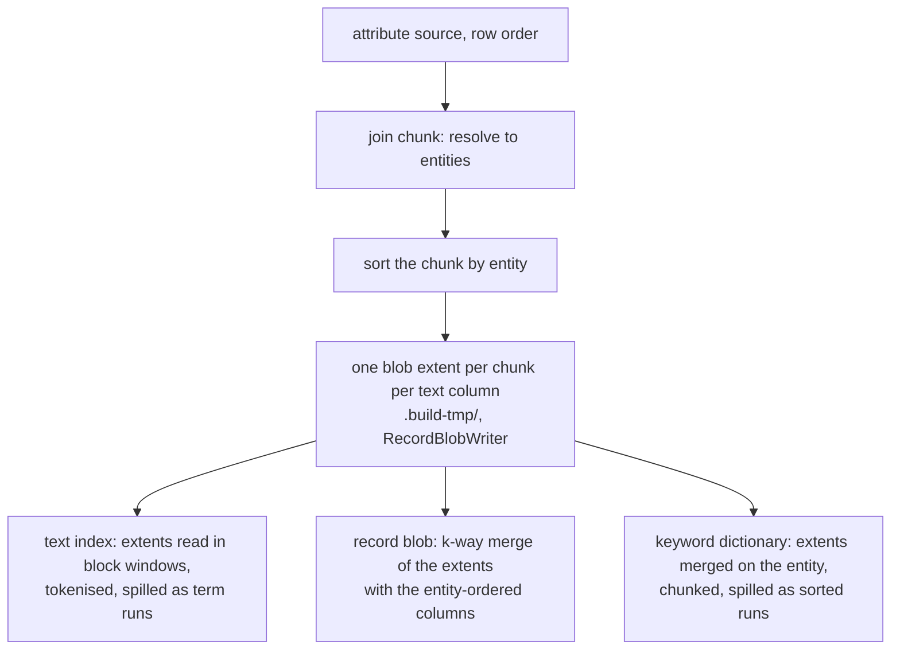

# A column no pass reads at an entity is never permuted

**Date:** 2026-09-04, extended 2026-09-10 from `text` to every string column the record blob alone
reads, 2026-09-11 to choosing between the two routes per column, and 2026-09-11 again to the
indexed `keyword` and `utf8` families, whose dictionary pass reads the extents (§2's "Which columns
can take extents" and "Which of them take it").
**Status:** Provisional. Built for the base build; the flush and the fold are unchanged. Byte
identity against the arena build is measured for `text` at 10⁶ (`medcpt-1m`, 36 files), 10⁷
(`medcpt-10m-abs`, 38 files) and 10⁸ (`paperseek`, 46 files), and for a blob-resident `keyword`
forced down each route on five ladder corpora up to 2.58×10⁷ items, and for an indexed `keyword`
forced down each route on `gbif-64p` at 2.58×10⁷ items
([`probes/2026-09-10-blob-resident-strings/`](../../probes/2026-09-10-blob-resident-strings/README.md));
`crates/tessera-build/tests/extent_route.rs` holds the same property on a corpus carrying all three
string families at once. None differ but `MANIFEST.json`'s `created_at` and the `CURRENT` that
carries its digest.
**Reads against:** [`records-and-search.md`](records-and-search.md) §3 and §4.4 (the record blob's
format and addressing, the text family), [`compaction.md`](compaction.md) (the fold's record pass),
[decision 0091](../decisions/0091-build-is-ingest-into-an-empty-database.md).

## 1. What the join does today, and why it permutes

A `text` column's values reach two consumers: the token index, and the record blob that answers
`entity → value` at drill-down. Both are entity-space artefacts, and entity ids are assigned in
signature-then-Morton order. The attribute source is read in its own row order. The two orders are
unrelated, so the join holds every value it decodes until it can be placed at an entity index.

It holds them in a string arena under `.build-tmp/`: one file of `entity ‖ length ‖ bytes` records
with an entity-indexed offset array beside it. The arena is the corpus's whole prose. At the 10⁸
PaperSeek rung that is 128 GiB on a 47 GB box, and every consumer that walks entity space reaches
it at a random offset per document.

Two shapes were built to answer that and neither removes the permutation.

The text index stopped walking entity space and walks the arena instead
([`probes/2026-09-03-text-arena-streaming/`](../../probes/2026-09-03-text-arena-streaming/)):
measured at 10⁸, 2,371.9 s at 1.74 major faults a second, against over four hours without
finishing. The record blob cannot take that fix, because its rows are written in ascending entity
order.

So the arena was built in entity order instead, by a second decode of the source's prose
([`probes/2026-09-03-entity-ordered-arena/`](../../probes/2026-09-03-entity-ordered-arena/)). That
finishes: measured at 10⁸, `record_blob` 905.4 s at zero major faults. The price is the second
decode and the scatter that fills the arena, and it is the largest single cost in the build:
`attribute_tail` 6,369.1 s against 704.7 s for the one-pass join.

The permutation itself is what costs. 119 GB of prose is written once, read once at random, and
written again, through a mapping larger than memory.

## 2. The new shape

The prose is decoded once, in source order, and never held in entity order.

Caption: each byte of a column's characters is written once as an extent and read once by each
consumer.

A join chunk is already sorted by entity, because the scatter into the fixed-width columns needs
it. Each chunk of each `text` column is written out through `RecordBlobWriter` as one blob extent:
the same three files, the same block format, the same addressing as the base blob. The extents are
`.build-tmp/` scratch and no manifest names them.

The text index reads the extents. Each extent's block directory splits into contiguous block
ranges, so a worker reads one range front to back, decompresses a block at a time and tokenises
the rows in it. This replaces the arena windows and keeps everything downstream of them: the run
spill, the cascade, and the merge that compares run heads.

The record blob is a k-way merge over the extents and the entity-ordered columns, streaming
through one `RecordBlobWriter` at 256 KiB. Nothing about the blob's format or addressing changes,
and the output is byte-identical to the arena build's.

Working set: one join chunk, plus one uncompressed block per extent at the merge.

### Which columns can take extents

**The order a column's readers want decides, not its declared type.** The entity-indexed offset
array beside an arena exists to answer `entity → value` at random, and one pass asks a string
column that question: the hot row tail, which reads a value at a row. Every other reader takes the
column once, ascending in the entity. The record blob's merge does, the token index does, and so
does the keyword dictionary's chunk pass. An extent is a join chunk in that chunk's own entity
order, so a merge across a column's extents is the column ascending, and the offset array buys
none of them anything. The extent route is therefore open to a bundle-wide string column that
declares no `render`, which is `pipeline::may_take_extents` and is arithmetic over the compiled
schema, settled before the first source file is opened.

That is every bundle-wide `text`, `keyword` and `utf8` column, whatever its `index` says. Which
reader the extents have differs: a `text` column's are read by its token index and by the record
blob (`records-and-search.md` §4.4); a `keyword` or `utf8` column with neither flag has only the
blob; an **indexed** `keyword` or `utf8` column has only its dictionary pass, which merges them on
the entity in place of walking an arena at 8 B/item of offsets.

⊘ `render` is refused on every string type at the declaration, so that term of the test fires only
for a `Schema` assembled programmatically. It is in the test because it is what leaves every
spilled column with a reader: extents nothing reads would be a declared column stored nowhere.

### Which of them take it

**A `text` column always; the rest while the arena has the disk for it.** The two routes write the
same bundle, byte for byte, so the choice is the build's own cost and nothing else's, and the two
costs run in opposite directions:

| | arena | extents |
|---|---|---|
| what it costs the disk | the characters, an 8 B/item offset array, an n/8 presence bitmap and one growth step | the characters as 256 KiB zstd blocks, a row directory and a has-row bitmap, and nothing per entity |
| measured, 125,789,091 GBIF occurrences | 5.71 GB for `scientificname` | 1.63 GB |
| the build's peak disk, same corpus | 12.60 GB | 9.26 GB |
| the build's wall clock, same corpus | 324.7 s | 356.1 s |

The indexed family runs the same way. Measured on `gbif-64p`, 25,846,007 occurrences, with
`scientificname` spilled either way so that only `specieskey`'s route moves: peak disk 1.99 GB on
the arena against 1.74 GB on the extents, a saving of 250.7 MB or 9.70 B/item, for 64.5 s against
67.2 s of wall clock. ⊘ That pair is not re-measured against the packed offset word, which takes
4 B off every present value on the arena side alone; forcing one column's route needs
`build_routed` and there is no command for it. With both columns on the arena — which is what this
box's free space chooses — the same build peaks at **2.81 GB** in 59.1 s (measured, two runs
agreeing to 8 KB).

So a column that fits takes the arena, and one that does not spills. `residency::plan_routes`
chooses it, once, at the plan: it walks the declared columns in order, moves each onto the arena,
and keeps the move while the entity-order stages' largest phase still models inside half the space
free on the output filesystem. Two arenas that each fit alone need not fit together, which is why
a column is charged against what the columns before it already took rather than against an empty
disk. `ExtentRoute` overrides the choice for a measurement or a test; nothing derives it twice.

**The free space and not the memory budget.** The arena's only reader is the record blob's merge,
which walks entity space ascending, and the join writes each chunk of the arena in that chunk's
own entity order — so the merge reads it as a few dozen ascending runs and not at random. Squeezing
the page cache does not break that: measured at 125,789,091 occurrences uncapped and under cgroup
caps of 8 and 6 GiB, `record_blob` held at 28.7–28.9 s on the arena route while the extent route's
stayed at 39.3–44.5 s, and below 6 GiB the build is OOM-killed in a stage no route reaches
([`probes/2026-09-10-blob-resident-strings/`](../../probes/2026-09-10-blob-resident-strings/README.md)).
The arena route was faster at every row count and every survivable cap measured, by 1 to 10% of the
whole build. What it costs is 26 to 31% more peak disk, and space is what the 3,495,729,729-row
rung ran out of.

⊘ **The route moves with the machine, and the log is what says which one a build took.** Free space
on a shared filesystem is not a constant, so one corpus can route two ways on one box a day apart.
The output is byte-identical either way; the wall clock is not, by the 1–10% above. The build
prints the route, the modelled scratch and the free space it was decided against, so two runs can
be read against each other after the fact.

⊘ **One column, one value distribution.** Every figure here is GBIF's `scientificname`, a
repetitive keyword of 757,711 distinct values over 125,789,091 rows. A blob-resident column of
near-unique values would spill more and save less.

A **group-scoped** column keeps its arena whatever its flags say, and it is the one reader of a
string column's `EntityColumn` that remains for the `text` family. It has no blob row — the record
blob is bundle-wide and addressed by a column's position in `declared_scalars`, which a family has
none of (`views.md` §5) — so there are no extents for it to be read from, and its per-view column
is built from the view's own points file, indexed from the arena where it is `text` and written as
a value column otherwise. One text pass serves both producers: it takes either a set of arena byte
ranges or a set of extent block ranges and tokenises what the range yields.

### One extent per column, not per chunk

An extent carries one column's rows. A group of two indexed `text` columns writes two families of
extents, so indexing either reads only its own bytes. Per-group extents would make each index pass
decode every text column's prose. At rung 4 that is the difference between the `title` pass reading
9 GB and reading 119 GB.

The consequence is that one entity's blob row is assembled at the merge from several extents plus
the entity-ordered columns. Fields are gathered from every source at that entity and sorted by
tag, which is declaration order, which is the order the arena build pushed them in.

### An entity written twice

An attribute source may carry two rows for one entity. The arena build resolves that by last write
wins, and its arena walk checks each record's offset back against the column so that the
superseded record is not indexed.

Here the superseded row is in an earlier extent. Extents are ordered by the chunk that wrote them,
so the live set of extent *i* is its has-row bitmap minus the union of every later extent's. That
is bitmap arithmetic over the extents' has-row files, computed once before either consumer runs,
and both consumers skip a row outside it. The text index therefore indexes exactly the values the
blob holds, which is the property the arena walk's offset check gives today.

### Stage order

Unchanged: `attribute_tail`, `layers`, `filter_postings` with the text index charged out of it,
`record_blob`. A column's extents are deleted once its last reader is done with them: an indexed
`keyword` or `utf8` column's at the end of the filter postings, which is where its dictionary pass
runs, and a blob-resident column's after the blob is written.

## 3. What is shared with the flush and the fold

The row-level merge lives in `tessera-filter-write`, which is where the fold's record pass already
lives (`fold_record_blob`, `coalesce_record_extents`). The build depends on that crate and not on
the engine.

`merge_record_rows` takes a set of row sources, each yielding `(entity, fields)` ascending, and
writes one blob. At each step it takes the lowest head entity, unions the fields of every source
at that entity with the later source winning a tag conflict, drops a tombstoned entity, and pushes
the row. The fold and the coalesce call it behind their own `ordered_disjoint` guard, which they
keep: for them an entity in two layers is an allocator defect and must refuse rather than merge.
With disjoint ordered inputs the merge is a concatenation, so their bytes do not change.

The pull cursor the merge reads a layer through is `tessera_filter::RecordRowCursor`, and
`RecordBlob::for_each_row` is that cursor drained. There is one walk over a blob, so the addressing
self-check a producer runs its inputs through is the same one either way.

The flush is untouched: it sorts a window in memory and writes one extent, which is the same shape
at a smaller scale.

## 4. Chunk sizing, the extent count, and the cascade

The extent boundary is the join's own chunk boundary, `JOIN_STAGE_BYTES` at 256 MiB of staged row
headers. `staging_rows` divides that by the per-row width the schema declares, so the row count
falls as the schema widens and the buffer stays a constant. Nothing new is sized.

The prose in one chunk is `staging_rows × mean value length`, which the budget does not bound. At
rung 4 the join staged about 1.9M rows a chunk over 1.02×10⁸ rows, so 54 chunks, so 54 extents per
text column. Each holds about 2.2 GB of prose and 760 MB of blocks (measured ratio 2.9×), and the
merge of both columns' extents into the base blob measured 777.4 s at 16 major faults a second. At 10⁹
with the same schema it is 540 extents a column.

The merge holds one uncompressed block per extent, 256 KiB, so 54 extents cost 14 MB and 540 cost
138 MB. The cap on how many a merge holds open is a sixty-fourth of the memory budget, which is 128
extents at the smallest budget a build is run under and 1,344 at 21.5 GB. Above the cap the extents
are merged in groups into intermediate extents until what is left fits one merge, the same cascade
the text index's runs take. Its reason is buffers alone: an extent's files are mapped and their
descriptors dropped at open, so there is no descriptor ceiling here.

The cascade buys no read work, which is why the cap is set against the budget rather than at a
constant low enough to fold often. Both readers of a column's extents are merges over all of them
at once, so neither reads fewer bytes for a fold, and the fold is a second decompress, decode,
re-encode and recompress of the column. Measured on the 125,789,091-row GBIF prefix, the record
blob took 40.6 s over folded extents against 39.1 s over unfolded ones, every output byte
identical; at rung 6, where each string column spilled about 964 extents against a cap of 128, the
fold was 1,951 s of the filter-postings stage's 3,677 s, 44.8 GB written and 51.3 GB read.

## 5. The disk pre-flight

`residency.rs` charges the phases from the attribute join on, which is what refused rung 4 at
274.5 GB modelled against 257.7 GB free (the model as it stood then; it has since been rewritten
into six phases and its figures have moved).

Removed: everything a spilled column would have held in entity order — the arena charged at the
source's Parquet payload plus its layout, the 8 B an entity of offset, the 8 B a record of header
a `text` column carries (a `keyword` or `utf8` record carries none, its length riding in the spare
bits of the offset word — `column.rs`), and the presence bitmap, which the join's extent lane never
marks.

Added: that column's extents, charged at half the payload. The payload is the column's characters,
measured over a sample of the source's row groups: a Parquet footer's uncompressed size is the
encoded page size and reads a dictionary-encoded string column at a quarter of its values
([`probes/2026-09-10-build-disk/`](../../probes/2026-09-10-build-disk/README.md)). The measured block ratio on prose is
2.9× ([`probes/2026-09-04-rung-4-whole/`](../../probes/2026-09-04-rung-4-whole/), the base blob
at 44.77 GB against the 128 GiB of prose it holds) and on a repetitive keyword column it is higher
still
([`probes/2026-09-10-blob-resident-strings/`](../../probes/2026-09-10-blob-resident-strings/README.md)),
and half is charged rather than a 2.9th because the figure is one corpus's. Modelled, not measured
for this shape, and an estimate rather than a ceiling: a compression ratio has no lower bound at one
half, and a blob-resident column of high-entropy short values measures 0.567 to 0.750.

Which columns the term applies to is the route the build chose, carried into the model rather than
restated in it: a pre-flight that decided the route for itself would charge an arena the build does
not fill. The choice reads the model in turn — a column takes the arena while the entity-order
stages' largest phase fits half the free space — so the two are one arithmetic and not two.

The text index's runs keep their term, still charged at the column they are tokenised from. The
extents and the base blob stand on the disk together for the length of the merge, so the output's
own bytes are already charged from the blob phase on and are not double-charged here.

At rung 4 the abstract column's two terms fall from 115,536 MiB and 115,147 MiB to about 57,768
and 115,147, which is 113 GB off a 274.5 GB refusal. The build the model then admits wrote a
70.78 GB bundle.

## 6. `--arena-order`, 2026-09-03 to 2026-09-04

With `text` out of the arena, the switch governed `keyword` and `utf8` columns alone, and this
section argued for keeping it: a corpus of 10⁹ DOIs is 30 GB of keyword payload, read in entity
order by the dictionary writer and by the blob, and no corpus in the ladder had a keyword payload
above the share that would exercise the two-pass fill.

It was deleted the next day. `probes/2026-09-03-entity-ordered-arena/` found that the join's own
scatter into the entity-major columns — not the arena's fill order — was the term that mattered:
sorted ascending, the record blob finishes at its uncapped wall in *both* orders, so the two-pass
fill's second decode was buying nothing a sorted write had not already bought. The arrival-order
arena, with that scatter, is what remains.

## 7. Determinism

The output must not depend on where a chunk boundary fell, on how many extents there were, or on
which order the decode shards resolved.

The blob is the union of the `(entity, field)` pairs the source carried, with the last write for a
tag winning; the merge orders entities ascending and fields by tag. None of that reads a chunk
boundary. The text index's dictionary is the sorted distinct term set and a posting is the entity
set carrying that term, neither of which reads one either.

Three tests hold it. `chunking_the_text_index_does_not_change_its_bytes` runs the same eleven
plans over both producers and over one, three and eleven interleaved extents, and asserts one
dictionary and one postings file across all of them.
`the_prose_extents_do_not_change_the_blobs_bytes` writes the same corpus at seven chunk budgets,
over values that are absent, empty and written twice, and asserts the three blob files are
identical across all of them. `folding_the_extents_leaves_the_same_rows` asserts the cascade
leaves the same entities carrying the same values.

The join chunk sort is stable, which is what makes last-write-wins an answer rather than a race.

## 8. What it costs

Measured at 10⁸ on `paperseek`, against the entity-ordered arena build of the same corpus
(`docs/ingest-campaign.md` §4b and §4c). Both are `--arena-order auto` on the same box.

| stage | arena | extents |
|---|---|---|
| `attribute_tail` | 6,369.1 s | **890.2 s** |
| `text_index` | 2,233.9 s | **1,688.4 s** |
| `record_blob` | 905.4 s | **777.4 s** |
| the three | 9,508.4 s | **3,356.0 s** |
| whole build | 10,578.4 s | **4,169.9 s** |
| peak `VmHWM` | 29,239 MiB | **19,590 MiB** |

The arithmetic this section was written from — the one-pass join plus zstd at 150 MB/s a core, the
text index reading 45 GB of blocks rather than 128 GiB of arena, and the blob decoding and
recompressing that 45 GB — put the three stages at 4,200 s. They measure 3,356 s, so the model is
25% conservative, and it is conservative at the join: 890.2 s against 1,100 s.

**The join reads the prose once and the arena order stops mattering.** `--arena-order auto` sees
only `openalex_id`'s 1,456 MiB of keyword payload here, so it takes `arrival` and there is no
second decode. Major faults over `attribute_tail` are 0 a second against 140.

⊘ **Nothing improves at 10⁷ and nothing was expected to.** On `medcpt-10m-abs` the 10.2 GiB arena
fits the page cache, so the change buys no I/O and pays compression: 447.9 s against 403.2 s over
the whole run, `attribute_tail` 71.4 s against 33.8 s, `record_blob` 71.4 s against 64.4 s. What it
buys at that scale is the peak, 8.0 GB against 11.2 GB, and indifference to a cap — under
`MemoryMax=4G` the same build takes 461.5 s, 1.03× its uncapped self, at about one major fault a
second where the arena build could not finish the blob at all before the ascending scatter landed.

⊘ **The 10⁷ join is the one figure worth attacking.** Its extra 38 s is zstd on the join's own
threads, one per text column, so a corpus of one text column compresses on one core. Block
compression inside `RecordBlobWriter` is where that would come from, and it is not in this change.

At 10⁹ with abstracts the 10⁸ figures scale to about 9 hours over the three stages, 1.2 TB of prose
and 400 GB of extents. The disk pre-flight prints that forecast before the build starts; it warns
where the disk will not hold it and leaves the decision with the operator.
