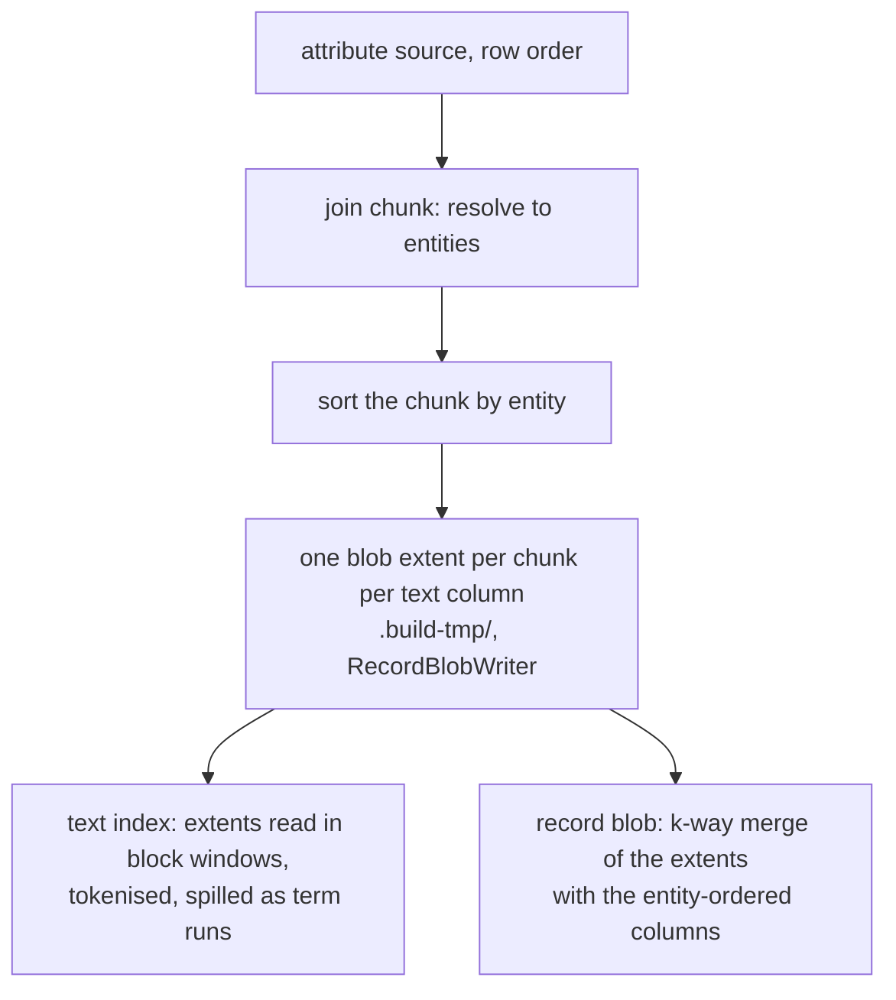

# The build's prose is never permuted

**Date:** 2026-09-04
**Status:** Provisional. Built for the base build; the flush and the fold are unchanged. Byte
identity against the arena build is held at 10⁶ (`medcpt-1m`, 36 files, none differing) and by the
unit tests. ⊘ The 10⁷ and 10⁸ runs are owed: they were queued behind another campaign's build.
**Reads against:** [`records-and-search.md`](records-and-search.md) §3 and §4.4 (the record blob's
format and addressing, the text family), [`compaction.md`](compaction.md) (the fold's record pass),
[decision 0091](../decisions/0091-build-is-ingest-into-an-empty-database.md).

## 1. What the join does today, and why it permutes

A `text` column's values reach two consumers: the token index, and the record blob that answers
`entity → value` at drill-down. Both are entity-space artefacts, and entity ids are assigned in
signature-then-Morton order. The attribute source is read in its own row order. The two orders are
unrelated, so the join holds every value it decodes until it can be placed at an entity index.

It holds them in a string arena under `.build-tmp/`: one file of `entity ‖ length ‖ bytes` records
with an entity-indexed offset array beside it. The arena is the corpus's whole prose. At the 10⁸
PaperSeek rung that is 128 GiB on a 47 GB box, and every consumer that walks entity space reaches
it at a random offset per document.

Two shapes were built to answer that and neither removes the permutation.

The text index stopped walking entity space and walks the arena instead
([`probes/2026-09-03-text-arena-streaming/`](../../probes/2026-09-03-text-arena-streaming/)):
measured at 10⁸, 2,371.9 s at 1.74 major faults a second, against over four hours without
finishing. The record blob cannot take that fix, because its rows are written in ascending entity
order.

So the arena was built in entity order instead, by a second decode of the source's prose
([`probes/2026-09-03-entity-ordered-arena/`](../../probes/2026-09-03-entity-ordered-arena/)). That
finishes: measured at 10⁸, `record_blob` 905.4 s at zero major faults. The price is the second
decode and the scatter that fills the arena, and it is the largest single cost in the build:
`attribute_tail` 6,369.1 s against 704.7 s for the one-pass join.

The permutation itself is what costs. 119 GB of prose is written once, read once at random, and
written again, through a mapping larger than memory.

## 2. The new shape

The prose is decoded once, in source order, and never held in entity order.

Caption: each byte of prose is written once as an extent and read once by each consumer.

A join chunk is already sorted by entity, because the scatter into the fixed-width columns needs
it. Each chunk of each `text` column is written out through `RecordBlobWriter` as one blob extent:
the same three files, the same block format, the same addressing as the base blob. The extents are
`.build-tmp/` scratch and no manifest names them.

The text index reads the extents. Each extent's block directory splits into contiguous block
ranges, so a worker reads one range front to back, decompresses a block at a time and tokenises
the rows in it. This replaces the arena windows and keeps everything downstream of them: the run
spill, the cascade, and the merge that compares run heads.

The record blob is a k-way merge over the extents and the entity-ordered columns, streaming
through one `RecordBlobWriter` at 256 KiB. Nothing about the blob's format or addressing changes,
and the output is byte-identical to the arena build's.

Working set: one join chunk, plus one uncompressed block per extent at the merge.

### Which columns take extents

Bundle-wide `text` columns only. A `keyword` or `utf8` column keeps its arena: its values are read
by the dictionary writer and by the blob in entity order, both of which want random access to a
column whose payload is a fraction of the prose. Section 6 covers what that leaves `--arena-order`
governing.

A **group-scoped** `text` column keeps its arena too, and it is the one reader of a text column's
`EntityColumn` that remains. It has no blob row — the record blob is bundle-wide and addressed by
a column's position in `declared_scalars`, which a family has none of (`views.md` §5) — so there
are no extents for it to be read from, and its per-view column is built from the view's own points
file and indexed from the arena. One text pass serves both producers: it takes either a set of
arena byte ranges or a set of extent block ranges and tokenises what the range yields.

### One extent per column, not per chunk

An extent carries one column's rows. A group of two indexed `text` columns writes two families of
extents, so indexing either reads only its own bytes. Per-group extents would make each index pass
decode every text column's prose. At rung 4 that is the difference between the `title` pass reading
9 GB and reading 119 GB.

The consequence is that one entity's blob row is assembled at the merge from several extents plus
the entity-ordered columns. Fields are gathered from every source at that entity and sorted by
tag, which is declaration order, which is the order the arena build pushed them in.

### An entity written twice

An attribute source may carry two rows for one entity. The arena build resolves that by last write
wins, and its arena walk checks each record's offset back against the column so that the
superseded record is not indexed.

Here the superseded row is in an earlier extent. Extents are ordered by the chunk that wrote them,
so the live set of extent *i* is its has-row bitmap minus the union of every later extent's. That
is bitmap arithmetic over the extents' has-row files, computed once before either consumer runs,
and both consumers skip a row outside it. The text index therefore indexes exactly the values the
blob holds, which is the property the arena walk's offset check gives today.

### Stage order

Unchanged: `attribute_tail`, `layers`, `filter_postings` with the text index charged out of it,
`record_blob`. The extents are deleted after the blob is written.

## 3. What is shared with the flush and the fold

The row-level merge lives in `tessera-filter-write`, which is where the fold's record pass already
lives (`fold_record_blob`, `coalesce_record_extents`). The build depends on that crate and not on
the engine.

`merge_record_rows` takes a set of row sources, each yielding `(entity, fields)` ascending, and
writes one blob. At each step it takes the lowest head entity, unions the fields of every source
at that entity with the later source winning a tag conflict, drops a tombstoned entity, and pushes
the row. The fold and the coalesce call it behind their own `ordered_disjoint` guard, which they
keep: for them an entity in two layers is an allocator defect and must refuse rather than merge.
With disjoint ordered inputs the merge is a concatenation, so their bytes do not change.

The pull cursor the merge reads a layer through is `tessera_filter::RecordRowCursor`, and
`RecordBlob::for_each_row` is that cursor drained. There is one walk over a blob, so the addressing
self-check a producer runs its inputs through is the same one either way.

The flush is untouched: it sorts a window in memory and writes one extent, which is the same shape
at a smaller scale.

## 4. Chunk sizing, the extent count, and the cascade

The extent boundary is the join's own chunk boundary, `JOIN_STAGE_BYTES` at 256 MiB of staged row
headers. `staging_rows` divides that by the per-row width the schema declares, so the row count
falls as the schema widens and the buffer stays a constant. Nothing new is sized.

The prose in one chunk is `staging_rows × mean value length`, which the budget does not bound. At
rung 4 the join staged about 1.9M rows a chunk over 1.02×10⁸ rows, so 54 chunks, so 54 extents per
text column. Each holds about 2.2 GB of prose and 760 MB of blocks (measured ratio 2.9×). At 10⁹
with the same schema it is 540 extents a column.

The merge holds one uncompressed block per extent, 256 KiB, so 54 extents cost 14 MB and 540 cost
138 MB. The fan-in cap is 128, above which the extents are merged in groups into intermediate
extents until what is left fits one merge. That is the same cascade the text index's runs take and
the same reason: file descriptors and buffers, not correctness.

## 5. The disk pre-flight

`residency.rs` charges the column phase, which is what refused rung 4 at 274.5 GB modelled against
257.7 GB free.

Removed: a `text` column's arena, charged at the source's uncompressed Parquet payload plus 4 B an
entity of layout.

Added: that column's extents, charged at half the payload. The measured block ratio on prose is
2.9× ([`probes/2026-09-04-rung-4-whole/`](../../probes/2026-09-04-rung-4-whole/), the base blob
at 44.77 GB against the 128 GiB of prose it holds), and half is charged rather than a 2.9th because the figure is one
corpus's and the pre-flight refuses a build rather than warns. Modelled, not measured for this
shape.

The text index's runs keep their term, still charged at the column they are tokenised from. The
extents and the base blob stand on the disk together for the length of the merge, so the output's
own bytes are already in the assembly phase and are not double-charged here.

At rung 4 the abstract column's two terms fall from 115,536 MiB and 115,147 MiB to about 57,768
and 115,147, which is 113 GB off a 274.5 GB refusal.

## 6. `--arena-order`

With `text` out of the arena, the switch governs `keyword` and `utf8` columns alone.

It should stay. The arena defect is the payload against the box, not the family: a corpus of 10⁹
DOIs is 30 GB of keyword payload, read in entity order by the dictionary writer and by the blob.
`decide_arena_order` now sums only the columns that still have an arena, so a corpus whose prose
was the whole reason it chose `entity` now chooses `arrival` and pays no second decode.

⊘ No corpus in the ladder has a keyword payload above the share, so the two-pass fill is now
unexercised by any measured run. The unit test that asserts the two orders build the same bundle
stands; the 10⁷ and 10⁸ comparisons do not cover it any more.

## 7. Determinism

The output must not depend on where a chunk boundary fell, on how many extents there were, or on
which order the decode shards resolved.

The blob is the union of the `(entity, field)` pairs the source carried, with the last write for a
tag winning; the merge orders entities ascending and fields by tag. None of that reads a chunk
boundary. The text index's dictionary is the sorted distinct term set and a posting is the entity
set carrying that term, neither of which reads one either.

Three tests hold it. `chunking_the_text_index_does_not_change_its_bytes` runs the same eleven
plans over both producers and over one, three and eleven interleaved extents, and asserts one
dictionary and one postings file across all of them.
`the_prose_extents_do_not_change_the_blobs_bytes` writes the same corpus at seven chunk budgets,
over values that are absent, empty and written twice, and asserts the three blob files are
identical across all of them. `folding_the_extents_leaves_the_same_rows` asserts the cascade
leaves the same entities carrying the same values.

The join chunk sort is stable, which is what makes last-write-wins an answer rather than a race.

## 8. What it costs

Measured today at 10⁸ (`docs/ingest-campaign.md` §4b): `attribute_tail` 6,369.1 s, `text_index`
2,234 s, `record_blob` 905.4 s. 9,508 s over the three.

Modelled here, at 10⁸, on the same box:

| stage | model | reasoning |
|---|---|---|
| `attribute_tail` | 1,100 s | the one-pass join measured 704.7 s, plus zstd-3 over 119 GB at 12 cores |
| `text_index` | 2,000 s | tokenisation is unchanged; the read falls from 128 GiB of arena to 45 GB of blocks |
| `record_blob` | 1,100 s | 45 GB decompressed, re-encoded and recompressed, against 905.4 s to compress 119 GB read sequentially |
| total | **4,200 s** | against 9,508 s |

⊘ Modelled, not measured. The compression terms assume zstd level 3 at 150 MB/s a core, which is
this repository's operating point for the blob and is not measured on this box.

At 10⁹ with abstracts the same arithmetic gives about 42,000 s over the three stages, 1.2 TB of
prose and 400 GB of extents. The disk pre-flight is what decides whether that build starts, and
its column phase at 10⁹ is dominated by the extents and the text index's runs.
