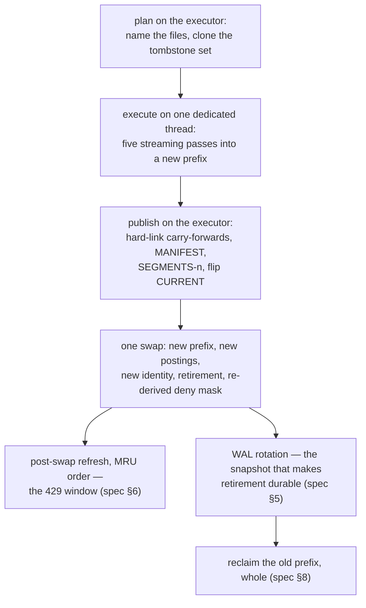

# Compaction — design

**Date:** 2026-08-05
**Status:** **Provisional — r8; the seam and the three passes are built.** Two adversarial rounds
have run (r3, three lenses; r5, two lenses on the sections that changed shape) and both are
dispositioned in the body. r4's three fatal findings and its refuted mechanism are fixed there:
retirement is derived from what the publication removed, the locator is snapshot-bounded, the seam
has four gaps rather than three, the memory claim is a checked budget, and the pre-swap refresh is
withdrawn for the post-swap floor.
**D5 is ruled: the row-space fold is primary** (owner, 2026-08-05), with a standing budget that a
slower fold is an acceptable price for a gentler one (spec §6.1). **The two owner rulings this
document owed against documents it defers to have landed** (2026-08-06): `architecture.md` §11.3 is
corrected — a fold *does* invalidate the term index and every mask fragment (r34, decision 0050) —
and contracts §2.1 is narrowed to one *base* segment per partition-slice plus the fold's in-flight
extents (r21, decision 0051). **The §5/§6 re-review ran at r5 and is
dispositioned**, and its findings changed both sections: §5's retirement rule tests the whole
carry-forward set, §6.1's throttle was refuted and replaced (decision 0052), and §6.2's refusal
window is gone — a fold's aftermath is a cache miss, not a refusal (decision 0053), which also
retires §6.3. **The publication seam (§4) and Rule F's retirement route (§5) are built**, ahead of
the fold everything else in this document describes, because they are the change write-path §5.4
requires be made in the same change as the first fold and because every other part of the fold
publishes through them. **What remains before it becomes normative:** the invariants lens on the
staging list of §6.2, if it is built, and on D5's rows-frozen safety claim, which has never had one.
Code may be written against this document meanwhile; neither gates implementation of the fold
itself.
**Owns:** the fold — what it executes, what it carries forward, how it is published, what retires
at it, and what a viewer pays at the flip. The prefix rewrite, the `CURRENT` flip, and
reclamation.
**Does not own:** the invariants and the leak register (architecture §4, Appendix C — cited, never
restated); the bundle bytes (contracts §2); ingest, the commit window, the WAL, flush, the deny
lane, merge and coalesce (write-path §1–§7, normative, cited here and unchanged by this design).
**Reads against:** architecture §4, §10.2, §11.1–§11.3, Appendix C; contracts §2.1–§2.6, §3.4;
write-path §4–§9 and especially **§5.4 (Rule S / Rule F)** and **§8 (the seam)**; SA §6.6, §6.7;
lifecycle §2; decisions 0013, 0040, 0041, 0042, 0043, 0044, 0046, 0047, 0048.
**Citation convention:** unprefixed `§n` is the architecture design; `write-path §n`,
`contracts §n`, `SA §n`, `lifecycle §n` as named. This document's own sections are **spec §n**,
and are cited from elsewhere as `compaction §n`.

**⊘ No fold exists**, and everything this document says about one is obligation rather than
description. What *is* built are the primitives its passes compose and **the publication seam they
publish through**, marked ✔ where they appear — the streaming segment writer and its k-way merge
producer (spec §3 pass 1), the mapped `permutation.bin` scatter (pass 1), the streaming external-id
run merge (pass 3), the refresh's prefix carry and its MRU ordering (spec §6.2), the seam's four
gaps and Rule F's retirement route (spec §4, spec §5), and probes **P2** and **P3** (spec §14).
**Passes 1, 2 and 3 are built too** (spec §3), and what none of them has is a caller that folds.
**The plan, the dedicated thread that runs the passes, passes 4 and 5, retirement's *derivation*
(spec §5's `executed` rule), reclamation (spec §8) and the operator surface (spec §9) are
unbuilt.** Where a figure is quoted it is marked measured, modelled
or assumed; claims about the tree were verified against branch `geometry/cell-plus-residual` and
re-verified for each ✔.

---

## 0. Three obligations, one operation

Compaction is not a tuning pass. It is the one operation that discharges three obligations nothing
else can, and the reason it is invariant-bearing rather than housekeeping is the first of them.

1. **Rule F's retirement.** A deletion retires *only* at the fold that executes it (write-path
   §5.4 — which names evaluate entries too; decision 0048 deletes them, spec §2). There is no
   fold, so nothing retires: the overlay grows
   monotonically under deletion churn, and `overlay_soft_limit`'s alarm has no lever to pull
   because the lever is this document.
2. **Reclamation.** On-disc bytes are a **measured 2.0–2.6× the bytes the manifest names, and only
   grow** (`docs/evidence/memos/2026-08-05-write-path-at-scale.md` §2). A merge orphans its inputs
   and a coalesce orphans its tiers; both stay on disc because every side-manifest below the
   current `n` still names them and a step-down may serve one (contracts §2.3). Nothing else in
   the system can delete a file.
3. **Reorganisation at the root.** Flush appends and merge bounds what flush grows, but both work
   *within* a prefix and over an ever-growing base. The fold returns the bundle to one segment per
   partition-slice, one base postings tier, one external-id run and one locator — contracts §2.1's
   *"a build is a full compaction"*, reached without a build.

Everything else follows from those three. In particular the fold is **not** the answer to segment
count (merge is), tier count (coalesce is), or visibility latency (flush is). If a change to this
design is justified by one of those, it belongs in write-path §7 instead.

**Scope exclusions, each for a stated reason.** The fold does **not** re-quantise (decision 0040 —
bounds are index configuration, immutable for a slice's life; a wrong extent is a migration). It
does **not** renumber the entity axis: entity ids are stable across rebuilds (§5.1), the overlay
and the WAL are entity-keyed, and every `tessera_id` a client holds is a bijection of one — so
§11.1's batch-grid change, which would reassign them, is an identity-breaking rebuild and not this.
Re-ranking needs no separate mechanism: the fold's output is one globally Morton-sorted segment by
construction.

## 1. The shape

Three properties hold throughout, and they are what make a fold something a running deployment can
survive rather than a scheduled outage.

- **It holds nothing.** Every input is an immutable file named by the plan. The executor is
  occupied only at the plan and at the publication, each of which is bounded work.
- **Ingest, denies and flush continue.** A deny takes effect at its own ack; a flush publishes into
  the *old* prefix and is carried forward at the flip. *"Flushes never block"* (SA §6.7) is not
  weakened here.
- **Merge and coalesce are suspended for its duration.** Their outputs would be orphaned by the
  flip and their inputs are the fold's, so running them is waste, not hazard. The safety argument
  does not rest on the suspension — spec §4's presence check does — but the suspension is what
  keeps the fold from being discarded by its own maintenance passes.

## 2. What is folded, what is carried forward

The fold's snapshot is taken on the executor against the live generation and is **pure**: it names
files and clones one entity-space bitmap. Everything it decides is decided from that snapshot;
everything about *live* state is decided again at publication (spec §4), because the flush's
plan-time-clone hazard applies here identically and at greater cost.

| | At the snapshot | At publication |
|---|---|---|
| **live segments** (base + extents) | folded into one segment per partition-slice | post-snapshot segments carried forward, re-based |
| **delta tiers** | folded into the new base postings | post-snapshot tiers carried forward, listed |
| **external-id runs + locator extents** | folded into one run 0 and one locator **bounded at the snapshot's entity space** (spec §3, pass 3) | post-snapshot runs carried forward, recency order preserved |
| **dictionary extents** | — | carried forward **verbatim** (spec §3, pass 4) |
| `deleted` | `D₀` **executed**: its rows dropped, its postings dropped, its keys dropped | `executed ⊆ D₀` retires; `live deleted − executed` published as `tombstones` |
| `suppressed` | untouched — rows and postings stay (Rule S) | the **live** set, serialised fresh, copied forward whole |
| ingest buffer, WAL | untouched | untouched |

**There is no evaluate arm, and there is not going to be one** (decision 0048). Rule F names two
retiring facts, deletions and evaluate entries; the second has no producer since decision 0047
withdrew the `predicate` op, and its only remaining justification — pre-0047 WALs — does not exist
outside this repository. The store, its WAL variants and the fold pass that would have executed it
are deleted rather than carried. What that removes from this design is the whole of pass 2's
scatter: a fold rewrites postings by *subtraction only*.

**The `tombstones` line is the one arithmetic that must be a set difference against live state.** A
delete accepted during the fold's flight names an entity whose row the fold *did not* drop, because
it was not in the snapshot set. Publishing the executed set, or copying the plan's, would retire
that deletion while its row survives in the rebuilt base — SA §6.7's named fail-open, and the
reason three of the four carried categories exist at all.

**Nothing folded is decided from live state, and nothing live is decided from the fold.** The two
directions are separate mistakes with the same shape, and both have been made in this codebase's
flush path before the rebase rule fixed it (write-path §4.4).

## 3. Execution: five streaming passes

**On one dedicated thread, not the shared compute pool.** Flush, merge and coalesce run on
`Engine`'s single rayon pool — the same pool a viewport's tile loop installs onto — and that is
right for them because `max_merged_segment_bytes` (256 MiB) bounds what they do. A fold's input is
the corpus. Occupying request-serving workers for the minutes-to-hours that takes is exactly the
maintenance schedule leaking into the product that decision 0043 forbids, so the fold gets one
thread and stays sequential. Sequential also bounds memory: there are no per-worker buffers to
multiply.

**The memory rule this design is built around: peak RSS is a stated budget, checked before the
fold starts, and independent of row count.** *(r1 claimed "O(1) in corpus size"; that is false and
both reviewers said so. Dirty shared file mappings are resident and cgroup-charged, so
`permutation.bin` and `ext-locator.u32` are real `VmHWM` — the pre-flight refusal below is what
"does not OOM" actually rests on, and it is the claim to make.)* The terms that scale, and on which
axis:

| term | scales with | at 10⁹ / 1.17×10⁸ terms |
|---|---|---|
| `PostingsSpool`'s offsets buffer | **dictionary size** | ~0.94 GB |
| the largest term's encode | corpus × the widest term's coverage | ~375–500 MB (**measured** 125.12 MB per 25% grant, `probes/results.md` §4.2 — r1 modelled 62 MB and the corpus already contradicted it) |
| `permutation.bin`, written through a mapping (pass 1) | **entity space** | 4 GB, resident |
| `ext-locator.u32`, written through a mapping (pass 3) | **entity space** | 4 GB, resident |
| k-way cursors, spool buffers | inputs | negligible |

So the fold's peak is **~9–10 GB at 10⁹**, dominated by three arrays that scale with the
*dictionary* and the *entity space* — never with rows. *(r4 first gave ~5–6 GB by omitting
`permutation.bin`, which pass 1 writes by exactly the same mapped-scatter route as the locator and
which is charged to RSS on exactly the same argument. Corrected on the second reading, which is one
more than a figure this load-bearing should have needed.)* A **rows-frozen fold does not run
pass 1 at all**, so it drops the first of the three and peaks at ~5.5 GB; splitting the base
locator into entity-range extents — the mechanism flush segments already use — would drop the
second and take it to ~1.5 GB. It **estimates that figure and refuses to start above the
available headroom**, on `tessera-build`'s precedent: that crate exists because the in-memory build
was OOM-killed at 10⁹ on a 47 GiB box, and the lesson is a pre-flight budget, not an assurance.

A merge's measured 4.4–4.9× multiplier on its inputs' bytes
(`probes/2026-08-04-maintenance-memory/`) is affordable only because a policy cap bounds its
inputs. Applied to the corpus it would be 4.4–4.9× the bundle — 200+ GB at the measured 47 GB
bundle — so the fold may not inherit any construction that decodes its input at once. Two existing
properties make the bounded form straightforward rather than clever:

- **Every input is mmapped and uncompressed by contract** (§10.3, contracts §2.6). A cursor into a
  segment is an index into a mapped buffer, not a decoded batch, so a k-way merge over *k* segments
  costs *k* integers of state.
- **Every input is already sorted on the key the output needs.** Segments are `(morton, tessera_id)`
  ascending, tiers are term-ascending, runs are key-ascending. Nothing needs a global sort; a
  merge of sorted runs suffices everywhere.

Output is written by the **spool-then-assemble** discipline `PostingsSpool` already establishes:
column bytes are appended to a temporary file, and the single Arrow record batch contracts §2.6
requires is assembled at the end with the spool mmapped as its values buffer. Nothing accumulates
a corpus-sized `Vec`.

### Pass 1 — row space

A k-way merge over every live segment's `morton.u32` and `columns.arrow`, ordered by
`(morton, tessera_id)`, **skipping any row whose entity is in `D₀`** — the plan's tombstone clone,
never `executed`, which does not exist until publication (spec §5). It emits `morton.u32` and
`columns.arrow` for one new segment per (partition, slice), and scatters `perm[entity] = row` into a
memory-mapped `permutation.bin`.

✔ **The pass is built** — `tessera_store::fold_row_space`. Its cursor and its scalar adapter are
shared with `execute_merge` (`segment_cursor.rs`) rather than copied: the writer being shared is
what makes the *bytes* agree, and one definition of "a column the input lacks fails the operation"
is what stops the two producers disagreeing about which segments they will accept.

**The primitive it composes was built first** (decision 0049 sequenced it here, since a streaming merge is also what
decouples merge's memory from `max_merged_segment_bytes`). `SegmentWriter` takes rows one at a time
in `(morton, tessera_id)` order, spools each column to a file beside the output, and assembles the
one record batch contracts §2.6 requires with the spools mapped as its values buffers. Its two
producers are `write_segment` — for an already-sorted in-memory batch, which is flush's shape — and
`execute_merge`'s k-way merge over mapped inputs, which replaced the concatenate-and-re-sort that
made the old merge peak at a measured 4.4–4.9× its inputs. *"A second writer that knows the layout
is how two come to disagree"* (write-path §7), so the fold's pass 1 is a third **producer** and not
a second writer, and the byte-identity of the first two is a test rather than an argument.

Memory: *k* cursors plus the spool buffers. `permutation.bin` is 4 B × (max folded entity + 1) —
4 GB at 10⁹ — and is *written through a mapping*, so it is page cache rather than RSS, exactly as
`Permutation::load` already treats it at read.

✔ **The mapped writer is built** — `tessera_store::write::PermutationWriter`, with
`write_permutation_iter` as its sequential producer and byte-identity between the two under test
(`segment_roundtrip::a_scattered_permutation_is_byte_identical_to_a_sequential_one`). Scatter order
is what it exists for: pass 1 learns `perm[entity]` in `(morton, tessera_id)` order, which is not
entity order, and a sequential writer would have to buffer the whole array to reorder. Note the
sentinel fill it performs at create — `bound × 4` bytes of `0xFF`, because a freshly extended file
reads as zeros and zero is row 0, so an unfilled slot serves one entity's coordinates under every
id that never got a row.

Row ids shift for every row after each dropped one. That is the whole reason spec §6 exists.

### Pass 2 — postings

One ascending sweep over term ordinals `0 .. dict.len()`. Per term: the base posting, unioned with
each live tier's posting for that term, **minus** the tombstone bitmap — re-encoded and appended to
a `PostingsSpool`, whose record ordinal is the term id. That is the whole of it: with the evaluate
arm deleted (spec §2), a fold never *adds* a posting, so no per-term scatter, no descriptor
resolution and no dictionary write appear on this path at all.

Two things make it bounded and correct:

- **Unions happen in the posting's own representation, never as a `Vec<u32>`.** The largest term
  plausibly covers 25–50% of all points (§3), which at 10⁹ is 2 GB as `u32`s and ~62 MB as the
  portable Roaring the tag-1 records already hold. `encode_posting`'s `&[u32]` signature needs a
  bitmap-shaped sibling; that sibling is the fold's only new primitive on this path.
- **The tombstone bitmap is one operand, subtracted from every term.** Subtraction costs
  O(containers touched), and the deleted set is entity-space and sparse, so the term sweep's cost
  is the re-encode rather than the fold.

✔ **The sweep is built** — `tessera_authz::sweep_term_postings`. It takes `dict_len` rather than a
`Dict`, because with no descriptor resolution and no dictionary write the only thing it needs from
one is how many ordinals to emit records for; a term with no data anywhere still gets an empty
record, never a dropped ordinal, which is how `dict.len()` stays monotone across a fold.

This is where the postings side of the tombstone rule is discharged, and architecture §11.3's r33
ruling is why it is not optional: a post-fold fragment that still contained a deleted entity would
make Rule F's retirement re-expose it. Both halves, or neither.

**`terms/pairs.parquet` is re-emitted here, as a side output of the same sweep.** It is the
`(entity_id, term_id)` relation the I1 mask differential runs against — *"optional for a serving
deployment, required for a conformance run"* (contracts §2.4) — and the sweep already has exactly
that relation flowing past it in term-then-entity order, which is the sort order the file
requires. It cannot be carried forward from the old prefix: it would then disagree with the base
postings about every folded deletion, which is the one disagreement the differential exists to
catch. A fold that omitted it would silently make the compacted bundle unconformable, and the
suite is the deliverable.

### Pass 3 — external ids

A k-way merge of the live runs by caller key, keeping the **newest** binding on a collision
(decision 0047; the rule `coalesce` already implements), dropping the keys of `D₀`'s entities —
again the plan's set, not `executed` — into one run 0; and a scatter of `entity → ordinal` into a
memory-mapped `ext-locator.u32` with `0xFFFFFFFF` for entities that never had a key.

✔ **The merge half is built** — `tessera_store::coalesce::merge_runs`, landed with pass 1's writer
because a merge's own run coalescence needed the same streaming shape. It holds *k* cursors over
runs already sorted by key, emits through the one `external-ids.arrow` writer
(`tessera_store::write::RunWriter`, whose other producer is the flush), and its keep-newest
tie-break is pinned by `coalesce_runs::a_key_in_two_runs_keeps_the_newest_binding` — a rule that had
no direct test before, and whose reversal serves a *deleted* holder under a live caller's key with
the right row count and no error.

✔ **Both halves the fold owed here are built** — `tessera_store::fold_external_id_runs`. It shares
one keep-newest core with the coalesce, so no second implementation of the tie-break exists, and
adds the two things a merge's span never needs: `D₀`'s keys are dropped (a tombstoned *newest*
binding drops the key outright rather than falling back to an older one — under decision 0047 an
older binding is already a forgotten holder, so there is nothing to fall back *to*), and the locator
is written through a mapping (`locator.rs`, a sibling of `PermutationWriter` rather than a
generalisation of it, because `ext-locator.u32` is headerless where `permutation.bin` is not).
**Which storage the locator uses is a parameter, not inferred from whether the caller filters**: a
fold with an empty `D₀` is an ordinary round and still needs the mapped one.

**The locator is sized to the *snapshot's* entity space, not the live one** (r3, fidelity F1 —
this was fatal as first written). `ExternalIdSidecar::external_id_of_checked` gives the base
locator absolute priority for any `entity < locator_len()` and consults the carried-forward
`locator_extents` only *past* it. A full-length locator therefore swallows every post-snapshot
entity and answers "this item has no external id" for items that have one — contracts §2.4's
wrong-answer-wearing-a-legitimate-state's-clothes, and exactly the failure that entry forbids.
Bounded at the snapshot, the post-snapshot extents stay reachable at their own ranges.

**Dropping a folded-away entity's key is not optional, and the reason is not reclamation** (r3,
invariants F5). The ingest duplicate check exempts a holder only while `overlay.is_deleted(holder)`
is true — verified in `write.rs`. Retirement makes that false, so a binding left standing would
turn a re-ingest of that external id into a **409**, refusing a user's write and contradicting
decision 0047 directly. The fold therefore drops the retired entities' keys here **and** removes
them from the live external-id map at the swap; either alone leaves the other path answering.

### Pass 4 — the dictionary

**Carried forward verbatim, hard-linked, never renumbered and never shrunk.** Ordinals are
positions in the concatenation (contracts §2.4), a session's granted terms are resolved once at
authorise, and the staleness hint compares `dict.len()` against its value at authorise — so
dropping a descriptor whose postings the fold emptied would shift every later ordinal and move a
counter three mechanisms read as monotone.

**And the fold does not clone the dictionary.** The live `Arc<Dict>` is carried onto the new
generation unchanged, so the 7.1 GB copy a promoting flush pays at 1.17×10⁸ terms (write-path §4.3,
measured) has no counterpart here, and neither does `Engine::open`'s 40–53 s lookup-map rebuild.
Coalescing the extents into one is possible — the whole list is trivially a contiguous window — and
is **declined**: it copies gigabytes to bound an axis `coalesce` already bounds.

### Pass 5 — the manifests

`MANIFEST.json` for the new prefix, digesting each file as it is written rather than re-reading it;
then the carried-forward files hard-linked in (spec §8); then `SEGMENTS-<n>.json` assembled at
publication, not here (spec §4).

**Failure at any point discards the fold.** Its files are orphans under a prefix `CURRENT` does not
name, the next trigger re-plans from scratch, and there is no resume: a resumable fold would need
its own durable progress record, and re-doing a maintenance pass is cheaper than a second thing to
get wrong. Stated because it is a deliberate omission, not an oversight.

## 4. Publication — the seam that has to widen

On the executor, in this order.

1. **Rebase or discard.** Every consumed `seg_id`, run path, locator path and tier path must still
   be listed in the live manifest. ABA-safe because ids are never reused (contracts §2.1). A merge
   or coalesce that published under the fold discards it — which the suspension in spec §1 makes a
   crash-and-race path rather than the steady one.
2. **Assemble `SEGMENTS-<n>.json` from the live partition manifest**, per spec §2's table, with `n`
   from the executor's counter (continuing across the prefix — contracts §2.3) and refuse-to-replace
   standing. `watermark` and `entity_id_high_water` are the **live** values passed through
   untouched, for merge's reason: deriving either from the fold's inputs moves the watermark
   backwards past every post-snapshot entity, and composition treats an entity at or above the
   watermark as buffered rather than rowed, so the gap goes invisible to every principal with no
   error. ✔ The seam refuses a regression rather than trusting the rule
   (`geometry::check_publishable`).
3. **Check the merge-size relation against the fold's own output.** `max_merged_segment_bytes` must
   stay strictly below the base segment's bytes or the *next startup* refuses the configuration
   (write-path §10) — and a fold *grows* the base, folding every extent into it, so the relation
   is normally satisfied more comfortably afterwards; the case to catch is the small corpus where
   it is not. A fold that would publish an unopenable
   deployment is refused here, loudly, rather than at the restart that discovers it.
4. **Hard-link the carry-forwards → write `MANIFEST.json` → write `SEGMENTS-<n>.json` → flip
   `CURRENT`.** `CURRENT` is the commit point and the only mutable file (contracts §2.1). A crash
   before it leaves a complete, unreferenced prefix — an orphan, swept. A crash after it opens at
   the new prefix on restart.
5. **Open the new prefix in-process** — not `Engine::open`. Mapping the new files is lazy; what
   costs anything is rebuilding the carried-forward extents' row maps from their own `tessera_id`
   columns (contracts §2.6 r16), bounded by those segments' row counts, which are one tick of
   ingest each.
6. **One swap**, carrying: the new prefix; `segments_version + 1`; the live watermark; the new
   bundle; the **new base postings reader**; post-snapshot tiers only; the live `Arc<Dict>`; the
   live overlay **minus the executed entries**; `overlay_version + 1`; the live buffer; the new
   fragment identity and its cache; the new external-id index; and `denied[slice]` **re-derived**
   against the new row space — never carried forward, since a denied row id now names a different
   entity.
7. **Rotate the WAL** (spec §5).

✔ **The seam expresses this.** `publish_geometry` used to call itself *"compaction-shaped"* —
correct only while the new prefix's term index and dictionary are the same ones, which is precisely
the premise the fold breaks. **Four** gaps had to close, and did in one change; write-path §5.4
found three and this document inherited its count instead of checking (r3). What each is now:

- **`bundle_identity` is on the generation**, with the `FragmentCache` it keys — `Generation::
  fragments`, and `FragmentCache::rotate` is the only thing that changes it. It was bound at
  `Engine::open` for the process lifetime, so nothing could rotate the fragment identity in-process
  at all, and a fold published through that seam would have left every pre-fold fragment reachable
  by key, including the *persisted* `.frag` files, across a restart.
- **A session's cached fragment is valid only when that identity matches the generation's** —
  `Engine::fragment_for` tests both identity and watermark. The watermark alone cannot see a fold,
  which advances none.
- **The signature is a value** — `GeometryPublication`, carrying an optional `PrefixRotation`: base
  postings, the identity and its cache, the external-id index, and the retirement set, which travel
  together because separating any of them is a fail-open. Retirement rides *inside* the rotation
  rather than beside it, so retiring without rotating the identity — Rule F's fail-open in its pure
  form — is unexpressible.
- **`prefix_dir` is derived, not stored** — the fourth gap, and the one with a data-loss path. It
  was a plain `PathBuf` captured once on both `Engine` and the write executor, and
  `write_segments_manifest` uses it on the **deny-publication** path: unrotated, the first deny
  published after a flip writes its side-manifest into the prefix spec §8 is about to delete —
  acked deny state, gone from the restore path, with no error anywhere. The executor holds the
  bundle *root* and joins the publishing generation's own `prefix`, so the value cannot go stale at
  any of its eight call sites.

Putting the identity and its cache **on the generation** rather than beside it is what makes the
rule structural: a request loads one pointer and gets postings, identity and fragment cache that
agree, exactly as I11's within-request rule already requires for geometry. The external-id sidecar
moved the same way and for the same reason — it was an `ArcSwap` stored one statement after the
generation, which was sound only because a coalesce is content-preserving and a fold is not.

**Swapping the cache is necessary and is not sufficient, and r1 claimed otherwise** (r3, invariants
F2). "Unreachable by construction" is false: `RowProjectionCache::freshest_fragment` took the
max by `segments_version` and **ignored `prefix`**, and `SessionGeometry` holds an
`Arc<FrozenFragment>` outside `FragmentCache` altogether. Both are pre-fold fragment holders that a
cache swap does not reach, so the identity comparison is made *at composition* — the fragment
carries the identity it was built under, `fragment_for` compares it, and `freshest_fragment` is
scoped to the live prefix.

**And there is no cheap in-process open of a second prefix** (r3, fidelity F2). `Bundle`'s
incremental constructors all work within one prefix, and `open_bundle` — the only whole-bundle
route — digests every byte both `files` maps name and re-pays `Permutation::validate_rows`. ✔ Step
5 is `tessera_store::open_written_prefix`, the **fourth store constructor**: it skips those two
checks and nothing else, on the premise that the caller wrote and digested these bytes moments ago,
and it keeps every check on the manifest's self-consistency. `Engine::publish_rotated_prefix` is
its one holder of that obligation, and refuses a prefix `CURRENT` does not name — the bundle
identity *is* the digest `CURRENT` carries, so publishing an uncommitted prefix would serve geometry
a restart could not find.

## 5. Retirement, and how far its durability reaches

The executed entries leave `deleted` **in the fold's own swap** — Rule F, whose
safety is the identity match spec §4 builds, not a stamp ordering.

✔ **The route is built and the rule is not.** `Overlay::retire` is the one thing that removes from
`deleted`, it takes only deletions and has no sibling for `suppressed`, and it is reachable only
through a publication carrying a `PrefixRotation` — so the identity match and the retirement are
one swap by construction. What is unbuilt is the set: `executed` below is the fold's to derive, and
an empty one is what every caller passes today.

**What "executed" means is the whole of this section, and the obvious definition is fail-open**
(r3, invariants F1). Retiring the plan's tombstone clone `D₀` serves an acknowledged deletion,
permanently, by this interleaving: a flush plans at tick *N* with entity E buffered; its pool run
spans the tick, since nothing bounds flush and fold overlap; a delete for E is accepted, so
`D₀ ∋ E` at tick *N+1*; but the flush's segment is not in the fold's file list, so the fold removes
neither E's row nor its postings; the flush then publishes both into the old prefix, the fold
carries that segment and its tier forward verbatim, and retirement withdraws the only thing hiding
E. E is drawn, counted and served to every authorised principal. **The identity match cannot see
this** — no fragment is stale; E genuinely is in the post-fold postings. It is write-path §4.2's
inherited obligation arriving by a route this document's r1 mis-filed onto spec §2's different set.

So retirement is **derived from what the publication demonstrably removed, never from what the plan
predicted it would**:

> `executed = { e ∈ D₀ : no carried-forward artefact names e }`, evaluated at publication —
> **artefact meaning tier, segment *and* external-id run, not tier alone.**

That is checkable rather than prospective, it is computed against published state exactly as the
manifest's deny fields are, and it makes the rule *smaller*: an entity whose row, postings or
binding survives is simply not retired this round, and the next fold takes it.

**Tiers alone are not sufficient, and r5 found the hole.** A flush publishes four things together —
a segment, a tier, a run and a locator extent — and §2 carries all four forward, but a tier holds
only `(term, entity)` pairs. **An item ingested with an empty access label produces no pair at
all** (the reference plugin drops empty descriptors, and nothing on the ingest path refuses a
zero-term item), so it has a carried-forward row and a carried-forward external-id binding while
*no* carried-forward tier names it. Retire it and:

- a lawful re-ingest of its external id is refused **409** — resolution is newest-run-first, so the
  carried-forward run's binding wins over the folded run 0, and both duplicate checks exempt only a
  holder for which `overlay.is_deleted` is true, which retirement has just made false. That is
  verbatim the failure pass 3 calls *"not optional … refusing a user's write and contradicting
  decision 0047"*, reopened through an artefact pass 3 does not filter;
- its row is never reclaimed by any later fold, since it has left `deleted`;
- and it is intermittent across a restart, because the resurrection window below puts the entry back.

Not a disclosure: a zero-term entity is in no posting, so it is in no fragment and no mask, and the
overlay entry was never the only thing hiding it. That is why this is a correctness and availability
defect rather than a fail-open. Testing the whole carry-forward set costs nothing extra — a
carried-forward flush's consumed entities are already materialised, which is also the answer to
"how do you ask a tier whether it contains an entity", a primitive `DeltaTier` does not expose.

**The execution set and the retirement set are different sets, and conflating them restores the r3
fail-open.** `executed` is evaluated *at publication*, hours after passes 1 and 3 have run — so
those passes cannot use it, and do not: **passes 1–3 execute over `D₀`; only retirement uses
`executed ⊆ D₀`.** The containment is the safety property — everything that retires demonstrably
lost its row and its postings, while an entity in `D₀ \ executed` has lost both and merely keeps its
overlay entry for another round, which is fail-closed. The tempting simplification, making the
passes use `executed` too, requires computing it at plan time, which means *predicting* the
carry-forward set: exactly the fail-open this rule replaced.

Retirement in the swap, never before it: an entry withdrawn while the old geometry is still live
re-exposes the item for the width of that window. After it would be merely wasteful, and is the
safe direction if the ordering ever has to give.

**Durability reaches one rotation further, and this is worth stating plainly because a reader will
expect otherwise.** The overlay's durable homes are the WAL and the side-manifest (write-path
§4.5). The new manifest's `tombstones` omits the executed set, but the WAL still holds the original
`ChangeByEntity{Delete}` records, and replay runs *over* the manifest seed. So until a rotation
whose head snapshot postdates the fold has reclaimed those members, a restart resurrects the
retired entries.

That is harmless: a resurrected entry names an entity with no row and no postings, so `verdict`
denies something nothing can reach, and no row-space mask changes — **which rests on the fold's
`permutation.bin` being sentinel-filled rather than zero-filled**, since `denied_rows_of` skips an
entity only when `row_of` answers `None`, and a zero-filled slot answers row 0. `PermutationWriter`
fills with `0xFF` at create for exactly this reason (spec §3, pass 1).

**It does not self-heal, and r5 corrected this.** Once a restart lands inside the window, the
resurrected entries are *durably re-adopted* by both durable homes: `apply_snapshot` applies
entries and never assigns, so a rotation's head snapshot can add a resurrected delete back and can
never remove one; and the next accepted deny republishes them into the manifest seed through
`tombstones`. So the resurrection survives every later rotation and every later manifest write, and
clears only at the **next fold**, which executes it again — cheaply, since it now has no postings.
The honest statement is that retirement's durability is bounded by reclamation of the WAL members
holding the original `ChangeByEntity{Delete}` records, and that a restart inside that window makes
the entries permanent until the next fold. Rotation runs immediately after the fold's swap to make
that window as short as possible, and the ordinary reclaim bound — the oldest surviving buffered
row's position — decides when it takes effect.

## 6. What a viewer pays

### 6.1 The budget: slower is free, disruptive is not

**Owner ruling, 2026-08-05: a slower fold is an acceptable price for a gentler one.** The fold is
on no request path and no deadline; wall-clock is a property nobody observes. Read that as a
standing licence to spend duration on smoothness, and as the reason several tempting things are
*not* done — the fold stays single-threaded (spec §3), which is also the memory-safe choice, and
nothing here is parallelised to finish sooner.

The budget's first consumer is an **IO rate limit**. The fold streams the whole bundle past the
page cache, and what that does to a concurrent viewport's mapped hot files was this design's
largest unmeasured risk. ✔ **P3 has measured it. The risk is real and smaller than feared**: with
the page cache below the bundle — the regime a fold creates — an unthrottled reader costs a
concurrent viewport up to **2.03×**, monotone in read rate, over two runs at a 45.57 GiB bundle
against 36.9–38.2 GiB of RAM. Not the *"orders of magnitude"* this paragraph guessed; a 15.7×
excursion was seen only under a cgroup memory cap, where direct reclaim is a plausible confound,
and neither real run reproduced it.

**⊘ But a read-side rate limit has no site on this fold, and the r5 review refuted it.** Every one
of the fold's inputs is a *mapping*, not a stream — `MortonSlice::load`, `ColumnsRef::load`,
`Permutation::load`, the postings reader and every delta tier all go through `Mmap::map`, and spec
§3 depends on exactly that ("a cursor into a segment is an index into a mapped buffer"). **You
cannot sleep between page faults.** P3 measured a buffered reader with a sleep between `read(2)`
calls, which is a faithful model of the *harm* — the page cache fills with bytes the viewport does
not want either way — and not of any mitigation this fold can apply. The 128 MiB/s figure therefore
stands as evidence about pollution and **not** as a rate this design can set.

**The mitigation is `madvise(MADV_SEQUENTIAL)` on each input mapping** (owner ruling, 2026-08-06;
decision 0052). The goal was never to slow the fold — its duration is free under the ruling above —
but to make the kernel reclaim *the fold's* pages rather than the viewport's. Unthrottled it does
the opposite: the fold's pages are the most recently touched, so they look hottest, and the
viewport's mapped hot pages are evicted for bytes nothing will read again. `MADV_SEQUENTIAL` states
exactly what is true — this range is streamed and may be freed soon after access — in one call per
input, with no rate and no device-specific constant.

**⊘ It is a hint, and nothing measures it yet.** P3 must be re-run with it applied, over a sweep
long enough to displace a real fraction of the bundle. `MADV_COLD` behind the cursor is the
escalation if it proves insufficient; decision 0052 records why the windowed-unmap and
producer-pacing routes were declined.

**The write side is a separate mechanism and is still open.** The fold spools column bytes, maps
them back, writes assembled batches, and dirties a 4 GB `permutation.bin` mapping —
`PermutationWriter::create` in one statement, before pass 1 emits a row. For the spools and
outputs, which are buffered writes and not mapped, `sync_file_range` plus
`posix_fadvise(POSIX_FADV_DONTNEED)` does work and is the standard pattern; spec §10 must assign it
a site.

**A configuration key, not a constant, on either route.** Evidence, and the caveats that neither
run reached a deployment-realistic bundle:cache ratio and that the 128 MiB/s arm displaced under 1%
of the bundle in a 3.5 s sweep: `docs/evidence/memos/2026-08-05-compaction-flip-and-io.md`.

What the budget does **not** buy is a shorter flip. That cost is the refresh pass, and slowing the
fold does not shorten it — see §6.3 for what would.

### 6.2 The flip

This is the fold's one genuinely user-visible moment, and the accounting is honest rather than
comfortable.

**Every row-space artefact in the process is invalid.** A fold permutes row space globally: a
dropped row shifts every id after it. So decision 0044's rung 2 (stale-serve) is unsound — it is
exact for a flush only because a flush appends — and the extents-only re-projection that makes a
merge affordable is unavailable, because the base permutation it re-projects onto is the file the
fold rewrote. Every resident session needs a **full** projection build: a measured 4 550 ms for the
primitive at 10⁹, 10.7 s end to end. Fragments must be rebuilt too, because the identity rotates:
a measured ~200 ms per credential, flat in tier count (P2).

**The flip does not refuse anything** (decision 0053). The generation pointer moves, and a session
whose projection is missing afterwards takes an **ordinary cache miss** and rebuilds — exactly as a
cold session does. The fold's publication does not arm the shed.

The rule that decides it, so the next publication kind need not re-litigate: **shed only while the
refresh pass is shorter than the rebuild it would save.** Flush and merge satisfy it — a ~0.7 s pass
against a measured 4 550 ms rebuild, so shedding turns a 4.5 s inline build into a 1 s retry, and
they keep the gate unchanged. A fold inverts it by two orders (a ~180 s pass against a 10.7 s
build), so shedding would refuse everyone for minutes to avoid a burst that clears in seconds.
Decision 0044's F5 finding established the gate against a *merge*; this document inherited it for a
fold without re-checking, and §6.2 previously claimed to satisfy 0044 *verbatim* when 0044's word is
*only* and it scopes to same-key racers.

**The total work is the same or less.** A refresh pass rebuilds every resident entry; the
miss-driven path rebuilds only what someone asks for, so idle sessions never pay. And the herd F5
named is already bounded three times over — `ComputeGate` bounds requests inside the engine,
`single_flight` stops two requests building one key, and `RowProjection::new` already fans out
across the whole pool, so concurrent rebuilds contend rather than multiply.

**What a viewer therefore pays at the flip is latency, not errors**: the first request per session
after a fold rebuilds inline (a measured 10.7 s end to end at 10⁹, contending), and every request
after it is served normally. That is 0043's *"not observable in a viewer's latency or in a viewer's
errors"* traded down to the first of the two, which is the direction the rule permits.

**A staging list is licensed as an optimisation and is not required** (decision 0053, and it is not
built). Because a miss is merely a miss, the fold may precompute the new row space's entries into a
**second projection cache with its own byte budget** — populated most-recently-used and filtered to
recently-active sessions, which is what bounds its memory to a fraction of the serving cache rather
than a copy of it — and swap it in at the flip, dropping the old list. Dropping the old list is what
makes stale-serve's unsoundness across a fold structural: there is no superseded entry left for
rung 2 to find.

> **The trap, if it is built.** `session_geometry`'s rung 1 returns a `Peek::Ready` entry **without**
> checking `extends_to` — an entry under the live key is assumed to be over the live row space. A
> precomputed entry built before a flush landed does not cover the extents carried forward at the
> flip, so serving it answers an **incomplete mask**: items missing, no error. The coverage check
> belongs at the flip, on the executor, which is the same thread that publishes flushes and so sees
> a fixed extent set — extend the short ones (a measured 44.6 ms) or drop them to a miss.

**The window that remains is the rebuild, not a refusal.** `refresh_resident` still runs after the
swap to fill entries proactively, most-recently-used first; what changed is that it is no longer
load-bearing, so its duration bounds how many sessions pay a rebuild rather than how long anyone is
refused.

### 6.3 Retained-row-space migration — declined

**Declined at decision 0053, not deferred.** It existed to remove a refusal window that §6.2 now
removes more cheaply. Keeping the superseded row space alive for the refresh pass, serving an
unmigrated session from it and deferring retirement until the last session moved, was the largest
structural change anything in this document proposed: two live row spaces, and — the real cost —
**every row-space read path taking its row space from the one the request selected rather than from
"the bundle"**, which is a discipline across a dozen call sites rather than a mechanism, and where a
fail-open would hide.

Two further obstacles the r5 review found, recorded because they would have been discovered late:
`session_geometry` is *handed* a `slice_data` its caller already resolved from the bundle, so
knowing which row space a session is on before picking the bundle is a signature change through it
and everything beneath; and `KEEP_SUPERSEDED_GENERATIONS = 1` prunes an old-row-space entry one
publication later — ~90 s at a default tick — so the retained row space would outlive the entries
that select it.

What survives from it is the observation that made it seem necessary and is still true: **the
overlay is entity-space, and a fold does not renumber the entity axis** (spec §0), so one `Overlay`
is valid for both row spaces. Nothing now needs that, but it is why the idea looked cheap.

Two smaller options are also declined, and for the record: **slice-scoped folds** buy nothing yet
(⊘ no build emits a second slice), though they remain a reason to write the fold slice-at-a-time
from the start rather than retrofit it when slices land; and **draining the projection cache before
a fold** shortens the rebuild population proportionally but merely moves the cost onto the sessions
it drops, which now pay a miss either way.

The rest of what a viewer observes:

- **A request in flight across the flip finishes against the old prefix**, through the `Arc` it
  loaded at its start. Prefix deletion waits on that (lifecycle §2).
- **`x-tessera-stale` flips to 1** on the next response of any session presenting a pre-fold
  stamp — advisory, never a refusal (decision 0041). It is evaluated per request against the
  presented stamp, not pushed; "broadcast" describes who eventually sees it, not the mechanism.
- **Nothing a client holds breaks.** A tile is a Morton prefix, an item is a `tessera_id`, and the
  entity axis is untouched — so every identifier, every external id and every tile address resolves
  across the fold. `idset` does not advance; this is not a repartitioning.
- **Folded deletions become invisible in one further way and no viewer can tell.** They were already
  invisible via the overlay; after the fold they are absent from the data. Identical outcomes, which
  is what C4's closure needs.
- **θ's anchor moves**, since `V_total` is counted in row space and the fold removes rows. Expected
  observable, same class as a flush's.

**What P3 measured and what it did not:** the harm is real (up to 2.03× unthrottled) and it is a
property of the IO rather than of the algorithm — but the probe's throttled arms displace under 1%
of the bundle in a sweep, where a completed fold displaces all of it, so they bound the
instantaneous contention at a rate and not the cache composition a finished fold leaves behind.
That, and the absence of a throttle site (spec §6.1), is what remains open here.

## 7. Interleavings worth stating once

- **Flush during the fold**: publishes into the old prefix, carried forward at the flip with a new
  `row_base`. Never blocked.
- **Deny during the fold**: in force at its own ack. A delete is post-snapshot, so its entity keeps
  its row in the folded base and its tombstone is carried forward — the fail-open spec §2 exists to
  close.
- **Unsuppress during the fold**: mutates `suppressed`, which is serialised from live state at
  publication, so the flip carries the correct set and the row mask re-derives over it.
- **Merge or coalesce publishing under the fold**: the fold discards. Suspension makes this rare
  rather than safe.
- **Two folds**: impossible — at most one in flight, and the trigger is refused while one runs.
- **Crash mid-fold**: orphaned files under an unreferenced prefix; swept at startup or by the next
  fold.
- **Crash between `CURRENT` and the swap**: restart opens the new prefix, replay re-seeds from the
  new manifest and resurrects the retired entries harmlessly (spec §5). The state is one some
  restart could have produced, which is the same standard the WAL's discard recovery meets.
- **⊘ Multi-partition (none exists)**: the fold is per-partition by construction, but it inherits
  write-path §6's unclosed deny-state premise violation unchanged. The sharding stage owns it.

## 8. Reclamation, and the disc

The new prefix names only live files. The old prefix — the build's base, every merged-away segment,
every consumed tier, every superseded side-manifest — is then reclaimable **whole**: no manifest
names it, no WAL record depends on it, and once no request holds a mapping of it the tree is
deleted in one operation. That is what closes the measured 2.0–2.6× ratio, and it is why the fold
is the reclamation event rather than merely one of its beneficiaries.

Carried-forward files are **hard-linked** into the new prefix before `CURRENT` flips, so deleting
the old tree unlinks directory entries and never live data. On an object store the link is a copy,
and the fold's disc estimate has to say which it is.

Two other reclamations belong to the same pass and would otherwise be forgotten: the persisted
fragment-cache directory is swept of entries under superseded identities (nothing else will ever
name them), and the fold's own spool files go on every exit path.

**Peak disc is old prefix + new prefix — roughly 2× live bytes — on top of whatever orphans already
stand.** The fold refuses to start when free space is below its estimated output plus a margin. An
operation that fills the device takes the write path down with it: a deny's append fails, the
apply-anyway fold runs behind a 500, and the node goes unready (write-path §1.3).

## 9. Trigger and the operator surface

`POST /control/compact` — 202, reserved in contracts §3.4 and unbuilt. At most one fold in flight;
refused while the WAL is poisoned, while the overlay is diverged, and while any partition is
stepped down, on exactly the arguments that gate flush and rotation (write-path §4.2, §5.6).

Three gauges make the need visible on `/control/status`, one per obligation in spec §0: **overlay
depth** (Rule F pressure — already alarmed at `overlay_soft_limit`, which gains here the action its
alarm was always supposed to prompt), **dead bytes** (on-disc minus manifest-named — reclamation
pressure), and **tombstoned rows as a fraction of live rows** (fold pressure).

### The automatic trigger

Evaluated at the flush tick, like every other cadence here. A fold is dispatched when **any** of
the three gauges is over its threshold **and** `compaction_min_interval_secs` has elapsed since the
last one completed:

| Condition | Default | What it is measuring |
|---|---|---|
| `retirable_depth ≥ overlay_soft_limit` | 500,000 | un-retired **deletions** — see below |
| live segment count ≥ `compaction_max_segments` | 64 | the axis merge saturates on (decision 0049) |
| `dead_bytes / live_bytes ≥ compaction_dead_bytes_ratio` | 1.0 | paying double for storage; the measured no-compaction steady state is 2.0–2.6× |
| `tombstoned_rows / live_rows ≥ compaction_dead_rows_fraction` | 0.2 | rows every viewport pays for and no viewer may see |
| `compaction_min_interval_secs` | 86,400 | the floor under all three |

**The overlay gauge is `|deleted|`, not `Overlay::len()`, and the difference is a live bug in r1**
(r3, memory F5). `Overlay::len()` is `|deleted ∪ suppressed|`, and Rule S says a suppression never
retires — so a deployment holding 500,000 standing suppressions is permanently over the limit and
r1's trigger would dispatch a **full no-op fold every interval, for ever**. A trigger must key on
what a fold can actually reduce. The *alarm* stays on total depth, which is the right thing for an
operator to see; the *trigger* takes the retirable part.

An **OR over four gauges, never a blend.** The obligations are independent — a deployment that
deletes nothing still accumulates dead bytes and segments, and one that deletes constantly hits
retirable depth long before disc — so a combined score would let one pressure hide another.

**The minimum interval is a floor, not a trigger, and there is deliberately no maximum age.** A
pure timer was considered and is declined: it schedules the most expensive operation in the system
against a bundle that may have nothing to reclaim. The precedent is the growth-gated tick rotation
(write-path §4.5) — an idle node rotates nothing — and the same argument applies with more force
here, where the operation doubles disc and rebuilds every session's row projection. A deployment
that takes three deletions a year has three un-retired entries and no reason to rewrite 47 GB.

Three refusals, and each says so rather than retrying silently: the gates above (poisoned,
diverged, stepped down), one fold at a time, and the free-space precondition (spec §8) — a trigger
that fires every tick into an out-of-space refusal is a log flood, so the refusal alarms once per
crossing, exactly as the overlay alarm does.

**The two fractions are the only numbers in this design chosen without evidence.** Nothing has ever
run a fold, so `1.0` and `0.2` are picked to sit below the measured no-compaction steady state and
to be obviously not-yet-urgent respectively. Probe P1 is what turns them into calibrated values;
until then they are marked as assumed in spec §14 and a deployment may set either to `off`.

## 10. Where it lands in the tree

| | |
|---|---|
| `tessera-store` | ✔ `SegmentWriter`, with `write_segment`, `execute_merge`'s k-way merge and now `fold_row_space` as its three producers and byte-identity under test; ✔ the shared cursor and scalar adapter the last two merge through (`segment_cursor`); ✔ pass 1 — `fold_row_space`; ✔ pass 3 — `fold_external_id_runs`, sharing one keep-newest core with the coalesce; ✔ the mapped permutation and locator scatters — `PermutationWriter`, `locator::LocatorWriter`; ✔ `pairs.parquet`'s writer, moved here from `tessera-build` when pass 2 became its second producer; ✔ the fourth constructor — `open_written_prefix` (spec §4 step 5) |
| `tessera-authz` | ✔ the bitmap-shaped `encode_posting` sibling; ✔ pass 2 — `sweep_term_postings`, which hands `pairs.parquet`'s relation to a callback because this crate cannot reach the Parquet writer (see below); ✔ `FragmentCache::rotate` and the identity a `FrozenFragment` carries (spec §4) |
| `tessera-build` | a consumer of `PairsParquetWriter` now rather than its owner (see the rule below) — still the only crate that *builds* a bundle from source, and still the only Parquet reader |
| `tessera-lifecycle` | ✔ `Overlay::retire` — Rule F's one route out of `deleted`, with no sibling for `suppressed` (spec §5) |
| `tessera-engine::compact` | plan, execute, publish — the shape `flush.rs` / `merge.rs` / `coalesce.rs` already establish, and the fourth caller of the same publication discipline |
| `tessera-engine::session` | ✔ the seam: `bundle_identity`, the fragment cache and the external-id index onto `Generation`; `GeometryPublication` and its `PrefixRotation`; `publish_rotated_prefix`; the bundle root in place of a captured prefix directory |
| `tessera-server` | `POST /control/compact`, the three gauges, the free-space precondition |

`scripts/check-layers.sh` is unaffected: the engine already depends on both store and authz, and
the fold adds no publisher — it goes through the executor like everything else.

**The rule this table follows: a writer for a bundle artefact lives in `tessera-store`** (owner
ruling, 2026-08-06). Six of the seven already did — `SegmentWriter`, `PermutationWriter`,
`RunWriter`, `LocatorWriter`, `write_segments_manifest` — and `PairsParquetWriter` did not, for the
single reason that a build was its only producer until pass 2 became its second. It is in
`tessera-store` now, and `tessera-build` imports it.

That was forced rather than chosen. Pass 2's postings half must live in `tessera-authz`, which
cannot reach `tessera-build` — that crate already depends on `tessera-authz`, so the reverse edge is
a cycle cargo refuses — and the fold's driver in `tessera-engine` has no edge to it either. The two
alternatives were an `engine → build` dependency, which links the whole offline build pipeline into
the serving binary to reach one writer and inverts the layering, and driving pass 2 from the CLI,
which is not on the path `POST /control/compact` or the automatic trigger take at all and so would
mean a second pass over the corpus. **Skipping the file was never among them** — contracts §2.4
makes it optional to *read*, and pass 2's own argument is that a fold which omits it leaves a bundle
the conformance suite cannot run against.

**Pass 5 inherits the rule.** `MANIFEST.json`'s only writer is `tessera-build`'s `write_manifests`
today, and the fold must write one for its new prefix — the same wall, reached from the same place,
and the same answer.

## 11. Invariants and the register

| Invariant / row | Upheld here by |
|---|---|
| **I2** | the fold reads columns unmasked, sanctioned only because its outputs are bundle artefacts; its completed unit carries paths and counters and no item data, and **that its output cannot reach response data is proved by test, not held by convention** (SA §6.7) |
| **I4** | the fold rewrites the permutation and nothing else changes how entity and row space meet; `row_of` stays the only path |
| **I9** | no id is reissued: `entity_id_high_water` passes through live, a folded-away entity's id stays burned, and the entity axis is not renumbered |
| **I10** | `tessera_id → entity` is inverted in-process during pass 1 — the same inversion `open` already performs to rebuild a streamed segment's extent — and the fold introduces no new durable carrier of an entity id. *(The stored `tessera_id` column is the blinded form and is durable by contract §2.6; I10 forbids the **entity id** crossing the boundary, which is the direction this fold preserves. r1 stated this backwards.)* |
| **I11** | `segments_version` strictly increases; every row-space artefact is rebuilt rather than rebased; the prefix flip is a *stronger* signal than a version bump and never a substitute for one (§10.2) |
| **Rule F** | retirement in the fold's own swap, safe by the identity match spec §4 builds — the three gaps closed in the same change. Its second retiring fact, the evaluate entry, is deleted rather than folded (decision 0048) |
| **Rule S** | `suppressed` copied forward whole from live state; the fold gives a suppression no retirement route |
| **C4** | unchanged — drill-down resolves in entity space before any row lookup, and a folded item's *unknown* equals an absent identifier's |
| **C15** | the flip moves the staleness stamp for everyone, as any publication does; accepted under the 2026-08-02 ruling |
| **I8 / I3** | ⊘ labels are Phase 3. A deletion's label-invalidation notification is owed *before* its tombstone retires (write-path §5.8); the fold inherits that obligation and cannot discharge it until the feed exists |

## 12. What must be proven

Fifteen obligations, in the shape write-path §14 uses. Numbers 1–4 are the fold's reason for
existing and none of them can be inferred from the others passing.

1. **All three halves of one deletion, in one test:** a folded entity's row is absent from the new
   base, its postings are absent from the new term index, and its overlay entry is retired. Two of
   the three passing is the fail-open Rule F's identity match exists to prevent.
2. **A delete accepted after the snapshot survives the fold**: its entity has a row in the new
   base, its id is in the new manifest's `tombstones`, its entry did not retire, and it is
   invisible throughout.
2b. **A delete *in* `D₀` whose entity a carried-forward artefact still names does not retire** —
   the case spec §5's rule exists for, and which no obligation covered before r5. Three shapes, and
   the third is the one tiers alone miss: a carried-forward tier holds its postings; a
   carried-forward segment holds its row; a carried-forward run holds its external-id binding while
   **no tier names it at all** (a zero-term item). In every shape the row and postings are gone from
   the fold's own output, the overlay entry stands, and a re-ingest of the external id **succeeds**
   rather than 409-ing.
3. **A pre-fold fragment is unreachable after the fold** — in the in-memory memo, in the persisted
   `.frag` files, and across a restart. The test that matters holds a session's fragment across the
   flip and asserts it is rebuilt rather than reused.
4. **A suppression survives verbatim** and its item stays invisible; an unsuppress after the fold
   reveals it. Rule S is untouched by Rule F firing beside it.
5. **Masked counts are identical across the flip**, for a session established before it, up to
   exactly the folded deletions — over several principals including a sparse one.
6. **Geometry is byte-exact**: every surviving point's Morton code is identical pre- and post-fold,
   row ids are dense, and the segment is `(morton, tessera_id)`-ordered — the `scale.rs` harness's
   planted-probe property, run across a fold.
7. **Every external id resolves both ways** after the fold; a folded-away entity's key is gone and
   its external id is re-ingestible.
8. **A flush published during the fold's flight is carried forward** and its items are visible
   after the flip, at their re-based row ids.
9. **The fold discards rather than forces** when a merge or coalesce published under it, leaving
   orphans and a re-plannable state.
10. **The watermark and `entity_id_high_water` pass through**, and no entity id is reissued after a
    fold (I9, fuzzed as the allocator already is).
11. **`dict.len()` never decreases** across a fold and every ordinal is stable — the staleness
    hint's counter and every session's granted terms depend on it.
12. **Peak RSS is flat in corpus size** — a probe (P1), not a unit test, and the design's central
    memory claim.
13. **The old prefix is reclaimed whole and nothing live is unlinked** — the hard-link property,
    asserted by inode rather than by absence.
14. **The fold's output cannot reach response data** — I2's forward obligation (SA §6.7),
    discharged by an end-to-end test in which a principal's unauthorised items are folded and every
    verb still answers exactly `M_auth`, not by a comment.
15. **A restart between the `CURRENT` flip and the swap converges** on the same state, and
    retirement is durable once the WAL members holding the original delete records are reclaimed —
    with the pre-rotation restart asserted to resurrect the entries *harmlessly and permanently*,
    which is what spec §5 promises. The obligation is the permanence, **not** a healing: a rotation
    snapshot applies entries and never assigns, so a resurrected delete survives every later
    rotation and clears only at the next fold.

## 13. The four decisions, as ruled

All four ruled by the owner on 2026-08-05, on the draft that raised them. Recorded here because
the body is written to them and a reader needs to know which shapes were chosen rather than
inherited.

**D1 — the fold is in-process.** write-path §5.4 left the alternative open: *"or the fold is an
offline operation (publish, then restart), and §8 must say which."* It is not. Offline would have
avoided the seam widening in spec §4 entirely, and its price was a restart on an operation designed
to be invisible — the measured 40–53 s dictionary lookup rebuild at 1.17×10⁸ terms, every session
re-established, and an unavailability window. The seam widening is now this design's principal
risk, and it is taken deliberately.

**D2 — pre-swap refresh: ruled, then refuted, and withdrawn.** The r3 round found four independent
mechanisms that defeat it — the projection cache holds one byte bound and evicts to fit, so warming
evicts the entries still serving the old geometry rather than buying 2×; `refresh_resident` skips
keys whose prefix differs; the fragment key hashes the watermark, so any flush between warm and
swap invalidates the warm set, which is certain at a 90 s tick against an hours-long fold; and
abandoning the post-swap pass removes `refresh_in_flight`, the gate that sheds racers, replacing a
bounded 429 with an unbounded inline-rebuild herd. The design reverts to post-swap (spec §6) with
the window quantified. **This is the one place the review changed a ruling rather than a
detail**, and the lesson is the general one: it was mechanism proposed to solve a cost, and the
cost was better stated than engineered around.

**D3 — automatic, on three gauges with a minimum interval** (spec §9). The draft recommended
operator-only until a deployment's numbers could choose a threshold; the ruling is that a fold that
only ever happens when someone remembers is not a mechanism. What survives of the caution is that
the two new thresholds are marked assumed rather than measured, and that the interval is a floor
rather than a schedule.

**D4 — dissolved, not answered** (decision 0048). The question was what a fold should do with a
legacy evaluate entry whose descriptors the dictionary no longer holds. No deployments exist, so
no pre-0047 WALs exist, so the evaluate machinery is deleted rather than carried — and with it the
fold's entire evaluate pass. This is the ruling that made the design smaller instead of larger,
which is worth noting because the other three did not.

**D5 — the row-space fold is primary** (owner, 2026-08-05). The deciding argument is that the two
modes are not two implementations of one operation, they are two different products: a rows-frozen
fold delivers retirement and reclamation with an almost invisible flip and **no read improvement at
all**, where the row-space fold resets segment count from ~152 to 1 at 10⁹ — a ~73 ms saving on a
300-tile viewport against a 135–164 ms baseline, which decision 0049 has just shown merge cannot
deliver on its own. The minutes-long flip is accepted as its price, and spec §6.1's budget is what
brings that price down.

**Rows-frozen is recorded, not built.** It stays available for a deletion-heavy deployment that
wants retirement without the flip, and its enabling property — that removing an entity's postings
is sufficient for invisibility and the row is only reclamation — is worth keeping written down
either way, because it is the reason the two modes can differ at all. It also still owes the
external-id fold, and its safety claim has never been through a review lens. What follows is the
case, retained as the record:

opens a second mode: **removing an entity's postings is sufficient to make it invisible; removing
its row is only reclamation** (checked across all four composition routes in `compose.rs` — a
rowed, postingless entity is in no fragment, so it is in no projection, and `verdict` and the
buffer walk cannot reach it either). A **rows-frozen** fold would therefore rewrite postings, runs
and the locator, hard-link every row-space file forward, and never move a row — which makes
`new_fragment = old_fragment − retired` and `new_projection = old_projection − rows_of(retired)`
both exact, because 0048 left subtraction as the fold's only postings change. The refresh becomes
two `andnot`s per entry, ~1.3 s against spec §6's 76 s–3 min.

It discharges obligations 1 and 2 in full and gives up obligation 3: dead rows keep their bytes
(~16 B/row, so ~7% of a 47 GB bundle at 20% deletion) and segment count stays merge's, which
decision 0049 has just shown saturates. So the honest pairing is **a frequent rows-frozen fold plus
a rare row-space rebuild**, and the open question is which is primary and which is built first.
*The safety claim is the whole of the case and rests on one reviewer-me reading four call sites; it
has not been through the invariants lens, and it should be before anything is built on it.*

**The two rulings owed against documents this one defers to have landed** (owner, 2026-08-06),
both surfaced at r3 and neither this document's to make.

**Ruled in this design's favour, and both amendments are the other document's now.**
`architecture.md` §11.3's *"does **not** invalidate the term index, masks or generating sets"* is
corrected: a fold rewrites the term index and rotates the fragment identity, and **both halves or
neither** — dropping the row while leaving the postings would let Rule F's retirement re-expose the
item it retired (architecture r34, decision 0050). contracts §2.1's *"exactly one segment per
partition-slice"* is narrowed to one **base** segment plus the fold's in-flight extents, since a
fold that never blocks flush cannot emit one and the alternative was a write outage of the fold's
whole length (contracts r21, decision 0051). The property that sentence protected survives intact:
carried-forward segments are extents with their own addressing, exactly as flush segments already
are.

## 14. Evidence — measured, modelled, assumed

| Figure | Class | Source |
|---|---|---|
| on-disc bytes 2.0–2.6× manifest-named, monotone | **measured** at 10⁷ | `docs/evidence/memos/2026-08-05-write-path-at-scale.md` §2 |
| merge peak RSS 4.4–4.9× input bytes — the multiplier this design refuses to inherit | **measured** | `probes/2026-08-04-maintenance-memory/` |
| full row-projection build 4 550 ms (primitive) / 10.7 s (end to end) at 10⁹ | **measured** | `probes/2026-08-04-refresh-ladder/`; viewport review memo |
| fragment rebuild ~200 ms per credential, flat in tier count | **measured** | `probes/2026-08-04-refresh-ladder/` (P2) |
| dictionary clone 7.1 GB, lookup-map rebuild 40–53 s, at 1.17×10⁸ terms | **measured** | `probes/2026-08-03-dict-fst/` |
| **the fold's own peak RSS, flat in corpus size** | **modelled** — the design's central claim and nothing measures it. **P1** | — |
| the fold's wall clock at 10⁹ | **modelled** — IO-bound, minutes; no measurement exists | — |
| the refresh's per-entry cost: 267–352 ms cold (what a fold forces) against 11.1–24.2 ms derived (what a flush pays), at 2.1×10⁷ | **measured** — **P2 run**; the population term is linear in resident entries | `docs/evidence/memos/2026-08-05-compaction-flip-and-io.md` |
| the flip at 10⁹ ≈ 12.8 s per resident entry, ≈3 minutes at the ~16 a 2 GiB bound holds | **modelled** from the row above, and corroborated by the independently measured 10.7 s end-to-end — spec §6.2's stated window is confirmed rather than revised | same memo; `probes/2026-08-04-refresh-ladder/` |
| that a read-side **throttle** can be applied at all | **refuted at r5** — every fold input is an `Mmap::map`, so the byte movement is page faults; P3 measured a buffered reader. Spec §6.1 now carries two candidate mechanisms and no ruling | same memo |
| what a *completed* fold leaves in the page cache | **not measured** — P3's 128 MiB/s arm displaced under 1% of the bundle in a 3.5 s sweep; a fold displaces all of it. The arms bound instantaneous contention, not cache composition | `probes/2026-08-05-compaction-flip-and-io/results.md` |
| page-cache pollution during a fold, and what a concurrent viewport pays for it | **measured** — **P3 run**, four times in the evicting regime, twice at a real 45.57 GiB bundle against 36.9–38.2 GiB of RAM. Unthrottled costs up to **2.03×**; **128 MiB/s is inside every run's noise floor**. *This was the weakest assumption in this document; it was wrong, and less wrong than §6.1 guessed* | `docs/evidence/memos/2026-08-05-compaction-flip-and-io.md` |
| the 15.7× excursion | **measured and discounted** — cgroup-capped runs only, where direct reclaim stalls the allocating task; neither real run reproduced it. Not a fold's expected cost | same memo |
| that 128 MiB/s is the right rate on **another** device, or at a deployment's bundle:cache ratio | **not measured.** The knee follows device bandwidth, and both runs sat at 1.24:1 and 1.96:1 where a 47 GB bundle on a 16 GB machine is ~3:1. Both are why spec §6.1 makes this a key rather than a constant | same memo |
| the trigger's two new thresholds — dead bytes ≥ live, tombstoned rows ≥ 20% | **assumed**. Nothing has run a fold, so neither is calibrated; P1 is what makes them evidence | spec §9 |

Three probes were named because three claims cannot be believed without them. **P1** — fold peak
RSS and wall clock at 10⁷ with a scaling argument to 10⁹ — is unbuilt, there being no fold to run.
**P2** and **P3** are built, on the `scale.rs` harness so they re-run from the tree
(`the_flip_costs_what_the_resident_population_costs`,
`a_streaming_read_of_the_whole_bundle_against_a_live_viewport`), and have been run. P3 settled
spec §6.1's rate at 128 MiB/s; P2 carries a recommendation against a decision this document does
not make — that retained-row-space migration (spec §6.3) stay unbuilt, on the ground that P2
confirms the window it removes is proportional to a dial the operator already sets.

**P3 has two ways to reach the evicting regime and they do not agree about magnitude.** A
1.2×10⁹-row build gives a 45.57 GiB bundle against this machine's RAM — the real thing, and 833 s
per run. A `systemd-run --scope -p MemoryMax=4G` around a 2×10⁸-row build gives the same *kind* of
pressure at a tenth of the cost, because cgroup v2 charges page cache and reclaims against
`memory.max`; but its hard limit puts the allocating task into direct reclaim, and that is where the
15.7× excursion came from. **Use the cap to find the shape and the real build to quote a number.**
The probe prints which regime it ran in either way, because the same probe reported 0.79–1.19×
resident and up to 15.7× capped, and nothing in the latencies distinguishes them.

P2 dropped its pre-swap arm: D2 was withdrawn at r3 (spec §13), so there is no pre-swap warm to
compare against and what the probe measures is the post-swap pass alone.

## Appendix R — Review record

**r8 (2026-08-06) — the three passes are built, and §3 was contradicting §5 in four places.** Not a
review round. Passes 1, 2 and 3 landed (`fold_row_space`, `sweep_term_postings`,
`fold_external_id_runs`); §3 and §10 become description for them and obligation for the rest.

**The correction that mattered more than the code.** §2's carry-forward table and §3's descriptions
of passes 1 and 3 all said those passes skip rows in the **`executed`** tombstone set. §5 rules the
opposite — *"passes 1–3 execute over `D₀`; only retirement uses `executed ⊆ D₀`"* — and r5 is where
that was settled; §3's prose was never updated to match, so the document has been carrying the
fail-open the r3 review removed, in the sections an implementer reads first. Corrected at all four
sites. The lesson is the one this corpus already states: a ruling recorded only in Appendix R and
not written back into the body is a ruling the next reader will not find.

**A placement this round surfaced and the owner ruled the same day.** Pass 2's postings half must
live in `tessera-authz`, which cannot reach the only Parquet writer — `tessera-build` already
depends on `tessera-authz`, so the reverse edge is a cycle — and the fold's driver in
`tessera-engine` has no edge to it either, so nothing could write `pairs.parquet` at all. Ruled: **a
bundle artefact's writer lives in `tessera-store`**, which six of the seven already did;
`PairsParquetWriter` moved there and `tessera-build` imports it. Pass 5 inherits the rule for
`MANIFEST.json` (§10).

**r7 (2026-08-06) — the seam is built, ahead of the fold, and §4 becomes description.** Not a
review round: the four gaps §4 enumerated are closed, so the section that stated them as obligation
now states them as mechanism. `bundle_identity` and the `FragmentCache` it keys are on the
generation, as is the external-id sidecar; a `GeometryPublication` carries an optional
`PrefixRotation` holding the base postings, that cache, the sidecar and the retirement set together,
because separating any of them is a fail-open and retirement without the identity rotation is Rule
F's in its purest form; the identity comparison is made at composition, where the two holders
outside `FragmentCache` are (`Engine::fragment_for`, and `freshest_fragment`, which took the max by
`segments_version` and ignored the prefix); the prefix directory is derived from the publishing
generation, closing the deny-publication data-loss path; and §4 step 5's fourth store constructor is
`open_written_prefix`, which skips the digest sweep and `validate_rows` and nothing else. Two things
this round added that §4 did not ask for and both are guards on rules it states: a publication whose
watermark regresses is refused rather than trusted, and `publish_rotated_prefix` refuses a prefix
`CURRENT` does not name. **What is still obligation**: everything else — the plan, the five passes,
retirement's `executed` derivation, reclamation, the operator surface. §5's route is built; its rule
is not.

**r6 (2026-08-06) — the flip stops refusing, and §6.3 is declined rather than deferred.** Two owner
rulings taken on the r5 findings. **Decision 0052**: §6.1's IO rate had no site — every fold input
is an `Mmap::map` — so the mitigation is `madvise(MADV_SEQUENTIAL)`, a hint with no rate and no
device constant; the write side is named as a separate, still-open mechanism. **Decision 0053**: a
fold's publication does not arm the shed, so a missing projection after the flip is an ordinary
cache miss rather than a 429. The rule generalises — *shed only while the refresh pass is shorter
than the rebuild it would save* — and flush and merge, which satisfy it, are unchanged; 0044's F5
finding had been measured against a merge and inherited by a fold without re-checking. That removes
the 76 s–3 min refusal window §6.2 previously stated as the floor, and with it the reason §6.3
existed, so retained-row-space migration is **declined**. A best-effort staging list is licensed in
its place and is not required; the trap that rung 1 does not check `extends_to` is recorded at the
claim, because serving a short precomputed entry answers an incomplete mask with no error.

**r5 (2026-08-06) — the two owed rulings landed, and the §5/§6 re-review found five things that
change what gets built.** Two adversarial lenses (invariants-and-fail-open on §5,
implementability-and-fidelity on §6), dispositioned in one pass. The one that reverses a decision
made the same day: **§6.1's IO rate limit has no site** — every fold input is an `Mmap::map`, so
there are no reads to sleep between, and P3 measured a buffered reader. The rate is withdrawn, the
harm measurement stands, and the mechanism choice (`POSIX_FADV_DONTNEED` versus pacing the shared
producers) is now an owner ruling this document does not have. **§5's rule is corrected to test the
whole carry-forward set rather than tiers alone** — a zero-term item has a carried-forward row and
binding while no tier names it, and retiring it 409s a lawful re-ingest, which is decision 0047's
own failure reopened; the fix makes the rule smaller and adds obligation 2b, which nothing covered.
**Passes 1–3 execute over `D₀` and only retirement uses `executed`**, stated because the r4 text was
circular and the tempting fix restores the r3 fail-open. **"It self-heals" was wrong** — a
resurrected entry is durably re-adopted by both the rotation snapshot and the manifest seed, and
clears only at the next fold. **`refresh_in_flight` was a boolean with no generation**, which two
overlapping multi-minute passes turn into the unbounded inline-rebuild herd D2 withdrew the pre-swap
refresh to avoid; fixed in code (`refresh::clear_if_current`). Smaller corrections: §6.2's claim to
satisfy decision 0044 *verbatim* is withdrawn (it is a widening and wants a ruling), the
"entry size and rebuild time cancel" mechanism is restated as an upper bound at a dense grant, a new
session pays `window + 10.7 s` rather than the tail, §6.3's cost list gains the selection-order and
`KEEP_SUPERSEDED_GENERATIONS` obstacles, and the pre-P3 "unknown" paragraph is deleted.

**The two owed rulings, as landed — both in this design's favour, and both cost the *other*
document a revision.** `architecture.md` r34 corrects §11.3's denial that a compaction
invalidates the term index or masks (decision 0050); contracts r21 narrows §2.1 to one base segment
plus the fold's in-flight extents (decision 0051). Neither changes a line of this design's
mechanism — what changes is that the documents this one defers to now say what it always required,
so an implementation written to spec §3–§5 is no longer written against the corpus. Also at r5:
spec §6.1's IO rate is **measured and set at 128 MiB/s**, replacing "the rate is set from P3 and
not before" — P3 found unthrottled costs a concurrent viewport up to 2.03× at a 45.57 GiB bundle
against 36.9–38.2 GiB of RAM, and 128 MiB/s is the only rate inside the noise floor of all four
evicting runs. §14's page-cache row moves from *assumed* to *measured*, and its 15.7× excursion is
recorded as a cgroup-capped artefact rather than a fold's expected cost. **What still gates
promotion is unchanged: the §5/§6 re-review.**

**r4 (2026-08-05) — the round dispositioned, in one pass.** Every finding that changes what gets
built is applied to the body; the three fatal ones are spec §5's retirement rule (now derived from
what the publication demonstrably removed, which makes it smaller), spec §3 pass 3's locator bound
(now the snapshot's entity space), and spec §6's pre-swap refresh (**withdrawn**, D2 reversed, the
post-swap window quantified at ≈ the cache byte budget × 37–85 ms/MB instead of engineered around).
Also applied: the seam's **fourth** gap (`prefix_dir`, with its deny-state loss path) and the
correction that swapping the fragment cache is necessary but not sufficient — `freshest_fragment`
ignores `prefix` and `SessionGeometry` holds a fragment outside the cache; the absence of any cheap
in-process second-prefix open, which owes a fourth store constructor; the memory claim restated as
a checked pre-flight budget with its three scaling terms, one of which r1 modelled at 62 MB against
a measured 125.12 MB already in the corpus; the trigger's overlay gauge (`|deleted|`, not
`Overlay::len()`, which would have fired a no-op fold for ever on a deployment holding
suppressions); the external-id drop as a **0047 compliance** requirement rather than reclamation;
and segment count as a fourth trigger gauge (decision 0049). Three smaller corrections: the base
grows rather than shrinks at a fold, the I10 row was stated backwards, and the staleness stamp is
evaluated per request rather than pushed.

What the round did **not** settle, and is now spec §13: the two rulings owed against
`architecture.md` §11.3 and contracts §2.1, and **D5** — whether the rows-frozen mode is primary,
which the round's own verified finding about postings-versus-rows opened after the reviews were
briefed. Re-review is warranted for spec §5 and §6, which changed shape, and for D5's safety claim,
which has not been through a lens at all.

**r3 (2026-08-05) — the adversarial round: three lenses, three fatal findings, one refuted
mechanism. Dispositioned at r4.** Transcripts:
[invariants](../evidence/memos/2026-08-05-compaction-review-invariants.md),
[memory](../evidence/memos/2026-08-05-compaction-review-memory.md),
[fidelity](../evidence/memos/2026-08-05-compaction-review-fidelity.md). The three findings that
change the design's shape, each spot-verified against the tree by the drafter before being
recorded:

- **Retirement is computed from the wrong set** (invariants F1). Rule F fires on the plan's
  tombstone clone, so a delete accepted after a *flush's* plan but before the fold's snapshot is
  retired while that flush's segment — carried forward verbatim — still holds the entity's row
  *and* postings. The item is served to every authorised principal, permanently, and the identity
  match cannot see it because no fragment is stale. This is write-path §4.2's inherited obligation,
  which r1 mis-disposed onto spec §2's post-snapshot set. The fix makes the rule simpler, not
  larger: retire what demonstrably lost its row at this publication, never what the plan predicted
  would.
- **The base locator's sizing breaks drill-down** (fidelity F1). `external_id_of_checked` gives the
  base locator absolute priority below `locator_len()` and consults `locator_extents` only past it,
  so a full-length locator sized to the *live* entity space answers "no external id" for every
  post-snapshot item that has one — contracts §2.4's wrong-answer-wearing-a-legitimate-state.
  Bound it by the snapshot's entity space.
- **The pre-swap refresh does not hold** (all three lenses, four independent mechanisms). The
  projection cache has one byte bound and evicts to fit, so warming evicts the entries still
  serving the old geometry rather than buying 2×; `refresh_resident` skips keys whose prefix
  differs; the fragment key hashes the watermark, so any flush between warm and swap invalidates
  the warm set — certain at a 90 s tick against an hours-long fold; and abandoning the post-swap
  pass removes `refresh_in_flight`, the gate that sheds racers, so unwarmed sessions take inline
  4 550 ms builds where the design intended a 429.

Two further structural findings: **a fourth seam gap** — `prefix_dir` is captured once on both
`Engine` and the executor, so the next flush or deny publication after a flip writes into the
prefix spec §8 deletes — and **no cheap in-process second-prefix open exists**: `open_bundle`
digests every byte both `files` maps name and re-pays `Permutation::validate_rows`, which is why
the incremental constructors exist. Spec §3's "peak RSS is O(1) in corpus size" is false at named
places in *existing* code, and the mmap permutation writer it assumes does not exist.

Two findings were rulings against documents this one defers to, not against this one, and **both
were ruled at r5**: `architecture.md` §11.3 then said a compaction does not invalidate the term
index or masks, which this fold's postings rewrite and identity rotation contradict — and which its
own r33 ruling already sat in tension with; and contracts §2.1/§2.6's *"every compaction emits
exactly one segment per partition-slice"* cannot hold for a fold that never blocks flush.

The round also recorded the attacks that **failed**, which is what the design survived: no cheaper
row-space transform exists (the rank-shift shortcut fails because pass 1 globally re-sorts, so the
full projection rebuild is genuine); `delete → suppress → unsuppress` across the fold;
deleted-while-buffered resurrection; pre-fold projections served across the flip; C4's closure; I9;
the k-way merge's read side; `PostingsSpool`'s mmap assembly; and the hard-link storm, which is 17
files at 10⁹ rather than a storm.

**r2 (2026-08-05) — the four decisions ruled, and one hole the rulings exposed.** D1 in-process,
D2 pre-swap, D3 automatic on three gauges with a minimum interval, D4 dissolved by decision 0048
(spec §13 records each with what it cost). Three consequences in the body: pass 2 loses its
evaluate scatter and becomes subtraction only; spec §9 gains the trigger; spec §6 gains the
pre-swap mechanics and the mid-flight-extent answer.

The hole is unrelated to the rulings and was found while applying them: **r1 never said what
happens to `terms/pairs.parquet`.** It cannot be carried forward — it would disagree with the
folded base postings about every deletion, which is the one disagreement the I1 differential
exists to catch — and omitting it makes a compacted bundle unconformable, silently. It is now a
side output of pass 2, which already has the relation flowing past in the required order.

Spec §12's test obligations were also missing from r1 and are added.

**r1 (2026-08-05) — drafted**, against write-path §8's obligation list and architecture §11.3 as
ruled at r33. Every obligation §8 accumulated is answered in the body: Rule F's three gaps
(spec §4), the evaluate-entry descriptor rule (spec §3, pass 2 — since dissolved), the
post-snapshot deletion (spec §2), the immortal overlay (spec §5), `overlay_soft_limit`'s missing
lever (spec §9), the dictionary's monotone length (spec §3, pass 4), the never-reused `seg_id`
namespace (spec §4), decision 0043 (spec §3's dedicated thread), the carried-forward suppression
set (spec §2), and I2's forward obligation (spec §11). Not reviewed; the Status line names the
gate.
