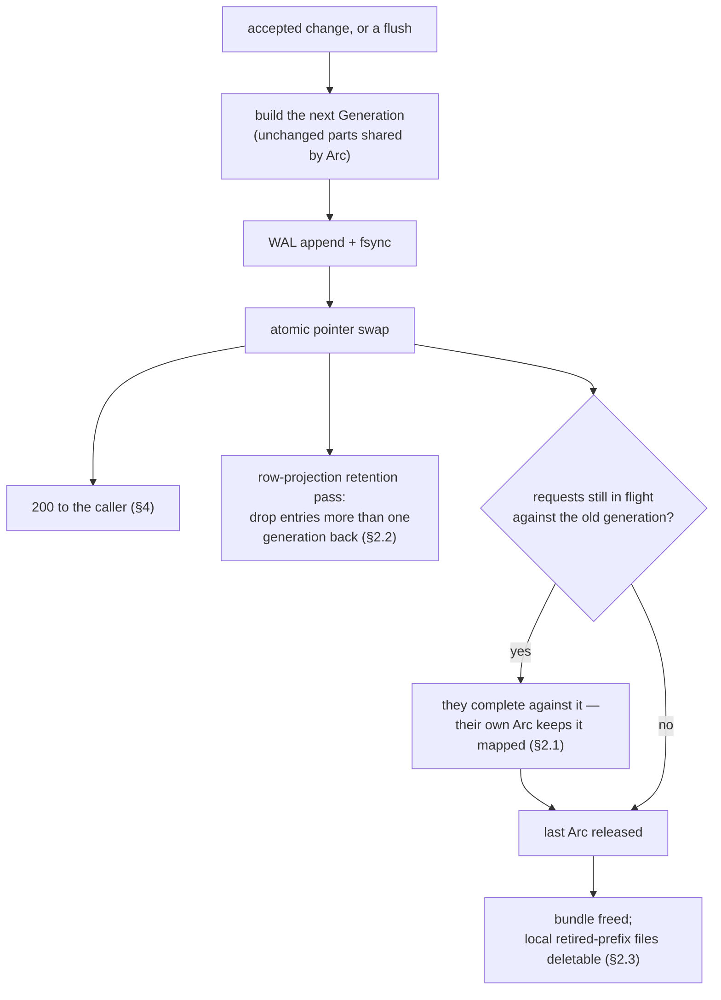

# Tessera — Concurrency and Lifecycle Design

**Status:** Draft r5 — audited against the built system; every claim about absent machinery is now marked at the claim (Appendix R)

**Owns:** the mechanism level of the lifecycle — thread and state ownership, the generation lifecycle, the fragment-stamp and deny-retirement ledgers, merge-versus-snapshot interaction, the WAL, caching, and the router/worker protocol. Everything here is engine-internal — none of it is contract (contracts §6) — but it is *invariant-bearing* internal, so it gets design-and-review treatment.

**The simplicity rule applied here:** one mutation discipline — **immutable artifacts, atomic pointer swaps, refcounted generations, and a single writer thread per partition** — with every surviving subtlety given a named ledger and an explicit rule.

**How to read the markers.** This document specifies a target; parts of it are not built. Wherever that is true it is marked **⊘** at the claim, with what happens instead. The three that matter most, because a reader could otherwise take them as assurances about a security property, are the deletion-retirement ledger (§3.2), the evaluate-entry fold (§3.4), and flush (§5.1).

`§n` alone refers to the architecture design; sections of this document are named "this document's §n" or given by number in context. `M_auth` is a viewer's authorised visible set as a Roaring bitmap; `I1`, `I9`, `I11`, `I13` are invariants from design §4.

---

## 1. The state model: generations

### 1.1 One mutable root per partition

All of a partition's serving state hangs off a single atomically-swappable pointer (arc-swap) to an immutable **Generation**:

```
Generation {
  prefix, segments_version: n, watermark: W,
  bundle: Arc<Bundle>,           // the loaded bundle: segments, permutation, postings, dictionary
  overlay_version: v,
  overlay: Arc<Overlay>,         // deny + evaluate entries (§3)
  buffer: Arc<IngestBuffer>,     // WAL-durable rows not yet in any segment (§5.1)
}
```

The specified shape carried a `segments: Arc<[SegmentRef]>` with per-file `Arc<Mmap>`s, and a `PostingsView` of base plus delta tiers plus tombstones.

> **⊘ Partially implemented.** A generation holds one `Arc<Bundle>`, not a segment list: there is one segment per partition, no delta tiers and no tombstone tier, because nothing yet writes them (§5.1–§5.3). The per-file `Arc<Mmap>` sharing that §2.1 relies on to let a file outlive either generation referencing it is provided by the shared `Arc<Bundle>` instead. Nothing in the ordering rules below depends on which of the two shapes is in place.

**The request ordering invariant (load-bearing, tested):** a request thread loads the generation pointer **exactly once, at request start, before acquiring any fragment or cache entry**, and works from that `Arc` throughout. Overlay resolution *happens-before* fragment acquisition. This ordering is what makes fragment eviction safe while a request still holds a fragment `Arc` — the request's own overlay still carries any deny the ledger has since retired — and an implementation that refreshes a fragment mid-request or fetches one before resolving the generation leaks in the eviction→retire window. It is an invariant, not folklore.

### 1.2 Two version axes, deliberately not one

`segments_version` moves with row-space and postings shape; `overlay_version` moves on every accepted change batch (security state). They match design §8.5's cache keys and are independent: a geometry publication never bumps `overlay_version`, and an accepted change never moves `segments_version` (§2.4). Every mutation builds a new Generation sharing unchanged parts by `Arc` and swaps the pointer; a change-only generation is two small allocations.

`segments_version` is specified to move on flush and compaction.

> **⊘ Specified, not implemented.** With neither built, `segments_version` is read from the manifest when a bundle is opened and then moves only across the geometry-publication seam that swaps in a newly built bundle (§1.3). It is never bumped by an overlay or buffer update — which is what makes it a correct cache key today, not a coincidence.

### 1.3 The single writer, minimally loaded

One **lifecycle thread** per partition owns all *mutation decisions*, but performs only cheap operations itself: command-queue drain, WAL append and fsync (group commit permitted), and pointer swaps. **All file and object IO — segment writes, digests, side-manifest and object-store publication, merge execution — runs on a background pool**, submitting a completed, immutable result back to the lifecycle thread for a swap-only publication step.

> **⊘ Partially implemented — and this is the document's central simplicity claim, so the gap is the property most at risk.** There are **two** publishers, not one. The write executor is the single writer for overlay and buffer state. Geometry publication swaps the pointer from *any* caller, and the executor's two overlay swaps are a `load_full` + `store` pair whose safety rests entirely on the WAL mutex serialising every publisher. An identity check on the geometry side narrows the window between the two; nothing in the engine closes it. A rewriter must not read "one lifecycle thread owns all mutation decisions" as a description of what is enforced. The residual race is recorded at the publication site and is a liveness-and-correctness obligation on whichever stage introduces a periodic publisher.

The command queue has a **priority lane for deny-disposition changes**, so a compaction publish or a stalled object-store PUT can never queue a suppression behind unbounded IO. Ingest work is bounded (`ingest_queue_bound`, full → 429); the deny lane is **unbounded and can never be refused for load**, and the loop drains it to empty before touching ingest work. The lane's guarantee is best read as **never starved beyond one window** (§5.1) rather than as a millisecond target. What it forbids is what it always forbade: a deny queued behind work of unbounded duration.

**The deny lane's two costs, measured.** Unboundedness is a real exposure in the other direction: a sustained deny flood starves ingest completely, and nothing bounds the lane's memory. And the latency framing that reads naturally from §4 — "deny visibility is bounded by fsync" — is wrong under load. Quiescent, a deny acks in ~3.2 ms and that *is* fsync. Under sustained ingest at 1 M buffered items a deny acks in **165 ms p50, 346 ms max**, and the wait is dominated not by fsync but by the `O(buffered)` buffer clone the in-flight ingest command is performing when the deny arrives. The deny's own apply is `O(overlay)` — 1.33 µs at that buffer depth. *(Measured; `docs/evidence/memos/2026-08-01-deny-ack-baseline.md`. The memo's bound under sustained ingest is 0.2–0.7 s; figures at 10 M buffered are modelled, not measured.)*

Publication-by-rebase resolves the merge-versus-flush race by construction: whatever completed work arrives, the lifecycle thread rebases it on the then-current generation, so concurrently flushed segments are carried forward automatically (§5).

## 2. Generations and retirement


*The generation lifecycle. The swap is the only publication event; everything downstream of it is refcounting.*

### 2.1 A superseded generation is retained by its readers and by nothing else

**There is no drain list, no pin manager, no TTL and no per-session cap.** All of it existed to answer a *later* request against an *earlier* generation, and `geometry-pinning.md` is the argument that nothing a client holds needs that: a tile is a Morton prefix resolvable against any generation's own sorted codes, and an item is a `tessera_id` invertible to an entity independently of geometry, so a re-issued request re-locates everything it needs. What it cost was ~94 GB of mapped files at depth 2 against a *measured* 47.02 GB bundle, ~2,000 lines across six crates, an error code, three config keys and a startup relation.

**What survives is I11's within-request rule, and it is free.** A request loads the generation pointer exactly once at its start (§1.1) and holds the `Arc` for its duration, so tile ranges, columns, row space and mask all come from one generation and every file it reads stays mapped by refcount. Mixing generations *within* a request is I11's "not stale-restrictive but simply wrong" — a `200` over unrelated rows — and one pointer load is the whole of the defence. A superseded generation is freed when the last request holding it completes; nothing observes that moment and nothing needs to.

**The one guard that remains is `check_publishable`**: a publication whose `segments_version` does not strictly increase is refused. Its justification changed with the pins and did not weaken — it used to be "outstanding pins would answer against new geometry", and it is now "the row-projection cache keys on `segments_version`, so a non-increasing version serves a projection built against one row space to a request answered from another". Same mixing hazard, reached from the cache rather than from a pin.

**`segments_version`, never the prefix, is the safe discriminator for a row-space artefact.** A merge is row-count preserving in that no *later* extent's `row_base` moves, but inside the merged span it is a linear merge-sort producing globally sorted output, so a row id there names a **different entity** afterwards. Anything keyed on the prefix would survive a merge and serve one entity's rows under another's mask.

### 2.2 What bounds retention now: a cache depth, not a clock

The thing a publication genuinely must manage is the **row-projection cache**, whose key carries `segments_version` — so every publication rotates every live session's key.

**Retention is one generation deep, and depth zero would be wrong.** A flush *extends* row space, so the superseded generation's projection is exactly the input the next request's patch derives from (§7.2): the new projection is the old bitmap unioned with the new extents' rows, which is equal to — not an approximation of — a projection over the whole space. Pruning at the swap would delete that input before anything could use it, and every session would pay a full `Permutation::project` — a *measured* 10.7 s at 10⁹ — at every tick, synchronised across the session population. So a publication drops entries **more than one generation back** and keeps the one immediately below it.

**Depth two and beyond buys nothing**: a projection two generations back is derivable from the one generation back, and is never consulted. It costs a *measured* 125.12 MB per session per entry at 10⁹.

**A restarted worker serves nothing pre-restart, and that is now trivially true** rather than a rule — there is no state to reconstruct. The two tempting repairs an earlier revision had to forbid (reloading old side-manifests to reconstruct `(n_old, W)`, or silently reinterpreting to current) have nothing left to repair.

### 2.3 Durable prefix retention

**Prefix retention is recorded durably — in the local cache, not the bundle.** When the last generation referencing a prefix is freed, `retired/<prefix>-<timestamp>` is written under the engine's local cache directory, and local copies of a non-current prefix are deletable only after it. The marker deliberately does not live in the bundle: the bundle layout is contract, `CURRENT` is its only mutable file, and node-local retention is a serving concern the contracts spec's out-of-contract list already covers. Deletion of retired prefixes from the *bundle* itself is operator or object-store lifecycle policy, out of scope here.

**The bound lost its clock and has not been given its replacement.** It used to be `marker + session-pin TTL`. With no TTL the condition is "no in-flight request holds it", which is an `Arc` strong count rather than a deadline — and **nothing can observe a strong count reaching zero**. `Arc::strong_count` is a sample, not an event, so the mechanism is a registry of `Weak` handles and something that polls it, which is a drain list wearing a different type. Roughly 100 of the deleted lines come back the day prefix deletion lands. That is scoped to prefixes (compactions) rather than to every flush, and it is recorded here so it is a known cost rather than a surprise.

> **⊘ Specified, not implemented.** There is no router, no `RETIRED` marker is written, and no local prefix copy is ever deleted. That is safe *only* while nothing deletes a file — the moment a stage adds prefix deletion, the marker and its `Weak` registry must land in the same change.

### 2.4 Geometry never fixes authorisation

A request uses one generation's `segments_version` for tiles, columns and permutation, and composes `M_auth` against **that same generation's** overlay — deny entries apply the moment they are accepted.

The composition is coherent because `M_auth` is computed entirely in entity space with the *fragment's* watermark defining the live set, so every entity falls in exactly one of `fragment \ L` or `direct_eval(L)`; projection through the permutation then drops row-absent entities via the sentinel — no gap, no double count.

The effective watermark in composition is always the fragment's own. Design §11.2's "a request pins its watermark alongside the segment-set version" and SA §6.4's "binds the triple to the fragment stamp at load" are to be read as the within-request rule and nothing more.

**The fragment itself is brought forward, and this is where a flush would otherwise fail silently.** A fragment is materialised once per session and frozen. A flush publishes a delta postings tier and advances the watermark, and composition treats entities *below* the watermark as fragment-resident — so an entity a flush moved out of the buffer and into a tier is in neither the session's frozen fragment nor the buffer, and is invisible to that session until it re-authorises. Not fail-open, but it is the property the flush exists to deliver, undone for exactly the sessions open when it happened. The request path therefore rebuilds the fragment at the live watermark when its own is behind, through the same cache (§7.2), keyed so every session sharing a credential shares one build. §11.2's incremental form — OR in the flushed segment's contribution for the already-satisfied terms — is what the rebuild is equal to, on the premises flush §3.4 sets out, and is **⊘ specified, not implemented**.

## 3. The overlay, fragment stamps, and the two retirement ledgers

### 3.1 Overlay entries, by disposition and cause

| Entry | Carries | Reflected in postings? | Retirement |
|---|---|---|---|
| **deny/deletion** | tombstone stamp *d* | yes — delta-tier tombstone at *d*; folded at compaction | ledger rule, §3.2 |
| **deny/suppression** | — | **never** — suppression does not touch postings | **only by unsuppress.** Non-retirable while active, by construction: no fragment rebuild ever excludes a suppressed entity, so its invisibility rests on the overlay entry for as long as the suppression stands |
| **evaluate** (predicate change) | current term set, inline (design §11.2) | **not until compaction folds it** — deltas cover newly flushed entities only, so a change to an existing entity's terms is invisible to postings in both directions | fold stamp rule, §3.4 |

**The three-way answer in the middle column is the structural cause of the three rules.** Yes / never / not-until-compaction are three different relationships between an overlay entry and the postings that would otherwise carry the same fact, and each admits a different safe moment to drop the entry. A reader who sees three rules and one mechanism will unify them.

The rejected alternative is a single rule: **r1 assigned every deny a retirement stamp; for suppressions that is fail-open** — any stamp eventually retires the entry and re-exposes the item. The counterexample is what makes the split non-negotiable.

Suppression count is a metric — a monotonically growing active-suppression set is a policy signal, not a leak — and `unsuppress` removes the entry and publishes a side-manifest immediately, as all deny-state changes do.

**The overlay entry is three independent fields, not one overwritable disposition.** `deleted`, `suppressed` and `evaluate_terms` are stored separately and each is cleared by nothing but its own opposite operation. This is what makes the sequence `delete → suppress → unsuppress` **structurally incapable** of re-exposing a deleted item, rather than merely tested against it: the unsuppress clears the suppression bit and cannot reach the deletion bit. Collapsing the three into one enum with last-write-wins semantics was caught fail-open in review twice.

The precedence over the three fields is `deleted > suppressed > evaluate_terms`, single-sourced in one function. Two transcriptions of a precedence rule is how a suppression stops suppressing.

```mermaid
flowchart TD
  subgraph deletion["deny / deletion — ⊘ ledger not built"]
    D0["Delete accepted"] --> D1["postings: tombstone at d,<br/>folded at compaction"]
    D1 --> D2["retires when no servable<br/>fragment stamp predates d"]
  end
  subgraph suppression["deny / suppression — built"]
    S0["Suppress accepted"] --> S1["postings: never touched"]
    S1 --> S2["retires only on Unsuppress"]
  end
  subgraph evaluate["evaluate / predicate change — ⊘ fold not built"]
    E0["Predicate accepted"] --> E1["postings: not until<br/>compaction folds it"]
    E1 --> E2["retires at fold stamp f,<br/>under the same floor as d"]
  end
```


*The three retirement rules and the postings relationship each one follows from. Only the middle lane exists in code; the other two currently never retire at all.*

### 3.2 The deletion-retirement ledger

A deletion's deny entry (tombstone stamp *d*) may leave the overlay only when **no servable fragment stamp predates *d***:

- **Scope: all of this is per partition, per worker, in memory.** Stamps are per-partition segments-versions, denies live in their partition's overlay, and fragments never leave their worker — so the stamp counts and the floor are worker-local structures, and losing them on restart is safe by construction: the cache restarts cold and §3.3 forces every rebuild from current postings.
- The fragment cache maintains `stamp_counts: BTreeMap<postings_stamp, usize>`; `min_live_stamp()` is its first key (+∞ when empty).
- The cache additionally tracks `retirement_floor` = **the highest stamp of *any* retired overlay entry — a deletion's tombstone stamp *d* or an evaluate entry's fold stamp *f* alike** — and **refuses insertion of any fragment with stamp < retirement_floor**. Without this, a slow request could rebuild an old-stamp fragment *after* the entries predating it were retired and resurrect a deleted item or a revoked term. The floor is deliberately defined over both retirement kinds: **a floor raised only on deletion retirements passes the deletion test and still fails open through a pre-fold fragment.** That is the only sentence explaining why deletion and evaluate share a floor while suppression touches neither. Refusal is cheap: the builder retries against current postings (§3.3).
- The lifecycle thread retires the retirable-entry prefix below `min_live_stamp()` after evictions and periodically.
- Compaction may force-refresh all fragments to advance the floor; overlay size is the pressure gauge.

> **⊘ Specified, not implemented — none of this ledger exists.** There is no `retirement_floor`, no `stamp_counts`, no `min_live_stamp` and no tombstone stamp anywhere in the engine. A deletion sets a terminal `deleted` flag that nothing clears. **What happens instead: deletion denies never retire, and the overlay grows monotonically under deletion.** That is safe — fail-closed, since an entry that never retires can never stop denying — but it is not the mechanism above, and it is safe *only* because nothing retires. The retirement floor is the guard the review record calls "the one that could have reintroduced a fail-open path": **when the stamp ledger lands, the floor must land in the same change.** A ledger without a floor is the fail-open, not a smaller version of the feature.

An overlay soft limit exists as the pressure gauge this section describes, and it alarms on overlay depth. **It does not act — there is no fold to schedule.**

### 3.3 Fragment builds always read current postings

Fragments are built by request threads on miss (single-flight per key, §7.2) **from the current generation's postings view** — consistent with §2.4: geometry identity does not fix authorisation state, and a fragment is authorisation state. Together with the insertion floor in §3.2 this closes the stamp-regression path.

This half *is* built: a fragment is always constructed against the live bundle's postings. Only the floor that backstops it (§3.2) is absent.

### 3.4 Evaluate entries retire at the fold

A predicate change is invisible to postings until **compaction folds it**: compaction rewrites affected entities' postings from the term sets carried in their evaluate entries. After the fold, the entry carries its fold stamp *f* and retires under §3.2's rule — with *f* participating in the retirement floor exactly as a deletion's *d* does.

The reason the same machinery must govern it is that **a fragment predating the fold misreads the entity in both directions: a revoked term still present is fail-open; a granted term absent is wrong counts.** Before any fold, evaluate entries are immortal, which is why overlay growth under predicate churn schedules compaction, not just fragment refresh.

> **⊘ Specified, not implemented.** Compaction does not exist (§5.3), so there is no fold and no fold stamp. **What happens instead: evaluate entries are permanently immortal, and the composition consults the overlay entry on every request.** Fail-closed and correct in both directions today — the overlay entry, not the postings, is the answer — at the cost of an overlay that only grows. The bidirectional misread above is the reason this cannot be retrofitted as "retire evaluate entries when they look stale": staleness in the second direction is a counting error, not a refusal, and produces no symptom that fails safe.

## 4. The WAL

Per partition, single appender, append-only records (postcard, length-prefixed, CRC per record). Three record types: `IngestBatch{batch_id, body_hash, rows}` carrying every row with its allocated entity ID, `Change{external_id, op, descriptors}`, and `Lease{lo, hi}`.

A `Flush{n, wal_pos}` record is specified as the recovery start point.

> **⊘ Specified, not implemented.** There is no flush (§5.1) and therefore no `Flush` record and no checkpoint of any kind. **Recovery replays the whole log, every time.** Correct, and unbounded in time: replay cost grows with total accepted writes rather than with writes since the last checkpoint. The stage that builds flush owns the record and the truncation policy that goes with it.

**Ack ordering, stated fully: WAL fsync → overlay/generation swap → 200.** The swap is nanoseconds and sits *before* the ack so a caller's own next request always observes its accepted change; the crash window "after fsync, before swap" recovers by replay and was never acked — harmless.

**The ack contract is enforced by type, not by convention.** A successful receipt cannot be constructed without a `&Published` token, and a `Published` is mintable only by the function that performs the generation swap (or, on the idempotent-replay path, by proof that the effect is already in force). A failure receipt cannot carry a success payload at all. The type is not the whole guarantee — the minting functions are callable from anywhere in the write path — but it makes ack-before-swap something a writer has to work around rather than something a writer can reach by reordering two lines.

**Recovery reads the log's durable prefix and nothing else.** The prefix ends at the last fsync point; everything past it is discarded and the log is truncated there. **Position decides, not damage**: a record past the fsync point is dropped whether or not it frames and checksums perfectly, because the acknowledgement path fsyncs first, so nothing out there was ever acked. Replaying such a record would make an effect durable *after* its caller was told it was not — the mirror of acking one that is not durable, and harmful in the same way: refused ingest reappears, and a client that did as its error told it and retried under a fresh batch identifier ends up holding two copies.

Below the fsync point the answer inverts. A framing or CRC failure there is corruption of *acked* state — including possibly denies — and recovery **fails closed**: the worker stays unready and the operator restores from bundle + object store. **Truncate-at-first-bad-CRC applied mid-log would silently drop acked denies**; the position rule is the difference between crash recovery and data loss. A record that *straddles* the boundary means the sidecar names an offset that is not a record boundary, so the two disagree about what was made durable — a statement about acked bytes, and it fails closed like any other.

The last-synced offset is held in an 8-byte sidecar, and the rule needs three guards that follow from the sidecar rather than from the CRC:

- **A WAL shorter than the sidecar's sync offset must fail closed.** A clean end of log is only an ackable state if the replay position actually reached the last-fsynced offset. A log that is simply *shorter* than what the sidecar claims was durable is exactly as dangerous as a corrupt record before that offset, and refuses to open the same way.
- **A missing or malformed sidecar defaults to "everything present is acked"** — the whole file length. Defaulting the other way would make corruption anywhere in a non-empty WAL look like an untouched tail and truncate it silently.
- **A log is created with a sidecar**, naming the header-only offset. The default above is right for a sidecar that was *lost* and wrong for one that never existed: without this, a log created, appended to and then denied its first fsync would have every refused record read back as acked.

Truncation is itself fsynced before the handle is returned, so a second crash cannot resurrect the tail just dropped; if the truncation fails, the open fails, and a handle that cannot say where its log ends is never issued.

**Disk-full vs never-429:** the ingest 429 threshold is set strictly below the WAL's hard bound, reserving headroom so change records always have room. If a write genuinely fails and cannot be repaired, the deny is applied to the in-memory overlay and swapped (visible immediately), the response is **500 with an alarm** — durability is owed and the caller must retry (contracts §3.1) — **never a 200 without fsync, never a silent drop, and never a refusal that leaves the item visible.** The third is what a naive fail-closed implementation breaks: refusing the operation outright is the reflex, and it leaves the item exactly as visible as before.

**A failed sync is repaired before it is a failure, and an append failure cannot be.** The two are different events. `append` writes with `write_all`, which may complete partially, so after a failure the log's length no longer names a record boundary and nothing can be built on it. A failed sync writes nothing: the length is exact, and the undurable region is exactly the records appended since the last successful sync. The deny lane therefore re-attempts durability for that region — bounded, and before it treats the window as failed — so a device that stumbles for a moment does not cost an accepted suppression its restart.

**The repair re-writes the records; it does not merely sync again.** On Linux a writeback error may be reported exactly once, the kernel marking the failed page clean as it does so, which makes a bare second `fsync` capable of returning success with the data gone. So the repair rewinds to the last durable offset and writes the region again, re-dirtying the pages that may have been dropped. Rewinding rather than appending a second copy is what keeps it a repair: the region being overwritten is, by construction, the region no caller was ever told about. Appending instead would also be *sound* — a disposition is idempotent, so replaying one twice folds to the same overlay — but it would leave the possibly-lost first copy inside the durable prefix, where a hole reads as corruption and refuses the whole log at open.

**The repair is deny-only, and the asymmetry is the reason.** An ingest window whose durability fails applies nothing: no effect exists, the caller is told so, and a restart agrees with the caller. Nothing diverges, so there is nothing to rescue. A deny window's failure applies its deletions and suppressions anyway, which is the one place in the write path where reaching durability late changes what the system *is* rather than only what it says.

**When the repair is exhausted, the apply-anyway rule buys the live node and not the restart.** An under-durable deny hides its item for as long as this process lives — the whole interval a live node can be asked about, and it stops claiming readiness for the rest of it — but its record lies past the fsync point, so a restart discards it with the rest of the undurable tail and the item is visible again. That is what "durability is owed and the caller must retry" means, and it is what the append-failure case has always done: a `suppress` whose append failed leaves no bytes to replay at all. The two adjacent failure points agree, which is what makes the answer statable at all; a hiding that outlived a restart only when the failure landed on the fsync rather than the append would be a property no operator could reason about. **Side-manifest publication is gated on WAL durability**: the 500 path publishes nothing durable, so a replica can never observe a suppression that a subsequent crash-replay would silently remove.

**`ExecutorPosture` is this rule's operator-visible face.** The write executor publishes a four-state readiness signal — `NotStarted`, `Running`, `WalPoisoned`, `Dead` — which `/readyz` reduces to ready-if-`Running`. `WalPoisoned` is the interesting one, and it encodes a deliberate choice between two fail-closed answers: **the executor stays alive and goes on applying denies** while the WAL refuses every further operation. Exiting instead would also be fail-closed, and would be the worse of the two, because it would stop denies being applied at the moment durability is already lost. `/readyz` returns bare status with no body — the readiness of a node is not a place to leak state.

**The posture is composed from two components with opposite temporal shapes, not latched as one value.** The thread's own state is monotone: `NotStarted` → `Running` → `Dead`, never lowered, with `Dead` absorbing and written by a guard on the executor's own stack, so a panicked executor can never report itself running. The WAL's state is mirrored live in *both* directions, because a WAL that has discarded its undurable region is genuinely healthy and a signal that could not say so would report a fault that no longer exists. `Dead` wins over `WalPoisoned` where they meet: a thread that is gone cannot apply a write whatever the log says. Folding both into one monotone value is the obvious construction and it is wrong — it made a recoverable condition permanent, and left the mirroring code's own justification (*mirror the WAL rather than remember an error*) describing something it did not do.

**A node that loses durability recovers without a restart, by discarding rather than by finishing.** Every cause is at least as often transient as terminal — a filesystem that filled and was relieved, a device that stumbled — and latching the node unready for the life of the process over any of them is an outage the storage did not cause. Denies were never blocked by the posture in any case; routing was. So while the WAL is degraded the executor periodically discards everything above the last durable offset and returns to service.

The direction is the whole of it. By then every caller of that region has been told its write is not durable, so **making those bytes durable afterwards is fail-open in both lanes**: a refused ingest reappears, and a deny window's `unsuppress` — appended like every other entry but deliberately not applied in memory — takes effect at the next replay, undoing a suppression whose operator was told it still stood. Discarding is instead *exactly what a restart would do with the same file*, which is the strongest safety argument available for an in-process recovery: the resulting state is one some restart could have produced. It needs no records retained, and it covers both halves of a sync failure — the bytes go whether or not they reached the device. A **torn** append recovers by neither route and holds the posture until the process restarts.

Recovery is counted and the count is the thing to alarm on. Readiness returning is right for routing and wrong for diagnosis; a node that recovers repeatedly has a disk failing slowly, and every deny answered 500 in between is one whose caller owes a retry (contracts §3.1).

## 5. Flush, merge, compaction

### 5.1 Flush and group-commit allocation

Flush is specified as: lifecycle thread decides; the pool executes: tiler → segment files under temp names → rename → delta files → side-manifest write; the lifecycle thread then swaps. A crash before the manifest write leaves orphans no reader references; replay re-flushes deterministically.

**Flush is what makes ingested items visible at all, not merely what bounds segment count.** A buffered item has no row in any segment, and every viewer verb asks a row-space question, so the composition resolves its verdict and has nowhere to put it. Whoever implements this section is implementing ingest visibility; the flush policy's size-or-age knobs are therefore a *visibility-latency* control as much as a segment-count one, and `flush_max_age_secs` in particular is the bound on how stale an acknowledged item's absence may be.

> **⊘ Specified, not implemented, and this marker needs reading carefully — the sentence above is misleading in the fail-*closed* direction, which is why it survives so easily.** There is no flush. An acknowledged ingested item is WAL-durable and it *does* participate in authorisation state — the composition's fourth rule resolves a verdict for every buffered entity at or past the fragment's watermark — but it has no row anywhere, so that branch always takes the no-row path and the item contributes to nothing a viewer can observe. **The specified sentence is therefore true of the current system too; what is absent is the mechanism that would end the condition.** Ingest visibility latency is not bounded by a knob at all: a buffered item becomes visible only when the next offline `tessera build` folds it into a bundle. `flush_max_items` and `flush_max_age_secs` parse and validate, and a test asserts they are **inert** — nothing reads them. A phase that ships the buffer without the flush has built durability, not queryable ingest.

**Group-commit allocation.** Design §11.1 spends the entity-ID ordering on posting compression, and the sort's scope is whatever set of items is allocated together. Contracts §3.4 acknowledges `/control/ingest` with a per-row `tessera_id`, a bijection of the entity ID, so allocation must **precede the acknowledgement** — but design §3's write-latency budget permits the acknowledgement itself to wait seconds. That is the whole latitude needed, and §1.3 already permits the mechanism that uses it.

So: hold arriving requests open in a commit window bounded by size or age; at close, signature-sort **the whole window**, allocate from the high-water, append and fsync once, swap, then acknowledge every held request with its rows' IDs.

- **The effective sort scope becomes the commit window**, across every request in it, regardless of how the client chose to chunk its upload — which closes at the server the failure mode design §11.1 warns about, rather than delegating it to a client convention.
- **Nothing about the ordering rules moves.** §4's ack ordering (fsync → swap → 200) holds per window instead of per request, so a caller still observes its own accepted change on its next request, and the crash window "after fsync, before swap" still recovers by replay having never been acknowledged.
- **I9 is untouched** — IDs are issued monotonically from the high-water exactly as before; the window changes only *how many* are assigned in one sorted run. A window that cannot allocate has no effect at all: the high-water mark does not move.
- **Nothing crosses the boundary.** The caller receives the same per-row `tessera_id` in the same 200, later.
- **Replay is unaffected**: WAL rows carry their allocated IDs (§4), so replay reuses them and never re-derives placement.

This is built. Three things about it are not what a reader of design §11.1 would expect, and all three are properties of the mechanism rather than of its implementation.

**The win is one to two orders of magnitude smaller than the headline, and the shortfall is structural.** The probes' 8.9–36.7× posting compression was measured under a *full-corpus* signature sort. `run ≈ B × p` — window size times term density — is an **upper bound, not a forecast**: allocation sorts on an item's whole deduplicated term list, its **signature**, so a term's IDs are contiguous only across items whose *entire* signature matches. `B × p` is attained only where the term effectively *is* the signature, i.e. one term per item. Against the measured corpus — 54,791 distinct signatures over 2.42 M items, mean group 44, the rank-1,000 group at 158 items — a 10,000-row window holds ≈ 17 rows of the rank-100 group and ≈ 0.65 of the rank-1,000 one. **Runs of order 10¹, not ~200.** Raising the bound buys run length sub-linearly (the groups it reaches are smaller) while sort work grows `n log n`; it is not a free dial. *(Modelled from measured probe distributions; the per-window measurement has not been run.)*

**And the half it cannot reach at all.** Design §11.1's container model gives a term of density *p* at sort scope *B* a benefit of `max(1, 2¹⁶/(p·B))`, which is 1 — no benefit — whenever `p·B < 2¹⁶`. That holds for every `p ≤ 1` once `B ≲ 6·10⁴`, and every window size this deployment's heap budget permits is below it. **A commit window collects the posting-storage win and none of the container-count win** — and container count is what a union costs, since bitmap operations cost O(containers touched), not O(cardinality). Nothing about the container argument is wrong; it is simply not what this lever reaches.

**Idempotency across a held window is built.** A window introduces a third state between contracts §3.4's *accepted* and *unknown*: **held but not yet acknowledged**, which a client retry can land in. Both of the executor's admission checks — the idempotency index and the live external-id map — read state written at *apply*, so a window one entry wide re-opens the separation between a check and its apply: a retry under a **fresh** batch ID would pass the duplicate check twice, take two entity IDs for one external ID, and leave a visible byte-identical copy of a suppressed document that no external ID names, so no deny could ever reach it. The window therefore refuses to admit a submission naming a batch ID or an external ID it already holds, and the executor closes the window and re-evaluates against live state — which gives exactly the unwindowed answers (byte-identical replay → the recorded IDs; different bytes → 409; colliding external ID → 409) and introduces no failure semantics only a window can reach.

**Deny dispositions may share the window** — the write budget covers them, and a bounded configured delay is not the fail-open the deny rules exist to prevent. Two rules keep it that way and neither is negotiable. **The acknowledgement stays coupled to the application** — a deny's 200 is held until its entry is fsync'd and swapped, so nothing is ever acknowledged that is not yet in force; §4's "never a 200 without fsync" survives verbatim, and the priority lane's guarantee changes from *fast* to *never starved beyond one window*, which is what it should be measured on. And **changes are still never load-shed**: batching a security operation for latency is acceptable, refusing one for load is not, and those are different things.

> **⊘ Specified, not implemented — deliberately, and the refusal carries a reason.** The commit window holds ingest submissions only. Denies keep their own lane, drained to empty before each window is filled, so a deny still waits at most one window. Mixing the two requires a partial-failure split first: **a failed mixed window applies its denies and drops its ingest** — two dispositions, one swap — and there is no way to acknowledge that honestly without it. The window's entry type is deliberately not an enum yet: an unconstructed second variant would assert in the type that denies are windowed when they are not.

### 5.2 Merge

Tiered policy (design §11.3 parameters), Morton re-rank decorator above 2¹⁸ rows and on forced merges. Selection on the lifecycle thread; execution on the pool over immutable inputs; publication rebases. Abandonment check at publication: all input segments still present in the current generation — ABA-safe because **`seg_id`s are never reused**, across compactions or prefixes.

> **⊘ Specified, not implemented.** No merge exists, and there is nothing to merge: one segment per partition, no delta tiers. The `seg_id` non-reuse rule is a contract obligation on the build (contracts §2.1) and holds independently of this section.

### 5.3 Compaction, with the full carry-forward rule

Compaction snapshots a generation, emits the partition-slice's single segment, folds **snapshot-covered** posting deltas, tombstones and evaluate entries into base postings, rewrites the permutation, and publishes a new prefix.

**Carried forward verbatim, not folded:** segments and deltas flushed after the snapshot, **tombstones accepted after the snapshot** — folding away a post-snapshot tombstone while the entity survives in the folded base is fail-open — the active suppression set, and all unfolded overlay entries. The new prefix's first side-manifest lists all of it; `n` continues; old prefix retention per §2.2.

> **⊘ Specified, not implemented.** No compaction exists. Its absence is what makes §3.2's and §3.4's retirement rules unreachable, and what makes the overlay grow without bound under deletion and predicate churn. The carry-forward rule is the first thing to get right when it is built: three of the four carried categories were added after the rule as originally written proved fail-open on each.

## 6. The router/worker protocol

Internal, versioned by the binary; postcard frames over unix socketpairs; per-request deadlines; heartbeats. Messages: `Hello/Ready`, `BuildFragment`, `Query`, `Changes/IngestRows`, `Publish`, `Heartbeat`.

**`Hello` carries the worker's allocation high-water, and the worker's WAL always wins.** On (re)connect the router advances its allocator journal to max(journal, every reported high-water) before granting any lease. This arbitrates divergent replay — a router journal restored from an older backup would otherwise re-grant ranges workers already consumed, an I9 violation with I5-scale blast radius. The worker's WAL is authoritative because it records IDs actually written.

Failure semantics: worker timeout fails the request (**I13c**, outage asymmetry — an unreachable-by-failure partition makes the answer unknown, never empty); respawn with backoff, rebuild from bundle + WAL, fragment cache cold and rebuilt on demand; nothing pre-restart is retained and nothing needs to be (§2.2); router exit kills workers via the supervision-pipe watchdog.

> **⊘ Specified, not implemented — none of this section exists.** The system is a single process serving a single partition. There is no router, no worker, no socketpair, no `Hello`, no `BuildFragment`, no heartbeat and no lease arbitration; nothing spawns anything. **What holds instead:** the write executor is in-process, the allocator's high-water lives in the one WAL that writes it, and the arbitration problem the `Hello` rule solves cannot arise because there is exactly one journal. The rule is nonetheless the constraint the multi-process stage inherits — a router journal is never authoritative over a worker's WAL — and I13's partition half has no implementation and no test, so a reader must not take a partition-related `I13` annotation in the code as covering it.

## 7. Threading, caching, and fault injection

### 7.1 Threading

tokio for HTTP and sockets; one lifecycle thread per partition (the single writer, minimally loaded per §1.3 — with that section's marker); rayon for CPU-heavy request work (unions, gathers, selection); the engine's public API is sync and owns no executor (embeddability, SA §1).

### 7.2 Single-flight caching, and the client-visible outcome it produces

Caches are concurrent maps of immutable entries, keyed by design §8.5's keys verbatim; **invalidation is key rotation, never mutation**, and nothing here ever modifies a cached value. What the cache adds beyond that is capacity management and single-flight build, and both have consequences a one-clause description hides.

**Waiters do not block, and this is visible to clients.** A miss makes the arriving caller the builder: it publishes a `Building` slot, releases the map lock, runs the build with no lock held, then re-acquires to publish. A *concurrent* arrival on a key already building **does not wait** — it is handed `Building` back immediately, which the engine turns into a projection-building error and the server into a **429**. A parked waiter would hold the server's global admission budget while consuming zero CPU, so a queue of waiters would starve runnable work exactly under the load that makes it worst. The refusal rate is bounded by *same-key* concurrency; a working set that does not fit produces rebuilds, never refusals.

The motivation is measured, not aesthetic. The original row-projection cache ran the entity-space-to-row-space crossing — seconds at 10⁹ rows — **inside** the map lock on a miss, so every distinct session's first viewport serialised behind one global mutex. The signature at c=1000: throughput halves, server CPU *drops*, p99 reaches 1.04 s. Threads blocked on a lock, not doing work.

**Eviction is not invalidation.** It removes a still-correct entry to stay under a byte bound; the miss path rebuilds from the same inputs the key names, so a removal can never widen a mask. Four rules make it safe:

1. **A `Building` slot is never evicted, weighs nothing, and is absent from the recency index.** Evicting one frees nothing — the value is on the builder's stack — and loses the single-flight property. Breaking it was not a bookkeeping error but a **livelock**: the eviction loop selected a victim without removing its index entry, so a victim whose slot was not ready was re-selected for ever, **spinning with the request-path mutex held**. The bijection check that would have caught it is debug-only, so in a `--release` build the test named for exactly this *hangs* rather than fails. The loop now pops the index entry unconditionally, making termination a property of the loop rather than of the rule.
2. **A build publishes only into its own slot**, identified by a sequence number rather than by state. Without it, a prune landing mid-build is silently undone by the publish that follows, and — the sharper failure — a build that unwinds after a prune-and-reinsert deletes a *different* builder's slot.
3. **The building caller always receives what it built**, retained or not. This is what makes forward progress structural: a bound below the working set costs rebuilds, never a refusal.
4. **Evicted values are collected under the lock and dropped after it is released.** Dropping a ~125 MB bitmap frees ~15 k containers; doing that inside a lock whose O(1) hold time is load-bearing convoys every admitted request. Every removal path returns the value rather than dropping it, and the removal function is `#[must_use]` so the natural lapse is a compile error.

**What the byte bound bounds.** It bounds bytes resident *in the map*, not process memory: every in-flight caller holds its value for the duration of its request whether or not the map still contains it, so the peak is `bound + admission_width × per_entry`. A per-entry floor turns the byte bound into an entry ceiling as well — without it, a caller can insert unbounded near-empty entries that never trip a byte bound while each costs hundreds of bytes, the same session-rotation bypass every per-session bound in this design has: authorisation mints a fresh token per call against an already-cached fragment, so rotation is free.

**The duplication is deliberate and must not be removed.** A near-identical single-flight cache exists in the authorisation layer, which sits *below* the engine in the crate graph; `scripts/check-layers.sh` enforces that direction, so reuse is forbidden, and the two use sites need different signatures anyway (one build is fallible). The consequence to respect: **every rule above can be right in one crate and wrong in the other, and a test written once covers only the crate it lives in.** Both modules carry a table naming, per rule, the test in each crate, so a missing twin shows up by reading. This is exactly the shape a reviewer deletes as redundancy.

### 7.3 Fault injection

Four properties of §4 occur only when durability *fails*: a suppression applied despite a disk-full append, a poisoned WAL tripping the not-ready posture, an ack that must not precede its swap, a deny that must not queue behind work. None is reachable by a test that can only ask the executor to succeed. The write path therefore carries a fault switchboard — WAL append and fsync failures, and two pause sites — behind a feature enabled only through a self dev-dependency, so nothing `cargo build` produces can carry it.

**The fidelity rule: an injected failure must be indistinguishable from a real one, in variant and in order.** A real WAL returns an IO error on the failing call and a poisoned error on every call after it, so an injected failure does the same. Returning "poisoned" on the *first* call would diverge on precisely the error that the 500 mapping, the operator alarm and the deny-apply-anyway branch all switch on — the one call whose variant matters most. The real sequence is pinned independently by a test that provokes a genuine IO error; if the two ever disagree, everything depending on injection is measuring the harness.

Two pause sites, not one, because one cannot discriminate the ordering it exists to protect. *After-fsync* proves nothing about the relative order of swap and ack — both are still ahead of the parked thread. *Before-ack* is armed **inside** the ack function rather than at its call site, so it travels with the ack: a build that acks before it swaps parks there with the swap still ahead of it and fails on engine state alone. There is deliberately no "abort" action: a panic unwinds and runs the drop guards, which a `SIGKILL` does not, so a harness offering it would let a worker model a clean shutdown and call it a crash.

**This pre-empts the conformance design's pause points by three stages, with different vocabulary and a different home** (conformance §5, which specifies eight differently-named pause points behind a `conformance` cargo feature). They are the same mechanism. Whichever stage builds the conformance harness must extend this one rather than build a second beside it.

## 8. Crash matrix

| Crash point | Recovery | At risk |
|---|---|---|
| Before ingest/change ack | caller retries; idempotent | none |
| After fsync, before swap | replay rebuilds; un-acked | none |
| After ack (fsync + swap done) | replay rebuilds identically | none |
| Mid-flush (files, no manifest) ⊘ | orphans unreferenced; replay re-flushes | none |
| Mid-merge / mid-compaction (no flip) ⊘ | outputs orphaned / old prefix authoritative | none |
| Worker crash ⊘ | respawn; bundle + WAL | nothing — no cross-request geometry is retained |
| Router crash ⊘ | watchdog kills workers; supervisor restarts; allocator re-arbitrated from worker high-waters (§6) | sessions (by design) |
| Durability failure (append or fsync), then restart | undurable tail truncated; nothing acked is lost | an under-durable deny's hiding, which no ack claimed |
| Mid-log WAL corruption (below fsync point) | **fail closed**; restore from bundle + object store | availability, never denies |

> **⊘ Specified, not implemented — the four marked rows describe machinery that does not exist.** There is no flush, merge or compaction to crash during, and no router or worker to crash. The rows are the obligations those stages inherit, not a description of tested behaviour. The five unmarked rows are the whole of the current crash surface, and process death today is replay of the entire log under the positional CRC rule.

**The row that must never exist: any path that loses or re-exposes an acked deny.** §4's ordering, §3.1's suppression rule, §3.2's insertion floor and §5.3's tombstone carry-forward each close one such path. Of those four, one is built.

## 9. Decisions

1. **Single lifecycle writer, minimally loaded**: decisions and swaps on the thread, all IO on the pool, deny priority lane. *Two publishers exist in the built system — §1.3.*
2. **Generations immutable and Arc-shared; drain-list reclaim is remove → verify → reclaim.** A drain entry is slimmed geometry, never an `Arc<Generation>` — §2.1.
3. **Geometry identity never fixes authorisation.** The effective watermark in composition is the fragment's own, and a request composes against the same generation's overlay whatever stamp it presented.
4. **Two version axes** matching design §8.5.
5. **Three retirement rules, not one**: deletion denies by the stamp ledger with an insertion floor; suppressions only by unsuppress; evaluate entries at their compaction fold. A single rule is fail-open for two of the three. *One of the three is built — §3.*
6. **Fragments build from current postings only**, with the cache refusing stamps below the retirement floor. *The build rule is built; the floor is not — §3.2, §3.3.*
7. **Protocol postcard over socketpairs; worker WAL wins lease arbitration.** *Unbuilt — §6.*
8. **Single-flight waiters do not block**; a concurrent arrival on a building key is refused with a 429 rather than parked. A caching decision with a client-visible outcome — §7.2.
9. **The ack contract is carried by a type**, not by call ordering: a success receipt requires proof that the generation carrying its effect is live — §4.
10. **Injected failures are indistinguishable from real ones in variant and order**, and the conformance harness extends this mechanism rather than adding a second — §7.3.

## Appendix R — Review record

r1 was reviewed independently (verdict: needs-rework — the generation/single-writer/ledger architecture survives; four fail-open paths in the retirement rules did not). r2 closed all fifteen findings; r3 generalised the retirement floor over both retirement kinds, scoped the ledger structures worker-locally, gated side-manifest publication on WAL durability, and gave the `RETIRED` marker a writer and a home. r4 named flush as the ingest-visibility mechanism and added group-commit allocation, superseding an arena-based sketch that bought the same sort scope by leasing a range and abandoning unfilled positions — group commit needs no ID slack, sizes itself after the window's signature mix is known rather than guessing at lease time, and does not make the maximum ID *written* understate the range *consumed*.

**r5** is the audit pass against the built system. No rule changed and no argument was withdrawn; what changed is that every claim about absent machinery now says so at the claim.

Marked **⊘** in this revision: the `Generation` shape (§1.1); `segments_version`'s movement (§1.2); the single-writer claim (§1.3, partial — two publishers); the `RETIRED` marker (§2.2); the deletion-retirement ledger and its floor (§3.2); the evaluate-entry fold (§3.4); the `Flush` WAL record (§4); flush (§5.1); denies sharing the commit window (§5.1); merge (§5.2); compaction (§5.3); the router/worker protocol in its entirety (§6); four rows of the crash matrix (§8).

Corrected in this revision, against the built system:

1. **§2.1's "a pin is an `Arc<Generation>`"** described the fail-open the code refuses. A drain entry is slimmed geometry precisely because holding a generation would retain the superseded overlay and buffer — the R-open failure. The document's own sentence was the bug.
2. **§5.1's flush sentence** is true of the current system as well as the end state, and its marker says so explicitly: it misleads in the fail-*closed* direction, which is why it survived unchallenged.
3. **§1.3's latency framing** ("bounded by fsync") is corrected by measurement: under sustained ingest a deny acks in 165 ms p50 at 1 M buffered, dominated by an `O(buffered)` clone, not by fsync. The lane's unboundedness in memory, and ingest starvation under a deny flood, are stated.

Added in this revision, from mechanisms the corpus did not describe: single-flight caching's non-blocking waiters, its 429, its four eviction rules and its deliberate cross-crate duplication (§7.2); fault injection and its fidelity rule, with the note that it pre-empts conformance §5 (§7.3); `ExecutorPosture` (§4); the WAL's type-enforced ack contract and the two positional-CRC guards (§4); the commit window's honest calibration, its closed idempotency item, and its refusal to carry denies (§5.1); the overlay's three-field representation as the structural reason `delete → suppress → unsuppress` cannot re-expose (§3.1).

**Actions raised against companions, all applied**: compaction's fold obligation extends to evaluate entries and the carry-forward rule to post-snapshot tombstones and the suppression set (SA §6.6); the effective watermark in I1 composition is always the fragment's own (design §11.2, §2.6, I11; SA §6.4; contracts §2.3); `seg_id`s never reused (contracts §2.1); five lifecycle conformance tests raised against the plan — suppression persistence; the eviction→retire→cold-miss rebuild excluding deleted items; its fold variant; post-snapshot tombstone survival; positional CRC fail-closed. **Four of those five test the machinery §3.2, §3.4 and §5.3 mark as unbuilt**; conformance's own audit (conformance r4 §F) records which are written.
