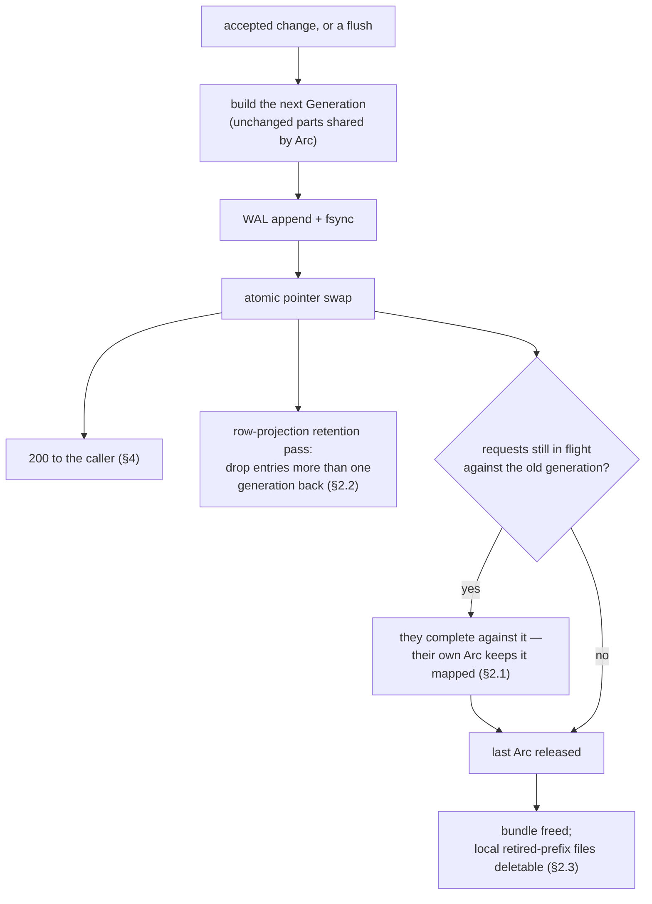

# Tessera — Concurrency and Lifecycle Design

**Status:** Draft r11 — decision 0071 applied to §7.3: the fault switchboard gains the three publication-seam pause sites and the faults build's arming surface, and its gate narrows from "nothing `cargo build` produces can carry it" to "no default-features build carries it", asserted both ways by `check-layers.sh` rule 2. r10 stands otherwise — a correction, not a design change: the compaction fold is **built**, so both removal rules are in force and §3.2's "nothing else retires at all" is withdrawn. No mechanism changes. r9 stands otherwise — decisions 0058 and 0059: §7.2's single-flight waiters block, bounded and cancellable, and the 429 it used to produce on every race is now the answer at the end of a wait. r7's supersession stands — the write-side sections named in [`write-path.md`](write-path.md) §13.1 are pointers, and what is left here is the read path's and the infrastructure's (Appendix R)

**Owns:** the mechanism level of the lifecycle **on the read side and in the infrastructure** — thread and state ownership, the generation lifecycle and its retention, geometry-versus-authorisation, WAL *recovery*, caching and single-flight, the router/worker protocol, and the crash matrix. Everything here is engine-internal — none of it is contract (contracts §6) — but it is *invariant-bearing* internal, so it gets design-and-review treatment.

**Does not own, since 2026-08-04:** the write path. `write-path.md` is normative for ingest, the commit window, allocation, the WAL's *write* half, the ingest buffer, flush, the deny lane and the overlay, merge, and compaction's seam. The sections below that used to carry those are pointers now; two full copies must not both claim ownership.

**The simplicity rule applied here:** one mutation discipline — **immutable artifacts, atomic pointer swaps, refcounted generations, and a single writer thread per partition** — with every surviving subtlety given a named ledger and an explicit rule.

**How to read the markers.** This document specifies a target; parts of it are not built. Wherever that is true it is marked **⊘** at the claim, with what happens instead. The one that matters most, because a reader could otherwise take it as an assurance about a security property, is **Rule F's retirement** (§3.2) — waiting on compaction, which does not exist, so nothing but an unsuppress retires anything.

`§n` alone refers to the architecture design; sections of this document are named "this document's §n" or given by number in context. `M_auth` is a viewer's authorised visible set as a Roaring bitmap; `I1`, `I9`, `I11`, `I13` are invariants from design §4.

---

## 1. The state model: generations

### 1.1 One mutable root per partition

All of a partition's serving state hangs off a single atomically-swappable pointer (arc-swap) to an immutable **Generation**:

```
Generation {
  prefix, segments_version: n, watermark: W,
  bundle: Arc<Bundle>,           // the loaded bundle: segments, permutation, postings, dictionary
  overlay_version: v,
  overlay: Arc<Overlay>,         // deny entries (§3)
  buffer: Arc<IngestBuffer>,     // WAL-durable rows not yet in any segment (§5.1)
}
```

The specified shape carried a `segments: Arc<[SegmentRef]>` with per-file `Arc<Mmap>`s, and a `PostingsView` of base plus delta tiers plus tombstones.

> **⊘ Partially implemented.** A generation holds one `Arc<Bundle>` plus a delta-tier list, a generation-scoped dictionary and a derived row-space deny mask — not the per-file `SegmentRef` list specified. Flush appends segments and delta tiers (write-path §4); there is still no tombstone tier, because nothing writes deny state into postings. The per-file `Arc<Mmap>` sharing that §2.1 relies on is provided by the shared `Arc<Bundle>` and the per-segment mappings. Nothing in the ordering rules below depends on which of the two shapes is in place.

**The request ordering invariant (load-bearing, tested):** a request thread loads the generation pointer **exactly once, at request start, before acquiring any fragment or cache entry**, and works from that `Arc` throughout. Overlay resolution *happens-before* fragment acquisition. This ordering is what makes fragment eviction safe while a request still holds a fragment `Arc` — the request's own overlay still carries any deny the ledger has since retired — and an implementation that refreshes a fragment mid-request or fetches one before resolving the generation leaks in the eviction→retire window. It is an invariant, not folklore.

### 1.2 Two version axes, deliberately not one

`segments_version` moves with row-space and postings shape; `overlay_version` moves on every accepted change batch (security state). They match design §8.5's cache keys and are independent: a geometry publication never bumps `overlay_version`, and an accepted change never moves `segments_version` (§2.4). Every mutation builds a new Generation sharing unchanged parts by `Arc` and swaps the pointer; a change-only generation is two small allocations.

`segments_version` is specified to move on flush and compaction.

> **Built for flush; compaction remains unbuilt.** The geometry version is process-local: seeded at open from the newest side-manifest's filename sequence (the manifest field that once carried it is deleted — contracts §2.3), bumped by every geometry publication — each flush today; merge and compaction when they publish — and never by an overlay or buffer update, so an accepted deny rotates no row-projection key (write-path §1.2).

### 1.3 The single writer — see write-path §1.1

One **lifecycle thread** per partition owns every mutation decision and performs only cheap
operations itself; all file IO of unbounded duration runs on a background pool, which submits a
completed, immutable unit back for a swap-only publication step. The command queue has a
**priority lane for deny-disposition changes**, so a suppression is never queued behind unbounded
IO.

**The mechanism, the lane's two measured costs and the publication-by-rebase argument are
[write-path §1.1](write-path.md#11-one-executor-two-lanes)'s** — including the figures this
section used to carry (a quiescent deny acks in ~3.2 ms; under sustained ingest at 1 M buffered
items, 165 ms p50 / 346 ms max, dominated by the buffer clone rather than by fsync) and the two
exposures accepted with the lane (a sustained deny flood starves ingest; the lane is unbounded in
memory).

**One publisher, and it is enforced rather than intended** (closed 2026-08-03 with the flush
epic, #59): geometry publication is a command only the write executor performs, and the engine
keeps exactly one non-atomic generation store, which `scripts/check-layers.sh` polices.

## 2. Generations and retirement


*The generation lifecycle. The swap is the only publication event; everything downstream of it is refcounting.*

### 2.1 A superseded generation is retained by its readers and by nothing else

**There is no drain list, no pin manager, no TTL and no per-session cap.** All of it existed to answer a *later* request against an *earlier* generation, and `geometry-pinning.md` is the argument that nothing a client holds needs that: a tile is a Morton prefix resolvable against any generation's own sorted codes, and an item is a `tessera_id` invertible to an entity independently of geometry, so a re-issued request re-locates everything it needs. What it cost was ~94 GB of mapped files at depth 2 against a *measured* 47.02 GB bundle, ~2,000 lines across six crates, an error code, three config keys and a startup relation.

**What survives is I11's within-request rule, and it is free.** A request loads the generation pointer exactly once at its start (§1.1) and holds the `Arc` for its duration, so tile ranges, columns, row space and mask all come from one generation and every file it reads stays mapped by refcount. Mixing generations *within* a request is I11's "not stale-restrictive but simply wrong" — a `200` over unrelated rows — and one pointer load is the whole of the defence. A superseded generation is freed when the last request holding it completes; nothing observes that moment and nothing needs to.

**The one guard that remains is `check_publishable`**: a publication whose `segments_version` does not strictly increase is refused. Its justification changed with the pins and did not weaken — it used to be "outstanding pins would answer against new geometry", and it is now "the row-projection cache keys on `segments_version`, so a non-increasing version serves a projection built against one row space to a request answered from another". Same mixing hazard, reached from the cache rather than from a pin.

**`segments_version`, never the prefix, is the safe discriminator for a row-space artefact.** A merge is row-count preserving in that no *later* extent's `row_base` moves, but inside the merged span it is a linear merge-sort producing globally sorted output, so a row id there names a **different entity** afterwards. Anything keyed on the prefix would survive a merge and serve one entity's rows under another's mask.

### 2.2 What bounds retention now: a cache depth, not a clock

The thing a publication genuinely must manage is the **row-projection cache**, whose key carries `segments_version` — so every publication rotates every live session's key.

**Retention is one generation deep, and depth zero would be wrong.** A flush *extends* row space, so the superseded generation's projection is exactly the input the background refresh extends (write-path §4.6): the new projection is the old bitmap unioned with the new extents' rows, which is equal to — not an approximation of — a projection over the whole space. Pruning at the swap would delete that input before the refresh could use it, and every session would fall to a full `Permutation::project` — a *measured* 1 277 ms at 10⁹ — at every tick, synchronised across the session population. So a publication drops entries **more than one generation back** and keeps the one immediately below it.

**The depth carries a second load since decision 0044**: it is also the entry a request is *stale-served* from while the refresh runs, and — because a stale serve inserts nothing — it is what bounds how far a session whose refresh never ran can lag. At two generations back the entry is pruned and that session's next request builds, so the staleness is bounded at two publications rather than permanent.

**Depth two and beyond buys nothing**: a projection two generations back is derivable from the one generation back, and is never consulted. It costs a *measured* 125.12 MB per session per entry at 10⁹.

**A restarted worker serves nothing pre-restart, and that is now trivially true** rather than a rule — there is no state to reconstruct. The two tempting repairs an earlier revision had to forbid (reloading old side-manifests to reconstruct `(n_old, W)`, or silently reinterpreting to current) have nothing left to repair.

### 2.3 Durable prefix retention

**Prefix retention is recorded durably — in the local cache, not the bundle.** When the last generation referencing a prefix is freed, `retired/<prefix>-<timestamp>` is written under the engine's local cache directory, and local copies of a non-current prefix are deletable only after it. The marker deliberately does not live in the bundle: the bundle layout is contract, `CURRENT` is its only mutable file, and node-local retention is a serving concern the contracts spec's out-of-contract list already covers. Deletion of retired prefixes from the *bundle* itself is operator or object-store lifecycle policy, out of scope here.

**The bound lost its clock and has not been given its replacement.** It used to be `marker + session-pin TTL`. With no TTL the condition is "no in-flight request holds it", which is an `Arc` strong count rather than a deadline — and **nothing can observe a strong count reaching zero**. `Arc::strong_count` is a sample, not an event, so the mechanism is a registry of `Weak` handles and something that polls it, which is a drain list wearing a different type. Roughly 100 of the deleted lines come back the day prefix deletion lands. That is scoped to prefixes (compactions) rather than to every flush, and it is recorded here so it is a known cost rather than a surprise.

> **⊘ Specified, not implemented.** There is no router, no `RETIRED` marker is written, and no local prefix copy is ever deleted. That is safe *only* while nothing deletes a file — the moment a stage adds prefix deletion, the marker and its `Weak` registry must land in the same change.

### 2.4 Geometry never fixes authorisation

A request uses one generation's `segments_version` for tiles, columns and permutation, and composes `M_auth` against **that same generation's** overlay — deny entries apply the moment they are accepted.

The composition is coherent because `M_auth` is computed entirely in entity space with the *fragment's* watermark defining the live set, so every entity falls in exactly one of `fragment \ L` or `direct_eval(L)`; projection through the permutation then drops row-absent entities via the sentinel — no gap, no double count.

The effective watermark in composition is always the fragment's own. Design §11.2's "a request pins its watermark alongside the segment-set version" and SA §6.4's "binds the triple to the fragment stamp at load" are to be read as the within-request rule and nothing more.

**The fragment itself is brought forward, and this is where a flush would otherwise fail silently.** A fragment is materialised once per session and frozen. A flush publishes a delta postings tier and advances the watermark, and composition treats entities *below* the watermark as fragment-resident — so an entity a flush moved out of the buffer and into a tier is in neither the session's frozen fragment nor the buffer, and is invisible to that session until it re-authorises. Not fail-open, but it is the property the flush exists to deliver, undone for exactly the sessions open when it happened. The request path therefore rebuilds the fragment at the live watermark when its own is behind, through the same cache (§7.2), keyed so every session sharing a credential shares one build. §11.2's incremental form — OR in the flushed segment's contribution for the already-satisfied terms — is what the rebuild is equal to, on the premises the flush design set out, and is **⊘ specified, not implemented**: what runs is a full `build_fragment_with_deltas` per credential, shared through the disk cache. Decision 0044 additionally obliges this rebuild to move off the request thread (stale-serve plus eager background refresh); until that mechanism lands, the inline rebuild is the largest term out of conformance with it.

## 3. The overlay and its retirement rules — see write-path §5.3–§5.4

### 3.1 Overlay entries — see write-path §5.3

The overlay is **two independent stores, never one overwritable disposition**: `deleted` and
`suppressed`, each written by exactly one op and cleared by nothing but its own
opposite. That is what makes `delete → suppress → unsuppress` structurally incapable of
re-exposing a deleted item, rather than merely tested against it; collapsing them into one
last-write-wins enum was caught fail-open in review twice. The precedence over them, and over the
ingest buffer, is `deleted > suppressed > buffered`, single-sourced in one function, because two
transcriptions of a precedence rule is how a suppression stops suppressing.

**[write-path §5.3](write-path.md#53-the-overlay-two-stores-and-the-row-space-mask) owns the
mechanism**, including the derived row-space mask (`deleted ∪ suppressed` per view, subtracted
with one `andnot`, so per-request work does not grow with denies ever accepted) and its
derivation rule — additions may be incremental, **any removal re-derives**, since subtracting a
row on unsuppress would re-expose an item `deleted` still holds.

*(Decision 0047, 2026-08-04: the predicate op is **withdrawn** — edit is delete + re-ingest.
Decision 0048, 2026-08-06: its third store, `evaluate`, is **deleted** — no deployment exists, so
no WAL carries an entry to replay. Deleting it is not a licence to collapse the two above.)*

### 3.2 Retirement — Rule S and Rule F, at write-path §5.4

The deletion-retirement **stamp ledger this section used to specify is deleted from the spec, not
deferred** (owner-ruled 2026-08-03; the deny-lifecycle design pass,
`../evidence/memos/2026-08-03-deny-lifecycle-design.md` §5). Two rules replace it, and
[write-path §5.4](write-path.md#54-what-removes-each-fact--the-retirement-position) states them:

- **Rule S** — an entry leaves `suppressed` only by its unsuppress.
- **Rule F** — an entry leaves `deleted` only at the compaction fold that *executes*
  it, the safety property being an **identity match** rather than a stamp ordering: a fold
  publishes a new prefix, whose manifest digest rotates the fragment identity, so no pre-fold
  fragment is reachable by key afterwards.

The store boundary is what makes the fail-open collapse unexpressible.

**Both rules are built.** A suppression retires on its unsuppress; a deletion retires at the fold
that executes it, against an executed set the fold derives from what its publication demonstrably
removed rather than from a stamp ([`compaction.md`](compaction.md) §4). The overlay soft limit
alarms on depth and does not act — the fold has its own schedule (compaction §9).

### 3.3 Fragment builds always read current postings

Fragments are built on miss (single-flight per key, §7.2) **from the current generation's postings view** — consistent with §2.4: geometry identity does not fix authorisation state, and a fragment is authorisation state. This is built, and it is what makes the stamp regression the deleted ledger guarded against unreachable: there is no route by which an old-postings fragment can be constructed at all.

**Who builds it moved** (decision 0044, 2026-08-04): a geometry publication refreshes every resident session's fragment on a background pool task, and a request builds one only at session establishment. The rule above is unchanged — the refresh reads the same current-postings view — and write-path §4.6 owns the mechanism.

### 3.4 Evaluate entries — deleted, not deferred

This section specified an evaluate entry retiring at its compaction fold. **The machinery is
deleted** (decision 0047 withdrew the `predicate` op; decision 0048 deleted what was kept dormant
for pre-0047 WALs, there being no deployment that could have written one), so there is nothing
here to build and nothing to wait for. The argument it rested on is preserved at write-path §5.4's
Rule F, which still governs deletions: a fragment predating the fold still contains the entity, so
"retire when they look stale" can never be retrofitted.

A future predicate mechanism would be designed, not resurrected — architecture §11.2's *evaluate*
disposition is the specification's and stands unamended.

## 4. The WAL — recovery. The write half is write-path §1.3 / §4.5

Per partition, single appender, append-only records (postcard, length-prefixed, CRC per record),
and a **sequence** rather than one file: members rotate behind a published flush, each carrying an
`OverlaySnapshot` of the whole live overlay at its head, before anything is reclaimed.

**[write-path §1.3](write-path.md#13-the-wal) and [§4.5](write-path.md#45-the-record-and-the-rotation)
own the write half** — the record set, the ack ordering (`append → fsync → apply → swap → ack`,
per commit window rather than per request), group commit, rotation and its reclaim bound, and the
type that makes the ack contract structural rather than conventional. Two full copies must not
both claim ownership, and the figures and the crash-window argument live there.

What stays here is **recovery**: the positional rule, the sidecar's three guards, the repair, and
the posture the whole thing is visible through. Its counterpart on the deny side — the
apply-anyway fold, which is what makes an under-durable deny hide its item for the life of the
process and not past a restart — is write-path §5.5's; the recovery-side statement below is the
half that decides what a reopened log contains.

**Recovery reads the log's durable prefix and nothing else.** The prefix ends at the last fsync point; everything past it is discarded and the log is truncated there. **Position decides, not damage**: a record past the fsync point is dropped whether or not it frames and checksums perfectly, because the acknowledgement path fsyncs first, so nothing out there was ever acked. Replaying such a record would make an effect durable *after* its caller was told it was not — the mirror of acking one that is not durable, and harmful in the same way: refused ingest reappears, and a client that did as its error told it and retried under a fresh batch identifier ends up holding two copies.

Below the fsync point the answer inverts. A framing or CRC failure there is corruption of *acked* state — including possibly denies — and recovery **fails closed**: the worker stays unready and the operator restores from bundle + object store. **Truncate-at-first-bad-CRC applied mid-log would silently drop acked denies**; the position rule is the difference between crash recovery and data loss. A record that *straddles* the boundary means the sidecar names an offset that is not a record boundary, so the two disagree about what was made durable — a statement about acked bytes, and it fails closed like any other.

The last-synced offset is held in an 8-byte sidecar, and the rule needs three guards that follow from the sidecar rather than from the CRC:

- **A WAL shorter than the sidecar's sync offset must fail closed.** A clean end of log is only an ackable state if the replay position actually reached the last-fsynced offset. A log that is simply *shorter* than what the sidecar claims was durable is exactly as dangerous as a corrupt record before that offset, and refuses to open the same way.
- **A missing or malformed sidecar defaults to "everything present is acked"** — the whole file length. Defaulting the other way would make corruption anywhere in a non-empty WAL look like an untouched tail and truncate it silently.
- **A log is created with a sidecar**, naming the header-only offset. The default above is right for a sidecar that was *lost* and wrong for one that never existed: without this, a log created, appended to and then denied its first fsync would have every refused record read back as acked.

Truncation is itself fsynced before the handle is returned, so a second crash cannot resurrect the tail just dropped; if the truncation fails, the open fails, and a handle that cannot say where its log ends is never issued.

**Disk-full vs never-429:** the ingest 429 threshold is set strictly below the WAL's hard bound, reserving headroom so change records always have room. If a write genuinely fails and cannot be repaired, the deny is applied to the in-memory overlay and swapped (visible immediately), the response is **500 with an alarm** — durability is owed and the caller must retry (contracts §3.1) — **never a 200 without fsync, never a silent drop, and never a refusal that leaves the item visible.** The third is what a naive fail-closed implementation breaks: refusing the operation outright is the reflex, and it leaves the item exactly as visible as before.

**A failed sync is repaired before it is a failure, and an append failure cannot be.** The two are different events. `append` writes with `write_all`, which may complete partially, so after a failure the log's length no longer names a record boundary and nothing can be built on it. A failed sync writes nothing: the length is exact, and the undurable region is exactly the records appended since the last successful sync. The deny lane therefore re-attempts durability for that region — bounded, and before it treats the window as failed — so a device that stumbles for a moment does not cost an accepted suppression its restart.

**The repair re-writes the records; it does not merely sync again.** On Linux a writeback error may be reported exactly once, the kernel marking the failed page clean as it does so, which makes a bare second `fsync` capable of returning success with the data gone. So the repair rewinds to the last durable offset and writes the region again, re-dirtying the pages that may have been dropped. Rewinding rather than appending a second copy is what keeps it a repair: the region being overwritten is, by construction, the region no caller was ever told about. Appending instead would also be *sound* — a disposition is idempotent, so replaying one twice folds to the same overlay — but it would leave the possibly-lost first copy inside the durable prefix, where a hole reads as corruption and refuses the whole log at open.

**The repair is deny-only, and the asymmetry is the reason.** An ingest window whose durability fails applies nothing: no effect exists, the caller is told so, and a restart agrees with the caller. Nothing diverges, so there is nothing to rescue. A deny window's failure applies its deletions and suppressions anyway, which is the one place in the write path where reaching durability late changes what the system *is* rather than only what it says.

**When the repair is exhausted, the apply-anyway rule buys the live node and not the restart.** An under-durable deny hides its item for as long as this process lives — the whole interval a live node can be asked about, and it stops claiming readiness for the rest of it — but its record lies past the fsync point, so a restart discards it with the rest of the undurable tail and the item is visible again. That is what "durability is owed and the caller must retry" means, and it is what the append-failure case has always done: a `suppress` whose append failed leaves no bytes to replay at all. The two adjacent failure points agree, which is what makes the answer statable at all; a hiding that outlived a restart only when the failure landed on the fsync rather than the append would be a property no operator could reason about. **Side-manifest publication is gated on WAL durability**: the 500 path publishes nothing durable, so a replica can never observe a suppression that a subsequent crash-replay would silently remove.

**`ExecutorPosture` is this rule's operator-visible face.** The write executor publishes a four-state readiness signal — `NotStarted`, `Running`, `WalPoisoned`, `Dead` — which `/readyz` reduces to ready-if-`Running`. `WalPoisoned` is the interesting one, and it encodes a deliberate choice between two fail-closed answers: **the executor stays alive and goes on applying denies** while the WAL refuses every further operation. Exiting instead would also be fail-closed, and would be the worse of the two, because it would stop denies being applied at the moment durability is already lost. `/readyz` returns bare status with no body — the readiness of a node is not a place to leak state.

**The posture is composed from two components with opposite temporal shapes, not latched as one value.** The thread's own state is monotone: `NotStarted` → `Running` → `Dead`, never lowered, with `Dead` absorbing and written by a guard on the executor's own stack, so a panicked executor can never report itself running. The WAL's state is mirrored live in *both* directions, because a WAL that has discarded its undurable region is genuinely healthy and a signal that could not say so would report a fault that no longer exists. `Dead` wins over `WalPoisoned` where they meet: a thread that is gone cannot apply a write whatever the log says. Folding both into one monotone value is the obvious construction and it is wrong — it made a recoverable condition permanent, and left the mirroring code's own justification (*mirror the WAL rather than remember an error*) describing something it did not do.

**A node that loses durability recovers without a restart, by discarding rather than by finishing.** Every cause is at least as often transient as terminal — a filesystem that filled and was relieved, a device that stumbled — and latching the node unready for the life of the process over any of them is an outage the storage did not cause. Denies were never blocked by the posture in any case; routing was. So while the WAL is degraded the executor periodically discards everything above the last durable offset and returns to service.

The direction is the whole of it. By then every caller of that region has been told its write is not durable, so **making those bytes durable afterwards is fail-open in both lanes**: a refused ingest reappears, and a deny window's `unsuppress` — appended like every other entry but deliberately not applied in memory — takes effect at the next replay, undoing a suppression whose operator was told it still stood. Discarding is instead *exactly what a restart would do with the same file*, which is the strongest safety argument available for an in-process recovery: the resulting state is one some restart could have produced. It needs no records retained, and it covers both halves of a sync failure — the bytes go whether or not they reached the device. A **torn** append recovers by neither route and holds the posture until the process restarts.

Recovery is counted and the count is the thing to alarm on. Readiness returning is right for routing and wrong for diagnosis; a node that recovers repeatedly has a disk failing slowly, and every deny answered 500 in between is one whose caller owes a retry (contracts §3.1).

## 5. Flush, merge, compaction

### 5.1 Flush and group-commit allocation — see write-path §2.2, §4

**Flush is what makes ingested items visible at all**, not merely what bounds segment count: a
buffered item has no row in any segment, and every viewer verb asks a row-space question. So
`flush_max_age_secs` is a *visibility-latency* control before it is a segment-count one, and it is
the bound on how stale an acknowledged item's absence may be.

**Allocation is group-commit**, because design §11.1 spends the entity-ID ordering on posting
compression and the sort's scope is whatever is allocated together: arriving requests are held in
a commit window, signature-sorted **whole** at close, allocated from the high-water, appended and
fsync'd once, then acknowledged. The effective sort scope becomes the window across every request
in it, which closes at the server the failure mode §11.1 warns about rather than delegating it to
a client convention. I9 is untouched — ids are still issued monotonically from the high-water.

**[write-path §2.2](write-path.md#22-the-commit-window--where-the-sort-scope-is-set) and
[§4](write-path.md#4-flush--the-moment-of-visibility) own both**, including the two results a
reader of §11.1 would not expect and which are properties of the mechanism rather than of its
implementation: the win is **one to two orders smaller than the headline** (runs of order 10¹, not
~200, because allocation sorts on an item's whole signature), and a commit window collects the
posting-storage win and **none** of the container-count win, every window size the heap permits
being below the `p·B ≥ 2¹⁶` threshold that would buy one.

> **⊘ The window holds ingest only.** Denies keep their own lane, drained to empty before each
> window is filled, so a deny waits at most one window. Mixing the two needs a partial-failure
> split first — a failed mixed window applies its denies and drops its ingest, two dispositions
> in one swap — and there is no honest acknowledgement of that without it.

### 5.2 Merge — see write-path §7

Selection on the executor, execution on the pool over immutable inputs, publication by rebase with
an abandonment check — every input segment still present in the current generation, ABA-safe
because **`seg_id`s are never reused** across compactions or prefixes (contracts §2.1, a contract
obligation that holds independently of this).

**Both halves publish** (2026-08-04, decision 0044's D2/D3): the entity-space coalesce bounds
delta tiers, external-id runs and dictionary extents **without moving a row** or bumping
`segments_version`, and the row-space merge bounds segments as **its own swap**, behind the
background refresh §4.6 describes. [write-path §7](write-path.md#7-merge--both-halves-published-on-separate-cadences)
owns the policy, the execution and the three rules the publication must get right.

Two departures from what this section used to specify, recorded with their reasons there: there
is **no re-rank decorator** (the Morton sort *is* the tile index, so sorting is not optional and
has no threshold to be conditional on) and **no deletes-percentage trigger** (reclaiming a
tombstoned row is a fold, and folds are compaction's).

### 5.3 Compaction, with the full carry-forward rule

Compaction snapshots a generation, emits the partition-view's single segment, folds **snapshot-covered** posting deltas and tombstones into base postings, rewrites the permutation, and publishes a new prefix.

**Carried forward verbatim, not folded:** segments and deltas flushed after the snapshot, **tombstones accepted after the snapshot** — folding away a post-snapshot tombstone while the entity survives in the folded base is fail-open — the active suppression set, and all unfolded overlay entries. The new prefix's first side-manifest lists all of it; `n` continues; old prefix retention per §2.2.

> **⊘ Specified, not implemented.** No compaction exists. Its absence is what makes §3.2's and §3.4's retirement rules unreachable, and what makes the overlay grow without bound under deletion and predicate churn. The carry-forward rule is the first thing to get right when it is built: three of the four carried categories were added after the rule as originally written proved fail-open on each.

## 6. The router/worker protocol

Internal, versioned by the binary; postcard frames over unix socketpairs; per-request deadlines; heartbeats. Messages: `Hello/Ready`, `BuildFragment`, `Query`, `Changes/IngestRows`, `Publish`, `Heartbeat`.

**`Hello` carries the worker's allocation high-water, and the worker's WAL always wins.** On (re)connect the router advances its allocator journal to max(journal, every reported high-water) before granting any lease. This arbitrates divergent replay — a router journal restored from an older backup would otherwise re-grant ranges workers already consumed, an I9 violation with I5-scale blast radius. The worker's WAL is authoritative because it records IDs actually written.

Failure semantics: worker timeout fails the request (**I13c**, outage asymmetry — an unreachable-by-failure partition makes the answer unknown, never empty); respawn with backoff, rebuild from bundle + WAL, fragment cache cold and rebuilt on demand; nothing pre-restart is retained and nothing needs to be (§2.2); router exit kills workers via the supervision-pipe watchdog.

> **⊘ Specified, not implemented — none of this section exists.** The system is a single process serving a single partition. There is no router, no worker, no socketpair, no `Hello`, no `BuildFragment`, no heartbeat and no lease arbitration; nothing spawns anything. **What holds instead:** the write executor is in-process, the allocator's high-water lives in the one WAL that writes it, and the arbitration problem the `Hello` rule solves cannot arise because there is exactly one journal. The rule is nonetheless the constraint the multi-process stage inherits — a router journal is never authoritative over a worker's WAL — and I13's partition half has no implementation and no test, so a reader must not take a partition-related `I13` annotation in the code as covering it.

## 7. Threading, caching, and fault injection

### 7.1 Threading

tokio for HTTP and sockets; one lifecycle thread per partition (the single writer, minimally loaded per §1.3 — with that section's marker); rayon for CPU-heavy request work (unions, gathers, selection); the engine's public API is sync and owns no executor (embeddability, SA §1).

### 7.2 Single-flight caching, and the client-visible outcome it produces

Caches are concurrent maps of immutable entries, keyed by design §8.5's keys verbatim; **invalidation is key rotation, never mutation**, and nothing here ever modifies a cached value. What the cache adds beyond that is capacity management and single-flight build, and both have consequences a one-clause description hides.

**A waiter blocks, bounded and cancellable, and this is visible to clients** *(decision 0058, superseding r7's "waiters do not block")*. A miss makes the arriving caller the builder: it publishes a `Building` slot, releases the map lock, runs the build with no lock held, then re-acquires to publish. A *concurrent* arrival on a key already building **parks on that build and is served its result**. The 429 survives as the answer at the end of a wait that did not finish — a wait budget expiring, or the request's cancellation token being flipped, which returns a cancellation rather than backpressure.

The motivation is measured, not aesthetic. The original row-projection cache ran the entity-space-to-row-space crossing — seconds at 10⁹ rows — **inside** the map lock on a miss, so every distinct session's first viewport serialised behind one global mutex. The signature at c=1000: throughput halves, server CPU *drops*, p99 reaches 1.04 s. Threads blocked on a lock, not doing work.

The refusal it replaced was not backpressure and calling it that hid the defect: the server is idle and the work is already succeeding on another thread, so refusing sheds no load. What broke was the arithmetic — a full row-projection rebuild is a measured 4,550 ms at 10⁹ against a client retry budget of 1 s then 2 s, so a client racing *itself* exhausted its retries before work that was always going to succeed finished, and rendered a blank map. The budget is therefore argued from the build it must outlast (`serve.single_flight_wait_ms`, defaulting to 6,000 ms) rather than inherited from the admission gate's 250 ms or the client's `Retry-After: 1`.

**The cost the old rule named is real and is now bounded rather than avoided.** A parked caller holds a compute-admission permit while consuming no CPU. That occupancy is bounded by the budget, and by nothing per-principal: decision 0059 declines a per-principal cap on the grounds that the ceiling on admitted requests does not move, that a principal can already occupy every permit with *distinct* cold keys at real CPU cost, and that a fixed cap binds hardest when the server is idle. It is instrumented instead — parked callers are a gauge, and waits satisfied a counter beside the refusals they used to be. The refusal rate that remains is bounded by *same-key* concurrency; a working set that does not fit produces rebuilds, never refusals.

**One caller must not wait, and it is not a policy choice.** The background refresh runs on a rayon worker, and the build it would park behind installs work on that same pool; parking workers on work that needs workers is a starvation deadlock. It keeps the non-waiting entry point and skips a key it finds building. The request path resolves on its own calling thread and is free to block.

**Waking is where this is hard, and the argument is structural rather than a list of sites.** A waiter that is never woken is a hang, which is strictly worse than the refusal it replaces. A `Building` slot is left by four routes — a publish, a publish whose value exceeds the whole bound, a build that unwinds, and a prune landing mid-build — but they are only **two writes**: three are removals and every removal funnels through the one removal function rule 4 already names, and the fourth is the single insertion site. A waiter re-reads the map on every wake rather than trusting it, so a wake that means "removed" is answered by building rather than by stalling, and a spurious wake costs a re-read.

**Eviction is not invalidation.** It removes a still-correct entry to stay under a byte bound; the miss path rebuilds from the same inputs the key names, so a removal can never widen a mask. Four rules make it safe:

1. **A `Building` slot is never evicted, weighs nothing, and is absent from the recency index.** Evicting one frees nothing — the value is on the builder's stack — and loses the single-flight property. Breaking it was not a bookkeeping error but a **livelock**: the eviction loop selected a victim without removing its index entry, so a victim whose slot was not ready was re-selected for ever, **spinning with the request-path mutex held**. The bijection check that would have caught it is debug-only, so in a `--release` build the test named for exactly this *hangs* rather than fails. The loop now pops the index entry unconditionally, making termination a property of the loop rather than of the rule.
2. **A build publishes only into its own slot**, identified by a sequence number rather than by state. Without it, a prune landing mid-build is silently undone by the publish that follows, and — the sharper failure — a build that unwinds after a prune-and-reinsert deletes a *different* builder's slot.
3. **The building caller always receives what it built**, retained or not. This is what makes forward progress structural: a bound below the working set costs rebuilds, never a refusal.
4. **Evicted values are collected under the lock and dropped after it is released.** Dropping a ~125 MB bitmap frees ~15 k containers; doing that inside a lock whose O(1) hold time is load-bearing convoys every admitted request. Every removal path returns the value rather than dropping it, and the removal function is `#[must_use]` so the natural lapse is a compile error.

**What the byte bound bounds.** It bounds bytes resident *in the map*, not process memory: every in-flight caller holds its value for the duration of its request whether or not the map still contains it, so the peak is `bound + admission_width × per_entry`. A per-entry floor turns the byte bound into an entry ceiling as well — without it, a caller can insert unbounded near-empty entries that never trip a byte bound while each costs hundreds of bytes, the same session-rotation bypass every per-session bound in this design has: authorisation mints a fresh token per call against an already-cached fragment, so rotation is free.

**The duplication is deliberate and must not be removed.** A near-identical single-flight cache exists in the authorisation layer, which sits *below* the engine in the crate graph; `scripts/check-layers.sh` enforces that direction, so reuse is forbidden, and the two use sites need different signatures anyway (one build is fallible). The consequence to respect: **every rule above can be right in one crate and wrong in the other, and a test written once covers only the crate it lives in.** Both modules carry a table naming, per rule, the test in each crate, so a missing twin shows up by reading. This is exactly the shape a reviewer deletes as redundancy.

### 7.3 Fault injection

Four properties of §4 occur only when durability *fails*: a suppression applied despite a disk-full append, a poisoned WAL tripping the not-ready posture, an ack that must not precede its swap, a deny that must not queue behind work. None is reachable by a test that can only ask the executor to succeed. The write path therefore carries a fault switchboard — WAL append and fsync failures, and five pause sites: two on the ack contract, and three at the publication seams a crash test needs and an arbitrary kill essentially never lands on (before a side-manifest commits into the live prefix, before the fold's `CURRENT` flip, and between a merge's execution on the pool and its publication on the executor).

The switchboard reaches a build by exactly two routes, and no default-features build carries it (decision 0071): the self dev-dependencies, which is how every test in the tree gets it, and a declared, default-off `fault-injection` feature on `tessera-server` and `tessera-cli` — the correctness suite's *faults build*, which carries a bearer-gated `/control/faults/*` arming surface (arm a named site, observe a thread has arrived, release) and goes to its own target directory, never `target/release/tessera`. `check-layers.sh` rule 2 asserts the guarantee from the resolved feature graph, in both directions: the default resolution reaches no `fault-injection`, and the faults build does.

**The fidelity rule: an injected failure must be indistinguishable from a real one, in variant and in order.** A real WAL returns an IO error on the failing call and a poisoned error on every call after it, so an injected failure does the same. Returning "poisoned" on the *first* call would diverge on precisely the error that the 500 mapping, the operator alarm and the deny-apply-anyway branch all switch on — the one call whose variant matters most. The real sequence is pinned independently by a test that provokes a genuine IO error; if the two ever disagree, everything depending on injection is measuring the harness.

Two ack sites, not one, because one cannot discriminate the ordering it exists to protect. *After-fsync* proves nothing about the relative order of swap and ack — both are still ahead of the parked thread. *Before-ack* is armed **inside** the ack function rather than at its call site, so it travels with the ack: a build that acks before it swaps parks there with the swap still ahead of it and fails on engine state alone. There is deliberately no "abort" action: a panic unwinds and runs the drop guards, which a `SIGKILL` does not, so a harness offering it would let a worker model a clean shutdown and call it a crash — a real crash is a killed process, parked demonstrably at a seam site, which is exactly what the arming surface exists to arrange. Three seam sites and not more, because the write path has exactly three commit points where bytes exist on disc and nothing durable names them; a kill anywhere else is indistinguishable from a kill at the nearest seam, and each site parks the thread holding no lock.

**This pre-empts the conformance design's pause points by three stages, with different vocabulary and a different home** (conformance §5, which specifies eight differently-named pause points behind a `conformance` cargo feature). They are the same mechanism. Whichever stage builds the conformance harness must extend this one rather than build a second beside it.

## 8. Crash matrix

| Crash point | Recovery | At risk |
|---|---|---|
| Before ingest/change ack | caller retries; idempotent | none |
| After fsync, before swap | replay rebuilds; un-acked | none |
| After ack (fsync + swap done) | replay rebuilds identically | none |
| Mid-flush (files, no manifest) | orphans unreferenced; replay re-flushes | none |
| Mid-merge or mid-coalesce (no manifest) | outputs orphaned; every consumed input still stands; the next tick re-plans (write-path §7, §9) | none |
| Mid-compaction (no flip) ⊘ | old prefix authoritative | none |
| Worker crash ⊘ | respawn; bundle + WAL | nothing — no cross-request geometry is retained |
| Router crash ⊘ | watchdog kills workers; supervisor restarts; allocator re-arbitrated from worker high-waters (§6) | sessions (by design) |
| Durability failure (append or fsync), then restart | undurable tail truncated; nothing acked is lost | an under-durable deny's hiding, which no ack claimed |
| Mid-log WAL corruption (below fsync point) | **fail closed**; restore from bundle + object store | availability, never denies |

> **⊘ The still-marked rows describe machinery that does not exist.** The flush, merge and coalesce rows are tested behaviour and **[write-path §9](write-path.md#9-restart-and-the-crash-surface) owns them**; mid-compaction and the router/worker rows remain obligations their stages inherit. Process death today is replay of the **retained** log — bounded by rotation, no longer the entire history — under the positional CRC rule.

**The row that must never exist: any path that loses or re-exposes an acked deny.** Four things close one such path each: write-path §1.1's ack ordering, Rule S (§3.2), the fold's identity match (Rule F, §3.2) and §5.3's tombstone carry-forward. **Of those four, one is built** — the other three await compaction.

## 9. Decisions

1. **Single lifecycle writer, minimally loaded**: decisions and swaps on the thread, all IO on the pool, deny priority lane. *Built, and enforced: exactly one publisher, policed by `scripts/check-layers.sh` — §1.3.*
2. **Generations immutable and Arc-shared; drain-list reclaim is remove → verify → reclaim.** A drain entry is slimmed geometry, never an `Arc<Generation>` — §2.1.
3. **Geometry identity never fixes authorisation.** The effective watermark in composition is the fragment's own, and a request composes against the same generation's overlay whatever stamp it presented.
4. **Two version axes** matching design §8.5.
5. **Two removal rules, never conflated** *(amended by the 2026-08-03 ruling — was "three rules", with deletions on a stamp ledger)*: suppressions retire only on unsuppress (Rule S); deletions at the compaction fold that executes them (Rule F). Giving a suppression any other retirement route is fail-open. *Both built — §3.2.*
6. **Fragments build from current postings only.** *Built. The retirement-floor backstop is superseded with the stamp ledger — Rule F's safety is the fold's prefix rotating the fragment identity — §3.2.*
7. **Protocol postcard over socketpairs; worker WAL wins lease arbitration.** *Unbuilt — §6.*
8. **Single-flight waiters block, bounded and cancellable** *(amended by decision 0058 — was "waiters do not block", a concurrent arrival refused with a 429 rather than parked)*: a concurrent arrival on a building key is served that build's result, and the 429 remains only for a wait that outran its budget. Still a caching decision with a client-visible outcome, and the permit occupancy it admits is bounded by the budget rather than by a per-principal cap (decision 0059) — §7.2.
9. **The ack contract is carried by a type**, not by call ordering: a success receipt requires proof that the generation carrying its effect is live — §4.
10. **Injected failures are indistinguishable from real ones in variant and order**, and the conformance harness extends this mechanism rather than adding a second — §7.3.
