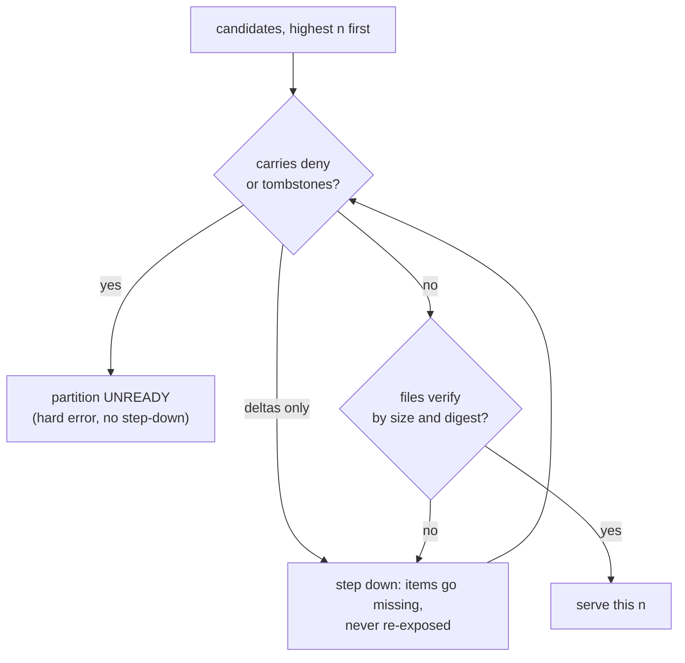

# Tessera — Contracts Specification

**Status:** Draft r88 — **a view group and a plain view are declarable at a running service**
(r88, 2026-09-08; [decision 0136](../decisions/0136-the-ingest-design-rulings.md) R9, track T6;
[`ingest.md`](ingest.md) §1.3, [`views.md`](views.md) §7). §3.4 gains `PUT
/control/view_groups/{name}` and `PUT /control/views/{name}`: the `[[view_group]]` block minus its
roster and source, and the `[[view]]` block minus its source, as JSON. Both are durable at the
answer — a `ViewGroupCreate` or a `PlainViewCreate` record, then the segments manifest's `groups`
and `plain_views` lists (§2.3) — and both carry an empty row space until their first flush, which
is what a view created under a group already gets. `extent` is the frame's own box
(`{x: [a, b], y: [c, d]}`) and never `auto` or a `lon`/`lat` pair: there is no source to survey,
and the projected box is what both build spellings produce. A group's name and a plain view's name
are one namespace. An identical redeclaration answers the object that exists; a differing frame,
projection, gate, point default, metadata or owner under a held name is a `409`. `views.md` §7's
rule that no plain view is added after the build is overturned by R9 and amended there.
`api_version` stays at 1 and `bundle_format` does not move; `SEGMENTS-<n>.json` gains
`plain_views`, and a manifest omitting it refuses at open. Leak register: no new row — a view's
gate is evaluated at authorise as every other view's is, and a view created after a session
authorised is a 404 to it until it re-authorises (`views.md` §6).

**Status:** Draft r87 — **a vocabulary is declarable at a running service, and its values are
paged** (r87, 2026-09-08; [decision 0136](../decisions/0136-the-ingest-design-rulings.md), track
T5; [`ingest.md`](ingest.md) §1.3). §3.4 gains `PUT /control/vocabularies/{name}` and `PATCH
/control/vocabularies/{name}/values`: the `[[vocabulary]]` block minus its acquisition keys, with
the values that fit the request inline, and a page of values afterwards. Both are durable at the
answer as a `VocabularyDeclare` record and in the segments manifest's `vocabularies` list (§2.3),
which a restart appends to the build's table and a fold writes into `MANIFEST.json`. **No code
travels on either route**: the executor draws every one and records it, so a body naming `code` is
a `422` from the shape. An identical redeclaration answers the vocabulary that exists and applies
its values as a page; a differing value set, visibility, width or reserved list under a held name
is a `409`. A value's properties are supplied once: a title the deployment does not hold is
filled, and one it holds differently is a `409` — ⊘ where per-point-attributes §2.2 promises an
upsert, which is with the owner. A `declared` category column may name the
vocabulary from the answer, and the declare-then-use refusal still answers a key it does not hold.
`MANIFEST.vocabularies` gains `width`, the code space's own, which a column that names the
vocabulary still overrides; a manifest omitting it refuses at open, and `bundle_format` does not
move (`views.md` §2's rule: the required field is the loud guard). `api_version` stays at 1. Leak
register: no new row — a vocabulary's values reach a viewer through `/v1/categories`, under the
`visibility` the declaration states and the membership derivation that gates it.

**Status:** Draft r86 — **attribute values are filled on entities that already exist** (r86,
2026-09-08; [decision 0136](../decisions/0136-the-ingest-design-rulings.md) ruling 7 and R2,
[`ingest.md`](ingest.md) §1.4, §6.3). §3.4 gains `POST /control/values`: a batch of rows over
entities that exist, JSON by default and Arrow by content type as the ingest route is, each row
naming its entity by `external_id` or by `tessera_id` with its `idset`, carrying attribute columns
and layer columns and no coordinates. It allocates nothing and creates no row. Per cell the fill
rule applies — an absent cell takes the value, a cell holding the identical value is a no-op, and
a cell holding a different value is a `409` naming the column, and for a group-scoped column the
key, and never the held value. A row naming an identifier this deployment does not hold — whichever of the
two address forms named it, at the batch's own row index — a layer key no artifact holds, or a
column declared `render` is a `422`: a rendered value is drawn from the hot column of the row that
carries it, and a values row acquires no row. A batch carrying
a group-scoped column carries `x-tessera-view`, and the key-in-group check the ingest route runs at
the join runs at the fill; without the header no family may be named. The route publishes
`limits.values.max_batch_rows` and `max_batch_bytes` on `/control/status`, each a `422` naming the
unit. `api_version` stays at 1 and `bundle_format` does not move. Leak register: no new row — an
ingest in progress, and every filled cell is served inside the composed mask as any other value is.

**Status:** Draft r85 — **a generating set changes by pages, and a page that empties one withdraws
the content** (r85, 2026-09-08, **owner ruling**;
[decision 0136](../decisions/0136-the-ingest-design-rulings.md) ruling 3,
[`ingest.md`](ingest.md) §1.1). §3.4's `PATCH /control/layers/{name}/artifacts` row: a row naming
`rank` moves that content's generating set, `members` joining it and `leaving` leaving it, joins
before leaves, with the set's stored cardinality moved by the same page and published beside its
row-space operator at the next flush tick. `leaving` with no `rank` is a `422`: a membership never
shrinks. A page that empties a set removes the content record and the answer names the rank beside
the key; the content does not return when the set refills. The answer gains `left` and
`withdrawn`. `api_version` stays at 1 and `bundle_format` does not move. Leak register: C7 is
annotated with the bound rather than a row being added — a change to the declared set in either
direction is observable by a principal on one side of the containment boundary, as one bit per
artifact per page, at the caller's rate.

**Status:** Draft r84 — **an artifact's view is part of its identity, and a membership may be
spelled by exclusion** (r84, 2026-09-08; [decision 0136](../decisions/0136-the-ingest-design-rulings.md)
rulings 4 and 9, [`ingest.md`](ingest.md) §1.3, §1.5, §2.3). §3.4's `PUT
/control/layers/{name}/artifacts` row gains two fields. A record for a layer whose `scope` names a
group carries `view`, the view's own key: required there and refused on an entity-scoped layer,
each a `422` at decoding, and never fillable afterwards. Keys are unique per `(layer, view)`, so
the same key in two views is two artifacts, each drawn on its own view alone, and a parent or an
attachment target in another view is a `422` naming where the key is held. A record may spell its
membership as `excluding` rather than `members` — the entities the membership leaves out — which
the executor complements once, against the view's entity set as of that step, before the record is
written: the bundle carries the inclusion. The list is admissible at or under
`limits.publish.max_excluded_per_request`; above it a `422` naming the limit and the inclusion
spelling as the remedy, both spellings on one row a `422`, and a second `excluding` on a held key a
`409`. `members` is optional where `excluding` is given, and a record carrying neither is a
`422`. A view the layer's own group has no key for is a `422` naming that group's keys, rather
than an artifact acked and drawn nowhere. The `PATCH` row
addresses no group-scoped layer, carrying no view: a `422` naming the identity. `api_version`
stays at 1; **`bundle_format` moves from 7 to 8** — the record blob carries the view beside the
key, so a level folded into an extent and reopened keeps two views' keys apart — and a bundle at 7
refuses at open (decision 0048). Leak register: no new row — the complement is taken over the view's own entities on
the executor and what is served is the membership the inclusion spelling would have published.

**Status:** Draft r83 — **an attribute column is declarable at a running service** (r83,
2026-09-07; [decision 0136](../decisions/0136-the-ingest-design-rulings.md), track T4;
[`ingest.md`](ingest.md) §1.3, §6.3). §3.4 gains `PUT /control/attributes`: the `[[attribute]]`
block minus its acquisition keys, one request, durable at the answer as an `AttributeDeclare`
record and in the segments manifest's `attributes` and `scoped_attributes` lists (§2.3), which a
restart appends to the build's schema as one list. The column appends at the tail of the scalar
order; a batch decoded before the answer, or one omitting a declared column, is padded with the
column's absence, so `/control/ingest` no longer refuses a batch for omitting a declared scalar. An
entity that predates the declaration reads absent on every reader from the segment schema, and a
fold writes the column into every segment and the base. `api_version` stays at 1 and
`bundle_format` does not move. Leak register: no new row — an unfilled column is absent
everywhere and its declaration is operator-plane.

**Status:** Draft r82 — **an artifact's fixed parts are filled once, on the wire** (r82,
2026-09-07, **owner ruling**; [decision 0136](../decisions/0136-the-ingest-design-rulings.md),
[`ingest.md`](ingest.md) §1.5). §3.4's `PATCH /control/layers/{name}/artifacts` row: the body
carries `parent`, `attached_to`, `content` at a rank and the shape fields beside `members`, each
under the fill rule — an absent part is filled, an identical one accepted with no effect, a
differing one a `409` naming the part and never the held value. The `PUT` row: a key the level
holds is accepted under the same rule and mints nothing, the batch partitioned before any ordinal
is claimed, so a held sibling named as a parent resolves to its existing ordinal; a layer declaring
supplied content publishes an artifact without it and the answer counts them. Both answers carry
the batch's counts. `api_version` stays at 1 and `bundle_format` does not move. Leak register: no
new row — a fill discloses what a publication discloses, and the counts are bounded by the
caller's own request.

**Status:** Draft r80 — **a null or empty access label takes the view's default at both doors,
or is refused at both** (r80, 2026-09-06, **owner ruling**;
[decision 0133](../decisions/0133-a-null-access-label-takes-the-views-default-at-both-doors-or-is-refused-at-both.md)).
§3.4's `/control/ingest` row: an empty `access` list is a row with no label, which the view's
declared `point_visibility.default` fills, the row landing under that label's terms as the
build fills a null or empty label; where the view declares none the batch is a `422` naming the
count of such rows and the view, whole batch without effect, in the terms the build refuses the
same corpus. `bundle_format` moves to **6**: every `views` and `groups` entry carries
`point_default`, the declaration the ingest plane reads, so a bundle written before the field
refuses at open rather than filling with a label nobody declared or refusing rows a declaration
filled. `api_version` stays at 1. Leak register: no new row — the count is an operator-plane
figure about rows the operator sent.

**Status:** Draft r79 — **a view gate's label is one label** (r79, 2026-09-06, **owner
ruling**; [decision 0132](../decisions/0132-a-view-gates-label-is-one-label.md)). §3.4's
`PUT /control/views/{group}/{key}` row: `visibility` is one label as a string or several as a
list, each element one term taken verbatim through the plugin's list form, `public` and absence
being one statement; an empty element, an empty list, or `public` beside another label is a
`422` naming the reason. The declaration's field takes the same two spellings, and a form B
roster table's column is a `string` or a `list<string>`. The comma grammar the gate's label was
split by is gone: a label containing a comma is one term at every reader, and §4.3's scalar
`terms_of_label` export goes with it, the list form being the one data-side entry point.
`api_version` stays at 1 and `bundle_format` does not move; the write-ahead log's version moves,
the stored gate being a list where it was a string. Leak register: no new row — a gate's terms
are never sent.

**Status:** Draft r78 — **the ingest wire carries access labels as a list** (r78, 2026-09-05,
**owner ruling**; [decision 0129](../decisions/0129-the-ingest-wire-carries-access-labels-as-a-list.md)).
§3.4's `/control/ingest` row: `access` is `list<utf8>` (or `large_list<utf8>`), one label per
element taken verbatim through the plugin's list form; a scalar column is a `422`, a null list or
element a `422` naming the row. The comma grammar the scalar form was split by is gone from the
wire — a label containing a comma is one term at both entry points, which rung 5's 70 comma-named
publishers had shown it was not. `api_version` stays at 1 and `bundle_format` does not move; the
column's type is a wire change every ingest client makes at once (decision 0048). Leak register:
no new row — the labels a row carries are now exactly the labels the caller sent.

**Status:** Draft r77 — **a membership grows through the control plane** (r77, 2026-09-05, **owner
ruling**; [decision 0127](../decisions/0127-a-membership-grows-through-the-control-plane.md)).
§3.4 gains `PATCH /control/layers/{name}/artifacts`, which adds members to artifacts a level
already holds through the engine's existing `ArtifactGrow` path, so an artifact whose membership
exceeds the 64 MiB publication cap is published once and grown in pieces. The same revision writes
down `PUT /control/layers` and `PUT /control/layers/{name}/artifacts`, which the table had never
carried though both have been served since August. Additive; `api_version` stays at 1 and
`bundle_format` does not move. Leak register: no new row — a growth discloses what a publication
discloses; `joined` is an operator-plane figure about a membership the operator wrote.

**Status:** Draft r76 — **the suggestion verb gains its third ceiling** (r76, 2026-09-02, **owner
ruling**; [`value-suggestion.md`](value-suggestion.md) §6.3,
[decision 0124](../decisions/0124-the-suggestion-route-may-follow-the-viewers-cardinality.md)).
`selection` gains `max_suggest_set_entities` (recommended default 10⁷): the composed cardinality at
or under which a suggestion is answered from a per-session set of visible values rather than by
probing one posting per value walked. Nothing on the wire changes shape — the two routes serve the
same page, differing only in that the set route's `more` is exact where the probe route's may be a
spent budget — and the verb's ⊘ marker is dropped, the route having been served since 2026-09-02.
Additive; `api_version` stays at 1 and `bundle_format` does not move. Leak register: **C31**'s
disposition is amended, not a new row.

**Status:** Draft r75 — **`POST /v1/artifacts/browse` serves a layer's hierarchy by lineage**
(r75, 2026-09-02; [`highlight-and-hierarchy.md`](highlight-and-hierarchy.md) §4). §3.2 gains the
verb: one verb, three forms — roots, children with the requested artifact's own served parents,
and a name search — over a layer's whole gated population, independent of the viewport and paged
by a total order (count descending, `tessera_id` ascending). The gate runs before `limit` and
`cursor`, so a withheld artifact leaves no gap; a relation is named only where both ends are
served; under `filters` each row carries `matched_count` and neither existence nor `masked_count`
moves. `selection` gains `max_browse_rows`. Additive; `api_version` stays at 1 and
`bundle_format` does not move. Leak register: **C33**.

**Status:** Draft r74 — **the viewport gains a `highlight` beside its `filters`** (r74, 2026-09-02;
[`highlight-and-hierarchy.md`](highlight-and-hierarchy.md) §2). A second boolean expression in
`filters`' own grammar, evaluated over the candidate `filters` produced and **changing which rows
the response holds not at all**: the served set is identical with and without it. §3.2's frames
gain three columns — `highlighted: uint64` fifth on *tiles*, always present and equal to `matched`
without a highlight; `highlighted: bool` on *points*, after the render scalars and before the
membership columns, present only with one; `highlighted: bool?` fifteenth on *artifacts*, after
`matched`, carrying decision 0104's bit for `all_of[filters, highlight]`. `point_rows` joins
`artifact_rows` as a column projection: `"highlight"` answers the same points as
`(tessera_id, highlighted)`. `highlighted` joins `region` and `member_of` as a column name refused
at the build. Additive; `api_version` stays at 1 and `bundle_format` does not move. Leak register:
**C32**.

**Status:** Draft r73 — **the filter grammar gains the `member_of` leaf** (r73, 2026-09-02;
[`highlight-and-hierarchy.md`](highlight-and-hierarchy.md) §3). §3.2's `filters` grammar gains a
second reserved leaf beside `region`: `{"member_of": {"layer", "artifact"}}`, resolving to one
artifact's `membership ∩ M_auth` in row space over the whole view, under the artifact's own
existence criterion. An unknown **layer** is a `422` — deployment schema, and the registry answers
alike for a gate-failed name and a never-registered one — where an unknown, foreign, suppressed or
withheld **artifact** is the empty operand, since refusing it would make the leaf an existence
oracle over what the criterion withholds. `member_of` joins `region` and the three combinators as a
column name refused at the build. Additive; `api_version` stays at 1 and `bundle_format` does not
move. Leak register: no row of its own — a row-space operand over a membership the principal may
already count (`selection-operand.md` §7), with the empty operand's timing residual registered
inside C33.

**Status:** Draft r72 — **a category vocabulary gains a typeahead verb** (r72, 2026-09-02,
**owner ruling**; [`value-suggestion.md`](value-suggestion.md), decisions
0118–0123).
§3.2 gains `GET /v1/categories/{column}/suggest`: a prefix over the folded key, title and word
starts of a vocabulary's values, at most `limit` values with a match span each and a `more` flag,
gated by exactly the predicate the enumeration applies and resolving its address at exactly the
same site. `selection` gains `max_suggestions` (default 20) and `max_suggestion_walk` (default
10⁵). The enumeration's own admission sentence is corrected: "no mask composition, no file IO" was
true of the `public` arm only. **⊘ None of the verb is built.** Its timing is registered as
**C31** and `api_version` stays at 1 — the route and the two fields are additive, and
`bundle_format` does not move. **r71 — the artifacts frame names every served parent** (r71, 2026-09-01,
**owner ruling**; decision 0117, [`dag-hierarchies.md`](dag-hierarchies.md) §7). §3.2 item 4's `parent_id: uint64?` becomes
`parent_ids: list<uint64>` for every layer kind — the served parents of the row that are in the
same response, ascending by `tessera_id`, empty otherwise — because a `dag` layer's artifact has
several and a tree's list has at most one. C29's *named only where in the same response* applies
per entry. `rung` on a treed layer is the longest parent chain in the response's own links, which
is the tree definition read over a graph. `api_version` stays at 1 by owner ruling: nothing has
launched, and the client moves in the same commit. **r70 — a dropped view key is reusable, and an
internal incarnation keeps its predecessor out** (r70, 2026-09-01, **owner ruling**; `views.md` §3.2/§3.4 r29,
decision 0115). §3.4's create verb answers
`201` on a previously dropped key and keeps its `409` for a **live** one; the drop frees the key
rather than burning it. Nothing else on any wire moves: the incarnation that makes the reuse safe
is internal — not on `/v1/meta`, not in a response, not part of a view id — so a principal cannot
tell a recreated key from a fresh one. On disc, §2.2's `views` entry and §2.3's `segments`,
`attr_extents`, `text_extents`, `scoped_columns` and the four derived-structure lists each gain the
incarnation they were written under, and §2.3's `view_tombstones` becomes `dead_view_incarnations`
— renamed rather than repurposed, because it no longer refuses anything. The fields are
**required**: an absent incarnation reads as the build's, which is the one value a leftover
artifact could carry. `api_version` stays at 1 and `bundle_format` stays at 4 — no discriminant
shifts — while `WAL_VERSION` moves to **18**, `ViewCreate` and `ViewDrop` both changing shape. No
leak-register row: the incarnation is on no surface a principal reads, and what it changes is which
artifacts a view composes, which is a correctness property rather than a disclosure channel.
*(Written on a branch beside other contracts work; if another revision lands first this one
renumbers.)* **Status:** Draft r67 — **`render` alone makes a group-scoped family a filter operand** (r67, **Status:** Draft r69 — **the drill-down is the whole permitted picture of one point** (r69,
2026-09-01, **owner ruling**; `views.md` §5, §6). `POST /v1/items/{tessera_id}` gains two fields
beside the record and the satisfied labels. **`views`** names every view the item holds a row in
**that this principal may reach**, each with the position that view places it at, in that view's
own 32-bit grid units — a position being a fact about a view rather than about an item, its frame
and its projection being the view's own (decision 0040). **`scoped`** carries the group-scoped
attribute values, by family name and then by the **group's key**, the key being a view's only
address (decision 0113)
— so two views sharing a key through a `members` group are one entry, not two. Both are
gate-filtered against the session's visible-view set at the one place the gate is resolved
(`views.md` §6): a view that fails it is absent exactly as a view nobody declared is, so neither
field can become the place a gate-failed view is named, and a point held only in views this
principal cannot reach serves what it served before — an empty `views`, no scoped entries, and the
same `404` on the paths that gave one; `[]` therefore says only *none of this item's views is one
you may reach*, an item in no view at all being a `404` rather than an empty array. **A family with neither `index` nor `render` is served
here**, which is what that declaration now means: stored, served at the drill-down, on no filter
surface and in no row tail — §3.2's `scoped_scalars` sentence about it is corrected below. `text`
is the one family absent, having no per-entity value slot to read. `api_version` stays at 1,
`bundle_format` and `WAL_VERSION` do not move — nothing on disc changes, both fields being read
from artefacts every build already writes. Appendix C's **C30 is widened** rather than joined by a
new row: it is the same claim about the same endpoint, that what it serves about an item is
computable from inside `M_auth` and the principal's own reachable views. **Status:** Draft r68 — **a scoped value's address is `(attribute → its group, key)`, and the
join rule is decided on the serial writer** (r68, 2026-09-01, **owner rulings**;
decision 0116;
`views.md` §4, §5 r27). §3.1's ingest row changes twice and nowhere else. **First**, a batch may
carry a group-scoped family's columns on any view whose key belongs to the attribute's group's key
set — the owner's own views and every view of a group declaring `members` of it — where before
only the owner's door was admitted. The value lands in the one `(entity, attribute, key)` cell; a
second row naming a cell that already holds the **same** value is deduped, and one naming a
**different** value is `409` naming the column and the key, whole batch without effect. A view whose
key is in no such set refuses the column as the undeclared one it is, unchanged. **Second**, §4's
label and attribute arms are evaluated on the write executor rather than in the handler, beside the
map that settles which rows are joins; the caller still receives the `409` synchronously and before
the WAL append, and the refusal bodies are byte-identical to the ones the handler answered with.
Nothing on the wire is added or removed by either: `api_version` stays at 1 and `bundle_format`
does not move. No leak-register row — the arms refuse the same requests from a different thread,
and a cell's address is a schema fact the caller already holds.


**Status:** Draft r67 — **`render` alone makes a group-scoped family a filter operand** (r67,
2026-08-31, **owner ruling**; `views.md` §5 r26). The licence for a family is now `index` **or**
`render`, which is the licence an entity-scoped column has had since decision 0068, and the
asymmetry between them was a hole rather than a rule. §3.2's `filter_operands` gains the rendered
families — same entry, same per-family operator names, the `scope` key unchanged — and
`scoped_scalars` no longer carries any family the operand list does not. What `render` licences is
the family's per-view **entity-space** column, which every build has written whatever the flags,
so a bare leaf and a pin are answered exactly as an indexed family's are and the row lane answers
no filter; `render` on a scoped `text` family stays refused at the declaration and is excluded at
the predicate. §2.2's `scoped_scalars` row is unchanged in shape: what changes is what a rendered
family owes on disc, which is what an indexed one already owed — the flush's per-view extents, the
empty base of a runtime-created view, and a **category**'s keyed postings, since one admission
decides the filter surface and `/v1/categories` together. `api_version` stays at 1,
`bundle_format` and `WAL_VERSION` do not move — no discriminant shifts, and a rendered family's
artefacts are the ones an indexed family's directory already holds. No leak-register row: the
operand is served through the masked entity-space route its indexed counterpart is, and the group's
gate collapses the whole family at the one site it already did. **Status:** Draft r66 — **a batch carries a group-scoped attribute's values, a flush writes the
column, and every segment rewriter keeps the lane** (r66, 2026-08-31, **owner ruling**;
`views.md` §5 r25). §3.1's ingest body admits, beside the declared scalar tail, a column named for
a **group-scoped family of the group that owns the batch's view**, under the family's plain name:
the view is known from `x-tessera-view`, so the column is not qualified and the view decides which
of the family's columns the value is for. The same column on an entity-space batch — a plain view,
or a view of a group that only *shares* the family's views — takes the undeclared-column `422`
exactly as before, byte-identical, which is what keeps a scoped column un-nameable outside its
group's own views. Nullability, the wire type and a category's key-not-code rule are the
entity-scoped ones. §2.1 gains one directory: a flush's per-view extents at
`attrs/<column>/<group>/<key>/extents/`, beside the build's base, plus the **empty base** a view
created since the build acquires at its first flush. §2.3 gains `scoped_columns`, the durable
record of which `(family, view)` pairs a flush has written, which `MANIFEST.groups[..]
.scoped_scalars[..].views` is derived through at open — so `/v1/meta`'s `scoped_scalars[..].views`
names a runtime-created view the moment it has a column. `api_version` stays at 1, `bundle_format`
does not move, and `WAL_VERSION` goes to **17**: `WalRow` gains a second positional list, `scoped`,
against the owning group's `scoped_scalars` rather than the flat `declared_scalars` a family has no
slot in. §2.6's segment tail gains the view's scoped render lanes after the declared ones, and a
lane is the one column a segment may lawfully **not** hold: both ends read a missing one as the
row's placeholder — the read path already did, and every rewriter now does — while a wrong type
under the name stays malformed. No leak-register row — a scoped value arrives on the control plane and is served through
the masked paths its entity-scoped counterpart is. **Status:** Draft r65 — **the join rule's attribute arm is exact past the entity's own flush**
(r65, 2026-08-31; `views.md` §4 r24). §3.4's `⊘` is discharged: an entity-scoped value whose
holder has already flushed is read back from the home its declaration gives it — the entity-space
value column, the record blob, or the hot column — and a joining batch carrying a *different* one
is the `409` naming the column that the rule always specified, rather than a row accepted and
inert. It was never wholly inert: a rendered column's value travels in the joining row's own tail
into the joined view's hot column, so for that home the arm was the rule and not only its report.
No wire shape changes; the refusal is the one the buffered arm already produced, byte for byte. **Status:** Draft r64 — **the entity-space coalesce merges the entity→term extents** (r64,
2026-08-31; `tessera_store::coalesce_entity_terms_extents`). §2.4's transpose accumulated one
extent per flush with nothing but a fold to collapse them; the coalesce now takes a contiguous
window of `entity_terms_extents` and publishes one extent in its place, on the record blob's
policy and in the record blob's shape — three files, has-row addressed, spliced at the window's
position. Nothing about the format changes and nothing is remapped: the layers are disjoint by
**I9** and a term ordinal is a dictionary position the coalesce already preserved. The pass
retires nothing, so a pending deletion's entity keeps its list until the fold executes it. No wire
change; `bundle_format` does not move.

**Status:** Draft r63 — **the item drill-down names an item's satisfied labels, over a new
entity→term transpose** (r63, 2026-08-31, **owner ruling**;
[decision 0114](../decisions/0114-the-drill-down-serves-the-satisfied-labels-only.md), design §7.4,
Appendix C's C30). `POST /v1/items/{tessera_id}` gains `labels`: the intersection of the item's own
term set with the session's satisfied set, spelled by the plugin's `present_terms` and sorted — and
**never the full label set**, a viewer learning a compartment they do not hold being the disclosure
the ruling rules out. §2.1 and §2.4 gain `entities/terms/`, the transpose the intersection reads:
has-row bitmap, rank-indexed offsets, concatenated ordinals; base plus one extent per flush,
disjoint by **I9**; folded minus `D₀` and never remapped, a dictionary ordinal being a position the
coalesce preserves and the fold hard-links. It is required rather than optional, unlike
`pairs.parquet`, because a request path and a write-path refusal read it. Additive on the wire;
`api_version` stays at 1 and `bundle_format` does not move — the artefact is new rather than
changed, and [0048](../decisions/0048-no-deployments-exist-so-delete-rather-than-support.md) has
the bundles rebuilt. **Status:** Draft r62 — **a group-scoped attribute renders per view, and `/v1/meta` gains
`scoped_scalars`** (r62, 2026-08-31; `views.md` §5). §3.2's points frame carries, after the
entity-scoped `render = true` columns, the rendered **families** of the group whose view the
request names — and of a group sharing those views via `members` — each under its plain column
name and under no other view. Readers take the columns by name, as this section already requires.
`/v1/meta` gains **`scoped_scalars`**, a family's counterpart to `declared_scalars`: `name`,
`arrow_type`, `scope`, `category`, `analyser`, `render`, `index`, and `views` — the view ids that
have a column, which is not the group's roster, a view created while the service runs having none
until a rebuild. `category` and `analyser` **move there** from the `filter_operands` entry, which
carries neither for an entity-scoped column either; the operand entry keeps `column`, `family`,
`operands` and `scope`. Gate-filtered exactly as `filter_operands`' scoped entries are: a family
whose group this principal cannot reach is on neither list and is named in no response they
receive. Additive but for the two moved fields; `api_version` stays at 1 and `bundle_format` does
not move. No leak-register row: the value reaches a row only through the mask that admitted the
row, and the scope decides which column file it was read from.
**Status:** Draft r61 — **a view group's declared title is published** (r61, 2026-08-31;
`configuration.md` §1). `[[view_group]].title` has been compiled and served nowhere; §2.2's
`groups` row gains `title` and `/v1/meta`'s `groups` entry serves it, `null` where the group
declared none. **Not per-principal**: it is presentation metadata on an object whose visibility the
roster has already decided, so a principal who sees the group sees its title and one who does not
sees neither. Additive on the wire; `api_version` stays at 1. `bundle_format` does not move, the
field being new to a manifest that no deployment holds (decision 0048), so a bundle built before it
is rebuilt rather than read. No leak-register row: a deployment constant, identical for every
principal who reaches the group. **Status:** Draft r60 — **the category and text families of a group-scoped attribute reach the
filter surface, and such an attribute may declare its own `source`** (r60, 2026-08-31;
`views.md` §5). §2.2's `groups[..].scoped_scalars` is unchanged in shape and gains two families in
practice: a scoped **category**'s per-view keyed postings, at `attrs/<column>/<group>/<key>/postings.arrow`,
and a scoped **text** column's per-view dictionary and positional postings in the same directory,
that family owing no value column at all. `/v1/meta`'s `filter_operands` entry for a scoped family
gains `category` — the vocabulary its codes index, that vocabulary's `kind` and its `visibility` —
and `analyser`, the two facts the entity-scoped `declared_scalars` entry already publishes and
which a family has no row there to carry. `GET /v1/categories/{column}` becomes **view-addressed
for a scoped category**: an optional `view` query parameter, resolved through the session's
visible-view set exactly as a viewer verb's is, and the pinned spelling `{column}@{key}` in the
path — the same resolution rule §3.2's filter leaf takes, refusing at the same site. A scoped
column named with no view is a `422` naming the group; a pin naming no view of it, or a `view`
this principal cannot reach, is the `404` an unknown view gets; and for a principal whose group
gate fails the whole family is **undeclared**, so the route answers the `404` a name that is
nothing at all gets. **`view` is resolved before the column is, whatever the column's scope**: a
`view` naming nothing, or a view this principal may not reach, is that same `404` even where the
column named is entity-scoped and no view would have decided anything about it. The order is what
makes the gate the first thing the route applies rather than a check reached only on one branch. Additive on the wire; `api_version` stays at 1 and `bundle_format` does not
move. No leak-register row: a scoped category's value list is derived from that view's own
postings inside `M_auth`, which is C11's existing channel over a per-view column rather than a new
one. **Status:** Draft r59 — **a layer's scope is written and a shape is canonicalised per view**
(r59, 2026-08-31; `views.md` §3.5, `polygon-membership.md` §4.3, decisions 0109 and 0111): §2.3
gains the `layers` row it never carried, the declaration in it gains `scope`, and a shape layer's
geometry is canonicalised against each of its views' own frames rather than one for all of them.
**Ordinals are removed** (r58, 2026-08-31, owner ruling; `views.md` §3.2,
decision 0113): a view of a group is addressed `<group>:<key>` and by nothing else. `/v1/meta`'s
`views` entry loses `ordinal`; §2.2's `groups` roster and §2.3's `views`/`view_tombstones` lose it
too; `PUT /control/views/{group}/{key}`'s `201` body no longer carries it; and §3.2's filter
grammar keeps `<column>@<key>` alone. A group's views are served in **creation order**, which is
roster-record order, so the ordering a client walks needs no stored number. **Key tombstones are
unchanged** — a dropped key is refused for ever. `api_version` stays at 1 and `bundle_format` does
not move (owner direction), so a stale bundle carrying the old field is recreated rather than
read. Leak register: the ordinal gap's row is **deleted**, not accepted — with no position served,
a gate-filtered roster is a shorter list and nothing else. **The view gate is enforced** (r57, 2026-08-31; `views.md` §5, §6): §3.2's
view-valued fields become per-principal. A session's visible-view set is resolved once at authorise
— every view of every group, by intersection of the label's term set with the principal's, the
group's gate conjunctive with the view's own — and `/v1/meta`'s `views`, its `groups` (a
gate-failed group taking its whole roster), each served layer's `views` and `filter_operands`'
scoped entries are filtered by it. Naming a gate-failed view on a viewer verb is the same `404` an
unknown view gets, in the same detail shape and at the same cost. A leaf naming a scoped attribute
whose group the principal cannot reach takes the **unknown-column** `422`, bare and pinned alike —
the attribute is undeclared for them, and neither the group nor the key space is confirmed. §3.4's
`PUT /control/views/{group}/{key}` accepts a label, checked against the plugin at acceptance; the
control plane itself is **not** gated. Additive on the wire in shape and narrowing in content;
`api_version` stays at 1 and `bundle_format` does not move. Ordinal gaps stayed visible under
decision 0110 — **withdrawn at r58**, the ordinal being removed — and a view created after a
session authorised is a 404 to it until re-authorisation; both were rulings, not gaps. Leak
register: the `views`/`groups` fields join the C11-gated vocabulary as per-principal fields on
`/v1/meta`, and view existence takes C4's closure. **a view group grows while the service runs** (r56, 2026-08-31; `views.md` §3.2, §3.4, §4): §3.4 gains `PUT` and `DELETE /control/views/{group}/{key}`, and its ingest row's duplicate rule is amended by the join. A known `external_id` naming a view the entity is **not** in is accepted — the row lands in that view, the entity, its label and its entity-scoped attributes untouched — and every other arm refuses loudly, the "already in the view" one reading the view's permutation union the commit window's buffer. A joining row carries geometry and nothing else: no descriptors, no postings, no attribute value, which is what makes a label supplied on one inert rather than a re-label with no overlay entry (decision 0047). Nothing about the two removal rules moves: `delete_dangling` submits **ordinary** deletions on the deny lane, which retire at the fold under Rule F, and a drop by itself deletes no entity. Additive on the wire; `api_version` stays at 1 and `bundle_format` does not move. No leak-register row: the roster is a deployment constant and a view's population is already answered per view. **a group-scoped attribute answers filters** (r55, 2026-08-31; `views.md` §5): §2.2 gains a `groups` row carrying the roster and each group's `scoped_scalars`; `/v1/meta`'s `filter_operands` entry for a scoped attribute carries its `scope`; and the filter grammar gains the pinned leaf `<column>@<key>` / `<column>@#<ordinal>`, with a bare leaf where nothing decides a `422` naming the group and a pin naming no view of it the `404` an unknown view gets. Additive; `api_version` stays at 1 and `bundle_format` does not move. No leak-register row — the scope decides which column file a predicate reads and nothing about how it is read. **`/v1/meta` publishes the view roster** (r54, 2026-08-31; `views.md` §3.2): each `views` entry gains `group`, `key`, `ordinal` and typed `metadata` — `null` together on a plain view — and a top-level `groups` array lists each group's view ids in ordinal order, which is what lets a client offer previous-and-next without interpreting a key. `views` is served in roster order: the plain views first, then each group's by ordinal. A view id is the joined `<group>:<key>`, and `<group>:#<ordinal>` is an alias for it **wherever a view id goes** — the request body, `x-tessera-view`, this document — resolved once, so both planes answer an unknown id, an absent key and an ordinal no view holds with the same 404. **No gate filtering**: the gate is unbuilt (`views.md` §6) and every declared view is reachable by every principal; a roster that pretended otherwise would be a disclosure control accepted and never enforced. Additive on the wire, `api_version` stays at 1 and `bundle_format` does not move. No leak-register row: the roster is a deployment constant, identical for every principal, and view metadata is one value per view rather than one per (entity, view). **the quantisation extent belongs to the view** (r52, 2026-08-30; decision 0040, `views.md` §2): §2.2's bundle-level `quantisation` is **deleted** and each `views` entry carries its own, required and never defaulted; §3.2's `/v1/meta` moves the same object into each entry of `views` and drops the top-level key. The extent is the frame a stored position is a fraction of, and an embedding and a map cannot share one without one of them wasting most of the grid — so a single bundle-wide frame would have to pick one of two views, and every position of the other would decode against ground it does not sit on. This is what decision 0040 has said since 2026-08-02 and its ⊘ marker recorded as unbuilt; the marker is discharged. **Breaking on both surfaces**, and deliberately loud: a manifest whose view omits the field is malformed and refuses at open rather than falling back, which is the same rule `projection` beside it keeps, and a client reading the old top-level key gets `undefined` at the one place it cannot be ignored. `api_version` stays at 1 on deviation 10's no-published-reader argument and **`bundle_format` does not move** (owner direction, 2026-08-30: version numbers are frozen until launch) — the missing-field refusal is the guard the bump would otherwise be, and under decision 0048 the artifacts are recreated rather than migrated. No leak-register row: the extent is a deployment constant, identical for every principal, and the same four numbers are published; only where they sit changes. **the reader refuses a non-canonical `SEGMENTS-<n>.json` name** (r51, 2026-08-30; §2.1): the refusal §2.1 has specified since r21 is built. A directory entry spelled like a side-manifest but not the canonical name of any `n` — a leading zero, an empty or non-numeric part, a sign, whitespace, a value past `u64` — is now a typed error naming the file, raised before anything is read, rather than a number the reader parses and then reads the canonical spelling back from. That combination was the silent one: a padded `SEGMENTS-01.json` was discovered, read for at `SEGMENTS-1.json`, missed, and stepped past by §2.3's candidate walk — carrying the reader past a manifest that may hold a `deny`, and leaving it indistinguishable from a manifest that is not there. The specified-but-unbuilt marker under §2.1 is discharged and the open item in §7 with it. **No format, field or byte changes**: `n`'s grammar is unaltered, nothing in this repository ever wrote a padded name, and the refusal is over names the writer cannot produce, so `api_version` stays at 1 and `bundle_format` does not move. No leak-register row — the change removes a disclosure rather than admitting one, and refuses on a filename, which carries no viewer data. **the write path projects, exactly as the build does** (r50, 2026-08-30; `projections.md` §3): §3.4's `POST /control/ingest` schema spells its coordinate columns **`lon`/`lat` for a projected view** and `x`/`y` for one that projects nothing, refusing the other spelling by name; the transform runs at the decode of the batch, so the **write-ahead log holds frame coordinates** and replay reproduces the positions the original write produced rather than re-running arithmetic that is not bit-exact across platforms; and a latitude outside the projection's domain is **clipped and counted rather than refused**, the count returned as **`clipped`** beside the out-of-bound count the 200 already carries. The order is what makes it right: project, clip, *then* ask whether the result is inside the frame — reversed, a polar row would be refused for leaving a frame it never reached, and a row a build accepts would be one an ingest rejects (decision 0091). **Additive on the response and breaking on the request only for a projected view**, of which none exists outside a test: one field joins a 200 body, and the spelling that changes is one no bundle could until r48 declare. `api_version` stays at 1 under §0.2's additive rule and `bundle_format` does not move, no stored byte changing. No leak-register row: the clip count is over the caller's own submitted rows. **a client is told what it is looking at** (r49, 2026-08-30; `projections.md` §9): §3.2's `views` entries gain **`projection`**, **`world_aspect`**, **`tile_scheme`** and **`tile`**, so a client can tell a geographic corpus from an embedding, invert a stored position back to longitude and latitude, and — the thing a host was told out of band until now — know whether a tile basemap will line up with the points. `tile_scheme` is a scheme's *name* rather than a boolean because grid alignment does not decide that on its own: an equirectangular frame is a square of a square tiling no server serves, so a host reading alignment as availability would draw a Mercator basemap under a corpus that cannot line up with one. All four are deployment constants identical for every principal, derived from the declaration and from the frame beside them — the same class as `quantisation` and `selection` — and the build's clip and clamp counts stay operator-facing and off the wire. **Additive**: four fields join one object, no existing field moves and nothing that worked stops working, so `api_version` stays at 1 under §0.2's additive rule and `bundle_format` does not move, no stored byte changing. No leak-register row. **a bundle records the projection that placed it** (r48, 2026-08-30; `projections.md` §3): §2.2's `views` entries gain a **required** `projection`, the name from the closed set that document enumerates, and `bundle_format` moves to **4**. The frame does not imply it — a `{0, 1}` quantisation is legal for a view that projects nothing — so a bundle that cannot name its projection is one the write path, the differential oracle and every future reader must be told about out of band, and a defaulted field would read a projected bundle as raw coordinates. Under decision 0048 the bump is a fail-closed guard rather than a compatibility statement: no bundle exists outside this repository, and the artifacts are recreated. **an ingest batch's coordinate columns take either float width** (r47, 2026-08-30; `projections.md` §6): §3.4's `POST /control/ingest` schema reads `x`/`y` as `float32` **or** `float64` and widens the narrower, which is the rule `tessera_build::input` already reads a points file's coordinate columns by — so a corpus buildable at either width is ingestable at either width (decision 0091), and the whole coordinate path from the wire through the write-ahead log to the flush carries `f64`. `WAL_VERSION` moves to 16 and a log at 15 is refused rather than migrated: a field's type changed, so a version-15 record has the right length and the right CRC and would decode a coordinate out of the bytes of whatever follows it. **Additive on the wire** — a width that was refused is accepted and none that worked stops working — so `api_version` stays at 1 under §0.2's additive rule and `bundle_format` does not move, no stored byte changing: a position is a 32-bit fixed-point pair against the frame and no float reaches the bundle. No leak-register row: the width of an accepted coordinate is a property of the caller's own row. **the `region` filter leaf, the two bounds it publishes, and the verdict it answers with** (r46, 2026-08-29; `selection-operand.md` promoted to Normative, `polygon-membership.md` §8; the shape work's stage 4): §3.2's `filters` gains the `region` leaf — a `polygon`, `bbox`, `circle` or `ellipse` in the view's own space with `space`, or a published shape by `artifact` — a row-space operand over the whole view, composable with every other leaf and negatable with `none_of`; `/v1/meta`'s `selection` block gains `max_region_vertices` and `max_region_cells`; `/v1/viewport` gains the response header `x-tessera-region`, present exactly when the request carried a region leaf. **Additive** on both sides — a leaf that was refused as an unknown column is accepted, two fields join a block, a header appears only when asked for — so `api_version` stays at 1 under §0.2's additive rule and `bundle_format` does not move; `region` becomes a reserved column name, refused at the build. `POST /v1/region`, the export verb, stays specified and unbuilt. No leak-register row (`selection-operand.md` §7). **an artifact has one drawn geometry, `shape_x`/`shape_y`, of a declared kind** (r45, 2026-08-29; `polygon-membership.md` §7.1, the owner's ruling of the same day; decision 0048's rename licence): §3.2's kind-5 frame carries `shape_x`/`shape_y` — `list<list<list<uint32>>>`, parts then rings then vertices — where `hull_x`/`hull_y` stood, for every kind of drawn geometry a layer can declare (derived, predicate, authored), and `/v1/meta` publishes the kind per layer; the ask word is `shape`. The r44 note below still describes the frame's re-cut, which stands. **r44 — the artifacts frame is re-cut for the fetch surface** (2026-08-28; `artifact-fetch-protocol.md` §5.2, §5.3 and §8, ruled by the owner the same day; decision 0048's rename-and-re-mean licence): §3.2's kind-5 frame dictionary-encodes `layer`, moves the two hull columns to the tail of the schema — **omitted entirely when no served layer declares a hull**, an absent column being distinguishable from a null one so decision 0076's rule gains no third reading — and renames `level` to **`rung`**, re-meant: the declared level on a levelled layer, the **response-local parent-chain depth** on a treed one, 0 on a flat one. `/v1/viewport`'s request gains **`artifact_rows: "full" | "identity"`**, whose identity value answers with the **same rows** in a fixed four-column schema — the row set, the `matched` bits and the `rung` values are identical under either value; only the columns change. **Breaking on the response side** — the reorder rebinds positions for positional decoders, the loud break 0048 licenses — with `api_version` staying at 1 on deviation 10's no-published-reader argument, exactly as the r26 framing rework did, and `bundle_format` unmoved, no bundle byte being touched. No leak-register row: the projection is a column subset, the rung re-derives a number the response's own links carry, and the encodings move no information. **a filter answers a boolean per served artifact** (r43, 2026-08-28; [decision 0104](../decisions/0104-a-filter-answers-a-boolean-per-served-artifact.md)): §3.2's *artifacts* frame gains a **nullable** `matched: bool` appended after `level` — `true` where a member this principal may see, inside the request's tiles, matches the request's `filter`, and **null where the request carried no filter**, there having been no question. A boolean and never a filtered count, and the only column of that frame a filter moves: existence and `masked_count` stay anchored on `M_auth` (**I3**, **I12**). **Breaking on the response side** — a column appended, so a positional decoder is unaffected up to it — with `api_version` staying at 1 on deviation 10's no-published-reader argument and `bundle_format` unmoved, no bundle byte being touched. No leak-register row: the bit is over a subset of this principal's own visible members, and Appendix C's inclusion test excludes data the service serves. **a request names the computed properties it wants** (r42, 2026-08-28; the contour2 track; `artifact-shapes.md` r4 §8 C): `/v1/viewport` gains `computed`, a narrowing of each layer's own `content.computed` declaration and never a widening — absent is the declaration, the empty array is *none*, a name outside the vocabulary is `422`; additive on the request side, `api_version` at 1 (§0.2). **a level is on the wire both ways** (r41, 2026-08-28; decision 0103): §3.2's *artifacts* frame gains a non-nullable `level: uint32` appended after `parent_id`, and `/v1/viewport`'s request gains `levels`, whose **absent case is the layer's own declared zoom→level map** against the request's depth, with `"all"` and a list overriding it. **Breaking on the response side** — a column is appended, so a decoder indexing positionally is unaffected past it and one requiring the column refuses a server without it — with `api_version` staying at 1 on deviation 10's no-published-reader argument and `bundle_format` unmoved, no bundle byte being touched. No leak-register row: the level is the declaration's, identical for every principal, already published in `/v1/meta`, and Appendix C's inclusion test excludes data the service serves. The response volume this bounds is measured in [`../evidence/memos/2026-08-28-artifact-response-volume.md`](../evidence/memos/2026-08-28-artifact-response-volume.md). **a served hull is a list of rings** (r40, the rings track, 2026-08-28; `artifact-shapes.md`, promoted the same day): §3.2's *artifacts* frame carries `hull_x`/`hull_y` as `list<list<uint32>>`, one ring per separated group of the visible members, because a single ring around two separated clouds claims the ground between them and no α corrects it. **Breaking, and deliberately so** — the nesting is what makes a single-ring reader fail its downcast instead of concatenating the rings — with `api_version` staying at 1 on deviation 10's no-published-reader argument and `bundle_format` unmoved, no bundle byte being touched. No leak-register row: the rings are a function of the same `membership ∩ M_auth` and say strictly less than the one ring did. **the membership column, and the two ruled request behaviours are built** (r39, the s3 track, 2026-08-25): each *points* frame carries, per layer served, one **nullable** `uint64` column `membership:<layer>` after the render scalars — the `tessera_id` of the **deepest served** artifact the point belongs to in this response, or null — bounded structurally to the response's own artifacts frame (register row C30 proposed and **not taken** — Appendix C's inclusion test excludes data the service serves; owner direction 2026-08-26); `layers` omitted or `[]` now means *none* and `"all"` every reachable layer, with `all` refused as a layer name; a dependent artifact's `masked_count` is its target's. One nullable column family added to one frame, read by name; `api_version` stays at 1 (§0.2). **`/v1/viewport`'s request is stated in full** (r38, decision 0048 in hand; the client-components design's D9): `layers` and `artifact_budget` join the request line, `k = 0` is stated as the counts-only request, and the absent *artifacts* frame is confirmed deliberate. **Two of these are ruled rather than described** (owner, 2026-08-25) and are marked at the claim as landing on the s3 track: `layers` omitted or `[]` means *no* layers, the string `"all"` means every reachable layer, and an array is intersected with the reachable set; and a dependent artifact's `masked_count` is its target's. `k = 0` and `artifact_budget` are documented as the server behaves. **No byte changes shape in this revision**; `api_version` stays at 1 (§0.2). **a point's key may create the artifact it names** (r37, [decision 0091](../decisions/0091-build-is-ingest-into-an-empty-database.md)): under `value_set = "open"` a membership column's key that no artifact holds is no longer `422` but a new artifact carrying nothing but that name, minted at the commit window's close and published with the points that named it; a lineage naming artifacts that do not exist yet creates the chain and links it parent before child in the one batch. `/control/ingest`'s 200 body gains **`minted`**, the count this submission created — the mitigation for a trade `open` makes knowingly, a typo becoming a permanent object rather than a refusal. **Additive**: one field added to one response body, and a request that was refused is now accepted, so `api_version` stays at 1 under §0.2's additive rule and `bundle_format` does not move. This closes 0091's last obligation — there is nothing a member table can say that the wire cannot. **a point may name its artifacts on the wire** (r36, [decision 0091](../decisions/0091-build-is-ingest-into-an-empty-database.md)): §3.4's `/control/ingest` body admits a column **named for a declared layer**, beside the reserved columns and the declared scalars, carrying a member key or a list of them — the same values a build reads from a member table, on the same rules (`artifacts-from-points.md` §2, §4). The rows that name an artifact join its membership **in the same commit as the rows**, so a batch is never half-applied. This is **additive**: a column that was refused is now accepted, no existing body changes shape, no field of any section moves, and every in-repo reader is unaffected — so `api_version` stays at 1 under §0.2's additive rule rather than on deviation 10's argument, and `bundle_format` does not move. (r36 refused an unknown key; r37 mints it.) **a vocabulary's disclosure control is `visibility` everywhere, and a value's presentation is `title`** (r35, decision 0088): §2.2's `vocabularies` row and §3.1's `category` block spell the control `visibility` with the values `public` and `derived` — the words the declaration already used — retiring the manifest's `listing` and the wire's `per_viewer`, and `ManifestVocabularyValue.label` becomes `title`. `api_version` stays at 1 on deviation 10's no-published-reader argument; `bundle_format` moves to **3**, because `title` is optional and a stale bundle would otherwise open with every value title silently dropped. What `derived` *means* is decision 0088's membership axis and is not settled in this slot; the surface governs the spelling. **the artifacts frame's caller key is `key`** (r34): §3.2's kind-5 batch spells it `key` rather than `stable_key`, same position, type and nullability, and `api_version` stays at 1 on deviation 10's no-published-reader argument. **the manifest's plugin-hash agreement is enforced at open** (r33): §2.2's `data_plugin_hash` row says which reader refuses and that an empty value fails closed, and notes that the auth hash has no counterpart check; no field moves and `api_version` stays. **The data side of the plugin ABI gains a list entry point** (r32): §4.3 adds `terms_of_labels`, which takes an item's terms already separated and must return exactly one descriptor per element, in order, so the build no longer joins terms into one string for the module to split apart and a separator byte inside a term is no longer two grants; `terms_of_label` stays as the wire path, `builtin:passthrough`'s identity string moves to `:2` and both its hashes with it, and no wire schema and no `api_version` moves. **The points frame is named by its render columns** (r31): §3.2's *points* schema reads "…render scalars", correcting wording left stale when r28 narrowed §2.6's tail; the served buffers were always the render columns, so no byte changes shape, no field of any section moves and `api_version` stays (§0.2). **The per-partition status block is emitted** (r30): `GET /control/status` gains `partitions`, per partition `{segments_version, watermark, readiness}`, closing §3.4's oldest ⊘; the write executor's maintenance and refresh counters ride along out of contract (§0.1), being the stage barriers the correctness suite's driver waits on; no field of any other section moves and `api_version` stays. **A text column's analyser identity is published** (r29, decision 0070): §3.1's `declared_scalars` gains `analyser`, the same `<name>/<version>` string §2.2 already records, so a client can tell an empty `match` that means *nothing says this* from one that means *your query segmented differently from the index* — the second being the likely reading for CJK or Thai, and until now undiagnosable from the wire. One field added; `api_version` does not move (§0.2). **A column is declared by `render` and `index`, and the record blob joins the bundle** (r28, `records-and-search.md` §2–§3): `declared_scalars` entries carry the two placement booleans, neither defaulted, and their **joint absence is a third home** — `attrs/record/`, a per-entity compressed row that drill-down returns and no filter reads; `SEGMENTS-<n>.json` gains `record_extents`; §2.6's tail narrows to *exactly* the render columns; and `bundle_format` moves to **2**, which under decision 0048 is a fail-closed guard against a stale local artifact rather than a compatibility statement. `/v1/meta` publishes both flags, and its `filter_operands` list gains every **rendered category** (decision 0068) and every **rendered number**, admitted once decision 0064's presence bitmap gave the row scan a way to tell absence from a stored zero. `none_of` is accepted (r27, decision 0066). **Filters became a boolean expression over declared columns** (r26, decision 0062): §3.2's `filters` object takes `all_of`/`any_of` over leaves naming a column directly, a category value may be its key or its code, and the three refusal classes are separated — an unknown column and an operator outside the column's family are `422`, an unknown *value* is an empty operand. The `text` operand is deleted: a text field is an attribute with a declared type. A code acquires a name (r25): `/v1/meta`'s `declared_scalars` becomes the column schema in full, gaining a `category` block whose absence marks a column plain, and `GET /v1/categories/{column}` serves the values behind it — codes resolved in bulk or the set paged by key, both behind `listing`, which stops being ⊘. A category arrives as its *key* (r24): `/control/ingest` takes category columns as `utf8` value keys rather than codes at the declared width, which is what makes an unknown value refusable at all, and §2.3 gains `vocabulary_extensions` for bindings minted between builds. The per-item column tail became real (r22) and complete (r23): §2.2's `declared_scalars` gains `vocabulary` and a required `vocabularies` table, and §2.6's tail admits the full core type set — boolean, the four unsigned and four signed integer widths, both floats and microsecond timestamps. The declarable string family is **`keyword`**, which is never rendered; `type = "utf8"` is refused at the schema (`records-and-search.md` §4.3), and `utf8` on this plane means only the wire type a string arrives at. **Both revisions add fields** (Appendix R), unlike r20 and r21, which added none **the permutation is paged** (r53, 2026-08-31; `views.md` §8's owner ruling of 2026-08-30): §2.6's `permutation.bin` is a directory over pages of 2¹⁶ consecutive entity ids, an absent page meaning every entity in it has no row, and it is **every** view's representation — a dense view is the degenerate case with every page present. A sparse view stored a flat array over the whole entity space, sentinel-dominated: 4 GB per view at 10⁹ entities, multiplied by the views of a group. The representation was always behind the reader interface (`Permutation::row_of` and its callers are unchanged), so this is a file-format change and nothing else. **Breaking on the bundle side and deliberately loud**: the version field moves to 2 and a version-1 file is refused at open rather than read as a directory, which is the guard a bump would have been — `bundle_format` stays at 4 by owner direction, and under [decision 0048](../decisions/0048-no-deployments-exist-so-delete-rather-than-support.md) the artifacts are recreated rather than migrated. `api_version` stays at 1: no wire byte moves. No leak-register row — the file is an index structure the gather never reads, and the paging discloses nothing a flat array did not. **the quantisation extent belongs to the view** (r52, 2026-08-30; decision 0040, `views.md` §2): §2.2's bundle-level `quantisation` is **deleted** and each `views` entry carries its own, required and never defaulted; §3.2's `/v1/meta` moves the same object into each entry of `views` and drops the top-level key. The extent is the frame a stored position is a fraction of, and an embedding and a map cannot share one without one of them wasting most of the grid — so a single bundle-wide frame would have to pick one of two views, and every position of the other would decode against ground it does not sit on. This is what decision 0040 has said since 2026-08-02 and its ⊘ marker recorded as unbuilt; the marker is discharged. **Breaking on both surfaces**, and deliberately loud: a manifest whose view omits the field is malformed and refuses at open rather than falling back, which is the same rule `projection` beside it keeps, and a client reading the old top-level key gets `undefined` at the one place it cannot be ignored. `api_version` stays at 1 on deviation 10's no-published-reader argument and **`bundle_format` does not move** (owner direction, 2026-08-30: version numbers are frozen until launch) — the missing-field refusal is the guard the bump would otherwise be, and under decision 0048 the artifacts are recreated rather than migrated. No leak-register row: the extent is a deployment constant, identical for every principal, and the same four numbers are published; only where they sit changes. **the reader refuses a non-canonical `SEGMENTS-<n>.json` name** (r51, 2026-08-30; §2.1): the refusal §2.1 has specified since r21 is built. A directory entry spelled like a side-manifest but not the canonical name of any `n` — a leading zero, an empty or non-numeric part, a sign, whitespace, a value past `u64` — is now a typed error naming the file, raised before anything is read, rather than a number the reader parses and then reads the canonical spelling back from. That combination was the silent one: a padded `SEGMENTS-01.json` was discovered, read for at `SEGMENTS-1.json`, missed, and stepped past by §2.3's candidate walk — carrying the reader past a manifest that may hold a `deny`, and leaving it indistinguishable from a manifest that is not there. The specified-but-unbuilt marker under §2.1 is discharged and the open item in §7 with it. **No format, field or byte changes**: `n`'s grammar is unaltered, nothing in this repository ever wrote a padded name, and the refusal is over names the writer cannot produce, so `api_version` stays at 1 and `bundle_format` does not move. No leak-register row — the change removes a disclosure rather than admitting one, and refuses on a filename, which carries no viewer data. **the write path projects, exactly as the build does** (r50, 2026-08-30; `projections.md` §3): §3.4's `POST /control/ingest` schema spells its coordinate columns **`lon`/`lat` for a projected view** and `x`/`y` for one that projects nothing, refusing the other spelling by name; the transform runs at the decode of the batch, so the **write-ahead log holds frame coordinates** and replay reproduces the positions the original write produced rather than re-running arithmetic that is not bit-exact across platforms; and a latitude outside the projection's domain is **clipped and counted rather than refused**, the count returned as **`clipped`** beside the out-of-bound count the 200 already carries. The order is what makes it right: project, clip, *then* ask whether the result is inside the frame — reversed, a polar row would be refused for leaving a frame it never reached, and a row a build accepts would be one an ingest rejects (decision 0091). **Additive on the response and breaking on the request only for a projected view**, of which none exists outside a test: one field joins a 200 body, and the spelling that changes is one no bundle could until r48 declare. `api_version` stays at 1 under §0.2's additive rule and `bundle_format` does not move, no stored byte changing. No leak-register row: the clip count is over the caller's own submitted rows. **a client is told what it is looking at** (r49, 2026-08-30; `projections.md` §9): §3.2's `views` entries gain **`projection`**, **`world_aspect`**, **`tile_scheme`** and **`tile`**, so a client can tell a geographic corpus from an embedding, invert a stored position back to longitude and latitude, and — the thing a host was told out of band until now — know whether a tile basemap will line up with the points. `tile_scheme` is a scheme's *name* rather than a boolean because grid alignment does not decide that on its own: an equirectangular frame is a square of a square tiling no server serves, so a host reading alignment as availability would draw a Mercator basemap under a corpus that cannot line up with one. All four are deployment constants identical for every principal, derived from the declaration and from the frame beside them — the same class as `quantisation` and `selection` — and the build's clip and clamp counts stay operator-facing and off the wire. **Additive**: four fields join one object, no existing field moves and nothing that worked stops working, so `api_version` stays at 1 under §0.2's additive rule and `bundle_format` does not move, no stored byte changing. No leak-register row. **a bundle records the projection that placed it** (r48, 2026-08-30; `projections.md` §3): §2.2's `views` entries gain a **required** `projection`, the name from the closed set that document enumerates, and `bundle_format` moves to **4**. The frame does not imply it — a `{0, 1}` quantisation is legal for a view that projects nothing — so a bundle that cannot name its projection is one the write path, the differential oracle and every future reader must be told about out of band, and a defaulted field would read a projected bundle as raw coordinates. Under decision 0048 the bump is a fail-closed guard rather than a compatibility statement: no bundle exists outside this repository, and the artifacts are recreated. **an ingest batch's coordinate columns take either float width** (r47, 2026-08-30; `projections.md` §6): §3.4's `POST /control/ingest` schema reads `x`/`y` as `float32` **or** `float64` and widens the narrower, which is the rule `tessera_build::input` already reads a points file's coordinate columns by — so a corpus buildable at either width is ingestable at either width (decision 0091), and the whole coordinate path from the wire through the write-ahead log to the flush carries `f64`. `WAL_VERSION` moves to 16 and a log at 15 is refused rather than migrated: a field's type changed, so a version-15 record has the right length and the right CRC and would decode a coordinate out of the bytes of whatever follows it. **Additive on the wire** — a width that was refused is accepted and none that worked stops working — so `api_version` stays at 1 under §0.2's additive rule and `bundle_format` does not move, no stored byte changing: a position is a 32-bit fixed-point pair against the frame and no float reaches the bundle. No leak-register row: the width of an accepted coordinate is a property of the caller's own row. **the `region` filter leaf, the two bounds it publishes, and the verdict it answers with** (r46, 2026-08-29; `selection-operand.md` promoted to Normative, `polygon-membership.md` §8; the shape work's stage 4): §3.2's `filters` gains the `region` leaf — a `polygon`, `bbox`, `circle` or `ellipse` in the view's own space with `space`, or a published shape by `artifact` — a row-space operand over the whole view, composable with every other leaf and negatable with `none_of`; `/v1/meta`'s `selection` block gains `max_region_vertices` and `max_region_cells`; `/v1/viewport` gains the response header `x-tessera-region`, present exactly when the request carried a region leaf. **Additive** on both sides — a leaf that was refused as an unknown column is accepted, two fields join a block, a header appears only when asked for — so `api_version` stays at 1 under §0.2's additive rule and `bundle_format` does not move; `region` becomes a reserved column name, refused at the build. `POST /v1/region`, the export verb, stays specified and unbuilt. No leak-register row (`selection-operand.md` §7). **an artifact has one drawn geometry, `shape_x`/`shape_y`, of a declared kind** (r45, 2026-08-29; `polygon-membership.md` §7.1, the owner's ruling of the same day; decision 0048's rename licence): §3.2's kind-5 frame carries `shape_x`/`shape_y` — `list<list<list<uint32>>>`, parts then rings then vertices — where `hull_x`/`hull_y` stood, for every kind of drawn geometry a layer can declare (derived, predicate, authored), and `/v1/meta` publishes the kind per layer; the ask word is `shape`. The r44 note below still describes the frame's re-cut, which stands. **r44 — the artifacts frame is re-cut for the fetch surface** (2026-08-28; `artifact-fetch-protocol.md` §5.2, §5.3 and §8, ruled by the owner the same day; decision 0048's rename-and-re-mean licence): §3.2's kind-5 frame dictionary-encodes `layer`, moves the two hull columns to the tail of the schema — **omitted entirely when no served layer declares a hull**, an absent column being distinguishable from a null one so decision 0076's rule gains no third reading — and renames `level` to **`rung`**, re-meant: the declared level on a levelled layer, the **response-local parent-chain depth** on a treed one, 0 on a flat one. `/v1/viewport`'s request gains **`artifact_rows: "full" | "identity"`**, whose identity value answers with the **same rows** in a fixed four-column schema — the row set, the `matched` bits and the `rung` values are identical under either value; only the columns change. **Breaking on the response side** — the reorder rebinds positions for positional decoders, the loud break 0048 licenses — with `api_version` staying at 1 on deviation 10's no-published-reader argument, exactly as the r26 framing rework did, and `bundle_format` unmoved, no bundle byte being touched. No leak-register row: the projection is a column subset, the rung re-derives a number the response's own links carry, and the encodings move no information. **a filter answers a boolean per served artifact** (r43, 2026-08-28; [decision 0104](../decisions/0104-a-filter-answers-a-boolean-per-served-artifact.md)): §3.2's *artifacts* frame gains a **nullable** `matched: bool` appended after `level` — `true` where a member this principal may see, inside the request's tiles, matches the request's `filter`, and **null where the request carried no filter**, there having been no question. A boolean and never a filtered count, and the only column of that frame a filter moves: existence and `masked_count` stay anchored on `M_auth` (**I3**, **I12**). **Breaking on the response side** — a column appended, so a positional decoder is unaffected up to it — with `api_version` staying at 1 on deviation 10's no-published-reader argument and `bundle_format` unmoved, no bundle byte being touched. No leak-register row: the bit is over a subset of this principal's own visible members, and Appendix C's inclusion test excludes data the service serves. **a request names the computed properties it wants** (r42, 2026-08-28; the contour2 track; `artifact-shapes.md` r4 §8 C): `/v1/viewport` gains `computed`, a narrowing of each layer's own `content.computed` declaration and never a widening — absent is the declaration, the empty array is *none*, a name outside the vocabulary is `422`; additive on the request side, `api_version` at 1 (§0.2). **a level is on the wire both ways** (r41, 2026-08-28; decision 0103): §3.2's *artifacts* frame gains a non-nullable `level: uint32` appended after `parent_id`, and `/v1/viewport`'s request gains `levels`, whose **absent case is the layer's own declared zoom→level map** against the request's depth, with `"all"` and a list overriding it. **Breaking on the response side** — a column is appended, so a decoder indexing positionally is unaffected past it and one requiring the column refuses a server without it — with `api_version` staying at 1 on deviation 10's no-published-reader argument and `bundle_format` unmoved, no bundle byte being touched. No leak-register row: the level is the declaration's, identical for every principal, already published in `/v1/meta`, and Appendix C's inclusion test excludes data the service serves. The response volume this bounds is measured in [`../evidence/memos/2026-08-28-artifact-response-volume.md`](../evidence/memos/2026-08-28-artifact-response-volume.md). **a served hull is a list of rings** (r40, the rings track, 2026-08-28; `artifact-shapes.md`, promoted the same day): §3.2's *artifacts* frame carries `hull_x`/`hull_y` as `list<list<uint32>>`, one ring per separated group of the visible members, because a single ring around two separated clouds claims the ground between them and no α corrects it. **Breaking, and deliberately so** — the nesting is what makes a single-ring reader fail its downcast instead of concatenating the rings — with `api_version` staying at 1 on deviation 10's no-published-reader argument and `bundle_format` unmoved, no bundle byte being touched. No leak-register row: the rings are a function of the same `membership ∩ M_auth` and say strictly less than the one ring did. **the membership column, and the two ruled request behaviours are built** (r39, the s3 track, 2026-08-25): each *points* frame carries, per layer served, one **nullable** `uint64` column `membership:<layer>` after the render scalars — the `tessera_id` of the **deepest served** artifact the point belongs to in this response, or null — bounded structurally to the response's own artifacts frame (register row C30 proposed and **not taken** — Appendix C's inclusion test excludes data the service serves; owner direction 2026-08-26); `layers` omitted or `[]` now means *none* and `"all"` every reachable layer, with `all` refused as a layer name; a dependent artifact's `masked_count` is its target's. One nullable column family added to one frame, read by name; `api_version` stays at 1 (§0.2). **`/v1/viewport`'s request is stated in full** (r38, decision 0048 in hand; the client-components design's D9): `layers` and `artifact_budget` join the request line, `k = 0` is stated as the counts-only request, and the absent *artifacts* frame is confirmed deliberate. **Two of these are ruled rather than described** (owner, 2026-08-25) and are marked at the claim as landing on the s3 track: `layers` omitted or `[]` means *no* layers, the string `"all"` means every reachable layer, and an array is intersected with the reachable set; and a dependent artifact's `masked_count` is its target's. `k = 0` and `artifact_budget` are documented as the server behaves. **No byte changes shape in this revision**; `api_version` stays at 1 (§0.2). **a point's key may create the artifact it names** (r37, [decision 0091](../decisions/0091-build-is-ingest-into-an-empty-database.md)): under `value_set = "open"` a membership column's key that no artifact holds is no longer `422` but a new artifact carrying nothing but that name, minted at the commit window's close and published with the points that named it; a lineage naming artifacts that do not exist yet creates the chain and links it parent before child in the one batch. `/control/ingest`'s 200 body gains **`minted`**, the count this submission created — the mitigation for a trade `open` makes knowingly, a typo becoming a permanent object rather than a refusal. **Additive**: one field added to one response body, and a request that was refused is now accepted, so `api_version` stays at 1 under §0.2's additive rule and `bundle_format` does not move. This closes 0091's last obligation — there is nothing a member table can say that the wire cannot. **a point may name its artifacts on the wire** (r36, [decision 0091](../decisions/0091-build-is-ingest-into-an-empty-database.md)): §3.4's `/control/ingest` body admits a column **named for a declared layer**, beside the reserved columns and the declared scalars, carrying a member key or a list of them — the same values a build reads from a member table, on the same rules (`artifacts-from-points.md` §2, §4). The rows that name an artifact join its membership **in the same commit as the rows**, so a batch is never half-applied. This is **additive**: a column that was refused is now accepted, no existing body changes shape, no field of any section moves, and every in-repo reader is unaffected — so `api_version` stays at 1 under §0.2's additive rule rather than on deviation 10's argument, and `bundle_format` does not move. (r36 refused an unknown key; r37 mints it.) **a vocabulary's disclosure control is `visibility` everywhere, and a value's presentation is `title`** (r35, decision 0088): §2.2's `vocabularies` row and §3.1's `category` block spell the control `visibility` with the values `public` and `derived` — the words the declaration already used — retiring the manifest's `listing` and the wire's `per_viewer`, and `ManifestVocabularyValue.label` becomes `title`. `api_version` stays at 1 on deviation 10's no-published-reader argument; `bundle_format` moves to **3**, because `title` is optional and a stale bundle would otherwise open with every value title silently dropped. What `derived` *means* is decision 0088's membership axis and is not settled in this slot; the surface governs the spelling. **the artifacts frame's caller key is `key`** (r34): §3.2's kind-5 batch spells it `key` rather than `stable_key`, same position, type and nullability, and `api_version` stays at 1 on deviation 10's no-published-reader argument. **the manifest's plugin-hash agreement is enforced at open** (r33): §2.2's `data_plugin_hash` row says which reader refuses and that an empty value fails closed, and notes that the auth hash has no counterpart check; no field moves and `api_version` stays. **The data side of the plugin ABI gains a list entry point** (r32): §4.3 adds `terms_of_labels`, which takes an item's terms already separated and must return exactly one descriptor per element, in order, so the build no longer joins terms into one string for the module to split apart and a separator byte inside a term is no longer two grants; `terms_of_label` stays as the wire path, `builtin:passthrough`'s identity string moves to `:2` and both its hashes with it, and no wire schema and no `api_version` moves. **The points frame is named by its render columns** (r31): §3.2's *points* schema reads "…render scalars", correcting wording left stale when r28 narrowed §2.6's tail; the served buffers were always the render columns, so no byte changes shape, no field of any section moves and `api_version` stays (§0.2). **The per-partition status block is emitted** (r30): `GET /control/status` gains `partitions`, per partition `{segments_version, watermark, readiness}`, closing §3.4's oldest ⊘; the write executor's maintenance and refresh counters ride along out of contract (§0.1), being the stage barriers the correctness suite's driver waits on; no field of any other section moves and `api_version` stays. **A text column's analyser identity is published** (r29, decision 0070): §3.1's `declared_scalars` gains `analyser`, the same `<name>/<version>` string §2.2 already records, so a client can tell an empty `match` that means *nothing says this* from one that means *your query segmented differently from the index* — the second being the likely reading for CJK or Thai, and until now undiagnosable from the wire. One field added; `api_version` does not move (§0.2). **A column is declared by `render` and `index`, and the record blob joins the bundle** (r28, `records-and-search.md` §2–§3): `declared_scalars` entries carry the two placement booleans, neither defaulted, and their **joint absence is a third home** — `attrs/record/`, a per-entity compressed row that drill-down returns and no filter reads; `SEGMENTS-<n>.json` gains `record_extents`; §2.6's tail narrows to *exactly* the render columns; and `bundle_format` moves to **2**, which under decision 0048 is a fail-closed guard against a stale local artifact rather than a compatibility statement. `/v1/meta` publishes both flags, and its `filter_operands` list gains every **rendered category** (decision 0068) and every **rendered number**, admitted once decision 0064's presence bitmap gave the row scan a way to tell absence from a stored zero. `none_of` is accepted (r27, decision 0066). **Filters became a boolean expression over declared columns** (r26, decision 0062): §3.2's `filters` object takes `all_of`/`any_of` over leaves naming a column directly, a category value may be its key or its code, and the three refusal classes are separated — an unknown column and an operator outside the column's family are `422`, an unknown *value* is an empty operand. The `text` operand is deleted: a text field is an attribute with a declared type. A code acquires a name (r25): `/v1/meta`'s `declared_scalars` becomes the column schema in full, gaining a `category` block whose absence marks a column plain, and `GET /v1/categories/{column}` serves the values behind it — codes resolved in bulk or the set paged by key, both behind `listing`, which stops being ⊘. A category arrives as its *key* (r24): `/control/ingest` takes category columns as `utf8` value keys rather than codes at the declared width, which is what makes an unknown value refusable at all, and §2.3 gains `vocabulary_extensions` for bindings minted between builds. The per-item column tail became real (r22) and complete (r23): §2.2's `declared_scalars` gains `vocabulary` and a required `vocabularies` table, and §2.6's tail admits the full core type set — boolean, the four unsigned and four signed integer widths, both floats and microsecond timestamps. The declarable string family is **`keyword`**, which is never rendered; `type = "utf8"` is refused at the schema (`records-and-search.md` §4.3), and `utf8` on this plane means only the wire type a string arrives at. **Both revisions add fields** (Appendix R), unlike r20 and r21, which added none
**Owns:** the byte- and schema-level definition of the boundaries named in the system architecture §4: the bundle format, the service API, the plugin ABI and the wire format. `§n` refers to the design (r30); `SA §n` to the system architecture (r10). **Precedence:** the design is the specification and this document defers to it; the eleven recorded deviations in §0.3 govern where this document and the *system architecture* differ, and are proposed back to it. Deviations 6 and 8 have a design companion already applied at the design's r21, so they record an alignment rather than an outstanding proposal.

---

## 0. Principles

### 0.1 A contract exists only where a second reader exists

The readers are: the Python reference oracle (which must parse bundles independently — it is the differential check on the engine), a future engine version (upgrades roll forward over old bundles), the conformance suite, and an auditor. Everything with exactly one reader-writer — the WAL, mask-fragment caches and frozen mirrors, derived tile tables and candidate lists, the allocator journal, the router/worker protocol, in-memory anything — is **out of contract** and may change without notice. We specify interchange, not implementation.

### 0.2 Adopt published formats; invent nothing with an existing spec

Columns are Arrow IPC files, unmodified. Postings, tombstones and membership bitmaps use the portable Roaring format (the cross-implementation `RoaringFormatSpec`), which `pyroaring` reads directly. Manifests are JSON. Exactly **one** bespoke binary layout with a header exists — the permutation (2.6). The other three bespoke files — `morton.u32` and `row-entity.u32` (2.6) and `entities/ext-locator.u32` (2.4, *r6*) — are headerless raw `u32` arrays whose length and meaning come entirely from the manifest, so there is no layout to specify beyond "a `u32` array" *(r6; the sentence previously said "exactly one bespoke binary layout", which `morton.u32` already strained and the locator would have contradicted)*.

### 0.3 Recorded deviations from the source documents

Each proposed back to its source; until applied there, this list is the record:

1. **Portable Roaring in the bundle, not frozen** (was SA §4.1). Frozen is CRoaring-internal — a weak oracle and audit story; portable is publicly specified. The engine builds frozen mirrors under its local cache at sync time (out of contract); §10.4's frozen-view mask loading is untouched.
2. **The inverse permutation is not stored** (was §5.1 "plus its inverse", SA §4.1). Storing it twice adds a consistency obligation with no reader. *(Mechanism superseded by deviation 6, annotated here 2026-07-30 because a reader meeting this entry first would take a stale one. As written, row→entity was "the `entity_id` column of `columns.arrow`" — the column deviation 6 removes. Row→entity is now the **inverse of the keyed `tessera_id` bijection** at the row (§2.6): a pure function, no file, no map, no I/O. **The deviation itself is unaffected and strengthened** — the inverse permutation was never stored, and after r6 it is not stored anywhere. The design's companion correction is its r22 §5.1.)*
3. **`tiles.bin` and `candidates.bin` are out of contract** (was SA §4.1). Both are derivable — tile ranges by binary search over `morton.u32`, candidate lists from the priority column — and I7 guarantees the exact fallback, so they are engine-local derived caches, exactly like the frozen mirrors.
4. **Side-manifests are per partition** (refines SA §4.1's prefix-level `SEGMENTS-<n>.json`). Workers flush independently and hold their own watermarks (SA §6.3–6.4); a prefix-global side-manifest would need a coordinating writer and would put entity-ID tombstones outside their compartment. The stamp is a vector of per-partition *(n, watermark)*, which is what SA §4.2 already says it is.
5. **`morton.u32`, not `morton.u64`** *(r5; was §10.3's "sorted `morton.u64` column")*. The stored Morton column is a raw `u32` array and the file is renamed to match. The width is a property of the **grid** — §5.2 fixes it at 2¹⁶ × 2¹⁶ — not of the population, so it does not change at 10¹⁰ or 10¹¹; it constrains only future grid depth beyond 16, which nothing currently wants. `bundle_format` stays at **1**: format 1 has never been published (Phase 1 is its only writer), and the *rename* is what makes any pre-existing bundle fail closed — `open_bundle` verifies each named file against the manifest's file map, so a missing `morton.u32` is a typed error, never a half-width read. Saves 4 GB at 10⁹ at zero decode cost. Source: the drawn-mark budget spec §2.
6. **`columns.arrow` carries `tessera_id`, not `entity_id`** *(r6)*. The row→entity direction (deviation 2) becomes the row→**wire identity** direction: the identity the service shows is stored at the row it is shown from, so internal→external needs no lookup, and external→internal needs none either because `tessera_id` is an invertible keyed permutation of `(shard_id, entity_id)` (§2.6). It is width-neutral against the `entity_id: uint64` it replaces. Entity IDs are thereby absent from every artifact the **gather** reads, which strengthens **I10** in substance while changing its mechanism (design r21). They remain in the *index* structures either side of it — `permutation.bin` and its inverse `row-entity.u32` (2.6) — which masking and filtering consult and serialisation never does. Source: owner decision 2026-07-29.
7. **`node_id` is removed from `columns.arrow`** *(r6)*. §2.6's `node_id: uint32` had no reader: clustering is Phase 3, and the build wrote a billion identical `0xFFFFFFFF` sentinels — 4 GB of a file that is read per viewport. Phase 3's node table (§2.9) re-adds a row→node column as an additive change when it acquires a reader; nothing about that reservation requires the column to exist empty meanwhile.
8. **Per-session point handles are retired from the viewer plane** *(r6)*. §5's "every identity on the viewer plane is a per-session `u32` handle" becomes `tessera_id`. Handles remain the mechanism for Phase 3 **node** handles, where the identity genuinely is per-session. A point's is not: a stable identifier is what lets a client bookmark, share and reconcile a point across sessions, and the handle bought nothing that `tessera_id`'s opacity does not (design r21, C6 as revised).
9. **External-ID resolution is a per-extent lazy sidecar, not a hot-path structure** *(r6)*. `entities/external-ids-<k>.arrow` narrows `entity_id` to `uint32` (§1's `< 2³²` bound) and gains a companion `entities/ext-locator.u32` for the drill-down direction. Both are **exempt from the §2.3 reader protocol's readiness gate**: an extent is digest- and sortedness-verified on **its own** first use, never at open, and an extent that is never resolved against is never mapped. Rationale: at 10⁹ the eager scan of 18.9 GB of extents at open put the whole family in the resident set for a path that never reads it. **There is no `tessera_id → entity` sidecar** — inversion is a pure function.

10. **The `/v1/viewport` sub-cell stream is appended, and `api_version` stays at 1** *(r7)*. Design §7.3's density underlay adds a third Arrow IPC stream to the response body. It is *appended* rather than length-prefixed alongside the others, and a request that does not ask for it produces **zero** trailing bytes — so such a body is byte-for-byte what r6 produced, and every existing reader decodes it unchanged (§5). `served` on the *tiles* batch is likewise appended last (§3.2). Both are additive under §1's rule. **The change that would have warranted a bump is `k`'s semantics**, which moves from "at most `k` points per tile" to design §7.2's cap clause; it is recorded here rather than versioned because `api_version = 1` has no published reader outside this repository — the same no-published-reader argument deviation 5 rests on — and because the field's *type and range* are unchanged, so no decoder breaks. A deployment that has published an API must bump instead. Source: owner decisions 2026-07-30.

    *Extended, not re-argued:* the points batch's `x`/`y` `float32` pair becoming a single `code: uint64` (§3.2) is **not** additive — it removes columns — and it too keeps `api_version = 1`, on this deviation's own no-published-reader argument, which contracts r13 has already applied to a breaking change on that basis. The exit condition is inherited unchanged: a deployment that has published an API must bump.

11. **`Retry-After` is required on every 429; the value `1` is the compute-admission gate's, not the code's** *(r10; refines this document's own §3.1 rather than a source document, and is recorded here because §3.1's parenthetical read as global to every implementer who met it)*. r7's amendment wrote "`Retry-After: 1`, fixed" inside a parenthetical whose subject was the concurrency workstream's two-stage gate, on a table row whose *subject list opens with ingest* — so the sentence could be read as pinning the number for both. It does not. **The requirement is the header plus an agreeing body `retry_after_s`; the number is per-subject.** The gate's fixed 1 rests on its own argument — admission clears in milliseconds and a knob there would only let an operator misreport it. The **write queue** drains at fsync timescale under a commit window, so its honest figure comes from queue depth and observed drain rate, and a caller that retries at 1 s against a queue draining in 30 s manufactures exactly the load the 429 exists to shed. Two consequences, both deliberate: a client must **read** `Retry-After` rather than assume 1, which §3.1 already required of it; and the two producers stay distinct types in an implementation, so a future 429 subject cannot silently inherit a number that was never argued for it. Source: Task 3b's reading (2026-08-01), taken at implementation and ratified here; owner decision, 2026-08-01.

### 0.4 Phase-marked, not speculative

Sections carry the phase that first consumes them. **Phase 1's conformance burden is: `CURRENT`, `MANIFEST.json`, one per-partition `SEGMENTS-0.json`, base postings, pairs, dictionary, columns, morton, permutation, and the external-ID sidecar.**

The sidecar joined that list when `columns.arrow` stopped storing coordinates (§2.6). The oracle's geometry now comes from the points file the build consumed, and reaching it from a row is `row → entity_id` (permutation) `→ external_id` (sidecar) `→ source row` — so every geometry differential depends on `entities/external-ids-<k>.arrow`, and a bundle built without it cannot be checked that way at all. Minting external IDs stays **opt-in** for a deployment (§2.4 forbids manufacturing one for an item whose caller supplied none); it is mandatory for a bundle the conformance suite is run against. The delta/tombstone/deny machinery (2.4, 2.8) is exercised when streaming ingest lands; labels (2.9) at Phase 3; text and vectors (2.10) at Phase 4. All are specified now only because the side-manifest schema must anticipate them or change shape later.

## 1. Conventions

- All integers little-endian. IDs: entity `u32` in every fixed-width on-disk array and Arrow column *(r6; was `u64`. The `< 2³²` bound was always asserted for `bundle_format = 1`, the 4B-per-shard cap makes it exact, and the `tessera_id` bijection (§2.6) depends on it — the allocator refuses to issue an ID at or above `u32::MAX`; §16's exhaustion answer will bump the format)*, row `u32`, term `u32`, `tessera_id` `u64` (§2.6); node IDs and external IDs are caller-supplied (node IDs UTF-8 ≤ 256 bytes; external IDs byte strings **≤ 64 bytes** *(r6; was 256. Tightened because nothing in the format sized the sidecar for the old cap: at 10⁹ a 256-byte key costs over 250 GB of extents. 64 bytes covers a 36-character UUID string, a ULID, an ObjectId and ordinary business keys, and the contract is open exactly once — after a caller depends on longer keys, tightening is breaking)*. An over-length external ID is a **typed error at ingest and at build, never a truncation** — a truncated key is a different key, and two keys sharing a 64-byte prefix would collide into one entity — **and sidecar disk scales linearly with key length: the 10⁹ sizing in §2.4 assumes short keys, and a deployment near the cap pays proportionally**). **One recorded exception to the narrowing:** `terms/pairs.parquet` (§2.4) keeps `entity_id: uint64`. It is `DELTA_BINARY_PACKED`, so the declared width costs almost nothing on disk, and it is read only by build machinery and the DuckDB oracle — never on a request path, and never mmap'd as a fixed-width array. Narrowing it is available and deferred; it is not a contradiction once stated.
- JSON: UTF-8, unknown fields ignored by readers, absent optional fields take documented defaults.
- Three contract versions, each a single integer: `bundle_format` is **8**, `api_version` and `abi_version` are **1**. They version independently because their reader populations do (bundles outlive engines; plugins are third-party; clients are external). **A reader opens a bundle only at exactly its own `bundle_format`**: one written at a lower number is refused as one at a higher number is, naming both numbers, because a stale artefact is recreated rather than read (decision 0048; `open_prefix`, since 2026-09-01). Additive changes don't bump, removals and semantic changes do. *(`bundle_format` moved to 2 when `declared_scalars`' placement field was renamed and `record_extents` became required — §2.2, §2.3 — to 3 when a vocabulary's `listing` became `visibility` and a value's `label` became `title` (r35), to 4 when a view descriptor gained its **required** `projection` (r48), a bundle without which cannot say whether its positions were projected, to 5 when an artifact record's parents became a list (`dag-hierarchies.md`, 2026-09-01), to 6 when a view and a group record gained `point_default` (decision 0133), to 7 when the record blob gained a content's digest and stored cardinality and a shape's digest, and the segments manifest the four runtime-declaration lists (`ingest.md` §7.1, 2026-09-07), and to 8 when the record blob gained the artifact's view beside its key, which is part of its identity on a group-scoped layer (`ingest.md` §1.5, 2026-09-08). Under decision 0048 that is **not** a compatibility statement: no bundle exists outside this repository, so the artifacts are simply recreated. The number moves because a discriminant did, which makes a stale local bundle a loud refusal rather than a silent misread — a fail-closed guard.)*
- Digests: SHA-256, hex in JSON. All manifest paths are prefix-relative, forward slashes.
- Every plane authenticates via `Authorization: Bearer <token-or-credential>`. Tokens and credentials never appear in URLs, query strings or logs.

## 2. The bundle format (`bundle_format = 7`)

### 2.1 Layout

```
bundle/
  CURRENT                       # JSON: {"prefix": "v00042", "manifest_digest": "<hex>"}
  v00042/
    MANIFEST.json
    dictionary/terms-<k>.dict   # the build's extents. ONE namespace, bundle-level (SA D11),
                                # never per partition — but not one directory: a promoting
                                # flush and a coalesce write theirs beside their own output,
                                # and `dict_extents` lists every extent in ordinal order (2.4)
    partitions/<phash>/
      SEGMENTS-<n>.json         # per-partition side-manifests; n decimal — see the
                                # unpadded; see the filename-grammar note below
      terms/postings.arrow      # CSR: one tagged record per term (2.4)
      terms/pairs.parquet       # r4; was pairs.arrow — see 2.4
      entities/external-ids-<k>.arrow   # caller external id -> entity, byte-sorted;
                                        # sidecar, per-extent lazy (0.3 dev 9)
      entities/ext-locator.u32          # entity -> ordinal in the above; drill-down.
                                        # ONE file, not one per extent: it is indexed
                                        # by the global entity id, so a per-extent
                                        # family would be N full-length copies
      entities/terms/           # the entity->term transpose (2.4) — the postings' other
        hasrow.roaring          #   direction, read by the drill-down's `labels` and by the
        offsets.u32             #   write path's join arm. Base plus one extent per flush,
        terms.u32               #   disjoint in entity space (I9)
        extents/<seg_id>.*      #   one triple per flush, named in `entity_terms_extents` (2.3)
      entities/nodes/…          # Phase 3 (2.9)
      entities/labels/…         # Phase 3 (2.9)
      entities/vocab/…          # Phase 3 (2.9)
      attrs/<column>/           # the filter artefact, one directory per indexed column (2.4);
        values.arrow            #   entity space throughout, therefore view-invariant
        presence.roaring        #   where presence is partial
        extents/<flush_id>.*    #   one values/presence pair per flush, named in `attr_extents`
      attrs/<column>/<group>/<key>/          # <key>@<incarnation> above the build's (r68)
                                # one view's column of a group-scoped family (views 5) — the
        values.arrow            #   same artefacts the bundle-wide column above holds, per view,
        presence.roaring        #   written by the build and, for a view created since it, by
        extents/<flush_id>.*    #   the first flush that carries values; the extents are that
                                #   view's, `attr_extents` naming both the column and the view
      attrs/record/             # the record blob: every blob-resident field's values (2.4)
        blocks.bin
        hasrow.roaring
        directory.arrow
        extents/<seg_id>.*      #   one triple per flush, named in `record_extents` (2.3)
      coalesced/<id>/           # the entity-space coalesce's output (2.4), any subset of:
        delta.arrow             #   the coalesced postings tier — beside no segment, which
                                #   is why `deltas` names paths (2.3, r18)
        external-ids.arrow      #   the coalesced run, with its locator extent beside it
        ext-locator.u32
        terms-0.dict            #   the coalesced dictionary extent
        attrs/<column>/         #   one window of that column's attribute extents, merged
          values.arrow          #   (filter-index 5.2); the presence bitmap is never omitted
          presence.roaring      #   here, an extent's entities being a set rather than [0, n)
        attrs/<column>/<group>/<key>/        # <key>@<incarnation> above the build's (r68)
                                #   the same, per view, for a group-scoped family: the window
                                #   is `(column, view)` and not the column, two views of one
                                #   family sharing the column's name (views 5)
        attrs/record/           #   one window of the record blob's extents, merged and repacked
          blocks.bin            #   toward the block target; the coalesced triple replaces the
          hasrow.roaring        #   window in `record_extents`, in the window's own position
          directory.arrow
      views/<view_id>/
        permutation.bin
        row-entity.u32          #   its inverse, over the base segment's rows (2.6)
        segments/<seg_id>/      # the build's one segment, plus flush and merge segments
          columns.arrow
          morton.u32
          delta.arrow            # flush segments only: that flush's postings tier (2.4;
                                 # r15 — supersedes the terms/deltas-<n>.arrow name, which
                                 # nothing ever wrote). A merge writes none: the consumed
                                 # segments' tiers stay listed, their entities still having
                                 # rows in the merged segment
          external-ids.arrow     # flush and merge segments: that segment's run (2.4)
          ext-locator.u32        # flush and merge segments: run-local locator extent (2.4)
          terms-0.dict           # only a flush that promotes a novel descriptor (2.4)
      text/…                    # Phase 4 (2.10)
      vectors/…                 # Phase 4 (2.10)
```

`<phash>` is `"default"` for the empty required set, else the hex SHA-256 over the partition's required descriptors, each encoded as `u32 length ‖ bytes`, sorted bytewise, concatenated. `CURRENT` is the only mutable file, replaced atomically (write-then-rename locally; conditional put on object stores). Every other file is immutable; the prefix grows only by whole new files named in a newer side-manifest. `<view_id>` and `<seg_id>` are opaque; identity and order come from manifests, never filename lexicography. A `seg_id`, once used, is **never reused** — across flushes, merges, compactions or prefixes (merge-abandonment identity checks and delta provenance both depend on it). A `coalesced/<id>` directory name carries the same rule for the same reason: two passes writing one path would truncate files the first has mapped.

**`n` is unpadded decimal** — `SEGMENTS-0.json`, `SEGMENTS-11.json`. A leading zero is not a
valid name and a reader must **refuse** such a candidate rather than parse it.

The refusal matters more than the grammar. Filename lexicography is never load-bearing here —
identity and order come from manifests — so padding buys nothing, and a width cap on `n` would be
a future format break, since `n` is monotone and never resets across prefixes. What padding did
buy, before this ruling, was a silent failure: an earlier revision specified `n` as zero-padded,
the writer emitted unpadded, and the reader parsed any decimal but then reconstructed the
*unpadded* name to read from. A padded manifest was therefore discovered and then read from an
absent path — stepped silently past by §2.3, carrying the reader past a manifest that may hold a
`deny` list.

Refusing a non-canonical name converts that step-past into a loud error. Parsing leniently and
reconstructing canonically is the combination that hides it.

**One base segment per (partition, view) at build.** `tessera build` and every compaction emit exactly one **base** segment per partition-view — a build *is* a full compaction — plus, for a compaction, whatever extents were published during its flight. Additional segments exist only between compactions: appended by streaming flushes, and collapsed by **merge**, which replaces a window of them with one merged segment through the same segment writer (write-path §7). This is what makes the view-level `permutation.bin`'s single-segment addressing (2.6) sufficient: it addresses the base, and every other segment is an extent carrying its own.

*(r20, narrowing r16 and earlier, which said "exactly one segment per partition-view" flat. **A compaction that never blocks flush cannot emit one.** A fold runs for minutes to hours over the whole corpus, flushes publish into the old prefix throughout, and those segments are carried forward at the flip — so a fold ends with one base segment plus a tick's worth of extents, and the only way to make the old sentence true would be to block ingest for the fold's duration, which `compaction.md` §1 and decision 0043 both forbid. The property the sentence protected is unharmed: carried-forward segments are extents addressed exactly as flush segments already are between compactions, so nothing about the permutation's sufficiency changes. Owner ruling, 2026-08-06; decision 0051.)* *(r16, correcting r6: a **streamed** segment carries **no permutation file**. r6 specified one; the built flush deliberately writes none — the extent's bounds ride the side-manifest's `segments` entry, and its row map is rebuilt at open from the segment's own `tessera_id` column by inverting the identity key, a per-segment permutation file sized to the bundle's entity space being the wrong shape for a few thousand ids at the top of it. Compaction still folds everything back into one **base** segment and one fresh view-level permutation — everything, that is, except the extents its own flight published, which stay extents; see the r20 note above.)*

### 2.2 MANIFEST.json

| Field | Type | Meaning |
|---|---|---|
| `bundle_format` | int | this spec's version |
| `created_at` | RFC 3339 | provenance |
| `data_plugin_hash` | hex | hash of the **data module** (4.1); serving refuses on mismatch. The engine compares it against the configured plugin's at open and refuses the bundle; an **empty or absent** value is a mismatch, not a pass, since a bundle that names no labelling rule cannot be shown to have been labelled by the plugin about to serve it. The **auth** module's hash is not recorded here and has no equivalent open-time check — it keys the mask cache (4.1) and nothing more |
| `declared_bounds` | object | plugin bounds, verbatim (§6.1) |
| `declared_scalars` | array | `[{name, arrow_type, vocabulary?, analyser?, index, render}]` — the caller's per-item columns, compiled from the build's config *(r22; the two placement booleans at r28)*. **`index` and `render` are the compiled placement, and neither defaults**: `render` means a slot in every row of `columns.arrow` (§2.6), `index` means an entity-space search structure (§2.4), and a manifest omitting either is malformed rather than placement-free — decision 0048's rule, since no bundle predates the fields. **A third home is their joint absence**, never a field: a column with neither is **blob-resident**, its values in `attrs/record/` and returned only at drill-down (§2.4, `records-and-search.md` §3). The `render` flag is what a segment-facing reader selects on — the tail is *exactly* the render columns, and a flush or merge taking its writer schema from the full list would give a per-query column a slot in every row. **Order is significant and is the schema's declaration order**: the tail is stored and read back positionally, so reordering this array reorders the columns of every segment built after it. `arrow_type` is one of `bool`, `u8`, `u16`, `u32`, `u64`, `i8`, `i16`, `i32`, `i64`, `f32`, `f64`, `timestamp_us`, `keyword`, `text` *(r23; the string family is `keyword`, `utf8` having been retired as a declared type. `text` is the prose family, added with it)*; `timestamp_us` stores as an `i64` of microseconds since the epoch and exists so the unit is a fact a reader can check rather than a convention; `vocabulary` names a `vocabularies` entry for a category column and is absent for a plain one. **`analyser` is the full `<name>/<version>` identity of the pipeline that produced a `text` column's terms, and is absent for every other type** *(decision 0070)*. It is per column rather than per bundle because two text columns may be analysed differently, and because the failure it guards is silent: an index built by one analyser and queried by another matches on precisely the strings whose segmentation differs, with no error anywhere and no way to detect it from the postings. **A reader that does not carry the recorded identity must refuse the bundle**, not fall back to a default — and a `text` column whose entry omits the field is malformed, the build being what resolves one. A `text` column arrives at ingest as `utf8`; a **null is absence and the empty string is a value**, taking a presence bit and contributing no terms. Ingest validates against it — a batch column this array does not declare, a declared column the batch omits, and a declared column at the wrong **expected** type are each `422` naming the column, refusals rather than the silent drop that shifted every later scalar by one — and the read path widens the points schema from it. **Expected is a function of the declaration, and for two families it is not the storage type**: a category arrives as `utf8` value keys and stores codes at `arrow_type` *(r24, §3.4)*, and a **`keyword` arrives as `utf8` values and stores a `u32` ordinal** into its layer's own sorted dictionary — the ordinal is minted where the layer is written, is a position in that layer and no other, and never crosses the boundary in either direction (`records-and-search.md` §4.3). `arrow_type` is the enumerated set above and nothing else — a spelling this build cannot store refuses the whole manifest at the parse, not the one field, so no reader has to carry an arm for a column it cannot write. A hand-written manifest declaring a scalar the columns do not carry remains unguarded |
| `vocabularies` | array | `[{name, kind, visibility, width, values: [{key, code, title?}], reserved: [int]}]` — the value sets `declared_scalars`' category columns draw their codes from *(r22; `width` at r87)*. **`width` is the code space's own** — `u8`, `u16` or `u32` — required, and consulted where no column names the vocabulary: a vocabulary declared at a running service is minted into before any column names it, and reading the widest domain there would draw codes the column later declared for it cannot hold. A column that names the vocabulary is still the authority. **Required**, empty when no category is declared; a manifest omitting it is malformed rather than category-free, and the case that matters — rows carrying codes whose bindings went missing — would otherwise open and serve marks that decode to nothing. **This is the durable mapping, and nothing re-derives it**: `columns.arrow` stores the code, not the key, so a build that re-derived codes from a re-supplied vocabulary file would recolour the whole corpus with no error and no digest mismatch. Code `0` is the reserved *absent* sentinel and is never assigned. `reserved` holds retired codes, never reassigned. `visibility` is `derived` or `public` and is **enforced by `/v1/categories`** *(r25, §3.2)*: `public` publishes the value set, `derived` is filtered per principal by §3.3's membership predicate. It also decides **how a filter on that column is evaluated** (decision 0063): `public` routes `eq`/`in` through the column's derived postings, `derived` keeps the masked scan. A spelling neither reader recognises refuses the whole manifest at the parse, on the same argument `arrow_type` carries — both defaults are wrong in a direction that matters, `public` publishing a gated value set and `derived` withholding a published one |
| `small_term_threshold` | int | cardinality at or below which a posting is stored as a sorted array rather than Roaring (2.4); default 32 pending Phase 1 calibration |
| `entity_id_high_water` | u64 | first unallocated entity ID at build; seeds the allocator. A JSON counter value, not an entity-space array, so §1's `u32` narrowing does not apply to its declared width; the allocator nonetheless refuses a seed at or above `u32::MAX` (§2.6) |
| `identity` | object | `{construction, rounds, key, shard_id, idset}` — the `tessera_id` permutation (§2.6). **Required**; absent is a typed reader error, not a default. `key` is **exactly 32 lowercase hex characters**, per *deployment*, carried across rebuilds; any other case is rejected rather than folded, so MANIFEST has one canonical form under its digest, and degenerate keys (`k1 == 0`, all-zero) are refused at write, and at read by the engine. **⊘ Partially implemented — which reader rejects matters.** Both checks live in one place, the key parser, and it is reached from `tessera build`'s verify pass and from the engine's open. The **store's** `open_bundle` — the entry point §2.3's reader protocol actually names — validates only the descriptor's `construction`, `rounds` and `idset != 0`, and never parses the key, so a bundle carrying an uppercase or degenerate key opens through it without complaint. A reader that wants the guarantee must go through the engine, or parse the key itself. `idset` is a `u32` advanced whenever the partitioning or sharding changes — see the transport-identity note below. **The key's home outside the bundle is the environment**, under the variable `tessera.toml` names (`[identity] env`, defaulting to `TESSERA_IDENTITY_KEY`, which a `.env` beside that file may supply), so a deployment rebuilt from source keeps its lineage; a `0600` file is the alternative (`tessera build --identity-file <path>`, `[identity] key = "<32 hex>"` plus an optional `idset`), since an environment is readable from `/proc`. **There is no flag that takes a key** — one on a command line reaches shell history, process listings and CI logs — and a build with no key in the environment and none of `--identity-file` / `--carry-id-key-from` / `--mint-id-key` **refuses before doing any work**. The file's wider schema is not specified here |
| `views` | array | `[{id, display_name, incarnation, quantisation, projection}]` — `incarnation` is which incarnation of the key this view currently is *(r68, decision 0115)*: **internal, on no wire surface, and not part of a view id**, it is the one place a reader with a view id resolves the stamp every artifact of the view carries, `0` for a view a build declared. **Required, never defaulted**, on `quantisation`'s rule and with a sharper consequence — an absent incarnation reads as the build's, which is the one value a leftover artifact of a dropped-and-recreated key could carry, so a default would adopt exactly what the field exists to keep out. `quantisation` is `{x_min, x_max, y_min, y_max}` (f64), the frame this view's positions are quantised against (§2.5), **on the view and not on the bundle** *(r52, decision 0040)*: it is immutable for the view's life, which is what makes a Morton prefix a permanent address in that view, and an embedding and a map cannot share a frame without one of them wasting most of the grid — so a bundle-wide extent would have to pick one of two views and mis-decode every position of the other. **Required, never defaulted, and there is no bundle-level fallback to inherit**: a view whose frame went missing is malformed rather than unframed, since every position it holds is a fraction of *some* extent and a guessed one is wrong everywhere at once; a manifest omitting it refuses at open, the same rule `projection` beside it keeps. `projection` is the name of the function that placed this view's positions, from the closed set [`projections.md`](projections.md) §5 enumerates, and `"none"` for a view that projects nothing *(r48)*. **A projection is recorded by its canonical name**, so a view declaring `plate_carree` records `equirectangular`: the two are one entry at one standard parallel, and the pair a reader needs — the transform and the world's aspect — is identical under either spelling. **Required, and never defaulted**: the frame does not imply it, `{0, 1}` on both axes being a legal quantisation for an unprojected view, so a reader that defaulted the field would read a projected bundle as one holding raw coordinates and re-quantise a degree as though it were a frame position. The name and not the transform's parameters — an equirectangular alias records the alias, its standard parallel being a display property that never reaches a stored coordinate. A name outside the set refuses the whole manifest, on the argument `arrow_type` and a vocabulary's `visibility` already carry |
| `groups` | array | `[{name, title?, members_of, views: [{key, visibility?, metadata}], scoped_scalars}]` — the view groups and their rosters *(r53, `views.md` §3.1–§3.2)*. **The roster's durable home is the manifest**, not the WAL: rotation reclaims WAL records, so a roster that lived only in the log is lost at the first rotation, and a reused key silently repoints every client cache keyed on the view. A group is **not** a view — it has no row space and cannot be named on a viewer verb — and each of its views appears in `views` under the joined `<group>:<key>` id, which is what a request names; a roster entry with no such view, and a view whose id carries the separator with no roster entry, each refuse the whole manifest. `members_of` names the group whose keys these are, for a group that declares `members`. `title` is the group's human-readable title *(r61)*, `null` where it declared none — presentation metadata carried here because it is a fact about the group and not about any one of its views. **The roster is in creation order and carries no position** *(r58)*: records are appended and never rewritten, so the array's order is the order `/v1/meta` serves and a view has no number of its own. **`scoped_scalars` is the group-scoped attribute column families** *(r55, `views.md` §5, decision 0109)*: `[{name, group, arrow_type, vocabulary?, analyser?, index, render, views}]`, one entry per attribute declared `scope = { group = … }`, with one entity-space value column per view of the roster at `attrs/<column>/<group>/<key>/` (§2.1) — `<key>@<incarnation>` above the build's *(r68, decision 0115)*, because the base is the one artefact a view owns at a fixed path and a recreated key's flush must not write over the path the live manifest still digests and a presence bitmap beside each. **Here rather than in `declared_scalars`**, which is one flat bundle-wide list addressed positionally by the record blob's field tags and by every segment's scalar tail: a family has no slot in it, and a scoped column placed there would take a slot in every row and a whole-corpus `attrs/<column>/` of its own, both absent for every entity. `views` names the view ids that **have** a column rather than repeating the roster, a view created since the build having none yet. **Required, empty in the ordinary case** — a group with no attribute scoped to it, and every group that declares `members`, whose views' families belong to the group that owns them. **Every family is served** *(r59)*: what a view's directory holds is what the family's entity-scoped counterpart holds bundle-wide — values and presence for a number, those and a dictionary for a keyword, those and keyed `postings.arrow` for a **category**, and for **text** a dictionary and positional `postings.arrow` with no value column at all. A scoped `text` column is refused without `index = true`: the record blob is bundle-wide and a family has no slot in it, so the token index is its only home and there is no drill-down for one. **`render` places the family in the row tail of each view of its group** *(r62)*, and *(r67)* puts it on the filter surface as `index` does: the licence is `index` **or** `render`, `is_filterable`'s rule asked of a family, and what `render` licences is the per-view **entity-space** column — written by every build whatever the flags — rather than the lane, so a pin reads the named view's column and no route answers from the request's own rows. A rendered family therefore owes what an indexed one owes: the flush's per-view extents, the empty base of a view created since the build, and for a **category** the keyed postings, one admission deciding the filter surface and `/v1/categories` together. `render` on a scoped `text` family stays refused, so the exclusion never reaches a manifest |
| `partitions` | array | `[{phash, required_terms: [hex…]}]`; exactly one `"default"` entry |
| `provenance` | object | free-form; includes the recorded §7.8 generating-set choice |
| `files` | object | path → `{size, sha256}` for every build-time file |

**`tessera_id` is a transport identifier, not a durable key** *(r6)*. It is stable across rebuilds — that is what carrying `identity.key` forward buys — and it is **not** stable across a repartitioning or a reshard, because the permutation's input encodes placement and §12.5's reindex moves points. The churn is **partial**, which is why a signal is required rather than merely useful: without one, an identifier that named a moved point does not fail, it silently names whichever entity now occupies that input. `identity.idset` is that signal. It is carried forward verbatim by a normal rebuild and **must be advanced — never reset — by any build whose partitioning, sharding or identity key differs from the bundle it carried from** (refuse otherwise). **Monotone, and that is load-bearing** *(r-this)*: an earlier revision had a key rotation *reset* it to 1, which defeats both consumers of the signal — `1 → rotate → 1` is indistinguishable from no rotation at all, so decision 0025's `/v1/meta` poll cannot see it and `/control/changes`' tessera-address guard cannot refuse a list gathered before it. A rotation build that cannot prove the prior idset therefore refuses, exactly as a repartitioning build without lineage already must. `GET /meta` reports it as `idset`; `POST /v1/items/{tessera_id}` accepts an optional `idset` and answers `409 conflict` — *"stale idset; re-resolve by external_id"* — when it does not match. **Optional rather than required, deliberately:** the durable identifier is `external_id`, so a consumer following this contract has no stale `tessera_id` to present; and rotation and repartitioning are deliberate breaking changes rather than scheduled hygiene, so the idset advances approximately never and requiring it would put friction on every drill-down forever to guard a once-in-a-deployment event. A client that omits it accepts that after a repartitioning a stale identifier may name a different item. That branch is entity-independent, taken before inversion and identical for every identifier, so it opens no channel (design Appendix C, C4).

**Consumers persist `external_id`** (§1, SA D14) and treat `tessera_id` as valid only for the idset it was issued under.

### 2.3 Per-partition SEGMENTS-\<n\>.json

Each is **complete** for its partition — full current state, not a diff — so a reader needs one per partition. Written by that partition's worker only, after every file it names is durable. `n` is per-partition, monotone, and **never resets across prefixes** (compaction carries the counter forward), so delta directory names never collide.

| Field | Type | Meaning |
|---|---|---|
| `watermark` | u64 | entity high-water this partition's postings cover (§11.2) |
| `entity_id_high_water` | u64 | allocator high-water as of this version |
| `segments` | array | `[{view, incarnation, seg_id, row_count, entity_lo, entity_hi}]` in serving order. **`incarnation` is the view's when the segment was written** *(r68, decision 0115)*, and a segment whose pair is not the live one is unreachable and the fold's to reclaim: a dropped view's segments stay here until then, and a key created again is declared under the same id, so the view alone stopped separating them. The four per-view derived-structure lists (§2.3's `tile_index_extents`, `row_column_extents`, `shape_rows_extents`, `shape_held_extents`) carry it for the same reason and are addressed by *row*, where a stale stamp would label another key's rows |
| `deltas` | array | live delta postings tier **paths**, prefix-relative, in serving order *(r18; was the manifest sequence number each tier arrived at, with paths derived from `segments`)*. Every path must be digested in this map's `files` or MANIFEST's, or the reader refuses the bundle rather than serving unverified postings. **A tier need not sit beside a segment**: an entity-space coalesce produces one covering several segments' entities, which the old derivation could not name |
| `dict_extents` | array | `[{path, records}]` — the bundle-level dictionary extents this partition's term IDs require, ordinal order. Extents are immutable and shared: several partitions listing the same extent carry identical digests, so verification never conflicts. **Positional, in listed order, and never reordered**: a term's ordinal is its position in the concatenation of these files, so the list is append-only and a contiguous run may be coalesced in place but never permuted. **No descriptor may appear twice across the list** — a repeat shifts every ordinal after it, and a reader is entitled to skip it, so the two readings of the same bundle would disagree about what a posting means. Both are format rules, not implementation details; `flush::promote` resolves against the live dictionary before interning to keep the first, and `Dict::load` skips a repeat to keep the second |
| `attr_extents` | array | `[{column, view?, incarnation?, values, presence}]` — one entry per filterable column per flush, naming that flush's values for the entities it published (`filter-index.md` §2.1, §2.5). **Order carries nothing**: an extent's entities are ids **I9** has just issued, so the layers a reader composes are disjoint in entity space and the union is a set union rather than a precedence rule — which is the whole reason this list needs none of `dict_extents`' append-only machinery. The column is named, never parsed back out of the path. **`presence` is not optional**, where a base column's presence file is: a flush publishes an entity set starting above the build's high-water, so positional addressing would pair every value with the wrong entity. Both paths must be digested in this map's `files`; a named file that is absent refuses the artefact rather than reading as "those entities carry no value". **`view` names one view's column of a group-scoped family** *(r66, `views.md` §5)* and is absent for an entity-scoped column, which has one column bundle-wide: a family's columns share the column's *name*, so `(column, view)` is the identity every consumer keys on — the coalesce's window selection and the fold's per-column merge alike — and a window keyed on the name alone would merge one view's values into another's. `text_extents` carries the same optional field, for the same reason. **`incarnation` accompanies `view` and is present exactly when it is** *(r68, decision 0115)* — an entity-scoped column belongs to no view and carries neither; a group-scoped extent of an incarnation that is no longer live is unreachable and the fold's to reclaim, and a half-stamped entry matches nothing and is omitted |
| `record_extents` | array | `[{blocks, hasrow, directory}]` — one entry per flush's record-blob layer, oldest first *(r28)*. **The blob is not a column**, so its extents cannot live in `attr_extents`, which is keyed by a declared column name and from which `record` is reserved out precisely so this namespace cannot collide with a declaration. Order decides only which layer answers first: the layers are disjoint in entity space (**I9**), as `attr_extents`' are. **Required**, empty in a bundle straight out of `tessera build` — whose base blob covers every entity it knows about — and malformed rather than extent-free if omitted. All three paths must be digested in this map's `files`; **a blob file that is missing, short or failing its digest refuses at open**, never "those entities have no record" |
| `external_id_runs` | array | run paths, oldest first. Each run is internally sorted; runs are **not** ordered against one another *by key* (§2.4). **List position is recency, and that is load-bearing**: §2.4 resolves newest-run-first, so a merge or a coalesce replacing several runs with one must take a **contiguous** window and land the replacement in the window's own position — a run at a recency position it did not earn answers a stale binding |
| `tombstones` | array | deleted entity IDs, ascending (this partition's only — isolation holds; folded away at compaction, **⊘ unbuilt — today the list only grows**) |
| `vocabulary_extensions` | array | `[{name, values: [{key, code}]}]` — the category bindings minted since the build or fold that wrote `MANIFEST.vocabularies` *(r24)*. **Carried forward and appended to, never restated**, which is the opposite discipline to `deny` and `tombstones` below and for a reason that decides it: `deny` is re-derived at every write *because it must be able to shrink* — an unsuppress has to reach disc — and a binding must never shrink. Restate-fresh is the one shape that can silently drop one, and a dropped binding leaves every row carrying its code with no key to explain it. The loader seeds the live bindings from `MANIFEST.vocabularies` plus this, before WAL replay, which is what keeps a minted code out of the next draw. The fold folds these into the next prefix's `MANIFEST.vocabularies` **verbatim** and writes an empty set. **⊘ Written by nobody yet** ([#82](https://github.com/jennis0/tessera-index/issues/82)): nothing mints between builds until the commit window does |
| `deny` | array | `[{entity_id, cause: "suppress"}]` — the current suppression set. **Publication rule:** any accepted deny-disposition change (delete, suppress, unsuppress) triggers publication of a new side-manifest at the close of the deny drain — never deferred to the next flush, with a liveness floor under sustained arrival — because a syncing replica must never reconstruct a state in which a suppressed item is visible (SA §6.2's fail-open, at the interchange layer). `unsuppress` removes the entry in the manifest its own drain publishes |
| `layers` · `layer_tombstones` | array | the annotation layer registry as of this publication, complete current state — `[{declaration, entity, runs, version, layouts}]` — and every layer name ever dropped *(r59)*. `declaration` is the object `PUT /control/layers` takes, verbatim, so the two entry points record the same thing (decision 0091). **`declaration.scope` is `"entity"` or `{"group": "<name>"}`** *(r59, `views.md` §3.5, decision 0109)*: one artifact set drawn on every view the layer names, or a different set per view of that group. It was compiled beside the declaration and written nowhere, so a bundle reopened without its build configuration could not tell the two apart — and they answer differently on every view. `#[serde(default)]` is `"entity"`, which is a statement rather than an omission: a layer that names no group has one set. Tombstones are carried for ever and never pruned — bookmarks, edges and suppressions all travel by name |
| `scoped_columns` | array | `[{column, view, incarnation}]` — every `(group-scoped family, view)` pair a **flush** has written a column or a render lane for *(r66, `views.md` §5; `incarnation` r68)*. The stamp is what keeps a key created again from publishing its predecessor's column as its own: the list is carried forward for ever, so an entry outlives the drop that orphaned it, and a pair whose incarnation is not the live one is dropped rather than added to the family's list. Complete current state, carried forward and never pruned. **The durable half of `MANIFEST.groups[..].scoped_scalars[..].views`**, which names the views the *build* wrote a column for: a view created while the service runs acquires one at its first flush carrying values, and `MANIFEST.json` is rewritten only by a fold. Deriving the pairs from `attr_extents` instead would recover a filterable family's — its extents name their view — and lose a **render-only** family's, which writes a row lane and no entity-space extent at all, so the column would come back from a restart as one the manifest does not know exists and its values would serve as the ordinary absence. A fold empties this list, having just written the derived one into the new `MANIFEST.json` |
| `views` · `dead_view_incarnations` | array | the **roster's runtime half** *(r55; renamed and given incarnations at r68; `views.md` §3.2, §3.4)* — every view created while the service runs, `[{group, key, incarnation, visibility, metadata}]`, and every incarnation that has died, `[{group, key, incarnation}]`. Complete current state, as every field here is. **This is the roster's durable home and the WAL is not**: the create and drop records are log entries for replay, and rotation reclaims them, so a roster that lived only there is lost at the first rotation, and the group then serves as though nothing had ever been added to it. The views a **build** declared are in `MANIFEST.json` and are not restated here; the served roster is the two together. **`incarnation` is internal and reaches no wire surface** *(r68, decision 0115)*: a dropped key may be created again, and a recreate mints a fresh incarnation, so every artifact of a view is stamped with the one it was written under and only the live one is composed. The second list is bookkeeping rather than a refusal — it was `view_tombstones` and a create measured itself against it; it is renamed rather than repurposed, and an entry now says *this incarnation's files are on disc until the fold reclaims them*. A build-declared view is incarnation `0`; the next mint is one above every incarnation these two lists and the log carry |
| `attributes` · `scoped_attributes` · `vocabularies` · `groups` · `plain_views` | array | the durable home of every declaration made while the service runs (`ingest.md` §1.3, §7.1): entity-scoped attribute columns in `declared_scalars`' shape *(r83)*, group-scoped families in `scoped_scalars`' shape, vocabularies in `vocabularies`' shape with their values as last published *(r87)*, and view groups and plain views in `groups`' and `views`' shapes *(r88)*, each complete current state and in declaration order. On `views`' argument: rotation reclaims the WAL records that carry a declaration, and one that lived only there comes back from a restart as a column, vocabulary, group or view no reader knows exists. What a **build** declared is in `MANIFEST.json` and is not restated here; the served state is the two merged, in that order, and a **fold writes each list into the next `MANIFEST.json` and publishes it empty**. A group's `views` list here is empty — the roster's durable home is `views` above, and a restart merges the groups in before applying it. **Required, never defaulted**, on `layers`' argument |
| `files` | object | path → `{size, sha256}` for files added since MANIFEST |

Entity IDs appear here only inside their own partition's directory; `entity_lo`/`entity_hi` and high-waters are counter values, not item data (SA §6.6's argument). The stamp is the vector of per-partition *(prefix, n, watermark)*; single-partition deployments have a vector of one. The `watermark` component is **advisory** (status and debugging): I1 composition always uses the watermark of the mask fragment actually loaded. The stamp as a whole is advisory too — see §3.1 — and it never fixes authorisation state (lifecycle design §2.4).

**All three state fields are written and honoured** *(r15; `HONOURED_STATE` carries `deltas`, `deny` and `tombstones`, each landed with the code that acts on it)*. The two deny fields are serialised from the live overlay at **every** manifest write — a flush's and an overlay publication's alike — and never carried forward from the manifest being extended, which is what makes an unsuppress reach disc rather than a stale list republishing itself for ever. The reader seeds its overlay from them at open **before** WAL replay, and replay runs over that seed: every record postdates any state an honourable manifest carries, so a durable, acked unsuppress wins over the older manifest's suppression — the order is load-bearing, since seeding after replay would silently reinstate a retired suppression. `deltas` is honoured by the loader, which opens exactly the tiers it names and refuses a bundle naming one no `files` map digests.

**`n` is the manifest sequence number and lives in the filename alone.** This table carried a `segments_version` field defined as `= n`; it is deleted. It was redundant, the reader takes `n` from the filename, and its name collided with the *geometry* version — the counter identifying a segment set, which a row-projection cache key rotates on and which must **not** advance when a manifest is written for deny state alone. `n` therefore advances faster than the geometry version. A reader that carries the field forward from an older bundle is not wrong to; the type ignores unknown fields, so both shapes open.

**Reader protocol.** Read `CURRENT` → fetch and digest-check `MANIFEST.json` → check `bundle_format` is exactly the reader's own (§1; lower and higher are both refused) → per partition, walk `SEGMENTS-<n>.json` candidates highest-`n` first and take the first that is both **honourable** and **verifying**; a candidate whose listed `files` (or the MANIFEST `files` set) fail by size or digest is stepped past.



*Per-partition candidate selection. The honourability branch is taken before the digest branch, deliberately.*

**The honourability check runs before file verification, deliberately.** A `SEGMENTS-<n>.json` carries no digest of its own — only the files it *names* are verified — so its `deny` list is exactly as trustworthy whether or not those files check out. The most likely way to meet a deny-carrying manifest whose files fail is a mid-sync replica that has the new manifest and not yet its data, and verifying first would step that case down and re-expose the suppressed item. "Verify the bytes before interpreting them" is the right instinct everywhere else in this loop and is wrong here.

**The two dispositions do not collapse into one.** A manifest carrying only `deltas` is stepped past: items are *missing*, never re-exposed, and the availability argument for a mid-sync replica holds. A manifest carrying `tombstones` or `deny` makes the partition **unready** — stepping down would serve an older manifest that predates the deny, undoing an accepted suppression indefinitely with no operator signal. The step-down's safety rests on every intervening candidate being read and classified rather than skipped; a reader that examines only the top few candidates lets a deny-carrying manifest pass unseen, which is the same fail-open from the other end.

> **⊘ Three residuals, none closed.** A deny-carrying manifest is still stepped past whenever the
> walk cannot tell that it carries one — when it does not **parse**, when it cannot be **read** (an
> I/O or permission fault), or when it is present under a **non-canonical name**. All three are the
> same shape, and none should be closed by guessing: an ordinary torn write must not become a hard
> partition failure, and a manifest whose bytes are unavailable tells the reader nothing about what
> it held. **The bound on all three is time, and that bound does not exist** — it is §2.3's
> freshness gate, which is itself unbuilt, so a replica in this state serves the older manifest
> indefinitely with no operator signal.
>
> **The deny writer has shipped and the freshness gate has not**, which an earlier revision of this
> paragraph said must not happen. The condition it was protecting is narrower than the rule it
> stated: all three residuals require a **replica** — a reader seeded from someone else's manifests
> — and this deployment has one node, which replays its own WAL and treats the manifest as a seed
> that replay overrides. What the gate bounds is how long a *badly synced replica* may serve a
> stale manifest, and there is no replication. It ships with replication (owner ruling, 2026-08-03,
> `docs/evidence/memos/2026-08-03-deny-lifecycle-design.md` §4), and until then the residual is
> recorded rather than closed.

Readiness requires a verifying manifest per partition **and** a freshness gate: `readyz` fails if the newest verifying `n` is older than the deployment's configured lag bound — unbounded step-down would let a badly synced replica serve long-deleted items as live.

> **⊘ Specified, not implemented — the freshness gate.** Step-down itself is built, with the disposition split above. Its *time bound* is not: no lag bound is configured, nothing compares `n` against one, and the signal that a partition stepped down is carried to the readiness predicate and then read by nothing. A replica in a stepped-down state therefore serves the older manifest **indefinitely**. What makes that tolerable is no longer that nothing writes `deny` — something does — but that nothing *replicates*: the one reader of these manifests is the node that wrote them, and it replays its own WAL over them. The gate becomes load-bearing the moment a second node reads a first node's manifests, and ships with it. Two consequences the reader must not assume away: readiness is not a freshness statement, and this is the gate that would have bounded the filename disagreement in §2.1 — a writer whose manifests this reader cannot find is indistinguishable, today, from a writer that has published nothing.


### 2.4 Postings, deltas, pairs, dictionary, external IDs

- `terms/postings.arrow` — the base tier, one Arrow IPC file: a single `large_binary` column whose row ordinal is the term ID, so Arrow's offsets buffer *is* the CSR index and no bespoke index format exists. Each record is one tagged posting: `u8 tag` then payload — tag 0 = sorted `u32` entity array (terms at or below `small_term_threshold`), tag 1 = portable Roaring. The split is load-bearing, not tuning: at dictionary scale a third of terms are singletons, and per-term Roaring overhead alone would exceed the entire term-index budget (probes, results §4.3). Per-term *files* are ruled out for the same reason — a hundred million inodes is not a format.
- `…/views/<view_id>/segments/<seg_id>/delta.arrow` *(r15; was `terms/deltas-<n>.arrow`, a name nothing ever wrote — the tier lives beside the segment whose entities it covers)* — one sparse tier per **flush segment**: `(term_id: uint32, posting: large_binary)` with the same tagged records, covering exactly that segment's flushed entities. Named in the side-manifest's `files` map and in its `deltas` field *(r18 — named, no longer counted)*; a fragment build unions base ∪ every live tier. Deny state is **not** a postings subtraction: a deleted entity's postings stand until the compaction fold (⊘ unbuilt), and its invisibility is the overlay's, seeded from `tombstones`/`deny` (2.3). Merge coalesces tiers as a content-preserving re-encode — a coalesced tier lives under `…/coalesced/<id>/` rather than beside any one segment, which is why `deltas` names paths *(r18)*; only the fold retires them.
- `entities/terms/{hasrow.roaring, offsets.u32, terms.u32}` *(r61)* — the **transpose of the postings**: one entity's own term ordinals, addressed by has-row rank exactly as the record blob's rows are (§2.4's `attrs/record/`). `hasrow` is a portable Roaring bitmap of the entities a layer holds a list for; `offsets` is `(cardinality + 1)` ascending `u32` starting at 0; `terms` is the concatenated ordinals, each entity's slice strictly ascending. An entity's terms are `terms[offsets[r] .. offsets[r+1]]` where `r` is its rank. **An empty slice is a value** — an item may carry no label — and is distinct from an entity absent from `hasrow`, which the layer says nothing about. **A layer per writer**: the build writes the base, each flush an extent under `entities/terms/extents/<seg_id>.*` named in `entity_terms_extents`, and the layers are disjoint in entity space (**I9** — an entity id is allocated once, and a *joining* row contributes no entity-space fact at all, `views.md` §4), so the layer holding the entity answers and no other can contradict it. **Ordinals are never remapped**: a stored ordinal is a position in the `dict_extents` concatenation, which `coalesce_dict_extents` preserves by replacing a contiguous window with the same records in the same order, and which the compaction fold carries forward by hard link — so unlike a keyword column's per-layer ordinals these mean the same terms after every rewrite. The fold rewrites the base minus `D₀`; a coalesce does not touch it. **Required, not optional** — unlike `pairs.parquet` below: this backs a request path (§3.2's `labels`) and a write-path refusal, so a bundle without it refuses at open rather than reading as "no entity carries a term". **Fail-closed at every length**: a short `offsets`, a non-monotone one, or a `terms` file that does not end where the last offset says refuses the open. A short read here under-reports an entity's labels, which on the write path is a `409` that does not fire — a re-label accepted through a second view's row. **An entity-space coalesce merges these extents** *(r64)*, on the record blob's policy and in its shape: a contiguous window of `entity_terms_extents` becomes one extent, spliced back at the window's position, so the count is bounded between folds rather than growing with the flush count. The merge is a concatenation with bookkeeping — the layers being disjoint by **I9** and the ordinals never remapped — and it **retires nothing**: an entity awaiting a deletion keeps its list until the fold executes it (Rule S / Rule F, `write-path.md` §5.4).
- `terms/pairs.parquet` *(r4; was `pairs.arrow`)* — **Parquet**, `(entity_id: uint64, term_id: uint32)`, sorted by term then entity, `DELTA_BINARY_PACKED` (measured 3.8× smaller, 3× faster to read — figures that were always Parquet's: r3 specified Arrow IPC carrying a Parquet-only encoding, an internal inconsistency this revision resolves in Parquet's favour). The uncompressed-mmap rule (design §10.3) protects request paths, and this file sits on neither; DuckDB and pyarrow read Parquet natively, so both contracted readers are served. ~15 GB → ~6 GB at 10⁹. **Read at build cadence and by the oracle only — never on the authorise path**: Phase 0 measurement reassigned the join to build machinery, with the postings union as the authorise formulation (probes, results §4.1). **Optional for a serving deployment, required for a conformance run** (design §6.3): this file is the other side of the **I1** mask differential — `reference/oracle/mask.py` derives a viewer's authorised set from it by direct scan while the engine derives the same set from `postings.arrow`, and agreement is the test. A bundle built without it serves correctly and cannot be checked, so a deployment that intends to run the suite against the bundle it ships must emit it.
- `dictionary/terms-<k>.dict` — bundle-level (one interning namespace — SA D11); immutable extents of `u32 length ‖ descriptor bytes` records; a descriptor's `term_id` is its ordinal across the concatenation in extent order. Extents, not appends: no file ever changes after a manifest names it, so verification needs no special case. New extents are written at flush — by the namespace owner (the router) in the multi-node shape, by the single write executor as built — and referenced by path and digest. **The plural is real, and the extents do not all live in this directory** *(r19)*: the build writes `dictionary/terms-0.dict`; a flush that promotes a novel descriptor writes its extent beside its own segment as `…/segments/<seg_id>/terms-0.dict` (write-path §4.3); and a coalesce replaces a contiguous window of extents with one under `…/coalesced/<id>/terms-0.dict` (write-path §7). Location is the writer's, as it is for runs and tiers — `dict_extents` carries the paths, and it is that list's order, never the directory's, that fixes an ordinal. Every writer fills §2.3's per-extent `records` with **its own** extent's count; the build's entry reads as the corpus total only because a bundle straight out of `tessera build` has one extent.
- `attrs/<column>/` *(r25)* — the **filter artefact**, one directory per column declared `index = true` — and per category whose vocabulary is `visibility = "derived"`, whose member sets §3.2's gate is derived from — entity space throughout and therefore view-invariant. `values.arrow` holds the column's values in **entity order**; `extents/<flush_id>.arrow` appends one extent per flush, carrying the values of the entities that flush published, so a value column is extended by appending and never rewritten; its `extents/<flush_id>.roaring` is **always** written, because a flush's entities start above the build's high-water and an extent read positionally would pair every value with the wrong entity. Addressing is **derived, not declared, and the rule is measured** (`probes/2026-08-08-filter-layout/`): where every entity carries a value the entity id *is* the array index and no addressing structure is stored; where presence is partial a `presence.roaring` bitmap accompanies a compact value array, the *k*-th set bit's value at slot *k*. Partial presence is ordinary rather than exceptional — a commit window may interleave views, so a segment's entity range is ascending-*with-holes* (write-path §4.2), which is also why merge's adjacency test is `hi < lo`. **Two layouts are refused rather than left to the implementation**, because both look right and are not: an explicit `(entity_id, value)` pair column costs 4 B/entity *per column* and is never fastest at any scale or presence shape measured; and a run table is the smallest structure of all and collapses to seconds on a broad candidate, rank being a binary search per candidate entity. `postings.arrow` — one Roaring posting per value, in §2.4's keyed record format — is written **for categories only**, where a value already carries a vocabulary code and repeats heavily; it is **derived**, rebuilt whole at the fold, and never extended by a delta tier, which is what keeps a filter value out of the ordinal-stability rules the term dictionary lives under. The build's files are named and digested in `MANIFEST.files` and a flush's extents in its side-manifest's `attr_extents` and `files`, both under the ordinary digest-or-refuse rule. **`attr_extents` is not a `dict_extents` counterpart**: nothing here interns a value, so no list fixes an ordinal and the entry's order carries nothing — it names files, and it exists so that a missing extent is a refusal rather than a directory scan's absence. ⊘ The postings are emitted and not read at serving; deletion and the fold touch none of this.
- `attrs/record/` *(r28)* — the **record blob**: one self-describing row per entity holding every blob-resident field's values, entity space and view-invariant like the rest of `attrs/`. `blocks.bin` is rows in ascending entity order, cut into zstd blocks against a 256 KiB *uncompressed* target — **a row never splits across blocks**, so a row larger than the target gets an oversized block of its own; the target is a target, not a cap. **Addressing is has-row rank**: `hasrow.roaring` marks the entities that have a row, an entity's rank in it indexes a compacted `u32` array of within-block offsets, and `directory.arrow` locates the block by binary search over `(compressed offset, first rank)`, carrying the compressed and uncompressed lengths beside them — redundancy the reader *checks*, which is what turns an addressing defect into a refusal rather than a wrong answer. An entity with no blob-resident field is absent from the bitmap and occupies nothing anywhere; a field's absence is its absence from the row, and there is no null encoding. **Every row carries its entity id as a discriminant, checked at read and never serialised to any client** — the blob is an index internal, not a gather artefact (I10 as corrected by decision 0065) — and every offset and length is bounds-checked against its block, because this indirection is the one new failure class the attribute artefacts acquire: the other two homes are positional, and a digest covers bytes rather than addressing consistency, so an unchecked defect would serve a *neighbour's* record for a visible entity out of blocks that also hold entities the principal cannot see. Any mismatch, short file or malformed directory is a typed refusal. `extents/<seg_id>.*` is one flush's triple, named in `record_extents` (§2.3) and never recovered from a path convention; the coalesce replaces a contiguous window of them with one, repacking small blocks toward the target as a streaming rewrite, and the fold rewrites the base without the blanked entities' rows — *remove, emit no bytes*, which is why the blob lives under `attrs/` and folds with everything else.
- `entities/external-ids-<k>.arrow` — Arrow IPC `(external_id: binary, entity_id: uint32)` *(r6; was `uint64`)*, sorted bytewise **within each run**; run 0 at build, one per flush after, and one per merge or coalesce in place of the contiguous window of runs it consumed. *(r15 — a flush's run lives beside its segment as `…/segments/<seg_id>/external-ids.arrow`, with a run-local `ext-locator.u32` extent beside it; `external_id_runs` carries **paths**, so location is the writer's, and only the build's run 0 uses this directory.)* The caller-supplied namespace (§1, SA D14), addressing `/control/changes` past WAL retention and `/control/ingest`'s duplicate check. **These are *runs*, not extents, and the distinction is the whole of this entry** *(r24)*: a run is keyed by data the caller supplied, so nothing can order two runs against each other — a flush appends whatever keys it was given, and they interleave with the build's. An earlier revision required them to be "sorted across extents in listed order" *and* to arrive one per flush, which cannot both hold; the reader enforced the first half and would have refused the arrangement the second half prescribes. **Sidecar (§0.3 deviation 9):** a reader binary-searches **every run whose own first/last key could contain the target, newest run first** *(r17)*, selected by an O(runs) first-key/last-key scan that maps nothing, and verifies each opened run's MANIFEST digest and its own internal sortedness at that point. Newest-first is load-bearing, not an optimisation: delete + re-ingest re-binds an external id (decision 0047), so a key may appear in several runs and the newest binding is the live one; a merge or a coalesce keeps the newest binding for a colliding key, so the replacement answers exactly as the runs it replaced did. The bound on the number of runs is the **entity-space coalesce** (write-path §7), with a merge collapsing its own consumed segments' runs as it goes — exactly as merge is the bound for segments; without it this scan grows without limit on the ingest duplicate-check path. Nothing is mapped, scanned or verified at open, and `readyz` does not require it.
- `entities/ext-locator.u32` *(r6)* — **one** raw `u32` array, no header, no `<k>` suffix, length `entity_id_high_water` at build, indexed by entity ID, giving that entity's ordinal in the external-ID runs concatenated **in listed order** (the concatenation is not itself one sorted sequence — see above, and note the ordinal never needed it to be); `0xFFFFFFFF` for an entity with no caller external ID. This is the **drill-down** direction (`entity → external_id`): `/v1/items` inverts `tessera_id` to an entity, indexes here, and reads that ordinal's key from the run it falls in. Held as a locator rather than a second entity-ordered copy of the keys because the keys already exist in sorted form — 4 B/row against 12, which at 10⁹ is 3.7 GiB against 11.2. It is **singular by necessity, not by convenience**: an entity ID says nothing about which run its key sorts into, so a per-run family would need a full-length array *per run* — 37 GiB at ten runs rather than 3.7. Same lazy read protocol. **Never emitted on the viewer plane except as the drill-down response's `external_id` field** — the conformance byte-scanner sweeps for external IDs in viewport payloads and logs (conformance design §4.3).
- **Entities ingested after the build have no locator slot and no extent entry** *(r6)*. The drill-down resolves them from the server's live external-ID map first and the locator second; an entity at or below the allocator high-water that neither accounts for is a **typed error**, not an absent external ID. Reading past the array and returning "no external ID" for an item that has one is a wrong answer wearing a legitimate state's clothes.
- **One identity, supplied or derived** *(r6)*. An item's identifier is the caller's `external_id` when the caller supplies one and its `tessera_id` when the caller does not — in which case the identifier is derived, costs nothing to store, and **has no row here**. This store is a *translation table* between two representations of one identity, not a store of identities: a deployment whose callers supply no external IDs writes no extents and no locator at all, and nothing in the build or the ingest path may manufacture an external ID for an item that has none. The `0xFFFFFFFF` locator sentinel is the ordinary case, not a missing value.
- **This store is TRANSITIONAL** *(r6)*. It is deliberately the simplest structure that satisfies its two callers, and it is a **placeholder for a future adopted per-point metadata store** — the same slot as §8.3's vector sidecar and the design's per-interaction routing row (§10.3), which that store would serve together. Extend the replacement rather than this. **Design Appendix D does not forbid that adoption:** it rejects adopting a search engine, vector database or relationship-based authorisation service **for the access-control layer**, where a wrong or stale answer is a disclosure. A cold metadata store read only *after* the visibility test has returned "visible" (§3.2) never participates in masking and is a different question. Whatever is adopted inherits three conditions unchanged: **fail-closed with typed errors — never a `None` or an "unavailable" that reads as "no external ID"**, since a wrong mapping suppresses the wrong item; **off the request path** (design §10.3), per interaction and never per mark; and **integrity verified before any answer leaves it**, whatever the local equivalent of the per-extent digest and sortedness check turns out to be.
- **Compression is deliberately not used here** *(r6)*. The `pairs.parquet` licence above — compression is permissible off the request path — would apply, and is declined twice over: the store is 18.6 GB of *disk*, never resident on the render path, so a block format, per-block digests and a decoder on an authorisation-adjacent path would buy disk for no latency gain; and it is machinery invested in a component scheduled for replacement. **The threshold at which that changes is stated rather than left to be discovered: once mean external-ID length exceeds ~16 bytes the store dominates the bundle** — at 10⁹ it is 14.9 GB for 8-byte keys, 22.4 for binary UUIDs, 41 for 36-character UUID strings and 67 at the §1 cap, against a locator that stays 3.7 GB throughout — **and at that point compression, or the replacement store, pays for itself.** Note which: dictionary or prefix encoding pays for long *human-readable* keys; **random UUIDs compress essentially not at all**, so a deployment that crosses the threshold on binary UUIDs is a candidate for the replacement, not for compression. The trigger is a **measured mean** for the deployment, never an assumption from the key type.

### 2.5 Quantisation and Morton codes

The contract, because the oracle must reproduce `morton.u32` byte-for-byte and clients name tiles. Grid: 2¹⁶ × 2¹⁶ (§5.2). Quantisation of coordinate *v* over `[min, max]` — **the view's own frame**, `views[..].quantisation` in MANIFEST (§2.2), never a bundle-wide one *(r52, decision 0040)*:

```
cell(v)    = clamp( floor( (v − min) / (max − min) × 2¹⁶ ), 0, 2¹⁶ − 1 )
fixed32(v) = clamp( floor( (v − min) / (max − min) × 2³² ), 0, 2³² − 1 )
```

(both computed in f64, so `v = max` lands in the top cell; cells are half-open).

**A position is 32 bits per axis, and `fixed32` is a *widening* of `cell`, not a second quantiser.** `fixed32(v) >> 16 == cell(v)` exactly, including at both clamps — flooring and then shifting equals flooring at the coarser scale, and `2³² − 1` shifts to exactly `65535`. That identity is what makes the stored residual the remainder within *the* cell the point is in, rather than a separately rounded quantity that may land in a neighbouring one. It is pinned as precisely as `cell` because it must hold bit for bit across implementations: a scale of `2³² − 1`, or round-to-nearest in place of floor, disagrees with `cell` about which cell a coordinate belongs to for a large fraction of inputs, and nothing downstream re-quantises to notice.

Interleaving the two 32-bit axes gives a 64-bit **position code**, of which the high 32 bits are exactly `interleave(cell(x), cell(y))` — interleaving is bit-local, so the high half of the 64-bit form *is* the 32-bit form over the two high halves. The high half is stored in `morton.u32`; the low half is `columns.arrow`'s `residual` (§2.6); the whole is what the points batch carries as `code` (§3.2). Interleave: bit *i* of `cell(x)` occupies code bit 2*i*; bit *i* of `cell(y)` occupies code bit 2*i*+1 — matching the design's worked example (x=6, y=3 → 30). The 32-bit code is stored as a `u32` *(r5; was low-aligned in a `u64` with high bits zero — 4 GB of zeroes at 10⁹)*. A tile at depth *d* (0 ≤ d ≤ 16) is identified on the wire by its prefix value `code >> (32 − 2d)`; its row range in a segment is found by binary search over that segment's `morton.u32`. **A tile's code range is computed in `u64`** — at depth 0 the exclusive end is 2³², which no `u32` holds — and each stored code is widened for the comparison; narrowing the bounds instead overflows to an empty range.

### 2.6 `columns.arrow`, `morton.u32`, `permutation.bin`, `row-entity.u32`

`columns.arrow`: standard Arrow IPC file, uncompressed buffers (mmap-and-slice — §10.3), one record batch, **`(morton, tessera_id)`** order *(r6)*:

| Column | Type | Notes |
|---|---|---|
| `tessera_id` | uint64 | the row→wire-identity direction (deviations 2, 6) |
| `residual` | uint32 | the **low half of this row's 64-bit position code** (§2.5); the high half is the row's entry in `morton.u32`. **Not a sort key** — it varies arbitrarily within a cell |
| *render scalars* | per MANIFEST | the tail: **exactly** the `MANIFEST.declared_scalars` entries carrying `render = true`, in declaration order *(r28; was every declared scalar)* — `boolean`, `uint8`, `uint16`, `uint32`, `uint64`, `int8`, `int16`, `int32`, `int64`, `float32`, `float64` or `timestamp[us]` *(r23; `keyword` is declarable but never rendered — §2.2)*. `boolean` is Arrow's bit-packed form, one bit per row, so it is the one column whose buffer is not `row_count` elements wide. Non-nullable like every column here (R4): a category's *absent* is code `0`, not a null, which is what lets the reader hand back flat slices with no validity bitmap. A column the manifest does not declare, or at a type it does not declare, is a typed error at open |

There is **no `priority` column** *(r16; decision 0046 — cut, having been written and unread at
query time since r7)*. The quantity survives as the high 16 bits of `tessera_id`, derived at one
definition site; a prefix-scan optimisation that ever measures its worth re-adds the column as an
additive change, the reader matching fixed columns by name. A three-column pre-r16 file is a
typed error at open.

**No coordinate is stored.** `residual` replaces the `x`/`y` `float32` pair: capacity rises from an `f32` mantissa's 24 bits to 32 bits per axis, `columns.arrow` falls from 18 to 14 B/row (12 after r16 cuts `priority`), and the cell code arrives beside the position for free. A position still costs 8 B/row, split across two files. **No `bundle_format` bump** — format 1 has never been published (deviation 5) — and that is safe in place only because the reader compares the fixed columns by name *and* type, so a bundle written before this change is a typed error at open rather than an `f32`'s bits read as a sub-cell position.

**`priority` is a prefix of the identity, and the sort order is `(morton, tessera_id)`** *(r6; supersedes r4's standalone priority function, which was an unkeyed `splitmix64` over the entity ID)*. `priority = (tessera_id >> 48) as u16` — a quantity, not a column (r16). There is **one** hash construction in this format, not two: the Feistel below, of whose output `priority` is the leading 16 bits.

`columns.arrow` is sorted by **`(morton, tessera_id)` ascending, with no further tiebreak**. `tessera_id` is a bijection over 2⁶⁴ and there is one row per entity, so the order is total; and because `priority` is a *prefix* of `tessera_id`, ordering by `(morton, priority, tessera_id)` is **identically** ordering by `(morton, tessera_id)`. An implementation may compare the prefix first as an optimisation. **The entity ID is not a sort key at any position.** The oracle re-derives row order as `(morton, FPE_k(shard_id ‖ entity_id))` with the code recomputed from the geometry the build consumed rather than read back from `morton.u32` (`conformance.md` §1), so **row order is key-dependent**: a key rotation reorders tied rows as well as invalidating every identifier a client holds (§2.2).

**Why the column existed, and why it is gone** *(r7 kept it; r16 cuts it — decision 0046)*. A cheap prefix must be *physically contiguous*: reading the high 2 bytes of a `uint64` array at stride 8 touches every page holding any value, so a prefix-scan optimisation needs a real 2-byte column. But design §7.2's implemented comparator reads the full `tessera_id` — "*k* lowest by priority then by `tessera_id`" is *identically* "*k* lowest by `tessera_id`", and the single-column form is the one that is obviously correct — so the column was **written and unread at query time**: 2 B/row (2 GB at 10⁹, in a per-viewport file) carried for an optimisation nothing exercised. With format 1 unpublished, cutting now is free and re-adding later is additive; keeping it inverted that asymmetry. §7.2's revisit trigger (`w ≈ log₂(V_max/k)`) survives the column it was recorded for.

**`priority` on the viewer plane is permitted and unused** *(r6)*. It is 16 bits of a keyed identity the same payload already carries in full, so it narrows nothing: a viewer holding *k* marks learns only that their priorities fall below some cut *P*, and *P* is determined by *k* and the exact masked count §7.1 already returns. Nothing emits it because nothing needs it. The general rule remains: **a hot column may cross the boundary only if it is independent of the entity ID, or keyed under the deployment key** — and an *unkeyed* derivative of the entity ID would still be forbidden, which is what r6's earlier drafts prohibited when `priority` was one.

**The `tessera_id` permutation is contract** *(r6)*. The oracle must reproduce the stored column byte-for-byte from `(identity.key, identity.shard_id, entity_id)`, and `tessera verify` checks the whole column against it. **⊘ Specified, not built — [decision 0072](../decisions/0072-entity-ids-are-slots-and-are-reused-after-a-fold.md) replaces reproduction with inversion**: once entity IDs are reusable slots, `L₀` carries an allocation generation (below), which is a per-segment constant within one allocation batch but heterogeneous across a folded base segment — so reproduction would need a 4 B/entity array whose only reader is this check. What `tessera verify` asserts instead is that **every stored identifier inverts, under the deployment key, to the entity holding the row it sits at**: still total over the column, still catching corruption, a mis-permutation and a wrong key, and needing no fourth input because inversion recovers the generation rather than requiring it. What it stops catching is a systematically wrong generation, which has no external truth to be checked against; the property the differential rests on — that the column is a bijection over entity space under the declared key — is unchanged. **Until that lands, the sentence above is what runs.** It is a **balanced Feistel network**: a permutation for any round function, so two entities cannot share an identity and no collision detection exists or is needed. It is a pure function, so it is stable across restart with nothing persisted. Changing the construction, the round count or the round function is a `bundle_format` bump; changing the *key* is not a format change but **invalidates every identifier any client holds** (§2.2).

*Input encoding.* `tessera_id = FPE_k(shard_id: u32 ‖ entity_id: u32) → u64`, 8 rounds, 32-bit halves, keyed by a 128-bit deployment key. `L₀ = shard_id`, `R₀ = entity_id` — equivalently, the 64-bit input is `(shard_id as u64) << 32 | entity_id as u64`, split at bit 32. `shard_id` is a reserved field, valued 0 while §13.4 rules sharding premature (design §16). **⊘ Specified, not built — [decision 0072](../decisions/0072-entity-ids-are-slots-and-are-reused-after-a-fold.md) splits `L₀` into `(shard_id: 12) ‖ (generation: 20)`**, the generation being the per-shard fold counter current when the entity's slot was allocated. The Feistel is untouched — still 8 rounds over two 32-bit halves — and only `L₀`'s interpretation changes, so this is an input-encoding change and not a construction change. **No `bundle_format` bump**, for two independent reasons: the artifacts are recreated rather than carried ([decision 0048](../decisions/0048-no-deployments-exist-so-delete-rather-than-support.md) — deleting every existing copy is the owner's call and is taken), and the old encoding *is* the new one with the generation pinned to 0, so `L₀` is byte-identical for a bundle that has never folded and there is no misread for a version number to refuse. The loud refusal a bump would have supplied is delivered where it belongs: **the manifest's generation counter is a required field**, so a bundle written without one is a typed reader error rather than a defaulted zero (§2.3's readiness rules; `#[serde(default)]` is forbidden here for exactly this reason). **The counter is monotone per shard and exhausting it is a refusal, never a roll-over.**

*Key encoding.* `identity.key` is exactly 32 **lowercase** hex characters (`0-9a-f`), decoded **byte 0 first**: `key_bytes[0]` is the first two characters, and the string carries no endianness of its own. Readers accept lowercase only and reject any other spelling with a typed error rather than case-folding, so MANIFEST has one canonical form under its digest. The decoded 16 bytes are read little-endian as two `u64` halves: `k0` = bytes 0–7, `k1` = bytes 8–15. A key with `k1 == 0`, and the all-zero key, are **refused** at both write and read: they collapse the schedule to one constant round key, are still permutations, and so fail nothing loudly.

*Key schedule.* `round_key(i) = splitmix64( k0 ^ k1.wrapping_mul(i + 1) )` for `i = 0, 1, 2, 3, 4, 5, 6, 7`.

*Round function*, all arithmetic wrapping `u64`:

```
splitmix64(x):
    z = x + 0x9E3779B97F4A7C15
    z = (z ^ (z >> 30)) * 0xBF58476D1CE4E5B9
    z = (z ^ (z >> 27)) * 0x94D049BB133111EB
    return z ^ (z >> 31)

F(i, r: u32) -> u32 = ( splitmix64( (r as u64) ^ round_key(i) ) >> 32 ) as u32
```

*Forward.* Eight rounds, ascending; `0..8` is **exclusive of 8** — nine rounds is a silently different, still-invertible permutation that disagrees with every stored column:

```
for i in 0, 1, 2, 3, 4, 5, 6, 7:
    (L, R) = (R, L ^ F(i, R))
tessera_id = (L as u64) << 32 | R as u64
```

*Inverse* — the engine's only use of it, on `/v1/items`:

```
L = (id >> 32) as u32;  R = id as u32
for i in 7, 6, 5, 4, 3, 2, 1, 0:
    (L, R) = (R ^ F(i, L), L)
shard_id = L;  entity_id = R
```

The balanced 32/32 split makes this a permutation of 2⁶⁴ for **any** round function; round-count parity is irrelevant and the output packing is itself a bijection. `forward`'s input conversion is **checked, not a cast**: an entity ID above `u32::MAX` is an error, never a truncation, because truncation is exactly what would make "collision-free by construction" false. The allocator refuses to issue an ID at or above `u32::MAX` (a typed exhaustion error — design §16), which is what makes the checked conversion unreachable in practice; the conversion is what makes the cap's absence loud rather than silent. Known-answer vectors: `reference/vectors/tessera_id.json`. This is a **blinding permutation, not encryption**: `splitmix64` is not a cryptographic PRF, and eight rounds of it should not be assumed to resist an adversary holding known `(entity_id, tessera_id)` pairs — which the control plane obtains by construction and the viewer plane does not.

`morton.u32` *(r5; was `morton.u64`)*: raw sorted `u32` codes, no header; length = `row_count × 4`.

`row-entity.u32`: raw `u32` array, no header, one slot per row of the view's **base** segment, giving the entity that occupies that row; length = `base_row_count × 4`. The inverse of `permutation.bin` over the rows that file addresses, and the only artifact that answers row→entity without a computation — architecture §5.1 for why it is stored and `filter-surface.md` §4 for the one path that reads it. **There is no sentinel**: an entity may have no row, but a row always has an entity, so every slot is meaningful. Written wherever `permutation.bin` is written and nowhere else — the batch build and the compaction fold. A **merge writes neither**: it consumes and emits segments, whose row mapping lives in the extent rebuilt at open (below), so the operation that renumbers rows most often does not touch the base. A view whose manifest omits the file is served by projecting instead; a view that names one and cannot produce it is a digest failure like any other.

`permutation.bin` *(r53, paging what r16 left flat)*: header `TSPM`, `u16 version = 2`, `u16 page_shift = 16`, `u64 bound`, `u32 page_count` (= `ceil(bound / 2¹⁶)`), `u32 present_count`; then the **page directory**, `u32 × page_count`, each page's slot in the payload or `0xFFFFFFFF` where the page is absent; then zero padding to the next 4096-byte boundary; then `present_count` **pages** of 2¹⁶ little-endian `u32` row ids each, in ascending page order. A page covers 2¹⁶ consecutive entity ids. An **absent** page means every entity in it has no row here; a **present** page may still hold the row-absent sentinel `0xFFFFFFFF` (segments therefore hold fewer than 2³²−1 rows). Nothing is compressed and nothing is decoded — the payload starts on a 4 KiB boundary and a page is 256 KiB, so a reader maps and slices (§10.3), exactly as it did the flat array. **A dense view is the degenerate case with every page present**, which is r16's `u32 × bound` plus a directory; a **sparse** one stores the pages it occupies and no others, which is what a group of forty views over one entity space multiplies (`views.md` §8) — at 10⁹ entities a view holding a fraction of the space costs its pages rather than 4 GB of sentinel. The encoding is **canonical**: slots ascend with page index and number `0..present_count` exactly, the padding is zero, and the last page's slots at or above `bound` are sentinel — so the bytes are a function of the mapping, two producers of one mapping are comparable byte for byte, and a reader refuses any departure rather than reading it generously. **Version 1 was the flat array**, and a reader refuses it on the version field alone; `bundle_format` does not move (owner direction), the artifacts being recreated rather than carried ([decision 0048](../decisions/0048-no-deployments-exist-so-delete-rather-than-support.md)). **Row IDs are segment-local**; this file addresses the partition-view's single build segment (2.1), and `bound` is that partition-view's max build entity + 1 — not the global high-water, so sparse partitions don't ship oceans of sentinel. *(r16, correcting r6)* An entity in a **streamed** segment is located via its manifest `segments` entry's `entity_lo`/`entity_hi` and an in-memory extent **rebuilt at open from that segment's own `tessera_id` column** — each stored identity inverted under `identity.key` back to its entity, the row order giving the map. No streamed-segment permutation file exists on disk (r6 specified one; the flush never wrote it), which costs one inversion pass per streamed segment at open, bounded by the segment's own row count, and buys a file that cannot disagree with the column it would mirror. Compaction folds everything back into one segment and a fresh view-level permutation.

### 2.9 Phase 3 reservations — nodes, labels, vocab

`entities/nodes/` will hold: `table.arrow` (`node_id: uint32` index → caller's node ID string — the wire and columns use the index; the admin plane uses the caller's string), per-node portable-Roaring membership, per-view bounding boxes, per-segment row ranges, and per-node term distributions (consumed by `/control/nodes/{id}/term-distribution`). `entities/labels/`: per label — text, tier, generating-set view (portable Roaring), partition-presence set (`phash` list, SA §2.3). `entities/vocab/`: CSR as three Arrow arrays. Field schemas land with Phase 3 as additive changes.

### 2.10 Phase 4 reservations — text, vectors

*(The `text/` reservation is withdrawn. A text column's index lives beside every other column's, under `attrs/<column>/` — `dict.bin` and `postings.arrow`, with a flush's extents under `extents/` — because it is per column and a corpus may declare several, where `terms/` is one bundle-wide authorisation index. And the normalisation rules did not become client-side contract: the wire carries raw query text and the **server** analyses it, the analyser identity travelling in the manifest, §2.2.)* `vectors/` is decided in Phase 4; this format constrains it only to live under that directory and appear in `files`.

## 3. The service API (`api_version = 1`)

### 3.1 Conventions

JSON requests carry `application/json`, and a request with no content type is read as JSON. **A record-bearing request takes Arrow IPC under `application/vnd.apache.arrow.stream`** *(r81, 2026-09-07; [`ingest.md`](ingest.md) §1.2, decision 0136)*: `POST /control/ingest` and `PATCH /control/layers/{name}/artifacts` decode either encoding into one row form, and any other request content type is a `422` naming the two. Bodies marked **Arrow** in the responses of this section are Arrow IPC streams (§5) sent as **`application/octet-stream`**; a client keying its decoder off the response content type must key it off that, or off the endpoint, since the framing is per-endpoint contract. `api_version` is published by `/v1/meta` and by nothing else: **⊘ the `x-tessera-api` header this section required "everywhere" is not implemented** — no route emits it and no route validates it, on either side, so a client must not send it as a version negotiation and must not expect a refusal if its assumed version is wrong. All four viewer data endpoints return `x-tessera-pin` and accept an optional `pin` field. **It is a stamp, not a selector** *(r13)*: the client echoes back the stamp of the response it is displaying, the server answers from **live** geometry regardless, and the only effect is `x-tessera-stale`. Presenting a superseded stamp — a superseded `segments_version`, or a superseded prefix — is an ordinary request with an ordinary answer. The header keeps its name because renaming a header is a client-visible break that buys nothing; the meaning is this paragraph. Errors: `{"error": code, "detail": string, "retry_after_s"?: int}`, closed code list:

| HTTP | code | Meaning |
|---|---|---|
| 401 | `bad-credential` | missing/invalid token or credential |
| 403 | `expired-token` | re-authorise |
| 404 | `unknown` | unknown `tessera_id`, node, external ID or view — indistinguishable from "not visible" (I10; nothing is enumerable) |
| 409 | `conflict` | duplicate external IDs (detail lists them) or batch-id replay with different bytes; a 409 batch had **no effect** |
| 422 | `contract` | malformed request, bounds exceeded, unknown filter operand |
| 429 | `backpressure` | ingest, and the viewer/session planes' compute-admission gate *(r7 amendment, concurrency workstream: a bounded two-stage admission gate in front of `/v1/viewport`, `/v1/items`, `/session/authorise`, plus per-key cold-build admission on those same endpoints; **for that gate**, `Retry-After: 1`, fixed)*. **Every 429 must carry `Retry-After` and a body `retry_after_s` holding the same number; the *value* is fixed at 1 only for the compute-admission gate** *(r10; see §0.3 deviation 11)*. Ingest's queue-full 429 carries a value derived from the write queue's own drain — a queue that drains at fsync timescale, not at compute-admission timescale — so a fixed 1 would be a figure the server knows to be wrong. `/control/changes` is **never** load-shed (it is small, WAL-appended, and refusing security operations for load is fail-open; overlay pressure schedules rebuilds and alarms instead, SA §6.5) |
| 500 | `fail-closed` | any mask/composition/containment failure; partial results do not exist |
| 503 | `not-ready` | unverified bundle, unready worker, unloaded plugin |

**A 500 on `/control/changes` obliges the caller to retry, and retrying is always safe.** This is the one refusal that does not mean nothing happened: a `delete` or `suppress` whose durability write could not be completed is applied to the live node anyway, so the item is hidden immediately, and the 500 says durability is *owed* rather than that the request was refused (lifecycle §4). Nothing else can discharge that obligation — the server has already tried and failed. Retrying carries no risk, because a disposition is idempotent: applying `delete`, `suppress` or `unsuppress` twice leaves exactly the state applying it once leaves, so a caller need not establish whether the first attempt took effect before sending the second. *(`predicate` was the fourth op in this list and is withdrawn — §3.4, r17.)* **The residual, if the caller does not retry and durability is never reached: the item is visible again after a restart**, because replay reads only the log's durable prefix and there is nothing there to reinstate.

**The refusal codes group into design §10.6's three classes**, which is what tells a client whether to retry. **Failure** — 500 `fail-closed`, and 503 `not-ready` — is fail-closed and never a partial result. **Backpressure** — 429 `backpressure` — should be retried unchanged, after `Retry-After`. **Shape** — 422 `contract` — must not be retried unchanged; the request itself has to change. 401, 403, 404 and 409 are none of the three: they concern the credential, or the identity of the thing addressed. This grouping renames nothing and changes no code's meaning; §10.6 states the safety rule the classes share — a refusal is a function of the request and the deployment's configuration, never of the viewer's data.

`/healthz` (liveness) and `/readyz` (2.3's verified + fresh + pinned + plugin loaded + workers ready) are on the **viewer and session** listeners *(r11; was "every plane's listener")*. **The control plane carries neither, and is uniformly authenticated: every route on it requires the operator credential, without exception.** Both probes are unauthenticated and both are bare status codes with no body, computed from process-wide state, so all listeners returned the same answer and the control plane's copy was a third instance of one bit — while being the only unauthenticated surface on a plane an operator wants to firewall to admin systems alone. Removing it makes "authenticated" a property of the *plane* rather than of a per-route exemption list, which is what a new control route would otherwise have to remember to join. **Nothing operator-facing moves**: the richer view — the executor posture *string*, its counters, WAL appends and fsyncs, cache gauges — is `GET /control/status` (3.4) and was always behind the credential (SA §9), so this section's boolean/string split is unchanged. **One bit is genuinely given up and is recorded rather than papered over:** no unauthenticated probe can now observe that the control listener is *accepting*, so a control listener that failed while the others served — a removed socket path, a dead accept task — leaves ingest and denies unable to land with no unauthenticated signal. The answer is that any system entitled to care holds the credential, and one `/control/status` call reports it *and* says why, which a bare boolean never could.

### 3.2 Viewer plane

`GET /v1/meta` → `api_version`, `bundle_format`, `idset` *(r6; §2.2. The idset only — the identity **key** appears in no API response on any plane, in no log line and in no metric label)*, views — each with its own quantisation bounds *(r52)* — declared-scalar schema, filter operand names, `selection` *(r7)*, and (Phase 3) the C11-gated label vocabulary — the one data-derived field.

**Each `views` entry carries its own frame** *(r52; decision 0040)*: `quantisation`, the `{x_min, x_max, y_min, y_max}` a position in that view is a fraction of and a client scales a `code` back through. It sits here and not at the top level because the extent belongs to the view: two views of one bundle may quantise differently, and a client holding one extent for the deployment would draw the second view's points on the first's ground. There is no top-level `quantisation` key — a client that read one must read the view's.

**Each `views` entry carries its roster record** *(r53; ordinal removed r58; `views.md` §3.2)*: `group`, the group this view belongs to; `key`, the caller's own key within it; and `metadata`, the typed per-view values the group declared, each `{"type", "value"}` over the `[[attribute]]` types, with `timestamp_us` in microseconds since the epoch. **A plain view has all three as `null`** — it is in no group, so it has no key, and the three are `null` together because they are one record. **A view id is the joined `<group>:<key>`**, and that is the whole of a view's address wherever a view id goes: this document, the viewer verbs' `view`, `x-tessera-view` (decision 0113). A caller wanting a numeric ordering mints numeric keys. **One resolution serves both planes**, so an unknown name and a well-formed key no view holds are one 404 with one detail shape — the difference between them would be an existence oracle over the roster.

**`groups` is the ordering, and only the ordering** *(r53)*: one entry per declared group, in manifest order, each `{name, title, members_of, views}` where `views` lists that group's view ids in creation order. It is what a client offers previous-and-next from — a key is the caller's own string and sorts however it sorts, so a picker that compared keys would walk a corpus's quarters in an order nobody chose. **Nothing else of the group is here**: its frame, its projection and its point visibility are already on each of its views, and a second copy would be a second thing to disagree with the first. `members_of` is the exception, because it is on no view: it says two groups are two layouts over one key set (`views.md` §3.3), which is exactly what a client pairing them needs. **`title` is the second** *(r61)*: the group's declared human-readable name, `null` where it declared none, which is what a picker shows above the keys. It is a **deployment constant** and not one of this document's per-principal fields — the roster decides whether a principal sees the group at all, and a title says nothing more about it than its name does. Empty where the declaration carries plain views alone. **`views` itself is served in roster order** — the plain views in manifest order, then each group's in creation order — so a client that walks the array in order gets the same sequence `groups` names.

**The view fields are gate-filtered per principal** *(r57; `views.md` §6)*: a view whose own `visibility` label — or whose group's — this principal does not satisfy is absent from `views`, its id is absent from its group's `views` list, and a gate-failed **group** is absent from `groups` altogether, taking its whole roster with it. Every served layer's `views` list is filtered the same way, and so is `filter_operands` (below). The set is resolved once at authorise and is fixed for the session's life, so a view created since is absent here until the session re-authorises. Naming an absent view on a viewer verb is the **`404`** an unknown view gets, in the same detail shape and at the same cost — one set-membership lookup, made whether or not the name resolved — so a gate-failed view and one nobody declared are indistinguishable in outcome and in work. **A filtered roster is a shorter list and nothing else** *(r58; decision 0113; `views.md` §9)*: a view carries no position of its own, so nothing a principal reads counts the views withheld from them. That closes the gap decision 0110 accepted, and its register row is deleted with the ordinal. A deployment whose roster shape is itself sensitive still gates the group, which hides the whole roster. `/v1/meta` now has three per-principal surfaces: the layer list, the view fields, and `filter_operands`.

**Each `views` entry also says what that view is a picture of** *(r49; `projections.md` §9)*: `projection`, the name declared — the closed set that document enumerates, and `none` for a view that projects nothing; `world_aspect`, the ratio the world should be drawn at, `null` under `none`, which has no world to draw; `tile_scheme`, the tile scheme the view's frame addresses; and `tile`, the `{z, x, y}` the frame corresponds to under that scheme, present exactly when the scheme is. **They cost nothing to publish**: all four are deployment constants, identical for every principal, derived from the declaration and from the frame beside them — the same class as the frame beside them and as `selection`, and the projection is recoverable from a frame and a handful of drawn points anyway. The build's **clip and clamp counts are not here**: those are properties of a corpus's own data rather than of its declaration, and are the operator's report (`projections.md` §7, §8).

**`tile_scheme` is a scheme's name and not a boolean**, because it is the field a host draws a basemap by and **grid alignment alone does not decide that**. An equirectangular frame is a square of a square tiling exactly as a Web Mercator frame is, and the published longitude/latitude tile schemes are 2:1 at their top level — so no server serves the tiling such a frame is aligned to, and a host reading alignment as availability would draw a Mercator basemap under a corpus that cannot line up with one. That is a wrong map rather than a missing one, and only a picture shows it. `null` means: draw the points, draw no basemap.

**`declared_scalars` is the column schema in full** *(r25; the two placement flags at r28)*: `[{name, arrow_type, category?, analyser?, render, index}]`, where `category` is `{vocabulary, kind, visibility}` for a category column and **absent** for a plain one, and **`analyser` is the `<name>/<version>` identity §2.2 records** for a `text` column and absent for every other type *(r29)*. Publishing it costs nothing — deployment schema, identical for every principal, the same class as `arrow_type` beside it — and withholding it left one failure undiagnosable: the wire carries query text unanalysed and the server segments it, which is right, and which is exactly why a client cannot tell *no document says this* from *your query segmented differently from the index*. For CJK or Thai the second is the likely reading, and the identity is what separates them, `tessera tokenise` reproducing the segmentation from it. The `category` block's absence is the signal — the hot path ships a category as a bare integer of the declared width, so without the block a client cannot tell a `u16` category from a `u16` integer, and a legend has nothing to key off. `kind` and `visibility` are read from the vocabulary the column names, so two columns sharing a value set agree on both by construction (§3.9 refuses a disagreement at parse). `render` and `index` are the column's compiled placement: `render` says it arrives in the points batch, `index` that it has an entity-space search structure, and **neither set** says it is blob-resident — stored, returned at drill-down, and no operand. The client reads the third home off the two flags exactly as the manifest derives it; it is never a third field.

**`filter_operands`** *(r28)* enumerates the filterable columns and their per-family operator names — a category `eq`/`in`, a string `eq`/`in`/`prefix`/`contains`, a numeric `eq`/`in`/`range`, a text `match`/`phrase` — and it is the columns declared `index = true` **plus every rendered category**, whose leaf is answered over the request's own rows against the hot column (decision 0068). A rendered *number* is present on the same terms, decision 0064's presence bitmap beside the hot column being what lets its row scan distinguish an absence from the type's zero; a blob-resident column is absent because it is not an operand at all. `family` is what tells a viewer which control to draw: a category has a value set that `/v1/categories/{column}` fills a dropdown from, and a string has none — its values are row data, so nothing enumerates them and the control is a free-text box. One predicate serves this list and `/v1/viewport`'s parse gate, so the surface a client is published is the one its requests are held to.

**A group-scoped attribute's entry carries `scope`** *(r55; `views.md` §5, §11)*: `{"group": "<name>"}`, the view group whose views its values are per — absent on every entity-scoped column, which is the ordinary case and says itself. It is what tells a client the bare leaf is not always answerable: under a view of that group, or of a group sharing its views, the request's own view decides which column the leaf reads and nothing is added to the wire; anywhere else the leaf must **pin** one (below). **The licence is `index` or `render`** *(r67)* — the entity-scoped rule, asked of a family: both spellings are answered from the resolved view's entity-space column, so a rendered family offers its own family's operators and nothing about the route it takes is on the wire. The entry names the column once, not once per view: the family is one operand with one operator set, and the view is chosen at the leaf. **Gate-filtered** *(r57; `views.md` §5, §6)* — a family whose group this principal cannot reach is **omitted**, this entry being the only place the document names a group. That is the discovery half of a collapse the filter parse makes on the same test: for such a principal the whole attribute is undeclared, and a leaf naming it, bare or pinned, takes the ordinary unknown-column `422` (below).

**`scoped_scalars` is the families' column schema**, `declared_scalars`' counterpart for a group-scoped attribute *(r61; the `category`/`analyser` half was on the operand entry at r59; `views.md` §5)*: `[{name, arrow_type, scope, category?, analyser?, render, index, views}]`, where `scope` is `{"group": "<name>"}` and everything else means what the entity-scoped entry means by it. It is a list of its own for the reason §2.2 gives the family a row on the group rather than in `declared_scalars`: that list is flat, bundle-wide and addressed positionally by the record blob, and a family has no slot in it. **`render` here is a per-view promise** — the column arrives in the points batch under a view of this group, or of a group sharing its views, and under no other — where the entity-scoped flag says only *this column arrives*. **`views` is every view id whose rows carry the column and that this principal may reach** — the owning group's ids **and** the same keys under every group sharing those views via `members`, since a request under a shared view receives the column under that group's own id and a list naming only the owner's would tell a client the column it is being served does not exist. Gate-filtered per id, exactly as `views` is: a view this principal cannot reach is absent here too, so this list never becomes the one place the document names it. Deliberately not the group's roster either: no batch can write a scoped column, so a view created while the service runs has none until a rebuild, and a client reading the roster instead would expect a column that is not there. **`category` and `analyser` are here rather than on the operand entry**, where r59 put them for want of any other row: without them a client offered a scoped category could not fill the dropdown and one offered a scoped `text` operand could not tell an empty `match` from a query that segmented differently — and an operand entry carries neither for an entity-scoped column. **Gate-filtered**, on `filter_operands`' own test: a family whose group this principal cannot reach is absent here too. Since *r67* a **render-only** family is an operand as well, so the two lists carry the same families and this one carries the facts about them; what is on this list and on no other is a family with neither flag, which is on no filter surface and in no row tail and is served by the drill-down alone *(r68)* — which is what that declaration means, rather than a declaration that does nothing. Deployment schema otherwise, identical for every principal who can reach the group at all.

**`name` is the column's identifier**, here and in `/v1/categories/{column}`. It is unique bundle-wide — the build refuses a duplicate declaration — and restricted to ASCII letters, digits, `_` and `-` so that it survives a path segment. No second identifier is minted for it: an opaque id would be a durable artifact to keep pinned across rebuilds, in exchange for an indirection every reader has to resolve. **It is not view-qualified, and must not become so**: a column is declared once bundle-wide and `render_in` only names which views materialise it, while membership — the thing `visibility` gates on — is an entity-space question over bundle-global entity ids. A column rendered in several views has one member set and one correct answer.

**Values are not in this document.** A large vocabulary is megabytes against a measured 79 KB viewport response, and per-principal filtering means no shared cache, so `/v1/meta` stays the small document every client fetches once and values move to a paged, per-principal endpoint. That is this revision's answer to per-point-attributes §3.8's open "needs reconciling with `/v1/meta`": the split is schema here, values there.

`GET /v1/categories/{column}` *(r25)* → `{column, values: [{code, key, label?}], next}`. What a render column's codes stand for; the endpoint per-point-attributes §3.8 owed. `column` in the response is the caller's own spelling of it, echoed back.

**A group-scoped category is view-addressed here** *(r59; `views.md` §5)*, and by the same rule its filter leaf is: the family is one column per view, so two views have two value sets, and answering either from the other would be a wrong answer rather than a redundant key. Two spellings, resolved at one site: `?view=<group>:<key>` names the request's own view — resolved through the session's visible-view set exactly as a viewer verb's `view` is, so a view this principal cannot reach is the `404` an unknown one gets — and `{column}@{key}` in the path pins one, which is what a caller under no view of the group writes. A scoped column named with neither is a `422` naming the group; a pin naming no view of it is the unknown-view `404`; a pin on an entity-scoped column is a `422`, there being nothing for it to choose between. **The gate collapses this route as it collapses the filter leaf**: for a principal whose group gate fails the family is undeclared, so every spelling takes the `404` this route already gives a name that is nothing at all — never a refusal that would confirm the group or its key space. **`view` is resolved first and on its own terms**, before the column is looked at: an entity-scoped column has one value set for the corpus and no view decides anything about it, but a `view` naming nothing or naming a view this principal may not reach is still the unknown-view `404`, because the gate is applied ahead of the branch rather than inside one of its arms.

**A category's value list does not require the column to be an operand.** The default placement — neither `render` nor `index` — is blob-resident: no hot column, no entity-space structure, no `filter_operands` entry, and `/v1/meta` publishes its `category` block and drill-down returns its code all the same. So the entity-scoped names are resolved here by *declaration*, and only the scoped half shares the filter leaf's admission (which a family's `index` is the whole of).

**Two request forms, one gate.** `?codes=<comma-separated u32>` resolves the codes a caller already holds — the viewer's normal path, since it knows exactly which codes it drew, and the form that keeps a large vocabulary off the wire entirely. The bare form enumerates, ascending **by value key**, resuming after `?after=<key>` and bounded by `?limit=`. Both apply `visibility` before they diverge: a gate reached by one door and not the other is the existence oracle by another route.

- **Key order, not code order.** Codes are drawn at random from the declared width (§3.4), so ordering by code sorts a legend into nonsense and would mean collecting and sorting the whole vocabulary per page. Keys are unique, so a key is a total order and therefore the cursor. `next` is the last key returned, or `null` when the set is complete — and is always `null` for `?codes=`, which is bounded by the request rather than by the set.
- **`limit` clamps rather than refuses**, being a response bound and not a disclosure control; the ceiling and default are `selection.max_category_values`. `limit=0` is `422`: a zero-length page with a cursor that cannot advance is an infinite loop dressed as a response.
- **An unresolvable code is omitted from `values`, never refused.** "No such code", "a code no key explains" and "a value you cannot see" are one outcome with one status, or the endpoint becomes an existence oracle over exactly what `derived` hides — the rule §3.8 states for a filter naming an invisible value, and the precedent this section sets for an unmatched token. A code the client actually drew always resolves: its point was admitted by the mask, so the value has a visible member by construction.
- **Code `0` never appears**, being the reserved *absent* sentinel rather than a value.
- **`404 unknown` covers "no such column" and "that column is not a category" identically.** `/v1/meta` is where a client learns which columns exist; this route must not become a second, finer answer.
- **No counts on this route.** A legend with counts is C8's `and_cardinality` against `M_auth`, computed per request and never precomputed; a count beside every code a client drew is the per-viewport breakdown surface, which is a separate design against design §8.2. **The suggestion verb below serves that quantity on request** *(r72)*, and the difference is who chose the rows: a suggestion page is a prefix the caller typed and at most `limit` values, where `?codes=` is every code on the screen. Both are the same C8 quantity under the same conditions — per request, never precomputed, never an order.
- **`visibility = "public"`** serves the value set as authored to any principal with a session — an authored assertion that these names disclose nothing (§3.8). **`visibility = "derived"` is filtered per principal** by §3.3's predicate: a value appears iff at least one item carrying it is visible, derived per request from the column's per-`(column, code)` membership sets against the composed candidate. The gate is applied before the two request forms diverge, and the page is cut *after* it, so a page is filled to `limit` with visible values and its length never counts what the principal cannot see. An empty `values` array is a **real** answer here — it is what a principal who may see none of them is told — and is served with `200`. Where the membership sets cannot be read at all the column is refused, `500 fail-closed`, naming the column: returning the empty set for an underivable predicate would make the two indistinguishable, and a viewer would render a computed-looking blank legend. Serving it unfiltered is the C11 disclosure itself.

Session-bearer authenticated like every other route on this plane, and **not behind the compute-admission gate**. For a `public` column the work is a bounded walk of an in-memory map with no mask composition, no projection and no file IO — the same class of request as `/v1/meta`. **A `derived` column is not that** *(corrected r72)*: it composes the candidate and probes one memory-mapped posting per value it walks, over the whole vocabulary, so it is neither IO-free nor bounded by the page. The membership sets exist so this stays a bitmap intersection per value rather than a scan of the value column per request, and the timing it carries is design Appendix C's **C31**.

`GET /v1/categories/{column}/suggest?q=<text>&limit=<n>[&counts=true][&view=<group>:<key>]` *(r72; `value-suggestion.md`)* → `{column, q, values: [{code, key, title, match: {field, start, len}, count?}], more}`. The typeahead a client draws under a category filter box: the values whose folded key, folded title or any word start of either has `q` as a prefix, at most `limit` of them, ascending by the matched entry string. Served since 2026-09-02; ⊘ the per-session route of `value-suggestion.md` §6.3 is not built, so every request today probes one posting per value walked.

- **`q` is echoed as received**, not folded, so a client can match a response to the request it has in flight. Bounded at **256 bytes**; over it, `422`. An empty `q` matches every value and returns the first `limit` visible ones in index order — the picker's list before anything is typed.
- **`match` says which field matched and where**, in **characters of the served string**, so a client highlights without re-implementing the fold. `field` is `key` or `title`; a word-start match reports the field the word came from and the start of that word, and is `key` for a word start on a value with no title.
- **`count` is present iff `counts=true`**: the number of items carrying the value that this principal may see, exact, computed per request as C8's `and_cardinality` against the composed mask, only for the values the page serves. Absent otherwise — never `0` or `null` as a stand-in — and **never a sort key**: a count-ordered page is a top-*k* over the prefix, which design §8.2 forbids.
- **`more` is `true` iff the walk stopped before its range was exhausted** — the page filled, or the walk budget was spent. On a spent budget it says at least `max_suggestion_walk` values sit under the prefix, hidden ones included: one bit of C31's quantity, on the wire. The client's response is the same either way — type more. There is **no cursor**: a typeahead does not page. **The spent-budget form is the probe route's** *(r76; `value-suggestion.md` §6.3)*. Where the server answers from a per-session set of visible values — built for a principal whose composed cardinality is at or under `selection.max_suggest_set_entities` — the walk tests a bit per value rather than probing a posting, spends no budget, and `more` means the page filled and nothing else. The two routes serve the same values in the same order under the same gate, and which of them answered is not on the wire; a client reads `more` the same way either way.
- **`limit`** defaults to and is clamped by `selection.max_suggestions`. **`limit=0` is `422`**: a zero-length suggestion page is a request for no answer.
- **Unresolved parameters are `422`.** A parameter this route does not define — `after`, `codes`, anything a client invented — is refused rather than ignored, the route having no cursor and no bulk form to compose with.
- **`404 unknown` covers "no such column", "not a category" and "vocabulary missing" identically**, as the enumeration does. **`500 fail-closed`, naming the column**, where a `derived` column's member sets cannot be read — and likewise where a read fails part-way through a walk, the whole column being refused rather than the value the read failed at, which would make a refusal a function of the caller's prefix.
- **One gate, one address resolution.** The visibility predicate is the enumeration's, applied before anything is emitted: a `public` vocabulary is suggested as authored, a `derived` one offers a value iff at least one item carrying it is visible against the composed candidate. Address resolution is the enumeration's too, at the same site and by the same rules *(the r59 pin)*: `?view=<group>:<key>` or the `{column}@{key}` pin for a group-scoped family, `view` resolved first and on its own terms whatever the column's scope, a scoped column named with neither a `422` naming the group, a pin naming no view of it the unknown-view `404`, a pin on an entity-scoped column a `422`, and the whole family collapsing to `404` where the group gate fails.
- **Admission: off the compute queue, one in flight per session.** Not behind the compute-admission gate — a per-keystroke surface queued behind viewport renders would be unusable — and not on the reactor either, the walk faulting on mapped files and probing up to `max_suggestion_walk` postings. A **second suggest for a session that already has one in flight is `429`** with `retry_after_s`, refused before any work is done; the client retries when the in-flight one returns, and a keystroke debounce makes it rare.

`selection` *(r7; gains `max_k` at r9, `max_tiles_per_request` at r12, `max_category_values` at r25, `max_browse_rows` at r75, the three shape and region ceilings with `selection-operand.md` and `polygon-membership.md`, `max_suggestions` and `max_suggestion_walk` at r72, and `max_suggest_set_entities` at r76)* is `{k_min, k_max_marks, max_k, theta_target_marks, max_underlay_offset, max_tiles_per_request, max_category_values, max_shape_vertices, max_region_vertices, max_region_cells, max_suggestions, max_suggestion_walk, max_suggest_set_entities, max_browse_rows}` — design §7.2's clause parameters plus the request-shape ceilings. **A client cannot read mark count as density without them**, because it must know where the floor and the cap sit to know which part of the range it is looking at; and a conforming independent implementation cannot reproduce the served set without them. **They disclose nothing**: every one is a deployment constant, identical for every principal. Solving for θ's anchor from `theta_target_marks` yields the composed cardinality of the caller's **own** mask over the view, which a `zoom = 0`, full-extent request already returns exactly as `visible` (§7.1) — already obtainable, in one call. **`max_k` was missing until r9** *(owner decision, 2026-08-01, on a conformance-track finding)*: this section tells the client the effective cap is `min(k, max_k, k_max_marks)` and then published only one of the two ceilings, so a client could not learn its own request bound and an independent implementation could not distinguish a **cap-clause** refusal from a **machine-ceiling** one. That is precisely the distinction design §7.2 exists to keep — the overplot ceiling and the machine ceiling are deliberately not the same knob, so that raising the machine ceiling on transport evidence cannot silently dissolve the cap clause — and a client that cannot see both cannot honour it. It discloses nothing the others do not: a deployment constant, identical for every principal.

**`max_tiles_per_request` is published for the same reason** *(r12)*. A client choosing its own request depth is choosing a tile count, and a `422 contract` refusal for exceeding this ceiling is otherwise indistinguishable from its own arithmetic being wrong. It discloses nothing — a deployment constant, identical for every principal, over a public tile grid. It is recorded here late, having been emitted by the server and consumed by the shipped client before this section named it: the same defect `max_k` was at r9, an unspecified field with a second reader already depending on it. A client should read it defensively — a server that does not publish it is older than this revision, not broken.

**`max_region_vertices` and `max_region_cells` bound the `region` leaf** *(r46; `selection-operand.md` §2)*, on `max_tiles_per_request`'s argument: a client choosing a shape is choosing a cost, and a refusal it cannot predict is indistinguishable from its own arithmetic being wrong. Over the first the request is a `422` naming the count and the cap, a vertex count being the caller's own arithmetic; over the second the answer is **not refused** but a cover, said on `x-tessera-region`, a perimeter being a property of a shape the user drew with a mouse. Both are deployment constants, identical for every principal, over a public grid.

**`max_category_values` is `/v1/categories`' page ceiling and its default** *(r25)*. Published on the same argument: a client that pages must be able to tell a short page that means "the set ended" from one that means "the deployment truncated", and `next` alone does not distinguish a deployment whose ceiling it has hit from one whose vocabulary it has exhausted. A performance knob, so it defaults (SA §7) — what a principal may be *told* is `visibility`'s question and is settled before paging begins.

**`max_suggestions` and `max_suggestion_walk` are the suggestion verb's two ceilings** *(r72)*, on the same argument. The first is the page's ceiling and default — **recommended default 20** — and lets a client tell a short list that means *that is all* from one the deployment truncated, which `more` alone does not. The second is the **walk budget**: the number of values one request may examine before it stops and answers `more: true`, **recommended default 10⁵**, measured (`probes/2026-09-02-value-suggestion/`) as the smallest budget that fills the sparsest measured viewer's page on a one-character prefix. It bounds latency and not disclosure — the enumeration walks the whole vocabulary unbudgeted — and a client that receives `more: true` on an unfilled page must be able to read it as the deployment's budget rather than as its own arithmetic being wrong. Both are deployment constants, identical for every principal.

**`max_suggest_set_entities` is the suggestion verb's third ceiling** *(r76; `value-suggestion.md` §6.3, decision 0124)*: the composed cardinality at or under which the server builds a per-session set of the values a principal can see and answers from it, instead of probing one posting per value walked. **Recommended default 10⁷**, the measured build point (46–61 ms over a `u32` value column at 10⁸ entities). It is published because it is what tells a client which `more` it is reading — exact from the set route, possibly a spent budget from the probe route — and because a conforming second implementation cannot otherwise reproduce a `more` the server sent. It is a deployment constant, identical for every principal, and it is the one ceiling here a principal can locate themselves against: a caller learns which side of it their **own** cardinality falls on, which a `zoom = 0`, full-extent viewport already returns exactly as `visible` (§7.1), and nothing about anyone else's. ⊘ The set route is not built; every request takes the probe route, and the constant is served as the published value it will take.

`POST /v1/viewport` — `{view, zoom, bbox: [x0,y0,x1,y1], k?, filters?, highlight?, pin?, underlay_offset?, layers?, artifact_budget?, computed?, artifact_rows?, point_rows?}` *(`layers` and `artifact_budget` at r38, `computed` at r42, `artifact_rows` at r44 — below)* (or `tiles` — depth-`zoom` Morton prefixes — in place of `bbox`, exactly one of the two: `delta-serving.md`'s declared-tiles form, recorded here at r26 having shipped ahead of this section); `k` defaults to the deployment's `k_max_marks` — the overplot ceiling, published in `/v1/meta`'s `selection` block — and is capped by `max_k` *(r7; was a literal 30)*. A default below the cap silently narrows §7.2's proportional window, which is `min(k, k_max_marks)/k_min`, so a client expressing no preference now receives the full budget the deployment will serve. Response: a **streamed frame sequence** *(r26 — `streamed-serving.md`; supersedes the r7 monolith under decision 0048's pre-release licence)*, each frame `u8 kind` + `u32 LE payload length` + payload, every payload a complete Arrow IPC stream (JSON for the trailer), decodable alone:
1. *tiles* (kind 1, exactly one, first): `(tile: uint64, visible: uint64, matched: uint64, served: uint64, highlighted: uint64)` — tile per 2.5's prefix encoding at depth `zoom`; exact masked counts; `matched = visible` with no filters (§8.1). **`served`, then `highlighted`, are appended last and their positions are contract** *(r7; `highlighted` at r74)*: decoders that index this batch positionally exist, so inserting either earlier would silently rebind the columns before it. **`highlighted` is always present** *(r74; [`highlight-and-hierarchy.md`](highlight-and-hierarchy.md) §2)*: of this tile's `matched`, how many also satisfy the request's `highlight`, and **equal to `matched` where the request carried none** — an absent highlight is the identity for this quantity, so a column that came and went would cost a schema branch to say what eight bytes a tile already say. `highlighted ≤ matched ≤ visible` holds by construction, each being the count of a subset of the last. **Every count precedes every point** — the number channel is exact from the first frame.
2. *sub-cells* (kind 2, exactly one iff `underlay_offset` was supplied and non-zero, immediately after *tiles*): `(cell: uint64, count: uint64)` *(r7)*. Exact masked counts at depth `zoom + underlay_offset`, empty cells omitted. **A request that asks for the underlay and yields no cells gets a present frame carrying a schema-only, zero-row stream — never an absent frame** *(r12's rule, carried forward)*: presence is decided by the request, not by the result. The depth is **not** carried in the batch: it is `zoom + underlay_offset` from the caller's own request, which is well-defined because an out-of-range offset is refused rather than clamped (below).
3. *points* (kind 3, zero or more): `(tessera_id: uint64, code: uint64, …render scalars)` — exactly the `render = true` columns, in declaration order, each named by its own column, **followed by the `render = true` group-scoped families of the group whose view this request names**, or of a group sharing its views *(r61; `views.md` §5)* — one column per family, under the family's plain name, present under those views and under no other, and absent for a view the family has no column for (one created since the build), which is the same absence as a family that renders nowhere — **followed, when the response serves artifacts, by one `membership:<layer>` column per layer that has an artifact in the artifacts frame, in the request's layer order, `uint64` and nullable — the only nullable columns in the frame** *(r39, D12, decision 0099)*: the value is the `tessera_id` of the **deepest served** artifact of that layer the point belongs to *in this response*, always an identifier present in the same response's artifacts frame; `null` means no served artifact of that layer holds the point, whatever the reason — a point under no artifact and one whose every containing artifact was withheld (by the cut, the criterion or a suppression) are indistinguishable. A layer with no artifact in the response has no column, and an absent column and an all-null one carry the same information. A dependent layer's column resolves over its own artifacts' membership. **and preceded, when the request carried a `highlight`, by `highlighted: bool` — after the render scalars and before the membership columns, non-nullable, and absent from the schema entirely otherwise** *(r74; `highlight-and-hierarchy.md` §2)*: whether this served point satisfies `all_of[filters, highlight]`, which for a served point is the highlight alone, every served point being in the `filters` candidate. Absent rather than all-false without a highlight, because a `false` would answer a question nobody asked and no client could tell it from a highlight matching nothing. Readers take these columns **by name**; scalar positions are unchanged *(r31; was "…declared scalars", stale since r28 narrowed §2.6's tail to the render columns — and followed: the served buffers were the render columns while the column names were the full declaration's leading entries, so wherever the render set was not a prefix of the declaration a client reading by name received another column's values)*. The frames' payloads concatenate to the full points stream; **each frame holds whole tiles, and frame boundaries are NOT contract** — a reader must accept any chunking, including a single frame, and boundaries fall wherever the server's flush threshold lands. **Ordered ascending by `tessera_id` within each tile**, tiles in the order the *tiles* batch lists them *(r7)* — which for the `tiles` request form is **the request's own order** after duplicate removal (first occurrence kept) *(r26; was sorted — a streaming client orders its own arrivals, centre-out or otherwise, by ordering its list)*, and for the `bbox` form the derivation's raster order. **A client must not assume any cross-tile grouping or ordering beyond what the *tiles* batch declares** *(r26)* — written one notch looser than today's tile-major emission so a future emission-order change is not a wire break. `code` is §2.5's 64-bit position — 32 bits per axis, deinterleaved and scaled against the requested view's quantisation bounds, which `/v1/meta` publishes per view *(r52)*, to recover coordinates. `api_version` **stays at 1** on deviation 10's inherited argument — no published deployment exists and every in-repo reader moves in lockstep (decision 0048) — and a deployment that has published an API must bump instead.
4. *artifacts* (kind 5, **at most one**, after *tiles* and before every *points* frame): one row per served annotation artifact — `(layer: dictionary<uint16, utf8>, tessera_id: uint64, key: utf8?, masked_count: uint64, centroid_x: float64?, centroid_y: float64?, box_min_x/box_min_y/box_max_x/box_max_y: uint32?, content: list<utf8>, parent_ids: list<uint64>, rung: uint32, matched: bool?, highlighted: bool?)` — **`parent_ids` replaces `parent_id` (r71, 2026-09-01; decision 0117)**: every served parent of the row that is itself in this response, ascending by `tessera_id`, empty for a root, a flat artifact and a parent the response withheld; a tree serves at most one entry, a `dag` layer several. C29's control is per entry. `api_version` does not move — nothing has launched, and the client changes in the same commit, then — **present exactly when a served row carries a drawn geometry — a served layer declares one of the three kinds and the request's `computed` (r42) asked for `shape` or left the declaration standing — and absent from the schema otherwise** — `shape_x: list<list<list<uint32>>>?, shape_y: list<list<list<uint32>>>?` *(r45, `polygon-membership.md` §7.1, replacing r44's `hull_x`/`hull_y` under decision 0048's rename licence; `artifact-fetch-protocol.md` §8's two encodings, `api_version` stays at 1 on deviation 10's argument, exactly as the r26 framing rework did)*. **The fixed columns' positions are contract and the optional columns trail**, on `served`'s argument — decoders index this batch positionally — which r44 restates from the old appended-last-per-revision rule: the fifteen columns `layer` through `highlighted` sit at fixed positions, and the only columns whose presence varies come after all of them. `layer` is **dictionary-encoded** (u16 keys over utf8 values, ~14% of every full response written plain, measured); the shape columns' conditional presence is decidable from the schema alone, and a per-row null in a present shape column keeps its one meaning below — an absent column is distinguishable from a null one, so decision 0076's rule gains no third reading. **`parent_id`** carries the `tessera_id` of this artifact's parent **and only ever one that is in the same response** — the structure a client needs to nest what it draws or filter to one subtree. A **null** is a root *or* a parent this principal was not served, deliberately one value: distinguishing them would disclose that a coarser artifact exists which they may not see (Appendix C, C29). A client reads it as *no parent here*, never as *no parent*, and `/v1/items/{tessera_id}` carries null unconditionally, its response being one artifact. **Absent, never empty, when nothing is served** — the opposite rule from *sub-cells*, and deliberately: a request cannot ask for artifacts and get "none of the ones you asked for", because *why* none is served (no layer reached, none intersecting the viewport, none clearing its existence criterion) is exactly what the response must not distinguish. **`masked_count` is the asking principal's own count** and never the artifact's membership size; no ordinal, no membership and no unmasked quantity appears anywhere in the frame. **A dependent artifact's `masked_count` is its target's count as this requester sees it** *(r38; owner ruling 2026-08-25)* — a label over a cluster carries the cluster's masked count, so a client can show a count beside a name without a second request. The target is always in the same response (a dependent whose target is withheld is absent entire), so the count is derivable from it and discloses nothing new (decision 0023). Masked counts are mask-only by construction and never filtered (I12); the label's follows. `POST /v1/artifacts/{id}` on a label still serves the label's own count — its response holds no target — ⊘ *pending a ruling*. *(Built at r39.)* The centroid and the box are **derived content**, recomputed per request from `membership ∩ M_auth` (`annotations.md` §4.2), and every geometry column travels in the same 32-bit-per-axis grid units as *points*' `code`. A **null** geometry column means *this artifact's layer declares no such property*; it never means *withheld*, because an artifact whose content cannot be served is absent entire (decision 0076). **`shape_x`/`shape_y` carry the artifact's one drawn geometry, of the kind its layer declared and `/v1/meta` publishes as `shape`** (`polygon-membership.md` §7.1, owner ruling 2026-08-29): **derived** — the hull over the visible members, per principal, so two principals legitimately receive different shapes for one `tessera_id` and a client must not cache one principal's against an identifier; **predicate** — a `spatial` layer's membership shape, served under the artifact's own verdict and identical for every principal served it; **authored** — a supplied `polygon`, `circle` or `ellipse` content over an enumerated or attribute membership, gated by that content's own `require_member_visibility` and likewise identical — a client may hold the last two across principals. The nesting is **parts, then rings, then vertices**: a part's first ring is its outer and the rest are holes, which is what a renderer's polygon-with-holes takes, and two parts are two shapes, never a shape with a gap. A derived hull is one part per α-group of the visible members with no holes (`artifact-shapes.md` §1: each ring closed, counter-clockwise from its lowest vertex, simple, holding every member of its group; a one-member group a ring of one vertex, a two-member group a ring of two — a hull is its members where it is degenerate); a predicate or an authored shape is the canonical polygon **generalised to the request's depth** — a vertex that would move the drawn edge by less than a pixel at that zoom is not sent, a curve is densified to that tolerance, a box is its four corners, and at most 2,048 vertices travel (`polygon-membership.md` §7.2, the trailer's `stage_ns` companion counting the artifacts the guard fired on). **A served shape is a drawing and never the predicate**: a client must not test a point against these rings to decide membership — the *points* frame's `membership:<layer>` column is that answer. The pair travels as two columns — one per axis, so a reader takes an axis without a stride, and nested three deep so that parts, rings and vertices are in the type rather than in a convention. A reader written against the earlier two-level shape finds a list where it expected a `uint32` and fails; one flat list of rings would have had a second part drawn as a hole of the first. The two axes carry the same structure by construction, and **a decoder must check that they agree at every level rather than assume it**. The authored kind's content slot in `content` is served **blank** — the geometry travels here and never as the string it was published as. **`rung` is the resolution a client draws this artifact at, computed the right way for its layer's kind** *(r44, renaming and re-meaning r41's `level`; `artifact-fetch-protocol.md` §5.3)*, after `parent_id` and **non-nullable** — every artifact has one, and there is no *withheld* state to express because an artifact whose content cannot be served is absent entire. On a **levelled** layer it is the declared level, r41's value unchanged — a fact about the artifact rather than about the asking principal, agreeing across principals and indexing the level set `/v1/meta` publishes. On a **treed** layer it is the **response-local parent-chain depth**: the depth of this row in the forest the response's own `parent_id` links form, *after* the budget cut and every other narrowing, so the root of a re-rooted subtree reads 0. On a **flat** layer it is 0. The declared level exists on the wire because the reconstruction a client was otherwise reduced to answers a different question — counting `parent_id` links gives the response-local chain depth, and a tiered layer's edges may skip a level while its roots may have no parent to be given, so the two disagree on real data (490 of one layer's 797 artifacts, 186 drawn at level 0 where 16 are declared); the chain depth is served rather than left to be counted because which derivation a layer kind wants was a documented per-client trap, and the shipped client fell into it once. A client draws by this column and never derives it. **`matched` is the request's filter, answered per artifact** *(r43; [decision 0104](../decisions/0104-a-filter-answers-a-boolean-per-served-artifact.md))*, last of the fixed columns, after `rung`, and **nullable, because null is a value here**: `true` where a member this principal may see, inside the request's tiles, matches the filter, `false` where none does, and **null on every response whose request carried no `filter`** — *there was no question*, which a `false` would answer. It is a boolean and never a filtered count: a second number beside `masked_count` would make a client choose which of the two it is showing. **It is the only column of this frame a filter moves.** Existence and `masked_count` stay anchored on `M_auth` whatever the filter matched, so a filter cannot make an artifact appear or vanish and cannot move the number beside it (**I3**, **I12**) — which is what lets a client hold an artifact's payload across a filter change and refresh only this. **It is clipped to the request's tiles where the count and the geometry are not**: those describe the whole visible membership, this the part of it in view, because that is the extent every filter-crossing route can answer over rather than the extent one of them can — so an artifact whose only matches sit off screen reads `false` until the viewer pans. A client must not derive it from the points it holds: those are a *sample* of the matches, and the sample is empty for exactly the small artifacts a filter is used to find (`client-interaction.md` §2). **A dependent artifact's `matched` is its target's**, on the same argument its `masked_count` is: a label describes its cluster, and its own membership is a slice of that cluster at best. The target is in the same response — a dependent whose target is withheld is absent entire — so the value is derivable from the frame. **`highlighted` is that same bit computed for `all_of[filters, highlight]`** *(r74; `highlight-and-hierarchy.md` §2)*, the fifteenth fixed column, immediately after `matched`, nullable for `matched`'s reason and null on every response whose request carried no `highlight`. Every rule above holds for it unchanged — a boolean and never a count, clipped to the request's tiles, a dependent carrying its target's — because it is that bit under a second expression and not a second kind of answer.
5. *trailer* (kind 4, exactly one, last): a JSON object with **exactly** the keys `stream_us` (post-admission wall microseconds to trailer emission — includes client-paced transmission, so a *stream* figure, never a server-cost figure), `arrow_serialise_ns`, `points`, `flushes`, plus `stage_ns` under the same double gate as the retired header (below). **Its presence is the completeness signal**: a body without a trailing kind-4 frame is an incomplete response, whatever the transport said. The key set is closed so the one server-authored JSON region of the body cannot quietly acquire a field the conformance comparator never sees.

**Truncation is client-detectable and every prefix is sound** *(r26)*. A stream cut at any point — disconnect, shed, or a mid-stream server fault (which aborts the connection and never sends the trailer) — leaves the client holding frames computed against one generation snapshot: exact counts, and per tile an ascending-`tessera_id` prefix of its served set, which `delta-serving.md` §7 licenses drawing. The client must not mark the response complete without the trailer. An unknown frame kind is a decoder error, never skipped.

**`served` is how the points batch is split** *(r7)*. Points are a flat concatenation and the per-tile count is design §7.2's `m(T)`, which is **not** `min(k, visible)` — so `served` is the only way a reader recovers the grouping without recomputing the selection. It is a convenience, not a new capability: every point carries its position code, so `code >> (64 − 2·zoom)` already yields the containing tile — a shift, since a tile prefix is a prefix of the code (§2.5). Do not cite this field as precedent that some other quantity must go on the wire because it is otherwise underivable.

**`k`'s meaning changed at r7, and the client carries an obligation with it.** It was "at most `k` points per tile"; it is now design §7.2's **cap clause**, one of three, so a tile may return fewer than `k` even when more are visible — that is the density signal, not truncation. Effective cap is `min(k, max_k, k_max_marks)`, where `max_k` is the machine ceiling and `k_max_marks` the overplot ceiling. **A client must not decrease `k` as it zooms in.** §7.2's nesting property — a mark drawn in a parent tile is still drawn in the child containing it — holds for a fixed cap; lowering `k` on descent forfeits it and marks will pop out. The server sees one request at a time and cannot enforce this.

**`k = 0` is accepted, and is the counts-only request** *(r38; documented as the server behaves)*. The *tiles* frame is served exact as at any `k`, the *artifacts* frame on the same terms as at any `k`, and no *points* frame is emitted at all — the cap clause at zero serves nothing, and the engine never flushes a zero-row buffer, so the body is *tiles*, then *artifacts* if any is served, then the *trailer*. It is the idiom for *just the artifacts*: a client that wants a layer's served set over a view without paying for a point sweep sends `k = 0` and reads kind 5. It is not a refusal and not a special case — every count precedes every point whatever `k` is, and at zero there are simply no points to follow.

**`layers`** *(r38; owner ruling 2026-08-25)* names which annotation layers the response answers for, and so whether an *artifacts* frame can appear at all. Three forms: **omitted or `[]` — no layers**: no artifact pass, no kind-5 frame, no cost. **The JSON string `"all"` in place of the array — every layer this principal reaches.** **An array of names — the named set intersected with the reachable set, never unioned**: a name this principal does not reach is absent from the answer whether or not it was asked for, by the same route a name nobody registered is, so naming a layer is not a way to learn whether it exists. The default is *none* so that the expensive pass is opted into: the reachable set can be every layer the deployment holds, and a point request that wants no artifacts must not pay for them by leaving a field out. Any other value is a `422`, and **`all` is reserved**: a layer cannot be registered under that name (case-insensitive bare word; `all/x` is fine). *(Built at r39; until then omitted meant every reachable layer.)*

**`artifact_budget`** *(r38; documented as the server behaves)* is how many artifacts the caller wants back at most — an unsigned integer, in the same position as `k` and answering the same kind of question. It is honoured **structurally, never by sampling** (decision 0083): a budget that serving everything would exceed is met by serving ancestors in place of their descendants, so what a client receives is a coarser cut of the tree and never a random subset of one level. On a flat layer there are no ancestors to fall back to, so the field is accepted and inert — everything that would be served is served. It has no ceiling and no default beyond *unbounded*, and it discloses nothing: the cut is a function of the request and of what this principal was going to be served anyway.

**`levels`** *(r41; decision 0103, owner ruling 2026-08-28)* names which of each layer's declared resolutions the response answers for. Three forms, and **the default is the declaration's own**: **omitted — the levels whose declared zoom range covers this request's `zoom`**, the two being the same 0–16 depth coordinate; **the JSON string `"all"` — every level**; **an array of level numbers — exactly those, intersected with what the layer holds**. A level a layer does not hold is absent from the answer rather than a refusal, by the same route an unreachable layer name is, and any other value is a `422`. **A layer that declares no levels at all is inert to this in every form** — a treed or flat layer sits entirely at level 0 (decision 0082) and a level number names nothing about it, so a request naming levels for the tiered layer beside it does not blank its clusterings. **A layer that declares levels but no zoom range on any of them serves every level in the *absent* case**, there being no map to follow; `"all"` and an array still mean what they say there. Where some levels declare a range and others do not, the undeclared ones are served at every depth, having no scale to be outside of. **An empty array is *none*, as `layers: []` is**: a caller who names no level asks for no artifacts from any layer that declares levels. It is reachable only deliberately — the *absent* field is the declared map and not this.

**The default is the reverse of `layers`' and deliberately so.** Naming a layer has already opted into the artifact pass, so what is left is which of its rungs to pay for, and there the expensive answer is *every level* — the one a caller asks for by name. A client that never thinks about levels is then answered at the levels the published zoom→level map has always described, which until r41 it could read and had no way to act on: every level was served on every request, and on the GeoNames rung an overview carried 464,655 artifacts and 49 MB where the declared map gives 5,096.

**It applies to every layer named**, against each layer's own declaration. A level number is a rung of one layer and means nothing across two, so there is no per-layer map on the wire; the default needs none, each layer's ranges deciding for it.

**`computed`** *(r42; `artifact-shapes.md` §8 C)* names which of each layer's **declared** derived properties — `centroid`, `box`, `hull` — the response should carry. **Absent is the declaration's own set**, which is what every response carried before the field existed; an array is that array **intersected** with each layer's declaration; and **the empty array is *none*** — counts and no geometry, the artifacts frame still served. It **narrows and can never widen**: a property a layer did not declare is not served for naming it, and the intersection is taken before the property is computed rather than after, so what the field buys is the derivation not run. A name outside the three-word vocabulary is a **`422`**, unlike an unreachable layer name, which is absent: the three words are deployment schema, fixed for the deployment and identical for every principal, and each layer's own set is published in `/v1/meta`'s `computed_content` — so refusing discloses nothing, where a layer name is viewer data and does.

**It exists because the declaration is per layer and the drawing is per artifact.** A hull is derived per artifact per request from `membership ∩ M_auth`, and a client draws one — the artifact under the pointer — while a settled view carries a couple of hundred. Measured on a 2.42M-member corpus, a `k = 0` request over `clusters/hdbscan`'s 197 artifacts was **2,032 ms and 263,079 bytes**; the same request asking for `["centroid", "box"]` is **164 ms and 26,406 bytes**, with the one shape that draws fetched from `POST /v1/artifacts/{id}`, which serves the same geometry from the same predicate and is unaffected by this field. **It is a cost control and not a disclosure one**: every property served is the same value it would have had unnamed, and asking twice with different selections yields nothing one of the two answers did not already carry.

**It is a request bound and never a disclosure control**, and it sits beside `artifact_budget`, which carries the same warning. Every artifact a level holds passed its own existence criterion against `M_auth` before any of this ran (decision 0080), so asking for fewer levels serves strictly less and asking for more serves only artifacts that had already cleared their own test. A level selection also cannot orphan a dependent: one whose target was not served is absent entire, whatever withheld the target.

**`artifact_rows`** *(r44; `artifact-fetch-protocol.md` §5.2, owner ruling 2026-08-28)* names
which columns each served artifact row answers with. Two values: **omitted or `"full"` — every
column**, the default and the answer a caller who has read nothing receives; **`"identity"` — the
same rows in a fixed four-column schema**, `(layer: dictionary<uint16, utf8>, tessera_id: uint64,
rung: uint32, matched: bool?, highlighted: bool?)` *(five columns from r74)*, the payload columns
absent from the schema rather than null so
decision 0076's rule gains no third reading. Any other value is a `422`. The sentence that is the
contract: **the row set, the `matched` and `highlighted` bits and the `rung` values are identical
under either value; only the columns change.** Candidacy, the verdict, the cut and the filter probe run
identically — what an identity response skips is payload *production* only (derived geometry,
record and content reads, the key lookup), a CPU saving that must never alter selection — which
is what keeps every cross-reference true: no `parent_id` can dangle and the points frames'
membership columns still name identifiers present in the frame, because no row was dropped. It
discloses nothing: an identity response is a column subset of what the same caller's identical
request would have been served, computable by that caller from the full answer's own columns.
What it is for is a filter change over rows the caller already holds — the bit is the one field a
filter moves (r43), so the held payload columns answer everything else. Measured at 13.6 B/row
against ~107 for a full row with the dictionary (`artifact-fetch-protocol.md` §8). A caller who
asks for `"identity"` while holding nothing meets identifiers its store cannot resolve, knows it,
and re-asks with `"full"` — one round trip, never a wrong map.

**`highlight`** *(r74; [`highlight-and-hierarchy.md`](highlight-and-hierarchy.md) §2)* is a second
boolean expression in **exactly `filters`' grammar** — the same leaves, the same three combinators,
the same nesting bound, the same refusals — and a second field of the one request rather than a
second endpoint: a viewer narrowed by one clause and lit by another sends both here and reads both
answers off the same frames. It is evaluated over the candidate `filters` produced, and absent
`filters` over the masked candidate, so every answer is the conjunction `all_of[filters, highlight]`
by construction. **It never changes which rows the response holds**: the cap clause, the density
sampling and `served` run over the `filters` candidate exactly as they do without it, so the served
set is identical with and without a highlight — the map does not move, the marks do not resample,
and a point the viewer was looking at stays where it is with its brightness changed. What it adds
is the three columns above. There is no list form, for the reason `filters` is one expression: two
highlights are one expression under `all_of` or `any_of`, and a second grammar is a second surface.
`highlighted` joins `region` and `member_of` as a **column name refused at the build**, a render
column of that name putting two columns of one name on the *points* frame. Leak register: **C32**.

**`point_rows`** *(r74; `highlight-and-hierarchy.md` §2)* names which columns each served point
answers with, mirroring `artifact_rows` exactly. Two values: **omitted or `"full"` — every
column**; **`"highlight"` — the same points as `(tessera_id: uint64, highlighted: bool)`**, the
other columns absent from the schema rather than null. Any other value is a `422`. The sentence
that is the contract: **the row set and the per-tile `served` split are identical under either
value; only the columns change** — which is what makes the projection disclose nothing, the served
set not depending on the highlight at all. Nine bytes a point against the render columns' width.
It is for the client that changed only its highlight and already holds every point it needs; the
bits join its held points by `tessera_id`. **Bound to a generation**: the served set is
deterministic within one, and a stamp move (`x-tessera-stale`) means the held set may no longer be
what the same request serves, so the client re-asks with `"full"`. Without a `highlight` on the
request there is nothing to project to and this answers as `"full"` does. A caller asking for it
while holding nothing meets identifiers it cannot draw, knows it, and re-asks — exactly as
`artifact_rows` says.

**The absent *artifacts* frame is kept as it is** *(r38; confirmed under D9)*. Item 4 above states the rule and its reason: a request cannot ask for artifacts and be told *none of the ones you asked for*, because *why* nothing was served is what the response must not distinguish. A stranger reading the wire is told this here and in the OpenAPI description (`docs/openapi/`); the wire does not change.

**`underlay_offset` is refused, never clamped** *(r7)*. Absent or `0` serves no sub-cells and adds no bytes. Otherwise `422` if it exceeds the deployment's `max_underlay_offset`, if `zoom + offset > 16` (§5.2 fixes the grid at 2¹⁶ × 2¹⁶), or if `tiles × 4^offset` exceeds the deployment's sub-cell budget. One rule for all three bounds, deliberately: a Morton prefix carries no depth of its own, so a silently reduced offset would hand back cells the caller cannot interpret, and the budget must be checked before any counting because the tile set for a viewport is itself unbounded.

**`/v1/viewport` response headers** *(r12)*. Beside `x-tessera-pin`:

| Header | When | Value |
|---|---|---|
| `x-tessera-stale` | unconditional *(r13)* | `1` if geometry has moved since the `pin` this request presented, `0` otherwise — including when none was presented. **Advisory in both directions**: nothing expires, no response is withheld, and a client that ignores it sees only fresher data than it asked about. A header rather than a body field so a client reading counts alone need not decode an Arrow batch to see it. It is the **broadcast** form — it reports that the corpus moved, not that anything this principal can see moved |
| `x-tessera-region` | present exactly when the request's `filters` carried a `region` leaf *(r46)* | `exact` — every region's answer is exact for the shape against each point's stored position — or `cover; depth=<d>`: a shape's perimeter exceeded `max_region_cells`, so the answer is exact for a **cover** of it, a superset, taken at depth `d` (`selection-operand.md` §6). **A function of the shape and the grid alone, never of the rows**, so it says nothing about the corpus; with several region leaves, the coarsest; a leaf by artifact is always exact. A header rather than a body field for `x-tessera-stale`'s reason, and settled before the first byte because the decomposition precedes every count |
| `x-tessera-server-us` | unconditional | server time **after compute admission, to first-flush-ready**, microseconds *(r26; was the whole response, which a streamed body cannot know at header time)*. The server-cost figure and the latency gate's; the whole-stream wall total is the trailer's `stream_us`. The admission wait is not in this figure; it is in the next header and only there |
| `x-tessera-admission-us` | unconditional | time spent in the compute-admission gate, microseconds |

Both are contract because they are unconditional and the shipped client reads them; a client must tolerate their absence only against a server older than this revision. **`x-tessera-stage-ns` is retired** *(r26)*: whole-request timings cannot precede the body they describe, so the double-gated stage breakdown rides the trailer's `stage_ns` key instead — still not contract, still an engine-internal breakdown a reader must treat as diagnostics. All of these are **timing data on the viewer plane**, which the design's leak register tracks as a channel (C4) — and streaming coarsens nothing but *publishes more of it unconditionally*: the first-flush header and the frame arrival pacing expose the sweep/emit split that was previously visible only behind the stage-timing double gate. Appendix C's C4 entry records the granularity change; C4 remains "quantify before treating as acceptable".

`POST /v1/labels` *(Phase 3)* — request as viewport → JSON `[{node_handle, label, tier}]`, pre-gated (I3), nothing for unsatisfied candidates.

`POST /v1/region` — `{view, polygon: [[x,y]…] | bbox, filters?, pin?}` (exactly one of polygon/bbox; vertices capped). ⊘ *Specified, not built* (r46): the operand its *which items* is — the `region` leaf below — is built, and this verb is what would add the materialisation path and the breakdowns batch. Response **Arrow**, exactly three batches:
1. *summary*: one row `(visible: uint64, preview_rows: uint32)`;
2. *preview*: the points schema;
3. *breakdowns*: long-form `(scalar: utf8, value: utf8, count: uint64, exact: bool)`. The materialisation threshold governing `exact` is evaluated against the **visible (masked) count** — never the raw row count, whose value would be a per-request unmasked corpus quantity (I2).


`POST /v1/artifacts/browse` *(r75; [`highlight-and-hierarchy.md`](highlight-and-hierarchy.md) §4)* — `{view, layer, level?, parent?, q?, filters?, limit?, cursor?}` → JSON `{artifacts: [...], parents: [...], next?}`. **A layer's hierarchy by lineage rather than by viewport**: its roots, one artifact's children and parents, and a name search. JSON rather than Arrow, a page being at most `selection.max_browse_rows` small rows read by a panel and a notebook alike. **Three forms, one verb** *(§9 (a), owner ruling)*: `parent` and `q` absent is the **roots** form — the layer's artifacts with no served parent; `parent` names the **children** form, `parents` then carrying the requested artifact's own served parents and being `[]` on the other two; `q` names the **search** form, matching a key or a first supplied text content case-insensitively. A request carrying both `parent` and `q` is a `422`. **A row is the artifacts frame's identity row plus a name and the counts**: `(tessera_id, key?, name?, masked_count, matched_count?, rung, parent_ids)`, every identifier a decimal string. No geometry — this verb serves a hierarchy, and a layer that draws is drawn by the viewport.

**The gate runs before the page.** Every artifact served passed its own existence criterion, the one the viewport applies (decision 0080), evaluated over the form's whole candidate set *before* `limit` and `cursor` — so a page's fill and its `next` count only artifacts this principal may see, and a withheld artifact leaves no gap a caller could count. **The order is total**: `matched_count` descending under `filters` and `masked_count` descending otherwise, then `tessera_id` ascending, so a cursor over tied counts neither duplicates nor drops a row. **A relation is named only where both ends are served** — C29 per entry: a child whose parent is withheld is a **root** here, a parent below its floor is absent from `parents`, and the requested `parent` itself failing its criterion answers an empty page identically to a leaf.

**`matched_count` is `|membership ∩ M_auth ∩ filter|`**, computed whole-view, and present exactly when the request carried `filters`. **Existence and `masked_count` never move with the filter** (**I3**, **I12**) and a row whose `matched_count` is zero is still served. This is deliberately *not* decision 0104's rule, and §4 gives the reason: the artifacts frame answers a boolean because a per-viewport count would be tile-scoped beside a whole-view masked count with nothing on the wire to say so, and because a filter change must move one bit of a held row — browse has no tiles and no held payload, so neither objection applies. **A `filters` whose leaves route row space is scanned over the whole view** *(§9 (d), owner ruling)*: a leaf over a render-only column (`render = true`, `index = false`) is answered by the viewport only inside its tiles, and served naively here its count would be silently zero, which is the failure 0104 exists to prevent. It is the one whole-view pass this design adds, priced in §7.

**The refusals name deployment schema and never an artifact.** A `layer` outside the list `/v1/meta` publishes to this principal is a `422` — the registry answers alike for a gate-failed name and a never-registered one; a layer that **attaches** to another has no lineage of its own and is not browsed separately; `level` on a kind with one level (`flat`, `nested`, `dag`) and a level a layer does not hold are both a `422`, a kind's levels being deployment schema and a parameter accepted and ignored being a wrong answer that looks right; `limit = 0` is a `422` on `/v1/categories`' argument. An **artifact** is never one of these: an identifier that names nothing, one of another layer, one suppressed and one below this principal's criterion all answer an empty page, on §3's own rule. `limit` clamps to `selection.max_browse_rows` *(new at r74, published in `/v1/meta`)*. Leak register: **C33**.

`POST /v1/items/{tessera_id}` *(r6; `labels` r61; `views` and `scoped` r68)* — `{pin?, idset?}` → `{fields, labels, views, scoped, external_id?}`: the item's **whole record**, assembled from the three homes and keyed by declared column name *(r28)* — a render column read from its row, an indexed one by array index, a blob-resident one from the record blob's block — plus the caller's `external_id` where one exists. A category appears as its vocabulary **key**, never its code. **An absent field is absent from the object, never `null`**: a null would invent a distinction between "no value" and "a value of null" that no home stores. The blob's entity discriminant and the tag numbering that addresses its fields are index internals and cross no boundary (§2.4). **`labels` names the item's access labels that this principal satisfies, and only those** *(r61; [decision 0114](../decisions/0114-the-drill-down-serves-the-satisfied-labels-only.md), design §7.4, Appendix C's C30)* — the intersection of the item's own term set with the session's satisfied set, spelled by the authorisation plugin's `present_terms` (§4) and sorted. **Never the item's full label set**, which was declined at the ruling: a viewer must not learn a compartment they do not hold, and every string here is one the session's own credential presented, or `public` — the label every principal holds — which is what makes the array computable from inside `M_auth` (**I2**). Always present, empty included — an item whose labels this principal satisfies none of is a fact, not an absent field, and is distinct from an endpoint that does not answer the question. The ordering is by the presented string rather than by term id: the corpus's interning order is not this principal's business. **`views` names every view this item holds a row in that this principal may reach** *(r68; owner ruling 2026-09-01, `views.md` §6)* — `[{id, x, y}]`, sorted by id, `x` and `y` being that view's **own** 32-bit fixed-point grid units against the frame `/v1/meta` publishes for it (§2.5, decision 0040). The same item therefore has a different position in each view and there is no bundle-wide position to serve instead; the code the viewport ships is deinterleaved here because a JSON number cannot carry a 64-bit interleave exactly. **Gate-filtered** on the session's visible-view set — a view that fails the gate is absent exactly as a view nobody declared is, so this array never becomes the one place the document names one. Always present; `[]` says *none of this item's views is one this principal may reach* and says nothing else — an item in no view at all is a `404` before this field is built, so it is a different response rather than the other reading of an empty array. **`scoped` carries the group-scoped attribute values, by family name and then by the group's key** *(r68; `views.md` §5)* — `{"mood": {"2026-Q1": "calm"}}`, a category as its vocabulary **key** exactly as `fields` serves one. The **key** is the address (decision 0113) rather than the view, because the value belongs to the `(entity, key)` pair: two views sharing a key through a `members` group share one value, and keying by view would serve one fact as two. Which group a family's keys belong to is on `/v1/meta`'s `scoped_scalars`; it is not repeated here. Gate-filtered per key on the same set — a key is served where the principal may reach **a** view that holds it, its own group's or a sharing group's, which discloses nothing the sharing group's roster does not already give them. A key the item carries no value under is absent rather than null, a family with no reachable key is absent whole, and a `text` family is absent always, having no per-entity value slot. **Every other family, whatever its flags** — which is what a declaration with neither `index` nor `render` means: stored, served here, on no filter surface and in no row tail. ⊘ Such a family serves the build's values and nothing a flush has written since: the flush writes per-view extents only for a family on the filter surface, so a value ingested for a neither-flag family after the build is stored nowhere a reader opens. Every other family — indexed, rendered, or both — takes its extents and is served live. **`404 unknown` is returned identically** for "no such ID" and "exists but is not visible to this principal": same status, same code, same detail string, no branch-dependent logging or metrics — and none of these fields changes that, all of them being reachable only after the visibility verdict.

**The endpoint answers one bit — is this entity visible to this session — and it answers it in entity space** *(r6)*. Inversion of the `tessera_id` is a pure function taking no I/O; the visibility test that follows is `fragment.contains(entity)` adjusted by the overlay's `deleted > suppressed` precedence and the ingest buffer, resolved per entity exactly as I1's mask composition over the §11.2 overlay resolves it. That is O(1), constructs **no row-space projection**, and does **identical work for an identifier that names nothing and one that names an invisible item** — which is what closes the endpoint's timing channel rather than narrowing it (design Appendix C, C4 annotation). A row is looked up only *after* the answer is already "visible", and the external-ID sidecar is read only after that. `priority` is not returned — not because it may not be (r6 retires that prohibition; it is a prefix of the `tessera_id` in the same response) but because a drill-down has no use for a sort key.

If `idset` is supplied and differs from `identity.idset` (§2.2), the response is `409 conflict` — *"stale idset; re-resolve by external_id"* — decided before inversion and identically for every identifier.

`filters`: a **boolean expression over declared columns** *(r26, decision 0062; r27, decision 0066)*. A node is a leaf — one column name mapped to one operator — or a combinator, `all_of`, `any_of` or `none_of`, over sub-expressions:

```json
{"all_of": [{"department": {"in": ["eng", "sales"]}},
            {"any_of": [{"region": {"eq": "emea"}}, {"department": {"eq": "legal"}}]},
            {"none_of": [{"status": {"eq": "archived"}}]}]}
```

Operators by column family: a **category** takes `eq` and `in`, whose values are the vocabulary's **key (a JSON string) or its code (a JSON integer)**, freely mixed — the two are unambiguous because a key is never an integer. A **`keyword`** column takes `eq`, `in`, `prefix` and `contains`, byte-exact against the value the item carries — `in` being `eq` over a list, which is not a category-only generalisation. Its `family` on the wire is `"keyword"`; how it is stored (a per-layer dictionary and an ordinal) is invisible to the request and to the answer alike. A **numeric** column — every integer width, both floats, `timestamp_us` and `bool` — takes `eq`, `in` and `range`, the last carrying a bounds object of `gte`/`gt`/`lte`/`lt`, any subset, at least one. Either side may be open; both bounds on one side is a `422` rather than a precedence rule, and an empty `range` is a `422` rather than "no constraint", since a leaf with no constraint is an omitted leaf. **A NaN value satisfies no bound and no equality**, inherited from IEEE rather than implemented, which is also why no order-preserving key is needed. A **`text`** column takes `match` against analysed tokens, and nothing else — none of the four string predicates, which is the point of the split. Its value is either a bare string or `{"query": <string>, "minimum_should_match": <positive integer>}`. **The wire carries the query text unanalysed**: the server tokenises it with the column's own recorded analyser, because a client that segmented for itself would have to reproduce a pipeline it cannot see. `match` is *every named token appears in the field* — order is not a term, and the token list is deduplicated, so `"the the"` is the query `"the"`; `minimum_should_match` relaxes it to *at least m of the distinct tokens*, and a value **above** that count is unsatisfiable rather than the conjunction. A query analysing to no tokens matches nothing. **`phrase`** takes a string — and only a string, adjacency not being a count — and means *these words, in this order, adjacent*: the tokens' postings narrow inside the candidate and each survivor's own prose is then read from the record blob and searched for the sequence, so the answer is exact and costs no stored structure. Word order and repetition are significant on both sides, unlike `match`, whose tokens are deduplicated. **A `text` column may not be negated**: `none_of` subtracts from the set of items *carrying a value*, and a text column stores no per-item value to be present, so a negation naming one is a `422` rather than an empty answer. `/v1/meta`'s `filter_operands` publishes the per-column operator list, so a client need not infer it.

**A leaf naming a group-scoped attribute pins the view it means, or is answered from the request's own** *(r55; `views.md` §5)*. The spelling is `<column>@<key>` — the same form a view id takes, resolved through the same namespace, so a name means one thing on both *(ordinal pin removed r58)*. A column name never contains `@`, which is what makes the split unambiguous. **Bare** is legal exactly where the request's view decides one column of the family: a view of the attribute's group, or of a group sharing its views. Elsewhere a bare leaf is **`422` naming the group** — a leaf with no column to read is a malformed request rather than a constraint, so it is not answered as an empty filter — and a pin naming no view of the group (an undeclared key, or a view this principal's gate fails) is the **`404`** an unknown view already gets, with the same detail shape: a `422` there would make the filter surface an existence oracle over a roster the viewer plane refuses to enumerate. **Where the principal cannot reach the attribute's group at all, neither refusal is reached** *(r57; `views.md` §5)*: the whole attribute is undeclared, so both spellings take the ordinary unknown-column `422` — which names no group and confirms no key space — on one check made ahead of the pin/bare split. A pin on a column with **no** scope is `422`: there is one column for the corpus and nothing for a view to choose between. A pinned leaf resolves to an ordinary entity-space bitmap and composes with everything else, so *the documents that were negative in Q3, on the whole-corpus map* is a filter like any other, and a pin under a **sibling** view of the same group is allowed and means what it says.

**An unknown column name is `422`; an operator outside the column's family is `422`; an unknown *value* is an empty operand.** The split is which side of the trust boundary the fact lives on: a column and its family are **deployment schema**, identical for every principal and published in `/v1/meta`, so refusing discloses nothing. A **value**'s existence is viewer data. Refusing an unknown *value* would make the filter an existence oracle over exactly the vocabulary `visibility = "derived"` hides. The two must not be conflated, and a client must render "no matches" identically for a value it may not see and one that does not exist.

**Empty combinators are their operators' identities and differ**: `all_of: []` matches the whole candidate, `any_of: []` matches nothing. **Nesting is bounded** by the deployment's limit and an over-deep expression is **refused, never flattened** — a flattened expression answers a different question.

**The `region` leaf** *(r46; `selection-operand.md` §2, §5; `polygon-membership.md` §8)* is a leaf of its own and not a column — `region` is a reserved column name, refused at the build as the three combinators are. It takes exactly one of `polygon` (at least three `[x, y]` vertices, implicitly closed, even-odd with a point on an edge inside), `bbox` (`[x0, y0, x1, y1]`, closed on every side), `circle` (`[cx, cy, r]`) or `ellipse` (`[cx, cy, a, b, angle_degrees]`), in the view's own coordinates — the quantisation extent `/v1/meta` publishes for that view *(r52)* — with `space`: `view` if absent and the only value a view honours today, `wgs84` a `422` naming `projections.md`; **or `artifact`**, a published shape's `tessera_id` (a whole number or its decimal string), answered from the artifact's held membership **under the artifact's own verdict** — an artifact this principal would not be served, an id that names nothing, one on another view, one suppressed, one below the principal's criterion, one whose layer draws an authored shape, is an **empty operand**, one answer for every reason. The leaf is a set of rows over the **whole view**, exact for the shape against each point's stored 32-bit position: it composes with every other leaf under `all_of`/`any_of`, two region leaves are the intersection and the union of the shapes, and `none_of` over it is well defined — every rowed item carries a position — as the complement within what this principal may see; a buffered item, having no row, matches neither. A `polygon` over `max_region_vertices` is a `422` naming the count and the cap; a shape whose perimeter exceeds `max_region_cells` is **not refused** — the answer is exact for a cover of it and `x-tessera-region` says so. Coordinates are quantised to the view's grid at the wire, so a client highlighting its own marks must quantise the same way to agree along the edge.

**The `member_of` leaf** *(r73; [`highlight-and-hierarchy.md`](highlight-and-hierarchy.md) §3)* is a second leaf of its own, spelled like `region`: `member_of` is a reserved column name, refused at the build as the combinators and `region` are, and it takes `{layer: <name>, artifact: <tessera_id>}` — the identifier a whole number or its decimal string, as `region.artifact` is. It resolves to that artifact's membership **intersected with `M_auth`**, a set of rows over the whole view, and it composes with every other leaf exactly as the `region` leaf does: `all_of`/`any_of` are the intersection and the union, and `none_of` over it is the complement within what this principal may see, a buffered item having no row and matching neither. **The layer and the artifact take opposite refusals, and that is the whole rule.** A layer this principal's `/v1/meta` does not list is a `422` naming it — deployment schema, the unknown-*column* side of the rule above, and the registry answers alike for a gate-failed name and a never-registered one. An **artifact** is a value and is never refused: one that names nothing, one of another layer than the leaf's, one suppressed, one whose layer this principal does not reach, and one below their own existence criterion are all the **empty operand**, one answer for every reason, because a refusal there would make the leaf an existence oracle over exactly what the criterion withholds. The gate — the layer's `visibility`, the artifact's label, and `require_member_visibility` against `M_auth`, the same conjunction the artifacts frame applies — runs before any membership is read. No `x-tessera-region` header: this leaf is not a region and its answer is always exact.


**`none_of` means *carries a value in this column, and none of these matches it*** *(r27, decision 0066)* — **not** the complement of the candidate. An item carrying **no** value for the column is *not* in the result, exactly as it is in no `eq`; a client must not read `none_of` as "everything except". Two consequences a client sees: `none_of: []` is a **`422`**, not an identity, because it names no column to require a value in; and **every sub-expression of one `none_of` must name the same column**, also a `422`, with `all_of: [{"none_of": [A]}, {"none_of": [B]}]` as the form that says which presence each clause requires. The surface has no operand for "carries no value" — that would be a new positive operand, not a spelling of this one.

### 3.3 Session plane

`POST /session/authorise` — `{auth_data: "<base64>"}`. The decoded bytes are passed to `terms_of_auth` verbatim and are the fast-path hash input (§2.3 r15) — base64 always, because "verbatim JSON" is undefined under re-serialisation and the byte-identity the fast path needs must be unambiguous. Response: `{token, token_id, expires_at}` with `expires_at = min(backstop, plugin not_after)`. A valid credential yielding zero terms mints a token with zero visibility — deliberate: the service cannot distinguish "wrong credential" from "cleared for nothing", and refusing would disclose which (§7.7's refusal-carries-no-information property, applied to authorise).

`POST /session/revoke` — `{token_id}` → 204. Revocation is by the non-capability `token_id`, so the capability itself never transits a second time.

### 3.4 Admin plane

| Endpoint | Essentials |
|---|---|
| `POST /control/ingest` | **JSON by default, Arrow by content type** *(r81, 2026-09-07; [`ingest.md`](ingest.md) §1.2)*: `application/json` (or no content type) carries an array of objects or one object per line (`application/x-ndjson` names the same), one object per row whose names are the column names below; `application/vnd.apache.arrow.stream` carries the Arrow IPC stream. Every JSON cell is coerced against the declared column type: an integer exactly from its digits, as a JSON integer or a string of digits, never through a double; a `timestamp_us` as integer microseconds since the epoch; a float column from any JSON number, narrowed to the declared width; `external_id` as base64; `access` as a list of strings, where an empty list, `null` and an absent name are each a row with no label; a layer column as a key, an integer key or a list of them, `null` and `-1` naming no artifact. A cell that does not coerce, a declared column some rows of the batch carry and this row omits, an undeclared name, or a layer column whose rows are not one shape is a `422` naming the row and the column, whole batch without effect. A declared column **no** row of the batch carries is omitted by the batch rather than half-carried: every row is absent in it and the receipt counts it in `padded_columns` *(r83, 2026-09-07; [decision 0136](../decisions/0136-the-ingest-design-rulings.md), track T4)*. The two encodings decode to one row form, so every rule below holds for both. **Limits** *(r81)*: `limits.ingest.max_batch_rows` and `max_batch_bytes` on `/control/status`, each a `422` naming the unit and the limit; never a truncation. — **Arrow**: `(external_id: binary, x: float32|float64, y: float32|float64, access: list<utf8>|large_list<utf8>, node_id: utf8?, …declared scalars, …layer names)` — **`access` is one list of labels per row, each element one label taken verbatim** through the plugin's list form, the same call the build puts a points file's term column through *(r78, 2026-09-05; [decision 0129](../decisions/0129-the-ingest-wire-carries-access-labels-as-a-list.md))*. An empty list is a row with no label, and the view's declaration decides it *(r80, 2026-09-06; [decision 0133](../decisions/0133-a-null-access-label-takes-the-views-default-at-both-doors-or-is-refused-at-both.md))*: where the view declares a `point_visibility.default` the row lands under that label's terms, as the build fills a null or empty label; where it declares none the batch is a `422` naming the count of such rows and the view, whole batch without effect, in the terms the build refuses the same corpus. A scalar `utf8` column is a `422` naming the column and the shape it takes, whole batch without effect; a null list is the same row with no label *(r81, decision 0133: null and empty are one case at both doors)*, and a null element is a `422` naming the row, having no bytes to be a label. Nothing on the wire parses a label: a label containing a comma is one term at both entry points. — **a coordinate column takes either float width and the narrower is widened** *(r47)*, on the rule a points file's coordinate columns are read by, so the two entry points accept the same corpus (decision 0091), and **a projected view spells that pair `lon`/`lat`** *(r50; [`projections.md`](projections.md) §3)* — `x`/`y` under `projection = "none"` and `lon`/`lat` under every other, with the other spelling a `422` naming the one this view uses. The build applies the same rule to a points file's columns, and it has to exist on both paths or a projected view is something that can be built correctly and ingested into wrongly: a corpus written with longitude and latitude exchanged is mirrored about the diagonal and malformed in no other way + headers `x-tessera-batch-id`, `x-tessera-view` (optional when the bundle has one view; `422` if ambiguous). **The projection runs here, at the boundary, before the record is framed** *(r50; [`projections.md`](projections.md) §3)*: a projected view's coordinates arrive as WGS84 degrees — a value outside ±180 or ±90 is a `422`, whole batch without effect — and the **write-ahead log holds the frame coordinates the transform produced, never degrees**, so replay reproduces the positions the original write produced rather than re-running a transform whose arithmetic is not bit-exact across platforms. A latitude outside the projection's own domain is **clipped onto the frame's edge and counted, never refused**, at any proportion: the same row builds, and a row a build accepts and an ingest rejects is a defect rather than a policy. 200 after WAL fsync: `{accepted, over_bound, over_bound_ids: [first 100…], clipped}` — **`clipped`** *(r50)* is that count, `0` under `projection = "none"`, which has no domain to leave, and reported because a batch has no build report to carry it; over-bound items are **indexed regardless** (bounds warn, never exclude — §6.2 r16); identity is what makes the warn a usable data-quality signal, so the ids are **base64**, as every external ID on this plane is (§1: they are arbitrary bytes and JSON has no binary type). An item with no external id is counted in `over_bound` and named in no list. Idempotency: the batch id maps to the SHA-256 of the raw request body; a retry must resend identical bytes (Arrow serialisation is not canonical, so re-serialising is the client's bug to avoid). *(r6; scoped at r17)* Duplicate detection is on the caller's `external_id` where one is supplied, against both the in-flight batch and the bundle's external-ID sidecar: duplicates are `409 conflict` with the offending IDs in `detail`, and **the batch has no effect**. **A known id naming a view the entity is not in is a JOIN, not a duplicate** *(r55; `views.md` §4)*: the same point in two views is the caller saying so — two batches, two views, one `external_id` — and the row lands in the named view's pending segment carrying the entity it joins, which allocates nothing. A **duplicate** is now scoped to the named view, where "in the view" is that view's permutation **union** the commit window's buffer: a row accepted and not yet flushed is in no permutation, and a check that missed it would hand one flush two rows for one entity in one view, which the single-valued permutation cannot hold. Three arms refuse beside it, each a way a second view's row could otherwise change entity space: a **different access label** on a known id is `409` (a re-label is a delete plus a re-ingest — decision 0047 — never a field carried in on a join), an **entity-scoped attribute** whose value neither byte-matches the stored one nor is null is `409` naming the column, and a **group-scoped** attribute is refused as the undeclared column it is on any batch whose view's key is **not** in the attribute's group's key set (`views.md` §5). **A scoped value is addressed by `(attribute → its group, key)` and not by the view** *(r68, decision 0116)*: the owner's own views and every view of a group declaring `members` of it hold the same keys, so either door may carry the family's columns and both write the one cell. A row naming a cell that already holds the **same** value is deduped — one claimant, so the column's layers stay disjoint in entity space — and one naming a **different** value is `409` naming the column and the key, whole batch without effect; the refusal names no group. **Every arm here is evaluated on the write executor** *(r68)*, beside the map that settles which rows are joins, rather than in the handler a queue drain earlier — one site, so a row promoted to a join between the two can no longer skip them all; the answer is still synchronous and still taken before the WAL append, so a refused batch leaves no record. What is new is only that such a batch reaches the executor first: it occupies a work-queue slot, so it can meet the `429` the queue or the ingest buffer answers before its own refusal, and where it names an external id the open commit window holds it forces a lawful window close on the way. **A `text` family is refused rather than compared once its cell has flushed** *(r68)* — a text column stores a dictionary, postings and presence and no value per entity, so a cell already holding prose takes no second string, equal or not, and the refusal names the column and the key; omitting the column leaves the cell as it stands. A joining row carries geometry and nothing else — no descriptors, no postings, no attribute value — which is what makes a supplied label inert rather than a widening with no overlay entry; **Both arms are exact past the entity's own flush** *(r65; `views.md` §4)*: the label arm compares against `entities/terms/` (§2.4) and the attribute arm against the value's declared home — the entity-space value column, the record blob, or the hot column, which for a `render`-only column is the value's only store. **A joining row that omits a `render` column's value is backfilled with the stored one** *(r65, owner ruling)*, never written into the joined view's tail as an absence: a joining row is geometry-only in entity space, but its scalars travel in its own row tail, and an entity-scoped attribute that renders under one view and not another is not the one value per entity §5 states. A column the entity holds nothing for stays absent in every view. The comparison is server-side and nothing derived from it is served; a store that cannot be read loses the refusal rather than failing the batch, and the join is then accepted as it was before either oracle existed. **Absence is one question asked of both sides**: a `null` cell for every family but a category, and the reserved code `0` for a category, whose absence is in band — so a joining row that omits a value never disagrees with a stored one, and a stored *absence* is never something a supplied value can contradict. **A holder that is *deleted* does not collide** (decision 0047 — edit is delete + re-ingest, and the service's retention of a dead binding never refuses a write); a **suppressed** holder still does, suppression being temporary hiding. Re-ingest re-binds the id: resolution is newest-binding-first everywhere. `external_id` is optional; an item without one is addressable only by its `tessera_id`, which the response returns per accepted row. **A category column carries `utf8` value keys, never codes** *(r24)* — for declared and discovered vocabularies alike. Codes are the server's to assign (per-point-attributes §3.1, §3.4): a caller supplying one would be the minting authority, and the server could then guarantee neither the scatter nor the never-reuse the scattered code exists for. It is also what makes the value checkable — a code can only be range-checked, so a `u16` column accepted any `u16` and stored an unassigned code, a `reserved` code or a typo unremarked, leaving the row carrying a code no key explains. A key is membership-checked: an unknown key under `vocabulary = "declared"` is `422` naming the column and the key, **whole batch without effect** (declare-then-use). A **null** is *absent*, stored as the reserved code `0`; the **empty string** is `422`, being what an unset field and a client bug both produce, so folding it into absence would accept the same defect silently. A plain integer column and a category of the same width are now distinguishable on the wire, so a client that disagrees with the schema about which a column is gets a `422` naming it rather than plausible integers stored as codes. **A column named for a declared layer is that point's artifacts** *(r36, decision 0091)* — the layer's own `name`, exactly as an attribute column is named for the attribute's `name` and not its `field`, which is build-time acquisition and does not reach the wire. The cell is a member key or a list of them, at the same values a member table carries: **text or an integer**, with `null` and `-1` meaning *this point is in no artifact of that layer*, and an integer read as its decimal spelling so `3` and `"3"` name one artifact. A **list**'s positions mean what the layer's declared `hierarchy.kind` says they mean (`artifacts-from-points.md` §4): `flat` plain multi-membership, `stacked` and `tiered` one entry per declared level — a row of another length is `422` — and `nested` a lineage whose consecutive entries are its parent edges. A scalar names the artifact at **level 0**, which is what a member table with no `level` column means. The rows join in the **same commit as the rows themselves**, so the batch is whole or absent; a layer whose membership is *evaluated* rather than enumerated, and a lineage contradicting an edge the layer already holds, are each `422` naming what was wrong, **whole batch without effect**. **An unknown key is `422` or a new artifact, and the layer's `value_set` decides which** *(r37)*: `closed` — the default — refuses it naming the key, which is declare-then-use; `open` **creates the artifact it names**, carrying nothing but that name, the points of this batch that named it, and whatever `content = { computed = … }` derives from them. A lineage naming artifacts that do not exist yet creates the chain and links it, parent before child, in the one batch. Two declarations refuse instead of minting, and both are refusals a publication already makes of an artifact carrying only a key: a layer declaring **supplied content kinds**, and a layer declaring **`depends_on`**. An edge the layer holds *no* parent for is reported and the memberships still land: a growth adds members and never lineage, and the membership half of the same entry is unambiguous. The 200 body carries **`minted`** *(r37)* — how many artifacts this submission created, `0` for a batch that created none and for an idempotent replay, which creates nothing |
| `POST /control/values` *(r86; decision 0136, T3)* | **Fill attribute values on entities that already exist** (`ingest.md` §1.4). JSON by default and Arrow IPC by content type, on `/control/ingest`'s rule and with its coercions: an array of objects or one object per line, one object per row. A row names its entity by `external_id` (base64) or by `tessera_id` (decimal digits in a string) with the `idset` it was minted under, exactly one of the two, and carries no coordinates and no `access` list. Every other name is a declared column, a group-scoped family this batch's view may name, or a registered layer's; anything else is a `422` naming the row and the column. **It allocates nothing and creates no row.** Per cell the **fill rule** (§1.1): an absent cell takes the value, a cell holding the identical value is accepted with no effect, and a cell holding a different value is a `409` naming the column — and for a group-scoped column the key — and never either value. A **layer column** is a membership join for an entity that exists, taking the growth route's own record in the same commit; a key no artifact holds is a `422`, since a values batch mints nothing. **A group-scoped column requires `x-tessera-view`**: without the header no family may be named, and with it the families whose owning group's key set holds that view's key may be, which is the check the ingest route runs at the join (§3.4 r68, `views.md` §5). A column declared `render` is a `422`: a rendered value is drawn from the hot column of the row that carries it, which a values row does not acquire, so the value would draw nowhere — and where `index` is not declared either it would be stored nowhere at all (`ingest.md` §6.3). A row naming an identifier this deployment does not hold is a `422` naming the batch's own row index and not the id — one status and one index space for both address forms. **Limits**: `limits.values.max_batch_rows` and `max_batch_bytes` on `/control/status`, each a `422` naming the unit, never a truncation. Idempotent on `x-tessera-batch-id` plus the body hash within the WAL retention window, and idempotent per cell outside it: a resent page finds every cell held identically. `200 {rows, filled, held, joined}` after the WAL append and its fsync; the cells become visible at the next flush tick, as every other effect on this plane does |
| `POST /control/changes` | JSON `[{external_id \| (tessera_id, idset), op: "delete"\|"suppress"\|"unsuppress"}]`. **Two pagination units** *(r81, 2026-09-07; [`ingest.md`](ingest.md) §2.1)*: `limits.changes.max_changes_per_request` (10,000) and `max_body_bytes` (2 MiB), each a `422` naming the unit before any address is resolved; a larger request is split, and no deny is refused, only paged. **The `predicate` op is withdrawn** *(r17; decision 0047 — edit is delete + re-ingest)*: naming it is a 422 whose detail says so, and the `access` field went with it. Its machinery is **deleted** *(r20; decision 0048)* — no deployment exists, so no WAL carries an evaluate record to replay. 200 after WAL fsync; never 429; deny ops trigger immediate side-manifest publication (2.3). **Exactly one address form per element**, both or neither is `422`. `tessera_id` is **string-encoded** — a bare JSON number silently loses `u64`s past 2⁵³ in most clients, and a mis-parsed identifier denies the wrong entity — and must carry the `idset` it was minted under (`/v1/meta`), which is `409` if stale, decided **before any inversion**. An identifier that inverts outside this deployment's shard or past its allocator high-water is `404` and the **whole batch applies nothing**: the permutation is total, so the range check is the entire misdirection guard. The second form exists because §3.4 r6 makes `external_id` optional at ingest, and an item that arrived without one is otherwise addressable by nothing here. **Neither form reaches the WAL**: the entity is resolved once, at admission, and persisted, so replay is identical under a rotated key |
| `PUT /control/layers` | Declare one annotation layer while the service runs: the `[[layer]]` block minus its acquisition keys, as JSON (`configuration.md` §2; `tessera check --payloads` emits it). Synchronous: a WAL append and an fsync, then `201 {tessera_id}`, the only address by which the layer can later be suppressed (I10). A failure means the layer does not exist. `422` names the rule the declaration failed — a name already taken or tombstoned, a nested layer that declared levels, a shape on a layer whose kind takes none |
| `PUT /control/layers/{name}/artifacts` | **Publish a batch of artifacts into one level of a declared layer.** JSON `{level?, addressing: external\|tessera, idset?, default_space?, artifacts: [{key?, members, content?, parent?, attached_to?, space?, shape…}]}`; JSON only, since an artifact record is object-shaped, and the Arrow type is a `422` naming the routes that take it *(r81)*. **Two pagination units** *(r81, 2026-09-07; [`ingest.md`](ingest.md) §2.1)*: `limits.publish.max_body_bytes` (`ingest.publish_max_body_bytes`, 64 MiB by default) and `limits.publish.max_artifacts_per_request` (10,000 by default), each a `422` naming the unit and the limit; `limits.publish.max_shape_vertices` and `max_excluded_per_request` are published beside them, the second bounding one artifact's `excluding` list *(r84)*. **The batch is the commit unit**: ordinals are claimed contiguously from the level's cursor, so every check runs before anything is allocated and a refusal spends nothing. Members and each content's generating set are resolved to entities here, once (I10): an unresolvable member is a `404` naming `(artifact, position)` and never echoing the id; a bundle with no external ids under external addressing is one `422`; a stale idset a `409` before any inversion. Parents are named by the parent's own key and must exist or sit in the same batch (`dag-hierarchies.md` §4, decision 0125). **A key the level holds is accepted under the fill rule** *(r82, 2026-09-07; [`ingest.md`](ingest.md) §1.5)*: the batch is partitioned on the executor before any ordinal is claimed, a held artifact's absent fixed parts (`parent`, `attached_to`, `content` by rank, the shape) are filled by their own records, its identical parts are accepted with no effect, a differing part is a `409` naming the part and never the held value, its members join, and a generating set it holds is compared by equality; a new artifact naming a held sibling as its parent lands on the held ordinal, so no second artifact is minted under a held key. A key repeated within one batch is a `422` naming it where any of its rows carries a fixed part. A layer declaring supplied content accepts an artifact without it and counts it; the artifact is withheld until a content is filled. One requiring every member visible refuses an empty generating set (decision 0107). `201 {artifacts: [{key, tessera_id}], created, without_content, filled, joined}` after WAL fsync where anything was created, `200` where every key was held; never an ordinal (C8), and each count bounded by the request. **A record's `view`, on a layer whose `scope` names a group** *(r84, 2026-09-08; [`ingest.md`](ingest.md) §1.5, [`views.md`](views.md) §3.5)*: the view's own key, required on such a layer and refused on an entity-scoped one, each a `422` at decoding; it is part of the identity and no later record fills it. Keys are unique per `(layer, view)` — one key in two views is two artifacts, each drawn on its own view and on no other — and an edge may not cross views, a parent or attachment target held only in another view being a `422` that names where it is held. **A membership spelled by exclusion** *(r84; [`ingest.md`](ingest.md) §2.3)*: `excluding` carries the entities the membership leaves out, addressed as `members` is and resolved on the same pass, and `members` is then absent — both on one row is a `422`, and so is neither, `members` being optional only here (an empty list is the membership that holds nobody). The executor complements the list once, against the view's entity set as of that step (every entity holding a row in the view or buffered for it, deleted entities excluded), before the record is written, so the log and the bundle carry the inclusion and no request-time complement exists. The list is admissible at or under `limits.publish.max_excluded_per_request`; over it the answer is a `422` naming the limit and the inclusion spelling, which pages. A second `excluding` on a held key is a `409`: the complement it asks for is taken over the entities that exist now, so the same list means a different set. A publication over either unit is refused with a remedy, never truncated: an artifact whose membership does not fit beside its record is published with a first page of members and grown below, and a batch of too many artifacts is split |
| `PATCH /control/layers/{name}/artifacts` *(r77; decision 0127; the fixed parts at r82)* | **Grow the memberships of artifacts the level already holds, and fill the fixed parts they lack** (`artifacts-from-points.md` §6.1; `ingest.md` §1.5). JSON `{level?, addressing: external\|tessera, idset?, default_space?, artifacts: [{key, rank?, members?, leaving?, parent?, attached_to?, content?: [{rank, values}], space?, shape…}]}`, the publication's addressing forms; any other field is a `422` at decoding. **Arrow by content type** *(r81, 2026-09-07; [`ingest.md`](ingest.md) §1.2)*: under `application/vnd.apache.arrow.stream`, one row per artifact, `key: utf8` and `members: list<utf8>|large_list<utf8>` at the same address spellings, with `addressing`, `level` and `idset` as the IPC schema's metadata; decoded into the same body, carrying members and no fixed part, which travel on the JSON form. **Two pagination units** *(r81; [`ingest.md`](ingest.md) §2.1)*: `limits.grow.max_body_bytes` (the publication's) and `limits.grow.max_members_per_request` (`ingest.max_members_per_request`, 5,000,000 by default, summed over the page's artifacts), each a `422` naming the unit and the limit; a page over either is re-split. Members resolve to entities at the boundary as a publication's do (I10): an unresolvable member is a `404` naming `(artifact, position)`, a bundle with no external ids one `422`, a stale idset a `409`. **Each fixed part follows the fill rule** *(r82)*: absent is filled by its own record, identical is accepted with no effect, different is a `409` naming the part and never the held value; a key repeated within one batch is a `422` naming it where any of its rows carries a fixed part or names a rank — a withdrawal in one row moves the rank another names — and stays lawful with members alone; a parent fill runs the cycle walk over the layer's held edges and the batch's own, refusing a cycle; a content fill carries values and no generating set, so a set beside one is a `422` and on a layer whose content requires every member visible the fill is a `422`, a content and its set arriving together at publication; a further rank on an artifact whose content row is in a durable extent is a `422` until the record stack reads per column (T3); a shape and an authored shape content are canonicalised as a publication's are. The batch is the commit unit: a key the level does not hold refuses it (`422`, never minted, whatever the layer's `value_set`), a key on a layer whose `scope` names a group refuses it too — this route carries no view, and a key there names one artifact per view of the group *(r84)* — a deleted member refuses it, a suppressed member joins and stays outside every mask, a suppressed artifact grows and stays suppressed, and a row with nothing joining and nothing to fill is accepted without a record. **A row naming `rank` pages that content's generating set** *(r85, 2026-09-08; [decision 0136](../decisions/0136-the-ingest-design-rulings.md) ruling 3; [`ingest.md`](ingest.md) §1.1)*: `members` join it, `leaving` leaves it, joins are applied before leaves within the page, and the set's stored cardinality moves with it. Such a row carries no fixed part (`422`), a rank the artifact holds no content at is a `422`, and `leaving` with no `rank` is a `422` — a membership never shrinks (R7). **A page that empties a set withdraws the content**: the record is removed, the ranks above it move down, and the artifact is withheld where its layer declares supplied content it now lacks; the content does not return when the set refills and the caller supplies it again. `200 {artifacts: [{key, tessera_id, joined, filled, left, withdrawn?}]}` after WAL fsync, `joined` being how many of the joining members were not already in the set the row moves, `left` how many of the leaving members it took out of that set (counted after the joins), `filled` how many parts were absent, and `withdrawn` the rank this page emptied where it emptied one — operator-plane figures about an artifact the operator wrote; never an ordinal or a membership size (C8). A fill discloses what a publication discloses |
| `POST /control/labels` *(Ph 3)* | text, tier, node ID, generating set as external IDs |
| `GET /control/labels/invalidated?cursor=` *(Ph 3)* | `{items: [{label_id, cause}], next_cursor}` |
| `GET /control/nodes/{node_id}/term-distribution` *(Ph 3)* | caller's node ID string; build data |
| `GET /control/nodes/{node_id}/members?cursor=` *(Ph 3)* | **build credential**; external IDs, paged |
| `POST /control/allocate-ids` | `{count}` → `{lo, hi}`. **⊘ Not implemented** — no route exists (#61) |
| `PUT /control/views/{group}/{key}` *(r55)* | Create a view of a declared view group while the service runs (`views.md` §3.2, decision 0108). JSON body: the roster record — `{visibility?, metadata: {name: value}}`, which is the inline `[[view_group.view]]` block as a request. **Every name the group declared is required and typed against it**, and an undeclared name is refused: the record is **immutable**, so a value left out is one that can never be supplied — a wrong gate or wrong metadata is a drop and then a recreate, never an update. A `timestamp_us` is **microseconds since the epoch as a JSON integer**, JSON carrying no date type; an integer is not accepted where a float is declared. `visibility` takes one access label as a string, several as a list, or `public` *(r57; the list form at r79, decision 0132; `views.md` §6)*, `public` and absence being one statement; each label is one term taken verbatim, a comma included, and the list is put through the plugin's list call at acceptance — one the plugin cannot read, an empty element, an empty list, or `public` beside another label is a `422` naming the reason rather than a stored gate no principal could satisfy. The gate takes effect for sessions authorised **after** the create: a session already holding a visible-view set does not see the new view until it re-authorises. `201` returns `{view, group, key}` *(r58: no ordinal — the key is the view's only address)*. `404` for a group this bundle does not declare; `409` for a key that is **live** — a previously dropped key is a `201` at a fresh incarnation *(r68, decision 0115)*, drop-and-recreate in one window included, and the recreated view is **empty**, its predecessor's row space, columns and derived structures being stamped with an incarnation it does not carry; `422` for a record refused on its own terms — the key's charset (`:` and `@` reserved, otherwise the column-name charset, which refuses `#` with everything else), a group that takes another group's views, or a metadata name declared as a **category**, whose value is a key resolved to a code and codes are the server's to assign. The record is WAL-durable before the `201`, and its durable home is the segments manifest (§2.3's `views`/`dead_view_incarnations`), carried forward as `layer_tombstones` is. The view is **in `/v1/meta` and answers a viewer verb, empty, from the acknowledgement**; its first flush gives it a row space. Creating a key on the group that owns it creates it on every group sharing its views (`views.md` §3.3) |
| `DELETE /control/views/{group}/{key}` *(r55; the key freed at r68)* | Drop a view and **free its key** (`views.md` §3.4, decision 0115): a key is a name the caller chose, and the immutable-record rule above makes drop-and-recreate the only correction there is, which is no remedy if the name cannot come back. What does not come back is the view — its files stay on disc, stamped with the incarnation the drop killed, until the fold reclaims them. `200` with `{deleted}`; `404` where no view of that group holds the key, which is the same answer a request naming the view gets from then on. The view leaves `/v1/meta` — and every group sharing it — at the acknowledgement. **Dropping a view deletes no entity**: an entity whose only view was dropped still exists, with its label, its attributes and its memberships, in no view, and a later batch into another view picks it up by `external_id` under the ingest join. `?delete_dangling=true` is **sugar and nothing else** for the caller who did mean "and the items that were only here": the entities of this view that hold a row in no other one — the commit-window buffer included — are submitted as **ordinary deletions**, which enter the overlay and retire at the compaction fold like any other (write-path §5.4's Rule F). It is not a second retirement route. `deleted` is that count, `0` without the option, and it is reported because a deletion is not undoable |
| `PUT /control/view_groups/{name}` *(r88; decision 0136, R9, T6)* | Declare a view group while the service runs: the `[[view_group]]` block minus its roster and its acquisition keys (`source`, `fields`), as JSON: `{extent, projection?, visibility?, point_visibility?: {default?}, members?, metadata?, title?}` (`configuration.md` §1; `ingest.md` §1.3). `extent` is `{x: [min, max], y: [min, max]}` — the frame's own box, in frame coordinates: `auto` has no source to survey here and a `lon`/`lat` box is the projected box spelled twice, so this route takes the box. `projection` defaults to `none`. `visibility` is one label or a list, each element one term taken verbatim (decision 0132); `metadata` is a **list** of `{name, type, vocabulary?}` in declaration order, a JSON object's field order not being something a client can rely on. Synchronous: a WAL append and an fsync, then `201 {group, existing: false}`; the group exists for resolution from the answer, so `PUT /control/views/{group}/{key}` may create a view of it in the next request. An identical redeclaration is `200 {group, existing: true}`; a held name under a different frame, projection, gate, point default, metadata or owner is a `409`; a declaration the rules refuse — a frame with no width, an unknown projection, a metadata name the roster record already uses, a category-typed metadata name (the create route resolves no category value), a gate naming no terms, a name a view already holds — is a `422` naming the rule. A `members` group naming a group this deployment does not carry is a `404`, and one naming a group that itself declares `members`, or declaring `metadata` beside `members`, is a `422`. The group starts with an empty roster |
| `PUT /control/views/{name}` *(r88; decision 0136, R9, T6)* | Create a plain view while the service runs: the `[[view]]` block minus its source, as JSON: `{extent, projection?, visibility?, point_visibility?: {default?}, title?}` (`ingest.md` §1.3; `views.md` §7, whose rule that no plain view is added after the build R9 overturns). The keys, the answers and the refusals are the group route's above. The view is created **empty** — the row space a view created under a group already gets — and takes rows at its first flush; a batch names it in `x-tessera-view` from the answer onward. A name a view group already holds is a `422`: a view id and a group's name are read at the same position of a request |
| `PUT /control/vocabularies/{name}` *(r87; decision 0136, T5)* | Declare a vocabulary while the service runs: the `[[vocabulary]]` block minus its acquisition keys (`source`, `fields`), as JSON: `{value_set, visibility, width, values?, reserved?, title?}` (`configuration.md` §1; `ingest.md` §1.3). `value_set` is `closed` or `open`, `visibility` is `public` or `derived`, and `width` is the code space's own (`u8`, `u16`, `u32`). `values` is a list of `{key, title?}`. **No `code` field exists on either route**: codes are the server's to assign (per-point-attributes §3.1), so a body naming one is a `422` from the shape rather than read with the code dropped. Synchronous: a WAL append and an fsync, then `201 {name, existing: false, added}`, `added` being how many of the request's values were novel; the vocabulary exists for resolution from the answer, so an attribute may name it in the next request and a batch may carry one of its values. An identical redeclaration is `200 {name, existing: true, added}` and applies its values as a page; a held name under a different value set, visibility, width or reserved list is a `409`. A declaration the schema's rules refuse — a width that is not a code space, `value_set = "closed"` with no values, a `reserved` code of 0 or past the width, an empty value key, a key named twice, a name outside the column charset — is a `422` naming the rule, and none of them binds anything. Durable in the segments manifest's `vocabularies` (§2.3), which a restart appends to the build's table and a fold writes into `MANIFEST.json` |
| `PATCH /control/vocabularies/{name}/values` *(r87; decision 0136, T5)* | A page of values for a vocabulary that exists: JSON `{values: [{key, title?}]}` (`ingest.md` §1.3). **Append only**: a value is retired to `reserved` and never removed (per-point-attributes §2.2), so the page joins and never leaves. Per value the three arms of the monotone rule (`ingest.md` §1.1): a key nothing has bound draws a code, a key held with the same properties does nothing, a title on a value that has none fills it, and a title differing from the one held is a `409` naming the key — the page has no effect and nothing is drawn. ⊘ **`per-point-attributes.md` §2.2 and §5 promise an *upsert* of a held property** and this refuses one; which of the two stands is with the owner. A key named twice in one page, and an empty key, are each a `422`. `200 {name, added, existing}` after WAL fsync, `added` being how many drew a code; a page that binds nothing and fills nothing is answered without a record. A vocabulary this deployment does not carry is a `404`, the same answer an unknown view is: a page carries neither the width nor the visibility of a value set, so it cannot create one |
| `PUT /control/attributes` *(r83; decision 0136, T4)* | Declare one attribute column while the service runs: the `[[attribute]]` block minus its acquisition keys (`field`, `source`, `entity_id_field`, `fields`), as JSON: `{name, type, vocabulary?, width?, analyser?, index?, render?, scope?, title?}` (`configuration.md` §6; `ingest.md` §1.3, §6.3). A category is `type: "category"` naming its `vocabulary`; `width` (`u8`, `u16`, `u32`) is required where no column names the vocabulary yet and must agree where one does, a vocabulary being one code space. Synchronous: a WAL append and an fsync, then `201 {name, existing: false}`; the column exists for resolution from the answer, so the next batch may carry it, and `/v1/meta` lists it. An identical redeclaration is `200 {name, existing: true}` with no effect; a held name under a different type, vocabulary, analyser, flag or scope is `409`; a declaration the schema's rules refuse (a reserved or malformed name, an unknown type, vocabulary or group, `render` on `text` or `keyword`) is `422` naming the rule. The column appends at the tail of the scalar order: a batch decoded before the answer is shorter by one and is padded with the column's absence at its window's close, and a batch may omit any declared column, which is every row absent in it, with the `200` carrying `padded_columns`, the count of declared columns the batch omitted, so a pipeline that stopped sending one is seen. An entity that predates the declaration reads absent on every reader, answered from the segment schema and never from a blob read; a fold writes the column into every segment and the base. Durable in the segments manifest's `attributes` and `scoped_attributes` (§2.3), which a restart appends to the schema |
| `POST /control/flush` · `POST /control/compact` | 202. Flush *(r16)*: accepted at any time, **executed promptly** — the request pulls the flush tick's deadline forward and wakes an idle executor, so the flush runs at the next executor loop iteration, through the one tick path; the 202 still means "accepted, not yet done", since the segment write is background work the response never waits on. Compact: the same door and the same tick, and the 202 stands for minutes to hours rather than seconds (compaction §3). **At most one fold is in flight and a second request is refused rather than queued** — what is recorded is a flag, so two before one tick are satisfied together, and this route does not distinguish the two cases; `/control/status`'s `compaction` block does |
| `GET /control/status` | per-partition `{segments_version, watermark, readiness}` — emitted as the `partitions` vector *(r30)* — overlay size, WAL depth, overflow count, **`fragmentation: {postings_per_container, run_ratio}`** *(r8)*, and **`limits`** *(r81, 2026-09-07; [`ingest.md`](ingest.md) §2.1, decision 0136 R1)*: one entry per route (`ingest`, `publish`, `grow`, `changes`, `declarations`), each naming its route and carrying its record count and its byte cap as the route enforces them (`max_batch_rows`, `max_batch_bytes`; `max_artifacts_per_request`, `max_body_bytes`, `max_shape_vertices`, `max_excluded_per_request`; `max_members_per_request`; `max_changes_per_request`; `max_records_per_request`). A client reads the block once and sizes every page from both units. `max_excluded_per_request` is published and not enforced: the exclusion form it bounds is not built. **⊘ See the two notes below: `fragmentation` is emitted at a narrower scope than this row defines, and what *is* emitted is larger than this row** |

**The batch-id replay window is the WAL retention window** *(r15)*. The accepted-batch index is
WAL-replay-derived, and rotation reclaims WAL members below the last flush's oldest unconsumed
row — so after a restart, a batch id older than the retained log is *unknown* rather than
*accepted*, and a byte-identical retry of it is no longer recognised as a replay. Rows carrying
an `external_id` are still refused by the duplicate check; rows without one would be ingested
twice. A client retrying across restarts or long intervals must therefore carry external ids.
This is a recorded weakening of the replay rule above, not a defect: the alternative is a WAL
that never rotates.

**The buffer-occupancy `429` carries a derived `Retry-After`** *(r81, 2026-09-07; [`ingest.md`](ingest.md) §4.2)*: the time to the next flush tick plus the buffered rows at the per-row drain cost the last flushes were observed to take, clamped to 1 to 300 s as the queue's figure is; before any flush has published it is the time to the tick alone. The body's `retry_after_s` agrees with the header.

**⊘ What `/control/status` actually returns** *(r12; the per-partition block emitted at r30)*. This document specifies the endpoint's *purpose* and has never enumerated its body, which is deliberate — it is an operator surface with one reader, and §6's graduation trigger has not fired on it. **The per-partition block is emitted** *(r30)*: `partitions` is a vector of `{partition, segments_version, watermark, readiness}` — one element until partitioning lands, since the build writes exactly one partition — with both scalars read off the live generation in a single load, so the pair cannot straddle a publication, and `readiness` computed by the same predicate `/readyz` answers, so the two surfaces cannot drift. **`fragmentation` is emitted, at a narrower scope than the next note defines** — see that note. Everything else the endpoint returns — the compute gate's admission and shed counters, the write executor's posture string, its WAL, maintenance (`coalesces`, `merges`) and refresh counters, the ingest gate, overlay depth and its soft-limit alarms, both caches' hit/miss/eviction/thrashing gauges, and the retained-session count — is out of contract under §0.1 and may change without notice. An operator tool may read it; a second implementation may not depend on it.

**On `fragmentation`** *(r8; rescoped at r16)*. The headline ratios are computed **per delta tier as it is encoded at flush**, cumulative over published flushes. A tier spans every commit window the buffer accumulated between two ticks, so **between-window scatter — the erosion §11.1 records as permanent — is visible in it**, where the original commit-window-scope figures were structurally blind to it: both their run count and their baseline were taken inside one window, so they answered "how well did one sorted run do against a random shuffle of itself" (identically `1.0` at a one-row window, for every corpus). The window-scope raw counters survive under the body's `allocation` object, ratios withheld. **⊘ One narrowing remains**: base postings are outside the figure — one build-time global sort whose contribution is static — and folding them in arrives with compaction's fold statistics. The emitted object carries `scope` at both levels, so a consumer reading JSON rather than this note sees what it is getting. Design §11.1 assigns entity IDs in term-signature order **within one batch**, and nothing repairs the ordering afterwards — compaction leaves the entity axis untouched and IDs are stable across rebuilds — so the measured posting-compression win erodes monotonically with the fraction of the corpus that arrived in small ingest batches. That erosion is invisible from every other figure on this endpoint: segment counts, watermark and overlay size all look healthy while union cost climbs. Two numbers make it observable. `postings_per_container` is total postings over containers touched, across base plus deltas; `run_ratio` is measured mean run length over the `1/(1−p)` random baseline at the same density, so 1.0 means fully scattered and larger is better. **It is the *entity*-space quantity** — posting run length, the probes' results §2 — not the row-space mask run ratio of their §5, which normalises the same way over a different set; the two are easy to conflate and are not comparable. Both are derivable from statistics held when postings are written at flush or fold — combining base and delta tiers needs persisted per-partition counters rather than flush-time statistics alone, but no scan. This is a **reporting** addition: no request-path behaviour depends on it, and it is what makes the [deferred index-ordinal split](deferred-index-ordinal-split.md) trigger on evidence rather than on suspicion.

## 4. The plugin ABI (`abi_version = 1`)

### 4.1 One module or two

The auth and data functions may ship as **separate modules** (config: `plugin.data`, `plugin.auth`; one value serves both in the simple case). This keeps §6.1's two blast radii separate operationally: rotating trust anchors — a routine, auth-side event under SA §4.3, since anchors live *in the auth module* — changes only the auth hash (mask-cache invalidation), never `data_plugin_hash` (a full-reindex event). MANIFEST's `data_plugin_hash` is the data module's hash; the auth module's hash keys the mask cache.

### 4.2 Conventions

wasm32, no WASI imports (instantiation refuses any). Exports: `alloc(len: u32) -> u32` and `dealloc(ptr: u32, len: u32)`. Variable-length values cross as packed `u64` = `ptr << 32 | len` — no multi-value feature dependency, one convention. Lifecycle: the host allocates inputs via `alloc`, calls the export, copies the output, then calls `dealloc` on both input and output buffers; a module's output must stay valid until that `dealloc`; no buffer outlives its call.

### 4.3 Exports

| Export | Signature | Output (JSON bytes — the module needs a JSON emitter once, so every output uses it) |
|---|---|---|
| `abi_version` | `() -> u32` | must return 1 |
| `declared_bounds` | `() -> u64` | `{max_distinct_terms, max_terms_per_item, max_terms_per_token}` |
| `terms_of_labels` | `(u64) -> u64` | `{"terms": ["<hex descriptor>", …]}`, **exactly one per input element, in order** |
| `terms_of_auth` | `(u64) -> u64` | `{"terms": [...], "not_after"?: unix_seconds}` |

**One data-side entry point** *(r79; the scalar `terms_of_label` withdrawn under decisions 0129
and 0132)*. `terms_of_labels` takes a list of labels already separated, as JSON
`{"labels": ["<hex term>", …]}`, and every label reader hands it one: the build's `list<string>`
column, `/control/ingest`'s `access` list, and a view gate's `visibility`. No reader joins labels
into a string for the module to split apart, so a separator byte inside a label is never two
grants. Its one-descriptor-per-element obligation is what the build's dictionary pass depends on —
a term's descriptor is derived from the term alone — and the build refuses to run against a
module that does not honour it (design §6.1). There is no default: a module that folds or
rewrites terms must say so here. ⊘ No wasmtime host exists, so the entry point lives as the
`Plugin` trait and its one native implementation, `builtin:passthrough`, which implements it as
the identity — verbatim, in order, refusing an empty element.

An empty `terms` list is valid: default deny (label side), zero-visibility token (auth side). A trap or structurally malformed JSON fails the operation closed (`500 fail-closed`); exceeding a declared bound **warns and proceeds** — bounds are sizing declarations, not enforcement (§6.2 r16). Determinism is environmental (no clock, no WASI — plan §2.3); `not_after` is enforced by the *host* clock (SA §4.3). Batching is an additive `abi_version = 2` candidate with no current customer.

## 5. The wire format

Determined by §3's Arrow schemas plus three rules: **the identity on the viewer plane is the item's `tessera_id`** — a keyed **blinding permutation** of `(shard_id, entity_id)` that carries no entity-space order. It prevents a viewer-plane client from correlating or enumerating entity IDs; it is **not** a cryptographic guarantee and **not** a defence against a bundle-holder, who obtains the key by construction — the threat model is stated in full at §2.6 (I10; byte-scan-tested in payloads and logs, which sweep for entity IDs, for the identity key itself, and for caller external IDs outside the drill-down response — **not** for `priority` — a prefix of the keyed identity, harmless on this plane, and since r16 not even a stored column (§2.6)); entity IDs cross no process boundary and are not stored in any request-path artifact (§2.6); buffers are uncompressed for zero-copy slicing. *(r6; the per-session `u32` handle is retired from the viewer plane — §0.3 deviation 8 — and retained for Phase 3 node handles, which remain per-session-keyed and structureless, decoding to a session-table index and never to an entity ID (SA §4.5). A stable identity is linkable across sessions and principals by construction: design Appendix C, C17.)* The API section *is* the wire contract; there is no second document to drift.

**Frame framing** *(r26; supersedes r7's concatenated-streams monolith under decision 0048's pre-release licence — no reader outside this repository exists, and every in-repo reader moved in lockstep)*. Batches with different schemas cannot share one Arrow IPC stream, so a `/v1/viewport` body is a sequence of tagged, length-prefixed frames, **every** frame prefixed — client-interaction §8.6(2)'s owner-annotated item, which retires the walk-the-Arrow-messages boundary search and the desynchronisation bug class it carried:

```
u8 kind, u32 LE payload length, <payload>     -- repeated
  kind 1  tiles      one Arrow IPC stream; exactly one, first
  kind 2  sub-cells  one Arrow IPC stream; exactly one iff the underlay was requested
  kind 3  points     one Arrow IPC stream each; zero or more, whole tiles per frame
  kind 4  trailer    JSON; exactly one, last -- its presence marks the response complete
```

**"Requested" is the sub-cells condition, not "non-empty".** An underlay request that finds no cells still emits the kind-2 frame, schema-only and zero-row; an unrequested underlay emits no kind-2 frame at all. Absence is a property of the *request*; a reader must not infer "no cells" from "no frame" or the reverse (§3.2).

Every frame payload is a complete, independently decodable unit — `pyarrow.ipc.open_stream`, arrow-rs's `StreamReader` and Arrow JS each consume one payload whole, and a reader dispatches on `kind` without parsing any Arrow metadata. An unknown kind is a decoder error, never skipped. A truncated body is detectable twice over: mid-frame by the length prefix, and whole-response by the missing trailer (§3.2's truncation rule).

## 6. Out of contract, deliberately

The WAL; frozen mirrors, derived tile tables and candidate lists (deviation 3); the allocator journal; the router/worker protocol; `tessera.toml` (stable UX, not a byte contract); metrics names. The graduation trigger is acquiring a second independent reader — that event, not foresight.

## 7. Open items

- **Verify** `croaring`-written portable Roaring round-trips through `pyroaring` byte-for-byte (both implement `RoaringFormatSpec`; one-hour check the oracle depends on).
- **Verify** conditional-put semantics for `CURRENT` on the target object store; fallback is a publisher-side lock only publishers pay.
- Region breakdown materialisation threshold *value* (its evaluation basis is fixed in 3.2) — set at deployment review. (It has no companion: the disclosure threshold it once sat beside is
  declared per artifact layer and has no deployment-wide setting —
  decision 0085.)
- `readyz` freshness lag default — and the gate itself, which does not exist (§2.3).
