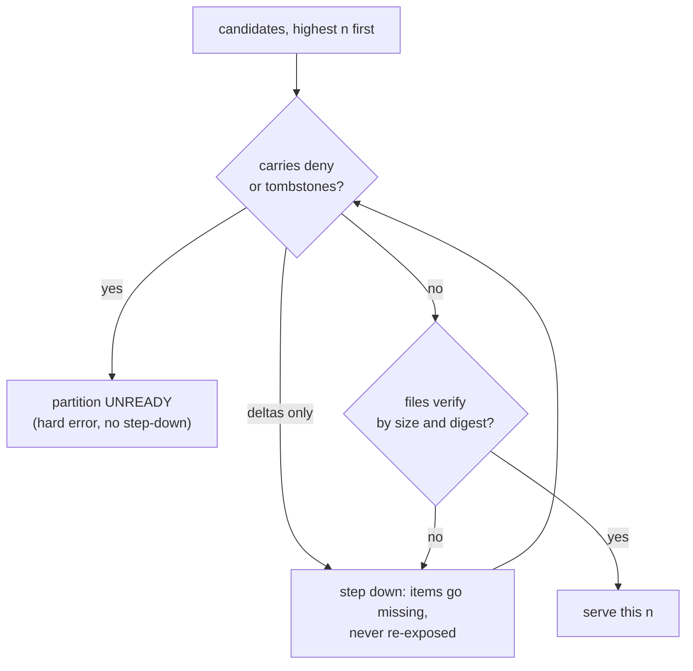

# Tessera — Contracts Specification

**Status:** Draft r23 — the per-item column tail becomes real (r22) and complete (r23): §2.2's `declared_scalars` gains `vocabulary` and a required `vocabularies` table, and §2.6's tail admits the full core type set — boolean, the four unsigned and four signed integer widths, both floats, microsecond timestamps and utf8. **Both revisions add fields** (Appendix R), unlike r20 and r21, which added none
**Owns:** the byte- and schema-level definition of the boundaries named in the system architecture §4: the bundle format, the service API, the plugin ABI and the wire format. `§n` refers to the design (r30); `SA §n` to the system architecture (r10). **Precedence:** the design is the specification and this document defers to it; the eleven recorded deviations in §0.3 govern where this document and the *system architecture* differ, and are proposed back to it. Deviations 6 and 8 have a design companion already applied at the design's r21, so they record an alignment rather than an outstanding proposal.

---

## 0. Principles

### 0.1 A contract exists only where a second reader exists

The readers are: the Python reference oracle (which must parse bundles independently — it is the differential check on the engine), a future engine version (upgrades roll forward over old bundles), the conformance suite, and an auditor. Everything with exactly one reader-writer — the WAL, mask-fragment caches and frozen mirrors, derived tile tables and candidate lists, the allocator journal, the router/worker protocol, in-memory anything — is **out of contract** and may change without notice. We specify interchange, not implementation.

### 0.2 Adopt published formats; invent nothing with an existing spec

Columns are Arrow IPC files, unmodified. Postings, tombstones and membership bitmaps use the portable Roaring format (the cross-implementation `RoaringFormatSpec`), which `pyroaring` reads directly. Manifests are JSON. Exactly **one** bespoke binary layout with a header exists — the permutation (2.6). The other two bespoke files, `morton.u32` (2.6) and `entities/ext-locator.u32` (2.4, *r6*), are headerless raw `u32` arrays whose length and meaning come entirely from the manifest, so there is no layout to specify beyond "a `u32` array" *(r6; the sentence previously said "exactly one bespoke binary layout", which `morton.u32` already strained and the locator would have contradicted)*.

### 0.3 Recorded deviations from the source documents

Each proposed back to its source; until applied there, this list is the record:

1. **Portable Roaring in the bundle, not frozen** (was SA §4.1). Frozen is CRoaring-internal — a weak oracle and audit story; portable is publicly specified. The engine builds frozen mirrors under its local cache at sync time (out of contract); §10.4's frozen-view mask loading is untouched.
2. **The inverse permutation is not stored** (was §5.1 "plus its inverse", SA §4.1). Storing it twice adds a consistency obligation with no reader. *(Mechanism superseded by deviation 6, annotated here 2026-07-30 because a reader meeting this entry first would take a stale one. As written, row→entity was "the `entity_id` column of `columns.arrow`" — the column deviation 6 removes. Row→entity is now the **inverse of the keyed `tessera_id` bijection** at the row (§2.6): a pure function, no file, no map, no I/O. **The deviation itself is unaffected and strengthened** — the inverse permutation was never stored, and after r6 it is not stored anywhere. The design's companion correction is its r22 §5.1.)*
3. **`tiles.bin` and `candidates.bin` are out of contract** (was SA §4.1). Both are derivable — tile ranges by binary search over `morton.u32`, candidate lists from the priority column — and I7 guarantees the exact fallback, so they are engine-local derived caches, exactly like the frozen mirrors.
4. **Side-manifests are per partition** (refines SA §4.1's prefix-level `SEGMENTS-<n>.json`). Workers flush independently and hold their own watermarks (SA §6.3–6.4); a prefix-global side-manifest would need a coordinating writer and would put entity-ID tombstones outside their compartment. The stamp is a vector of per-partition *(n, watermark)*, which is what SA §4.2 already says it is.
5. **`morton.u32`, not `morton.u64`** *(r5; was §10.3's "sorted `morton.u64` column")*. The stored Morton column is a raw `u32` array and the file is renamed to match. The width is a property of the **grid** — §5.2 fixes it at 2¹⁶ × 2¹⁶ — not of the population, so it does not change at 10¹⁰ or 10¹¹; it constrains only future grid depth beyond 16, which nothing currently wants. `bundle_format` stays at **1**: format 1 has never been published (Phase 1 is its only writer), and the *rename* is what makes any pre-existing bundle fail closed — `open_bundle` verifies each named file against the manifest's file map, so a missing `morton.u32` is a typed error, never a half-width read. Saves 4 GB at 10⁹ at zero decode cost. Source: the drawn-mark budget spec §2.
6. **`columns.arrow` carries `tessera_id`, not `entity_id`** *(r6)*. The row→entity direction (deviation 2) becomes the row→**wire identity** direction: the identity the service shows is stored at the row it is shown from, so internal→external needs no lookup, and external→internal needs none either because `tessera_id` is an invertible keyed permutation of `(shard_id, entity_id)` (§2.6). It is width-neutral against the `entity_id: uint64` it replaces. Entity IDs are thereby absent from every request-path artifact except `permutation.bin`'s *index*, which strengthens **I10** in substance while changing its mechanism (design r21). Source: owner decision 2026-07-29.
7. **`node_id` is removed from `columns.arrow`** *(r6)*. §2.6's `node_id: uint32` had no reader: clustering is Phase 3, and the build wrote a billion identical `0xFFFFFFFF` sentinels — 4 GB of a file that is read per viewport. Phase 3's node table (§2.9) re-adds a row→node column as an additive change when it acquires a reader; nothing about that reservation requires the column to exist empty meanwhile.
8. **Per-session point handles are retired from the viewer plane** *(r6)*. §5's "every identity on the viewer plane is a per-session `u32` handle" becomes `tessera_id`. Handles remain the mechanism for Phase 3 **node** handles, where the identity genuinely is per-session. A point's is not: a stable identifier is what lets a client bookmark, share and reconcile a point across sessions, and the handle bought nothing that `tessera_id`'s opacity does not (design r21, C6 as revised).
9. **External-ID resolution is a per-extent lazy sidecar, not a hot-path structure** *(r6)*. `entities/external-ids-<k>.arrow` narrows `entity_id` to `uint32` (§1's `< 2³²` bound) and gains a companion `entities/ext-locator.u32` for the drill-down direction. Both are **exempt from the §2.3 reader protocol's readiness gate**: an extent is digest- and sortedness-verified on **its own** first use, never at open, and an extent that is never resolved against is never mapped. Rationale: at 10⁹ the eager scan of 18.9 GB of extents at open put the whole family in the resident set for a path that never reads it. **There is no `tessera_id → entity` sidecar** — inversion is a pure function.

10. **The `/v1/viewport` sub-cell stream is appended, and `api_version` stays at 1** *(r7)*. Design §7.3's density underlay adds a third Arrow IPC stream to the response body. It is *appended* rather than length-prefixed alongside the others, and a request that does not ask for it produces **zero** trailing bytes — so such a body is byte-for-byte what r6 produced, and every existing reader decodes it unchanged (§5). `served` on the *tiles* batch is likewise appended last (§3.2). Both are additive under §1's rule. **The change that would have warranted a bump is `k`'s semantics**, which moves from "at most `k` points per tile" to design §7.2's cap clause; it is recorded here rather than versioned because `api_version = 1` has no published reader outside this repository — the same no-published-reader argument deviation 5 rests on — and because the field's *type and range* are unchanged, so no decoder breaks. A deployment that has published an API must bump instead. Source: owner decisions 2026-07-30.

    *Extended, not re-argued:* the points batch's `x`/`y` `float32` pair becoming a single `code: uint64` (§3.2) is **not** additive — it removes columns — and it too keeps `api_version = 1`, on this deviation's own no-published-reader argument, which contracts r13 has already applied to a breaking change on that basis. The exit condition is inherited unchanged: a deployment that has published an API must bump.

11. **`Retry-After` is required on every 429; the value `1` is the compute-admission gate's, not the code's** *(r10; refines this document's own §3.1 rather than a source document, and is recorded here because §3.1's parenthetical read as global to every implementer who met it)*. r7's amendment wrote "`Retry-After: 1`, fixed" inside a parenthetical whose subject was the concurrency workstream's two-stage gate, on a table row whose *subject list opens with ingest* — so the sentence could be read as pinning the number for both. It does not. **The requirement is the header plus an agreeing body `retry_after_s`; the number is per-subject.** The gate's fixed 1 rests on its own argument — admission clears in milliseconds and a knob there would only let an operator misreport it. The **write queue** drains at fsync timescale under a commit window, so its honest figure comes from queue depth and observed drain rate, and a caller that retries at 1 s against a queue draining in 30 s manufactures exactly the load the 429 exists to shed. Two consequences, both deliberate: a client must **read** `Retry-After` rather than assume 1, which §3.1 already required of it; and the two producers stay distinct types in an implementation, so a future 429 subject cannot silently inherit a number that was never argued for it. Source: Task 3b's reading (2026-08-01), taken at implementation and ratified here; owner decision, 2026-08-01.

### 0.4 Phase-marked, not speculative

Sections carry the phase that first consumes them. **Phase 1's conformance burden is: `CURRENT`, `MANIFEST.json`, one per-partition `SEGMENTS-0.json`, base postings, pairs, dictionary, columns, morton, permutation, and the external-ID sidecar.**

The sidecar joined that list when `columns.arrow` stopped storing coordinates (§2.6). The oracle's geometry now comes from the points file the build consumed, and reaching it from a row is `row → entity_id` (permutation) `→ external_id` (sidecar) `→ source row` — so every geometry differential depends on `entities/external-ids-<k>.arrow`, and a bundle built without it cannot be checked that way at all. Minting external IDs stays **opt-in** for a deployment (§2.4 forbids manufacturing one for an item whose caller supplied none); it is mandatory for a bundle the conformance suite is run against. The delta/tombstone/deny machinery (2.4, 2.8) is exercised when streaming ingest lands; labels (2.9) at Phase 3; text and vectors (2.10) at Phase 4. All are specified now only because the side-manifest schema must anticipate them or change shape later.

## 1. Conventions

- All integers little-endian. IDs: entity `u32` in every fixed-width on-disk array and Arrow column *(r6; was `u64`. The `< 2³²` bound was always asserted for `bundle_format = 1`, the 4B-per-shard cap makes it exact, and the `tessera_id` bijection (§2.6) depends on it — the allocator refuses to issue an ID at or above `u32::MAX`; §16's exhaustion answer will bump the format)*, row `u32`, term `u32`, `tessera_id` `u64` (§2.6); node IDs and external IDs are caller-supplied (node IDs UTF-8 ≤ 256 bytes; external IDs byte strings **≤ 64 bytes** *(r6; was 256. Tightened because nothing in the format sized the sidecar for the old cap: at 10⁹ a 256-byte key costs over 250 GB of extents. 64 bytes covers a 36-character UUID string, a ULID, an ObjectId and ordinary business keys, and the contract is open exactly once — after a caller depends on longer keys, tightening is breaking)*. An over-length external ID is a **typed error at ingest and at build, never a truncation** — a truncated key is a different key, and two keys sharing a 64-byte prefix would collide into one entity — **and sidecar disk scales linearly with key length: the 10⁹ sizing in §2.4 assumes short keys, and a deployment near the cap pays proportionally**). **One recorded exception to the narrowing:** `terms/pairs.parquet` (§2.4) keeps `entity_id: uint64`. It is `DELTA_BINARY_PACKED`, so the declared width costs almost nothing on disk, and it is read only by build machinery and the DuckDB oracle — never on a request path, and never mmap'd as a fixed-width array. Narrowing it is available and deferred; it is not a contradiction once stated.
- JSON: UTF-8, unknown fields ignored by readers, absent optional fields take documented defaults.
- Three contract versions, each a single integer, all currently **1**: `bundle_format`, `api_version`, `abi_version`. They version independently because their reader populations do (bundles outlive engines; plugins are third-party; clients are external). Readers refuse anything newer; additive changes don't bump, removals and semantic changes do.
- Digests: SHA-256, hex in JSON. All manifest paths are prefix-relative, forward slashes.
- Every plane authenticates via `Authorization: Bearer <token-or-credential>`. Tokens and credentials never appear in URLs, query strings or logs.

## 2. The bundle format (`bundle_format = 1`)

### 2.1 Layout

```
bundle/
  CURRENT                       # JSON: {"prefix": "v00042", "manifest_digest": "<hex>"}
  v00042/
    MANIFEST.json
    dictionary/terms-<k>.dict   # the build's extents. ONE namespace, bundle-level (SA D11),
                                # never per partition — but not one directory: a promoting
                                # flush and a coalesce write theirs beside their own output,
                                # and `dict_extents` lists every extent in ordinal order (2.4)
    partitions/<phash>/
      SEGMENTS-<n>.json         # per-partition side-manifests; n decimal — see the
                                # unpadded; see the filename-grammar note below
      terms/postings.arrow      # CSR: one tagged record per term (2.4)
      terms/pairs.parquet       # r4; was pairs.arrow — see 2.4
      entities/external-ids-<k>.arrow   # caller external id -> entity, byte-sorted;
                                        # sidecar, per-extent lazy (0.3 dev 9)
      entities/ext-locator.u32          # entity -> ordinal in the above; drill-down.
                                        # ONE file, not one per extent: it is indexed
                                        # by the global entity id, so a per-extent
                                        # family would be N full-length copies
      entities/nodes/…          # Phase 3 (2.9)
      entities/labels/…         # Phase 3 (2.9)
      entities/vocab/…          # Phase 3 (2.9)
      coalesced/<id>/           # the entity-space coalesce's output (2.4), any subset of:
        delta.arrow             #   the coalesced postings tier — beside no segment, which
                                #   is why `deltas` names paths (2.3, r18)
        external-ids.arrow      #   the coalesced run, with its locator extent beside it
        ext-locator.u32
        terms-0.dict            #   the coalesced dictionary extent
      slices/<slice_id>/
        permutation.bin
        segments/<seg_id>/      # the build's one segment, plus flush and merge segments
          columns.arrow
          morton.u32
          delta.arrow            # flush segments only: that flush's postings tier (2.4;
                                 # r15 — supersedes the terms/deltas-<n>.arrow name, which
                                 # nothing ever wrote). A merge writes none: the consumed
                                 # segments' tiers stay listed, their entities still having
                                 # rows in the merged segment
          external-ids.arrow     # flush and merge segments: that segment's run (2.4)
          ext-locator.u32        # flush and merge segments: run-local locator extent (2.4)
          terms-0.dict           # only a flush that promotes a novel descriptor (2.4)
      text/…                    # Phase 4 (2.10)
      vectors/…                 # Phase 4 (2.10)
```

`<phash>` is `"default"` for the empty required set, else the hex SHA-256 over the partition's required descriptors, each encoded as `u32 length ‖ bytes`, sorted bytewise, concatenated. `CURRENT` is the only mutable file, replaced atomically (write-then-rename locally; conditional put on object stores). Every other file is immutable; the prefix grows only by whole new files named in a newer side-manifest. `<slice_id>` and `<seg_id>` are opaque; identity and order come from manifests, never filename lexicography. A `seg_id`, once used, is **never reused** — across flushes, merges, compactions or prefixes (merge-abandonment identity checks and delta provenance both depend on it). A `coalesced/<id>` directory name carries the same rule for the same reason: two passes writing one path would truncate files the first has mapped.

**`n` is unpadded decimal** — `SEGMENTS-0.json`, `SEGMENTS-11.json`. A leading zero is not a
valid name and a reader must **refuse** such a candidate rather than parse it.

The refusal matters more than the grammar. Filename lexicography is never load-bearing here —
identity and order come from manifests — so padding buys nothing, and a width cap on `n` would be
a future format break, since `n` is monotone and never resets across prefixes. What padding did
buy, before this ruling, was a silent failure: an earlier revision specified `n` as zero-padded,
the writer emitted unpadded, and the reader parsed any decimal but then reconstructed the
*unpadded* name to read from. A padded manifest was therefore discovered and then read from an
absent path — stepped silently past by §2.3, carrying the reader past a manifest that may hold a
`deny` list.

Refusing a non-canonical name converts that step-past into a loud error. Parsing leniently and
reconstructing canonically is the combination that hides it.

> **⊘ The refusal is specified, not implemented.** The reader still parses a padded name and then
> fails to open it, which is the silent path. Until it refuses, a padded manifest is indistinguishable
> from an absent one. Nothing writes padded names today, so no live deployment is exposed.


**One base segment per (partition, slice) at build.** `tessera build` and every compaction emit exactly one **base** segment per partition-slice — a build *is* a full compaction — plus, for a compaction, whatever extents were published during its flight. Additional segments exist only between compactions: appended by streaming flushes, and collapsed by **merge**, which replaces a window of them with one merged segment through the same segment writer (write-path §7). This is what makes the slice-level `permutation.bin`'s single-segment addressing (2.6) sufficient: it addresses the base, and every other segment is an extent carrying its own.

*(r20, narrowing r16 and earlier, which said "exactly one segment per partition-slice" flat. **A compaction that never blocks flush cannot emit one.** A fold runs for minutes to hours over the whole corpus, flushes publish into the old prefix throughout, and those segments are carried forward at the flip — so a fold ends with one base segment plus a tick's worth of extents, and the only way to make the old sentence true would be to block ingest for the fold's duration, which `compaction.md` §1 and decision 0043 both forbid. The property the sentence protected is unharmed: carried-forward segments are extents addressed exactly as flush segments already are between compactions, so nothing about the permutation's sufficiency changes. Owner ruling, 2026-08-06; decision 0051.)* *(r16, correcting r6: a **streamed** segment carries **no permutation file**. r6 specified one; the built flush deliberately writes none — the extent's bounds ride the side-manifest's `segments` entry, and its row map is rebuilt at open from the segment's own `tessera_id` column by inverting the identity key, a per-segment permutation file sized to the bundle's entity space being the wrong shape for a few thousand ids at the top of it. Compaction still folds everything back into one **base** segment and one fresh slice-level permutation — everything, that is, except the extents its own flight published, which stay extents; see the r20 note above.)*

### 2.2 MANIFEST.json

| Field | Type | Meaning |
|---|---|---|
| `bundle_format` | int | this spec's version |
| `created_at` | RFC 3339 | provenance |
| `data_plugin_hash` | hex | hash of the **data module** (4.1); serving refuses on mismatch |
| `declared_bounds` | object | plugin bounds, verbatim (§6.1) |
| `declared_scalars` | array | `[{name, arrow_type, vocabulary?}]` — the caller's per-item columns, compiled from the build's `schema.toml` *(r22)*. **Order is significant and is the schema's declaration order**: the tail is stored and read back positionally, so reordering this array reorders the columns of every segment built after it. `arrow_type` is one of `bool`, `u8`, `u16`, `u32`, `u64`, `i8`, `i16`, `i32`, `i64`, `f32`, `f64`, `timestamp_us`, `utf8` *(r23)*; `timestamp_us` stores as an `i64` of microseconds since the epoch and exists so the unit is a fact a reader can check rather than a convention; `vocabulary` names a `vocabularies` entry for a category column and is absent for a plain one. Ingest validates against it — a batch column this array does not declare, a declared column the batch omits, and a declared column at the wrong arrow type are each `422` naming the column, refusals rather than the silent drop that shifted every later scalar by one — and the read path widens the points schema from it. **Residual:** a category column is validated at its *width*, so an unassigned or `reserved` code is an ordinary integer and is stored unremarked; the row then carries a code no key explains. Checking meaning needs the key rather than the code ([#82](https://github.com/jennis0/tessera-index/issues/82)). A hand-written manifest declaring a scalar the columns do not carry remains unguarded |
| `vocabularies` | array | `[{name, listing, values: [{key, code, label?}], reserved: [int]}]` — the value sets `declared_scalars`' category columns draw their codes from *(r22)*. **Required**, empty when no category is declared; a manifest omitting it is malformed rather than category-free, and the case that matters — rows carrying codes whose bindings went missing — would otherwise open and serve marks that decode to nothing. **This is the durable mapping, and nothing re-derives it**: `columns.arrow` stores the code, not the key, so a build that re-derived codes from a re-supplied vocabulary file would recolour the whole corpus with no error and no digest mismatch. Code `0` is the reserved *absent* sentinel and is never assigned. `reserved` holds retired codes, never reassigned. `listing` is `per_viewer` or `public`; **⊘ recorded, not enforced** — no endpoint publishes a vocabulary, so it currently gates nothing |
| `small_term_threshold` | int | cardinality at or below which a posting is stored as a sorted array rather than Roaring (2.4); default 32 pending Phase 1 calibration |
| `quantisation` | object | `{x_min, x_max, y_min, y_max}` (f64) — see 2.5 |
| `entity_id_high_water` | u64 | first unallocated entity ID at build; seeds the allocator. A JSON counter value, not an entity-space array, so §1's `u32` narrowing does not apply to its declared width; the allocator nonetheless refuses a seed at or above `u32::MAX` (§2.6) |
| `identity` | object | `{construction, rounds, key, shard_id, idset}` — the `tessera_id` permutation (§2.6). **Required**; absent is a typed reader error, not a default. `key` is **exactly 32 lowercase hex characters**, per *deployment*, carried across rebuilds; any other case is rejected rather than folded, so MANIFEST has one canonical form under its digest, and degenerate keys (`k1 == 0`, all-zero) are refused at write, and at read by the engine. **⊘ Partially implemented — which reader rejects matters.** Both checks live in one place, the key parser, and it is reached from `tessera build`'s verify pass and from the engine's open. The **store's** `open_bundle` — the entry point §2.3's reader protocol actually names — validates only the descriptor's `construction`, `rounds` and `idset != 0`, and never parses the key, so a bundle carrying an uppercase or degenerate key opens through it without complaint. A reader that wants the guarantee must go through the engine, or parse the key itself. `idset` is a `u32` advanced whenever the partitioning or sharding changes — see the transport-identity note below. **The key's home outside the bundle is a per-deployment configuration file named explicitly on the command line** (`tessera build --id-key-file <path>`), so a deployment rebuilt from source keeps its lineage; there is **no default search path and no environment variable**, and a build given none of `--carry-id-key-from` / `--id-key-file` / `--id-key` / `--mint-id-key` **refuses before doing any work**. The file's wider schema is not specified here |
| `slices` | array | `[{id, display_name}]` |
| `partitions` | array | `[{phash, required_terms: [hex…]}]`; exactly one `"default"` entry |
| `provenance` | object | free-form; includes the recorded §7.8 generating-set choice |
| `files` | object | path → `{size, sha256}` for every build-time file |

**`tessera_id` is a transport identifier, not a durable key** *(r6)*. It is stable across rebuilds — that is what carrying `identity.key` forward buys — and it is **not** stable across a repartitioning or a reshard, because the permutation's input encodes placement and §12.5's reindex moves points. The churn is **partial**, which is why a signal is required rather than merely useful: without one, an identifier that named a moved point does not fail, it silently names whichever entity now occupies that input. `identity.idset` is that signal. It is carried forward verbatim by a normal rebuild and **must be advanced — never reset — by any build whose partitioning, sharding or identity key differs from the bundle it carried from** (refuse otherwise). **Monotone, and that is load-bearing** *(r-this)*: an earlier revision had a key rotation *reset* it to 1, which defeats both consumers of the signal — `1 → rotate → 1` is indistinguishable from no rotation at all, so decision 0025's `/v1/meta` poll cannot see it and `/control/changes`' tessera-address guard cannot refuse a list gathered before it. A rotation build that cannot prove the prior idset therefore refuses, exactly as a repartitioning build without lineage already must. `GET /meta` reports it as `idset`; `POST /v1/items/{tessera_id}` accepts an optional `idset` and answers `409 conflict` — *"stale idset; re-resolve by external_id"* — when it does not match. **Optional rather than required, deliberately:** the durable identifier is `external_id`, so a consumer following this contract has no stale `tessera_id` to present; and rotation and repartitioning are deliberate breaking changes rather than scheduled hygiene, so the idset advances approximately never and requiring it would put friction on every drill-down forever to guard a once-in-a-deployment event. A client that omits it accepts that after a repartitioning a stale identifier may name a different item. That branch is entity-independent, taken before inversion and identical for every identifier, so it opens no channel (design Appendix C, C4).

**Consumers persist `external_id`** (§1, SA D14) and treat `tessera_id` as valid only for the idset it was issued under.

### 2.3 Per-partition SEGMENTS-\<n\>.json

Each is **complete** for its partition — full current state, not a diff — so a reader needs one per partition. Written by that partition's worker only, after every file it names is durable. `n` is per-partition, monotone, and **never resets across prefixes** (compaction carries the counter forward), so delta directory names never collide.

| Field | Type | Meaning |
|---|---|---|
| `watermark` | u64 | entity high-water this partition's postings cover (§11.2) |
| `entity_id_high_water` | u64 | allocator high-water as of this version |
| `segments` | array | `[{slice, seg_id, row_count, entity_lo, entity_hi}]` in serving order |
| `deltas` | array | live delta postings tier **paths**, prefix-relative, in serving order *(r18; was the manifest sequence number each tier arrived at, with paths derived from `segments`)*. Every path must be digested in this map's `files` or MANIFEST's, or the reader refuses the bundle rather than serving unverified postings. **A tier need not sit beside a segment**: an entity-space coalesce produces one covering several segments' entities, which the old derivation could not name |
| `dict_extents` | array | `[{path, records}]` — the bundle-level dictionary extents this partition's term IDs require, ordinal order. Extents are immutable and shared: several partitions listing the same extent carry identical digests, so verification never conflicts. **Positional, in listed order, and never reordered**: a term's ordinal is its position in the concatenation of these files, so the list is append-only and a contiguous run may be coalesced in place but never permuted. **No descriptor may appear twice across the list** — a repeat shifts every ordinal after it, and a reader is entitled to skip it, so the two readings of the same bundle would disagree about what a posting means. Both are format rules, not implementation details; `flush::promote` resolves against the live dictionary before interning to keep the first, and `Dict::load` skips a repeat to keep the second |
| `external_id_runs` | array | run paths, oldest first. Each run is internally sorted; runs are **not** ordered against one another *by key* (§2.4). **List position is recency, and that is load-bearing**: §2.4 resolves newest-run-first, so a merge or a coalesce replacing several runs with one must take a **contiguous** window and land the replacement in the window's own position — a run at a recency position it did not earn answers a stale binding |
| `tombstones` | array | deleted entity IDs, ascending (this partition's only — isolation holds; folded away at compaction, **⊘ unbuilt — today the list only grows**) |
| `deny` | array | `[{entity_id, cause: "suppress"}]` — the current suppression set. **Publication rule:** any accepted deny-disposition change (delete, suppress, unsuppress) triggers publication of a new side-manifest at the close of the deny drain — never deferred to the next flush, with a liveness floor under sustained arrival — because a syncing replica must never reconstruct a state in which a suppressed item is visible (SA §6.2's fail-open, at the interchange layer). `unsuppress` removes the entry in the manifest its own drain publishes |
| `files` | object | path → `{size, sha256}` for files added since MANIFEST |

Entity IDs appear here only inside their own partition's directory; `entity_lo`/`entity_hi` and high-waters are counter values, not item data (SA §6.6's argument). The stamp is the vector of per-partition *(prefix, n, watermark)*; single-partition deployments have a vector of one. The `watermark` component is **advisory** (status and debugging): I1 composition always uses the watermark of the mask fragment actually loaded. The stamp as a whole is advisory too — see §3.1 — and it never fixes authorisation state (lifecycle design §2.4).

**All three state fields are written and honoured** *(r15; `HONOURED_STATE` carries `deltas`, `deny` and `tombstones`, each landed with the code that acts on it)*. The two deny fields are serialised from the live overlay at **every** manifest write — a flush's and an overlay publication's alike — and never carried forward from the manifest being extended, which is what makes an unsuppress reach disc rather than a stale list republishing itself for ever. The reader seeds its overlay from them at open **before** WAL replay, and replay runs over that seed: every record postdates any state an honourable manifest carries, so a durable, acked unsuppress wins over the older manifest's suppression — the order is load-bearing, since seeding after replay would silently reinstate a retired suppression. `deltas` is honoured by the loader, which opens exactly the tiers it names and refuses a bundle naming one no `files` map digests.

**`n` is the manifest sequence number and lives in the filename alone.** This table carried a `segments_version` field defined as `= n`; it is deleted. It was redundant, the reader takes `n` from the filename, and its name collided with the *geometry* version — the counter identifying a segment set, which a row-projection cache key rotates on and which must **not** advance when a manifest is written for deny state alone. `n` therefore advances faster than the geometry version. A reader that carries the field forward from an older bundle is not wrong to; the type ignores unknown fields, so both shapes open.

**Reader protocol.** Read `CURRENT` → fetch and digest-check `MANIFEST.json` → check `bundle_format` → per partition, walk `SEGMENTS-<n>.json` candidates highest-`n` first and take the first that is both **honourable** and **verifying**; a candidate whose listed `files` (or the MANIFEST `files` set) fail by size or digest is stepped past.



*Per-partition candidate selection. The honourability branch is taken before the digest branch, deliberately.*

**The honourability check runs before file verification, deliberately.** A `SEGMENTS-<n>.json` carries no digest of its own — only the files it *names* are verified — so its `deny` list is exactly as trustworthy whether or not those files check out. The most likely way to meet a deny-carrying manifest whose files fail is a mid-sync replica that has the new manifest and not yet its data, and verifying first would step that case down and re-expose the suppressed item. "Verify the bytes before interpreting them" is the right instinct everywhere else in this loop and is wrong here.

**The two dispositions do not collapse into one.** A manifest carrying only `deltas` is stepped past: items are *missing*, never re-exposed, and the availability argument for a mid-sync replica holds. A manifest carrying `tombstones` or `deny` makes the partition **unready** — stepping down would serve an older manifest that predates the deny, undoing an accepted suppression indefinitely with no operator signal. The step-down's safety rests on every intervening candidate being read and classified rather than skipped; a reader that examines only the top few candidates lets a deny-carrying manifest pass unseen, which is the same fail-open from the other end.

> **⊘ Three residuals, none closed.** A deny-carrying manifest is still stepped past whenever the
> walk cannot tell that it carries one — when it does not **parse**, when it cannot be **read** (an
> I/O or permission fault), or when it is present under a **non-canonical name**. All three are the
> same shape, and none should be closed by guessing: an ordinary torn write must not become a hard
> partition failure, and a manifest whose bytes are unavailable tells the reader nothing about what
> it held. **The bound on all three is time, and that bound does not exist** — it is §2.3's
> freshness gate, which is itself unbuilt, so a replica in this state serves the older manifest
> indefinitely with no operator signal.
>
> **The deny writer has shipped and the freshness gate has not**, which an earlier revision of this
> paragraph said must not happen. The condition it was protecting is narrower than the rule it
> stated: all three residuals require a **replica** — a reader seeded from someone else's manifests
> — and this deployment has one node, which replays its own WAL and treats the manifest as a seed
> that replay overrides. What the gate bounds is how long a *badly synced replica* may serve a
> stale manifest, and there is no replication. It ships with replication (owner ruling, 2026-08-03,
> `docs/evidence/memos/2026-08-03-deny-lifecycle-design.md` §4), and until then the residual is
> recorded rather than closed.

Readiness requires a verifying manifest per partition **and** a freshness gate: `readyz` fails if the newest verifying `n` is older than the deployment's configured lag bound — unbounded step-down would let a badly synced replica serve long-deleted items as live.

> **⊘ Specified, not implemented — the freshness gate.** Step-down itself is built, with the disposition split above. Its *time bound* is not: no lag bound is configured, nothing compares `n` against one, and the signal that a partition stepped down is carried to the readiness predicate and then read by nothing. A replica in a stepped-down state therefore serves the older manifest **indefinitely**. What makes that tolerable is no longer that nothing writes `deny` — something does — but that nothing *replicates*: the one reader of these manifests is the node that wrote them, and it replays its own WAL over them. The gate becomes load-bearing the moment a second node reads a first node's manifests, and ships with it. Two consequences the reader must not assume away: readiness is not a freshness statement, and this is the gate that would have bounded the filename disagreement in §2.1 — a writer whose manifests this reader cannot find is indistinguishable, today, from a writer that has published nothing.


### 2.4 Postings, deltas, pairs, dictionary, external IDs

- `terms/postings.arrow` — the base tier, one Arrow IPC file: a single `large_binary` column whose row ordinal is the term ID, so Arrow's offsets buffer *is* the CSR index and no bespoke index format exists. Each record is one tagged posting: `u8 tag` then payload — tag 0 = sorted `u32` entity array (terms at or below `small_term_threshold`), tag 1 = portable Roaring. The split is load-bearing, not tuning: at dictionary scale a third of terms are singletons, and per-term Roaring overhead alone would exceed the entire term-index budget (probes, results §4.3). Per-term *files* are ruled out for the same reason — a hundred million inodes is not a format.
- `…/slices/<slice_id>/segments/<seg_id>/delta.arrow` *(r15; was `terms/deltas-<n>.arrow`, a name nothing ever wrote — the tier lives beside the segment whose entities it covers)* — one sparse tier per **flush segment**: `(term_id: uint32, posting: large_binary)` with the same tagged records, covering exactly that segment's flushed entities. Named in the side-manifest's `files` map and in its `deltas` field *(r18 — named, no longer counted)*; a fragment build unions base ∪ every live tier. Deny state is **not** a postings subtraction: a deleted entity's postings stand until the compaction fold (⊘ unbuilt), and its invisibility is the overlay's, seeded from `tombstones`/`deny` (2.3). Merge coalesces tiers as a content-preserving re-encode — a coalesced tier lives under `…/coalesced/<id>/` rather than beside any one segment, which is why `deltas` names paths *(r18)*; only the fold retires them.
- `terms/pairs.parquet` *(r4; was `pairs.arrow`)* — **Parquet**, `(entity_id: uint64, term_id: uint32)`, sorted by term then entity, `DELTA_BINARY_PACKED` (measured 3.8× smaller, 3× faster to read — figures that were always Parquet's: r3 specified Arrow IPC carrying a Parquet-only encoding, an internal inconsistency this revision resolves in Parquet's favour). The uncompressed-mmap rule (design §10.3) protects request paths, and this file sits on neither; DuckDB and pyarrow read Parquet natively, so both contracted readers are served. ~15 GB → ~6 GB at 10⁹. **Read at build cadence and by the oracle only — never on the authorise path**: Phase 0 measurement reassigned the join to build machinery, with the postings union as the authorise formulation (probes, results §4.1). **Optional for a serving deployment, required for a conformance run** (design §6.3): this file is the other side of the **I1** mask differential — `reference/oracle/mask.py` derives a viewer's authorised set from it by direct scan while the engine derives the same set from `postings.arrow`, and agreement is the test. A bundle built without it serves correctly and cannot be checked, so a deployment that intends to run the suite against the bundle it ships must emit it.
- `dictionary/terms-<k>.dict` — bundle-level (one interning namespace — SA D11); immutable extents of `u32 length ‖ descriptor bytes` records; a descriptor's `term_id` is its ordinal across the concatenation in extent order. Extents, not appends: no file ever changes after a manifest names it, so verification needs no special case. New extents are written at flush — by the namespace owner (the router) in the multi-node shape, by the single write executor as built — and referenced by path and digest. **The plural is real, and the extents do not all live in this directory** *(r19)*: the build writes `dictionary/terms-0.dict`; a flush that promotes a novel descriptor writes its extent beside its own segment as `…/segments/<seg_id>/terms-0.dict` (write-path §4.3); and a coalesce replaces a contiguous window of extents with one under `…/coalesced/<id>/terms-0.dict` (write-path §7). Location is the writer's, as it is for runs and tiers — `dict_extents` carries the paths, and it is that list's order, never the directory's, that fixes an ordinal. Every writer fills §2.3's per-extent `records` with **its own** extent's count; the build's entry reads as the corpus total only because a bundle straight out of `tessera build` has one extent.
- `entities/external-ids-<k>.arrow` — Arrow IPC `(external_id: binary, entity_id: uint32)` *(r6; was `uint64`)*, sorted bytewise **within each run**; run 0 at build, one per flush after, and one per merge or coalesce in place of the contiguous window of runs it consumed. *(r15 — a flush's run lives beside its segment as `…/segments/<seg_id>/external-ids.arrow`, with a run-local `ext-locator.u32` extent beside it; `external_id_runs` carries **paths**, so location is the writer's, and only the build's run 0 uses this directory.)* The caller-supplied namespace (§1, SA D14), addressing `/control/changes` past WAL retention and `/control/ingest`'s duplicate check. **These are *runs*, not extents, and the distinction is the whole of this entry** *(r24)*: a run is keyed by data the caller supplied, so nothing can order two runs against each other — a flush appends whatever keys it was given, and they interleave with the build's. An earlier revision required them to be "sorted across extents in listed order" *and* to arrive one per flush, which cannot both hold; the reader enforced the first half and would have refused the arrangement the second half prescribes. **Sidecar (§0.3 deviation 9):** a reader binary-searches **every run whose own first/last key could contain the target, newest run first** *(r17)*, selected by an O(runs) first-key/last-key scan that maps nothing, and verifies each opened run's MANIFEST digest and its own internal sortedness at that point. Newest-first is load-bearing, not an optimisation: delete + re-ingest re-binds an external id (decision 0047), so a key may appear in several runs and the newest binding is the live one; a merge or a coalesce keeps the newest binding for a colliding key, so the replacement answers exactly as the runs it replaced did. The bound on the number of runs is the **entity-space coalesce** (write-path §7), with a merge collapsing its own consumed segments' runs as it goes — exactly as merge is the bound for segments; without it this scan grows without limit on the ingest duplicate-check path. Nothing is mapped, scanned or verified at open, and `readyz` does not require it.
- `entities/ext-locator.u32` *(r6)* — **one** raw `u32` array, no header, no `<k>` suffix, length `entity_id_high_water` at build, indexed by entity ID, giving that entity's ordinal in the external-ID runs concatenated **in listed order** (the concatenation is not itself one sorted sequence — see above, and note the ordinal never needed it to be); `0xFFFFFFFF` for an entity with no caller external ID. This is the **drill-down** direction (`entity → external_id`): `/v1/items` inverts `tessera_id` to an entity, indexes here, and reads that ordinal's key from the run it falls in. Held as a locator rather than a second entity-ordered copy of the keys because the keys already exist in sorted form — 4 B/row against 12, which at 10⁹ is 3.7 GiB against 11.2. It is **singular by necessity, not by convenience**: an entity ID says nothing about which run its key sorts into, so a per-run family would need a full-length array *per run* — 37 GiB at ten runs rather than 3.7. Same lazy read protocol. **Never emitted on the viewer plane except as the drill-down response's `external_id` field** — the conformance byte-scanner sweeps for external IDs in viewport payloads and logs (conformance design §4.3).
- **Entities ingested after the build have no locator slot and no extent entry** *(r6)*. The drill-down resolves them from the server's live external-ID map first and the locator second; an entity at or below the allocator high-water that neither accounts for is a **typed error**, not an absent external ID. Reading past the array and returning "no external ID" for an item that has one is a wrong answer wearing a legitimate state's clothes.
- **One identity, supplied or derived** *(r6)*. An item's identifier is the caller's `external_id` when the caller supplies one and its `tessera_id` when the caller does not — in which case the identifier is derived, costs nothing to store, and **has no row here**. This store is a *translation table* between two representations of one identity, not a store of identities: a deployment whose callers supply no external IDs writes no extents and no locator at all, and nothing in the build or the ingest path may manufacture an external ID for an item that has none. The `0xFFFFFFFF` locator sentinel is the ordinary case, not a missing value.
- **This store is TRANSITIONAL** *(r6)*. It is deliberately the simplest structure that satisfies its two callers, and it is a **placeholder for a future adopted per-point metadata store** — the same slot as §8.3's vector sidecar and the design's per-interaction routing row (§10.3), which that store would serve together. Extend the replacement rather than this. **Design Appendix D does not forbid that adoption:** it rejects adopting a search engine, vector database or relationship-based authorisation service **for the access-control layer**, where a wrong or stale answer is a disclosure. A cold metadata store read only *after* the visibility test has returned "visible" (§3.2) never participates in masking and is a different question. Whatever is adopted inherits three conditions unchanged: **fail-closed with typed errors — never a `None` or an "unavailable" that reads as "no external ID"**, since a wrong mapping suppresses the wrong item; **off the request path** (design §10.3), per interaction and never per mark; and **integrity verified before any answer leaves it**, whatever the local equivalent of the per-extent digest and sortedness check turns out to be.
- **Compression is deliberately not used here** *(r6)*. The `pairs.parquet` licence above — compression is permissible off the request path — would apply, and is declined twice over: the store is 18.6 GB of *disk*, never resident on the render path, so a block format, per-block digests and a decoder on an authorisation-adjacent path would buy disk for no latency gain; and it is machinery invested in a component scheduled for replacement. **The threshold at which that changes is stated rather than left to be discovered: once mean external-ID length exceeds ~16 bytes the store dominates the bundle** — at 10⁹ it is 14.9 GB for 8-byte keys, 22.4 for binary UUIDs, 41 for 36-character UUID strings and 67 at the §1 cap, against a locator that stays 3.7 GB throughout — **and at that point compression, or the replacement store, pays for itself.** Note which: dictionary or prefix encoding pays for long *human-readable* keys; **random UUIDs compress essentially not at all**, so a deployment that crosses the threshold on binary UUIDs is a candidate for the replacement, not for compression. The trigger is a **measured mean** for the deployment, never an assumption from the key type.

### 2.5 Quantisation and Morton codes

The contract, because the oracle must reproduce `morton.u32` byte-for-byte and clients name tiles. Grid: 2¹⁶ × 2¹⁶ (§5.2). Quantisation of coordinate *v* over `[min, max]` from MANIFEST:

```
cell(v)    = clamp( floor( (v − min) / (max − min) × 2¹⁶ ), 0, 2¹⁶ − 1 )
fixed32(v) = clamp( floor( (v − min) / (max − min) × 2³² ), 0, 2³² − 1 )
```

(both computed in f64, so `v = max` lands in the top cell; cells are half-open).

**A position is 32 bits per axis, and `fixed32` is a *widening* of `cell`, not a second quantiser.** `fixed32(v) >> 16 == cell(v)` exactly, including at both clamps — flooring and then shifting equals flooring at the coarser scale, and `2³² − 1` shifts to exactly `65535`. That identity is what makes the stored residual the remainder within *the* cell the point is in, rather than a separately rounded quantity that may land in a neighbouring one. It is pinned as precisely as `cell` because it must hold bit for bit across implementations: a scale of `2³² − 1`, or round-to-nearest in place of floor, disagrees with `cell` about which cell a coordinate belongs to for a large fraction of inputs, and nothing downstream re-quantises to notice.

Interleaving the two 32-bit axes gives a 64-bit **position code**, of which the high 32 bits are exactly `interleave(cell(x), cell(y))` — interleaving is bit-local, so the high half of the 64-bit form *is* the 32-bit form over the two high halves. The high half is stored in `morton.u32`; the low half is `columns.arrow`'s `residual` (§2.6); the whole is what the points batch carries as `code` (§3.2). Interleave: bit *i* of `cell(x)` occupies code bit 2*i*; bit *i* of `cell(y)` occupies code bit 2*i*+1 — matching the design's worked example (x=6, y=3 → 30). The 32-bit code is stored as a `u32` *(r5; was low-aligned in a `u64` with high bits zero — 4 GB of zeroes at 10⁹)*. A tile at depth *d* (0 ≤ d ≤ 16) is identified on the wire by its prefix value `code >> (32 − 2d)`; its row range in a segment is found by binary search over that segment's `morton.u32`. **A tile's code range is computed in `u64`** — at depth 0 the exclusive end is 2³², which no `u32` holds — and each stored code is widened for the comparison; narrowing the bounds instead overflows to an empty range.

### 2.6 `columns.arrow`, `morton.u32`, `permutation.bin`

`columns.arrow`: standard Arrow IPC file, uncompressed buffers (mmap-and-slice — §10.3), one record batch, **`(morton, tessera_id)`** order *(r6)*:

| Column | Type | Notes |
|---|---|---|
| `tessera_id` | uint64 | the row→wire-identity direction (deviations 2, 6) |
| `residual` | uint32 | the **low half of this row's 64-bit position code** (§2.5); the high half is the row's entry in `morton.u32`. **Not a sort key** — it varies arbitrarily within a cell |
| *declared scalars* | per MANIFEST | the tail, in `MANIFEST.declared_scalars` order — `boolean`, `uint8`, `uint16`, `uint32`, `uint64`, `int8`, `int16`, `int32`, `int64`, `float32`, `float64`, `timestamp[us]` or `utf8` *(r23)*. `boolean` is Arrow's bit-packed form, one bit per row, so it is the one column whose buffer is not `row_count` elements wide. Non-nullable like every column here (R4): a category's *absent* is code `0`, not a null, which is what lets the reader hand back flat slices with no validity bitmap. A column the manifest does not declare, or at a type it does not declare, is a typed error at open |

There is **no `priority` column** *(r16; decision 0046 — cut, having been written and unread at
query time since r7)*. The quantity survives as the high 16 bits of `tessera_id`, derived at one
definition site; a prefix-scan optimisation that ever measures its worth re-adds the column as an
additive change, the reader matching fixed columns by name. A three-column pre-r16 file is a
typed error at open.

**No coordinate is stored.** `residual` replaces the `x`/`y` `float32` pair: capacity rises from an `f32` mantissa's 24 bits to 32 bits per axis, `columns.arrow` falls from 18 to 14 B/row (12 after r16 cuts `priority`), and the cell code arrives beside the position for free. A position still costs 8 B/row, split across two files. **No `bundle_format` bump** — format 1 has never been published (deviation 5) — and that is safe in place only because the reader compares the fixed columns by name *and* type, so a bundle written before this change is a typed error at open rather than an `f32`'s bits read as a sub-cell position.

**`priority` is a prefix of the identity, and the sort order is `(morton, tessera_id)`** *(r6; supersedes r4's standalone priority function, which was an unkeyed `splitmix64` over the entity ID)*. `priority = (tessera_id >> 48) as u16` — a quantity, not a column (r16). There is **one** hash construction in this format, not two: the Feistel below, of whose output `priority` is the leading 16 bits.

`columns.arrow` is sorted by **`(morton, tessera_id)` ascending, with no further tiebreak**. `tessera_id` is a bijection over 2⁶⁴ and there is one row per entity, so the order is total; and because `priority` is a *prefix* of `tessera_id`, ordering by `(morton, priority, tessera_id)` is **identically** ordering by `(morton, tessera_id)`. An implementation may compare the prefix first as an optimisation. **The entity ID is not a sort key at any position.** The oracle re-derives row order as `(morton, FPE_k(shard_id ‖ entity_id))` with the code recomputed from the geometry the build consumed rather than read back from `morton.u32` (`conformance.md` §1), so **row order is key-dependent**: a key rotation reorders tied rows as well as invalidating every identifier a client holds (§2.2).

**Why the column existed, and why it is gone** *(r7 kept it; r16 cuts it — decision 0046)*. A cheap prefix must be *physically contiguous*: reading the high 2 bytes of a `uint64` array at stride 8 touches every page holding any value, so a prefix-scan optimisation needs a real 2-byte column. But design §7.2's implemented comparator reads the full `tessera_id` — "*k* lowest by priority then by `tessera_id`" is *identically* "*k* lowest by `tessera_id`", and the single-column form is the one that is obviously correct — so the column was **written and unread at query time**: 2 B/row (2 GB at 10⁹, in a per-viewport file) carried for an optimisation nothing exercised. With format 1 unpublished, cutting now is free and re-adding later is additive; keeping it inverted that asymmetry. §7.2's revisit trigger (`w ≈ log₂(V_max/k)`) survives the column it was recorded for.

**`priority` on the viewer plane is permitted and unused** *(r6)*. It is 16 bits of a keyed identity the same payload already carries in full, so it narrows nothing: a viewer holding *k* marks learns only that their priorities fall below some cut *P*, and *P* is determined by *k* and the exact masked count §7.1 already returns. Nothing emits it because nothing needs it. The general rule remains: **a hot column may cross the boundary only if it is independent of the entity ID, or keyed under the deployment key** — and an *unkeyed* derivative of the entity ID would still be forbidden, which is what r6's earlier drafts prohibited when `priority` was one.

**The `tessera_id` permutation is contract** *(r6)*. The oracle must reproduce the stored column byte-for-byte from `(identity.key, identity.shard_id, entity_id)`, and `tessera verify` checks the whole column against it. It is a **balanced Feistel network**: a permutation for any round function, so two entities cannot share an identity and no collision detection exists or is needed. It is a pure function, so it is stable across restart with nothing persisted. Changing the construction, the round count or the round function is a `bundle_format` bump; changing the *key* is not a format change but **invalidates every identifier any client holds** (§2.2).

*Input encoding.* `tessera_id = FPE_k(shard_id: u32 ‖ entity_id: u32) → u64`, 8 rounds, 32-bit halves, keyed by a 128-bit deployment key. `L₀ = shard_id`, `R₀ = entity_id` — equivalently, the 64-bit input is `(shard_id as u64) << 32 | entity_id as u64`, split at bit 32. `shard_id` is a reserved field, valued 0 while §13.4 rules sharding premature (design §16).

*Key encoding.* `identity.key` is exactly 32 **lowercase** hex characters (`0-9a-f`), decoded **byte 0 first**: `key_bytes[0]` is the first two characters, and the string carries no endianness of its own. Readers accept lowercase only and reject any other spelling with a typed error rather than case-folding, so MANIFEST has one canonical form under its digest. The decoded 16 bytes are read little-endian as two `u64` halves: `k0` = bytes 0–7, `k1` = bytes 8–15. A key with `k1 == 0`, and the all-zero key, are **refused** at both write and read: they collapse the schedule to one constant round key, are still permutations, and so fail nothing loudly.

*Key schedule.* `round_key(i) = splitmix64( k0 ^ k1.wrapping_mul(i + 1) )` for `i = 0, 1, 2, 3, 4, 5, 6, 7`.

*Round function*, all arithmetic wrapping `u64`:

```
splitmix64(x):
    z = x + 0x9E3779B97F4A7C15
    z = (z ^ (z >> 30)) * 0xBF58476D1CE4E5B9
    z = (z ^ (z >> 27)) * 0x94D049BB133111EB
    return z ^ (z >> 31)

F(i, r: u32) -> u32 = ( splitmix64( (r as u64) ^ round_key(i) ) >> 32 ) as u32
```

*Forward.* Eight rounds, ascending; `0..8` is **exclusive of 8** — nine rounds is a silently different, still-invertible permutation that disagrees with every stored column:

```
for i in 0, 1, 2, 3, 4, 5, 6, 7:
    (L, R) = (R, L ^ F(i, R))
tessera_id = (L as u64) << 32 | R as u64
```

*Inverse* — the engine's only use of it, on `/v1/items`:

```
L = (id >> 32) as u32;  R = id as u32
for i in 7, 6, 5, 4, 3, 2, 1, 0:
    (L, R) = (R ^ F(i, L), L)
shard_id = L;  entity_id = R
```

The balanced 32/32 split makes this a permutation of 2⁶⁴ for **any** round function; round-count parity is irrelevant and the output packing is itself a bijection. `forward`'s input conversion is **checked, not a cast**: an entity ID above `u32::MAX` is an error, never a truncation, because truncation is exactly what would make "collision-free by construction" false. The allocator refuses to issue an ID at or above `u32::MAX` (a typed exhaustion error — design §16), which is what makes the checked conversion unreachable in practice; the conversion is what makes the cap's absence loud rather than silent. Known-answer vectors: `reference/vectors/tessera_id.json`. This is a **blinding permutation, not encryption**: `splitmix64` is not a cryptographic PRF, and eight rounds of it should not be assumed to resist an adversary holding known `(entity_id, tessera_id)` pairs — which the control plane obtains by construction and the viewer plane does not.

`morton.u32` *(r5; was `morton.u64`)*: raw sorted `u32` codes, no header; length = `row_count × 4`.

`permutation.bin`: header `TSPM`, `u16 version = 1`, `u16 reserved`, `u64 bound`; then `entity_to_row: u32 × bound`, sentinel `0xFFFFFFFF` (segments therefore hold fewer than 2³²−1 rows). **Row IDs are segment-local**; this file addresses the partition-slice's single build segment (2.1), and `bound` is that partition-slice's max build entity + 1 — not the global high-water, so sparse partitions don't ship oceans of sentinel. *(r16, correcting r6)* An entity in a **streamed** segment is located via its manifest `segments` entry's `entity_lo`/`entity_hi` and an in-memory extent **rebuilt at open from that segment's own `tessera_id` column** — each stored identity inverted under `identity.key` back to its entity, the row order giving the map. No streamed-segment permutation file exists on disk (r6 specified one; the flush never wrote it), which costs one inversion pass per streamed segment at open, bounded by the segment's own row count, and buys a file that cannot disagree with the column it would mirror. Compaction folds everything back into one segment and a fresh slice-level permutation.

### 2.9 Phase 3 reservations — nodes, labels, vocab

`entities/nodes/` will hold: `table.arrow` (`node_id: uint32` index → caller's node ID string — the wire and columns use the index; the admin plane uses the caller's string), per-node portable-Roaring membership, per-slice bounding boxes, per-segment row ranges, and per-node term distributions (consumed by `/control/nodes/{id}/term-distribution`). `entities/labels/`: per label — text, tier, generating-set slice (portable Roaring), partition-presence set (`phash` list, SA §2.3). `entities/vocab/`: CSR as three Arrow arrays. Field schemas land with Phase 3 as additive changes.

### 2.10 Phase 4 reservations — text, vectors

`text/` mirrors `terms/` exactly (dictionary extents + portable postings + deltas) — the same parser, no new format. Client-side token normalisation rules become contract when the operand lands. `vectors/` is decided in Phase 4; `bundle_format = 1` constrains it only to live under that directory and appear in `files`.

## 3. The service API (`api_version = 1`)

### 3.1 Conventions

JSON requests carry `application/json`. Bodies marked **Arrow** in this section are Arrow IPC streams (§5) sent as **`application/octet-stream`**, in both directions. *(The `application/vnd.apache.arrow.stream` type this section previously named is not sent and never was; a client keying its decoder off the content type must key it off `application/octet-stream`, or — better — off the endpoint, since the framing is per-endpoint contract and the media type distinguishes nothing.)* `api_version` is published by `/v1/meta` and by nothing else: **⊘ the `x-tessera-api` header this section required "everywhere" is not implemented** — no route emits it and no route validates it, on either side, so a client must not send it as a version negotiation and must not expect a refusal if its assumed version is wrong. All four viewer data endpoints return `x-tessera-pin` and accept an optional `pin` field. **It is a stamp, not a selector** *(r13)*: the client echoes back the stamp of the response it is displaying, the server answers from **live** geometry regardless, and the only effect is `x-tessera-stale`. Presenting a superseded stamp — a superseded `segments_version`, or a superseded prefix — is an ordinary request with an ordinary answer. The header keeps its name because renaming a header is a client-visible break that buys nothing; the meaning is this paragraph. Errors: `{"error": code, "detail": string, "retry_after_s"?: int}`, closed code list:

| HTTP | code | Meaning |
|---|---|---|
| 401 | `bad-credential` | missing/invalid token or credential |
| 403 | `expired-token` | re-authorise |
| 404 | `unknown` | unknown `tessera_id`, node, external ID or slice — indistinguishable from "not visible" (I10; nothing is enumerable) |
| 409 | `conflict` | duplicate external IDs (detail lists them) or batch-id replay with different bytes; a 409 batch had **no effect** |
| 422 | `contract` | malformed request, bounds exceeded, unknown filter operand |
| 429 | `backpressure` | ingest, and the viewer/session planes' compute-admission gate *(r7 amendment, concurrency workstream: a bounded two-stage admission gate in front of `/v1/viewport`, `/v1/items`, `/session/authorise`, plus per-key cold-build admission on those same endpoints; **for that gate**, `Retry-After: 1`, fixed)*. **Every 429 must carry `Retry-After` and a body `retry_after_s` holding the same number; the *value* is fixed at 1 only for the compute-admission gate** *(r10; see §0.3 deviation 11)*. Ingest's queue-full 429 carries a value derived from the write queue's own drain — a queue that drains at fsync timescale, not at compute-admission timescale — so a fixed 1 would be a figure the server knows to be wrong. `/control/changes` is **never** load-shed (it is small, WAL-appended, and refusing security operations for load is fail-open; overlay pressure schedules rebuilds and alarms instead, SA §6.5) |
| 500 | `fail-closed` | any mask/composition/containment failure; partial results do not exist |
| 503 | `not-ready` | unverified bundle, unready worker, unloaded plugin |

**A 500 on `/control/changes` obliges the caller to retry, and retrying is always safe.** This is the one refusal that does not mean nothing happened: a `delete` or `suppress` whose durability write could not be completed is applied to the live node anyway, so the item is hidden immediately, and the 500 says durability is *owed* rather than that the request was refused (lifecycle §4). Nothing else can discharge that obligation — the server has already tried and failed. Retrying carries no risk, because a disposition is idempotent: applying `delete`, `suppress` or `unsuppress` twice leaves exactly the state applying it once leaves, so a caller need not establish whether the first attempt took effect before sending the second. *(`predicate` was the fourth op in this list and is withdrawn — §3.4, r17.)* **The residual, if the caller does not retry and durability is never reached: the item is visible again after a restart**, because replay reads only the log's durable prefix and there is nothing there to reinstate.

**The refusal codes group into design §10.6's three classes**, which is what tells a client whether to retry. **Failure** — 500 `fail-closed`, and 503 `not-ready` — is fail-closed and never a partial result. **Backpressure** — 429 `backpressure` — should be retried unchanged, after `Retry-After`. **Shape** — 422 `contract` — must not be retried unchanged; the request itself has to change. 401, 403, 404 and 409 are none of the three: they concern the credential, or the identity of the thing addressed. This grouping renames nothing and changes no code's meaning; §10.6 states the safety rule the classes share — a refusal is a function of the request and the deployment's configuration, never of the viewer's data.

`/healthz` (liveness) and `/readyz` (2.3's verified + fresh + pinned + plugin loaded + workers ready) are on the **viewer and session** listeners *(r11; was "every plane's listener")*. **The control plane carries neither, and is uniformly authenticated: every route on it requires the operator credential, without exception.** Both probes are unauthenticated and both are bare status codes with no body, computed from process-wide state, so all listeners returned the same answer and the control plane's copy was a third instance of one bit — while being the only unauthenticated surface on a plane an operator wants to firewall to admin systems alone. Removing it makes "authenticated" a property of the *plane* rather than of a per-route exemption list, which is what a new control route would otherwise have to remember to join. **Nothing operator-facing moves**: the richer view — the executor posture *string*, its counters, WAL appends and fsyncs, cache gauges — is `GET /control/status` (3.4) and was always behind the credential (SA §9), so this section's boolean/string split is unchanged. **One bit is genuinely given up and is recorded rather than papered over:** no unauthenticated probe can now observe that the control listener is *accepting*, so a control listener that failed while the others served — a removed socket path, a dead accept task — leaves ingest and denies unable to land with no unauthenticated signal. The answer is that any system entitled to care holds the credential, and one `/control/status` call reports it *and* says why, which a bare boolean never could.

### 3.2 Viewer plane

`GET /v1/meta` → `api_version`, `bundle_format`, `idset` *(r6; §2.2. The idset only — the identity **key** appears in no API response on any plane, in no log line and in no metric label)*, slices, quantisation bounds, declared-scalar schema, filter operand names, `selection` *(r7)*, and (Phase 3) the C11-gated label vocabulary — the one data-derived field.

`selection` *(r7; gains `max_k` at r9, `max_tiles_per_request` at r12)* is `{k_min, k_max_marks, max_k, theta_target_marks, max_underlay_offset, max_tiles_per_request}` — design §7.2's clause parameters plus the request-shape ceiling. **A client cannot read mark count as density without them**, because it must know where the floor and the cap sit to know which part of the range it is looking at; and a conforming independent implementation cannot reproduce the served set without them. **They disclose nothing**: all six are deployment constants, identical for every principal. Solving for θ's anchor from `theta_target_marks` yields the composed cardinality of the caller's **own** mask over the slice, which a `zoom = 0`, full-extent request already returns exactly as `visible` (§7.1) — already obtainable, in one call. **`max_k` was missing until r9** *(owner decision, 2026-08-01, on a conformance-track finding)*: this section tells the client the effective cap is `min(k, max_k, k_max_marks)` and then published only one of the two ceilings, so a client could not learn its own request bound and an independent implementation could not distinguish a **cap-clause** refusal from a **machine-ceiling** one. That is precisely the distinction design §7.2 exists to keep — the overplot ceiling and the machine ceiling are deliberately not the same knob, so that raising the machine ceiling on transport evidence cannot silently dissolve the cap clause — and a client that cannot see both cannot honour it. It discloses nothing the others do not: a deployment constant, identical for every principal.

**`max_tiles_per_request` is published for the same reason** *(r12)*. A client choosing its own request depth is choosing a tile count, and a `422 contract` refusal for exceeding this ceiling is otherwise indistinguishable from its own arithmetic being wrong. It discloses nothing — a deployment constant, identical for every principal, over a public tile grid. It is recorded here late, having been emitted by the server and consumed by the shipped client before this section named it: the same defect `max_k` was at r9, an unspecified field with a second reader already depending on it. A client should read it defensively — a server that does not publish it is older than this revision, not broken.

`POST /v1/viewport` — `{slice, zoom, bbox: [x0,y0,x1,y1], k?, filters?, pin?, underlay_offset?}`; `k` defaults to the deployment's `k_max_marks` — the overplot ceiling, published in `/v1/meta`'s `selection` block — and is capped by `max_k` *(r7; was a literal 30)*. A default below the cap silently narrows §7.2's proportional window, which is `min(k, k_max_marks)/k_min`, so a client expressing no preference now receives the full budget the deployment will serve. Response **Arrow**, two batches, or three when the underlay is requested:
1. *tiles*: `(tile: uint64, visible: uint64, matched: uint64, served: uint64)` — tile per 2.5's prefix encoding at depth `zoom`; exact masked counts; `matched = visible` with no filters (§8.1). **`served` is appended last and its position is contract** *(r7)*: decoders that index this batch positionally exist, so inserting it earlier would silently rebind `visible`/`matched`.
2. *points*: `(tessera_id: uint64, code: uint64, …declared scalars)`. **Ordered ascending by `tessera_id` within each tile**, tiles in the order the *tiles* batch lists them *(r7)*. `code` is §2.5's 64-bit position — 32 bits per axis, deinterleaved and scaled against `/v1/meta`'s quantisation bounds to recover coordinates. Same 16 bytes per point as the `x`/`y` `float32` pair it replaces, so this is a precision and capability change rather than a size one; `api_version` **stays at 1** on deviation 10's inherited argument, and a deployment that has published an API must bump instead.
3. *sub-cells*: `(cell: uint64, count: uint64)` *(r7)* — present when, and only when, `underlay_offset` was supplied and non-zero. Exact masked counts at depth `zoom + underlay_offset`, empty cells omitted. **A request that asks for the underlay and yields no cells gets a schema-only, zero-row stream — not zero bytes** *(r12)*: presence is decided by the request, not by the result, so the third stream's non-zero framing bytes are there whenever the offset was non-zero. §5's "absent means zero trailing bytes" governs the *unrequested* case only; a conformance test written from §5's framing diagram alone gets this one wrong. The depth is **not** carried in the batch: it is `zoom + underlay_offset` from the caller's own request, which is well-defined because an out-of-range offset is refused rather than clamped (below).

**`served` is how the points batch is split** *(r7)*. Points are a flat concatenation and the per-tile count is design §7.2's `m(T)`, which is **not** `min(k, visible)` — so `served` is the only way a reader recovers the grouping without recomputing the selection. It is a convenience, not a new capability: every point carries its position code, so `code >> (64 − 2·zoom)` already yields the containing tile — a shift, since a tile prefix is a prefix of the code (§2.5). Do not cite this field as precedent that some other quantity must go on the wire because it is otherwise underivable.

**`k`'s meaning changed at r7, and the client carries an obligation with it.** It was "at most `k` points per tile"; it is now design §7.2's **cap clause**, one of three, so a tile may return fewer than `k` even when more are visible — that is the density signal, not truncation. Effective cap is `min(k, max_k, k_max_marks)`, where `max_k` is the machine ceiling and `k_max_marks` the overplot ceiling. **A client must not decrease `k` as it zooms in.** §7.2's nesting property — a mark drawn in a parent tile is still drawn in the child containing it — holds for a fixed cap; lowering `k` on descent forfeits it and marks will pop out. The server sees one request at a time and cannot enforce this.

**`underlay_offset` is refused, never clamped** *(r7)*. Absent or `0` serves no sub-cells and adds no bytes. Otherwise `422` if it exceeds the deployment's `max_underlay_offset`, if `zoom + offset > 16` (§5.2 fixes the grid at 2¹⁶ × 2¹⁶), or if `tiles × 4^offset` exceeds the deployment's sub-cell budget. One rule for all three bounds, deliberately: a Morton prefix carries no depth of its own, so a silently reduced offset would hand back cells the caller cannot interpret, and the budget must be checked before any counting because the tile set for a viewport is itself unbounded.

**`/v1/viewport` response headers** *(r12)*. Beside `x-tessera-pin`:

| Header | When | Value |
|---|---|---|
| `x-tessera-stale` | unconditional *(r13)* | `1` if geometry has moved since the `pin` this request presented, `0` otherwise — including when none was presented. **Advisory in both directions**: nothing expires, no response is withheld, and a client that ignores it sees only fresher data than it asked about. A header rather than a body field so a client reading counts alone need not decode an Arrow batch to see it. It is the **broadcast** form — it reports that the corpus moved, not that anything this principal can see moved |
| `x-tessera-server-us` | unconditional | server time **after compute admission**, microseconds. The admission wait is not in this figure; it is in the next header and only there |
| `x-tessera-admission-us` | unconditional | time spent in the compute-admission gate, microseconds |
| `x-tessera-stage-ns` | only when the server is both **built** with its timing feature and **configured** for stage timing | comma-separated per-stage durations and row counters |

The first two are contract because they are unconditional and the shipped client reads them; a client must tolerate their absence only against a server older than this revision. `x-tessera-stage-ns` is not contract — it is double-gated, its field list is an engine-internal breakdown that changes with the engine, and a reader must treat it as diagnostics. All three are **timing data on the viewer plane**, which the design's leak register tracks as a channel (C4): a deployment that leaves stage timing on is publishing a finer-grained view of that channel than the plane's own latency already gives, to whoever holds a session token.

`POST /v1/labels` *(Phase 3)* — request as viewport → JSON `[{node_handle, label, tier}]`, pre-gated (I3), nothing for unsatisfied candidates.

`POST /v1/region` — `{slice, polygon: [[x,y]…] | bbox, filters?, pin?}` (exactly one of polygon/bbox; vertices capped). Response **Arrow**, exactly three batches:
1. *summary*: one row `(visible: uint64, preview_rows: uint32)`;
2. *preview*: the points schema;
3. *breakdowns*: long-form `(scalar: utf8, value: utf8, count: uint64, exact: bool)`. The materialisation threshold governing `exact` is evaluated against the **visible (masked) count** — never the raw row count, whose value would be a per-request unmasked corpus quantity (I2).

`POST /v1/items/{tessera_id}` *(r6)* — `{pin?, idset?}` → JSON scalars, the caller's `external_id` where one exists, and drill-down fields. **`404 unknown` is returned identically** for "no such ID" and "exists but is not visible to this principal": same status, same code, same detail string, no branch-dependent logging or metrics.

**The endpoint answers one bit — is this entity visible to this session — and it answers it in entity space** *(r6)*. Inversion of the `tessera_id` is a pure function taking no I/O; the visibility test that follows is `fragment.contains(entity)` adjusted by the overlay's `deleted > suppressed` precedence and the ingest buffer, resolved per entity exactly as I1's mask composition over the §11.2 overlay resolves it. That is O(1), constructs **no row-space projection**, and does **identical work for an identifier that names nothing and one that names an invisible item** — which is what closes the endpoint's timing channel rather than narrowing it (design Appendix C, C4 annotation). A row is looked up only *after* the answer is already "visible", and the external-ID sidecar is read only after that. `priority` is not returned — not because it may not be (r6 retires that prohibition; it is a prefix of the `tessera_id` in the same response) but because a drill-down has no use for a sort key.

If `idset` is supplied and differs from `identity.idset` (§2.2), the response is `409 conflict` — *"stale idset; re-resolve by external_id"* — decided before inversion and identically for every identifier.

`filters`: named operands composed by intersection (§8.2): `{"labels": [node_handle…]}` (Phase 3), `{"text": {"all": […], "any": […]}}` (Phase 4). Unknown names → `422`. Unmatched text tokens contribute an empty operand and no acknowledgement.

### 3.3 Session plane

`POST /session/authorise` — `{auth_data: "<base64>"}`. The decoded bytes are passed to `terms_of_auth` verbatim and are the fast-path hash input (§2.3 r15) — base64 always, because "verbatim JSON" is undefined under re-serialisation and the byte-identity the fast path needs must be unambiguous. Response: `{token, token_id, expires_at}` with `expires_at = min(backstop, plugin not_after)`. A valid credential yielding zero terms mints a token with zero visibility — deliberate: the service cannot distinguish "wrong credential" from "cleared for nothing", and refusing would disclose which (§7.7's refusal-carries-no-information property, applied to authorise).

`POST /session/revoke` — `{token_id}` → 204. Revocation is by the non-capability `token_id`, so the capability itself never transits a second time.

### 3.4 Admin plane

| Endpoint | Essentials |
|---|---|
| `POST /control/ingest` | **Arrow**: `(external_id: binary, x: float32, y: float32, access: utf8, node_id: utf8?, …declared scalars)` + headers `x-tessera-batch-id`, `x-tessera-slice` (optional when the bundle has one slice; `422` if ambiguous). 200 after WAL fsync: `{accepted, over_bound, over_bound_ids: [first 100…]}` — over-bound items are **indexed regardless** (bounds warn, never exclude — §6.2 r16); identity is what makes the warn a usable data-quality signal, so the ids are **base64**, as every external ID on this plane is (§1: they are arbitrary bytes and JSON has no binary type). An item with no external id is counted in `over_bound` and named in no list. Idempotency: the batch id maps to the SHA-256 of the raw request body; a retry must resend identical bytes (Arrow serialisation is not canonical, so re-serialising is the client's bug to avoid). *(r6; scoped at r17)* Duplicate detection is on the caller's `external_id` where one is supplied, against both the in-flight batch and the bundle's external-ID sidecar: duplicates are `409 conflict` with the offending IDs in `detail`, and **the batch has no effect**. **A holder that is *deleted* does not collide** (decision 0047 — edit is delete + re-ingest, and the service's retention of a dead binding never refuses a write); a **suppressed** holder still does, suppression being temporary hiding. Re-ingest re-binds the id: resolution is newest-binding-first everywhere. `external_id` is optional; an item without one is addressable only by its `tessera_id`, which the response returns per accepted row |
| `POST /control/changes` | JSON `[{external_id \| (tessera_id, idset), op: "delete"\|"suppress"\|"unsuppress"}]`. **The `predicate` op is withdrawn** *(r17; decision 0047 — edit is delete + re-ingest)*: naming it is a 422 whose detail says so, and the `access` field went with it. Its machinery is **deleted** *(r20; decision 0048)* — no deployment exists, so no WAL carries an evaluate record to replay. 200 after WAL fsync; never 429; deny ops trigger immediate side-manifest publication (2.3). **Exactly one address form per element**, both or neither is `422`. `tessera_id` is **string-encoded** — a bare JSON number silently loses `u64`s past 2⁵³ in most clients, and a mis-parsed identifier denies the wrong entity — and must carry the `idset` it was minted under (`/v1/meta`), which is `409` if stale, decided **before any inversion**. An identifier that inverts outside this deployment's shard or past its allocator high-water is `404` and the **whole batch applies nothing**: the permutation is total, so the range check is the entire misdirection guard. The second form exists because §3.4 r6 makes `external_id` optional at ingest, and an item that arrived without one is otherwise addressable by nothing here. **Neither form reaches the WAL**: the entity is resolved once, at admission, and persisted, so replay is identical under a rotated key |
| `POST /control/labels` *(Ph 3)* | text, tier, node ID, generating set as external IDs |
| `GET /control/labels/invalidated?cursor=` *(Ph 3)* | `{items: [{label_id, cause}], next_cursor}` |
| `GET /control/nodes/{node_id}/term-distribution` *(Ph 3)* | caller's node ID string; build data |
| `GET /control/nodes/{node_id}/members?cursor=` *(Ph 3)* | **build credential**; external IDs, paged |
| `POST /control/allocate-ids` | `{count}` → `{lo, hi}`. **⊘ Not implemented** — no route exists (#61) |
| `POST /control/flush` · `POST /control/compact` | 202. Flush *(r16)*: accepted at any time, **executed promptly** — the request pulls the flush tick's deadline forward and wakes an idle executor, so the flush runs at the next executor loop iteration, through the one tick path; the 202 still means "accepted, not yet done", since the segment write is background work the response never waits on. **⊘ `/control/compact` is not implemented** — no route exists; compaction is unbuilt |
| `GET /control/status` | per-partition `{segments_version, watermark, readiness}`, overlay size, WAL depth, overflow count, **`fragmentation: {postings_per_container, run_ratio}`** *(r8)*. **⊘ See the two notes below: the per-partition block is not emitted, `fragmentation` is emitted at a narrower scope than this row defines, and what *is* emitted is larger than this row** |

**The batch-id replay window is the WAL retention window** *(r15)*. The accepted-batch index is
WAL-replay-derived, and rotation reclaims WAL members below the last flush's oldest unconsumed
row — so after a restart, a batch id older than the retained log is *unknown* rather than
*accepted*, and a byte-identical retry of it is no longer recognised as a replay. Rows carrying
an `external_id` are still refused by the duplicate check; rows without one would be ingested
twice. A client retrying across restarts or long intervals must therefore carry external ids.
This is a recorded weakening of the replay rule above, not a defect: the alternative is a WAL
that never rotates.

**⊘ What `/control/status` actually returns** *(r12)*. This document specifies the endpoint's *purpose* and has never enumerated its body, which is deliberate — it is an operator surface with one reader, and §6's graduation trigger has not fired on it. Two gaps are worth stating anyway, because both are the difference between a specified field and an absent one. **The per-partition block does not exist**: this build has one partition, and the readiness flag lives inside the write-executor object rather than claiming the top-level per-partition key a multi-partition deployment will need. **`fragmentation` is emitted, at a narrower scope than the next note defines** — see that note. Everything else the endpoint returns — the compute gate's admission and shed counters, the write executor's posture string and WAL counters, the ingest gate, overlay depth and its soft-limit alarms, both caches' hit/miss/eviction/thrashing gauges, and the retained-session count — is out of contract under §0.1 and may change without notice. An operator tool may read it; a second implementation may not depend on it.

**On `fragmentation`** *(r8; rescoped at r16)*. The headline ratios are computed **per delta tier as it is encoded at flush**, cumulative over published flushes. A tier spans every commit window the buffer accumulated between two ticks, so **between-window scatter — the erosion §11.1 records as permanent — is visible in it**, where the original commit-window-scope figures were structurally blind to it: both their run count and their baseline were taken inside one window, so they answered "how well did one sorted run do against a random shuffle of itself" (identically `1.0` at a one-row window, for every corpus). The window-scope raw counters survive under the body's `allocation` object, ratios withheld. **⊘ One narrowing remains**: base postings are outside the figure — one build-time global sort whose contribution is static — and folding them in arrives with compaction's fold statistics. The emitted object carries `scope` at both levels, so a consumer reading JSON rather than this note sees what it is getting. Design §11.1 assigns entity IDs in term-signature order **within one batch**, and nothing repairs the ordering afterwards — compaction leaves the entity axis untouched and IDs are stable across rebuilds — so the measured posting-compression win erodes monotonically with the fraction of the corpus that arrived in small ingest batches. That erosion is invisible from every other figure on this endpoint: segment counts, watermark and overlay size all look healthy while union cost climbs. Two numbers make it observable. `postings_per_container` is total postings over containers touched, across base plus deltas; `run_ratio` is measured mean run length over the `1/(1−p)` random baseline at the same density, so 1.0 means fully scattered and larger is better. **It is the *entity*-space quantity** — posting run length, the probes' results §2 — not the row-space mask run ratio of their §5, which normalises the same way over a different set; the two are easy to conflate and are not comparable. Both are derivable from statistics held when postings are written at flush or fold — combining base and delta tiers needs persisted per-partition counters rather than flush-time statistics alone, but no scan. This is a **reporting** addition: no request-path behaviour depends on it, and it is what makes the [deferred index-ordinal split](deferred-index-ordinal-split.md) trigger on evidence rather than on suspicion.

## 4. The plugin ABI (`abi_version = 1`)

### 4.1 One module or two

The auth and data functions may ship as **separate modules** (config: `plugin.data`, `plugin.auth`; one value serves both in the simple case). This keeps §6.1's two blast radii separate operationally: rotating trust anchors — a routine, auth-side event under SA §4.3, since anchors live *in the auth module* — changes only the auth hash (mask-cache invalidation), never `data_plugin_hash` (a full-reindex event). MANIFEST's `data_plugin_hash` is the data module's hash; the auth module's hash keys the mask cache.

### 4.2 Conventions

wasm32, no WASI imports (instantiation refuses any). Exports: `alloc(len: u32) -> u32` and `dealloc(ptr: u32, len: u32)`. Variable-length values cross as packed `u64` = `ptr << 32 | len` — no multi-value feature dependency, one convention. Lifecycle: the host allocates inputs via `alloc`, calls the export, copies the output, then calls `dealloc` on both input and output buffers; a module's output must stay valid until that `dealloc`; no buffer outlives its call.

### 4.3 Exports

| Export | Signature | Output (JSON bytes — the module needs a JSON emitter once, so every output uses it) |
|---|---|---|
| `abi_version` | `() -> u32` | must return 1 |
| `declared_bounds` | `() -> u64` | `{max_distinct_terms, max_terms_per_item, max_terms_per_token}` |
| `terms_of_label` | `(u64) -> u64` | `{"terms": ["<hex descriptor>", …]}` |
| `terms_of_auth` | `(u64) -> u64` | `{"terms": [...], "not_after"?: unix_seconds}` |

An empty `terms` list is valid: default deny (label side), zero-visibility token (auth side). A trap or structurally malformed JSON fails the operation closed (`500 fail-closed`); exceeding a declared bound **warns and proceeds** — bounds are sizing declarations, not enforcement (§6.2 r16). Determinism is environmental (no clock, no WASI — plan §2.3); `not_after` is enforced by the *host* clock (SA §4.3). Batching is an additive `abi_version = 2` candidate with no current customer.

## 5. The wire format

Determined by §3's Arrow schemas plus three rules: **the identity on the viewer plane is the item's `tessera_id`** — a keyed **blinding permutation** of `(shard_id, entity_id)` that carries no entity-space order. It prevents a viewer-plane client from correlating or enumerating entity IDs; it is **not** a cryptographic guarantee and **not** a defence against a bundle-holder, who obtains the key by construction — the threat model is stated in full at §2.6 (I10; byte-scan-tested in payloads and logs, which sweep for entity IDs, for the identity key itself, and for caller external IDs outside the drill-down response — **not** for `priority` — a prefix of the keyed identity, harmless on this plane, and since r16 not even a stored column (§2.6)); entity IDs cross no process boundary and are not stored in any request-path artifact (§2.6); buffers are uncompressed for zero-copy slicing. *(r6; the per-session `u32` handle is retired from the viewer plane — §0.3 deviation 8 — and retained for Phase 3 node handles, which remain per-session-keyed and structureless, decoding to a session-table index and never to an entity ID (SA §4.5). A stable identity is linkable across sessions and principals by construction: design Appendix C, C17.)* The API section *is* the wire contract; there is no second document to drift.

**Multi-batch framing** *(r7)*. Batches with different schemas cannot share one Arrow IPC stream, so a `/v1/viewport` body is independent complete streams concatenated, with a leading `u32` little-endian length for the **tile** stream only:

```
u32 LE: byte length of the tile stream
<tile stream>       -- one Arrow IPC stream
<points stream>     -- one Arrow IPC stream
<sub-cell stream>   -- one Arrow IPC stream, ABSENT ENTIRELY (zero bytes) unless requested
```

**"Requested" is the condition, not "non-empty".** An underlay request that finds no cells still emits this stream, schema-only and zero-row, which is non-zero bytes (§3.2). Absence is a property of the *request*; a reader must not infer "no cells" from "no third stream" or the reverse.

Two consequences, both deliberate. **For an unrequested underlay, "absent" means zero trailing bytes, not an empty schema-only stream** — which is what makes a body without the underlay byte-identical to the pre-r7 format, and is therefore why the sub-cell stream is an additive change needing no `api_version` bump (§0.3 deviation 10). And **a reader that wants the sub-cells must parse the points stream to its end-of-stream marker and take the cursor position**, because only the tile boundary is length-prefixed; the "find the boundary without parsing Arrow metadata" property is preserved for every reader that does not ask for the underlay, and relaxed only for those that do. Both `pyarrow.ipc.open_stream` and arrow-rs's `StreamReader` stop at the marker without inspecting what follows, which is what makes appending safe.

## 6. Out of contract, deliberately

The WAL; frozen mirrors, derived tile tables and candidate lists (deviation 3); the allocator journal; the router/worker protocol; `tessera.toml` (stable UX, not a byte contract); metrics names. The graduation trigger is acquiring a second independent reader — that event, not foresight.

## 7. Open items

- **Verify** `croaring`-written portable Roaring round-trips through `pyroaring` byte-for-byte (both implement `RoaringFormatSpec`; one-hour check the oracle depends on).
- **Verify** conditional-put semantics for `CURRENT` on the target object store; fallback is a publisher-side lock only publishers pay.
- Region breakdown materialisation threshold *value* (its evaluation basis is fixed in 3.2) — set at deployment review alongside `min_visible_members`.
- `readyz` freshness lag default — and the gate itself, which does not exist (§2.3).
- **The reader must refuse a non-canonical `SEGMENTS-<n>.json` name** (§2.1). The grammar is ruled — unpadded — and the writer already conforms; the reader still parses a padded name leniently and then fails to open it, which is the silent path the ruling exists to close.

## Appendix R — Review record

**r23** completes the tail's type set (2026-08-07), r22 having shipped seven of them. Added:
`bool`, the three narrow signed widths (`i8`, `i16`, `i32`), `f64`, and `timestamp_us`.

Each closes a gap that made a declaration lie about its cost or its meaning. A signed value in
−128..127 had to be declared `i64` — eight bytes where one would do, which undercuts the residency
argument the narrow widths exist for. `f64` did not exist at all, so a caller with a value an
`f32` cannot hold had no way to say so, and — most parquet writers emitting `double` by default —
was rounded without being told. And a time was an `i64` whose unit lived in a convention between
the schema author and their client; `timestamp_us` puts it in the manifest. **Microseconds are the
only admitted unit**, in the type and at the reader: nothing records a unit per column beyond the
type name, so admitting milliseconds too would let two builds store incomparable numbers under one
declaration.

`bool` is Arrow's bit-packed form — one bit per row, eight times cheaper than the `u8` a flag
otherwise costs — and is the one column whose buffer is not `row_count` elements wide. That is
`columns.arrow`'s first non-flat fixed-width column, so a reader indexing the tail by element
width must special-case it; `ScalarSlice::Bool` carries the array rather than a slice for exactly
that reason.

No `bundle_format` bump, under decision 0048: the fields are added and the artifacts recreated.

**r22** makes the per-item column tail real (2026-08-07). §2.2's `declared_scalars` is no longer
marked ⊘: the build compiles it from a `schema.toml`, both build implementations emit the columns,
and flush, merge and the fold carry them — so the entry that said *"the build writes an empty array
unconditionally… that validation has therefore only ever run against an empty declaration"* was
describing a system that no longer exists. **Two fields are added**: `declared_scalars` entries gain
an optional `vocabulary`, and a required `vocabularies` table carries the value sets category codes
index. §2.6 states the tail's accepted types and its non-nullability.

The correction is not only a marking. The old entry's implicit reassurance — that a declared
scalar is validated end to end — is **narrowed** at the claim: ingest checks a category column's
*width*, not its meaning, so an unassigned or `reserved` code is stored unremarked and the row
carries a code no key explains. Checking meaning needs the key rather than the code, which is
[#82](https://github.com/jennis0/tessera-index/issues/82). `listing` is likewise recorded and
enforced by nothing, there being no endpoint that publishes a vocabulary.

**No `bundle_format` bump** — and under decision 0048 that is not a compatibility statement but the
absence of one: no bundle exists outside this repository, so the fields are simply added and the
artifacts recreated. The §6 amendments per-point-attributes lists for §2.4, §3.2 and §3.4 are
**not** in this revision: they describe the attribute dictionary, `/v1/categories` and the ingest
key form, none of which is built.

**r21** narrows one sentence in §2.1 and changes nothing on disc (2026-08-06, owner ruling;
decision 0051). *"Every compaction emit[s] exactly one segment per partition-slice"* becomes *one
**base** segment, plus whatever extents the compaction's flight published*. The finding is
`compaction.md`'s r3 adversarial round: a fold that never blocks flush **cannot** satisfy the old
sentence, because flushes publish into the old prefix for its whole minutes-to-hours duration and
are carried forward at the flip — so the alternatives were to narrow this or to make a compaction
a write outage, which `compaction.md` §1 and decision 0043 both forbid. **No format consequence,
which is why this is a narrowing and not a `bundle_format` bump**: carried-forward segments are
extents addressed exactly as flush segments already are between compactions, and the slice-level
permutation's single-segment addressing was always addressing the *base*. Readers, writers and
the oracle are unaffected.

**r20** applies decision [0048](../decisions/0048-no-deployments-exist-so-delete-rather-than-support.md)
(owner, 2026-08-06): no deployment exists, so machinery kept only for a state an earlier version
could have produced is deleted rather than carried. r17 withdrew the `predicate` op at the
boundary but left the evaluate machinery dormant "for records already in WALs"; there are none.
§3.4's op list now says the machinery is deleted rather than dormant, and §2.6's drill-down
precedence loses its `evaluate_terms` term. The wire contract is **unchanged**: `predicate` was
already a 422 and `access` already gone, so no conforming request's answer moves. What this does
not license is in the decision's own "what it does not license": fail-closed guards stay, the
Python oracle and conformance suite are still second readers, and format-stability rules are
invariants of a running process rather than of an upgrade path.


**r19** finishes r18 on layout rather than on fields, from the write-path promotion's audit
(2026-08-04). **No field is added, removed or retyped, and no reader behaviour changes.**

§2.1's tree gains `partitions/<phash>/coalesced/<id>/` — the coalesce's tier, run, locator extent
and dictionary extent — and records that a **merged** segment lives beside the flush segments it
replaces, writing the same four row-space files and **no** delta tier: the consumed segments'
tiers stay listed, their entities still having rows. §2.4's dictionary entry loses its
"⊘ the plural" marker, which the code has overtaken: a promoting flush writes an extent beside
its segment and a coalesce writes one under its own directory, so extents are plural and are not
all in `dictionary/`, and each writer fills `records` with its own extent's count. §2.4's run
entry loses a citation to the deleted flush design; the bound on run count is the entity-space
coalesce (write-path §7).

**One rule is stated that was previously only implied.** §2.3's `external_id_runs` list position
is recency, so a merge or a coalesce must consume a **contiguous** window and land the
replacement in that window's position. §2.4's newest-run-first resolution (r17) already required
this of every reader; r19 says it on the writer's side, where a window taken out of order answers
a stale binding. **And `predicate` leaves an enumeration it should have left at r17**: §3.1's
idempotency sentence still listed it among the dispositions a caller may safely retry.

**Not closed here.** §2.3's field table does not list `locator_extents`, which the built writer
writes, the built reader honours for the drill-down direction, and both maintenance publications
edit. Adding a manifest field to that table is a format addition rather than a correction.

**r18** carries one format change, forced by the entity-space coalesce publication (decision
[0044](../decisions/0044-invisible-means-stale-serve-plus-background-refresh.md)'s D2, built
2026-08-04). **`deltas` names paths** (§2.3, §2.4). It carried the manifest sequence number each
tier arrived at, and the reader *derived* the paths from `segments`, checking only that the two
counts agreed — which makes tier coalescence unexpressible: a coalesced tier covers several
segments' entities, so it sits beside none of them, and a manifest naming it would open with the
tiers it could derive and then refuse the count. The count check is replaced by a stronger one —
every named path must be digested in a `files` map, or the bundle is refused rather than serving
unverified postings. Nothing else moves: the per-segment tier a flush writes keeps its path and
its meaning, and old manifests do not open under the new reader (the field's type changed), which
is why local bundles need the rebuild decision 0046 already required.

**r17** applies decision [0047](../decisions/0047-edit-is-delete-plus-reingest.md) (owner,
2026-08-04): **edit is delete + re-ingest**. §3.4's change ops lose `predicate` (422, typed,
naming the flow; the `access` field goes with it — evaluate records in existing WALs replay
unchanged); §3.4's ingest duplicate rule is scoped to **non-deleted holders** — the service's
retention of a dead binding never refuses a user's write, while a suppressed holder still
collides; and §2.4's runs entry drops the a-key-names-one-entity premise — resolution is
**newest-run-first**, and merge's coalesce keeps the newest binding for a colliding key. The
novel-descriptor hazard the review found on the predicate op is dissolved rather than patched:
a re-label now travels the ingest path, whose flush promotion handles novel descriptors.

**r16** applies three 2026-08-04 owner rulings from the write-path consolidation's audit. The
`priority` column is **cut** from `columns.arrow` (§2.6; decision
[0046](../decisions/0046-the-priority-column-is-cut.md) — written and unread since r7, and the
keep/cut asymmetry runs toward cutting while format 1 is unpublished: re-adding is additive,
removing later is a break); the quantity, the sort order and the wire rules are unchanged.
`POST /control/flush` **executes promptly** (§3.4): the request pulls the tick's deadline forward
rather than waiting out `flush_max_age_secs` — as previously specified it was a no-op in all but
observability, the tick never having skipped a non-empty buffer. And `fragmentation` (§3.4) is
**rescoped to delta tiers as encoded**, where between-window scatter is visible — the
commit-window-scope ratios measured sort quality inside one window, which reads as the erosion
signal and is not it. One deletion rides along: the `Flush` and `Lease` WAL record variants are
removed (`WAL_VERSION` 4) — out of contract (§6), noted because lifecycle §4 once named the
`Flush` record as the recovery start point and nothing ever read it back. And one correction
from the write-path fidelity review (2026-08-04, after the first r16 edits): **a streamed
segment carries no `permutation.bin`** — r6 specified one, the flush never wrote it, and the
extent is rebuilt at open from the segment's `tessera_id` column; §2.1's tree, its
one-segment note and §2.6's streamed-segment paragraph now say what the writer writes.

**r15** applies the write-path consolidation's contract corrections (`../design/write-path.md`
§13.3; owner-agreed 2026-08-04). **No behaviour changes — every edit makes this document match
what the built writer writes and the built reader enforces.** The delta-tier layout is corrected
to the per-segment `…/segments/<seg_id>/delta.arrow` the flush actually writes (the
`terms/deltas-<n>.arrow` name was never written by anything), with `deltas` defined as the count
declaration the loader verifies; flush external-id runs and their run-local locator extents are
located beside their segments; §2.3's three "⊘ parsed, not honoured" markers come out, all three
fields being honoured since the flush and deny-publication work landed (`HONOURED_STATE`), and
the seed-before-replay ordering is recorded as load-bearing; §3.4 gains the batch-id replay
horizon (idempotency = WAL retention; carry external ids across restarts) and marks
`/control/allocate-ids` and `/control/compact` as unbuilt; the deny publication rule is restated
as drain-close cadence per the deny-publication design (D3 there — architecture §3's batching
latitude, ack still coupled to application).

**r14** carries decision [0028](../decisions/0028-postings-requirement-and-the-pair-relation.md)'s second half onto §2.4. `terms/pairs.parquet` was described as an optional build input, which invites a deployment to omit it and then find its own differential unrunnable: the file is the **other side of the I1 mask differential**, the flat relation `reference/oracle/mask.py` scans while the engine unions postings. It is therefore **optional for a serving deployment and required for a conformance run**, stated here, in design §6.3 and in the conformance design §3. No format, field or encoding changes; the same revision drops the sentence that framed the design's semi-join as superseded, since design §6.3 no longer specifies a join mechanism at all.

**r13** carries decision [0026](../decisions/0026-idset-stamp-version.md) onto the wire. What §2.2 called the "identity epoch" is the **idset** — the set of `tessera_id` values a key rotation replaces — in the manifest (`identity.idset`), on `GET /v1/meta`, as `POST /v1/items/{tessera_id}`'s optional field and in the `409` detail string. This is a breaking rename of published surface, taken now because §0.3 deviation 10 records that a deployment which *has* published must bump instead, and nothing is published. §3.1 additionally groups its closed code list into design §10.6's three refusal classes — Failure, Backpressure, Shape — which renames no code and changes no code's meaning.


r1 was reviewed by two independent reviewers: implementability-and-simplicity (verdict: sound-with-fixes) and conformance against the design and system architecture (verdict: needs-rework, centred on the side-manifest schema). r2 resolves all findings. Structural: side-manifests moved **per partition** with per-partition *(n, watermark)* pins, partition-local tombstones and an in-contract `deny` set with an immediate-publication rule (closing a replica fail-open the WAL's out-of-contract status would otherwise create); dictionary append-only file replaced by immutable extents; `tiles.bin` and `candidates.bin` de-contracted as derived caches (bespoke binary formats: three → one); the Morton/quantisation function specified (2.5); the ABI given a packed-u64 convention, buffer lifecycle, uniform JSON outputs and a two-module split so trust-anchor rotation cannot masquerade as a reindex event; row IDs defined segment-local with one-build-segment-per-partition-slice; external-ID extents added per flush; `/v1/region`'s exact three-batch layout fixed with its threshold evaluated against masked counts (I2); auth_data made base64-precise for the r15 fast-path hash; token revocation moved off the URL; `declared_scalars`, slice/node ingest fields, overflow identity, batch-id raw-byte idempotency, phash construction, sentinel reservations and header scheme all pinned. Four deviations from the sources are recorded in §0.3 and proposed back (SA §4.1's layout tree and §5.1's inverse permutation being the substantive two).

**r12** applies the divergence register's contracts rows (2026-08-01). **No format or field change is made by this revision**, and every edit but one either marks a claim the system does not honour or records a field the system already emits.

The exception, recorded here because r12's first draft claimed otherwise and an independent review caught it: **§2.3's disposition split is a normative addition, not a marking.** A manifest carrying `tombstones` or `deny` making the partition unready — rather than stepping down — was an implementation property of `tessera-store`; it now binds every reader, including the Python oracle. Ruled into the contract by the owner on 2026-08-01, because a second reader that steps down past a deny-carrying manifest re-exposes suppressed items indefinitely, and preventing that across independent implementations is what an interchange contract is for. Its three residuals are marked at the claim rather than left in the reader.

The other three kinds of edit:

*Marked as specified-not-implemented, at the claim.* §2.3's `readyz` **freshness gate** — step-down is built, including the deny/delta disposition split, but its time bound is not, so a stepped-down replica serves its older manifest indefinitely; §2.3's `deltas`, `tombstones` and `deny`, parsed and acted on by nothing; §2.2's `declared_scalars`, always written empty, so the points batch's declared-scalar tail has never been exercised *(no longer true — superseded at r22, annotated here 2026-08-07 because a reader meeting this entry first would take a stale one)*; §2.4's dictionary **extents**, of which exactly one has ever existed and whose per-extent `records` field is written as the corpus total — correct only while the vector has length 1; §3.1's `x-tessera-api` header, which nothing emits and nothing validates; §3.4's `fragmentation`, emitted over commit-window allocation rather than over base plus delta tiers; and §3.4's per-partition status block, which is not emitted.

*Corrected, because a conforming client fails on the old text.* Arrow bodies are sent as `application/octet-stream`, not `application/vnd.apache.arrow.stream`. `/v1/meta`'s `selection` block has **six** keys: `max_tiles_per_request` joins it, having been emitted by the server and consumed by the shipped client while this document named five — **the r9 `max_k` defect recurring exactly**, an unspecified field with a second reader already depending on it, which is why §3.2 now says so rather than adding the key quietly. §2.2's `identity.key` validation is scoped to the reader that performs it: the engine's open and `tessera build`'s verify parse the key, and the **store's** `open_bundle` — the entry point §2.3's protocol names — does not, so an uppercase or degenerate key opens through it. And §2.6's key-encoding sentence, which said "most-significant byte first" one clause before saying the decoded bytes are read little-endian, now says **byte 0 first**, matching the construction memo; nothing else in that block changes and the known-answer vectors are unaffected.

*Added, because the system already puts it on the wire.* §3.2 documents `/v1/viewport`'s unconditional `x-tessera-server-us` and `x-tessera-admission-us` response headers, which the shipped client reads, and records `x-tessera-stage-ns` as double-gated diagnostics rather than contract — all three being timing data on a plane whose timing channel the design's leak register tracks. §3.2 and §5 record that an underlay request yielding **no cells** emits a schema-only zero-row third stream, which is non-zero bytes: §5's "absent means zero trailing bytes" governs the *unrequested* case only, and a byte-level test written from the framing diagram alone gets the empty-result case wrong. §2.3's reader protocol gains, as a diagram and three paragraphs, the ordering and disposition arguments that previously lived only in the reader: honourability is checked **before** file verification because a side-manifest carries no digest of its own, and a deny-carrying manifest whose files fail is exactly the mid-sync case that verifying first would step past.

**The `SEGMENTS-<n>.json` filename grammar is ruled unpadded** (owner, 2026-08-01). §2.1 had specified zero-padded decimal; the writer emitted unpadded; the reader parsed any decimal but reconstructed the unpadded name, so a padded manifest was discovered and then read from an absent path and stepped silently past on the fail-closed replica path. Padding bought nothing the format uses — identity and order come from manifests, never filename lexicography — and a width cap on a monotone `n` would be a future format break. The grammar now matches the writer; what remains is a code change on the fail-closed side, requiring the reader to *refuse* a non-canonical name rather than parse it and fail later.

**r11** takes `/healthz` and `/readyz` **off the control plane** (owner decision, 2026-08-01). They remain on the viewer and session listeners; §3.1 carries the argument. No format, field or code-list change — one clause in one sentence, and a route that ceases to be mounted. The gain is that the control plane becomes **uniformly authenticated**: stage 2.1 moved its credential from three per-handler checks to one router layer, and these two paths were that layer's only exemption. An exemption list is a thing a later route can fall into by omission — which has already happened once on this plane, `/control/status` having returned the corpus high-water to anyone who could reach the listener because its handler simply did not check — whereas "every route on this plane requires the credential" has nothing to get wrong. It also lets a deployment firewall the control listener to admin systems with no health-probe hole. Both probes were bare status codes over process-wide state, identical on all three listeners, so the control copy was a third instance of one bit rather than information. **The one bit given up** — an unauthenticated observation that the control listener is accepting — is stated in §3.1 rather than dropped.

**r10** clarifies §3.1's 429 row and adds **§0.3 deviation 11**. No field, code or byte changes; one sentence in one table cell is disambiguated. r7 put "`Retry-After: 1`, fixed" inside a parenthetical scoped to the compute-admission gate, on a row whose subject list opens with *ingest* — and stage 2.1's write path then needed a value derived from the write queue's own drain, because that queue empties at fsync timescale and a caller told to retry in one second against it manufactures the load the 429 exists to shed. The reading taken at implementation (Task 3b, 2026-08-01: the row requires the *header*, and the *number* belongs to the gate that argued for it) was correct but unratified, and Task 6 makes it wire-visible. Ratified here. **What is now contract for every 429, on every plane: the `Retry-After` header, and a body `retry_after_s` carrying the same number.** What is not contract is that the number is 1 anywhere but the gate.

**r9** publishes **`max_k`** in `/v1/meta`'s `selection` block (owner decision 2026-08-01, on a conformance-track finding; §3.2 carries the argument). Recorded retrospectively — r9's content landed at `eb3a1e3` while this appendix and the status line were not updated, so the document claimed r8 while §3.2 already cited r9. Noted rather than quietly fixed, because a specification that misstates its own revision is the same defect class stage 2.1 kept finding in code comments: a document asserting a property it does not have.

**r8** adds a single reporting field, from the ingest audit that produced design r23 and SA r5. `GET /control/status` gains **`fragmentation: {postings_per_container, run_ratio}`** per partition, because design §11.1's signature-sorted assignment is scoped to one batch and nothing repairs it — so the measured compression win erodes with every small ingest batch, and does so invisibly: segment counts, watermark and overlay size all stay healthy while union cost climbs. `run_ratio` is normalised against the `1/(1−p)` random baseline so production figures are directly comparable with the Phase 0 probes. Both numbers fall out of statistics already held when postings are written at flush or fold, so neither costs a scan. **No request-path behaviour depends on it and there is no bundle-format change**; its purpose is to let plan §14's deferred index-ordinal split trigger on evidence. This revision also fixes how §3.4's acknowledgement clause constrains the fix space, because a first drafting got it backwards. `/control/ingest` acknowledges with a per-row `tessera_id`, a bijection of the entity ID, so allocation must precede the **acknowledgement** — not the arrival. Design §3's write-latency budget (seconds to minutes, extended by owner decision to deny dispositions) lets the acknowledgement itself wait, so a server may hold requests in a commit window and allocate the whole window at once; lifecycle §5.1 records that mechanism. **No clause of this document changes**: the same per-row `tessera_id` is returned in the same `200 after WAL fsync`, later. Two consequences for implementers of this contract. A client's request timeout must accommodate the server's window, which is deployment configuration rather than contract. And the batch-id idempotency rule acquires a third state in practice — *held but not yet acknowledged*, alongside *accepted* and *unknown* — which a retry must join rather than treat as new; the rule that a retry resend identical bytes is what makes that resolvable.

**r7** lands **density-dependent selection** (owner decisions, 2026-07-30; design companion r22). Design §7.2's rule becomes floor ∪ threshold ∪ cap, and three things follow at this layer. The *tiles* batch gains **`served`**, appended last — the per-tile point count is no longer `min(k, visible)`, so without it no reader can split the flat points batch; the position is contract because positional decoders exist. **`k`'s semantics change** from "at most `k` points per tile" to the cap clause: a tile may return fewer than `k` with more visible, which is the density signal rather than truncation, and the client acquires an obligation the server cannot enforce — **`k` must be non-decreasing as it zooms in**, since §7.2's nesting property holds for a fixed cap. Design §7.3's underlay adds an **appended** sub-cell stream, absent as *zero bytes* when unrequested, with `underlay_offset` **refused rather than clamped** on all three of its bounds (a Morton prefix carries no depth of its own, so a silently reduced offset yields uninterpretable cells). `GET /v1/meta` publishes the `selection` constants, without which a client cannot read mark count as density and no independent implementation can reproduce the served set — deployment constants, identical for every principal, and solving through them yields only the caller's own masked total, which §7.1 already returns exactly. One deviation joins §0.3 (10), recording why these are additive and why `k`'s semantic change is not versioned. **Zero bundle-format changes.**

**r6** lands the **boundary identity** (owner decision 2026-07-29; design companion r21), together with the owner's 2026-07-30 `priority` redefinition. Four deviations join §0.3: `columns.arrow` carries `tessera_id` rather than `entity_id` (6); `node_id` is removed, having had no reader while the build wrote a billion sentinels into a per-viewport file (7); per-session point handles are retired from the viewer plane and retained for Phase 3 node handles (8); and external-ID resolution becomes a per-extent lazy sidecar exempt from the readiness gate, with a single `ext-locator.u32` for the drill-down direction (9).

`tessera_id` is a **keyed bijection and therefore collision-free by construction, stable with nothing persisted, and needing no `tessera_id → entity` sidecar** — *conditional on the allocator refusing to issue an ID at or above `u32::MAX`, which is what makes "by construction" true rather than aspirational*. It is a **transport** identifier carrying an idset, not a durable key: stable across rebuilds, not across a repartitioning or reshard, and **consumers persist `external_id`**. A build given no explicit identity-key decision **refuses** before doing any work; the key's home outside the bundle is a per-deployment configuration file named explicitly on the command line (`--id-key-file`), with no default search path and no environment variable, so a build never acquires a key nobody chose. Entity IDs narrow to `u32` on disk, with `terms/pairs.parquet` as the one recorded exception — off every request path, never mmap'd as a fixed-width array, and narrowing available but deferred. The premise that made this cheap was established by **compiler-enforced enumeration** (rename the accessor, compile the workspace, read the errors) rather than by grep: three consumers of the entity-ID column, two of them pure row→identity for output. **I10 is strengthened in substance while its mechanism changes** — after this revision no request-path artifact stores an entity ID at all — and §2.6's streamed-segment locator is revised because it depended on the deleted column, which would otherwise have left Phase 2 an unflagged hole. §0.2's "exactly one bespoke binary layout" is corrected for the headerless locator.

**`priority` is redefined as the high 16 bits of the row's `tessera_id`**, and r4's standalone `splitmix64`-over-entity function is **deleted**, not kept alongside — there is one hash construction in this format. The sort order becomes **`(morton, tessera_id)` with no further tiebreak**, and is therefore **key-dependent**, so a rotation reorders tied rows as well as invalidating identifiers. The redefinition repairs a sample which above V ≈ 2×10⁶ was ordered by **permission signature**, through a tiebreak on signature-sorted entity IDs — I7's purpose, not its letter — and restores design §12.3's global-per-item-property premise, which shard-local `u32` entity IDs had quietly falsified. **Zero bytes change in the bundle.** `priority` is consequently *permitted* on the viewer plane — a keyed prefix of an identity the payload already carries in full — while an unkeyed derivative of the entity ID would still be forbidden.

§1's external-ID cap tightens from 256 bytes to **64** (owner ruling), with over-length a **typed error rather than a truncation**, and sidecar disk scaling linearly with key length — the ~16-byte threshold at which the store dominates the bundle is recorded in §2.4. The external-ID store is marked **TRANSITIONAL**: a placeholder for a future adopted per-point metadata store occupying design §8.3's sidecar slot, with the note that Appendix D rejects adoption *for the access-control layer* and not for a cold store off the request path. An item whose caller supplied no external ID has its `tessera_id` as its identifier and occupies **no row** in the store, so a deployment supplying no keys writes no extents and no locator at all.

The costs are recorded in the design's leak register: **C6**, moved from `Closed` to `Accepted — caller's control`, and **C17**, a new entry for the linkability a stable identity buys.

*Annotated 2026-07-30 (design r22, no revision here — no byte, schema or contract changes).* Deviation 2 still described row→entity as the `entity_id` column this revision deletes. Deviation 6 already superseded it in terms, so nothing was wrong in the format; the entry is annotated in place so a reader meeting deviation 2 first does not take a stale mechanism, and the deviation itself is strengthened rather than retired — the inverse permutation was never stored, and after r6 it is not stored anywhere. Recorded here because r6 is the revision that made the older text stale. The corresponding design correction is at its §5.1, together with a restatement of §11.1's Morton-order prohibition, which had been left resting on C6 alone.

**r5** narrows the stored Morton column to `u32` (2026-07-29), from the drawn-mark budget spec §2. §2.5 stored the 32-bit code low-aligned in a `u64` with the high bits zero — 4 GB of zeroes at 10⁹, on a column that is read per viewport. The width is a property of the *grid* (§5.2 fixes it at 2¹⁶ × 2¹⁶), not of the population, so nothing about 10¹⁰ or 10¹¹ wants the spare bits; only a future grid deeper than 16 would, and nothing currently does. Recorded as §0.3 deviation 5 rather than a `bundle_format` bump: format 1 is unpublished, Phase 1 is its only writer, and renaming the file is what makes a pre-existing bundle fail closed instead of half-width-read — a missing `morton.u32` is a typed reader error. §2.5 additionally records that a tile's code range must be computed in `u64`, since depth 0's exclusive end is 2³²; the stored codes are widened for the comparison. Companion change in the design's r20, which corrects the residency figures the narrowing feeds.

**r4** applies two owner decisions (2026-07-28) raised during Phase 1 implementation-planning review. The pair relation becomes **`pairs.parquet`** (§2.1, §2.4): r3 specified Arrow IPC with `DELTA_BINARY_PACKED` — a Parquet encoding Arrow IPC does not support — so the spec was internally inconsistent and the measured 3.8×/3× figures were Parquet's all along; r3 had already re-scoped the file off both request paths, so the uncompressed-mmap argument never applied to it, and Parquet stands. And the **priority function is fixed** (§2.6): high 16 bits of splitmix64 over the entity ID — previously "hash-derived" with no definition, which no oracle could reproduce. Both were surfaced by the Phase 1 plan's independent review as silent-deviation risks and resolved by the owner rather than by the plan.

**r3** folds in two Phase 0 measurement results (`probes/results.md`, `probes/optimisations.md`): the postings layout replaced per-term files with a single CSR Arrow file carrying tagged records and a `small_term_threshold` — dictionary-scale measurement (117M terms, 34% singletons) made per-term Roaring untenable in both file count and overhead; and `pairs.arrow` re-scoped to build cadence and the oracle, since measurement reassigned the authorise path from the semi-join to the postings union. A related engine-internal note with no contract impact: frozen mirrors want 32-byte alignment (probes, optimisations §6.5) — internal because r2 had already moved frozen out of the bundle.
