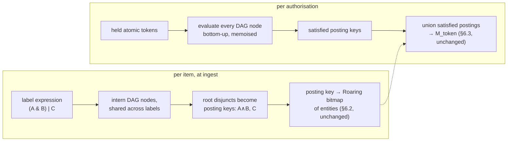

# Access expressions in the core — design

**Date:** 2026-08-14
**Status:** **Provisional — draft r1, not yet reviewed, and nothing in it is built.** What exists
today is the boundary this document proposes to change: flat term sets, the passthrough plugin,
and OR-only mask construction (§6.1–§6.3). To become normative: the independent adversarial
review the design process requires — security and implementability lenses at minimum — and owner
rulings on the four decision points in expr §8, the first of which amends an invariant (**I5**)
and the plugin ABI. Until those rulings are made this document binds nothing.
**Reads against:** architecture §4 (I4, I5, I13b), §6.1–§6.4, §11.1, §12.2–§12.4, §15, Appendices
D and E; [`contracts.md`](contracts.md) §2.4, §4; [`conformance.md`](conformance.md) §3;
decisions 0013,
[0048](../decisions/0048-no-deployments-exist-so-delete-rather-than-support.md).
**Citation convention:** unprefixed §n is the architecture design; this document's own sections
are cited as **expr §n**.

---

## 1. Summary

The core's authorisation contract today is: an item carries a set of opaque term IDs, a token
carries a set of satisfied term IDs, and an item is visible iff the sets intersect (§6.1). Full
monotone AND/OR semantics — Accumulo-style access expressions — are reachable through that
boundary, but only by pushing the boolean structure into the plugins: the data function must
normalise each expression to disjunctive normal form (DNF) and the auth function must
independently evaluate which of those normalised terms a credential satisfies, with **I5**
requiring the two to agree and nothing able to check that they do. §6.1 names that agreement the
single largest unverifiable dependency in the design, and Appendix E specifies (but does not
build) the plugin pair that would carry it.

This design moves the boolean structure into the core. The contract becomes: an item carries a
**monotone expression** over opaque atomic tokens — AND, OR, parentheses, no negation, the
`accumulo-access` grammar Appendix E already adopts — and a token carries a set of **held**
atomic tokens. The core owns parsing, canonicalisation and evaluation. Three things follow:

- **I5's semantic half dissolves into a testable property.** There is one evaluator, in this
  repository, differentially checkable against the reference oracle. The plugins' remaining
  obligation — emit atomic tokens, matched by byte equality on both sides — is the mechanical
  half I5 already has.
- **Compatibility strictly increases.** A bare disjunction is a valid expression, so every
  OR-semantics plugin is expressible unchanged; anything the grammar cannot say collapses to a
  minted atomic token, which is the same escape hatch the plugin-side design already relies on
  (expr §2).
- **The DNF expansion risk is demoted from a correctness hazard to an index-layout knob** with a
  safe default, because evaluation no longer requires normalisation at all (expr §4).

The price is that a parser, a canonicaliser and an evaluation pass join the trusted computing
base. The mask builder — postings, union, composition into `M_auth`, and everything downstream —
is unchanged (expr §3).

## 2. The boundary, before and after

| | Today (§6.1) | This design |
|---|---|---|
| `terms_of_labels` returns | one term descriptor per label | one expression over atomic-token descriptors |
| `terms_of_auth` returns | set of *satisfied* term descriptors | set of *held* atomic-token descriptors |
| Boolean structure lives | in both plugins, twice, agreeing by I5 | in the core, once |
| Visibility rule | term sets intersect | expression evaluates true over held tokens |

**The grammar is adopted, not invented**, for the reasons Appendix E already gives: tokens
combined with `&` and `|`, parentheses, no negation, no mixing of `&` and `|` at one level
without parentheses. Absent negation the predicate is monotone — which every argument below
leans on — and the parenthesisation rule removes the precedence ambiguity that would let two
implementations disagree about what a label means. The grammar is a ten-line ABNF; existing
corpora written in it ingest unchanged.

**What each plugin keeps.** The auth function keeps its full freedom in *deriving* tokens: it may
verify signed assertions, apply thresholds, run a policy engine — anything deterministic — and
emit whatever atomic tokens result. The data function keeps the symmetric freedom: a policy the
grammar cannot express is carried as a synthetic atomic token that the data side references and
the auth side mints when its condition holds. This is the same conservation law Appendix E uses
for deep nesting, and it is why the change is a strict widening rather than a trade: the
boundary's power is (arbitrary credential→token derivation) × (combination structure), and the
first factor is untouched while the second grows from "flat disjunction" to "any monotone
expression". A policy engine's residual policy no longer needs normalising to DNF before
crossing the boundary — any monotone residual crosses as-is — which removes the one obligation
on that route that could blow up (Appendix D's expansion result, scoped precisely in expr §4).

**What each plugin still owes.** Determinism, canonical descriptors interned by the service, and
declared cardinality bounds — reshaped: distinct atomic tokens, expression size and depth per
item, and held tokens per credential replace the current three (§6.1). The cost asymmetry is
unchanged: the data function runs per item at ingest, the auth function per authorisation.

## 3. The construction

The rule that makes the cost model survive: **evaluation is per distinct label, never per item.**
Accumulo evaluates its expression per cell per scan; carrying that locus into this architecture
would put an O(corpus) evaluation on the authorisation path — the same trap as the
array-containment formulation §6.3 refuses at three measured orders of magnitude. Nothing in
this design evaluates an expression against an item.

*Ingest work is per item; authorisation work is per label-vocabulary node. Nothing corpus-sized
runs at authorisation except the posting union that already does.*

**Ingest.** Each label expression is parsed, canonicalised (children of a commutative node
sorted, per Appendix E's convention) and interned as a hash-consed DAG: every distinct
subexpression is one node, shared across every label that contains it. The item is indexed under
its **root-level disjuncts** — flatten OR at the root only, which is free, and each resulting
child (an atom, a conjunction, or an arbitrary interned subtree) is one posting key. The posting
index itself is §6.2's term index verbatim: key → Roaring bitmap of entity IDs, in entity space
(**I4**), built from the exploded `(entity_id, key_id)` pair relation exactly as §6.3 requires.

**Authorisation.** The auth function yields held atomic tokens. The core evaluates every interned
DAG node bottom-up — an atom is true iff held, AND and OR combine children — memoised, so each
unique node is evaluated once. Monotone evaluation is linear in node count, and the node count is
a property of the **label vocabulary, not the corpus**. The satisfied root-disjunct keys then
drive §6.3's union unchanged: same postings, same per-partition composition, same
O(containers-touched) cost model. Appendix E's referenced-category intersection survives as an
optimisation — intersect the held set with the atoms any expression actually references before
evaluating — as does its k-of-N counting, which is now one evaluation strategy for conjunctive
nodes rather than a plugin obligation.

**Everything downstream is indifferent.** `M_token` is a bitmap; its composition into `M_auth`
(**I1**), the overlay and deny lane, label containment (**I3**), sampling (**I7**), every count
(**I2**) and the whole of Appendix C consume the finished mask and never learn how it was
assembled. No invariant other than I5 changes text.

## 4. Where an expression is cut into posting keys

Root-disjunct indexing leaves one degree of freedom: whether to expand a disjunct before
interning it. Expanding `(A|B) & C` to the DNF keys `A∧C, B∧C` maximises posting sharing — an
item labelled `(A&B)|C` and an item labelled bare `C` then share the `C` posting — but pure DNF
expansion is the construction published measurement found infeasible beyond nesting depth 2
(Appendix D). Interning the disjunct whole makes expansion impossible at any depth but fragments
the index: entities that one shared posting would have covered split across several, and union
cost is O(containers touched), so fragmentation is paid on every mask build.

Neither extreme is right everywhere, and nothing forces one choice globally. **The default: expand
a disjunct's DNF when it is small — under a fixed budget of resulting keys — and intern the
subtree whole when it is not.** Real visibility labels are shallow, so the budget binds almost
never; when it does, the fallback is the linear one. The choice is local to a label, made once at
ingest, observable only as index layout, and reversible by reindex. This is the demotion the
summary claims: the expansion problem stops being a hazard every plugin author must dodge
independently and becomes one budget constant in one audited place, whose consequences are
container counts rather than correctness.

⊘ The budget's value is unmeasured. It wants a probe over a representative label corpus —
distinct-key count and containers-touched per mask build as the budget sweeps — before a number
is written into configuration.

## 5. What this dissolves, and what it merely moves

**Dissolved: the unverifiable half of I5.** Today, if the data function indexes an item under a
conjunction and the auth function's idea of satisfying it differs, the failure is silent and
fail-open — Appendix E's own worked example is an item requiring A∧B served to a principal
holding A alone — and §6.1 is explicit that no differential can even run until a non-passthrough
plugin exists. With one evaluator, the obligation shrinks to what is mechanically checkable:
descriptor byte-equality (already interned in one place) plus core-evaluator correctness, which
the conformance suite covers the same way it covers masks — the reference oracle gains an
expression evaluator and evaluates the flat pair relation and expression table directly, and
disagreement is a failing differential rather than an undetectable leak. The property-based
(principal, item) sampling §6.1 sketches for a future plugin differential becomes a test the
suite runs against the core from day one.

**Moved, not created: the evaluation cost.** The bottom-up pass is work the specified design
already pays — it is exactly Appendix E's clause-index and k-of-N machinery, run plugin-side to
produce the satisfied-term set. Relocating it in-core changes its owner and its testability, not
the request-path cost model: mask construction remains per-authorisation, dominated at corpus
scale by the posting union it always was.

**Moved, with a real bill: the trusted computing base.** The parser, canonicaliser, DAG interner
and evaluator become core code that the security argument rests on. The mitigations are the ones
this repository already prefers: the grammar is ten lines of ABNF, monotone evaluation is a small
total function, and the oracle differential above is precisely the second reader the contracts
principle demands. This is the whole price, and the review should weigh it against the
dependency it retires.

## 6. Consequences owed to the rest of the corpus

- **I5 is reworded** (owner ruling, expr §8): the semantic-agreement clause is replaced by the
  atomic-token byte-equality obligation plus a normative statement that expression semantics are
  the core's, defined by the grammar and checked by the conformance differential.
- **§6.2's warn-never-exclude rule keeps its conclusion and loses a premise.** Its argument reads
  "a predicate is a monotone disjunction, so more terms means broader intended visibility".
  Under conjunctions that premise is false — a wider AND is narrower — but the rule stands on
  the other leg the same paragraph carries: a resource guard must not produce an
  authorisation-shaped outcome, and availability must not degrade with data shape. The runaway
  guard becomes a core-owned warn on expression size and unique-node count, still warn-only; the
  expr §4 budget is what actually bounds work, and it degrades layout, never visibility.
- **§12.2's required set generalises without changing meaning.** Its rule — the intersection of
  compartment markers across every disjunct — is the necessary-atoms projection, computed on the
  DAG in one linear pass: an atom's necessary set is itself, AND unions children, OR intersects
  them. On a DNF that reduces to exactly §12.2's intersection-across-disjuncts, so the gate's
  "exactly sound, never merely conservative" argument carries over unchanged. Reachability under
  partial credentials remains partial evaluation, which is what the auth pass already is.
- **§6.4's change handling is unchanged in conclusion**: credential changes still rebuild rather
  than delta (removal by AND-NOT still fails because another satisfied disjunct may cover the
  item), and item changes still land in the overlay.
- **§11.1's signature order is unchanged in kind**: the term-signature that orders entity
  assignment within a batch becomes the posting-key-set signature; items sharing a label remain
  adjacent, which is the contiguity the cost model wants.
- **The grammar joins the core's versioned surface.** An expression-grammar or cut-policy change
  is a bundle-format change requiring reindex — the same blast radius a data-function change has
  today (§6.1), with the same fail-closed version bump, and free pre-release under decision
  0048. The evaluator version joins the mask cache key where the auth-function version sits now.
- **Bundle format** (contracts §2.4, §4): the pair relation becomes `(entity_id, key_id)`; a new
  expression-table artifact carries the interned DAG (nodes, operators, child references, atom →
  token-dictionary references); the plugin ABI's two exports change signature. Both the pair
  relation and the expression table are required for a conformance run, for the same reason
  `terms/pairs.parquet` is today: without them the oracle has nothing independent to evaluate.
- **The leak register does not move.** Every entry in Appendix C is downstream of the finished
  mask. The one new observable is authorisation-time variation with label-vocabulary shape —
  per-session, not per-request, on the path §6.3 already names the expensive step, and a
  function of the corpus's labels rather than of any principal's visibility. The review should
  confirm rather than assume that no entry needs annotating.

## 7. What this deliberately does not do

**No negation.** Monotonicity is load-bearing four times over: DNF expansion terminates, the
necessary-atoms projection in expr §6 is sound, "another disjunct may cover the item" keeps §6.4
honest, and the conservative label join's direction depends on visibility only ever growing with
credentials. NOT is also absent from the adopted grammar, so this is Accumulo's own frontier,
not a subset of it.

**No per-item evaluation, ever** — expr §3's opening rule, restated because it is the mistake a
performance-minded reader will propose: evaluating expressions at query time "to skip the index"
reintroduces the O(corpus) authorisation path this architecture exists to avoid.

**No change downstream of `M_token`**, and no change to what a credential is: verifiable
assertions, expiry clamping and the capability-free execution environment (§6.1) apply to the
new auth function exactly as to the old.

## 8. Decision points

1. **Amend I5 and the §6.1 contract** as expr §6 states, changing the plugin ABI's two exports.
   Owner ruling — it rewords an invariant. Recommendation: accept; it converts the design's
   self-declared largest unverifiable dependency into a conformance-tested property, at the cost
   of a small, differentially-checked evaluator in the core. If wrong, the cost is carrying an
   evaluator the passthrough deployment never exercises.
2. **Adopt `accumulo-access` as the core grammar**, promoted from Appendix E's plugin choice to
   the core's surface. Owner ruling — it fixes a published grammar into the versioned format.
   Recommendation: accept; the alternatives are inventing a grammar (contracts §0.2 forbids it
   without cause) or deferring to plugins, which is the status quo this design retires.
3. **The expr §4 budget constant** — measurable, not rulable: run the probe before configuring.
4. **Appendix E's disposition.** Its model survives as the worked example of a token-minting
   plugin (dimensions, canonicalisation, the referenced-category optimisation); its DNF and
   satisfaction machinery is absorbed by the core. Absorb-and-trim on promotion rather than
   maintain both.
