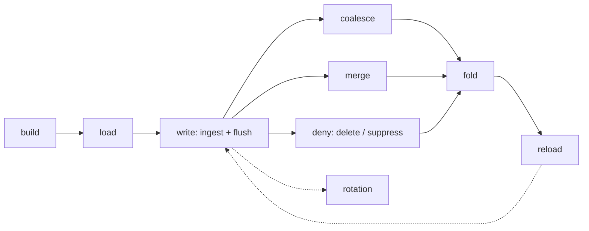

# The correctness suite — operations, data types, scale and server profiles

**Date:** 2026-08-15
**Status:** Provisional (r7) — **not approved**. Supersedes `data-fidelity.md`, whose three
mechanisms become this document's §9–§11 over the oracle of §8. Reviewed twice: the mechanisms
under the correctness lens (r2), the build under the implementability lens (r6). **To become
normative:** owner sign-off; rulings on the three points marked *judgement call* at their claims
(flush's entitlement in §10, the deep verifier's cadence in §11, and whether the source digest is
amended into `contracts.md` §2.2). **How fault injection reaches a served binary is ruled** —
decision [0071](../decisions/0071-fault-injection-reaches-a-served-binary-by-its-own-build.md), by
its own build rather than a runtime switch.
**Reads against:** architecture §4 (I2, I7, I9, I11), §11.3; [`conformance.md`](conformance.md) §1,
§2, §4.6, §6; [`write-path.md`](write-path.md) §5.4, §7, §14; [`compaction.md`](compaction.md) §3,
§6, §9; [`records-and-search.md`](records-and-search.md) §1–§4; [`contracts.md`](contracts.md) §2.2,
§3.2; [`measurement.md`](measurement.md) §1; decisions
[0030](../decisions/0030-determinism-is-not-a-guarantee.md),
[0042](../decisions/0042-a-dictionary-extent-never-repeats-a-descriptor.md),
[0044](../decisions/0044-invisible-means-stale-serve-plus-background-refresh.md),
[0047](../decisions/0047-edit-is-delete-plus-reingest.md),
[0049](../decisions/0049-the-merge-ladder-saturates-and-the-cap-stays.md).
**Citation convention:** unprefixed §n is the architecture design; this document's own sections are
cited as **spec §n**.

**Owns:** the suite that shows the data is *right* — the stage sequence, the read battery, the
type and scale axes, the server profiles, the endurance backstop, and the three mechanisms that
decide correctness. **Does not own:** the invariants and the leak register
(`conformance.md`, which owns the definitions oracle and every security property), what anything
costs (`measurement.md`), or what a run found (`docs/evidence/memos/`).

---

## 1. What this is

**Every operation, over every data type, at a range of sizes and server profiles, with every read
surface checked after every stage.** That sentence is the suite; the rest of this document is how
each of its clauses is made finite, and how "checked" is decided without a human able to inspect
the answer.

The problem it addresses is a seam rather than an absence. At ten thousand items the tree is
thorough: a dedicated file checks that every declared column value is still attached to the right
*item* after each producer that rewrites a row, asserting by identity rather than row position
because a producer that carried values forward unpermuted would satisfy a row-indexed check with
every value against the wrong item. Above 10⁵ only one harness runs at all, and what it asserts is
masked totals, external-id resolution, four planted probe positions per round and one sparse
principal's count. **It checks no attribute value at any size.** It runs real folds and asserts
only counts after them, so a fold that dropped ten thousand rows other than the ten thousand whose
deletion it was executing satisfies everything that follows it.

So the corruption classes that matter live in the gap: a merge that mis-orders one run inside a
large segment, a delta tier resolved against the wrong row space for one Roaring container's worth
of entities, a fold whose permutation is wrong only once it spills. None moves a total, and none
can occur at ten thousand items, where the permutation fits in a single container and a merge is
close to the identity.

**Three mechanisms decide correctness, and they are the backbone the rest of the suite hangs on.**
Their order is by how much each needs to know:

| | needs | catches | costs |
|---|---|---|---|
| **Total verification** (spec §9) | a corpus whose every property is computable, and the item named in its own row | any served value, position or membership disagreeing with what was ingested | one generator evaluation per served row |
| **Stage invariance** (spec §10) | nothing but the system's own earlier answers | any change to any answer a stage was not entitled to make | bounded by the read battery, independent of corpus size |
| **The structural verifier** (spec §11) | nothing at all | internally inconsistent artefacts — misaligned columns, broken permutations, unsorted geometry | one linear pass over the bundle |

**The last two need no fixture**, so they are the only checks here that could run against a corpus
nobody generated — a real deployment's data, where there is no oracle and no planted ground truth.
That is what puts them here rather than in `conformance.md`, whose every mechanism assumes a
fixture it built itself.

> **⊘ Specified, not implemented.** None of the three exists in the form below, and neither does
> the matrix. What exists is named at each section.

## 2. The stages

Six operations were asked for. The system has eight, and the two the list does not name are the
two most likely to be forgotten by a harness — so the mapping is stated rather than assumed.

| asked for | the operation(s) under test |
|---|---|
| **Build** | `tessera build`: points + pairs → a bundle, one segment per (partition, view) |
| **Load** | opening a bundle, and reopening after every publication and every restart |
| **Write** | ingest → commit window → WAL → **flush**, which appends a segment, a delta tier, an external-id run, a dictionary extent, an attribute extent and a record extent |
| **Merge** | the **row-space merge**: bounds the segment count, permutes row ids inside its span, publishes its own geometry version |
| **Delete** | the deny lane — `delete`, `suppress`, `unsuppress`. A deletion is *accepted and hidden*, which is a different state from executed |
| **Compaction** | the **fold**: five passes, executes deletions, retires their overlay entries, rewrites the permutation globally, reclaims |
| *(not named)* | the **entity-space coalesce**: bounds tiers, runs and dictionary extents, moves no row, and **bumps no version** — so the barrier every other stage uses cannot see it (write-path §7) |
| *(not named)* | **rotation** — WAL, prefix and identity — which every deny and every allocator floor must survive |



*The stage sequence. Every edge is a point at which the read battery runs, and the loop back into
write is what the endurance tier walks thousands of times.*

**The rule that makes this a suite rather than a list: the read battery of spec §3 runs after
every stage, and the same three mechanisms judge it every time.** A stage is not "tested" by a
property chosen for it; it is tested by the whole battery, which is why a defect nobody anticipated
in a stage nobody suspected still surfaces.

## 3. The read battery

Every served surface, after every stage. The set is small because the query surface is deliberately
small — the same property that makes the leak register enumerable.

| surface | what it answers | what its absence from the battery would hide |
|---|---|---|
| `/v1/meta` | the schema, operand list and idset | a producer that dropped a declared column from the manifest |
| `/v1/categories/{column}` | a category's values | a vocabulary extension lost at a flush or not carried by a fold |
| `/v1/viewport` — tiles | masked counts per tile | rows lost, gained, or moved between tiles |
| `/v1/viewport` — points | the per-viewer sample | every value defect, at the identity that owns it |
| `/v1/viewport` — density underlay | masked per-cell counts | the only other derived aggregate in the system |
| `/v1/region` | counts and breakdowns over a polygon | a region path diverging from the tile path |
| `/v1/items/{id}` | the whole record, assembled from **all three homes** | a blob-resident or index-resident field dropped by a producer — nothing else reads those homes on the viewer plane |

The drill-down earns its place twice over: it is the only surface that reads all three homes, so a
field that renders correctly while its blob copy is corrupt is visible nowhere else.

**One artefact, three uses.** The battery is simultaneously the query set stage invariance compares
(spec §10), the response set total verification checks row by row (spec §9), and the tiling the
census counts against (spec §9.2). That is deliberate: three mechanisms sharing one definition of
"what we ask" cannot drift apart, and there is one thing to extend when a surface is added.

> **⊘ Not implemented.** No battery exists. Each harness picks its own queries, which is why the
> surfaces differ between them and why the density underlay went unasserted until a review found
> it. `/v1/labels` is Phase 3 and absent; the battery gains it when it exists.

## 4. The type axis — homes, not families

Five families (number, datetime, category, keyword, text) × three homes × the `render`/`index`/
`multi` flags is a large axis, and running every operation against every combination is most of
this suite's apparent cost. **It is not the right axis.** What a producer gets wrong is a *home* —
the machinery it writes through — and the families inside a home share that machinery.

| home | what lives there | its producers | what a producer gets wrong |
|---|---|---|---|
| the **hot render column** | any rendered field | build, flush, merge, fold | the declared tail dropped, or carried forward unpermuted — values present, each against the wrong item |
| the family's **entity-space structure** | indexed fields: a number's column and presence bitmap, a category's codes, vocabulary and postings, a keyword's dictionary and ordinals, a text column's token index | build, flush (as an extent), coalesce, fold (pass 4a) | an extent resolved against the wrong layer; a dictionary extent repeating a descriptor |
| the **record blob** | everything else declared | build, flush, coalesce, fold | a row's block byte-absent, or addressed at the wrong offset |

**So the operation axis crosses homes, and families sweep within a home at one size.** A category
and a keyword in the hot column are the same bytes to a merge; where they differ — the vocabulary,
the dictionary — is entity-space machinery with its own producers, which the second row covers.
This is the reduction that makes the matrix runnable, and it is what the existing attribute-tail
tests already do for two of the three homes without naming it.

The families still get a full sweep, because their *mechanisms* genuinely differ: a category's
postings exist whatever its flags say, a keyword's dictionary is per-layer, and text is the only
family whose analyser sits between the ingested bytes and the stored form. That sweep runs once per
home at fixture size, where a failure is inspectable — not once per operation per scale.

## 5. The matrix, and why it is not the cross-product

Eight operations × three homes × five families × seven read surfaces × four sizes × four profiles
is several thousand cells. Nobody runs that, and a suite that claims to is either lying or
sampling silently. Four reductions make it finite, each stated so a reader can attack it.

1. **Homes on the operation axis; families swept within a home** (spec §4).
2. **A defect class has a threshold size, and a cell runs at the smallest size that expresses it.**
   Container-boundary effects need sparse entity allocation, not 10⁸ rows. Merge-ladder effects
   need the ladder to run twice, which is a segment count rather than a corpus. A permutation that
   spills needs a fold at 10⁶. Running every cell at every size buys repetition, not coverage.
3. **The read battery is total at every stage, because it is cheap.** It is bounded by *k* and the
   surface count, not by the corpus, so this is the one axis with no reduction — and it is the axis
   the request was really about.
4. **Profiles are sampled, not crossed.** A constrained-memory profile runs one full stage sequence
   rather than every cell; what it tests is the resource regime, which is orthogonal to which
   column family is in play.

What remains is small enough to state:

| axis | its cells |
|---|---|
| operations | 8, every one at every tier above the gate |
| homes | 3, crossed with the operations |
| families | 5, swept per home at fixture size only |
| read surfaces | 7, after every stage, always |
| sizes | 10⁴ · 10⁶ · 10⁷–10⁸ · 10⁹, each carrying the defect classes it is the threshold for |
| profiles | 4 (spec §7), one full sequence each |
| endurance | one tier, thousands of writes and 100+ folds (spec §6) |

## 6. Endurance — the backstop

**Some defects need a long life rather than a large corpus**, and nothing in the tree has one. The
longest run is forty flushes over a sixty-four item corpus; the largest is thirty-two rounds. A
tier of **thousands of ingests and 100+ folds** is what tests accumulation, and it is the only
tier whose axis is the operation *count*.

What only accumulation breaks:

- **Identifier monotonicity under pressure** — `seg_id` never reused, `SEGMENTS-<n>` monotone,
  unpadded and never replaced, across hundreds of publications rather than a handful.
- **Reclamation actually reclaiming.** On-disc bytes only grow until a fold reclaims, and nothing
  has ever measured a hundred folds' worth of reclamation. A fold that reclaims slightly less than
  it orphans is indistinguishable from one that works, over four folds.
- **Prefix accumulation across folds**, each of which writes a new prefix and flips `CURRENT`.
- **The merge ladder's saturation** (decision 0049): live segment count settles at corpus bytes ÷
  the saturation size and grows linearly with the corpus. Confirming the settle needs enough merges
  to reach it.
- **The four axes the coalesce bounds** — delta tiers, external-id runs, dictionary extents,
  attribute extents — over hundreds of cycles rather than the five the soak reaches.
- **The allocator floor and the entity high-water across repeated rotations**, and the WAL's
  reclaim bound with a deletion pinning it.
- **Overlay growth** against its soft limit, with deletions retiring at folds and suppressions
  never retiring at all.

**It is a backstop, not a gate, and this document says so plainly** so nobody wires it into CI and
then disables it. It runs on demand and before a release; a failure in it is a defect, but its
absence from a pull request is deliberate.

**Verification cadence is what makes it affordable.** The read battery runs at every stage as
everywhere else. Total verification runs on a sampled subset of stages and totally at the end. The
deep structural verifier — a full re-hash of the bundle — runs every *n*th fold and at the end,
never every stage; at a thousand writes the re-hash would be the whole run.

> **⊘ Not implemented.** No endurance harness exists. The soak test is its ancestor and asserts the
> right property — the growth axes are bounded — at a size and a count where every number it checks
> is small enough to be right by accident, which is the criticism the scale harness already levels
> at it.

## 7. Server profiles

**The regime a deployment at 10⁹ actually runs in — less memory than data — is the one nothing
tests.** Every artefact is memory-mapped and advised; whether that works when the pages cannot all
be resident is an assumption, not a measurement.

**The variable is the memory-to-data ratio, not the absolute size**, and that is what makes this
affordable. Constraining the process's memory — a cgroup limit, `systemd-run -p MemoryMax=` or a
container — reproduces the 10⁹ regime at 10⁷ on a developer machine. Growing the corpus to
reach the same regime costs hours and a machine; capping the memory costs a flag.

| profile | what it fixes | what it catches |
|---|---|---|
| `default` | memory well above the working set | the baseline every other profile is compared against |
| `constrained` | memory at roughly half the bundle | mmap behaviour under eviction, a projection build that assumed residency, a transient nobody sized |
| `cold` | page cache dropped between stages | a stage that passes only because its inputs were still resident from the stage before |
| `single-thread` | `compute_threads = 1` | a parallel gather whose correctness depended on its own scheduling |

**Two rules, both of which a naive harness breaks.**

*Invariance comparisons never cross a profile.* Byte-identical responses are a property of one
pinned thread count, an implementation detail rather than a guarantee (decision 0030), so spec
§10's comparison is within a profile. Comparing across them would be asserting something the design
does not claim, and the failure would look like a correctness defect.

*A constrained profile must fail for the right reason.* A process killed by the out-of-memory
killer is a resource result, not a correctness result, and a harness that treats the two alike
reports the wrong defect. The profile asserts that the run **completes and its answers are
correct**; that it completes *within* a memory bound is a measurement and belongs to
`measurement.md`.

**There are three outcomes, not two, and the third is the one nothing names.** Below the limit the
run completes; well below it the kernel kills the server and the cgroup records `oom_kill`. Between
them lies a band where the server neither boots nor dies — the kernel reclaims its text pages
indefinitely and the run surfaces as a timeout with `oom_kill` still zero. **The cgroup never names
that state**, so the discrimination can only be pinned in the certain-kill band, and a constrained
limit must carry headroom above the thrashing one rather than sitting at the edge of it. Measured
on this host: killed at 8 MiB, thrashing at 16 MiB.

> **⊘ Not implemented, and this is the largest unmeasured assumption in the system.** No test
> constrains memory. The fold's peak resident set is measured at 4.4–4.9× of its inputs, which
> policy caps at 256 MiB, so the fold has a bounded transient — but nothing establishes that a
> viewport, a projection build or a session materialisation behaves when the bundle cannot be
> resident, and 10⁹ is exactly that case.

## 8. The oracle: ground truth as a function

**At a billion points the expected answer cannot be stored, so it must be computed.** Every
property of item *e* — its position, its terms, and every declared field of all five families — is
a pure function of *e* and the run's seed, evaluated in constant time with no I/O and no table.

This is the pattern the filter tests already use, generalised from a fixture to a corpus of any
size: they compute the expected answer from the fixture's own inputs rather than from the artefact,
so an implementation that stored the wrong thing and read it back consistently fails. Holding those
inputs in memory works at 10⁴ and does not survive 10⁹.

Four properties are required, and each rules out a failure the current fixture has met.

**Prefix-stable.** Item *e*'s properties depend on *e* and the seed, never on *n*. Without it a
smaller run is a different corpus rather than a prefix, and a failure at 10⁹ cannot be reduced
(spec §15).

**Spread at any size.** The current fixture places item *e* at `((e·37) mod 1000, (e·53) mod 1000)`
— exactly 1000 distinct positions whatever *n* is, which at a 250M base is 250,000 items per
position and was measured as a probe-lookup failure with every count exact. A per-axis mix of
`(seed, e)` into the extent is prefix-stable *and* spreads at any *n*.

**Decorrelated across dimensions.** Position, terms and each field derive from independent salts. A
generator whose value function shares a period with its grant function passes every cross-principal
check while testing nothing — a precondition the conformance suite already asserts rather than
assumes for its filter columns.

**Named in its own row.** A served row must say which item it is, so *e* is planted as a declared
render column and read back from the response. The cheaper-looking route does not work: inverting a
served `tessera_id` recovers an **entity id**, and entity ids are assigned in signature order by
the build and arrival order by ingest, so the map from item to entity id is a property of how the
corpus was loaded rather than of the item — and it is exactly the multi-gigabyte table the
generator exists to avoid holding. This is `conformance.md` §2's `fx_key` under another name and
shares its prerequisite.

> **⊘ Partially implemented.** A generator exists, covers position and terms, and satisfies the
> first and third properties. It fails the second, and generates no field of any family — which is
> why spec §9 has nothing to check values against above fixture size. The planted column is
> unserved: the build writes an empty declared-scalar set, pinned by a strict xfail in the
> conformance suite.

### 8.1 Why a count cannot carry this

Each check is blind to the class beneath it, and every one of these blindnesses is load-bearing
somewhere in the current tree.

| check | blind to |
|---|---|
| a masked **count** | every permutation-preserving corruption. A merge is row-count preserving by construction, so a mis-interleave leaves each total exact |
| a served **identity set** | values. Right items, wrong data |
| a **row-indexed** value check | an unpermuted carry-forward — values present, each against the wrong item. The defect with no other symptom |
| an **identity-keyed** value check over a *sample* | anything outside the sample. Four probes per round over five million rows is sixty-four rows |

Only an identity-keyed value check over **every** row of **every** response is blind to none.

## 9. Total verification

### 9.1 The row half — everything served is right

For every row of every response the battery receives: read *e* from the planted column, evaluate
the generator, and compare the Morton code, both coordinates and every other declared field,
exactly. No sampling, no probes.

The cost is one generator evaluation per row on top of a response already paid for. It replaces the
four-probes-per-round position check with a total one and extends it to values, which nothing above
fixture size checks. A merge that dequantised and requantised, a fold that permuted the geometry
column and not the attribute tail, a flush that wrote a segment's columns at the wrong offset: each
fails on the first affected row served.

**It is also what makes a fold's outcome checkable.** The count assertions that follow a fold today
cannot distinguish the rows a fold was told to drop from an equal number of others, and the fold is
the one producer that rewrites every row's position in the permutation.

### 9.2 The census half — nothing is missing or extra

The row half cannot see a lost row, because a lost row is not served. The census is a masked count
per tile at a fixed zoom, for each principal in the mask catalogue, against the count the generator
produces for the same principal and tile.

**Per tile, not one global total.** A single number over the whole extent — what exists today —
passes any defect that moves rows between tiles while preserving the sum. A fixed tiling localises
a disagreement to a region before anyone opens a debugger.

The expected counts come from one pass over the generator: evaluate *n* positions, bucket each into
its tile, apply the grant rule, and **subtract the denies the harness has had accepted**, which are
its own. The census barriers on the background refresh, for the reason spec §10 gives about flush.
No I/O, trivially parallel.

> **Modelled, not measured, and it survived one attempt to refute it.** At 10⁹ this is a few
> nanoseconds per item per principal across the available cores — seconds to a minute, CPU-only.
> The engine-side term beside it is one whole-extent per-tile count per principal, which the
> measured per-(tile × segment) model (§11.3) puts well below the generator pass. Spec §15's
> obligation is to replace both with a figure. If they are wrong, the census moves from per-stage
> to end-of-run, which costs localisation and no coverage.

## 10. Stage invariance

**A stage may change only what it is entitled to change, and for most of them that is nothing.**
This is testable without knowing what the right answer is, which is what lets it run over data no
fixture produced.

Record the battery. Run the stage. Re-issue. Compare against the entitlement.

| stage | entitled to change |
|---|---|
| load, reopen, restart | nothing |
| the entity-space coalesce | nothing |
| the row-space merge | nothing |
| rotation | nothing |
| **the compaction fold** | **nothing** |
| a `suppress` / `unsuppress` | exactly the entity named |
| a `delete` | exactly the entity named, at acceptance |
| flush's background refresh | exactly the rows ingested since the last one |

**The fold's entitlement is nothing, not "minus the rows it deleted".** An accepted deletion is
invisible from the moment it is accepted, fail-closed, long before the fold that executes it
(write-path §5.4) — so the responses recorded before a fold already exclude those rows and the
fold's own served delta is empty. Stating it as a delta would have the harness expect rows that are
already gone, and would measure the deny lane rather than the fold.

**Flush is the exception because the refresh exists to change answers.** An established session
serves from its existing row projection until the background refresh replaces it (decision 0044's
D1), which is what makes an ingested batch visible; measured at 1,000,000 before and 1,250,000
after. Asserting flush changes nothing would be asserting that mechanism away.

> **Judgement call, open for ruling.** Whether flush earns a delta row or leaves this table to the
> stages with no entitlement is the one entry that is a choice rather than a consequence. The delta
> form is kept because a flush that quietly perturbs an unrelated tile is a defect nothing else
> here would catch.

**Two preconditions, both of which a naive harness gets wrong.**

*Point sets are comparable only over saturated tiles — and saturation is a property of each tile,
observed per response, not a configuration the harness can pin.* Under a truncated selection —
`served` below a tile's visible count — removing a served row admits the next-priority row behind
it, so a one-row delta on the wire can follow a one-row delta in the corpus without the two being
the same row. An earlier revision discharged this by configuration, θ and the mark caps raised
"above the corpus total"; a cap large enough for every corpus does not exist, and the wording
never noticed its own ceiling. Measured at 10⁷ items: the whole-extent tile is a million-mark
window over ten million visible rows, an ingest-only stage recorded rows *vanishing* — displaced
out of the served window, nothing wrong with the engine — and the zoom levels disagreed with each
other, each having a different visible-to-cap ratio. The discriminator is in the response itself:
a tile whose `served` equals its `matched` (its `visible`, unfiltered) was not truncated and its
point set is complete; a tile where `served < matched` was capped and supports only count
comparison, `visible` and `matched` being mask arithmetic the cap cannot touch. The diff
therefore admits point-set claims per tile, treats rows entering or leaving a capped window as
displacement rather than defect, holds capped tiles to their counts — per tile where the evidence
over the tile is complete, in full-extent sum always — and, because counts in a capped region can
be compensated by construction, reports a recording in which *every* tile is capped as
uncheckable for point sets rather than quietly passing on counts alone. The battery carries one
full-extent viewport deep enough to hold saturated tiles at scale (`suite.battery`'s deep
viewport; depth divides the per-tile load by 4^zoom), so a membership surface outlives the
shallow viewports' truncation, and its absence is a stated failure, never a silent narrowing.

*The comparison surface must be named, and canonicalised.* Every viewport body carries a trailer
whose fields include the request's elapsed wall-clock (contracts §3.2), and the pin and staleness
headers move across a publication by design — so two issues of one request are never byte-identical
even with nothing in between. "Byte-identical" is a property of decoded, canonicalised surfaces,
which is the machinery the canary comparator already built: decode, compare the points batch in
served order, re-sort the tile batch, compare the underlay separately.

**It is stronger than what the tree asserts today.** The current maintenance tests assert
*properties of* the state after an operation. This asserts *equality with* the state before it, so
every property nobody thought to assert is covered by construction. Where a merge test enumerates
five things that must still be true, this enumerates none and admits no sixth.

**What it deliberately cannot see:** a defect present both before and after — a build wrong from the
start, or a fold that damages a row the battery never touches. It composes with spec §9.

> **⊘ Not implemented.** No full-response comparison across a stage exists. What exists is narrower:
> the fold tests compare masked counts and item lookups across the flip for four principals, and the
> merge tests compare served identity sets across the swap. Both stop short of the values in the row,
> and both enumerate what to check.

### 10.1 Crash atomicity — the same check, disjoined

**A stage killed part-way through must leave the system at one of its two endpoints and never
between them.** That is the property a crash test is actually for, and it needs no new machinery:
it is this section's comparison with the right-hand side disjoined.

| | the assertion |
|---|---|
| a stage that completes | `after ≡ before + entitlement` |
| a stage killed mid-flight | `after ≡ before` **or** `after ≡ before + entitlement`, exactly, with no third outcome |

The driver already computes both sides, so a crash is a **modifier on a stage** rather than a
section of its own — which is what keeps this affordable enough to run at every stage rather than
at the one everybody worries about.

**Where the kill lands matters more than that it happens.** A SIGKILL at an arbitrary moment almost
never falls on a publication seam, and the seams are the whole question: the instant between a
manifest being written and `CURRENT` naming it, between a merge executing on the pool and
publishing on the executor, between a fold's last pass and its flip. Reaching those needs pause
sites, which is spec §12.3's obligation and the reason this subsection cannot simply be written
today.

**And a SIGKILL alone is not a power cut.** The page cache survives process death, so the bytes a
process wrote are readable by the next one whether or not anything fsynced them — an engine that
acked before it synced passes every kill-and-restart test, which is measured rather than argued.
The existing WAL crash test closes this by truncating to the last-synced offset before restarting;
a publication seam's analogue is discarding whatever the stage had not synced at the moment it
died. Without that, a crash test at a seam verifies recovery logic and says nothing about
durability ordering.

> **⊘ Not implemented for any publication.** Crash coverage stops at the WAL: two tests kill during
> the deny and ingest path, one of them with the truncating variant that makes it a power-loss
> simulation. **No test has ever killed a flush, a merge, a coalesce or a fold.** The fold's
> behaviour under a crash is designed and its startup sweep is built — a crash before the flip
> leaves an orphan prefix that is swept, a crash after opens the committed one — so what is missing
> is the test, not the mechanism. For merge the mechanism is missing too: there is no pause site
> between its execution and its publication, which its own tests record as the reason a
> crash-mid-merge case cannot be written.
>
> One hole is **not closable here and must not be read as covered by this subsection**: fsync
> ordering is not observable through the API, so no black-box crash test can falsify an engine that
> acks before it syncs. That property is held in Rust by the `Published` token type and by the
> fault-injection pause site inside the ack function, and issue #71 tracks whether an end-to-end
> check is worth its cost.

## 11. The structural verifier

`tessera verify` runs the read protocol — every manifest digest, every file's size and SHA-256, each
permutation's bijectivity onto its segment's rows — then re-confirms the permutation covers exactly
the rows the segments claim and re-derives **every** row's `tessera_id` from the identity key. It is
already a whole-column check rather than a sample.

What it does not check is everything about an artefact that is not identity. The additions below
need no fixture, no generator and no oracle, which is the property that matters: they are the only
correctness checks that can run where the data came from somewhere real.

- **Every column in `columns.arrow` has length equal to the segment's row count** — the attribute
  tail's defect class caught structurally, at any size — and **Morton codes non-decreasing within a
  segment**, without which the tile→contiguous-row-range mapping (§11.3) is unsound and every
  masked count is bitmap arithmetic over ranges derived from a lie. **Both are discharged by the
  open the deep pass performs** rather than by a loop of its own: the segment loader and the Morton
  view already refuse each, fail-closed. Writing the loops again would duplicate an unreachable
  check; what the suite adds is a deliberate-damage test per property, so a loader relaxed in a
  later change fails here instead of quietly widening what opens. The cost is diagnostic — a
  damaged bundle refuses at the open and names the loader's reason rather than the check's.
- **Postings are sorted, duplicate-free, and bounded by `entity_id_high_water`.**
- **The external-id locator and its sidecar agree in both directions, newest binding first.** Not a
  bijection: a delete-plus-re-ingest rebinds a key and the superseded binding is retained (decision
  0047), so a bijection check would refuse every bundle that has taken a re-ingest.
- **Dictionary extents are positional and never repeat a descriptor** (decision 0042).
- **`terms/pairs.parquet` contains the union of the postings *of the base it was written with*.**
  The file is produced by the build and rewritten by the fold, and by nothing else — a flush's delta
  tiers hold pairs it has never seen, so an unscoped check would refuse every bundle that has
  absorbed a write.

**One check considered and rejected**, because it will otherwise be proposed: that each residual
lies within its cell's bounds. It cannot fail. The residual is the low half of the same 32-bit split
whose high half is the cell code, so every representable value is inside its cell by construction,
and a dequantise-requantise defect produces a different *valid* pair rather than an out-of-range
one. Catching that needs a comparison across producers, which is spec §10's job.

**Cadence is per-tier, because a deep pass re-hashes the bundle.** After every stage at the gate and
local tiers, where localisation is worth more than wall-clock; once at the end of a run at the
larger tiers, and every *n*th fold in the endurance tier.

> **Judgement call, open for ruling.** Deep-verifying every stage at every tier buys the ability to
> name which stage corrupted an artefact instead of which run did. It is the better answer if the
> re-hash is cheap against a run already dominated by ingest, which is unmeasured (spec §18).

> **⊘ Specified, not implemented, and the built half needs extending before it can be invoked this
> way.** Every bullet above is new. The identity loop of the built verifier restarts its row index
> at zero for each segment while indexing an array spanning the whole view — correct for the
> single-segment shape a build produces, and wrong for any bundle that has flushed. So "run it after
> a merge" is not a call site; it is that loop taking a per-segment row offset first.

### 11.1 Binding a bundle to its source

Nothing ties a points file to a bundle — no digest, no manifest entry — so the strongest check
available, comparing a build's output against the source it consumed, rests on a harness handing in
the right file. Nothing structurally prevents a runner regenerating the "source" from the bundle and
turning the geometry check into `code == interleave(deinterleave(code))`.

A `source.digest` in `MANIFEST.json`, written at build and checked by `tessera verify --source`,
closes it — one field, converting a discipline into a refusal. **The field belongs to
`contracts.md` §2.2**, and this document requests the amendment rather than making it, because a
second document specifying a manifest field is how two of them come to disagree.

## 12. The build

Everything above says what must be true. This section says what is written, in which language, and
against which seam — at the level a task brief can be cut from.

**The suite drives the running system over its real API**, not the engine's types. That is
`conformance.md`'s first principle and it decides most of what follows: the driver is Python,
reusing `reference/oracle/harness.py`'s boot machinery, and it speaks `/v1/*` and `/control/*` like
any deployment. The Rust contributions are three — the corpus, the deep verifier and a profile
wrapper — and none of them is a test harness.

The alternative, an in-process Rust driver over `ViewportOut`, was rejected for a reason worth
recording: it cannot see the serialisation layer, and half the surfaces the battery exists to
compare only exist once encoded.

### 12.1 The corpus — one implementation, in Rust

A new crate, `tessera-corpus`, holds the generator. Its whole interface is small and every method
is constant-time with no I/O:

```rust
pub struct Corpus { seed: u64, n: u64, schema: Schema, extent: Bounds }

impl Corpus {
    pub fn item(&self, e: u64) -> Item;            // O(1): position + every declared field
    pub fn terms(&self, e: u64) -> Vec<TermId>;    // O(1): grant structure, independently salted
    pub fn census(&self, zoom: u8, grant: &Grant) -> Vec<(TileId, u64)>;  // O(n), one pass
}
```

The two lookups are constant-time with no I/O; the census is the one O(*n*) method and is why the
census verb exists rather than the driver looping. Every value is a keyed mix of
`(seed, salt_of_dimension, e)` through one fixed 64-bit finaliser —
prefix-stable because *n* appears nowhere in it, spread because the mix is uniform, and
decorrelated because each dimension carries its own salt.

**One implementation, and the reason it does not violate the two-implementations principle.** The
generator defines *the corpus*, not Tessera's behaviour. The second implementation that matters is
the oracle's account of *serving*, and that stays where it is, in Python. Two generators would give
a corpus that disagrees with itself, which puts the fixture under test rather than the system.

**Python reaches it through the CLI**, on the established precedent of `tessera tokenise` — which
exists precisely so the conformance oracle passes text through the *same* analyser the index was
built with rather than testing a reimplementation. Two verbs, and the granularity of each is chosen
so a run makes one call per response rather than one per row:

| verb | in | out | called |
|---|---|---|---|
| `tessera corpus items --seed S --ids -` | the `fx_key` values a response carried, on stdin | Arrow: their expected position and every field | once per recorded response |
| `tessera corpus census --seed S --n N --zoom Z --grant G` | the run's parameters | Arrow: expected count per tile | once per census, not per response |

The ids are `fx_key` values — item identities — never `tessera_id`s, for spec §8's reason. `--grant`
takes the same term-set encoding the mask catalogue already uses for a principal, so a census and
the token it is compared against name the grant identically. The census's O(*n*) work stays in Rust;
Python compares two count vectors.

**The same corpus feeds every way in, which is what makes an ingested item checkable against the
same function as a built one.** Four materialisers, one source:

- `write_points_parquet` and `write_pairs_parquet` — the build's inputs;
- `schema_toml` — the declared columns, including the planted join column;
- `ingest_batch(range) -> RecordBatch` — the write path's input, in the **wire** shape
  (`external_id`, `x`, `y`, access, the declared scalars) rather than any engine type.

That last is deliberately not the executor's `UnallocatedRow`: that type carries resolved term ids,
descriptors and a view, is constructed after admission, and lives in `tessera-lifecycle` — which
this crate must not depend on if §13's dependency rule is to hold. `/control/ingest` takes **Arrow
IPC**, not JSON, so the corpus emits a batch and the driver posts it.

**The planted join column is `fx_key`** — the column the conformance fixtures already declare and
the build already serves. It is spec §8's fourth property, discharged by something that exists, and
using a second name for it would create exactly the drift the shared column exists to prevent.

### 12.2 The battery, and canonicalisation

A battery is a list of queries and a recorded response per query:

```python
Query  = Meta | Categories(column) | Viewport(view, zoom, bbox|tiles, k, filters) |
         Region(view, polygon|bbox, filters) | Item(tessera_id)
Recorded = dict[Query, Canonical]
Canonical = Json(dict)
          | Streamed(tiles: bytes, points: bytes, underlay: bytes, trailer: dict)
          | Batches(tuple[bytes, ...])
```

`Streamed` carries the trailer's surviving remainder as a fourth surface because step 2 below
*keeps* it — dropping only the elapsed-time fields — and what is kept has to live somewhere to be
compared. The canary comparator previously excluded the trailer wholesale, so this is a
strengthening rather than bookkeeping: its `points` and `flushes` counts are now compared, and its
positive control must move all four surfaces independently.

The third arm is `/v1/region`, whose response is plain Arrow in three batches rather than a frame
sequence — a shape neither of the other two represents. ⊘ That route is not in the router today, so
the battery carries it as a marked absence rather than a query that silently never runs.

Canonicalising a viewport response is the fiddly part and is specified rather than left to whoever
writes it first:

1. Decode the frame sequence — `u8 kind` + `u32 LE length` + payload, each payload a complete Arrow
   IPC stream, JSON for the trailer.
2. **Trailer (kind 4): drop `stream_us` and `arrow_serialise_ns`, keep the rest.** Two issues of
   one request are never byte-identical otherwise, whatever else is true. The list is exactly those
   two: `stage_ns` is elapsed time and is deliberately **not** dropped, because the suite never
   enables the gate that emits it, so a run against a stage-timing build should fail loudly rather
   than have a timing field silently swallowed.
3. **Tiles batch: re-serialise sorted by tile id.** Emission order under a parallel gather is not
   contract, and a flaking byte-compare gets "fixed" by weakening the comparison.
4. **Points frames: concatenate the payloads and compare as bytes in served order.** Contracts
   §3.2 orders points ascending by `tessera_id` within each tile, so comparing them *unsorted* is
   stronger than sorting them. **This rests on chunk boundaries being a function of served content
   alone** — frame boundaries are explicitly not contract, so concatenated payloads carry per-frame
   stream headers and a server that re-chunked on timing would break the comparison without any
   defect. It holds today, and the canary comparator states the same assumption; it is written here
   because the trailer's `flushes` count rides on it too.
5. **Underlay: its own stream, its own comparison.**
6. Headers are excluded, except where a stage's entitlement is about one.

**Three separately-addressable surfaces, never one concatenated blob.** That is not fastidiousness:
the canary comparator returned a single blob, and a review found that dropping the points batch
entirely left every test green, because the control fired on whatever remained.

**This is the canary comparator's canonicalisation**, and there should be one of it. The comparator
is refactored onto this module rather than a second copy being written beside it — the failure
mode being the one that comparator already demonstrated one level up, where a control exercised a
second code path and proved that path instead.

### 12.3 The driver, and entitlements

The driver walks a stage plan. Per stage, in order: record the battery, apply the stage, barrier,
record again, check the entitlement, then run whichever mechanisms the tier's cadence calls for.

```python
class Stage:              # Build | Load | Write(rows) | Coalesce | Merge | Deny(op, e) | Fold | Rotate
    def apply(self, server) -> None
    def barrier(self, server) -> None
    def entitlement(self) -> Entitlement

Entitlement = Nothing | Entity(e) | Rows(items)
```

### Triggering a stage, and knowing it finished

**Three of the eight stages cannot be requested, and the barriers this needs do not exist yet.**
Both are small additions, and both have to be specified here or a builder invents them.

The control plane is five routes — `ingest`, `changes`, `status`, `flush`, `compact` — so build,
load, write, deny and the fold are directly driveable and **merge, coalesce and rotation are not**.
They dispatch automatically at the executor's tick when policy makes them eligible, and the
switches that suppress them are Rust-only, behind the fault-injection feature.

**The driver therefore sequences by eligibility, not by request**, and the protocol is stated
rather than left to be rediscovered:

- `flush_max_age_secs` is set long, so no tick fires on its own and the driver owns the clock.
- `POST /control/flush` pulls a tick. **A pulled tick dispatches everything currently eligible**,
  so isolating a stage means arranging that only it is eligible. The knobs are `serve.tier_width`,
  `serve.segment_floor_bytes` and `serve.coalesce_width`, and `max_merged_segment_bytes` set below
  the base segment so it excludes itself from every merge window. **All three selection widths were
  inert when this was first written** — parsed, validated and discarded, the engine hard-coding 4
  and 16 MiB while the coalesce had no key at all — which is why the suite's first stage plan
  counted writes against those constants instead. They are live now, and a width below 2 is refused
  at startup rather than silently never merging. A tick stage's barrier asserts the flush counter
  did **not** move, so a plan that mis-counted fails as a plan defect rather than as a false
  invariance result.
- Rotation rides flush publication and the growth tick, so a `Rotate` stage is a write shaped to
  cross the rotation threshold rather than a request. **It has no wire barrier** — no rotation
  counter reaches `/control/status` — so the only observable is the WAL member index on disc. That
  is enough for a harness that owns the WAL path and is not enough for any remote form.

Adding trigger routes for merge and coalesce would be simpler for the driver and is not proposed
here: they would be a control surface existing only for tests, on a plane where every route is
part of the operator contract.

**Barriers.** `/control/status` must gain `segments_version`, `watermark`, and the executor's
`coalesces`, `merges` and `refreshes` counters. None is serialised today — the handler's own
comment records that the per-partition block contracts §3.4 specifies is unbuilt, and the counters
exist in `ExecutorStats` without reaching the JSON. With them each stage has a barrier: a version
for flush, merge and the fold; a counter for the coalesce, which deliberately moves no row and so
bumps no version (spec §2); and the refresh counter for the wait a flush additionally needs, without
which a count is short by exactly the round's batch — measured, not supposed.

**A merge needs the refresh barrier too, and the version alone is a trap.** Its publication runs
the same refresh pass, so a driver that waited only on the version would record an established
session's *stale* projection afterwards — comparing it against itself, and reporting a merge that
changed nothing because nothing had yet been asked to change. The stage would pass while testing
nothing, which is worse than failing.

`Entitlement` is checked by differencing the two recordings per surface and comparing the result
against what the stage was allowed:

```python
delta = diff(before, after)      # per surface: added, removed, changed
assert delta == stage.entitlement()
```

`Nothing` is the common case and the strongest assertion in the suite.

**A stage may carry a `kill` modifier**, which is spec §10.1: the driver arms a pause site, waits
for the stage to reach it, kills the server, optionally discards what was not synced, restarts, and
asserts the disjunction rather than the equality. The stage plan gains one attribute; the
comparison logic gains a disjunct; nothing else changes.

```python
Stage(Fold, kill_at=PauseSite.BEFORE_CURRENT_FLIP, discard_unsynced=True)
```

**`discard_unsynced` needs a rule per site, and inventing one wrongly makes the test either a
no-op or a false failure.** The WAL's rule is the model — truncate to the offset the `.sync`
sidecar publishes — and it works because one file carries the durability boundary. A publication
seam writes many files and has no such sidecar, so each site declares what a power cut would have
taken:

| site | what a crash discards |
|---|---|
| before a manifest publish | the side-manifest being written, and any segment file it names that no earlier manifest does |
| before the `CURRENT` flip | the whole unflipped prefix — it is unreferenced by construction |
| between a merge's execution and its publication | the merge's output segment, its inputs being untouched |

The `CURRENT` case is the one that needs no bookkeeping and is therefore the first to build: the
commit point is a single rename, so everything the fold wrote is discardable until it happens.

**The pause sites are an extension of the write path's existing fault switchboard, not a second
mechanism beside it.** That switchboard already carries pause sites, WAL append and fsync failure
injection and a step log, and it carries a rule this suite inherits: **an injected failure must be
indistinguishable from a real one, in variant and in order.** Building a parallel pause mechanism
is the natural mistake, the two designs sharing no vocabulary, and `conformance.md` §5 flags it in
both directions for that reason. What is missing are the seam sites — before a manifest publish,
before the `CURRENT` flip, and between a merge's execution and its publication, which the merge
tests already name as the hook a crash-mid-merge case needs.

A pause site must park a thread **holding no lock**, or the deadlock is discovered in CI rather
than in review.

**The feature becomes declarable on `tessera-server` and `tessera-cli`, and a binary built with it
goes to its own path** (decision [0071](../decisions/0071-fault-injection-reaches-a-served-binary-by-its-own-build.md)).
The default-features build is unchanged and is what every deployment gets; the driver boots the
faults build for a stage carrying a `kill`, and the ordinary one otherwise.

The guard this moves is worth naming, because it is the reason the question needed a ruling.
`check-layers.sh` rule 2 asserts that **no normal dependency edge anywhere enables fault
injection**, answered from the resolved feature graph rather than from manifest text — the
distinction being load-bearing, since an earlier version of that rule exempted manifests by text
and stayed green while the switchboard reached the release binary. The assertion narrows to **no
default-features release build reaches it**. It stays mechanical and must be rewritten
deliberately rather than relaxed by exemption.

> **⊘ Not implemented.** No seam site exists and neither does the second build. Until they do,
> crash coverage stops at the WAL: the existing tests re-execute the test binary as a child and
> kill it, which reaches no publication seam.

### 12.4 The verifier's deep mode

`tessera-build` gains `verify_deep(root, VerifyOpts { prefix, source })` beside today's `verify`,
carrying spec §11's bullets. Two things have to be got right and neither is obvious from the list.

**The row-offset fix comes first.** The built identity loop restarts its row index at zero for each
segment while indexing an array spanning the whole view — correct for the single-segment shape a
build produces, and wrong for every bundle that has flushed. Until that is fixed the verifier
cannot be pointed at any bundle this suite produces, so it is the first commit rather than a
detail.

**Verifying a bundle a live engine is publishing into.** A published prefix is immutable: a fold
writes a *new* prefix and flips `CURRENT`, and side-manifests are added under `SEGMENTS-<n>` rather
than replaced. So a deep verify is safe against concurrent publication provided it **names the
prefix it opened** rather than re-reading `CURRENT` mid-pass — which needs a public entry point,
today's `verify` resolving `CURRENT` through `open_bundle` and the named-prefix internal being
private.

**A vanishing file is a race, not a defect, and the carve-out is not prefix-scoped.** Reclamation
deletes a discarded fold's orphans, and the coalesce supersedes and prunes sidecar files *inside
the live prefix* — so a file can disappear underneath a verify of the current prefix, not only a
superseded one. The verifier must report which it saw rather than failing the run.

### 12.5 Applying a profile

**`constrained` is an external wrapper, not a setting.** A limit a process applies to itself is not
the limit a deployment has, and the failure modes differ — so the server is launched inside a cgroup
scope (`systemd-run --user --scope -p MemoryMax=`) and the harness knows only the number.

Three things that wrapper needs which the obvious form omits, each measured rather than reasoned:
**`MemorySwapMax=0`**, without which the limit is porous — a process twice the cap survives it by
swapping, and the profile silently tests nothing; **a keeper process inside the scope**, because
systemd reaps an empty scope and takes `memory.events` with it, so the evidence of the kill dies
with the thing that was killed; and **the bundle advised out of the page cache before the walk**,
since a cgroup charges a file page to whoever faults it first and an already-warm harness cache
lets the constrained run read the corpus for free.

**`cold` restarts the server, then advises.** The naive form — `posix_fadvise(POSIX_FADV_DONTNEED)`
from the driver, between stages, against a running server — evicts nothing that matters: the bundle's
hot files are mapped into the *server's* address space, and that call skips mapped pages. A profile
that reported a cold run which was warm is worse than no profile, so the order is: stop the server,
advise the bundle's files away, boot it again. Dropping the whole page cache would be simpler and
needs root, which would make the profile unrunnable on the machines it is for.

**`single-thread` sets `compute_threads = 1`** in the server's configuration, and spec §7's rule
applies: an invariance comparison never crosses a profile, because determinism is pinned at a
thread count rather than guaranteed across them.

**Distinguishing a resource result from a correctness one is the harness's job.** A server killed
under a memory limit exits by signal and the cgroup records it in `memory.events`; the driver reads
that and reports an out-of-memory outcome, which is a measurement. Only a completed run with a
wrong answer is a correctness failure. A harness that scores the two alike reports the wrong defect
and sends someone to the wrong crate.

## 13. Where it lands in the tree

| | |
|---|---|
| `tessera-corpus` **(new)** | the generator, its four materialisers and the census. Depends on `tessera-types` and `tessera-spatial` and nothing else — it must not reach the engine, or it stops being a second statement of the corpus |
| `tessera-cli` | `tessera corpus items` and `tessera corpus census`, on the `tessera analyse` precedent; `tessera verify --deep --source` |
| `tessera-build` | `verify_deep`, the per-segment row offset that unblocks it, and `source.digest` at write |
| `tessera-store` | one public entry point opening a **named prefix**; the internal already exists, and `verify_deep` needs it to be safe against a concurrent publication (§12.4) |
| `tessera-server` | `/control/status` gains `segments_version`, `watermark` and the executor's `coalesces`, `merges` and `refreshes` — the barriers of §12.3, none of which is serialised today |
| `tessera-lifecycle::faults` | the publication-seam pause sites (§10.1), **extending** the existing switchboard rather than a second one beside it. ⊘ How they are reached from a booted binary is unruled — §10.1's marker — and the answer decides whether anything lands here at all |
| `conformance/suite/` **(new)** | the driver, the stage plan, entitlements, the tier definitions, and the canonicalisation module of §12.2 — which the canary comparator is refactored onto rather than keeping its own copy |
| `reference/oracle/harness.py` | reused — its boot machinery is why the driver is Python — and **amended**: launching the server inside a cgroup scope and restarting it per stage are both changes to how it spawns |
| `scripts/` | the profile wrappers |

`scripts/check-layers.sh` gains one rule: **nothing in `tessera-corpus` may depend on the engine,
the store or the filter crates.** A generator that learned to read an artefact would become a
transcription of the thing it checks, which is the tautology spec §8 exists to avoid, and it is the
edge a well-meaning refactor adds.

## 14. Build order, and what blocks what

**The prerequisite this document was written around has already landed.** `tessera build` gained
a declaration surface on 2026-08-07, the catalogue fixture declares `fx_key`, and the points batch serves it —
the strict xfail that pinned it was removed the same day, which is exactly what a strict marker is
for. So the join from a served row back to its item **exists today**, and total verification is not
blocked on anything. `conformance.md` §2 and §4.6 still describe it as planted-but-unserved; that is
the second staleness found in the document of record for coverage, and it should be corrected on its
own account rather than inside this table.

**Stage invariance needs none of it, which is why it is first.** It compares the system's answers
against its own earlier answers, so it needs no generator, no planted column and no oracle — and it
is the mechanism the review found strongest. The cheapest thing to build is also the one that
catches the most.

| | what lands | unblocked by | what it makes true |
|---|---|---|---|
| 1 | the battery and canonicalisation (§12.2) | — | the canary comparator stops carrying its own copy |
| 2 | **the observability and sequencing surface** (§12.3): `segments_version`, `watermark`, `coalesces`, `merges` and `refreshes` on `/control/status` | — | a driver can barrier on any stage instead of sleeping |
| 3 | the driver, stages and entitlements (§12.3) → **stage invariance** | 1, 2 | every stage compared against its own before-state |
| 4 | the verifier's row offset, a public named-prefix open, then `verify_deep` (§12.4) | — | any post-flush bundle is structurally checkable, live or at rest |
| 5 | `tessera-corpus` and its two verbs (§12.1) | — | ground truth is computable at any size |
| 6 | **total verification** and the census (§9) | 5 | every served value checked at its own identity; nothing missing or extra |
| 7 | the profiles (§12.5) | 3 | the memory regime a 10⁹ deployment runs in is exercised at 10⁷ |
| 8 | the feature on `tessera-server`/`tessera-cli` and its own build (decision 0071), then the seam pause sites and **crash atomicity** (§10.1, §12.3) | 3 | every publication killable at its seam, and asserted atomic |
| 9 | the endurance tier (§6), with a kill injected at a sampled fold | 3, 4, 8 | reclamation, monotonicity and ladder saturation over a long life, crashes included |

**Row 2 is new and is the one a builder hits first.** The barriers this document relied on do not
exist on the wire: `/control/status` serialises neither the geometry version nor the watermark —
its own handler says the per-partition block contracts §3.4 specifies is unbuilt — and the
executor's `coalesces`, `merges` and `refreshes` counters never reach the JSON. Without them a
driver cannot tell that a stage finished, and a suite whose barrier is a sleep is a flake generator.

No row now waits on a ruling. Row 8's was made — decision 0071 — and it is the only row whose first
commit is a build-system change rather than a test.

> **⊘ Rows 1–5 are built; 6–9 are outstanding.** The table is a sequence, not a status record —
> the issues are that — and it is marked here only because "none of this is built" became false.
> **Stage invariance runs**, over all eight stages at fixture size, with four negative controls
> that each fire: a flush claiming `Nothing`, a merge claiming `Rows`, an undeclared deny, and a
> tampered points surface where one served row is dropped while every count still claims it —
> spec §8.1's blind-count argument, made executable.
>
> **The build confirmed §12.3's sequencing protocol rather than assuming it.** The test that proves
> each barrier counter moves drives merges and coalesces exactly as that subsection specifies — a
> long flush age, every tick pulled through `POST /control/flush`, isolation by eligibility rather
> than by request — which is the open question the implementability review left on the one stage
> class that cannot be requested.
>
> **Two defects were found by building, before the suite has run anything.** `tessera verify` was
> structurally incapable of accepting any bundle that had flushed: its bijection sweep counted only
> the base permutation's rows and refused a flushed bundle as "not a bijection" *before* reaching
> the row-offset defect §12.4 names — two false refusals stacked, on the direction §18's obligation
> 10 exists to catch. And **six of the twelve declarable scalar types could not be ingested at all**
> — `bool`, `i8`, `i16`, `i32`, `f64` and `timestamp_us` — because the ingest decoder inferred a
> type by downcasting to concrete Arrow arrays and knew only seven. A datetime column was
> declarable, buildable and un-ingestable, which is why spec §4's family sweep could not have run.
> Both are fixed. The decode is now driven by the manifest's declaration and matched exhaustively,
> so a thirteenth type is a compile error rather than a refusal the first deployment to declare one
> discovers.

## 15. Reducing a failure

A disagreement at 10⁹ is worth nothing if it cannot be made small.

The generator carries most of it: a failing row names its *e*, and *e* names every property the item
was supposed to have, so the report is self-contained rather than a row offset into an artefact
nobody can open. Prefix-stability supplies the rest — the same seed at a smaller *n* is the same
corpus truncated, so a run bisects on *n*, on stage count and on profile.

**Prefix-stability holds in item space, and only there.** Entity ids are assigned by signature order
within a batch, so a smaller run assigns different entity ids to the same items — the corpus is a
prefix, its identifiers are not. That is harmless because reduction operates on items.

Below that, the 10³–10⁵ differential against the definitions oracle is where a reduced case should
land, and property-based generation with shrinking is specified for it and absent (`hypothesis`
appears nowhere in the suite; the generated cases are seeded enumerations). Adding it is the
difference between a reproducer and a twelve-row reproducer.

## 16. How it runs

**The same code at every tier; the tier sets the size, the profile and the stage count.** That is
what makes a nightly failure debuggable at lunchtime, and it is why the gate tier exists at all —
not to catch scale defects, but so the machinery that catches them is exercised on every pull
request.

| tier | size | stages | profile | where | budget |
|---|---|---|---|---|---|
| **gate** | 10⁴ | every stage once, families swept | `default` | per-PR CI, inside `cargo test --workspace` | seconds, inside the existing 94 s |
| **local** | 10⁶ | every stage, several rounds, folds included | `default` | a developer machine, release build | minutes |
| **nightly** | 10⁷–10⁸ | as local, rotating seeds | `default` + `constrained` | a self-hosted runner | about an hour |
| **endurance** | 10⁶–10⁷ | **thousands of writes, 100+ folds** | `default`, one pass `constrained` | on demand and before a release | hours; **never a gate** |
| **certification** | 10⁹ | every stage once | `default` + `constrained` | a machine with the disc | hours |

**The driver is Python at every tier** (§12.3), so every tier is a `pytest` invocation rather than a
cargo target — including the gate, which is what makes the gate exercise the same machinery the
larger tiers do:

```bash
# gate — 10⁴, beside the conformance suite in CI
pytest conformance/suite -m gate

# local
TESSERA_SUITE_BASE=1000000 TESSERA_SUITE_ROUNDS=16 TESSERA_SUITE_SEED=1 \
TESSERA_SUITE_VERIFY=each \
  pytest conformance/suite -m local

# endurance — the backstop
TESSERA_SUITE_BASE=1000000 TESSERA_SUITE_ROUNDS=2000 TESSERA_SUITE_FOLDS=100 \
TESSERA_SUITE_VERIFY=every:25 \
  pytest conformance/suite -m endurance

# a constrained profile, without a larger corpus — the *server* runs in the scope,
# so the limit is applied by the harness at spawn rather than around pytest
TESSERA_SUITE_MEMORY_MAX=2G pytest conformance/suite -m local

# the verifier, standalone, against any bundle
tessera verify <bundle> --deep --source points.parquet
```

**The gate tier is a Python tier, and that is a decision rather than a detail.** The per-PR job
already runs `pytest conformance/tests` against a release binary, so the dependency exists and the
boot machinery is shared; what changes is that the gate's correctness coverage stops living inside
`cargo test`. The alternative — a Rust gate over in-process types beside a Python driver everywhere
else — gives two harnesses whose agreement nobody checks, which is the failure this suite exists to
avoid one level down.

**Why the scale tiers are not on the per-PR gate.** The gate is a 94 s budget on a hosted runner. A
10⁶ run does not fit, and forcing it in produces the outcome this project has avoided elsewhere: a
gate slow enough that someone turns it off. A nightly on a hosted runner would be the gate with a
worse schedule, which is the reason `conformance.md` §6 gives for leaving its own nightly unbuilt
rather than half-built.

**The nightly tier needs its own machine on wall-clock and disc margin, not on memory.** Live bytes
grow at about 39 B/row and on-disc bytes run 1.32–1.59× that, so 10⁸ is a few gigabytes and a fold
wants roughly twice the bundle while its output and the orphans coexist. Memory is not the binding
term: the fold's measured 4.4–4.9× peak is against inputs the policy caps at 256 MiB.

> **⊘ Specified, not implemented.** No tier exists in this form. `conformance/suite` does not
> exist, and the nearest thing is a *different* driver: the Rust scale harness, in-process, reading
> `TESSERA_SCALE_*` rather than the `TESSERA_SUITE_*` above. It already runs folds and is where the
> largest correctness evidence this system has comes from — run by hand, which is a developer's
> discipline rather than a gate. `_SEED`, `_VERIFY`, `_FOLDS` and `_MEMORY_MAX` are new, and
> `--deep` and `--source` are new to the verifier.

## 17. What this deliberately does not do

- **It is not the invariant suite.** The generator is a second statement of the *corpus*, not a
  second implementation of the serving logic. `conformance.md`'s definitions oracle remains what
  catches a wrong answer arrived at consistently, and nothing here moves a row of its §4.6 matrix.
- **It is not a performance gate.** Figures a run reports are evidence; `measurement.md` owns
  budgets, and a timing assertion in a test that runs on developer machines is a flake generator.
  The constrained profile asserts that a run *completes correctly*, never that it fits a bound.
- **It does not check the authorisation semantics.** Whether a policy plugin's two functions agree
  (I5) is a different problem with a different oracle, and it is open (decision 0027).
- **It does not verify the overlay and WAL structurally.** Runtime state is checked through the
  served surface and the acked-control journal; a WAL is checked by its own positional CRC and the
  truncate-to-sync crash tests.

## 18. What must be proven

Each row names what its absence would let through.

1 A served value belonging to a different item fails at 10⁶ — the defect caught at 10⁴ and nowhere
above it. 2 A row lost by any stage fails the per-tile census, and the failure names the tile.
3 A row *added* fails the same census; a total that happens to balance hides both directions.
4 A fold at 10⁶: every surviving item's every value correct at its own identity, every deleted item
absent, no third outcome — the assertion distinguishing the right ten thousand rows from ten
thousand. 5 A merge, a coalesce, a rotation and a reload each change **no** response at all.
6 A fold changes **no** response at all, its deletions having left the served surface at
acceptance; the deny lane's delta is asserted there instead. 7 Every read surface is exercised
after every stage, and a surface added to the contract fails the battery until it is added here.
8 Each family, in each home it can occupy, survives every producer of that home. 9 The verifier
refuses a segment whose declared column is one row short and one whose Morton column is out of
order, both by deliberate damage. 10 The verifier **accepts** a multi-segment bundle that has
flushed, re-ingested and folded — the false-refusal direction, which is what a checker extended past
its original shape gets wrong. 11 The verifier refuses a bundle whose `source.digest` does not match
the file offered. 12 A generator whose position function correlates with its grant function is
refused by the harness. 13 **A thousand writes and a hundred folds leave every growth axis bounded,
every identifier monotone, and reclamation keeping pace** — the endurance tier's whole point.
14 **Every publication — flush, coalesce, merge and the fold — killed at its seam leaves the system
at one endpoint or the other and never between**, and a fold killed before its flip leaves an
orphan prefix the startup sweep takes. 15 A kill whose unsynced writes are discarded loses no acked
operation, at a publication seam and not only in the WAL. 16 A full stage sequence completes
correctly with memory at half the bundle, and an out-of-memory kill is reported as a resource result
rather than a correctness one. 17 A failing case at 10⁷ reduces, by seed, *n* and stage count alone,
to a case a reader can inspect. 18 The census's cost at 10⁹ and the deep verifier's cost against a
run's ingest cost are both measured, settling spec §9.2's modelled figures and spec §11's cadence.

## Appendix R — Review record

**r7** (2026-08-15) — §10's saturation precondition corrected at the claim, found by laddering
the endurance tier to a 10⁷-item corpus. The section stated saturation as something the harness
arranges — θ and the mark caps pinned above the corpus total — and that discharge has a ceiling
the wording never noticed: no cap clears every corpus, and above it the whole-extent viewport is
a bounded window over an unbounded visible set. Measured on a real run at a 10⁷ base: a write
stage entitled to 15,300 appearing rows recorded four rows *vanishing* — displaced out of the
served window, nothing wrong with the engine — the zoom levels disagreed with each other (each
has a different visible-to-cap ratio), and tile 0's `visible` moved by exactly the ingested count
while only two thirds of the rows were attributable in the sample. Saturation is now what it
always was on the wire: a per-tile fact of each response (`served == matched`), observed by the
diff rather than assumed from configuration. Point sets are compared over saturated tiles; capped
tiles are held to their counts, per tile where attribution is complete and in full-extent sum
always; displacement is recognised rather than reported as a defect; and a recording whose every
tile is capped is declared uncheckable for point sets — stated in the result and equal to no
entitlement, because a check that quietly stops checking is worse than one that fails. The
battery gains a deep full-extent viewport (zoom 5 — the deepest whose underlay fits the default
cell budget) so a membership surface outlives the shallow viewports' truncation, and unit tests
pin the two edges: displacement in a capped tile satisfies the stage's entitlement, and a
genuinely lost row in a saturated tile fails it even when every other tile is capped.

**r6** (2026-08-15) — §12–§14 reviewed under the implementability lens, the review the r4 entry
said they had not had. **No mechanism changed; §1–§11's rationale was out of scope and untouched.**
Seven findings, all confirmed against the code rather than accepted from the report, and two of
them would have stopped a builder outright.

- **Three of the eight stages cannot be requested.** The control plane is five routes, and merge,
  coalesce and rotation are none of them — they dispatch on eligibility at the executor's tick, and
  the switches that suppress them are Rust-only. §12.3 gains the sequencing protocol a driver must
  use instead, and records why trigger routes are not proposed: a control surface existing only for
  tests sits on a plane where every route is operator contract.
- **The barriers did not exist.** §12.3 claimed `/control/status` already exposes a geometry
  version, a watermark and a coalesce counter. It exposes none of them — its own handler records
  that the per-partition block is unbuilt, and the executor's counters never reach the JSON. That is
  now build-order row 2, the first thing anyone hits.
- **The pause sites cannot reach a booted binary.** Fault injection is enabled only through self
  dev-dependencies, `cargo build` does not build those, and the harness builds the release binary
  with default features by rule. Closing this moves a fail-closed guard, so §10.1 now carries the
  two routes and **rules neither** — it is an owner decision, and build-order row 8 is marked as the
  one row that cannot start on a reading of this document.
- **The prerequisite this document was built around had already landed**, a week before it was
  written: the corpus declaration exists, the fixtures declare `fx_key`, the points batch serves
  it, and the strict xfail was removed on 2026-08-07 — behaving exactly as a strict marker should.
  Total verification is unblocked now, the planted column *is* `fx_key` rather than a second name
  for it, and `conformance.md` is stale about this as it was about the fold.
- **`ingest_rows -> Vec<UnallocatedRow>` was wrong twice**: that type is the executor's post-parse
  shape in a crate §13 forbids depending on, and `/control/ingest` takes Arrow rather than JSON. The
  corpus emits a wire-shaped batch.
- **The cold profile measured a warm cache.** Advising `DONTNEED` from the driver skips pages mapped
  into the server, so the profile restarts the server and advises before boot.
- **`discard_unsynced` had no mechanism.** Each seam now declares what a power cut takes, and the
  `CURRENT` flip is named as the first to build because a single rename is the whole commit point.

Smaller corrections: the canonical type gained a third arm for `/v1/region` (plain Arrow, three
batches — and that route is unrouted, so the battery marks it); the chunking-determinism assumption
the byte concatenation rests on is written down; `verify_deep` needs a public named-prefix open, and
its vanishing-file carve-out is not prefix-scoped, the coalesce pruning inside the live prefix; the
CLI precedent is `tessera tokenise`; and §16's commands became `pytest` invocations, the driver
having been Python since r4 while the commands still said cargo.

**r5** (2026-08-14) adds crash coverage, on the owner's question, and it costs one subsection
rather than a section because **a crash is the invariance check with its right-hand side
disjoined** (§10.1): a killed stage must land on one of its two endpoints and never between. The
driver gains a `kill` modifier, the comparison gains a disjunct, and nothing else moves.

What the addition made visible, and neither fact was in the document before: crash coverage stops
at the WAL — **no test has ever killed a flush, a merge, a coalesce or a fold** — and for merge the
pause site such a test needs does not exist either, which its own tests already record. The fold is
the better-placed one: its crash behaviour is designed and its startup sweep built, so what is
missing there is the test rather than the mechanism. Build order gains a row for the seam sites,
which is the only row needing engine work rather than harness work.

Two limits are stated at the claim rather than left to be discovered. A SIGKILL is not a power cut
— the page cache survives, so an engine that acked before syncing passes every kill-and-restart
test, measured rather than argued — and no black-box test can close that, fsync ordering not being
observable through the API. And the seam sites must **extend** the write path's existing fault
switchboard: a second pause mechanism beside the first is the natural mistake, the two designs
sharing no vocabulary, and `conformance.md` §5 already flags it in both directions.

**r4** (2026-08-14) adds the half that makes the document buildable rather than aspirational:
§12 (what is written, in which language, against which seam), §13 (where it lands) and §14 (the
order, and the one prerequisite outside this suite). No claim in §1–§11 changed.

Three choices in it are load-bearing and should be attacked first by whoever reviews this:

1. **The driver is Python over the real API**, not Rust over the engine's types — so it reuses the
   conformance harness's boot machinery and one canonicalisation serves both suites. The rejected
   alternative cannot see the serialisation layer, where half the compared surfaces only exist.
2. **The generator is one implementation, in Rust**, reached from Python through two CLI verbs on
   the `tessera analyse` precedent. It defines the corpus rather than Tessera's behaviour, so a
   second implementation would put the fixture under test; the granularity of the verbs is what
   keeps it one call per response and one per census rather than one per row.
3. **Stage invariance is built first** because it needs no generator, no planted column and no
   oracle — the cheapest mechanism is the one the r2 review found strongest, and the sequence in
   §14 follows that rather than the document's own reading order.

**r3** (2026-08-14) — the scope widens from a mechanism to a suite, on the owner's direction. The
three mechanisms are unchanged and become spec §9–§11; what is new is the frame around them: the
eight-stage sequence (spec §2), the read battery that runs after every one of them (spec §3), the
home-rather-than-family reduction that makes the type axis finite (spec §4), the four reductions
that make the matrix runnable at all (spec §5), the endurance backstop (spec §6) and the server
profiles (spec §7). `data-fidelity.md` is superseded and deleted rather than left as a second place
to look.

Three things the widening settled that the narrower document had not asked:

1. **The type axis is homes, not families.** A producer writes a home, and the families inside one
   share its machinery — so the operation axis crosses three homes rather than five families times
   three placements, and the family sweep runs once per home at fixture size. Without this the
   matrix is several thousand cells and gets sampled silently.
2. **A constrained-memory profile is a flag, not a machine.** The regime that matters is the
   memory-to-data ratio, so capping the process reproduces the 10⁹ regime at 10⁷. The alternative
   reading — that testing it requires a corpus large enough to exceed real memory — is what has kept
   it untested, and it is wrong.
3. **Endurance is a distinct axis from scale**, and the two are routinely conflated. Reclamation
   keeping pace, identifier monotonicity and ladder saturation are defects of operation *count*;
   none is reachable by making the corpus bigger, and all are reachable at 10⁶ by running long.

**r2** (2026-08-14) — reviewed once under the correctness and implementability lenses. No mechanism
changed; six claims within them did. Flush's refresh was on the invariance list and the refresh
exists to change answers, so it takes a delta form. The fold's entitlement is *stronger* than the
draft claimed — an accepted deletion leaves the served surface at acceptance, so a fold's own delta
is empty. Byte-identical comparison is impossible on the wire (the trailer carries elapsed
wall-clock), so the comparison inherits the canary comparator's canonicalisation. The item cannot be
recovered from a served `tessera_id`, entity ids being assigned by signature and arrival order, so
it is planted in its own row. Two verifier bullets were defective in opposite directions — one
refusing every bundle that had absorbed a write, one unable to fail — and are respectively scoped
and deleted. The verifier cannot simply be invoked after a merge: its identity loop restarts the row
index per segment.

**One factual claim was false, and it was the one r1 called its sharpest finding:** that the scale
harness runs no fold. It runs two. The gap survives narrower — everything asserted after a fold at
scale is a masked count — and that is what spec §1 and §9.1 now say. Two cost claims were corrected:
the on-disc band of 2.0–2.6× is withdrawn by its own memo as a metric bug (1.32–1.59×), and a
merge's 4.4–4.9× peak is against capped inputs rather than the corpus.

**What the review attacked and did not move:** the census cost at 10⁹, the generator properties as
mutually satisfiable, position collisions under a uniform spread as harmless, and the boundary
against `conformance.md`.

**r1** (2026-08-14) — first draft, as `data-fidelity.md`. Commissioned on the owner's question: how
the system is shown to store, aggregate and serve correctly at a scale where nobody can inspect the
answer. It found that the tree is strong at 10⁴ and thin above it — a seam of depth against size
rather than a missing idea — and that stage invariance needs no ground truth, which is what makes it
the mechanism most likely to survive contact with a real deployment.
