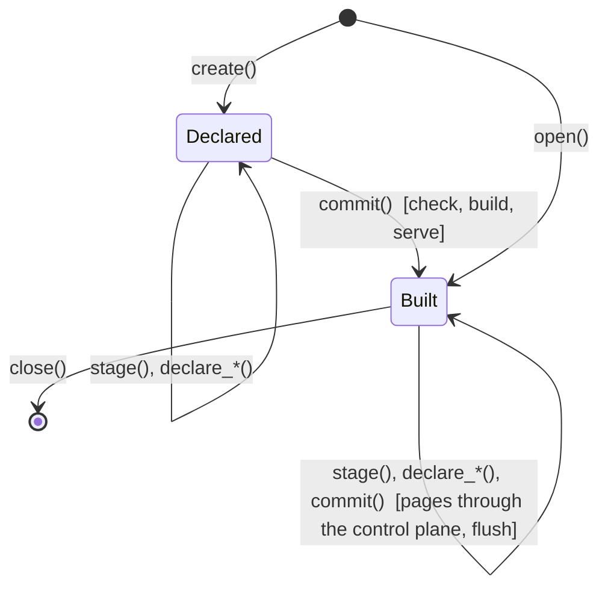

# The Python SDK: a Tessera database in a notebook

**Status:** Provisional — under review. Reviewed once under the user-experience and capability
lenses and re-reviewed on §3, §4, §6 and §12 after the rulings of §11.1. Before this becomes
normative: the owner's rulings on §11.2, and the examples in §10 run against the arXiv corpus. Nothing in this document is built except the
widget `Map` (client-components §7), which it uses unchanged.

**Owns:** the `tesseradb` package's verbs for creating, filling and reading a Tessera database,
and the shape of a local instance. It does not own the wire (contracts §3), the ingest model
(ingest.md), the declaration (configuration.md) or the widget's protocol (client-components §7).
Where it restates one of those it cites it; where they disagree, they win.

## 1. Who this serves, and what it does not

A data scientist with a table of points and something to say about their structure: a
DataFrame or a parquet file, coordinates from a projection, cluster labels, some text and
attributes. They want to see the map in the notebook they are working in, filter it, and go on
working with the data. The comparison set is datamapplot and embedding-atlas: a few lines from a
frame to an interactive map, in Jupyter or marimo.

The same person, later, wants the map served to other people, each seeing the items their
terms allow. Tessera's model is per-viewer aggregates over an authorised mask, and the local
case keeps that model rather than bypassing it: a local user holds every term, so they see
everything, and they can view the map as any principal to see what a viewer with fewer terms
would get.

The SDK covers three things:

- **A local database.** Created in a directory, filled from frames and files, served by a
  child process of the `tessera` binary, read through the widget and through query verbs.
- **Reading a hosted deployment.** `connect(url, token)` gives the same widget and the same
  read verbs against a deployment somebody else runs.
- **One lifecycle for the first load and every load after it.** Decision 0091 says a build is
  ingest into an empty database. The SDK has one set of verbs, and the first commit builds where
  later commits ingest.

The goal is the whole declaration: every block and key of configuration.md §1 has a verb
parameter, and every corpus declaration under `test_corpora/` can be regenerated through the
SDK. §12 stages the implementation; the stages are the order of building, not a narrower goal.

It does not cover:

- **Writing to a hosted deployment from a notebook.** The control plane has one operator
  credential and no per-principal authority, so an analyst publishing into a shared deployment
  is a write-authorisation question the system has not designed. That work precedes any hosted
  write verb.
- **The interactive surface of the map** beyond what the widget has today: what a selection
  returns, how it joins back to the user's frame, publishing a drawn region as an artifact.
  These take a design pass of their own.
- **Linking the engine into the kernel.** Issue #51 opens with a ruling on which guarantees
  survive the boundary's removal. A child process keeps the boundary, and the browser fetches
  tiles over HTTP either way, so embedding buys the notebook nothing.
- **A static export.** Tessera is served; a file with no server behind it is a different product.

## 2. The model

A database is a directory:

```
<dir>/
  tessera.toml        the deployment file (system-architecture §7), written by the SDK
  schema.toml         the declaration (configuration.md), written by the SDK
  sources/            parquet files the SDK wrote from frames; paths staged from files are read in place
  bundle/             what the build wrote
  .tessera/           cache, WAL, the SDK's commit log and its id map
```

Everything in it is what `tessera build` and `tessera serve` read. `tessera serve --deployment
<dir>/tessera.toml` on another machine serves the same database, which is how a notebook
prototype becomes a deployment.

```python
db = td.create(path=None, replace=False)
db = td.open(path)
```

The SDK keeps its own copy of the declaration as JSON under `.tessera/`, written at every
`declare_*`, so `open()` reads the blocks back without parsing TOML and a saved database that has
not committed yet reopens in the Declared state.

`create()` with no path makes a temporary directory that `close()` removes, on a RAM-backed
filesystem where the platform has one (`/dev/shm` on Linux and WSL2) and on disk otherwise, and
says which. The build reads and the server maps that directory, so a small corpus on the
RAM-backed path touches no disk; the engine itself has no in-memory backend and this document
does not ask for one. `save(path)` copies a temporary database out. `create(path)` on a directory that is not empty is refused naming `open()` and
`replace=True`, which removes what is there first. `open(path)` opens a saved database, serves
it, and its next `commit()` ingests, the bundle being present.

One lifecycle:



*The first commit builds; every later one ingests. The verbs before and after are the same.*

Three verbs carry the model. `stage(name, data)` binds a named source to a frame or a file.
`declare_*` adds a block to the declaration and names the sources it reads. `commit()` makes the
staged data part of the database: through the build the first time, through the control plane
after. `check()` is `commit()` with nothing sent.

## 3. Sources and identity

```python
db.stage(name, data, id=None, default=False)
```

`name` is a key in the declaration's `[sources]` table, and every declaration block that reads
data names one. `data` is a pandas or polars frame, a pyarrow table, or a path. A frame is
written to `sources/<name>.parquet`; a path is recorded and read in place, so a large file is
not copied. Staging a name twice before the first commit replaces the earlier data.

`default=True` makes this source the declaration's `[defaults].source`: a declaration block
that names no source reads it. Without a default the SDK writes no `source` under `[defaults]`
(the block still carries `allocation_view`, §4.2), and a block with no source is refused at
`check()` naming the block. A second `default=True` replaces
the first and the call says so.

**Identity.** The build reads a `u64` source id from each points file's `entity_id` column
(an unsigned or non-negative signed integer column is accepted), assigns its own entity ids
after the signature sort, and mints the external id as the source id in eight little-endian
bytes. The SDK assigns the source id. `id` names the column that identifies a row in the user's
own terms: a string, an integer, anything hashable. `None` means the frame's index: a named
index is an id column under its name; an unnamed default index is accepted at the first commit
as the row position, printed as such, and refused on a delta naming `id=`, since a filtered or
reset frame's positions name nothing. The SDK keeps a map from the user's id to the source id
under `.tessera/`, assigns a new source id to a user id it has not seen, in staging order, and
continues the sequence across commits. Every source that names entities (a points source, an
attribute source, a members table's `entity` column) goes through the same map, so one user id
is one entity everywhere. A frame is written with the `entity_id` column the build reads.

Each id in the map carries a state: assigned at staging, acknowledged at a commit (from the
commit log of §6.4), or removed. The pre-flight's "already present" reads acknowledged ids
only, so a page refused at one commit is sent at the next, and a removed id staged again goes
as a point row, which decision 0047 allows.

The user's id column is kept as an indexed `keyword` attribute under its own name, so a
record served at drill-down carries it and a pick joins back to the user's frame.

**Files read in place.** A path-staged points file whose `entity_id` column is an integer is
read in place, the map is the identity over its ids, and no keyword attribute is written, the
user's id being the source id. An entity-naming column (`entity`, `entity_id`) of any other
path-staged file with integer values is then read in place too, so a members table beside an
in-place points file names the same entities. A path-staged file whose id column is anything
else is read, mapped and written under `sources/`, and the report says so.

**External ids** are how a row is addressed after the first commit: on the ingest and values
routes, in `remove()`, and by the duplicate check (contracts §3.4). The external id is the
source id in eight little-endian bytes at both doors. The first commit passes
`--mint-external-ids`, so every built row is addressable afterwards; without it every route
that names a built row is refused. At ingest the SDK sends the same bytes.

**Re-running a cell.** The same frame staged again after a commit is wholly already present,
nothing is sent, and the report says so. A row whose value changed is a `409` on that part,
reported and not applied (§6.4).

After the first commit, `stage(name, data)` binds a delta: rows to add to what the source
already holds. The declaration says what the source feeds, so the SDK knows that a delta on the
points source feeds the view, the attributes and every layer minted from one of its columns,
and that a delta on a members source feeds one layer's memberships. A name the declaration
does not know is refused.

## 4. Declarations

Each `declare_*` verb adds one block of configuration.md's declaration. The SDK writes the
TOML and keeps it as `db.declaration`, and `tessera check` reads that file, so the mapping from
verb to block is checked by the binary rather than mirrored in Python.

### 4.1 The generic form

```python
db.declare(kind, block)
```

`kind` is `view`, `view_group`, `vocabulary`, `attribute` or `layer`, and `block` is the block
as a dict spelled with configuration.md's keys. The typed verbs below build this dict from
their parameters and call it. Every block is expressible through the generic form from the
first cut; a typed verb is the documented path, and the generic form is the escape hatch for a
key whose verb has not landed.

### 4.2 Views

```python
db.declare_view(name, source, x="x", y="y", access=None, default_label="public",
                extent=None, projection="none", visibility="public", anchor=False,
                title=None)
```

`x` and `y` name the coordinate columns on `source` (`lon` and `lat` under a projection);
`access` names a list-of-strings column of labels, one list per row, and `default_label` is
what a row with no labels takes (decision 0133). With no `access` column every row takes
`default_label`. `extent` is the frame: a box, a projection's domain, or `None`, which lets the
first commit fit one (§6.1). `visibility` is the view's own gate.

The first declared view is the allocation view (decision 0112) unless another says
`anchor=True`. The SDK writes `allocation_view` into the TOML in either case, so a rebuild
that reorders the blocks cannot re-key the corpus.

A second plain view over the same entities names a source carrying the same ids, a second
pair of coordinates, and the same labels: the build refuses an entity whose labels disagree
between views, and the ingest route refuses a join row whose labels differ from the held ones
(views.md §4). For a frame the SDK copies the first view's access column into the second by
id and says so; for a file read in place that lacks the column, it refuses naming the column.

### 4.3 View groups

```python
db.declare_view_group(name, views=None, source=None, view_field=None, members=None,
                      metadata=None, access=None, default_label="public", extent=None,
                      projection=None, visibility="public", title=None)
```

`views` is form A, a list of `{key, source, visibility?, ...metadata}`, each view its own
source. `source` with `view_field` is one points source for every view, the column naming which
view a row belongs to; `members` names another group whose views this group shares. `metadata`
is the per-view values as `{name: type}`; `access` and `default_label` are the group's
`point_visibility`. Form B's roster as a table (`[view_group.views]`) has no parameter and is
declared through the generic form. A group-scoped attribute or layer names the group in
`scope` (§4.5, §4.6). views.md owns the semantics.

### 4.4 Vocabularies

```python
db.declare_vocabulary(name, width=None, closed=False, visibility="public", source=None,
                      values=None, reserved=None, fields=None, title=None)
```

A closed vocabulary names a `source` of `(key, title?)` rows or gives `values` inline; an open
one minted from the data needs neither and may name a source for titles. `width` is the code
space's width and is fixed at the first commit, so when not given the SDK takes one width above
what the distinct count needs, `u16` at least, and prints it: an open vocabulary at the width
its first values fill has no code for the next one. `visibility` is `public` or `derived`.

### 4.5 Attributes and inference

```python
db.declare_attribute(name, type, source=None, field=None, vocabulary=None, render=None,
                     index=None, analyser=None, scope="entity", fields=None, title=None)
```

An attribute joins by entity id and belongs to no view, so it reads the source it names or the
default source. `declare_view` claims id, x, y and access on its source, and a layer's
`from_column` claims its column; if that source is the default, every column not claimed
becomes an attribute by the rules below, and the SDK
prints the table once, stating each vocabulary it declared as open and public. An explicit
`declare_attribute` on the same name overrides the inferred block. On a source that is not the
default nothing is inferred.

| Column dtype | Declared as | `render` | `index` |
|---|---|---|---|
| integer, float, bool | the matching width | yes | yes |
| datetime | `timestamp_us` | yes | yes |
| string, few distinct values | `category` over an open, public vocabulary of the same name, width one above the count (§4.4) | yes | yes |
| string, many distinct values, short | `keyword` | no | yes |
| string, long | `text` | no (the build refuses it) | yes |
| list of strings | not inferred; declare it, or name it as `access` | | |
| anything else | not inferred; declare it | | |

"Few" and "short" are thresholds the SDK states in the printed table (assumed: at most 4,096
distinct values, and a median length under 64 characters). They decide a default; the user
overrides one column with one call.

An open public vocabulary publishes value names minted from the data to every principal, and
`tessera check` prints a warning per such vocabulary. On a local database the user is the
authority the warning asks for, so the SDK's table states the choice once and the build's
warning is not repeated per column. Issue #83 is open on serving `derived` visibility, under
which a value exists for a viewer only if they can see a point carrying it; when it serves,
`derived` becomes the inferred default.

`render` is decided here because it cannot be added later: a render column lives in the hot row
and a running service refuses to declare one (decision 0136's amendment). The commit report
lists the render columns it froze.

### 4.6 Layers

```python
db.declare_layer(name, kind, views=None, source=None, members=None, from_column=None,
                 artifacts=None, membership="enumerated", value_set=None, levels=None,
                 prune_children=False, shape=None, default_space="view", layout=None,
                 visibility="public", artifact_visibility="inherited",
                 require_member_visibility="none", withdraw_on_member_deletion=False,
                 depends_on=None, computed=("centroid", "box", "hull"), supplied=None,
                 scope="entity", fields=None, title=None)
```

`kind` is `flat`, `nested`, `stacked` or `tiered` (annotations.md), or `dag`
(dag-hierarchies.md); `levels` is a list of `(level, title, zoom?)` for the kinds that take
them. `views` defaults to every view. `membership` is `enumerated`, `spatial` (with `shape`
naming the kind and `default_space` the space) or `{"attribute": field}`.

An enumerated layer's membership comes one of two ways, and the declaration fixes which:

- **From a column** (`from_column`): a column on the points source holding one key per row, or
  a list of one key per level for a tiered layer. The build and the ingest route both mint the
  artifacts from it (decision 0128). Such a layer has computed content only, and the SDK writes
  `value_set = "open"`, without which a key the layer's artifacts do not declare is refused. At
  the first commit it compiles to `[layer.members]` reading the points source with the column
  as `key`; declared after it, the SDK writes the column as a members table under `sources/`,
  since `tessera check` reads the declaration against the files each time and a file read in
  place does not carry the new column.
- **From tables** (`source` and `members`, or `artifacts` inline): an artifacts table
  `(level, key, parent?, contents?, attached_layer?, attached_level?, attached_key?, space?,
  a shape column?, excluding?)` and a members table `(level, key, rank?, entity)`, the shapes
  under `data/notebook/`. `members` with no `source` and no `artifacts` declares a layer whose
  artifacts are exactly the keys the members carry, and the SDK writes `open`. This is the only
  way for a layer with supplied content, since an artifact served without content its layer
  declares cannot be told from one whose content was withheld.

`supplied` lists the content kinds an artifacts table's `contents` column carries, as
`(name, type, gate)` with `gate` `all` or `inherited`; `computed` lists what the engine derives
per viewer. `visibility`, `artifact_visibility` and `require_member_visibility` are the layer's
disclosure controls (configuration.md); `artifact_visibility` is a default, or `{"field":
column, "default": label}` reading a column of the artifacts table. The local defaults are public, inherited and none, and
the commit report prints them, because a local user holds every term and a deployment author
sets them. `value_set` is printed whenever the SDK chose it, since under `open` a mistyped key
is a permanent artifact.

### 4.7 Labels

```python
db.declare_labels(name, of, source, members=None, content_requires=None, type="text",
                  require_member_visibility="none", artifact_visibility="inherited",
                  title=None)
```

A label set over a clustering: the `[layer.labels]` block, which expands to a flat layer of
supplied content depending on `of`. `source` is `(key, contents)` rows or a mapping from
cluster key to text. `content_requires` is the content-grain gate and takes `all` or
`inherited`: `all` means the text was generated from the members in `members`, the generating
set `(key, rank, entity)`, and is served only to a viewer who can see every one of them;
`inherited` means the label is served wherever its cluster is and declares no generating set.
The default follows `members`: `all` when given, `inherited` when not, and the other pairings
are refused at the call. `require_member_visibility` is the layer grain, how much of a label's
membership a viewer must see before the label exists for them.

### 4.8 What the TOML always says

The SDK writes every source name on every block, the allocation view, `value_set` on every
layer, and the disclosure controls on every layer and vocabulary, whether the user said them or
the defaults did. A reader of `schema.toml` sees the whole declaration without knowing the SDK's
defaults.

## 5. `check()`

Before the first commit, `check()` runs `tessera check` on the directory and returns its
table: what the declaration reads from each file, and the disclosure decisions it makes.
Schemas only, no rows.

After the first commit, `check()` plans the commit (§6.2) and runs the pre-flight (§6.3) and
returns the plan and the pre-flight findings with nothing sent. Both return a report object
that prints as a table.

## 6. `commit()`

### 6.1 The first commit

Runs `tessera check`, then `tessera build --mint-external-ids`, then starts `tessera serve`
(§7), and returns the build's report. Three things happen at the first commit and at no later
one, and the report says each:

- **The frame is fixed.** A view with `extent=None` has its frame fitted to its staged rows,
  widened by half the fitted box's width on each side (assumed default; the report prints the
  frame). A frame is index configuration and does not change for the life of the view. The
  build clamps a row outside the frame and reports the count (configuration.md §1); ingest
  refuses it (write-path §2.1 step 9). A user who will add rows later declares `extent`, and
  the refusal message names `extent=`.
- **The column types and render flags are fixed.** A later `declare_attribute(render=True)`
  is refused with decision 0136's wording; an indexed column can be added at any time.
- **The allocation is signature-sorted** over the whole staged corpus, which ingest does not do.
  This affects posting compression and latency (ingest.md §5), never what is served.

A first commit with no points staged builds an empty database, which needs an explicit
`extent` on every view; the SDK refuses it otherwise, naming the view.

### 6.2 Later commits: the plan

A part supplied twice is accepted, a part supplied differently is a `409` on that part, and a
set grows by the delta (ingest.md §1.1). Ordering therefore matters only for existence, and
the order is fixed:

1. **Declarations** added since the last commit, as the runtime `PUT`s (ingest.md §1.3). The
   layer bodies come from `tessera check --payloads`. Not built yet: that emitter covers layers
   only; attributes, vocabularies, views and view groups need the same, and until then the SDK
   cannot declare those after the first commit (§11.2 C).
2. **Points**, per view, the allocation view first, in pages under the limits `/control/status`
   publishes, with `x-tessera-view` on each. A from-column layer's key travels with a new row
   and mints its artifact at the window close. A delta on a second view's source carries ids,
   coordinates and the entity's held labels, which the SDK staged (§4.2), and joins existing
   entities; a join row with different labels is refused as a re-label.
3. **Values** on existing entities, one page sequence per staged attribute delta
   (`POST /control/values`). A from-column layer's key on an existing entity does not go here:
   the values route fills a column and mints nothing, so a key no artifact holds is refused.
   The plan groups such a delta by key and sends it as publish requests in step 4, each
   artifact carrying its members, which is what the column would have done at the build. A new
   clustering over existing points is therefore a new layer and its artifacts, whether the user
   staged a column or an artifacts table.
4. **Artifacts**, per layer in dependency order: a clustering before its labels, a target before
   a layer attached to it, a layer before one that depends on it. Within a layer, `PUT` pages
   carry members, parent, shape and content; a nested batch resolves parents that are its own
   siblings, and a tiered chain goes coarse level first. Content gated `all` travels on the
   publish record with the first page of its generating set, since the route refuses a content
   fill on such a layer; further set pages are `PATCH` at the rank. A held key falls under the
   fill rule: a members delta is a `PATCH` join, and content gated `inherited` is filled by
   `PATCH`. Not built yet: filling `all`-gated content onto an artifact published without it has
   no route; the plan refuses that case and names the artifact.
5. **Flush** (`POST /control/flush`), which is accepted and runs at the next executor tick.
   `commit()` then reads `/control/status` until the publication after its last acknowledgement,
   so the next cell sees the rows; the report's flush time is that wait.

The commit returns a report: rows accepted per view, artifacts minted, memberships joined, parts
already present, refusals by row and part, and the flush time.

### 6.3 Pre-flight

Before a byte is sent, against the declaration, the id map and `/v1/meta`:

| Finding | Action |
|---|---|
| rows outside a view's frame | dropped and listed, with the frame; the server would refuse the whole page |
| rows whose id the map holds as acknowledged, in a points delta | listed with their count and not sent, so a re-staged full frame reads as already present rather than as a page of refusals |
| a column no block declares | refused, naming the column |
| a key column staged for a layer that declares supplied content | refused, naming the artifacts-table route |
| a labels delta whose clustering is not yet held | ordered after the clustering's pages, or refused if none are staged |
| `all`-gated content on a held artifact that has none | refused, naming the artifact |

This is CLAUDE.md's rule for inputs: ignore and report, and refuse only where the server would.

### 6.4 Idempotency and resumption

A page's batch id is derived from the source name, the page index and a hash of its bytes, and
the commit log under `.tessera/` records each acknowledgement. A cell re-run inside the WAL
retention window is answered as a replay (write-path §2.4). Past it, the log skips acknowledged
pages, and identical parts are no-ops. A `409` on a differing part is reported and not retried:
an edit is a delete and a re-ingest (decision 0047), and the SDK does not do that on the user's
behalf.

### 6.5 Verbs that are not stages

`remove(ids)`, `suppress(ids)` and `unsuppress(ids)` go to `/control/changes` under the two
removal rules (write-path §5.4). `leave(layer, key, ids, rank)` shrinks a generating set, the one
set that may (decision 0135). Each takes the user's ids and maps them.

## 7. The local instance

`commit()` starts `tessera serve` as a child of the kernel over the directory's `tessera.toml`,
which the SDK writes with:

- `[serve]` viewer, session and control on loopback, port 0 each. Not built yet: `serve` binds
  the addresses the file names and announces nothing; it needs to accept port 0 and print the
  three bound addresses as one JSON line on stdout, which the SDK reads (§11.2 A).
- A session credential and an identity key, generated per database and stored in the directory
  with owner-only permissions, named by the `_file` and `env` keys the deployment file takes.
- `[disclosure] token_max_lifetime`, required, at one hour.
- The viewer plane's origin list. The notebook page's origin is the front end's, unknown at
  start and not enumerable for a webview. Not built yet: a `serve.cors_loopback = true` rule
  admitting any page served from a loopback address, which is a bounded statement about which
  pages may present a token and a ruling under configuration.md's closure argument (§11.2 B).
  Until it exists the SDK writes `cors_origins` from `TESSERA_NOTEBOOK_ORIGIN`, and a widget
  from an unlisted origin is refused by the browser.

The binary is `TESSERA_BIN` when set, else the first `tessera` on `PATH`, else a checkout's
target directory, release before debug; the create report names the one used. At release a
platform wheel carries it (§11.2 E). The SDK generates an operator credential beside the
session credential, since the deployment file requires both.

`db.close()` stops the child; the kernel's exit does the same.

## 8. Reading

```python
db.map(view=None, layers=None, colour_by=None, filters=None, height=480)
db.viewer(terms).map(...)
v = td.connect(url, token); v.map(...)
```

`map()` is the widget of client-components §7, unchanged: control and selection cross the
kernel boundary, data does not. On a local database the token is minted by the SDK from the
directory's session credential through the passthrough plugin, which grants the terms listed.
The SDK lists every term it has seen: at each commit it records the distinct labels of every
access column it staged, plus each view's default label, in its log, and `map()` mints with
that set. A database with no access column has one term, the default label, and the union is
that. This is Python asserting the local principal's authority, which is admissible on a
single-operator database and nowhere else. `viewer(terms)` mints for the named terms, so the
map of any principal is one call. `connect(url, token)` takes a token the deployment issued and
has no `viewer(terms)`.

Query verbs (`meta()`, `viewport(...)`, `item(id)`, `artifacts(...)`) are issue #47's and follow
the same rule: a local handle and a hosted one answer through the viewer plane with a token,
never by reading the bundle. Their signatures are not fixed here.

## 9. What the first commit fixes, and what it does not

| Fixed at the first commit | Open at any commit |
|---|---|
| a view's frame and projection | rows, in any view |
| a column's type | values on existing rows |
| which columns render | indexed attributes, vocabularies, values |
| the allocation view | layers, artifacts, memberships, labels; a new clustering over existing rows |
| | plain views and view groups' views, with a stated extent |
| | deletions and suppressions |

## 10. Examples

### 10.1 Coordinates, cluster labels, hover text

```python
import tesseradb as td

db = td.create()
db.stage("points", df, default=True)          # index as id; x, y, title, year, cluster
db.declare_view("map", source="points")
db.declare_layer("clusters", kind="flat", from_column="cluster")
db.declare_labels("topics", of="clusters", source=topic_names)   # {cluster_key: text}; inherited
db.commit()
db.map(colour_by="cluster:clusters")
```

### 10.2 The arXiv corpus from files, with terms and three layers

The declaration under `data/notebook/schema.toml`, as calls. The files carry `entity_id`, so
they are read in place.

```python
db = td.create(path="~/tessera/arxiv")
db.stage("points", "points.parquet", default=True)
for name in ["kmeans", "kmeans_members", "kmeans_topics", "kmeans_topic_members",
             "hdbscan", "hdbscan_members", "hdbscan_topics", "hdbscan_topic_members",
             "taxonomy", "taxonomy_members", "archive", "primary_category"]:
    db.stage(name, f"{name}.parquet")

db.declare_view("s0", source="points", access="categories", title="arXiv, 50,000 papers")
db.declare_vocabulary("archive", source="archive", closed=True, width="u8")
db.declare_vocabulary("primary_category", source="primary_category", closed=True, width="u16")
db.declare_attribute("archive", type="category", vocabulary="archive", render=True, index=True)
db.declare_attribute("primary_category", type="category", vocabulary="primary_category",
                     render=True, index=True)
db.declare_attribute("submitted_at", type="timestamp_us", render=True)
db.declare_attribute("title", type="text", index=True)
db.declare_attribute("abstract", type="text", index=True)
db.declare_attribute("arxiv_id", type="keyword", index=True)

db.declare_layer("clusters/kmeans", kind="flat", source="kmeans", members="kmeans_members",
                 require_member_visibility={"count": 50})
db.declare_labels("topics/kmeans", of="clusters/kmeans", source="kmeans_topics",
                  members="kmeans_topic_members", content_requires="all")
db.declare_layer("clusters/hdbscan", kind="nested", source="hdbscan", members="hdbscan_members",
                 require_member_visibility={"fraction": 0.05})
db.declare_labels("topics/hdbscan", of="clusters/hdbscan", source="hdbscan_topics",
                  members="hdbscan_topic_members", content_requires="all")
db.declare_layer("taxonomy/arxiv", kind="tiered", source="taxonomy", members="taxonomy_members",
                 levels=[(0, "archive"), (1, "subject class")],
                 require_member_visibility={"count": 1}, computed=("centroid", "box"))

print(db.check())
db.commit()
print(db.declaration)

db.map()
db.viewer(terms=["math.AG"]).map()
db.viewer(terms=["cs.LG", "stat.ML"]).map(layers=["clusters/hdbscan"])
```

### 10.3 A week of new papers into the running database

```python
db.stage("points", new_df)                       # a delta of papers
db.stage("kmeans", pd.DataFrame({"level": [0], "key": ["k-new"]}))
db.stage("kmeans_members", members_of_k_new)     # (level, key, entity)
db.stage("kmeans_topics", pd.DataFrame({"level": [0], "key": ["k-new"],
                                        "contents": [["Diffusion models for audio"]]}))
db.stage("kmeans_topic_members", generating_rows)   # (level, key, rank, entity)
print(db.check())     # the plan and the pre-flight
db.commit()           # the report
```

### 10.4 A second clustering over the same points

```python
db.stage("points", df.assign(cluster2=labels2)[["id", "cluster2"]], id="id")   # held ids, one new column
db.declare_layer("clusters/second", kind="flat", from_column="cluster2")
db.commit()           # published as artifacts with members, one per key
db.map(colour_by="cluster:clusters/second")
```

### 10.5 Two projections over one set of papers

```python
db.stage("points", df_knn, id="arxiv_id", default=True)
db.stage("points_pca", df_pca, id="arxiv_id")    # arxiv_id, x, y; the SDK copies `categories` by id
db.declare_view("knn",   source="points",     access="categories")
db.declare_view("pca64", source="points_pca", access="categories")
db.declare_layer("clusters/kmeans", kind="flat", from_column="cluster", views=["knn", "pca64"])
db.commit()
db.map(view="pca64")
```

### 10.6 A hosted deployment

```python
v = td.connect("https://tessera.example/viewer", token=my_token)
v.map(colour_by="cluster:clusters/kmeans")
```

### 10.7 Keep it, reopen it, serve it elsewhere

```python
db.save("~/tessera/arxiv")
db = td.open("~/tessera/arxiv")
# elsewhere:  tessera serve --deployment ~/tessera/arxiv/tessera.toml
```

## 11. Rulings

### 11.1 Made

Owner rulings on the first review's findings, 2026-09-16:

- The SDK assigns entity ids and mints external ids at the first commit; the user's id is an
  indexed keyword attribute (§3).
- `create(path)` refuses a non-empty directory; `replace=True` and `open()` are the two ways in
  (§2).
- A label's content gate is `all` or `inherited`; `none` at that grain would mean `inherited`
  (§4.7).
- Inferred vocabularies are open and public; the SDK states it once and does not repeat the
  build's warning per column; `derived` becomes the default when #83 serves it (§4.5).
- The local principal's terms are the union the SDK recorded at commit; an all-terms claim in
  the plugin is not asked for and may be reopened, since some users want no access control at
  all (§8).
- `declare_layer` carries `supplied` and `value_set`; from-column and members-only layers are
  written `open` (§4.6).
- A from-column delta over existing rows is published as artifacts; `all`-gated content travels
  with its first generating-set page (§6.2).
- The goal is the whole declaration surface, staged in §12, with `declare(kind, block)` as the
  generic form every typed verb compiles to (§1, §4.1).

### 11.2 Needed

- **A. Port 0 and the announce line in `serve`.** A small change to the server's start. Without
  it the SDK picks free ports and writes them, which races.
- **B. `serve.cors_loopback`.** A disclosure control, so an owner ruling. The alternative is
  the proxy arm of client-components §7, which is more work and serves VS Code and Colab too.
- **C. `check --payloads` for attributes, vocabularies, views and view groups.** One
  implementation of declaration to payload (decision 0139) against four blocks mirrored in
  Python. Recommended: the emitter.
- **D. The demo.** A marimo notebook and a Jupyter twin over the arXiv 50k corpus running
  §10.1 to §10.5 and §10.7, in `clients/py/examples/`. A headless test in `clients/py/check.sh`
  that creates, commits and queries a database with no browser.
- **E. The binary at release.** Platform wheels carrying it. Until then `PATH`, `TESSERA_BIN`
  or the checkout.
- **F. Edits.** No edit verb; a changed value is reported as a `409`. A `set(replace=True)`
  that deletes and re-ingests under the same id is a ruling under decisions 0047 and 0081.

## 12. Order of work

Each stage is proven the same way: the SDK regenerates a corpus declaration from calls, and
`tessera check` over the regenerated file prints the disclosure table the committed file
prints. The stages order the building; the goal is all of them.

| Stage | Delivers | Proven by | Depends on |
|---|---|---|---|
| S1 the notebook corpus | `create`, `open`, `stage` with the id map, `declare` and the typed verbs for plain views, vocabularies, attributes, enumerated layers of every kind with supplied content and value sets, labels; inference; `check()`; the first commit with mint, serve, `save`, `close` | `data/notebook/schema.toml`, `test_corpora/arxiv` | A |
| S2 reading | `map()`, `viewer(terms)`, the term union, `connect(url, token)` | the widget's tests | S1, B |
| S3 pages | later commits: the plan, the pre-flight, batch ids and the commit log, the flush wait, the report, the from-column publish, layers and labels declared after the first commit (the emitter covers them); `remove`, `suppress`, `unsuppress`, `leave` | §10.3 and §10.4 against the served answers | S1 |
| S4 the rest of the layer surface | spatial and attribute membership, shapes and spaces, per-level zoom, prune, attached and dependent layers, inline artifacts and values, exclusion | `overture`, `geonames`, `gbif`, `treeoflife`, `medcpt`, `paperseek` | S1 |
| S5 groups | `declare_view_group`, scoped attributes and layers, `view` on the record | `multiview` | S1, S3 |
| S6 runtime declarations | attributes, vocabularies, views and view groups declared after the first commit | | S3, C |
| S7 demo | the two notebooks and the headless test | | S2, S3 |

The Rust changes (A, B, C) are small and sit in the server and the CLI; the engine is untouched.
