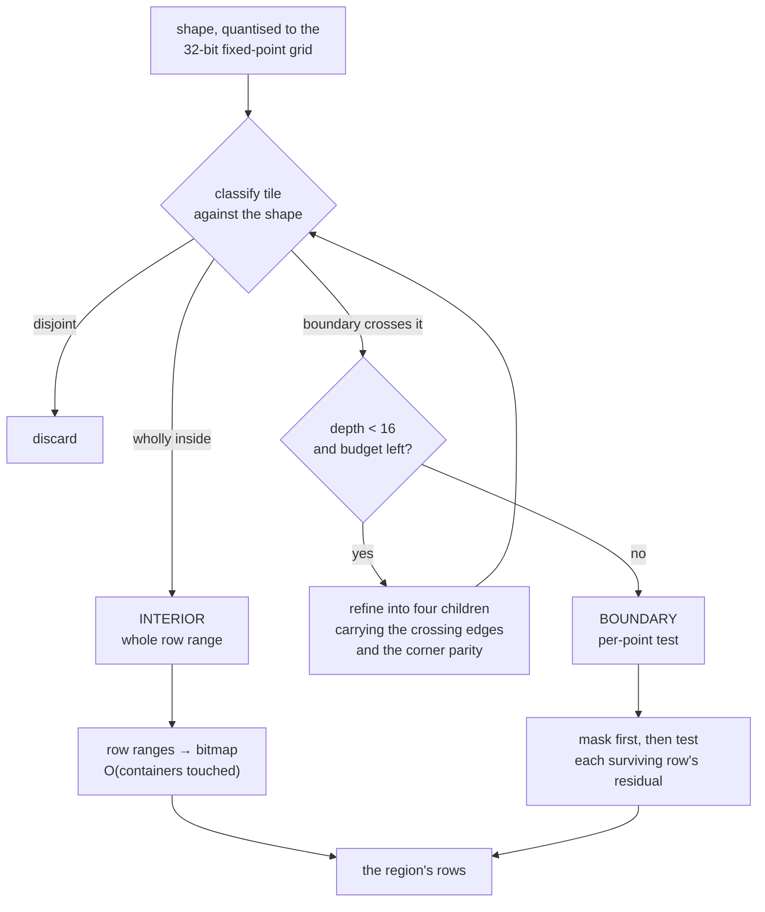

# The selection operand

**Status:** Provisional — drafted and taken through one adversarial review (Appendix R), 2026-08-26.
**The three rulings of §10 were taken on 2026-08-29, each as recommended**: (a) the result is a
row-space set over the whole view; (b) the cached region set is shared across principals, with no
register row; (c) the exactness verdict rides as a response header. `architecture.md` §8.2 admits
the third operand kind. What remains before this document becomes normative is the build — the
shape work's stage 4 ([`polygon-membership.md`](polygon-membership.md) §12), which also gives the
leaf its second spelling, by published artifact, and its `space` field — and the ⊘ markers below
are removed as it lands.

**Owns:** what happens when a viewer draws a box or a lasso on the map and asks *how many of my
items are in it* and *narrow everything to these*. The decomposition of a shape against the Morton
cell structure, the operand it produces, how that operand composes with the other filters, what
makes the answer exact, and what the client stops doing.

**Reads with:** `architecture.md` §4 (the invariants), §7.1–§7.3 (what a tile answers), §8.2 (the
filter contract this extends) and Appendix C (the leak register, and why this adds no row to it);
[`contracts.md`](contracts.md) §3.2 (the `filters` object, `/v1/meta`'s `selection` block, and
`POST /v1/region` — the export verb, specified and unbuilt);
[`client-components.md`](client-components.md) §5.11 (what a selection can do with the wire as it
is); [`client-interaction.md`](client-interaction.md) §9 (the ruling that selection should become a
content-addressed filter operand) and §8.1 (the export threshold);
[`filter-surface.md`](filter-surface.md) and [`filter-result-cache.md`](filter-result-cache.md).
Decisions [0062](../decisions/0062-filters-compose-as-a-boolean-tree-inside-the-candidate.md),
[0065](../decisions/0065-the-inverse-permutation-is-stored-for-the-filtered-viewport.md),
[0066](../decisions/0066-none-of-requires-a-value-and-names-one-column.md),
[0068](../decisions/0068-a-row-space-operand-bounded-by-the-requests-domain-is-admitted.md)
and [0097](../decisions/0097-the-tile-grid-is-never-shown.md) are the ones it rests on.

## 1. The problem, and what changes

A viewer drags a box or draws a lasso. Three things should follow: a count of their own items inside
it, a highlight, and *filter to this* — every other number and every mark narrowed to the shape.

**Today the count is inexact, the highlight is the client's own, and the third does not exist.**
`clients/ts/core/src/region.ts` rasterises the
shape to Morton prefixes at the deepest depth whose cover stays under a few thousand tiles, sends
that list as a `k = 0` request in the `tiles` form, and sums the returned per-tile counts. The sum is
the exact masked count **of the cell cover**, which is a superset of the shape: a cell the boundary
crosses is counted whole. The client's `cellExceedsPixel` decides whether that difference is *visible*
at the current zoom, not whether it exists — the answer is never exact for the shape the user drew.
And because the shape is expressed as a tile list rather than as a predicate, it cannot be combined
with the other filters, so *filter to this* has nothing to be.

**What this design makes true.** The shape is a **filter leaf**, sent on the ordinary viewport
request beside the other filters. The server intersects it with the Morton cell structure: cells
wholly inside the shape are whole row ranges and cost bitmap arithmetic, and only the cells the
boundary crosses take a per-point in/out test. The count is then exact for the shape against the
stored geometry — the same 32-bit-per-axis position the client draws each mark at — so the number
and the picture agree. *Filter to this* is the existing filter mechanism with one more leaf in it,
not a second machine.

Three consequences worth seeing before the mechanism:

- **The wire gets smaller, not larger.** A polygon replaces a list of up to a few thousand Morton
  prefixes.
- **The extra round trip disappears.** The region rides the viewport request the client was sending
  anyway, so a selection costs no second call.
- **Inexact becomes the exception.** Today the answer is exact for a cover at every zoom. Here it is
  exact for the shape unless the shape's perimeter exceeds a published budget, which an ordinary
  drawn selection does not reach (§6).

## 2. The shape on the wire

A **region leaf** in `filters` (contracts §3.2), spelled as the shape that `POST /v1/region` already
specifies so that the operand and the export verb never disagree about what a shape is.
⊘ *Specified, not implemented — no server accepts this leaf, and a request carrying one is refused
today as an unknown column. What a client has instead is the `tiles` form described in §1.*

```json
{"all_of": [{"department": {"in": ["eng", "sales"]}},
            {"region": {"polygon": [[x, y], [x, y], …]}}]}
```

`region` takes exactly one of `polygon` — at least three vertices, implicitly closed — or `bbox`, as
`[x0, y0, x1, y1]`. Coordinates are in the view's own world space, the space `/v1/meta`'s
quantisation bounds define and the client already works in.

**`region` becomes a reserved column name**, refused at the build exactly as `all_of`, `any_of` and
`none_of` are (decision 0062: a filter expression names columns directly, so a column called `region`
would make a request mean two things). Refusing it at the declaration is one error against one
declaration rather than an ambiguity at request time. ⊘ *Specified, not implemented — the build
today accepts a column named `region`, and a deployment that has declared one cannot gain this
operand until it is renamed.*

**Two bounds, published as deployment constants** in `/v1/meta`'s `selection` block, on the argument
that block already carries for `max_tiles_per_request`: a client choosing a shape is choosing a cost,
and a refusal it cannot predict is indistinguishable from its own arithmetic being wrong. Both are
identical for every principal and disclose nothing.

| Constant | What it bounds | What happens at the bound |
|---|---|---|
| `max_region_vertices` | vertices in one `polygon` | `422 contract`, naming the count and the limit |
| `max_region_cells` | boundary cells the decomposition may hold at once (§3) | **not a refusal** — the decomposition stops shallower and the answer is marked inexact (§6) |

The asymmetry is deliberate. A vertex count is the caller's own arithmetic and a refusal teaches the
fix. A perimeter is a property of a shape the user drew with a mouse; refusing a legitimate large
selection would move the cost onto the caller for a case that leaks nothing and is recoverable by
saying so. Report, and let the client decide what to show.

**A region leaf is answered against the request's own `view`.** Coordinates mean nothing across
views, and nothing in the request permits naming a second one.

## 3. The decomposition

Geometry is stored in Morton order, so a depth-*d* tile is a contiguous run of row IDs within each
segment (contracts §2.5). The decomposition turns a shape into two sets of tiles.



*How a shape becomes a row set. Only the right-hand branch reads per-point data, and only for the
rows the mask already admits.*

**The descent starts at the root and refines only what the boundary crosses.** A tile disjoint from
the shape is discarded whole; a tile wholly inside is emitted as an interior tile and never opened.
The count of tiles the boundary crosses at depth *d* grows as 2^*d* for a rectifiable boundary — it
is a length, not an area — so the descent's whole cost, and the number of interior tiles it emits,
are **linear in the shape's perimeter and independent of its area**. A selection covering half the
map is not expensive; a selection with a very long edge is.

**Each crossing tile carries the edges that cross it and the parity of one corner**, both refined
incrementally: a child's edge list is its parent's edges filtered against the child, and a child's
corner parity follows from the parent's corner parity plus the crossings along the internal cross.
So no leaf recomputes a full point-in-polygon walk over every vertex, and the per-point test at a
boundary cell is over that cell's own handful of edges, seeded from its own corner. *Modelled, not
measured:* the descent is O(Σ_d edges crossing depth *d*) and the leaf test is O(edges in the cell)
per point. No measurement of either exists.

**The descent bottoms out at depth 16, and that is the grid rather than a parameter.** Rows are
sorted by `(Morton cell code, tessera_id)` — contracts §2.6 fixes that order, and within a cell it
is the identity order the wire serves points in, which is what makes the finest tile's served order
free. The sub-cell residual is **not** a sort key, so below one cell a region of space is not a
contiguous row range and no refinement can make it one. This costs nothing worth having: the grid
is 2¹⁶ × 2¹⁶, so at 10⁹ points a cell holds about 0.23 of them on average, and there is essentially
nothing inside a cell for a finer range to split. Re-sorting rows by `(cell, residual, tessera_id)`
to buy sub-cell ranges was considered and declined on exactly that arithmetic, and it would cost the
served order at every depth-16 tile.

**The boundary test reads four bytes per candidate row.** A boundary cell's rows are intersected
with the composed mask *first*, and only the survivors are tested: the cell's own coordinates supply
the high half of each axis and `columns.arrow`'s `residual` column the low half, so a row's stored
position is recovered exactly — `unsplit32` is a bit permutation and moves nothing — and tested
against the cell's edges. Masking first is both the cheaper order and the one §8.2 requires ("the
mask goes in first, not last").

**Even-odd, and closed on every side.** A self-crossing lasso still answers, and a point exactly on
an edge is inside. This is the rule `region.ts` already implements for the live highlight, and the
two must not diverge — §8 states that as the client's obligation.

## 4. What it costs

Let the shape span *c* cells across at depth 16 and hold *n* of the viewer's visible points.

| Term | Cost | Grows with |
|---|---|---|
| descent | O(perimeter in cells), ≤ 16 levels | the shape's edge length |
| interior | O(perimeter) row ranges → one bitmap | the shape's edge length |
| boundary | ≈ *n* · 4/*c* per-point tests | the shape's edge length ÷ its area |
| crossing to entity space | **none** | — |

The area term never appears. A shape one cell across is all boundary; a shape a thousand cells
across has roughly 0.4% of its points on the boundary and the rest arrive as bitmap arithmetic.
That is the measured cost model doing its work — **bitmap operations cost O(containers touched), not
O(cardinality)** — and it is the whole argument for classifying interior cells rather than testing
their points.

**Modelled, not measured.** Every figure above is arithmetic over the grid and the published cost
model; **no arm of this route has been run**. The boundary term in particular depends on how the
deployment's points are distributed: the 4/*c* ratio assumes a shape whose interior is not empty,
and a corpus whose density is concentrated on the shape's edge inverts it. A probe over the
synthetic 10⁹ corpus, sweeping shape size and vertex count, is what would settle it. The one
measurement this design does lean on is about the **rejected** alternative — §5's entity-space
form — and is quoted there.

**There is no route chooser.** One construction answers every shape, so execution time is a function
of the shape and of the viewer's own visible rows within it, never of a statistic about the corpus —
§8.2's "keep it a pipeline, not a planner", obtained here by there being only one pipe.

## 5. The result, and how it composes

**The operand produces a set of rows over the whole view** — `FilterRows::Complete` in the engine's
existing vocabulary: exact at any range, not bounded by the request's tiles. It intersects with the
composed candidate like any other operand, and the viewport's counting path already takes a
row-space filter set (`EffectiveMask::with_filter`), so nothing new consumes it.

**Why row space and not entity space.** This is the design's one departure from the delivery
record's wording, and §10 (a) puts it to the owner. The argument:

- **I4 places geometry in row space.** A region is a statement about position and nothing else, so
  row space is the space it is already in.
- **A region's entity-space form is the structure that was measured and refuted.** Crossing the rows
  is cheap — decision 0065 stores `row-entity.u32`, so row→entity is an array read at a measured
  ~0.4 ns per row rather than a Feistel inversion at ~17.5 ns. The cost is not the crossing, it is
  the *representation*: entity IDs are assigned in permission-signature order and are uncorrelated
  with position, so **a Morton cell's entity set is scattered in entity space**, which is Roaring's
  worst case. A region held that way touches essentially every container, so intersecting it with
  `M_auth` costs O(corpus) rather than O(the region). This is not modelled — it is
  [`probes/2026-08-11-viewport-crossing/`](../../probes/2026-08-11-viewport-crossing/)'s third arm,
  a per-Morton-cell entity bitmap, measured as the slowest of three routes at every one of sixteen
  cell widths by 4–400× and larger on disk than the array it emulates. In row space the same region
  is a handful of contiguous ranges. **The entity-space form inverts exactly the property the ruled
  approach rests on.**
- **Nothing needs the entity-space form at request time.** The operand's consumers are the tile
  counts, the point sweep and the artifact pass, all row-space. The one consumer that genuinely
  needs entity space is a *persisted* selection — an artifact's membership is stored in entity space
  (`annotation-representation.md` §2.0) — and that is a write-time crossing paid once, over one
  shape, and never on the read path (§9).

**Composition follows decision 0062's tree and 0068's crossing rule unchanged**: entity-space
sub-trees are evaluated under the candidate and crossed into row space once, and row-space leaves
combine with them there. The region leaf differs from 0068's render-column leaf in one way that
matters: its answer covers the whole view, where a render leaf's covers only the request's tiles. An
expression holding both is therefore an answer about the *render* leaf's narrower domain, and that
narrowing is what `FilterRows`' two variants exist to carry rather than leave to a comment.

**Negation is well defined here, and 0066 is why.** `none_of` means *carries a value in this column,
and none of these matches it*. Every **rowed** entity carries a position in the view, so a negated
region is the complement of the shape within the candidate — the one leaf where 0066's presence
requirement is satisfied by every candidate row. It is not a weakening of that rule; it is the rule
returning "yes" for a total column. What the requirement still excludes is an entity with **no** row
in this view: a buffered entity above the ingest watermark, and an entity the view does not
materialise. Both match `region` and `none_of region` alike — neither — which is `filter-index.md`
§5's ruling that a buffered entity matches no predicate, applied without exception. **A point is not
in anyone's lasso until the flush that gives it a row**, which is the same one-flush lag every
filter has and should be stated to a caller as such rather than discovered.

Two region leaves compose for free: `all_of` of two is the intersection of the shapes, `any_of` the
union.

**The cache.** The row set is a function of `(view, segments_version, canonical shape, stop depth)`
and of **nothing about the principal** — a region carries no authorisation, which makes it unlike
every other filter result. Two consequences:

- **The key is a digest, and the canonical form is kept beside it.** A polygon is not a small key,
  so the entry is content-addressed on a 128-bit digest of the canonical form: vertices quantised to
  the same 32-bit grid the test uses, duplicate and collinear vertices removed. Quantising first is
  what makes the key exactly as fine as the answer — two shapes the test cannot distinguish get one
  entry. The canonical form is stored and compared on a hit, so a digest collision is *detected*
  rather than argued away, which is the discipline §8.5's persistent fragment cache already keeps.
  No attempt is made to identify shapes that differ only in vertex order: a client re-sends the list
  it drew, unchanged, on every frame.
- **`segments_version` is in the key and a stale entry is never usable** (I11). A row-space artefact
  keyed on anything else — the prefix in particular — survives a merge that renumbered the rows
  under it and serves one entity's rows under another's mask.

The pan-and-zoom case is what the cache is for, and it is the same argument
[`filter-result-cache.md`](filter-result-cache.md) §1 makes: a viewer who selects a region and then
pans re-asks a question whose answer cannot have changed. It is a stronger case here — that document
records that only the entity route is cacheable because a row-space leaf is viewport-dependent, and
a region leaf is the exception: the shape is fixed in world space, so its row set does not move when
the viewport does.

## 6. Exactness, and the fallback

**The default answer is exact for the shape**, against each point's stored 32-bit-per-axis position
— the finest position anything in the system holds, and the one the client draws the mark at. So the
count and the picture agree by construction. Two points the build's quantiser mapped to one position
are indistinguishable to the test, exactly as they are indistinguishable on the screen.

**When the perimeter exceeds `max_region_cells`, the decomposition stops at the deepest depth whose
boundary-cell count fits, and every remaining crossing cell is taken as inside.** The answer is then
exact for a **cover** — a superset of the shape, the same superset the client computes today — and
is marked as such. Cover rather than core because a selection that quietly omits points the user
enclosed is the worse error of the two, and because it is what `region.ts`'s "never a subset"
already guarantees, so the client's highlight and the server's answer stay on the same side.

**The verdict is a function of the shape alone, never of the data.** This is the one place a
disclosure could enter and is closed by construction: the budget counts *boundary cells*, which the
grid and the shape determine, and never *boundary rows*, which corpus density determines. Had it
counted rows, a client would learn from the exact/cover verdict whether the corpus is dense along
the edge it drew — a fact about data it was not served. Cost still varies with density; the
**answer** does not.

**On the wire.** One response header on `/v1/viewport`, absent when the request carried no region
leaf:

```
x-tessera-region: exact
x-tessera-region: cover; depth=11
```

⊘ *Specified, not implemented — no such header is emitted, and a client has only its own
`cellExceedsPixel` rule.* A header rather than a body field, on `x-tessera-stale`'s precedent verbatim: a client reading
counts alone should not have to decode an Arrow batch to learn whether they are exact. It can be a
header despite the streamed body because the verdict is settled by the decomposition, which precedes
every count. The depth is carried so a client can apply its own `cellExceedsPixel` rule and say how
coarse the answer is; §10 (c) puts the header-versus-trailer choice to the owner.

**What the client does with it.** `cover` sets `Masked.exact` false on every number the region
produced. The client still draws the shape the user drew and never the cells (decision 0097: the
tile grid is never shown), so the inexactness is stated in the number and nowhere else — which is
what it does today.

## 7. The invariants, and why there is no register row

**I2 — derived quantities are functions of visible data only.** The region count is
`|region ∩ M_auth ∩ …|`: the cardinality of a subset of the viewer's own visible set. It is not an
aggregate over the corpus that is then gated; every item it counts is an item this viewer is served.
I2 is satisfied directly rather than by argument.

**§8.2's pre-intersection rule is where I2 could be lost, and it is restated here because a region
makes it tempting.** The number of rows inside the shape *before* the mask is a corpus-wide count
over unauthorised records — C8's exact shape. It may not be served, may not appear as a per-request
metric value or label, and may not be used to choose anything, including a route or a stop depth.
The budget in §6 counts cells, not rows, for this reason.

**I7 — sampling happens after masking.** The region is a filter, so it narrows before §7.2's
selection runs, and selection continues to evaluate its definition directly from the mask. The
region never touches θ's anchor, which stays the unfiltered total.

**I3 and I12 — filters may move the frontier up, never down.** Artifact containment and the
existence criterion test against `M_auth` alone, whatever a region selects, and a region changes no
artifact's existence. That is §8.4's current position and the region inherits it without a new rule.
⊘ *§8.4's replacement for the removed display threshold is open, and this design does not settle it:
what number sits beside an artifact under a region filter is the same unanswered question it is
under any other filter.*

**I10 — entity IDs never cross the boundary.** The operand's inputs are world coordinates the client
already holds and its outputs are counts and `tessera_id`s. Nothing about it reads or produces an
entity ID, which is a further consequence of §5's choice of space.

**I11 — a request resolves geometry once.** The region's row set is a row-space artefact and carries
the generation it was built against, as §5's cache key states.

**I13a — no partial answer.** A cancelled or failed decomposition yields no region set and nothing
is cached, under the single-flight rules the row-projection cache already keeps.

### No leak-register row

Applying Appendix C's inclusion test — *a row exists only where a viewer, reading responses they are
entitled to, can end up knowing something about data they were **not** served* — the region operand
does not meet it, and no row is added.

- **Every item the count counts was served, or would be served on request.** The count is the size
  of a subset of `M_auth`. There is no unauthorised item on either side of the arithmetic.
- **The capability is derivable in the sense that matters, and the argument does not depend on
  that.** A viewer can already obtain the exact masked count of any cell cover they name, in the
  `tiles` form, and can already receive their own points with their positions. The region refines
  that to a sub-cell shape, which is a finer *question about their own data*, not a new subject.
  This is C18's argument — both quantities are already disclosed exactly — reached from the other
  side.
- **Timing is C4, unchanged in kind.** Service time varies with the boundary's row span and with the
  viewer's own visible count inside the shape, which is the channel C4 already records for a
  viewport and already marks *quantify before treating as acceptable*. This operand adds a code path
  to it, not a channel: it is the engine doing work proportional to data, which the register's head
  note says wants one section with one posture rather than a row per path.
- **The two places a real disclosure could have entered are closed in the mechanism**: the
  exact/cover verdict is a function of the shape alone (§6), and the pre-intersection cardinality is
  unreachable (above).

The one thing that would change this answer is a cache shared across principals, which §10 (b) puts
to the owner with the observation that motivates the question.

## 8. What the client stops doing

`clients/ts/core/src/region.ts` loses its reason to exist in its current form:

- **The depth walk and `REGION_TILE_BOUND` go.** Choosing a rasterisation depth was the client
  compensating for a wire with no spatial operand; with one, the shape travels as a shape.
- **The `k = 0` `tiles`-form request goes.** The region is a leaf on the viewport request the client
  was sending anyway.
- **`cellExceedsPixel` is replaced by the server's verdict**, and the client's job becomes rendering
  it: `exact` or `cover` at a stated depth.
- **`insidePolygon` and `insideBox` stay, and acquire an obligation.** The live highlight while
  dragging is the client's own computation, which P1 licenses because a highlight is not a masked
  quantity. But the client's *inside* and the server's must be the same predicate, or the highlight
  and the count disagree along the edge. Three things make "the same" checkable: even-odd, closed on
  every side, and **the client quantises to the same 32-bit grid before testing**. The third is the
  one a client would omit, and it is what makes a mark drawn at a quantised position and a count
  taken over quantised positions answer the same question.

`client-components.md` §5.11's greyed *filter to this* becomes available; *export* and *save as
artifact* stay greyed, for the reasons in §9.

## 9. What sits behind this, and in what order

Named so that their absence is read as absence, and scoped **out** of this design.

1. **The bulk-export verb.** `POST /v1/region` is already specified in contracts §3.2 —
   summary, preview and long-form breakdowns, with the materialisation threshold evaluated against
   the masked count — and is **not built**. It comes after the operand because its *which items* is
   the operand's row set and its threshold is evaluated against the masked count the operand already
   produces. What it adds is the materialisation path, the breakdowns batch, and
   `client-interaction.md` §8.1's refusal above the threshold — which must carry the visible count
   and the pointer to the streaming class in its detail, so the failure teaches the fix.
2. **The runtime-artifact path** — *save this selection*. `artifact-system.md` §10 lists runtime
   artifacts and the edit verb as not built; `annotations.md` §8.3 is the model. This is where the
   entity-space form of a region is genuinely needed, because membership is stored in entity space,
   and it is a crossing paid once at the write rather than per request.

Nothing here designs either. The order is operand, then export, then persistence, and each of the
later two is a smaller change for the first having been made.

## 10. Decisions for the owner

**(a) The space the result is expressed in.** The delivery record's S6 row says the result is *a
mask in entity space*, and the same ruling's cost argument is that interior cells cost containers
touched. Those two pull against each other, and the measurement that separates them already exists.
A region held in entity space is a per-Morton-cell entity set, which is scattered because entity IDs
are ordered by permission signature; `probes/2026-08-11-viewport-crossing/` measured exactly that
structure and refuted it — slowest of three routes by 4–400×, O(corpus) rather than O(the region),
and larger than the array it emulates. In row space the interior is a handful of contiguous ranges,
which is the property the ruling wanted. Nothing at request time consumes the entity-space form.
*Recommendation: row space, and the S6 row reworded.* *Cost if wrong:* the operand loses the
O(containers touched) interior that is its whole reason for existing, and a large selection becomes
the most expensive filter on the surface rather than the cheapest.

**(b) Whether the cached region set is shared across principals.** It carries no authorisation, so
it *can* be held once per generation rather than once per session. Against that: a shared entry
makes a second principal's identical shape faster, so a viewer who guesses another's exact
quantised vertex list learns that someone recently asked for it. That is corpus **activity**, not
content — the C15 and C21 family — and the register's head note says such signals want one posture
rather than a row each. *Recommendation: shared, and no register row.* *Cost if wrong:* keying per
session instead costs only hit rate, and nothing else in the design changes.

**(c) Where the exactness verdict rides.** §6 specifies a response header, on `x-tessera-stale`'s
precedent. The alternative is a key in the trailer, whose key set is deliberately closed and whose
contents are diagnostics — and which arrives last, after the counts it qualifies.
*Recommendation: the header.* *Cost if wrong:* one field moves, and a client must decode the trailer
before it can render a number honestly.

## Appendix R — review trail

**r1 (2026-08-26).** Drafted against the owner's ruled approach and taken through one adversarial
review across the three lenses the corpus uses — disclosure and the invariants, cost at scale, and
the client contract. Nine findings, dispositioned in one pass; six changed the document.

1. *(major, disclosure)* The stop depth was written as a budget on **boundary rows**, which made the
   exact/cover verdict a function of corpus density along the shape's edge — a fact about data the
   viewer was not served, reaching them through a header they can read. → The budget counts
   **boundary cells**, a function of the shape and the grid alone (§6). This is the finding that
   would otherwise have produced a register row, and closing it in the mechanism is why there is none.
2. *(major, cost)* The result was drafted in entity space, following the delivery record's wording,
   and the first draft justified the change by claiming no row→entity artefact exists. Decision 0065
   stores one, so the crossing is cheap; the objection is the representation, and it is **measured**
   rather than argued — a per-Morton-cell entity set is scattered in entity space, which
   `probes/2026-08-11-viewport-crossing/` refuted as the slowest of three routes by 4–400× and
   O(corpus) rather than O(the region). → Row space, on that evidence, with the departure stated at
   the claim and escalated as §10 (a) rather than made silently.
3. *(major, cost)* The descent was specified without a floor, implying refinement below one cell. Row
   order is `(cell, tessera_id)`; the residual is not a sort key, so a sub-cell region is not a row
   range at all. → The depth-16 floor is stated as the grid rather than a parameter, with the
   arithmetic showing it costs nothing (§3), and the re-sort alternative recorded as declined.
4. *(minor, invariants)* Negation over a region was left implicit, and reads as a weakening of
   decision 0066. → §5 states it: geometry is total over **rowed** entities, so `none_of` is the
   complement within the candidate, and a buffered or rowless entity matches neither the region nor
   its negation. The one-flush lag is stated rather than left to be discovered.
5. *(minor, client)* The client's live highlight and the server's test could diverge along the edge
   without either being wrong on its own terms. → §8 makes the shared predicate an obligation with
   three checkable parts, the quantisation being the one a client would omit.
6. *(minor, cost)* The per-point test was specified as point-in-polygon over all vertices, which is
   O(V) per row and unaffordable at the vertex cap. → §3's incremental edge list and corner parity,
   marked modelled rather than measured.
7. *(note)* The cache key was "the polygon", which is neither small nor canonical. → A digest over a
   quantised canonical form, with the form kept beside it so a collision is detected (§5).
8. *(note)* `region` as a leaf name collides with a plausible column name. → Reserved at the build on
   decision 0062's own precedent, marked ⊘ as unbuilt (§2).
9. *(note)* An earlier draft claimed the answer is "exact". → Narrowed to *exact for the shape
   against the stored geometry*, with what that excludes said plainly (§6).

What the review attacked and could not break, recorded so it is not re-litigated: that the interior
is bitmap arithmetic and the cost is a perimeter rather than an area; that the operand adds no leak
register row once finding 1 is closed; that composition needs no change to decision 0062's tree or
0068's one-crossing rule; and that the client's existing even-odd rule is the right one to make
normative rather than replace. What the review could not test at all is the cost model: no arm of
this route has been run, and every figure in §4 is arithmetic.
