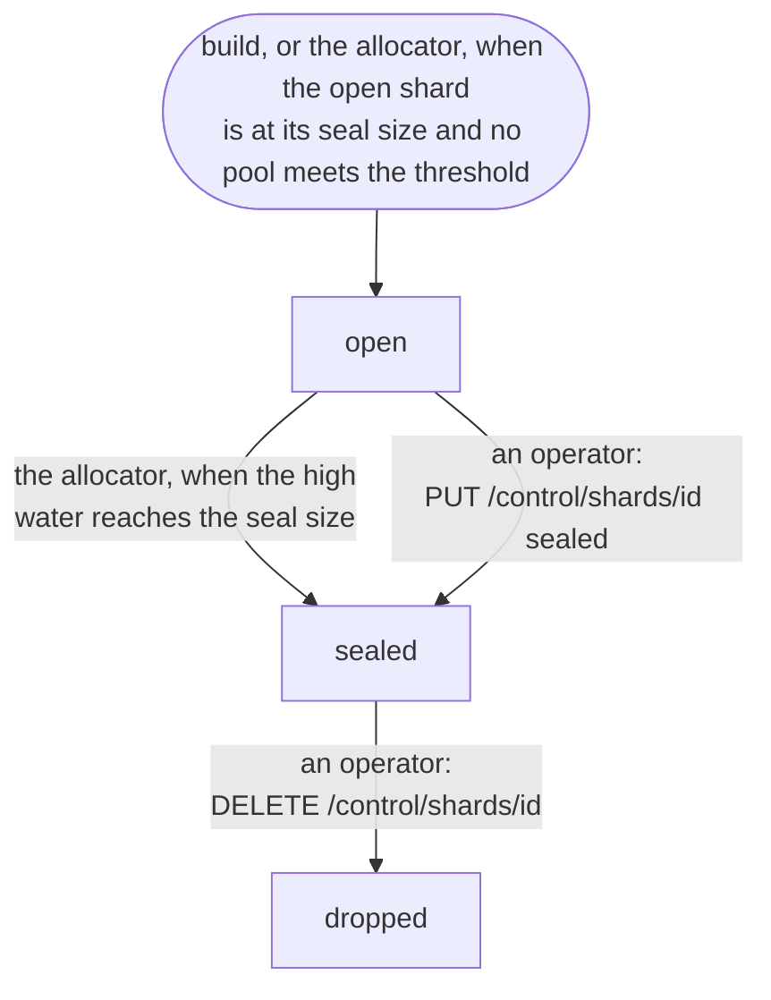
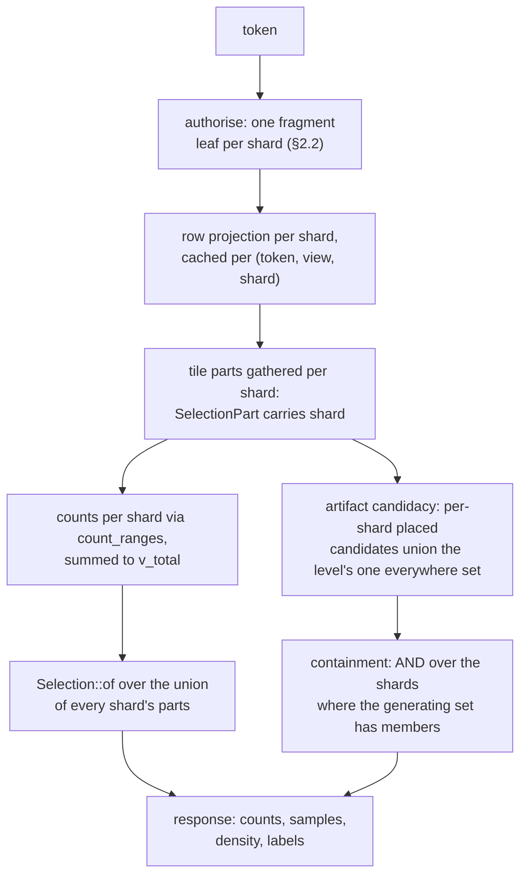
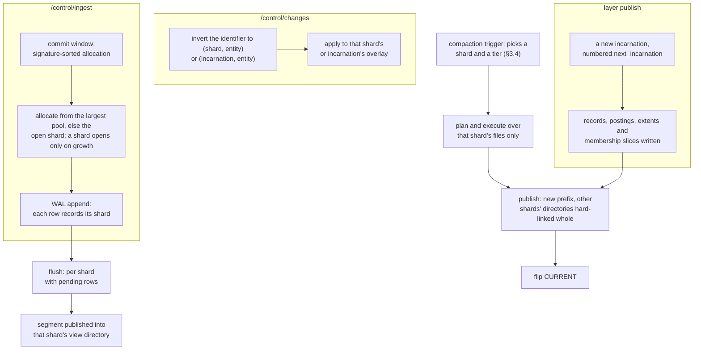
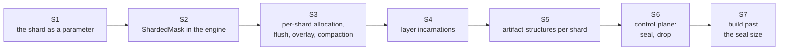

# Sharding: epoch shards in one process

**Date:** 2026-09-04
**Status:** Provisional (design, 2026-09-04). Nothing in this document is built. Every section
says what exists today and what it becomes.

Entity ids are a `u32`, bounded by the allocator's ceiling (`tessera-lifecycle alloc.rs`,
`ENTITY_ID_CEILING`) and by the identity construction ([contracts.md](contracts.md) §2.6). The
entity space fills before the corpus does: consumed ids exceed live items through churn, and an
artifact allocates from the top of the same space, downward from `u32::MAX`. Exhaustion is these
two allocation ranges meeting
([annotation-representation.md](annotation-representation.md)).

The answer is an epoch shard. The corpus becomes a list of shards inside one process. Each point
shard holds its own `u32` entity space and its own `u32` row space per view, with its own
permutation, postings, overlay, allocator and segments. Each layer incarnation is an artifact
shard: a dense entity space of its own with no rows, dropped whole when the layer is replaced
(§1.1). A freed slot in any point shard is reused before a point shard opens, so a point shard
opens only when the corpus grows past what the existing shards hold (§3.1). `RowId` stays `u32`;
nothing widens. The term dictionary, the layer and view registries and session tokens stay whole
across shards. A request's mask becomes one leaf per shard, summed and unioned rather than
composed into one bitmap; point allocation targets one shard at a time; a deletion or suppression
applies to the shard or incarnation its identifier inverts to; compaction runs on one point shard
at a time.

## 1. Model

### 1.1 What a shard is

A **point shard** is `ShardId(u32)`, a newtype in `tessera-types` (`define_id_newtype`), valued 0
to 2¹⁹ − 1, the width of the identity's shard field (§1.2). An **artifact shard** is a layer
incarnation, `Incarnation(u32)`, valued 0 to 2³¹ − 1. Neither number, once used, is ever reused,
the rule contracts §2.1 states for `seg_id`. The manifest allocates both: `next_shard_id` and
`next_incarnation` are monotone counters.

There are two kinds.

- A **point shard** holds an entity space of `[0, 2³²)`, one row space per view (`u32`), a
  permutation per view, segments per view, its own term postings and delta tiers, its own
  entity-to-term transpose, attribute extents, record-blob extents, text extents, external-id runs
  and locator, an overlay (`deleted`, `suppressed`) in its own entity space, and an allocator with
  its free pool (§3.1,
  [decision 0072](../decisions/0072-entity-ids-are-slots-and-are-reused-after-a-fold.md) as amended
  by [decision 0126](../decisions/0126-the-generation-counts-a-slots-occupancies-and-a-freed-slot-is-reused-before-a-shard-opens.md)).
- An **artifact shard** is one layer incarnation ([decision 0130](../decisions/0130-an-artifact-shard-is-a-layer-incarnation-with-no-reuse-and-the-identity-carries-a-kind-bit.md)). It holds a dense entity space of
  its own, in which the layer's levels are contiguous runs under
  [annotation-representation.md](annotation-representation.md) §2.3's arithmetic: no row space,
  no permutation, no segments, no Morton order. In that space it holds the overlay (`deleted`,
  `suppressed`), own-term postings, attribute and record extents, the key locator, and the level
  records, generating sets, contents and lineage the per-layer directory holds today. It has no
  allocator beyond each level's ordinal cursor, no pool and no compaction. It opens when the layer
  is registered, takes appends while the layer is current, and is dropped whole when the layer is
  replaced or withdrawn.

Shard 0 is the build's first point shard; a later point shard takes the next number from
`next_shard_id` when it opens. Each layer's first incarnation takes the next number from
`next_incarnation` at registration, and each replacement takes another. The smallest bundle has
one point shard and one incarnation per declared layer.

```mermaid
flowchart TB
  subgraph G["Global: one per bundle"]
    direction TB
    G1["term dictionary,<br/>declared scalars and vocabularies"]
    G2["layer registry, view registry<br/>and incarnations"]
    G3["layer declarations and each<br/>layer's current incarnation"]
    G4["session tokens, identity key,<br/>idset, CURRENT prefix"]
  end
  subgraph P["Point shard: one per opened shard"]
    direction TB
    P1["entity space [0, 2^32);<br/>row space per view"]
    P2["permutation and<br/>segments per view"]
    P3["term postings, delta tiers,<br/>entity-to-term transpose"]
    P4["attribute, record-blob<br/>and text extents"]
    P5["external-id runs and locator"]
    P6["overlay (deleted, suppressed),<br/>allocator and free pool"]
  end
  subgraph A["Artifact shard: one per layer incarnation"]
    direction TB
    A1["entity space only, dense over<br/>the layer's ordinals: no row space"]
    A2["level records, generating sets,<br/>contents, lineage"]
    A3["own-term postings; attribute,<br/>record and key extents"]
    A4["overlay (deleted, suppressed)"]
  end
```



*What is per point shard, what is in an artifact shard, and what stays global to the bundle.*

A point shard passes through three states.

- **Open** issues slots from its high water and from its free pool.
- **Sealed** issues slots from its free pool only; it accepts deletes and suppressions, and
  compaction runs on it.
- **Dropped** is removed; its number is retired.

Exactly one point shard is open at a time, and point allocation targets one shard at a time, which
may be a sealed shard with slots in its pool (§3.1). Every registered layer's current incarnation
takes appends. Several open point shards, one per data source for example, is an option this
design does not take (§11).



*The point-shard state machine: the transitions, and who takes each one.*

| State | Issues slots | Accepts deletes, suppressions | Compaction runs | Entered by |
|---|---|---|---|---|
| Open | from its high water and its pool | yes | yes | the build, or the allocator when the open shard is at its seal size and no pool meets `shard.reuse_min_free` |
| Sealed | from its pool | yes | yes | the allocator (seal by size), or an operator |
| Dropped | no | no | no | an operator; refused while the shard is open |

An artifact shard has two states, current and dropped. Its transitions are the layer's own,
registration and replacement or withdrawal ([annotation-representation.md](annotation-representation.md)
§5), and no shard verb applies to it.

Global state, held once per bundle: the term dictionary (`dictionary/terms-<k>.dict`, one
namespace, term ids the policy vocabulary), declared scalars and vocabularies, the layer registry,
the view registry and its incarnations, each layer's declaration and current incarnation number,
session tokens, the identity key and idset, and the `CURRENT` prefix.

### 1.2 Identifiers and spaces

`RowId(u32)` is unchanged in type. Its meaning narrows: a row in one shard's one view. Every store
API that takes a row also takes a `(ShardId, view)` pair.

`EntityId(u64)` is unchanged in type; a value stays under 2³², and it means an entity in one point
shard or one layer incarnation. A reference that crosses shards is `(ShardId, EntityId)` for a
point and `(Incarnation, EntityId)` for an artifact.

`ShardRow(u64)`, engine-internal only, is `(shard as u64) << 32 | row as u64`: the key of the
sharded mask (§2.1). It never reaches the store, the wire or disc. I4's compile-fail tests gain
three cases: a `ShardRow` cannot be built from an `EntityId` alone, nor from an `Incarnation`, and
a `RowId` cannot be read from a `ShardRow` without its shard.

`tessera_id` becomes `FPE_k(L₀ ‖ (entity: 32))`, with `L₀ = (kind: 1) ‖ (shard: 19) ‖
(generation: 12)` for a point and `L₀ = (kind: 1) ‖ (incarnation: 31)` for an artifact (decisions
0126 and 0130): decision 0072's construction, the kind bit selecting the layout, the shard field
carrying the shard number instead of the reserved constant 0, and the generation counting the
slot's occupancies (§3.1). An artifact's identity carries no generation, since an incarnation's
slots are never reused. `identity.shard_id` leaves the manifest. Inversion reads the kind bit and
yields `(shard, generation, entity)` or `(incarnation, entity)`; validation stays whole-identifier
equality at the row the slot names, which for an artifact is its record in the incarnation
(decision 0072).

Priority stays the high 16 bits of `tessera_id`. Its composition across shards is exact for the
reason [architecture.md](architecture.md) §12.3 gives for composition across partitions: the
identity is a keyed permutation of the whole input, so no two items anywhere share one.

| Identifier | Type | Scope | Crosses to disc or wire |
|---|---|---|---|
| `RowId` | `u32` | a row in one shard's one view | disc, positional within the shard |
| `EntityId` | `u64`, value under 2³² | an entity in one point shard or one incarnation | disc, within that shard's structures |
| `Incarnation` | `u32` | one layer incarnation: an artifact shard | disc, naming its directory; the wire only inside `tessera_id` |
| `ShardRow` | `u64` | the sharded mask's key | neither: engine-internal only |
| `tessera_id` | `u64` | the client-facing blinded identity | the wire, as it does today |

### 1.3 Bundle layout

Contracts §2.1's layout gains a shard directory, and `bundle_format` bumps.

```
bundle/
  CURRENT
  v000NN/
    MANIFEST.json                       # bundle-level (below)
    dictionary/terms-<k>.dict           # unchanged, global
    partitions/<phash>/
      shards/<shard_id>/                # one directory per point shard
        SEGMENTS-<n>.json               # the side-manifest, now per shard
        terms/postings.arrow            # this shard's postings; term ids global
        entities/…                      # external ids, locator, key filter, entity→term transpose: per shard
        attrs/…                         # attribute and record extents: per shard
        coalesced/<id>/…                # per shard
        views/<view_id>/
          permutation.bin
          row-entity.u32
          segments/<seg_id>/…
        artifacts/memberships/…         # this shard's slices of every level's membership (.tsmb extents), keyed (incarnation, level)
      artifacts/<layer>/
        registry.json                   # the declaration: one per layer, across incarnations
        <incarnation>/                  # one directory per incarnation: the artifact shard
          SEGMENTS-<n>.json             # overlay, watermark, level versions, ordinal cursors; no pool
          terms/postings.arrow          # own-term postings over the incarnation's entity space
          attrs/…                       # attribute, record and key extents over the same space
          levels/<k>/…                  # records, entity base, geometry, lineage
```

`MANIFEST.json` changes as follows.

| Field | Change | Meaning |
|---|---|---|
| `identity` | loses `shard_id` | the shard number moves into `tessera_id`'s own encoding (§1.2), so the manifest no longer needs a reserved constant |
| `shards` | new | one record per shard, below: the bundle-level view of every shard's state |
| `next_shard_id` | new | the monotone allocator of point shard numbers |
| `next_incarnation` | new | the monotone allocator of layer incarnation numbers |
| `layers[].incarnation` | new | the layer's current incarnation, the directory it is served from |
| `entity_id_high_water` | removed | was one counter for the whole bundle; each shard's own high water lives in its `shards` record |
| `files` | unchanged in shape | covers every shard's files; open verifies per shard and refuses the bundle naming the first shard whose digest fails (ruling F, §8) |

Each `shards[]` record:

| Field | Meaning |
|---|---|
| `shard_id` | the point shard's number |
| `state` | `open`, `sealed` or `dropped` |
| `entity_id_high_water` | seeds the shard's allocator |
| `opened_at`, `sealed_at` | the second present once sealed |

The per-shard `SEGMENTS-<n>.json` carries what a `SEGMENTS-<n>.json` carries today: segments,
extents, the deny and tombstone lists, deltas, the watermark, level versions. It gains the free
pool, one bitmap extent per generation bucket, and the count of retired slots (§3.1). It is per
shard, since the directory that names it is the shard's own.
`segments_n`, the geometry version and the overlay version all become per shard. An incarnation's
side manifest carries its overlay, watermark, level versions and ordinal cursors.

A compaction of one shard hard-links the other shards' directories into the new prefix whole
(§3.4).

## 2. The read path



*The read path of one viewport request across N shards: fragments and projections are per shard,
counts and selection compose over the union, and artifact candidacy adds the one shared everywhere
set.*

One rule governs every operation on this path: nothing is invoked per (tile, shard). Every
operation over a request's tiles, range resolution, counting, decoding, selection and the artifact
probe, is one call per shard over the request's sorted ranges, as `tile_ranges_all` already is per
segment. A tile at N shards costs N batched calls and not N times the per-tile work. A leaf that is
empty for this principal is walked like any other: no operation skips a shard on the principal's
coverage (§7).

### 2.1 The mask

| | Today | Becomes |
|---|---|---|
| mask type | one `croaring::Bitmap` over one view's row space | `ShardedMask { leaves: Vec<(ShardId, Bitmap)> }`, sorted by shard, one leaf per shard's row space |
| `RowProjection` | `{ rows, base_rows, cardinality }`, one per (token, view) | one per `(fragment, view, shard)`; `RowProjectionKey` gains `shard` and is keyed by fragment identity rather than by session, so principals with the same satisfied terms share one (ruling Q) |
| `EffectiveMask` | `{ base, minus, plus, filter, highlight }` | holds a `ShardedMask` for `base` and for the diffs; `minus`/`plus` are per shard, since the buffer's entities carry their shard |
| `DenyMask` | `view -> Bitmap` | keyed by `(view, shard)` |
| `FilterRows::Viewport` | `{ rows, domain }` | per shard |

`ShardedMask` operations: `range_cardinality(shard, Range<u32>)`, `rows_in_range(shard,
Range<u32>) -> Bitmap`, `for_each_run(shard, Range<u32>, f)`, `contains(shard, row)`,
`cardinality()` summed over shards, and `and`/`or`/`andnot` applied leaf-wise by shard key. One
operation is new: `count_ranges(shard, ranges: &[Range<u32>]) -> Vec<u64>` sorts the ranges and
walks a leaf's containers once with a running rank. The sweep calls `count_ranges` once per shard
for a request's tiles, in place of two `range_cardinality` calls per part. No container library is
written beyond this: a leaf stays croaring, and frozen views and the bulk union stay per leaf.

Every mask operation measured against N=1 has a fixed cost per part, about 1.8 µs for a rank
inside a bitset container, cold (`probes/2026-09-04-epoch-shard-treemap-mask/`). A tile split
across N shards pays that cost N times; batching the ranges into one walk per shard amortises it
to one pass per container the shard's leaf touches.

### 2.2 Authorise

| | Today | Becomes |
|---|---|---|
| postings | bundle-wide | per shard: `shards/<id>/terms/postings.arrow` and that shard's delta tiers |
| fragment | one `Bitmap` per session | one `FrozenFragment` per point shard and per layer incarnation |
| `FragmentCache` key | `(bundle identity, plugin hash, satisfied terms, watermark)` | `(bundle identity, plugin hash, shard or incarnation, satisfied terms, that shard's watermark)` |
| row projection | one per (token, view) | `row_space[shard, view].project(fragment[shard])`, cached per `(fragment, view, shard)` |

A session assembles its fragment from its per-shard leaves. A compaction of shard k rotates shard
k's `FragmentCache` entries and leaves every other shard's untouched; a layer replacement rotates
only the dropped incarnation's.

Measured (`probes/2026-09-04-epoch-shard-projection/`): `Permutation::project` is linear in rows
from 10⁸ upward; a line fitted over 10⁷ to 4×10⁸ predicts the recorded 1,277 ms at 10⁹ within 1%.
Eight leaf projections per token, against one, cost 1.10× the resident memory and 1.4× the build
time; the fixed cost per call measured about 10 µs, most of it a 512 KB stamp clear. ⊘ **That figure
has not been re-taken.** `project_with` no longer clears the stamp on every call — the emit leaves it
zero, so it is zeroed once when it is sized (`probes/2026-09-09-layers-cost/`) — so a leaf's fixed
cost is lower than 10 µs by an amount nothing here measures.

Modelled at the target from that fit and from bitset density: a principal at 25% coverage over
10¹¹ rows holds about 25 GB of leaf and projection per view, whatever the seal size, and pays about
140 s of CPU at first touch of the whole map, about 12 s on twelve cores; at 1% coverage, about
1 GB and 24 s. A 512 GB box holds about fifteen such dense sessions per view, or several hundred
sparse ones, before the bundle's own working set. This is the materialised mask's cost, and
[scaling-analysis.md](../evidence/analysis/scaling-analysis.md) §4's precondition; sharing a
projection between principals with the same grant is the one lever the design takes (ruling Q).

### 2.3 Tiles, counts, density, selection

| | Today | Becomes |
|---|---|---|
| `SelectionPart` | `(segment, range, row_base)` | gains `shard`; parts for a tile are gathered over every point shard's view |
| per-part count | two `count_range` calls | `count_ranges` per shard |
| `v_total` | the composed total | the sum over shards |
| `Selection::of` | takes the union of parts | unchanged: the union of parts is already its model |
| threshold, floor, cap | per tile | per tile, across the union of all shards' parts, never per shard |

Gather resolves a part to `(shard, segment, local range)` and reads that segment's columns. Every
masked count, density cell and existence criterion is a sum of per-shard counts; the response
holds no per-shard figure, so this adds no leak-register row. The direct-evaluation marker
`check-layers.sh` polices for I7 stays: sampling still runs over the union of parts, never over a
precomputed structure.

Measured (`probes/2026-09-04-epoch-shard-treemap-mask/`): counts pass twice the one-shard cost
from depth 2 to 4 at N=8; at depth 12, 256 tiles, 50% coverage, the count column moves from
0.5 ms to 4.5 ms. Modelled from the columns: about 100 ms against 10 ms per 3,000-tile request for
a dense principal, single-threaded. `count_ranges` is the response to that cost; its own gain is
not measured. Modelled at N=100 from the same constants: about 1.3 s of counting per 3,000-tile
request unbatched and single-threaded, about 200 ms with every operation batched per shard (§2),
about 20 ms across twelve cores. The S2 bench runs at N=32 and N=100 (§10).

### 2.4 Filters, text, highlight

| | Today | Becomes |
|---|---|---|
| filter postings | entity-space, per column | per shard, a contiguous entity range |
| `RoutedFilter::Entity` | `Bitmap` | `Vec<(ShardId, Bitmap)>` |
| projection | one call | per shard |
| route choice (`can_invert`, row-side or entity-side) | per query | per shard |
| category codes | global (vocabularies) | unchanged |
| text dictionaries | per extent | unchanged, per extent, now per shard |
| highlight | a `FilterRows` never merged into the served set | per shard, as `FilterRows` is |

The filter contract, mask first, candidates pushed down, threshold never top-k, holds per shard.
Choosing the route per shard by tile count is allowed: the contract forbids a route driven by
statistics of the principal's mask, and tile count is not that. The filter crate's own layer rule
is unchanged: `tessera-filter` cannot see a `RowId`.

### 2.5 Artifacts: memberships, row forms, tile index, containment, histogram

| | Today | Becomes |
|---|---|---|
| membership | entity-space per artifact (`Members` over `.tsmb` extents) | sliced per point shard, under `shards/<id>/artifacts/memberships/`, keyed by `(incarnation, level, ordinal)`; an artifact's membership is `Vec<(ShardId, Members)>` |
| generating sets, contents | entity-space records | records in the incarnation, naming `(ShardId, EntityId)` point members |
| row forms | one per (view, layer, level) | one per (view, layer, level, shard); `RowColumn` per shard |
| `TileIndex` | one `own`/`subtree` structure, one `everywhere` set, per (view, layer, level) | per shard for placed artifacts; one `everywhere` set per (view, layer, level), the union of what each shard's placement would make everywhere, tested once per request rather than once per shard |
| containment | one `ContainmentPartition` per (layer, level) | one per (layer, level, shard), over that shard's postings; `G ⊆ M_auth` is the AND over the shards where `G` has members |
| histogram | one walk of the composed mask, cached per token | one walk per shard, vectors summed, cached once per token |

This document reads against [artifact-system.md](artifact-system.md) and
[annotation-representation.md](annotation-representation.md) for the mechanisms in this table.

Candidacy is the union, over shards, of each shard's placed candidates and the level's one
`everywhere` set; the masked probe for a candidate is a sum over shards.

The level's recorded serving layout (decision 0094) chooses the route per level, and under
sharding the choice is sized as follows (ruling O, §8). An artifact-major level holds at least one
container per (artifact, shard) in its row forms, its tile-index extent and its containment slice,
so its cost is proportional to artifacts times shards: measured constants of about 90 B per run
resident and 8 B per ordinal per shard in the extent, and 3.6 GB resident for a 10⁷-artifact level
over 10⁹ rows at N=1. A row-major level holds one label column per (shard, view, level), 4 B per
row, a render column's cost, independent of N per row and of the artifact count. A level whose
artifacts are a non-negligible fraction of its rows, which the data campaign shows is the common
case, is therefore row-major under sharding; artifact-major serving is for levels with few, wide
artifacts. A request may also take the row-major scan at fine zoom by the request's tile count and
depth, as §2.4 chooses a filter route; the comparison is never against a corpus quantity such as
the level's artifact count, which decision 0124's admissibility test forbids as a route key.
Neither route is measured under sharding (§10, S5).

The existence criterion sums over shards. The histogram's cache key carries every shard's
`(segments_version, overlay_version)` pair, and the cache stays keyed once per token (decision
0093's one exception). An artifact's own-terms visibility is gated by its incarnation's fragment
leaf. The cut is unchanged; lineage and derived content live in the incarnation.

Measured (`probes/2026-09-04-epoch-shard-tile-index/`): a spatial cluster has members in every
epoch shard, so a per-shard tile index alone is 6 to 8.8× the bytes at N=8 and returns 2.3 to 7.8×
the candidates at depth 12; the level's `everywhere` set is most of the candidates on a wide
level, and repeating it per shard is what the shared set removes. The histogram walk is about 1×
under sharding: entries move between shards, and sharding adds none.

Measured (`probes/2026-09-04-epoch-shard-fold-decomposition/`, one real compaction of the MedCPT
36M bundle, 1.66×10⁹ memberships): 48.1% of the 330 s a compaction took was these structures,
rebuilt corpus-wide because they are one per deployment rather than one per shard. Sharding them
makes that share per shard.

### 2.6 Items, browse, categories, suggest, meta

`/v1/items/{tessera_id}`: inversion reads the kind bit and yields `(shard, generation, entity)`;
an identifier whose kind bit says artifact is a 404 here, as it is today. The existing check that
refuses a nonzero shard becomes a dispatch to that shard. `visible_to` runs on the shard's
fragment leaf, O(1), in entity space, before any row lookup, as it does today. The row lookup
itself reads that shard's view row space. `/v1/artifacts/{tessera_id}` dispatches to the
incarnation the identifier inverts to and runs the predicate against that incarnation's overlay,
own-term leaf and extents. An identifier that inverts to a dropped shard or a dropped incarnation
takes the same lookups as one that inverts to an item this principal may not see: C4's closure on
these routes rests on identical work for the two, and an early exit on a missing shard would break
it.

Browse and categories: per-point-shard counts, summed. An attribute value an artifact carries sits
in its incarnation's postings and is counted on none of these surfaces (ruling K, §8); it is served
on the artifact's own row and drill-down. Suggest: per-shard presence, unioned
([decision 0124](../decisions/0124-the-suggestion-route-may-follow-the-viewers-cardinality.md)'s
cardinality rule applies to the sum). Meta: sums.

## 3. The write path



*The write path: point allocation targets one shard, a layer publish writes one incarnation, a
deny resolves to the shard or incarnation its identifier inverts to, and compaction runs over one
point shard while carrying the rest forward as links.*

### 3.1 Allocation

| | Today | Becomes |
|---|---|---|
| allocator | one, bundle-wide, monotone | one per point shard, each with a free pool: `Allocators { by_shard: BTreeMap<ShardId, Allocator>, open: ShardId }` |
| free pool | none; a slot is never reused | per point shard, `BTreeMap<u16, Bitmap>`: the slots the shard's compactions have freed, keyed by the generation their next occupant is stamped with |
| generation | none | the slot's occupancy count (decision 0126): a compaction inverts the identifier stored at each row it removes and returns the slot to the bucket one above the generation it read, or retires the slot if that generation is 2¹² − 1 |
| point allocation | `allocate(n)` from the high water | `allocate(n)` on the target shard (below); a slot from the pool is stamped with its bucket's generation, a slot above the high water with 0 |
| artifact allocation | the two-region allocator: points up from 0, artifacts down from `u32::MAX` | each level's ordinal cursor in the layer's current incarnation; a replacement is a new incarnation with a fresh space; no `allocate_rowless`, no two regions, no pool, no generation |
| seed | one manifest field | each point shard's `entity_id_high_water` and its pool, from the side manifest, and each incarnation's ordinal cursors from its own; WAL replay recovers all of them, since a record carries its shard or incarnation and, for a point, its generation |

The **allocation target** for points is chosen at each commit window: the point shard with the
largest pool, if that pool holds at least `shard.reuse_min_free` slots; otherwise the open
shard, from its own pool first and then its high water. When the open shard's high water reaches
the seal size it seals (recorded at the next publication). The next shard, numbered
`next_shard_id`, opens only when a window still has rows to place, the open shard is at its seal
size and no pool meets the threshold. A window may straddle a change of target; each row records
the shard it landed in. Within a target the window's rows are signature-sorted and take slots in
ascending order, lowest bucket first, so a run of freed slots is handed out as a run.

The pool is drained in runs of at least `shard.reuse_run_min` slots, and shorter holes are used
last. The order is: a run of that length in any pool, largest pool first; the open shard's high
water; the short holes, largest pool first; a new shard. Capacity is never lost to a hole, and a
slot lands scattered only when the corpus has no contiguous space left. This closes the question
decision 0072 left open, whether the pool is handed out in runs. The default is open (§11).

Under this rule churn consumes no shard numbers. A corpus at a steady live size opens no shard,
and the shard count is the live count over the seal size. What reuse costs is locality: a slot
from the pool sits wherever its previous occupant did, so postings over reused slots hold fewer
runs than postings over a contiguous allocation at the high water. Decision 0072 accepts this
cost for reuse inside one shard; this rule applies it in every shard, and its bound is the same,
containers touched. What a fully scattered shard gives back is measured: signature-sorted
allocation buys 8.9 to 36.7× on posting size and up to 130× on union cost against scattered
(architecture §13.3), and a slot is identity, so nothing restores order once lost. The run rule
above bounds scatter to the run length while contiguous space remains. The decay under a churn
cycle is measured at S3 on the campaign's existing 50% ingest cycle (§10).

A slot whose occupant carried generation 2¹² − 1 leaves the pool at the compaction that frees it
and is never issued again. The shard loses one slot per 4,096 occupancies of that slot. Modelled:
with the pool drained lowest bucket first, a shard's churned population reaches the cap after
about 1,100 years at 1% daily churn and about 110 years at 10% (§9).

Seal by size, `shard.seal_rows`, defaults to the entity ceiling and is tunable; an operator may set
a lower figure. The design expects a value around 2³⁰, to bound compaction and projection cost per
shard; the default is open (§11), as is `shard.reuse_min_free`. Seal is also an operator verb
(§3.5). An incarnation has no seal size: its space is bounded by the layer's own size.

### 3.2 Ingest, the commit window, the WAL, flush

| | Today | Becomes |
|---|---|---|
| `WalRow` | no shard field | gains `shard` and `generation`; an artifact minted at the window's close ([artifact-system.md](artifact-system.md) §6) records its incarnation and ordinal |
| commit window | signature-sorted allocation | unchanged in scope |
| flush | one pass over the buffer | per point shard with pending rows, which is the allocation target: a point edit is delete plus re-ingest ([decision 0047](../decisions/0047-edit-is-delete-plus-reingest.md)) and allocates there; an artifact edit keeps identity (decision 0081) and lands in its incarnation |
| flush output | a segment in the view directory, an extent above the base | a segment in that shard's view directory, an extent above that shard's base in that view's row space |
| row-projection repair (`extend`) | one call | per shard leaf |

[Decision 0091](../decisions/0091-build-is-ingest-into-an-empty-database.md)'s equivalence, that a
build is ingest into an empty database, holds per shard and
across a seal boundary: a build whose input exceeds the seal size writes shards 0, 1, 2 and so on
in input order, exactly as ingest would.

### 3.3 Deny: deletions and suppressions

`/control/changes` inverts each identifier to `(shard, entity)` or `(incarnation, entity)` and
applies the change to that shard's or incarnation's overlay. The two removal rules apply per shard
and per incarnation: a suppression leaves the overlay only on unsuppress; a deletion leaves it only
at the compaction of its own point shard that removes its rows, or at the drop of its incarnation,
which removes its record ([write-path.md](write-path.md) §5.4). Dropping a shard or an incarnation
removes everything it holds, which meets the deletion rule's condition for every entry at once. An
incarnation is never compacted, so a deleted artifact stays in its overlay until the layer is
replaced or withdrawn. Geometry stamps stay advisory
([decision 0041](../decisions/0041-pins-become-a-staleness-stamp.md)).

### 3.4 Compaction per shard

A compaction plan names one point shard and one tier ([decision 0131](../decisions/0131-compaction-is-two-tiers-a-row-tier-at-the-deletion-cadence-and-an-entity-tier-at-the-reuse-cadence.md)). Compaction (the operation the
code and earlier documents call a fold) already runs its passes over one prefix; under this design
that prefix is one shard's, and the passes split into two tiers by what they reclaim.

| Tier | Passes | Reclaims | Returns slots | Gauges | Cost per 2³² shard, modelled |
|---|---|---|---|---|---|
| row | the row space merged to one base per view; postings, external ids and the key filter; this shard's membership slices and row-major label columns; digests | dead rows; deletions retired under Rule F | no | `compaction_dead_rows_fraction`; `compaction_max_segments`; un-retired deletions as a fraction of the shard's live rows | about 36 minutes, plus the artifact structures §2.5 describes, proportional to rows |
| entity | attribute extents and the entity-to-term transpose rewritten; slots returned to the pool in the bucket one above the generation the row's identifier inverts to, or retired at the cap (§3.1); every generating set in every incarnation naming this shard reconciled, in decision 0072's order | dead entity bytes; free slots | yes | dead entity bytes as a fraction of the shard's; pool demand | about 4.9 hours |

The row tier runs at the deletion cadence and the entity tier at the reuse cadence, which is
decision 0072's reconcile-before-reclaim made a schedule: an entity leaves the postings at the row
tier, so no fragment names it between the tiers, and every filter meets the mask first. The
absolute deletion gauge (`compaction_after_deletions`, compaction.md §9) becomes a ratio of the
shard's live rows, since an absolute figure per shard fires continuously at any churn. Up to
`compaction.concurrent` row tiers run at once, admitted by the pre-flight budget (compaction §3)
summed over those in flight; entity tiers run one at a time. The gated window
([decision 0056](../decisions/0056-a-folds-schedule-is-a-gated-window-not-a-pure-timer.md))
applies per tier, and the trigger picks the shard and tier with the most to reclaim. The passes
run over that shard's files only. Publication writes the new prefix with the other shards'
directories hard-linked whole; the flip, retirement, WAL rotation and reclaim proceed as they do
today ([compaction.md](compaction.md) §§4–8). Retirement is per shard. A compaction of shard k
rotates only shard k's session fragment entries and projections. Merge and coalesce run per shard,
suspended only while that shard's compaction is unpublished.

An incarnation is compacted only by an ordinal-preserving rewrite (ruling P, §8): deleted records
leave its overlay under Rule F at the publication that drops them, holes stay holes so every
identifier is untouched, and its record extents are rewritten as one. It runs on the layer's own
gauges, dead records and overlay depth. A replacement removes the incarnation whole without it.

Sealing schedules one closing compaction of both tiers when any of the shard's gauges is non-zero.
Its final form is one base segment per view, one postings tier, one
external-id run, an overlay holding only suppressions (its deletions retired), and a digest per
file. A sealed shard then stays unchanged on disc until an allocation from its pool, an edit, a
deletion or a suppression lands in it, or it is dropped; a sealed shard with an empty pool and no
deletions is stable.

Measured (`probes/2026-09-04-epoch-shard-fold-decomposition/`, one real compaction of the MedCPT
36M bundle): 330 s total. 1.5% is inherently corpus-wide (dispatch, the manifest, the flip). 50.5%
is proportional to the compacted shard's rows. 48.1% is the artifact structures §2.5 describes,
corpus-wide today and per shard under this design. Modelled from that one loaded run, linearly, at
a 2³² shard: the row-proportional half is about 5.5 hours, of which the attribute and transpose
passes, the entity tier, are about 4.9 hours and the rest about 36 minutes. Not measured under
sharding.

### 3.5 Seal and drop

`PUT /control/shards/{id}` with `{"state": "sealed"}` seals a shard immediately: its high water
issues no more slots, and its pool is drawn from on the rule of §3.1. There is no reopen verb; a
sealed shard's pool is reused without an operator's action.

`DELETE /control/shards/{id}` is refused while a shard is open. Otherwise, the next publication
removes its directory, its number is retired, the allocator stops targeting it, and every
identifier it issued becomes invalid by whole-identifier equality, since no row carries it any
longer. Dropping is irreversible for identifiers.

`/control/shards` addresses point shards only. An incarnation is dropped by the layer's
replacement or withdrawal, the verbs annotation-representation §5 and [views.md](views.md) §3
already give, and every identifier it issued becomes invalid the same way.

### 3.6 Layout changes and views

A new layout, a new view or a view's re-incarnation ([views.md](views.md)), is built as that view
in every point shard and published in one generation swap. Two shards are never served in two
layouts. A re-layout is the one operation that rebuilds every shard in one publication.

### 3.7 Key resolution and layer publication

Per-shard locators make every key resolution N searches: a membership's member keys at a layer
publish, and ingest's duplicate check, each become one binary search per shard, about 3 µs each
after a closing compaction, so about 300 µs per key at N=100 by the review's estimate. Each point
shard therefore carries a key filter, about 10 bits per entity, rebuilt with its locator at the
row tier; a resolution probes N filters, about 100 ns each, and searches only the shards that
answer (ruling N, §8). The bits per entity are open (§11).

A layer publishes as one publication per point shard: its membership slices land shard by shard,
and each shard's row forms, tile index and containment slice for the level are rebuilt off the
executor thread. A level partly landed is a level under ingest
([decision 0127](../decisions/0127-a-membership-grows-through-the-control-plane.md)), which
discloses nothing a growing membership does not. This keeps publication one shard at a time for
layers as §3.4 keeps it for compaction, and it is the operation §3.8 relies on to re-land a
restored shard's slices.

### 3.8 Recovery, restore and verification at open

The WAL is one file; each record carries its shard or incarnation, and replay rebuilds each
shard's allocator, pool and cursors from its own side manifest and its records. Publication writes
every directory before the one flip of `CURRENT`, so a failure before the flip leaves directories
the startup sweep reclaims, as today.

The backup unit is a sealed shard with an empty pool and no deletions, with the manifest: that
shard is byte-stable (§3.4). A shard is not independently rebuildable from source, since which
items it holds is recorded only in its own locator. A shard restored from an older copy carries
membership slices keyed by incarnations that may since have been replaced; open reports every such
slice, nothing is served from a slice whose incarnation is not current, and the layer's per-shard
publication (§3.7) re-lands it.

Open verifies digests per shard, in parallel, and records a verification for a stable sealed
shard so that a restart does not re-read it: at tens of terabytes a whole-bundle verification is a
multi-hour restart. Ruling F's refusal names the shard and the file.

## 4. Build

`tessera build` writes shard 0 for points and one incarnation per declared layer, numbered from 0
in declaration order; past the seal size it opens the next point shard, numbered in opening order,
in input order. Each shard's views get their own permutation and
Morton sort; the layout is computed once over the corpus, since coordinates are per item and only
the sort is per shard.

For a corpus under the seal size, the built bundle is byte-identical to today's, except for the
directory move and the manifest.

## 5. Control plane and observability

`/control/status` gains `shards: [{shard_id, kind, state, target, live_rows,
entity_id_high_water, remaining, free_slots, retired_slots, overlay: {deleted, suppressed},
retirable_deletions, segments, compaction: {last_secs, last_rss_bytes, passes}}]`; the totals it reports today become sums over that array. `GET
/control/shards` lists the same records. The status's layer block gains `incarnation`. A refusal at open names the shard and the file (ruling F,
§8).

Per-shard gauges are operator-plane only. Nothing per shard reaches the viewer plane: the geometry
stamp ([decision 0041](../decisions/0041-pins-become-a-staleness-stamp.md)) stays the prefix
digest, one value, since a per-shard vector would say which epoch moved. Status gains the
compaction gauges per tier and the count of row tiers in flight.

## 6. Conformance and the oracle

The Python oracle computes counts, samples and label verdicts over the whole corpus. Under shards
the served figures are sums and unions of per-shard figures, so the oracle's definitions are
unchanged; it needs the shard assignment only to reproduce an identifier.

New fixtures:

| Fixture | What it checks |
|---|---|
| (a) | the same corpus built as one point shard and as three: every viewport, item, browse and category response equal, apart from the identifier's shard field |
| (b) | a sealed shard taking edits, deletions and suppressions: the two removal rules observed per shard |
| (c) | allocation from a sealed shard's pool: the target follows the largest pool, no identifier is reused, and a slot's successive occupants carry ascending generations |
| (d) | a dropped shard: every count falls by its contribution, every identifier it issued answers 404, its number never reappears |
| (e) | a shard with a corrupted file refuses at open, naming the shard |
| (f) | decision 0091's equivalence across a seal boundary |
| (g) | the byte-scanner: no entity id, no shard number and no per-shard count on the wire |
| (h) | a layer replaced: the successor's identifiers carry the new incarnation, every predecessor identifier answers 404, the predecessor's directory is gone at the next publication and its number never reappears; memberships, generating sets and lineage are the successor's as published |
| (i) | a slot at the generation cap: retired at the compaction that frees it, never issued again, the shard's retired count up by one |
| (j) | an artifact carrying a category value: absent from that value's count and listing on `/v1/categories`, browse and suggest, and served on the artifact's own row and drill-down |

## 7. Invariants and the register

| Invariant | Upheld here by |
|---|---|
| I2 | holds per leaf; the sum is what is served |
| I4 | `RowId` stays `u32`; `ShardId` and `Incarnation` are separate newtypes; `ShardRow` is engine-internal only; the compile-fail tests are extended (§1.2) |
| I7 | direct evaluation over the union of parts, unchanged |
| I10 | the kind bit, the shard or incarnation number and the generation sit inside the keyed permutation; a viewer cannot read any of them, since decision 0072 already places them there; [decision 0014](../decisions/0014-i10-weakened-to-construction.md)'s weakening applies unchanged |
| I12 | the threshold anchors on the summed unfiltered count |
| I13b | a generating set with members in a shard the process does not hold cannot occur in one process: every shard is held, or the bundle is refused (ruling F) |
| Rule S / Rule F | the two removal rules apply per shard, as §3.3 states |

No new Appendix C row: no per-shard quantity is served. Two existing rows gain a sentence. C4: a
leaf that is empty for a principal is walked like any other (§2), because work that varies with
which epochs hold a principal's items varies, under reuse before grow, with other principals'
deletions; the residual is timing's existing posture. §8.5's fragment-cache channel: hits are per
shard, a finer sampling of the same channel. The item and artifact drill-downs take identical
lookups for a dropped shard and an invisible item (§2.6). Ruling F's refusal is an availability
choice, recorded in conformance §4.6's coverage and here.

## 8. Decisions, as ruled

Seventeen. Seven owner-ruled 2026-09-04; on 2026-09-05 three of them were amended and four added
(decisions 0126 and 0130), and six more, L to Q, were taken from the independent review of the
same day ([the review memo](../evidence/memos/2026-09-05-sharding-design-review.md)) under the owner's delegation, with decision 0131 for M. The body above is
the design that follows from them.

**A. The corpus is a list of shards in one process.** A shard opens when the corpus grows past
what the existing shards hold. Per shard: entity space, row space per view,
permutation, postings, overlay, allocator, segments, compaction. Global: the term dictionary, the
layer and view registries, the artifact registry, session tokens.

**B. A shard is a new axis.** Partitions (architecture §12) are specified and not implemented: a
store carries a map with one entry, named by a build constant, and nothing composes across
entries. When partitions are built, they reuse shard composition.

**C. A freed slot is reused before a shard opens** (amended 2026-09-05, decision 0126; as first
ruled, a sealed shard's freed slots waited for an operator to reopen it). The allocation target is
the shard with the largest pool above `shard.reuse_min_free`, else the open shard; a shard opens
only when no pool meets the threshold and the open shard is at its seal size. Slot return applies
in every shard. Shard ids are never reused, the same rule contracts §2.1 states for `seg_id`.

**D. An artifact edit keeps identity, so lands in its incarnation; a point edit is delete plus
re-ingest** (scope corrected 2026-09-05 from the review).
[Decision 0081](../decisions/0081-a-replacement-mints-identities-an-edit-keeps-them.md) rules that
an artifact edit keeps its identity; [decision 0047](../decisions/0047-edit-is-delete-plus-reingest.md)
rules that a point edit mints a new one, which allocates on the target. A sealed shard is closed
to allocation, and still accepts deletes and suppressions.

**E. Artifacts have their own shards, one per layer incarnation, with no reuse** (amended
2026-09-05, decision 0130; as first ruled, one artifact shard with its own allocator opened and
sealed on the point-shard rule). This replaces the two-region allocator. An incarnation is a dense
entity space dropped whole at the layer's replacement or withdrawal; it has no pool, no generation
and no compaction. The identity input's widths are ruling I's.

**F. A shard whose digest fails at open is refused, naming the shard.** Serving the others would
lower every count with no signal a viewer can see. An operator sees the warning; a viewer sees
nothing.

**G. Recorded now, built when compaction or projection time is the problem, at around 10⁹ rows.**
The rule from now: no new code keys a structure by a single global row total; `RowId` stays `u32`;
the shard is a parameter passed beside it; new allocator code is per shard.

**H. The generation is the slot's occupancy count, and a slot at the cap retires** (2026-09-05,
decision 0126). A compaction inverts the identifier of each row it removes and returns the slot to
the pool bucket one above the generation it read; a slot at 2¹² − 1 is never issued again. No
shard-level counter exists, so nothing wraps and nothing refuses.

**I. The identity input is `(kind: 1) ‖ (shard: 19) ‖ (generation: 12) ‖ (entity: 32)` for a
point and `(kind: 1) ‖ (incarnation: 31) ‖ (entity: 32)` for an artifact** (2026-09-05, decisions
0126 and 0130). Shard bits bound live capacity once churn consumes none, so they are the scarcer
resource on the point side; twelve generation bits give a slot 4,096 occupancies; thirty-one
incarnation bits put layer replacements past any deployment.

**J. An artifact shard is a layer incarnation** (2026-09-05, decision 0130). The churn unit for
artifacts is the layer, so the partition model applies: registration opens an incarnation, appends
advance its ordinal cursors, replacement or withdrawal drops it whole. Points keep ruling H's
vacuum-and-reuse model, since their churn unit is the row.

**K. An attribute value an artifact carries is not an item on point surfaces** (2026-09-05,
decision 0130). Category counts, browse and suggest sum over point shards; the value is served on
the artifact's own row and drill-down.

**L. The seal size defaults to the entity ceiling.** Every fan-out cost on the read path is per
shard, and the artifact-major product is per (artifact, shard); the per-shard costs a smaller seal
bounded, compaction and first-touch projection, are bounded instead by M's tiers and Q's shared
projection. N is the live count over 2³², about 25 at 10¹¹ rows. `shard.seal_rows` stays tunable
downward.

**M. Compaction is two tiers, concurrent per shard** (decision 0131). A row tier at the deletion
cadence reclaims rows, retires deletions and returns no slot; an entity tier at the reuse cadence
rewrites the entity structures, returns slots and reconciles generating sets. Row tiers run
concurrently under the pre-flight budget; entity tiers one at a time. The deletion gauge is a
ratio of the shard's rows.

**N. Key resolution goes through a per-shard key filter, and a layer publishes per shard** (§3.7).
Per-shard locators make every key resolution N searches, on the side that dominates cost today. A
level partly landed is a level under ingest, which discloses nothing.

**O. A level whose artifacts are a non-negligible fraction of its rows is served row-major under
sharding** (§2.5). The data campaign shows this is the common case. Row-major costs one label
column per (shard, view, level), a render column's cost, independent of N per row; artifact-major
costs at least one container per (artifact, shard) and is for levels with few, wide artifacts.
Decision 0094's recorded layout chooses per level and is sized by this rule. The S5 gate measures
both routes on the million-artifact corpus at N=8 and N=32.

**P. An incarnation is compacted only by an ordinal-preserving rewrite** (§3.4). Edit-heavy layers
otherwise accumulate holes, overlay entries and record extents that only a replacement reclaims,
and replacement is the operation that ends the identities the edit pass keeps.

**Q. The session cost at the target is stated, and projections are shared by grant** (§2.2). About
25 GB per view and 140 s of CPU at first touch for a principal at 25% coverage over 10¹¹ rows;
about fifteen such sessions per 512 GB per view. `RowProjectionKey` is keyed by fragment identity
rather than by session. A per-session budget below the materialised mask is open (§11).

## 9. Evidence: measured, modelled, assumed

| Figure | Class | Source |
|---|---|---|
| compaction split: 330 s total, 1.5% corpus-wide, 50.5% per compacted rows, 48.1% per-shard-under-this-design structures | measured, one real compaction, MedCPT 36M, 1.66×10⁹ memberships | `probes/2026-09-04-epoch-shard-fold-decomposition/` |
| mask fan-out: count, decode, select and `rows_in_range` cost ratios by depth and coverage | measured, synthetic 2³⁰-row universe, one thread | `probes/2026-09-04-epoch-shard-treemap-mask/` |
| tile-index bytes 6–8.8× and depth-12 candidates 2.3–7.8× at N=8 | measured, MedCPT levels and PaperSeek 10⁷ | `probes/2026-09-04-epoch-shard-tile-index/` |
| projection linearity from 10⁸; eight leaves per token 1.10× memory, 1.4× build time | measured, synthetic to 4×10⁸ rows | `probes/2026-09-04-epoch-shard-projection/` |
| the compaction fix that writes a retiring level's forms and adopts them at publication, removing the 135 s / 3.7 GB whole projection the decomposition found | measured, merged the same day | main `6efc6d83` |
| about 100 ms per 3,000-tile request for a dense principal, single-threaded | modelled, from the treemap-mask columns | `probes/2026-09-04-epoch-shard-treemap-mask/` |
| 1.39 s to project a 2³⁰-row shard at 25% coverage | modelled, from the projection fit | `probes/2026-09-04-epoch-shard-projection/` |
| per-session mask cardinality grows sub-linearly with the corpus (1.25 GB per mask at 10¹⁰ rows, 10% coverage, in either construction) | assumed, a stated precondition, to be confirmed before any figure above 2³² is promised | [scaling-analysis.md](../evidence/analysis/scaling-analysis.md) §4 |
| a shard's reuse life at 12 generation bits: about 1,100 years at 1% daily churn, about 110 at 10% | modelled, 2¹² times the turnover period, pool drained lowest bucket first | decision 0126 |
| live capacity at 19 shard bits and a 2³⁰ seal: 2⁴⁹ rows | modelled | decisions 0126 and 0130 |
| layer replacements at 31 incarnation bits: 2.1 × 10⁹; at a shared 20-bit counter, about a million, 12 years at ten layers an hour | modelled | decision 0130 |
| artifact-major row forms at least one container per (artifact, shard): about 90 GB resident per (view, level) for 10⁷ artifacts at N=100 | the reviewer's estimate from the measured 90 B per run and 8 B per ordinal per shard | [the review memo](../evidence/memos/2026-09-05-sharding-design-review.md) |
| compaction per 2³² shard: about 5.5 h row-proportional, 4.9 h of it the entity tier | modelled, linear from one loaded 330 s run | decision 0131 |
| request path at N=100: about 1.3 s of counting per 3,000 tiles unbatched, about 200 ms batched, single-threaded | modelled from the treemap constants | the review memo |
| session at 25% coverage over 10¹¹ rows: about 25 GB per view, about 140 s of CPU at first touch; about fifteen sessions per 512 GB | modelled from the projection fit and bitset density | the review memo |
| key resolution through per-shard locators: N searches per key, about 300 µs per key at N=100 | the reviewer's estimate | the review memo |
| `count_ranges`' own gain; the shared everywhere set; both artifact routes under sharding (§2.5); the posting locality cost of allocating from the pool and its decay under churn (§3.1); the key filter's false-positive cost | not measured | n/a |

## 10. Delivery in stages

Each stage merges on its own, with a one-shard bundle behaving as today: byte-identical counts and
samples, and point identifiers identical while the shard field is 0 and the generation is 0.
Artifact identifiers change, since their input moves from a slot at the top of the shared space to
`(incarnation, entity)`.



*The staged delivery. Each stage is a merge on its own; the implementation plan is built from this
order.*

| Stage | What it does | Gate |
|---|---|---|
| S1 | `ShardId`; the store's `Bundle` gains `shards`; every per-view structure moves under a shard; `bundle_format` bump; the manifest lists shards; the engine passes shard 0 everywhere; the compile-fail tests | bundles equivalent, full suite |
| S2 | `ShardedMask` replaces the engine's bitmaps in projection, composition, filter rows, deny mask, histogram; parts carry a shard; every operation batched per shard (§2); the projection keyed by fragment identity | N=1 no regression on the viewport suite; the treemap bench at N=8, 32 and 100 |
| S3 | per-shard allocator with the free pool and the occupancy stamp; the target rule and run-length handout; open and seal; per-shard flush and overlay; the two compaction tiers, concurrent row tiers, the ratio gauge; closing compaction | fixtures (a), (b), (c), (f), (i); locality decay measured on the campaign's 50% churn cycle |
| S4 | layer incarnations: the kind bit and `Incarnation`; per-incarnation overlay, own-term postings, extents and ordinal cursors; a fragment leaf per incarnation; the two-region allocator removed | fixtures (g) extended, (h), (j) |
| S5 | artifact structures per shard: membership slices, per-shard row forms and row-major label columns, one everywhere set per level, containment per shard, histogram sums, the route rule of §2.5; the key filter and per-shard layer publication; the incarnation rewrite | row forms and the tile index measured on the million-artifact corpus at N=8 and N=32, both routes |
| S6 | control plane: status, seal, drop, refuse-at-open; per-shard parallel verification with a recorded verification for stable shards; restore of one shard | fixtures (d), (e), and a restored shard whose slices name a replaced incarnation |
| S7 | build past the seal size | decision 0091's equivalence across a seal boundary |

## 11. What this does not settle

Each item here is decided from measurement once the machinery exists, and not before.

- The axis across machines: epoch shards against Morton-range shards. Epoch shards keep the term
  index partitioned by container range and cost one fan-out per request per machine, expected
  cheaper than an exchange per token up to about a dozen machines. Unmeasured; decided when 10¹⁰
  is real.
- Several open shards of one kind.
- The reuse threshold `shard.reuse_min_free`, the run length `shard.reuse_run_min`, the
  compaction ratios and `compaction.concurrent`, and the key filter's bits per entity.
- A per-session budget below the materialised mask (ruling Q).
- The cost of a re-layout beyond one publication.

## 12. Specification amendments this document implies

These land at stage S1: architecture §13.3 (the assumed row-range default and its trade),
architecture §13.4 ("premature below 10⁸", narrowed to across machines only), architecture §16
(exhaustion);
contracts §2.1 (layout), §2.2 (manifest), §2.3 (the per-shard side-manifest), §2.6 (the identity
input); write-path §2, §4, §5, §7; compaction §§1–3, §9; annotation-representation.md (the
allocator regions, membership per shard, the per-layer directory as the incarnation's, artifacts
keeping entity ids as `(incarnation, entity)`, content reclaim moot under replacement);
[artifact-system.md](artifact-system.md) §1 (the identity paragraph);
[annotation-write-cycle.md](annotation-write-cycle.md)
(the exhaustion note); [conformance.md](conformance.md) §4.6; scaling-analysis §4 (the shard key
becomes the epoch); compaction §3 and §9 and decision 0056 (the tiers, the ratio gauge,
concurrency: decision 0131); decision 0094 and [artifact-serving-at-scale.md](artifact-serving-at-scale.md)
(row-major under sharding, ruling O); and decision 0072, which decisions 0126 and 0130 amend (the
occupancy count, retirement, and slot return in every point shard).
