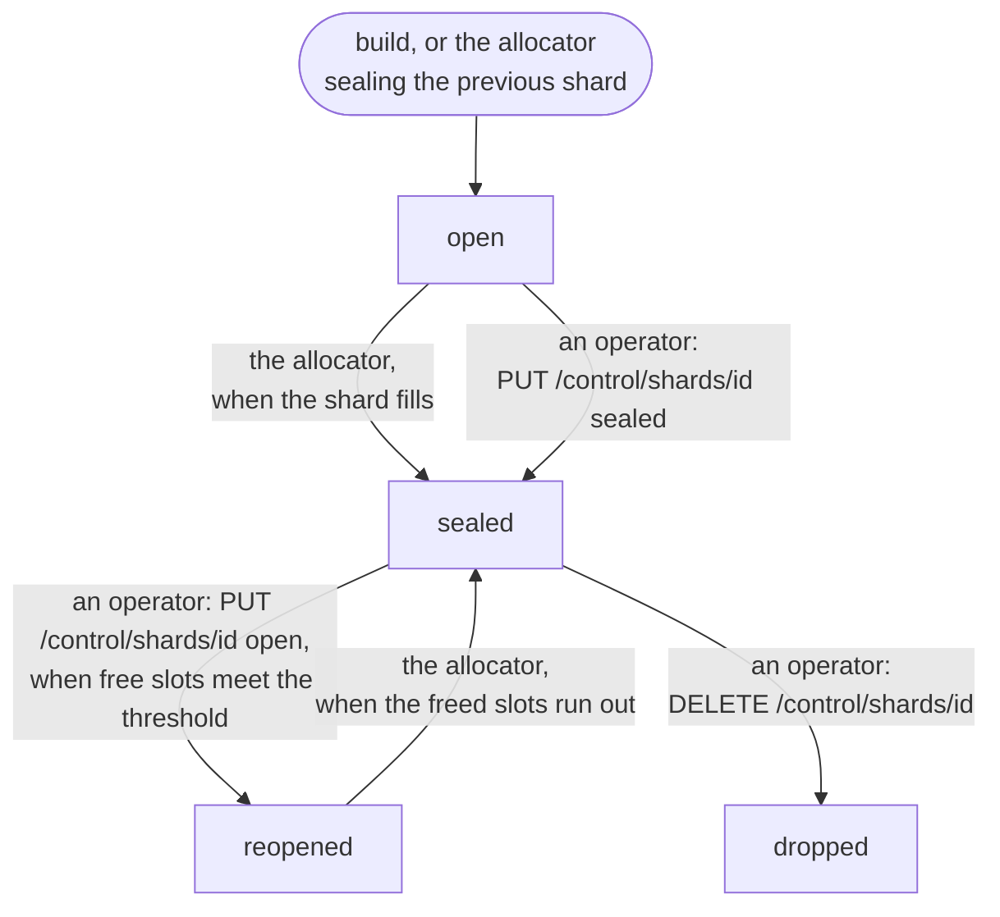
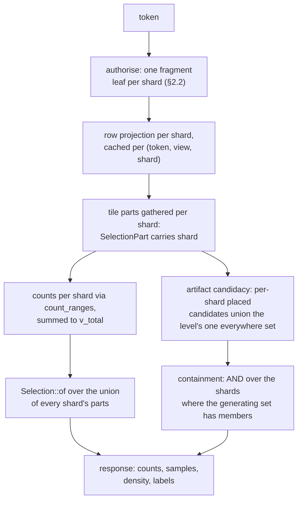
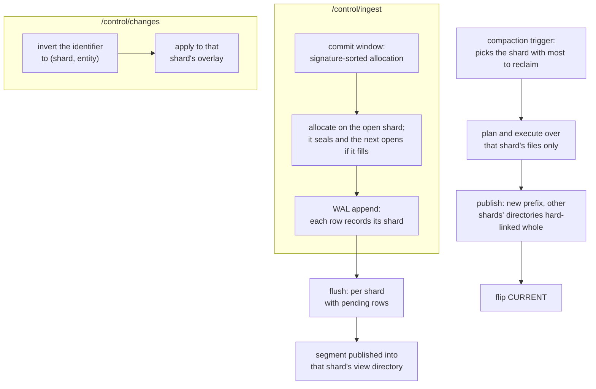
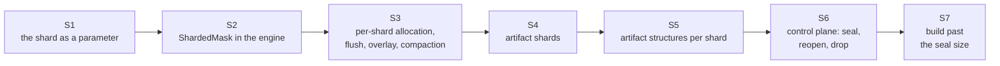

# Sharding: epoch shards in one process

**Date:** 2026-09-04
**Status:** Provisional (design, 2026-09-04). Nothing in this document is built. Every section
says what exists today and what it becomes.

Entity ids are a `u32`, bounded by the allocator's ceiling (`tessera-lifecycle alloc.rs`,
`ENTITY_ID_CEILING`) and by the identity construction ([contracts.md](contracts.md) §2.6). The
entity space fills before the corpus does: consumed ids exceed live items through churn, and an
artifact allocates from the top of the same space, downward from `u32::MAX`. Exhaustion is these
two allocation ranges meeting
([annotation-representation.md](annotation-representation.md)).

The answer is an epoch shard. The corpus becomes a list of shards inside one process. Each point
shard holds its own `u32` entity space and its own `u32` row space per view, with its own
permutation, postings, overlay, allocator and segments. A shard opens when the previous one's
allocator fills, or earlier at a configured size. `RowId` stays `u32`; nothing widens. The term
dictionary, the layer and view registries, the artifact registry and session tokens stay whole
across shards. A request's mask becomes one leaf per shard, summed and unioned rather than
composed into one bitmap; allocation happens in one open shard; a deletion or suppression applies
to the shard its identifier inverts to; compaction runs on one shard at a time.

## 1. Model

### 1.1 What a shard is

A **shard** is `ShardId(u32)`, a newtype in `tessera-types` (`define_id_newtype`). Its value is
one of 0 to 4095, the width of the identity's shard field (§1.2). A shard id, once used, is never
reused, the rule contracts §2.1 states for `seg_id`. The manifest is the allocator of shard
numbers: `next_shard_id` is a monotone counter.

There are two kinds.

- A **point shard** holds an entity space of `[0, 2³²)`, one row space per view (`u32`), a
  permutation per view, segments per view, its own term postings and delta tiers, its own
  entity-to-term transpose, attribute extents, record-blob extents, text extents, external-id runs
  and locator, an overlay (`deleted`, `suppressed`) in its own entity space, an allocator, and a
  compaction generation counter
  ([decision 0072](../decisions/0072-entity-ids-are-slots-and-are-reused-after-a-fold.md)).
- An **artifact shard**, kind `artifacts`, holds an entity space only: no row space, no
  permutation, no segments, no Morton order. It holds an allocator, postings over the terms an
  artifact's own visibility gates on, and an overlay for deleted and suppressed artifacts. It
  opens, seals, reopens and is dropped by the same rules as a point shard, because artifact churn
  alone consumes a `u32`: about 14 months at a daily replacement of 10⁷ artifacts
  ([annotation-representation.md](annotation-representation.md)).

Shard 0 is the build's first point shard and shard 1 its first artifact shard. A later shard of
either kind takes the next number from `next_shard_id` when it opens. The smallest bundle has two
shards.


*What is per point shard, what is in an artifact shard, and what stays global to the bundle.*

A point shard passes through four states.

- **Open** accepts allocation.
- **Sealed** accepts no allocation, but accepts edits, deletes and suppressions; compaction still
  runs on it.
- **Reopened** accepts allocation again, drawn from the slots compaction has freed; it seals again
  once those slots are gone.
- **Dropped** is removed; its number is retired.

Exactly one shard of each kind is open at a time. Several open shards of one kind, one per data
source for example, is an option this design does not take (§11).



*The point-shard state machine: the transitions, and who takes each one.*

| State | Accepts allocation | Accepts edits, deletes, suppressions | Compaction runs | Entered by |
|---|---|---|---|---|
| Open | yes | yes | yes | the build, or the allocator opening the next shard |
| Sealed | no | yes | yes | the allocator (seal by size), or an operator |
| Reopened | yes, from freed slots | yes | yes | an operator, when free slots meet `shard.reopen_min_free` |
| Dropped | no | no | no | an operator; refused while a shard accepts allocation |

Global state, held once per bundle: the term dictionary (`dictionary/terms-<k>.dict`, one
namespace, term ids the policy vocabulary), declared scalars and vocabularies, the layer registry,
the view registry and its incarnations, the artifact registry (ordinals, records, generating sets,
contents, lineage), session tokens, the identity key and idset, and the `CURRENT` prefix.

### 1.2 Identifiers and spaces

`RowId(u32)` is unchanged in type. Its meaning narrows: a row in one shard's one view. Every store
API that takes a row also takes a `(ShardId, view)` pair.

`EntityId(u64)` is unchanged in type; a value stays under 2³², and it means an entity in one
shard. A reference that crosses shards is `(ShardId, EntityId)`.

`ShardRow(u64)`, engine-internal only, is `(shard as u64) << 32 | row as u64`: the key of the
sharded mask (§2.1). It never reaches the store, the wire or disc. I4's compile-fail tests gain
two cases: a `ShardRow` cannot be built from an `EntityId` alone, and a `RowId` cannot be read from
a `ShardRow` without its shard.

`tessera_id` becomes `FPE_k((shard: 12) ‖ (generation: 20) ‖ (entity: 32))`, decision 0072's
construction with the shard field carrying the shard number instead of the reserved constant 0.
`identity.shard_id` leaves the manifest. Inversion yields `(shard, generation, entity)`;
validation stays whole-identifier equality at the row the slot names, which for an artifact is the
record (decision 0072).

Priority stays the high 16 bits of `tessera_id`. Its composition across shards is exact for the
reason [architecture.md](architecture.md) §12.3 gives for composition across partitions: the
identity is a keyed permutation of the whole input, so no two items anywhere share one.

| Identifier | Type | Scope | Crosses to disc or wire |
|---|---|---|---|
| `RowId` | `u32` | a row in one shard's one view | disc, positional within the shard |
| `EntityId` | `u64`, value under 2³² | an entity in one shard | disc, within that shard's structures |
| `ShardRow` | `u64` | the sharded mask's key | neither: engine-internal only |
| `tessera_id` | `u64` | the client-facing blinded identity | the wire, as it does today |

### 1.3 Bundle layout

Contracts §2.1's layout gains a shard directory, and `bundle_format` bumps.

```
bundle/
  CURRENT
  v000NN/
    MANIFEST.json                       # bundle-level (below)
    dictionary/terms-<k>.dict           # unchanged, global
    partitions/<phash>/
      shards/<shard_id>/                # one directory per shard
        SEGMENTS-<n>.json               # the side-manifest, now per shard
        terms/postings.arrow            # this shard's postings; term ids global
        entities/…                      # external ids, locator, entity→term transpose: per shard
        attrs/…                         # attribute and record extents: per shard
        coalesced/<id>/…                # per shard
        views/<view_id>/                # point shards only
          permutation.bin
          row-entity.u32
          segments/<seg_id>/…
        artifacts/memberships/…         # this shard's slices of every level's membership (.tsmb extents)
      artifacts/                        # global: records, generating sets, contents, lineage, layer manifests
```

`MANIFEST.json` changes as follows.

| Field | Change | Meaning |
|---|---|---|
| `identity` | loses `shard_id` | the shard number moves into `tessera_id`'s own encoding (§1.2), so the manifest no longer needs a reserved constant |
| `shards` | new | one record per shard, below: the bundle-level view of every shard's state |
| `next_shard_id` | new | the monotone allocator of shard numbers |
| `entity_id_high_water` | removed | was one counter for the whole bundle; each shard's own high water lives in its `shards` record |
| `files` | unchanged in shape | covers every shard's files; open verifies per shard and refuses the bundle naming the first shard whose digest fails (ruling F, §8) |

Each `shards[]` record:

| Field | Meaning |
|---|---|
| `shard_id`, `kind` | `points` or `artifacts` |
| `state` | `open`, `sealed`, `reopened` or `dropped` |
| `entity_id_high_water` | seeds the shard's allocator |
| `entity_id_low_water` | present only for a reopened shard, drawing from freed slots |
| `opened_at`, `sealed_at` | the second present once sealed |
| `compaction_generation` | decision 0072's per-shard compaction counter |

The per-shard `SEGMENTS-<n>.json` carries what a `SEGMENTS-<n>.json` carries today: segments,
extents, the deny and tombstone lists, deltas, the watermark, level versions, the compaction
generation. It is per shard by construction, since the directory that names it is the shard's own.
`segments_n`, the geometry version and the overlay version all become per shard.

A compaction of one shard hard-links the other shards' directories into the new prefix whole
(§3.4).

## 2. The read path



*The read path of one viewport request across N shards: fragments and projections are per shard,
counts and selection compose over the union, and artifact candidacy adds the one shared everywhere
set.*

### 2.1 The mask

| | Today | Becomes |
|---|---|---|
| mask type | one `croaring::Bitmap` over one view's row space | `ShardedMask { leaves: Vec<(ShardId, Bitmap)> }`, sorted by shard, one leaf per shard's row space |
| `RowProjection` | `{ rows, base_rows, cardinality }`, one per (token, view) | one per `(token, view, shard)`; `RowProjectionKey` gains `shard` |
| `EffectiveMask` | `{ base, minus, plus, filter, highlight }` | holds a `ShardedMask` for `base` and for the diffs; `minus`/`plus` are per shard, since the buffer's entities carry their shard |
| `DenyMask` | `view -> Bitmap` | keyed by `(view, shard)` |
| `FilterRows::Viewport` | `{ rows, domain }` | per shard |

`ShardedMask` operations: `range_cardinality(shard, Range<u32>)`, `rows_in_range(shard,
Range<u32>) -> Bitmap`, `for_each_run(shard, Range<u32>, f)`, `contains(shard, row)`,
`cardinality()` summed over shards, and `and`/`or`/`andnot` applied leaf-wise by shard key. One
operation is new: `count_ranges(shard, ranges: &[Range<u32>]) -> Vec<u64>` sorts the ranges and
walks a leaf's containers once with a running rank. The sweep calls `count_ranges` once per shard
for a request's tiles, in place of two `range_cardinality` calls per part. No container library is
written beyond this: a leaf stays croaring, and frozen views and the bulk union stay per leaf.

Every mask operation measured against N=1 has a fixed cost per part, about 1.8 µs for a rank
inside a bitset container, cold (`probes/2026-09-04-epoch-shard-treemap-mask/`). A tile split
across N shards pays that cost N times; batching the ranges into one walk per shard amortises it
to one pass per container the shard's leaf touches.

### 2.2 Authorise

| | Today | Becomes |
|---|---|---|
| postings | bundle-wide | per shard: `shards/<id>/terms/postings.arrow` and that shard's delta tiers |
| fragment | one `Bitmap` per session | one `FrozenFragment` per shard, including the artifact shards |
| `FragmentCache` key | `(bundle identity, plugin hash, satisfied terms, watermark)` | `(bundle identity, plugin hash, shard, satisfied terms, that shard's watermark)` |
| row projection | one per (token, view) | `row_space[shard, view].project(fragment[shard])`, cached per `(token, view, shard)` |

A session assembles its fragment from its per-shard leaves. A compaction of shard k rotates shard
k's `FragmentCache` entries and leaves every other shard's untouched.

Measured (`probes/2026-09-04-epoch-shard-projection/`): `Permutation::project` is linear in rows
from 10⁸ upward; a line fitted over 10⁷ to 4×10⁸ predicts the recorded 1,277 ms at 10⁹ within 1%.
Eight leaf projections per token, against one, cost 1.10× the resident memory and 1.4× the build
time; the fixed cost per call is about 10 µs, the 512 KB stamp clear `project_with` pays on every
call.

### 2.3 Tiles, counts, density, selection

| | Today | Becomes |
|---|---|---|
| `SelectionPart` | `(segment, range, row_base)` | gains `shard`; parts for a tile are gathered over every point shard's view |
| per-part count | two `count_range` calls | `count_ranges` per shard |
| `v_total` | the composed total | the sum over shards |
| `Selection::of` | takes the union of parts | unchanged: the union of parts is already its model |
| threshold, floor, cap | per tile | per tile, across the union of all shards' parts, never per shard |

Gather resolves a part to `(shard, segment, local range)` and reads that segment's columns. Every
masked count, density cell and existence criterion is a sum of per-shard counts; the response
holds no per-shard figure, so this adds no leak-register row. The direct-evaluation marker
`check-layers.sh` polices for I7 stays: sampling still runs over the union of parts, never over a
precomputed structure.

Measured (`probes/2026-09-04-epoch-shard-treemap-mask/`): counts pass twice the one-shard cost
from depth 2 to 4 at N=8; at depth 12, 256 tiles, 50% coverage, the count column moves from
0.5 ms to 4.5 ms. Modelled from the columns: about 100 ms against 10 ms per 3,000-tile request for
a dense principal, single-threaded. `count_ranges` is the response to that cost; its own gain is
not measured.

### 2.4 Filters, text, highlight

| | Today | Becomes |
|---|---|---|
| filter postings | entity-space, per column | per shard, a contiguous entity range |
| `RoutedFilter::Entity` | `Bitmap` | `Vec<(ShardId, Bitmap)>` |
| projection | one call | per shard |
| route choice (`can_invert`, row-side or entity-side) | per query | per shard |
| category codes | global (vocabularies) | unchanged |
| text dictionaries | per extent | unchanged, per extent, now per shard |
| highlight | a `FilterRows` never merged into the served set | per shard, as `FilterRows` is |

The filter contract, mask first, candidates pushed down, threshold never top-k, holds per shard.
Choosing the route per shard by tile count is allowed: the contract forbids a route driven by
statistics of the principal's mask, and tile count is not that. The filter crate's own layer rule
is unchanged: `tessera-filter` cannot see a `RowId`.

### 2.5 Artifacts: memberships, row forms, tile index, containment, histogram

| | Today | Becomes |
|---|---|---|
| membership | entity-space per artifact (`Members` over `.tsmb` extents) | sliced per shard, under `shards/<id>/artifacts/memberships/`; an artifact's membership is `Vec<(ShardId, Members)>` |
| generating sets, contents | entity-space records | global records, naming `(ShardId, EntityId)` members |
| row forms | one per (view, layer, level) | one per (view, layer, level, shard); `RowColumn` per shard |
| `TileIndex` | one `own`/`subtree` structure, one `everywhere` set, per (view, layer, level) | per shard for placed artifacts; one `everywhere` set per (view, layer, level), the union of what each shard's placement would make everywhere, tested once per request rather than once per shard |
| containment | one `ContainmentPartition` per (layer, level) | one per (layer, level, shard), over that shard's postings; `G ⊆ M_auth` is the AND over the shards where `G` has members |
| histogram | one walk of the composed mask, cached per token | one walk per shard, vectors summed, cached once per token |

This document reads against [artifact-system.md](artifact-system.md) and
[annotation-representation.md](annotation-representation.md) for the mechanisms in this table.

Candidacy is the union, over shards, of each shard's placed candidates and the level's one
`everywhere` set; the masked probe for a candidate is a sum over shards.

The level's recorded serving layout (decision 0094) stays the default route. A request instead
takes the row-major scan when the viewport's visible rows are fewer than the level's placed
artifacts, so cost at fine zoom does not grow with the shard count. This route is not measured.

The existence criterion sums over shards. The histogram's cache key carries every shard's
`(segments_version, overlay_version)` pair, and the cache stays keyed once per token (decision
0093's one exception). An artifact's own-terms visibility is gated by the fragment leaf of the
artifact shard that holds it. The cut, the lineage and the derived content stay global and
unchanged.

Measured (`probes/2026-09-04-epoch-shard-tile-index/`): a spatial cluster has members in every
epoch shard, so a per-shard tile index alone is 6 to 8.8× the bytes at N=8 and returns 2.3 to 7.8×
the candidates at depth 12; the level's `everywhere` set is most of the candidates on a wide
level, and repeating it per shard is what the shared set removes. The histogram walk is about 1×
under sharding: entries move between shards, and sharding adds none.

Measured (`probes/2026-09-04-epoch-shard-fold-decomposition/`, one real compaction of the MedCPT
36M bundle, 1.66×10⁹ memberships): 48.1% of the 330 s a compaction took was these structures,
rebuilt corpus-wide because they are one per deployment rather than one per shard. Sharding them
makes that share per shard.

### 2.6 Items, browse, categories, suggest, meta

`/v1/items/{tessera_id}`: inversion yields `(shard, generation, entity)`. The existing check that
refuses a nonzero shard becomes a dispatch to that shard. `visible_to` runs on the shard's
fragment leaf, O(1), in entity space, before any row lookup, as it does today. The row lookup
itself reads that shard's view row space.

Browse and categories: per-shard counts, summed. Suggest: per-shard presence, unioned
([decision 0124](../decisions/0124-the-suggestion-route-may-follow-the-viewers-cardinality.md)'s
cardinality rule applies to the sum). Meta: sums.

## 3. The write path



*The write path: allocation and flush stay in the open shard, a deny resolves to the shard its
identifier inverts to, and compaction runs over one shard while carrying the rest forward as
links.*

### 3.1 Allocation

| | Today | Becomes |
|---|---|---|
| allocator | one, bundle-wide | one per shard: `Allocators { by_shard: BTreeMap<ShardId, Allocator>, open: BTreeMap<ShardKind, ShardId> }`, one open shard per kind |
| point allocation | `allocate(n)` | `allocate(n)` on the open shard; when `remaining() < n` the open shard seals (recorded at the next publication) and the next shard opens, numbered `next_shard_id` |
| artifact allocation | the two-region allocator: points up from 0, artifacts down from `u32::MAX` | `allocate` on the open artifact shard, which seals and is succeeded on the same rule as a point shard; no `allocate_rowless`, no two regions |
| seed | one manifest field | each shard's own `entity_id_high_water` seeds its allocator; WAL replay recovers per shard, since a record carries its shard |

A commit window's allocation run may straddle a seal boundary; each row records the shard it
landed in.

Seal by size, `shard.seal_rows` for point shards and `shard.seal_artifacts` for artifact shards,
each defaults to the entity ceiling and is tunable; an operator may set a lower figure. For point
shards the design expects a value around 2³⁰, to bound compaction and projection cost per shard;
both defaults are open (§11). Seal is also an operator verb (§3.5).

### 3.2 Ingest, the commit window, the WAL, flush

| | Today | Becomes |
|---|---|---|
| `WalRow` | no shard field | gains `shard` |
| commit window | signature-sorted allocation | unchanged in scope |
| flush | one pass over the buffer | per shard with pending rows: the open shard for new points, a sealed shard for edits that changed geometry or attributes |
| flush output | a segment in the view directory, an extent above the base | a segment in that shard's view directory, an extent above that shard's base in that view's row space |
| row-projection repair (`extend`) | one call | per shard leaf |

[Decision 0091](../decisions/0091-build-is-ingest-into-an-empty-database.md)'s equivalence, that a
build is ingest into an empty database, holds per shard and
across a seal boundary: a build whose input exceeds the seal size writes shards 0, 2, 3 and so on
in input order, exactly as ingest would.

### 3.3 Deny: deletions and suppressions

`/control/changes` inverts each identifier to `(shard, entity)` and applies the change to that
shard's overlay. The two removal rules apply per shard: a suppression leaves the overlay only on
unsuppress; a deletion leaves it only at the compaction of its own shard that removes its rows
([write-path.md](write-path.md) §5.4). Dropping a shard removes every row it holds, which meets
the deletion rule's condition for every one of them at once. Geometry stamps stay advisory
([decision 0041](../decisions/0041-pins-become-a-staleness-stamp.md)).

### 3.4 Compaction per shard

A compaction plan names one shard. Compaction (the operation the code and earlier documents call a
fold) already runs its passes over one prefix; under this design that prefix is one shard's. The
trigger gauges, dead rows, retirable deletions, segment count, and the gated window
([decision 0056](../decisions/0056-a-folds-schedule-is-a-gated-window-not-a-pure-timer.md)), are
per shard, and the trigger picks the shard with the most to reclaim. The passes run
over that shard's files only. Publication writes the new prefix with the other shards'
directories hard-linked whole; the flip, retirement, WAL rotation and reclaim proceed as they do
today ([compaction.md](compaction.md) §§4–8). Retirement is per shard, and the compaction
generation counter is per shard (decision 0072). A compaction of shard k rotates only shard k's
session fragment entries and projections. Merge and coalesce run per shard, suspended only while
that shard's compaction is unpublished. An artifact shard's compaction runs the passes that apply
to an entity space without rows: postings, external ids, the dictionary and the overlay's
retirement.

Sealing schedules one closing compaction when any of the shard's gauges is non-zero. Its final form is one base segment per view, one postings tier, one
external-id run, an overlay holding only suppressions (its deletions retired), and a digest per
file. A sealed shard with no later edits then stays unchanged on disc until it is reopened or
dropped.

Measured (`probes/2026-09-04-epoch-shard-fold-decomposition/`, one real compaction of the MedCPT
36M bundle): 330 s total. 1.5% is inherently corpus-wide (dispatch, the manifest, the flip). 50.5%
is proportional to the compacted shard's rows. 48.1% is the artifact structures §2.5 describes,
corpus-wide today and per shard under this design.

### 3.5 Reopen and drop

`PUT /control/shards/{id}` with `{"state": "open"}` is allowed when the shard's free slots
(retired since its last compaction, under decision 0072's slot return) meet
`shard.reopen_min_free`, an operator lever. Allocation then draws from that shard until its free
slots are gone, when it seals again. The shard already open seals first, since only one shard is
open at a time. `{"state": "sealed"}` seals a shard immediately.

`DELETE /control/shards/{id}` is refused while a shard is open or reopened. Otherwise, the next
publication removes its directory, its number is retired, and every identifier it issued becomes
invalid by whole-identifier equality, since no row carries it any longer. Dropping an artifact shard retires every artifact it holds as deleted, and their records leave
the registry at the same publication. Both operations are irreversible for identifiers.

### 3.6 Layout changes and views

A new layout, a new view or a view's re-incarnation ([views.md](views.md)), is built as that view
in every point shard and published in one generation swap. Two shards are never served in two
layouts. A re-layout is the one operation that rebuilds every shard in one publication.

## 4. Build

`tessera build` writes shard 0 for points and shard 1 for artifacts; past the seal size of either
kind it opens the next shard of that kind, numbered in opening order, in input order. Each shard's views get their own permutation and
Morton sort; the layout is computed once over the corpus, since coordinates are per item and only
the sort is per shard.

For a corpus under the seal size, the built bundle is byte-identical to today's, except for the
directory move and the manifest.

## 5. Control plane and observability

`/control/status` gains `shards: [{shard_id, kind, state, live_rows, entity_id_high_water,
remaining, overlay: {deleted, suppressed}, retirable_deletions, segments, compaction: {last_secs,
last_rss_bytes, passes}}]`; the totals it reports today become sums over that array. `GET
/control/shards` lists the same records. A refusal at open names the shard and the file (ruling F,
§8).

Per-shard gauges are operator-plane only. Nothing per shard reaches the viewer plane.

## 6. Conformance and the oracle

The Python oracle computes counts, samples and label verdicts over the whole corpus. Under shards
the served figures are sums and unions of per-shard figures, so the oracle's definitions are
unchanged; it needs the shard assignment only to reproduce an identifier.

New fixtures:

| Fixture | What it checks |
|---|---|
| (a) | the same corpus built as one point shard and as three: every viewport, item, browse and category response equal, apart from the identifier's shard field |
| (b) | a sealed shard taking edits, deletions and suppressions: the two removal rules observed per shard |
| (c) | reopen and allocation from freed slots: no identifier reused, decision 0072's rule across shards |
| (d) | a dropped shard: every count falls by its contribution, every identifier it issued answers 404, its number never reappears |
| (e) | a shard with a corrupted file refuses at open, naming the shard |
| (f) | decision 0091's equivalence across a seal boundary |
| (g) | the byte-scanner: no entity id, no shard number and no per-shard count on the wire |
| (h) | an artifact shard sealing at `shard.seal_artifacts` and a second opening: new artifact identifiers carry the new shard number; memberships, generating sets and lineage are unchanged |

## 7. Invariants and the register

| Invariant | Upheld here by |
|---|---|
| I2 | holds per leaf; the sum is what is served |
| I4 | `RowId` stays `u32`; `ShardId` is a separate newtype; `ShardRow` is engine-internal only; the compile-fail tests are extended (§1.2) |
| I7 | direct evaluation over the union of parts, unchanged |
| I10 | the shard number sits inside the keyed permutation; a viewer cannot read it, since decision 0072 already places it there; [decision 0014](../decisions/0014-i10-weakened-to-construction.md)'s weakening applies unchanged |
| I12 | the threshold anchors on the summed unfiltered count |
| I13b | a generating set with members in a shard the process does not hold cannot occur in one process: every shard is held, or the bundle is refused (ruling F) |
| Rule S / Rule F | the two removal rules apply per shard, as §3.3 states |

No new Appendix C row: no per-shard quantity is disclosed. Ruling F's refusal is an availability
choice, recorded in conformance §4.6's coverage and here.

## 8. Decisions, as ruled

Seven, owner-ruled 2026-09-04. The body above is the design that follows from them.

**A. The corpus is a list of shards in one process.** A shard opens when the previous
allocator fills, or earlier at a configured size. Per shard: entity space, row space per view,
permutation, postings, overlay, allocator, segments, compaction. Global: the term dictionary, the
layer and view registries, the artifact registry, session tokens.

**B. A shard is a new axis.** Partitions (architecture §12) are specified and not implemented: a
store carries a map with one entry, named by a build constant, and nothing composes across
entries. When partitions are built, they reuse shard composition.

**C. Sealed by default.** Freed slots in a sealed shard are not reused unless an operator
reopens it, through a lever with a free-slot threshold. This amends decision 0072: slot return
applies within the open shard. Shard ids are never reused, the same rule contracts §2.1 states for
`seg_id`.

**D. Edits keep identity, so land in their shard.**
[Decision 0081](../decisions/0081-a-replacement-mints-identities-an-edit-keeps-them.md) already
rules that an edit keeps its identity rather than minting a new one; a sealed shard is closed to
allocation, and still accepts edits, deletes and suppressions.

**E. Artifacts have their own shards, each with its own allocator, opening and sealing on the same rule as point shards** (the second clause added by the owner the same day). This replaces the two-region
allocator. The identity input is unchanged: `(shard: 12, generation: 20, entity: 32)`, per decision
0072.

**F. A shard whose digest fails at open is refused, naming the shard.** Serving the others would
lower every count with no signal a viewer can see. An operator sees the warning; a viewer sees
nothing.

**G. Recorded now, built when compaction or projection time is the problem, at around 10⁹ rows.**
The rule from now: no new code keys a structure by a single global row total; `RowId` stays `u32`;
the shard is a parameter passed beside it; new allocator code is per shard.

## 9. Evidence: measured, modelled, assumed

| Figure | Class | Source |
|---|---|---|
| compaction split: 330 s total, 1.5% corpus-wide, 50.5% per compacted rows, 48.1% per-shard-under-this-design structures | measured, one real compaction, MedCPT 36M, 1.66×10⁹ memberships | `probes/2026-09-04-epoch-shard-fold-decomposition/` |
| mask fan-out: count, decode, select and `rows_in_range` cost ratios by depth and coverage | measured, synthetic 2³⁰-row universe, one thread | `probes/2026-09-04-epoch-shard-treemap-mask/` |
| tile-index bytes 6–8.8× and depth-12 candidates 2.3–7.8× at N=8 | measured, MedCPT levels and PaperSeek 10⁷ | `probes/2026-09-04-epoch-shard-tile-index/` |
| projection linearity from 10⁸; eight leaves per token 1.10× memory, 1.4× build time | measured, synthetic to 4×10⁸ rows | `probes/2026-09-04-epoch-shard-projection/` |
| the compaction fix that writes a retiring level's forms and adopts them at publication, removing the 135 s / 3.7 GB whole projection the decomposition found | measured, merged the same day | main `6efc6d83` |
| about 100 ms per 3,000-tile request for a dense principal, single-threaded | modelled, from the treemap-mask columns | `probes/2026-09-04-epoch-shard-treemap-mask/` |
| 1.39 s to project a 2³⁰-row shard at 25% coverage | modelled, from the projection fit | `probes/2026-09-04-epoch-shard-projection/` |
| per-session mask cardinality grows sub-linearly with the corpus (1.25 GB per mask at 10¹⁰ rows, 10% coverage, in either construction) | assumed, a stated precondition, to be confirmed before any figure above 2³² is promised | [scaling-analysis.md](../evidence/analysis/scaling-analysis.md) §4 |
| `count_ranges`' own gain; the shared everywhere set; the request-aware route (§2.5) | not measured | n/a |

## 10. Delivery in stages

Each stage merges on its own, with a one-shard bundle behaving as today: byte-identical counts and
samples, and identifiers identical while the shard field is 0 and the generation is 0.



*The staged delivery. Each stage is a merge on its own; the implementation plan is built from this
order.*

| Stage | What it does | Gate |
|---|---|---|
| S1 | `ShardId`; the store's `Bundle` gains `shards`; every per-view structure moves under a shard; `bundle_format` bump; the manifest lists shards; the engine passes shard 0 everywhere; the compile-fail tests | bundles equivalent, full suite |
| S2 | `ShardedMask` replaces the engine's bitmaps in projection, composition, filter rows, deny mask, histogram; parts carry a shard; `count_ranges` in the sweep | N=1 no regression on the viewport suite; a bench at N=8 on the treemap probe's shape |
| S3 | per-shard allocator; the identity's shard field taken from the row's shard; open and seal; per-shard flush, overlay, compaction and closing compaction | fixtures (a), (b), (f) |
| S4 | artifact shards: allocator, own-term postings, overlay, seal and succession; the two-region allocator removed | fixtures (g) extended, (h) |
| S5 | artifact structures per shard: membership slices, per-shard row forms, one everywhere set per level, containment per shard, histogram sums, the request-aware route | the tile-index probe re-run at N=8 |
| S6 | control plane: status, seal, reopen, drop, refuse-at-open | fixtures (c), (d), (e) |
| S7 | build past the seal size | decision 0091's equivalence across a seal boundary |

## 11. What this does not settle

- The axis across machines: epoch shards against Morton-range shards. Epoch shards keep the term
  index partitioned by container range and cost one fan-out per request per machine, expected
  cheaper than an exchange per token up to about a dozen machines. Unmeasured; decided when 10¹⁰
  is real.
- Several open shards of one kind.
- The seal-size defaults and the reopen threshold.
- The cost of a re-layout beyond one publication.

## 12. Specification amendments this document implies

These land at stage S1: architecture §13.3 (the assumed row-range default and its trade),
architecture §13.4 ("premature below 10⁸", narrowed to across machines only), architecture §16
(exhaustion);
contracts §2.1 (layout), §2.2 (manifest), §2.3 (the per-shard side-manifest), §2.6 (the identity
input); write-path §2, §4, §5, §7; compaction §§1–3, §9; annotation-representation.md (the
allocator regions, membership per shard); [annotation-write-cycle.md](annotation-write-cycle.md)
(the exhaustion note); [conformance.md](conformance.md) §4.6; scaling-analysis §4 (the shard key
becomes the epoch); and decision 0072 (slot return per shard, sealed by default).
