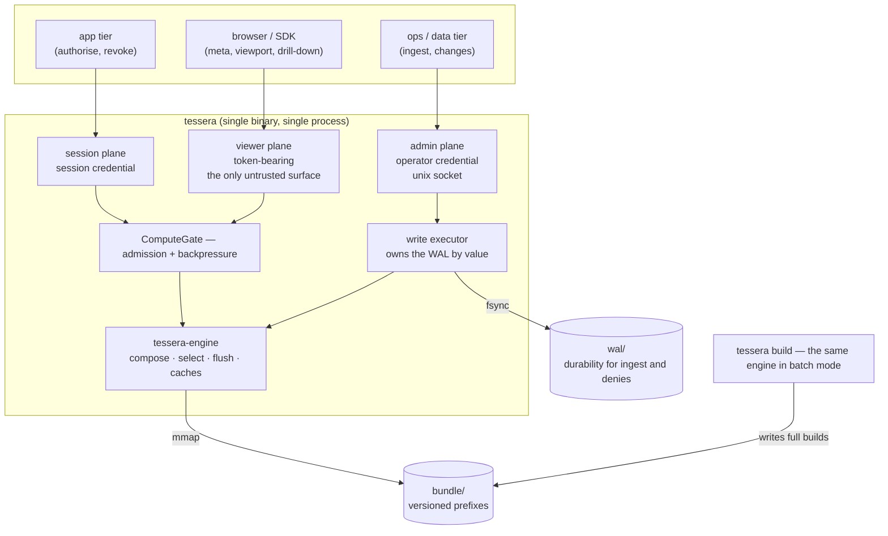
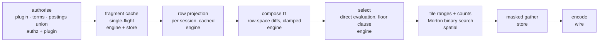

# Tessera — System Architecture: Storage, Serving and Lifecycle

**Status:** Draft r14 — r13 plus decision 0048's deletion applied to §6.6's *evaluate* disposition. **r13's correction is preserved and must stay**: the evaluate deletion arrived on a branch cut before r13, so taking its §6.6 paragraph verbatim would have reinstated both the immediate-postings-subtraction reading and the invented "row tombstone" that r13 removed. r13 was r12 plus §6.6's refuted deletion sentence corrected (Appendix R). r12 was r11 plus [`write-path.md`](write-path.md)'s §13.1 supersession, performed at its promotion (2026-08-04): §6.2, §6.4 and §6.5 are reduced to their security and architectural statements plus pointers, and §6.7's merge-scheduler paragraph is deleted in favour of write-path §7. Both halves of merge now publish. §6.6's retirement rule is restated as Rule S / Rule F, the stamp ledger and its floor being deleted from the spec rather than deferred

**Companion to** `architecture.md` (the specification, which owns the invariants and the *why*) and the capability epics in this repository's issues (which own sequencing — the phase model they replaced is archived). This document owns the *shape of the built system*: processes, crates, contracts, artifact formats, the operational lifecycle, configuration and packaging. `§n` refers to the architecture design; `contracts §n` to `contracts.md`; `lifecycle §n` to `concurrency-lifecycle.md`. Where this document and the design disagree, the design is right; where this document and `contracts.md` disagree, contracts §0.3's recorded deviations govern.

**Scope.** Backend only — the storage engine, the query surface and the lifecycle. The client appears where its contract constrains the backend: `clients/ts/` is a live second reader of the wire format, and a second reader is what makes a contract a contract (contracts §0.1).

**Specified versus implemented.** Parts of what follows are not built. Every such claim carries a **⊘ Specified, not implemented** marker at the point it is made, saying what exists instead and what a reader must not assume meanwhile; the set is tabulated in `README.md`. A marker's absence is a claim that the machinery exists.

---

## 1. The shape of the system

One Rust engine, one binary, three surfaces — scoped by who holds the credential and what losing it costs.



*The planes, the two write owners, and the two durable stores. Every arrow into the engine from an untrusted source passes the admission gate; the control plane deliberately does not (§4.2).*

- The **viewer plane** accepts only a token plus a query — the sole surface an untrusted client ever reaches.
- The **session plane** carries exactly `authorise` and `revoke`, on its own listener with its own credential, held by the app tier. `authorise` stays off the viewer plane: under a bare-claims plugin the service trusts presented auth data by fiat (I5 — the invariant that the plugin's label and auth functions agree), so an untrusted surface that mints capability from unverifiable claims is a bypass, not an endpoint. Under a verifiable-credential plugin (§4.3) the argument softens to defence-in-depth and cost control (D2). `authorise` does not sit with admin either: the app tier authorises on every session and should hold a credential that can mint sessions, not one that can ingest or delete.
- The **admin plane** (unix socket by default) carries ingest and item changes under an *operator* credential.

**Rust-native end to end; Python is a first-class consumer, never a component.** Every surface is plain HTTP with Arrow IPC bodies, so any language integrates directly — a JVM or Go shop uses the binary and the HTTP surfaces and Python never enters their stack. Python's roles are the test-only reference oracle (`reference/`) and the conformance harness (`conformance/`), neither of which is in any request path or in artifact production.

| Mode | What runs | For whom |
|---|---|---|
| `tessera serve -c tessera.toml` | the binary, three planes | deployments |
| `tessera build` | the binary, batch mode | anyone producing bundles (§6.1) |
| `tessera verify` | the binary, read protocol + structural checks | operators, CI |
| `tessera-engine` (crate) | the engine linked into a Rust host | embedders with their own shell |

## 2. Process model

### 2.1 One process

A deployment runs a single `tessera serve` process against a single partition. Inside it: a tokio reactor for the three HTTP planes, a rayon pool for intra-request parallelism, one write-executor thread that owns the WAL, and a separate small runtime for the deny lane. The engine's own public API is synchronous and owns no async runtime — `scripts/check-layers.sh` forbids `tessera-engine` and `tessera-store` a direct tokio dependency, because an async runtime inside a supposedly synchronous engine reintroduces the reactor-blocking hazard the server-side `spawn_blocking` boundary exists to remove.

### 2.2 With compartments: a router and workers

When a bundle contains compartmented partitions, the parent process is a *router* and each partition a *worker* process mmapping only its own partition's files. The division of state follows one rule, which is §12.3's isolation property restated: **entity IDs, bitmaps and columns for a compartment exist only inside its worker.**

> **⊘ Specified, not implemented.** There is no process split, no `--partition` flag and no spawning: `tessera` has three subcommands (`build`, `verify`, `serve`) and `serve` runs one partition, hardcoded as `"default"`. Everything in §2.2 and §2.3 describes a target. Meanwhile the isolation property is trivially true — there is one compartment — and a reader must not treat any statement below as an enforced boundary.

**The router holds** the bundle-level term dictionary (descriptors are opaque policy-side identifiers, not corpus data — D11), the plugin host, token state, and the label *presence registry* (§2.3). It holds no postings, no masks, no columns, no entity IDs.

**Each worker holds** its partition's term postings, mask *fragments* (built and cached locally, never shipped), columns, permutation, overlay, watermark, WAL, external-ID sidecar, node membership, generating-set slices and label text.

**Authorise fans out.** The router runs `terms_of_auth`, interns to term IDs, computes the reachable partition set by testing required sets from the manifest, and sends the satisfied-term list to each reachable worker, which builds (or content-address-hits) its fragment and acks with no payload. A worker restart loses its fragment cache only; the next query rebuilds it transparently.

**Queries fan out and merge.** Counts sum; priority samples take the global k-lowest of per-worker k-lowests; containment composes per §2.3. Control operations that address items fan out to all workers, each consulting its own external-ID sidecar, and the router aggregates acks.

**Worker lifecycle.** The router spawns workers at boot from the manifest's partition list, supervises them, and enforces a per-request worker timeout. A worker that is down or times out fails the request — I13b (a partition not consulted fails closed) permits *unreachable-by-authorisation* to contribute nothing satisfied; *unreachable-by-outage* is an error, never an empty contribution. A partition discovered at runtime triggers alarm, directory and side-manifest creation, and a worker spawn; it becomes queryable only for tokens authorised after it became ready, which is conservative and correct because reachable sets are fixed at authorisation.

### 2.3 Cross-partition labels and the presence registry

The natural implementation of label containment — AND the verdicts of the workers you queried — is precisely the I13b violation §12.3 warns against: a generating set with a non-empty slice in an *unreachable* partition must fail, and a router that does not know the slice exists cannot fail it. So presence is first-class metadata: a label's generating set is stored sliced per partition; every slice record carries the label's full **partition-presence set**, fixed at submission and build-enforced identical across copies; and the router admits a label only if presence ⊆ reachable **and** every partition in presence returns `G_p ⊆ M_p`. Anything else — a missing verdict, a timeout, a presence entry outside the reachable set — withholds.

The presence registry (label id → presence set; no text, no entity IDs, no cardinalities) is the one piece of cross-partition label metadata the router holds. It reveals *that* some label draws on a compartment, to a process that already routes queries into that compartment, and contains no corpus content — the C13/C14 style of argument, and it needs its own Appendix C row when the design next revises.

### 2.4 What this does not decide

Sharding by Morton range (§13.3) stays out of scope and unforeclosed: nothing here assumes a single global mask, and the router/worker protocol is the shape a shard fan-out will need. Slices are data, not processes: all temporal slices of a partition are served by one worker, selected per request.

## 3. Crate decomposition

A single Cargo workspace of twelve crates. The decomposition tracks the design's subsystems, but its real job is making the invariants structural: each crate's public surface is chosen so that violating an invariant is a compile error or an impossible import rather than a code-review catch. **One crate is exempt and is named as such below.**

```
crates/
  tessera-types      EntityId(u32-bounded), RowId, TermId, Handle, MortonCode, PinId,
                     IdentityKey and the tessera_id bijection (§4.5), contract-version
                     constants. No conversions between ID newtypes. No I/O.
  tessera-plugin     the Plugin trait and one implementation, Passthrough
                     ("builtin:passthrough"). No wasmtime, no module loading.
  tessera-authz      term interning; postings readers (base tier, plus sorted arrays for
                     terms below the manifest's small-term threshold); postings-union
                     mask build — Phase 0 reassigned §6.3's semi-join to build cadence
                     and the oracle, the union being 4-540x faster (probes, results §4.1).
                     Parametric by construction: build_fragment(terms, snapshot, watermark)
                     takes lifecycle state as arguments and holds none, which is what keeps
                     authz <-> lifecycle acyclic. Entity space only: RowId is not in its API.
  tessera-store      segments, manifests, mmap and Arrow IPC columns; the Permutation —
                     the only path between EntityId and RowId (I4), pinned to a
                     (prefix, segments-version, watermark) triple (I11); masked gather
                     kernels; the external-ID sidecar; the persistent frozen-fragment cache.
  tessera-spatial    Morton codes, viewport decomposition, tile range derivation, per-tile
                     counting; the tiler — quantisation, priority derivation, Morton sort —
                     one implementation, used by bulk builds and, when it lands, by flush.
  tessera-lifecycle  WAL; ingest buffer; overlay; entity-ID allocator (single authority,
                     durable high-water, I9); the commit window (§6.2); fault injection,
                     gated out of shipped builds.
  tessera-engine     composition root: the typed narrow API; mask composition per I1;
                     selection (§7.2, and the argued absence of a candidate-list route);
                     the generation swap and its publication guard; the row-projection and
                     fragment caches with
                     single-flight; cooperative cancellation; the write path and its
                     executor thread.
  tessera-wire       Arrow IPC payload encoding. Payload builders never see EntityId (I10).
                     The serialisation chokepoint: nothing outside this crate writes
                     response bytes. Also holds the per-session handle table, dead on the
                     viewer plane and retained for Phase 3 node handles (§4.5).
  tessera-server     axum HTTP for all three planes; config; the admission gate; error
                     mapping. No query logic; reaches neither a column nor a bitmap.
  tessera-build      the engine's batch mode (§6.1): the streaming build and the linear
                     build that serves as its byte-identity oracle; bundle verification.
  tessera-cli        the `tessera` binary: build, verify, serve.
  tessera-bench      the measurement harness. See the exemption below.
clients/ts/          the TypeScript client: core (wire decode, coordinates, mark budget)
                     and viewer. A live second reader of the wire contract, and therefore
                     the reason §4.5 is a contract at all.
conformance/         the invariant suite (pytest): byte scan, canaries, I7 selection,
                     the mask catalogue, the overlay journal, restart replay.
reference/           the deliberately slow, obviously correct Python oracle — Python
                     precisely because it is test-only and independently derived.
```

**`tessera-bench` is the exception to the structural claim.** It reaches across authz, store, spatial, engine, build and server together, which no shipped crate may do, so it sits *above* the layer graph rather than inside it. What keeps that safe is that the edge is one-way: nothing may depend on it, and the layer check asserts that for all eleven other crates by reading their manifests. It also enables the `bench-timing` feature by default, and because cargo unifies features across a workspace build, the stage-timing response header it produces is gated a second time at runtime by `[serve] stage_timing`, which defaults to false.

### The forbidden edges, and what enforces them

`scripts/check-layers.sh` holds the rules, and **it now runs as a gate**: `.github/workflows/ci.yml` runs it on every pull request and every push to `main`, so a change that violates a forbidden edge cannot merge. Locally it also runs from an opt-in `pre-commit` hook installed by `scripts/install-hooks.sh`, which is skipped entirely in a worktree with no `.claude/track` marker — so the *local* check remains advisory, and the gate is the one in CI. Treat the rules below as enforced on the branch and advisory in the working tree.

It remains **a grep-based approximation** of spec rules: passing it is necessary and nowhere near sufficient, and its I4 rule in particular checks only for `impl From` between the ID newtypes in `tessera-types` — an explicit cast between the two spaces is refused by nothing mechanical.

| Rule | What it defends |
|---|---|
| `tessera-authz` may not depend on `tessera-store` or `tessera-spatial` | permissions never learn geometry |
| `tessera-server` may not depend on `tessera-store` or `tessera-authz` | the HTTP layer sees engine API types only |
| `tessera-wire` may not depend on `tessera-store` or `tessera-authz` | the serialisation chokepoint holds no corpus reader |
| `tessera-engine` and `tessera-store` may not depend on `tokio` | lifecycle §7's synchronous-engine rule, made mechanical |
| no `impl From` between ID newtypes in `tessera-types` | I4: the permutation is the only ID conversion |
| no `EntityId` in `tessera-wire`'s payload module | I10 at the serialisation boundary |
| no `entity_id` accessor on the store's column reader | I10 after contracts r6 removed the column |
| no `IdentityKey` and no `identity_key_hex` in the wire or server layers | the key inverts every `tessera_id` and must never reach a response, log or metric label |
| exactly one generation-publishing call form outside `write.rs`, carrying a `PUBLISHER-EXEMPT` marker — and **exactly one such marker** | a second unconditional publisher is a lost-update race: a publication this thread had already observed is clobbered, and the geometry it named is never served |
| `Published::` — the ack-proof token — constructible only in `write.rs` | lifecycle §4's ack ordering: a client must never hold a 200 for a suppression not yet in force |
| `fault-injection` never enabled on a normal dependency edge (asked of cargo, not grepped from a manifest) | the fault switchboard cannot reach a `cargo build` artifact |
| the `NO CANDIDATE-LIST ROUTE` block must remain in `select.rs` | the declined route's refusal argument; deleting it reintroduces the empty-tile cliff for the sparsest principals (I7) |
| `[serve] stage_timing` must exist and must default false | the stage-timing header stays out of a shipped response unless an operator asks |

Four of those guard fail-open paths rather than layering: the single-publisher rule, the ack-proof token, the fault-injection gate and the candidate-list marker. The exemption-counting rule is the notable shape — the single publisher exemption is a marker on one line, and the rule fails on a *second* marker, so the cheap escape is exactly as visible as the honest fix.

**Cache ownership.** Mask fragments → `tessera-authz` (built) and `tessera-store` (persisted, digest-verified); row projections of fragments, and the in-memory fragment cache → `tessera-engine`. `M_sel` and the label frontier have no cache and no code; filter results have no cache because there is no filter crate.

### What is depended on, and what is refused

Each row below replaces work the system would otherwise carry itself, in the trusted computing base or next to it. **Licences are stated because one of them has already been a decision point.**

| Component | Choice | Licence | Replaces | Status |
|---|---|---|---|---|
| Bitmap kernel | CRoaring via the `croaring` crate; `pyroaring` in the reference oracle | Apache-2.0 | the entire mask layer | in the tree |
| Columnar storage | `arrow-rs` + `memmap2`; PyArrow in the reference oracle | Apache-2.0 | the on-disk format and the zero-copy gather | in the tree |
| Renderer, tiles, picking, labels (GPU profile) | deck.gl | MIT | WebGL scatterplot, tile lifecycle, GPU picking, collision-filtered labels | in `clients/ts/viewer` |
| Transport decode (client) | `apache-arrow` (JS) | Apache-2.0 | client-side columnar decode | in `clients/ts/core` |
| Tile grid and pan-as-transform (thin-client profile) | Leaflet or OpenLayers | BSD-2 | slippy-map machinery with no GPU dependency | ⊘ absent |
| Policy evaluation behind `terms_of_auth` | OPA (partial evaluation) or AWS Cedar | Apache-2.0 | policy language, residual disjunctive-normal-form compilation | ⊘ absent |
| Plugin sandbox | `wasmtime` | Apache-2.0 | determinism and isolation for caller code (§4.3) | ⊘ absent |
| Label grammar | `accumulo-access` ABNF, reimplemented natively | Apache-2.0 | predicate syntax design | ⊘ absent |
| **Test-only** — label oracle | `accumulo-access` on the JVM | Apache-2.0 | the only check on I5's label half | ⊘ absent |
| **Test-only** — mask oracle | DuckDB over `pairs.parquet` | MIT | an independent mask-build implementation | ⊘ absent |
| Clustering and labelling | UMAP, HDBSCAN, Toponymy | BSD-3 / BSD-3 / see repo | nothing here — the caller's model pipeline, out of scope, and the build reads only its Parquet outputs (§6.1) | caller-side |

> **⊘ Specified, not implemented.** Six of these are choices rather than dependencies. There is no `wasmtime` and no module loading, no OPA or Cedar behind `terms_of_auth` — `builtin:passthrough` is the whole policy surface — no label grammar and no label machinery to parse for, no JVM and no `accumulo-access` anywhere in the tree, and no thin-client profile: `clients/ts/viewer` is deck.gl only. The mask oracle that exists is `reference/`, Python over `pyroaring` and PyArrow, independently derived; DuckDB appears only under `probes/`, which is measurement rather than conformance. A reader must not take the table as a bill of materials — what a build actually pulls is the first four rows.

The renderer's nearest miss is worth naming because it will be proposed again: deepscatter is architecturally close, and is refused on both its licence and its fill-order tiler — the argument is in [decision 0022](../decisions/0022-deepscatter-rejected.md).

**The frozen-view requirement is what selects `croaring` over the pure-Rust `roaring` crate.** Mask loading is a memory-mapped frozen bitmap read without a copy, so the binding has to expose the frozen family — serialisation into the `Frozen` format on the write side, a `BitmapView` deserialised from mapped bytes on the read side — and `roaring` has no equivalent. That requirement is **met**: `croaring` is a workspace dependency and `tessera-authz`'s persistent fragment cache is built on exactly those two calls. Were the binding ever to regress, the fallback is a thin FFI shim over CRoaring directly — a day of work, not a redesign — so the dependency is load-bearing without being a single point of architectural failure.

## 4. The contracts

Every boundary is a versioned contract; everything else is internal and free to change. The byte-level definitions live in `contracts.md`, whose §0.3 deviations govern where it and this document differ.

### 4.1 The bundle format (build ↔ serve)

The unit of storage, deployment, backup and rollback: a directory tree of versioned prefixes and one mutable pointer. The mutability rule, stated precisely because it is easy to get wrong: **files are immutable; the live prefix is append-only; retired prefixes are frozen.** Streaming ingest may add files to the live prefix; nothing ever rewrites or deletes a file except retirement of a whole prefix. The geometry stamp is the triple *(prefix, segments-version, watermark)*, and I11's discipline — a request's geometry is fixed for its lifetime — applies to the triple. **The stamp is advisory across requests** and retains nothing (`geometry-pinning.md`); within a request it is simply which generation the request loaded.

```
bundle/
  CURRENT                          JSON: {"prefix": "v00042", "manifest_digest": …}
  v00042/
    MANIFEST.json                  bundle-format version; data-plugin hash; declared bounds
                                   and scalars; small-term threshold; quantisation bounds
                                   (so every artifact producer shares one grid); entity-ID
                                   high-water; the identity block (construction, rounds,
                                   key, shard, idset — §4.5); slice and partition lists;
                                   build provenance, including the batch size when the
                                   build batched (§6.1); per-file digests and sizes
    dictionary/terms-<k>.dict      immutable extents, logically concatenated — ONE
                                   bundle-level interning namespace, never per partition
                                   (D11: per-partition namespaces dissolve byte-equality
                                   of descriptors as the I5 mechanism)
    partitions/<phash>/
      SEGMENTS-<n>.json            per-partition side-manifests, each COMPLETE, numbered
                                   monotonically, never reset across prefixes; written
                                   only after every file it names is durable
      terms/postings.arrow         CSR: one tagged record per term, portable Roaring
      terms/deltas-<n>.arrow       per-flush posting deltas
      terms/pairs.parquet          the exploded (entity_id, term_id) relation; optional to
                                   serve and REQUIRED to run the conformance differential —
                                   the reference oracle, which derives masks from it by
                                   direct scan rather than from postings
      entities/external-ids-<k>.arrow   caller external ID → entity, byte-sorted **within each run**; runs are not ordered against one another
      entities/ext-locator.u32          entity → ordinal in the above, for drill-down
      slices/<slice_id>/
        permutation.bin            entity→row, one direction only
        segments/<seg_id>/
          columns.arrow            tessera_id, residual, priority, declared scalars
          morton.u32               the Morton column; tile ranges derive from it
          permutation.bin          streamed segments only; absent on a build segment
```

Four things this tree deliberately does **not** contain, each a recorded deviation: no stored inverse permutation (row→entity is the inverse of the `tessera_id` bijection, a pure function); no `tiles.bin` and no `candidates.bin` (tile ranges derive by binary search over `morton.u32`, and I7 guarantees exact selection without a candidate list); no `entity_id` or `node_id` column; and no prefix-level side-manifest, because workers flush independently and hold their own watermarks. The Morton column is `u32`, not `u64`: the width is a property of the 2¹⁶ × 2¹⁶ grid, not of the population, and it saves 4 GB at 10⁹ at zero decode cost.

**The external-ID sidecar is transitional.** It is a placeholder for a future adopted per-point metadata store (owner ruling, 2026-07-29), occupying the same slot as §8.3's vector sidecar and §10.3's per-interaction routing row; the eventual store serves all three. **Extend the replacement, not this.** Everything the rest of the system knows about it is two functions — `external_id → entity` and `entity → external_id` — so the storage behind them can be swapped in one file. Design Appendix D does not forbid the adoption: it rejects adopting external systems for the *access-control layer*, and this store is read only after the visibility test has already answered "visible", so it never participates in masking.

**Read protocol.** A reader resolves `CURRENT`, digest-checks `MANIFEST.json`, and per partition takes the highest `SEGMENTS-<n>.json` whose files all verify by size and digest, stepping down if the highest fails. Local publication is write-then-rename; object stores get no rename, which is exactly why side-manifests are numbered, complete and digest-bearing — a half-synced prefix fails verification instead of serving wrong geometry. Contracts §2.3 additionally requires `readyz` to fail when the newest verifying `n` is older than a configured lag bound, because unbounded step-down would let a badly synced replica serve long-deleted items as live.

> **⊘ Specified, not implemented.** Step-down is built; its time bound is not, and `readyz` does not consult one. A replica that falls arbitrarily far behind therefore serves stale geometry as ready. Safe today only because there is no replica: one process opens one bundle it wrote itself.

**Refusals.** The engine refuses a bundle whose format version is newer than it knows, and refuses to serve when the manifest's data-plugin hash differs from the configured plugin's — that mismatch is a full-reindex event (§6.1), not tolerable drift.

**Rollback.** Flipping `CURRENT` backwards abandons segments streamed into the newer prefix; those batches survive in the WAL up to its retention window and replay into the restored prefix. Rollback is an operator action with a bounded data-loss-and-recovery story rather than a silent one.

> **⊘ Specified, not implemented.** The retention window does not exist: there is no `wal_retention` knob, nothing retires a WAL entry, and nothing trims the log. The WAL grows until `wal_hard_limit_bytes` refuses further appends. That is safe in the rollback direction — nothing a replay would need has been discarded — but the *bound* the story rests on is an operator's disk, not a mechanism.

The manifests are JSON deliberately: they are what an auditor reads first, and the cost at this frequency is nil. Hot structures are binary.

### 4.2 The service API

HTTP on every surface, Arrow IPC bodies for anything columnar, JSON for control messages. No gRPC: one framework (axum) serves all three planes, browsers reach the viewer plane without a proxy, and the payloads that matter are Arrow either way.

**Viewer plane** — token-bearing, the only untrusted surface. Five verbs, and the intent is that the list is complete: Appendix H's counting-versus-aggregation boundary is what keeps the surface enumerable, and an enumerable surface is what makes the leak register exhaustible at all.

| Verb | Request | Response |
|---|---|---|
| `GET /v1/meta` | — | slices, coordinate bounds, max tile depth, declared-scalar schema, contract versions, idset, filter-operand *names*, and the **C11** containment-filtered label vocabulary — the one data-derived field, gated on `M_auth` (the viewer's authorised set) |
| `POST /v1/viewport` | slice, zoom, tile range or bbox, filter set, k (server-capped), optional geometry stamp | Arrow: per-tile exact masked counts, matched-and-visible alongside total-visible; sampled points (`tessera_id`, x, y, declared scalars); optional density-underlay stream; the geometry stamp answered from, and whether the presented one is stale |
| `POST /v1/items/{tessera_id}` | drill-down; the identifier is assumed current (§6.8) — there is no rotation parameter | item detail |
| `POST /v1/labels` | slice, viewport, filter set, optional geometry stamp | frontier nodes with at most one gated label each, plus tier |
| `POST /v1/region` | slice, polygon or box, filter set, optional pin | exact masked count; sampled preview; masked breakdowns |

> **⊘ Specified, not implemented.** Three verbs are mounted: `/v1/meta`, `/v1/viewport`, `/v1/items/{tessera_id}`. `/v1/labels` and `/v1/region` are absent — not stubbed, so a caller gets a 404 rather than an empty or partial answer, which is the right failure. Both depend on machinery (the node table, the label ladder) that does not exist.

**Pins are real request parameters.** A response carries a session pin: an opaque reference to server-side pin state. Under fan-out that state is a **vector** — one *(prefix, segments-version, watermark)* triple per reachable partition — because segments-versions and watermarks are per-worker facts and a single triple cannot name them. A client may present a pin on later requests for cross-request consistency; a drained pin is **rejected** with an explicit `410 pin-expired` rather than silently reinterpreted (I11). Because even a scrambled pin's *rate of change* signals corpus activity the viewer may not be authorised to infer, this is a residual channel — C14-like, low severity, partially maskable by rotating the scrambling per session — and it wants an Appendix C row.

An early draft carried a `filters/validate` verb. It is **removed**: operand discovery moved into `/v1/meta`, and a text-token vocabulary echo would have been an unmasked corpus-wide aggregate — an I2 bug by the design's own rule, since I2 requires every aggregate to be computable from inside `M_auth` alone. Text operands acknowledge nothing about the vocabulary; an unmatched token simply yields an empty operand.

**Session plane** — a separately bindable listener (loopback by default), its own credential, two verbs: `POST /session/authorise` (auth data → `{token, expires_at}`, with content-addressed mask reuse) and `POST /session/revoke` (the revocation backstop).

The scoping is least-privilege, not theatre, and what a session credential is *worth* depends on the plugin's auth-data shape. With a **bare-claims** plugin, the service trusts whatever is presented, so the credential is read-everything — mitigated by scope, network placement and audit logging, not by pretence. With a **verifiable-credential** plugin (§4.3), auth data is a signed, principal-bound assertion the plugin verifies, and the credential degrades to "may submit credentials": compromising the app tier yields the assertions it sees in flight, not instant authority over every principal. Production deployments should prefer the second shape.

**Admin plane** — unix socket (loopback TCP plus credential on Windows), one *operator* credential. Identifiers here are the **caller's own**: external item IDs and the caller's stable node IDs. Viewer identities never appear (this plane has no session); entity IDs never appear anywhere.

| Verb | Purpose | Status |
|---|---|---|
| `POST /control/ingest` | Arrow batch: external_id, x, y, predicate, scalars. Carries a caller batch id; acked only after WAL fsync; replay of an acked batch id is idempotent; duplicate external IDs are rejected with the conflict list | mounted |
| `POST /control/changes` | deletion / suppression / unsuppression, addressed by external_id or tessera_id → overlay entries; same WAL-then-ack contract. The `predicate` op is withdrawn and its machinery deleted (decisions 0047, 0048) | mounted |
| `GET /control/status` | the operational surface (§9) | mounted |
| `POST /control/flush`, `POST /control/compact` | forced lifecycle actions — a flush at the next tick, a compaction fold on its own thread | mounted |
| `POST /control/labels`, `GET /control/labels/invalidated`, `GET /control/nodes/{id}/term-distribution`, `GET /control/nodes/{id}/members` | label submission, the invalidation pull queue, the caller's labeller feed, unmasked node iteration | ⊘ absent |
| `POST /control/allocate-ids` | leases an entity-ID range to an external artifact producer | ⊘ absent |

> **⊘ Specified, not implemented.** Seven of the ten verbs above are absent rather than stubbed — a call gets a 404, never a success that did nothing. Two consequences a reader must carry: **§6.6's rebuild-against-a-live-deployment story has no allocation endpoint**, so the only ID authority is the serving process's own allocator; and there is **one credential layer, not two** — the *build* credential that was to gate unmasked node iteration does not exist because the endpoint it gated does not.

**Backpressure and limits.** `/control/ingest` returns `429` with `Retry-After` when the write queue or the ingest-admission bound is reached. `/control/changes` carrying a *deny* disposition (deletion, suppression) is **never refused for capacity** — refusing a security operation for load is fail-open; deny entries are tiny, are drained ahead of ingest work, and are always accepted, and a saturated overlay schedules mask rebuilds and raises an alarm instead of shedding. The lane is chosen by the *command*, not by which handler was called, so a suppression cannot land on the bounded queue by routing accident. Two consequences of that asymmetry, chosen rather than discovered: **a sustained deny flood starves ingest completely**, and **the deny queue is unbounded in memory**. Viewport `k` is server-capped; tile counts, region vertex counts and batch sizes are bounded.

Plus `/healthz` and `/readyz`. Failure semantics everywhere: **fail closed** — any error in mask construction, composition or containment returns an error, never a partial result. An authorised, well-formed request may also be refused for load or shape (`429` from the admission gate, too many tiles, an underlay refusal, a cancelled request), which is part of the service contract and part of C14's timing shape.

### 4.3 The plugin ABI (policy ↔ core)

A module exporting `terms_of_label`, `terms_of_auth` and `declared_bounds`. Descriptors are opaque byte strings; the engine owns interning in the single bundle-level namespace. The module hash keys both blast radii: the auth-function hash enters the fragment cache key, the data-function hash enters the manifest.

> **⊘ Partially implemented.** `tessera-plugin` ships the trait and one implementation, `Passthrough` (`builtin:passthrough`), compiled in. There is **no wasmtime dependency and no module loading**: `[plugin] module` accepts exactly `"builtin:passthrough"` and any other value — including `"builtin:access-expressions"` — is refused at startup. So the module-hash blast radii exist as manifest fields rather than as a mechanism, and I5 (the plugin's two functions agree) is trivially true and untestable for passthrough. The streaming build additionally *refuses to run* against any plugin whose labelling is not decomposable, rather than assuming it is (§6.1).

Where a WASM host arrives, it runs with no WASI capabilities, and out-of-process-over-a-pipe is the documented fallback for policy engines that cannot target WASM.

**Verifiable auth data.** Auth data need not be bare claims: a plugin may accept a signed, principal-bound assertion (JWS, SAML, an attribute certificate) and verify it against trust anchors **embedded in the module** — signature verification is pure computation and needs no capability, and embedded anchors make rotation a module-hash change, which correctly invalidates every cached mask. Three consequences the contract absorbs explicitly:

- *Expiry is the host's job.* The sandbox has no clock, deliberately, for determinism. `terms_of_auth` returns terms plus an optional `not_after` extracted from the credential; the host, which has a real clock outside the sandbox, refuses expired assertions and clamps token lifetime to min(backstop, `not_after`). The plugin stays a pure function.
- *No online revocation.* I6 and the capability-free sandbox forbid OCSP or CRL fetching, so revocation is bounded by assertion lifetime and the pattern pushes toward short-lived assertions.
- *The mask cache gets a second key.* Signed assertions carry volatile bytes — nonces, timestamps, signatures — so an auth-data-hash cache key would never hit and every login would pay a full mask build. The canonical dedup key is the hash of the **satisfied term set**, which is all the mask actually depends on, with the auth-data hash retained as a fast path that also skips the plugin run when auth data is byte-stable.

### 4.4 The filter contract (extension ↔ core)

Internally a trait; externally the operand set of §4.2. An operand receives query parameters and an optional candidate bitmap, returns an entity-space bitmap, and must be order-independent: threshold semantics, never top-k; ranked forms apply k after intersection. Text is token postings over the same Roaring machinery as the term index — boolean AND/OR, no scoring, no second index technology in the trusted computing base. Deliberately less than a search engine: C9 is closed *by scope*, and a full-text library would reopen it as a standing review obligation for a capability (ranking) the design forbids. Phrase and fuzzy matching, if ever wanted, enter as build-time tokenisation, not a query-time engine.

> **⊘ Specified, not implemented.** No filter crate, no operand trait, no operands. `/v1/meta` advertises an empty operand list, and the two-mask split (`M_auth` and `M_sel`) collapses to one mask.

### 4.5 Identity on the wire (serve ↔ client)

Arrow IPC record batches, schema versioned in the payload header, read by `clients/ts/core` and by any `pyarrow` consumer.

**A point's identity on the wire is its `tessera_id`: a `u64` keyed *blinding permutation* of `(shard_id, entity_id)` under a per-deployment key**, stored at the row it is shown from (`columns.arrow`), so translating out is a read rather than a lookup and inverting on drill-down is a pure function. The construction is a balanced 8-round Feistel network over 32-bit halves with `splitmix64` as the round function.

The threat model, stated because the mechanism promises less than "keyed permutation" suggests: the key is **not** secret against a bundle-holder, who can already invert every `tessera_id` trivially and gains nothing by doing so. What is defended is that a **viewer-plane client** — holding `tessera_id`s and no bundle — cannot derive entity IDs, cannot order them, and cannot count the gaps between them. That is what I10 needs, because entity IDs are dense and, within each append-only batch and only within one, assigned in term-signature order: a gap between two visible IDs would be a count of unauthorised items allocated in the same window, and proximity would be a statement about shared permission signatures. The key must never leave the server on any plane, in any response, log line or metric label; the layer check names both its type and its plaintext-hex carrier.

I10's structural form is stronger than the permutation: **no artifact the gather reads stores an entity ID**, so it cannot produce one. (`permutation.bin` and `row-entity.u32` hold the entity↔row mapping in both directions — architecture §5.1 — and are consulted by masking and filtering, never by serialisation.) A stable identity is linkable across sessions and across principals by construction — C17 records what that costs and why it is the intended trade — and the identity is a *transport* identifier, stable across rebuilds but not across a repartitioning, which advances the idset. Nor is it stable across a key rotation, and §6.8 states what follows from that: an identifier is assumed current, and a rotation ends every live session.

**Per-session handles survive for one future use.** Point handles are retired from the viewer plane. Phase 3's *node* handles are genuinely per-session — a frontier node is a query-time object, not a corpus object — so the handle table is kept rather than deleted, unreferenced. When it is taken up, one constraint governs it, and it is the only sentence here that survives its own violation: **the decoded worker-local reference is an index into the worker's per-session handle table, never an entity ID** — putting the entity ID in the permutation's plaintext would ship corpus identifiers to the router, and (keyed weakly) to the wire, while matching the rest of this section to the letter. Workers therefore never emit entity IDs even to the router, and the router never holds a table of them.

## 5. The read path

The read path is §2.6 and is not restated. What this document adds is where each step lives.



*Authorise happens once per session (the left two boxes); everything to the right of the projection happens per request.*

Two properties of that path are worth stating because a reader reconstructing it from the design would get them backwards.

**Projection happens once per session, not once per request** — and it is the *fragment* that is projected, not the composed mask. The strategy and the two clamps it requires are design §10.4's, stated normatively there; this document does not restate them. What belongs here is only where they live: `RowProjection` and `compose` in `tessera-engine`, with the projection cached per `(token, slice, segments_version)` and the diffs applied per request.

**A pin is a value threaded by ownership through every call.** No ambient "current version" static exists (I11). A pin fixes row-space geometry and never authorisation state: a suppression applies to a pinned request the moment it is accepted.

**Cancellation is cooperative and total.** `/v1/viewport` mints a cancel token, wired to client disconnect; the engine polls it at a few checkpoints and aborts the whole request the moment it observes the flip — never a partial response (I13a, the invariant that a failed or cancelled request yields no partial answer).

## 6. Lifecycle: build, durability, ingest, change, compaction

### 6.1 The build

**Bulk builds are the engine in batch mode.** `tessera build` consumes a declarative Parquet input contract, runs the data plugin, assigns entity IDs, writes a complete new prefix and publishes by `CURRENT` flip. It is Rust rather than Python (D4) for one reason worth restating: **one tiler** instead of two carrying a bit-for-bit agreement obligation, **one plugin host** instead of two — a second implementation of the I5-critical path is a divergence hazard in its own right — one interner, one allocator. The plan's original Python rationale (UMAP, HDBSCAN, Toponymy interop) belongs to the *caller's* model pipeline, which is out of scope; the build step reads its outputs, and those are Parquet, which arrow-rs reads natively.

**The build is streaming, with external spill, and that is what makes 10⁹ reachable.** The obvious construction — materialise one struct per point, and the whole `term → entity list` relation as a `Vec<Vec<u32>>`, before writing a byte — was built first and **OOM-killed at 10⁹ on a 47 GiB box** before producing any output. It survives as `build_in_memory`, whose only remaining job is to be the oracle: `tests/build_equivalence.rs` asserts the two produce recursively byte-identical bundles.

The streaming build is eleven stages. Every intermediate is a flat, packed array indexed by an integer; anything recomputable from the input Parquet is recomputed rather than retained; anything whose size scales with the corpus rather than the memory budget spills.

| Stage | Produces | Bounded by |
|---|---|---|
| 1 source ids | sorted source IDs — an item's **ordinal** is its index here | 8N |
| 2 dictionary | streamed dictionary, term-lookup arrays, row counts, histogram | 12T + 8T |
| 3 pairs pack | `ordinal << 32 \| term` per batch bucket (RAM when it fits, spilled otherwise) | the plan |
| 4 signature sort | the permanent I9 ordering | the plan |
| 5 assignment | entity ID = position in signature order | the plan |
| 6 postings write | `postings.arrow` and (optionally) `pairs.parquet`, via band spill and parallel Roaring encode | the plan |
| 7 external ids | the sidecar and its locator | 20N |
| 8 geometry scan | coordinates in entity order | 28N |
| 9 tiler sort | `(morton, tessera_id)` ascending | 28N |
| 10 segment write | `morton.u32`, `permutation.bin`, `columns.arrow` | streamed |
| 11 manifests | a full SHA-256 re-read of every byte written | streamed |

Three disciplines make that safe rather than merely fast. **Spill files are fail-closed**: each carries a write-side `(count, content-anchor)` receipt verified on read, so a truncated, tampered or doubly-appended file is a typed error, never a silent partial read — these files feed the permanent entity-ID assignment, and an undetected short read would be baked into every bundle the deployment ships. **Input mutation is detected, not prevented**: the streaming build reads the points file four times and the pairs file three, so a file rewritten mid-build would be read as two corpora; each later pass re-accumulates an order-independent content anchor and compares it against the first pass's, because counts alone accept substitutions that preserve them. **Parallelism never participates in ordering**: every parallel sort site is a total order on unique keys, so an unstable, nondeterministically-scheduled sort still has exactly one output.

**Batch size is identity-bearing under I9.** Entity IDs are assigned in signature order **within each batch and only within one** — the design's own scope for the sort. A batch is a contiguous ordinal range; IDs are batch-major, so per-term posting lists stay globally ascending as the concatenation of per-batch runs, and one batch covering the corpus reproduces the historical global sort byte for byte. The size is derived deterministically from the memory budget on a coarse grid (`BATCH_GRID = 1 << 24`), **recorded in MANIFEST provenance whenever the build batched, and replayed rather than re-derived by an identity-preserving rebuild**. A rebuild at a different batch size is not a slower or faster build — it is a different corpus, and every posting, permutation and identifier derived from it is invalidated. This is the one build parameter an operator can change that forks identities.

**Streaming ingest belongs to the serving engine.** The buffer, watermark and overlay are serving state — the watermark participates in every I1 composition — so their owner owns ingest. Both paths call the same tiler, interner and allocator; there is nothing left to diverge. The manifest records the quantisation bounds so every artifact producer, present or future, shares one grid.

### 6.2 Durability: the WAL, the executor and the ack contract — see write-path §1

One line of this section is security-relevant rather than operational: **an unpersisted overlay
fails open** — a *deny* entry that evaporates on restart makes suppressed items visible again.
Everything else follows from that, and everything else is now
[`write-path.md`](write-path.md)'s: one thread owning the WAL by value so
`append → fsync → apply → swap → ack` is structural rather than a discipline (§1.1); the commit
window that makes the signature-sort scope a server decision, with its honest calibration —
**the window collects the posting-storage win and none of the container-count win** (§2.2); and
the ack contract enforced by type (§2.3).

**Two retirement rules, deliberately different, stated here at the point of temptation.** A *WAL
entry* retires once its data is segment-durable, subject to a rollback-replay retention window
which does not exist (§4.1 marks why). An *overlay entry* retires under Rule S or Rule F
(write-path §5.4), which is strictly later for every deny disposition. Conflating the two is
fail-open.

### 6.3 Admission, backpressure and cancellation

Two independent bounds sit in front of the engine, and neither is on the control plane's deny path.

**The compute gate** wraps the viewer and session planes' CPU-bound work — `/v1/viewport`, `/v1/items`, `/session/authorise` — and never wraps `/healthz`, `/readyz`, `/v1/meta`, `/session/revoke` or any control route, because a suppression must reach the WAL whether the gate is saturated or not. It is two semaphores, not one, because it bounds two different things: an outer *slots* semaphore acquired non-blocking bounds *admitted* requests, so a caller arriving when every slot is taken sheds immediately rather than piling up; an inner *compute* semaphore acquired with a timeout bounds *running* compute, so a caller that got a slot but cannot start within the admission timeout is also shed rather than served arbitrarily late. `compute_admission` is defined as a bound on in-flight requests, not on runnable CPU — the rayon pool bounds the CPU any one request fans out across — and it deliberately oversubscribes, because small requests at this corpus scale are latency-bound on scheduling rather than on CPU.

**Ingest admission** is one semaphore, `try_acquire` only: no queue, no timeout. It bounds concurrent `/control/ingest` handlers, which is the bound on how many blocking-pool threads ingest can hold. Without it the viewer plane shared an unbounded FIFO with ingest and an already-admitted viewport would *hang* rather than shed. The control plane either takes the work now or refuses it, and the refusal costs no blocking thread, no queue slot and no WAL byte.

Every 429 the gate produces is counted, and the count is deliberately not the whole 429 rate: the single-flight caches produce their own 429 (`ProjectionBuilding`, `FragmentBuilding`) *after* admission, so an operator correlating the two should expect the client-observed rate to be equal or higher. Single-flight waiters do not block — a concurrent arrival for a projection already being built is shed rather than queued, which is a client-visible outcome produced by a caching decision.

**Cancellation** is the third lever and the only one that gives back work already started: a disconnected client flips a cooperative token, and the viewport path aborts wholly rather than returning a partial answer.

### 6.4 Ingest, flush and posting deltas — see write-path §2, §4

`/control/ingest`: terms resolved via the plugin and interned; coordinates quantised against the
manifest bounds — and an out-of-bounds coordinate is **refused at ingest**, never quantised onto
the grid's edge (decision 0040); entity IDs allocated by the commit window, **never in Morton
order** (C6 — Morton-ordered assignment would add location to the ID-gap leak); the batch
buffered. Flush writes an immutable segment directory and a **posting delta** (term → Roaring over
the batch's ID range) rather than touching the frozen base postings, and publishes a new complete
`SEGMENTS-<n>.json`.

Items exceeding the declared per-item term bound are **indexed anyway and warned**: a monotone
predicate with more terms intends broader visibility, and a resource guard must not produce an
authorisation-shaped outcome.

**[write-path §2](write-path.md#2-an-item-arrives-controlingest) and
[§4](write-path.md#4-flush--the-moment-of-visibility) own the mechanism**, including the tick, the
three dispositions at the flush snapshot, descriptor promotion and publication by rebase.

### 6.5 The watermark, and what flush actually is — see write-path §4.6

Fragments are content-addressed, shared across credentials, and served as immutable frozen views,
so "OR the flushed contribution into live masks" is impossible as stated. What actually happens:

- **The effective watermark is always the fragment's own.** A request composes against the
  watermark of the fragment it actually loaded, so an entity between that watermark and the
  store's latest is in `L` and directly evaluated — never in neither set. A stamp presented by a
  client is advisory and composition never reads it (decision 0041).
- **A flush therefore never has to patch anything to stay correct**; what it changes is *when* an
  item becomes visible. Refresh is a background pass over resident sessions at each publication,
  and a request is served the freshest entry it has produced (decision 0044, write-path §4.6).

**"Correctness never depends on patching" is a claim about *flushed* entities.** Every bullet
above concerns an entity that already has a row. An entity still in the **buffer** has none, and
every viewer verb asks a row-space question — count the rows in this tile range, in this density
cell, picked by this selection. The composition resolves such an entity's verdict and then has
nowhere to put it. **Flush is therefore the ingest-visibility mechanism, not merely the thing that
bounds segment count**, and that is why **§6.2's acknowledgement is a durability receipt, not a
visibility promise.**

### 6.6 The overlay and the deny-retirement rule

Deletions and suppressions become overlay entries with *deny* dispositions, owned per partition because they carry entity IDs. *(The specification's *evaluate* disposition, for a predicate change, is unbuilt: the op is withdrawn and its machinery deleted — decisions 0047 and 0048, architecture §11.2.)* Overlay size is a first-class metric: I1's composition cost is linear in it, and its configured bound triggers fragment-refresh scheduling rather than refusal — the same asymmetry as §4.2's backpressure. Deletion additionally enqueues affected labels for invalidation. **What hides a deleted item is its overlay entry and nothing else** — there is no second marker: `tombstones` in the side-manifest is that entry's durable serialisation, not a separate row-space object, and a deleted entity's postings and row both stand until the compaction fold removes them together *(r13, correcting a sentence that read as an immediate postings subtraction and invented a "row tombstone" — architecture §11.3's r33 ruling makes the order load-bearing in both directions, and contracts §2.4 and write-path §5.3 both contradict the subtraction as load-bearing: base postings are frozen and delta tiers append-only, so subtracting one **is** the fold)*. IDs are never reused (I9), and the allocator is fuzzed for exactly that.

Overlay precedence between the dispositions is stated once, in write-path §5.3, and is not restated here. The sequence `delete → suppress → unsuppress` must not re-expose a deleted item, and independent **stores** — one written by each op — make that structurally impossible rather than merely tested.

**The deny-retirement rule, and why it is a prohibition.** Because §6.5's refresh is a pure union, it can never *remove* an entity from a fragment: a deleted or suppressed item's invisibility rests entirely on its deny entry. So retiring a deny entry on segment durability, on compaction of the row tombstone, or on WAL retirement each reopens visibility, and each is individually plausible — which is why the rule is stated as a prohibition on all three rather than as a positive condition alone.

**Two rules, owner-ruled 2026-08-03 and stated at write-path §5.4.** A suppression retires **only by its unsuppress** (Rule S) — non-retirable while active by construction, since no fragment rebuild ever excludes a suppressed entity, and giving it any retirement stamp would eventually expire the entry and make the item visible again. A deletion retires **only at the compaction fold that executes it** (Rule F), whose safety is an identity match rather than a stamp ordering: the fold publishes a new prefix, whose manifest digest rotates the fragment identity, so no pre-fold fragment is reachable by key afterwards. The stamp ledger and the retirement floor earlier revisions specified are **deleted from the spec, not deferred**.

> **Both rules are built.** Rule S retires a suppression at its unsuppress; Rule F retires a deletion at the compaction fold that executes it, which exists and is scheduled (compaction §5, §9). Until a fold runs the deletion half is fail-*closed* — an entry that has not retired can never re-expose.

### 6.7 Merging, compaction, and the two-writer problem

**Merge is [write-path §7](write-path.md#7-merge--both-halves-published-on-separate-cadences)'s**, and both its halves publish: an entity-space coalesce that bounds delta tiers, external-id runs and dictionary extents without moving a row, and a row-space merge that bounds segments as its own swap. The Lucene-derived sketch this paragraph carried is superseded there, with two departures from it recorded and reasoned: **no deletes-percentage trigger** (reclaiming a tombstoned row is a fold, and folds are compaction's) and **no re-rank decorator** (the Morton sort *is* the tile index, so it is never optional).

A compaction rewrites permutation and columns, **folds posting deltas into the base tier**, drops compaction-tombstoned entries, and publishes a new prefix. **It invalidates the term index and every mask fragment** — the fold rewrites postings by subtraction and rotates the bundle identity every fragment is keyed by, and it is both halves or neither, since dropping a row while leaving its postings would let Rule F's retirement re-expose the item it retired (decision 0050, correcting this sentence's earlier claim that they were untouched). Node memberships and generating sets are untouched, and the entity axis is not renumbered.

> **Compaction is built** (`compaction.md`), and it discharged this obligation: compaction reads and rewrites columns unmasked, which is sanctioned only because its outputs are bundle artifacts. Its rewrite must never be able to reach response data, and that must be proved by a test rather than held by convention — an unmasked reader whose output can reach a viewer is an I2 breach (every aggregate computable from inside `M_auth` alone) by any route it takes.

**The carry-forward rule is compaction's entire specification.** Compaction snapshots a segments-version, rewrites that set, and at publication *carries forward verbatim* everything accepted after its snapshot: segments, deltas, **post-snapshot tombstones, the active suppression set, and unfolded overlay entries** — folding away only snapshot-covered state. A post-snapshot tombstone folded away while its entity survives in the rebuilt base is fail-open. *(An earlier revision extended the fold obligation to* evaluate *entries; that machinery is deleted — decision 0048 — so the obligation dissolves rather than waiting.)* Flushes never block.

That fold is also the **only** thing that may retire a deletion (Rule F, write-path §5.4; the retirement floor this paragraph used to describe is deleted from the spec, not deferred). A pre-fold fragment still contains the deleted entity, so retiring its tombstone early re-exposes it — the fold is not a hygiene step that can be deferred indefinitely.

Two writers touch the bundle — the serving engine (streamed segments, deltas) and batch mode (full prefixes) — so the races are named and owned:

- **Bulk rebuild versus live ingest.** The builder records WAL positions at snapshot; after `CURRENT` flips to its prefix, the serving engine replays WAL entries past those positions into the new prefix as ordinary ingest. The catch-up window is the build duration; visibility latency degrades gracefully rather than data being lost.
- **Entity-ID allocation has one authority.** The ID space is global across partitions — an item keeps its entity ID through a partition move, or generating sets and label references break. Under fan-out that authority has an address: the router owns the counter, durable in a small allocator journal fsynced ahead of any lease, and workers lease contiguous ranges. A counter high-water is a number, not entity-space data, so holding it at the router does not breach §2.2's isolation rule, which covers entity IDs *of items*, bitmaps and columns.
- **In-flight requests complete against the generation each loaded at its start** — the request's own `Arc` is the whole of the retention; the pin manager, drain list and TTL are deleted (decision 0041). What survives is I11's within-request rule, plus one known re-acquisition: the day prefix *deletion* lands, a `Weak`-handle registry and poller return, scoped to prefixes (lifecycle §2.3).

**Open: how a large batch lands into a *live* bundle.** The bullets above cover a full rebuild racing live ingest, and §6.4 covers a steady arrival stream. Neither is the shape an operator reaches for when loading ten million items into a bundle already serving. Three candidates:

- **One or few very large `/control/ingest` batches.** No new mechanism, and it is the shape that preserves the largest signature-sort scope. Needs flush to exist, and needs a documented batch-size floor so a client that chunks its upload does not defeat it accidentally.
- **A first-class builder append.** Teach batch mode to read a live bundle's high-water and external-ID sidecar, emit a segment plus a posting delta under a fresh `SEGMENTS-<n>`, and publish. Fastest, and reuses existing machinery — but it adds a second writer to the segment-and-manifest surface this section deliberately gave to one thread.
- **The rebuild path above, built properly.** Snapshot WAL positions, lease IDs, carry entity IDs forward, write the next prefix, flip, replay. Most faithful to what is written; most work; and the only one of the three with no implementation surface at all today.

The first needs nothing this document does not already promise; the other two each add a writer or a mode.

### 6.8 Reindex, repartition, backup, restore

A data-plugin change or compartment-map change is a full rebuild through `tessera build` into a fresh prefix — expensive, not risky, reversible; the manifest hash check prevents serving old artifacts under a new plugin. A single item's partition move is a two-step: *deny* overlay entry in the source, ingest in the destination, both WAL-covered.

The bundle plus the WAL is the recovery story: immutable-once-retired prefixes make object-store versioning or `rsync` sufficient, and restore is pointing a fresh node at a digest-verified prefix. Token and fragment state are deliberately node-local and disposable — tokens re-derive from auth data, so node replacement costs re-authorisation and nothing else. Engine upgrades roll forward on the same bundle where the format version permits; format bumps ship a migration that writes a new prefix rather than editing one.

**Identity-key operations are the exception to "expensive, not risky".** The key is named explicitly on the command line, has no default search path and no environment variable, and a build given no key source refuses before doing any work. A rotation is refused without an explicit flag, and it invalidates every identifier a consumer holds — which is why consumers persist `external_id` and treat `tessera_id` as valid only within the session it was issued in.

**A rotation is a session invalidation event** (§10.6; the ruling and its constraints are decision 0025). `tessera_id` values are not guaranteed stable across sessions, and on any given request an identifier is *assumed current* — interpreted under the live key, with no rotation counter for a caller to supply or to vary. The identifier set the live key defines, the **idset**, is published on `/v1/meta`, so a consumer holding cached identifiers polls it and invalidates its own; that is a deliberate poll, not a request parameter. The obligation that falls out of it is operational as much as it is a design constraint: **a rotation must end every live session**, because a session surviving one holds identifiers that now name different items.

> **⊘ Specified, not implemented.** A session token is an opaque random bearer string in a process-local table, expiring at `token_max_lifetime`. Nothing binds it to an idset, so nothing ends live sessions when the key rotates. Until the token design lands, an operator rotating a key must revoke or restart every live session as part of the operation; the service does not enforce it.

## 7. Configuration

One file, `tessera.toml`. The philosophy has a security edge: **performance knobs default; disclosure controls do not.** A config missing a disclosure control fails to start, naming the design section that explains the knob — the config file doubles as the deployment's disclosure-review checklist.

Two properties reinforce it. Every section but `[disclosure]` is `deny_unknown_fields`, so a typo'd key or section header is a startup error rather than a silent default: an operator who sets a knob and gets the default has no signal at all that they did. `[disclosure]` is the exception, and in the direction that costs most: it is parsed as a generic TOML value and hand-validated, so it rejects a *missing* required key and silently ignores an *unknown* one — a misspelling alongside a correct key passes. That is the one section whose keys are disclosure controls. And every check **refuses rather than clamps** — `k_min = 0` would silently disable the I7 floor clause, a zero `theta_target_marks` would blank the density signal, a zero `compute_admission` would shed everything, and each is a typed error naming its own silent failure. The cost is that a config carrying a key from a newer build is refused rather than ignored; that is the right direction for a fail-closed config, because a downgrade that silently drops half an operator's tuning is the worse outcome.

```toml
[bundle]
path  = "./bundle"                    # the bundle directory
cache = "/var/lib/tessera"            # engine-local derived caches
wal   = "/var/lib/tessera/wal"

[plugin]
module = "builtin:passthrough"        # the only accepted value; anything else is refused

[disclosure]                          # no defaults; absence of the section or either key
                                      # is a startup error
min_visible_members = 25              # §7.5 — reviewed as a security control
token_max_lifetime  = 3600            # seconds, integer. Required: there is no backstop default

[serve]
viewer  = "127.0.0.1:7407"            # loopback by default; binding wider is an explicit act
session = "127.0.0.1:7408"            # authorise/revoke only; the app tier's surface
control = "unix:/run/tessera/control.sock"   # loopback TCP + credential on Windows
# credentials: by file or by env var, never inline
session_credential_file  = "/etc/tessera/session.cred"
operator_credential_file = "/etc/tessera/operator.cred"
# selection clause (§7.2) — refused, never clamped, if inconsistent
max_k = 500                           # illustrative; the default is 1000
k_min = 2
k_max_marks = 500
theta_target_marks = 16
# density underlay (§7.3)
max_underlay_offset = 4
max_underlay_cells  = 8192
max_tiles_per_request = 262_144
# admission and parallelism (§6.3)
compute_threads = 8
compute_admission = 32
compute_queue = 64
admission_timeout_ms = 250
# caches and pins
row_projection_cache_bytes = 2_147_483_648
fragment_cache_bytes = 1_073_741_824
expected_concurrent_sessions = 8
pin_ttl_secs = 300
pins_per_session_max = 4
stage_timing = false                  # the bench header; keep closed in a deployment

[ingest]                              # every key optional; the whole section may be absent
commit_window_max_items = 10_000
commit_window_max_age_ms = 200         # parsed; inert — the window never waits (§6.2)
ingest_queue_bound = 32
ingest_admission = 64
ingest_max_batch_rows = 10_000
ingest_max_batch_bytes = 16_777_216   # ceiling: 64 MiB — this is what ONE connection buffers
wal_hard_limit_bytes = 8_589_934_592
overlay_soft_limit = 500_000
flush_max_items = 100_000             # parsed; inert until flush exists (§6.4)
flush_max_age_secs = 60               # likewise
```

`dev_cors_origins` is the one key deliberately absent from the example. Its absence means no CORS layer at all, which is the only sensible default for a knob whose effect is to let a page from another origin present a session token; there is no environment variable and no wildcard, and the enumerated list is what keeps a development affordance from becoming an integration pattern.

Two things that do **not** belong here: the prompt-sample-versus-full-membership label gating choice, which is made upstream and recorded in the manifest as build provenance — a config knob the engine does not act on is a compliance fiction; and any compartment configuration, since the compartment map is schema discovered from data, and config can neither create nor destroy a partition.

## 8. Consumption and packaging

The binary and its HTTP surfaces are the product. `tessera serve -c tessera.toml` under systemd or a container, `POST /session/authorise` from the integrating backend's session middleware (session credential only — the app tier never holds operator), and the viewer plane behind the organisation's TLS termination. No Docker requirement, no JVM, no external services; the object store is optional, since a bundle is a directory.

**Bounding the number of concurrent connections is the deployment's job, and the reason is worth stating rather than leaving to be discovered.** The process bounds what each request costs — the compute gate bounds in-flight viewer requests, the ingest admission bound bounds concurrent ingest handlers, and startup refuses a per-connection body cap above 64 MiB — but it accepts connections without limit. `/control/ingest` in particular is buffer-the-whole-body shaped: the Arrow batch is decoded in one piece, so the body is resident in full before the handler runs and before any admission bound sees it. A caller holding the operator credential can therefore pin one batch cap per connection. The control plane defaults to a unix socket precisely so this is an admin-network question; where any plane is exposed beyond a trusted network, a reverse proxy is what bounds the connection count, and it is a deployment requirement rather than a recommendation. The in-process alternatives — a concurrency-limit layer, a listener-level accept cap — were both assessed and declined, because each converts a prompt refusal into a wait: the first queues where the ingest bound sheds, and the second leaves callers in the kernel's accept backlog with no status code at all. Streaming the upload is the real fix and belongs with the flush work.

**The TypeScript client** (`clients/ts/`) is the shipped reader of the wire contract: `core` decodes the Arrow streams, owns the coordinate transform and the drawn-mark budget; `viewer` is the map application over it. Its existence is what makes §4.5 a contract rather than an internal format, and it is the reason an additive wire change must stay additive.

**A Python wheel** would deliver the binary via maturin plus an SDK and a supervisor: `tessera.build()` and `tessera.serve()` driving the same binary, requests never touching the interpreter, `pyarrow` reading the wire natively.

> **⊘ Specified, not implemented.** There is no `python/` directory, no wheel, no SDK and no supervisor. Python appears only as the test-only oracle (`reference/`) and the conformance harness (`conformance/`). A reader must not assume `pip install tessera` exists, and the supervisor hygiene an earlier revision specified — port 0, a watchdog pipe, a pidfile — has no implementation to be hygienic about.

**What the integrator owns**, because the service cannot check it: consistent plugin functions (I5), a stable projection across slices, stable cluster node identity, honest generating sets (C12), unique external IDs, and a token-refresh policy (I6). `tessera verify` runs what *is* mechanisable — digest verification, manifest and plugin-hash agreement, permutation bijectivity, declared-bounds conformance.

## 9. Observability and failure

**`GET /control/status` is the operational surface.** It is a single JSON document on the admin plane, and it is deliberately rich, because the quantities an operator needs are unmasked corpus quantities that must not leave that plane. It reports: the allocator high-water; the compute gate's admission, queue, in-flight, waiting and shed totals; the write executor's posture, submission and completion counts, WAL appends and fsyncs, apply-time totals and maxima, queue depth and an EWMA of service time; ingest admission and its shed total with the configured batch bounds; overlay depth and soft-limit alarms; pin drain depth and the age of the oldest retired generation; both caches' entries, bytes, bound, hits, misses, building-refusals, evictions, young evictions, a thrashing flag and oversized admissions; fragment rebuild counts; the posting-fragmentation figure — `postings_per_container` and `run_ratio` over the commit-window allocations this process has served, whose scope is narrower than the metric named below and is specified in contracts §3.4; and the session registry's retained count, sweeps run, sessions swept and the count at which the next sweep is due.

The session figures are there because the registry sheds expired sessions on a growth-triggered sweep — a full pass under the mutex the viewer plane takes on every request — and this system's standard is that an O(n) pass on a request path is admissible only where its n is published. Retention is bounded at twice the live set: a session is *refused* the moment its deadline passes, and reclaiming its memory is a separate act, because each retained session holds a live mask fragment that the fragment cache's byte bound cannot release while the reference exists. `retained` rising while `swept_total` stays flat is the signature of a registry that is not shedding.

**Executor posture is a four-state monotone readiness signal** feeding `/readyz`: `not-started`, `running`, `wal-poisoned`, `dead`. The interesting state is the third — **`wal-poisoned` keeps the executor alive and still applying denies**, which is a deliberate choice between two fail-closed answers: exiting would stop suppressions being applied to the in-memory state that requests actually read. The spellings are operator-facing and a test pins them, so renaming a Rust variant cannot silently change a scraped field.

Metrics would map to named risks so dashboards read in the design's vocabulary: mask-fragment build latency, fragment cardinality and frozen size, overlay size, watermark lag, WAL depth and fsync latency, over-bound warn count, segment and delta counts per slice, **posting fragmentation per partition** (§11.1's signature runs erode with every small ingest batch and nothing repairs them, so the erosion is only visible if measured), invalidation-queue depth, partition-creation events (alarm), and C4's timing spread — measured from day one so "quantify before treating as acceptable" actually happens.

> **⊘ Specified, not implemented.** There is no metrics emitter: no Prometheus dependency, no `/metrics` route, no metrics listener. `/control/status` is the substitute, and it is a pull-only JSON snapshot on the admin plane rather than a time series — so *rates*, including the fragmentation trend the paragraph above exists to catch, must be derived by whatever scrapes it. The fragmentation figure is emitted, but over commit-window allocation rather than the per-partition base-plus-delta quantity named above; contracts §3.4 marks it partially implemented and states what that narrowing costs a reader.

Whatever emits metrics must stay **admin-trusted and never viewer- or session-routable**: overlay size, shed counts and fragment cardinalities are unmasked corpus quantities, and any per-auth-hash label on them stays off shared dashboards. Logs never contain tokens, auth data, entity IDs or descriptors; the conformance byte-scan runs against log output as well as wire output, and every error string on the store's sidecar path is written to name the file and the shape of the inconsistency rather than the item.

Failure is closed everywhere: a node that cannot verify its bundle marks itself unready rather than serving partial data; a drained pin is rejected, not reinterpreted; a cancelled request returns an error, never a truncated answer.

## 10. Decisions

Recorded in the design's own style, because each will otherwise be re-proposed.

*Provenance.* D1–D10 stand from r1, D6 amended at r2; D11–D16 are new at r2; D1, D2 and D4 were amended at r4 at the owner's direction; D16 was rewritten at r6 when the per-session handle model was retired, and D17 added at r6 for the single write executor and the commit window.

1. **Rust-native end to end; Python is a first-class consumer, never a component.** Every surface is language-agnostic HTTP + Arrow. Rejected: PyO3 in-process serving — it forfeits process-level compartment isolation, entangles the trusted computing base with a host interpreter, and saves one process.
2. **`authorise` on its own session plane.** Off the admin plane because the app tier should hold a credential that mints sessions, not one that ingests or deletes. Off the viewer plane: with a bare-claims plugin this is structural — an untrusted surface minting capability from unverifiable claims is a bypass — and with a verifiable-credential plugin it softens to defence-in-depth plus cost control, since mask construction is the system's most expensive operation and an openly reachable minting endpoint is a resource-exhaustion surface. A verified-client authorise profile stays possible without redesign; the door is recorded open rather than closed on principle.
3. **HTTP + Arrow IPC on every plane; no gRPC.**
4. **Both write paths live in the engine; bulk build is `tessera build`.** One tiler, one plugin host, one interner, one allocator — so there is nothing left to diverge, and the dual-tiler differential-test obligation an earlier revision carried dissolves rather than being discharged.
5. **Text filtering is token postings on the existing Roaring machinery.** Rejected: any full-text engine in the trusted computing base.
6. **The bundle is versioned prefixes plus `CURRENT`**: files immutable, live prefix append-only, retired prefixes frozen; the pin is *(prefix, segments-version, watermark)*; digest-bearing complete side-manifests; a stated rollback-replay story.
7. **Router/worker processes for partitions; one process when none exist.** ⊘ The second half is what runs.
8. **Tokens are opaque references to server-side state.**
9. **Disclosure controls have no defaults.**
10. **One binary for daemon and CLI.**
11. **One term-interning namespace, bundle-level.** Descriptors are opaque policy-side identifiers, and the isolation property covers entity IDs and bitmaps, which never leave a worker. Rejected: per-partition namespaces — they dissolve byte-equality of descriptors as the I5 mechanism, and break required-set gating at the router.
12. **Label presence sets are first-class**: generating sets stored as per-partition slices, each carrying the label's full presence set; the router withholds unless presence ⊆ reachable and every presence partition affirms containment.
13. **WAL-before-ack durability; deny-disposition changes are never load-shed.** An unpersisted overlay fails open, so deletion and suppression must be both durable and always accepted.
14. **Caller-supplied external IDs are the admin-plane identity.** They give `/control/changes` an addressee, ingest an idempotency story, and the admin plane an identifier that is neither an entity ID (I10) nor a viewer identity.
15. **Watermark patching is lazy stamp advance, never in-place mutation.** Correctness comes from I1's live-set composition; patching is an amortised cost optimisation.
16. **A point's wire identity is a stable, keyed `tessera_id`, not a per-session handle.** Stability is what lets a client bookmark, share and reconcile a point; the handle bought nothing the permutation's opacity does not, and after the entity-ID column left `columns.arrow` no artifact the gather reads stores an entity ID. Per-session handles are retained for Phase 3 node handles, where the identity genuinely is per-session. C17 records what linkability across sessions and principals costs.
17. **One thread owns the WAL, by value; the commit window sets the signature-sort scope at the server.** Ordering stops being a discipline defended by a comment and becomes a property of there being nowhere else for the steps to happen — and the sort scope stops being whatever chunk a client happened to POST.

**Deliberately not decided here**, deferred with their owners: sharded index placement (measurement), retroactive revocation across slices (policy), prompt-sample versus full-membership gating (recorded in the manifest either way), how a large batch lands into a live bundle (§6.7), and the mask-build tier alternative — the entity [index-ordinal split](deferred-index-ordinal-split.md), which would make signature grouping hold globally rather than within a batch, at the cost of a group-aware merge policy and a different `permutation.bin` encoding. Its trigger is measurement: §9's per-partition posting fragmentation exists to detect exactly the erosion that would justify it.

## Appendix R — Review record

**r13** (2026-08-05) — **one refuted sentence removed from §6.6, found by a reader's question
rather than by a review.** It said deletion *"removes the entity from postings … and leaves a row
tombstone for compaction"*. Both halves were wrong and both had already been corrected elsewhere:
architecture §11.3's r33 ruled that removing postings at deny time is the fail-open reading
(base postings are frozen, delta tiers append-only, so subtracting one **is** the fold), and there
is no row-space tombstone — `tombstones` in the side-manifest is the durable serialisation of the
overlay's `deleted` bitmap, which is the same fact in a second home rather than a second
mechanism. The stale sentence was the likeliest source of the belief that deletion has two markers.
No mechanism changed; §6.6's retirement rules and the three-stores argument are untouched.

**r11** (2026-08-04) is a §6 marker refresh applied with the write-path consolidation, not a
design change: §6.4's "flush does not exist" comes out (built — epic #3; `flush_max_items`
deleted under decision 0045, with the out-of-bounds refusal noted per decision 0040); §6.5 loses
its "draining pins" clause and gains the as-built rebuild note with decision 0044's obligation;
§6.7's pin-manager bullet is replaced by the post-0041 retention statement, and its merge marker
records what is built, what is gated on 0044, and the two recorded departures from the Lucene
sketch. `write-path.md` §13 lists what its promotion will absorb from §6 wholesale.

**r10** applies decision [0026](../decisions/0026-idset-stamp-version.md) and one design ruling. The word "epoch" is gone: §4.2 and §4.5's identity signal is the **idset**, and §6.5's lazy fragment advance and §6.6's deny-retirement rule are keyed by **stamps**. And §5 no longer *restates* the composition order — this document's own preamble says the design wins where the two differ, and restating an order it had partly inverted was the mechanism by which the two came apart. Design §10.4 now states the strategy and its clamps normatively; §5 says only where they live.


r1 was reviewed by two independent reviewers with no stake in the draft — one against the design's invariants, one for engineering and operational soundness — and r2 resolved their findings under a third verification pass. r3 closed three specification gaps that rewrite had introduced: the deny-retirement rule, the pinned watermark bound to the fragment stamp, and the allocator's address under fan-out. r4 applied three owner-directed amendments: the bulk builder moved from Python into the engine (D4), the Python package reframed as SDK plus supervisor over language-agnostic surfaces (D1), and `authorise` split onto a dedicated session plane (D2). r5 applied an audit of the Phase 1 ingest implementation: the scope qualifier on §6.5's "correctness never depends on patching", the open question of how a large batch lands into a live bundle, and a fragmentation metric.

**r6** is a rewrite rather than a patch, applying the rulings recorded in the divergence register (2026-08-01). This was the corpus's stalest document: it described a crate decomposition, a process model, an identity model, a config file and a lifecycle that largely did not exist, in a present tense that read as assurance.

*Corrections of record.*

- **The identity model (register S19).** §4.5 asserted that all wire identities are per-session `u32` handles, issued as a router keyed permutation, and asserted it *as the I10 mechanism*. That model was retired at design r21 and by contracts §0.3 deviation 8; this was the last place in the corpus still stating it. §4.5 now states the `tessera_id` blinding permutation, its honest threat model (the key is not secret against a bundle-holder; the defended property is viewer-plane), and I10's structural form. The handle constraint sentence is preserved, stripped of the retired mechanism, as the rule Phase 3 node handles must obey.
- **Enforcement (S23).** "Dependency rules enforced in CI" was false in both halves: there is no CI, and the layer check runs from an opt-in pre-commit hook that is skipped without a worktree marker. §3 now says so, and its forbidden-edge list is regenerated from the script — roughly three times the documented rule set, including four rules that guard fail-open paths rather than layering. `tessera-bench` joins the crate tree as the one crate that may violate the layering, which is the unlisted exception to §3's structural claim.
- **The build (S26).** §6.1 described an in-memory linear build. The real build is eleven streaming stages with external spill; the linear build was OOM-killed at 10⁹ on a 47 GiB box and survives only as the byte-identity oracle. Its memory-bounded character is what makes 10⁹ reachable. **Batch size is recorded as identity-bearing under I9** — a rebuild at a different batch size forks identities — which had no home in the corpus at all.
- **What does not exist (S27, S29).** Crates `tessera-labels` and `tessera-filter`, the `python/` tree, the router/worker split, the wasmtime host, seven of ten control verbs, the build credential tier, the metrics emitter, the sealed maintenance reader, the `M_sel`/frontier cache and the tile and candidate artifacts are all removed or marked. `clients/ts/` is added as a live second reader of the wire contract, and pins are relocated to `tessera-engine`.
- **Configuration (S28).** The example would not have parsed: five keys were wrong against `deny_unknown_fields` sections, and its plugin value is refused at startup. It is regenerated from the code, with the twenty-five real `[serve]` keys and the ten `[ingest]` keys. The philosophy sentence is kept verbatim; it is verified live.
- **The bundle tree (S30).** Contracts §0.3 has **eleven** deviations, not nine, and all eleven remain live; five of them target this document's §4.1, which had never been amended. The tree now matches the code: `morton.u32`, `pairs.parquet`, `terms/postings.arrow` CSR, per-partition side-manifests, the external-ID sidecar and its locator, and no tiles or candidates files. The sidecar's **transitional** status — an owner ruling mirrored verbatim in the source — enters this document for the first time.

*Added because it exists and was undescribed:* the commit window and its honest sizing analysis (§6.2), the single write executor that owns the WAL by value (§6.2, D17), the two-stage admission gate and cooperative cancellation (§6.3), and executor posture (§9).

**r7** applies an independent loss-detection review of r6 — a reviewer with no stake in the rewrite, reading it against the corpus and the code for what the rewrite dropped or overstated. Eight findings, none of them judgement calls:

- **The I13a/I13b split.** Design r25 split I13 because one number named two properties: I13a (a failed or cancelled request yields no partial answer) is implemented and annotated throughout the code; I13b (a partition not consulted fails closed) has one hardcoded partition, no gate and no test. This document still used a bare `I13` in three places meaning two different invariants — §2.2 and §2.3 mean I13b, §5 means I13a — which re-merged the split and let I13a's coverage read as evidence for I13b.
- **Two false or unmarked claims about the configuration.** `commit_window_max_age_ms` is inert — an age bound has no subject in an executor whose commit window never waits, and a test asserts it — but §6.2 claimed a size-or-age bound and the config example carried the key unannotated, directly above two keys marked inert. And "every section is `deny_unknown_fields`" excluded `[disclosure]`, which is hand-validated: it rejects a missing key and silently ignores an unknown one. The exposure is narrower than the false sentence implied, but it fell on the one section whose keys are disclosure controls.
- **Three rules returned to their owner.** Overlay precedence, the positional CRC rule and the disk-full triple are stated in `concurrency-lifecycle.md`; §6.6 and §6.2 restated them, and §6.6 restated *the rule against restating them* next to the rule it governs. §6.2's copy was the worse shape — it carried each rule's justification without the rule, leaving an implementer knowing that position matters and not what to do at either position. All three are now citations. The drain-entry and pin-reclaim-ordering points stay, being statements about system shape rather than transcriptions.
- **Three obligations the rewrite dropped.** Removing r5's sealed maintenance reader was right — it does not exist — but compaction is still specified, still rewrites columns unmasked, and the rule that its output may never reach a response left the document with it; it returns as a forward obligation inside §6.7's marker, to be proved by test. `/v1/meta`'s label vocabulary regains its **C11** citation, the leak-register row justifying the one data-derived field on the one untrusted metadata verb. The decision list regains a provenance line.
- **A dangling dependency and a misleading example.** §4.1's rollback story and §6.2's WAL-retirement rule both rest on a retention window that has no knob and no mechanism; the config regeneration correctly dropped `wal_retention`, leaving the reliance unmarked. §4.1 now marks it and §6.2 cites that marker. The example's `max_k = 500` is labelled illustrative against a default of 1000.
- **A deferral restored.** The mask-build tier alternative — plan §14's entity index-ordinal split — left the deferral list while §9's fragmentation metric, which exists to detect its trigger, stayed and said so.

**r8** folds the dependency register into §3 from the implementation plan, which is being retired. This document owns crates, packaging and dependencies, so the register belongs with the component structure rather than in a plan. Every row was checked against the workspace manifests and `clients/ts/` before it was written down, and six of the eleven turned out to be choices rather than dependencies: `wasmtime`, OPA/Cedar, the label grammar, the JVM label oracle, the DuckDB mask oracle and the thin-client tile grid are marked ⊘. The plan's frozen-view *verification obligation* on the `croaring` binding is **discharged** and now reads as a requirement met, with the FFI-shim fallback kept because it is what makes the dependency survivable rather than critical. The plan's deepscatter rejection is not folded in — it is [decision 0022](../decisions/0022-deepscatter-rejected.md), cited from the renderer row where a reader would otherwise ask.

**r9** applies [decision 0025](../decisions/0025-rotation-is-a-session-invalidation-event.md): a key rotation is a session invalidation event. §6.8 previously said that a stale identifier presented with its rotation counter got a `409` and one presented without it might silently name a different item, called the caller's accepted trade. It replaces that with the rule that an identifier is assumed current, that the live **idset** is published on `/v1/meta` for a consumer to poll, and that a rotation must end every live session — with a ⊘ marker, because nothing binds a token to an idset today and the obligation is therefore operational. §4.2 drops the identity parameter from `/v1/items`, there being none to supply, and §4.5 points at the rule. Design r28 carries the same ruling, the reasoning, and the leak-register row (**C20**) for the probe a variable counter would have opened.

*Raised, not settled.* Three items want an owner's ruling and are deliberately left as they stand: the presence registry and the session pin's rate of change each want an Appendix C row; `README.md`'s marker table needs this document's ⊘ markers folded in, which is an edit to a file this revision did not touch.
