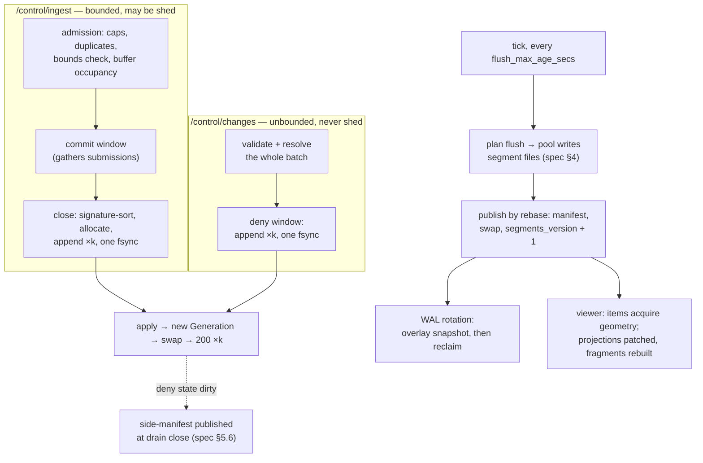

# The write path — design

**Date:** 2026-08-03 · **Promoted:** 2026-08-04 · **Revised:** r8, 2026-08-06
**Status:** **Normative** for the write path. Owner sign-off 2026-08-04; the adversarial review
ran the same day across three lenses with every finding dispositioned (Appendix R); §13.4's
rulings landed as decisions 0044 and 0045; §13.3's corrections and §13.1's supersession edits are
**performed**. `flush-and-merge.md` is deleted, and the lifecycle and system-architecture sections
§13.1 names now point here. `architecture.md` remains the specification and wins every conflict.
**Reads against:** architecture §3, §4, §11, Appendix C; contracts §2.1–§2.6, §3.1, §3.4;
concurrency-lifecycle §1–§5, §7, §8; [geometry-pinning](geometry-pinning.md); decisions 0013,
0020, 0024, 0025, 0033, 0034, 0035, 0040, 0041, 0042, 0043, 0044, 0045, 0046, 0047.
**Citation convention:** unprefixed §n is the architecture design; `lifecycle §n` is
concurrency-lifecycle, `contracts §n` contracts, `SA §n` system-architecture. This document's own
sections are cited as **spec §n**, and are cited from elsewhere as `write-path §n`.

**Owns:** the write path end to end — what happens between a byte arriving at `/control/ingest`
or `/control/changes` and a viewer's map changing: admission, the commit window, allocation, the
WAL, the ingest buffer, flush, the deny lane, the overlay and its row-space mask, side-manifest
publication, merge, and the seam where compaction will sit. It absorbed the deleted
`flush-and-merge.md` and the write-path halves of
[`concurrency-lifecycle.md`](concurrency-lifecycle.md); §13 records what it replaced and what it
must not.

**Does not own:** the invariants and the leak register (architecture §4, Appendix C — cited here,
never restated as this document's); the byte-level formats and API (contracts); compaction and
the fold, which do not exist and get a boundary statement here (spec §9) rather than a design;
the read path's own machinery (lifecycle §1.1, §2, §7).

**Every claim below was verified against the tree on 2026-08-04** (branch
`geometry/cell-plus-residual`, at `15e8bbc` — both halves of merge published, the background
refresh built, the ladder and the merge peak measured). Machinery that is specified but not built
is marked **⊘ at the claim**, with what happens instead (decision 0013).

---

## 0. The path whole

Two kinds of write exist and they never share a queue. An **ingest** adds items; it may be
refused for load. A **change** — delete, suppress, unsuppress — alters what a
viewer may see; it is **never refused for load**, because refusing a security operation is
fail-open (§3, lifecycle §1.3). One thread per partition — the **write executor** — owns every
mutation: it drains the deny lane to empty before touching ingest work, performs
`append → fsync → apply → swap → ack` in that order because it is the only place those steps can
happen, and is the single publisher of generations (`scripts/check-layers.sh` polices exactly one
non-atomic generation store in the engine).

The temporal shape to keep in mind, because everything else hangs from it:

- An ingest **acknowledgement is a durability receipt, never a visibility promise.** An accepted
  item is WAL-durable and participates in authorisation state, but it has no row in any segment,
  and every map verb asks a row-space question — so it contributes to nothing a viewer can
  observe until a **flush** gives it geometry (§11.2). The bound on that gap is
  `flush_max_age_secs` per slice (spec §4.1).
- A deny's **acknowledgement is coupled to its application** (§3, r23): the 200 is held until the
  entry is fsync'd *and* the generation carrying it is swapped in, so no window ever exists
  between "accepted" and "in force". Everything after the ack — manifest publication, storage
  enforcement — is cleanup, not a precondition.
- **Nothing retires.** ⊘ Compaction does not exist, so deletion denies are immortal and the
  overlay grows monotonically. Fail-closed — an entry that never retires can never re-expose —
  but it is not the specified mechanism (spec §8).

Each of the four journeys below states, per step: what happens, what it is for, what the
**writer** observes (latency, what the acknowledgement asserts, what each error means and whether
to retry), and what the **viewer** observes (when things appear and disappear, and what they must
never see).

## 1. The machinery every step rides

### 1.1 One executor, two lanes

`/control/ingest` and `/control/changes` do not execute on the request thread. Handlers validate,
then submit commands to the partition's write executor, which owns the WAL by value — the
ordering `append → fsync → apply → swap → ack` is structural, not a discipline held by a mutex.
The executor's loop, in order, every iteration: recover the WAL if a discard can end its
degradation; apply completed flushes from the pool; run the flush tick if due; **drain the deny
lane to empty**; publish outstanding deny state; run at most one ingest work pass; block only
once both queues have been observed empty.

Consequences a caller can observe:

- A deny is never queued behind work of unbounded duration. Its wait is bounded by the ingest
  window in front of it, not by queue depth. The reverse is accepted and stated: a sustained deny
  flood starves ingest completely, and the deny queue is unbounded in memory.
- A deny may overtake a queued ingest safely because `/control/changes` resolves its address in
  the handler and 404s if the item is not established yet — no deny naming a still-queued item
  can be submitted at all. **The stated operator-visible cost:** `suppress D` issued while D's
  ingest is still held in a window returns **404 unknown**; D then becomes visible, unsuppressed.
  The commit window widened that interval from one fsync to one window. An operator revoking
  during a bulk load must verify rather than trust a 404.
- On the server, deny handlers run on their own small runtime with reserved blocking threads, so
  a deny cannot queue behind a blocking pool saturated by ingest handlers.

All file IO of unbounded duration — segment writes, digests, merge execution — runs on a
background pool over immutable inputs snapshotted on the executor thread; the pool submits a
completed unit back to the executor for a swap-only publication step. Geometry publication is a
command only the executor performs; this is what closed lifecycle §1.3's "two publishers" gap
(its marker now records the closure — lifecycle r6).

### 1.2 Generations

All serving state hangs off one atomically-swappable pointer to an immutable `Generation`:
prefix, `segments_version`, watermark, the loaded bundle, the generation-scoped dictionary
(spec §4.3), the delta postings tiers, `overlay_version`, the overlay (spec §5.3), the ingest
buffer, and the derived row-space deny mask `denied[slice]`. Every mutation builds a new
generation sharing unchanged parts by `Arc` and swaps the pointer; a request loads the pointer
once at its start and works from that `Arc` throughout (lifecycle §1.1 — load-bearing and
tested).

Two version axes, deliberately not one (lifecycle §1.2): `segments_version` is the **geometry
version** — process-local, carried on the generation, bumped only by a geometry publication
(flush; merge when it publishes), and the row-projection cache key component. `overlay_version`
moves on every accepted change. An accepted deny never moves `segments_version`, so **no deny
ever rotates a session's row-projection key** (spec §5.8). On disc there is a third counter of a
different kind: `n`, the side-manifest sequence number, per partition, monotone, allocated by the
executor at each write and living **in the filename alone** — the manifest field that once
duplicated it is deleted (contracts §2.3). `n` advances faster than the geometry version, because
overlay publications take an `n` and move no geometry.

### 1.3 The WAL

Per partition; a sequence of member files, single appender (the executor), append-only records —
postcard, length-prefixed, CRC per record. Record types: `IngestBatch{batch_id, body_hash, rows}`
with every row carrying its allocated entity ID; `Change{external_id, op, descriptors}` (**written by nothing since tessera addressing landed**
— every accepted change of either address form is resolved to its entity in the handler and
written as `ChangeByEntity`; the variant survives only for postcard variant-order stability);
`ChangeByEntity{entity_id, op, descriptors}` (every accepted change — resolved at admission,
because a blinded identifier in the WAL would be re-inverted at replay under whatever key then
holds); and `OverlaySnapshot{entries}` (the whole live overlay, written at rotation). Two variants are
deleted at `WAL_VERSION` 4 (2026-08-04): `Lease` (nothing wrote it — allocation rides
`IngestBatch` rows) and `Flush{n, wal_pos}` (written and read by nothing: recovery reconstructs
the buffer by the has-a-row predicate and rotation computes its own reclaim bound, so the record
was a forensic marker wearing a specification).

The rules a writer's error handling rests on, restated from lifecycle §4 because every
acknowledgement below depends on them:

- **Recovery reads the log's durable prefix and nothing else.** The prefix ends at the last
  fsync point, held in an 8-byte sidecar per member. **Position decides, not damage**: a record
  past the fsync point is discarded however well it checksums (nothing out there was ever
  acked); a framing or CRC failure below it is corruption of acked state — possibly denies — and
  the node **fails closed**: unready, restore from bundle + object store. Three sidecar guards: a
  log shorter than the sidecar's offset fails closed; a missing sidecar defaults to "everything
  present is acked"; a log is created *with* a sidecar so that default cannot misread a
  never-synced file.
- **No runtime WAL ceiling exists, and the deny lane is never refused for load either way.**
  `wal_hard_limit_bytes` (8 GiB) is consumed by exactly one thing: a **startup relation** refusing
  a configuration whose command queue could, at its worst, out-write the declared bound
  (`ingest_queue_bound × ingest_max_batch_bytes` + 1 GiB of deny headroom must sit strictly below
  it). Nothing measures the log's size at runtime and no 429 is keyed on it. On a genuinely full
  device a deny's append fails and the machinery below takes over — the apply-anyway fold behind
  a 500, the node unready until an operator acts. ⊘ A runtime gauge or ceiling is ruled a
  nice-to-have, not built (owner, 2026-08-04); §4.5's coupling note is the growth bound that
  actually exists.
- **A failed fsync is repaired before it is a failure.** On Linux a writeback error can be
  reported exactly once, so a bare second fsync can claim success with the data gone; the repair
  rewinds to the last durable offset and **re-writes** the failed region — sound because that
  region is precisely the records no caller has been told about. The repair is deny-lane-only:
  an ingest window whose durability fails applies nothing, so there is nothing to rescue
  (spec §2.3).
- **A node that loses durability recovers by discarding, not by finishing.** While degraded, the
  executor periodically discards everything above the last durable offset and returns to
  service — exactly what a restart would do with the same file, so the resulting state is one
  some restart could have produced. A **torn append** (partial `write_all`) recovers by neither
  route: the node stays `WalPoisoned` until restarted.
- **`ExecutorPosture`** — `NotStarted / Running / WalPoisoned / Dead` — is the operator-visible
  face; `/readyz` reduces it to ready-iff-`Running`. A poisoned executor stays alive and goes on
  applying denies (exiting would stop denies at the moment durability is already lost). The WAL
  half of the posture is mirrored live in both directions; the thread half is monotone, with
  `Dead` absorbing.

## 2. An item arrives: `/control/ingest`

### 2.1 Admission — refusals that cost nothing

The request is an Arrow IPC body `(external_id?, x, y, access, node_id?, …declared scalars)`
with headers `x-tessera-batch-id` (required) and `x-tessera-slice` (optional when the bundle has
one slice; 422 when ambiguous). In order, before anything is owed:

1. **The operator credential**, as a router layer — every control route requires it, with no
   exemption list (contracts §3.1 r11).
2. **The byte cap** (`ingest_max_batch_bytes`, 16 MiB default), enforced on the route before any
   decode — the refusal that costs nothing (decision 0036: a per-connection body ceiling, not a
   connection cap).
3. **An admission semaphore** (`ingest_admission`, 64), `try_acquire` only: it bounds concurrent
   ingest handlers and therefore the blocking threads ingest can hold. No queue, no timeout —
   the control plane takes the work now or refuses it with a 429.
4. **Decode and validate**: slice resolution; the scalar tail checked against
   `MANIFEST.declared_scalars` by name and type — an undeclared column, a missing declared one,
   or a wrong type is a 422 naming the column, never a silent drop. **The row cap**
   (`ingest_max_batch_rows`, 10,000) is a 422; it necessarily fires after the decode (the row
   count is not knowable earlier), which is why the byte cap sits a layer before it.
5. **Terms.** Each item's `access` bytes go through the caller's plugin (`terms_of_label`) and
   the descriptors are interned. An item exceeding the declared per-item term bound is **indexed
   anyway and warned** — counted in `over_bound`, its external id (base64) in `over_bound_ids`
   up to 100 — because a monotone predicate with more terms intends broader visibility, and a
   resource guard must not produce an authorisation-shaped outcome (§6.2). A descriptor the
   dictionary has never seen is minted a process-local **extension id**, counted down from
   `u32::MAX` so it is **unsatisfiable by construction**: a novel descriptor can buffer an item
   but can never make one visible until a flush promotes it (spec §4.3).
6. **Batch idempotency.** `x-tessera-batch-id` maps to the SHA-256 of the raw body. A replay of
   an accepted batch with identical bytes is answered 200 with the recorded `tessera_id`s and no
   effect; different bytes are a 409, no effect. (Arrow serialisation is not canonical; a client
   must resend the same bytes, not re-serialise.)
7. **The duplicate check.** Supplied external ids are resolved in one batched call against the
   live map (WAL-replay-derived) and the bundle's external-id **runs** — the per-flush sidecar
   files, each internally sorted by caller key, searched wherever a run's own first/last key
   admits the target (contracts §2.4). Any hit is a 409 listing the offending ids;
   **the batch has no effect**. Two scopings, both deliberate. **A *deleted* holder does not
   collide** (decision 0047 — edit is delete + re-ingest, and the service's retention of a dead
   binding never refuses a user's write): re-ingest re-binds the id, the live map's newest
   insert winning while the WAL holds the rows and the sidecar's **newest-run-first** walk
   winning after rotation reclaims them; a **suppressed** holder still collides, suppression
   being temporary hiding — re-ingesting a byte-identical copy past one is the
   copy-no-deny-can-reach hole this check exists to close. And the guard is **conditional on
   the caller supplying external ids** (review, 2026-08-04): a row without one establishes
   nothing the check can see, and a fresh batch id over identical bytes is not caught by
   idempotency either. **A deployment that suppresses must ingest with external ids.**
8. **Buffer occupancy.** If the ingest buffer already holds `ingest_buffer_max_items` (default
   1,000,000) rows awaiting flush, the request is a 429 with `Retry-After: 90`. **The bound is
   items, not bytes** (memory review, 2026-08-04): per-row bytes are capped only by the 16 MiB
   per-batch ceiling, every flush and window transient is a multiple of buffer *bytes*
   (spec §12), and `/control/status` publishes a count — a byte gauge was put to the owner and
   ruled **not needed yet** (2026-08-04); revisit if a deployment's transients ever surprise. This bound is
   distinct from `ingest_queue_bound` (32), which bounds the *command queue* — the executor
   drains a job into the buffer in milliseconds, so no ingest rate produces a 429 by buffer size
   through the queue. Between ticks the buffer is what grows, and this is the intended
   backpressure when flush falls behind (spec §4.7).

9. **Coordinates.** `Engine::accept_ingest` refuses any row outside the slice's quantisation
   **bounds** with a typed error naming them, before submission — nothing acked, nothing
   WAL-durable, no entity ID burned (I9). Fail-closed: a clamped item at the boundary would be
   indistinguishable from a legitimately edge-located one. Under decision 0040 the bounds are
   index configuration, immutable for the slice's life: such data can *never* enter this slice,
   and the remedy is a rebuilt slice, not a re-quantising compaction. (The flush-side quarantine
   an earlier design carried is deleted — the refusal at this boundary is what made it
   unreachable.)
Rows then go to the executor **unallocated** — entity-ID assignment happens on the executor, per
commit window, which is what makes the signature-sort scope the server's decision rather than
the client's chunk size.

### 2.2 The commit window — where the sort scope is set

§11.1 spends the entity-ID ordering on posting compression: within one allocation run, IDs are
assigned in `(signature, external_id)` order — an item's signature being its sorted, deduplicated
term list — so postings form runs inside the batch's ID range. The scope of that sort is
whatever is allocated together, **and nothing repairs it afterwards**, so the window exists to
make the scope as large as the write-latency budget allows (§3: seconds to minutes).

Arriving submissions are gathered into a window bounded by `commit_window_max_items` (10,000
rows). The window closes when the row bound trips **or when the work queue is observed empty** —
there is no linger and no age bound (decision 0034: an age bound only ever closes a window
*earlier* than the trigger it supplements, and a single sequential client cannot be helped by
waiting for it). `commit_window_max_age_ms` is **deleted** (decision 0045); a linger that ever
earns its way in re-adds the key together with its consumer.

A window introduces a third idempotency state between contracts §3.4's *accepted* and *unknown*:
**held**. The rules, each pinned by test:

- A retry naming a **held batch id** with identical bytes **joins** the window and shares the
  eventual acknowledgement; with different bytes it gets the 409 — and the 409 goes to the
  retry, never to the held original, whose acceptance stands.
- A submission naming an **external id the window already holds** closes the window first
  (`append → fsync → apply → swap → ack`, inside the drain), then is evaluated against the state
  that close published — which yields exactly the unwindowed answers. The pass yields to the
  deny drain after such a close, so a conflict-heavy stream cannot hold the executor.

**Calibrate the window's win honestly** (§11.1, SA §6.2). The probes' 8.9–36.7× posting
compression was measured under a *full-corpus* signature sort. A term's IDs are contiguous only
across items whose whole signature matches; against the measured signature distribution a
10,000-row window yields runs of order 10¹, not ~200 — *modelled from measured distributions;
no per-window measurement exists*. And every affordable window size sits below the container
threshold (`p·B < 2¹⁶` for `B ≲ 6·10⁴`), so a window collects the posting-*storage* win and none
of the container-count win that unions cost. Raising the bound buys run length sub-linearly and
costs sort work and latency. What erosion a deployment actually suffers is observable:
`/control/status` publishes `fragmentation: {postings_per_container, run_ratio}` at
**delta-tier scope** — each tier measured as encoded at its flush, which is where between-window
scatter shows — with the window-scope raw counters under `allocation` (contracts §3.4, r16).

### 2.3 The close: allocate → append ×k → one fsync → apply → swap → ack ×k

At close, on the executor: the whole window is signature-sorted and allocated from the
high-water in one call (monotone, never reused — I9; a window that cannot allocate has no effect
and the high-water does not move). One `IngestBatch` record per submission — batch identity
survives the window, which is what a joined retry is answered off — appended in entry order,
then **one fsync for the whole window**. Then one buffer clone carrying every row, one new
generation, **one swap**, the idempotency index updated, and every held request acknowledged
with its rows' `tessera_id`s (the keyed bijection of the entity IDs — the entity IDs themselves
never leave, I10).

If any append or the fsync fails, the ingest window **applies nothing**: every waiter gets a
500, the caller retries under the same batch id, and a restart agrees — no effect existed. (The
contrast with the deny window's failure fold is deliberate and is spec §5.5.)

### 2.4 What the writer observes

Quiescent latency is the WAL fsync plus queue time; under load, submission waits on the window
in front of it. The response and every refusal:

| Outcome | Meaning | Retry? |
|---|---|---|
| **200** `{accepted, over_bound, over_bound_ids, tessera_ids}` | Every row is **WAL-durable** with its identity allocated; `tessera_ids` in batch order (an item with no external id is addressable by nothing else). **Not visible yet** — a durability receipt (spec §2.5) | — |
| 401 | missing/invalid operator credential | after fixing the credential |
| 409 `conflict` | duplicate external ids (listed in detail), or batch-id replay with different bytes. **The batch had no effect** | not unchanged — the request itself is wrong |
| 422 `contract` | malformed Arrow, undeclared/missing/mistyped scalar column, ambiguous slice, row cap, out-of-bounds coordinates (names the bounds) | not unchanged |
| 429 `backpressure` | three producers, each with an honest `Retry-After` + body `retry_after_s`: the admission semaphore and the command queue, each with a value derived from the executor's observed service rate (clamped 1–300 s — never a fixed 1, which is the *compute* gate's number); the buffer bound (90 s — the tick period) | yes, unchanged, after `Retry-After` |
| 500 `fail-closed` | WAL append/fsync failure — **nothing was applied**; or the receipt was lost after the swap, in which case the batch **is** durably in force and the batch-id replay returns its IDs. Either way: retry the identical bytes; idempotency resolves it | yes, identical bytes |
| 503 `not-ready` | executor not `Running` (posture), or a partition is serving a stepped-down manifest — refused at the engine boundary, before anything is acked (owner-ruled gate, 2026-08-04; spec §5.6) | yes, later — for step-down, after the damaged newest manifest is repaired |

**The idempotency horizon is the WAL retention window** (spec §4.5). Rotation reclaims WAL
members; after a restart, a batch id older than the retained log regresses to *unknown*, and a
byte-identical retry of it is no longer recognised — rows carrying external ids are still caught
by the duplicate check; rows without them would be ingested twice. A client retrying across
restarts and long intervals must carry external ids. *(This is a client-visible weakening of
contracts §3.4's replay rule and is proposed there — spec §13.3.)*

### 2.5 What the viewer observes: nothing, yet

The accepted item is in the **ingest buffer**: entity ID allocated, terms resolved,
authorisation state complete — and no row in any segment. I1's composition resolves a verdict
for it (it is in the live set `L`, directly evaluated), and then has nowhere to put it: viewport
counts, density, selection are all row-space questions (§11.2). The verbs answered wholly in
entity space are the exception: cluster visibility and label gating (unaffected — entity-space
structures stay valid, merely incomplete), and **drill-down**, which resolves its one bit in
entity space and then finds no row — it must return the same *unknown* outcome as an identifier
naming nothing, which is what keeps Appendix C's C4 closure honest (identical outcomes; the
work is not identical, and C4 remains scoped accordingly).

So: the item **appears** at the flush that gives it geometry — within `flush_max_age_secs` of
its ack on a healthy single-slice node (spec §4.1 for the multi-slice bound) — and its arrival
is announced to other viewers only as `x-tessera-stale: 1` on their next response (the broadcast
staleness stamp; decision 0041, C15: knowing data has been ingested is not a security leak). An
item carrying a **novel descriptor** is the one exception to "appears at the flush": its term is
promoted by the flush (spec §4.3), and it becomes visible only to sessions **authorised after**
that flush; already-open sessions holding the descriptor see it after re-authorising, which the
staleness hint exists to prompt (spec §4.6, C21).

## 3. Flush and merge share one machine — the tick, the pool, publication by rebase

Flush and merge execute on the background pool over immutable inputs and submit a completed,
immutable result to the executor for a swap-only publication that **rebases onto the
then-current generation** rather than the one the work was planned against:

- a **flush** removes exactly the entity ids it consumed from the live buffer — never a range,
  which would take late arrivals with it — and appends its segment;
- a **merge** publishes only if every input `seg_id` is still present — ABA-safe because
  `seg_id`s are never reused (contracts §2.1) — and an entity-space **coalesce** only if every
  path it consumed is still listed, by the same argument (spec §7).

**At most one flush is in flight.** A tick arriving while one runs is skipped, not queued — two
concurrent flushes would double-consume the buffer — and skips are counted and alarmed, because
a flush persistently slower than the tick is a visibility-latency breach nothing else would
report. Generations are constructed incrementally, sharing the previous `Arc<Bundle>`; nothing
ever re-opens the bundle on this path.

## 4. Flush — the moment of visibility

Flush turns WAL-durable buffered rows into a published segment. It is **the ingest-visibility
mechanism, not a compaction convenience**, and it is **invariant-neutral**: it folds no
authorisation state, retires no overlay entry, drops no row, and can re-expose nothing.

### 4.1 The tick

One cadence, `flush_max_age_secs` (default 90 s — nothing forces that number; the superseded
flush design's §4 records its history, and spec §4.6 is the cost to weigh before lowering
it). The tick runs at the top of the executor loop, before the deny drain, so it is never
delayed by work that arrived after it came due. Three triggers reach this cadence and none
publishes off it:

- the tick itself;
- `POST /control/flush` — 202, accepted at any time, **executed promptly** (2026-08-04): the
  flag pulls the tick's deadline forward and the doorbell wakes an idle executor, so the flush
  runs at the next loop iteration, through the one tick path with everything a tick guarantees.
  Safe where publish-on-trip was not, because an operator trigger is rate-decoupled from ingest.
  A request against an empty buffer is satisfied by the tick it triggered;
- `flush_max_items` — **deleted** (decision 0045, 2026-08-04). Its specified role — "marks the
  buffer flush-ready; publication waits for the tick" — had no consumer: the tick never skips a
  non-empty buffer and a flush consumes everything buffered for its slice, so the key could not
  have an effect. The only occupancy bound is `ingest_buffer_max_items`' 429.

**The ack→visibility bound.** One slice publishes per tick (below), so the bound is
`flush_max_age_secs` with one slice and `s × flush_max_age_secs` with `s` — the dispatched plan
is the one holding the oldest unflushed row, so that is a bound rather than starvation. No build
emits a second slice today; a per-dispatch side-manifest covering every plan's segment is what
would collapse the bound back to one tick, and it is slices work, not this document's.

### 4.2 The plan, and the three dispositions at the snapshot

Planning runs on the executor against the live generation — the invariant-bearing half — and is
pure: buffered rows for the slice, ascending by entity id (I9 issues monotonically, so each
flush segment covers a contiguous ascending entity range — ascending-with-holes where deletes
struck or where a commit window interleaved slices; merge's adjacency test is `hi < lo`, not
`hi + 1 == lo`, for exactly this reason). Per disposition, relative to the plan's snapshot (spec §5.3 is why each differs):

- **Deleted → never written.** No row is created; the entity ID stays burned (I9); the deny
  entry stands.
- **Suppressed → flushed normally.** A suppression never touches postings and retires only on
  unsuppress; a flush that skipped it would leave a later unsuppress with nothing to reveal.
A delete accepted *after* the snapshot produces a deleted entity that does have a row, hidden by
its standing overlay entry alone — safe while nothing retires, and an obligation the compaction
spec inherits (spec §8).

Two gates, checked before any work and again at publication: a **poisoned WAL** publishes no
flush (a flush honouring an under-durable, 500-answered delete would skip the entity and advance
the watermark past it; replay would then discard the delete record — the un-acked delete made
*permanent*); an **overlay diverged from its durable WAL** (an in-process discard recovery
un-poisons the node but leaves it holding dispositions no record backs) publishes no flush and
rotates nothing until restarted, alarmed throughout — publishing from that overlay would make a
500'd, never-acked deny permanent, contradicting what contracts §3.1's 500 promises.

**One plan per dispatch.** Every plan in a dispatch would take the same side-manifest name, so
one slice publishes per tick, chosen by oldest unflushed row; the side-manifest write **refuses
to replace** an existing `SEGMENTS-<n>.json` (`hard_link`, atomic, `AlreadyExists` on collision)
as the guard at the format boundary.

### 4.3 Execution on the pool: the files, and descriptor promotion

The pool turns the plan into durable files under the segment's own directory
(`partitions/<phash>/slices/<slice>/segments/<seg_id>/`), the `seg_id` being
`flush-<planned_n>-<attempt>` — never reused across flushes, merges or prefixes, with the
attempt counter making a re-planned flush write *beside* its orphaned predecessor rather than
through files the first attempt has mapped:

| File | What it is |
|---|---|
| `morton.u32` | the segment's sorted codes — every flush segment is internally Morton-sorted against the same slice bounds, so a tile resolves to one contiguous range per segment through the same binary search |
| `columns.arrow` | `(tessera_id, residual, …declared scalars)` in `(morton, tessera_id)` order (contracts §2.6; no `priority` column — decision 0046) |
| *(no `permutation.bin`)* | the segment's entity→row extent is built **in memory** and never written: its bounds ride the manifest's `segments` entry, and its row map is **rebuilt at open from the segment's own `tessera_id` column** by inverting the identity key — nothing on disk carries it, deliberately (a per-segment permutation file sized to the bundle's whole entity space is the wrong shape for a few thousand ids at the top of it). *Contracts §2.6's streamed-segment `permutation.bin` was stale and is corrected at r16 — caught by this document's fidelity review after r2 had laundered it* |
| `delta.arrow` | the **sparse delta postings tier**: term → entities, only for terms present in the flushed set, tagged records as base postings. *(Contracts §2.4 names this `terms/deltas-<n>.arrow`; the built layout is the per-segment path above, with the manifest's `files` map and segment list carrying the truth — a contract correction is proposed, spec §13.3)* |
| an external-id **run** | the flushed `(external_id, entity)` pairs, sorted by caller key — a run, not an extent: nothing orders two runs against each other (contracts §2.4) |
| a **locator extent** | entity→ordinal for the flushed range, run-local ordinals — the drill-down direction for flushed entities, without which `/v1/items` would fail for them once their WAL region is reclaimed |
| a **dictionary extent** | only when the flush promotes (below) |

**The watermark the flush publishes is `entity_hi + 1`.** Composition treats entities at or
above the watermark as buffer-resident, so `entity_hi` exactly would leave the highest flushed
entity excluded from every fragment *and* absent from the buffer — invisible, with a row,
forever. Pinned by test under that name.

**Descriptor promotion** (decision 0042; the mechanism the superseded flush design's §3.2
stated at the "what" level, now built). A novel descriptor buffered under an unsatisfiable
extension id is promoted to a durable dictionary ordinal by the flush that carries it:

- The executor snapshots, lazily, the resolver's descriptor bytes for exactly the extension ids
  the plan carries — the steady state (no novel descriptors) pays one comparison per item and
  takes no lock.
- Each extension id resolves **dictionary-first**: a descriptor an earlier flush already
  promoted takes the ordinal it already has and contributes no record — the writer half of the
  no-duplicate rule. The rest are interned, in deterministic order, into an extent in the
  flush's own directory; ordinals are `dict.len() + position`, exactly what `Dict::load` will
  assign walking `dict_extents` in listed order. The reader enforces the same rule
  (`load(a ++ b) ≡ load(a).load_extending(b)`, repeats skipped without advancing the counter),
  because a repeat shifts every later ordinal in one reader but not the other — a running
  process and the same bundle reopened disagreeing about what a tier's postings mean, which is
  silent cross-compartment serving (decision 0042 measured it before any flush could reach it).
- **The tier is written in final ordinals; no extension id ever reaches a durable file.** An
  extension id with no descriptor fails the flush — silently dropping a term is the bug
  promotion exists to fix, and must not survive as the error path.
- The published dictionary is built from the same in-memory sequence that named the extent and
  the tier — never re-read from the file; that the file agrees is a restart property, tested as
  one.
- **`max_distinct_terms` is the one plugin bound that is enforced**, here: promotion is the only
  path by which a caller grows the dictionary, and `EXTENSION_ID_START > max_distinct_terms` is
  what keeps a dictionary ordinal from ever aliasing a live extension id. A promotion that would
  cross it fails the flush; ingest sheds at the buffer bound — the intended backpressure.

**Promotion's memory term, stated because it is the write path's largest** (memory review,
2026-08-04): a promoting flush builds the published dictionary via a **full clone of the lookup
map** (`Dict::extended_with`), with old and new dictionaries resident until the superseded
generation drops — measured 7.1 GB per copy at 1.17×10⁸ terms (`probes/2026-08-03-dict-fst/`),
~12 GB modelled at the declared 2×10⁸ bound, on the pool per promoting flush. The ratified FST
base shrinks the copy ~9×; until it lands, this is the number a deployment with a large
dictionary budgets a promoting flush against. The steady state (no novel descriptors) clones
nothing.

Two fail-closed consequences, preserved deliberately: a promoted descriptor is satisfiable only
by sessions authorised **after** the promoting flush (`satisfied` is fixed per session at
authorise — also what makes the patch-equals-rebuild equality below hold); and an item still
buffered under an old extension id for an already-promoted descriptor stays invisible until *its
own* flush.

### 4.4 Publication by rebase, on the executor

When the completed unit arrives (drained before the tick, so a tick never re-plans rows a
completed flush already wrote), the executor:

1. **Discards** a flush planned against a superseded prefix (a compaction moved it — its files
   are orphans), and discards a **promoting** flush whose dictionary moved under it (its extent's
   ordinals are positions and no longer the positions it assigned; a non-promoting flush is
   exempt — its tier names only ordinals below the planned length, which append-only extension
   preserves).
2. **Assembles the side-manifest at publication, from the live partition manifest** — never from
   a plan-time clone: `n` from the executor's counter; watermark; `entity_id_high_water` (max of
   live and the flush's); the segment appended; the run, locator extent and (if promoting)
   dictionary extent appended; the `files` map extended; and **the deny fields serialised fresh
   from the live overlay** — `deny` = the suppression bitmap, `tombstones` = the deleted bitmap
   — so a suppression accepted during the flush's flight is in the manifest the flush publishes.
   Contracts §2.3 makes each `SEGMENTS-<n>.json` complete current state, and *current* is
   decided here. (Assembling on the executor is forced, not preferred: with `n` fixed at
   dispatch, a deny publication during the flight takes a higher `n`, the committed flush
   manifest is never the newest, and a restore silently loses the segment.)
3. **Writes the manifest — the commit point.** Failure discards the flush: files become orphans,
   the buffer is retained, the next tick re-plans. Because every file was made durable on the
   pool before submission, contracts §2.3's "written after every file it names is durable"
   holds.
4. **Swaps**: the new generation shares the bundle base and adds the segment and its extent
   (row space is base permutation + ordered extent list; `row_base` = the slice's current row
   total; refused if the row space moved under the flush); the buffer minus **exactly the
   consumed ids** (an O(buffered) clone on the executor — the measured head-of-line term the
   deny lane sees, spec §5.7); the delta tier appended; the promoted dictionary;
   `segments_version + 1`; and `denied[slice]` **re-derived against the new row space** — the
   moment a suppressed-or-deleted-while-buffered item acquires a row is the moment it enters the
   row-space mask.
5. **Prunes** row-projection cache entries more than one generation back
   (`KEEP_SUPERSEDED_GENERATIONS = 1` — the depth the patch needs; the superseded generation
   itself is retained only by requests still holding its `Arc`).

### 4.5 The record and the rotation

After the swap, rotation: the WAL seals its active member, opens the next, writes a **compacted
overlay snapshot at its head** — the stores restated as entity-keyed `(entity, op)` records —
fsyncs it, and only then deletes members wholly below the reclaim bound,
**oldest first**
(a gap mid-sequence fails closed at the next open, so deletion order is what keeps a benign
crash from manufacturing one). **The reclaim bound is the oldest surviving buffered row's
position.** Rows acked *during* the flush were appended after its snapshot point and never
consumed; reclaiming past them would delete them and recovery would reconstruct them from
nothing — acked ingest, silently lost. A buffered row of unknown position pins the log
(fail-safe and loud: the sequence grows, which is visible); an empty buffer reclaims the whole
durable prefix. (The `Flush{n, wal_pos}` record that used to announce this bound in the log is
deleted — nothing ever read it back; spec §1.3.) Steady-state retention is two members. The snapshot's two shape
rules are not free choices: entries are keyed by **entity id** (an external-id-shaped snapshot
would re-resolve at replay, and a deleted-never-flushed entity resolves to nothing — the node
would refuse to open). A snapshot entry carries an entity and an op and nothing else; the raw
descriptors it used to carry for an evaluate entry went with that store (decision 0048), and with
them the hazard that made them raw — extension ids are assigned in replay order, rotation changes
replay order, and a persisted extension id would dangle onto whatever descriptor interns next.

The overlay's only durable homes are the WAL and the side-manifest; segments carry rows and
postings and no disposition. That is why the snapshot precedes any deletion — reclaiming a
member holding a suppression's `Change` record without one would re-expose the item at the next
restart — and why a **suppression outlives every checkpoint** for as long as it stands.

**Rotation runs at every flush publication, and at the tick when the log has grown with
nothing to flush** (owner-ruled 2026-08-04, closing the review's deny-only finding: a node that
took denies without ever flushing sealed nothing and reclaimed nothing — an unbounded log on the
one lane that structurally cannot be shed, replayed in full at every restart). The tick rotation
is **growth-gated** — an idle node whose WAL position has not moved rotates nothing, so a quiet
deployment pays no per-tick snapshot churn — and its safety is the flush rotation's own
argument, unchanged: snapshot before reclaim, bound at the oldest surviving buffered row.
Asserted by test: a suppression accepted on a deny-only node survives the rotation that
reclaimed its `ChangeByEntity` record, across a restart.

Rotation is gated exactly as the flush is: never while poisoned, never while diverged — and
never while **stepped down** (below), a stepped-down node's WAL members being the only recovery
material for whatever the step-down shadowed. And the
allocator floor survives it through the **side-manifest's** `entity_id_high_water`, refreshed at
every publication: recovery seeds from `max(manifest high-water, WAL high-water)`, so reclaiming
the records that carried allocations can never let a restart reissue an entity id (I9).

### 4.6 What the viewer observes at a flush

- **The flushed items appear** — in counts, density, selection — for every session, **one refresh
  after the publication**, and the request thread pays nothing for it (decision 0044's D1). At
  each geometry publication one pool task refreshes every **resident** cache entry — O(cache
  residency), never O(sessions) — producing the session's fragment at the new watermark and the
  projection over it as **one value**. In front of it sits a three-rung ladder
  (`Engine::session_geometry`):
  1. the live entry, which is the steady state and costs nothing;
  2. failing that, the **one-generation-stale** entry, served as it is. Sound for a flush and only
     for a flush: a flush appends, so every row id the stale entry holds still names the same
     entity, and what it lacks is rows that did not exist when it was built — the session sees
     them one refresh later, which is fail-closed staleness and never a deny miss. The deny mask
     and the overlay are composed live over it. `RowProjection::extends_to` is the predicate, and
     it is exact: after a merge the boundary segment differs and this rung refuses;
  3. failing that, **429 `backpressure`, `Retry-After: 1` if a refresh is in flight**, otherwise a
     build. The 429 is 0044's bounded residual; the build is session establishment or a rebuild
     after eviction, neither of them update-induced.
- **The fragment and the projection are one cache entry, because stale-serve breaks the ordering
  that used to couple them** (review finding F5). Until this, `fragment_for` ran first and always
  landed at the live watermark, so the projection built after it was necessarily over it — a
  coupling held by request ordering and by nothing in the types. A projection derived from a stale
  fragment but inserted under the *new* `segments_version` key would pin the session's freshly
  flushed items invisible until the next publication, silently falsifying §4.1's ack→visibility
  bound. Carrying the pair makes the mismatch unexpressible. The drill-down takes its fragment
  from the same entry, so `visible_to` and the map cannot drift (§14's obligation 27).
- **`refresh_in_flight` is armed before the swap, and that ordering is the mechanism.** A racer
  landing between the swap and the pool task's first insert must find it set, or after a merge it
  takes rung 3 as a *build* — the measured 4 550 ms — where the design is that it be shed for the
  refresh's bounded duration (review finding F5).
- **Stale-serve inserts nothing, and the retention depth is what stops that compounding.** A
  session whose refresh never runs would otherwise sit one generation behind for ever. At the next
  publication its entry is two back, `prune_generations_below` removes it, and its next request
  builds: the staleness is bounded at two publications, never permanent, and a refresh that
  cannot run degrades to the pre-0044 behaviour rather than wedging a session at 429.
- **The measured ladder** (`probes/2026-08-04-refresh-ladder/`, 10⁹, 25% grant): rebuild 4 550 ms;
  the patch's bitmap clone 40.9 ms; the union over one new extent 0.24 ms; the span rebase 44.6 ms;
  the fragment build ~200 ms and **flat in tier count** (199 ms at 1 tier, 198 ms at 512 — the
  "modelled seconds" this document carried was wrong, and P2 refuted it). The patch is the clone
  and nothing else, because the cached value is immutable (lifecycle §7) so a patch must copy
  before it unions — which is why no inline arrangement reaches the 0.2 ms budget.
- **`x-tessera-stale` flips to 1** on the next response of any session that presented a
  pre-flush stamp — broadcast, advisory, never a refusal, never a `410` (decision 0041). The
  stamp never selects geometry: the request is answered from live geometry regardless, and a
  post-flush answer differs from the pre-flush one only by rows that did not exist (a flush
  invalidates nothing a client holds — a tile is a Morton prefix, an item is a `tessera_id`,
  both resolve against any generation).
- **Sessions holding unresolved descriptors** become *stale* — a different mechanism from the
  geometry staleness stamp two bullets up, and the two must not be conflated — when a flush
  promotes any term: `unresolved_count > 0 && dict.len() > dict_len_at_authorise` — two loads
  and a branch, evaluated lazily, never swept (decision 0035). It over-reports in the safe
  direction (any promotion hints every such session), moves in one direction only (a stale
  session sees *fewer* items — fail-closed; nothing may ever wire a revocation through it), and
  its only remedy is a new session — `satisfied` is never re-resolved in place, which is a rule
  rather than a structural impossibility and the first thing to check in any change to session
  handling. `token_max_lifetime_secs` is the safety net that bounds staleness for a client that
  ignores it. ⊘ **No wire representation exists** — the condition is computed and carried on the
  session; putting it on the wire is client-facing work. Register row **C21** covers the channel
  (a one-bit clock over corpus write activity; the digest refinement that would confirm *their*
  descriptor now exists is declined).
- **θ's anchor advances at flush boundaries, not per arrival** — `V_total` is counted in row
  space, so a viewer's selection threshold moves per publication. Expected observable, not a
  bug.

### 4.7 What the writer observes of flush

Nothing, on the happy path — flush is on no request path, and the ingest ack's meaning does not
change. What a writer *can* observe: the per-tick rebase stall (the O(buffered) buffer clone
lands ahead of the deny lane once per tick — the same shape as the measured 165 ms p50 term,
modelled for the rebase and to be re-measured); and, when flush fails or is gated, the buffer
growing until `ingest_buffer_max_items` sheds ingest with 429s while denies keep landing —
the intended backpressure — the skip and failure alarms are log lines, and the flush
counters (`flushes`, `flush_skips`, `flush_failures`, `flushable_items`, `flush_requested`)
are published in `/control/status`'s `write_executor.flush` block (out of contract, §0.1).

## 5. A deny arrives: `/control/changes`

One write path for the three ops — `delete`, `suppress`, `unsuppress` — with one lane, one
window shape, one swap; the ops differ *only* in what each does to the overlay's stores and in
what later removes each fact. **A fourth op, `predicate`, is withdrawn** (decision 0047,
2026-08-04): edit is delete + re-ingest — delete the item, re-ingest it under the same
`external_id` with its new labels, and a deleted holder does not block the re-ingest. The
endpoint still refuses `op: "predicate"` with a 422 naming that flow, so the withdrawal is a
message rather than an "unknown op"; the machinery behind it is **deleted** (decision 0048 — no
deployment exists, so there is no pre-0047 WAL to replay).

### 5.1 Addressing and admission

The body is a JSON list; **bulk is the list** (bounded by the connection body ceiling; callers
chunk). Each element names its item by **exactly one** of:

- `external_id` (base64) — resolved against the live map, then the bundle sidecar; a resolver
  *error* propagates and is never read as "unknown".
- `tessera_id` (string-encoded — a bare JSON number silently corrupts u64s past 2⁵³, and a
  mis-parsed identifier denies the wrong entity) **plus the `idset` it was minted under**. The
  idset is checked first, for the whole request, **before any inversion**: identifiers are
  keyed, so a list gathered before a key rotation would invert under the new key to different,
  live items and silently deny the lot — 409 *stale idset* refuses exactly that (decision 0025;
  the idset is monotone and never reset, or `1 → rotate → 1` would pass the guard). Then the
  Feistel inversion — a pure function — and the range checks: the shard half matches the manifest's `shard_id` (0 while sharding is reserved), the entity half is below
  the allocator high-water (allocation is dense, so below-high-water ⇔ ever issued). The
  permutation is total, so the range check is the whole misdirection guard; an in-range *wrong*
  id is a caller bug the control plane is trusted with, exactly as a wrong-but-existing external
  id is. This form exists because `external_id` is optional at ingest — an item that arrived
  without one is otherwise unaddressable here.

**Validation is wholesale and resolution is all-or-nothing**: ops parsed, addresses decoded,
both address forms resolved in single batched calls — any failure refuses the **whole batch**
with 404/409 naming the offender, and
**nothing is enqueued**. Past resolution, re-applies are no-ops by bitmap semantics (delete of
deleted, suppress of suppressed, unsuppress of never-suppressed), so a retried batch is
idempotent without bookkeeping.

**A `tessera_id` never enters the WAL or any store.** The entity is resolved once, at admission,
and the WAL record (`ChangeByEntity`) carries the entity id — stable forever (I9) — so replay is
identical under a rotated key.

### 5.2 The lane and the window

The deny lane is **unbounded and can never answer 429** — the route from the lane to a
backpressure response does not exist, a structural absence rather than a comment. The handler
enqueues a whole chunk (chunked at the window bound, 1,000) before collecting any receipt —
submission and waiting are separate operations, which is the whole precondition for group
commit: a handler that awaited each receipt would leave the executor one entry to gather, and
one request of N denies would cost N fsyncs (**measured**: ~300 denies/second that way; a
1,000-suppression request fell from 3.289 s to **31.9 ms** when the window landed —
decision 0033).

The executor gathers up to 1,000 queued entries per window, FIFO, so `suppress X` then
`unsuppress X` in one window resolve exactly as two commands would. Then:
**append ×k → one fsync → apply → one swap → 200 ×k.**

- **No descriptor resolution happens in this window at all.** There used to be a deferred pass
  here, resolving a predicate's raw descriptors against the current generation's dictionary after
  durability; its only consumer was an evaluate entry, and both are deleted (decision 0048). The
  review's novel-descriptor finding — an evaluate entry minting an extension id nothing ever
  promotes, hiding the item from everyone behind a 200 — is **dissolved rather than patched**: a
  re-label now travels the ingest path, and flush promotion (the one promotion path there is)
  handles a novel descriptor exactly as for any new item.
- Apply is one overlay clone and one `denied[slice]` update for the whole window; the swap is
  one pointer store. Every waiter is then acknowledged against the same proof — the ack type
  cannot be constructed without the token minted at the swap (or by proof of idempotent replay),
  so ack-before-application is something a rewrite has to work around, not something it can
  reach by reordering two lines.

**What the 200 asserts — exactly two things** (§3, r23): the disposition is **durable** (never a
200 without fsync), and the mask any later request composes against **already carries it** (the
swap precedes the ack). It waits on nothing else — not flush, not any manifest write, not
storage enforcement, which is cleanup. A caller always observes its own accepted change on its
next request.

**Denies do not share the ingest window.** Lifecycle §5.1 permits it; the permission is declined
(decision 0033): it would buy one fsync for a deny under concurrent ingest and nothing for
ingest, and cost a per-entry durability fold over ops the failure rules scope differently
(spec §5.5), an ordering hazard the separate lanes cannot have, and an entry type that stops
saying what is true.

### 5.3 The overlay: two stores, and the row-space mask

The overlay is two independent stores, one per removal rule — not one map with a disposition
field, and not an enum (a last-write-wins collapse was caught fail-open twice in review;
two stores mutated in two places cannot be collapsed by a refactor that still compiles). A third,
`evaluate`, was deleted with the predicate op (decision 0048); deleting it is not a licence to
collapse the two that remain, whose separation carries the whole argument:

| store | holds | removed by | durable home |
|---|---|---|---|
| `deleted: Bitmap` (entity space) | accepted deletes, fold pending | ⊘ **its compaction fold** — nothing today | WAL (`ChangeByEntity`/snapshot); manifest `tombstones` |
| `suppressed: Bitmap` (entity space) | active suppressions | **unsuppress only** — nothing else touches it, and the bitmap carries no stamp any retirement machinery could ever act on | WAL/snapshot; manifest `deny` |

Precedence over the two, plus the ingest buffer, is `deleted > suppressed > buffered`, single-sourced in one
function (`verdict`) — two transcriptions of a precedence rule is how a suppression stops
suppressing. The sequence `delete → suppress → unsuppress` is **structurally incapable** of
re-exposing: the unsuppress mutates a store that does not hold the deletion.

**The row-space half is a derived mask, not a walk.** `denied[slice]` =
`{row_of(e) : e ∈ deleted ∪ suppressed}` is materialised per slice on the generation, and
composition subtracts it last with one `andnot` — self-clamping, so the deny half cannot get the
`∩ base` clamp wrong (an I2 concern; a count that does not describe `M_auth` is not cosmetic).
Per-request work therefore does not grow with denies ever accepted — it is O(buffer depth) —
which matters because one of the two removal events does not exist and the deny set only grows. The entity-space stores stay authoritative: `visible_to` (drill-down's one bit),
label gating and cluster visibility answer from `verdict` and never touch the row mask.

**The derivation rule is the fail-open to watch.** The mask is only ever equal to a fresh
derivation from the union. Additions may be applied incrementally (a window of delete/suppress
only grows the union); **any removal re-derives** — subtracting a row on unsuppress would
re-expose an item `deleted` still holds, the same counterexample that split the stores, arriving
by a second route. Every geometry publication re-derives against the new row space, so the mask
never outlives its `segments_version` and cannot be stale. The single publication site asserts
equality with a fresh derivation in debug builds, so a build site that breaks the rule fails the
suite rather than silently re-exposing a deleted item.

### 5.4 What removes each fact — the retirement position

*(Owner-ruled 2026-08-03, deny-lifecycle design pass; recorded in the implementation plan's
constraints. The ruling replaced lifecycle §3.2's stamp ledger, which now points here — spec §13.3. Until compaction exists the difference is unobservable: nothing retires
either way.)*

- **Rule S** — an entry leaves `suppressed` only by its unsuppress. Non-retirable while active
  by construction: no fragment rebuild ever excludes a suppressed entity, so its invisibility
  rests on the overlay entry for as long as the suppression stands. Assigning suppressions any
  retirement stamp is fail-open — any stamp eventually retires the entry and re-exposes the item.
- **Rule F** — an entry leaves `deleted` only at the compaction fold that
  **executes** it, in the fold's own publication (spec §8). Rule F is safe iff no pre-fold
  fragment is ever composed after the fold — a pre-fold fragment still contains the deleted
  entity, so retiring the tombstone early re-exposes it, and no staleness-based early retirement
  is ever acceptable. The safety property is an **identity match**: a fold publishes a new prefix, whose manifest digest
  rotates the fragment identity, so no pre-fold fragment is reachable by key afterwards; a
  request is entirely pre-fold or entirely post-fold because it loads one generation pointer.
  One rule closes the three gaps this used to enumerate (found in review, 2026-08-04): *a
  fragment carries the identity of the generation whose postings built it, composition uses it
  only when that matches, and the fold's publication path carries new postings and a new
  identity.* The alternative it left open — an offline fold, publish then restart — is declined
  (decision D1, compaction §13): the fold is in-process. **The publication seam does all of
  this**, and compaction §4 is where it is described; what closes the rule at *composition*
  rather than at a container is that both pre-fold fragment holders sit outside `FragmentCache`
  — the session's own `Arc`, and the row-projection cache's freshest-entry read.
- The earlier stamp-ledger design (per-deny tombstone stamps, `stamp_counts`,
  `min_live_stamp`, the two-kind retirement floor) is **deleted from the spec, not deferred**:
  it bought incremental early retirement that no requirement asks for, now that the read path's
  deny term is a mask rather than a walk. It was not wrong; it was precision nothing pays for.

⊘ **Today nothing retires at all** — no fold exists. `Overlay::retire` is Rule F's route and the
publication seam carries it, but nothing derives an executed set, so every publication passes an
empty one: deletion denies are immortal; the overlay grows monotonically under deletion churn;
`overlay_soft_limit` (500,000) alarms on depth and nothing acts, because the lever its response
should pull — *schedule a compaction* — does not exist. Fail-closed, and not the mechanism.

### 5.5 Durability failure: the apply-anyway fold

If the window's single fsync fails, the executor **repairs before it fails**: rewind to the last
durable offset and re-write the window's records (a bare second fsync can lie — spec §1.3), a
bounded number of attempts (~250 ms total backoff). Success takes the ordinary path — apply,
swap, 200s, because the dispositions genuinely are durable.

Exhausted — or on an append failure, where there was never anything to repair — the window folds
**asymmetrically, by op, never by position**:

- every `Delete` and `Suppress` in the window is **applied anyway** — the items are hidden
  immediately — and every waiter still gets an error;
- every `Unsuppress` applies **nothing** (an unsuppress applied without
  durability would re-expose an item that replay still hides, behind a response that says
  nothing was applied).

Making the fold uniform in either direction is a defect; position in the window is not a term
because §4's rule is about the op, and visibility must not depend on where in an arbitrary drain
order an item landed. The applied-anyway entries are deliberately **not** marked for manifest
publication — they are in force with no durable record behind them, and publishing them would
make a never-acked deny permanent on every restore.

**What the 500 means to the writer** (contracts §3.1): durability is *owed* — the item is hidden
on the live node for as long as the process lives, and the node stops claiming readiness — and
the caller **must retry**; retrying is always safe because dispositions are idempotent. **The
residual if the caller never retries:** the record lies past the fsync point, so a restart
discards it and the item is visible again. The two adjacent failure points (append, fsync)
agree, which is what makes the answer statable at all.

A multi-item batch keeps submitting after a failure (an aborting loop would leave every
remaining suppression silently unapplied behind a 500 that reads as "retry for durability"), and
the batch's status is a **fold over dispositions**, with 500 dominating 503: "item 1 applied,
executor died, item 2 refused" must not be answered "this node did not take your write" when it
holds a durable, in-force suppression.

### 5.6 Publication of deny state — the side-manifest

An accepted change marks the overlay **dirty** — every remaining op moves state a manifest
carries, so the test that used to exclude a window of pure predicate changes (whose durable home
was the WAL alone) is gone with them. The executor publishes
at **the close of the deny drain** — off the ack path, one write covering a burst of consecutive
windows — with a liveness floor of one publication every **64 windows** under sustained arrival
(a drain that never closes must still publish). Batching is forced by bytes, not latency: a
side-manifest is complete state, so per-window publication through a bulk revocation of N
entities writes Θ(N²/window) bytes (modelled ~12–25 GB at N = 10⁶); §3's latitude is in *when*
work is batched, never in whether an acknowledged operation has taken effect — and it has, at
the window's own fsync and swap, upstream of publication.

The write: clone the live partition manifest, replace `deny` and `tombstones` from the overlay's
two bitmaps — taken **separately, never from the union**, because the two fields retire under
different rules and a union would make every deletion look retirable by an unsuppress; never
copied forward from an older manifest, or an unsuppress could republish itself away — allocate
`n`, write with refuse-to-replace. *(The deny-publication memo also specified refreshing
`entity_id_high_water` here; the code does not, and it is benign — rotation is coupled to flush
publications, whose manifests do refresh it, so the allocator floor cannot be outrun.)* **No geometry moves**: `segments_version` is
untouched, no cache key rotates, no projection is invalidated — an overlay publication is a disc
event only. Gated exactly as flush: never while poisoned or diverged (the alarm says the
dispositions are in force and WAL-durable; what is degraded is the restore path); on the
poisoned→healthy transition a dirty overlay publishes once without waiting for the next deny.

What the publication buys is the **restore path** (bundle + manifests, no WAL — the mid-log
corruption case): the newest honourable manifest's complete `deny`/`tombstones` is the recovered
deny state, loss bounded by the in-flight windows plus at most the 64-window cap. Any
WAL-bearing restart recovers everything regardless: the overlay seed from the manifest is
applied **before** replay, and replay's later records win — the one op that needs the later
record to win is unsuppress, and seeding after replay silently reverted an acked unsuppress on
any crash in the publication gap (found and fixed with the writer; mutation-verified).

The **reader's** side (contracts §2.3, built): a manifest carrying `deny` or `tombstones` is
honoured **before** file verification and is never stepped past — a deny-carrying candidate
whose files fail verification makes the partition unready rather than serving an older manifest
that predates the deny. A `deltas`-only candidate is stepped down (items missing, never
re-exposed) — and because every node today is a writing node whose buffer is reconstructed
against the *served* bundle's row space (the has-a-row predicate, spec §9), **`readyz` fails unconditionally while any partition is stepped
down** (a stepped-down writer that flushed would silently lose the acked rows between the two
watermarks). **Step-down gates the whole write path** (owner-ruled 2026-08-04, closing the
review's finding that the refusal was routing-only): ingest is refused at the engine boundary
with a typed 503-mapped error before anything is acked or WAL-durable; `plan_flush` publishes
nothing (`NoFlush::SteppedDown`, alarmed per tick like the poisoned and diverged gates); and
rotation reclaims nothing, the WAL members being the only recovery material for whatever the
step-down shadowed. **Denies are deliberately not gated** — a deny is entity-space state carried
by WAL and manifest, threatens no segment, and is never refused. Asserted by test against a
fabricated steppable manifest. ⊘ The freshness gate — the time bound on how long a *replica* may serve a stale
manifest — ships with replication (owner ruling, 2026-08-03), and there is no replication;
the residual is recorded at contracts §2.3, not closed.

### 5.7 What the writer observes of a deny

| | |
|---|---|
| latency, quiescent | **measured ~3.2 ms** — the WAL fsync floor |
| latency, under sustained ingest at 1 M buffered | **measured 165 ms p50 / 346 ms max** — head-of-line behind an in-flight ingest command's O(buffered) buffer clone, not fsync, not the apply (1.33 µs at that depth). Figures at 10 M buffered are modelled, not measured |
| a 1,000-item request | one fsync, **measured 31.9 ms** (was 3.289 s item-at-a-time) |
| 200 | durable **and** in force — the caller's own next request observes it |
| 404 `unknown` | an address that resolved to nothing — including an item whose ingest is still held in a commit window (spec §1.1's stated gap: verify, don't trust, when revoking during a bulk load). **The whole batch applied nothing** |
| 409 | stale `idset` — re-resolve by external id; decided before any inversion. **The whole batch applied nothing** |
| 422 `contract` | unknown op — including the withdrawn `predicate`, whose detail names the delete-plus-re-ingest flow — both/neither address forms, bad base64, non-string `tessera_id`, `idset` beside an `external_id`, two idsets in one request. Wholesale refusal, nothing applied |
| 429 | **never** — the lane cannot produce one |
| 500 `fail-closed` | durability owed; deletes/suppresses in the failed window are already in force on the live node; **retry — always safe** (idempotent); the residual if never retried is re-exposure at the next restart |
| 503 `not-ready` | the executor is not running; nothing was taken. A batch fold reports 500 over 503 when any item may be in force |

### 5.8 What the viewer observes of a deny

- **Disappearance is immediate at the ack.** The very next request from any session composes
  against the swapped generation: row-space verbs subtract `denied[slice]`; entity-space verbs
  (drill-down, labels, cluster visibility) consult `verdict`. No cache stands in the way *by
  construction*: the deny mask and overlay are applied after the cached row projection, the
  fragment is never patched for denies, and `segments_version` does not move — so no rebuild, no
  latency spike, and no window in which a cached artefact serves the denied item. Drill-down on
  the denied item returns the same `404 unknown` as an identifier that never existed (C4's
  closed half).
- **A suppressed or deleted item still in the buffer** has no row, so it appears in no viewport
  either way; `visible_to` answers from the entity-space sets. An **unsuppress on a
  still-buffered item** makes it immediately eligible again, its own terms deciding (ruled
  2026-08-03 — the pre-redesign behaviour, where a husk outranked the buffer until the next
  flush, was an artefact).
- **A re-label is a delete plus a re-ingest** (decision 0047): the old life disappears at the
  delete's ack, the new one appears at its flush — invisible for at most one tick, inside §3's
  budget — under the same `external_id` and a fresh `tessera_id` (consumers persist
  `external_id` by contract, so nothing a conforming client holds breaks). Novel descriptors
  ride the ingest path's promotion.
- **A deletion's label consequence** (⊘ labels are Phase 3): a deleted item leaves every mask,
  so a label whose generating set held it fails containment for *every* principal — one deletion
  can dark-ship a node's whole nested chain (I8's availability half, §7.6) — and the service
  owes the caller a notification through the label-invalidation feed (§2.5). The deny lane is
  the triggering event; neither surface exists yet, and the fold must not retire a deletion
  before the notification obligation is discharged.
- **What a viewer must never see**, and which mechanism forbids each: an acknowledged deny's
  item after the ack (swap-before-ack); a deleted item resurrected by `delete → suppress →
  unsuppress` (separate stores; re-derivation on removal); a suppressed item revealed by a
  retirement (Rule S — no stamp exists to act on); a denied item served from a stale cached
  artefact (the mask is applied after every cache; fragments never carry deny state, so no
  cached fragment can bake in its absence); a deny lost across restart after its 200
  (durable-prefix replay + seed-before-replay + snapshot-before-reclaim); a deny observable by a
  replica that a crash here would drop (manifest writes gated on WAL durability and refused
  while diverged).

## 6. Interleavings worth stating once

- **Deny during flush flight**: applied to the live generation immediately (its own swap); the
  flush's rebase then carries the overlay forward and re-derives the mask against the new row
  space, and the manifest the flush publishes carries the deny (assembled at publication). No
  ordering exists in which the flush publishes a manifest that forgets an accepted deny.
- **Ingest during flush flight**: lands in the live buffer; the rebase removes only what the
  flush consumed; the late rows wait for the next tick.
- **Deny publication during flush flight**: takes the next `n`; the flush's manifest takes a
  later one at publication — the newest manifest always names the flushed segment (the
  plan-time-`n` hazard this design exists to close).
- **Delete, then re-ingest the same `external_id`** (decision 0047): the duplicate check
  exempts the deleted holder; the live map re-binds at the apply; after the new life's flush
  and rotation, the sidecar's newest-run-first walk keeps the binding on the new entity; a
  subsequent change by that external id addresses the new life, and the forgotten one
  accumulates nothing. A *suppressed* holder never enters this path — it still collides.
- **Two flushes**: impossible — at most one in flight, skips alarmed.
- **⊘ Multi-partition (none exists)**: `write_deny_state` serialises the *global* deny sets into
  whichever partition manifest is written, a flush refreshes only its own partition's manifest,
  and open *unions* every partition's seed — so with two partitions a flush in A could rotate
  away the WAL member holding an unsuppress while B's manifest still carried the suppression,
  and the union would re-seed it. A premise violation, not a scoping accident (review,
  2026-08-04); the sharding stage inherits it.
- **Flush completing against a moved prefix / moved row space / moved dictionary**: discarded;
  orphans; re-planned. Publication is rebase-or-discard, never force.

## 7. Merge — both halves published, on separate cadences

Merge bounds what flush grows: segments (the tile path pays one range per live segment per
tile), delta tiers (a fragment build unions across every live tier), external-id runs (the
ingest duplicate check and drill-down scan every run whose bounds admit the key), and dictionary
extents (`Engine::open` reads every one). A 90 s tick produces roughly a thousand of each per
day. **Three of the four are bounded; segments are not**, which is exactly the split decision
0044's D2 rules — everything but segments is entity space, and entity space moves no row.

**Selection and execution** (verified, with tests): the selection policy — `tier_width` (4) list-adjacent
segments of equal power-of-two size class over `max(size, segment_floor_bytes)` (16 MiB), total
within `max_merged_segment_bytes`, first window wins (predictable from the manifest beats
marginally better); adjacency is `hi < lo`, deliberately not `hi + 1 == lo`, because
deleted-at-flush entities leave legitimate gaps.

**The ladder saturates, and what it saturates at is a read-path constant** (decision 0049;
`merge_selection.rs` pins it). The cap is on the *total of the inputs* and a merge preserves row
count, so the ladder climbs in ×`tier_width` steps from the floor and stops at the last step within
the cap — 16 → 64 → 256 MiB at the defaults, after which four 256 MiB segments total 1 GiB and
nothing further ever qualifies. **Live segment count then settles at corpus bytes ÷ the saturation
size and grows linearly with the corpus**: ~152 at 10⁹, which is ~73 ms on a 300-tile viewport
against a 135–164 ms baseline. Immaterial at 10⁷ — which is why the soak, settling at 6, cannot
show it. This is the price of §11.3's bounded-rewrite rule rather than a defect, but the bound is
*corpus-proportional*, not constant, and §11.3's "the operation that bounds it is a merge" must be
read that way. **Raising the cap is declined until merge streams** (0049): it trades linearly
against the measured 4.4–4.9× memory multiplier, so ~20 segments at 10⁹ would model to a 9–10 GB
transient. **And `tier_width` moves the fixpoint in the counter-intuitive direction** — width 8
reaches 128 MiB, overshoots one rung earlier and leaves *twice* as many segments, so widening the
tier to merge less often raises what every viewport pays. Execution — row-count preserving (no later
extent's `row_base` moves; dropping a row is a fold and folds are compaction's), **byte-exact
through the code**: `unsplit32` recovers axes as a bit permutation so merged codes are identical
to their inputs' (dequantise-requantise would move every point up to a quantisation step per
merge); concatenate-and-re-sort through the one segment writer rather than a k-way merge (a
second writer that knows the layout is how two come to disagree; the policy cap bounds the
sort). Delta tiers coalesce as a content-preserving re-encode — same `(term, entity)` pairs,
deduplicated, re-sorted, nothing dropped, no tombstone applied.
External-id runs coalesce by merge-sorting caller keys, keeping the **newest** binding on a
collision — decision 0047's re-ingest re-binds a key, so an older holder is a forgotten, deleted
entity, and the reader resolving newest-run-first is what a coalesced run must answer as. Watermark and high-water pass through as the caller's live values —
a merge moves neither (deriving them from the inputs would move the watermark *backwards* for
any merge not containing the newest segment, silently hiding every flushed entity above it; the
defect existed and is fixed).

**Merge's memory peak is a measured 4.4–4.9× its inputs' on-disk bytes**
(`probes/2026-08-04-maintenance-memory/`; the modelled ≈5–7× was conservative, which is the right
direction for a figure a limit is set from). Every input is decoded to items at once and doubled
at the sort, and the inputs' mapped pages stay resident — so `max_merged_segment_bytes`, which
bounds the *selection-time file bytes* rather than the decoded set, is a memory budget only
through this multiplier: **a 256 MiB cap models to a ~1.1–1.3 GB pool transient**, and
`execute_merge` itself enforces nothing. The figure holds its shape across input count, so it is
a function of the bytes rather than of the segments. Tier coalescence, ≈2–3× the pairs' bytes,
is still modelled — its inputs are postings rather than rows and the probe's shape does not
transfer. Nothing bounds the **sum** when a flush, a merge and a coalesce overlap on the pool.

**The base segment and the build run are excluded, and by two independent things**: a merge's
inputs are flush segments; swallowing the base pays compaction's entire cost (a full permutation
rewrite, up to 10⁹ rows of columns) and banks none of its benefit, and base files live in
`MANIFEST.files`, so consuming them means a new prefix — compaction under another name. The base
locator needs no repair: its ordinals all resolve inside run 0, which no merge ever consumes,
provided run 0 stays listed first — an invariant with an assertion, not a rewrite.

**Merge splits, and only one half publishes** (decision 0044's D2).

**The entity-space half is built and published** (`tessera_engine::coalesce`). It coalesces delta
tiers, external-id runs with their locator extents, and dictionary extents — each on its own
axis, selected the same way `MergePolicy::select` selects segments: the first window of
`width` (8) consecutive entries in one power-of-two size class, within an input cap. Size tiering
is not decoration on any of them: without it the pass re-reads what it produced last round for
ever, where one size class makes a byte move only as its artefact doubles. It publishes as a
manifest edit over `deltas`, `external_id_runs`, `locator_extents`, `dict_extents` and `files`,
with `n` from the executor's counter and refuse-to-replace standing, **and it bumps no
`segments_version`** — no row moves, so no projection is stale, no fragment is stale and no cache
key rotates. Two pieces of live state swap with it, or the bound is only realised at the next
restart: the generation's tier list and the process's external-id sidecar. Both are
content-preserving, so a request holding the old and one holding the new agree on every answer.

Three rules make the axes safe, and they are different rules. Tiers are unioned, so their order
and their division into files are immaterial; what may not change is the set of `(term, entity)`
pairs. Runs are searched newest-first and a key may sit in several of them (0047's re-binding),
so the window must be contiguous — a coalesced run at a recency position it did not earn answers
a stale binding — and the keep-newest rule decides collisions. Dictionary extents are
**positional**: an ordinal is an index into the concatenation in listed order and a session's
granted terms are resolved once at authorise, so the window must be contiguous and land in place,
or a session evaluates a term it was not granted. Across all three, **the build's own artefacts
are never taken** — they are the entries `MANIFEST.json` digests, rewriting one means a new
prefix, and the base locator's ordinals are positions in the build's runs.

**The row-space half publishes too, as its own swap** (`tessera_engine::merge`). A merge shortens
the extent list and permutes row space inside the merged span, so a row id there names a different
entity afterwards: the cached projection may be neither served nor extended (**no row-space
artefact may key on the prefix**; `segments_version` is the only safe discriminator), which is
what `RowProjection::extends_to` refuses on. Three things make that affordable rather than the
maintenance schedule leaking into the product 0043 forbids:

- **The refresh is armed before the swap**, so a same-key racer inside the window is shed **429
  `backpressure`, `Retry-After: 1`** — decision 0044's bounded residual, and the one place this
  design accepts a refusal.
- **The replacement is an extents-only re-projection**, not a rebuild: the base permutation is the
  file no flush and no merge rewrites within a prefix, so keeping its contribution and
  re-projecting every extent is exact and costs a *measured* 0.24 ms per extent against 4 550 ms.
  (The narrower span-local rebase 0044 names is declined: it needs the merged extent's row range
  threaded to the refresh and the old coverage reconciled against a shortened extent list, and it
  buys the difference between re-projecting one extent and all of them, which the merge policy
  itself bounds.)
- **Its own swap, not a rider on the next flush** (D3). The one-cadence rule lost its
  justification with pin retention (decision 0041), and under 0043 the coupling is harmful: it
  makes the flush's zero-cost path carry the merge's refresh. Cost: one extra `segments_version`
  bump per merge.

**Three things the publication must get right, each fail-open the other way.** The consumed
segments' **delta tiers stay listed** — their entities still have rows, in the merged segment, and
dropping a tier makes every item it carries invisible to every session; only the four row-space
files the merged segment replaces leave `files`. The consumed runs' **locator extents are replaced
in place**, contiguity required, because recency is list position and 0047 resolves newest-first.
And the **deny mask is re-derived** over the new row space, never carried forward: a denied row id
inside the span names a different entity afterwards.

**The base segment is excluded twice over, and the second guard is not redundant.** Selection runs
over the **extent list**, and the base is the one segment with no extent — `permutation.bin`
addresses it — so it cannot be selected whatever the sizes are. The **enforced relation** stands
beside that and is still refused at startup (§10, §14.19): `max_merged_segment_bytes` strictly
below the base segment's bytes. Keeping both is deliberate — the structural exclusion is a
property of one function that a refactor could lose, and the startup refusal is what would still
be standing if it did. What changed is which one carries the weight: the relation is no longer
the *mechanism*, so a deployment whose base segment is small enough to make the relation awkward
is not thereby unsafe, only refused.

## 8. Where compaction sits — the seam, stated so it is not rediscovered

⊘ **Compaction does not exist.** No fold, no prefix rewrite, no `CURRENT` flip, no
re-ranking, no batch-grid change. Everything in this section is obligation, not description —
except the **publication seam** it would go through, which is built because Rule F's safety hangs
on it and because everything else in the fold publishes through it. A **provisional** design
answering this section's obligation list is at [`compaction.md`](compaction.md) (2026-08-05,
reviewed at r3 and r5, the seam built); this section stays the boundary statement and wins until
that document is promoted.

Compaction is the **invariant-bearing** half flush and merge are defined by contrast with: it
folds — snapshot-covered delta tiers into base postings, tombstoned rows out of row space **and
their entities' postings out of the term index** (architecture §11.3, ruled r33: both halves, because
a post-fold fragment that still contained the entity would make Rule F's retirement re-expose it)
— and **the fold is the retirement event** (Rule F):
executed entries leave `deleted` in the fold's own publication, `suppressed` is
copied forward verbatim, and everything accepted after the snapshot — segments, deltas,
tombstones, unfolded entries — is **carried forward verbatim** (three of the four carried
categories were added after the rule as first written proved fail-open on each; do not
re-derive it). It publishes a **new prefix** and flips `CURRENT`, which rotates the fragment
identity (Rule F's safety), continues the manifest counter `n`, and re-derives `denied[slice]`.
Since `tessera build` is initial-load only — it refuses a bundle root containing a `CURRENT`,
because an overwrite after the first flush silently deletes acked, visible items — compaction is
the deployment's **only** reorganisation path: the fold, re-ranking, a batch-grid change. Not
re-quantisation (decision 0040: bounds are immutable per slice; a wrong extent is a migration).

Obligations already accumulated against it, from this document alone: **Rule F's gaps** (spec
§5.4 — a publication path that carries the fold's rewritten postings and rotates the fragment
identity; ✔ built, compaction §4); the deletion accepted
after a flush snapshot whose row exists (spec §4.2); the immortal overlay (spec §5.4);
`overlay_soft_limit`'s response becoming *schedule a compaction*; the dictionary's monotone
length (the staleness hint's counter — a renumbering compaction must not reduce it); the
never-reused `seg_id` namespace; decision 0043 binding it before it is designed; and the
carried-forward suppression set (one bitmap copy). Its rewrite reads columns unmasked, which is
sanctioned only because its outputs are bundle artefacts — that its output can never reach
response data must be proved by a test, not held by convention (SA §6.7).

## 9. Restart and the crash surface

Open: read `CURRENT` → digest-check `MANIFEST.json` → per partition, take the highest
`SEGMENTS-<n>.json` that is honourable and verifying (deny-carrying candidates never stepped
past; `deltas`-only step-down fails `readyz` on a writing node — spec §5.6). Seed the overlay
from the manifest's `deny`/`tombstones`; **then** replay the WAL's durable prefix over it
(later records win — the unsuppress case); seed the allocator from `max(manifest high-water,
WAL high-water)` (I9 across rotation). The buffer is reconstructed as **the replayed rows whose
entity has no row in any segment** — the exact predicate, not the watermark proxy, so it stays
correct at any number of slices *(a deliberate strengthening of the superseded flush design's
watermark rule, which was exact only while allocation order and flush order coincided)*.
`accepted_batches` and the live external-id map are replay-derived; `Engine::open` also rebuilds
the dictionary lookup map — **measured 40–53 s at 1.17×10⁸ terms** (the FST replacement is
ratified and not yet built; `probes/2026-08-03-dict-fst/`).

| Crash point | Recovery | At risk |
|---|---|---|
| before any ack | caller retries; idempotent | nothing |
| after fsync, before swap | replay rebuilds; was never acked | nothing |
| after ack | replay rebuilds identically | nothing |
| mid-flush, files written, no manifest | orphans nothing references; replay re-flushes deterministically | nothing |
| after manifest, before swap | the bundle opens at the new `n`; replay's buffer filter drops the flushed rows | nothing |
| mid-rotation (snapshot written, deletion partial) | oldest-first deletion means no gap; snapshot re-applied in position | nothing |
| durability failure, then restart | undurable tail discarded | an under-durable deny's hiding, which no 200 ever claimed |
| mid-log corruption below the fsync point | **fail closed**: unready; restore from bundle + object store; deny state = newest honourable manifest | availability; deny loss bounded by the publication cadence (≤ 64 windows), never silent |

The row that must never exist — any path that loses or re-exposes an acked deny — is closed by,
respectively: fsync-before-ack, seed-before-replay, snapshot-before-reclaim, the apply-anyway
fold's asymmetry, the diverged-node publication gate, and the reader's honour-before-verify.

## 10. Configuration, as built

| Knob / constant | Default | Governs |
|---|---|---|
| `flush_max_age_secs` | 90 | the tick: visibility latency and the publication period; the real floor is the projection-patch economy, not any relation |
| `flush_max_items` | — | **deleted** (decision 0045) — "flush-ready" had no consumer (spec §4.1) |
| `ingest_buffer_max_items` | 1,000,000 | buffer-occupancy admission: 429, `Retry-After: 90` |
| `ingest.commit_window_max_items` | 10,000 | rows at which a commit window closes |
| `ingest.commit_window_max_age_ms` | — | **deleted** (decision 0045) — no linger exists to bound (decision 0034) |
| `ingest_queue_bound` | 32 | the command queue; 429 with drain-derived `Retry-After` (1–300 s clamp) |
| `ingest_admission` | 64 | concurrent ingest handlers; 429 with a service-rate-derived `Retry-After` (1–300 s clamp) |
| `ingest_max_batch_rows` / `_bytes` | 10,000 / 16 MiB | 422 / route-level refusal (decision 0036) |
| `overlay_soft_limit` | 500,000 | the pressure gauge; alarms, does not act (⊘ no fold to schedule) |
| `wal_hard_limit_bytes` | 8 GiB | a **startup relation** on the command queue's worst case (+1 GiB deny headroom); ⊘ not a runtime ceiling — nothing measures the live log (ruled nice-to-have) |
| `segment_floor_bytes` | 16 MiB | below this, segments compare equal for merge selection. With `tier_width`, sets where the size ladder saturates — a read-path constant (§7, decision 0049) |
| `tier_width` | 4 | segments per size class before a merge is selected. **Widening it leaves *more* live segments**, not fewer (§7) |
| `max_merged_segment_bytes` | unset (256 MiB in the engine) | cap on one merge; **must be strictly below the base segment's bytes** — refused at startup otherwise. Also the saturation size, hence live segment count ≈ corpus ÷ this. **Not raised until merge streams** — it bounds selection-time file bytes, and peak memory is a measured 4.4–4.9× those (decision 0049) |
| `DENY_WINDOW_MAX_ENTRIES` (const) | 1,000 | the deny window, and the handler's chunk size |
| `OVERLAY_PUBLICATION_MAX_WINDOWS` (const) | 64 | the deny-publication liveness floor |
| `KEEP_SUPERSEDED_GENERATIONS` (const) | 1 | row-projection retention — exactly what the patch needs |

There is no startup relation left on the tick: the pin relation went with pin retention
(decision 0041), and what replaced it is a cost, not a refusal.

## 11. Invariants and the register — which mechanism upholds what

Cited, never restated; the table is the audit trail from mechanism to obligation.

| Invariant / row | Upheld here by |
|---|---|
| **I1** | composition at fetch time against the request's one generation: fragment below the watermark, direct evaluation over the overlay and buffer, `denied[slice]` subtracted last; the effective watermark is always the fragment's own |
| **I2** | flush/merge publish only through the swap; the deny mask's `andnot` is self-clamping; V_total advances at flush boundaries — a row-space quantity, never a pre-overlay one |
| **I4** | the extent dispatch lives inside the store's permutation module; `row_of` is the only entity→row path; a buffered entity has no row and contributes to no row-space verb |
| **I7** | flush moves no selection route; the direct-evaluation set merely shrinks as items acquire postings |
| **I9** | monotone allocation per window; the allocator floor from `max(manifest, WAL)` high-waters across rotation and restart; deleted ids stay burned at flush; a failed window moves no high-water |
| **I10** | entity ids resolved at the admission boundary and never persisted in blinded form (`ChangeByEntity`); acks return `tessera_id`s; no request-path artefact stores an entity id |
| **I11** (within-request) | one generation pointer per request; `segments_version` the only row-space discriminator (a merge permutes row space inside the span — never key on the prefix); `check_publishable` refuses a non-increasing version |
| **I12** | untouched — filters play no part in this path |
| **I13a** | single-flight builds fail to typed refusals (`ProjectionBuilding`/`FragmentBuilding` → 429); a poisoned shared slot never reads as complete |
| **C4** | drill-down answers in entity space before any row lookup; a buffered item's *unknown* equals an absent identifier's — identical outcomes, and flush shrinks (never closes) the not-identical-work window |
| **C6** | signature-sorted allocation is protected by construction — the wire identity is order-free |
| **C15** | the staleness stamp is broadcast, plaintext, accepted under the 2026-08-02 ruling |
| **C21** | the staleness hint's one-bit, over-reporting form; the digest refinement declined; ⊘ nothing on the wire |
| **I8 / I3** (availability half) | a deletion invalidates every label whose generating set held it, for everyone; ⊘ labels and the §2.5 notification feed are Phase 3 — the deny lane is the triggering event and the fold inherits the obligation |

## 12. Evidence — measured, modelled, assumed

| Figure | Class | Source |
|---|---|---|
| deny ack 3.2 ms quiescent; 165 ms p50 / 346 ms max at 1 M buffered; apply 1.33 µs | measured | `docs/evidence/memos/2026-08-01-deny-ack-baseline.md` |
| 1,000-suppression request 3.289 s → 31.9 ms | measured | `docs/evidence/memos/2026-08-01-deny-batching-and-window-compression.md` |
| row projection full build 10.7 s at 10⁹, end to end over a built bundle | measured | `docs/evidence/memos/2026-07-30-viewport-hot-path-and-bundle-size-review.md` |
| the refresh ladder at 10⁹, 25% grant: rebuild 4 550 ms · patch clone 40.9 ms · union over one new extent 0.24 ms · span rebase 44.6 ms | measured, **synthetic** (primitives over a written `permutation.bin`, not an end-to-end request) | `probes/2026-08-04-refresh-ladder/` |
| 125.12 MB serialised per wide-grant projection entry at 10⁹ | measured | `probes/results.md` §4.2 (quoted via the merge review memo) |
| dictionary map rebuild 40–53 s at 1.17×10⁸ terms | measured | `probes/2026-08-03-dict-fst/` |
| posting compression 8.9–36.7× under full-corpus sort; window-scope runs of order 10¹ | measured ceiling; **modelled** window figure — no per-window probe exists | probes results §2/§4; `window.rs`'s own calibration note |
| per-tick rebase stall = one O(buffered) clone ahead of the deny lane | modelled — re-run the 2026-08-01 method now that flush exists | superseded flush design §10 |
| deny-manifest write at 10⁶ entries (30–60 MB, hundreds of ms) | modelled — probe named before bulk-revocation scale is claimed | deny-publication memo §5 |
| the three merge growth axes (runs / tiers / segments) | modelled — no axis measured; probe P3 named. Three of the four axes are now *bounded* by the entity-space coalesce, which changes what the number would be, not that it is unmeasured | merge review memo §3, §7 |
| fragment rebuild per credential at 10⁹: **~200 ms, flat in tier count** (199 ms at 1 tier, 198 ms at 512) | measured — P2, and it **refuted** the "modelled seconds" this document carried; the term is bounded, not conformant | `probes/2026-08-04-refresh-ladder/` |
| flush-segment size uniformity at steady ingest | assumed | merge review memo §2 |
| **merge execute peaks at 4.4–4.9× its inputs' on-disk bytes** (stable across 78–315 MB and across 4 vs 8 input segments) | measured — `VmHWM`, one stage per process; the model said ≈5–7×, so it was conservative in the safe direction | `probes/2026-08-04-maintenance-memory/` |
| flush transients ≈1×/2–2.5×/1× buffer bytes (plan/execute/rebase; worst overlap ~3.5–5×); tier coalescence ≈2–3× the pairs' bytes; dict clone 7.1 GB at 1.17×10⁸ terms per promoting flush | modelled (dict clone measured). **Still unmeasured: the flush cycle, tier coalescence, and the sum when a flush, a merge and a coalesce overlap on the pool** | memory review, 2026-08-04; `probes/2026-08-03-dict-fst/` |

## 13. Supersession map — **performed 2026-08-04**

This document is the write path's source of truth. The edits below were applied at its promotion;
the table is kept as the record of what moved and where, because a reader who remembers the old
text needs to find where it went.

### 13.1 Replaced wholly — **done**

| Superseded | What was done |
|---|---|
| `flush-and-merge.md`, entire | **Deleted.** Its review trail survives in the two review memos it cited and in this document's Appendix R; its §14 obligations are carried at spec §14 **under the same numbers for 1–24**, so a citation of `flush-and-merge §14.n` reads as `write-path §14.n`; its §16 corpus-edit list is subsumed by this section |
| [`concurrency-lifecycle.md`](concurrency-lifecycle.md) §1.3 (single writer, lanes) | **Reduced to a pointer** at spec §1.1 |
| lifecycle §3.1's dispositions table and the overlay representation | **Reduced to a pointer** at spec §5.3–§5.4 |
| lifecycle §3.2 (deletion stamp ledger) and §3.4 (fold stamp under the same floor) | **Replaced by Rule S / Rule F** at spec §5.4 — owner-ruled 2026-08-03. The stamp ledger is deleted from the spec, not deferred |
| lifecycle §4 (the WAL) — the write-side halves: record set, ack ordering, group commit, rotation | **Reduced to pointers** at spec §1.3 / §4.5. Lifecycle §4 keeps its **recovery** rules (positional CRC, sidecar guards, repair, posture), which are the read-back half and are cited rather than restated here |
| lifecycle §5.1 (flush, group-commit allocation), §5.2 (merge) | **Reduced to pointers** at spec §2.2/§4 and §7 |
| lifecycle §8 crash matrix — the flush/merge rows | **Re-pointed** to spec §9 (the router/worker rows stay ⊘ where they are) |
| SA §6.4 and §6.5 (ingest, flush, watermark) | **Reduced to pointers** at spec §2/§4 |
| SA §6.2's executor/ack/commit-window narrative | **Reduced to its security sentence plus a pointer** (spec §1) |
| SA §6.7's merge-scheduler paragraph | **Deleted** in favour of spec §7; §6.7 keeps compaction's carry-forward rule and the two-writer races, which are compaction's rather than this document's |

### 13.2 Overlaps, and must not replace

- **`architecture.md`** — the specification; wins every conflict. §4 and Appendix C are cited
  here, never owned. §11.1 keeps the *why* of the entity-ID ordering (this document owns only
  the mechanism that spends it); §11.2 keeps I1's composition and the live set. **§11.3 was
  ruled 2026-08-05 and does not become a pointer** (architecture r33): the requirement that
  segment count be bounded, the merge/compaction line and the tombstone rule are the
  specification's, and a document that defers to architecture cannot be the sole home of a bound
  architecture's own §11.1 and §6.2 cite. What shrank instead is the borrowed policy sketch —
  the re-rank decorator and the deletes-percentage trigger are gone rather than quarantined,
  restated as the two structural rules they violate, and the numbers now live here alone.
- **`contracts.md`** — the interchange contract: what a client or replica must do, and the
  bytes. Stays whole. This document proposes four corrections there (spec §13.3) and otherwise
  defers to it.
- **lifecycle §1.1** (the request-ordering invariant), **§2** (generation retention, the cache
  depth, prefix retention), **§7** (single-flight caching, fault injection) — read-path and
  infrastructure; cited, untouched.
- **`geometry-pinning.md`** — normative record of the pin deletion and the staleness stamp;
  untouched.
- **The five 2026-08-03 memos** — evidence: they carry the reasoning and rulings this document
  builds on, and stay as provenance. Nothing in them is normative once this document is.
- **`conformance.md`**, **`client-interaction.md`**, **`caching.md`** — untouched by this
  document (the caching interactions it states are lifecycle §2/§7's).

### 13.3 Corrections this consolidation surfaced — **applied 2026-08-04**

All owner-agreed and landed with decisions 0044/0045: **contracts r15** (the per-segment
`delta.arrow` layout and `deltas` as a count declaration; the three "⊘ parsed, not honoured"
markers out — all three fields honoured, seed-before-replay recorded as load-bearing; the
batch-id replay horizon; `/control/allocate-ids` and `/control/compact` marked unbuilt);
**CLAUDE.md** (Rule S / Rule F replaces the stamp-ledger sentence; the stale pins bullet
corrected); **lifecycle r6** and **SA r11** (the stale flush/merge/publisher/pin markers
refreshed; lifecycle §3.2/§3.4 annotated superseded-by-ruling); and the stale code comments
(`config.rs`, `CompletedFlush`, the tick and `/control/flush` docs). The knob deletions are
decision 0045.

### 13.4 Decisions that needed an owner ruling — **ruled 2026-08-04**

1. **Decision [0044](../decisions/0044-invisible-means-stale-serve-plus-background-refresh.md)**
   resolves 0043's D1 (zero steady-state via stale-serve plus eager background refresh; a
   bounded 429 residual only for merge-window racers; full builds only at session
   establishment — the owner's streaming-ingest bound is recorded there verbatim), D2 (the
   merge split) and D3 (merge as its own swap). P1/P2 ran first
   (`probes/2026-08-04-refresh-ladder/`), and the mechanism landed the same day: flush's inline
   patch and per-tick fragment rebuild are gone, replaced by stale-serve plus the background
   refresh (spec §4.6). **P2 refuted the model D4 rested on** — the fragment build is ~200 ms and
   flat in tier count, not the seconds this document assumed — which is why §11.2's incremental
   fragment form is *not built and not being built*.
2. **Decision [0045](../decisions/0045-inert-config-keys-are-deleted.md)** — `flush_max_items`
   and `commit_window_max_age_ms` are deleted; no key exists without a consumer.

## 14. What must be proven

Carried forward from the superseded flush design's §14 and extended by this consolidation; the
conformance-coverage audit (which of these already exist as tests) is part of the promotion
gate. 1 patch ≡ rebuild, byte-equal, including a concurrent build (exists as a property test);
2 crash-replay idempotence at every ordering point of spec §4.4–§4.5; 3 a suppression accepted
before a rotation is in force after restart; 4 a row acked during a flush survives rotation and
restart (pins the reclaim bound's definition); 5 the three dispositions at the flush snapshot, including
a mid-flight delete leaving a row hidden by its entry; 6 a poisoned node publishes no flush, and
an under-durable delete's item returns after restart; 7 a diverged node publishes and rotates
nothing; 8 a deny-carrying manifest failing verification is unready, never stepped past;
9 `readyz` fails while stepped down; 10 segment, tier, run **and dictionary-extent** counts
bounded under sustained ingest, with a control showing each grows one per flush without its
maintenance pass (exists — `soak.rs`; measured 40 flushes → 2 segments, 5 tiers, 2 runs,
6 dict extents, **1 full projection build**); 11 ack→visibility ≤ `slices × flush_max_age_secs`;
12 ingest refused by buffer occupancy, not only queue depth; 13 a flush patches rather than
rebuilds the projection, and the superseded entry survives to be patched; 14 the allocator floor
survives rotation and restart; 15 a deleted-never-flushed entity recovers from the snapshot; 16 a flushed item answers
`/v1/items` after rotation; 17 `seg_id` never reused; `SEGMENTS-<n>` monotone, unpadded,
never replaced; 18 a superseded stamp is answered normally with the staleness signal set and
reflects a post-flush deny; 19 the merge-size relation refuses at startup; 20 one publisher
(`check-layers.sh`'s one-store rule); 21 an out-of-bounds ingest refused before ack with no WAL
record; 22 `tessera build` refuses a root containing `CURRENT`; 23 the staleness hint's three
rules, end-to-end through a promoting ingest; 24 restart equality for promoted descriptors
(`load(a ++ b) ≡ load(a).load_extending(b)`, ordinals stable across reopen); 25 seed-before-
replay: suppress → publish → unsuppress → crash → restart shows the entity, and the next
manifest lacks it; 26 deny fields never copied forward; 27 `visible_to(e) ≡
effective.contains_row(row_of(e))` wherever a row exists — the two enforcement representations
never drift; 28 a deny's 200 does not wait on its publication (pause-site); 29 a burst of deny
windows costs no session a full projection rebuild; 30 the apply-anyway fold's asymmetry under
fault injection, per op, batched; 31 a deny-only node rotates at the tick and the suppression
survives the reclaim across a restart (exists — `flush_tick.rs`); 32 a stepped-down node refuses
ingest with the typed error, publishes no geometry across ticks, and still accepts denies
(exists — `stepped_down.rs`); 33 delete + re-ingest re-binds the external id across flush,
rotation and restart, the newest binding wins, and the forgotten holder accumulates nothing
(exists — `rebind.rs`); 34 a suppressed holder still collides at both duplicate checks (exists —
`rebind.rs`, `http_write.rs`); 35 the predicate op is refused with the typed 422 (exists —
`http_write.rs`); 36 a coalesce bounds the tier, run and dictionary-extent counts while every
item stays visible, every binding still resolves and `segments_version` does not move (exists —
`coalesce.rs`); 37 a coalesced manifest reopens with the tiers it names and every binding intact
(exists — `coalesce.rs`); 38 a row deleted before its first flush stops pinning the WAL, and the
entity stays denied, burned and rowless across the reclaim (exists — `rotation_e2e.rs`);
39 a flush costs a live session no build and what the refresh produces equals a rebuild (exists —
`projection_patch.rs`); 40 the window before a refresh serves stale geometry rather than
rebuilding, the flushed item is not yet drawn, and the staleness ages out within two publications
(exists — `projection_patch.rs`); 41 a racer inside a **merge's** refresh window is shed 429
rather than paying the rebuild (exists — `merge.rs`); 42 a merge collapses segments, loses no
item, moves no point and keeps every binding (exists — `merge.rs`); 43 a merged manifest reopens
with every item **and every consumed segment's delta tier still listed** (exists — `merge.rs`).

## Appendix R — Review record

**r9 (2026-08-06) — Rule F's gaps are closed, and §5.4 stops enumerating them.** The publication
seam now carries the fold's rewritten postings, the bundle identity and the fragment cache it keys,
the external-id sidecar and the executed retirement set, in one swap; the prefix directory a
side-manifest is written into is derived from the publishing generation rather than captured at
open, which is the fourth gap and the one whose failure loses acked deny state silently; and
`Overlay::retire` is Rule F's route out of `deleted`, with no sibling for `suppressed`. Nothing
retires yet — no fold derives an executed set — so §5.4's ⊘ stands with its reason narrowed. §8's
obligation list drops the seam and keeps everything else. The alternative §5.4 left open, an offline
fold, is declined by compaction's D1; the mechanism is described at compaction §4 and this section
stays the boundary statement.

**r8 (2026-08-06) — decision 0048: the evaluate machinery is deleted, not carried.** Tessera has
no deployment, so "entries arise only from pre-0047 WALs" (r5's reason for keeping the machinery
dormant) names an empty set. Deleted: the `evaluate` store and its `PredicateChange`; the WAL's
external-id-keyed `Change` variant, `ChangeOp::Predicate` and the `descriptors` field of
`ChangeByEntity` and `OverlaySnapshotEntry`, at `WAL_VERSION` 5; the deny window's deferred
descriptor resolution (§5.2), whose only consumer was an evaluate entry; and the evaluate arm of
`verdict` and of composition. The fold's evaluate pass was never written, so §12's D4 dissolves
rather than being answered. Consequences through this document: §5's op list, §5.1 (`access`
leaves the request shape — it had no remaining consumer), §5.2, §5.3 (three stores → two), §5.4's
Rule F, §5.5's fold, §5.6, §7 and §12. **What survives is the point**: the overlay stays two
independent stores of two types, not one map with a disposition field — deleting a store is not
collapsing the remaining ones — and the `predicate` op keeps its typed 422 at the boundary
(conformance script 35), so the withdrawal still names the flow. Script 15 loses its evaluate
half. Replay became infallible with the `Change` variant: it no longer resolves external ids at
all, that resolution happening once, in the handler, at admission.

**r7 (2026-08-05) — a measured correction to §7, not a design change** (decision 0049). The merge
size ladder **saturates**: live segment count settles at corpus bytes ÷ the saturation size and
grows linearly with the corpus — ~152 at 10⁹ — where this document previously implied merge bounded
the axis outright. Pinned by test. §7 and §10 gain the constant, the reason the cap is not raised
(the measured memory multiplier, not the cap, is the binding constraint), and the warning that
widening `tier_width` raises the count. The gauge that would make it observable is ⊘ unbuilt. No
mechanism changed and no invariant is affected; §8's compaction boundary gains segment count as a
fold trigger by reference to [`compaction.md`](compaction.md) §9.

**r6 (2026-08-04) — promoted to normative, and the mechanism it was gated on is built.** Owner
sign-off; §13.1's supersession edits **performed** (`flush-and-merge.md` deleted; the lifecycle
and system-architecture sections reduced to pointers, lifecycle r7 and SA r12); §13.4's rulings
carried by decisions 0044–0047.

What changed in the document beyond the supersession, all of it because the code moved under it
on the same day:

- **§4.6 replaced.** The inline projection patch and the per-request fragment rebuild are gone;
  what runs is stale-serve plus a background refresh over resident keys, with the three-rung
  ladder and the 429 residual stated. The fragment and the projection are one cache entry, which
  is how review finding F5's coupling obligation is discharged — structurally, not by discipline.
- **§7 rewritten.** Both halves of merge publish. The entity-space coalesce bounds three axes
  without moving a row; the row-space merge bounds segments as its own swap. The "enforced
  relation" that kept the base segment out of selection is **retired**: selection runs over the
  extent list, so the exclusion is structural — the startup relation stands beside it as the
  guard that survives a refactor, rather than as the mechanism.
- **§12 corrected by measurement, in two places that had been wrong.** P2 **refuted** this
  document's "modelled seconds" for the fragment build — it is ~200 ms and flat in tier count — and
  a merge's peak RSS, carried as a modelled ≈5–7×, measured at **4.4–4.9×**. Both were figures a
  reader would have sized a deployment from.
- **§14 extended** to obligations 36–43, all but one of which exist as tests.

**r5 (2026-08-04) — decision 0047: edit is delete + re-ingest, deleted entities forgotten at
the boundary.** The predicate op is withdrawn (§5's op list, §5.2, §5.8), which dissolves the
review's novel-descriptor finding rather than patching it; the ingest duplicate check exempts
deleted holders while suppressed ones still collide (§2.1); resolution is newest-binding-first
through the live map, the sidecar's reversed run walk and merge's keep-newest coalesce (§6's
new interleaving); the evaluate machinery is retained dormant for pre-0047 WALs, its fold
obligation legacy-scoped (§5.3, §8). Tests 33–35. I9 untouched: forgotten is not reused.

**r4 (2026-08-04) — the round's proposals ruled and landed.** Tick-driven rotation for the
deny-only regime: **built**, growth-gated (§4.5), with the restart-survival test. Step-down
gates ingest, the flush plan and rotation, denies exempt: **built** (§2.4, §5.6), with the
fabricated-manifest test. The buffer byte gauge: **ruled not needed yet** (§2.1). The runtime
WAL ceiling: **ruled a nice-to-have** at r3 and stays a ⊘ (§1.3). The novel-descriptor
predicate change (§5.2's ⊘) awaits its ruling.

**r3 (2026-08-04) — the adversarial review round: three independent lenses (fidelity,
invariants/fail-open, performance/memory), dispositioned in one pass.**

*Fidelity* returned twelve findings, one fatal: r2 had laundered contracts §2.6's stale
streamed-segment `permutation.bin` into §4.3 — flush writes no such file; the extent is rebuilt
at open from the segment's own `tessera_id` column (contracts corrected at r16). The rest were
table and phrasing errors against the code, all applied: the WAL "hard bound" is a startup
relation with no runtime ceiling (§1.3, §10 — and the owner ruled the runtime machinery a
nice-to-have, so the doc states the truth rather than proposing the mechanism); mixed idsets are
422 not 409; the ingest-admission Retry-After is service-rate-derived, never fixed 1; the flush
gauges are now genuinely on `/control/status` (wired with this revision); §2.2's fragmentation
scope caught up with r16; the §0 diagram lost the deleted Flush record; admission steps 8/9
un-inverted; `Change` marked written-by-nothing; the 125.12 MB figure re-attributed to
`probes/results.md` §4.2. Every other sampled category — both ack orderings, the deny fold,
recovery, rotation, publication-by-rebase, all twelve ⊘ markers, the remaining §12 figures —
survived.

*Invariants* returned eight. The one that changes the design's shape: **Rule F's identity match
has a third gap** — nothing can rotate the fragment identity in-process, and the one
publication seam is compaction-shaped (no postings, no identity), so a fold through it would
serve folded-away deletions from persisted pre-fold fragments; recorded at §5.4 and §8 as the
fold's first obligation. Also recorded: the deny-only node never rotates and its WAL grows
unmeasured (§4.5 ⊘; tick-driven rotation proposed); a predicate change naming a novel
descriptor is a silent permanent hide (§5.2 ⊘; refusal-vs-promotion proposed); 0044's
stale-serve needs the fragment watermark in the projection key and claim-before-swap (§4.6);
step-down gates routing, not the write path (§2.4, §5.6 ⊘; gating proposed); the duplicate-check
guarantee is scoped to callers carrying external ids (§2.1); a deletion's label-invalidation
consequence joins §5.8 and §11; the multi-partition deny-state premise violation joins §6.
Attacks that failed are recorded in the review transcript, most notably: 0044's stale-serve
soundness argument itself survived four constructed interleavings.

*Memory* modelled every maintenance event's peak transient (no such measurement exists
anywhere in the corpus): flush ≈1–2.5× buffer bytes per stage, worst overlap ~3.5–5×; merge
≈5–7× input bytes with `max_merged_segment_bytes` bounding selection-time file bytes only; the
promoting flush's full dictionary clone as the write path's largest single term (measured
7.1 GB at 1.17×10⁸ terms); the buffer bounded in items, not bytes — the one unbounded transient
operand. §2.1, §4.3, §7 and §12 carry the figures; the skipped-tick plan build it found was
fixed in code with this revision.

Proposed to the owner, not built at r3 (all four since ruled — r4 and r5): tick-driven
rotation; step-down gating ingest and the flush plan; the novel-descriptor answer; a buffer byte
gauge. The three review transcripts are preserved as the round's record:
[fidelity](../evidence/memos/2026-08-04-write-path-review-fidelity.md),
[invariants](../evidence/memos/2026-08-04-write-path-review-invariants.md),
[memory](../evidence/memos/2026-08-04-write-path-review-memory.md).

**r2 (2026-08-04) — the rulings and corrections landed.** The owner ruled §13.4's two items
(decisions 0044 and 0045 — 0044 recording the streaming-ingest budget verbatim and settling
D1/D2/D3; 0045 deleting the two inert keys) and agreed §13.3's corrections, which are applied:
contracts r15, lifecycle r6, SA r11, CLAUDE.md, and the stale code comments. This document's
§2.2, §4.1, §4.6, §7, §10 and §13 are updated to match. Still not reviewed; the Status line
names the gate.

**r1 (2026-08-03) — drafted**, as a consolidation of the built system: every mechanism claim was
verified against the tree at `5060acd` before being restated, and the discrepancies that
verification found are recorded at the claim (`flush_max_items` then-inert; the delta-tier path;
recovery's `has_row` predicate superseding the watermark rule; the stale ⊘ markers then listed
in §13.3) rather than silently normalised in either direction.
