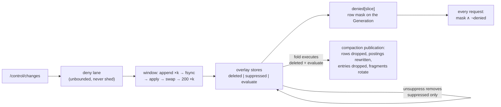

# The deny lifecycle, end to end

**Status:** Design memo, 2026-08-03 — non-normative until folded into the corpus; the implied
edits are listed in §8 and not applied. **Replaces** `2026-08-03-deny-acks-and-retirement-at-the-fold.md`
(same day), which argued deltas against owner concerns without stating the mechanism whole; this
document states the mechanism whole. Owner rulings recorded and designed to: an ack asserts
acceptance; a delete is tracked by nothing once its point has left the disc; suppression is kept
(no named requirement — recorded, not assumed); the seconds-to-minutes write budget covers denies
(architecture §3, r23). Builds on `6491d19`'s three-store overlay and adopts
`2026-08-03-denies-as-a-separate-mask.md` with the refinements marked **(new)** below.

## 0. Shape

**One mechanism, three facts, two retirement rules.**

Every disposition arrives on `/control/changes`, becomes durable and takes effect in one executor
window, and is enforced by one row-space mask subtracted from every request. The facts differ in
exactly one place — what removes them:

- a **deletion** and a **predicate change** are *work queued for the next fold*: executed there,
  then forgotten;
- a **suppression** is *standing state*: held until its unsuppress, and touched by nothing else.

Nothing else in the system distinguishes them. The apparent complexity of the current corpus —
three retirement rules, a stamp ledger, a retirement floor — reduces under this design to the
sentence above plus one safety property (§5).



## 1. Stores

| store | space | holds | removed by | durable home |
|---|---|---|---|---|
| `deleted: Bitmap` | entity | deletes accepted, fold pending | **its fold** — emptied in the fold's publication | WAL `Change`/snapshot; manifest `tombstones` |
| `suppressed: Bitmap` | entity | active suppressions | **unsuppress only** | WAL `Change`/snapshot; manifest `deny` |
| `evaluate: Map<EntityId, PredicateChange>` | entity | predicate changes, fold pending | **its fold** | WAL (descriptors, replay-resolved) |
| `denied[slice]: Bitmap` | row | `{row_of(e) : e ∈ deleted ∪ suppressed}` | derived — rebuilt, never retired | **none — never persisted** |
| segments + base postings | row/entity | post-fold, the *absence* of a deleted item | — | the bundle itself |

The three entity-space stores are the authoritative live state (unchanged from `6491d19`; the
argument for three containers rather than one tagged map is that store's module doc and is not
repeated here). `denied[slice]` hangs off the `Generation` beside the overlay and buffer, so a
request that loads one generation pointer gets one coherent triple.

**The derivation rule (new), stated once because it is the one place the mask could drift:**
`denied[slice]` is *only ever* equal to a fresh derivation from `deleted ∪ suppressed` against the
generation's row space. Two update modes are licensed:

- **Additions may be incremental.** A window containing only `Delete`/`Suppress` grows the union,
  and `add(row_of(e))` per entry is provably equal to re-derivation.
- **Any removal re-derives.** A window containing an `Unsuppress`, and every fold, rebuilds the
  mask from the union. Subtracting `row_of(e)` on unsuppress alone is **wrong** — after
  `delete → suppress → unsuppress` the row must stay masked, because `deleted` still holds the
  entity. Re-derivation makes that unmistakable; an implementation that wants the incremental
  subtraction must prove `e ∉ deleted` at the site, and the simpler rule is preferred.

Every **geometry publication** (flush, merge, fold) also rebuilds the mask, because row ids are
only meaningful within one `segments_version`; the mask never outlives its generation and so can
never be stale (the deny-mask memo's I11 argument, unchanged).

## 2. Accept — one write path, every disposition

### 2.1 Addressing — two id forms, bulk batches

*(Named requirement, owner 2026-08-03: bulk deletions and bulk suppressions via a list of ids,
addressable by external **and** by tessera id. Bulk unsuppress rides the same shape for symmetry;
predicate changes stay per-item, since each carries its own descriptors.)*

`/control/changes` stays a flat list — **bulk is the list**. Each element names its item by
exactly one of `external_id` (base64, as today) or `tessera_id` (string-encoded — a bare JSON
number loses precision past 2⁵³); both or neither is a 422. Mixed ops and mixed address forms in
one batch are fine. Batch size is bounded by the per-connection body ceiling (decision 0036) and
callers chunk. *(A compact uniform-op form — `{op, ids: […]}` — is recorded as an option if a
measured need for 10⁶-scale single requests arises; not specified now.)*

**Tessera addressing closes a real hole.** An item ingested without an external id is today
addressable by nothing on this endpoint — it cannot be deleted or suppressed at all. Contracts
§3.4 r6's "addressable only by its `tessera_id`" was written with no consumer; this is the
consumer.

**Resolution, per form — both fail-closed to the same `404 unknown`:**

- `external_id`: live map, then the bundle sidecar (unchanged; a resolver *error* propagates and
  is never read as "unknown" — `overlay.rs::OverlayError`, built).
- `tessera_id`: invert the Feistel under the deployment key — a pure function, no sidecar
  (contracts §0.3 deviation 9), nanoseconds — then three checks: the shard half is 0 (sharding is
  reserved), the entity half is **below the allocator high-water** (allocation is dense, so
  below-high-water ⇔ ever issued), and the idset matches (below). The permutation is total —
  every u64 inverts to *something* — so the range check is the misdirection guard: a corrupted id
  lands in-range with probability ≈ high-water/2⁶⁴ (~5×10⁻¹¹ at 10⁹, modelled). An in-range
  *wrong* id — a caller bug — denies the wrong item exactly as a wrong-but-existing external id
  does today; the control plane is trusted either way (I10's control-plane carve-out, unchanged).

**The idset guard — required here, though optional on the viewer plane.** A batch containing any
tessera address must carry the deployment `idset` (`/v1/meta`), checked **before any inversion**;
a mismatch is the existing `409 "stale idset; re-resolve by external_id"` and the whole batch
applies nothing. `/v1/items` made the idset optional on a recorded argument — a stale drill-down
is a wrong *read*, and the durable identifier is `external_id` — and that argument inverts for a
destructive op: a bulk list gathered before a key rotation and submitted after it would invert
every id under the new key to a **different, live item** and silently deny the lot. One corpus
inconsistency must be fixed when the contract edit lands: contracts §2.2 has the idset *"reset to
1 by a key rotation"* while decision 0026 defines it as the counter that **advances** on rotation
— the guard needs the idset monotone and never reset, or consecutive values collide
(1 → rotate → 1) and the guard passes exactly the stale list it exists to refuse.

**Batch validation is all-or-nothing on resolution.** Every element resolves before anything is
enqueued; any failure refuses the batch — 404/409 with the offending ids in `detail`, mirroring
ingest's 409 — and applies nothing. Past resolution, re-applies are not errors: delete of
deleted, suppress of suppressed, unsuppress of never-suppressed all fold to no-ops by bitmap
semantics, so a retried batch is idempotent without bookkeeping.

**A `tessera_id` never enters the WAL or any store.** It is a transport encoding (contracts
§2.2); a WAL record carrying one would be re-inverted at replay under whatever key then holds — a
rotation away from naming the wrong entity. A tessera-addressed change is therefore resolved at
admission and its WAL record carries the **entity id**, which is stable forever (I9);
external-addressed records keep today's form and replay path unchanged. The WAL `Change` record
gains a variant — a format break, cheap at v0.0.1.

### 2.2 The window

1. **The deny lane** (built, unchanged): unbounded, never refused for load, drained to empty
   before any ingest work, own window (`DENY_WINDOW_MAX_ENTRIES`), FIFO — so a `suppress X` and a
   later `unsuppress X` in one window resolve as two commands would. A bulk batch spans
   ⌈k / window⌉ consecutive windows in list order; the request's 200 is held until the last
   window's swap, and group commit keeps that a bounded number of fsyncs
   (`a_change_batch_of_n_costs_one_fsync`).
2. **The window** (built, unchanged): append ×k → **one fsync** → apply → **one swap** → 200 ×k.
   Apply clones the stores, applies entries in order, updates `denied[slice]` per §1's rule, and
   builds the next generation; the swap is one atomic pointer store.
3. **What the 200 asserts — exactly two things.** The disposition is **durable** (fsync'd; never
   a 200 without fsync), and the mask any later request composes against **already carries it**
   (the swap precedes the ack). It waits on nothing else: not flush, not the fold, not manifest
   publication, not any postings write. Enforcement in storage is cleanup, not a precondition of
   acknowledgement. *(This is the re-worded architecture §3 rule — same behaviour as built,
   measured ~3.2 ms quiescent, all fsync; the sentence changes so it cannot be read as tying acks
   to enforcement.)*
4. **Immediately after, off the ack path:** side-manifest publication with the **complete**
   current `deny` (= `suppressed`) and `tombstones` (= `deleted`) sets — one serialisation call
   per bitmap — gated on WAL durability so no other node can observe a deny a crash-replay here
   would drop (lifecycle §4, unchanged). An overlay publication moves no `segments_version`
   (flush design §1.3, unchanged).
5. **Durability failure** (built, unchanged): the sync is repaired by rewind-and-rewrite a bounded
   number of times; exhausted, the window folds asymmetrically — `Delete`/`Suppress` apply anyway
   behind a 500 (hidden for the process lifetime; a restart discards the unacked tail),
   `Unsuppress`/`Predicate` apply nothing. Fail-closed in both directions.

## 3. Enforce — one read path

Session artifacts, unchanged: the frozen fragment (built from the current generation's postings;
persisted cache keyed `bundle_identity ‖ auth_plugin_hash ‖ terms` + watermark) and the row
projection (cached per session, keyed on `segments_version`, patched across flushes).

Per request: load the generation pointer once (lifecycle §1.1, built and tested), then

```
effective = (projection ± evaluate/buffer diffs) ∧ ¬denied[slice]
```

- **The deny half is the mask, applied unconditionally last.** No per-request walk of the deny
  sets, no `row_of` per denied entity, no precedence to transcribe — a deny cannot lose an
  ordering argument it never enters. `andnot` is self-clamping, so the spurious −1 hazard the
  `∩ base` clamp guards against cannot arise for denies (I2).
- **The per-request term is O(active predicate changes + buffer depth)** — `compose`'s remaining
  walk is `evaluate` keys and the buffer, with the existing clamps. Nothing on the read path
  grows with denies ever accepted.
- **Entity-space verbs stay in entity space.** `visible_to` (drill-down's one bit), label gating
  and cluster visibility consult `verdict()` — single-sourced precedence
  `deleted > suppressed > evaluate > buffered`, unchanged — and never touch the row mask.
  **Conformance obligation:** the differential test `visible_to(e) ≡ effective.contains_row(row_of(e))`
  wherever a row exists, since the two routes must agree forever and are now maintained in two
  representations.
- **A suppressed or deleted item still in the buffer** has no row, so it cannot appear in
  `denied[slice]` — and cannot appear in any viewport either, since every map verb is a row-space
  question. The mask is complete for what it governs; `visible_to` answers from the entity-space
  sets. An unsuppress on a still-buffered item makes it immediately visible again, its own terms
  deciding (ruled 2026-08-03, suppression-redesign memo escalation 1).

## 4. The storage lifecycle, event by event

**Flush** (in flight, epic #3): a **deleted** buffered item is never written into the segment —
no row is created, the entity ID stays burned (I9). A **suppressed** item is flushed normally, so
a later unsuppress has a row to reveal. An **evaluate** entry's entity flushes with its buffer
terms; the overlay entry keeps overriding both directions until its fold. The flush-published
manifest carries the complete `deny`/`tombstones` state (one-liner per §2.2 step 4). The watermark
advances; fragments rebuild at the live watermark through the cache; projections extend
incrementally. *(All per the flush design §3.5/§8.1 — this design changes nothing in the flush
epic.)*

**Merge**: permutes row space inside the merged span, touches no entity-space store, retires
nothing (invariant-neutral, flush design §5). `denied[slice]` is rebuilt at the publication like
any geometry event; projections rotate on `segments_version` as today.

**Fold (compaction) — the retirement event.** The fold snapshots a generation and, in **one
publication**:

1. executes every snapshot-covered **deletion**: rows dropped, base postings rewritten without
   the entities, permutation rewritten;
2. executes every snapshot-covered **evaluate** entry: its term set written into base postings;
3. **drops the executed entries** from `deleted` and `evaluate` — the same publication, not a
   later pass;
4. copies `suppressed` forward verbatim (one bitmap copy — its rows and postings are untouched,
   as always);
5. carries forward verbatim everything accepted *after* the snapshot: post-snapshot segments,
   deltas, tombstones, and unfolded entries (lifecycle §5.3's rule, unchanged — three of its four
   categories were added after fail-open findings; do not re-derive it);
6. rebuilds `denied[slice]` — now `row_of(suppressed)` plus any post-snapshot deletes carried
   forward — against the new row space;
7. publishes the new prefix, whose MANIFEST digest **rotates the fragment identity** (§5).

Steady state after a fold: the overlay holds suppressions and post-snapshot arrivals only;
manifests carry `deny` and only-recent `tombstones`; a deleted point is absent from disc and
tracked by nothing except the monotone allocator that never reissues its ID.

**WAL rotation** (built, unchanged): the snapshot re-states the three stores as deterministic,
entity-sorted records — bytes a function of state alone, so `retry_durability` can rewrite them —
and a suppression thereby outlives every checkpoint, which it must, being the one fact whose only
durable homes are the WAL and the manifest.

**Restart** (built, unchanged): replay the WAL's durable prefix under the positional CRC rule;
seed `initial_deny` from the manifest and union with replay — sound because applying a
disposition twice folds to the same state (pinned by test).

**Restore from bundle + object store** (disaster path — mid-log corruption): the manifest's
complete `deny`/`tombstones` state as of the last publication is the recovered deny state. The
immediate-publication rule (§2.2 step 4) is what bounds the loss to the in-flight window rather
than "since the last flush".

**Replica sync** (⊘ future): the reader's disposition split stands unchanged — a deny-carrying
manifest is honoured before verification and makes the partition **unready** rather than stepped
past. This design shrinks its steady-state exposure (post-fold manifests carry no old
tombstones), and the freshness gate stays deferred until replication exists.

## 5. Retirement — two rules, one safety property

- **Rule S:** an entry leaves `suppressed` only by its `Unsuppress`.
- **Rule F:** entries leave `deleted` and `evaluate` only at the fold that executes them, in the
  fold's own publication.

Rule F is safe iff **no pre-fold fragment is ever composed after the fold** — a fragment built
before the fold still contains the deleted entity (and misreads the evaluate entity in both
directions), and post-fold nothing else subtracts it. The property is close to structural
already:

- A request loads one generation pointer at start and works from it throughout, so every request
  is entirely pre-fold (entries still present and subtracted — correct) or entirely post-fold
  (folded postings, entries gone — correct). No straddle exists to guard.
- The *persisted* fragment cache keys on `bundle_identity` — the MANIFEST digest, which the
  fold's new prefix rotates — so no pre-fold entry is reachable by key afterwards.

**Two gaps in the current tree must close in the same change as the first fold** (they are this
design's floor, as an identity match rather than a stamp ordering): the **in-memory** fragment
memo key is `(auth_data_hash, dict_len, watermark)` with no generation identity
(`tessera-authz/src/fragment.rs:715`), and a **session-held** frozen fragment rebuilds today only
when its watermark is behind (lifecycle §2.4) — a fold advances no watermark. One rule closes
both: *a fragment carries the generation identity it was built under, and composition uses it
only when that matches the request's generation, rebuilding through the cache otherwise.*

What Rule F deliberately does **not** do:

- **No earlier-than-fold retirement.** The spec'd stamp ledger (`stamp_counts`,
  `min_live_stamp`, the two-kind retirement floor, incremental prefix retirement — lifecycle
  §3.2, all unbuilt) existed to retire deletion denies incrementally as the last pre-delete
  fragment died. No requirement asks for that precision, and §3's read path makes between-fold
  depth free at request time. Deleted from the spec — not because it was wrong, but because it
  bought precision nothing asks for.
- **No staleness-based retirement for `evaluate`, ever** — lifecycle §3.4's warning is
  unchanged: a stale-looking entry retired early is a counting error with no fail-safe symptom.
- **No route by which `delete → suppress → unsuppress` re-exposes**: the unsuppress mutates a
  store that does not hold the deletion; the fold then executes the deletion regardless. And r1
  (one retirement stamp per deny) stays *unexpressible*: `suppressed` carries no stamp for any
  rule to act on.

**Cost, honestly:** every live session pays a fragment rebuild plus a row-projection rebuild at
each fold. The projection rebuild — measured 10.7 s at 10⁹ — is forced by any compaction
*regardless*: the permutation is rewritten and `segments_version` moves, rotating every
projection key. The marginal cost of Rule F is the fragment build alone (`fast_or` over satisfied
terms' postings — **unmeasured**; measure before the compaction stage is designed). Between
folds the overlay grows at deny-and-predicate rate × fold interval — human-scale writes
(architecture §3) against an hours-to-days cadence; ~2 bytes per denied entity (modelled) plus
the evaluate map. `overlay_soft_limit` stays the gauge and gains the lever it currently lacks:
its response is *schedule a compaction*.

## 6. Conformance obligations

The tests this design needs, mapped to what they pin (four of the lifecycle review's five carry
over; the differential test is new):

1. `delete → suppress → unsuppress` never re-exposes (exists — `overlay.rs`).
2. A suppression survives rotation, restart, flush and fold (exists for rotation/restart; flush
   and fold arms land with their epics).
3. Post-fold: a cold fragment rebuild excludes folded deletions, reflects folded evaluate terms
   **in both directions**, and a pre-fold fragment (in-memory memo or session-held) is refused
   by the identity match — the Rule F safety property, testable the day the first fold exists.
4. `visible_to(e) ≡ effective.contains_row(row_of(e))` wherever a row exists — the two
   enforcement representations never drift (new).
5. Snapshot determinism: same stores → same bytes (exists).
6. The 200-after-fsync-and-swap ordering under fault injection (exists — pause sites).
7. Tessera addressing fails closed: an out-of-range inversion is a 404; a stale idset is a 409
   decided before any inversion; either way the batch applies nothing (new).
8. A tessera-addressed deny replays to the same entity after a key rotation — the WAL carries the
   entity id, never the blinded form (new).

## 7. Costs and sizing, collected

| term | cost | class |
|---|---|---|
| deny ack, quiescent | ~3.2 ms (fsync) | measured |
| deny ack under 1 M buffered ingest | 165 ms p50 / 346 ms max — head-of-line behind an ingest command's O(buffered) clone; not fsync, not enforcement | measured |
| per-request deny term | one `ANDNOT`, O(containers) | modelled |
| per-request residual walk | O(evaluate + buffer) `row_of` | modelled (read from code) |
| deny window apply | O(k) incremental adds; re-derive O(denies) on unsuppress windows | modelled |
| `denied[slice]` memory | ~2 B/denied row; 10⁶ denials ≈ single-digit MB | modelled |
| fold, per live session | projection rebuild 10.7 s at 10⁹ (already forced by compaction) + fragment build (**unmeasured**) | measured / unmeasured |

The head-of-line term is the whole of the observed delete-latency story and is a performance work
item independent of everything here (a cheaply-cloneable buffer, or the flush epic bounding
buffer depth); the flush design's per-tick rebase adds one stall of the same shape (modelled,
flush §10) and should be re-measured with the 2026-08-01 method once flush lands.

## 8. What this changes in the corpus, and where it came from

Implied edits (none applied; deliverable ruled memo-only):

1. **architecture §3** — ack sentence re-worded per §2.2 step 3's two assertions.
2. **lifecycle §3.2** — stamp ledger replaced by Rule F + the identity match; §1.1's
   eviction→retire clause becomes unreachable and is dropped; §3.4 re-pointed at Rule F.
3. **lifecycle §3 / Task 24** — catch up to the three-store overlay (already open).
4. **architecture §11.2** — adopt the deny-mask evaluation order (the deny-mask memo's "not a
   spec change" argument: same `M_auth`, reordered).
5. **contracts §2.3** — the stale "parsed and honoured by nothing" sentence, corrected when next
   touched.
6. **contracts §3.4** — `/control/changes` element shape becomes one-of `external_id` /
   `tessera_id` (string-encoded), with a batch-level `idset` field required when any tessera
   address is present, and the all-or-nothing resolution refusal (404/409 with offending ids in
   `detail`) stated (§2.1).
7. **contracts §2.2** — the idset becomes monotone: advanced by rotation and repartitioning
   alike, never reset (§2.1's guard depends on it, as does decision 0025's `/v1/meta` poll —
   "reset to 1" makes `1 → rotate → 1` undetectable on any never-repartitioned deployment, and
   the sentence appears to predate 0025 changing what the idset is for). The operational corner
   that likely motivated the reset gets the paragraph's existing answer: a rotation build that
   cannot prove the prior idset — no predecessor bundle, no recorded counter — **refuses**,
   exactly as a repartitioning build without lineage already must.
8. **WAL `Change` record** — gains the entity-addressed variant for tessera-addressed changes
   (§2.1; format break, cheap now).
9. **compaction stage brief** — fold publication gains steps 3 and 6–7 of §4's fold list; the
   flush epic is untouched.

Owner-concern mapping, one line each: acks already assert acceptance — re-word, don't rebuild
(§2.4); the always-applied deny-list mask is `denied[slice]` (§1, §3); no permanent exclusion for
deletes — Rule F empties the list at each fold and nothing tracks a removed point but the
allocator (§4, §5); the cut for over-design is the stamp ledger, and the audit of what stands on
a named requirement vs. what does not is unchanged from the superseded memo — suppression is the
one mechanism kept **without** a named requirement, by ruling, and is the sole reason `deny`
state exists in steady-state manifests.

## 9. Evidence discipline

- **Measured** (cited, not re-run): ack figures (`2026-08-01-deny-ack-baseline.md`); 10.7 s
  projection at 10⁹; bitmap ops O(containers touched).
- **Modelled:** every row so marked in §7; the O(denies-ever) cost of the *current* per-request
  walk (read from `compose.rs`, no deny-heavy fixture exists).
- **Assumed:** fold cadence long against deny rate; fragment build small against the projection
  rebuild it accompanies — the one assumption a measurement should replace before the compaction
  stage is designed.
