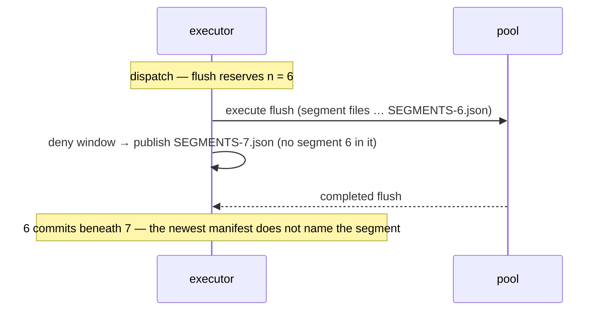

# Deny publication: one counter on disc, one in memory, one writer

**Status:** Design memo, 2026-08-03 — non-normative until folded into the corpus; the implied
edits are listed in §7 and not applied. Designs the writer half of contracts §2.3's deny fields
(the deny lifecycle memo's §2.2 step 4 and §4), within that memo's owner rulings: publication is
immediate and off the ack path, restart is WAL replay ∪ manifest seed, and the freshness gate
stays deferred until replication exists. Every code claim below was re-verified against the tree
at `bbbc35d`; where this memo contradicts the Task 27 sketch or the flush design's §1.3 phrasing,
the contradiction is stated at the claim.

## 0. The result first

**Delete the manifest's `segments_version` field; allocate manifest numbers from one
executor-held counter; write every side-manifest at publication, on the executor, from the
generation being published.** Three sentences carry the design:

- **The manifest sequence number is the filename's `n`** — advanced by every publication,
  geometry or overlay, per-partition, monotone, never reused. The geometry version
  (`Generation::segments_version`, the row-projection cache key) becomes what it already almost
  is: a process-local counter no format field carries. Nothing "comes apart", because the format
  never needed the second counter: the field is written `= n`, the only on-disc reader takes `n`
  from the filename, and the two in-memory readers of the field are re-pointed in §3.1.
- **All side-manifest writes move to the executor, at publication.** The flush's manifest is
  assembled and written in `publish_flush`, against the live generation, immediately before the
  swap — not on the pool at plan time. Forced, not preferred: with the flush's `n` fixed at
  dispatch and overlay publications taking higher `n`s during its flight, the committed flush
  manifest is never the newest and a restore silently loses the segment (§2.2).
- **Deny fields are never copied from another manifest; they are serialised from the overlay of
  the generation being published, at every write.** `deny` = the suppression bitmap, `tombstones`
  = the deleted bitmap, both ascending; `entity_id_high_water` refreshes from the live allocator.
  A manifest's deny state is a projection of live state, never an input to a later manifest.

One fix must land **with** the writer, not after it (§4): `WritePath::reconstruct` applies the
manifest seed *after* WAL replay, under a comment arguing order-independence — an argument that
holds only while no manifest carries a suppression. The day one does, a crash in the publication
gap makes a restart silently revert an acked unsuppress, and the next manifest write makes the
reversion permanent. The seed moves before replay.

Against Option A as sketched (split the field from the filename): no format-semantics change (a
redundant field is deleted, not redefined), no `read.rs` change at all, no `Bundle::substituting`
special case — and the flush/deny interleaving hazard neither sketched option addressed is closed
structurally, because one thread allocates `n` and writes at it in the same breath.

## 1. What the code does today

One sentence per claim, each verified in the named file.

- `initial_deny_of` (`tessera-engine/src/session.rs`) seeds the overlay at open from every
  partition manifest's `deny` (as `Suppress`) and `tombstones` (as `Delete`) — the reader half is
  built, and `HONOURED_STATE` in `tessera-store/src/manifest.rs` already claims all three state
  fields, so contracts §2.3's "parsed and honoured by nothing" ⊘ is stale on the reader side now.
- `tessera build` writes `deny`/`tombstones` as `Vec::new()`; the flush does **not** — it clones
  the live in-memory manifest at plan time (`execute_flush`'s `ctx.manifest.clone()`) and carries
  its deny fields forward verbatim, so on a bundle restored *with* deny state, today's flush would
  republish the open-time deny list regardless of any unsuppress since. The writer gap is not
  "always empty"; it is "never serialised from the overlay", and the fix must include the
  never-copy rule or it re-opens as staleness.
- The on-disc reader (`tessera-store/src/read.rs`) takes `n` from the **filename**
  (`PartitionData::segments_n`'s doc: the filename decides where the two disagree); the in-memory
  path `Bundle::substituting` assigns `segments_n = manifest.segments_version` — consistent only
  while the field equals the filename, which every writer this design specifies maintains has no
  need of, since the field is deleted and the number is passed explicitly.
- The row-projection cache keys on `(token_id, slice, segments_version, prefix)`
  (`cache.rs::RowProjectionKey`); its patch path derives **only** from `segments_version − 1`
  (`Engine::viewport`'s `derive_from`), and retention is depth 1
  (`cache.rs::KEEP_SUPERSEDED_GENERATIONS`). A full rebuild is a **measured** 10.7 s at 10⁹.
- A deny window (`Executor::commit_denies` → `apply_changes`) bumps `overlay_version`, carries
  `segments_version` unchanged, updates `Generation::denied` by the derivation rule, swaps, acks —
  and writes nothing to disc. The row projection is untouched by denies by construction: the deny
  mask is composed per request, after the projection.
- `dispatch_flushes` computes `next_n = partition_data.manifest.segments_version + 1` at plan
  time; `execute_flush` writes `SEGMENTS-<next_n>.json` on the **pool** as the commit point;
  `write_segments_manifest` refuses to replace an existing file (`hard_link`, tmp fsynced first).
- `plan_flush` already refuses while `wal_poisoned` or `overlay_diverged`; `record_and_rotate`
  refuses likewise, and `ExecutorHealth::overlay_diverged`'s doc already states the rule this
  design inherits: "publishing a manifest … from that overlay would make a 500'd, never-acked
  deny permanent". `mirror_wal` already reports the poisoned→healthy transition.
- `Overlay` (`tessera-lifecycle/src/overlay.rs`) holds `deleted`, `suppressed`, `evaluate`;
  `denied()` deliberately exposes only the union. The writer needs the two bitmaps separately —
  the two manifest fields have different retirement semantics (lifecycle §3) — so the overlay
  gains a read accessor for each; `denied()`'s union-only argument concerns the row mask and is
  unaffected.
- `Engine::open` seeds the first generation's `segments_version` from the manifest **field**
  (`session.rs`), and `Executor::publish_geometry` takes the caller's value under a
  strictly-increases check — the two in-memory readers of the field §3.1 re-points.

## 2. The two constraints, verified

### 2.1 The geometry version must not move on a deny

Bumping `segments_version` per deny window (Option C) is refuted, and harder than the framing had
it. The patch path derives only from `version − 1`: a session whose last request was at `v` pays
the cheap extension patch if the live version is `v+1` and falls to the **full 10.7 s rebuild**
(measured, at 10⁹) if it is `v+2` or beyond — the cache holds no intermediate generations to
chain through, whatever the retention depth. So no burst across sessions is needed: a **single
bulk revocation larger than `DENY_WINDOW_MAX_ENTRIES` (1,000) spans multiple windows** and would
therefore cost every live session a full rebuild by itself. Extending the patch chain to walk
back `k` generations would be redesigning the cache to absorb a problem this design simply does
not create.

### 2.2 The flush and the deny window interleave, and plan-time `n` allocation cannot survive it

The deny memo rules publication immediate; the flush is file IO of unbounded duration on the
pool. With the flush's `n` fixed at dispatch (today's shape), a deny accepted during its flight
must take a higher `n`:

*The plan-time-allocation hazard: whichever order the two writers finish in, the newest-by-filename
manifest can omit the flushed segment, and a restore opens it.*

A restore then opens `SEGMENTS-7.json` and the flushed rows are gone — acked, published, and
absent, the silent-loss class `write_segments_manifest`'s refuse-to-replace was built against,
arriving through filenames instead of a collision. The alternatives all fail: deferring deny
publication until the flush lands violates the immediacy ruling for an unbounded interval;
having the executor re-publish a union manifest after a contended flush works but assembles
manifest content in two places on two threads, with correctness resting on reclaim ordering —
three writes where one is possible. The construction that is obviously correct is **one writer**:
the executor assembles and writes every manifest at publication, allocating `n` at the write.
Contracts §2.3's "written after every file it names is durable" is preserved — the files were
made durable on the pool before the completed flush was submitted.

## 3. The mechanism

### 3.1 One counter on disc, one in memory

The executor holds a per-partition `next_manifest_n`, seeded at open from
`PartitionData::highest_candidate_n + 1` — the highest candidate, not the served `segments_n`,
so a stepped-past unverifiable manifest is never overwritten (refuse-to-replace would fail the
write; seeding above it means it cannot arise). Every side-manifest write takes the counter and
increments it. `n` never resets across prefixes (contracts §2.3, unchanged), so a future
compaction's new prefix continues the same counter — any future manifest writer allocates from
this counter or not at all.

The manifest's `segments_version` field is **deleted**. It is redundant (`= n` by contract), the
on-disc reader ignores it in favour of the filename, and its name is the source of this task's
apparent conflict — it collides with the *geometry* version, a different quantity that no format
field carries or should. `SegmentsManifest` parses without `deny_unknown_fields`, so old bundles
carrying the field still open. The two in-memory readers re-point: `Bundle::with_segment` /
`with_merged` / `substituting` take the file number as an explicit parameter (assigning
`segments_n` from it), and `Engine::open` seeds the first generation's geometry version from
`segments_n` — after which the geometry version is process-local, bumped only by geometry
publications, exactly as `flush-and-merge.md` §1.3 requires, and the row-projection key never
rotates on a deny. Its strictly-increases check (`check_publishable`) is unaffected: seeds from
`n` only ever jump it forward.

### 3.2 One writer, at publication

`execute_flush` keeps everything except the manifest: it writes the segment files, the delta
tier, the external-id run, the dict extent, and computes their digests on the pool.
`CompletedFlush` carries those parts (segment entry, files-map additions, run, locator extent,
extent, watermark, high-water) instead of an assembled manifest. `publish_flush` then, on the
executor, in order: rebase checks as today (prefix, dictionary, row space) → **assemble the
manifest from the live partition manifest plus this flush's parts, deny fields serialised fresh
from the live overlay, `n` allocated from the counter** → `write_segments_manifest` (unchanged:
tmp, fsync, `hard_link`, dir fsync) → on success, `with_segment` and the swap → `record_and_rotate`.
A failed manifest write discards the flush — files become orphans, the buffer is retained, the
next tick re-plans — the same posture as every other flush failure. Because the manifest write
precedes the swap and rotation follows the swap, **a WAL member is only ever reclaimed after a
manifest reflecting the state it carried is durable at a higher `n`**, which is what makes the
manifest a sound disaster-path seed (§4).

The rebase gains what it always should have had: the manifest a flush publishes reflects denies
and unsuppresses accepted *during* its flight, because it is built at publication. Today's
plan-time clone is also a latent staleness hazard against any concurrent manifest-bearing
publication (none exists yet — merge is unbuilt, `publish_geometry` has no production caller
besides flush); this closes it by construction rather than by guard.

`seg_id` naming: today `flush-<next_n>-<attempt>`. With `n` unallocated at plan time, the first
component becomes the manifest sequence the plan was built against — same two-part uniqueness
argument as today (the durable component moves whenever anything commits; the attempt counter
separates re-plans within a process; a cross-restart repeat can only collide with unmapped
orphans). Contracts §2.1's never-reused property is preserved unchanged.

### 3.3 The overlay publication

**Trigger.** Any deny window containing at least one `Delete`, `Suppress` or `Unsuppress` sets a
deny-dirty flag after its swap and acks. Windows of pure `Predicate` changes do not — their
durable home is the WAL alone, by design. Including `Unsuppress` is a clarification, not a
contract change: §2.3's "unsuppress removes the entry in the next manifest" stays literally true
— the next manifest is the one the unsuppress itself triggers. Publishing the removal promptly is
what keeps the disaster-path bound symmetric; nothing fails open either way (a stale manifest
over-suppresses).

**Site and cadence.** The publication runs on the executor at the close of the deny drain — after
`run_deny_pass` finds the lane empty, before the loop blocks — so it is off the ack path (the
200s were sent at each window's swap, per the deny memo's step 3) and one write covers a burst of
consecutive windows. Under sustained arrival the drain need not close, so a cap forces a
publication every 64 windows regardless (D3 rules on this deviation from the deny memo's
per-window letter; §5 has the cost that motivates it). The write: clone the live partition
manifest, replace `deny`/`tombstones` from the overlay's two bitmaps (ascending; deterministic
bytes for one state), refresh `entity_id_high_water` from the live allocator, allocate `n`,
`write_segments_manifest`. No geometry field moves; nothing is superseded; no cache is pruned;
the generation is untouched — an overlay publication is a disc event only.

**Gates.** No manifest write of any kind while `wal_poisoned` or `overlay_diverged` — the flush
side already refuses in `plan_flush`, and `overlay_diverged`'s doc already states the reason: the
overlay then holds dispositions no durable record backs, and publishing them makes a 500'd,
never-acked deny permanent on every restore. On the poisoned→healthy transition (already reported
by `ExecutorHealth::mirror_wal`), a deny-dirty flag publishes once, so a repaired node does not
sit unpublished until its next deny. `overlay_diverged` latches until restart, so a diverged node
publishes nothing ever again — inherited posture, stated rather than changed.

**Failure.** A failed overlay write alarms, leaves the dirty flag set, and is retried at the next
drain close or tick. Nothing is un-acked and nothing is unwound — the state is WAL-durable; only
the disaster-path bound degrades while the alarm stands, because any later successful write
carries complete state.

**Scope.** Per partition, filtered to the partition's own entities per §2.3's isolation rule —
trivially the whole set today. **⊘ Deployments are single-partition; the per-partition split of
one deny batch arrives with sharding and is not designed here.**

### 3.4 Restart and restore: the seed moves before replay

`reconstruct` currently applies `initial_deny` **after** `replay`, with a comment arguing the
order is immaterial because "neither source can un-set what the other set … no manifest carries
an `Unsuppress`". True — and insufficient the moment manifests carry suppressions, because the
*WAL* carries unsuppresses: publication is deliberately off the ack path, so there is always a
gap in which the newest manifest predates a durable, acked `Unsuppress`. A crash in that gap,
seed-after-replay, re-applies the retired suppression on restart; the overlay then holds it; the
next manifest write republishes it — an acked disposition reverted, permanently and silently.
Fail-closed in direction (an item hidden, not leaked), but a violation of what the 200 asserts,
and invisible to every existing test because nothing writes the fields yet.

The fix is ordering: seed the overlay from the manifests **first**, then replay the WAL over it.
Every WAL record postdates the state any honourable manifest carries (a manifest is written only
above WAL durability, and §3.2's write-before-rotate ordering keeps reclamation behind
publication), so replay's later records rightly win. Deletes are indifferent to the order
(nothing un-sets them); the unsuppress is the one op that clears, and it is exactly the one the
current order gets wrong. The existing idempotency pin (applying a disposition twice folds to the
same state) is untouched.

The restore path (bundle + object store, no WAL) is then exactly the deny memo's §4: the newest
honourable manifest's complete `deny`/`tombstones` is the recovered state, loss bounded by the
publication cadence — the in-flight windows, plus at most the cap under sustained arrival.

## 4. Rejected, with reasons

- **Split the field from the filename (Option A as sketched).** Keeps two durable counters and a
  documented disagreement for readers to tolerate, edits §2.3's field semantics, and still needs
  the §2.2 interleaving answered separately. Deleting the redundant field gets the same split —
  geometry version process-local, `n` per-write — with strictly fewer moving parts.
- **Deny state rides flush manifests only (Option B).** Contradicts §2.3's publication rule and
  the deny memo's ruled step 4; widens the disaster bound from the in-flight windows to
  `flush_max_age_secs` (90 s default) — and on a node whose flush is failing, to *unbounded*,
  since the flush is then the only writer and it is not writing. The overlay publication is ~150
  lines against that; not worth its own ruling to avoid.
- **Bump the geometry version on overlay publications (Option C).** Refuted at §2.1 — one bulk
  revocation over 1,000 entries forces a measured 10.7 s rebuild on every live session.
- **Executor re-publishes a union manifest only when a flush was contended.** Works, but
  assembles manifest content on two threads with a transient newest-manifest-missing-the-segment
  window whose safety rests on reclaim ordering; three writes in the contended case where one
  suffices. Rejected for reviewability, not correctness.
- **Publish strictly per deny window** (the deny memo's letter). Complete-state manifests make a
  bulk revocation quadratic on disc: 10⁶ entries = 1,000 windows × a manifest that has grown to
  ~10⁶ entries ≈ tens of GB written (modelled; §5). Drain-close batching publishes identical
  state for the common case and caps the pathological one. D3 puts the deviation to the owner.

## 5. Costs

| term | cost | class |
|---|---|---|
| overlay publication, small deny set | one JSON write + 2 fsyncs (tmp, dir), executor thread, after acks | modelled |
| manifest bytes at large deny sets | ~30–60 B/entry JSON; 10⁶ entries ≈ 30–60 MB per write, serialisation + fsync likely hundreds of ms | **modelled — unmeasured**; probe `probes/deny-manifest-write/` (serialise+fsync at 10³/10⁵/10⁶ entries) before bulk-revocation scale is claimed |
| bulk revocation, per-window publication | Θ(N²/window) bytes on disc — ~12–25 GB at N = 10⁶ (rejected §4). **This, not latency, is what forces the batching**: architecture §3's write budget grants latitude in *when* work is batched, and none in how many bytes it totals | modelled |
| bulk revocation, drain-close + cap 64 | ≤ ⌈N/64,000⌉ writes | modelled |
| flush publication delta | manifest write moves pool→executor: + one write+2 fsyncs on the executor per flush (90 s cadence), − nothing (same IO total) | modelled |
| deny ack latency | unchanged — publication is after the acks. Not a constraint this design is working under, either: architecture §3 (r23) budgets the whole write path at seconds to minutes, denies included. It is kept because the ruling's one condition is that a deny's ack stay coupled to its **application** — the WAL fsync and the swap — which is upstream of publication regardless | by construction; pause-site test (§6.7) |
| geometry version on a deny | unchanged — no projection rotates, no cache pruned | by construction; §6.8 |

The manifest-write figure is the one number this design wants measured before the compact bulk
form (deny memo §2.1's recorded option) is ever specified; at human-scale deny rates
(architecture §3, the write budget this rides) the modelled figures are comfortably inside the
seconds budget.

## 6. Conformance obligations

1. A flush-published manifest carries the deny state of the generation being published: a
   suppress accepted *during* the flush's flight appears in the manifest the flush publishes.
2. An accepted delete or suppress is followed, before the executor next blocks, by a new
   `SEGMENTS-<n>.json` carrying it, at unchanged geometry version.
3. An unsuppress triggers a publication and its entry is absent from that manifest.
4. Deny fields are never copied forward: a bundle opened with non-empty manifest deny state,
   unsuppress accepted, next manifest (flush or overlay) lacks the entry.
5. No manifest is written while `wal_poisoned` or `overlay_diverged`; on the poisoned→healthy
   transition with deny-dirty state, exactly one publication follows.
6. A node restored from bundle + manifests alone (no WAL) hides every entity the newest
   honourable manifest denies (Task 27's restore test, unchanged).
7. The 200 for a deny does not wait on its publication (pause site at the manifest write; ack
   already sent).
8. A burst of k > 1 deny windows with no intervening request costs the next request no full
   projection rebuild (`Engine::full_projection_builds` unchanged) — §2.1 as a property.
9. **Seed-before-replay:** suppress → publish → unsuppress (durable, acked) → crash before the
   next publication → restart with WAL ⇒ the entity is visible, and the next published manifest
   lacks it.
10. `n` strictly increases across every write, geometry and overlay interleaved, and across a
    restart (counter seeds above `highest_candidate_n`); `SEGMENTS-<n>.json` is never replaced
    (existing test extends to overlay writes).
11. Manifest deny/tombstone arrays are ascending and byte-deterministic for one overlay state.
12. A restart of a node whose newest manifest predates several published overlay states opens at
    the newest honourable one — filename order, no field consulted (the field is gone).

## 7. What this changes in the corpus

- **contracts §2.3** — the `segments_version` field row is deleted; `n` is defined as the
  manifest sequence number, advanced by every publication, geometry or overlay, so consecutive
  `n` need not differ in geometry; the publication rule gains the unsuppress clarification and
  the drain-close cadence (per D3); the "parsed and honoured by nothing" ⊘ comes out (stale on
  the reader side since the disposition split; the writer is this design); the "deny writer and
  freshness gate must ship as one unit" warning is rescoped to replicas, per the deny memo's
  ruling — this deployment's one reader replays its own WAL, which supersedes seeding.
- **flush-and-merge.md** — §1.3's consequence sentence is corrected: the split is real but the
  format carries one counter, not two ("which read.rs already tolerates" becomes moot — no
  conforming writer can produce the disagreement); §7.3's commit point moves to the publication
  step on the executor; §8.1's flush-manifest deny state gains this memo's mechanism.
- **concurrency-lifecycle.md** — §1.2 records the geometry version as process-local, seeded from
  `segments_n` at open; the restart section makes seed-before-replay normative (§3.4).
- **deny lifecycle memo §2.2 step 4** — "one serialisation call per bitmap" becomes one manifest
  write per publication, and the cadence gains the cap (if D3 rules as recommended).
- **`read.rs`** — `PartitionData::segments_n`'s "where the two disagree" doc simplifies to
  "`n` is the filename's"; `substituting` takes the number explicitly.
- **decisions** — one record: the manifest carries no version field, the sequence number is the
  filename, and every side-manifest is written at publication on the executor from live state
  (covering D1/D2's rulings); `docs/design/inventory.md` regenerates for the ⊘ movements.

## 8. Implementation order

Each step keeps the gate green on its own; the ordering closes the acked-unsuppress reversion
before the writer that makes it reachable exists.

1. **Seed-before-replay** in `WritePath::reconstruct`, with obligation 9's test driven through a
   hand-written deny-carrying manifest (constructible today; the writer is not needed to test the
   reader's ordering).
2. **Single-writer refactor**: manifest assembly moves from `execute_flush` to `publish_flush`;
   `CompletedFlush` carries parts, not a manifest; the executor counter arrives, seeded from
   `highest_candidate_n`; `substituting` takes the number explicitly; deny fields serialised
   fresh from the overlay via two new `Overlay` accessors; the `segments_version` field is
   deleted from `SegmentsManifest` and `tessera-build`. Obligations 1, 4, 10, 11, 12.
3. **Overlay publication**: deny-dirty flag, drain-close hook with the cap, poisoned/diverged
   gates, recovery republish. Obligations 2, 3, 5, 7, 8.
4. **Restore-path test** (obligation 6) against real written manifests — Task 5's
   `Unready`/honour machinery is finally exercised end-to-end.
5. **Corpus edits** per §7, in the same change as the ⊘ deletions (decision 0013).

## 9. Decisions needing an owner ruling

**D1 — move the side-manifest write to the executor, at publication?** Recommended: yes — it is
what makes one counter, the interleaving argument (§2.2), and always-fresh deny state all hold at
once. Alternative: keep the pool-side write and add a contended-case union republication
(rejected §4). Cost if wrong: code churn only — the bundle format is byte-identical either way,
so reverting is a refactor, not a migration; what is genuinely lost is the structural
"one thread allocates and writes" argument, which would have to be re-established by guards.

**D2 — delete the manifest's `segments_version` field?** Recommended: yes — redundant by
contract, ignored by the on-disc reader, and the name collision is the confusion this task was
born from. Alternative: keep it `= n` as a tamper tripwire (weak — the file carries no digest, so
the field is exactly as forgeable as the name). Cost if wrong: a one-line serde re-add; old
bundles are unaffected in both directions because unknown fields are ignored.

**D3 — publish at drain close with a 64-window cap, rather than per window?** ~~The owner's to
re-rule.~~ **Not a ruling: already granted.** An earlier drafting of this entry treated drain-close
batching as a deviation from the deny lifecycle memo's step 4 ("immediately after" each window),
needing its own ruling. It is not. Architecture §3 (r23) grants exactly this latitude in terms —
*"the write path's latitude is therefore in **when work is batched**, never in whether an
acknowledged security operation has taken effect"* — under one rule that this design keeps: a
deny's acknowledgement stays coupled to its **application**. It is, and unchanged by anything
here: the 200 waits on the WAL fsync and the generation swap, so the entry is in force before the
caller is told so. The manifest is a later, separate durability artefact and always was.

**What the latency ruling does not settle, and what actually forces the batching, is bytes.** A
side-manifest is complete state, not a diff (contracts §2.3), so publishing per window through a
bulk revocation of *N* entities rewrites a growing set once per window: Θ(*N*²/window) bytes on
disc — at *N* = 10⁶ and a 1,000-entry window, ~500 million entries' worth of JSON, order 12–25 GB
for one revocation. That is a quadratic in total work, not a delay, and no latitude about *when*
work happens removes it. Drain-close batching collapses it to one write per burst.

**The cap's job is therefore liveness, not latency, and it should be read that way.** A drain
loops while the deny queue is non-empty, so under arrival faster than application it need never
close, and a publication floor is what stops the newest manifest trailing indefinitely. 64 windows
is a floor chosen for the disaster-path exposure it admits (≤ 64,000 dispositions, all durable in
the WAL, all enforced live, all recovered by any WAL-bearing restart — only a no-WAL restore sees
the gap), **not** for any latency it bounds. Denies are the rare case by the same owner statement,
so the floor is expected to be unreachable outside bulk revocation.
