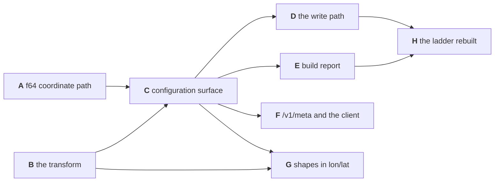

# Building projections

**Status:** Working plan, never normative. It builds [`../../design/projections.md`](../../design/projections.md)
and decides nothing that document does not already say. Each phase is a worktree and a brief.

---

## 1. The order, and where it is parallel



**A and B start together and neither waits on the design review.** A is a format change justified
without any projection — the shape path is already `f64` while the point path is `f32`, and that
asymmetry is measurable today: of 17,551 Overture divisions, three metres-wide polygons hold a place
that is inside at its source coordinates and outside at its stored position. B is arithmetic checked
against published values and against the Python module the ladder already runs on; a review can
change which entries the enumerated set holds, and cannot change what Web Mercator computes.

**C is the junction and the only serial point.** It needs A for the depth a frame may reach and B for
the transform it snaps and projects with. Everything after C is independent: the write path, the
report, the wire and the shapes touch different code and different second readers.

**Three normative documents are amended**, and the phase that forces each is named in it: the
`[[view]]` block in `configuration.md` §1 (C), the ingest schema's coordinate columns in
`contracts.md` §3.4 (A for the width, D for the names), and the `/v1/meta` fields in `contracts.md`
§3.2 (F).

**Every phase passes the whole gate**, not the part of it that looks relevant:

```bash
cargo test --workspace --no-fail-fast
cargo clippy --workspace --all-targets -- -D warnings
bash scripts/check-layers.sh
bash scripts/check-clients.sh
bash clients/py/check.sh
python3 scripts/check-doc-links.py
```

Phases touching the wire or the write path also run `conformance/tests` and `conformance/suite`, and
read the counts rather than the exit status.

## 2. A — the coordinate path in `f64`

**Built.** The read side: `tessera_build::input` reads the coordinate columns as `f64`, accepting
both `Float32` and `Float64` and widening the narrower, and the cast at the quantiser goes. The write
side: `tessera_lifecycle`'s log record, ingest command and buffer row; `tessera_store`'s flush row and
`Quantisation::contains`; `tessera_engine`'s write entry; and in `tessera_server` the ingest DTO, its
column accessor and the Arrow schema, which accepts both widths.

The log version bumps and the log is recreated rather than migrated — a field's type changes what
every stored record means, which is what the version is for.

`tessera_corpus` widens the type of its generated coordinates **without changing the arithmetic**:
the same values, stored wider. Changing the generator's arithmetic instead would move every fixture
position and churn every golden digest for no gain.

**Not in scope, and named so they are not swept in:** the TypeScript client's `Float32Array` vertex
buffers, which are GPU data downstream of quantisation and correctly `f32`; and the `F32` attribute
column variants, which are a declared scalar width rather than a coordinate.

**Tested.**

- **The test that proves the phase:** the same rows reached by a build and by an ingest place each
  point in the same cell, at a frame deep enough that an `f32` path would disagree. Type signatures
  prove nothing here. Phase D repeats it for a projected view, which is the case that matters.
- A points file holding `float32` still builds, and produces the bundle it produced before.
- A points file holding `float64` keeps a distinction an `f32` path loses — two points closer than one
  `f32` step at the frame land in different cells.
- The log round-trips at the new version, and a log at the old version is refused rather than
  misread.
- A point inside a small polygon at its source coordinates is inside it at its stored position. This
  is the asymmetry above, as a test rather than an anecdote.
- The ingest schema assertions across `conformance/tests` and the fixtures in `reference/oracle` still
  hold, both widths accepted.

## 3. B — the transform

**Built.** `tessera_spatial::projection`: the enumerated set, forward and inverse for each entry,
output normalised to the unit square with y south, the domain cut and the clip predicate that goes
with it, and the equirectangular aliases resolving to one transform plus a world aspect.

**The test vectors move out of the Python module into a data file both languages read**, so there is
one source of truth rather than two implementations of one description.

**Tested.**

- Published Web Mercator figures, not values this code produced.
- **XYZ tile addresses at several zooms** — the only real test of the y direction, since a mirrored
  frame passes every round trip and fails these.
- The inverse recovers the input across the domain.
- `equirectangular` computes with no transcendental function and is identical across runs and
  platforms.
- The clip predicate at exactly ±85.0511287798066° and beyond it, where a point is on the frame edge
  and must not be counted as clamped.
- Agreement with `test_corpora/common/projection.py` over a large sample: it is the incumbent, and two
  built rungs are placed by it.

## 4. C — the configuration surface

**Built.** `projection` on `[[view]]`, from the closed set and its aliases, defaulting to `none`.
`extent` written in longitude and latitude for a projected view, snapped outward to the enclosing
aligned square with the offset capped at 16, and `auto` the same operation over the data's own box.
`lon`/`lat` required as the coordinate columns of a projected view and `x`/`y` refused there.
`tessera check` prints the frame and the snap for a stated box without opening a data file.

The refusals, each naming what to write instead: a projection not in the set; a coordinate outside
±180 or ±90; `x`/`y` on a projected view; the three non-lon/lat extent spellings on a projected view;
a box crossing the antimeridian; `auto` over a source selecting no rows.

**Tested.** Each refusal by name. The snap against hand-computed tile addresses, including a box that
straddles a tile boundary and so snaps a level out. The four boxes with no smallest enclosing square:
zero width, zero height, a single point, and a corner exactly on a tile boundary — the first three
floored at the cap and reported as floored, the fourth resolved to one square by the half-open
convention. `auto` over a known box.

**And the regression that actually matters:** `projection = "none"` behaves exactly as today, over
every existing corpus, fixture and declaration in the repository. This phase changes the surface every
build already uses.

## 5. D — the write path

The phase the design's §3 exists for, and the one that makes a projected view ingestable rather than
only buildable.

**Built.** The transform runs at the boundary on the write path as it does at a build. The ingest
schema's coordinate columns become `lon`/`lat` for a projected view, so the axis-order protection
exists on both paths rather than one. The write-ahead log holds frame coordinates, so replay
reproduces the positions the original write produced rather than re-running the transform. A latitude
outside the projection's domain is clipped and counted, never refused, and the ingest response carries
the clip count beside the out-of-bound count it already returns.

**Tested.**

- **The test that proves the phase**, and it is decision 0091's own: the same rows reached by a build
  and by an ingest into an empty database place every point in the same cell, **for a projected view**
  — phase A's version of this runs before any projection exists.
- A polar row ingests, is counted as clipped, and lands on the frame's edge; the same row through a
  build lands in the same cell.
- A batch spelling its columns `x`/`y` against a projected view is refused, and one spelling
  `lon`/`lat` against a `none` view is refused.
- Replay after restart reproduces the stored positions exactly, with the transform never re-run.

## 6. E — the build report

**Built.** The frame report names the projection, prints the frame asked for beside the frame taken
and the snap between them, says when a frame was floored rather than fitted, and counts **clipped**
points on their own line and in their own field — never as a second number on the clamp line, since a
clipped point lands exactly where the clamp rule says nothing is clamped.

**Tested.** A corpus with points beyond the projection's domain reports a clip count and a clamp count
of zero — the case the existing counter structurally cannot see. A majority-clipped corpus builds and
is reported rather than refused. The counts agree with the source files.

The filled grid removes a complication this phase would otherwise carry: both axes are always fully
used, so the existing resolution warning needs no knowledge of the projection's world shape.

## 7. F — `/v1/meta` and the client

**Built.** The projection, the world aspect, the tile scheme the frame addresses, and the tile address
under it. The client decides whether to draw a basemap, and how to invert a position, from these
fields rather than from something its host was told out of band.

**Tested.** The fields for each entry in the set and for an aligned sub-square. **An equirectangular
view publishes a null tile scheme even though its frame is aligned** — the case a boolean would get
wrong, and the one that would put a Mercator basemap under a corpus that cannot line up with one. A
client smoke test where a basemap and the points coincide, with screenshots as the evidence: a map
whose numbers are right and whose basemap is offset has failed, and only a picture shows it.

## 8. G — shapes in longitude and latitude

**Built.** The parse refusal lifted on a layer's default space, on a row's space and on the region
leaf. A shape declared in longitude and latitude has its edges **densified before projection to a
tolerance of one depth-16 cell**, per `polygon-membership.md` R10 and §4.3, which this phase supplies
the transform for rather than changing. A circle or ellipse in longitude and latitude densifies to a
polygon by the same rule.

**Tested.**

- **The test that proves the phase:** a polygon with a long diagonal edge, declared in longitude and
  latitude, holds the rows its curved projected image holds and **not** the rows the straight
  projected chord would — the two differ by 21.5 km of midpoint on a UK-sized edge, which is tens of
  cells. A test that projects the vertices and compares against the same straight-edged polygon cannot
  fail whichever semantics is built, and proves nothing.
- The densification tolerance holds: no point of the true image departs from the densified boundary by
  more than one depth-16 cell.
- The Python oracle agrees on masked counts for a lon/lat boundary and for the view-space
  densified image of it.
- A meridional edge and an equatorial edge are unchanged by densification, being straight in both
  planes.

## 9. H — the ladder rebuilt

**Built.** `prepare.py` stops projecting and emits `lon`/`lat`; the GeoNames and Overture declarations
name their projection and a longitude/latitude extent; both rungs are rebuilt.
`test_corpora/common/projection.py` becomes the oracle's cross-check rather than the pipeline's
transform.

**Tested.** The rebuilt bundles are equivalent to the ones they replace: the same entity count, the
same artifact counts, and every position agreeing to the cell. A geographic corpus is reproducible —
a projection is a pure function — so this is a rerun and a comparison rather than a migration. The
0091 build-versus-ingest test runs here on real data, which is the campaign's own outstanding bar.

## 10. What this plan does not build

- **The equal-area entry.** Held as a candidate in the design; nothing in reach needs it.
- **An exact frame spelling.** The box with its snap reaches every frame a tile address could name.
- **Per-view extents.** There is one view, so a bundle-wide frame and a per-view projection are the
  same object; both generalise together when a second view exists.
- **A basemap.** Tessera publishes what a host needs in order to draw one and serves no tiles.
