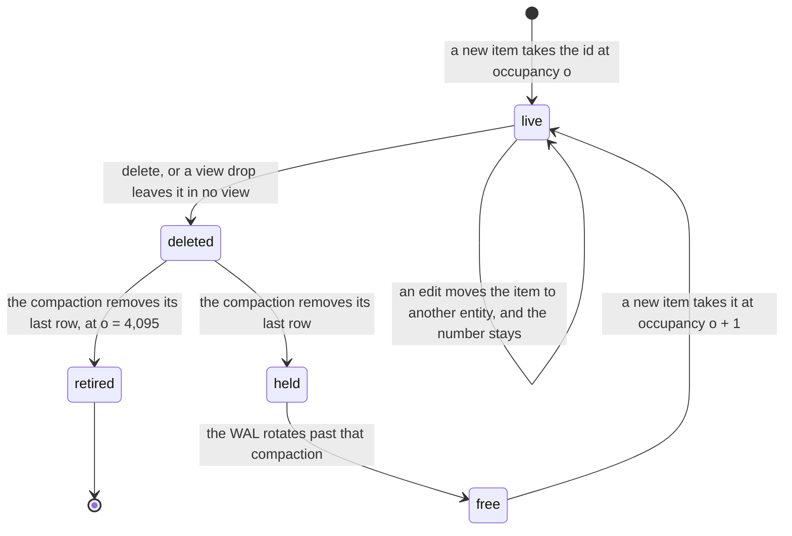
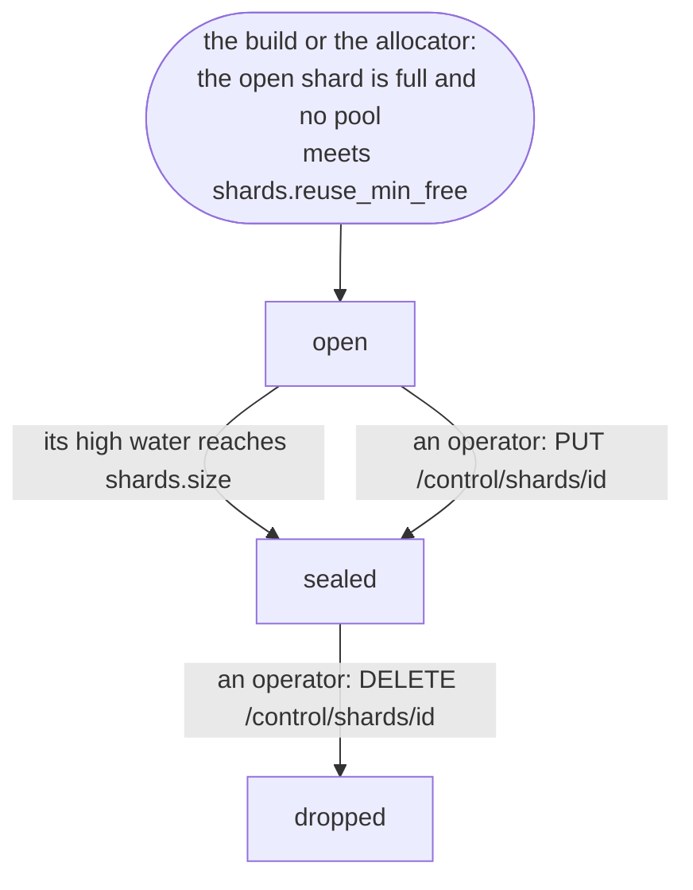
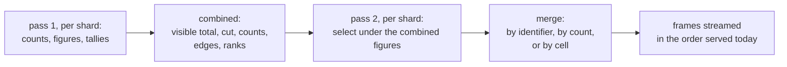
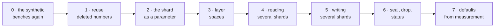

# Sharding: several entity spaces in one process

**Status:** design, 2026-10-09. Nothing in this document is built. Each section says what the code
does today and what changes.

## The limit

Every item and every artifact takes its entity id from one `u32` space per bundle
(`crates/mosaica-lifecycle/src/alloc.rs`). Items take ids upward from 0. Artifacts, and the entities
that a suppression of a whole layer names, take aligned blocks of 65,536 downward from
4,294,901,760, the highest block boundary below `u32::MAX`. The space is exhausted when the two
marks meet.

Three things fill the space faster than the corpus grows.

- A deleted item's number, the entity id it was first given and from which its `mosaica_id` is
  derived, is never issued again. Every insert therefore spends an id for good. Under a steady rate
  of deletions and inserts the space fills while the live corpus stays the same size. Only the ids
  that edits leave behind are freed ([write path](system/write-path.md#freed-entity-ids)).
- Artifact ids are never freed. A dropped layer's blocks stay below the mark.
- Each level of a layer takes at least one block of 65,536, however few artifacts it holds.

The GBIF bundle holds 3,495,729,729 items, and its high water is the same figure
(`probes/2026-10-05-serving-layers-bench/`). About 0.8 × 10⁹ ids are left for every insert it will
ever take, whatever it deletes.

Entity ids index `croaring` bitmaps, whose domain is `u32`: the term postings, the overlay, every
authorised set and every membership. Row ids index each view's row space, also `u32`. A 64-bit
Roaring bitmap is a map from the high 32 bits to 32-bit bitmaps. This design makes those high bits
explicit as a shard. Every structure and every bitmap operation stays at 32 bits, and the system
gains a unit it can seal, compact, verify and drop on its own.

The design has four parts.

1. A deleted item's number is issued again, and a count of its previous holders goes into the
   `mosaica_id`, so the space follows the live corpus (§1). This part stands on its own and is the
   first stage.
2. The corpus becomes a list of point shards in one process, each with its own entity space.
   Artifacts leave the point space for one space per layer (§2).
3. Every request is answered from every shard, and the answers are combined. §3 gives the
   combination for each route.
4. The shard size is part of the declaration, so a small corpus can run as many shards in a test
   (§2.5). §8 says how sharding's cost is measured.

## 1. Reusing a deleted item's number

### 1.1 Today

An edit moves an item to a new entity and keeps its number. The compaction that removes an
entity's rows frees the entity, unless it is an item's number. A freed id is held back until the
write-ahead log (WAL) keeps no record older than the compaction's publication. It is then issued,
lowest first, before any id from the high water. The free and held sets are one pool per bundle,
written into every side-manifest. A deleted item's number stays reserved, so that a `mosaica_id` a
client holds never comes to name another item.

### 1.2 The occupancy

Each id has an occupancy: how many items have held it as their number before. The `mosaica_id` of
an item becomes

```text
mosaica_id = FPE_k( (kind: 1) ‖ (shard: 19) ‖ (occupancy: 12) ‖ (number: 32) )
```

where `FPE_k` is the keyed Feistel permutation the bundle uses today
(`crates/mosaica-types/src/identity.rs`). Its 32-bit high half holds the shard id today, which is
0 in every bundle. The kind bit is 0 for an item and 1 for an artifact (§2.2). An item takes the
occupancy of the id it is given. Its `mosaica_id` is fixed for its life, across edits, as it is
today. When the item is deleted and its number freed, the number's next holder takes the next
occupancy and so a different `mosaica_id`.

A held `mosaica_id` therefore never names another item. A lookup inverts it to (shard, occupancy,
number) and compares the whole identifier with the one stored at the row the number leads to, as
it does today. An identifier with an occupancy below the current one fails that comparison and
answers as one that names nothing.

The occupancy has its own name because "generation" already means a published version of serving
state ([write path](system/write-path.md#generations)).

### 1.3 What frees a number

A compaction removes the rows of deleted entities. For each removed row it reads the `mosaica_id`
stored at the row and inverts it to (occupancy, number). Where no live entity holds that number
any longer, the number is freed at occupancy + 1. A removed entity that is not a number, an id an
edit moved its item onto, is freed at occupancy 0 (§1.4). The edited-items map tells the two apart,
as it does today.

An item deleted before any flush placed it has no row to read. The flush that discards its buffered
row records the number and its occupancy in the shard's side-manifest, and the next compaction frees
it from there.

The rules that keep a freed id from carrying anything of its previous holder apply to a freed number
unchanged. Its rows, term-index entries, memberships, unique values and suppression are gone before
it is freed. A generating set that named the item has been reconciled under its layer's strict or
permissive rule ([annotations](system/annotations.md#how-artifacts-change-under-writes)). The id is
held back until the WAL rotates past the compaction's publication. The test that checks this for
edit-freed ids (`freed_ids_carry_nothing`) is extended to freed numbers.

### 1.4 The pool

The pool holds one bitmap per occupancy: the ids free to be issued at that occupancy. Occupancy 0
holds ids no item has held as its number, which are the ids edits leave behind.

- A new item takes an id from the lowest occupancy, the lowest id first, before any id from the high
  water.
- An edit's new entity takes an id of occupancy 0, or one from the high water. It never takes one of
  a higher occupancy. Its rows carry its item's `mosaica_id`, so it never becomes a number, and it
  returns to occupancy 0 when freed. No record of where it came from is needed.
- A number at occupancy 4,095 is not freed. The compaction that removes its last row retires it,
  and the shard counts it.

Modelled: an id whose holder turns over every 100 days, 1% daily churn, reaches the cap in about
1,100 years, and at 10% daily churn in about 110.

Ids issued from the pool land among other signatures' runs in the term index rather than in a run of
their own, as edit-freed ids do today. Measured for edits on GeoNames (13.5 million items, rounds of
6,748 moved items): the compacted base term index was 82,866 bytes after the two rounds on new ids
and 82,674 to 82,930 bytes after the rounds on freed ones
([write path](system/write-path.md#freed-entity-ids)). The cost of deletions and inserts at a
higher churn is measured at the first stage's gate (§8.4).

### 1.5 What a client sees

A deleted item's `mosaica_id` answers as one that names nothing, as it does today, and goes on doing
so after its number is reused. A rebuild still gives every item a new `mosaica_id`. Nothing else
changes for a client.



*A number's life. Each pass round the loop gives the id's next holder a different `mosaica_id`.*

## 2. Shards and layer spaces

### 2.1 A point shard

A point shard is `ShardId(u32)`, a newtype in `mosaica-types`, from 0 to 2¹⁹ − 1. It holds:

- an entity space of `[0, 2³²)`, with its own allocator, high water, pool and retired count;
- its term postings, delta tiers and coalesced tiers, keyed by the global term ids;
- the entity-to-term transpose, the edited-items map and each unique field's index;
- attribute extents, value columns, presence bitmaps, group-scoped attribute families, record blobs
  and text;
- an overlay of deleted and suppressed entities;
- for each view: a row space, the permutation, the row-to-entity map, field tallies, term images and
  segments (positions, cut index, cell codes, rendered columns, identity bands, presence, edited
  rows and deltas);
- its slice of every artifact's membership, and that slice's row forms in each view: label and list
  columns, member bitmaps and coverings, level label copies, shape rows, its slice of each
  containment partition, and the placed part of each tile index.

A point shard is open, sealed or dropped. Exactly one point shard is open at a time.



*A point shard's states and who moves it between them.*

| State | Issues ids to new items | Issues ids to edits | Takes deletions and suppressions | Compacted |
|---|---|---|---|---|
| Open | from its pool, then its high water | from occupancy 0, then its high water | yes | yes |
| Sealed | from its pool | from occupancy 0, then its high water up to the ceiling | yes | yes |
| Dropped | no | no | no | no |

A dropped shard's number is never used again. The manifest allocates shard numbers from a monotone
counter, `next_shard_id`.

### 2.2 A layer space

Today an artifact takes its id from the top of the point space, in aligned blocks of 65,536 per
level. A layer drop keeps the layer's name tombstoned for ever and frees none of its ids. There is
no verb that replaces a layer. An artifact carries its view, and a scoped artifact carries its
view's incarnation. Dropping a view retires the artifacts scoped to it.

Under this design each registered layer has a layer space, `LayerSpace(u32)`, numbered below 2³¹
from a monotone counter, `next_layer_space`, when the layer is registered. A layer space holds:

- the layer's own entity, id 0, which a suppression of the whole layer names;
- the layer's levels, each a run of aligned blocks of 65,536 from block 1, as levels are laid out
  today;
- each artifact's record, supplied content, generating sets and edges;
- the postings of the artifacts' own access labels;
- an overlay of deleted and suppressed artifacts;
- each level's next ordinal.

A layer space has no row space. An artifact's members are points, and each point shard holds its
own slice of every artifact's membership (§2.1).

An artifact's id is never reused. A deleted artifact leaves a hole in its level's run. A view drop
retires the artifacts scoped to that view by deleting them in the space's overlay, as it does today.
Dropping a layer drops its space whole at the next publication, and the name stays tombstoned. A
layer space is rewritten in place to remove the records of deleted artifacts, keeping every id, on
its own gauges: the deleted artifacts and the size of its overlay.

An artifact's `mosaica_id` becomes

```text
mosaica_id = FPE_k( (kind: 1) ‖ (layer space: 31) ‖ (entity: 32) )
```

With artifacts gone from it, a point shard's ids run to `u32::MAX`, and the two-region allocator
and its low water are removed.

### 2.3 What stays global

One copy for the bundle: the term dictionary and the graph of conjunctions compiled from it,
declared scalars and vocabularies, the registries of attributes, views, view groups and layers with
their tombstones and view incarnations, the identity key, `CURRENT`, the manifest, the shard
records, the layer spaces' records, and `shards.size`. The WAL and the write executor stay one per
partition, and there is one partition. Sessions and the identity catalogue are outside the bundle
and unchanged.

```mermaid
flowchart TB
  subgraph G["global: one per bundle"]
    direction TB
    G1["term dictionary and the graph of conjunctions"]
    G2["registries: attributes, vocabularies,<br/>views and groups, layers"]
    G3["identity key, manifest, CURRENT,<br/>shard records, shards.size"]
  end
  subgraph P["point shard: one per opened shard"]
    direction TB
    P1["entity space, allocator, pool by occupancy"]
    P2["postings, transpose, edited items,<br/>unique indexes, attributes, records, text"]
    P3["overlay"]
    P4["per view: row space, permutation,<br/>segments, term images, field tallies"]
    P5["membership slices and their row forms"]
  end
  subgraph L["layer space: one per registered layer"]
    direction TB
    L1["the layer's entity and its levels' runs"]
    L2["records, content, generating sets, edges"]
    L3["own-label postings, overlay"]
  end
```



*What is held once per bundle, once per point shard and once per layer.*

### 2.4 Identifiers

| Identifier | Type | Names | Reaches |
|---|---|---|---|
| `RowId` | `u32` | a row in one view of one shard | disc, inside that shard |
| `EntityId` | `u64`, value below 2³² | an entity in one point shard or one layer space | disc, inside that shard or space |
| `ShardId` | `u32`, below 2¹⁹ | a point shard | disc and the manifest; the wire only inside a `mosaica_id` |
| `LayerSpace` | `u32`, below 2³¹ | a layer space | disc and the manifest; the wire only inside a `mosaica_id` |
| `ShardRow` | `u64` | shard × 2³² + row, the key of a sharded mask | neither: inside the engine only |
| `mosaica_id` | `u64` | an item or an artifact | the wire, as today |

`RowId` keeps its type and every store API that takes one also takes a `ShardId`. The compile-fail
tests gain three cases: a `ShardRow` cannot be built from an `EntityId`, nor from a `LayerSpace`,
and a `RowId` cannot be read out of a `ShardRow` without its shard.

The priority, the top 16 bits of `mosaica_id`, is unchanged. The permutation is keyed over its
whole input, so no two items in any two shards share an identity and ranks from different shards
interleave uniformly.

### 2.5 The shard size

`[shards] size` in the declaration is the number of ids a point shard issues to new items from its
high water before it seals. It is declared at a build or at a running service
(`PUT /control/shards` with `{"size": n}`), written to the WAL and the manifest, and kept across a
restart. The rule that checks it is written once, below the build and the running service. Each of
the four surfaces reaches it the way it reaches any other declaration.

Any positive integer is accepted. A test sets a size small enough that its corpus spans several
shards, down to a few dozen items, so every behaviour in this document runs on the conformance
corpora. Lowering the size seals the open shard if its high water is past the new size. Raising it
lets the open shard go on issuing ids. A sealed shard stays sealed.

The default is 2³² − 2²⁸, 4,026,531,840. A sealed shard keeps the 2²⁸ ids above it for edits of its
own items (§4.3). The default is chosen again from measurement (§8.5).

The field widths of the identity are fixed. A test reaches the occupancy cap by seeding a pool at
occupancy 4,095.

### 2.6 Bundle layout

The tree today, under one partition, is `partitions/default/` holding the side-manifest,
`terms/`, `entities/`, `attrs/`, `views/`, `coalesced/`, `members/`, `term-images/` and the derived
forms. Under this design:

```text
bundle/
  CURRENT
  v000NN/
    MANIFEST.json                          # global (below)
    dictionary/terms-<k>.dict              # global
    partitions/default/
      SEGMENTS-<n>.json                    # registries and the shard and layer-space records
      shards/<shard>/
        SEGMENTS-<n>.json                  # segments, extents, overlay, pool, watermark, levels
        terms/postings.arrow               # term ids global
        entities/terms/                    # entity-to-term transpose
        entities/edited/{by_number,by_entity}/
        entities/unique/<attr>/            # with its key filter
        attrs/<col>/…  attrs/record/…
        coalesced/<id>/…
        members/members-<n>-<i>.tsmb       # this shard's slice of every membership
        term-images/…
        views/<view> | views/<group>/<key>/
          permutation.bin  row-entity.u32  field-tallies.bin
          segments/<seg>/{morton.u32, cuts.u32, cell-codes.u32, columns.arrow, bands.bin, …}
        row-column/  row-members/  labels/  band-labels/  shape-rows/  shape-held/
        containment/  tile-index/
      layers/<layer space>/
        SEGMENTS-<n>.json                  # overlay, level runs and next ordinals
        records/…  terms/postings.arrow  edges/…
```

| Manifest field | Change |
|---|---|
| `identity.shard_id` | removed: the shard is in each `mosaica_id`'s own input |
| `entity_id_high_water`, `entity_id_low_water` | removed: each shard's high water is in its record, and there is no low water |
| `shards` | new: one record per point shard: number, state, high water, pool size, retired count, when it opened and sealed |
| `next_shard_id`, `next_layer_space` | new: monotone counters |
| `shards.size` | new |
| `layers[].space` | new: the layer's space |
| `files` | the same shape, covering every shard's files |

`bundle_format` is bumped, and bundles are rebuilt.

## 3. Combining per-shard answers

### 3.1 The rules

- A request's work over its tiles is one call per shard over the request's sorted ranges, as
  `tile_ranges_all` is one call per segment today. Nothing is invoked once per (tile, shard).
- Every shard is read, including one in which the viewer can see nothing (§6).
- A figure that decides what is served is summed or merged across every shard before any shard
  selects anything. Such figures are the viewer's visible total over the view, an artifact's count,
  a histogram's edges and a group's rank. No density rule, quota or rank is applied within one
  shard.
- No per-shard figure reaches a response.

### 3.2 The mask

| | Today | Becomes |
|---|---|---|
| the session's projection | one `RowProjection` per (token, view, pin) | one per (fragment, view, shard), shared by every session with the same grant, as a level's figures are |
| the projection's route | whole domain, walk, term images and residual, or complement, priced per grant | the same, priced per shard |
| the composed mask | one `croaring::Bitmap` over the view's row space | `ShardedMask`: one leaf per shard, sorted by shard |
| `minus` and `plus` | bitmaps over the view | per shard |
| the deny mask | per view | per (view, shard) |
| filter rows | per request | per shard |

`ShardedMask` has `count_ranges(shard, &[Range<u32>]) -> Vec<u64>`, which takes a request's ranges
in row order and ranks their endpoints in one call to CRoaring's `roaring_bitmap_rank_many`, a walk
of the leaf's containers with a running rank. The sweep calls it once per shard in place of two
`count_range` calls per part. Every other operation, `rows_in_range`, `for_each_run`, `contains`
and the leaf-wise `and`, `or` and `andnot`, takes a shard. A leaf stays a `croaring` bitmap.

Measured on a synthetic 2³⁰-row universe, one thread, a 4-core host
(`probes/2026-10-09-shard-read-costs/`): today's count of a 3,000-tile contiguous request at depth
10 and 10% coverage takes 8.0 ms at one shard and 875 ms at 100, because each range's count takes
two ranks, each a popcount from its container's start, whatever the range's length.
`count_ranges` takes 0.38 ms at one shard and 8.5 ms at 100. It gains only where a request's ranges
share containers. On tiles scattered at random it is still 29 to 69 times its one-shard cost at
N = 100.

Selection then sets what N costs. It reads each part's visible rows and merges the parts'
identities, and pays a fixed cost per part, so its cost grows with N times tiles where a tile holds
few visible rows. Counting and selecting together, a request at N = 8 costs 0.7 to 1.6 times
today's single shard at 10% coverage and above, and 1.9 to 8.1 times for a viewer of 0.1% or 1% at
depth 8 and deeper, 0.3 to 55 ms. At N = 100 the same figures reach 10 and 64 times. Selection
is therefore batched per shard as the count is: one cursor walk of a leaf over the request's ranges
in row order, feeding the merge of the shard's parts. Not measured yet.

Leaving out the parts of a tile with no visible row takes most of N's cost off a narrow viewer.
Measured with the count batched, a viewer of 0.1% or 1% at depth 8 and deeper pays 1.2 to 3.1 times
today's single shard at N = 8 and 5 to 12 times at N = 100, against up to 57 times without; a
viewer of 10% or more changes little (`probes/2026-10-09-shard-read-costs/`, Table 6). Selection
leaves them out. Which parts are empty depends on where the viewer's items sit, which under reuse
depends on other viewers' deletions; §6 accepts the timing difference that adds.

`rows_in_range`, the
materialised `leaf ∩ range` that selection reads while the overlay holds denies, grows worst: 18 ms
at one shard to 965 ms at 100 at depth 6 and 50% coverage, so the same batching applies to it.

### 3.3 Two passes

A request that needs a combined figure runs in two passes over the shards. The first sums what the
rules need. The second selects with the combined figure and the shards' answers are merged. One
process holds every shard, so a pass is a set of function calls over shared memory.



*A request over several shards. A route that needs no combined figure skips the first pass.*

Most first-pass figures are held already: a level's figures and a field's tallies are cached per
grant and corrected per request, and a tile's counts come from the same `count_ranges` call the
response sends.

### 3.4 Route by route

| Route and figure | Each shard | Combined by |
|---|---|---|
| viewport counts: visible, matched, highlighted, and sub-cell density | `count_ranges` over the request's ranges | sum |
| viewport points, threshold and cap | the visible items in the tile below the combined cut, ascending by `mosaica_id`, at most the cap | merge by `mosaica_id`, cut at the cap |
| viewport points, floor | its `m` smallest visible identities in the tile | merge, keep `m` |
| identity bands | the band each shard reads is chosen from the combined cut and that shard's tile count | inside the two rows above |
| a point's artifact tag in each layer | read from that shard's level column | none: whether the artifact is served comes from its combined figures |
| artifacts of each tile | candidates from that shard's coverings, labels above the base or tile index, each tested for a visible member in the tile | union, one entry per artifact, ordered by combined count then `mosaica_id`, cut to `per_tile` |
| a level's figures: count, centroid, box | F per (grant, shard), D per (shard, deny version), T per (session, shard) | counts and position sums add; each side of the box is the extreme across shards of each shard's first kept extreme row that D does not hold, or of a walk of that shard where D holds all eight |
| a `nested` or `dag` cut | counts in the cut's tiles | summed, then cut once |
| membership requirement | visible members of the artifact | summed, against the declared total held in the layer space |
| generating-set containment | `G_s ⊆ visible_s` | true where every shard in which `G` has members says so |
| colour slots | none | computed from the combined figures and centres, as today |
| aggregate: values, artifacts, cells | counts | summed; `top` chosen after the sum |
| aggregate: bins | counts under the combined edges | summed |
| aggregate: sampled bins | counts below the cut set from the combined set size, read from the band or by scan as that shard's figures price it | summed, then scaled |
| a field's figures | tallies of the admitted key lists; D per deny version | count, sum and no-value add; the smallest and largest are each shard's first kept value D does not hold, or a walk of that shard, then the extreme across shards |
| category listing and suggest | which values a visible item carries, and counts | union of presence; counts summed |
| item and artifact cards | none | dispatched to the shard or layer space the `mosaica_id` inverts to |
| bulk items in map order | rows in (cell, `mosaica_id`) order | merge in that order; the cursor is unchanged |
| bulk items in stored order | rows in entity order | shard by shard; the cursor gains the shard |
| bulk artifacts, browse | none per artifact | counts from the combined figures |
| filters | every leaf, inside that shard's mask; `eq` and `in` on a unique field read each shard's index after its key filter; `member_of` reads that shard's slice | per shard: a filter only narrows that shard's visible rows |
| `/v1/meta` totals | counts | summed |

Each row gives the same answer as one shard holding the same items. That is what the conformance
suite's second mode checks (§7).

### 3.5 Order and streaming

A tile's points are sent in ascending `mosaica_id` order today, and a response that stops early
holds a prefix of each tile's answer. The merge in pass 2 emits in that order, so the prefix rule
holds unchanged. A bulk read in map order merges every shard's segments by (cell, `mosaica_id`), as
it merges one view's segments today, and its cursor holds the same value. The compute permit is
released after the counts frame, as today, which is after pass 1.

### 3.6 Caches

| Cache | Key today | Key under shards |
|---|---|---|
| fragment | bundle identity, rule hash, watermark, satisfied terms | the shard's identity, rule hash, the shard's watermark, satisfied terms |
| row projection | token, view, segments version, prefix | fragment, view, shard, the shard's segments version |
| a level's figures, F | terms, bundle identity, view, layer, level, column, geometry | the same with the shard and the shard's identity, on disc per shard |
| D correction | view, deny version | view, shard, the shard's deny version |
| term images | partition, view | shard, view |
| field tallies | view | shard, view |

A shard's identity changes at that shard's compaction and at no other. A compaction of one shard
therefore invalidates only that shard's fragments, projections and figures. The background refresh
runs per (session, view, shard), so a flush into one shard extends only that shard's projections.

A level's figures summed across shards are also kept per grant. A change to one shard's figures
updates the sum by that shard's difference. Summing every shard's count vector costs about 0.8 ms
per shard at a million artifacts, measured: 2% of a 50% viewer's walk of the level at N = 100, and
nearly as much as the whole walk of a 0.1% viewer (`probes/2026-10-09-shard-read-costs/`).

### 3.7 A session's cost

A session's first request builds a projection per shard by today's four routes, each priced for its
shard. One mask over 10⁸ entities projected through N permutations, against one, took 0.76 to 1.28
times as long at N = 8, 32 and 100, and eight leaves per session took 1.09 times the memory of one
(`probes/2026-10-09-shard-read-costs/`). The cost per row of a projection was flat from 10⁸ to
4×10⁸ entities on a 12-core host and rose from 2.7 to 5.2 ns at 25% coverage on a 4-core one, so
whether a shard of 2³² entities projects in proportion to its size is measured on the deployment's
hardware. The cost model for a dense session at 10¹¹ items, 25 GB a view and 140 s of CPU at first
touch, was made before term images existed. It is re-measured (§8.2).

## 4. The write path

### 4.1 Where a new item goes

The allocation target for new items is chosen at each commit window.

1. The point shard with the largest pool, where that pool holds at least
   `shards.reuse_min_free` ids.
2. Otherwise the open shard: its pool, then its high water.
3. When the open shard's high water reaches `shards.size`, it seals. When a window still has rows
   to place and no pool meets the threshold, the next shard opens.

Within a target the window's rows are sorted by signature, as today, and take ids lowest occupancy
first, lowest id first. A window can straddle a change of target, and each row records the shard it
landed in. A corpus whose live size is steady opens no shard, so the number of shards is about the
live count over `shards.size`.

Handing pool ids out in runs, so that a window's items stay together where contiguous space
remains, is not part of this design. It is decided from the churn measurement (§8.4).

### 4.2 Resolving a batch

A row's `mosaica_id` inverts to its shard, occupancy and number. A unique value is looked up in
every shard. Each shard holds a key filter beside each unique index, about 10 bits per value,
rebuilt at the shard's compaction. A lookup probes every filter and searches only the shards that
answer. The executor's in-memory record of the unique values recent flushes moved to disc stays one
record across shards. A value held in any shard refuses a new item that sets it, as it does in one
space today.

Each WAL row records its shard and, for a new item, its occupancy. Replay rebuilds each shard's
allocator, pool and held sets from that shard's side-manifest and the records naming it.

### 4.3 Edits stay in their item's shard

An edit takes its new entity in the shard that holds the item's number: an id of occupancy 0 from
that shard's pool, or one from its high water, which for a sealed shard may run past `shards.size`
up to the entity ceiling. The edited-items map, the item's memberships and the generating sets it
joins therefore stay inside one shard. Where the shard has no such id, the edit is refused with the
shard's figures, as an exhausted allocator refuses today, and the shard's next compaction frees the
ids its earlier edits left.

The alternative is to place an edit's new entity in the allocation target and let the edited-items
map name another shard. A number and its entity would then sit in different shards, and every
shard's compaction would need the other shards' deletions to decide whether a number is free.

### 4.4 Denies

`/control/changes` inverts each identifier to (shard, number), and through that shard's
edited-items map to the entity that holds the number now, or to (layer space, entity). It applies
the change to that shard's or that space's overlay. The two removal rules hold per shard. A
deletion leaves the overlay at the compaction of its own shard that removes its rows. A suppression
leaves it when it is lifted, or at the compaction that removes the entity it names. An item's
suppression continues on its current entity. Dropping a shard or a layer removes everything it
holds.

### 4.5 Flush and merge

A flush writes a segment in each view of each shard with buffered rows, and publishes them in one
swap. A merge combines segments of one view of one shard and never crosses shards. A session's
projection is rebased for the shard and the span the merge moved.

### 4.6 Compaction

Compaction runs on one point shard at a time. The trigger picks the shard with the most to
reclaim, measured by today's gauges per shard, with the deletion gauge as a fraction of the shard's
rows. The passes are today's (the code calls the operation a fold), run over that shard's files:
row space, postings, term images, unique indexes, edited items, attributes, entity terms, field
tallies, then the membership slices and derived forms at publication. The memory pre-flight charges
the shard's own entity bound. The new prefix hard-links every other shard's directory whole.

A compaction frees ids into its shard's pool (§1.3). It reconciles every generating set, in every
layer space, that names a removed entity of the shard. When a shard seals, one closing compaction
runs if any gauge is above zero. A sealed shard then stays unchanged on disc until an edit, a
deletion, a suppression or a new item from its pool lands in it.

A layer space is rewritten on its own gauges, separately from point shards (§2.2).

Splitting a compaction into a tier that removes rows and a tier that rewrites entity structures, and
running several compactions at once, are left until a per-shard compaction has been measured
(§8.3).

### 4.7 Layers and memberships

A membership's member resolves to (shard, entity) and lands in that shard's slice. A publication or
a growth writes each shard's slice and that shard's row forms for the level, and publishes them in
one swap. A membership-only ingest row joins its item to the artifact in the item's shard. Each
level's figures are kept per shard (§3.6).

### 4.8 Views

Creating a view of a group creates it in every shard. An item added to a view in place gets its row
in its own shard. Dropping a view deletes, in each shard, the items it leaves in no view, and
retires the artifacts scoped to it. A new layout is built in every shard and published in one swap.
Two shards are never served in two layouts.

### 4.9 Seal, drop and status

`PUT /control/shards/{id}` with `{"state": "sealed"}` seals a shard at once. A sealed shard's pool
is used without an operator's action, and there is no verb to reopen one. `DELETE
/control/shards/{id}` is refused for the open shard. Otherwise the next publication removes the
shard's directory and retires its number, and every identifier it issued answers as one naming
nothing.

`/control/status` gains one record per shard: number, state, whether it is the allocation target,
live rows, high water, ids left, pool size by occupancy, retired count, overlay sizes, segments,
and its last compaction's duration and peak memory. Its totals become sums. Each of the four
surfaces reaches seal, drop and the shard list.

### 4.10 Recovery and verification

The WAL stays one file per partition. Publication writes every directory before the one change to
`CURRENT`, and a failure before it leaves directories the startup sweep removes, as today.

Opening a bundle verifies each shard's digests in parallel. A shard whose digest fails refuses the
bundle, naming the shard and the file. Serving the other shards would lower every count with
nothing a viewer could see. A sealed shard with an empty pool and no deletions is unchanged on disc,
so its verification is recorded and not repeated at the next open.

## 5. Build

A build is an ingest into an empty database. Items are numbered in signature batches ordered by the
`allocation_view`, as today. When shard 0 has issued `shards.size` ids, shard 1 opens, and so on in
allocation order. The layout is fitted once over the corpus, since an item's coordinates do not
depend on its shard. Each shard's view is sorted on its own. A corpus smaller than `shards.size`
builds today's bundle, apart from the directory layout and the manifest.

## 6. Security

- Nothing per shard reaches the viewer plane. The geometry stamp stays one digest of the prefix. The
  byte scanner in conformance checks that no entity id, shard number, layer-space number or
  per-shard count is on the wire.
- The kind, the shard, the occupancy and the layer space sit inside the keyed permutation. A viewer
  cannot read them, order identifiers by them or count gaps between them. The permutation is a
  blinding, not encryption, and a holder of the bundle inverts it, as today.
- Every shard is read for every request, including a shard whose leaf is empty for the viewer. New
  items reuse ids in the shards other viewers' deletions emptied, so work that skipped such shards
  would vary with other viewers' deletions. A fragment-cache hit is per shard, a finer sample of the
  cache's existing timing channel.
- Selection leaves out a tile's parts with no visible row (§3.2). Today's sweep skips a tile with
  no visible row, whose count the response serves. A part's emptiness is not served, and under
  reuse it depends on other viewers' deletions. The skip saves a seek and a merge entry per empty
  part, about 0.1 µs measured, which is the size of the timing difference it adds. That difference
  is accepted.
- An identifier that inverts to a dropped shard or layer space takes the same lookups as one naming
  an item the viewer may not see.
- A reused number carries nothing of its previous holder (§1.3), and its previous `mosaica_id` never
  names the new item (§1.2).
- A bulk read in stored order walks shards in number order. Stored order already follows the order
  items were numbered in.
- The removal rules for deletions and suppressions hold per shard (§4.4).

## 7. Tests

The conformance suite runs in two modes: with the default shard size, and with a size small enough
that every corpus spans several shards. Every assertion it makes today holds in both. The
identifiers differ between the modes, as they differ between two builds, and so do the samples
drawn by rank. The oracle reads each item's shard and occupancy from the bundle, as it reads the
shard id and entity ids today, reproduces every identifier, and checks each sample against its own
selection over them.

Fixtures beyond that:

| Fixture | Checks |
|---|---|
| reuse | a deleted item's number is issued again at the next occupancy; the old `mosaica_id` answers as naming nothing on every route; the new item carries nothing of the old, in any home, across a flush, merge, compaction and restart |
| cap | a number at occupancy 4,095 is retired by the compaction that removes it and never issued again |
| sealed shard | takes edits, deletions and suppressions; the removal rules hold per shard; an edit's new entity stays in the shard |
| allocation | new items go to the largest pool above the threshold; a steady churn opens no shard |
| unique across shards | a value held in one shard refuses a new item setting it in another |
| build equals ingest | `build_equals_ingest.rs` across a shard boundary |
| restart | `shards.size`, pools, held sets and occupancies survive a restart |
| dropped shard | counts fall by its contribution; its identifiers answer as naming nothing; its number is not reused |
| corrupt shard | a bundle with a corrupted file in one shard refuses at open, naming the shard |
| layer drop | its space is removed at the next publication; its artifacts' identifiers answer as naming nothing; its number is not reused |
| byte scanner | no entity id, shard number, layer-space number or per-shard count on the wire |

## 8. Measuring what sharding costs

### 8.1 Before any code

`mosaica-bench` keeps three synthetic benches: `epoch_shard_treemap_mask`, `epoch_shard_projection`
and `epoch_shard_tile_index`. The first two ran again on main, with the mask bench extended, and
their results are in `probes/2026-10-09-shard-read-costs/`, on a 4-core host.

- `count_ranges`, a range-local count and a contiguous-viewport layout were added to the mask
  bench and measured at 256 and 3,000 tiles, N = 1, 8, 32 and 100, coverage 0.1% to 50% (§3.2).
- The pass 2 merge is the bench's select column: `Selection::of` over a tile's N parts, the m
  smallest identities across them (§3.2).
- A level's figures walk at N against N = 1, with the sum of the shards' counts timed apart
  (§3.6).
- Projection per shard against one projection (§3.7).

Three things are left before code:

1. `epoch_shard_tile_index` on the MedCPT and PaperSeek bundles, on a host that holds them.
2. The mask bench again on the 12-core host, so its figures sit beside the 2026-09-04 ones.
3. Selection batched per shard, added to the mask bench and measured the same way.

### 8.2 One corpus at several shard sizes

Once several shards can be read (stage 4, §10), each corpus is built at sizes that give these shard
counts:

| Corpus | Items | Shard counts |
|---|---|---|
| GeoNames | 13.5 million | 1, 2, 8, 32, 128 |
| Tree of Life | 233 million | 1, 4, 16 |
| GBIF | 3.5 billion | 1, 4, 14 (a size of 2²⁸) |

Each bundle runs the interactive bench (`test_corpora/common/interactive_bench.py`) and the serve
battery (`test_corpora/common/serve_battery.py`) under the 24 GiB memory cap, cold and over a kept
cache. They give, for principals seeing about 1%, 7%, 85% and 100%:

- authorise, and the first counts, first points and settled times of a new session;
- the camera script's per-step times, the points and the artifacts of each tile;
- item card and unique `eq` lookups;
- first fills of each level's figures;
- the aggregate's cells, bins, sampled bins and field summary;
- a bulk read in each order;
- time to `/readyz` and peak anonymous memory.

Each figure is reported as its ratio to one shard. A request with nothing to combine should show a
ratio near 1 at every N. Where one does not, the extra work is removed before anything is added.

### 8.3 The write side

At the same sizes, once several shards can be written (stage 5): build time and peak memory, ingest
rate, flush time, the time and peak memory of one shard's compaction against the whole corpus's,
restart replay, and `verify`. The compaction figures decide whether a compaction needs splitting
into tiers or running several at once. Today's evidence for its cost is one MedCPT compaction of
330 s over 36 million items, of which 48.1% was artifact structures
(`probes/2026-09-04-epoch-shard-fold-decomposition/`), and one Tree of Life compaction of 1,313 s
over 233 million items in two views, after its 50% ingest cell
([ingest campaign](ingest-campaign.md)). Both predate label columns, figures and term images.

### 8.4 Churn

The ingest cycle's write cycle (`test_corpora/common/ingest_cycle`) deletes and re-ingests 1,000
items. It gains a churn mode: ten rounds that each delete half the corpus, insert it again as new
items and compact, on GeoNames and Tree of Life, at one shard and at several. Per round:
the high water, which must stop rising once ids are reused; posting bytes and union cost against a
fresh build of the same items; compaction time; and viewport latency. This is the gate for stage 1
on one shard, and it decides whether pool ids need handing out in runs (§4.1).

### 8.5 What the measurements decide

- `shards.size`: the default stays near the ceiling unless a smaller shard measures cheaper per
  request, per compaction or per restart. The read path favours fewer shards: every operation on
  the mask pays a fixed cost per part (§3.2).
- `shards.reuse_min_free` and handing pool ids out in runs.
- Compaction tiers and concurrent compactions.
- The key filter's bits per value.

## 9. Evidence

| Figure | Class | Source |
|---|---|---|
| GBIF: 3,495,729,729 items at a high water of 3,495,729,729 | measured | `probes/2026-10-05-serving-layers-bench/` |
| one level's figures fill on GBIF, 0.24 s to 12.5 s by coverage and level | measured | [serving](system/serving.md#a-levels-figures), `probes/2026-10-06-first-open-fills/` |
| edit-freed ids stop the high water rising after two rounds on GeoNames | measured | [write path](system/write-path.md#freed-entity-ids) |
| counting a 256-tile request at depth 12, 50% coverage: 0.49 ms at N = 1, 4.5 ms at N = 8 | measured, synthetic, one thread, before term images | `probes/2026-09-04-epoch-shard-treemap-mask/` |
| counting a 3,000-tile contiguous request at depth 10, 10% coverage: 8.0 ms today and 0.38 ms with `count_ranges` at N = 1; 875 ms and 8.5 ms at N = 100 | measured, synthetic, one thread, 4 cores | `probes/2026-10-09-shard-read-costs/` |
| counting and selecting together at N = 8: 0.7 to 1.6 times today's single shard at 10% coverage and above; 1.9 to 8.1 times at 0.1% and 1%, depth 8 and deeper | measured, synthetic, one thread, 4 cores | `probes/2026-10-09-shard-read-costs/` |
| with a tile's empty parts also left out of selection, at depth 8 and deeper: 1.2 to 3.1 times at 0.1% and 1% at N = 8, 5 to 12 times at N = 100 | measured, synthetic, one thread, 4 cores | `probes/2026-10-09-shard-read-costs/`, Table 6 |
| a level's figures walk and sum over 1,000,000 artifacts at N = 100: 1.05 times N = 1 at 50% coverage, 3.4 times at 0.1% | measured, synthetic, one thread, 4 cores | `probes/2026-10-09-shard-read-costs/` |
| one mask projected through N = 8, 32 or 100 permutations: 0.76 to 1.28 times one; per-row cost from 10⁸ to 4×10⁸ rows rose 1.9 times at 25% coverage on a 4-core host | measured, synthetic, one thread | `probes/2026-10-09-shard-read-costs/` |
| a per-shard tile index alone is 6 to 8.8 times the bytes at N = 8 | measured, before label columns served most levels | `probes/2026-09-04-epoch-shard-tile-index/` |
| projection is linear in rows from 10⁸; eight leaves cost 1.10 times the memory and 1.4 times the time of one | measured, synthetic, before term images | `probes/2026-09-04-epoch-shard-projection/` |
| a compaction of MedCPT, 36 million items: 330 s, of which 1.5% corpus-wide, 50.5% per row, 48.1% artifact structures | measured, once | `probes/2026-09-04-epoch-shard-fold-decomposition/` |
| a compaction of Tree of Life after its 50% ingest cell: 1,313 s | measured, once | [ingest campaign](ingest-campaign.md) |
| a compaction of a shard of 2³² items in two views: about 6.7 hours | modelled, linear in items from the Tree of Life run | this document |
| an id reaches the occupancy cap in about 1,100 years at 1% daily churn, 110 at 10% | modelled | §1.4 |
| capacity: 2¹⁹ shards of about 2³² ids, about 2 × 10¹⁵ items | modelled | §2.1, §2.5 |
| a session's visible set grows more slowly than the corpus | assumed; to be confirmed before any figure above 2³² items is promised | n/a |
| selection batched per shard; the tile index on today's levels; every route at N on a built bundle; churn locality; the key filter; compaction per shard | not measured | §8 |

## 10. Stages

Each stage merges on its own. A one-shard bundle serves the same counts after each one.



*The stages. Stage 1 is useful without the rest: it stops churn filling today's one space.*

Between stages 4 and 5 a build can write several shards and a running service cannot open one. An
insert that would open a shard is refused there, with a message naming the size and the shard, and
the refusal is removed at stage 5.

| Stage | What it does | Gate |
|---|---|---|
| 0 | §8.1; `count_ranges` in today's engine. Built for the density underlay's and the aggregate's cells, which are 1.4 to 10 times faster for a viewer who sees most of the map (`probes/2026-10-10-batched-cell-counts/`). Not built yet: the sweep's tile counts, which count one range at a time, where the bench counts a contiguous request 2.5 to 50 times faster at one shard | figures recorded in a probe |
| 1 | the identity input gains the kind bit, the shard field and the occupancy, in the engine and in the oracle's own derivation and its vectors; the pool keeps a bitmap per occupancy; a compaction frees a deleted item's number at the next occupancy and retires one at the cap; format bump | reuse and cap fixtures; §8.4 on one shard |
| 2 | `ShardId`; every per-entity and per-view structure moves under `shards/0/`; the manifest and side-manifest split; `shards.size` declared and recorded, and a size that would open a second shard refused on both paths; the compile-fail tests | the whole suite on rebuilt bundles |
| 3 | layer spaces: artifact records, own-label postings and overlay move out of the point space; the two-region allocator and its low water go; artifact identifiers take the kind bit | layer drop fixture; byte scanner extended |
| 4 | `ShardedMask`; every route combined as §3.4 says; caches keyed per shard; projections shared by grant; a build writes several shards past `shards.size` | the conformance suite's read tests in both modes; §8.2 |
| 5 | per-shard allocation, pool and target; edits in their shard; flush, merge and compaction per shard; ingest opens shards; key filters; layer publication per shard | the whole conformance suite in both modes; sealed shard, allocation, unique, build-equals-ingest and restart fixtures; §8.3 and §8.4 at several shards |
| 6 | seal, drop, status on all four surfaces; refuse at open; parallel verification and its record | dropped and corrupt shard fixtures |
| 7 | §8.5 | the defaults written into the declaration's reference |

## 11. What this does not settle

- Spreading shards across machines. The choice between shards by insertion order and shards by
  Morton range is made when a corpus needs more than one machine.
- More than one open shard, for example one per data source.
- The thresholds and widths §8.5 lists.
- A per-session memory budget below a materialised mask.
- What a re-layout costs beyond one publication.
