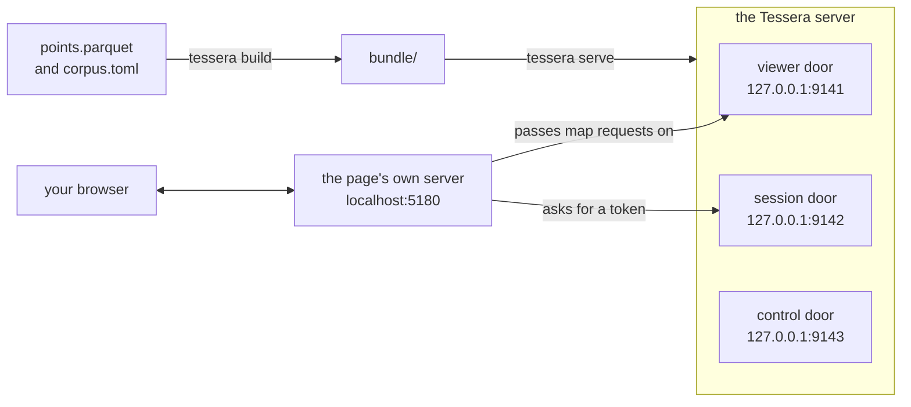

# Your first map from files

This tutorial is for someone who has never used Tessera. We'll take the 29,935 places GeoNames
lists for Ireland, from 12,159 towns and villages to 3,970 hills and mountains and 3,241 lakes and
rivers, and turn them into a map in your browser that you can search by name and filter by kind of
place and by population.

Along the way you'll meet the pieces every Tessera deployment is made of, and see how they fit
together: a declaration that describes your data, a build that turns the data into a bundle, a
server with three separate doors, and the tokens that decide what each viewer is allowed to see.
Everyone who opens our map may see every place. In a later tutorial the same mechanism shows two
viewers two different maps, so we'll look at it closely even though here it lets everyone see
everything.

Allow half an hour. The commands take about three minutes to run, two of them compiling Tessera.
You need Rust (installed with rustup), `git`, `curl`, `unzip`, `openssl`, Python 3, Node.js with
npm, and a web browser. The commands below were run on Linux with Rust 1.97, Python 3.12 and
Node 22.

## What we'll do

There are six stages, and each one leaves something you can look at.

1. **Build Tessera.** One program, `tessera`, does all the server-side work: it checks a
   declaration, builds a bundle and serves it.
2. **Get the data.** We download the GeoNames file for Ireland, a plain text file, and convert it
   to Parquet, the format the build reads.
3. **Describe it.** We write two short files: a declaration saying what the data is, and a
   deployment file saying where things go. `tessera check` reads them back to us before anything
   is built.
4. **Build the bundle.** `tessera build` reads every row and writes a bundle, the directory the
   server opens. Here we'll meet a place GeoNames has put in the wrong country.
5. **Serve it.** `tessera serve` opens its three doors, and we knock on one by hand to see how a
   viewer gets a token.
6. **Open the map.** A small example web page gets a token for you and draws the map, and we filter
   it.

When we're done, the pieces will be connected like this:



*Your browser talks only to the page's server, which holds the key to the session door. The
control door takes changes to the data; this tutorial doesn't use it.*

## Build Tessera

We build Tessera from its source code. Clone the repository and install the `tessera` program from
it:

```bash
git clone https://github.com/jennis0/tesseradb ~/tesseradb
cd ~/tesseradb
cargo install --path crates/tessera-cli
```

```
...
    Finished `release` profile [optimized] target(s) in 1m 56s
...
```

That took two minutes on a 12-core machine. Cargo copies the finished program to `~/.cargo/bin`,
which rustup put on your `PATH`, so you can run it from anywhere. Ask it what it is:

```bash
tessera --version
```

```
tessera 310920847827ba735cd8e953c898784853e84291
```

The long number is the commit your copy was built from, so yours will differ.

## Get the data

GeoNames is a free gazetteer of the world's place names, and it publishes a file for each country.
Make a directory for the project and download Ireland's:

```bash
mkdir ~/ireland && cd ~/ireland
curl -sO https://download.geonames.org/export/dump/IE.zip
unzip IE.zip
```

```
Archive:  IE.zip
  inflating: readme.txt              
  inflating: IE.txt                  
```

`IE.txt` holds one place per line, in 19 columns separated by tabs, with no header row;
`readme.txt` says what each column is. Look at the first line:

```bash
head -n 1 IE.txt
```

```
2635367	Tullyrossmearan	Tullyrossmearan	Tullyrosmearn,Tullyrossmearan	54.33333	-7.98333	P	PPL	IE	GB	C	14			0		53	Europe/Dublin	2015-05-15
```

That's Tullyrossmearan, in County Leitrim. Reading along: its GeoNames id, its name twice (the
second in plain ASCII), other spellings, its latitude and longitude, the letter `P` for a populated
place, and further along a population of `0`. A population of 0 means GeoNames has no figure,
which is true of most places, rivers and hills included: only 1,119 of the 29,935 have one. That
will matter when we filter by population.

We'll keep six of the 19 columns: the id, the name, the latitude and longitude, the class of place
and the population.

## Convert it to Parquet

Tessera's build reads Parquet, a file format for tables. A Parquet file stores each column together
and records every column's name and type in the file itself, so a program can learn what columns a
file holds without reading a single row. `tessera check` relies on that, as we'll see.

We'll convert the file with pyarrow, the Python library for Arrow and Parquet. Make a Python
environment with pyarrow in it:

```bash
python3 -m venv .venv
.venv/bin/pip install pyarrow
```

Save the following as `convert.py`:

```{.python notest}
import pyarrow as pa
import pyarrow.csv as csv
import pyarrow.parquet as pq

columns = [
    "geonameid", "name", "asciiname", "alternatenames", "latitude", "longitude",
    "feature_class", "feature_code", "country_code", "cc2", "admin1_code",
    "admin2_code", "admin3_code", "admin4_code", "population", "elevation", "dem",
    "timezone", "modification_date",
]

table = csv.read_csv(
    "IE.txt",
    read_options=csv.ReadOptions(column_names=columns),
    parse_options=csv.ParseOptions(delimiter="\t", quote_char=False),
    convert_options=csv.ConvertOptions(
        column_types={"geonameid": pa.uint64(), "population": pa.int64()},
    ),
)

points = pa.table({
    "entity_id": table["geonameid"],
    "lon": table["longitude"],
    "lat": table["latitude"],
    "name": table["name"],
    "feature_class": table["feature_class"],
    "population": table["population"],
})
pq.write_table(points, "points.parquet")
print(f"wrote {points.num_rows} places to points.parquet")
```

The script names the 19 columns in the order `readme.txt` lists them, since the file has no header.
GeoNames doesn't put quotes round its fields, so the script tells pyarrow not to look for any, and
it reads the id and the population as whole numbers. Then it writes six columns, under the names
Tessera looks for:

- `entity_id` tells the rows apart. Tessera needs one value per row that no other row shares, and
  looks for it in a column of this name. GeoNames already gives every place a unique id, so we use
  that.
- `lon` and `lat` are the place's position, in degrees of longitude and latitude.
- `name`, `feature_class` and `population` are the three things we want to see, search and filter.

Run it:

```bash
.venv/bin/python convert.py
```

```
wrote 29935 places to points.parquet
```

Every line of `IE.txt` became a row.

## Describe the data

Now we tell Tessera what the data is. That's the job of the declaration: a file, written in TOML,
that names the files to read, says how to put each row on a map, lists the columns to keep and what
kind of value each holds, and says who may see what. Save this as `corpus.toml` beside
`points.parquet`:

```toml
[sources]
points = "points.parquet"

[defaults]
source = "points"

[[view]]
name             = "ireland"
projection       = "web_mercator"
extent           = { lon = [-11.0, -5.0], lat = [51.0, 55.5] }
point_visibility = { default = "public" }

[[vocabulary]]
name       = "feature_class"
width      = "u8"
value_set  = "closed"
visibility = "public"
values     = ["A", "H", "L", "P", "R", "S", "T", "U", "V"]

[[attribute]]
name  = "name"
type  = "text"
index = true

[[attribute]]
name       = "feature_class"
type       = "category"
vocabulary = "feature_class"
render     = true

[[attribute]]
name   = "population"
type   = "i64"
render = true
```

We'll take it a block at a time.

**The sources.** `[sources]` gives each file a short name that the rest of the declaration uses,
with its path relative to `corpus.toml`. `[defaults]` says that every block below reads from
`points` unless it names another source. We have one file, so everything reads it.

**The view.** A [view](../system/data-model.md#views-and-view-groups) is one way of laying the
places out: a projection that turns each place's longitude and latitude into a position on a flat
map, and the part of that map it covers. One set of places can have several views, a geographic
map and an embedding of the same documents, say, and a viewer can switch between them. We need
one, and call it `ireland`.

`web_mercator` is the projection nearly every web map uses. It keeps shapes true and stretches
areas more the further they are from the equator. The `extent` is the area the view covers, as a
range of longitude and a range of latitude in degrees; ours is a rectangle round Ireland. It has no
default, so every view states one.

`point_visibility` is where access control starts. Tessera decides who may see each place by
tagging it with an access label, and each viewer is allowed a set of labels. A label can come from
a column in your data, so that different rows are visible to different people. We have no such
column, so the `default` gives every place the same label, `public`. That label is special: every
viewer holds it without asking for it. In a later tutorial you'll give places different labels and
watch two viewers see two different maps.

**The vocabulary.** The feature class is one letter from a fixed list that GeoNames defines. This
is what each letter covers, and how many of Ireland's places carry it; the
[GeoNames feature codes page](http://www.geonames.org/export/codes.html) has the detail:

| Class | What GeoNames files under it | Places |
|---|---|---|
| A | counties and other administrative areas | 112 |
| H | lakes, rivers, bays and other water | 3,241 |
| L | parks, areas and localities | 3,507 |
| P | cities, towns and villages | 12,159 |
| R | roads and railways | 106 |
| S | buildings, farms and other spots | 6,722 |
| T | hills, mountains, islands and other landforms | 3,970 |
| U | undersea features | 0 |
| V | forests and heaths | 118 |

A column whose value comes from a fixed list like this is a category, and Tessera keeps the list
itself as a [vocabulary](../system/data-model.md#vocabularies): a named set of the values allowed.
`width = "u8"` stores each place's class as a one-byte code, with room for 255 different values.
`value_set = "closed"` means the list is complete, so the build refuses any place whose class isn't
in it. `visibility = "public"` lets every viewer see the whole list, including `U`, which no Irish
place carries; the other choice, `derived`, shows each viewer only the values carried by places
they can see. The word `public` means "everyone" here as well, but it is a setting on the list, and
separate from the access label on each place.

**The attributes.** An attribute is a column from your data that Tessera keeps for every place, and
we declare three. `text` is words, `category` is a value from a vocabulary, and `i64` is a whole
number. Every attribute is stored with its place and can be read when someone opens that place.
Two switches add more:

- `index = true` builds a search index. On `name`, it lets you search for the words in a place's
  name.
- `render = true` stores the value alongside each place's position on the map and sends it with
  every point drawn, so the map can colour by it and filter on it. We set it on `feature_class` and
  `population`.

## Describe the deployment

The declaration describes the data. A second file, `tessera.toml`, describes this deployment of it:
where the bundle goes, which declaration to build, and how the server runs. `tessera check`,
`tessera build` and `tessera serve` look for it in the directory you run them from, or the nearest
directory above. Save this beside `corpus.toml`:

```toml
[bundle]
path  = "bundle"
cache = "cache"
wal   = "wal.log"

[build]
schema = "corpus.toml"

[plugin]
module = "builtin:passthrough"

[disclosure]
token_max_lifetime = 3600

[serve]
viewer                   = "127.0.0.1:9141"
session                  = "127.0.0.1:9142"
control                  = "127.0.0.1:9143"
session_credential_file  = "session.secret"
operator_credential_file = "operator.secret"
```

`[bundle]` names three places on disc. `path` is the directory the build writes and the server
opens. `cache` is where the server keeps work it can reuse, such as each viewer's set of places.
`wal` is the server's write-ahead log: it records each change to the data there before applying it,
so that a change survives a crash. `[build]` says which declaration to build.

`[plugin]` decides what a viewer's credential grants. The one plugin there is,
`builtin:passthrough`, takes a credential to be a list of labels and grants exactly those; we'll
send it one shortly. `[disclosure]` limits how long a token lasts, here an hour. `[serve]` gives
the server's three addresses and the files holding two secrets, which we'll create when we start
the server.

## Check the declaration

Before building anything, ask Tessera what it makes of the two files. `tessera check` reads the
declaration, opens each Parquet file it names, and compares the columns the declaration asks for
with the columns the file has. It reads only the column names and types, never a row, so it's
quick: 18 milliseconds on our file.

```bash
tessera check
```

```
...
projected views, from the declaration alone:
  ireland              web_mercator, asked for lon [-11, -5], lat [51, 55.5]
                       snapped outward to the square at z5 (15, 10) — x [0.46875, 0.5], y [0.3125, 0.34375]

views
  ireland                    labels from default_only, default 'public'

vocabularies
  feature_class              public, closed, 9 declared value(s)

attributes (in declaration order, which is the stored column order)
  name                       text, index, from column 'name'
  feature_class              u8 over vocabulary 'feature_class', hot, from column 'feature_class'
  population                 i64, hot, from column 'population'

check OK: 2 source(s), 1 view(s), 0 view group(s) over 0 declared view(s), 1 vocabulary(ies), 3 attribute(s), 0 layer(s), 0 warning(s)
```

`check OK` is what we wanted. Above it, the check tells us in its own words what the build will do.

The first section holds a surprise: we asked for a rectangle, and the view has been snapped outward
to a square. Tessera stores positions on a grid that lines up with the standard map tiles, so that
every tile the map asks for, at every zoom, falls exactly on the grid. So it widens the extent to
the smallest standard tile that holds it. At zoom level 5 the world is 32 tiles across, and ours is
the tile in column 15 and row 10, counting from zero at the top left. The numbers in square
brackets are the same tile in the projection's own units, with the whole world running from 0 to 1
in each direction.

The rest repeats what we declared. `labels from default_only` means no column supplies access
labels, so every place gets the default, `public`. `hot` is the check's word for `render = true`.
The last line counts two sources for our one file because the check read its schema twice, once for
the attributes and once for the view's positions.

Now see what a mistake looks like while nothing depends on it. Open `corpus.toml`, misspell the last
attribute's name as `populaton`, and run the check again:

```bash
tessera check
```

```
...
  FAILED       attribute 'populaton': declared type 'i64', read from a column named 'populaton', which source 'points' does not carry. Its columns are: entity_id, lon, lat, name, feature_class, population
...
check FAILED: 1 finding(s) across 2 source(s). Nothing was read but Parquet schemas, so a clean check is not a clean build: it cannot see a value against a closed vocabulary, a member id that resolves to nothing, or where the data sits inside a view's extent
```

The check names the attribute, says which column it went looking for, and lists the columns the file
does have. Its last line is candid about its limits: it has seen only names and types, so a class
missing from our closed vocabulary would get past it and be caught by the build. Put the spelling
back to `population` and run `tessera check` once more to see `check OK` again.

## Build the bundle

The build needs one more thing: a secret key. Inside the server, every place gets a number of
Tessera's own, in an order that suits its indexes. That number never leaves the server, because a
viewer holding a few of them could estimate how many places they aren't allowed to see. A browser
gets each place's `tessera_id` instead: the internal number scrambled with a key that only the
deployment holds, the identity key. The
[security chapter](../system/security.md#a-client-never-sees-an-entity-id) says what the scrambling
hides and what it doesn't.

The build reads the key from a file named `.env` beside `tessera.toml`. Make one with a random key,
readable only by you:

```bash
echo "TESSERA_IDENTITY_KEY=$(openssl rand -hex 16)" > .env
chmod 600 .env
```

Keep `.env`. A build with a different key gives every place a different `tessera_id`, so any a
viewer had saved would stop meaning the same place. Without a key, the build refuses to start and
lists the ways to supply one.

Now build the bundle. The build reads every row of `points.parquet`, projects each place onto the
map, and sorts the places so that the ones in any map tile, at any zoom, sit next to each other on
disc. It checks every feature class against the vocabulary, builds the search index over the names,
and records which places carry which access label. Then it writes all of that into the `bundle`
directory. The bundle is what the server opens; the server never reads your Parquet file.

```bash
tessera build
```

```
view 'ireland': web_mercator, quantising against x [0.46875, 0.5], y [0.3125, 0.34375]
        asked for lon [-11, -5], lat [51, 55.5] — snapped outward to the square at z5 (15, 10), lon [-11.25, 0], lat [48.922499263758255, 55.7765730186677]
        the data spans x [0.47030425, 0.5235287777777777], y [0.3141878520203559, 0.33315262108750776] — 62277 x 39773 of the 65536 x 65536 cells
        1 of 29935 point(s) (0.0%) CLAMP onto the frame's edge — 1 on x, 0 on y. A clamped point is stored at the boundary, not where it was written
        none of them outside web_mercator's ±85.0511287798066° domain, so nothing was clipped
...
1 view(s): 0 point row(s) carried access terms of their own; 29935 took the declared default
...
attribute 'name': 29,935 of 29,935 entities have a value
attribute 'feature_class': 29,935 of 29,935 entities have a value
attribute 'population': 29,935 of 29,935 entities have a value
...
  view ireland: 29935 row(s)
```

It takes about a second. Most of the report confirms what we expected: all 29,935 places took the
default label, every place has a value for each attribute, and the view holds 29,935 rows. Every
feature class was one of our nine letters, or the build would have stopped and named the stranger.

The second line gives the snapped tile in degrees: longitude −11.25 to 0, latitude 48.9 to 55.8.
The fourth reports that one place lies outside it, and that the build has clamped it: moved it onto
the nearest edge of the tile, and kept it.

The place is Saint Patrick's Bridge. GeoNames has three places of that name in Ireland: a spit on
the Wexford coast, the bridge over the Lee in Cork, filed as a historic site at longitude −8.47036,
and a third entry with the spit's class and the Cork bridge's position, except that its longitude
is 8.47036. Without its minus sign it lies east of Greenwich, in Germany, so the build has pinned it
to the eastern edge of our map. We'll leave it there, since it makes a useful landmark when the map
appears. To correct it, you would fix the longitude in `IE.txt`, run `convert.py` again, delete the
`bundle` directory and build again; the build refuses to write over an existing bundle.

## Serve it

The server needs the two secrets `tessera.toml` names. Make them the same way as the key:

```bash
openssl rand -hex 16 > session.secret
openssl rand -hex 16 > operator.secret
chmod 600 session.secret operator.secret
```

Each is a credential that opens one of the server's doors. The server listens on three addresses,
and each is a separate door with its own purpose. Tessera's documentation calls them planes:

- The **viewer plane**, on port 9141, is where a browser reads the map. Every request to it carries
  a token, and everything it answers is computed from the places that token's labels allow.
- The **session plane**, on port 9142, hands out those tokens to anyone holding the session
  credential.
- The **control plane**, on port 9143, takes changes to the data, such as new places, deletions and
  hidden places, from anyone holding the operator credential. We won't use it here.

They are kept apart so that each can be opened to only the callers that need it: the viewer plane
to browsers, the session plane to your own application's server, and the control plane to whoever
maintains the data.

`tessera serve` opens the bundle and starts answering on all three. It runs until you stop it, so
give it a terminal of its own:

```bash
cd ~/ireland
tessera serve
```

```
2026-09-24T00:49:40.984688Z  INFO tessera_server::memory: the allocator's arena count is capped arenas=12
2026-09-24T00:49:41.027452Z  INFO tessera_engine::engine: the engine adopted the prefix's derived artifact structures named=0 containment_adopted=0 prefix=v00000
2026-09-24T00:49:41.027864Z  INFO tessera_server: bulk reads may hold this much memory at once, within the process's memory cap bulk_admission=2 max_page_bytes=67108864 bulk_read_memory_bytes=939524096
{"event":"listening","viewer":"127.0.0.1:9141","session":"127.0.0.1:9142","control":"127.0.0.1:9143"}
```

The three `INFO` lines are the server describing its own set-up and ask nothing of you. The last
line is the one to look for: all three planes are open.

## Ask for a token by hand

Before we bring in a web page, we'll do by hand what the page will do for us, because this is the
step that decides what a viewer sees. Open a second terminal and ask the session plane for a token,
without the session credential:

```bash
cd ~/ireland
curl -s http://127.0.0.1:9142/session/authorise \
  -H 'content-type: application/json' \
  -d '{"auth_data": "eyJ0ZXJtcyI6IFtdfQ=="}'
```

```
{"error":"bad-credential","detail":"missing or invalid bearer credential"}
```

Refused. Now send the same request with the credential:

```bash
curl -s http://127.0.0.1:9142/session/authorise \
  -H "authorization: Bearer $(cat session.secret)" \
  -H 'content-type: application/json' \
  -d '{"auth_data": "eyJ0ZXJtcyI6IFtdfQ=="}'
```

```
{"token":"58e0a1c4f64929f3ab8dcf19fd2e13f1dc3585b2de8b192de83936b9e9c3fa49","token_id":0,"expires_at":1790214593}
```

That's a token. The `auth_data` we sent is the viewer's own credential, encoded as base64, and
`echo eyJ0ZXJtcyI6IFtdfQ== | base64 -d` shows it is `{"terms": []}`. Tessera's word for what a
label turns into is a term. With the passthrough plugin a term and its label are the same string,
so read "terms" as "labels" throughout this tutorial. This viewer claims no labels at all, and the
plugin takes them at their word. They will still see every place, because every viewer holds
`public`.

Taking viewers at their word means that whoever holds the session credential can mint a token
claiming any label they like. That's why the credential has to stay on a server you control, and
never reach a browser.

The token itself is a random string. It carries nothing a viewer could read or alter: the server
keeps what it grants and looks it up on each request. `expires_at` is when it stops working, in
seconds since 1970, an hour after it was issued, as `token_max_lifetime` says. `token_id` names the
session, so your application can end it early without sending the token again. A browser sends the
token with every request it makes to the viewer plane, and the viewer plane refuses a request
without one with the same `bad-credential` answer.

## Open the map

The map is drawn by Tessera's browser components, in the repository's `clients/ts` directory. They
aren't published as a package yet, so build them from the clone. Use the second terminal:

```bash
cd ~/tesseradb/clients/ts
npm ci
npm run build -w @tesseradb/components
```

```
...
dist/assets/decode.worker-DjqcC_7y.js    266.69 kB
dist/tessera-components.js             1,857.60 kB │ gzip: 444.08 kB

✓ built in 3.75s
...
```

`examples/plain-html` holds a page with the map on it and a small Node server for it. The page
needs a server of its own because of what we saw a moment ago: a browser can't be trusted with the
session credential, so the page's server keeps it. When you open the page, the server asks the
session plane for a token for the person signing in and hands the browser only the token. It also
passes the browser's map requests on to the viewer plane, so the page and the map come from one
address.

The page's server offers the people listed in `users.json`, with the labels each one holds; a real
application would take them from its own sign-in. The example's list belongs to a different
dataset, so replace it with one person, Everyone, who holds no labels of their own:

```bash
cd examples/plain-html
echo '{"everyone": {"label": "Everyone", "terms": []}}' > users.json
```

Tell the page's server where the planes are and where the session credential is, and start it:

```bash
export TESSERA_VIEWER_URL=http://127.0.0.1:9141
export TESSERA_SESSION_URL=http://127.0.0.1:9142
export TESSERA_SESSION_CRED=$(cat ~/ireland/session.secret)
node server.mjs
```

```
plain-html example on http://localhost:5180
```

Open <http://localhost:5180>. The page signs in as Everyone and draws every place in blue. There is
no base map yet, so the outline of Ireland is drawn by the places themselves. The gap in the
north-east is Northern Ireland, which GeoNames files under the United Kingdom, and the single point
far out to the east is Saint Patrick's Bridge on the edge of our tile. Scroll to zoom in, and hold
the pointer over a point to see its name.

The strip along the bottom reads 29,935 shown, 29,935 matched and 29,935 visible. Read those from
the right. Visible is how many places you're allowed to see in the part of the map on screen.
Matched is how many of those pass your filters; with none set, that's all of them. Shown is how many
points the page has drawn. It can be lower than matched: where an area holds more matching places
than the page draws at once, the server sends a sample of them.

If you leave the page for more than an hour, the strip reads Session expired, because the token
has. Reload the page and its server fetches a new one.

## Filter the map

The panel on the left has a filter for each attribute we declared: a search box for the name, a
tick box for each feature class, and a range for the population.

Tick P. The matched count falls to 12,159, the cities, towns and villages, as in the table above.
Then type 10000 in the first Population box and press Enter: 72 places of ten thousand people or
more match, the largest of them Dublin, with 1,024,027. A village whose population GeoNames doesn't
know counts as 0 here, and falls outside the range.

The visible count drops while a filter is on, to 29,687 with P ticked in our window. The page counts
visible places only in the parts of the map where it has drawn something, and some stretches hold
no town at all. Matched is the number to watch.

Choose Clear all, type `kilkenny` in the Name box and press Enter. Twelve places match: the county,
the city, a village of the same name far to the west in County Mayo, seven hotels, the airport and
the Smithwick's brewery. The search matches whole words, so the locality of Kilkennybeg is not
among them.

Choose Clear all again, then choose `feature_class` under Colour by. Each class takes its own
colour, from the value that `render = true` sends with every point.

When you've finished, press Ctrl-C in each terminal to stop the page's server and Tessera.

## What you built

In `~/ireland` you now have a deployment: the data in `points.parquet`, the declaration in
`corpus.toml`, the deployment file `tessera.toml`, three secrets in `.env`, `session.secret` and
`operator.secret`, and the bundle the build made from them. Start `tessera serve` there, and
`node server.mjs` in the example's directory after the same three `export` lines, and the map is
back.

You've also followed the whole path from a text file to a viewer's map:

- **A declaration describes your data:** the files, the view, the vocabulary and the attributes.
  `tessera check` compares it with the files' column names and types; `tessera build` reads every
  row.
- **The bundle is what the server serves.** The build sorts the places into map order and writes
  the columns and indexes the server needs. The server never opens your source files.
- **Every place carries an access label,** here `public`, the label every viewer holds.
- **The server has three planes.** Browsers read the map from the viewer plane with a token, your
  own server gets tokens from the session plane with the session credential, and changes to the
  data go to the control plane with the operator credential.
- **A token decides what a viewer sees.** The session plane issues it for a list of labels, it
  lasts an hour, and every count and point the viewer is sent is computed from the places those
  labels allow.

The next tutorial gives the places different labels, signs in two viewers holding different ones,
and compares the maps they see. Until then, the [overview](../system/overview.md) describes the
system as a whole, [the data model](../system/data-model.md) says more about views, attributes and
vocabularies, and [access control](../system/access-control.md) follows a token from the session
plane to the first map it draws.
