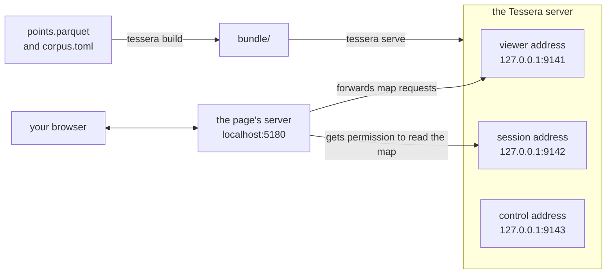

# Your first map from files

This tutorial is for someone who has never used Tessera. We'll take the 29,935 places GeoNames
lists for Ireland and put them on a map in your browser. Among them are 12,159 towns and villages,
3,970 hills and mountains, and 3,241 lakes and rivers. You'll search them by name and filter them
by kind of place and by population.

On the way you'll write a declaration, the file that tells Tessera what your data means. You'll
build a bundle, the form of the data that the server reads. You'll give every place an access
label, which decides who may see it. You'll also see why a web page showing the map needs a small
server of its own.

Allow half an hour. The commands take about three minutes to run. Two of those minutes go on
compiling Tessera. You need Rust installed with rustup, `git`, `curl`, `unzip`, `openssl`,
Python 3, Node.js with npm, and a web browser. We ran every command on Linux with Rust 1.97,
Python 3.12 and Node 22.

## What we'll do

1. Build the `tessera` program from its source code.
2. Download the GeoNames file for Ireland and convert it to Parquet.
3. Write a declaration that describes the data. Check it with `tessera check`.
4. Build a bundle with `tessera build`. Here we meet a place that GeoNames has put in the wrong
   country.
5. Start the server with `tessera serve`.
6. Open the map in a browser and filter it.

This diagram shows what will be running at the end.



*Your browser talks only to the page's server. That server holds the session secret. This tutorial
doesn't use the control address.*

## Build Tessera

We build Tessera from its source code. Clone the repository and install the `tessera` program from
it.

```bash
git clone https://github.com/jennis0/tesseradb ~/tesseradb
cd ~/tesseradb
cargo install --path crates/tessera-cli
```

```
...
    Finished `release` profile [optimized] target(s) in 1m 56s
...
```

That took two minutes on a 12-core machine. Cargo puts the program in `~/.cargo/bin`. Rustup has
already added that directory to your `PATH`. Check that the program runs.

```bash
tessera --version
```

```
tessera 310920847827ba735cd8e953c898784853e84291
```

The long number is the commit your copy was built from. Yours will be different.

## Get the data

GeoNames is a free gazetteer of the world's place names. It publishes a file for each country.
Make a directory for the project and download Ireland's file.

```bash
mkdir ~/ireland && cd ~/ireland
curl -sO https://download.geonames.org/export/dump/IE.zip
unzip IE.zip
```

```
Archive:  IE.zip
  inflating: readme.txt              
  inflating: IE.txt                  
```

`IE.txt` has one place on each line. Each line has 19 columns separated by tabs. There is no header
row. `readme.txt` says what each column holds. Look at the first line.

```bash
head -n 1 IE.txt
```

```
2635367	Tullyrossmearan	Tullyrossmearan	Tullyrosmearn,Tullyrossmearan	54.33333	-7.98333	P	PPL	IE	GB	C	14			0		53	Europe/Dublin	2015-05-15
```

This is Tullyrossmearan, in County Leitrim. The line starts with its GeoNames id. Then come its
name, the same name in plain ASCII, and other spellings. Next are its latitude and longitude. The
`P` marks it as a populated place. Further along, its population is `0`.

A population of 0 means GeoNames has no figure. That is true of most places. Only 1,119 of the
29,935 have a population. This will matter when we filter by population.

We'll keep six of the 19 columns. They are the id, the name, the latitude, the longitude, the class
of place and the population.

## Convert it to Parquet

Tessera's build reads Parquet files. Parquet is a file format for tables. It stores the name and
type of each column inside the file. A program can find out what columns a file has without reading
any rows. `tessera check` relies on this later.

We'll convert the file with pyarrow, a Python library for Parquet. Make a Python environment and
install pyarrow in it.

```bash
python3 -m venv .venv
.venv/bin/pip install pyarrow
```

Save this script as `convert.py`.

```{.python notest}
import pyarrow as pa
import pyarrow.csv as csv
import pyarrow.parquet as pq

columns = [
    "geonameid", "name", "asciiname", "alternatenames", "latitude", "longitude",
    "feature_class", "feature_code", "country_code", "cc2", "admin1_code",
    "admin2_code", "admin3_code", "admin4_code", "population", "elevation", "dem",
    "timezone", "modification_date",
]

table = csv.read_csv(
    "IE.txt",
    read_options=csv.ReadOptions(column_names=columns),
    parse_options=csv.ParseOptions(delimiter="\t", quote_char=False),
    convert_options=csv.ConvertOptions(
        column_types={"geonameid": pa.uint64(), "population": pa.int64()},
    ),
)

points = pa.table({
    "entity_id": table["geonameid"],
    "lon": table["longitude"],
    "lat": table["latitude"],
    "name": table["name"],
    "feature_class": table["feature_class"],
    "population": table["population"],
})
pq.write_table(points, "points.parquet")
print(f"wrote {points.num_rows} places to points.parquet")
```

The file has no header. The script names the 19 columns itself, in the order `readme.txt` lists
them. GeoNames doesn't put quotes around its fields. The script tells pyarrow not to look for any.
It reads the id and the population as whole numbers. Then it writes six columns to
`points.parquet`, under the names Tessera looks for.

- `entity_id` holds a value that tells each row apart from every other. Tessera looks for a column
  with this name. We use the GeoNames id, which is already unique.
- `lon` and `lat` hold the place's position in degrees.
- `name`, `feature_class` and `population` hold the values we want to see, search and filter.

Run it.

```bash
.venv/bin/python convert.py
```

```
wrote 29935 places to points.parquet
```

Every line of `IE.txt` is now a row in `points.parquet`.

## Describe the data

Next we tell Tessera what the data means. We do that in a declaration. A declaration is a TOML file.
It names the files to read and says how to place each row on a map. It lists the columns to keep and
the kind of value in each. It also says who may see each row. Save this as `corpus.toml` beside
`points.parquet`.

```toml
[sources]
points = "points.parquet"

[defaults]
source = "points"

[[view]]
name             = "ireland"
projection       = "web_mercator"
extent           = { lon = [-11.0, -5.0], lat = [51.0, 55.5] }
point_visibility = { default = "public" }

[[vocabulary]]
name       = "feature_class"
width      = "u8"
value_set  = "closed"
visibility = "public"
values     = ["A", "H", "L", "P", "R", "S", "T", "U", "V"]

[[attribute]]
name  = "name"
type  = "text"
index = true

[[attribute]]
name       = "feature_class"
type       = "category"
vocabulary = "feature_class"
render     = true

[[attribute]]
name   = "population"
type   = "i64"
render = true
```

**The sources.** `[sources]` gives each file a short name. The path is relative to `corpus.toml`.
`[defaults]` makes `points` the source for every block below.

**The view.** A [view](../system/data-model.md#views-and-view-groups) is one way of laying the
places out on a flat map. It has a projection, which turns longitude and latitude into a position on
the map. It also has an extent, the part of the map it covers. One set of places can have several
views. A collection of documents might have a geographic map and an embedding layout, for example.
A viewer can switch between them. We need one view, called `ireland`.

`web_mercator` is the projection almost every web map uses. It keeps shapes true. It stretches
areas more the further they are from the equator.

The `extent` is a range of longitude and a range of latitude, in degrees. Ours is a rectangle
around Ireland. The extent has no default. Every view has to state one.

`point_visibility` decides who may see each place. Tessera does this by giving each place an access
label. Each viewer holds a set of labels and sees only the places that carry one of them. A label
usually comes from a column in your data. We have no such column, so every place gets the default
label, `public`. Every viewer holds `public`. Everyone will see every place. A later tutorial on
access control gives places different labels. It shows two viewers two different maps.

**The vocabulary.** The feature class is one letter from a list that GeoNames defines. The table
shows what each letter covers and how many Irish places carry it. The
[GeoNames feature codes page](http://www.geonames.org/export/codes.html) has the details.

| Class | What GeoNames files under it | Places |
|---|---|---|
| A | counties and other administrative areas | 112 |
| H | lakes, rivers, bays and other water | 3,241 |
| L | parks, areas and localities | 3,507 |
| P | cities, towns and villages | 12,159 |
| R | roads and railways | 106 |
| S | buildings, farms and other spots | 6,722 |
| T | hills, mountains, islands and other landforms | 3,970 |
| U | undersea features | 0 |
| V | forests and heaths | 118 |

A column whose values come from a fixed list is called a category. Tessera keeps the list itself as
a [vocabulary](../system/data-model.md#vocabularies).

`width = "u8"` stores each place's class as a one-byte code. One byte leaves room for 255 values.

`value_set = "closed"` says the list is complete. The build refuses any place whose class is not on
it.

`visibility = "public"` lets every viewer see the whole list. That includes `U`, which no Irish
place carries. The other setting, `derived`, shows each viewer only the values on places they can
see. This `public` is a setting on the list. It is separate from the access label on each place.

**The attributes.** An attribute is a column that Tessera keeps for every place. We declare three.
A `text` attribute holds words. A `category` attribute holds a value from a vocabulary. An `i64`
attribute holds a whole number.

Tessera stores every attribute with its place. The server reads it when someone opens that place.
Two settings add more.

- `index = true` builds a search index. On `name`, it lets you search for the words in a place's
  name.
- `render = true` stores the value next to each place's position on the map. The value then travels
  with every point drawn. The map can colour points by it and filter on it. We set it on
  `feature_class` and `population`.

## Describe the deployment

The declaration describes the data. A second file, `tessera.toml`, describes this deployment. It
says where the bundle goes and which declaration to build. It also sets up the server.
`tessera check`, `tessera build` and `tessera serve` look for this file in the directory you run
them from. If it isn't there, they look in the directories above. Save this beside `corpus.toml`.

```toml
[bundle]
path  = "bundle"
cache = "cache"
wal   = "wal.log"

[build]
schema = "corpus.toml"

[plugin]
module = "builtin:passthrough"

[disclosure]
token_max_lifetime = 3600

[serve]
viewer                   = "127.0.0.1:9141"
session                  = "127.0.0.1:9142"
control                  = "127.0.0.1:9143"
session_credential_file  = "session.secret"
operator_credential_file = "operator.secret"
```

`[bundle]` names three places on disc. `path` is the directory the build writes and the server
opens. `cache` is where the server keeps work it can reuse, such as each viewer's set of places.
`wal` is the server's write-ahead log. The server records each change to the data there before
applying it. A change then survives a crash.

`[build]` names the declaration to build.

`[plugin]` names the code that decides what each viewer may see. `builtin:passthrough` is the only
one there is. The tutorial on access control will explain it.

`token_max_lifetime` sets how long a browser's permission to read the map lasts. Ours lasts an hour.

`[serve]` gives the server three addresses and names two secret files. We'll create the files and
explain the addresses when we start the server.

## Check the declaration

Before building anything, ask Tessera what it makes of the two files. `tessera check` reads the
declaration. It opens each Parquet file the declaration names. It compares the columns the
declaration asks for with the columns in the file. It reads only names and types, never rows. On
our file it takes 18 milliseconds.

```bash
tessera check
```

```
...
projected views, from the declaration alone:
  ireland              web_mercator, asked for lon [-11, -5], lat [51, 55.5]
                       snapped outward to the square at z5 (15, 10) — x [0.46875, 0.5], y [0.3125, 0.34375]

views
  ireland                    labels from default_only, default 'public'

vocabularies
  feature_class              public, closed, 9 declared value(s)

attributes (in declaration order, which is the stored column order)
  name                       text, index, from column 'name'
  feature_class              u8 over vocabulary 'feature_class', hot, from column 'feature_class'
  population                 i64, hot, from column 'population'

check OK: 2 source(s), 1 view(s), 0 view group(s) over 0 declared view(s), 1 vocabulary(ies), 3 attribute(s), 0 layer(s), 0 warning(s)
```

`check OK` on the last line is the result we want. The lines above it describe what the build will
do.

The first section has a surprise. We asked for a rectangle. The check says the view has been
snapped outward to a square. Tessera stores positions on a grid that lines up with the standard map
tiles. Every tile the map asks for, at any zoom, then falls exactly on the grid. So Tessera widens
our extent to the smallest standard tile that contains it. At zoom level 5 the world is 32 tiles
across. Our tile is in column 15 and row 10, counting from zero at the top left. The numbers in
square brackets give the same tile in the projection's own units. In those units the whole world
runs from 0 to 1 in each direction.

The other sections repeat what we declared. `labels from default_only` means that no column
supplies access labels. Every place gets the default, `public`. `hot` is the check's word for
`render = true`.

The last line counts two sources, though we have one file. The check read the file's schema twice.
It read it once for the attributes and once for the view's positions.

Try a mistake while nothing depends on it. Open `corpus.toml` and change the last attribute's name
to `populaton`. Run the check again.

```bash
tessera check
```

```
...
  FAILED       attribute 'populaton': declared type 'i64', read from a column named 'populaton', which source 'points' does not carry. Its columns are: entity_id, lon, lat, name, feature_class, population
...
check FAILED: 1 finding(s) across 2 source(s). Nothing was read but Parquet schemas, so a clean check is not a clean build: it cannot see a value against a closed vocabulary, a member id that resolves to nothing, or where the data sits inside a view's extent
```

The check names the attribute and the column it looked for. It lists the columns the file actually
has. Its last line admits what it cannot see. It has read only names and types. A class missing
from our closed vocabulary would get past it. The build would catch that. Change the name back to
`population` and run `tessera check` again. It says `check OK`.

## Build the bundle

The build needs a secret key first. Inside the server, every place gets a number of Tessera's own.
That number never leaves the server. A viewer holding a few of them could estimate how many places
they are not allowed to see. A browser gets a `tessera_id` for each place instead. The build makes
it by scrambling the internal number with a secret key, called the identity key. The
[security chapter](../system/security.md#a-client-never-sees-an-entity-id) explains what the
scrambling hides and what it doesn't.

The build reads the key from a file named `.env` beside `tessera.toml`. Create one with a random key
that only you can read.

```bash
echo "TESSERA_IDENTITY_KEY=$(openssl rand -hex 16)" > .env
chmod 600 .env
```

Keep `.env`. A build with a different key gives every place a different `tessera_id`. Any
`tessera_id` a viewer had saved would no longer mean the same place. Without a key, the build
refuses to start. Its message lists the ways to supply one.

Now build the bundle. The build reads every row of `points.parquet`. It works out where each place
sits on the map. It stores neighbouring places next to each other on disc. The places in any map
tile, at any zoom, end up in one run of rows. The build also checks each feature class against the
vocabulary. It builds the search index over the names. It records which places carry which access
label. The result goes into the `bundle` directory. From now on the server reads only the bundle,
never your Parquet file.

```bash
tessera build
```

```
view 'ireland': web_mercator, quantising against x [0.46875, 0.5], y [0.3125, 0.34375]
        asked for lon [-11, -5], lat [51, 55.5] — snapped outward to the square at z5 (15, 10), lon [-11.25, 0], lat [48.922499263758255, 55.7765730186677]
        the data spans x [0.47030425, 0.5235287777777777], y [0.3141878520203559, 0.33315262108750776] — 62277 x 39773 of the 65536 x 65536 cells
        1 of 29935 point(s) (0.0%) CLAMP onto the frame's edge — 1 on x, 0 on y. A clamped point is stored at the boundary, not where it was written
        none of them outside web_mercator's ±85.0511287798066° domain, so nothing was clipped
...
1 view(s): 0 point row(s) carried access terms of their own; 29935 took the declared default
...
attribute 'name': 29,935 of 29,935 entities have a value
attribute 'feature_class': 29,935 of 29,935 entities have a value
attribute 'population': 29,935 of 29,935 entities have a value
...
  view ireland: 29935 row(s)
```

It takes a few seconds. Most of the report is what we expected. All 29,935 places took the default
label. Every place has a value for each attribute. The view holds 29,935 rows. Every feature class
was one of our nine letters. Otherwise the build would have stopped and named the stray value.

The second line gives the snapped tile in degrees. It runs from longitude −11.25 to 0 and from
latitude 48.9 to 55.8. The fourth line reports one place outside that tile. The build has clamped
it. It moved the place onto the nearest edge of the tile and kept it.

The place is Saint Patrick's Bridge. GeoNames lists three places of that name in Ireland. One is a
spit on the Wexford coast. One is the bridge over the Lee in Cork, filed as a historic site at
longitude −8.47036. The third has the spit's class and the Cork bridge's position. Its
longitude, though, is 8.47036. The minus sign is missing. That puts it east of Greenwich, in Germany. The
build has pinned it to the eastern edge of our map.

We'll leave it there. It makes a useful landmark on the map. To correct it, you would fix the
longitude in `IE.txt` and run `convert.py` again. Then you would delete the `bundle` directory and
build again. The build refuses to write over an existing bundle.

## Serve it

The server needs the two secret files that `tessera.toml` names. Create them the same way as the
key.

```bash
openssl rand -hex 16 > session.secret
openssl rand -hex 16 > operator.secret
chmod 600 session.secret operator.secret
```

The server listens on three addresses. Each has its own job.

- The viewer address, port 9141, serves the map to browsers. Each browser gets only the places it is
  allowed to see.
- The session address, port 9142, grants a browser permission to read the map. It answers only
  callers that hold the session secret.
- The control address, port 9143, takes changes to the data, such as new places and deletions. It
  answers only callers that hold the operator secret. We won't use it here.

Keeping them apart lets you open each address only to the callers that need it.

`tessera serve` opens the bundle and starts answering on all three addresses. It runs until you stop
it. Give it a terminal of its own.

```bash
cd ~/ireland
tessera serve
```

```
2026-09-24T00:49:40.984688Z  INFO tessera_server::memory: the allocator's arena count is capped arenas=12
2026-09-24T00:49:41.027452Z  INFO tessera_engine::engine: the engine adopted the prefix's derived artifact structures named=0 containment_adopted=0 prefix=v00000
2026-09-24T00:49:41.027864Z  INFO tessera_server: bulk reads may hold this much memory at once, within the process's memory cap bulk_admission=2 max_page_bytes=67108864 bulk_read_memory_bytes=939524096
{"event":"listening","viewer":"127.0.0.1:9141","session":"127.0.0.1:9142","control":"127.0.0.1:9143"}
```

The three `INFO` lines describe the server's own set-up. They need nothing from you. The last line
is the one to look for. It shows all three addresses open.

## Open the map

Tessera's browser components draw the map. They live in the repository's `clients/ts` directory.
They aren't published as a package yet. Build them from the clone, in a second terminal.

```bash
cd ~/tesseradb/clients/ts
npm ci
npm run build -w @tesseradb/components
```

```
...
dist/assets/decode.worker-DjqcC_7y.js    266.69 kB
dist/tessera-components.js             1,857.60 kB │ gzip: 444.08 kB

✓ built in 3.75s
...
```

`examples/plain-html` holds a web page with the map on it. It also holds a small Node server for
the page.

The page needs its own server because of the session secret. Anyone holding that secret can get
permission to see any place. The secret must never reach a browser. The page's server keeps it
instead. When you open the page, that server uses the secret to get you permission to read the map.
It passes the browser only the permission, which lasts an hour. It also forwards the browser's map
requests to the viewer address. The page and the map then come from one address.

The page's server offers the people listed in `users.json`. Each person has a display name and a
list of the labels they hold, under `terms`. A real application would take these from its own
sign-in. The example's list belongs to another dataset. Replace it with one person, Everyone, who
holds no labels.

```bash
cd examples/plain-html
echo '{"everyone": {"label": "Everyone", "terms": []}}' > users.json
```

Everyone will still see every place, because every viewer holds `public`.

Tell the page's server where Tessera is listening and where the session secret is. Then start it.

```bash
export TESSERA_VIEWER_URL=http://127.0.0.1:9141
export TESSERA_SESSION_URL=http://127.0.0.1:9142
export TESSERA_SESSION_CRED=$(cat ~/ireland/session.secret)
node server.mjs
```

```
plain-html example on http://localhost:5180
```

Open <http://localhost:5180>. The page signs in as Everyone and draws every place in blue. There is
no base map yet. The places themselves draw the outline of Ireland. The gap in the north-east is
Northern Ireland, which GeoNames files under the United Kingdom. The single point far out to the
east is Saint Patrick's Bridge, on the edge of our tile. Scroll to zoom in. Hold the pointer over a
point to see its name.

The strip along the bottom reads 29,935 shown, 29,935 matched and 29,935 visible. Visible is how
many places you may see in the part of the map on screen. Matched is how many of those pass your
filters. With no filters set, that is all of them. Shown is how many points the page has drawn.
Shown can be lower than matched. Where an area holds more matches than the page draws at once, the
server sends a sample.

If you leave the page open for more than an hour, the strip reads Session expired. The permission
has run out. Reload the page and its server gets a new one.

## Filter the map

The panel on the left has a filter for each attribute we declared. There is a search box for the
name. There is a tick box for each feature class. There is a range for the population.

Tick P. The matched count falls to 12,159. Those are the cities, towns and villages, the same number
as in the table.

Now type 10000 in the first Population box and press Enter. The count falls to 72. These are the
places with ten thousand people or more. The largest is Dublin, with 1,024,027. A village with no
population figure counts as 0 here. It falls outside the range.

The visible count drops while a filter is on. With P ticked it fell to 29,687 in our window. The
page counts visible places only where it has drawn something. Some stretches of the map hold no town
at all. Matched is the number to watch.

Choose Clear all. Type `kilkenny` in the Name box and press Enter. Twelve places match. They are the
county, the city and a village of the same name in County Mayo. The rest are seven hotels, the
airport and the Smithwick's brewery. The search matches whole words. The locality of Kilkennybeg is
not among the results.

Choose Clear all again. Then choose `feature_class` under Colour by. Each class gets its own colour.
The colour comes from the value that `render = true` sends with every point.

When you've finished, press Ctrl-C in each terminal. That stops the page's server and Tessera.

## What you built

`~/ireland` now holds a working deployment. The data is in `points.parquet`. The declaration is in
`corpus.toml`. `tessera.toml` describes the deployment. `.env`, `session.secret` and
`operator.secret` hold its three secrets. The `bundle` directory holds what the build made. To bring
the map back, start `tessera serve` in `~/ireland`. Then run the three `export` lines and
`node server.mjs` in the example's directory.

## What you learned

- A declaration tells Tessera what your data means. `tessera check` compares it with the column
  names and types in your files. `tessera build` reads every row.
- The bundle is what the server serves. The build sorts the places into map order and writes the
  indexes the server needs. The server never opens your source files.
- Every place carries an access label. Ours all carry `public`. Every viewer holds that label.
- The server listens on three addresses. Browsers read the map from the viewer address. Your own
  server gets them permission from the session address, using the session secret. Changes to the
  data go to the control address.
- Everything a viewer is sent is computed from the places their labels allow.

## Next

The next tutorial covers access control. It gives places different labels and signs in two viewers
who hold different ones. It also explains the permission a browser gets, which Tessera calls a
token. That tutorial isn't written yet. Meanwhile, the [overview](../system/overview.md) describes
the whole system. [The data model](../system/data-model.md) says more about views, attributes and
vocabularies. [Access control](../system/access-control.md) explains labels and tokens.
