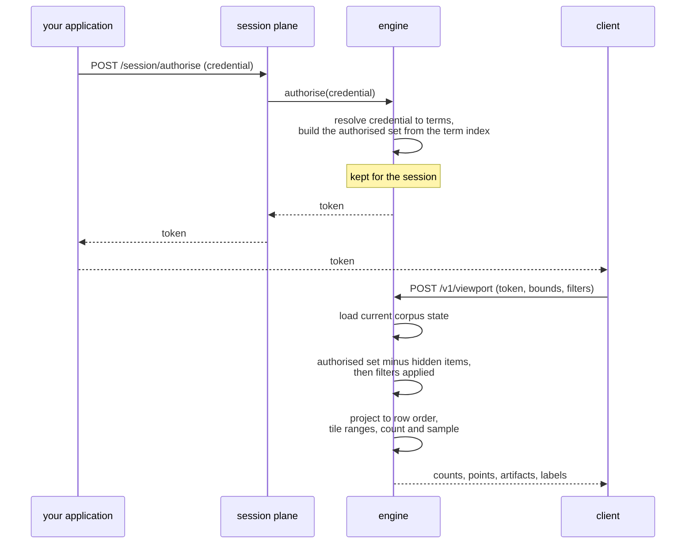

# Access control

A viewer presents a credential once and receives a token. The token names the authorised set:
everything that credential's terms admit, computed once at that moment and kept for the session.
Every later request, panning the map, filtering, or opening an item, composes a visible set from
the authorised set fresh, against whatever the corpus currently hides, and answers from inside
that visible set alone.

*A session from credential to first answer. Authorising happens once; every later request
composes against what it produced.*

## Terms and access labels

An operator declares an access label on each item. An access label resolves to a set of terms,
the unit of access the corpus indexes: the term index maps each term to the items that carry it.
A credential resolves to the terms it satisfies, and an item is visible to a token when the two
sets intersect.

A label is trimmed wherever it is read, at a build and at a running service, before the plugin
sees it. A label that is empty after trimming is no label, so a list holding only such labels is
an item with no label, which takes its view's default. A label written in a declaration, such as a
view's or a layer's `visibility` or a default, is stored trimmed, and one that is empty after
trimming is refused. The shipped plugin trims a credential's terms the same way, so a credential
matches the label it names however either was padded.

At authorise, the service resolves a credential to its satisfied terms and looks each one up in
the term index. The union of the items those terms carry, one bitmap over item identity, is the
authorised set: the whole of what that credential grants, independent of any later request.

**Not built:** a label that requires more than one term to hold at once. A label resolves to a
flat set of terms today, and a token satisfies it by holding any single one of them. A design for
requiring several terms together exists as a draft, unreviewed and not ratified: it binds nothing
yet.

## The plugin

Two functions, supplied by the operator, decide what a term means: one maps an item's access
label to the terms it carries, the other maps a credential to the terms it satisfies. **Not built
yet:** a host that loads an operator-supplied module implementing them. One implementation ships
today, built into the service: an item's or a credential's terms pass through unchanged, so the
two functions are the same comparison, and nothing exercises a case where they could disagree.

The item-side function runs once per item, at ingest, and has to be fast, since a corpus can hold
billions of items. The credential-side function runs once per authorisation, never per item and
rarely more than once per session, so it can afford to cost more. Both return terms as opaque byte
strings, and the service assigns each distinct one an id in one shared table, so agreement between
the two functions comes down to returning the same bytes for the same meaning.

A deployment declares how many distinct terms it expects, how many an item may carry, and how many
a credential may satisfy. Exceeding a declared bound is recorded and never excludes an item or a
term. A resource limit must not produce an authorisation decision.

With the shipped implementation, a credential is a list of terms and the service grants exactly
those: a bare claim, trusted as presented. An operator-supplied plugin could instead require a
signed, principal-bound assertion and verify it before deriving terms, so that holding the session
credential (below) permits only submitting an assertion rather than claiming to be anyone at all.

## Getting a token

Two credentials are in play. The session credential is a shared secret an operator configures at
deployment: it gates who may mint a session at all, and it must never reach a browser. It belongs
to the integrator's own backend, which calls the session plane on a viewer's behalf. The
credential that names a viewer travels separately, inside the request body, for the plugin above
to resolve into terms.

The session plane is a listener separate from the one a viewer's requests go to, gated by the
session credential. `POST /session/authorise` takes a viewer's credential and returns a token.
`POST /session/revoke` ends one immediately.

A token is a bearer string: unguessable, random, valid until it expires or is revoked. It carries
no claims of its own and nothing that would let a holder work out its terms without asking the
server; the terms it resolved to, and the authorised set they produced, stay on the server,
matched to the token by a private table. No copy of the credential that produced it survives; only
a hash of it is kept, so a byte-identical repeat is recognised without re-running the plugin.

Building the authorised set costs work proportional to how many terms it unions and how large they
are, so it happens once per session and is kept. A live session holds it directly, and an on-disk
cache lets a repeat session skip the union. The cache key is coarser than the raw credential: it
is the resolved term set, together with the bundle's identity, the plugin's version and a
watermark on the corpus, so two different credentials that resolve to the same terms share one
cache entry.

One token covers every view a deployment serves: a session's terms are resolved once, and every
view a later request names is answered against the same authorised set.

A deployment configures a maximum token lifetime, the only expiry the service enforces on its own.
Refreshing a credential on a shorter schedule is the caller's decision: only the caller knows when
a grant has changed, and the service does not look one up or refresh one on its own.

**Not built yet:** partitions, each holding its own term index, and a router that fans a
credential's terms out to every one it may reach. A deployment runs one process against one store,
so an authorised set is built against the whole corpus's term index in a single pass.

## What a request answers from

The authorised set is fixed at authorise, but the corpus is not. Items are deleted, suppressed, or
unsuppressed continuously, and a suppression has to apply to every session immediately, including
ones that authorised before it happened. So a request does not read the authorised set on its own:
it composes the authorised set against the overlay, the record of every item currently hidden by a
delete or a suppression, at the moment the request is made. The result is the visible set. An item
the overlay covers is removed from the visible set even though the authorised set still names it.
An item the overlay has stopped covering, because an unsuppress lifted it, is no longer subtracted,
and so is visible again.

A request loads one generation, one version of the corpus published as a whole
([write path](write-path.md#generations)), once, at the start, and answers entirely from what it
names: the tiles, the columns and the overlay a request reads all come from that one generation. A
filter then narrows which of the visible set is drawn or counted, and can only remove from it,
never add to it ([queries](queries.md#the-authorised-set-and-the-filtered-set)).

Composing the visible set touches only the items a session's authorised set could ever contain,
not the whole corpus, so the work stays cheap on every request even though the overlay itself can
grow without bound. What is cached across requests is not the visible set, which changes with the
overlay on every one, but the authorised set's projection from item identity into the row order a
view stores its geometry in. That projection is cached per session and per view, and extended
forward as new rows are written; a request applies the overlay to the cached projection as a
difference rather than rebuilding either from scratch.

## When the corpus changes under a live session

| Change | Effect on an open session | How |
|---|---|---|
| An item is deleted, suppressed, or unsuppressed | Applies on the session's very next request | The overlay is read fresh at composition, every time |
| A flush publishes new rows for a term the session already holds | The session sees them once the background refresh has reached it, usually by its next request; until then it is served the previous generation's answer, which is still correct | A background pass rebuilds the cached projection for every resident session at each geometry publication; a session with no resident entry rebuilds on its next request instead |
| The credential's own grant changes | Not reflected until the session re-authorises | There is no partial update to the authorised set. A new token is the only way to pick up a changed credential |

**Not built yet:** a signal to the client when the corpus has grown a term the credential named
but the dictionary did not yet carry at authorise. This condition only narrows what the session
can see, never widens it, and nothing on the wire announces it. A client that wants to stay
current has to re-authorise on its own schedule, bounded only by the token's configured lifetime.
The signal that does exist on the wire is a `403 expired-token` refusal once a token has expired
or been revoked; a corpus change on its own produces no such refusal.

## Key rotation

The `tessera_id` a client holds for an item is derived from the item's
[entity id](data-model.md#what-an-item-carries) by a keyed permutation
([security](security.md#a-client-never-sees-an-entity-id) covers what that hides). Rotating the
key changes what every `tessera_id` in the corpus resolves to. A rotation is a build-time
operation, `tessera build --rotate-id-key`: it produces a new bundle and takes effect on the
restart that loads it, not while a service keeps running against the old one.

The service tracks which key produced the identifiers currently live as a single counter, the
idset, published on the metadata a client can read. A client may present the idset an identifier
was minted under alongside that identifier; if the two no longer match, the request is refused
rather than resolved against an identifier that has since come to name a different item.
Presenting the idset is optional: a caller who omits it accepts that a `tessera_id` from a past
idset may now name a different item. The check is the same whichever item is named, so it cannot
be used to learn how identifiers moved across a rotation.

**Not built yet:** binding a token to the idset it was issued under. A rotation does not end a
live session on its own. An operator ending or revoking every open session is what makes a
rotation take effect for identifiers already handed out.

## Where this is tested and where it lives

The plugin trait and its one built-in implementation live in `tessera-plugin`. The term index,
authorised-set construction, and the on-disk cache live in `tessera-authz`. Session composition
against the overlay, the row-space projection it feeds, and the background refresh that keeps a
resident projection current live in `tessera-engine`. The session plane's two verbs, and the idset
check on identifier lookups, live in `tessera-server`.

## Sources

`docs/design/architecture.md` §2.2, §2.3, §2.4, §2.6, §6; `docs/design/system-architecture.md`
§2.2, §4.2, §4.3; `docs/design/concurrency-lifecycle.md` §1.1, §2.4, §3.3;
`docs/design/core-access-expressions.md`; `docs/system/write-path.md`; `docs/system/security.md`;
`docs/system/data-model.md`; `docs/system/queries.md`; decisions 0005, 0014, 0020, 0025, 0027,
0102; `crates/tessera-plugin/src/lib.rs`; `crates/tessera-authz/src/fragment.rs`;
`crates/tessera-engine/src/session.rs`; `crates/tessera-engine/src/compose.rs`;
`crates/tessera-engine/src/refresh.rs`; `crates/tessera-server/src/session.rs`;
`crates/tessera-server/src/viewer.rs`; `crates/tessera-server/src/error.rs`;
`crates/tessera-store/src/manifest.rs`; `crates/tessera-cli/src/main.rs`.
