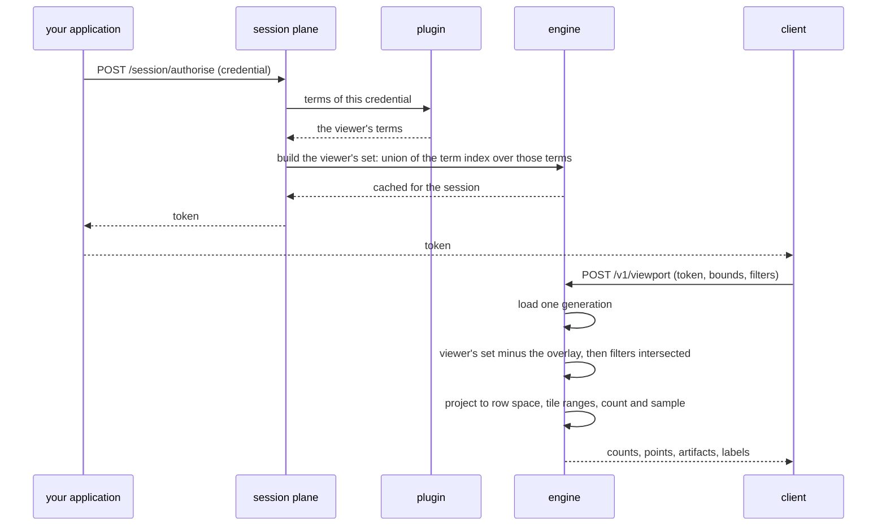

# Access control

A viewer presents a credential once and receives a token. The token stands for the set of items
that viewer may see, computed from the corpus as it stood at that moment. Every later request,
panning the map, filtering, or opening a point, answers from inside that set and nothing outside
it.

*A session from credential to first answer. Authorising happens once; every later request
composes against the fragment it produced.*

## Getting a token

The session plane is a listener separate from the one a viewer's requests go to, gated by its own
credential: an operator decides who may mint sessions at all, distinct from the credential a
viewer presents inside the request body to be resolved. `POST /session/authorise` takes that
credential and returns a token. `POST /session/revoke` ends one immediately.

What the credential is worth depends on the plugin behind it. A bare claim is trusted as
presented: the service authorises whatever it says, and the session credential is the only thing
standing between an untrusted caller and read access to everything. A plugin can instead require a
signed, principal-bound assertion and verify it before deriving terms, so that holding the session
credential only permits submitting an assertion rather than claiming to be anyone at all.

A token is a bearer string: unguessable, random, valid until it expires or is revoked. It carries
no claims of its own and nothing that would let a holder work out its terms without asking the
server; the terms it resolved to, and the fragment they produced, stay on the server, matched to
the token by a private table. No copy of the credential that produced it survives. Only a hash of
the credential is kept, so that a byte-identical repeat is recognised without re-running the
plugin.

A deployment configures a maximum token lifetime, which is the only expiry the service enforces on
its own. Refreshing a credential on a shorter schedule is the caller's decision: only the caller
knows when a grant has changed, and the service does not look one up or refresh one on its own.

## Terms and access labels

An operator declares an access label on each item. An access label resolves to a set of terms, the
unit of access the term index is built from. A credential resolves to the terms it satisfies. An
item is visible to a token when the two sets intersect.

**Not built yet:** a label that requires more than one term to hold at once. A label resolves to a
flat set of terms today, and a token satisfies it by holding any single one of them.

## The plugin

Two functions, supplied by the operator, decide what a term means. One maps an item's access
label to the terms it carries, run once per item as it is ingested. The other maps a credential to
the terms it satisfies, run once per authorisation. Both return terms as opaque byte strings, and
the service assigns each distinct one an id in one shared table, so agreement between the two
functions comes down to returning the same bytes for the same meaning.

The item side runs once per item and has to be fast, since a corpus can hold billions of them. The
credential side runs once per authorisation and can afford to cost more: it never repeats per
item, and it rarely repeats per request.

| Function | Runs when | Returns |
|---|---|---|
| An item's access label | Once per item, at ingest | The terms the label resolves to |
| A viewer's credential | Once per authorisation | The terms the credential satisfies |

A deployment declares how many distinct terms it expects, how many an item may carry, and how many
a credential may satisfy. Exceeding a declared bound is recorded and never excludes an item or a
term. A resource limit must not produce an authorisation decision.

One implementation ships today: the terms an item or a credential presents pass through unchanged,
so the two functions are the same comparison and cannot disagree.

**Not built yet:** a host that loads an operator-supplied plugin module. The pass-through
implementation above is the only one a deployment can run. Nothing today can exercise a case where
the two functions genuinely differ, so nothing checks that they would agree if they could.

## Composing the viewer's set

At authorise, the service resolves the credential to its satisfied terms and looks each one up in
the term index. The union of the items those terms carry, one bitmap over item identity, is the
token's fragment: the whole of what that credential grants, independent of any later request.

Building a fragment costs work proportional to how many terms it unions and how large they are, so
it happens once per session and is kept. A live session holds its own fragment directly, and a
cache on disk, keyed wider than the raw credential so that two credentials resolving to the same
terms share one entry, lets a repeat session skip the union entirely.

**Not built yet:** partitions, each holding its own term index, and a router that fans a
credential's terms out to every one it may reach. A deployment runs one process against one store,
so a fragment is built against the whole corpus's term index in a single pass.

## What a request answers from

A fragment is fixed at authorise, but the corpus is not. Items are deleted, suppressed, or
unsuppressed continuously, and a suppression has to apply to every session immediately, including
ones that authorised before it happened. So a request does not read the fragment on its own. It
composes the fragment against the overlay, the record of every item currently hidden by a delete
or a suppression, at the moment the request is made. An item the overlay covers is removed from
the answer even though the fragment still names it. An item the overlay has stopped covering,
because an unsuppress lifted it, is added back the same way.

A request loads one version of the corpus, once, at the start, and answers entirely from what it
names. The tiles, the columns, and the overlay a request reads all come from that one version. A
filter narrows which of the composed set is drawn or counted. It can only remove from that set,
never add to it: no filter can widen what a viewer's own terms and the overlay already allow.

Composing the answer touches only the items a session's fragment could ever contain, not the whole
corpus, so the work stays cheap on every request even though the overlay itself can grow without
bound. The composed set is then projected from item identity into the row order a view stores its
geometry in. That projection is cached per session and per view, and extended forward as new rows
are written, rather than rebuilt on every request.

## When the corpus changes under a live session

| Change | Effect on an open session | How |
|---|---|---|
| An item is deleted, suppressed, or unsuppressed | Applies on the session's very next request | The overlay is read fresh at composition, every time |
| A flush publishes new rows for a term the session already holds | The session sees them on its next request, with no re-authorisation needed | The fragment is rebuilt to match the new rows automatically, when it is found to be behind |
| The credential's own grant changes | Not reflected until the session re-authorises | There is no partial update to a fragment. A new token is the only way to pick up a changed credential |

**Not built yet:** a signal to the client when the corpus has grown a term the credential named
but the dictionary did not yet carry at authorise. The condition is tracked internally, and it only
ever narrows what the session can see, never widens it, but nothing on the wire tells a client to
re-authorise. A client that wants to stay current has to do so on its own schedule, bounded only by
the token's configured lifetime.

## Key rotation

The identifier a client holds for an item is a keyed transformation of that item's underlying
identity. Rotating the key changes what every identifier in the corpus resolves to. The service tracks which key produced the
identifiers currently live as a single counter, the idset, published on the metadata a client can
read. A client that presents an identifier alongside the idset it was minted under gets a clear
refusal if the two no longer match, rather than an identifier that has come to name a different
item.

**Not built yet:** binding a token to the idset it was issued under. A rotation does not end a
live session on its own today. An operator ending or revoking every open session is what makes a
rotation take effect for identifiers already handed out.

## The tessera_id permutation

The identifier a client is given for an item, its `tessera_id`, is built from the item's
underlying identity by a keyed, reversible transformation: several rounds of mixing under the
deployment's own key, so that two identifiers reveal nothing about whether their items sit near
each other in the corpus. The service inverts it the same way it was built, using the same key,
whenever it needs the underlying identity back: drilling into a point, or addressing an item for a
delete or a suppress. No lookup table is needed in either direction.

## Where this is tested and where it lives

The plugin trait and its one built-in implementation live in `tessera-plugin`. The term index,
fragment construction, and the on-disk fragment cache live in `tessera-authz`. Session composition
against the overlay, and the row-space projection it feeds, live in `tessera-engine`. The session
plane's two verbs, and the idset check on identifier lookups, live in `tessera-server`.

Coverage of the properties this chapter describes is stated in `conformance.md` §4.6.

## Sources

`docs/design/architecture.md` §2.2, §2.3, §2.4, §2.6, §6; `docs/design/system-architecture.md`
§2.2, §4.2, §4.3; `docs/design/concurrency-lifecycle.md` §1.1, §2.4, §3.3;
`docs/design/core-access-expressions.md`; `docs/system/write-path.md`; `docs/system/security.md`;
decisions 0005, 0014, 0020, 0025, 0027; `crates/tessera-plugin/src/lib.rs`;
`crates/tessera-authz/src/fragment.rs`; `crates/tessera-engine/src/session.rs`;
`crates/tessera-engine/src/compose.rs`; `crates/tessera-server/src/session.rs`;
`crates/tessera-server/src/viewer.rs`; `crates/tessera-store/src/manifest.rs`.
