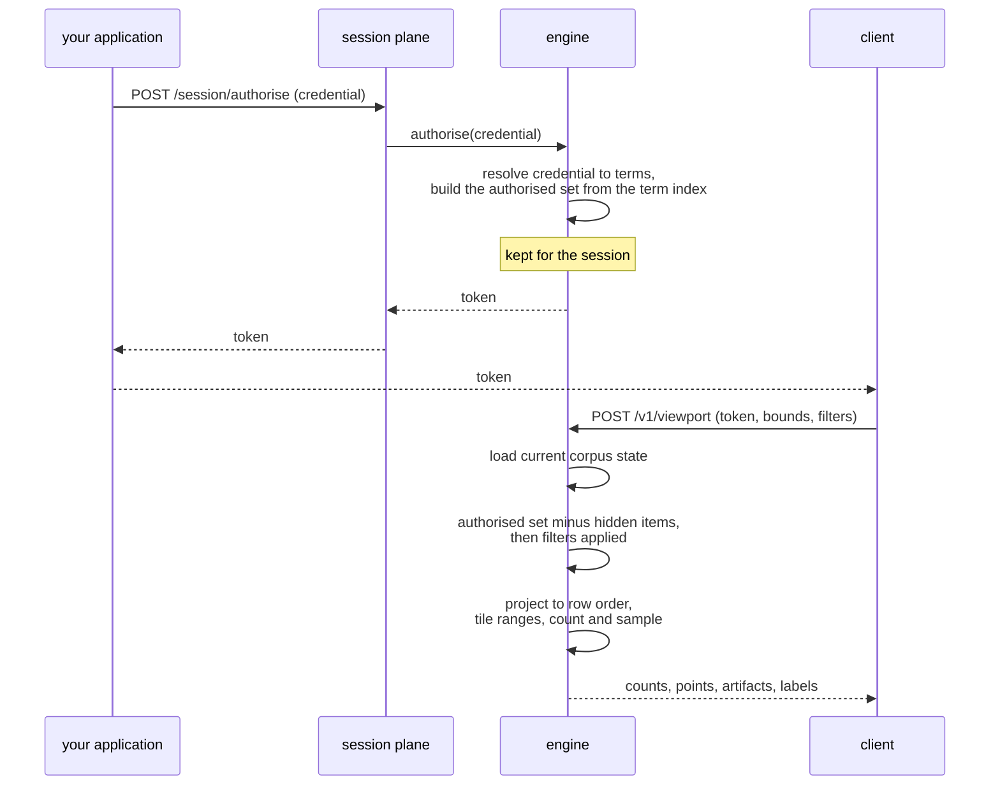

# Access control

A viewer presents a credential once and receives a token. The token names the authorised set:
everything that credential's terms admit, computed once at that moment and kept for the session.
Every later request, panning the map, filtering, or opening an item, composes a visible set from
the authorised set fresh, against whatever the corpus currently hides, and answers from inside
that visible set alone.

```mermaid
sequenceDiagram
  participant A as your application
  participant S as session plane
  participant E as engine
  participant C as client

  A->>S: POST /session/authorise (credential)
  S->>E: authorise(credential)
  E->>E: resolve credential to terms,<br/>build the authorised set from the term index
  Note over E: kept for the session
  E-->>S: token
  S-->>A: token
  A-->>C: token
  C->>E: POST /v1/viewport (token, bounds, filters)
  E->>E: load current corpus state
  E->>E: authorised set minus hidden items,<br/>then filters applied
  E->>E: project to row order,<br/>tile ranges, count and sample
  E-->>C: counts, points, artifacts, labels
```

*A session from credential to first answer. Authorising happens once; every later request
composes against what it produced.*

## Terms and access labels

An operator declares an access label on each item. A label is an access expression over terms, in
the grammar Accumulo's visibility labels use, without negation: `secret&(team_a|team_b)`. A term
is written bare when it consists of letters, digits and `_ - . : /`, and otherwise in double
quotes, with `\"` and `\\` as escapes. `&` is conjunction and `|` is disjunction, and mixing the
two needs brackets: `a&b|c` is refused and `(a&b)|c` is accepted. Whitespace between tokens is
refused, and a quoted term is taken exactly as written. `public` is reserved, is valid only as the
whole label, and admits every viewer. A term that equals `public` or `inherited` ignoring case, or
holds a control character, is refused. An item, a view or an artifact may carry a list of labels,
and admits a viewer who satisfies any one of them.

One parser in `tessera-types` reads every label: an item's access column at a build, the `access`
of an ingest row, a view's, a group's or a layer's `visibility`, an artifact's own label, and a
default. The build and a running service call it below both paths, so a label one accepts the
other accepts, and each stores the label's canonical text: nested operators flattened, operands
sorted and deduplicated, and absorption applied, so that `b&(a)` is stored as `a&b` and `a|(a&b)`
as `a`. A label that does not parse refuses the build, or the request that carries it, naming the
label. A label that is empty after trimming is no label, so a list holding only such labels is an
item with no label, which takes its view's default.

A credential resolves to the terms it holds. Each is trimmed, and one that is empty, holds a
control character or is `public` in any case is dropped. Every session holds `public`.

### How labels are indexed

The term index maps each index key to the items that carry it. Which keys an item is indexed under
depends on the shape of each of its labels.

| Label | Indexed under | Satisfied by a session when |
|---|---|---|
| `public` | the term `public`, term 0 in every bundle | always |
| A term, or a disjunction of terms, such as `user:ann\|user:bob` | each of its terms | it holds one of them |
| Any label holding a conjunction | one key of its own: a byte no term can hold, then the label's canonical text | its terms satisfy the label |

The union of the postings of the keys a session satisfies is therefore exactly the set of items
whose labels it satisfies. Per-document sharing, where nearly every item has a label of its own,
produces disjunctions of terms, which never enter the expression graph below.

Every label holding a conjunction is compiled into one shared directed acyclic graph. A leaf is a
term and an inner node is an AND or an OR over its children. Structurally identical
subexpressions are one node, so `secret` appears once however many labels mention it. The graph is
derived from the dictionary: it is rebuilt from the label keys when a bundle opens, and extended
when a flush promotes new keys, so nothing beside the dictionary stores it. A label holding a
conjunction is refused when it holds more than 1,024 nodes. A disjunction of terms has no limit.

At authorise, the service looks each of the credential's terms up in the dictionary, marks the
graph's leaves for those terms true and propagates upwards: an OR node becomes true with its first
true child, and an AND node when every child has. The authorised set is the union of the postings
of the credential's terms, of `public`, and of the key of every label whose root became true: one
bitmap over item identity, the whole of what that credential grants, independent of any later
request. The pass visits only the nodes reachable from the credential's terms. A label's own key
starts with a control character, which a credential's terms cannot hold, so no credential names
one directly.

A probe of the two layouts measured authorise on 9.3 million per-document labels at 100 to 800 ms
through the graph and 1.4 to 95 ms through term postings, and on 500,000 compartmented labels at 20
to 95 ms through the graph, which term postings cannot express
([probe](../../probes/2026-09-30-label-dag-authorise/results.md)). Indexing each label by its shape
takes the faster figure for each. Authorise runs once per session, so these figures are paid at
session start and never by a map request.

A view's, a group's, a layer's and an artifact's own labels are evaluated against the credential's
terms directly, so a label no item carries is still one a credential can satisfy.

## What a credential is

A credential is the JSON `{"terms": [...]}`, naming the terms the viewer holds, and the service
grants exactly those: a bare claim, trusted as presented. Holding the session credential (below)
therefore lets a caller claim any terms. **Not built yet:** principals, passwords, API keys and
OIDC access tokens that Tessera stores and checks itself, which
[users and access](../users-and-access.md) proposes. Until they exist, the session credential is
what stands between an untrusted caller and every term.

A dictionary is sized for at most 200,000,000 index keys, and a flush that would carry it past
that is refused. An item is expected to carry at most 4,096 keys. One past that is indexed with
every key and reported, since dropping a key would change who can see it, and a resource limit
must not produce an authorisation decision.

## Getting a token

Two credentials are in play. The session credential is a shared secret an operator configures at
deployment: it gates who may mint a session at all, and it must never reach a browser. It belongs
to the integrator's own backend, which calls the session plane on a viewer's behalf. The
credential that names a viewer travels separately, inside the request body, and names the terms
the viewer holds.

The session plane is a listener separate from the one a viewer's requests go to, gated by the
session credential. `POST /session/authorise` takes a viewer's credential and returns a token.
`POST /session/revoke` ends one immediately.

A token is a bearer string: unguessable, random, valid until it expires or is revoked. It carries
no claims of its own and nothing that would let a holder work out its terms without asking the
server; the terms it resolved to, and the authorised set they produced, stay on the server,
matched to the token by a private table. No copy of the credential that produced it survives; only
a hash of it is kept, so a byte-identical repeat is recognised without resolving it again.

Building the authorised set costs work proportional to how many terms it unions and how large they
are, so it happens once per session and is kept. A live session holds it directly, and an on-disk
cache lets a repeat session skip the union. The cache key is coarser than the raw credential: it
is the set of index keys the credential satisfies, together with the bundle's identity, the
identity of the rule that turns terms into keys and a watermark on the corpus, so two different
credentials that satisfy the same keys share one cache entry.

One token covers every view a deployment serves: a session's terms are resolved once, and every
view a later request names is answered against the same authorised set.

A deployment configures a maximum token lifetime, the only expiry the service enforces on its own.
Refreshing a credential on a shorter schedule is the caller's decision: only the caller knows when
a grant has changed, and the service does not look one up or refresh one on its own.

**Not built yet:** partitions, each holding its own term index, and a router that fans a
credential's terms out to every one it may reach. A deployment runs one process against one store,
so an authorised set is built against the whole corpus's term index in a single pass.

## What a request answers from

The authorised set is fixed at authorise, but the corpus is not. Items are deleted, suppressed, or
unsuppressed continuously, and a suppression has to apply to every session immediately, including
ones that authorised before it happened. So a request does not read the authorised set on its own:
it composes the authorised set against the overlay, the record of every item currently hidden by a
delete or a suppression, at the moment the request is made. The result is the visible set. An item
the overlay covers is removed from the visible set even though the authorised set still names it.
An item the overlay has stopped covering, because an unsuppress lifted it, is no longer subtracted,
and so is visible again.

A request loads one generation, one version of the corpus published as a whole
([write path](write-path.md#generations)), once, at the start, and answers entirely from what it
names: the tiles, the columns and the overlay a request reads all come from that one generation. A
filter then narrows which of the visible set is drawn or counted, and can only remove from it,
never add to it ([queries](queries.md#the-visible-set-and-the-filtered-set)).

Composing the visible set touches only the items a session's authorised set could ever contain,
not the whole corpus, so the work stays cheap on every request even though the overlay itself can
grow without bound. What is cached across requests is not the visible set, which changes with the
overlay on every one, but the authorised set's projection from item identity into the row order a
view stores its geometry in. That projection is cached per session and per view, and extended
forward as new rows are written; a request applies the overlay to the cached projection as a
difference rather than rebuilding either from scratch.

## When the corpus changes under a live session

| Change | Effect on an open session | How |
|---|---|---|
| An item is deleted, suppressed, or unsuppressed | Applies on the session's very next request | The overlay is read fresh at composition, every time |
| A flush publishes new rows for a term the session already holds | The session sees them once the background refresh has reached it, usually by its next request; until then it is served the previous generation's answer, which is still correct | A background pass rebuilds the cached projection for every resident session at each geometry publication; a session with no resident entry rebuilds on its next request instead |
| The credential's own grant changes | Not reflected until the session re-authorises | There is no partial update to the authorised set. A new token is the only way to pick up a changed credential |

**Not built yet:** adding to an open session a term the credential named that the dictionary did
not carry at authorise, or a label holding a conjunction that a flush promoted after it and that
the credential's terms satisfy. The session sees fewer items than its terms admit until it
authorises again, never more, and the engine records that it is behind. **Not built yet:** a
signal to the client when this happens; nothing on the wire announces it. A client that wants to stay
current has to re-authorise on its own schedule, bounded only by the token's configured lifetime.
The signal that does exist on the wire is a `403 expired-token` refusal once a token has expired
or been revoked; a corpus change on its own produces no such refusal.

## The identity key

The `tessera_id` a client holds for an item is derived from the item's
[entity id](data-model.md#what-an-item-carries) by a keyed permutation
([security](security.md#a-client-never-sees-an-entity-id) covers what that hides). The key is
drawn at random by `tessera build` each time it creates a bundle and is stored in the bundle's
manifest. Nobody configures, supplies or changes it. A rebuild creates a new bundle with a new key,
so every `tessera_id` changes, and one from the old bundle does not name an item in the new one.
The change takes effect on the restart that loads the new bundle. A client holding `tessera_id`s
from the old bundle reads its items again, by a unique field's values or afresh.

## Where this is tested and where it lives

The grammar, normalisation and the rules for a declared or a held label live in
`tessera-types` (`label`). The index keys an item's labels give it, the expression graph, the term
index, authorised-set construction and the on-disk cache live in `tessera-authz`. Session composition
against the overlay, the row-space projection it feeds, and the background refresh that keeps a
resident projection current live in `tessera-engine`. The session plane's two verbs live in
`tessera-server`.

## Sources

`docs/design/architecture.md` §2.2, §2.3, §2.4, §2.6, §6; `docs/design/system-architecture.md`
§2.2, §4.2, §4.3; `docs/design/concurrency-lifecycle.md` §1.1, §2.4, §3.3;
`docs/design/core-access-expressions.md`; `docs/system/write-path.md`; `docs/system/security.md`;
`docs/system/data-model.md`; `docs/system/queries.md`; decisions 0005, 0014, 0020, 0025, 0027,
0102; `docs/users-and-access.md`; `crates/tessera-types/src/label/mod.rs`;
`crates/tessera-authz/src/label/index.rs`; `crates/tessera-authz/src/fragment.rs`;
`crates/tessera-engine/src/session.rs`; `crates/tessera-engine/src/compose.rs`;
`crates/tessera-engine/src/refresh.rs`; `crates/tessera-server/src/session.rs`;
`crates/tessera-server/src/viewer.rs`; `crates/tessera-server/src/error.rs`;
`crates/tessera-store/src/manifest.rs`; `crates/tessera-cli/src/main.rs`.
