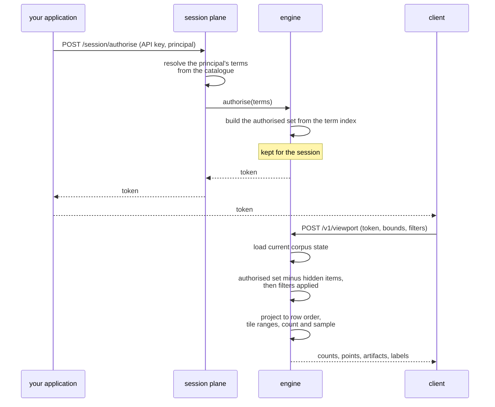

# Access control

A viewer presents a credential once and receives a token. The token names the authorised set:
everything that credential's terms admit, computed once at that moment and kept for the session.
Every later request, panning the map, filtering, or opening an item, composes a visible set from
the authorised set fresh, against whatever the corpus currently hides, and answers from inside
that visible set alone.

```mermaid
sequenceDiagram
  participant A as your application
  participant S as session plane
  participant E as engine
  participant C as client

  A->>S: POST /session/authorise (API key, principal)
  S->>S: resolve the principal's terms<br/>from the catalogue
  S->>E: authorise(terms)
  E->>E: build the authorised set from the term index
  Note over E: kept for the session
  E-->>S: token
  S-->>A: token
  A-->>C: token
  C->>E: POST /v1/viewport (token, bounds, filters)
  E->>E: load current corpus state
  E->>E: authorised set minus hidden items,<br/>then filters applied
  E->>E: project to row order,<br/>tile ranges, count and sample
  E-->>C: counts, points, artifacts, labels
```

*A session minted through `authorise-as`, to its first answer. A login on the viewer plane takes
the same path from the catalogue to the engine. Authorising happens once; every later request
composes against what it produced.*

## Terms and access labels

An operator declares an access label on each item. An access label resolves to a set of terms,
the unit of access the corpus indexes: the term index maps each term to the items that carry it.
A credential resolves to the terms it satisfies, and an item is visible to a token when the two
sets intersect.

A label is trimmed wherever it is read, at a build and at a running service, before the plugin
sees it. A label that is empty after trimming is no label, so a list holding only such labels is
an item with no label, which takes its view's default. A label written in a declaration, such as a
view's or a layer's `visibility` or a default, is stored trimmed, and one that is empty after
trimming is refused. The shipped plugin trims a credential's terms the same way, so a credential
matches the label it names however either was padded.

At authorise, the service resolves a credential to its satisfied terms and looks each one up in
the term index. The union of the items those terms carry, one bitmap over item identity, is the
authorised set: the whole of what that credential grants, independent of any later request.

**Not built:** a label that requires more than one term to hold at once. A label resolves to a
flat set of terms today, and a token satisfies it by holding any single one of them. A design for
requiring several terms together exists as a draft, unreviewed and not ratified: it binds nothing
yet.

## The plugin

Two functions, supplied by the operator, decide what a term means: one maps an item's access
label to the terms it carries, the other maps a credential to the terms it satisfies. **Not built
yet:** a host that loads an operator-supplied module implementing them. One implementation ships
today, built into the service: an item's or a credential's terms pass through unchanged, so the
two functions are the same comparison, and nothing exercises a case where they could disagree.

The item-side function runs once per item, at ingest, and has to be fast, since a corpus can hold
billions of items. The credential-side function runs once per authorisation, never per item and
rarely more than once per session, so it can afford to cost more. Both return terms as opaque byte
strings, and the service assigns each distinct one an id in one shared table, so agreement between
the two functions comes down to returning the same bytes for the same meaning.

A deployment declares how many distinct terms it expects, how many an item may carry, and how many
a credential may satisfy. Exceeding a declared bound is recorded and never excludes an item or a
term. A resource limit must not produce an authorisation decision.

The credential side receives the terms the identity catalogue resolved for the session's
principal ([getting a token](#getting-a-token)), and the shipped implementation passes them through
unchanged. **Not built yet:** removing the plugin, as [users and access](../users-and-access.md)
proposes, with access labels as visibility expressions over terms.

## Getting a token

A viewer's terms and permissions come from the identity catalogue, a SQLite database outside the
bundle that holds local principals, their password hashes and API keys, groups, the terms and
permissions granted to each, and the OIDC providers whose access tokens the service accepts
([users and access](../users-and-access.md) is the design). The whole catalogue is held in memory,
and no request reads SQLite.

A session is minted in one of three ways.

- **At login.** `POST /v1/login` on the viewer plane takes a password, an API key or an OIDC
  access token. A password is checked with argon2id, and failed attempts are limited per name
  presented. An API key is found by its public prefix and its secret compared by SHA-256 in
  constant time. An access token's signature is checked against a key its provider publishes at
  its JWKS URL, then its issuer, audience, `exp` and `nbf`; only asymmetric algorithms are
  accepted, and a token whose `typ` header names something other than a JWT or an access token
  (`at+jwt`) is refused. An OpenID Connect ID token usually carries `typ: JWT`, so the audience
  check is what refuses it: its `aud` is the client's id, not the API's. A token that more than
  one provider with its issuer accepts is refused. A provider's keys are fetched again after an
  hour; when that fetch fails, the keys held are used until they are 24 hours old, and then the
  provider's tokens are refused until a fetch succeeds. Every reason a credential is refused
  answers the same `401`. Password checks have an admission limit of their own, about one per
  core, and past it are answered `429` whether or not the name exists. The session carries the principal's `read`, `write`, `read-all`
  and `write-all`.
- **Through `authorise-as`.** `POST /session/authorise` on the session plane takes an API key
  whose principal holds `authorise-as`, and names the principal to act as: a local principal by
  name, or an OIDC identity whose access token the integrator's backend passes on. The session
  carries the target's terms and its `read` and `write`, and never its `admin`, `authorise-as`,
  `read-all` or `write-all`. The session plane is a listener separate from the viewer plane,
  because its key acts as any viewer and belongs to the integrator's backend, never to a browser.
- **With the operator credential.** On the session plane the operator credential may also name a
  set of terms, `{"terms": [...]}`, for a session holding exactly those terms and `read` and
  belonging to no principal, or ask for `{"read_all": true}`, a session of the superuser itself
  holding `read` and `read-all`. An API key may use neither form.

A local principal's terms are those granted to it and to each group it belongs to. An OIDC
identity's terms are those its provider's claim rules produce from the token's claims, together
with the terms of each local group a role mapping names. The principal must hold `read`. The
service hands the engine the resolved terms, and the engine builds the authorised set from them.
A session holding `read-all` is handed every term the dictionary carries instead, and its
authorised set is built by the same union, so it is every item; the overlay is subtracted from it
at each request as from any other, and it satisfies every view's, layer's and artifact's label.

A token is a bearer string: unguessable, random, valid until its session ends. It carries no
claims of its own and nothing that would let a holder work out its terms without asking the
server; the terms it resolved to, and the authorised set they produced, stay on the server,
matched to the token by a private table.

Building the authorised set costs work proportional to how many terms it unions and how large they
are, so it happens once per session and is kept. A live session holds it directly, and an on-disk
cache lets a repeat session skip the union. The cache key is the resolved term set, together with
the bundle's identity, the plugin's version and a watermark on the corpus, so two principals that
resolve to the same terms share one cache entry.

One token covers every view a deployment serves: a session's terms are resolved once, and every
view a later request names is answered against the same authorised set.

A session ends at the earliest of these:

- `token_max_lifetime` after it was minted;
- the expiry of the API key that authenticated or minted it;
- the `exp` of the access token that authenticated it;
- a catalogue change that could change what authorised it: a term or permission granted to or
  revoked from its principal or a group the principal belongs to, a membership changed, the
  principal disabled or deleted, a password set or cleared, the key revoked, or the provider, its
  rules or mappings, or a group one of its mappings names, changed. A change that widens access
  ends the sessions too;
- `POST /v1/logout`, `POST /session/revoke`, or an administrator ending it on the control plane.

A change commits to the catalogue, then ends the sessions it affects, under the lock a session is
registered under. A session is registered only if the catalogue is still at the generation its
terms were resolved at, so no session outlives a change that was committed while it was being
minted. An ended session's token is answered `403 expired-token`, and the client authorises again.

**Not built yet:** an audit log of authorisations, refused authentications and catalogue changes.

**Not built yet:** partitions, each holding its own term index, and a router that fans a
credential's terms out to every one it may reach. A deployment runs one process against one store,
so an authorised set is built against the whole corpus's term index in a single pass.

## What a request answers from

The authorised set is fixed at authorise, but the corpus is not. Items are deleted, suppressed, or
unsuppressed continuously, and a suppression has to apply to every session immediately, including
ones that authorised before it happened. So a request does not read the authorised set on its own:
it composes the authorised set against the overlay, the record of every item currently hidden by a
delete or a suppression, at the moment the request is made. The result is the visible set. An item
the overlay covers is removed from the visible set even though the authorised set still names it.
An item the overlay has stopped covering, because an unsuppress lifted it, is no longer subtracted,
and so is visible again.

A request loads one generation, one version of the corpus published as a whole
([write path](write-path.md#generations)), once, at the start, and answers entirely from what it
names: the tiles, the columns and the overlay a request reads all come from that one generation. A
filter then narrows which of the visible set is drawn or counted, and can only remove from it,
never add to it ([queries](queries.md#the-visible-set-and-the-filtered-set)).

Composing the visible set touches only the items a session's authorised set could ever contain,
not the whole corpus, so the work stays cheap on every request even though the overlay itself can
grow without bound. What is cached across requests is not the visible set, which changes with the
overlay on every one, but the authorised set's projection from item identity into the row order a
view stores its geometry in. That projection is cached per session and per view, and extended
forward as new rows are written; a request applies the overlay to the cached projection as a
difference rather than rebuilding either from scratch.

## When the corpus changes under a live session

| Change | Effect on an open session | How |
|---|---|---|
| An item is deleted, suppressed, or unsuppressed | Applies on the session's very next request | The overlay is read fresh at composition, every time |
| A flush publishes new rows for a term the session already holds | The session sees them once the background refresh has reached it, usually by its next request; until then it is served the previous generation's answer, which is still correct | A background pass rebuilds the cached projection for every resident session at each geometry publication; a session with no resident entry rebuilds on its next request instead |
| A grant, membership, password, key or provider behind the session changes | The session ends, and its next request is answered `403 expired-token` | There is no partial update to the authorised set. The catalogue reports which principals, keys and providers a change affects, and the server ends their sessions; a new token picks up the change |

**Not built yet:** a signal to the client when the corpus has grown a term the session holds but
the dictionary did not yet carry at authorise. This condition only narrows what the session
can see, never widens it, and nothing on the wire announces it. A client that wants to stay
current has to re-authorise on its own schedule, bounded only by the token's configured lifetime.
The signal that does exist on the wire is a `403 expired-token` refusal once a token has expired
or been revoked; a corpus change on its own produces no such refusal.

## The identity key

The `tessera_id` a client holds for an item is derived from the item's
[entity id](data-model.md#what-an-item-carries) by a keyed permutation
([security](security.md#a-client-never-sees-an-entity-id) covers what that hides). The key is
drawn at random by `tessera build` each time it creates a bundle and is stored in the bundle's
manifest. Nobody configures, supplies or changes it. A rebuild creates a new bundle with a new key,
so every `tessera_id` changes, and one from the old bundle does not name an item in the new one.
The change takes effect on the restart that loads the new bundle. A client holding `tessera_id`s
from the old bundle reads its items again, by a unique field's values or afresh.

## Where this is tested and where it lives

The plugin trait and its one built-in implementation live in `tessera-plugin`. The term index,
authorised-set construction, and the on-disk cache live in `tessera-authz`. Session composition
against the overlay, the row-space projection it feeds, and the background refresh that keeps a
resident projection current live in `tessera-engine`. The catalogue lives in `tessera-catalogue`.
Login, the session plane, OIDC token checks, the session registry that ends sessions on a
catalogue change, and the catalogue's verbs on the control plane live in `tessera-server`.

## Sources

`docs/design/architecture.md` §2.2, §2.3, §2.4, §2.6, §6; `docs/design/system-architecture.md`
§2.2, §4.2, §4.3; `docs/design/concurrency-lifecycle.md` §1.1, §2.4, §3.3;
`docs/design/core-access-expressions.md`; `docs/system/write-path.md`; `docs/system/security.md`;
`docs/system/data-model.md`; `docs/system/queries.md`; decisions 0005, 0014, 0020, 0025, 0027,
0102; `crates/tessera-plugin/src/lib.rs`; `crates/tessera-authz/src/fragment.rs`;
`crates/tessera-engine/src/session.rs`; `crates/tessera-engine/src/compose.rs`;
`crates/tessera-engine/src/refresh.rs`; `crates/tessera-server/src/session.rs`;
`crates/tessera-server/src/viewer.rs`; `crates/tessera-server/src/error.rs`;
`crates/tessera-store/src/manifest.rs`; `crates/tessera-cli/src/main.rs`.
