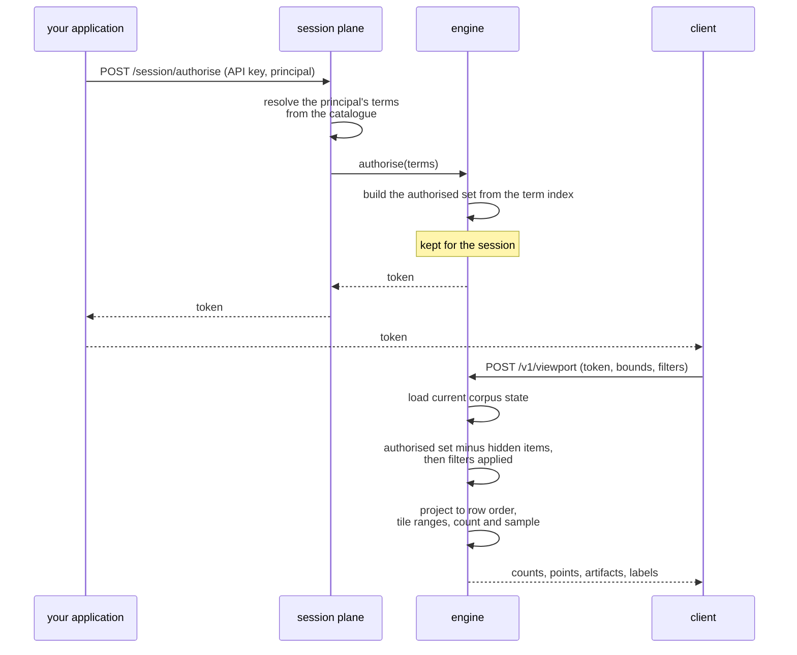

# Access control

A viewer presents a credential once and receives a token. The token names the authorised set:
everything that credential's terms admit, computed once at that moment and kept for the session.
Every later request, panning the map, filtering, or opening an item, composes a visible set from
the authorised set fresh, against whatever the corpus currently hides, and answers from inside
that visible set alone.

```mermaid
sequenceDiagram
  participant A as your application
  participant S as session plane
  participant E as engine
  participant C as client

  A->>S: POST /session/authorise (API key, principal)
  S->>S: resolve the principal's terms<br/>from the catalogue
  S->>E: authorise(terms)
  E->>E: build the authorised set from the term index
  Note over E: kept for the session
  E-->>S: token
  S-->>A: token
  A-->>C: token
  C->>E: POST /v1/viewport (token, bounds, filters)
  E->>E: load current corpus state
  E->>E: authorised set minus hidden items,<br/>then filters applied
  E->>E: project to row order,<br/>tile ranges, count and sample
  E-->>C: counts, points, artifacts, labels
```

*A session minted through `authorise-as`, to its first answer. A login on the viewer plane takes
the same path from the catalogue to the engine. Authorising happens once; every later request
composes against what it produced.*

## Terms and access labels

An operator declares an access label on each item. A label is an access expression over terms, in
the grammar Accumulo's visibility labels use, without negation: `secret&(team_a|team_b)`. A term
is written bare when it consists of ASCII letters, digits and `_ - . : /`, and otherwise in
double quotes, with `\"` and `\\` as escapes. `&` is conjunction and `|` is disjunction, and mixing
the two needs brackets: `a&b|c` is refused and `(a&b)|c` is accepted. Unicode whitespace outside
quotes is ignored, so `secret & ( team_a | team_b )` is the same label; two operands with only
whitespace between them are refused. A quoted term is taken exactly as written, so `"team a"`
holds a space. A credential's terms are trimmed, so a quoted term with whitespace at either end
could never be held, and it is refused where it is written. `public` is reserved, is valid only as
the whole label, and admits every viewer. A term that equals `public` or `inherited` ignoring
case, or holds a control character, is refused. An item, a view or an artifact may carry a list
of labels, and admits a viewer who satisfies any one of them.

One parser in `mosaica-access` reads every label: an item's access column at a build, the `access`
of an ingest row, a view's, a group's or a layer's `visibility`, an artifact's own label, and a
default. The build and a running service call it below both paths, so a label one accepts the
other accepts, and each stores the label's canonical text: nested operators flattened, operands
sorted and deduplicated, and absorption applied, so that `b&(a)` is stored as `a&b` and `a|(a&b)`
as `a`. A label that does not parse refuses the build, or the request that carries it, naming the
label. A label that is empty after trimming is no label, so a list holding only such labels is an
item with no label, which takes its view's default.

A credential resolves to the terms it holds. Each is trimmed, and one that is empty, holds a
control character or is `public` in any case is dropped. Every session holds `public`.

### How labels are indexed

The term index maps each index key to the items that carry it. An item's labels other than
`public` are read as one disjunction and normalised as a single label is, so a conjunction that
another operand absorbs is dropped. Each operand of that disjunction is then indexed on its own.

| Operand | Indexed under | Satisfied by a session when |
|---|---|---|
| `public` | the term `public`, term 0 in every bundle | always |
| A term | the term | it holds the term |
| A conjunction, such as `secret&(team_a\|team_b)` | one key of its own: a byte no term can hold, then the conjunction's canonical text | its terms satisfy the conjunction |

The label `a|(b&c)` is indexed under `a` and under the key of `b&c`. An item carrying the list
`a` and `b&c` is indexed under the same two keys, and so is one carrying `a` and `a&d` and `b&c`,
since `a` absorbs `a&d`. A disjunction inside a conjunction is not expanded, so
`secret&(team_a|team_b)` is one key. The items listed under the keys a session satisfies are
therefore exactly the items whose labels it satisfies. Per-document sharing, where nearly every
item has a label of its own, produces disjunctions of terms, which never enter the expression
graph below.

Every conjunction indexed under a key of its own is compiled into one shared directed acyclic
graph. A leaf is a
term and an inner node is an AND or an OR over its children. Structurally identical
subexpressions are one node, so `secret` appears once however many conjunctions mention it. The
graph is derived from the dictionary: it is rebuilt from the conjunctions' keys when a bundle
opens, and extended
when a flush promotes new keys, so nothing beside the dictionary stores it. A label holding a
conjunction is refused when it holds more than 1,024 nodes. A disjunction of terms has no limit.

At authorise, the service looks each of the credential's terms up in the dictionary, marks the
graph's leaves for those terms true and propagates upwards: an OR node becomes true with its first
true child, and an AND node when every child has. The authorised set is every item listed under
the credential's terms, under `public`, or under the key of a conjunction whose root became true:
one bitmap over item identity, the whole of what that credential grants, independent of any later
request. The pass visits only the nodes reachable from the credential's terms. A conjunction's key
starts with a control character, which a credential's terms cannot hold, so no credential names
one directly.

A probe of the two layouts measured authorise on 9.3 million per-document labels at 100 to 800 ms
through the graph and 1.4 to 95 ms through each term's item list, and on 500,000 compartmented
labels at 20 to 95 ms through the graph, which term lists cannot express
(`probes/2026-09-30-label-dag-authorise/results.md`). Indexing terms in term lists and only
conjunctions through the graph takes the faster figure for each. The probe indexed whole labels;
the per-operand rule has not been measured separately. Authorise runs once per session, so these figures are paid at
session start and never by a map request.

A view's, a group's, a layer's and an artifact's own labels are evaluated against the credential's
terms directly, so a label no item carries is still one a credential can satisfy.

The terms a session holds come from the identity catalogue
([getting a token](#getting-a-token)): those granted to its principal and to the principal's
groups, those an OIDC provider's claim rules produce, or, for a session the operator credential
mints, the terms the operator names.

A dictionary is sized for at most 200,000,000 index keys, and a flush that would carry it past
that is refused. An item is expected to carry at most 4,096 keys. One past that is indexed with
every key and reported, since dropping a key would change who can see it, and a resource limit
must not produce an authorisation decision.

## Getting a token

A viewer's terms and permissions come from the identity catalogue, a SQLite database outside the
bundle that holds local principals, their password hashes and API keys, groups, the terms and
permissions granted to each, and the OIDC providers whose access tokens the service accepts
([users and access](../users-and-access.md) is the design). The whole catalogue is held in memory,
and no request reads SQLite.

A session is minted in one of three ways.

- **At login.** `POST /v1/login` on the viewer plane takes a password, an API key or an OIDC
  access token. A password is checked with argon2id, and failed attempts are limited per name
  presented. An API key is found by its public prefix and its secret compared by SHA-256 in
  constant time. An access token's signature is checked against a key its provider publishes at
  its JWKS URL, then its issuer, audience, `exp` and `nbf`; only asymmetric algorithms are
  accepted, and a token whose `typ` header names something other than a JWT or an access token
  (`at+jwt`) is refused. An OpenID Connect ID token usually carries `typ: JWT`, so the audience
  check is what refuses it: its `aud` is the client's id, not the API's. A token that more than
  one provider with its issuer accepts is refused. A provider's keys are fetched again after an
  hour; when that fetch fails, the keys held are used until they are 24 hours old, and then the
  provider's tokens are refused until a fetch succeeds. Every reason a credential is refused
  answers the same `401`. Password checks have an admission limit of their own, about one per
  core, and past it are answered `429` whether or not the name exists. The session carries the principal's `read`, `write`, `read-all`
  and `write-all`.
- **Through `authorise-as`.** `POST /session/authorise` on the session plane takes an API key
  whose principal holds `authorise-as`, and names the principal to act as: a local principal by
  name, or an OIDC identity whose access token the integrator's backend passes on. The session
  carries the target's terms and its `read` and `write`, and never its `admin`, `authorise-as`,
  `read-all` or `write-all`. The session plane is a listener separate from the viewer plane,
  because its key acts as any viewer and belongs to the integrator's backend, never to a browser.
- **With the operator credential.** On the session plane the operator credential may also name a
  set of terms, `{"terms": [...]}`, for a session holding exactly those terms and `read` and
  belonging to no principal, or ask for `{"read_all": true}`, a session of the superuser itself
  holding `read` and `read-all`. An API key may use neither form.

A local principal's terms are those granted to it and to each group it belongs to. An OIDC
identity's terms are those its provider's claim rules produce from the token's claims, together
with the terms of each local group a role mapping names. The principal must hold `read`. The
service hands the engine the resolved terms, and the engine builds the authorised set from them.

A session holding `read-all` holds no terms. It satisfies every index key, including a key
promoted after it was authorised, so its authorised set is every item listed under any key in the
term index or its delta tiers: every item, since a build and an ingest each refuse an item that
would have no label. The engine rebuilds that set at each publication, as it brings every
session's set forward, so an item a flush places under a new term or a new label joins the set
when that publication reaches the session, and the session is never behind the dictionary. The
set is cached under the bundle, the rule and the watermark, so every `read-all` session at one
watermark shares one copy. The overlay is subtracted from it at each request as from any other, so a deletion or
a suppression applies to it. It satisfies every view's, group's, layer's and artifact's own label
and every layer's default label, as a session holding every term would. An artifact's membership
requirement still applies, and its members and counts are computed from the visible set. The item
card and the `labels` column name what a session holding every term is shown: each term among
the operands of the item's labels, and one clause of each conjunction among them.

A token is a bearer string: unguessable, random, valid until its session ends. It carries no
claims of its own and nothing that would let a holder work out its terms without asking the
server; the terms it resolved to, and the authorised set they produced, stay on the server,
matched to the token by a private table.

Building the authorised set costs work proportional to how many terms it unions and how large they
are, so it happens once per session and is kept. A live session holds it directly, and an on-disk
cache lets a repeat session skip the union. The cache key is the set of index keys the session
satisfies, together with the bundle's identity, the identity of the rule that turns terms into
keys and a watermark on the corpus, so two principals whose terms satisfy the same keys share one
cache entry.

One token covers every view a deployment serves: a session's terms are resolved once, and every
view a later request names is answered against the same authorised set.

A session ends at the earliest of these:

- `token_max_lifetime` after it was minted;
- the expiry of the API key that authenticated or minted it;
- the `exp` of the access token that authenticated it;
- a catalogue change that could change what authorised it: a term or permission granted to or
  revoked from its principal or a group the principal belongs to, a membership changed, the
  principal disabled or deleted, a password set or cleared, the key revoked, or the provider, its
  rules or mappings, or a group one of its mappings names, changed. A change that widens access
  ends the sessions too;
- `POST /v1/logout`, `POST /session/revoke`, or an administrator ending it on the control plane.

A change commits to the catalogue, then ends the sessions it affects, under the lock a session is
registered under. A session is registered only if the catalogue is still at the generation its
terms were resolved at, so no session outlives a change that was committed while it was being
minted. An ended session's token is answered `403 expired-token`, and the client authorises again.

**Not built yet:** an audit log of authorisations, refused authentications and catalogue changes.

**Not built yet:** partitions, each holding its own term index, and a router that fans a
credential's terms out to every one it may reach. A deployment runs one process against one store,
so an authorised set is built against the whole corpus's term index in a single pass.

## What a request answers from

The authorised set is fixed at authorise, but the corpus is not. Items are deleted, suppressed, or
unsuppressed continuously, and a suppression has to apply to every session immediately, including
ones that authorised before it happened. So a request does not read the authorised set on its own:
it composes the authorised set against the overlay, the record of every item currently hidden by a
delete or a suppression, at the moment the request is made. The result is the visible set. An item
the overlay covers is removed from the visible set even though the authorised set still names it.
An item the overlay has stopped covering, because an unsuppress lifted it, is no longer subtracted,
and so is visible again.

A request loads one generation, one version of the corpus published as a whole
([write path](write-path.md#generations)), once, at the start, and answers entirely from what it
names: the tiles, the columns and the overlay a request reads all come from that one generation. A
filter then narrows which of the visible set is drawn or counted, and can only remove from it,
never add to it ([queries](queries.md#the-visible-set-and-the-filtered-set)).

Composing the visible set touches only the items a session's authorised set could ever contain,
not the whole corpus, so the work stays cheap on every request even though the overlay itself can
grow without bound. What is cached across requests is not the visible set, which changes with the
overlay on every one, but the authorised set's projection from item identity into the row order a
view stores its geometry in. That projection is cached per session and per view, and extended
forward as new rows are written; a request applies the overlay to the cached projection as a
difference rather than rebuilding either from scratch.

## When the corpus changes under a live session

| Change | Effect on an open session | How |
|---|---|---|
| An item is deleted, suppressed, or unsuppressed | Applies on the session's very next request | The overlay is read fresh at composition, every time |
| A flush publishes new rows for a term the session already holds | The session sees them once the background refresh has reached it, usually by its next request; until then it is served the previous generation's answer, which is still correct | A background pass rebuilds the cached projection for every resident session at each geometry publication; a session with no resident entry rebuilds on its next request instead |
| A grant, membership, password, key or provider behind the session changes | The session ends, and its next request is answered `403 expired-token` | There is no partial update to the authorised set. The catalogue reports which principals, keys and providers a change affects, and the server ends their sessions; a new token picks up the change |

**Not built yet:** adding to an open session a term it holds that the dictionary did not carry
at authorise, or a conjunction that a flush promoted after it and that the
session's terms satisfy. The session sees fewer items than its terms admit until it authorises
again, never more. A `read-all` session is the exception: it satisfies every key, whenever the key
was promoted. The engine can tell whether a session is behind in this way, from the keys
promoted since it authorised, but nothing outside its tests asks. **Not built yet:** a signal to
the client when this happens; nothing on the wire announces it. A client that wants to stay
current has to re-authorise on its own schedule, bounded only by the token's configured lifetime.
The signal that does exist on the wire is a `403 expired-token` refusal once a token has expired
or been revoked; a corpus change on its own produces no such refusal.

## The identity key

The `tessera_id` a client holds for an item is derived from the item's
[entity id](data-model.md#what-an-item-carries) by a keyed permutation
([security](security.md#a-client-never-sees-an-entity-id) covers what that hides). The key is
drawn at random by `mosaica build` each time it creates a bundle and is stored in the bundle's
manifest. Nobody configures, supplies or changes it. A rebuild creates a new bundle with a new key,
so every `tessera_id` changes, and one from the old bundle does not name an item in the new one.
The change takes effect on the restart that loads the new bundle. A client holding `tessera_id`s
from the old bundle reads its items again, by a unique field's values or afresh.

## Where this is tested and where it lives

The grammar, normalisation, the rules for a declared or a held label and the expression graph
live in `mosaica-access`, which depends on no other crate of the workspace. The index keys an
item's labels give it, the term index, authorised-set construction and the on-disk cache live in
`mosaica-authz`. Session composition
against the overlay, the row-space projection it feeds, and the background refresh that keeps a
resident projection current live in `mosaica-engine`. The catalogue lives in `mosaica-catalogue`.
Login, the session plane, OIDC token checks, the session registry that ends sessions on a
catalogue change, and the catalogue's verbs on the control plane live in `mosaica-server`.

## Sources

`docs/design/architecture.md` §2.2, §2.3, §2.4, §2.6, §6; `docs/design/system-architecture.md`
§2.2, §4.2, §4.3; `docs/design/concurrency-lifecycle.md` §1.1, §2.4, §3.3;
`docs/design/core-access-expressions.md`; `docs/system/write-path.md`; `docs/system/security.md`;
`docs/system/data-model.md`; `docs/system/queries.md`; decisions 0005, 0014, 0020, 0025, 0027,
0102; `docs/users-and-access.md`; `crates/mosaica-access/src/lib.rs`;
`crates/mosaica-authz/src/label/index.rs`; `crates/mosaica-authz/src/fragment.rs`;
`crates/mosaica-engine/src/session.rs`; `crates/mosaica-engine/src/compose.rs`;
`crates/mosaica-engine/src/refresh.rs`; `crates/mosaica-server/src/session.rs`;
`crates/mosaica-server/src/viewer.rs`; `crates/mosaica-server/src/error.rs`;
`crates/mosaica-store/src/manifest.rs`; `crates/mosaica-cli/src/main.rs`.
