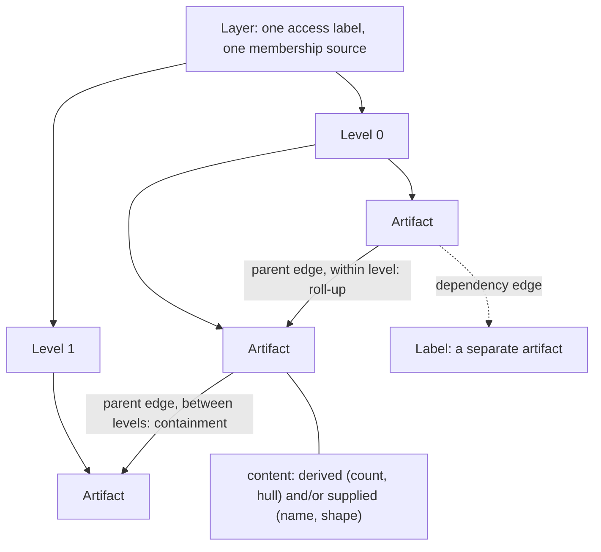
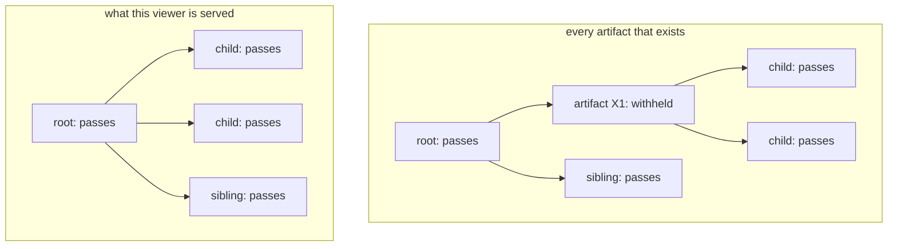
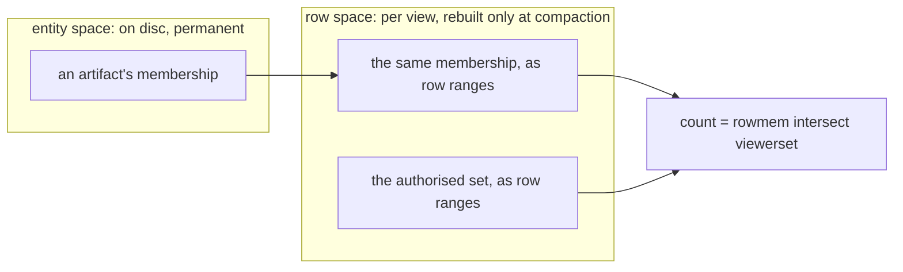

# Annotations

A map is not only points. Tessera also serves clusters, administrative or taxonomic hierarchies,
regions bounded by a shape, and the labels that name them, each drawn from a set of points and
each served or withheld for one viewer exactly as a point is.

## What an artifact is

An artifact is a named object over a set of points: a cluster, a boundary, a node in a hierarchy,
a drawn or published region, a label. It has an identity, a membership (the points it is about),
and content: properties either computed from its members or supplied by whoever declared it. There
is no fixed catalogue of artifact kinds. What an artifact can show follows from what it declares
having, not from a name given to the kind of thing it is: any artifact with a membership and a
position can carry a count, a centroid or a hull, whether it is called a cluster or a boundary.

Artifacts belong to a layer. A layer is a published collection of artifacts of one kind: one
clustering, one boundary collection, one set of labels. It is declared once, with one access label
and one membership source shared by everything in it.

An edge relates two artifacts, and is always declared by whoever built the layer, never inferred by
the engine. A parent edge gives a layer its hierarchy. A dependency edge attaches one artifact to
another independently of any hierarchy, such as a label naming the cluster it describes.



*A layer declares one or more levels; each level holds artifacts. A parent edge within a level is
a roll-up; between levels it is containment. A dependency edge attaches one artifact to another.
Content is derived or supplied per artifact.*

An artifact's position within its layer and level never reaches a client. On the wire it is a
`tessera_id`, exactly like a point's, resolved by the server on every request.

## Declaring a layer

A layer's declaration names its views, its access label, its membership requirement, its
hierarchy, and its membership source: how it decides which points belong to which artifact. An
access label, a membership requirement and a stance on whether its own artifacts carry their own
labels are all required, with no default for any of them.

There are three membership sources.

An **enumerated** membership is a table, or a column on the points themselves, naming which
artifact each point belongs to: a caller's clustering output, most often, read as one row per
point-and-artifact pair.

An **attribute predicate** turns a single category field already declared on every point into a
layer of its own. Each distinct value in that field is an artifact, and every point that carries
the value is automatically its member. A predicate layer's artifacts carry only their key and
nothing else: it can declare no content, no dependency edges, no levels, and no hierarchy but
flat, because any of those would register a layer that is reachable and serves nothing.

A **shape** membership declares an artifact as a box, circle, ellipse or polygon over one of the
corpus's views. Its members are whichever points fall inside it.

| Shape | Declared by |
|---|---|
| box | two corners |
| circle | a centre and a radius |
| ellipse | a centre, two axes and an angle |
| polygon | one or more rings |

Either way the members are resolved once, when each batch of points is published, into row ranges
rather than tested per request, so a shape's or a predicate's membership costs no more at request
time than an enumerated one does. A polygon can be declared in longitude and latitude on a view
that has a projection: it is carried through that view's own transform, the same one the points
themselves went through, before it is compared against their stored positions.

```toml
[[layer]]
name       = "clusters"
views      = ["embedding"]
membership = "enumerated"
visibility = "public"
artifact_visibility = { default = "inherited" }
require_member_visibility = { fraction = 0.1 }
hierarchy  = { kind = "nested" }

[layer.members]
source = "cluster_assignments"
fields = { key = "cluster_id", entity = "point_id" }

[layer.content]
computed = ["centroid", "hull"]
```

*A trimmed layer declaration: an enumerated clustering, drawn on one view, whose artifacts each
carry a computed centroid and hull.*

The three sources age differently. An enumerated membership is fixed at whatever a member table or
column last said: a newly ingested point sits on the map, visible as a point, until the layer is
refreshed. An attribute-predicate or shape membership never goes stale, because it is recomputed
from the point's own stored value or position rather than declared alongside it. A point ingested
this second belongs to the matching artifact on the next request.

## Hierarchies

A layer declares one hierarchy kind, which decides what its edges mean and how many levels the
layer has. Within a layer, a level is a resolution: a layer with several resolutions, such as
ward, district and region, declares several levels; a layer with one resolution, which most
clusterings and most boundary collections are, declares exactly one.

| Kind | Structure | Levels |
|---|---|---|
| flat | no edges | none needed, though a layer may still declare several |
| nested | a tree; edges within one level | none: the tree is the edges |
| dag | a directed graph; edges within one level; a child may have more than one parent | none |
| stacked | independent analyses, with no edges between them | one per analysis |
| tiered | edges between levels, coarser containing finer | one per scale |

Within a level, a parent edge is a roll-up: substituting a parent for its children is a legitimate
coarsening, because a cluster is an abstract grouping that a coarser one can stand in for. Between
levels, a parent edge is information rather than roll-up: a state is not a coarser version of its
counties, so a response never substitutes one for the other, and a client uses the edge to nest
what it draws rather than to reduce it. A stacked layer has no edges at all; each level is an
independent analysis at its own resolution, and switching between them replaces one analysis with
another rather than coarsening a claim.

Where a hierarchy holds more artifacts than a request's budget allows, Tessera does not sample
artifacts: dropping some at random would produce a wrong map, not a smaller one. Instead, every
candidate artifact is tested independently against how much of its own membership this viewer can
already see, and where a passing artifact has a passing descendant that still fits the budget, the
descendant is preferred; otherwise the ancestor stands in for it. This is a per-artifact test
rather than a walk down the tree that stops at the first artifact a viewer cannot see: an artifact
that fails its own test is treated as though it never existed, and its passing children attach
directly to its nearest passing ancestor. A layer declares a default for this substitution,
`prune_children`: true prefers a coarser passing ancestor whenever one is available; false serves
every per-artifact-tested node at its own depth and leaves any coarsening to what a request's own
budget forces.



*X1 is withheld and skipped rather than shown as a gap. Its passing children attach to its nearest
passing ancestor, giving the viewer the same tree they would see had X1 never existed.*

On a directed graph a child can have more than one parent, and so can sit at more than one depth
depending which parent is used to reach it. Depth is measured as the longest path from any root,
which keeps every edge descending: a request asking for a given depth is never left substituting a
parent it should be showing beneath. A concept reachable through two parents is drawn under both,
because that is what belonging to two parents means, rather than being split into two separate
artifacts to avoid the duplication.

## Browsing a hierarchy

A layer's hierarchy can be browsed independently of any viewport: a page of its top-level
artifacts, one artifact's children and its own parents, or a search by name, each row carrying the
same masked count a map would show beside it. This exists because a hierarchy whose members are
spread across the whole map may never surface at any zoom a viewport's own budget reaches: an
artifact with tens of thousands of members spread evenly across a corpus draws nothing
recognisable at any practical zoom, however real it is. Every artifact returned has passed the
same test the map applies, so a withheld one leaves no gap in a page a caller could count, and a
relation between two artifacts is only named where both ends of it are visible to this viewer.

## Visibility

Like a point, a layer can carry an access label, and a viewer who does not hold a matching term
cannot know the layer exists at all: a request naming it behaves exactly as a request naming a
layer that was never declared.

A layer can also declare that each artifact carries its own access label, independent of its
layer's and independent of any of its members': `artifact_visibility = { field = "team", default =
"inherited" }`. An artifact whose own label a viewer does not hold does not exist for them,
whatever they can see of its membership. On every viewer route it is answered exactly as an
artifact that was never published: no row, no count, no parent or target naming it, a `404` by
identifier, an empty operand for `member_of` and the artifact region leaf, and no gap in a browse
page. A label attached to it is withheld with it. An artifact's label narrows its layer's and never
widens it.

At a build the label is read from the artifact source's column the field names, a string, a list of
strings or a dictionary of strings, or from an inline row's `access`. At a running service each
record of a publication, and each JSON row of a growth, carries `"access": ["team-a", "team-b"]`; a
record carrying one on a layer that names no field is refused, and so are labels the plugin maps to
no term. On a layer scoped to a group a growth names the view its artifact belongs to, as a
publication does: `view` on a JSON row, or a `view` column in the Arrow form. A viewer is admitted
by holding any one of the labels. An artifact with no label takes the layer's `default`: `inherited`
leaves it to the layer's own label and membership requirement, and a label treats it as carrying
that label. A label is set once: an artifact published with none may be given one later, the same
label again changes nothing, and a different one is refused. It takes effect when the level is next
published, as every fill does. Changing a label means deleting the artifact and publishing it again,
under a new identifier.

A label is compared with the descriptors the viewer's credential resolved to, so a label no item
carries is still one a credential can hold. A layer's own label is compared the same way.

Separately, a layer declares a membership requirement: how much of an artifact's declared
membership a viewer must already be able to see before the artifact itself is served.

| Requirement | What it means |
|---|---|
| all | every member the artifact declares must be visible to the viewer |
| any | at least one member must be visible |
| a fraction | at least that share of the declared membership must be visible |
| a count | at least that many members must be visible |
| none | the artifact is served to every viewer its access label admits, whatever they can see of its members |

`none` is right for a boundary that exists whether or not a viewer can see anything inside it.
`all` is the strictest setting, withholding an artifact the moment a single member is hidden.

Both axes MUST hold, tested against the authorised set and never the filtered one: an artifact is
served to a given viewer only where it satisfies its own access label, its layer's, and its
membership requirement together. The number shown beside a served artifact is always the count of
its own declared membership that this viewer can see, never a total computed over the whole corpus
and then hidden, and never a count over anything the layer did not declare.

A filter narrows which points are drawn. It never changes which artifacts are served: an
artifact's existence and the count beside it are decided against the authorised set regardless of
any filter, so an artifact does not appear or disappear as a viewer narrows or clears a query. What
a filter adds to a served artifact is one flag: whether any member of it, among the ones this
viewer can see, satisfies the filter. A highlight adds a second, separate flag over whatever the
filter already matched, or, with no filter, over everything the viewer may see, so a viewer can
narrow the map with a filter and separately light part of what remains with a highlight, or
highlight without narrowing at all.

## What an artifact carries

Content is either **derived**, recomputed for each viewer from the members they can see (a count,
a centroid, a box, or a hull), or **supplied**: written once by whoever declared the layer, such as
a name, a description, or a fitted shape.

Supplied content can carry several ranked versions of the same thing, most often a label written
once for a general audience and again, more specifically, for a narrower one. Each ranked version
carries its own generating set, the points it was actually produced from. A viewer MUST be served
the first ranked version whose generating set they can see in full, and MUST NOT be served a
version they can only partly see, or a shortened or redacted one. Some supplied content, an
authored name unrelated to any particular member, carries no generating set at all and is served
to anyone who can see the artifact itself, since there is nothing behind it to check.

An artifact MUST be served to a viewer entire, or absent, indistinguishable from one that never
existed. There is no state in which a viewer knows an artifact exists but cannot read part of its
content.

A label is declared as a dependent layer: its own membership requirement decides whether it
appears at all, and its content separately declares whether the label text was generated from the
members it names (`all`, so a viewer reads it only having seen every one of them) or is true
independently of them (`inherited`, an authored name a viewer reads on the strength of the
artifact's own gate alone).

Where a layer declares a hull, a served artifact carries a concave shape over its visible members:
it follows their outline rather than the wider convex hull a straight-line wrap would draw. Where
the visible members fall into two or more separated groups, the response carries one ring per
group instead of a single ring joining them across empty ground that no member occupies.

The shape never extends past a visible member: every vertex it carries is a real member's
position. A member close to the edge can still sit fractionally outside its own ring, which is an
imprecise summary of where the cluster is, not a false claim about that member. Because the shape
is built entirely from the members this viewer can already see, it discloses nothing about members
the viewer cannot see. It says strictly less about the corpus than the boundary a viewer could
already infer from the count and the members drawn on the map.

Content, and separate flags for the filter and the highlight, reach a client as part of a
[viewport response](queries.md#the-viewport).

## How membership is stored

An artifact's membership is stored twice, in two different spaces, for two different reasons.
Entity space is where an artifact's identity lives: durable, on disc, addressed the same way every
point is, and untouched by how the map happens to be laid out. Row space is where every count and
every drawn shape is computed: an artifact's members expressed as positions in whichever view's
row order is current.

A flush publishes newly ingested points as rows; a merge combines segments and renumbers rows
within its own span; compaction retires deletions and suppressions and rebuilds
the structures the other two leave alone. Row space is one of those structures. A flush appends
rows it does not yet hold and a merge renumbers rows it does not reference, so neither changes it,
and the compaction is the only operation that rebuilds it, translating the current entity-space
membership into the row positions a merge produced. Until the next fold, a member whose row a
flush created contributes nothing to its artifact's row-space count. An enumerated artifact's count
can therefore understate its true membership between one fold and the next, and never overstate
it; a clustering whose members mostly predate the layer already held rows at the last fold, so this
rarely affects it.



*An artifact's membership survives every rebuild in entity space. Every count is computed in row
space, against whatever the layout was at the last fold.*

A request reads only row space. A count is an artifact's row-space membership intersected with the
authorised set's own row-space form: bitmap arithmetic over whatever range of the map the request
touches, never a scan of the artifact's members one by one. This is also what makes an
attribute-predicate or shape membership cheap. Neither is stored as a set of points at all, only as
the rule or the shape itself, resolved into row ranges once when each batch of points is published
rather than evaluated per request.

## How artifacts change under writes

| Event | What changes for an artifact | What a viewer sees |
|---|---|---|
| Flush | A newly published point joins any attribute-predicate or shape artifact it matches. An enumerated artifact gains no new members until its layer is refreshed, and even a member the refreshed layer already names does not count until the next fold folds its row into the row form | A predicate or shape artifact's count, and its hull where one is declared, grow on the next request; an enumerated artifact's do not change until its layer is refreshed and the following fold has run |
| Merge | Segments are combined and rows renumbered within the merged span. No membership or content changes | Nothing |
| Deletion of a member | At accept, the member leaves every masked count, for every membership source alike. Content generated from it stops serving at the same moment: its generating set no longer matches every member a viewer can see, so containment fails for everyone | The count falls, and any content generated from the deleted point disappears, on the next request after the deletion is accepted |
| Compaction | The deleted member's bit is dropped from the row form. What happens to content generated from it follows the layer's own declaration (below) | For content that was already withdrawn at the deletion, nothing changes; content declared permissive, and generated from more than the one deleted point, resumes serving |
| A point deleted and re-ingested (the only way to edit one) | The old point's membership and generating-set participation lapse exactly as an ordinary deletion's do. The re-ingested point has a new identity and only rejoins an artifact if the new batch names it as a member | The count falls when the deletion is accepted, and rises again only if the re-ingested point is named as a member and flushed |
| Suppression of the artifact itself | The artifact stops being served immediately. Nothing about it is stored differently; it resumes only on an explicit unsuppress | The artifact disappears the moment the suppression is accepted, and stays gone until an explicit unsuppress |
| Deletion of the artifact itself | The artifact stops being served immediately. Its record, and every edge naming it, are removed at the next fold. Deleting it does not lift a suppression already on it: only an [explicit unsuppress](write-path.md#denies) does | The artifact disappears the moment the deletion is accepted, and never returns |

An ingested point's membership column carries the layer's edges as well as its memberships, exactly
as a member file's does at a build: consecutive keys in one point's list name a parent and a child.
Where the child does not exist, it is created holding that parent. Where it exists and holds no
parent — a roster published with names before any point named the tree — the edge is recorded on it,
durably, with the batch. Where it holds the same parent, the column restates what is already there.
Where it holds a different one the batch is refused, because there is no correct output and choosing
would publish a hierarchy nobody declared. A `dag` layer's list is memberships alone; its several
parents are declared on the artifact itself. A recorded edge reaches a response when the level's
row form is next published, which is the terms every other change to an artifact is served on.

A layer's supplied content declares, once, how it behaves when a point behind it is deleted.
Either way the content stops serving the moment the deletion is accepted, because a generating set
that no longer matches every visible member fails containment for every viewer, whatever the
declaration says. The declaration decides what happens next, at the compaction. Under **strict**, the
default, the compaction drops the content and its generating set for good. Under **permissive**, the compaction
removes the deleted point from the generating set, and the content resumes serving to viewers who
can see every point that remains, unless the deletion took the last of them, in which case it is
dropped exactly as under strict.

## What is not built

There is no way to declare an artifact at request time, an analyst's own selection, saved and
shared through the control plane the way a layer itself can be. A caller wanting that has to build
the artifact into a layer ahead of time, offline.

There is no edit verb for an artifact. Correcting one means replacing the layer that declares it,
which mints a fresh identity for every artifact in it rather than keeping the old ones. A client
holding an old identifier finds it no longer resolves, exactly as with a point.

A layer whose membership is an attribute predicate or a shape cannot declare a fractional
membership requirement, because nothing yet defines what that layer's full membership is for a
fraction to be taken against; the total changes with every write, unlike an enumerated layer's
fixed member count. `all` is the fraction form at its highest value, so it is excluded along with
every other fraction. Such a layer can declare any, a count, or none instead.

## Sources

`docs/design/artifact-system.md`; `docs/design/annotations.md` §1–§6;
`docs/design/annotation-representation.md` §2, §4, §6; `docs/design/annotation-write-cycle.md`
§2, §3, §4.1, §4.2, §7; `docs/design/artifacts-from-points.md` §1–§3, §5–§6;
`docs/design/artifact-shapes.md` §1, §4–§6, §10; `docs/design/polygon-membership.md` §1–§4, §8;
`docs/design/dag-hierarchies.md` §1–§6; `docs/design/artifact-serving-at-scale.md` §1, §6.1, §9;
`docs/design/artifact-fetch-protocol.md` §1–§4, §9; `docs/design/highlight-and-hierarchy.md` §2,
§5; `docs/design/configuration.md` §1, §5, §6, §7; `docs/design/write-path.md` §5.4;
decisions 0047, 0072, 0075, 0076, 0080, 0081, 0084, 0086, 0088, 0089, 0091, 0107, 0114.
