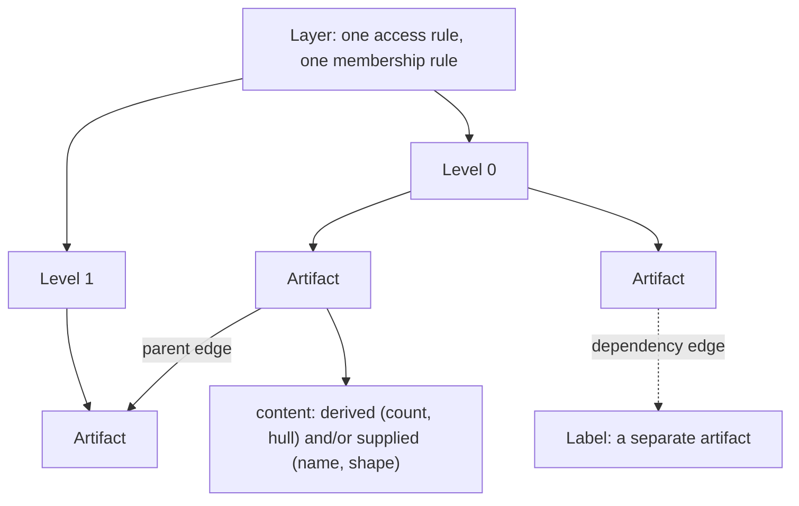
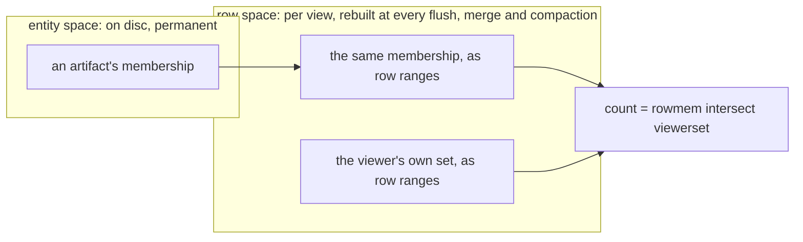
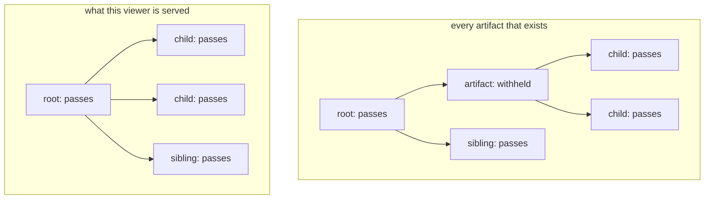

# Annotations

A map is not only points. Tessera also serves clusters, administrative or taxonomic hierarchies,
regions bounded by a shape, and the labels that name them, each drawn from a set of points and
each served or withheld for one viewer exactly as a point is.

## What an artifact is

An artifact is a named object over a set of points: a cluster, a boundary, a node in a hierarchy,
a drawn or published region, a label. It has an identity, a membership (the points it is about),
and content: properties either computed from its members or supplied by whoever declared it. There
is no fixed catalogue of artifact kinds. What an artifact can show follows from what it declares
having, not from a name given to the kind of thing it is: any artifact with a membership and a
position can carry a count, a centroid or a hull, whether it is called a cluster or a boundary.

Artifacts belong to a layer. A layer is a published collection of artifacts of one kind: one
clustering, one boundary collection, one set of labels. It is declared once, with one access rule
and one membership rule shared by everything in it. Within a layer, a level is a resolution. A
layer with several resolutions, such as ward, district and region, declares several levels; a
layer with one resolution, which most clusterings and most boundary collections are, declares
exactly one.

An edge relates two artifacts, and is always declared by whoever built the layer, never inferred by
the engine. A parent edge gives a layer its hierarchy. Within one level it is a roll-up, so that a
child can stand in for its parent when a response needs fewer artifacts than points exist. Between
levels it is a containment relation, such as a ward inside a district, that a client can use to
nest what it draws. A dependency edge attaches one artifact to another independently of any
hierarchy, such as a label naming the cluster it describes, and carries its own rule: an artifact
reached only by a dependency edge is served only where the artifact it depends on is served, and is
removed the moment that artifact is removed.



*A layer declares one or more levels; each level holds artifacts, edges relate artifacts to each
other, and content is derived or supplied per artifact.*

An artifact's position within its layer and level never reaches a client. On the wire it is a
`tessera_id`, exactly like a point's, resolved by the server on every request.

## Declaring a layer

A layer's declaration names its views, its access rule, its membership requirement, its hierarchy,
and its membership source: how it decides which points belong to which artifact. There are three
membership sources.

An **enumerated** membership is a table, or a column on the points themselves, naming which
artifact each point belongs to: a caller's clustering output, most often, read as one row per
point-and-artifact pair. An **attribute predicate** turns a single category field already declared
on every point into a layer of its own. Each distinct value in that field is an artifact, and every
point that carries the value is automatically its member. A **shape** membership (`spatial` in the declaration) declares an
artifact as a box, circle, ellipse or polygon over one of the corpus's views. Its members are
whichever points fall inside it.

```toml
[[layer]]
name       = "clusters"
views      = ["embedding"]
membership = "enumerated"
visibility = "public"
require_member_visibility = { fraction = 0.1 }
hierarchy  = { kind = "nested" }

[layer.members]
source = "cluster_assignments"
fields = { key = "cluster_id", entity = "point_id" }

[layer.content]
computed = ["centroid", "hull"]
```

*A trimmed layer declaration: an enumerated clustering, drawn on one view, whose artifacts each
carry a computed centroid and hull.*

The three sources age differently, which matters more than their declaration does. An enumerated
membership is fixed at whatever a member table or column last said. A newly ingested point sits on
the map, visible as a point, until the layer is refreshed. An attribute-predicate or shape
membership never goes stale, because it is recomputed from the point's own stored value or position
rather than declared alongside it. A point ingested this second belongs to the matching artifact on
the very next request.

## What an artifact carries

Content is either **derived**, recomputed for each viewer from the members they can see (a count,
a centroid, a box, or a hull), or **supplied**: written once by whoever declared the layer, such as
a name, a description, or a fitted shape. Supplied content can carry several ranked versions of the
same thing, most often a label written once for a general audience and again, more specifically,
for a narrower one. A viewer is served the first ranked version whose generating set (the points
the content was actually produced from) they can see in full. They are never served a version they
can only partly see, and never a shortened or redacted one. Some supplied content, an authored name
unrelated to any particular member, carries no generating set at all and is served to anyone who
can see the artifact itself, since there is nothing behind it to check.

An artifact is served to a viewer entire, or it is absent, indistinguishable from one that never
existed. There is no state in which a viewer knows an artifact exists but cannot read part of its
content, and no artifact is ever served with some of its declared content missing.

## The two visibility axes, as mechanism

Like a point, a layer can carry an access label, and a viewer who does not hold a matching term
cannot know the layer exists at all. A request naming it behaves exactly as a request naming a
layer that was never declared. An individual artifact can also carry its own access label,
independent of its layer's and independent of any of its members'. An artifact whose own label a
viewer does not satisfy does not exist for them, whatever they can see of its membership.

Separately, a layer declares a membership requirement: how much of an artifact's declared
membership a viewer must already be able to see before the artifact itself is served.

| Requirement | What it means |
|---|---|
| all | every member the artifact declares must be visible to the viewer |
| any | at least one member must be visible |
| a fraction | at least that share of the declared membership must be visible |
| a count | at least that many members must be visible |
| none | the artifact is served to every viewer its access label admits, whatever they can see of its members |

The specification calls this the existence criterion. It plays the same role for an artifact that
ordinary access control plays for a point. `none` is right for a boundary that exists whether or
not a viewer can see anything inside it. `all` is the strictest setting, withholding an artifact the
moment a single member is hidden.

Both axes must hold, and both are tested against the viewer's own set and never the filtered one:
an artifact MUST satisfy its own access label, its layer's, and its membership requirement together
before it is served to a given viewer. The number shown beside a served artifact is always the
count of its own declared membership that this viewer can see, never a total computed over the
whole corpus and then hidden, and never a count over anything the layer did not declare.

## How membership is stored and evaluated

An artifact's membership is stored twice, in two different spaces, for two different reasons.

Entity space is where an artifact's identity lives: durable, on disc, addressed the same way every
point is, and untouched by how the map happens to be laid out. Row space is where every count and
every drawn shape is actually computed: an artifact's members expressed as positions in whichever
view's row order is current, rebuilt each time that order changes, at a flush, a merge, and a
compaction, because a row that named one point before the rebuild can name a different one after
it.



*An artifact's membership survives every rebuild in entity space. Every count is computed in row
space, against whatever the current layout happens to be.*

A request reads only row space. A count is the row-space membership intersected with the viewer's
own row-space set: bitmap arithmetic over whatever range of the map the request touches, never a
scan of the artifact's members one by one. This is also what makes an attribute-predicate or shape
membership cheap. Neither is stored as a set of points at all, only as the rule or the shape
itself, resolved into row ranges once when each batch of points is published rather than evaluated
per request.

## Hulls

Where a layer declares a hull, a served artifact carries a shape summarising where its visible
members sit, dug inward from their outer edge so that it follows the members' own outline rather
than the more generous boundary a straight-line wrap around them would draw. Where the visible
members fall into two or more separated groups, the response carries one ring per group instead of
a single ring joining them across empty ground that no member occupies.

The shape never extends past a visible member: every vertex it carries is a real member's position.
A member close to the edge can still sit fractionally outside its own ring, which is an imprecise
summary of where the cluster is, not a false claim about that member. Because the shape is built
entirely from the members this viewer can already see, and never extends beyond them, it discloses
nothing about members the viewer cannot see. It says strictly less about the corpus than the
boundary a viewer could already infer from the count and the members drawn on the map.

## Shapes

An artifact's membership can itself be declared as a shape, a box, circle, ellipse or polygon, over
one of the corpus's views.

| Shape | Declared by |
|---|---|
| box | two corners |
| circle | a centre and a radius |
| ellipse | a centre, two axes and an angle |
| polygon | one or more rings |

The members are exactly the points whose stored position falls inside it, resolved once when each
batch of points is published rather than tested per request, so a shape's membership costs no more
at request time than an enumerated one does. A polygon can be declared in longitude and latitude on
a view that has a projection. It is then carried through that view's own transform, the same
transform the points themselves went through, before it is compared against their stored
positions, rather than declared directly in the view's own coordinates. Like an attribute
predicate, a shape's membership never goes stale: a point ingested inside a published boundary
belongs to it on the very next request.

## Hierarchies and DAGs

A layer declares one hierarchy kind, and it decides what a layer's edges mean.

| Kind | Structure | Levels |
|---|---|---|
| flat | no edges | none needed, though a layer may still declare several |
| nested | a tree; edges within one level | none: the tree is the edges |
| dag | a directed graph; edges within one level; a child may have more than one parent | none |
| stacked | independent analyses, with no edges between them | one per analysis |
| tiered | edges between levels, coarser containing finer | one per scale |

Within a level, an edge is a roll-up: substituting a parent for its children is a legitimate
coarsening, because a cluster is an abstract grouping that a coarser one can stand in for. Between
levels, an edge is information rather than roll-up. A state is not a coarser version of its
counties, so a response never substitutes one for the other, and a client uses the edge to nest
what it draws rather than to reduce it. A stacked layer has no edges at all. Each level is an
independent analysis at its own resolution, and switching between them replaces one analysis with
another rather than coarsening a claim.

Where a hierarchy holds more artifacts than a request's budget allows, Tessera does not sample
artifacts: dropping some at random would produce a wrong map, not a smaller one. Instead, every
candidate artifact is tested independently against its own membership requirement, and where a
passing artifact has a passing descendant that still fits the budget, the descendant is preferred.
Otherwise the ancestor stands in for it. This is a per-artifact test rather than a walk down the
tree that stops at the first artifact a viewer cannot see: an artifact that fails its own
requirement is treated as though it never existed, and its passing children attach directly to its
nearest passing ancestor.



*A withheld artifact is skipped rather than shown as a gap. Its passing children attach to its
nearest passing ancestor, giving the viewer the same tree they would see had the withheld artifact
never existed.*

On a directed graph a child can have more than one parent, and so can sit at more than one depth
depending which parent is used to reach it. Depth is measured as the longest path from any root,
which keeps every edge descending: a request asking for a given depth is never left substituting a
parent it should be showing beneath. A concept reachable through two parents is drawn under both,
because that is what belonging to two parents means, rather than being split into two separate
artifacts to avoid the duplication.

## What a filter does to artifacts

A filter narrows which points are drawn. It never changes which artifacts are served. An artifact's
existence and the count beside it are decided against the viewer's own set regardless of any
filter, so an artifact does not appear or disappear as a viewer narrows or clears a query. What a
filter adds to a served artifact is one flag: whether any member of it, among the ones this viewer
can see, satisfies the filter. Highlight works the same way, as a second and independent flag, so a
viewer can narrow the map with a filter and separately light part of what remains with a highlight,
or highlight without narrowing at all.

## How artifacts change under writes

| Event | What changes for an artifact | What a viewer sees |
|---|---|---|
| Flush | A newly published point joins any attribute-predicate or shape artifact it matches. An enumerated artifact gains no new members until its layer is next refreshed | A predicate or shape artifact's count and shape grow on the next request; an enumerated artifact's do not change |
| Merge | Segments are combined and rows renumbered internally. No membership or content changes | Nothing |
| Compaction (the fold) | A deleted point is removed from every artifact's membership it belonged to. Where a layer's supplied content was generated from that point, the content is either withdrawn or kept, depending on the layer's declaration (below) | The artifact's count falls when the deletion is first accepted, before the fold runs; a change to supplied content takes effect at the fold |
| A point deleted and re-ingested (the only way to edit one) | The old point's membership lapses exactly as an ordinary deletion's does. The re-ingested point has a new identity and only rejoins an artifact if the new batch says so | The artifact's count falls when the deletion is accepted, and rises again only if the re-ingested point is named as a member and flushed |
| Suppression or deletion of the artifact itself | A suppressed artifact stops being served immediately and starts again only on an explicit unsuppress. A deleted artifact stops being served immediately; its record is removed at compaction, and any suppression on it is removed at the same time | The artifact disappears from every response the moment the suppression or deletion is accepted, and stays gone until an explicit unsuppress, or forever if deleted |

A layer's supplied content declares, once, how it behaves when compaction removes one of the points
it was generated from. The default, strict, withdraws the content the moment compaction removes any
point behind it. The alternative, permissive, keeps the content drawn from whichever points remain,
unless the deletion took the last of them, in which case it is withdrawn exactly as under strict.

## What is not built

No shipped corpus declares a layer with the directed-graph hierarchy kind, though the kind itself
is built and can be declared. A caller wanting one writes it out as any other layer is written.

There is no way to declare an artifact at request time, an analyst's own selection, saved and
shared through the control plane the way a layer itself can be. A caller wanting that has to build
the artifact into a layer ahead of time, offline.

There is no edit verb for an artifact. Correcting one means replacing the layer that declares it,
which mints a fresh identity for every artifact in it rather than keeping the old ones. A client
holding an old identifier finds it no longer resolves, exactly as with a point.

A layer whose membership is an attribute predicate or a shape cannot declare a fractional membership
requirement, because nothing yet defines what that layer's full membership is for a fraction to be
taken against. The total changes with every write, unlike an enumerated layer's fixed member count.
Such a layer can declare all, any, a count, or none instead.

## Sources

`docs/design/artifact-system.md`; `docs/design/annotations.md` §1–§6;
`docs/design/annotation-representation.md` §2, §4, §6; `docs/design/annotation-write-cycle.md`
§2, §7; `docs/design/artifacts-from-points.md` §1–§3, §5–§6; `docs/design/artifact-shapes.md`
§1, §4–§6, §10; `docs/design/polygon-membership.md` §1–§4, §8; `docs/design/dag-hierarchies.md`
§1–§6; `docs/design/artifact-serving-at-scale.md` §1, §6.1, §9; `docs/design/artifact-fetch-protocol.md`
§1–§4, §9; `docs/design/highlight-and-hierarchy.md` §2, §5; `docs/design/configuration.md` §1;
decisions 0047, 0072, 0075, 0076, 0080, 0081, 0084, 0086, 0088, 0089, 0091, 0107, 0114.
