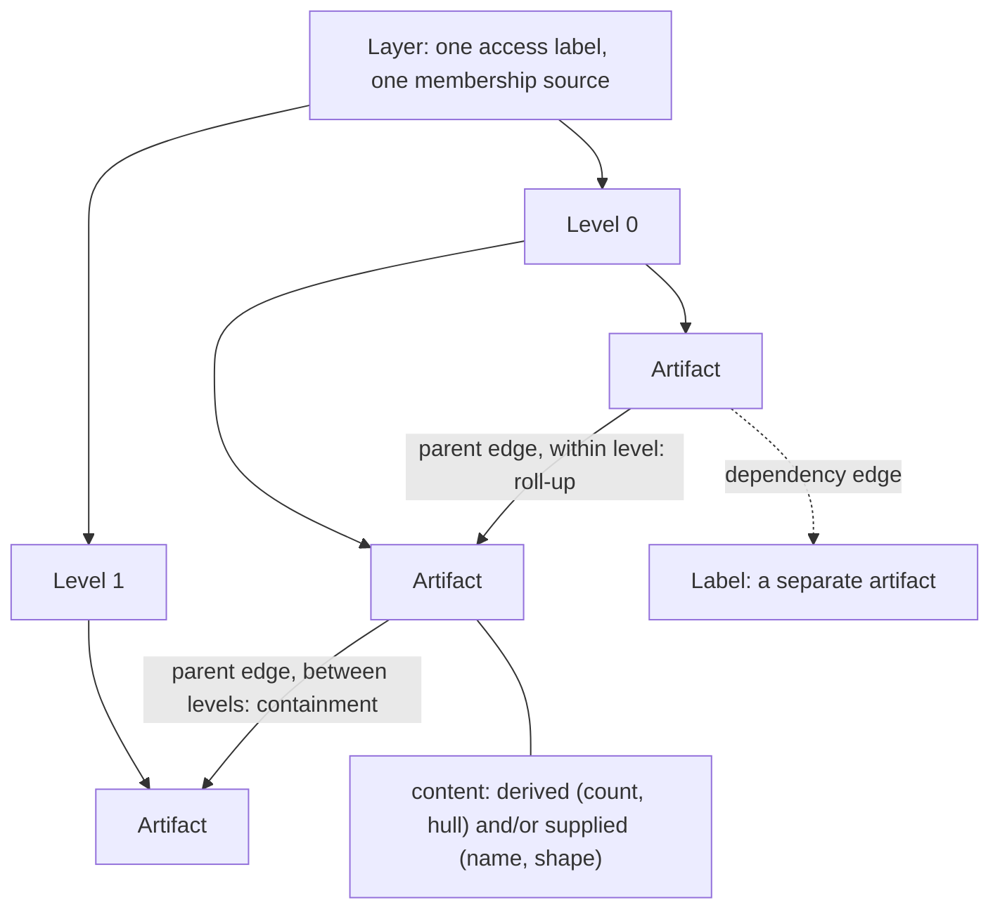
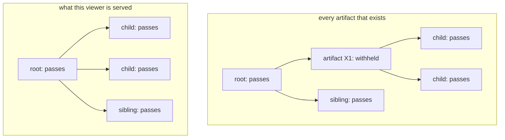
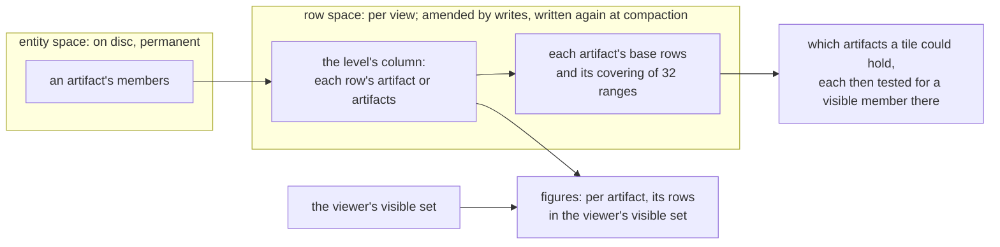

# Annotations

A map is not only points. Tessera also serves clusters, administrative or taxonomic hierarchies,
regions bounded by a shape, and the labels that name them, each drawn from a set of points and
each served or withheld for one viewer exactly as a point is.

## What an artifact is

An artifact is a named object over a set of points: a cluster, a boundary, a node in a hierarchy,
a drawn or published region, a label. It has an identity, a membership (the points it is about),
and content: properties either computed from its members or supplied by whoever declared it. There
is no fixed catalogue of artifact kinds. What an artifact can show follows from what it declares
having, not from a name given to the kind of thing it is: any artifact with a membership and a
position can carry a count, a centroid or a hull, whether it is called a cluster or a boundary.

Artifacts belong to a layer. A layer is a published collection of artifacts of one kind: one
clustering, one boundary collection, one set of labels. It is declared once, with one access label
and one membership source shared by everything in it.

An edge relates two artifacts, and is always declared by whoever built the layer, never inferred by
the engine. A parent edge gives a layer its hierarchy. A dependency edge attaches one artifact to
another independently of any hierarchy, such as a label naming the cluster it describes.


```mermaid
flowchart TB
  layer["Layer: one access label, one membership source"]
  layer --> level0["Level 0"]
  layer --> level1["Level 1"]
  level0 --> a1["Artifact"]
  level0 --> a2["Artifact"]
  level1 --> a3["Artifact"]
  a2 -->|"parent edge, within level: roll-up"| a1
  a1 -->|"parent edge, between levels: containment"| a3
  a2 -.->|"dependency edge"| label["Label: a separate artifact"]
  a1 --- content["content: derived (count, hull) and/or supplied (name, shape)"]
```

*A layer declares one or more levels; each level holds artifacts. A parent edge within a level is
a roll-up; between levels it is containment. A dependency edge attaches one artifact to another.
Content is derived or supplied per artifact.*

An artifact's position within its layer and level never reaches a client. On the wire it is a
`tessera_id`, exactly like a point's, resolved by the server on every request.

## Declaring a layer

A layer's declaration names its views, its access label, its membership requirement, its
hierarchy, and its membership source: how it decides which points belong to which artifact. An
access label, a membership requirement and a stance on whether its own artifacts carry their own
labels are all required, with no default for any of them.

There are three membership sources.

An **enumerated** membership is a table, or a column on the points themselves, naming which
artifact each point belongs to: a caller's clustering output, most often, read as one row per
point-and-artifact pair.

An **attribute predicate** turns a single category field already declared on every point into a
layer of its own. Each distinct value in that field is an artifact, and every point that carries
the value is automatically its member. A predicate layer's artifacts carry only their key and
nothing else: it can declare no content, no dependency edges, no levels, and no hierarchy but
flat, because any of those would register a layer that is reachable and serves nothing.

A **shape** membership declares an artifact as a box, circle, ellipse or polygon over one of the
corpus's views. Its members are whichever points fall inside it.

| Shape | Declared by |
|---|---|
| box | two corners |
| circle | a centre and a radius |
| ellipse | a centre, two axes and an angle |
| polygon | one or more rings |

Either way the members are resolved once, when each batch of points is published, into row ranges
rather than tested per request, so a shape's or a predicate's membership costs no more at request
time than an enumerated one does. A polygon can be declared in longitude and latitude on a view
that has a projection: it is carried through that view's own transform, the same one the points
themselves went through, before it is compared against their stored positions.

```toml
[[layer]]
name       = "clusters"
views      = ["embedding"]
membership = "enumerated"
visibility = "public"
artifact_visibility = { default = "inherited" }
require_member_visibility = { fraction = 0.1 }
hierarchy  = { kind = "nested" }

[layer.members]
source = "cluster_assignments"
fields = { key = "cluster_id", doi = "paper_doi" }

[layer.content]
computed = ["centroid", "hull"]
```

*A trimmed layer declaration: an enumerated clustering, drawn on one view, whose artifacts each
carry a computed centroid and hull. Each row of the members file names its point by `doi`, an
attribute declared `unique`, kept in the file's `paper_doi` column.*

The three sources age differently. An enumerated membership is fixed at whatever a member table or
column last said: a newly ingested point sits on the map, visible as a point, until the layer is
refreshed. An attribute-predicate or shape membership never goes stale, because it is recomputed
from the point's own stored value or position rather than declared alongside it. A point ingested
this second belongs to the matching artifact on the next request.

## Hierarchies

A layer declares one hierarchy kind, which decides what its edges mean and how many levels the
layer has. Within a layer, a level is a resolution: a layer with several resolutions, such as
ward, district and region, declares several levels; a layer with one resolution, which most
clusterings and most boundary collections are, declares exactly one.

| Kind | Structure | Levels |
|---|---|---|
| flat | no edges | none needed, though a layer may still declare several |
| nested | a tree; edges within one level | none: the tree is the edges |
| dag | a directed graph; edges within one level; a child may have more than one parent | none |
| stacked | independent analyses, with no edges between them | one per analysis |
| tiered | edges between levels, coarser containing finer | one per scale |

Within a level, a parent edge is a roll-up: substituting a parent for its children is a legitimate
coarsening, because a cluster is an abstract grouping that a coarser one can stand in for. Between
levels, a parent edge is information rather than roll-up: a state is not a coarser version of its
counties, so a response never substitutes one for the other, and a client uses the edge to nest
what it draws rather than to reduce it. A stacked layer has no edges at all; each level is an
independent analysis at its own resolution, and switching between them replaces one analysis with
another rather than coarsening a claim.

A `nested` or `dag` layer is served over the whole area a request names and cut to the request's
budget. Dropping artifacts at random to meet the budget would draw a wrong map. Every candidate
artifact is tested independently against how much of its own membership this viewer can already
see, and where a passing artifact has a passing descendant that still fits the budget, the
descendant is preferred; otherwise the ancestor stands in for it. This is a per-artifact test
rather than a walk down the tree that stops at the first artifact a viewer cannot see: an artifact
that fails its own test is treated as though it never existed, and its passing children attach
directly to its nearest passing ancestor. A layer declares a default for this substitution,
`prune_children`: true prefers a coarser passing ancestor whenever one is available; false serves
every per-artifact-tested node at its own depth and leaves any coarsening to what a request's own
budget forces.


```mermaid
flowchart TB
  subgraph before["every artifact that exists"]
    R1["root: passes"] --> X1["artifact X1: withheld"]
    X1 --> C1a["child: passes"]
    X1 --> C1b["child: passes"]
    R1 --> D1["sibling: passes"]
  end
  subgraph after["what this viewer is served"]
    R2["root: passes"] --> C2a["child: passes"]
    R2 --> C2b["child: passes"]
    R2 --> D2["sibling: passes"]
  end
```

*X1 is withheld and skipped rather than shown as a gap. Its passing children attach to its nearest
passing ancestor, giving the viewer the same tree they would see had X1 never existed.*

On a directed graph a child can have more than one parent, and so can sit at more than one depth
depending which parent is used to reach it. Depth is measured as the longest path from any root,
which keeps every edge descending: a request asking for a given depth is never left substituting a
parent it should be showing beneath. A concept reachable through two parents is drawn under both,
because that is what belonging to two parents means, rather than being split into two separate
artifacts to avoid the duplication.

## How many artifacts a tile shows

A `flat`, `stacked` or `tiered` layer is served tile by tile
([queries](queries.md#the-artifacts-in-each-tile)). The request names a quota, `per_tile`: the
most artifacts one level shows in one tile. For each tile and each level, the server takes the
artifacts this viewer is served that have at least one member the viewer can see inside the tile.
It orders them by the viewer's count of the artifact's visible members across the whole view,
largest first, breaks a tie by `tessera_id`, and sends the first `per_tile` of them.

An artifact with visible members in several tiles is served in each of those tiles, with the same
count, centroid and box in every one. Each of those numbers is taken over all the members the
viewer can see, wherever they lie, so nothing about a tile changes them.

The quota is filled from the viewer's own counts, so which artifacts a tile shows depends on
nothing the viewer cannot see, and a repeated request is answered the same way until the corpus
or the viewer's visible set changes. A small cluster in a tile crowded with larger ones is left out
of that tile's frame. It appears in a tile where it is among the largest, or at a deeper zoom,
where the tiles are smaller. A dependent artifact, such as a label naming a cluster, is served in a
tile only where its target is in that tile's frame, when the request also names the target's
layer, and one that is not takes no place in the quota.

## Browsing a hierarchy

A layer's hierarchy can be browsed independently of any viewport: a page of its top-level artifacts,
one artifact's children and its own parents, or a search by name, each row carrying the same masked
count a map would show beside it. This exists because an artifact whose members are spread across
the whole map may never surface on it: an artifact with tens of thousands of members spread evenly
across a corpus draws nothing recognisable at any practical zoom, however real it is, and a tile
crowded with larger artifacts leaves it out of its quota. Every artifact returned has passed the
same test the map applies, so a withheld one leaves no gap in a page a caller could count, and a
relation between two artifacts is only named where both ends of it are visible to this viewer.

## Visibility

Like a point, a layer can carry an access label, and a viewer whose terms do not satisfy it
cannot know the layer exists at all: a request naming it behaves exactly as a request naming a
layer that was never declared.

A layer can also declare that each artifact carries its own access label, independent of its
layer's and independent of any of its members': `artifact_visibility = { field = "team", default =
"inherited" }`. An artifact whose own labels a viewer does not satisfy does not exist for them,
whatever they can see of its membership. On every viewer route it is answered exactly as an
artifact that was never published: no row, no count, no parent or target naming it, a `404` by
identifier, an empty operand for `member_of` and the artifact region leaf, and no gap in a browse
page. A label attached to it is withheld with it. An artifact's label narrows its layer's and never
widens it.

At a build the label is read from the artifact source's column the field names, a string, a list of
strings or a dictionary of strings, or from an inline row's `access`. At a running service each
record of a publication, and each row of a growth, carries its labels: `"access": ["team-a",
"team-b"]` on a JSON row, or an `access` column in the Arrow form of a growth, read as a points
file's access column is: a string, a list of strings or a dictionary of strings. A record carrying
labels on a layer that names no field is refused, and so is a label that is not an access
expression.

Every artifact created on a layer whose field is named states its labels, at a build and at a
running service alike. At a build the artifact source carries the field's column, and an inline row
carries `access`, `[]` for no label of its own. At a running service a publication record carries
`access`, `null` or `[]` for no label of its own. A label that is empty once trimmed is no label, so
`[""]` states no label too. A record without `access` is refused, as is a source without the column,
and so is a key that a build's member file or an ingest's layer column would mint without an
artifact row, since a minted artifact carries nothing but its name. A record that only adds members
to an artifact that exists, or a growth, need not state labels. The Python client refuses an
artifacts insert that names no `access=` column into a layer that reads labels, and before the
layer's first commit a `key=` or `members=` insert naming a key no artifacts insert declares; after
the first commit the server refuses the artifact that insert would create.

On a layer scoped to a group a growth names the view its artifact belongs to, as a publication
does: `view` on a JSON row, or a `view` column in the Arrow form. A viewer is admitted by holding
any one of the labels. An artifact with no label takes the layer's `default`: `inherited` leaves it
to the layer's own label and membership requirement, and a label treats it as carrying that label.
A label is set once: an artifact published with none may be given one later, the same label again
changes nothing, and a different one is refused. It takes effect when the level is next published,
as every fill does. Changing a label means deleting the artifact and publishing it again, under a
new identifier.

A label is an access expression, evaluated against the terms the viewer's credential holds, so a
label no item carries is still one a credential can satisfy. An artifact carrying several labels
admits a viewer who satisfies any one of them. A layer's own label is evaluated the same way.

Separately, a layer declares a membership requirement: how much of an artifact's declared
membership a viewer must already be able to see before the artifact itself is served.

| Requirement | What it means |
|---|---|
| all | every member the artifact declares must be visible to the viewer |
| any | at least one member must be visible |
| a fraction | at least that share of the declared membership must be visible |
| a count | at least that many members must be visible |
| none | the artifact is served to every viewer its access label admits, whatever they can see of its members |

`none` is right for a boundary that exists whether or not a viewer can see anything inside it.
`all` is the strictest setting, withholding an artifact the moment a single member is hidden.

Both axes MUST hold, tested against the authorised set and never the filtered one: an artifact is
served to a given viewer only where it satisfies its own access label, its layer's, and its
membership requirement together. The number shown beside a served artifact is always the count of
its own declared membership that this viewer can see, never a total computed over the whole corpus
and then hidden, and never a count over anything the layer did not declare.

A filter narrows which points are drawn. It never changes which artifacts are served: an
artifact's existence and the count beside it are decided against the authorised set regardless of
any filter, so an artifact does not appear or disappear as a viewer narrows or clears a query. What
a filter adds to a served artifact is one flag: whether any member of it, among the ones this
viewer can see, satisfies the filter. A highlight adds a second, separate flag over whatever the
filter already matched, or, with no filter, over everything the viewer may see, so a viewer can
narrow the map with a filter and separately light part of what remains with a highlight, or
highlight without narrowing at all. In the artifacts of a tile, both flags are taken over the
artifact's visible members inside that tile, so a cluster can be lit in one tile and dull in the
next while its count is the same in both.

## What an artifact carries

Content is either **derived**, recomputed for each viewer from the members they can see (a count,
a centroid, a box, or a hull), or **supplied**: written once by whoever declared the layer, such as
a name, a description, or a fitted shape.

Supplied content can carry several ranked versions of the same thing, most often a label written
once for a general audience and again, more specifically, for a narrower one. Each ranked version
carries its own generating set, the points it was actually produced from. A viewer MUST be served
the first ranked version whose generating set they can see in full, and MUST NOT be served a
version they can only partly see, or a shortened or redacted one. Some supplied content, an
authored name unrelated to any particular member, carries no generating set at all and is served
to anyone who can see the artifact itself, since there is nothing behind it to check.

An artifact MUST be served to a viewer entire, or absent, indistinguishable from one that never
existed. There is no state in which a viewer knows an artifact exists but cannot read part of its
content.

A label is declared as a dependent layer: its own membership requirement decides whether it
appears at all, and its content separately declares whether the label text was generated from the
members it names (`all`, so a viewer reads it only having seen every one of them) or is true
independently of them (`inherited`, an authored name a viewer reads on the strength of the
artifact's own gate alone).

Where a layer declares a hull, a served artifact carries a concave shape over its visible members:
it follows their outline rather than the wider convex hull a straight-line wrap would draw. Where
the visible members fall into two or more separated groups, the response carries one ring per
group instead of a single ring joining them across empty ground that no member occupies.

The shape never extends past a visible member: every vertex it carries is a real member's
position. A member close to the edge can still sit fractionally outside its own ring, which is an
imprecise summary of where the cluster is, not a false claim about that member. Because the shape
is built entirely from the members this viewer can already see, it discloses nothing about members
the viewer cannot see. It says strictly less about the corpus than the boundary a viewer could
already infer from the count and the members drawn on the map.

Supplied content, the count, the centroid, the box and the two flags reach a client with the
[artifacts of each tile](queries.md#the-artifacts-in-each-tile). A hull or an authored shape is read
by the artifact's `tessera_id`, or in a [bulk read](queries.md#what-a-read-of-artifacts-returns) of
its layer.

## How membership is stored

An artifact's membership is stored in two spaces. Entity space is where an artifact's identity and
its declared members live: durable, on disc, addressed the same way every point is, and untouched
by how the map happens to be laid out. Row space is where every count and every drawn shape is
computed: the same members as positions in one view's row order.

A level is held in row space in one of three forms. Stored by artifact (`"rows"`), it keeps one
bitmap of rows per artifact, and a tile index places each artifact by the span of its rows. Served
from a column, it keeps for every row the artifact or artifacts that row belongs to: a label column
(`"column"`), one artifact a row, where the level's memberships are disjoint, or a list column
(`"list"`), any number a row, where they overlap. Which form a level takes follows from its
declaration and its data:

| Level | Form |
|---|---|
| enumerated, in a `flat`, `stacked` or `tiered` layer | served from a column: a label column where the memberships are disjoint, a list column where they overlap |
| an attribute predicate | a label column, since each item carries one value |
| enumerated in a `nested` or `dag` layer, and a shape | stored by artifact, unless the level holds at least 1,000 artifacts and a quarter of them are spread too widely for any node of the tile index; it is then served from a column, by the same rule |
| any level of a layer that declares `layout` | the form the declaration names, except that a level declared `"column"` whose memberships overlap is stored by artifact, with a warning in the log |

*The form of each level. Every form answers with the same artifacts and the same counts; the form
decides only what a request costs.*

A build and a compaction choose each level's form from its memberships. A level published at a
running service takes the form a build would give it, chosen at its first publication from the
memberships that publication carries, and a restart replays the same choice.

Beside a level's column, the bundle stores each artifact's members as a bitmap of the view's base
rows, the rows the last build or compaction wrote, and a covering: at most 32 row ranges that hold
every member. The covering is the artifact's span of rows split at its 31 widest gaps, which is the
covering of 32 ranges that holds the fewest rows that are not members. A build, a compaction and the
server's own composition of a column all write both from the column's labels, so they are the column
read the other way round. `tessera verify --deep` writes them again from the column and compares. On
a level's first use the server sorts the coverings into an index, which is never stored, and finds
the artifacts whose coverings overlap a range of rows by binary search. A covering says only where
an artifact's members could be: an artifact it proposes for a tile is still tested against the
viewer's visible rows there before it is served.

Between compactions a level's memberships only grow. A growth or a publication adds its rows to
the level's column, to the member bitmaps and to the coverings. A covering that has to take a new
row keeps its 32 ranges by merging the two neighbouring ranges with the narrowest gap between them,
so it can hold more rows that are not members than a fresh split would, until the next compaction
writes it again. A flush gives newly ingested items rows above the base, and the column takes their
labels, so an item that belongs to an artifact counts from the flush that places it. The member
bitmaps and coverings hold base rows only. Rows above the base are read from the column itself.

A growth or a publication can give an item a second artifact in a level served from a label
column, which a label column cannot hold. Where the level's form is the server's choice, the level
is served from a list column from then on, composed from the label column and the new rows, and
the next compaction records the change. Where the declaration names `"column"`, the server logs a
warning and serves the level by artifact, or from a list column where it holds no bitmap of each
artifact's rows. The answers are the same either way.


```mermaid
flowchart LR
  subgraph entity["entity space: on disc, permanent"]
    mem["an artifact's members"]
  end
  subgraph row["row space: per view; amended by writes, written again at compaction"]
    col["the level's column:<br/>each row's artifact or artifacts"]
    bits["each artifact's base rows<br/>and its covering of 32 ranges"]
  end
  mem --> col
  col --> bits
  col --> figures["figures: per artifact, its rows<br/>in the viewer's visible set"]
  visible["the viewer's visible set"] --> figures
  bits --> tile["which artifacts a tile could hold,<br/>each then tested for a visible member there"]
```

*An artifact's membership survives every rebuild in entity space. Every count is taken in row
space, over the viewer's visible set, and the member bitmaps and coverings only propose where an
artifact could be.*

A request reads only row space. For a level served from a column, an artifact's count is how many
rows of the viewer's visible set carry its label, and its centroid and box are taken over those
rows. The server walks a grant's rows in the base once per level and corrects that walk on every
request for the rows the request's own visible set removes or adds, as
[serving](serving.md#a-levels-figures) describes. For a level stored by artifact, a count is the
artifact's bitmap intersected with the visible set. Neither is a scan of an artifact's members one
by one. An attribute-predicate or shape membership is stored as the rule or the shape itself,
resolved into rows once when each batch of points is published rather than evaluated per request,
so it costs no more at request time than an enumerated one.

## How artifacts change under writes

| Event | What changes for an artifact | What a viewer sees |
|---|---|---|
| Flush | A newly published point joins any attribute-predicate or shape artifact it matches, and every enumerated artifact its ingest row or a publication named. Until its flush a buffered point has no row and is in no count | Each such artifact's count, and its hull where one is declared, grow on the next request after the flush |
| Merge | Segments are combined and rows renumbered within the merged span. No membership or content changes. Each held row form is rebased onto the new numbering when the merge is published | Nothing, except for a request whose row space was taken before the merge was published and which finds the held form already rebased. That request builds its own row form from the artifact store over its own row space, so its counts include every growth and publication accepted since the held form was last published. The request after it is served the published form again, so a count can fall back by those writes until they are next published. Neither answer counts a membership the store does not hold or a point the viewer cannot see |
| Deletion of a member | At accept, the member leaves every masked count, for every membership source alike. Content generated from it stops serving at the same moment: its generating set no longer matches every member a viewer can see, so containment fails for everyone | The count falls, and any content generated from the deleted point disappears, on the next request after the deletion is accepted |
| Compaction | The deleted member's row is dropped, and each level's column, member bitmaps and coverings are written again over the new rows. What happens to content generated from the deleted member follows the layer's own declaration (below) | For content that was already withdrawn at the deletion, nothing changes; content declared permissive, and generated from more than the one deleted point, resumes serving |
| An edit of a member: an ingest row changing its values, label or position ([edits](write-path.md#edits)) | The item moves to a new entity and keeps its `tessera_id`. The new entity joins every enumerated artifact the old one was a member of, and every generating set it took part in; the old entity leaves them | Nothing changes in its memberships. The item leaves every view, and so every count, until the flush that places its new rows, and is counted again from the publication the edit's receipt names |
| Suppression of the artifact itself | The artifact stops being served immediately. Nothing about it is stored differently; it resumes only on an explicit unsuppress | The artifact disappears the moment the suppression is accepted, and stays gone until an explicit unsuppress |
| Deletion of the artifact itself | The artifact stops being served immediately. Its record, and every edge naming it, are removed at the next fold. Deleting it does not lift a suppression already on it: only an [explicit unsuppress](write-path.md#denies) does | The artifact disappears the moment the deletion is accepted, and never returns |

An ingested point's membership column carries the layer's edges as well as its memberships, exactly
as a member file's does at a build: consecutive keys in one point's list name a parent and a child.
Where the child does not exist, it is created holding that parent. Where it exists and holds no
parent, the edge is recorded on it, durably, with the batch. This is the case of a roster published
with names before any point named the tree. Where it holds the same parent, the column restates what
is already there. Where it holds a different one the batch is refused, because there is no correct
output and choosing would publish a hierarchy nobody declared. A `dag` layer's list is memberships
alone; its several parents are declared on the artifact itself. A recorded edge reaches a response
when the level's row form is next published, which is the terms every other change to an artifact is
served on.

A scalar key sits at level 0 unless the batch carries a `level` column of `uint32`, which places
each row's scalar keys at that level, as a member file's `level` column does at a build. A null
level is level 0. A list's positions carry its levels, so a `level` column beside a list is not
read. No attribute or layer may be named `level`, so the column always means this.

A layer's supplied content declares, once, how it behaves when a point behind it is deleted. Either
way the content stops serving the moment the deletion is accepted, because a generating set that no
longer matches every visible member fails containment for every viewer, whatever the declaration
says. The declaration decides what happens next, at the compaction. Under **strict**, the default,
the compaction drops the content and its generating set for good. Under **permissive**, the
compaction removes the deleted point from the generating set, and the content resumes serving to
viewers who can see every point that remains, unless the deletion took the last of them, in which
case it is dropped exactly as under strict.

## What is not built

There is no way to declare an artifact at request time, an analyst's own selection, saved and
shared through the control plane the way a layer itself can be. A caller wanting that has to build
the artifact into a layer ahead of time, offline.

There is no edit verb for an artifact. Correcting one means replacing the layer that declares it,
which mints a fresh identity for every artifact in it rather than keeping the old ones. A client
holding an old identifier finds it no longer resolves, exactly as with a point.

A layer whose membership is an attribute predicate or a shape cannot declare a fractional
membership requirement, because nothing yet defines what that layer's full membership is for a
fraction to be taken against; the total changes with every write, unlike an enumerated layer's
fixed member count. `all` is the fraction form at its highest value, so it is excluded along with
every other fraction. Such a layer can declare any, a count, or none instead.

## Sources

`docs/design/artifact-system.md`; `docs/design/annotations.md` §1–§6;
`docs/design/annotation-representation.md` §2, §4, §6; `docs/design/annotation-write-cycle.md`
§2, §3, §4.1, §4.2, §7; `docs/design/artifacts-from-points.md` §1–§3, §5–§6;
`docs/design/artifact-shapes.md` §1, §4–§6, §10; `docs/design/polygon-membership.md` §1–§4, §8;
`docs/design/dag-hierarchies.md` §1–§6; `docs/design/artifact-serving-at-scale.md` §1, §6.1, §9;
`docs/design/artifact-fetch-protocol.md` §1–§4, §9; `docs/design/highlight-and-hierarchy.md` §2,
§5; `docs/design/configuration.md` §1, §5, §6, §7; `docs/design/write-path.md` §5.4;
decisions 0047, 0072, 0075, 0076, 0080, 0081, 0084, 0086, 0088, 0089, 0091, 0107, 0114.
