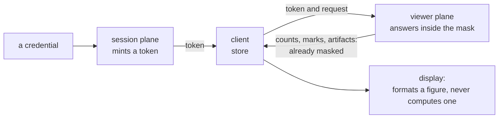
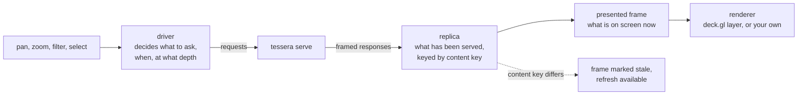
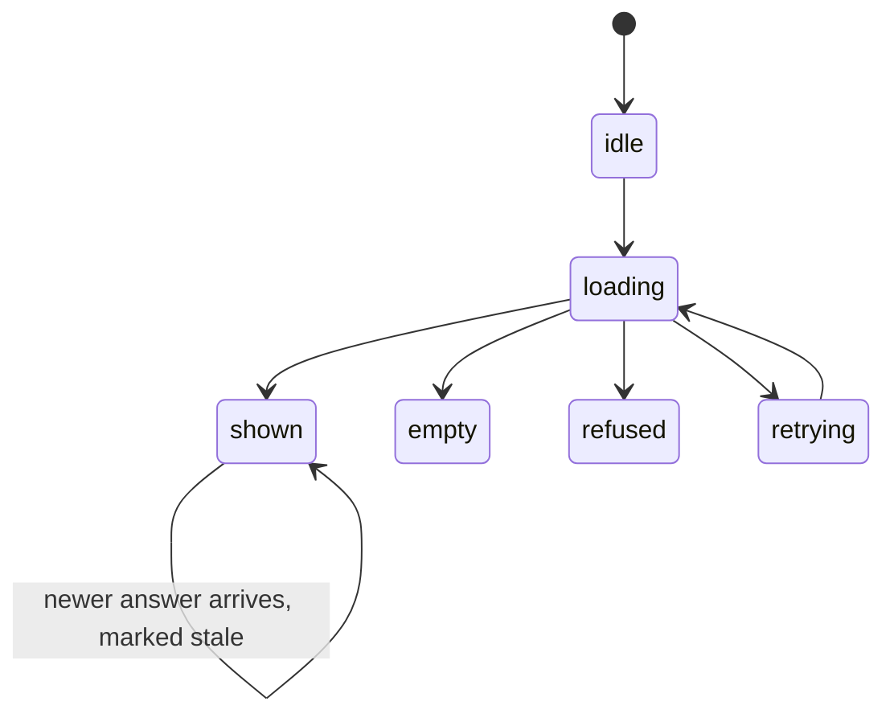
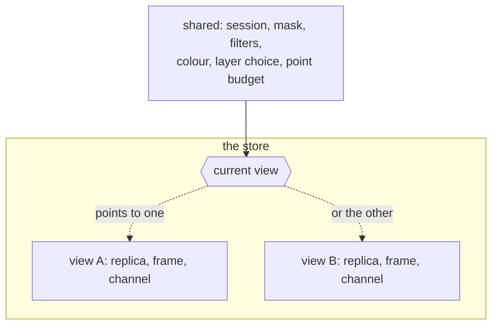

# Clients

A client asks Tessera for a view and displays what comes back. The server decides what a viewer
may see before any byte leaves it; nothing a client does can widen or narrow that. What a client
can get wrong is different in kind: showing a sample as though it were the whole set, showing a
stale view as current, showing a refusal as an empty corpus, showing a masked count as if it were
a size.

*A client asks and displays. Every masked figure it shows was computed before it arrived.*

## Deployment

A deployment exposes two planes. The session plane turns a credential into a token and must never
be reached from a browser: it is gated by the deployment's own credential, which only the
integrator's own server should hold. The viewer plane is what a client actually calls with a
token, and it can be reached directly by a browser or a notebook page from an origin the
deployment has named in advance.

| Plane | Reached by | Holds | Cross-origin access |
|---|---|---|---|
| Session | The integrator's own server | The deployment credential | Never opened to a browser |
| Viewer | A browser, a notebook page, or a server on the client's behalf | A per-viewer token | An enumerated list of allowed origins, none by default |

Two shapes of mistake pass every functional test and are invisible in a screenshot. The pooled
service token authorises once with a single broad credential and filters per user inside its own
proxy afterwards, so every one of its users ends up seeing counts and labels computed for the
credential rather than for themselves. The claim-minting proxy issues a token per user but mints
it from whatever claims a caller supplies, so anyone who can call the minting endpoint can claim
to be any user it names. The authority to grant access belongs at the integrator's own server,
verified there against an identity provider's claims, never merely asserted by whoever calls the
minting endpoint.

When a session ends, a client returns to the integrator's server for a new token; a notebook
widget renews before its current one expires rather than waiting for a refusal.

## What a client holds

A client holds a versioned partial copy of what has been served: a session (the token and the
identity it names), a replica of the geometry the server has answered for so far, and a presented
frame, the part of the replica currently on screen. None of this is authoritative. A replica can
be thrown away and rebuilt from nothing and the picture it produces is the same, only slower to
arrive.

The replica is kept current against a content key that changes when the corpus changes in a way
this viewer can see: new items reaching a request, or an item being denied. A client compares the
content key on its held geometry against the content key on the latest answer it has received. A
mismatch means the marks on screen may be older than the corpus. It does not mean they are wrong,
and nothing already shown is retracted. It does mean a stale view can still draw an item the
corpus has since denied, which is why the mark and the refresh control are mandatory rather than
cosmetic.

| What changed | What it means for a held view |
|---|---|
| A different viewer authorises (a new token for a different principal) | The replica, held artifacts, the selection and per-column state drop. Every `tessera_id` the client already holds stays valid, because the permutation is keyed per deployment, not per viewer. |
| The deployment is rebuilt (a key rotation, or the id space advancing) | Every `tessera_id` the client holds is meaningless. Start over. |
| The content behind the current identity (an item added, denied, or unsuppressed) | The client's counts and marks may be older than the corpus. Mark the view stale and offer refresh. |

Segments merging and compaction moving rows never reach a client, because nothing it holds is
addressed by row.

Marking a view stale is built: the store compares content keys on every answer and flips a flag a
display reads. Fetching fresh geometry on its own, without a person asking for it, is not: a
stale view stays on screen, correctly marked, until something asks the store to refresh.

## The store

The store is the part of a client that decides what to ask for and holds what comes back. It does
not draw: drawing is a choice a host makes for itself, whether the host is a map, a plain canvas
or a table. Depth is the zoom level of the tiles it requests. Deciding when to ask, at what
depth, and what to keep asking for is the same question for every one of them, and getting it
wrong shows a viewer a wrong or misleading map, not merely a different-looking one.

The store takes in where the camera is, which filters, layers and colour are active, the point
budget, which view is current and what is selected. It publishes the marks to draw, the counts to
show, the display state, and a legend.

Told where the camera is, it works out which requests are worth making and issues them. Told a
filter changed, it recomposes one expression from every active clause and sends it whole. Given a
response, it decides which already-held geometry still answers for the view and which needs
replacing, and updates what it publishes.

Underneath, the driver tracks whether the view is moving or has come to rest, one outstanding
request together with its retries, and a settle timer that asks again once the view has been
still long enough that a further answer would be worth having. A limited look-ahead requests the
area just outside what is on screen once the view has settled and nothing else is being asked
for. None of this is visible from outside the store: a host tells it where the camera is and
reads what it publishes.

Annotation layers are requested on their own, naming the layers that are on, rather than read off
cached point geometry. Artifacts are clusters, boundaries, hierarchy nodes and their labels, as
[annotations](annotations.md#what-an-artifact-is) defines them. A cache holds geometry it has
already fetched and does not ask again for a tile it already holds, and such a tile carries no
artifacts, so a client reading them off the point path would watch clusters disappear from a
view that had not moved, for no reason a person could see. Asking on its own avoids that at the
cost of one extra request once a view has settled.

*The store decides when to ask and what to hold. Rendering only draws what it is handed; nothing
refetches on its own.*

## The twelve rules

The server enforces everything about what a viewer may see. It sees one request at a time and
cannot see a screen, so it cannot enforce how a client presents what it already sent. The rules
below are what closes that gap: each is something a client must do on its own, and each has a
specific way of misleading a viewer if it is skipped.

A [viewport response](queries.md#the-viewport) carries the marks it drew, each a point with a
coordinate and an identifier; a served, a visible and a matched count; the artifacts for
whichever layers are on; and a content key. The rules below govern what a client does with that
response once it has it.

*A view holds one of six states, and only `shown` carries a number; `shown` may also be marked
stale.*

| # | Rule | What goes wrong on screen if it is broken |
|---|---|---|
| 1 | Show a state that matches what happened, and let only a shown view carry a number. | A refused request drawn as an empty view looks like a place with no data, when the truth is that nothing was answered at all. |
| 2 | When a value is a sample of a set, show both how much is shown and how much there is in total, or show neither. | A bare sample count reads as the whole population. A reader takes the number on screen to be everything there is. |
| 3 | Mark a view as stale once a newer answer exists, and keep refresh one action away. | An unmarked stale view reads as current when the corpus has already moved past it. |
| 4 | Show a masked count only as what this viewer can see, never as a size or a fraction of one. | "12,040 of 12,040" beside a cluster asserts a total nobody sent. The number looks complete when it is only what one viewer happens to see. |
| 5 | Treat an absent artifact, and a filter that matches nothing, as an ordinary answer, never as a reason to explain. | Saying "no such value" or "layer not reachable" turns a filter into a way of finding out what is hidden, one guess at a time. |
| 6 | Ask for artifacts with their own request naming the layers that are on, never by reading them off cached point tiles. | As the cache warms, artifacts blink out of a view that has not changed, because a held tile stopped naming what it contains. |
| 7 | Drop held geometry, artifacts, and per-column state when the viewer's identity changes; drop held geometry when a filter changes. | Marks or clusters left from a previous login, or from before a filter was applied, stay on screen under a picture they no longer belong to. |
| 8 | When zooming in, never ask for fewer marks per tile than the previous request did. | Points that were on screen pop out as a viewer zooms in, reading as items vanishing under them. |
| 9 | Hold an item's identifier as a full sixty-four-bit value, not as a JavaScript `number`, which loses precision above 2⁵³. | A click on a point returns the wrong record, or none at all, for an item plainly on screen. |
| 10 | A proxy in front of the viewer plane forwards every response header, including the ones it does not recognise. | One viewer's cached view can end up served under another viewer's token, or every request pays for a full response because nothing declares what is already held. |
| 11 | Treat a credential the server no longer holds and an expired token the same way: the session has ended. | A client that treats an outright rejection as something to retry keeps sending a request that will never succeed. |
| 12 | Choose which zoom level's tiles to request so the number of marks stays roughly what the screen can show; nothing on the wire states a depth. | Ignoring this either draws a handful of marks across the whole map or asks for far more than a screen can use. |

Rules 1 to 3 keep a viewer from mistaking one kind of answer for another: a refusal for nothing, a
sample for a total, an old view for a current one. Rules 4 to 6 keep a masked figure honest about
what it counts and what it does not explain. The rest are narrower and mechanical: what to forget,
what identifiers and headers demand, and the one decision the server leaves entirely to the
client's own judgement.

## Views

A deployment can serve more than one view over the same items: a different projection of the
same corpus, or a group such as a set of quarters, the same items positioned per quarter of a
year, sharing one layout. A client's store holds one set of session-wide state and, underneath
it, one replica and one presented frame per view it has visited.

*A switch moves the pointer marking which view's held state is current; both stay in the store.*

A switch does not touch session-wide state or what is already known about a selected item; only
geometry is per view. A view that is not current has no request in flight, and a view a viewer
returns to is exactly as warm as their last visit left it. Every view a client has visited shares
one byte budget; when it is full, whatever was least recently drawn is evicted first.

Within a group whose views share one layout, such as a set of quarters, a switch keeps the
camera, the depth, and the selection: the same tiles at the same depth are simply asked of the
next view. Between views that use different layouts, a switch drops the selection and refits the
camera to the new view's own extent, because a shape or a camera position in one layout means
nothing in another.

## Not built

Switching between two views that use different layouts refits the camera without animating an
item between its two positions; joining a viewer's held marks across such a switch, so the same
item can move smoothly from one layout's coordinates to the other's, needs a request the wire does
not yet carry.

A view that is not currently shown fetches nothing ahead of time. A switch to a view a client has
not visited fetches it at the moment of the switch, not before, and there is no separate warming
of a view a viewer has not yet chosen.

There is no way to address the server tile by tile, and no adapter that would let an engine built
around asking for one tile at a time, such as a slippy-map library, sit on top of the store. Such
an adapter would gather per-tile asks into the same region-shaped requests the store already
makes; it is specified and not built.

A notebook widget's token reaches the browser page itself. Keeping it on the notebook server
behind a proxy, so the page never holds it, is specified and not built.

## Where this is tested and where it lives

The store, its driver, replica, presented frame, filter composition and artifact channel live in
`@tesseradb/client`. A drop-in map and its panels live in `@tesseradb/components` as custom
elements built on the store; a deck.gl binding lives in `@tesseradb/deck`; React hooks and element
wrappers live in `@tesseradb/react`. The Python package `tesseradb` embeds the same components
inside a notebook widget rather than reimplementing any of this in Python. An acceptance harness
drives the built components against a running deployment and checks nine claims against rules 1
to 5 and 7 through what is actually on screen, not through a transcript of what was sent. Rule 6
is covered by unit tests; rules 8 to 12 are not screen-checkable and are not covered there.

## Sources

`docs/design/client-interaction.md` §2–§5, §7, §9; `docs/design/client-architecture.md` §1–§4;
`docs/design/client-components.md` §1–§5, §8; `docs/design/client-obligations.md`;
`docs/design/view-switching.md` §1–§5; `clients/ts/README.md`; `clients/py/README.md`;
`clients/ts/core/src`; decisions 0095, 0096, 0097, 0098, 0099, 0100, 0101, 0102.
