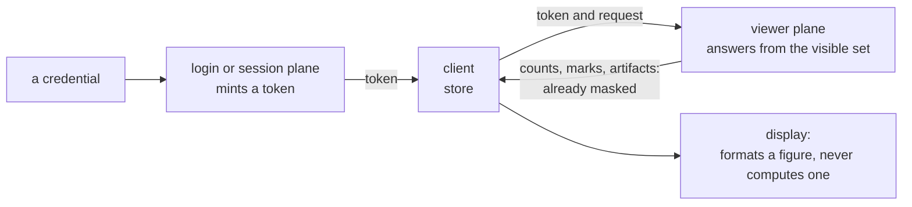
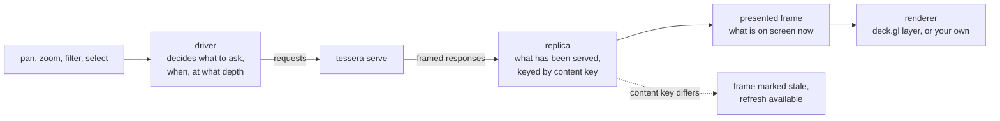
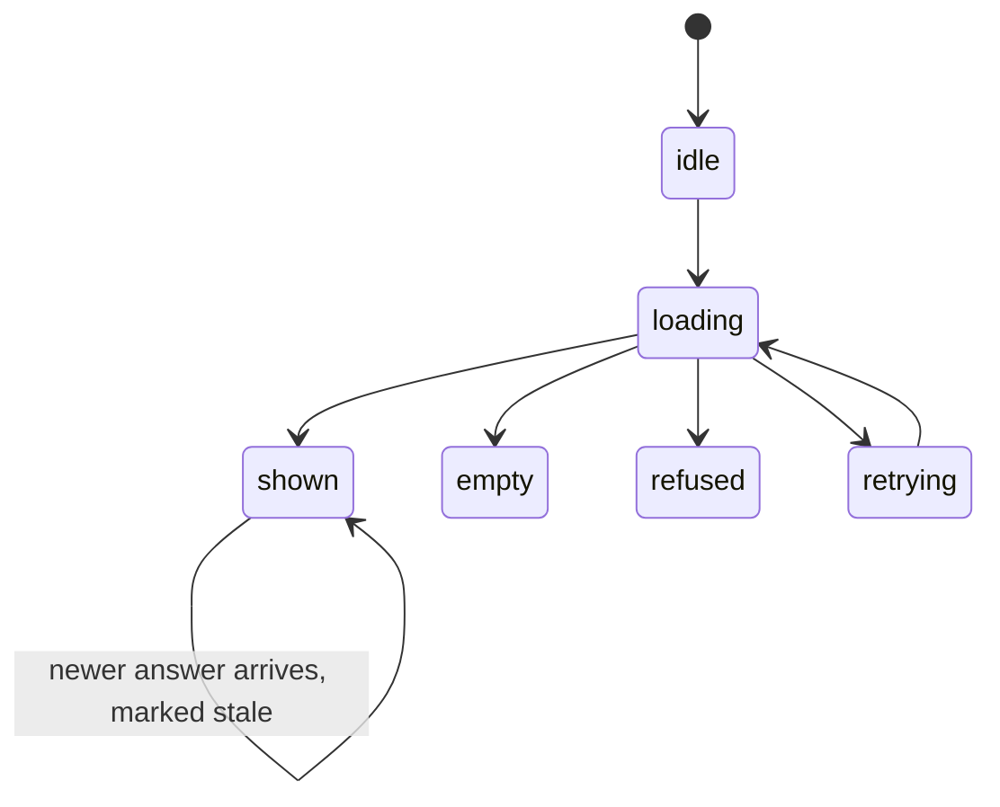
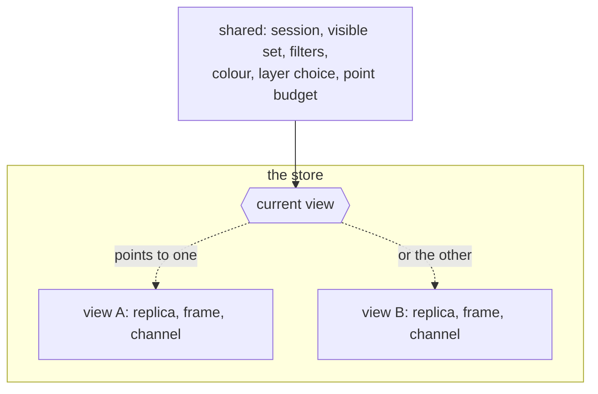

# Clients

A client asks Tessera for a view and displays what comes back. The server decides what a viewer
may see before any byte leaves it; nothing a client does can widen or narrow that. What a client
can get wrong is different in kind: showing a sample as though it were the whole set, showing a
stale view as current, showing a refusal as an empty corpus, showing a masked count as if it were
a size.

```mermaid
flowchart LR
  cred["a credential"] --> session["login or session plane<br/>mints a token"]
  session -- "token" --> client["client<br/>store"]
  client -- "token and request" --> viewer["viewer plane<br/>answers from the visible set"]
  viewer -- "counts, marks, artifacts:<br/>already masked" --> client
  client --> display["display:<br/>formats a figure, never computes one"]
```

*A client asks and displays. Every masked figure it shows was computed before it arrived.*

## Deployment

Of the three planes a deployment exposes, two concern a client. The session plane mints a token
for any principal and must never be reached from a browser: it is gated by an API key holding
`authorise-as`, which only the integrator's own server should hold. The viewer plane is what a
client calls with a token, and it can be reached directly by a browser or a notebook page from an
origin the deployment has named in advance. A viewer can also log in there with its own password,
API key or OIDC access token, and receive a token for itself.

| Plane | Reached by | Holds | Cross-origin access |
|---|---|---|---|
| Session | The integrator's own server | An API key holding `authorise-as` | Never opened to a browser |
| Viewer | A browser, a notebook page, or a server on the client's behalf | A per-viewer token | An enumerated list of allowed origins, none by default |

Two shapes of mistake pass every functional test and are invisible in a screenshot. The pooled
service token authorises once with a single broad credential and filters per user inside its own
proxy afterwards, so every one of its users ends up seeing counts and labels computed for the
credential rather than for themselves. The claim-minting proxy issues a token per user but mints
it from whatever claims a caller supplies, so anyone who can call the minting endpoint can claim
to be any user it names. The authority to grant access belongs at the integrator's own server,
verified there against an identity provider's claims, never merely asserted by whoever calls the
minting endpoint.

When a session ends, a client returns to the integrator's server for a new token; a notebook
widget renews before its current one expires rather than waiting for a refusal.

## What a client holds

A client holds a versioned partial copy of what has been served: a session (the token and the
identity it names), a replica of the geometry the server has answered for so far, and a presented
frame, the part of the replica currently on screen. None of this is authoritative. A replica can
be thrown away and rebuilt from nothing and the picture it produces is the same, only slower to
arrive.

The replica is kept current against a content key that changes when the corpus changes in a way
this viewer can see: new items reaching a request, or an item being denied. A client compares the
content key on its held geometry against the content key on the latest answer it has received. A
mismatch means the marks on screen may be older than the corpus. It does not mean they are wrong,
and nothing already shown is retracted. It does mean a stale view can still draw an item the
corpus has since denied, which is why the mark and the refresh control are mandatory rather than
cosmetic.

| What changed | What it means for a held view |
|---|---|
| A different viewer authorises (a new token for a different viewer) | The host calls `clear()` or makes a new store, which drops the replica, held artifacts, the selection and per-column state and reads meta again. Every `tessera_id` the client already holds stays valid, because the permutation is keyed per bundle, not per viewer. |
| An answer carries another identity key | The store detects a new viewer by the identity key, which hashes the exact credential bytes presented at authorisation, the identity of the viewer's visible-set fragment, and the view. An ingest or a suppression does not change it. The store drops everything the server answered, reads meta again and asks again, and keeps the host's own inputs. A renewal that presents different credential bytes, such as a freshly signed token, changes the key, so the store redraws from scratch at that renewal even for the same person. The check runs on answers; the `Store` reference says how long a host that changes viewer without `clear()` shows the previous viewer's data. |
| A compaction is published | A compaction rotates the fragment identity the identity key hashes, so every store sees a new key on its next answer: it drops what it holds, reads meta again and draws afresh. Every `tessera_id` stays valid. |
| The deployment is rebuilt | The new bundle has a new key, so every `tessera_id` the client holds is meaningless. Read the items again, by a unique field's values or afresh. |
| The content behind the current identity (an item added, denied, or unsuppressed) | The client's counts and marks may be older than the corpus. Mark the view stale and offer refresh. |

Segments merging never reaches a client, because nothing it holds is addressed by row. A
compaction reaches it only through the identity key, as the table says.

Marking a view stale is built: the store compares content keys on every answer and flips a flag a
display reads. Fetching fresh geometry on its own, without a person asking for it, is not: a
stale view stays on screen, correctly marked, until something asks the store to refresh.

## The store

The store is the part of a client that decides what to ask for and holds what comes back. It does
not draw: drawing is a choice a host makes for itself, whether the host is a map, a plain canvas
or a table. Depth is the zoom level of the tiles it requests. Deciding when to ask, at what
depth, and what to keep asking for is the same question for every one of them, and getting it
wrong shows a viewer a wrong or misleading map, not merely a different-looking one.

The store takes in where the camera is, which filters, layers and colour are active, the point
budget, which view is current and what is selected. It publishes the marks to draw, the counts to
show, the display state, and a legend.

Told where the camera is, it works out which requests are worth making and issues them. Told a
filter changed, it recomposes one expression from every active clause and sends it whole. Given a
response, it decides which already-held geometry still answers for the view and which needs
replacing, and updates what it publishes.

Underneath, the driver tracks whether the view is moving or has come to rest, one outstanding
request together with its retries, and a settle timer that asks again once the view has been
still long enough that a further answer would be worth having. A limited look-ahead requests the
area just outside what is on screen once the view has settled and nothing else is being asked
for. None of this is visible from outside the store: a host tells it where the camera is and
reads what it publishes.

Annotation layers are requested on their own, naming the layers drawn and the layer the points
are coloured by, rather than read off cached point geometry. Artifacts are clusters, boundaries,
hierarchy nodes and their labels, as [annotations](annotations.md#what-an-artifact-is) defines
them. A cache holds geometry it has already fetched and does not ask again for a tile it already
holds, and such a tile carries no artifacts, so a client reading them off the point path would
watch clusters disappear from a view that had not moved, for no reason a person could see. Asking
on its own avoids that at the cost of one extra request once a view has settled.

```mermaid
flowchart LR
  gesture["pan, zoom, filter, select"] --> driver["driver<br/>decides what to ask,<br/>when, at what depth"]
  driver -- "requests" --> srv["tessera serve"]
  srv -- "framed responses" --> replica["replica<br/>what has been served,<br/>keyed by content key"]
  replica --> frame["presented frame<br/>what is on screen now"]
  frame --> render["renderer<br/>deck.gl layer, or your own"]
  replica -. "content key differs" .-> stale["frame marked stale,<br/>refresh available"]
```

*The store decides when to ask and what to hold. Rendering only draws what it is handed; nothing
refetches on its own.*

## The twelve rules

The server enforces everything about what a viewer may see. It sees one request at a time and
cannot see a screen, so it cannot enforce how a client presents what it already sent. The rules
below are what closes that gap: each is something a client must do on its own, and each has a
specific way of misleading a viewer if it is skipped.

A [viewport response](queries.md#the-viewport) carries the marks it drew, each a point with a
coordinate and an identifier; a served, a visible and a matched count; the artifacts for
whichever layers are on; and a content key. The rules below govern what a client does with that
response once it has it.

```mermaid
stateDiagram-v2
  [*] --> idle
  idle --> loading
  loading --> shown
  loading --> empty
  loading --> refused
  loading --> retrying
  retrying --> loading
  shown --> shown : newer answer arrives, marked stale
```

*A view holds one of six states, and only `shown` carries a number; `shown` may also be marked
stale.*

| # | Rule | What goes wrong on screen if it is broken |
|---|---|---|
| 1 | Show a state that matches what happened, and let only a shown view carry a number. | A refused request drawn as an empty view looks like a place with no data, when the truth is that nothing was answered at all. |
| 2 | When a value is a sample of a set, show both how much is shown and how much there is in total, or show neither. | A bare sample count reads as the whole population. A reader takes the number on screen to be everything there is. |
| 3 | Mark a view as stale once a newer answer exists, and keep refresh one action away. | An unmarked stale view reads as current when the corpus has already moved past it. |
| 4 | Show a masked count only as what this viewer can see, never as a size or a fraction of one. | "12,040 of 12,040" beside a cluster asserts a total nobody sent. The number looks complete when it is only what one viewer happens to see. |
| 5 | Treat an absent artifact, and a filter that matches nothing, as an ordinary answer, never as a reason to explain. | Saying "no such value" or "layer not reachable" turns a filter into a way of finding out what is hidden, one guess at a time. |
| 6 | Ask for artifacts with their own request naming the layers that are on, never by reading them off cached point tiles. | As the cache warms, artifacts blink out of a view that has not changed, because a held tile stopped naming what it contains. |
| 7 | Drop held geometry, artifacts, and per-column state when the viewer's identity changes; drop held geometry when a filter changes. | Marks or clusters left from a previous login, or from before a filter was applied, stay on screen under a picture they no longer belong to. |
| 8 | When zooming in, never ask for fewer marks per tile than the previous request did. | Points that were on screen pop out as a viewer zooms in, reading as items vanishing under them. |
| 9 | Hold an item's identifier as a full sixty-four-bit value, not as a JavaScript `number`, which loses precision above 2⁵³. | A click on a point returns the wrong record, or none at all, for an item plainly on screen. |
| 10 | A proxy in front of the viewer plane forwards every response header, including the ones it does not recognise. | One viewer's cached view can end up served under another viewer's token, or every request pays for a full response because nothing declares what is already held. |
| 11 | Treat a credential the server no longer holds and an expired token the same way: the session has ended. | A client that treats an outright rejection as something to retry keeps sending a request that will never succeed. |
| 12 | Choose which zoom level's tiles to request so the number of marks stays roughly what the screen can show; nothing on the wire states a depth. | Ignoring this either draws a handful of marks across the whole map or asks for far more than a screen can use. |

Rules 1 to 3 keep a viewer from mistaking one kind of answer for another: a refusal for nothing, a
sample for a total, an old view for a current one. Rules 4 to 6 keep a masked figure honest about
what it counts and what it does not explain. The rest are narrower and mechanical: what to forget,
what identifiers and headers demand, and the one decision the server leaves entirely to the
client's own judgement.

## Views

A deployment can serve more than one view over the same items: a different projection of the
same corpus, or a group such as a set of quarters, the same items positioned per quarter of a
year, sharing one layout. A client's store holds one set of session-wide state and, underneath
it, one replica and one presented frame per view it has visited.

```mermaid
flowchart TB
  shared["shared: session, visible set, filters,<br/>colour, layer choice, point budget"]
  subgraph store["the store"]
    cur{{"current view"}}
    A["view A: replica, frame, channel"]
    B["view B: replica, frame, channel"]
  end
  shared --> cur
  cur -. "points to one" .-> A
  cur -. "or the other" .-> B
```

*A switch moves the pointer marking which view's held state is current; both stay in the store.*

A switch does not touch session-wide state or what is already known about a selected item; only
geometry is per view. A view that is not current has no request in flight, and a view a viewer
returns to is exactly as warm as their last visit left it. Every view a client has visited shares
one byte budget; when it is full, whatever was least recently drawn is evicted first.

Within a group whose views share one layout, such as a set of quarters, a switch keeps the
camera, the depth, and the selection: the same tiles at the same depth are simply asked of the
next view. Between views that use different layouts, a switch drops the selection and refits the
camera to the new view's own extent, because a shape or a camera position in one layout means
nothing in another.

## Reading in bulk

The bulk reads, `POST /v1/items` and `POST /v1/artifacts`, do not pass through the store. Each
client follows each response's cursor until the read ends, and passes the caller's request through
as given, choosing no fields and no order on the caller's behalf.

| Client | Call | What it gives back |
|---|---|---|
| TypeScript | `client.items(token, request)` and `client.artifacts(token, request)` | an async iterator of Arrow tables, one per page, with the cursor after each; a caller who stops, or whose read is cut or refused part-way, resumes from that cursor |
| Python | `db.items`, `db.artifacts` and `selection.items`, and the same reads on a `Viewer` | one `pyarrow` table of the whole read, or with `batches=True` the pages one at a time; a read that stops part-way raises `PartialRead`, which holds the rows read and the cursor to read on from |
| CLI | `tessera items` and `tessera artifacts` | Arrow IPC or Parquet, to a file or to standard output, written page by page; a read cut short leaves whole pages and names the cursor to read on from |

`selection.items` sends the selection's own filters and box as the read's filter, so its rows are
the items the selection counts.

## Counts by group

`POST /v1/aggregate` answers how a set is distributed, one table of counts per grouping.

| Client | Call | What it gives back |
|---|---|---|
| TypeScript | `client.aggregate(token, request)` | every response read through the cursor, one Arrow table per grouping with its head's figures, whether a page counted a changed corpus, and the region verdict |
| TypeScript store | `store.setAggregate(id, {groupings, reference, without, highlighted})` | the `aggregates` projection, each entry answered over the store's current filters and selected region and asked again when either, or the view, changes; a request the next one supersedes is aborted |
| Python | `viewer.aggregate(view, groupings, filters, reference)`, `db.aggregate` and `selection.aggregate` | one `pyarrow` table per grouping, the head's figures in its schema metadata |
| CLI | `tessera aggregate --view <view> --grouping <json>` | one grouping's table, read through the cursor and written as Arrow IPC or Parquet, its head on stderr |

Every surface sends a grouping as the caller wrote it, a histogram's `bins`, `range` and `sample`
and a field's `summary` included, and none adds a default. Each reads a sampled histogram's head as
it reads the rest: the TypeScript client as the table's `sample`, Python in the `tessera.head`
metadata, and the CLI on stderr. A summary is a table of one row on every surface, with the
columns `items`, `count`, `none`, `min`, `max` and `mean`, over the whole visible set in the view;
the request's filters change its head's `total` and none of its figures. The store sends a
reference only where the component registered one, as a filter expression or as the whole visible
set. It chooses no grouping. A registration can name one
column in `without`, as the filter draft keys its controls, and the store then sends its filters
less that column's control. A category control uses this to list its own values: with its clause
set, the values it excludes are still counted, and every other clause, the `member_of` clauses and
the selected region still narrow them. A registration can also name one layer in `withoutMembersOf`,
and the store then leaves out that layer's `member_of` clauses in the filter position; a cluster
control uses this to keep counting the clusters its own clauses exclude. A registration with
`highlighted` has the store join its highlight to the filters, so each count is the viewport's
highlighted count over the same items. The region is always sent, and nothing is left out unless a
registration names it. A `429` or `503` is sent again as the map's own requests are, after the same
backoff or the server's `Retry-After` where that is longer, and a newer change cancels the wait.
`selection.aggregate` sends the selection's filters and box as the request's `filters`, so every
grouping's total is the selection's count.

The map draws density from this route. `DensityCounter` in `@tesseradb/deck` registers one
grouping of cells with the store, at the depth whose cells come nearest a chosen size on screen at
the camera's zoom, over the viewport and a margin of a quarter of its width and height on each
side. The registration is `highlighted`, so the counts are the highlighted items' under a
highlight and the filtered items' otherwise, over the store's filters and selected region, as the
map's points are; the store asks again when any of these changes. The counter asks only once the
camera has rested for 200 ms, draws the last answer at its own world positions until the next
lands, and asks nothing while the viewport stays inside the area held at the same depth. A move
that leaves the area drops the registration at once, so a filter changed during the move sends
nothing for an area no longer shown. A view switch asks again at once, over the area in the new
view's coordinates.

A depth whose cells over the area could pass `selection.max_aggregate_cells` is not asked for,
counting one column and one row more than the area spans, since the server quantises the area's
corners itself; the finest size that fits is drawn instead. A `422` is asked again one depth
coarser, up to three times. Any other refusal draws nothing until the camera next rests, when the
counter asks again. A `TesseraLayer` given a store and neither counts nor a counter keeps a counter
of its own over its viewport.

Every density mode colours a cell by where its count sits between no items and the largest count
among the cells counted: in proportion to the count under the linear scale, or to `log(1 + count)`
under the log scale, which is the default. Counts are skewed on most maps, and under the linear
scale only the densest few cells stand out. The cells counted cover the viewport and the margin
around it, so the largest count can be that of a cell just off screen, and it holds while the camera
pans within the area held. The hexagons and contours merge fine cells to coarser ones before
drawing, and take the largest of the merged counts. A hexagon takes the colour of the densest cell
in it, so the densest hexagon reaches the top of the scale. The smooth wash blends each cell with
its neighbours, so an isolated dense cell is drawn lower on the scale than its own count would
place it. The map's key shows 0, the count at the middle of the scale in whole items and the
largest count.

There is no command-line command for this route. It is reached over HTTP and through the
TypeScript and Python clients.

## Not built

Switching between two views that use different layouts refits the camera without animating an
item between its two positions; joining a viewer's held marks across such a switch, so the same
item can move smoothly from one layout's coordinates to the other's, needs a request the wire does
not yet carry.

A view that is not currently shown fetches nothing ahead of time. A switch to a view a client has
not visited fetches it at the moment of the switch, not before, and there is no separate warming
of a view a viewer has not yet chosen.

There is no way to address the server tile by tile, and no adapter that would let an engine built
around asking for one tile at a time, such as a slippy-map library, sit on top of the store. Such
an adapter would gather per-tile asks into the same region-shaped requests the store already
makes; it is specified and not built.

A notebook widget's token reaches the browser page itself. Keeping it on the notebook server
behind a proxy, so the page never holds it, is specified and not built.

## Where this is tested and where it lives

The store, its driver, replica, presented frame, filter composition and artifact channel live in
`@tesseradb/client`. A drop-in map and its panels live in `@tesseradb/components` as custom
elements built on the store; a deck.gl binding lives in `@tesseradb/deck`; React hooks and element
wrappers live in `@tesseradb/react`. The Python package `tesseradb` embeds the same components
inside a notebook widget rather than reimplementing any of this in Python. An acceptance harness
drives the built components against a running deployment and checks nine claims against rules 1
to 5 and 7 through what is actually on screen, not through a transcript of what was sent. Rule 6
is covered by unit tests; rules 8 to 12 are not screen-checkable and are not covered there.

The bulk reads live in `@tesseradb/client`'s `records` module, in the Python package's viewer
reader, and in the CLI's `records` module.

## Sources

`docs/design/client-interaction.md` §2–§5, §7, §9; `docs/design/client-architecture.md` §1–§4;
`docs/design/client-components.md` §1–§5, §8; `docs/design/client-obligations.md`;
`docs/design/view-switching.md` §1–§5; `clients/ts/README.md`; `clients/py/README.md`;
`clients/ts/core/src`; decisions 0095, 0096, 0097, 0098, 0099, 0100, 0101, 0102.
