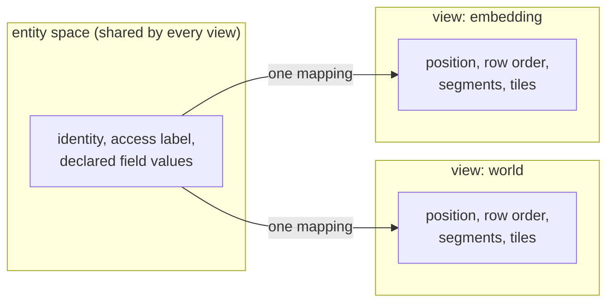
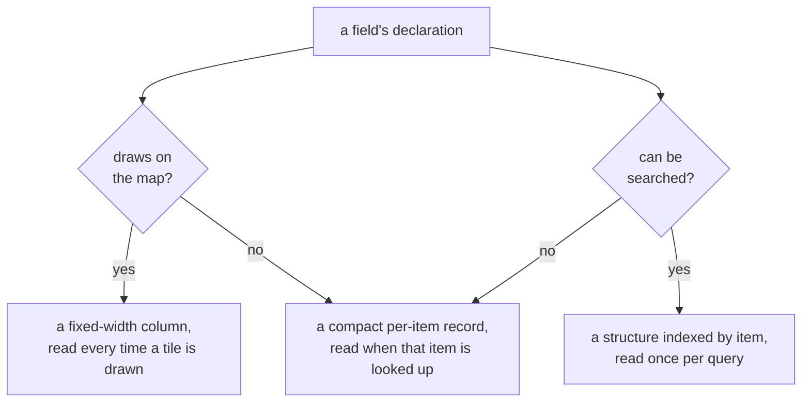

# Data model

Tessera serves one shared collection of items through several different maps at once. An item
exists once, with one identity, one access label and one set of declared field values. It can have
a position in more than one map, because switching which map a viewer looks at changes only where
an item is drawn and how it is queried, never what the item is or who may see it.

## What an item carries

An item is one row of the corpus. It carries an access label, which decides who may see it; an
external id, the identifier the operator supplied and uses to address the item again; a position in
each view it belongs to; and a value, present or absent, for every field the corpus declares.

Four identifiers name an item or a view, one for each party that needs to address it:

| Identifier | Assigned by | Held by | What changes it |
|---|---|---|---|
| entity id | the server, once, at ingest | never leaves the server | nothing, never reissued |
| `tessera_id` | derived from the entity id by a keyed permutation, at the same time | the client | nothing, for the item's life |
| external id | the operator, before ingest | the operator, and any record of a write naming it | nothing, for the item's life |
| view key | the operator, when a view of a group is created | any request naming that view | a drop frees the key; a later create under it starts a new, empty view |

The entity id is the server's own internal key, a dense integer assigned once. Within one
allocation window ids are assigned in an order chosen to keep each item's access label close to
others like it on disc; how that window works belongs to the write path.

The `tessera_id` is what a client receives and holds instead of the entity id, stable for the
item's life.

A second batch under an already-known external id adds the item to a new view: its identity, its
label, and any field meant to hold one value for the whole item are compared against what is
already stored, and a value that disagrees is refused. A field declared to vary by view is expected
to carry that view's own value instead. This is how one item comes to exist in more than one view.

A view key addresses one view of a group, such as `quarter:2026-Q3`. Dropping a view frees its key;
creating a view under a freed key starts an empty view, carrying none of its predecessor's rows.

## Views and view groups

A view is a named coordinate system over the corpus. Everything about an item that does not depend
on layout, its identity, its label, and, unless a field says otherwise, its declared values, is
stored once and shared by every view. Everything that depends on layout, an item's position, the
order rows sit in on disc, the file segments a query reads, tile addressing, belongs to one view
alone. One mapping, from an item's identity to its row, joins the two for each view; an item with
no entry in a view's mapping simply has no position there.


*One identity, several positions: a view owns everything downstream of its own mapping and nothing
above it.*

A view is declared once, when the corpus is built, and does not change afterwards: adding a plain
view is a rebuild.

A view group is a set of views that share every layout setting, such as projection, frame and
default access rule, and differ only by a key the operator chooses and a handful of per-view facts,
such as a label or a date range. A view of a group can be created and dropped while the service is
running, which lets a corpus that gains a new time slice, region or batch acquire a new layout
without a rebuild. Once created, a group's view behaves exactly like a plain view, each with its
own row space.

A view's record cannot be edited once created. Correcting a wrong access rule or a wrong per-view
fact means dropping the view and creating a fresh one, under the same key if the operator chooses,
since a dropped key can be reused and a view created under it starts empty.

Dropping a view deletes no item. An item that was only in the dropped view keeps its identity,
label and declared values, with no position anywhere, until a later batch gives it one.

Two view groups can share one set of views, a quarterly map and a quarterly embedding over the same
quarters, say, rather than declaring the roster twice.

A field can be declared to vary by view of a group instead of holding one value for the whole item:
a sentiment score recomputed each quarter, for instance. Reading it under a view of that group
reads that view's own value; reading it from anywhere else has to name the view explicitly, there
being no single value to read.

A view, or a view group, can carry its own access label, narrower than the corpus's default, so
that a whole layout is reachable only by viewers whose credentials satisfy it.

## Projections and the frame

Declaring a projection lets a client line up a basemap with the points, invert a stored position
back to a real coordinate, and compare two views built under the same projection tile for tile.

Every view's positions are quantised against a frame, a fixed square grid chosen when the view is
declared. A view with no geography, an embedding layout, say, declares no projection at all, and
the frame is simply the space its own coordinates already live in.

A geographic view declares one of two projections, both fixed transforms the service applies and
never negotiates: there is no caller-supplied projection, datum shift or national grid.

| Projection | Reaches the poles | Shape |
|---|---|---|
| `web_mercator` | No, cuts off past about 85° north and south | Preserves small shapes near the equator; every standard map tile server uses it |
| `equirectangular` | Yes | Distorts shape away from the equator; needs no trigonometry, so it reproduces exactly on every machine |

A coordinate is always supplied as longitude and latitude, in degrees, on the initial build and on
every later ingest (the service does the projecting, never the caller), and is carried at full
precision from the file or the wire through to the moment it is quantised onto the grid.

```toml
[[view]]
name       = "world"
projection = "web_mercator"
extent     = { lon = [-180.0, 180.0], lat = [-85.0511287798066, 85.0511287798066] }
```

A view's frame is either the whole space its projection covers, or a smaller square aligned to a
tile boundary within it, so that the server's own tile addressing stays exact at every zoom level.

Two distinct things can move a stored position onto the frame's edge, and each is reported on its
own:

| | Cause | Refused? |
|---|---|---|
| Clamping | The coordinate is outside the view's declared frame | Past half the corpus |
| Clipping | The coordinate is outside the projection's own domain, beyond `web_mercator`'s polar cut, for instance | Never |

A build refuses past half the corpus clamping, because a frame that misplaces most of a corpus
describes some other dataset. No frame can bring a clipped point back inside a projection that does
not reach it, so clipping is never a reason to refuse.

## Fields: five families, one declaration

A field is one of five families, chosen by what the value is:

| Family | What it holds | Searched by |
|---|---|---|
| number | any numeric type | an exact match, a set of values, or a range |
| datetime | a timestamp, stored as a number | the same as number |
| category | one value from a vocabulary | an exact match, membership in a set, or a listing of the vocabulary's own values |
| keyword | a short exact string with no vocabulary, an identifier, a hostname | an exact match, a set, a prefix, or a substring |
| text | prose, in any script | a search for the words it contains |

A category's record of which items carry which value always exists, whatever else the field's
declaration says, because that record is what makes a category's own value list servable. Every
other family only builds a search structure when asked to.

A field's declaration says what it is, not where it is stored: a type, and two independent choices,
whether it draws on the map, and whether it can be searched.

```toml
[[attribute]]
name   = "submitter"
type   = "keyword"
index  = true    # can be searched (default false)
render = false   # draws on the map (default false)
```


*A field with neither flag still has a home: the compact record, read at drill-down.*

A field can be both drawable and searchable at once, since the two choices are independent. A field
declared with neither still exists: its value is stored compactly per item and returned only when
that item is looked up in detail, the cheapest of the three homes and the one a field takes by
default.

Turning search on for a field already declared costs one pass over the stored corpus. Turning
drawing on rewrites every row, because a value that draws has to sit in every row whether or not
that item carries one.

A field that draws but carries no value for some item is stored as absent rather than as a numeric
zero, so a range query that happens to include zero does not wrongly match items that have no value
at all.

## Vocabularies

A category's value set is a named object, a vocabulary, and more than one field can draw values
from the same one: several columns naming the same list of departments, say, so the names and
their properties are maintained once. Which items carry which value is still tracked separately per
field, because two fields sharing a vocabulary still mean different things.

A vocabulary answers two independent questions:

- **Closed or open.** Is an unrecognised value at ingest refused, or minted on the spot?
- **Public or derived.** Is the vocabulary's value list served to every viewer as declared, or only
  where the viewer can see at least one item carrying that value? A derived value's visibility is
  worked out from inside the viewer's own visible set each time it is asked, never stored or
  maintained.

A value's underlying code, the small integer actually stored in the row, is assigned at random from
the field's declared width rather than in the order values were first seen, and is never reused or
reassigned once given out. The value's readable key never appears in the row itself.

## What is not built

- **Not built yet: list-valued fields.** A field holds at most one value per item. Declaring more
  than one is refused when the corpus is built.
- **Not built yet: entity id reuse.** A compaction that removes an item's row does not return its
  entity id to the pool; the id space only grows, which costs capacity rather than correctness.
- **Not built yet: amending a vocabulary value's properties without a rebuild.** No control-plane
  route exists for it; changing a value's label or colour today needs a rebuild.

## Where this is tested and where it lives

Integration tests cover a view group's build and its behaviour while the service runs, an entity
joined into a second view, and a field's build pass, across `tessera-server`'s and `tessera-cli`'s
and `tessera-build`'s test suites.

The data model lives in:

- `tessera-types`: the declared shapes, a view, a vocabulary, a field;
- `tessera-build`: compiling a declaration into a bundle;
- `tessera-spatial`: the projection and frame transforms;
- `tessera-store`: vocabularies and each view's own paths on disc;
- `tessera-engine`: viewport reads and category serving;
- `tessera-server`'s viewer and control planes, which expose the routes above.

## Sources

`docs/design/architecture.md` §5; `docs/design/views.md` §1–§6; `docs/design/projections.md`;
`docs/design/records-and-search.md` §1–§4, §8; `docs/design/per-point-attributes.md`;
`docs/design/configuration.md` §1; decision 0072.
