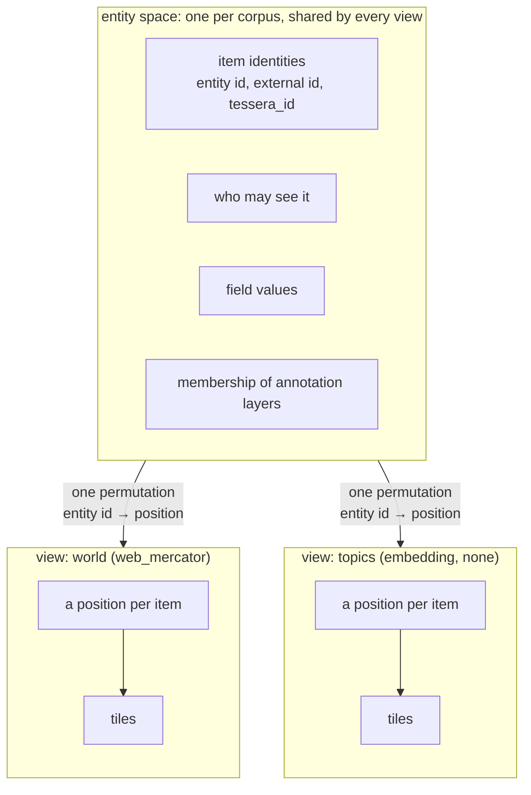
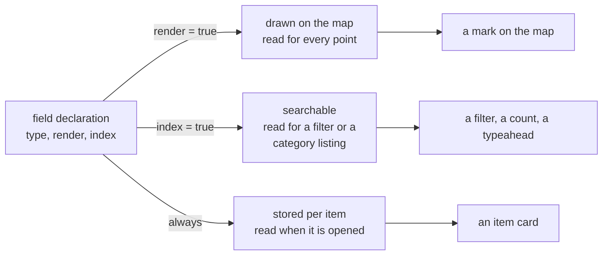

# Data model

Tessera serves one shared collection of items through several different maps at once. An item
exists once, with one identity, one access label and one set of declared field values. It can have
a position in more than one map, because switching which map a viewer looks at changes only where
an item is drawn and how it is queried, never what the item is or who may see it.

## What an item carries

An item is one record in the corpus. It carries an access label, a string the operator declares
per item and resolves to the [terms that decide who may see it](access-control.md#terms-and-access-labels);
an external id, the identifier the operator supplied and uses to address the item again; and a
value, present or absent, for every field the corpus declares. An external id is bytes: a
string's UTF-8, or an integer's eight little-endian bytes, so a negative integer id and its
two's-complement unsigned value are the same id.

## Views and view groups

A view is a named coordinate system over the corpus: a projection and a frame that decide where
each item is drawn and how a client queries it. Everything about an item that does not depend on
layout is stored once and shared by every view: its identity, its label, and its declared values,
unless a field says otherwise. Everything that depends on layout belongs to one view alone: the
item's position, the order those positions are stored in for that view, and how a query addresses
them. One mapping, from an item's identity to its position, joins the two for each view. An item
absent from a view's mapping has no position there.


*One identity, several positions: a view owns everything downstream of its own mapping and nothing
above it.*

A view is declared once, when the corpus is built, and does not change afterwards: adding a plain
view is a rebuild.

A view group is a set of views that share every layout setting: projection, frame, and the access
label an item gets when it declares none of its own. Views in the group differ only by a key the
operator chooses and a handful of per-view facts, such as a display name or a date range. A view
of a group can be created and dropped while the service is running, which lets a corpus that
gains a new time slice, region or batch acquire a new layout without a rebuild. Once created, a
group's view has its own positions, like a plain view.

A view reads its geometry from a points file named in its declaration, with columns for the
item's coordinates and its entity id. A group's views can share one such file instead of each
having its own, distinguished by a column that says which view each entry in the file belongs to.

A view's record cannot be edited once created. Correcting a wrong access label or a wrong
per-view fact means dropping the view and creating a fresh one, under the same key if the operator
chooses: a dropped key can be reused, and a view created under it starts empty, carrying none of
its predecessor's items.

Dropping a view deletes no item. An item that was only in the dropped view keeps its identity,
label and declared values, with no position anywhere, until a later batch gives it one.

Two view groups can share one set of views: a quarterly map and a quarterly embedding built over
the same quarters can use the same keys and per-view facts, rather than declaring them twice.

A field can be declared to vary by view of a group instead of holding one value for the whole
item: a sentiment score recomputed each quarter, for instance. Reading it under a view of that
group returns that view's own value. Reading it from anywhere else requires naming the view
explicitly, because the field holds no single value outside one.

A batch naming an external id already known to the corpus can add the item to a further view. If
the item is not already in the view the batch names, it joins there under the item's existing
identity, keeping its label and any value declared once for the whole item. If the item is
already in that view, or the batch supplies a different label, the batch is refused. This is how
one item comes to exist in more than one view.

A view, or a view group, can also carry its own access label, narrower than the corpus's default.
This is an additional gate on top of each item's own label, not a replacement for it: a viewer
must satisfy both to see an item through that view.

## Identifiers

Four identifiers name an item or a view, one for each party that needs to address it:

| Identifier | Assigned by | Held by | What changes it |
|---|---|---|---|
| entity id | the server, at ingest | never leaves the server | nothing; never reissued today |
| `tessera_id` | derived from the entity id by a keyed permutation, at the same time | the client | a rotation of the deployment's key, which ends every session |
| external id | the operator, before ingest | the operator, and any record of a write naming it | nothing, for the item's life |
| view key | the operator, when a view of a group is created | any request naming that view | a drop frees the key; a later create under it starts a new, empty view |

The entity id is the server's own internal key: a dense integer, assigned as items are
committed, in an order that groups together the items sharing the same access terms. A build
starting from an empty corpus commits everything at once, producing one such dense, fully sorted
range. A later ingest commits its own new items above what already exists, in a range sorted the
same way within itself but appended after the corpus already on disc rather than interleaved with
it.

The `tessera_id` is what a client receives and holds instead of the entity id. It is stable for
the item's life unless the operator rotates the deployment's key, and a rotation ends every
session, so a held identifier stops resolving rather than pointing at a new item.

## Projections and the frame

Every view's positions are quantised against a frame, a fixed square grid chosen when the view is
declared. Declaring a projection over that frame lets a client line up a basemap with the points,
invert a stored position back to a real coordinate, and compare two views built under the same
projection tile for tile.

A view with no geography, such as an embedding layout, declares no projection. It still declares
a frame: a square the operator states explicitly, or `auto` to fit whatever range its coordinates
span.

A geographic view declares one of two projections, both fixed transforms the service applies and
never negotiates: there is no caller-supplied projection, datum shift or national grid.

| Projection | Reaches the poles | What it distorts |
|---|---|---|
| `web_mercator` | No, cuts off past about 85° north and south | Area, increasingly away from the equator. Shape is preserved everywhere the projection is defined, and every standard map tile server uses it |
| `equirectangular` | Yes | Shape, away from the equator. A plain scaling of longitude and latitude |

A coordinate is always supplied as longitude and latitude, in degrees, at a build and on every
later ingest (the service does the projecting, never the caller), and is carried at full
precision from the file or the wire through to the moment it is quantised onto the grid.

```toml
[[view]]
name       = "world"
projection = "web_mercator"
extent     = { lon = [-180.0, 180.0], lat = [-85.0511287798066, 85.0511287798066] }
```

A view's frame is either the whole space its projection covers, or a smaller square aligned to a
grid boundary, which keeps the [tiling](queries.md#the-viewport) a viewport request resolves to
exact at every zoom level.

Two distinct things can move a stored position onto the frame's edge, and each is reported on its
own:

| | Cause | Refused? |
|---|---|---|
| Clamping | The coordinate is outside the view's declared frame | Past half the corpus |
| Clipping | The coordinate is outside the projection's own domain, beyond `web_mercator`'s polar cut, for instance | Never |

A build refuses past half the corpus clamping, because a frame that misplaces most of a corpus
describes some other dataset. No frame can bring a clipped point back inside a projection that
does not reach it, so clipping is never a reason to refuse.

That refusal threshold applies to a build. A live ingest refuses each out-of-frame coordinate on
its own, rather than tolerating a fraction of the corpus; the two entry points have not been
reconciled.

## Fields: five families, one declaration

A field is one of five families, chosen by what the value is:

| Family | What it holds | Searched by |
|---|---|---|
| number | any numeric type | an exact match, a set of values, or a range |
| datetime | a timestamp, stored as a number | the same as number |
| category | one value from a vocabulary | an exact match, membership in a set, or a listing of the vocabulary's own values |
| keyword | a short exact string with no vocabulary, an identifier, a hostname | an exact match, a set, a prefix, or a substring |
| text | prose, in any script | a search for the words it contains |

A field's declaration says what it is, not where it is stored: a type, and two independent
choices: whether it draws on the map (`render`) and whether it can be searched (`index`).

```toml
[[attribute]]
name   = "submitter"
type   = "keyword"
index  = true    # can be searched (default false)
render = false   # draws on the map (default false)
```

A field's value lives in exactly one of three homes: drawn on the map when `render` is set,
searchable when `index` is set, or, always, stored compactly per item and read only when that
item is opened. The last is the cheapest of the three, and the one a field takes by default.


*A field with neither flag still has a home: the compact record, read at drill-down.*

A category's record of which items carry which value exists whatever else the field's declaration
says, because that record is what makes the category's own value list servable. Every other
family builds a search structure only when `index` is set.

A field can be both drawable and searchable at once, since the two choices are independent.

Turning search on for a field already declared costs one pass over the stored corpus. Turning
drawing on rewrites the view: a value that draws has to be stored alongside every item's
position, whether or not that item carries one.

A field that draws but carries no value for some item is stored as absent rather than as a
numeric zero, so a range query that happens to include zero does not wrongly match items that
have no value at all.

## Vocabularies

A category's value set is a named object, a vocabulary, and more than one field can draw values
from the same one: several fields naming the same list of departments, for instance, so the names
and their properties are maintained once. Which items carry which value is still tracked
separately per field, because two fields sharing a vocabulary still mean different things.

A vocabulary answers two independent questions:

- **Closed or open.** Is an unrecognised value at ingest refused, or minted on the spot?
- **Public or derived.** Is the vocabulary's value list served to every viewer as declared, or
  only where the viewer can see at least one item carrying that value? A derived vocabulary is
  what keeps a value list from disclosing something the viewer cannot see through any item: its
  visibility is worked out from inside the viewer's own visible set each time it is asked, never
  stored or maintained.

A category value's underlying code is assigned from the vocabulary's declared width at random,
not in the order values were first seen, and is never reused or reassigned once given out. A
visible code therefore discloses nothing about how many values the vocabulary holds or which
arrived first.

## What is not built

- **Not built yet: list-valued fields.** A field holds at most one value per item. Declaring more
  than one is refused when the corpus is built.
- **Not built yet: entity id reuse.** Compaction that removes a deleted item does not return its
  entity id to the allocator; the id space only grows, which costs capacity rather than
  correctness. Reusing a freed id after compaction is a ruled design and is not built: the
  allocator stays append-only today, and no entity id is reissued.
- **Not built yet: ingesting a value for a field that varies by view of a group.** Such a field's
  value is read at a build, from each view's own points or from one file shared across the
  group's views. The same value cannot yet be added through a later ingest batch.
- **Not built yet: amending a vocabulary value's properties without a rebuild.** No control-plane
  route exists for it; changing a value's label or colour today needs a rebuild.

## Where this is tested and where it lives

Integration tests cover a view group's build and its live creation, an item joined into a second
view, and a field's build pass.

The data model lives in `tessera-types` (the declared shapes: a view, a vocabulary, a field),
`tessera-build` (compiling a declaration into a bundle), `tessera-spatial` (the projection and
frame transforms), `tessera-store` (vocabularies and each view's own files on disc), and
`tessera-engine` (viewport reads and category serving).

## Sources

`docs/design/architecture.md` §5; `docs/design/views.md` §1–§6; `docs/design/projections.md`;
`docs/design/records-and-search.md` §1–§4, §8; `docs/design/per-point-attributes.md`;
`docs/design/configuration.md` §1; decision 0072.
