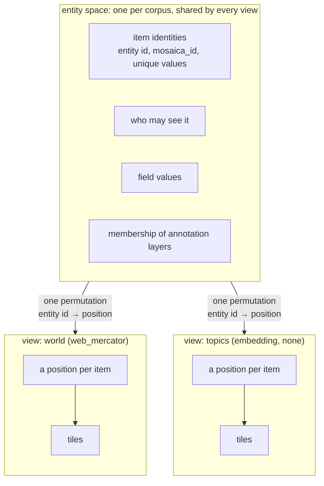
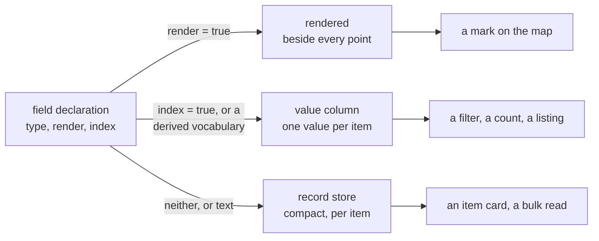

# Data model

Mosaica serves one shared collection of items through several different maps at once. An item
exists once, with one identity, one access label and one set of declared field values. It can have
a position in more than one map, because switching which map a viewer looks at changes only where
an item is drawn and how it is queried, never what the item is or who may see it.

## What an item carries

An item is one record in the corpus. It carries an access label, an expression over the
[terms that decide who may see it](access-control.md#terms-and-access-labels) that the operator declares per item,
and a value, present or absent, for every field the corpus declares. The operator addresses an item
again by its `mosaica_id` or by the value of a field declared [unique](#unique-fields): a DOI, an
accession number, a GeoNames id.

## Views and view groups

A view is a named coordinate system over the corpus: a projection and a frame that decide where
each item is drawn and how a client queries it. Everything about an item that does not depend on
layout is stored once and shared by every view: its identity, its label, and its declared values,
unless a field says otherwise. Everything that depends on layout belongs to one view alone: the
item's position, the order those positions are stored in for that view, and how a query addresses
them. One mapping, from an item's identity to its position, joins the two for each view. An item
absent from a view's mapping has no position there.


```mermaid
flowchart TB
  subgraph entity["entity space: one per corpus, shared by every view"]
    direction LR
    ids["item identities<br/>entity id, mosaica_id, unique values"]
    terms["who may see it"]
    fields["field values"]
    members["membership of annotation layers"]
  end

  subgraph v1["view: world (web_mercator)"]
    direction TB
    p1["a position per item"] --> t1["tiles"]
  end
  subgraph v2["view: topics (embedding, none)"]
    direction TB
    p2["a position per item"] --> t2["tiles"]
  end

  entity -- "one permutation<br/>entity id → position" --> v1
  entity -- "one permutation<br/>entity id → position" --> v2
```
*One identity, several positions: a view owns everything downstream of its own mapping and nothing
above it.*

A view is declared once, when the corpus is built, and does not change afterwards: adding a plain
view is a rebuild.

A view group is a set of views that share every layout setting: projection, frame, and the access
label an item gets when it declares none of its own. Views in the group differ only by a key the
operator chooses and a handful of per-view facts, such as a display name or a date range. A view
of a group can be created and dropped while the service is running, which lets a corpus that
gains a new time slice, region or batch acquire a new layout without a rebuild. Once created, a
group's view has its own positions, like a plain view.

A view reads its geometry from a points file named in its declaration, with columns for the
item's coordinates and its entity id. A group's views can share one such file instead of each
having its own, distinguished by a column that says which view each entry in the file belongs to.

A view's record cannot be edited once created. Correcting a wrong access label or a wrong
per-view fact means dropping the view and creating a fresh one, under the same key if the operator
chooses: a dropped key can be reused, and a view created under it starts empty, carrying none of
its predecessor's items.

Dropping a view deletes every item it leaves with a row in no view, flushed or buffered, as any
deletion does: its rows and values leave at the next compaction, which frees its number for a new
item under a different `mosaica_id`, so the deleted item's goes on naming nothing. The drop's
response counts them. An item with a row in another view keeps it and everything it holds.

Two view groups can share one set of views: a quarterly map and a quarterly embedding built over
the same quarters can use the same keys and per-view facts, rather than declaring them twice.

A field can be declared to vary by view of a group instead of holding one value for the whole
item: a sentiment score recomputed each quarter, for instance. Reading it under a view of that
group returns that view's own value. Reading it from anywhere else requires naming the view
explicitly, because the field holds no single value outside one.

An ingest row names an item by its `mosaica_id` and the value of every unique field it carries,
and names no item where none of them is held; a change and a layer's member name an item the same
way, by those columns ([resolving a batch](write-path.md#resolving-a-batch)).
A row naming an item that has no row in the batch's view, carrying a position there and changing
nothing else, adds the item to that view under its existing identity and entity, keeping its label
and every value declared once for the whole item. The item stays served in its other views, and
is served in the new one from the next flush. This is how one item comes to exist in more than one
view. A row that names an item and carries what the item stores changes nothing. Any other row
naming an item edits it: it changes a value, the label or a position. An edit
keeps the item's `mosaica_id`, the views it is in, its layer
memberships, the contents generated from it and a suppression standing against it
([the write path](write-path.md#edits)). A row that places an item in a layer's artifact changes
the artifact, not the item: the item is not edited and keeps its entity.

A view, or a view group, can also carry its own access label, narrower than the corpus's default.
This is an additional gate on top of each item's own label, not a replacement for it: a viewer
must satisfy both to see an item through that view.

## Identifiers

Four identifiers name an item or a view, one for each party that needs to address it:

| Identifier | Assigned by | Held by | What changes it |
|---|---|---|---|
| entity id | the server, at ingest | never leaves the server | an edit, which moves the item to a new one; the id an edit or a deletion left is issued again once a compaction has removed its rows and the log has rotated past that compaction |
| `mosaica_id` | derived from the entity id by a keyed permutation, at the same time | the client | a rebuild, which creates a new bundle with a new key |
| unique value | the operator, in a field declared `unique` | the operator, and any record of a write naming it | an edit of that field |
| view key | the operator, when a view of a group is created | any request naming that view | a drop frees the key; a later create under it starts a new, empty view |

The entity id is the server's own internal key: a dense integer, assigned as items are committed,
in an order that groups together the items sharing the same index keys. A build numbers its items
in batches sized to its memory budget, each a dense range sorted that way, and a build that fits in
one batch sorts the whole corpus as one range. A later ingest commits its own new items above what
already exists, in a range sorted the same way within itself but appended after the corpus already
on disc rather than interleaved with it. The exception is an id a compaction has freed: an edit
leaves the item's old entity deleted, the compaction that removes its rows frees the id, and the
allocator issues freed ids before new ones. An item's first entity id, its number, is freed only
once the item is deleted and a compaction has removed its last entity, and the item that takes it
next has a different `mosaica_id` ([freed entity ids](write-path.md#freed-entity-ids) has the
rules).

The `mosaica_id` is what a client receives and holds instead of the entity id. The key of the
permutation is drawn at random by `mosaica build` each time it creates a bundle and is stored in
the bundle's manifest. Nobody configures it, and no response carries it. A `mosaica_id` is stable
for the item's life in that bundle, across edits, sessions, restarts, flushes, merges and
compactions, and a copy of the bundle keeps it. A rebuild issues a new `mosaica_id` for every item, and one from
the old bundle does not name an item in the new one.

## Projections and the frame

Every view's positions are quantised against a frame, a fixed square grid chosen when the view is
declared. Declaring a projection over that frame lets a client line up a basemap with the points,
invert a stored position back to a real coordinate, and compare two views built under the same
projection tile for tile.

A view with no geography, such as an embedding layout, declares no projection. It still declares
a frame: a square the operator states explicitly, or `auto` to fit whatever range its coordinates
span.

A geographic view declares one of two projections, both fixed transforms the service applies and
never negotiates: there is no caller-supplied projection, datum shift or national grid.

| Projection | Reaches the poles | What it distorts |
|---|---|---|
| `web_mercator` | No, cuts off past about 85° north and south | Area, increasingly away from the equator. Shape is preserved everywhere the projection is defined, and every standard map tile server uses it |
| `equirectangular` | Yes | Shape, away from the equator. A plain scaling of longitude and latitude |

A coordinate is always supplied as longitude and latitude, in degrees, at a build and on every
later ingest (the service does the projecting, never the caller), and is carried at full
precision from the file or the wire through to the moment it is quantised onto the grid.

```toml
[[view]]
name       = "world"
projection = "web_mercator"
extent     = { lon = [-180.0, 180.0], lat = [-85.0511287798066, 85.0511287798066] }
```

A view's frame is either the whole space its projection covers, or a smaller square aligned to a
grid boundary, which keeps the [tiling](queries.md#the-viewport) a viewport request resolves to
exact at every zoom level.

Two distinct things can move a stored position onto the frame's edge, and each is reported on its
own:

| | Cause |
|---|---|
| Clamping | The coordinate is outside the view's declared frame |
| Clipping | The coordinate is outside the projection's own domain, beyond `web_mercator`'s polar cut, for instance |

Neither is a reason to refuse. A build stores the point on the frame's edge and its report counts
how many points clamped and how many clipped, whatever the proportion. A live ingest does the
same, and its receipt counts the rows it clamped as `clamped` and the rows it clipped as
`clipped`. Both refuse a coordinate that is not a finite number, and under a projection one
outside WGS84's range.

## Fields: five families, one declaration

A field is one of five families, chosen by what the value is:

| Family | What it holds | Searched by |
|---|---|---|
| number | any numeric type | an exact match, a set of values, or a range |
| datetime | a timestamp, stored as a number | the same as number |
| category | one value from a vocabulary | an exact match, membership in a set, or a listing of the vocabulary's own values |
| keyword | a short exact string with no vocabulary, an identifier, a hostname | an exact match, a set, a prefix, or a substring |
| text | prose, in any script | a search for the words it contains |

A field's declaration says what it is, not where it is stored: a type, and two independent
choices: whether it draws on the map (`render`) and whether it can be searched (`index`).

```toml
[[attribute]]
name   = "submitter"
type   = "keyword"
index  = true    # can be searched (default false)
render = false   # draws on the map (default false)
```

A field's value is kept in one or more of three homes, which `/v1/meta` lists for each field as its
`homes`. A field with `render` set is stored beside every item's position in each view (`rendered`)
and read for every point drawn. A field other than text with `index` set, and a category whose
vocabulary is derived, has a column of one value per item (`value_column`), read by filters, counts
and category listings. A field with neither, and every text field, is kept in the compact record
store (`record`): the cheapest home, and the one a field takes by default. A text field's search
index answers a search but cannot give its prose back, so its value stays in the record store. The
record store is read when an item is opened, when a bulk read names the field, and to confirm a
text phrase.


```mermaid
flowchart LR
  decl["field declaration<br/>type, render, index"]
  decl -- "render = true" --> hot["rendered<br/>beside every point"]
  decl -- "index = true, or a<br/>derived vocabulary" --> idx["value column<br/>one value per item"]
  decl -- "neither, or text" --> blob["record store<br/>compact, per item"]
  hot --> mark["a mark on the map"]
  idx --> filter["a filter, a count, a listing"]
  blob --> card["an item card, a bulk read"]
```
*A field with neither flag still has a home: the record store, read by the item card and by a bulk
read.*

A category over a derived vocabulary keeps its value column, and the record of which items carry
each value, whatever its declaration says, because that record decides which of the vocabulary's
values a viewer is shown. Every other field builds a search structure only when `index` is set.

A field can be both drawable and searchable at once, since the two choices are independent.

Turning search on for a field already declared costs one pass over the stored corpus. Turning
drawing on rewrites the view: a value that draws has to be stored alongside every item's
position, whether or not that item carries one.

A field that draws but carries no value for some item is stored as absent rather than as a
numeric zero, so a range query that happens to include zero does not wrongly match items that
have no value at all.

A build requires every declared field: it refuses a source file that lacks the column, or that
has no row for an item the build creates, and a null is how a source says an item has no value.
An ingest row may leave any field out. On a row naming an item, a field left out keeps the item's
value and a null clears it; on a row creating one, either leaves the item with no value. A row
without coordinates changes only the columns it names. A field may not take the name of a column the system reads
itself, `level` among them.

### Unique fields

A field declared `unique` holds each value on at most one item. It suits an identifier the
operator's data already carries: a DOI, an accession number, a GeoNames id.

```toml
[[attribute]]
name   = "doi"
type   = "keyword"
unique = true
```

`unique` is allowed on a keyword, an integer of any width and a timestamp. A float has no exact
equality to index, a boolean has two values, a category's codes are assigned by the server, and a
text field holds no single value, so `unique` on any of them is refused. It is also refused on a
field that varies by view of a group, since such a field holds one value per view. A null is no
value, and any number of items may have none. A deleted item holds nothing, so its value may be
given to a new item at once. A suppressed item keeps its value, because a suppression is lifted
later and the item comes back with it.

Each unique field has an index from value to the item holding it, stored in entity space. An
integer or a timestamp is indexed by its value. A keyword is indexed by a 128-bit hash of its bytes,
so two different keywords with the same hash would count as one value; that becomes likely only
at around 2^64 distinct values. The index is added to whatever homes the field's flags give it, and
the value is still read from those. `/v1/meta` does not list the index among a field's `homes`. It
publishes the field's `unique` flag, and in `filter_operands` it gives `eq` and `in` alone for a
unique field with neither `render` nor `index`, because the index is then the field's only filter
structure ([queries](queries.md#filters)).

A build is an ingest into an empty database, and it names items by the rule an ingest uses
([resolving a batch](write-path.md#resolving-a-batch)). It reads its files by kind, and the files of
one kind in declaration order: each view's points, then the attribute files, the access relation and
each layer's members. A points row whose unique values name no item creates one, as does a points
row carrying no unique value, so a corpus that declares no unique field makes each row of its
points an item of its own. A points row carrying a value an earlier view's points gave names that
item, and this is how one item comes to be in two views. A row of any other file must name an
item, so the build is refused where a file other than a view's points carries neither a
`mosaica_id` column nor a unique field's column. A `mosaica_id` column meets that requirement, but
an empty database holds no `mosaica_id`, so each row naming an item by one is refused as
`unknown_mosaica_id`.

A build leaves out a row that names two items, names an item or sets a value an earlier row of its
file names or sets, or names no item in a file that cannot create one. Of two rows naming one item,
the first is kept. The build goes on without the refused rows and prints a count for each file and
reason with the values of up to ten of the rows. Where it refused any, it writes the same list to
`reports/refused.json` in the bundle. `mosaica build --strict` refuses the build at the first file
with a refused row instead ([CLI reference](../reference/cli.md)).

`unique` is the one part of a field's declaration that can change once the field exists, at a
build or at a running service. Declaring it `true` at a running service builds the index over every
stored value, and the declaration takes effect once that finds no value held twice. Otherwise it is
refused with a count of the values held more than once and up to ten of them, and the field stays
as it was. Declaring it `false` drops the index at once and keeps the values. Both survive a
restart. How the index is built while writes continue is in
[the write path](write-path.md#unique-values). An ingest row carrying a unique value names the item
that holds it; a row whose values name two items is refused, as is a later row setting a value an
earlier row of its batch sets. A refused row is listed in the answer and the batch's other rows
apply, unless the caller asks for a strict batch, which is refused whole
([resolving a batch](write-path.md#resolving-a-batch)).

## Vocabularies

A category's value set is a named object, a vocabulary, and more than one field can draw values
from the same one: several fields naming the same list of departments, for instance, so the names
and their properties are maintained once. Which items carry which value is still tracked
separately per field, because two fields sharing a vocabulary still mean different things.

A vocabulary answers two independent questions:

- **Closed or open.** Is an unrecognised value at ingest refused, or minted on the spot?
- **Public or derived.** Is the vocabulary's value list served to every viewer as declared, or
  only where the viewer can see at least one item carrying that value? A derived vocabulary is
  what keeps a value list from disclosing something the viewer cannot see through any item: its
  visibility is worked out from inside the viewer's own visible set each time it is asked, never
  stored or maintained.

A category value's underlying code is assigned from the vocabulary's declared width at random,
not in the order values were first seen, and is never reused or reassigned once given out. A
visible code therefore discloses nothing about how many values the vocabulary holds or which
arrived first.

## What is not built

- **Not built yet: list-valued fields.** A field holds at most one value per item. Declaring more
  than one is refused when the corpus is built.
- **Not built yet: amending a vocabulary value's properties without a rebuild.** No control-plane
  route exists for it; changing a value's label or colour today needs a rebuild.

## Where this is tested and where it lives

Integration tests cover a view group's build and its live creation, an item joined into a second
view, and a field's build pass.

The data model lives in `mosaica-types` (the declared shapes: a view, a vocabulary, a field),
`mosaica-build` (compiling a declaration into a bundle), `mosaica-spatial` (the projection and
frame transforms), `mosaica-store` (vocabularies and each view's own files on disc), and
`mosaica-engine` (viewport reads and category serving).

## Sources

`docs/design/architecture.md` §5; `docs/design/views.md` §1–§6; `docs/design/projections.md`;
`docs/design/records-and-search.md` §1–§4, §8; `docs/design/per-point-attributes.md`;
`docs/design/configuration.md` §1; decision 0072.
