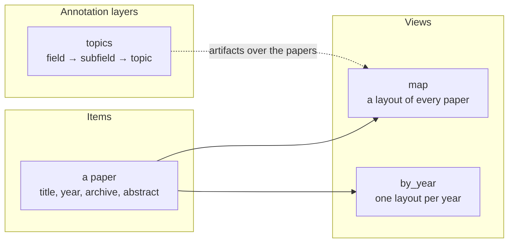

# Data model

A Mosaica database is built from four kinds of thing:

- **Items**: the records you want to map, each with its own field values.
- **Views**: layouts that give each item a position on a map.
- **Annotation layers**: structure drawn over the items, such as clusters, topics or regions. Each cluster, topic or region in a layer is called an artifact.
- **Vocabularies**: the lists of values that category fields take.

This chapter follows one example through all four: a collection of research papers, laid out by what their abstracts say, with a hierarchy of topics drawn over them.

```mermaid
flowchart LR
  subgraph items["Items"]
    p["a paper<br/>title, year, archive, abstract"]
  end
  subgraph views["Views"]
    m["map<br/>a layout of every paper"]
    y["by_year<br/>one layout per year"]
  end
  subgraph layers["Annotation layers"]
    t["topics<br/>field → subfield → topic"]
  end
  p --> m
  p --> y
  t -. "artifacts over the papers" .-> m
```

*Each paper is one item. Views place it on maps. A layer groups papers into topics drawn over a view.*

??? info "How does Mosaica compare to a relational database?"

    | Mosaica | Nearest relational idea |
    |---|---|
    | Item | A row of a main table, keyed by its `mosaica_id` or by a unique field |
    | Field | A column of that table |
    | View | A child table of positions, one row per item placed in it, stored in order of position |
    | View group | A table partitioned by key, with partitions added and dropped while running, where dropping a partition also deletes any item left in no partition |
    | Annotation layer | A table of artifacts. Members are listed in a join table, or computed like a SQL view (the items inside a shape, or carrying a value). Parents are a column, or a join table where an artifact has several |
    | Vocabulary | A lookup table that a category column refers to |
    | Access label | A label column on each row, checked against the viewer's roles by a row-level security policy |

    A relational database is built to answer any query, planned when you ask it. Mosaica is built to answer one question quickly over billions of rows: what is in this map tile, for this viewer, under these filters.

    - **Each layout is stored in its own order.** A tile is quick to read when its points are stored together. A table has one physical order, and a second order needs a second copy, as a covering index is. Mosaica keeps one such copy per view, ordered by position, and keeps what is true of the item in every view apart from them.
    - **Drawn columns sit beside the positions.** A rendered field is copied next to each position, so drawing a tile reads one place. Turning `render` on later would rewrite every view, which Mosaica does only at a build.
    - **Annotations are built in.** In SQL, counting the papers a viewer may see in each topic on screen is a join and a grouping on every request. Mosaica stores each artifact's members as a bitmap over the same item numbers as the viewer's visible items, so each count is one bitmap intersection.
    - **Rows are matched to items when they are written.** Mosaica has no query language and joins none of your tables at request time. Each row from a separate file, such as a field's values or a cluster's members, is tied to its item once, when it is inserted, by a unique field or, at a running server, a `mosaica_id`. That is why a unique field matters.

## Items and fields

An item is one record: in the example, one paper. Its data is held in fields, one for each column you declare, such as `title`, `year`, `archive` and `abstract`. Each item also carries an access label, which decides which viewers may see it ([access control](access-control.md)).

Each field has a type:

| Kind | For example | Once indexed, a viewer can filter it by |
|---|---|---|
| Number | `year`, `citations` | an exact value, a set of values, or a range |
| True or false | `open_access` | the same as numbers |
| Date and time | `published` | the same as numbers |
| Category | `archive`, from a list of archives | a value or a set of values, and can pick values from a list |
| Keyword | `doi` | an exact value, a set, a prefix, or a substring |
| Text | `abstract` | the words or phrases it contains |

For each field you also decide how it is used. There are two choices, and a field can take both, either or neither.

- **Rendered.** The value is sent with every point drawn, so the map can colour or size points by it. Render `archive` to colour the map by archive. A rendered field can also be filtered and counted. Every rendered field makes each point larger to send, so render only what the map needs. Keywords and text cannot be rendered.
- **Indexed.** The field gets an index of its own, so it can be filtered, counted and, for text, searched. Index `year` to filter by a range of years, and `abstract` to search it. An index takes disc space and time to build.

A field that is neither is still stored. It is shown when someone opens the item, and returned when items are read in bulk. Use this for anything a viewer reads but never filters on, such as the full author list.

### Naming an item

Mosaica gives every item a `mosaica_id`, and every response that returns an item includes it. It stays the same for the item's whole life in the database, through edits and restarts.

Your data usually has its own identifier too, such as a DOI. Declare that field `unique`, and you can name items by it wherever Mosaica asks which item you mean: to edit one, delete it, add it to a view, or put it in a cluster. A keyword, an integer or a timestamp can be unique. A unique field can always be looked up by exact value, with or without an index.

!!! note "Declare a unique field if an item appears in more than one file"
    At a build, rows in different files, such as a second view's points or a cluster's members, are matched to an item only by a unique field. Without one, each row of a view's points file becomes a new item, and other files cannot name items at all. A unique field also survives a rebuild, which gives every item a new `mosaica_id`.

## Views

A view lays the items out on a map, giving each one a position. The example has a view called `map`, where each paper's position comes from a UMAP projection of its abstract's embedding, so papers on similar subjects sit together.

There are two kinds of view:

- **Plain views** take any x and y, such as the output of UMAP or t-SNE, and draw them as they are.
- **Geographic views** take longitude and latitude in degrees, and draw them with a map projection. `web_mercator`, the projection web maps use, keeps shapes, enlarges areas towards the poles, and stops at about 85° north and south. `equirectangular` and `gall_isographic` reach the poles and stretch shapes away from the equator. They store the same positions, and differ only in the width-to-height a client draws the world at.

A view's **frame** is the area its positions are stored across. `auto` fits the frame to the points the build reads, with a small margin, or you can give the range yourself.

!!! note "The frame does not grow"
    An `auto` frame is fitted once, at the build. A point outside the frame, inserted later or read at the build, is drawn on its edge, and the build's report or the insert's answer counts how many were. A point beyond `web_mercator`'s limit near the poles is counted separately, as clipped. A group whose views will arrive later needs a margin or an explicit frame wide enough for them. A view added to a running server has no data to fit, so it needs an explicit frame, given in the view's stored coordinates rather than degrees; `mosaica check --payloads` prints it.

### Several views of the same items

The same papers can have more than one view: one laid out by abstract, another by citation graph, say. Each view gives the paper its own position. Everything else about the paper, its fields, its access label and its `mosaica_id`, is shared, so a viewer who switches from one view to another keeps their filters.

To place a paper in a second view, give it a position there that names it. At a build, that is a row of the second view's points file carrying the paper's DOI. At a running server, it is an insert into that view naming the paper by its DOI or its `mosaica_id`. Without a unique field, a build cannot tell that two rows in two files are one paper, and makes each its own item.

An item does not have to be in every view. A view holds the items that were given a position in it.

### View groups

Sometimes you want many views of the same kind. In the example, you might want a separate layout for each year, so that a viewer can see how the subjects of one year's papers relate, and add next year's layout when it arrives.

A view group is a family of views like this. Each view in the group has its own key, such as `2024`, and is named `by_year:2024`. Each holds its own items and positions. They share the projection, the frame and the group's access label, and each view may narrow who sees it.

Views in a group can be created and dropped while the server runs, without a rebuild. A group can also carry facts about each view, such as the date range a year covers, and a field can hold a different value for each view, such as a score recomputed every year.

!!! warning "Dropping a view deletes items that are in no other view"
    When a view of a group is dropped, any item that has a position in no other view is deleted, as if you had deleted it yourself. The answer to the drop says how many. Items that are also in another view are not affected.

## Annotation layers

An annotation layer adds structure on top of the items. In the example, the `topics` layer groups papers into fields, subfields and topics. Each field, subfield and topic is an **artifact**: a named thing with a set of member items.

An artifact can carry:

- a **title** or other text you supply, such as "Graph Neural Networks". Text made from the members, such as a generated topic name, can be limited to viewers who may see all of them;
- a **count** of its members, which Mosaica works out for each viewer from the members that viewer may see;
- a **centre**, a **bounding box** and a **hull**, which Mosaica computes for each viewer from the members that viewer may see;
- a **shape** you supply, such as a country's border.

A layer finds each artifact's members in one of three ways:

| Membership | Members are | Example |
|---|---|---|
| Listed | the items a table names for each artifact | the output of a clustering run, one row per paper and cluster |
| By shape | the items whose positions fall inside the artifact's shape | country borders on a world map |
| By an indexed field | the items carrying each value of a category or an unsigned integer field | one artifact per archive |

A layer can be flat, a single set of artifacts. It can be arranged in levels, as the example's fields, subfields and topics are: each topic names one subfield as its parent, and a viewer chooses which level to show and can colour the map by it. A layer can also be a tree with no levels, where an artifact may name more than one parent, or a stack of independent analyses, one per level, such as clusterings at three resolutions.

A layer is drawn on the views you name. A layer can also be declared for a view group, with its own set of artifacts for each view, such as a separate clustering for each year.

Each layer has its own access label, and can gate each artifact further, so a viewer may see the papers but not a layer of internal labels over them. The [annotations](annotations.md) chapter covers all of this in detail.

## Vocabularies

A category field takes its values from a vocabulary, a named list of values. In the example, `archive` uses a vocabulary of arXiv archives: `cs`, `math`, `astro-ph` and so on, each with an optional title such as "Computer Science". Several fields can share one vocabulary.

A vocabulary has three settings:

- **Size**: how many values it can hold, up to 255, 65,535 or about 4.3 billion. This is fixed once declared.
- **Closed or open**: a closed vocabulary refuses a value it does not hold. An open one adds it.
- **Public or derived**: a public vocabulary lists every value to every viewer. A derived one lists to each viewer only the values carried by items that viewer may see. Use derived when the list of values would itself reveal something, such as the names of clients.

Each value is stored as a numeric code, drawn at random unless you pin it in the declaration. A rebuild draws unpinned codes again, so name values by their keys rather than their codes.

## What can change while it runs

| | At a running server |
|---|---|
| Items | Insert, edit, delete, suppress and lift a suppression |
| Fields | Declare a new field. Its type, `render` and `index` are fixed once declared. `unique` can be turned on or off |
| Plain views | Declare a new view. A view cannot be changed or dropped |
| View groups | Declare a group, and create and drop its views. A group's view cannot be changed: drop it, create it again empty, and insert its points again. Items that were in no other view come back as new items |
| Annotation layers | Declare a layer, publish artifacts into it, and drop it |
| Vocabularies | Declare one, add values, and change values' titles |

Anything else about these needs a rebuild from files.

!!! note "Turning `unique` on for an existing field"
    Mosaica builds the index over every stored value. If any value is held by more than one item, the change is refused with a count and up to ten of the values, and the field stays as it was. Inserts and deletions carry on while the index is built.

## Not built yet

- **Fields holding a list of values.** A field holds at most one value per item.
- **Declaring a rendered field at a running server.** Declare it at a build.
- **Dropping a plain view.** A view in a view group can be dropped.
- **Titles of plain views, fields and vocabularies.** A declaration may give one, but it is not yet sent to clients. Titles of view groups, layers, levels and category values are sent.
