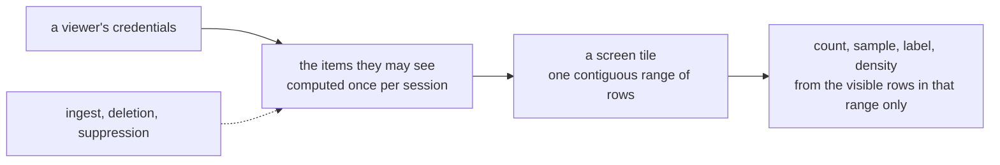

# Tessera overview

Tessera serves interactive, pannable, zoomable maps over millions to billions of documents or
records, with access control at the level of the individual item. Each viewer gets their own map,
generated on request, from a single machine. Ingest new data live; a deletion takes effect on the
next request.

Existing large-scale map servers bake a dataset into one shared view and serve the same tiles to
everyone. Tessera computes each viewer's map from exactly the items they are permitted to see.
Not only which points they can retrieve: every count, density, cluster and label is computed from
the items they may see and nothing else.

Use it as a backend database through its API and integrate it with your own visualisation, or
build quickly with the customisable components.

## What you can do with it

- **A map over any records with a 2D layout**: geographic coordinates, or an embedding projection
  such as t-SNE or UMAP.
- **Several coordinate systems over one corpus**, sharing one item
  identity so a viewer can switch layout without losing their place.
- **Composable filters** over categories, numbers, dates, keywords and full text, and over drawn regions (a box, circle, ellipse or polygon).
- **Annotation layers**: clusters, hierarchies including DAGs, regions and hulls, each correct for the viewer, with access-controlled labels.
- **Highlight mode**: light the matches, dull the rest.
- **Item cards** for a selected point.
- **Live ingest** into a running service, and deletion and suppression that take effect on the next
  request.
- **Every count, sample, label and density shown is correct for the viewer**, computed from what
  they can see rather than filtered after the fact.
- **Embeddable clients**: web components, a deck.gl layer, React bindings, and a Python notebook
  widget, or the HTTP API directly.

## What using it looks like

A corpus is declared in one TOML file: the files it reads, one or more coordinate systems over
it, the categories a point may carry, and how a viewer's access is decided. This is trimmed from
`test_corpora/geonames/corpus.toml`:

```toml
[sources]
points  = "points.parquet"
country = "vocab-country.parquet"

[defaults]
source = "points"

[[view]]
name             = "world"
projection       = "web_mercator"
extent           = { lon = [-180.0, 180.0], lat = [-85.05, 85.05] }
point_visibility = { field = "country", default = "public" }

[[vocabulary]]
name       = "country"
width      = "u16"
value_set  = "closed"
visibility = "derived"
source     = "country"

[[attribute]]
name       = "country"
type       = "category"
vocabulary = "country"
index      = true
```

Three commands take it from there. `tessera check` validates the declaration against the Parquet
schemas, `tessera build` produces the bundle in one streaming pass, and `tessera serve` opens it on
the HTTP API.

On the client side, `<tessera-explorer>` drops a full map into a page as a custom element,
`TesseraLayer` adds the same data to a deck.gl scene, and in a notebook `tesseradb`'s `Map` widget
opens the same view without leaving Python.

## What it consists of

- **TesseraDB**, the server. One binary that checks a declaration, builds a bundle, serves it and
  verifies it. Its HTTP API has three planes (viewer, session, control) and an OpenAPI description,
  so any language can drive a deployment without the clients below.
- **Tessera Client**, the headless store: `@tesseradb/client` for TypeScript and `tesseradb` for
  Python. It holds the session, keeps a local copy of what has been served, composes filters and
  regions, and hands the current frame to whatever draws it. It does no rendering of its own.
- **Components**: `@tesseradb/components` (a full explorer, the map, filter panel, pickers, item and
  artifact cards, a hierarchy browser, and the rest, as custom elements), `@tesseradb/deck` (a
  deck.gl layer), and `@tesseradb/react` (hooks and wrapped elements). The elements work in any
  framework. Every colour, font and spacing is a CSS custom property, and parts and slots are
  exposed for deeper restyling.

## How it scales

Tessera has been built and served against a synthetic 10⁹-point corpus, and against three real
corpora at smaller scale. All were measured on the same class of single machine: one box with
47 GB of RAM, no cluster.

| Corpus | Points | What it declares | Build time | Build rate | Peak RSS | Bundle | Viewport p50 |
|---|---|---|---|---|---|---|---|
| Synthetic | 10⁹ | about 130 access terms per item, drawn from a small vocabulary | 6 m 46 s | 2.5 M points/s | 27.6 GB | ~47 GB | 135–164 ms |
| Overture places and divisions | 73,631,092 | 625,754 division polygons as spatial layers, a text index over names, a predicate layer | 31 m 18 s | 39 k points/s | 26.75 GB | 12.57 GB | to measure |
| MedCPT / PubMed | 35,920,666 | an embedding view, titles indexed for text search, a MeSH hierarchy layer of 30,217 headings over 41,321 edges with 1.66×10⁹ membership entries | 12 m 10 s | 49 k points/s | 16.03 GB | 11.15 GB | to measure |
| GeoNames | 13,463,857 | 8 vocabularies, 13 attributes, 2 layers | 2 m 59 s | 75 k points/s | 3.55 GB | 1.34 GB | to measure |
| arXiv | 2,422,486 | two embedding views (kNN and PCA) with two clusterings each, clusters titled from their own text | 54 s | 44 k points/s | to measure | 1.5 GB | to measure |

One streaming pass produces the whole bundle. There is no separate spatial-index build, because the
row order the geometry is written in (Morton order) is the index, and memory is bounded by a plan
made before the pass starts rather than by how much of the corpus fits in RAM. Peak memory follows
that plan and the number of distinct terms rather than the point count. To measure: a 10⁹ build with
117 million distinct terms on the batched build path. The test-corpus ladder is climbing past 10⁹
points on the same machine. Build rate falls with what a corpus declares rather than with its size:
the synthetic corpus carries categories only, and the real corpora carry text indexes, polygons and
hierarchy layers. To measure: the ingest rate into a running service, which has not been recorded
since the write path was reworked.

## Compared with other systems

Other systems reach one of these properties at a time: scale, interactive rendering, precomputed
serving, or per-query access control. The table shows the closest match on each and where it
stops.

| System | Scale reached | Per-viewer masking | Live ingest and delete | Build at 10⁹ | What leaks or costs |
|---|---|---|---|---|---|
| Nanocubes / imMens | up to ~2×10⁸ bins | No: one shared index for every viewer | No | 6 h at 2×10⁸ (Nanocubes); to measure (imMens) | No per-viewer view; nothing updates once the index is built |
| deepscatter / Nomic Atlas | ~10⁸–10⁹ points | No (deepscatter); dataset-level only (Atlas) | No | to measure | One set of tiles served to every viewer |
| Datashader / tippecanoe | corpus-scale, rasterised or tiled | No | No | to measure | Nothing computed per viewer; the same image or tiles serve everyone |
| Elasticsearch with document-level security | any size the cluster holds; each tile is a query | Yes, per query | Yes | to measure | Speed: a documented case went from 30 ms to 26 s once document-level filtering was applied, and interactive spatial aggregation at 10⁸ points and above needs a cluster. A minor term-count disclosure is documented |
| PostgreSQL with row-level security | any size the database holds; each tile is a query | Yes, per query | Yes | to measure | Speed: a measured policy over a spatial predicate abandoned its index and ran 3,340× slower. `EXPLAIN` discloses excluded-row counts |
| Tessera | 10⁹ points measured; the test ladder is climbing past it | Yes: every served quantity | Yes: ingest, deletion and suppression while serving | 6 m 46 s (low-cardinality categories) | A leak register enumerates what is accepted; anything not in it is a bug |

We know of no system that does all of these at once.

## How it works

Every item carries one or more terms, derived from its access label. A viewer's credentials
resolve to the terms they hold. The items a viewer may see follow from the two, and that set is
computed once per session. Geometry is stored so that a screen tile at any zoom level is one
contiguous range of rows, so a count over a tile is arithmetic between that range and the viewer's
set rather than a scan of the tile's contents. Sampling, density and labels are computed the same
way, from the viewer's rows and nothing else. New items, deletions and suppressions reach the next
request within seconds to minutes.



The bitmap format and the row ordering that make this cheap (Roaring bitmaps and Morton order) are
established techniques. Tessera's contribution is using them so that every served quantity, not
only which items a viewer can open, is a function of one per-viewer set.

## What it guarantees

- Every count, density, label and sample a viewer sees is computed from their own visible set. A
  quantity computed over the whole corpus and then hidden from the wrong viewer is a defect, not a
  filtered view.
- Sampling happens after masking. A sparse viewer's sample is drawn from what they can see; it is
  never a global sample with the hidden points removed.
- The identifier a client receives is not the item's underlying identifier and cannot be used on
  its own to enumerate or correlate records. It is a keyed permutation rather than encryption, and
  it is no defence against anyone holding the underlying data.

The security chapter states the threat model these sit in, the properties in full, how each is
enforced and how each is checked. A small number of residual disclosures are accepted rather than
closed, each recorded with its severity and mitigation in a register. A disclosure found later that
is not in that register is a bug.

## What is built and what is not

| Feature | Status |
|---|---|
| The engine and the map: build, serve, ingest, live delete and suppress | Built. Build time, memory, bundle size and viewport latency measured at 10⁹ points (above) |
| Filters and search: categories, numbers, dates, keywords, text | Built. List-valued fields are not |
| Views and view groups | Built |
| Annotation layers: clusters, hierarchies, regions, hulls | Built. The DAG hierarchy kind is built; no shipped corpus declares one yet |
| Live ingest and denies | Built. A deletion's rows are physically removed at compaction, which is built and runs on a schedule |
| Clients: web components, a deck.gl layer, React bindings, a Python notebook widget | Built. Not yet published to a package index |
| Conformance suite (the check that the guarantees hold) | Built and run on every change against an independent oracle. Its own record states where its coverage stands |
| Plugin host for custom authorisation logic | Not built. A passthrough plugin ships in its place |
| Partitions and replication | Not built |
| Licence and packaging | Undecided |

## Where to go next

- Checking the security argument: the security chapter.
- Evaluating the approach: the data model, access control, queries and write-path chapters.
- Operating a deployment: the guide.
- Building against the client, or against the wire directly: the clients chapter and the guide.

## Sources

`README.md`; `docs/design/architecture.md`; `docs/design/configuration.md`;
`docs/design/conformance.md`; `docs/guide/README.md`; `docs/ingest-campaign.md`;
`docs/evidence/prior-art/prior-art-synthesis.md`;
`docs/evidence/memos/2026-07-30-viewport-hot-path-and-bundle-size-review.md`;
`test_corpora/geonames/corpus.toml`; `clients/ts/README.md`; `clients/py/README.md`;
`docs/openapi/tessera.yaml`; `probes/2026-07-31-label-campaign/build-times.txt`;
`probes/2026-07-30-1e9-rebuild/build-time-rss.txt`.
