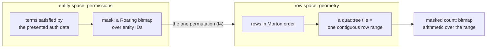
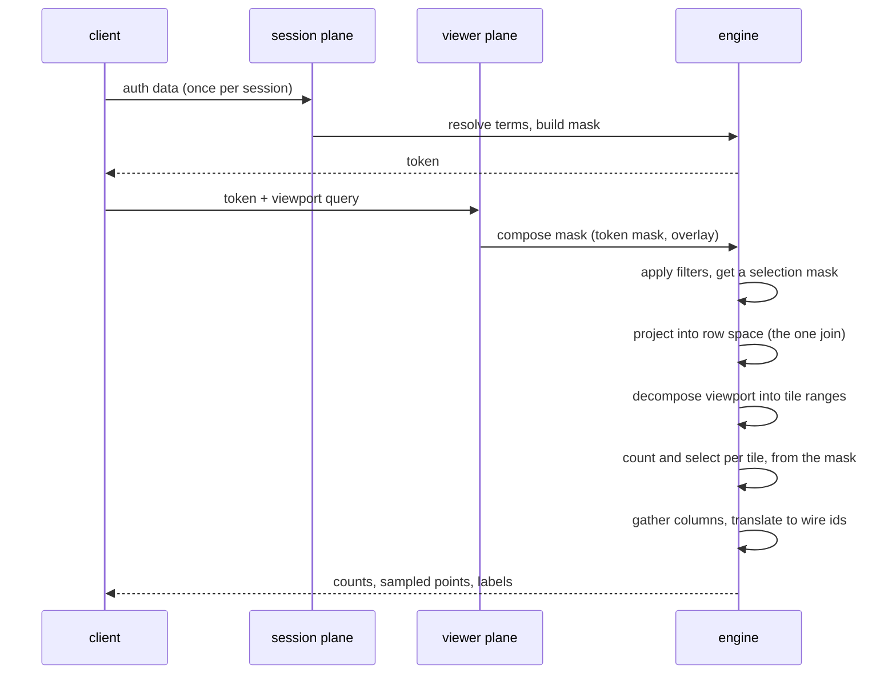
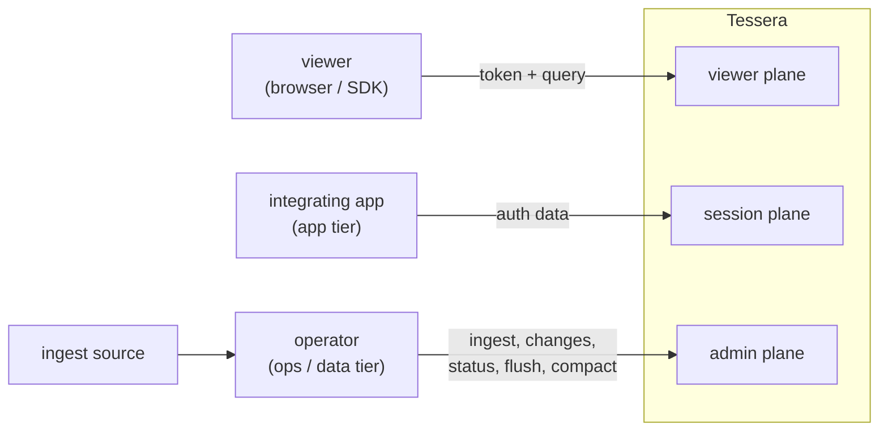
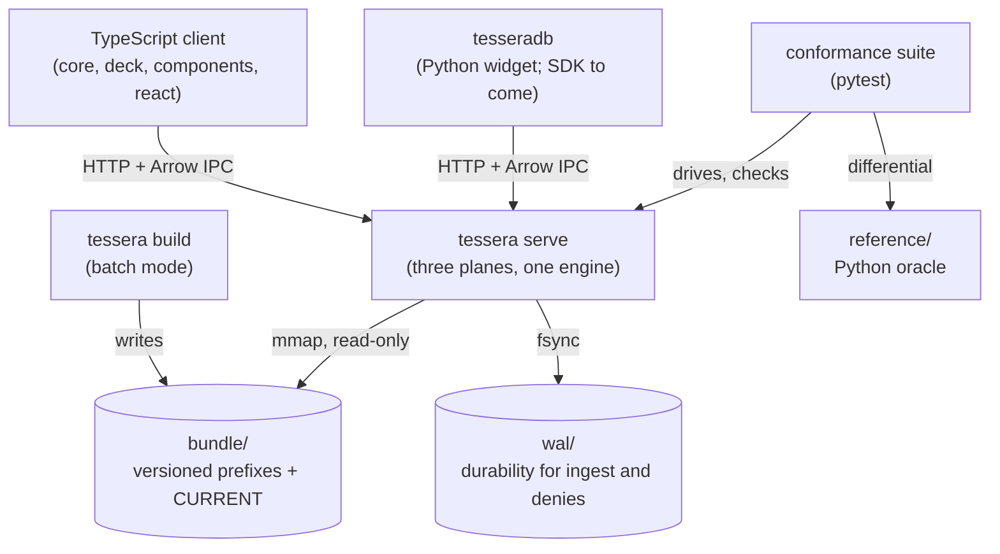

# Tessera overview

Tessera is a permission-masked point service: an interactive, pannable and zoomable map over a
large corpus of documents or records, served to many viewers at once. What a viewer may see
determines not only which items they can retrieve, but every count, density, cluster and summary
shown to them. Each viewer's visible set is computed once per session, as a Roaring bitmap over the
corpus, and every quantity served to that viewer, a count, a sample, a label, a density estimate,
is computed from that set alone. The corpus continues to change while it is being served: items
arrive, are deleted or are suppressed, on a target latency of seconds to minutes.

## What it is, and its scale

Measured on a synthetic corpus of 10⁹ points (about 130 terms per item) on a single machine with
47 GiB of memory: the bundle occupies about 47 GB on disk; viewport latency is 135 to 164 ms at the
50th percentile, of which selecting which points to draw is 83 to 89 percent; the cost that drives
that latency is the number of rows visible in the requested viewport, not the number of points
returned; and the build streams with external spill, its memory bounded by a pre-flight plan
(`README.md`, "Scale and cost"). These are synthetic-corpus figures, on one machine, and three of
the headline results depend on how a deployment's access labels are actually distributed, so they
should be re-measured against real labels before being relied on. The raw records are in `probes/`.

Three real corpora, smaller than the design target, have also been built and served on the same
class of machine: GeoNames (13,463,857 points, a 1.34 GB bundle, built in 2 minutes 59 seconds);
Overture places and divisions (73,631,092 points, a 12.57 GB bundle, built in 31 minutes 18
seconds); and MedCPT over PubMed (35,920,666 points, an 11.15 GB bundle, built in 12 minutes 10
seconds, carrying a hierarchy layer whose membership closes upward to 1.66×10⁹ entries). None of
these runs measured viewport latency; that figure exists only for the synthetic 10⁹ corpus above
(`docs/ingest-campaign.md` §1 to §4).

Scale is the headline result, but it is not the starting requirement. The starting requirement is
that every quantity a viewer sees has to be correct for that viewer's own permissions, not the
corpus's as a whole. That requirement rules out precomputing anything shared across viewers, which
is what shapes the architecture the rest of this chapter describes, and it is that same
architecture that makes the scale figures above possible.

## Where it sits among other systems

Every system surveyed with document-level or row-level security draws its boundary at retrieval: a
viewer cannot open a record outside their access, but a count, a cluster boundary or a density
estimate is typically computed over the whole corpus and only the retrieval step is filtered
(`docs/evidence/prior-art/prior-art-synthesis.md` §1). Tessera moves that boundary to cover every
derived quantity. Comparators exist on other axes.

- **Nanocubes and imMens** are the closest match on scale: an index answering aggregate queries
  over hundreds of millions to billions of bins in milliseconds. Nanocubes takes up to six hours to
  build an index over 210 million objects, with memory growing combinatorially with the number of
  dimensions and the resolution; imMens precomputes three- and four-dimensional tile projections,
  at a correspondingly costly precomputation step, with brush resolution capped at the bins it
  precomputed. Both serve one static cube to every viewer: there is no per-viewer view, and no
  update after the cube is built (`prior-art-2-visual-analytics.md` §4).
- **deepscatter and Nomic Atlas** are the closest match on interactive point rendering at scale:
  tiled scatterplots reaching roughly 10⁸ to 10⁹ points. Both precompute one set of tiles and serve
  it to every viewer; deepscatter's largest published deployment is a static star catalogue with no
  masking, and Nomic Atlas, the closest product match, offers access control only at the dataset
  level (`prior-art-2-visual-analytics.md` §4, §9).
- **Datashader and tippecanoe** (or its single-file archive format, PMTiles) are the closest match
  on precomputed serving: Datashader rasterises a corpus into images on the server, and tippecanoe
  builds a static archive of vector tiles once, ahead of any request. Neither computes anything per
  viewer; a build serves the same tiles, or the same image, to everyone who asks.
- **Elasticsearch's document-level security and PostgreSQL's row-level security** (the mechanism
  behind a PostGIS-backed tile server) are the closest match on the access-control axis: both
  compute a result dynamically, per query, filtered to the requesting principal. Both pay for it,
  and both leak. Elasticsearch's own documentation states that a principal restricted to specific
  documents "could still... count how many inaccessible documents contain a given term," and a
  documented case measured a 30 ms query taking 26 seconds once document-level security filtering
  was applied (`prior-art-1-search-engines.md` §2, citing elastic/elasticsearch#46817). A measured
  PostgreSQL row-level-security policy over a spatial predicate abandoned its index entirely (the
  predicate could not be proven safe to push below the security check) and ran 3,340 times slower
  than the same query unfiltered, while a fully patched server still disclosed the exact count of
  policy-excluded rows through `EXPLAIN ANALYZE`, and the density of an invisible cluster, 1,500
  times above background, through plain `EXPLAIN` (`prior-art-3-databases.md` §4).

On any one of these axes, scale, interactive rendering, precomputed serving, or dynamic per-viewer
filtering, there is prior art. The combination this design targets: billions of points, a masked
view computed per viewer, a corpus that keeps ingesting and accepting deletions and suppressions
while being served, and actual points, not bins, sampled from inside the mask, has no comparator
found in this survey (`prior-art-synthesis.md` §1, §4).

## How it works, in one page

Two identifier spaces underlie everything else. Permissions are expressed over **entity space**:
every item has a permanent entity ID, and a viewer's access is a Roaring bitmap of the entity IDs
they may see. Geometry is expressed over **row space**: within one temporal view, items are ranked
by a Morton (Z-order) code and assigned a row ID equal to that rank. The two spaces meet at exactly
one point, an explicit permutation between entity ID and row ID, and nowhere else derives one from
the other (`architecture.md` §5.1, invariant I4).

A viewer's visible set is computed once per session: the caller's auth data resolves to a set of
terms, the term postings are unioned into a Roaring bitmap over entity space, and the result is
cached. Every later request in that session composes this mask with the current overlay (denies not
yet folded into the postings) and projects it once into the current view's row space
(`architecture.md` §2.6, §11.2).

Because rows are stored in Morton order, a quadtree tile at any zoom level is a contiguous range of
row IDs: each successive pair of bits in a Morton code names one quadrant, so a tile's rows always
sort together. An exact masked count over a tile is therefore bitmap arithmetic over that range, not
a scan of any data file (`architecture.md` §5.2, §10.4). Sampling, density, cluster labels and every
other served quantity are defined the same way, computed from the rows the composed mask admits,
never computed over the whole corpus and filtered afterwards. A definition that samples from a
precomputed unmasked structure and then discards the unauthorised portion is a disclosure (design
invariants I2 and I7): the unauthorised portion was still read to produce the sample, and masking
is meant to stop that.

*Permissions and geometry are related by one explicit permutation; nothing else converts between
the two spaces.*

One request, from a token to a response, follows the steps stated in full in `architecture.md`
§2.6, condensed here:

1. Resolve the current view's geometry once, for the whole request (I11).
2. Compose the effective mask from the cached session mask and the overlay of denies not yet folded
   into the postings.
3. Apply any filters, by intersection, to get a second, narrower mask; filters never touch the
   first one (I12).
4. Project the mask into row space; this is the only point where the two ID spaces meet.
5. Decompose the requested viewport into a few hundred tiles, each a contiguous row range.
6. Count each tile by intersecting the mask with its range: no data file is read for this step.
7. Select which points to draw in each tile, evaluated directly from the mask so that a sparse
   viewer's own sample is never a filtered slice of someone else's sample (I7).
8. Gather the selected rows' columns from the mapped files.
9. Translate row IDs to the wire identifier; entity IDs never appear in anything a client reads
   (I10).
10. Serve labels on a separate branch, gated on the unfiltered mask, never the filtered one (I3).

*One viewport request. Everything after mask composition reads geometry only through a masked
row-ID range.*

Roaring bitmaps (the compressed bitmap format behind CRoaring, in Tessera's dependency tree) and
Morton, or Z-order, codes are established techniques. What is not established elsewhere is using the
join between the two ID spaces to make every served quantity, not only the retrieval step, a
function of the mask.

## The shape of the system

Tessera builds and serves from a single Rust binary, `tessera`, run in different modes:

- `tessera build` runs the same engine in batch mode, producing a bundle from a corpus in one pass.
  A build is treated as ingest into an empty database (decision 0091): build and a running
  deployment's own ingest share one engine and are required to behave identically from a client's
  point of view, though their internals differ (entity IDs are assigned in signature-sorted order
  at a build and above the high-water mark at ingest, and a build packs in one pass because nothing
  is being served while it runs).
- `tessera serve` runs the three HTTP planes described below against one bundle.
- `tessera check` validates a configuration's declaration against its Parquet schemas alone, in
  seconds, without reading a row (`configuration.md`).
- `tessera verify` runs the read protocol plus structural checks against a bundle: digest
  verification, manifest and plugin-hash agreement, permutation bijectivity, and declared-bounds
  conformance (`system-architecture.md` §8).

A deployment's data lives in two places: the **bundle**, a directory tree of versioned, immutable
prefixes plus one mutable `CURRENT` pointer naming the live one; and the **write-ahead log (WAL)**,
which gives ingest and denies (deletions, suppressions) durability before they are folded into the
bundle (`system-architecture.md` §1, §4.1).

Three HTTP planes, each scoped to who holds its credential:

- The **viewer plane** takes only a token plus a query, and is the only plane an untrusted client
  (a browser or an SDK) ever reaches: `GET /v1/meta`, `POST /v1/viewport`, `POST
  /v1/items/{tessera_id}`, and routes added since for categories, suggestion and artifacts
  (`docs/openapi/tessera.yaml`).
- The **session plane** holds `POST /session/authorise` and `POST /session/revoke`, on its own
  listener and its own credential, held by the integrating application's server rather than the
  browser.
- The **admin plane**, a Unix socket by default, takes an operator credential and carries ingest,
  item changes (deletion, suppression), status reporting, and forced lifecycle actions such as a
  flush or a compaction fold.

*Who reaches Tessera, on which plane, and with what credential.*

*Build and serve share one engine over one bundle; the conformance suite drives the server and
checks its answers against an independently written oracle.*

**Clients.** The TypeScript packages under `clients/ts/` are a live second reader of the wire
format, which is what makes that format a contract rather than an internal detail: `core` is a
headless store with no DOM dependency; `deck` is a `deck.gl` composite layer over it; `components`
is a set of Lit custom elements, including `<tessera-explorer>`; `react` wraps both as hooks and
wrapped elements; and a demo viewer, three example pages and an acceptance harness sit beside them
(`clients/ts/README.md`). The Python package `tesseradb` provides `authorise` and `Token` from the
standard install, and, behind an optional `[widget]` extra, an anywidget-based notebook widget,
`Map`; it installs today from this checkout rather than from a package index, and a general SDK and
an in-process instance are planned but not yet started (`clients/py/README.md`).

**The conformance suite** (`conformance/`, pytest) drives the server and compares its answers
against an independently written Python oracle (`reference/`), so that a bug shared between the
engine and the check that verifies it is unlikely. That differential pairing is separate from the
suite's byte-scanner, which sweeps every response and log line from a full run for content that
must never appear on the wire.

## What it guarantees, in brief

The full guarantee set is thirteen invariants, stated and covered in the guarantees chapter
(`architecture.md` §4). Three matter most to a reader deciding whether to look further:

- **Every quantity a viewer sees is computed from inside their mask (I2).** A count, a density
  estimate, a label or a cluster boundary derived from the whole corpus and then gated on a
  threshold is a disclosure, not a filtered view: the mask is the only entry point to the geometry
  arrays, so there is no route by which an aggregate over rows outside it can be built.
- **Sampling happens after masking, never before (I7).** The sample of an authorised set is not the
  authorised portion of a global sample. The floor that keeps a sparse viewer's map from going empty
  cannot be set to zero; a zero floor is refused at startup rather than clamped.
- **Entity IDs never cross to a client (I10).** The identifier a client receives, `tessera_id`, is a
  keyed blinding permutation of the entity ID. It stops a viewer-plane client from correlating or
  enumerating entity IDs. It is not encryption, and it is not a defence against anyone holding the
  bundle: the key that inverts every `tessera_id` sits in the bundle's own manifest.

Residual disclosures accepted rather than closed are enumerated in a leak register (`architecture.md`
Appendix C), each with a severity, a mitigation and a status; the register currently holds 33 rows
(`inventory.md`). A disclosure found later that is not already in that table is a bug. That claim
holds only while the retrieval surface stays narrow, about five request shapes today, so new
capability is required to enter through the filter contract, an order-independent set producer
composed by intersection, rather than as an arbitrary new endpoint.

The guarantees chapter states the remaining ten invariants, the two deny-removal rules and the
identifier's full threat model.

## What is built and what is not

| Area | Status |
|---|---|
| Core engine: build, serve, check, verify; mask composition; Morton tiling; the WAL | Built and serving. Measured against a synthetic 10⁹-point corpus and against three smaller real corpora (see "What it is, and its scale") |
| Viewer plane | `/v1/meta`, `/v1/viewport`, `/v1/items/{tessera_id}` are built, along with routes added since for categories, suggestion and artifacts. `/v1/labels` and `/v1/region` are not mounted (`docs/openapi/tessera.yaml`; `system-architecture.md` §4.2) |
| Admin plane | Ingest and item changes (deletion, suppression) are built; the withdrawn `predicate` operation is not. Label submission, the label-invalidation pull queue, unmasked node iteration and entity-ID leasing are not mounted (`system-architecture.md` §4.2) |
| Compaction, the fold | Built: retires deletions on the rule that a deletion is removed only at the fold that executes it, dispatched on a nightly gated window plus four gauges. A deferred staging list and two page-cache hints named in its design are not built (`compaction.md`) |
| Filters, views, annotations | The filter surface is built for every shipped field family except lists; views and view-switching are built through their second stage; the annotation and artifact model, including a `dag` hierarchy kind, is built through several delivery stages (`docs/design/README.md`'s document table) |
| Clients | The TypeScript packages are built through the client-components delivery plan's six steps. The Python package's notebook-widget path is built; a documented proxy path for hosted notebooks and a general SDK are not (see "The shape of the system") |
| Conformance suite | Largely built: 757 checked cases; the most recent full run before the last modules landed the same day was 734 of 739, with 5 skipped and none failing (2026-09-02). Covered as designed: I1, I2, I3, I4, I7, I10. Covered in substance, in Rust rather than in the suite: I8, I9, and I11's cross-request half (I11's within-request half has no test at all). Not covered: I5 (nothing exists yet that can genuinely disagree with the authorisation plugin, so there is nothing to test against), I6, I13b and I13c (`conformance.md` §0, §4.6) |
| The plugin host | Not built. Only a compiled-in passthrough plugin ships; there is no sandbox, so I5 and I6 cannot be meaningfully tested against anything else (`system-architecture.md` §4.3) |
| Partitions, I13b and I13c | Not built. There is one hardcoded partition and no router/worker split, so nothing computes a reachable-set gate. This is safe today only because a single partition makes both failure cases unreachable, not because either rule is enforced (`architecture.md` §12; `conformance.md` §4.6) |
| Label-invalidation notification | Not built. The capability of notifying a caller which labels a deletion or a predicate change has invalidated is specified and unmounted (`architecture.md` §2.5; `system-architecture.md` §4.2) |
| Replication | Not built. A replica's bundle step-down logic exists, but has no configured time bound, and `/readyz` does not check one. Safe today only because there is no replica: one process opens the bundle it wrote itself (`system-architecture.md` §4.1) |
| Licence | Not yet determined (`README.md`) |
| Packaging, publishing | Not yet decided. No wheel is published to a package index and no container image is built; `tessera serve` runs under whatever process supervisor or container an operator provides (`system-architecture.md` §8) |

## Where to go next

- An assessor checking the security argument: the guarantees chapter (the full thirteen invariants,
  the deny-removal rules, the leak register).
- An engineer evaluating the approach: the data model, access control, queries and write-path
  chapters.
- An operator: the guide.
- A client developer: the clients chapter and the guide.
