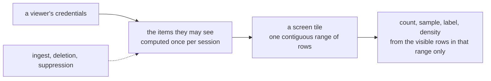

# Tessera overview

Tessera serves an interactive, pannable, zoomable map over a corpus of millions to billions of
documents or records, from one machine, to many viewers at once, while the corpus keeps changing
underneath it. Each viewer sees the map computed over exactly the items they are permitted to see:
not only which points they can retrieve, but every count, density, cluster and label they are
shown. Items arrive, are deleted or are suppressed while the service runs, and the map reflects
each within seconds to minutes.

## What you can do with it

- **A map over any records with a 2D layout**: geographic coordinates, or an embedding projection
  such as UMAP.
- **Several coordinate systems over one corpus**, called views and view groups, sharing one item
  identity so a viewer can switch layout without losing their place.
- **Composable filters** over categories, numbers, dates, keywords and full text.
- **Typeahead** over category values.
- **A drawn region as a filter**: a box, circle, ellipse or polygon.
- **Annotation layers**: clusters, hierarchies including DAGs, regions and hulls, each with a
  masked count correct for the viewer.
- **Highlight mode**: light the matches, dull the rest.
- **Item cards** for a selected point.
- **Live ingest** into a running service, and deletion and suppression that take effect on the next
  request.
- **Every count, sample, label and density shown is correct for the viewer**, computed from what
  they can see rather than filtered after the fact.
- **Embeddable clients**: web components, a deck.gl layer, React bindings, and a Python notebook
  widget.
- **An HTTP API**, with an OpenAPI description.

## What using it looks like

An operator declares a corpus in one TOML file: which files it reads, one or more coordinate
systems over it, the categories a point may carry, and how a viewer's access is decided. This is
trimmed from a working example, `test_corpora/geonames/corpus.toml`, down to the smallest fragment
that still declares a real corpus:

```toml
[sources]
points  = "points.parquet"
country = "vocab-country.parquet"

[defaults]
source = "points"

[[view]]
name             = "world"
projection       = "web_mercator"
extent           = { lon = [-180.0, 180.0], lat = [-85.05, 85.05] }
point_visibility = { field = "country", default = "public" }

[[vocabulary]]
name       = "country"
width      = "u16"
value_set  = "closed"
visibility = "derived"
source     = "country"

[[attribute]]
name       = "country"
type       = "category"
vocabulary = "country"
index      = true
```

Three commands take it from there: `tessera check` validates the declaration against the Parquet
schemas in seconds, without reading a row; `tessera build` produces the bundle in one streaming
pass; `tessera serve` opens it on the HTTP API. A browser or an SDK never sees this file. It holds a
token issued by a session server, and it asks `/v1/viewport` for what its holder may see.

Embedding it: `<tessera-explorer>` drops a full map into a page as a custom element; `TesseraLayer`
adds the same data to a deck.gl scene already running; and in a notebook, `tesseradb`'s `Map`
widget opens the same view without leaving Python.

## How it scales

Tessera has been built and served against a synthetic 10⁹-point corpus, and against three real
corpora at smaller scale. All were measured on the same class of single machine: one box with
47 GB of RAM, no cluster.

| Corpus | Points | Build time | Peak RSS | Bundle size | Viewport p50 |
|---|---|---|---|---|---|
| Synthetic, low-cardinality categories | 10⁹ | 6 m 46 s | 27.6 GB | ~47 GB | 135–164 ms |
| GeoNames | 13,463,857 | 2 m 59 s | 3.55 GB | 1.34 GB | to measure |
| Overture places + divisions | 73,631,092 | 31 m 18 s | 26.75 GB | 12.57 GB | to measure |
| MedCPT / PubMed | 35,920,666 | 12 m 10 s | 16.03 GB | 11.15 GB | to measure |

One streaming pass produces the whole bundle. There is no separate spatial-index build, because the
row order the geometry is written in (Morton order) is the index, and memory is bounded by a plan
made before the pass starts rather than by how much of the corpus fits in RAM. Peak memory follows
that plan and the number of distinct terms rather than the point count. To measure: a 10⁹ build with
117 million distinct terms on the batched build path. The test-corpus ladder is climbing past 10⁹
points on the same machine.

## Compared with other systems

Every system surveyed with document-level or row-level security draws its access boundary at
retrieval: a viewer cannot open a record outside their access, but a count, a cluster boundary or a
density estimate is typically computed over the whole corpus, with only the retrieval step
filtered. Tessera moves that boundary to cover every derived quantity. The rows below are the
closest match on each of scale, interactive rendering, precomputed serving and per-query access
control.

| System | Scale reached | Per-viewer masking | Live ingest and delete | Build at 10⁹ | What leaks or costs |
|---|---|---|---|---|---|
| Nanocubes / imMens | up to ~2×10⁸ bins | No: one shared index for every viewer | No | 6 h at 2×10⁸ (Nanocubes); to measure (imMens) | No per-viewer view; nothing updates once the index is built |
| deepscatter / Nomic Atlas | ~10⁸–10⁹ points | No (deepscatter); dataset-level only (Atlas) | No | to measure | One set of tiles served to every viewer |
| Datashader / tippecanoe | corpus-scale, rasterised or tiled | No | No | to measure | Nothing computed per viewer; the same image or tiles serve everyone |
| Elasticsearch document-level security | per-query, corpus-scale | Filters retrieval; aggregates leak | Yes | to measure | Its own documentation states a restricted principal can still count how many inaccessible documents contain a given term; a documented case went from a 30 ms query to 26 seconds once the filtering was applied |
| PostgreSQL row-level security | per-query, corpus-scale | Filters retrieval; aggregates leak | Yes | to measure | A measured policy over a spatial predicate abandoned its index and ran 3,340× slower; `EXPLAIN` still discloses the exact count of excluded rows, and plain `EXPLAIN` the density of an invisible cluster |
| Tessera | 10⁹ points measured; the test ladder is climbing past it | Yes: every served quantity | Yes: ingest, deletion and suppression while serving | 6 m 46 s (low-cardinality categories) | A leak register enumerates what is accepted; anything not in it is a bug |

We know of no system that does all of these at once.

## How it works

A viewer's credentials resolve to the set of items they may see, computed once when they connect
and reused for the rest of the session rather than recomputed on every request. Geometry is
stored so that a screen tile at any zoom level is one contiguous range of rows, rather than points
scattered through storage, so a masked count over a tile is arithmetic between that range and the
visible set, not a scan of the tile's contents. Sampling, density and cluster labels are defined the same way:
computed from the rows the viewer's own visible set admits, never computed over the whole corpus
and then hidden. A corpus keeps changing while this runs: items arrive, are deleted or are
suppressed, and each change is applied to what the next request reads, within seconds to minutes.



The compressed bitmap format and the row ordering that make this cheap (Roaring bitmaps and
Morton, or Z-order, codes) are established techniques. What is not established elsewhere is using
them so that every served quantity, not only which items a viewer can open, is a function of one
visible set.

## What it guarantees

- Every count, density, label and sample a viewer sees is computed from inside their own visible
  set. Computing a quantity over the whole corpus and then hiding it from the wrong viewer is
  treated as a defect.
- Sampling happens after masking. A sparse viewer's sample is drawn from what they can see; it is
  never a global sample with the hidden points removed.
- The identifier a client receives is not the item's underlying identifier and cannot be used on
  its own to enumerate or correlate records. It is a blinding permutation, not encryption, and it is
  no defence against anyone holding the underlying data.

The full set is thirteen guarantees; the guarantees chapter states them and how each is checked. A
small number of residual disclosures are accepted rather than closed, each recorded with its
severity and mitigation in a leak register. A disclosure found later that is not in that register is
a bug.

## What is built and what is not

| Feature | Status |
|---|---|
| The engine and the map: build, serve, ingest, live delete and suppress | Built and measured |
| Filters and search: categories, numbers, dates, keywords, text | Built. List-valued fields are not |
| Views and view groups | Built |
| Annotation layers: clusters, hierarchies, regions, hulls | Built. The DAG hierarchy kind is built; no shipped corpus declares one yet |
| Live ingest and denies | Built. A deletion's rows are physically removed at compaction, which is built and runs on a schedule |
| Clients: web components, a deck.gl layer, React bindings, a Python notebook widget | Built. Not yet published to a package index |
| Conformance suite (the check that the guarantees hold) | Built and running on every change. Its own record states exactly where its coverage stands |
| Plugin host for custom authorisation logic | Not built. A passthrough plugin ships in its place |
| Partitions and replication | Not built |
| Licence and packaging | Undecided |

## Where to go next

- Checking the security argument: the guarantees chapter.
- Evaluating the approach: the data model, access control, queries and write-path chapters.
- Operating a deployment: the guide.
- Building against the client, or against the wire directly: the clients chapter and the guide.

## Sources

`README.md`; `docs/design/architecture.md`; `docs/design/configuration.md`;
`docs/design/conformance.md`; `docs/guide/README.md`; `docs/ingest-campaign.md`;
`docs/evidence/prior-art/prior-art-synthesis.md`;
`docs/evidence/memos/2026-07-30-viewport-hot-path-and-bundle-size-review.md`;
`test_corpora/geonames/corpus.toml`; `clients/ts/README.md`; `clients/py/README.md`;
`docs/openapi/tessera.yaml`; `probes/2026-07-31-label-campaign/build-times.txt`;
`probes/2026-07-30-1e9-rebuild/build-time-rss.txt`.
