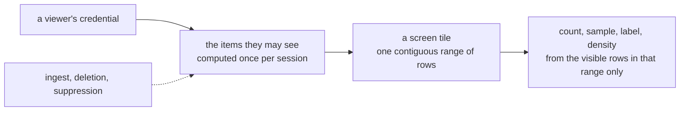

# Tessera overview

Tessera serves interactive, pannable, zoomable maps over a corpus of documents or records, with
access control at the level of the individual item. Each viewer gets their own map, generated on
request, from a single machine. New data can be ingested into a running service, and a deletion or
suppression applies to every request from the moment it is accepted.

Existing large-scale map servers bake a dataset into one shared view and serve the same tiles to
everyone. Tessera computes each viewer's map from exactly the items they are permitted to see.
Every count, density, cluster and label a viewer is shown, not only the points they can retrieve,
is computed from that same set and nothing else.

This is for a corpus where different viewers are permitted to see different items: tenant
boundaries, security compartments, or a clearance recorded per record. Most systems built for that
kind of access control stop the check at retrieval: a viewer cannot open a record they lack access
to, but a count, a cluster boundary or a density gradient computed before the check ran can still
tell them it exists. A cache or a precomputed view built once for every viewer carries the same
risk, regardless of what access control is enforced on the records themselves: every viewer sees
the same aggregate.

## What you can do with it

- **A map over any records with a 2D layout**: geographic coordinates, or an embedding projection
  such as t-SNE or UMAP.
- **Several coordinate systems over one corpus**, sharing one item
  identity so a viewer can switch layout without losing their place.
- **Composable filters** over categories, numbers, dates, keywords and full text, and over drawn regions (a box, circle, ellipse or polygon).
- **Annotation layers**: clusters, hierarchies including DAGs, regions and hulls, each correct for the viewer, with access-controlled labels.
- **Highlight mode**: light the matches, dull the rest.
- **Item cards** for a selected point.
- **Live ingest** into a running service, with deletion and suppression enforced from the moment
  they are accepted.
- **Embeddable clients**: web components, a deck.gl layer, React bindings, and a Python notebook
  widget, or the HTTP API directly.

## Compared with other systems

Other systems reach one of these at a time: scale, per-viewer masking, live ingest, or a fast build
at 10⁹ points.

| System | Scale reached | Per-viewer masking | Live ingest and delete | Build at 10⁹ | What leaks or costs |
|---|---|---|---|---|---|
| Nanocubes / imMens | up to 210 million objects | No: one shared index for every viewer | No | 6 hours, at 210 million objects (Nanocubes); not published (imMens) | No per-viewer view; nothing updates once the index is built |
| deepscatter / Nomic Atlas | ~10⁸–10⁹ points | No (deepscatter); dataset-level only (Atlas) | No | not published | One set of tiles served to every viewer |
| Datashader / tippecanoe | corpus-scale, rasterised or tiled | No | No | not published | Nothing computed per viewer; the same image or tiles serve everyone |
| Elasticsearch with document-level security | any size the cluster holds; each tile is a query | Yes, per query | Yes | not published | Speed: a documented case went from 30 ms to 26 s once document-level filtering was applied, and interactive spatial aggregation at 10⁸ points and above needs a cluster. Counting how many inaccessible documents contain a given term is a documented limitation |
| PostgreSQL with row-level security | any size the database holds; each tile is a query | Yes, per query | Yes | not published | Speed: a measured policy over a spatial predicate abandoned its index and ran 3,340× slower. `EXPLAIN` discloses excluded-row counts |
| Tessera | 10⁹ points measured, synthetic, low-cardinality labels; 7.4×10⁷ measured in a real corpus | Yes: every served quantity | Yes: ingest, deletion and suppression while serving | 2 h 37 m, the synthetic corpus below | A leak register enumerates what is accepted; anything not in it is a bug |

We know of no system that does all of these at once.

## How it works

An operator declares an access label on each item. The label resolves to one or more terms, the
unit of access the term index is built from. A viewer authenticates by presenting a credential
once, to a plane separate from the one serving requests, and receives a token that names the terms
the credential satisfies. An item is visible to a viewer whose token holds at least one of the
item's terms, and that visible set is computed once per session.

Geometry is stored so that a screen tile at any zoom level is one contiguous range of rows, using
Morton order, a row order in which every map tile falls in a single run. A viewer's visible set is
a Roaring bitmap, a compressed set of row numbers. A count over a tile is arithmetic between that
range and the viewer's set, rather than a scan of the tile's contents. Sampling, density and labels
are computed the same way, from the viewer's rows and nothing else.

A deletion or suppression applies to every request from the moment it is accepted. A newly
ingested item becomes visible once it is written into a segment at the next flush, which runs on a
fixed cadence.



*A viewer's terms determine one set, reused for every tile and every kind of answer.*

Sampling happens after masking: a sparse viewer's sample is drawn from what they can see, never a
global sample with the hidden points removed. The identifier a client receives in place of an
item's own identity, its `tessera_id`, is a keyed permutation rather than encryption, and no
defence against anyone holding the underlying bundle. The security chapter states these properties
in full, the threat model they answer to, and the disclosures accepted rather than closed.

## How it scales

Tessera has been built and served against a synthetic 10⁹-point corpus with a low-cardinality
label set, and against three real corpora at smaller scale. All were measured on the same class of
single machine: one box with 47 GB of RAM, no cluster.

| Corpus | Points | What it declares | Build time | Build rate | Peak RSS | Bundle | Viewport p50 |
|---|---|---|---|---|---|---|---|
| Synthetic, current build pipeline | 10⁹ | a category vocabulary, averaging 1.7 terms per item | 6 m 46 s | 2.5 M points/s | 27.6 GB | not measured | not measured |
| Synthetic, earlier build pipeline | 10⁹ | a category vocabulary of 47,968 terms, averaging 1.7 per item | 2 h 37 m | 106 k points/s | 27.5 GB | 47.0 GB | 135–164 ms |
| Overture places and divisions | 73,631,092 | 625,754 division polygons drawn as regions, a text index over names, and category filters | 31 m 18 s | 39 k points/s | 26.75 GB | 12.57 GB | not measured |
| MedCPT / PubMed | 35,920,666 | an embedding view, titles indexed for text search, a MeSH hierarchy layer of 30,217 headings over 41,321 edges with 1.66×10⁹ membership entries | 12 m 10 s | 49 k points/s | 16.03 GB | 11.15 GB | not measured |
| GeoNames | 13,463,857 | 8 vocabularies, 13 attributes, 2 layers | 2 m 59 s | 75 k points/s | 3.55 GB | 1.34 GB | not measured |
| arXiv | 2,422,486 | two embedding views (kNN and PCA) with two clusterings each, clusters titled from their own text | 54 s | 44 k points/s | not measured | 1.5 GB | not measured |

The two synthetic rows are one corpus built twice: the bundle size and viewport latency were
measured on the earlier build, and the build pipeline was then reworked, which cut the build to
under seven minutes.

One streaming pass produces the whole bundle. There is no separate spatial-index build, because
the row order the geometry is written in, Morton order, is the index. A build plans its memory
layout before the pass starts, from the corpus's declared term cardinality, and peak memory follows
that plan and the number of distinct terms rather than the point count. Build rate falls with what
a corpus declares rather than with its size: the synthetic corpus carries categories only, and the
real corpora carry text indexes, polygons and hierarchy layers. Sustained ingest rate into a
running service has not been measured since the write path was reworked.

## What it consists of

Use it as a backend through its API and your own visualisation, or embed the components it ships
with.

TesseraDB, the server, is one binary that checks a declaration, builds a bundle, serves it and
verifies it. It exposes three HTTP planes: viewer, session and control. An OpenAPI description
covers the viewer and session planes, so any language can drive read access to a deployment
without the clients below; the control plane, which ingest and administration use, is not yet in
that description.

A corpus is declared in one TOML file: the files it reads, one or more coordinate systems over it,
and how a viewer's access is decided. A GeoNames declaration, shortened:

```toml
[sources]
points  = "points.parquet"
country = "vocab-country.parquet"

[defaults]
source = "points"

[[view]]
name             = "world"
projection       = "web_mercator"
extent           = { lon = [-180.0, 180.0], lat = [-85.05, 85.05] }
point_visibility = { field = "country", default = "public" }
```

`point_visibility` names the field that decides who may see each point; here, a point's `country`
value, with `public` items visible to everyone. Three commands take it from there. `tessera check`
validates the declaration against the Parquet schemas, `tessera build` produces the bundle in one
streaming pass, and `tessera serve` opens it on the HTTP API.

On the client side, `<tessera-explorer>` drops a full map into a page as a custom element,
`TesseraLayer` adds the same data to a deck.gl scene, and in a notebook the Python client's `Map`
widget opens the same view without leaving Python.

Tessera Client, the headless store behind these, holds the session, keeps a local copy of what has
been served, composes filters and regions, and hands off what is on screen to whatever draws it. It
does no rendering of its own. The components built on it, a full explorer, the map, filter panel,
pickers, item and artifact cards, a hierarchy browser, and more, are custom elements that work in
any framework, with a deck.gl layer and React bindings alongside them.

## What is built and what is not

| Feature | Status |
|---|---|
| The engine and the map: build, serve, ingest, live delete and suppress | Built. Build time, memory, bundle size and viewport latency measured at 10⁹ points (above) |
| Filters and search: categories, numbers, dates, keywords, text | Built. Filtering on list-valued fields is not built yet |
| Several coordinate systems over one corpus | Built |
| Annotation layers: clusters, hierarchies, regions, hulls | Built |
| Live ingest and denies | Built. A deletion or suppression hides the item from the next request; its rows are removed from disk later, at compaction, which runs on a schedule |
| Clients: web components, a deck.gl layer, React bindings, a Python notebook widget | Built. Not yet published to a package index |
| Conformance suite (the check that the guarantees hold) | Built and run on every change against an independent oracle. Its own record states where its coverage stands |
| Plugin host for custom authorisation logic | Not built. A passthrough plugin ships in its place |
| Partitions and replicas | Not built |

## Where to go next

- Checking the security argument: the security chapter.
- Evaluating the approach: the data model, access control, queries and write-path chapters.
- Operating a deployment: the guide.
- Building against the client, or against the wire directly: the clients chapter and the guide.

## Sources

`README.md`; `docs/design/architecture.md`; `docs/design/configuration.md`;
`docs/design/conformance.md`; `docs/guide/README.md`; `docs/ingest-campaign.md`;
`docs/evidence/prior-art/prior-art-synthesis.md`;
`docs/evidence/prior-art/prior-art-2-visual-analytics.md`;
`docs/evidence/memos/2026-07-30-viewport-hot-path-and-bundle-size-review.md`;
`probes/dataset.md`; `probes/2026-07-30-1e9-rebuild/build-time-rss.txt`;
`test_corpora/geonames/corpus.toml`; `test_corpora/medcpt/mesh.py`;
`clients/ts/README.md`; `clients/py/README.md`; `docs/openapi/tessera.yaml`;
`crates/tessera-server/src/control.rs`; `docs/system/access-control.md`;
`docs/system/security.md`; `docs/system/write-path.md`.
