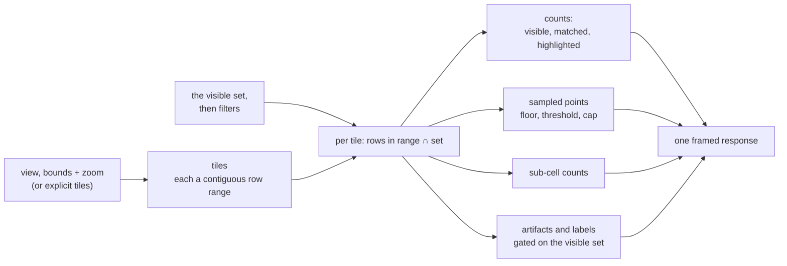
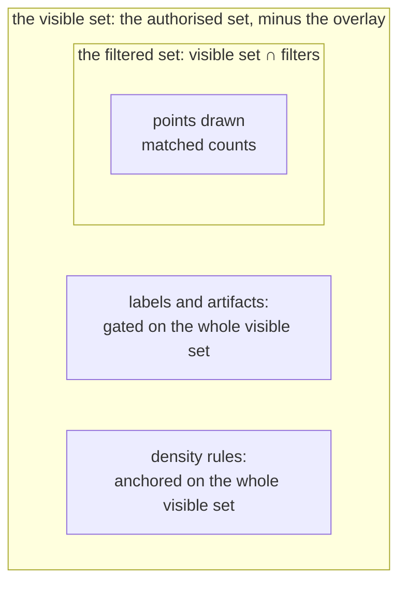
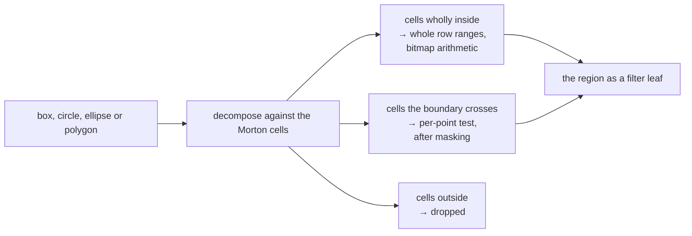

# Queries

Every response to a viewer's query (a count, a sampled point, a label, a cluster's shape) is
computed from that viewer's own visible items, never filtered out of an answer computed for
everyone. A drawn selection makes the difference concrete: asking how many of a viewer's own
points fall inside a shape they just drew returns the exact count for that shape, computed against
their own visible set at the moment they ask.

A filter and a drawn region each narrow what a viewport draws; a highlight marks a subset of it
without narrowing. None of them can widen a response beyond what the viewer's own credentials
permit.

## The viewport

A viewport request names a view, a zoom level, and either a bounding box or an explicit list of
tiles. Points are stored in Morton order, an established way of arranging two-dimensional data so
that points near each other in space stay near each other on disc. A tile at any zoom level is
therefore one contiguous run of rows, and a count over it is bitmap arithmetic against the
viewer's own visible set rather than a scan of the tile's contents.

A request can also carry a cap on how many points to return per tile (`k`), a filter, a highlight,
which annotation layers to answer for, and how many levels deeper than the requested zoom to
compute an exact sub-cell grid for (`underlay_offset`). Naming more tiles than a published ceiling
allows, nesting a filter expression deeper than the deployment permits, or asking for a sub-cell
depth or budget past its own ceiling, is refused rather than clamped: an oversized request is
refused outright, never answered with less than it asked for.

*A viewport request resolves to tiles, each a contiguous row range answered against the viewer's
own visible set.*

The response answers each requested tile with three exact counts, `visible`, `matched` and
`highlighted`. Alongside the counts it carries a sample of points drawn from the tile; `k = 0` asks
for the counts alone, with no points at all, the cheapest way to read the shape of a viewer's own
data without drawing anything. Where the request also asked for a finer grid of sub-cells beneath
the points, the response carries an exact count for each of those sub-cells too: the same masked
arithmetic, taken one or more zoom levels deeper, with no points attached. Drawn as a continuous
shaded field rather than individual marks, this sub-cell grid gives a sense of density in regions
too sparse or too crowded for the drawn marks alone to convey.

Where a request names annotation layers, the response also carries the artifacts those layers
serve inside the requested tiles: clusters, hulls, regions, hierarchy nodes. Each artifact exists
for this viewer or it does not; that does not depend on which points are drawn.

## The visible set and the filtered set

Every viewer has an authorised set: everything their session's terms admit, computed once when the
session opens ([access control](access-control.md#composing-the-viewers-set)). Every request
composes the authorised set against the overlay, the record of items currently deleted or
suppressed, to get the visible set: read fresh each time, so a suppression applies to every session
immediately ([access control](access-control.md#what-a-request-answers-from)). A filter narrows
the visible set further, to a filtered set of items matching the query. A filter can only narrow,
never widen: no combination of clauses ever draws or counts an item outside what the viewer's own
credentials permit.

*The filtered set narrows within the visible set; only points drawn and matched counts read it.*

Labels, whether a cluster or hierarchy artifact is served at all, and the viewer's own visible
total across the whole view, which decides how many marks a tile is allowed, are all decided
against the visible set, never the filtered one. Anchoring these to the filtered set instead would
make them move for reasons unrelated to what a filter narrows. A label could disappear the moment
a query excluded one of the items it describes. The number of marks a tile shows could shift as a
viewer typed, independent of how many of those marks matched.

One count follows from having both sets on hand for free: a single request can return how many of
a tile's visible items matched a filter alongside how many were visible at all, for two bitwise
operations. This lets a client highlight the matches against everything else still shown, rather
than hiding everything that did not match and leaving a handful of points on an otherwise blank
map.

## How many points are shown

A tile can hold far more visible items than a screen can usefully draw. Rather than a flat cap on
how many marks appear, each tile is served a number of points chosen from three density rules
working together. Every item carries a fixed, pseudo-random rank derived from its own
[`tessera_id`](data-model.md#what-an-item-carries) rather than from any internal ordering, so which
items appear first at a coarse zoom is unrelated to how an item came to be authorised.

| Rule | What it does |
|---|---|
| A floor | guarantees a minimum number of marks in any tile that has visible items at all, so a viewer with few visible items never sees a blank tile where visible ones exist |
| A threshold | admits roughly a fixed proportion of a tile's visible items, scaled against the viewer's own visible total across the whole view, so denser tiles show more marks than sparse ones |
| A cap | bounds how many marks a single tile ever returns, whatever the threshold would otherwise admit, so cost and visual clutter stay bounded |

The three rules nest across zoom: an item served in a parent tile is still served in whichever of
its children contains it, so panning and zooming in never make a previously visible mark disappear
only to reappear later.

A request's `k` defaults to the deployment's cap on marks per tile, and a client may ask for fewer.
**It must not ask for fewer while zooming in, or a mark it was already showing can vanish.**

Every tile's answer is computed fresh from the viewer's own visible set at request time.

## Filters

A filter is built from five families of predicate, one per kind of declared field:

| Family | What it matches | How |
|---|---|---|
| Category | a value from a declared, named set | an exact value, or membership in a list of values |
| Keyword | an identifier stored exactly as given | an exact match, membership in a list, a prefix, or a substring |
| Number | a numeric value | an exact match, or a bound on either or both sides |
| Date | a point in time | the same kind of bound as a number |
| Text | analysed prose | every named word present by default, at least a stated number of them on request, or an exact phrase |

These combine into a boolean expression: every clause in a set must match, any one clause in a set
must match, or none of a set of values must match. Negation requires naming a column and at least
one value to exclude. A bare negation, matching everything the other clauses did not, would also
match every item whose value in that column cannot be resolved for this viewer, reaching into what
the viewer cannot see. Naming a value, and confining the clause to one column, keeps it a predicate
that can only narrow a result. A text column cannot be negated: a negation subtracts from the items
known to carry some value in a column, and a text field carries no such per-item presence value to
subtract from.

Naming a column the corpus has not declared, or an operator outside that column's family, is
refused. A value is different: a filter naming a value the viewer is not permitted to see behaves
exactly as one naming a value that does not exist at all, matching nothing either way, with no
difference in the response that would let a viewer tell "hidden" apart from "absent."

A text search carries no relevance score and no ranking by how well an item matches, only a plain
match or no match. A relevance ranking is ordinarily computed from how common each word is across
a whole corpus, and a viewer's own results would then shift depending on documents that viewer
cannot see. A text search stays a boolean predicate, composed with every other filter clause, for
the same reason a category or region clause is: what an item matches must depend only on what the
viewer themselves may see.

A filter clause can also name one artifact directly and narrow to its own members, the same shape
of question as a drawn region, answered against a stored membership rather than against geometry.

## Drawn regions

A box, circle, ellipse or polygon a viewer draws is sent as a clause of the same filter as any
other, evaluated exactly against every point's own stored position rather than approximated by the
client from which map tiles the shape happens to touch.

*A drawn shape is classified against the tile grid: cells wholly inside become a row range; only
the boundary is tested point by point, after masking.*

Only the cells a shape's boundary crosses are tested point by point, after the viewer's visible set
has already narrowed which of those points need checking at all. Cost is modelled, not measured,
to track how long a shape's boundary is rather than how much area it encloses: a selection covering
half the map would cost little more than a small one, while a shape with a very long, winding edge
would cost more regardless of its size.

The count is exact for the shape as drawn, unless the shape's boundary crosses more cells than a
published limit (`max_region_cells`) allows. Then the decomposition stops early, every remaining
boundary cell is counted as if it were inside, and the answer is exact for a shape slightly larger
than the one drawn; the response's `x-tessera-region` header says which case applies. A region
clause composes with every other kind: it can sit alongside a category or text clause, and it can
be negated to mean everything outside the shape.

## Highlight and filter

A filter narrows which points are drawn; a highlight keeps every point that was already going to
be drawn and marks which of them also match a second condition. The two are separate parts of the
same request: a viewer can narrow the map with one clause and light a subset of what remains with
another, or highlight without narrowing at all.

A highlight is evaluated only over whatever a filter already matched (or, with no filter, over
everything the viewer may see in the requested tiles), so a highlighted item is always also a
matched one. Each served point and each served annotation artifact carries two flags, `matched` and
`highlighted`, saying whether it satisfies the filter and the highlight, and a tile's response
carries a count of how many of its matched items were also highlighted. None of this changes which
points or artifacts are served: the map drawn under a highlight is identical to the map drawn
without one, only some of it is lit and the rest dulled.

A filter narrows which artifacts are flagged as matching, but it does not change which artifacts
exist on the map or how far into a hierarchy the response descends. **Not built yet:** a mechanism
for letting a filter change that, serving a hierarchy's structure more finely where matches
concentrate and pruning it where a filter has emptied a region, was designed and then withdrawn,
and nothing has replaced it. A filtered hierarchy view looks the same as an unfiltered one, except
for which of its nodes are marked as matching.

## Category listing and typeahead

A category's declared values can be listed outright, or resolved from codes a client already
holds. Whether the whole value set is offered to every viewer, or only the values at least one
visible item carries, is set once per vocabulary: some categories publish their names as authored;
others gate each name on whether the viewer can see something wearing it.

Typing into a category filter is served by the same visibility rule, on its own endpoint, so the
values offered while typing are never wider than the values the enumeration itself would offer. A
typed prefix is matched, case- and accent-folded, against a value's own key, its title, and the
start of each word within either, so typing part of a later word in a multi-word title still finds
it. Matching is a fixed rule rather than a ranked one: there is no fuzzy matching and no ordering by
popularity or recency, only the order the matched text itself falls in. A count of how many visible
items carry a suggested value can be requested alongside it, computed for that viewer alone, and
never used to decide which suggestions are shown or in what order.

A value the viewer cannot see behaves exactly as one that does not exist, in every suggestion as in
every filter, but how long a request over a gated category takes reflects how many values, visible
or not, share the typed prefix, and that timing difference is accepted rather than closed.

## Item drill-down

Opening one item returns its whole record as this viewer may see it: every declared field, every
view the item appears in that this viewer can reach with its position there, and any attribute
values scoped to those views. An identifier naming nothing and one naming an item this viewer may
not see answer identically, both with a 404, so the response never distinguishes "does not exist"
from "exists, but not for you."

The response also names the item's own access labels, but only the ones this viewer holds, never
the full set an item carries. A viewer learning that an item they can see also carries a label they
do not hold would be a disclosure about how the corpus is labelled, not a filtered view of the item
itself, so only the intersection of the item's labels with what the viewer's own credentials
satisfy is ever served.

## What is not built

**Not built yet:** typing into one box to search every category at once does not exist; a caller
filters or suggests one column at a time.

**Not built yet:** there is no endpoint that exports or summarises everything inside a drawn
region in bulk; a viewer counts or draws a region through the ordinary viewport request, at
whatever scale that request already supports.

## Sources

`docs/design/architecture.md` §7, §8; `docs/design/filter-index.md` §1, §2, §6;
`docs/design/filter-surface.md` §1–§3, §5, §8; `docs/design/selection-operand.md`;
`docs/design/records-and-search.md` §4.4, §4.5; `docs/design/value-suggestion.md` §1–§3, §8;
`docs/design/highlight-and-hierarchy.md` §1–§4; `docs/openapi/tessera.yaml`; decisions 0062, 0063,
0066, 0069, 0104, 0114, 0118–0124.
