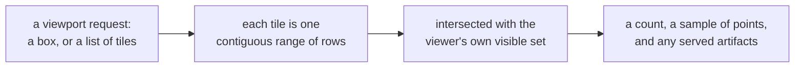
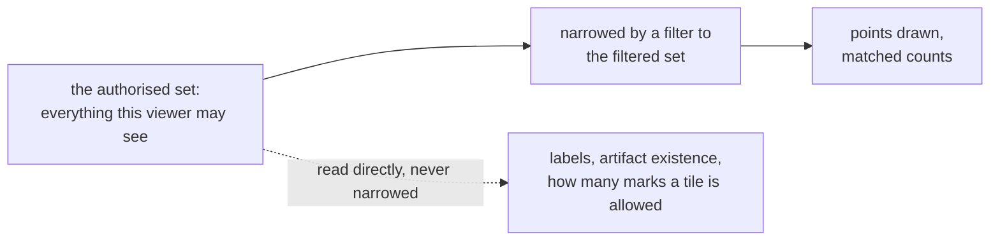
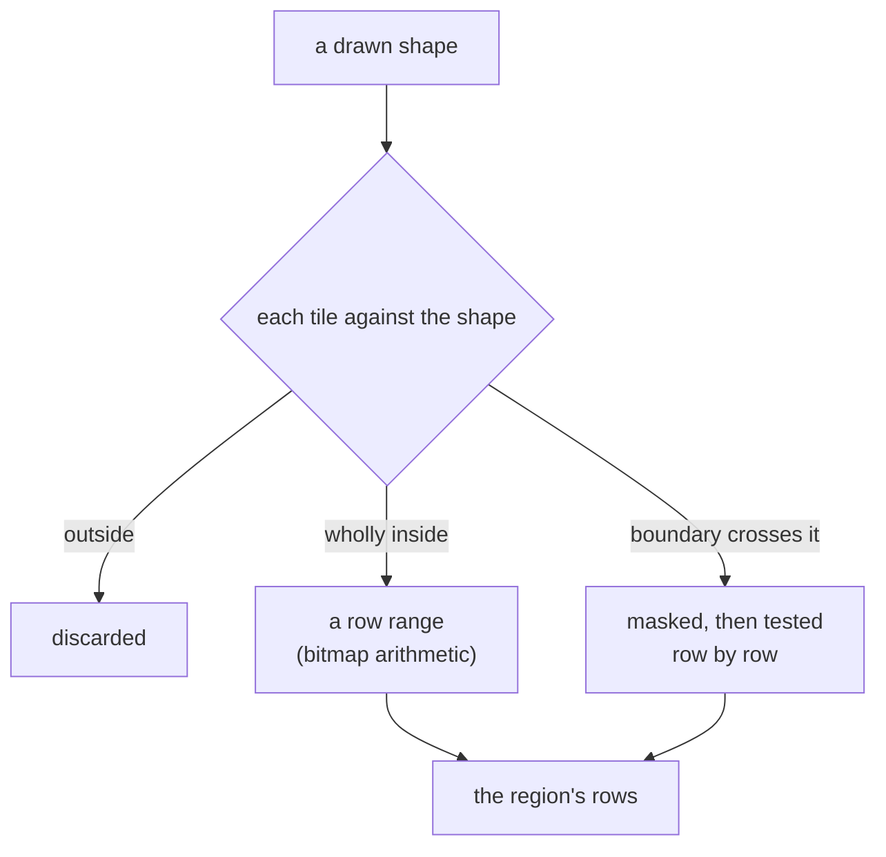

# Queries

Every response to a viewer's query (a count, a sampled point, a label, a cluster's shape) is
computed from that viewer's own visible items, never filtered out of an answer computed for
everyone. A drawn selection makes the difference concrete: asking how many of a viewer's own
points fall inside a shape they just drew returns the exact count for that shape against their
own visible set, computed at the moment they ask, rather than an approximation built from which
map tiles the shape happens to touch.

A filter, a drawn region, a highlight and a text search each narrow or mark what a viewport
draws; none of them can widen it beyond what the viewer's own credentials permit.

## The viewport

A viewport request names either a bounding box or an explicit list of tiles, at one zoom level.
Points are stored in Morton order, an established way of arranging two-dimensional data so that
points near each other in space stay near each other on disc. A tile at any zoom level is
therefore one contiguous run of rows, and a count over it is bitmap arithmetic against the
viewer's own visible set rather than a scan of the tile's contents.

*A viewport request resolves to tiles, each a contiguous row range answered against the viewer's
own visible set.*

The response carries a count for every requested tile and a sample of points drawn from inside
it. A request can ask for counts alone, with no points at all, which is the cheapest way to read
the shape of a viewer's own data without drawing anything. Where a request also asks for a finer
grid beneath the points, the response carries an exact count for each of those finer cells too:
the same masked arithmetic, taken one or more zoom levels deeper, with no points attached. Drawn
as a continuous shaded field rather than individual marks, it gives a sense of density in regions
too sparse or too crowded for the drawn marks alone to convey, with no separate mechanism behind
it.

Where a viewport also names annotation layers, the response carries the artifacts those layers
serve inside the requested tiles (clusters, hulls, regions, hierarchy nodes), each existing for
this viewer or not, independently of which points are drawn.

## How many points are shown

A tile can hold far more visible items than a screen can usefully draw. Rather than a flat cap on
how many marks appear, each tile is served a number of points chosen from three rules working
together. Every item carries a fixed, pseudo-random rank, derived from the same keyed identifier
the viewer receives rather than from any internal ordering, so which items appear first at a
coarse zoom is unrelated to how an item came to be authorised.

| Rule | What it does |
|---|---|
| A floor | guarantees a minimum number of marks in any tile that has visible items at all, so a viewer with few visible items never sees a blank tile where authorised ones exist |
| A threshold | admits roughly a fixed proportion of a tile's visible items, set against how many items this viewer can see across the whole view, so the number of marks drawn reflects how dense the tile actually is for this viewer rather than being the same in a nearly-empty tile and an overflowing one |
| A cap | bounds how many marks a single tile ever returns, whatever the threshold would otherwise admit, so cost and visual clutter stay bounded |

The three rules nest across zoom: an item served in a parent tile is still served in whichever of
its children contains it, so panning and zooming in never make a previously visible mark
disappear only to reappear later. A client asks for the deployment's largest usual page of marks
by default and may ask for fewer, but must not ask for fewer while zooming in, or a mark it was
already showing can vanish.

Every tile's answer is computed fresh from the viewer's own visible set at request time, at
whatever coverage that tile happens to have. That is what keeps a sparse viewer's map from ever
going blank, or from being a thinned-out copy of a busier viewer's map assembled first and then
cut down: there is no shared structure computed once for everyone that a viewer's own items are
then picked out of, so the number and choice of marks a tile returns depends on nothing but what
that one viewer may see there.

## The authorised set and the filtered set

Every viewer has an authorised set: everything they may see, computed once when their session
opens. A filter narrows that further, to a filtered set of items matching the query, but a filter
can only narrow, never widen, so no combination of clauses ever draws or counts an item outside
what the viewer's own credentials permit.

*The filtered set narrows within the authorised set. Points drawn and matched counts read the
filtered set; labels, artifact existence and the total behind the density rules above read the
authorised set only.*

Labels, whether a cluster or hierarchy artifact is served at all, and the total visible count
that decides how many marks a tile is allowed, are all decided against the authorised set, never
the filtered one. Anchoring any of these to a filtered set instead would make them move for
reasons that have nothing to do with what a filter actually narrows: a label could flicker out of
existence the moment a query excluded even one of the items behind it, and the number of marks a
tile shows could shift as a viewer typed, independent of how many of those marks actually
matched.

One count follows from having both sets on hand for free: a single request can return how many of
a tile's visible items matched a filter alongside how many were visible at all, for two bitwise
operations. This is what lets a client highlight the matches against everything else still shown,
rather than hiding everything that did not match and leaving a handful of points on an otherwise
blank map.

## Filters

A filter is built from five families of predicate, one per kind of declared field:

| Family | What it matches | How |
|---|---|---|
| Category | a value from a declared, named set | an exact value, or membership in a list of values |
| Keyword | an identifier stored exactly as given | an exact match, membership in a list, a prefix, or a substring |
| Number | a numeric value | an exact match, or a bound on either or both sides |
| Date | a point in time | the same kind of bound as a number |
| Text | analysed prose | one or more words present, or an exact phrase |

These combine into a boolean expression: every clause in a set must match, any one clause in a
set must match, or none of a set of values must match. The last of those, negation, requires
naming both a column and at least one value to exclude: it cannot simply mean "not what the other
clauses matched," because that would also match every item whose value in that column cannot be
resolved for this viewer, so a negation would otherwise reach into what the viewer cannot see.
Requiring a value, and confining the clause to one column, keeps it a predicate that can only
narrow a result.

A filter naming a value the viewer is not permitted to see behaves exactly as one naming a value
that does not exist at all: both match nothing, with no difference in the response that would let
a viewer tell "hidden" apart from "absent."

## Drawn regions

A box, circle, ellipse or polygon a viewer draws is sent as a clause of the same filter as any
other, evaluated exactly against every point's own stored position rather than approximated by
the client from which map tiles the shape happens to touch.

*A drawn shape is classified against the tile grid: cells wholly inside become a row range; only
the boundary is tested point by point, after masking.*

Cells entirely inside the shape are added as whole ranges of rows, at the cost of bitmap
arithmetic; only the cells a shape's own boundary crosses are tested point by point, and only
after the viewer's authorised set has already narrowed which of those points need checking at
all. Cost tracks how long a shape's boundary is, not how much area it encloses: a selection
covering half the map costs little more than a small one, while a shape with a very long, winding
edge costs more regardless of its size.

The count is exact for the shape as drawn. Where a shape's boundary is long enough to cross more
cells than a published limit allows, the decomposition stops early and every remaining boundary
cell is counted as if it were inside: the answer is then exact for a shape slightly larger than
the one drawn, and the response says so. A region clause composes with every other kind: it can
sit alongside a category or text clause, and it can be negated to mean everything outside the
shape.

A filter clause can also name one artifact directly and narrow to its own members, which is the
same shape of question answered against a stored membership rather than against geometry.

## Highlight and filter

A filter narrows which points are drawn; a highlight keeps every point that was already going to
be drawn and marks which of them also match a second condition. The two are separate parts of the
same request: a viewer can narrow the map with one clause and light a subset of what remains with
another, or highlight without narrowing at all.

A highlight is evaluated only over whatever a filter already matched (or, with no filter, over
everything the viewer may see in the requested tiles), so a highlighted item is always also a
matched one. Each served point and each served annotation artifact carries a flag saying whether
it satisfies the highlight, alongside the flag saying whether it satisfies the filter, and a
tile's response carries a count of how many of its matched items were also highlighted. None of
this changes which points or artifacts are served: the map drawn under a highlight is identical
to the map drawn without one, only some of it is lit and the rest dulled.

**Not built yet:** a filter narrows which artifacts are flagged as matching, but it does not
change which artifacts exist on the map or how far into a hierarchy the response descends. A
mechanism for letting a filter change that (serving a hierarchy's structure more finely where
matches concentrate, and pruning it where a filter has emptied a region) was designed and then
withdrawn, and nothing has replaced it: a filtered hierarchy view looks the same as an unfiltered
one, except for which of its nodes are marked as matching.

## Category listing and typeahead

A category's declared values can be listed outright, or resolved from codes a client already
holds. Whether the whole value set is offered to every viewer, or only the values at least one
visible item carries, is set once per vocabulary: some categories publish their names as
authored; others gate each name on whether the viewer can see something wearing it.

Typing into a category filter is served by the same gate under a separate request, so the values
offered while typing are never wider than the values the enumeration itself would offer. A typed
prefix is matched, case- and accent-folded, against a value's own key, its title, and the start
of each word within either, so typing part of a later word in a multi-word title still finds it.
Matching is a fixed rule rather than a ranked one: there is no fuzzy matching and no ordering by
popularity or recency, only the order the matched text itself falls in. A count of how many
visible items carry a suggested value can be requested alongside it, computed for that viewer
alone, and never used to decide which suggestions are shown or in what order.

A value the viewer cannot see behaves exactly as one that does not exist, in every suggestion as
in every filter, but how long a request over a gated category takes reflects how many values,
visible or not, share the typed prefix, and that timing difference is accepted rather than
closed.

## Text search

A text field is analysed prose rather than an exact value: a search matches items containing one
or more of the query's words, or, for an exact phrase, items containing those words in that order
and adjacent to each other. Either way the result is a plain match or no match: there is no
relevance score and no ranking by how well an item matches.

That is a deliberate limit rather than a missing feature. A relevance ranking is ordinarily
computed from how common each word is across a whole corpus, and a viewer's own results would
then shift depending on documents that viewer cannot see, the same kind of leakage every other
query in the system is built to avoid. A text search stays a boolean predicate,
composed with every other filter clause, for the same reason a category or region clause is: what
an item matches must depend only on what the viewer themselves may see.

## Item drill-down

Opening one item returns its whole record as this viewer may see it: every declared field, every
view the item appears in that this viewer can reach with its position there, and any attribute
values scoped to those views. An identifier naming nothing and one naming an item this viewer may
not see answer identically, so the response never distinguishes "does not exist" from "exists,
but not for you."

The response also names the item's own access labels, but only the ones this viewer holds, never
the full set an item carries. A viewer learning that an item they can see also carries a
label they do not hold would be a disclosure about how the corpus is labelled, not a filtered
view of the item itself, so only the intersection of the item's labels with what the viewer's own
credentials satisfy is ever served.

## Artifact browse

A layer's hierarchy can be browsed independently of any viewport: a page of its top-level
artifacts, one artifact's children and its own parents, or a search by name, each row carrying
the same masked count a map would show beside it. This exists because a hierarchy whose members
are spread across the whole map may never surface at any zoom a viewport's own budget reaches: an
artifact with tens of thousands of members spread evenly across a corpus draws nothing
recognisable at any practical zoom, however real it is. Every artifact returned has passed the
same existence test the map applies, so a withheld one leaves no gap in a page a caller could
count, and a relation between two artifacts is only named where both ends of it are visible to
this viewer.

## What is not built

**Not built yet:** a field that can carry more than one value per item is refused when a corpus
is declared; only a single value per item, per field, can be indexed and filtered today.

**Not built yet:** typing into one box to search every category at once does not exist; a caller
filters or suggests one column at a time.

**Not built yet:** there is no endpoint that exports or summarises everything inside a drawn
region in bulk; a viewer counts or draws a region through the ordinary viewport request, at
whatever scale that request already supports.

## Where this is in the code

The viewport path, filter evaluation, drawn regions, level-of-detail selection, typeahead and
hierarchy browsing all live in `tessera-engine`, in its `viewport`, `filter`, `region`, `select`,
`suggest` and `browse` modules; the value column and dictionary formats a filter reads live in
`tessera-filter`. The server's wire surface (parsing a filter expression, a drawn region and a
`highlight` clause off the request body) lives in `tessera-server`'s `viewer` and `filter_dto`
modules.

## Sources

`docs/design/architecture.md` §7, §8; `docs/design/filter-index.md` §1, §2, §6;
`docs/design/filter-surface.md` §1–§3, §5, §8; `docs/design/selection-operand.md`;
`docs/design/value-suggestion.md` §1–§3, §8; `docs/design/highlight-and-hierarchy.md` §1–§4;
`docs/openapi/tessera.yaml`; decisions 0062, 0063, 0066, 0069, 0104, 0114, 0118–0124.
