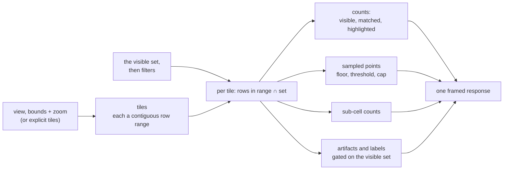
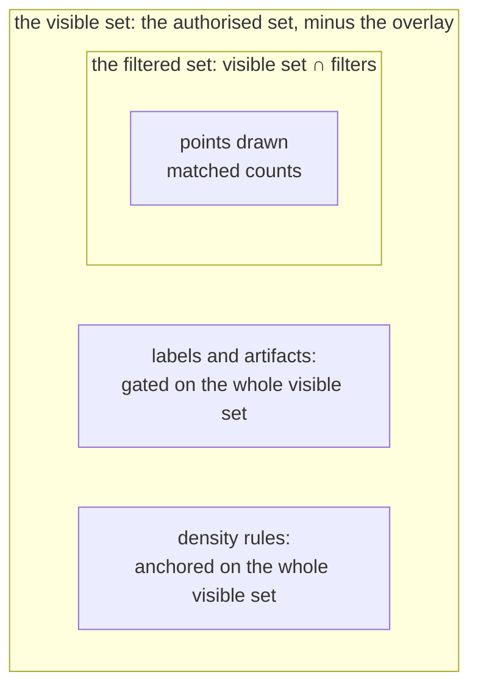
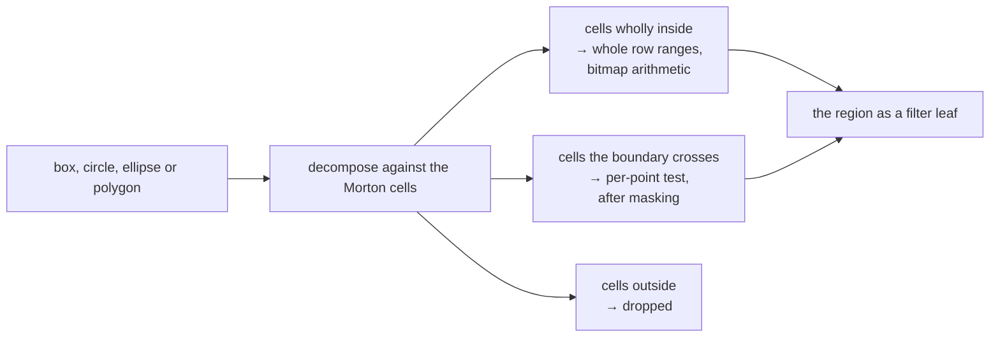

# Queries

Every response to a viewer's query (a count, a sampled point, a label, a cluster's shape) is
computed from that viewer's own visible items, never filtered out of an answer computed for
everyone. A drawn selection makes the difference concrete: asking how many of a viewer's own
points fall inside a shape they just drew returns the exact count for that shape, computed against
their own visible set at the moment they ask.

A filter and a drawn region each narrow what a viewport draws; a highlight marks a subset of it
without narrowing. None of them can widen a response beyond what the viewer's own credentials
permit.

## The viewport

A viewport request names a view, a zoom level, and either a bounding box or an explicit list of
tiles. Points are stored in Morton order, an established way of arranging two-dimensional data so
that points near each other in space stay near each other on disc. A tile at any zoom level is
therefore one contiguous run of rows, and a count over it is bitmap arithmetic against the
viewer's own visible set rather than a scan of the tile's contents.

A request can also carry a cap on how many points to return per tile (`k`), a filter, a highlight,
which annotation layers to answer for, and how many levels deeper than the requested zoom to
compute an exact sub-cell grid for (`underlay_offset`). Naming more tiles than a published ceiling
allows, nesting a filter expression deeper than the deployment permits, or asking for a sub-cell
depth or budget past its own ceiling, is refused rather than clamped: an oversized request is
refused outright, never answered with less than it asked for.

```mermaid
flowchart LR
  req["view, bounds + zoom<br/>(or explicit tiles)"] --> tiles["tiles<br/>each a contiguous row range"]
  set["the visible set,<br/>then filters"] --> per
  tiles --> per["per tile: rows in range ∩ set"]
  per --> count["counts:<br/>visible, matched, highlighted"]
  per --> sample["sampled points<br/>floor, threshold, cap"]
  per --> cells["sub-cell counts"]
  per --> arts["artifacts and labels<br/>gated on the visible set"]
  count --> resp["one framed response"]
  sample --> resp
  cells --> resp
  arts --> resp
```

*A viewport request resolves to tiles, each a contiguous row range answered against the viewer's
own visible set.*

The response answers each requested tile with three exact counts, `visible`, `matched` and
`highlighted`. Alongside the counts it carries a sample of points drawn from the tile; `k = 0` asks
for the counts alone, with no points at all, the cheapest way to read the shape of a viewer's own
data without drawing anything. Where the request also asked for a finer grid of sub-cells beneath
the points, the response carries an exact count for each of those sub-cells too: the same masked
arithmetic, taken one or more zoom levels deeper, with no points attached. Drawn as a continuous
shaded field rather than individual marks, this sub-cell grid gives a sense of density in regions
too sparse or too crowded for the drawn marks alone to convey.

Each point carries the item's values for the view's rendered fields. A number, bool, timestamp or
string the item does not hold arrives as a null, so a client can tell it from a zero. A category
the item does not hold arrives as code 0, which every vocabulary reserves for no value. A
conformance test compares these values with the source corpus for every item, over three number
columns, a timestamp and a bool that hold both absences and genuine zeros, with absences written
by the build and by a flush, live, after a restart and after a fold.

Where a request names annotation layers, the response also carries the artifacts those layers
serve inside the requested tiles: clusters, hulls, regions, hierarchy nodes. Each artifact exists
for this viewer or it does not; that does not depend on which points are drawn.

## The visible set and the filtered set

Every viewer has an authorised set: everything their session's terms admit, computed once when the
session opens ([access control](access-control.md#what-a-request-answers-from)). Every request
composes the authorised set against the overlay, the record of items currently deleted or
suppressed, to get the visible set: read fresh each time, so a suppression applies to every session
immediately ([access control](access-control.md#what-a-request-answers-from)). A filter narrows
the visible set further, to a filtered set of items matching the query. A filter can only narrow,
never widen: no combination of clauses ever draws or counts an item outside what the viewer's own
credentials permit.

```mermaid
flowchart TB
  subgraph vis["the visible set: the authorised set, minus the overlay"]
    subgraph filt["the filtered set: visible set ∩ filters"]
      pts["points drawn<br/>matched counts"]
    end
    lab["labels and artifacts:<br/>gated on the whole visible set"]
    lod["density rules:<br/>anchored on the whole visible set"]
  end
```

*The filtered set narrows within the visible set; only points drawn and matched counts read it.*

Labels, whether a cluster or hierarchy artifact is served at all, and the viewer's own visible
total across the whole view, which decides how many marks a tile is allowed, are all decided
against the visible set, never the filtered one. Anchoring these to the filtered set instead would
make them move for reasons unrelated to what a filter narrows. A label could disappear the moment
a query excluded one of the items it describes. The number of marks a tile shows could shift as a
viewer typed, independent of how many of those marks matched.

One count follows from having both sets on hand for free: a single request can return how many of
a tile's visible items matched a filter alongside how many were visible at all, for two bitwise
operations. This lets a client highlight the matches against everything else still shown, rather
than hiding everything that did not match and leaving a handful of points on an otherwise blank
map.

## How many points are shown

A tile can hold far more visible items than a screen can usefully draw. Rather than a flat cap on
how many marks appear, each tile is served a number of points chosen from three density rules
working together. Every item carries a fixed, pseudo-random rank derived from its own
[`tessera_id`](data-model.md#what-an-item-carries) rather than from any internal ordering, so which
items appear first at a coarse zoom is unrelated to how an item came to be authorised.

| Rule | What it does |
|---|---|
| A floor | guarantees a minimum number of marks in any tile that has visible items at all, so a viewer with few visible items never sees a blank tile where visible ones exist |
| A threshold | admits roughly a fixed proportion of a tile's visible items, scaled against the viewer's own visible total across the whole view, so denser tiles show more marks than sparse ones |
| A cap | bounds how many marks a single tile ever returns, whatever the threshold would otherwise admit, so cost and visual clutter stay bounded |

The three rules nest across zoom: an item served in a parent tile is still served in whichever of
its children contains it, so panning and zooming in never make a previously visible mark disappear
only to reappear later.

A request's `k` defaults to the deployment's cap on marks per tile, and a client may ask for fewer.
**It must not ask for fewer while zooming in, or a mark it was already showing can vanish.**

Every tile's answer is computed fresh from the viewer's own visible set at request time.

## Filters

A filter is built from five families of predicate, one per kind of declared field:

| Family | What it matches | How |
|---|---|---|
| Category | a value from a declared, named set | an exact value, or membership in a list of values |
| Keyword | an identifier stored exactly as given | an exact match, membership in a list, a prefix, or a substring |
| Number | a numeric value | an exact match, or a bound on either or both sides |
| Date | a point in time | the same kind of bound as a number |
| Text | analysed prose | every named word present by default, at least a stated number of them on request, or an exact phrase |

These combine into a boolean expression: every clause in a set must match, any one clause in a set
must match, or none of a set of values must match. Negation requires naming a column and at least
one value to exclude. A bare negation, matching everything the other clauses did not, would also
match every item whose value in that column cannot be resolved for this viewer, reaching into what
the viewer cannot see. Naming a value, and confining the clause to one column, keeps it a predicate
that can only narrow a result. A text column cannot be negated: a negation subtracts from the items
known to carry some value in a column, and a text field carries no such per-item presence value to
subtract from.

Naming a column the corpus has not declared, or an operator outside that column's family, is
refused. A value is different: a filter naming a value the viewer is not permitted to see behaves
exactly as one naming a value that does not exist at all, matching nothing either way, with no
difference in the response that would let a viewer tell "hidden" apart from "absent."

An integer or timestamp comparand may be sent as its decimal digits in a string, with an optional
leading `-`. A JSON number is read as a 64-bit float by most parsers, which is exact only up to
2^53; the string form is exact across the whole 64-bit range. This holds on every integer and
timestamp field.

A field declared unique ([data model](data-model.md#unique-fields)) answers `eq` and `in` from its
unique index. The server looks up each named value, takes the items holding them, drops deleted
items, and intersects the result with the viewer's visible set before any other clause reads it.
An `in` naming a thousand values costs a thousand lookups in the index, and reads none of the
field's other values. A holder the viewer may not see matches exactly as a value nobody holds. A unique field with
neither `render` nor `index` has no other filter structure, so it takes `eq` and `in` alone, and any
other operator on it is refused as an operator outside its family would be. `/v1/meta` lists the two
operators as that field's `operands`.

A text search carries no relevance score and no ranking by how well an item matches, only a plain
match or no match. A relevance ranking is ordinarily computed from how common each word is across
a whole corpus, and a viewer's own results would then shift depending on documents that viewer
cannot see. A text search stays a boolean predicate, composed with every other filter clause, for
the same reason a category or region clause is: what an item matches must depend only on what the
viewer themselves may see.

A filter clause can also name one artifact directly and narrow to its own members, the same shape
of question as a drawn region, answered against a stored membership rather than against geometry.

## Drawn regions

A box, circle, ellipse or polygon a viewer draws is sent as a clause of the same filter as any
other, evaluated exactly against every point's own stored position rather than approximated by the
client from which map tiles the shape happens to touch.

```mermaid
flowchart LR
  shape["box, circle, ellipse or polygon"] --> decomp["decompose against the Morton cells"]
  decomp --> inside["cells wholly inside<br/>→ whole row ranges,<br/>bitmap arithmetic"]
  decomp --> edge["cells the boundary crosses<br/>→ per-point test,<br/>after masking"]
  decomp --> outside["cells outside<br/>→ dropped"]
  inside --> leaf["the region as a filter leaf"]
  edge --> leaf
```

*A drawn shape is classified against the tile grid: cells wholly inside become a row range; only
the boundary is tested point by point, after masking.*

Only the cells a shape's boundary crosses are tested point by point, after the viewer's visible set
has already narrowed which of those points need checking at all. Cost is modelled, not measured,
to track how long a shape's boundary is rather than how much area it encloses: a selection covering
half the map would cost little more than a small one, while a shape with a very long, winding edge
would cost more regardless of its size.

The count is exact for the shape as drawn, unless the shape's boundary crosses more cells than a
published limit (`max_region_cells`) allows. Then the decomposition stops early, every remaining
boundary cell is counted as if it were inside, and the answer is exact for a shape slightly larger
than the one drawn; the response's `x-tessera-region` header says which case applies. A region
clause composes with every other kind: it can sit alongside a category or text clause, and it can
be negated to mean everything outside the shape.

## Highlight and filter

A filter narrows which points are drawn; a highlight keeps every point that was already going to
be drawn and marks which of them also match a second condition. The two are separate parts of the
same request: a viewer can narrow the map with one clause and light a subset of what remains with
another, or highlight without narrowing at all.

A highlight is evaluated only over whatever a filter already matched (or, with no filter, over
everything the viewer may see in the requested tiles), so a highlighted item is always also a
matched one. Each served point and each served annotation artifact carries two flags, `matched` and
`highlighted`, saying whether it satisfies the filter and the highlight, and a tile's response
carries a count of how many of its matched items were also highlighted. None of this changes which
points or artifacts are served: the map drawn under a highlight is identical to the map drawn
without one, only some of it is lit and the rest dulled.

A filter narrows which artifacts are flagged as matching, but it does not change which artifacts
exist on the map or how far into a hierarchy the response descends. **Not built yet:** a mechanism
for letting a filter change that, serving a hierarchy's structure more finely where matches
concentrate and pruning it where a filter has emptied a region, was designed and then withdrawn,
and nothing has replaced it. A filtered hierarchy view looks the same as an unfiltered one, except
for which of its nodes are marked as matching.

## Category listing and typeahead

A category's declared values can be listed outright, or resolved from codes a client already
holds. Whether the whole value set is offered to every viewer, or only the values at least one
visible item carries, is set once per vocabulary: some categories publish their names as authored;
others gate each name on whether the viewer can see something wearing it.

Typing into a category filter is served by the same visibility rule, on its own endpoint, so the
values offered while typing are never wider than the values the enumeration itself would offer. A
typed prefix is matched, case- and accent-folded, against a value's own key, its title, and the
start of each word within either, so typing part of a later word in a multi-word title still finds
it. Matching is a fixed rule rather than a ranked one: there is no fuzzy matching and no ordering by
popularity or recency, only the order the matched text itself falls in. A count of how many visible
items carry a suggested value can be requested alongside it, computed for that viewer alone, and
never used to decide which suggestions are shown or in what order. A request can carry the filter
the viewer has applied to the map, and each count is then of the visible items in the view that pass
it. The filter changes the counts and nothing else: a value it excludes is still offered, with a
count of zero, because what is offered is decided over everything the viewer may see. A page with
counts also carries the number of items they are taken over, so a client can draw each value's
exact share.

A value the viewer cannot see behaves exactly as one that does not exist, in every suggestion as in
every filter, but how long a request over a gated category takes reflects how many values, visible
or not, share the typed prefix, and that timing difference is accepted rather than closed.

## Item drill-down

Opening one item returns its whole record as this viewer may see it: every declared field, every
view the item appears in that this viewer can reach with its position there, and any attribute
values scoped to those views. An identifier naming nothing and one naming an item this viewer may
not see answer identically, both with a 404, so the response never distinguishes "does not exist"
from "exists, but not for you."

The response also names the item's own access labels, but only the ones this viewer holds, never
the full set an item carries. A viewer learning that an item they can see also carries a label they
do not hold would be a disclosure about how the corpus is labelled, not a filtered view of the item
itself, so only the intersection of the item's labels with what the viewer's own credentials
satisfy is served. A bulk read in stored order discloses part of what this withholds: which of the
viewer's items share a full set of access terms, as [security](security.md#reading-in-bulk)
states.

## Reading items and artifacts in bulk

Two routes return in bulk what the map is computed from. `POST /v1/items` returns every item the
viewer may see in one view that matches a filter, with the fields the caller names.
`POST /v1/artifacts` returns every artifact of one layer the viewer is served, with the
properties the caller names. Both answer with pages of Apache Arrow record batches, framed as a
viewport response is. A caller reads a whole result by passing each response's cursor back in its
next request until the cursor is null, and the server keeps nothing between requests.

Every page is built from the latest published data, with the visible set composed again as a
viewport composes it, so a deletion or suppression accepted during a read applies from the next
page. A row inserted during a read is returned if it lands ahead of the cursor and not if it lands
behind it, and no row is returned twice. **Not built yet:** a read pinned to one version of the
corpus. Rows returned before a flush and rows returned after it come from different versions.

### What a read of items returns

A page holds `tessera_id`, then the named fields in the order named, then either or both of two
system fields: `position`, and `labels`, the item's labels that this viewer also holds. A unique
field is named like any other. Under `keep_unmatched` every visible item is returned, with a
`tessera:matched` column. Every named field is present whether or not an item holds a value, and a
value it does not hold is a null. A category arrives as its value keys, and each page's dictionary
holds only the keys its own rows carry.

`position` is the stored position converted back through the view's projection and frame, in
degrees on a geographic view, within half a grid step of the position supplied. A caller that
needs the exact values it supplied declares them as number fields.

A rendered field is read from the view the request names. The item card reads the first view the
viewer can reach, so the two can differ where views hold different values. A field declared per
view of a group resolves as a filter leaf on it does, and is pinned as `<field>@<key>` under a view
outside its group. An item joined into a second view before its own ingest is flushed has null
record fields until that flush.

The rows come in one of two orders, which return the same rows. Map order is by map cell in the
view, then by `tessera_id`, merged across the view's segments, which is the order rendered fields
are stored in. Stored order is by the server's internal item numbering, which is the order the
record store holds items in. In map order a page's items are scattered through the record store,
so each page decompresses blocks it uses only a few rows of, and the smaller the pages, the more
often each block is decompressed over a read. Each field's `homes` in `/v1/meta` says where its
value is read from: the view's rendered columns, a per-item value column, or the record store. A
request with neither `order` nor a cursor is served in stored order if any named field's only home
is the record store, and in map order otherwise. That choice may change.

Stored order groups a viewer's items by their full set of access terms, including terms the viewer
does not hold. [Security](security.md#reading-in-bulk) states what that discloses.

### What a read of artifacts returns

A read of artifacts walks one layer level by level, and within a level in the order the artifacts
were published. The server does not reorder them, so the order says nothing about access labels.
For each artifact, a page runs the viewport's own verdict: the artifact's access label, its
layer's membership requirement over the viewer's visible members, and whether the viewer may read
its content. An artifact the viewer is not served leaves no row, no count and no entry in another
artifact's `parents`. An attached artifact, such as the label on a cluster, is served only while
the artifact it is attached to is.

If the layer stops being published to the viewer, the response under way ends as though no
artifact remained, and the next request is refused as naming an unknown layer. A layer dropped and
registered again under the same name is another layer, and a cursor from the first does not open
for it.

`level` reads one level of a levelled layer. `parent` reads the artifacts that name one artifact
among their parents, and a parent the viewer is not served answers as a parent with no children
does. `q` keeps the artifacts whose key, or first text content the viewer is served, contains it,
ignoring case, and cannot be combined with `parent`. A filter keeps the artifacts with at least one
visible member that matches and adds each one's count of matching members; `keep_unmatched` keeps
the rest too, with a count of 0. An attached artifact is kept, dropped and counted as its target
is.

These properties depend on the viewer:

- `parents` lists only the parents this viewer is also served.
- `content` is the one set of supplied content this viewer is served, with an authored shape's slot
  empty. The shape for this view is served as `shape`.
- `centroid` and `box` are taken over the members this viewer can see, in the view's coordinates.
  On a geographic view the centroid is the members' mean in the projected plane, converted to
  degrees: the point the map draws, which differs from the mean of their longitudes and latitudes.
- `shape` is Well-Known Binary: a hull over the members this viewer can see, or a predicate or
  authored shape whole. A hull over one or two members, or over members on one line, is a polygon
  of zero area whose rings are still closed and at least four points long.

### Pages, responses and the cursor

A page ends at `page_rows` rows, held to `selection.max_page_rows`, or before the row that would
take its Arrow bytes past `selection.max_page_bytes`. A single larger row is sent alone. Each page
is followed by a page end holding the cursor after it, and each response closes with a trailer
holding the cursor for the next request. [Serving](serving.md#bulk-reads) says what ends a
response and how a client resumes one that is cut.

Every response moves the cursor on, even under a very sparse filter, unless it is cancelled before
its first page. The trailer's cursor can lie past the last page end, where the scan went on
without finding a row. A response that finds no row carries one page of no rows, so that every
response gives the read's columns and their types.

A cursor is sealed, so a caller can neither read one nor make one. It opens only in the read it was
issued for, and only in a session opened with the same authorisation data;
[security](security.md#reading-in-bulk) lists what it is bound to. A cursor that does not open is
one 422, whatever the reason, including a cursor issued by another bundle, whose key differs. A
cursor stays valid across flushes, merges, compactions and restarts, because the position it holds
is a value each page finds again in whatever segments it reads. The cursor fixes the order, and a
request naming another order is refused. It does not bind the fields, the filter, `keep_unmatched`
or the page size, which may change between the requests of one read.

With `count` on its first request, a read's head carries two exact counts taken at the start of
the response. On items they are the visible items in the view, which is the count the viewport
serves, and those the filter matches. On artifacts they are the artifacts served after `level`,
`parent` and `q`, and those with a matching member. A count costs one evaluation of the filter over
the whole view. A read driven from its matches ([filters across pages](#filters-across-pages))
takes the count from its first stretch instead, at no cost beyond what its first page spends.

### Filters across pages

An items response evaluates its filter over a stretch: the part of the view ahead of the cursor, a
range of map cells in map order or of item numbers in stored order. A read's first stretch spans a
page's rows, held to a ceiling that `max_page_bytes` sets. Each time a stretch is used up, the next
is four times longer, up to that ceiling, and a response stopped inside a stretch passes on one a
quarter the size. Only the size travels in the cursor. Every response begins a fresh stretch, so a read
evaluates its filter at least once per response. A sparse filter's stretches reach the ceiling in
a few steps, and from then on the number of evaluations grows in proportion to the rows scanned.

A stretch's result is held in the row positions and the visible set it was evaluated under. A
flush, merge or compaction renumbers the rows, and a deletion, a suppression or a refreshed
projection of the session's visible set changes the set. After any of these during a response,
the next page evaluates its stretch again. Every page tests every row against the visible set
composed for it, and nothing about the filter is kept between requests.

A filter can bound its matches through an index: a unique field's `eq` or `in` names the items
holding those values, and a `member_of` names the artifact's members. An `all_of` is bounded by the
rows every bounded clause in it admits, and an `any_of` by the union of its clauses where every
one is bounded. The bound is taken inside the viewer's visible set: each holder of a unique value
is tested against it before any is counted, and a `member_of` answers with the members the viewer
may see. Where the bound holds no more rows than `max_page_bytes` allows a driven stretch, about
one row for every 40 bytes and at least 4,096 rows, the response is driven from those rows. One
stretch runs from the cursor to the end of the view and holds only them, in the read's order, and
the filter is evaluated over them alone. Each row is taken, tested against the visible set and the
filter, and paged as the walk over the view would take it, so the response has the same rows,
pages, page ends, counts, region verdict and trailer. A response stopped by its time budget is the
exception: the two routes take different time, so each may stop at a different row, and the read
continues from wherever the trailer's cursor says. A read driven from its matches costs the index
lookups, twice, and the rows the bound holds, once per response and again after a flush, merge,
compaction or change to the visible set during the response, and none of the rest of the view.
Otherwise the response walks the view in stretches as above. Which route answers depends on the
filter, `max_page_bytes` and how many rows of the bound the viewer may see, and on nothing the
viewer cannot see.

What a filter costs across a whole read depends on its leaves:

| Leaf | Cost across a read |
|---|---|
| number, date and keyword leaves; a category leaf on a derived vocabulary; any leaf on a rendered field | one pass over the rows of the stretches covered, in total |
| text `match` and `phrase`; `eq` and `in` on a category that is not rendered and whose vocabulary is public | the leaf's index entries, read once per stretch evaluated |
| `eq` and `in` on a unique field, and `member_of`, where they drive the read | the index lookups and the visible rows they name, once per response and again after a change the stretch was held under |
| `member_of` | the artifact's visible members, once per page that evaluates a stretch |
| `region` | the shape's cells, once per page that evaluates a stretch |

Both orders test each row by the same rule, including a region's enlarged cover past
`max_region_cells`.

An artifacts response evaluates its filter over the whole view, because an artifact's members can
lie anywhere in it. It does so once per response, and again after a publication or a change to
the visible set during the response.

## Counts by group

`POST /v1/aggregate` answers how the items a viewer may see in one view are distributed. A request
names a set, in the filter grammar the viewport takes, and one or more groupings, and receives one
table of exact counts for each grouping. With no filter the set is every item the viewer may see
in the view. A second set, the reference, can be named for comparison: each row then also carries
the reference's count and the lift, the row's share of the set divided by its share of the
reference. The reference is drawn from the same visible set, and `{}` names the whole of it, so
the usual comparison is the viewer's selection against everything they can see.

A grouping has an outer level, an inner level, both or neither:

| grouping | its table |
|---|---|
| neither | one row: the size of the set, which equals the viewport's matched count over the view |
| the values of a category field | one row per value, with `rest` and `none` |
| the artifacts of one level of a layer | one row per artifact, with `rest` and `none` |
| cells of the view at a depth from 0 to 32 | one row per non-empty cell, a density surface |
| values or artifacts, then cells | a density surface for each group |

The groups are the `top` values or artifacts by count, or the ones the request names. For a field,
`rest` counts the items carrying any other value and `none` the items carrying no value, so a
table's counts sum to the size of the set. A category field can be counted where it is declared
with `index`, so that the engine keeps a record of which items carry each value, or with
`render`, so that its codes lie beside each item's position in map order. Any other field is
refused, with a detail saying to declare it one of those ways. For a layer, `rest` counts the
items in an artifact that is not listed and in no listed one, and `none` the items in no artifact
of the level. An item can belong to several artifacts, so a layer's rows can sum to more than the
set. A value or an artifact is listed on the same terms as everywhere else: a value of a gated
vocabulary only where the viewer can see an item carrying it, an artifact only where the viewport
would serve it, tested against the viewer's whole visible set whatever the filter.

A cell at depth `d` is the first `2d` bits of an item's 64-bit Morton position. At depths up to 16
a cell is a tile of the map at that zoom, and its count is the tile's matched count; deeper cells
divide a tile down to the stored position. A cell level can name an area, a bbox as the viewport
takes one, and then lists only the cells at its depth that the area intersects, each with all of
its items, while the table's totals and the counts that rank its groups stay the whole set's. The
cells at a depth in an area are counted from the geometry before anything is read, and a request
for more than `selection.max_aggregate_cells` of them is refused with the deepest depth that fits;
the whole view fits down to depth 10. Each request counts cells by whichever of two methods costs
less: by bitmap arithmetic over the row range of each cell where the cells are far fewer than the
set's items, or by one pass over the set's rows reading each row's position.

The response is framed as a bulk read is, with a table head before each table's first page, and a
table larger than a page continues through a cursor. Every page composes the visible set again,
so a deletion or suppression accepted during a read applies from the next page. The groups a
table lists under `top` are fixed at its first page and carried in the cursor, so a table read
across a changing corpus keeps its groups, and a response's trailer says when a page counted a
different state of the corpus from the page before it. Every request runs under the viewport's
admission, and each response is held to a byte budget of its own, 16 MiB by default in pages of
4 MiB, so what one request holds is bounded however large its table; a larger table continues
through the cursor. A request stops its work when the client disconnects.

**Not built yet:** histograms, minimum, maximum and mean of number and timestamp fields;
breakdowns of keyword and integer fields; a grouping of one kind inside another of the same kind,
such as cells within cells; and counts across views. A caller asks for each such figure through
`/v1/items` and computes it.

**Not built yet:** the TypeScript, Python and command-line clients do not call this route; a caller
of those uses HTTP directly.

## What is not built

**Not built yet:** typing into one box to search every category at once does not exist; a caller
filters or suggests one column at a time.

**Not built yet:** reading one result in parallel. A bulk read is one chain of requests, each
continuing from the cursor the one before it returned, and one result cannot be split into slices
read at once.

## Sources

`docs/design/architecture.md` §7, §8; `docs/design/filter-index.md` §1, §2, §6;
`docs/design/filter-surface.md` §1–§3, §5, §8; `docs/design/selection-operand.md`;
`docs/design/records-and-search.md` §4.4, §4.5; `docs/design/value-suggestion.md` §1–§3, §8;
`docs/design/highlight-and-hierarchy.md` §1–§4; `docs/openapi/tessera.yaml`; decisions 0062, 0063,
0066, 0069, 0104, 0114, 0118–0124.
