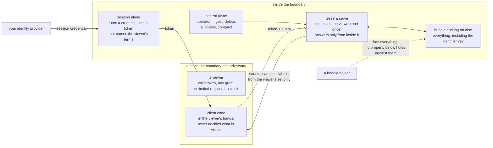

# Security

Every count, cluster, density figure and label Tessera serves is computed from inside the
requesting viewer's own authorised set, not filtered into that shape afterward. This chapter
states that guarantee in full: the adversary it is built against, the five properties that make it
up, how each is enforced, what is accepted rather than closed, and what is not claimed.

## The adversary and the boundary

Three parties reach the system, and the design treats them differently.

A viewer holds a session token: whatever credentials it presented at authorisation, and as many
requests as it likes against the resulting access. This is the adversary the properties below are
built against: someone who can hold any grant, ask anything, and read every response, but cannot
forge a credential or bypass the authorisation step itself. The evidence in this chapter, and the
register in particular, states what such a viewer can learn.

A bundle holder holds the built artifact on disk: the manifest, the per-deployment key, the full
term index and the geometry. None of the properties below defend against this party. Anyone with
the bundle already has the masks, the term index and the coordinates; the identifier scheme
described below adds nothing against them, and none is claimed.

An operator drives the control plane: ingest, deletion, suppression and compaction. The design
treats this party as trusted. The write path's own correctness against a trusted operator is that
chapter's subject rather than this one's.

A client (the TypeScript or Python library, or a component built on it) is not a trust boundary at
all. Every count, sample and label it receives has already been computed inside the principal's own
mask before it left the server. What a client can get wrong is truthful display, not disclosure;
that is covered in the clients chapter.

*What crosses each boundary. A viewer receives responses computed inside its own mask; an
operator's writes are trusted; a bundle holder already has everything the server has.*

## Every quantity is computed from the viewer's own set

A served quantity MUST be computed from inside the requesting viewer's authorised set alone. A
count, a density cell, a cluster's shape or a label taken over the whole corpus and then checked
against that set before display is a defect, not a filtered view.

An item carries a set of terms and a token satisfies a set of terms; an item is visible to a token
when the two sets intersect. The viewer's set is composed once per request, before anything reads
it, and everything that counts, draws or labels reads that one set. A filter narrows which of the
authorised items are drawn or counted and can never widen the set, so adding a filter cannot
introduce an access defect. The viewer's set is the only path to the geometry, and a build check
fails if any other path is added.

## A label is served only when its whole basis is visible

A label MUST be served only if every item it was built from is inside the requesting viewer's
authorised set. If one member is outside it, the label is withheld in full. The check runs on the
authorised set, never on a filtered one, so narrowing a query cannot make a withheld label appear,
and it runs on every request.

## Samples are taken after masking

Where more items are in view than a response carries, the sample MUST be drawn from the viewer's
own authorised set. A viewer with a narrow grant sees a sample of what they can see, never the
visible remainder of a sample taken over the whole corpus.

## A client never sees an entity id

Inside the server every item is addressed by an entity id: a dense integer assigned at ingest, in
order of the item's access terms, and the key under which its terms, memberships and labels are
stored. It is an implementation detail of the index, not a property of the data, and the index may
renumber it. An item's identity outside the server is the external id the operator supplied and the
`tessera_id` the client is given.

The entity id MUST NOT appear in anything a client can read. What it would disclose is small:
because ids are dense and ordered by access terms, a viewer holding a few could estimate a lower
bound on how many items they cannot see and how the visible ones group by access. No content is at
stake; content is protected by the first property, and no request accepts an entity id. The
`tessera_id` a client receives is a keyed permutation of the entity id, so that two of them reveal
nothing about whether their items are adjacent and a client cannot enumerate them. The permutation
is not cryptographic and, given what it hides, does not need to be.

## An incomplete answer is refused

A response that was not computed in full MUST be refused. It MUST NOT be returned as though it were
complete, and MUST NOT be returned as an empty result standing in for "not answered".

**Not built yet:** the design also states this rule for compartments, stores whose data must be
kept physically apart rather than masked: a compartment a token cannot reach contributes nothing,
and one the system cannot reach is an error rather than an empty contribution. A deployment has one
compartment today, so neither case can arise and neither rule has anything to test it.

## What this does not claim

| Not claimed | Why not |
|---|---|
| Cryptographic strength of the client-facing identifier | Not needed. The permutation hides a lower bound on the number of hidden items and their grouping by access, a low-severity channel. An adversary who recovered the key would be back at that channel and nothing more. |
| A defence against a bundle holder | Anyone holding the bundle has the key, the term index and the coordinates. None of the properties above are claimed against them. |
| Isolation of compartmented partitions | **Not built yet.** The design specifies physical separation for data that must be held apart. A deployment today has one store, so no isolation beyond masking is available. |
| Agreement between the two authorisation functions | See below. |
| Verification of what an operator declares | A vocabulary value, a layer's label or supplied artifact content that the operator declares visible is served as declared. The service cannot check provenance. |
| Closure of the timing channel | Accepted and unquantified; see the register. |
| Protection of data at rest | This chapter covers what a viewer can learn from responses. Data on disc has a different adversary and is covered where the storage is described. |
| The client as a trust boundary | The client never decides what is visible; every value it holds has already passed the server's mask. Its rules concern truthful display and are in the clients chapter. |
| Availability and denial of service | Outside this chapter. The serving chapter covers admission and load shedding. |

The caller supplies two functions: one derives terms from an item's access label, the other from a
viewer's credentials. Every property above rests on the two agreeing about what a term means, and
nothing checks that they do. The only plugin that exists passes strings through unchanged, so its
two functions cannot disagree; the check cannot exist until a plugin does whose functions could.

## Residual disclosure

Three channels let a viewer learn something beyond the items they are entitled to see. Each is
accepted rather than closed, for the reason given. The last column names the specification's
register rows each one covers, for a reader tracing a code from the specification or the
conformance suite.

| What a viewer can learn | How | Severity | Why it is accepted | Specification rows |
|---|---|---|---|---|
| Roughly how much of the corpus lies outside their own set, and that the corpus is being written to | Response time grows with the work a request does over rows the viewer cannot see, and a staleness flag on a response says something has changed since their last request | Low | Unquantified and open. No content reaches the viewer, and a viewer already knows how much of the corpus is theirs | C4, C14, C15, C19, C21, C24, C25, C26, C31 |
| When an item they once saw was deleted or suppressed, or when their own grant changed; and that another viewer is looking at the same item | A `tessera_id` is stable for the item's life, so a held one stops resolving at the moment of the change, and two viewers who compare identifiers can match them. An operator's external ids carry whatever structure the operator put in them | Medium | The price of an identifier a client can bookmark and share. Probing across a key rotation is closed: nothing lets a client vary the key | C6, C17, C20 |
| An upper bound on how many values a category has | Where an operator numbers a vocabulary's values densely, the largest code a viewer can see bounds the count | Low | The operator's own numbering; an owner ruling that set-size inference from it is not defended against | C22 |

The specification's register lists thirty-three channels. The others were considered and are
either closed (a filter's match count before intersection, relevance ranking,
vector neighbours, background term frequencies, node bounds and hull shapes, label existence) or
restate a quantity the viewer is already served (coarse density, drill-down relations, highlight
counts). They are not disclosures and are not repeated here.

## Evidence

| Property | How it is checked | What is not covered |
|---|---|---|
| Every quantity computed from the viewer's own set | Compared, value for value, against an independent second implementation across three planted states, over every served surface: tiles, the points batch and the density layer. The same property was probed manually against a running server across the request contract and the memory-safety surface beneath it, and no route past it was found | Served artifacts travel on their own frame and are not part of this comparison today |
| A label served only when its whole basis is visible | Compared against an independent implementation with two principals differing by exactly one item inside a label's basis, and the difference asserted before anything downstream rests on it | None |
| Samples taken after masking | Compared against an independent implementation with a wrong-shaped stand-in, a sample taken in storage order rather than from the authorised set, that the comparison is required to disagree with | None |
| A client never sees an entity id | Scanned across every wire surface, the sub-cell stream and the logs for a byte pattern matching the underlying identity, with a planted true positive on every scan confirming the scan itself works | None |
| An incomplete answer is refused | The built half is covered by tests around shared in-progress work and cancellation, though not by the differential test form the design describes | The two compartment rules have no test at all, for the reason stated above: nothing exists yet for either to apply to |

## Sources

`docs/design/architecture.md` §4, §6, Appendix C; `docs/design/conformance.md` §0, §4.6;
`docs/design/client-obligations.md`; decisions 0014, 0017, 0019, 0023, 0024, 0027, 0061, 0101;
`docs/evidence/memos/2026-08-14-access-control-redteam.md`.
