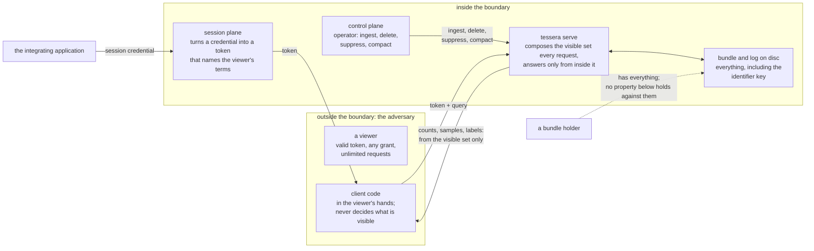

# Security

Every count, cluster, density figure and label Tessera serves is computed from inside the
requesting viewer's own visible set, not filtered into that shape afterward.

## The adversary and the boundary

A viewer holds a valid session token and can make as many requests with it as they like. This is
the adversary the properties below are built against: a legitimate user with any grant, who can
ask anything and read every response, but cannot forge a credential or bypass authorisation.

A viewer's token is worth exactly what the plugin behind it decides to grant. `POST
/session/authorise` takes a credential and returns a token, and an operator's own credential gates
who may call that route at all. The plugin's two functions, supplied by the operator, decide what
a presented credential is worth: the one implementation that exists today trusts a bare claim as
presented, so the session credential is the only thing standing between an untrusted caller and
read access to everything a term can name. The plugin runs inside the trusted computing base, and
its output is what every later check in this chapter tests against.

A token reflects the credential presented at authorisation and nothing later. If a viewer's grant
changes, an open token keeps its old terms until the viewer re-authorises; the only bound on how
long that can take is the deployment's configured token lifetime, or an explicit
`POST /session/revoke`.

A bundle holder holds the built artifact on disk: the manifest, the per-deployment key, the full
term index and the geometry. Nothing here defends against this party.

An operator drives the control plane: ingest, deletion, suppression and compaction. The design
treats this party as trusted, and every route on the control plane, without exception, requires
the operator's own credential.

Every cache that holds a viewer's visible set is keyed to one session and is never read by
another session.

A client (the TypeScript or Python library, or a component built on it) is not a trust boundary at
all. Every count, sample and label it receives has already been computed inside the viewer's own
visible set before it left the server. A bug in client code can only misdraw what the server
already sent it.

*What crosses each boundary. A viewer receives responses computed inside its own visible set; an
operator's writes are trusted; a bundle holder already has everything the server has.*

## Every quantity is computed from the viewer's own visible set

A served quantity MUST be computed from inside the requesting viewer's visible set alone. A count,
a density cell, a cluster's shape or a label taken over the whole corpus and then checked against
that set before display is a defect, not a filtered view.

An item carries a set of terms, and a token satisfies the set of terms its credential resolved to.
An item is in the authorised set when the two sets intersect, and the authorised set is built once
per session, at authorisation. The visible set is the authorised set minus the overlay, the record
of every item currently hidden by a deletion or a suppression, composed at the start of every
request, before anything reads it. Everything that counts, draws or labels an item reads that one
set. A filter narrows which of the visible set is drawn or counted into the filtered set, and can
never widen it, so adding a filter cannot introduce an access defect. The visible set is the only
path to the geometry: the geometry arrays have no other entry point, so no code path can build an
aggregate over rows the visible set excludes. Nothing checks this at build time; the guarantee
rests on the code's shape and on review.

A suppression applies to every request from the moment it is accepted, because the overlay is read
fresh each time the visible set is composed. A deletion's rows leave the corpus only at
compaction; until then they are removed from the visible set the same way a suppressed item's are.
The content key on a response is advisory: it lets a client tell that the corpus has changed since
its last request, but it carries no authorisation weight, and presenting an old one never restores
access a newer request would refuse.

## A derived artifact is served on the terms its layer declares

Labels and artifacts such as clusters, hulls and hierarchy levels are built from sets of items.
Whether a viewer is served one is decided per request, over the viewer's own visible set, on two
axes the layer declares:

- **An access label of its own.** A layer, or an artifact within it, can carry an access label
  like an item, and is then visible only to viewers whose terms satisfy it.
- **A membership requirement.** How much of the artifact's member set the viewer must be able to
  see: all of it, any of it, a fraction, a count, or none. "All" withholds a label if a single
  member is hidden. "None" serves the artifact to every viewer the access label admits: that is
  right for a boundary that exists whether or not this viewer can see a document inside it.

Both tests MUST run on the visible set, never on the filtered set, so narrowing a query cannot make
a withheld artifact appear. A count or a hull served with an artifact is computed over the members
the viewer can see.

## Samples are taken after masking

Where more items are in view than a response carries, the sample MUST be drawn from the viewer's
own visible set. A viewer with a narrow grant sees a sample of what they can see, never a sample
taken over the whole corpus with the hidden points removed.

## A client never sees an entity id

Inside the server every item is addressed by an entity id: a dense integer assigned at ingest, and
the key under which its terms, memberships and labels are stored. It is an implementation detail
of the index, not a property of the data, and the index may renumber it. An item's identity outside
the server is the external id the operator supplied and the `tessera_id` the client is given.

The entity id MUST NOT appear in anything a client can read. What it would disclose is small.
Entity ids are dense and, within one ingest batch, ordered by access terms, so a viewer holding a
few could estimate a lower bound on how many items they cannot see and how the ones they can see
group by access. No content is at stake: content is protected by the first property.

The `tessera_id` a client receives is a keyed permutation of the entity id, so two of them reveal
nothing about whether their items are adjacent. No request accepts an entity id, so a client cannot
enumerate them by trying values. The permutation is not cryptographic, and it should not be assumed
to resist a viewer who has obtained known pairs of an entity id and its `tessera_id`; no route on
the viewer plane yields one, so what the permutation hides does not depend on cryptographic
strength.

## An incomplete answer is refused

A response MUST NOT be returned in a form that looks complete when it is not, and MUST NOT be
returned as an empty result standing in for "not answered". Where a response streams, a connection
that drops, or a fault that cuts the stream mid-transfer, leaves the client holding a prefix of its
own response. That is allowed: the missing trailer frame makes the prefix detectable as incomplete
rather than mistakable for a complete answer. What the rule forbids is a partial answer a client
cannot tell from a complete one.

## Residual disclosure

Five channels let a viewer learn something beyond the items they are entitled to see, past what
the properties above bound. Each row states its own status: most channels are accepted for the
reason given, and one, the per-tile timing channel, remains open.

| What a viewer can learn | How | Severity | Why | Specification rows |
|---|---|---|---|---|
| Roughly how much of the corpus lies outside their own set; that a token, keyword or category value they can name exists somewhere in the corpus, and coarsely how widely; and that the corpus is being written to | Response time for a viewport, a filter or a category listing grows with the work a request does over rows and terms the viewer cannot see, not only their own. A changed content key on a response says the corpus has changed since the viewer's last request | Low | Only the per-tile timing component of this row is open and unquantified: correlating cost with the viewer's own visible count leaves a residual nobody has bounded. A response's cost also varies with how many artifacts in view were withheld by their own label or their membership requirement, since each is found before it is tested, and the identifier route does more work for a withheld artifact than for an identifier naming nothing; a viewer needs an artifact's `tessera_id` to probe the second, and is never served one for an artifact withheld from them. Every other component (the category, text and suggestion timing variants, and the content key itself) is bounded to a quantity the viewer already possesses or is about to receive, and is accepted on that basis. A finer per-term version of the content key, and a timing channel over how many partitions a token reaches, are specified but not built: a deployment holds one partition today and nothing finer than the coarse content key reaches the wire | C4, C14, C15, C19, C21, C24, C25, C26, C31 |
| When an item they once saw was deleted or suppressed; and, by comparing `tessera_id`s out of band, that two viewers are looking at the same item | A `tessera_id` is stable for the item's life, so a held one stops resolving on the viewer's next request after the change. Two viewers who compare `tessera_id`s for items they can each see can tell they name the same item. An operator's external ids carry whatever structure the operator put in them | Medium | The price of a `tessera_id` a client can bookmark and share. Probing across a key rotation is closed: nothing lets a client vary the key | C6, C17 |
| A lower bound on how many values a category has | Where an operator numbers a vocabulary's values densely, the largest code a viewer can see bounds the count from below | Low | The operator's own numbering; an owner ruling that set-size inference from it is not defended against | C22 |
| That their visible items in a region group together, a fact about structure that includes unseen items | A minimum-visible-count threshold a layer declares bounds how finely a grouping's presence is exposed against the viewer's own visible set, and filtering cannot deepen it | Low | The threshold decides whether a grouping's existence is announced, not whether its count is protected: a viewport and the density layer already serve exact masked counts over any region a viewer can name, whatever threshold a layer declares | C1 |
| That an item they were never entitled to see has been deleted, when a permissive annotation layer's membership set loses it | Under a layer declared permissive, content generated from a deleted item keeps serving until compaction removes the deleted member from the generating set. At that point the content stops serving for every viewer who satisfies the surviving members, including one who never satisfied the original generating set, telling them an item they were never entitled to see has been deleted | Medium | Bounded by the caller's own declaration: strict is the default and never shrinks, so an undeclared layer never signals this. Permissive is a caller's choice for a set where losing one member changes nothing the content asserts | C7 |

A caller-declared quantity the service serves as declared, rather than a viewer's own inference, is
not a residual channel and does not appear above: a caller-declared generating set, an authored
gate label on a vocabulary value, an artifact layer's own access label, and a caller's
membership-requirement declaration are covered under what this does not claim, below.

## What this does not claim

| Not claimed | Why not |
|---|---|
| Cryptographic strength of the `tessera_id` | Not needed. The permutation hides a lower bound on the number of hidden items and their grouping by access, a low-severity channel. An adversary who recovered the key would be back at that channel and nothing more. |
| A defence against a bundle holder | Anyone holding the bundle has the key, the term index and the coordinates. None of the properties above are claimed against them. |
| Isolation of partitions | **Not built yet.** The design specifies that a partition a token cannot reach must contribute nothing to an answer, and a partition the system cannot reach through failure must be treated as an error rather than an empty contribution. A deployment today has one partition, so neither case can arise, and neither rule has anything to test it. |
| Agreement between the two authorisation functions | Nothing checks that the function deriving terms from an item's access label and the one deriving terms from a viewer's credentials agree about what a term means. The only plugin that exists passes strings through unchanged, so they cannot disagree; a check needs a plugin whose functions could. |
| Verification of what an operator declares | A vocabulary value, a layer's or an artifact's own access label, or supplied artifact content that the operator declares visible is served as declared. The service cannot check provenance. An item with no access label of its own is visible to nobody unless the declaration names a default label, in which case an unlabelled item is treated as if it carried that label and nothing wider. |
| Quantification of the timing channel | Open in the register: correlating a tile's service time with the viewer's own visible count leaves a residual nobody has quantified, so it is recorded rather than closed. |
| Protection of data at rest | This chapter covers what a viewer can learn from responses. Data on disc has a different adversary. |
| The client as a trust boundary | The client never decides what is visible; every value it holds has already been computed inside the visible set. Its rules concern truthful display. |

## Evidence

| Property | How it is checked | What is not covered |
|---|---|---|
| Every quantity computed from the viewer's own visible set | Compared, value for value, against an independent second implementation across three planted states, over the three surfaces the comparison covers: tiles, the points batch and the density layer's masked per-cell counts. The same property was probed manually against a running server across the request contract and the memory-safety surface beneath it, and no route past it was found | Served artifacts travel on their own frame and are not part of this comparison. Both the differential and the manual assessment ran only against the plugin that passes credentials through unchanged; no route has been checked against a plugin whose two functions could disagree |
| A derived artifact served on the terms its layer declares | Compared against an independent implementation with two viewers differing by exactly one item inside an artifact's member set, under the strictest requirement, and the difference asserted before anything downstream rests on it. An artifact's own label is compared against an independent implementation over a built bundle and a service the artifacts were published into, across a restart and a fold; and a viewer lacking a label is shown to get byte-identical answers, on every viewer route, from a deployment holding the artifact and one that never published it | The other membership requirements are covered by Rust tests rather than the differential suite |
| Samples taken after masking | Compared against an independent implementation with a wrong-shaped stand-in, a sample taken in storage order rather than from the visible set, that the comparison is required to disagree with | None |
| A client never sees an entity id | Scanned across every wire surface, including the density layer's sub-cell counts, and the logs, for a byte pattern matching the underlying identity, with a planted true positive on every scan confirming the scan itself works | None |
| An incomplete answer is refused | The built half is covered by tests around shared in-progress work and cancellation, though not by the differential test form the design describes | The two partition rules have no test at all: a deployment has one partition, so neither can be exercised |

## Sources

`docs/design/architecture.md` §4, §6, Appendix C; `docs/design/conformance.md` §0, §4.6;
`docs/design/client-obligations.md`; `docs/design/contracts.md` §3.1; `docs/design/configuration.md`;
decisions 0014, 0017, 0019, 0023, 0024, 0027, 0061, 0101;
`docs/evidence/memos/2026-08-14-access-control-redteam.md`.
